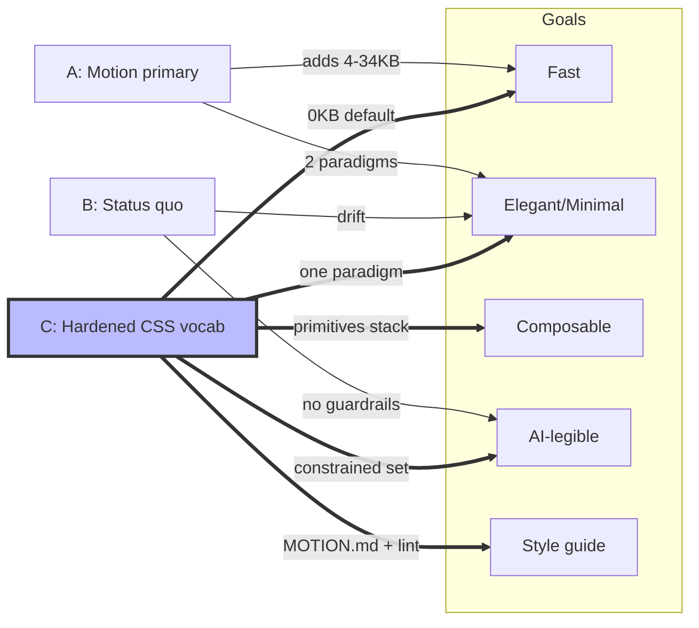
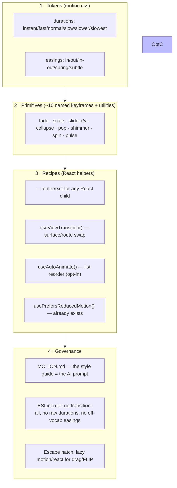
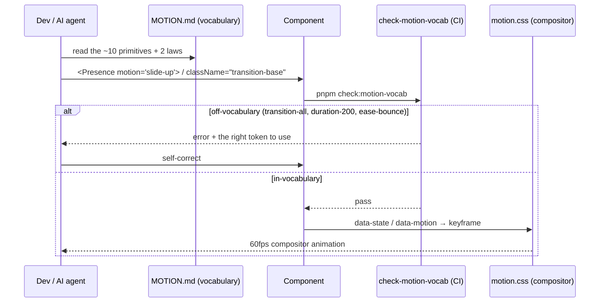
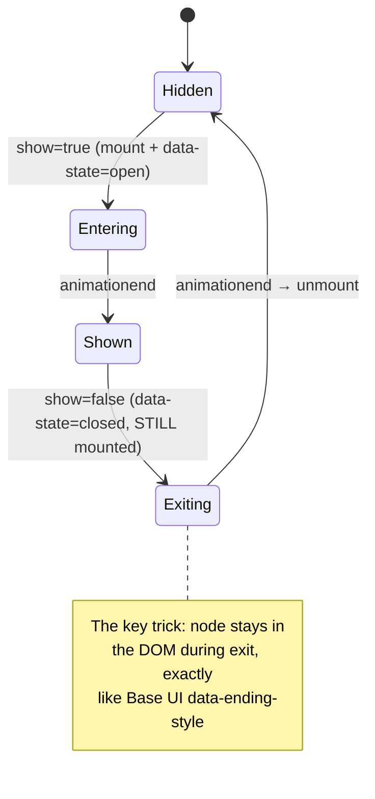

# Elegant, Composable Motion System — A Constrained, AI‑Legible Animation Vocabulary

## Problem Statement

We want more animation throughout the xNet UI, but every adjective in the
ask is a constraint:

- **Super fast** — motion must never make the product *feel* slower. Sub‑200ms
  for anything interactive; compositor‑only properties; no jank.
- **Super clean / elegant / minimal** — a coherent house style, not a zoo of
  bespoke effects. Restraint is the aesthetic.
- **Compose really well** — primitives that stack (enter + stagger, hover +
  press) without fighting each other or re‑implementing the same easing.
- **Easy for AI to write** — an LLM (and the BYO‑agent bridge that now drives
  this repo, see `0194`) should reach for the *same* small vocabulary every
  time, and be unable to spell a wrong animation.
- **Consistent style guide** — one source of truth for durations, easings, and
  named motions, enforced rather than merely documented.

The danger is the opposite of "no animations": **animation drift** — every
component inventing its own `transition-all duration-200`, each editor package
redefining its own keyframes, AI sprinkling `ease-bounce` where `ease-out`
belongs. Drift is what makes a UI feel cheap and slow. This exploration asks
how to get *more* motion while getting *more* consistency at the same time.

## Executive Summary

**We are ~80% there at the token layer and ~20% there at the discipline layer.**
`@xnetjs/ui` already ships a genuinely good CSS‑first motion system —
`packages/ui/src/theme/motion.css` defines six easings, a six‑stop duration
scale, fourteen keyframes, and reduced‑motion handling; `base-ui-animations.css`
wires enter/exit to Base UI's `data-open` / `data-ending-style` attributes; the
Tailwind config maps all of it to utilities. There is **no external animation
library** and we don't need one for 95% of the UI.

The gap is **not capability, it's consistency and reach**:

1. **Drift is already happening.** `packages/editor/tailwind.config.js`
   redefines its *own* `menu-appear` keyframe with a raw `150ms ease-out`
   instead of the shared tokens. Across the web app there are **307
   `transition-colors`, 26 `transition-all`** (a compositor footgun), and raw
   `duration-200` literals living next to `duration-normal` tokens.
2. **No coverage for React mount/unmount outside Base UI.** Toasts, tab
   add/remove, explorer list reorder, and surface/route swaps animate
   inconsistently or not at all, because the elegant `data-ending-style`
   trick only exists *inside* Base UI components.
3. **Nothing makes AI emit the right thing.** The tokens exist but are
   optional. There is no lint rule, no `<Motion>`/preset layer, and no
   one‑page style guide an agent can load.

**Recommendation:** Don't add Motion/Framer by default. Instead, **harden the
existing CSS‑first system into a single canonical "motion vocabulary"** —
(a) freeze a small token set + ~10 named primitives, (b) add a thin React
`<Presence>` helper and a `useViewTransition()` wrapper to extend the
`data-ending-style` elegance to *all* React mount/unmount and surface swaps,
(c) write a `MOTION.md` style guide that doubles as the AI prompt, and
(d) enforce it with an ESLint rule that bans `transition-all`, raw duration
literals, and off‑vocabulary easings. Keep `motion/react` (LazyMotion + `m`,
~4.6KB shell) as a **lazy‑loaded escape hatch** for the rare drag/FLIP case,
never on the default path.

This is cheaper, faster at runtime, smaller in the bundle, and *more*
AI‑legible than adopting a JS animation library — because a constrained
vocabulary is exactly what both designers and LLMs need.

---

## Current State In The Repository

### The foundation that already exists (and is good)

| Layer | File | What it provides |
|---|---|---|
| Tokens + keyframes | `packages/ui/src/theme/motion.css` | 6 easings, 6 durations, 14 keyframes, 5 transition utilities, reduced‑motion blanket |
| Base UI enter/exit | `packages/ui/src/theme/base-ui-animations.css` | `data-open` / `data-ending-style` driven dialog, popover, tooltip, menu, select, accordion, collapsible, switch, checkbox |
| Utility mapping | `packages/ui/tailwind.config.js` | `transitionTimingFunction`, `transitionDuration`, `keyframes`, `animation` all mapped to CSS vars; `tailwindcss-animate` plugin |
| JS hook | `packages/ui/src/hooks/useMediaQuery.ts:103` | `usePrefersReducedMotion()` (exported from `packages/ui/src/index.ts:363`) |
| Global wiring | `apps/web/src/styles/globals.css` | imports `@xnetjs/ui/motion.css`, `base-ui-animations.css`, `responsive.css` |

The token scale, verbatim from `motion.css`:

```css
/* easings */
--ease-in:     cubic-bezier(0.4, 0, 1, 1);
--ease-out:    cubic-bezier(0, 0, 0.2, 1);
--ease-in-out: cubic-bezier(0.4, 0, 0.2, 1);
--ease-spring: cubic-bezier(0.34, 1.56, 0.64, 1);   /* overshoot */
--ease-bounce: cubic-bezier(0.68, -0.55, 0.265, 1.55); /* anticipate + overshoot */
--ease-subtle: cubic-bezier(0.25, 0.1, 0.25, 1);

/* durations */
--duration-instant: 0ms;
--duration-fast:    100ms;  /* micro / exit */
--duration-normal:  150ms;  /* standard enter */
--duration-slow:    200ms;  /* emphasis enter */
--duration-slower:  300ms;
--duration-slowest: 400ms;
```

The Base UI enter/exit pattern — the elegant bit worth generalizing — looks
like this (`base-ui-animations.css:24‑43`):

```css
.dialog-popup            { opacity: 0; transform: scale(0.95);
                           transition: opacity   var(--duration-normal) var(--ease-out),
                                       transform var(--duration-normal) var(--ease-out); }
.dialog-popup[data-open]            { opacity: 1; transform: scale(1); }
.dialog-popup[data-ending-style]    { opacity: 0; transform: scale(0.95);
                                       transition: …var(--duration-fast) var(--ease-in); }
```

Note the *house style* already encoded here: **enter is slower + ease‑out,
exit is faster + ease‑in.** That is the correct cross‑industry default
(Material, Atlassian, Carbon all agree) and we should make it law.

### Where it's actually used

```
transition-colors    307   ← overwhelmingly the most common
transition-opacity     41
transition-all         26   ← footgun: animates layout props too
transition-transform   17
transition-base         6   ← the shared utility, barely adopted
animate-spin           23
animate-pulse          20
animate-in              5   ← tailwindcss-animate, ad-hoc
animate-menu-appear     3   ← DRIFT: editor's own keyframe
```

51 files in `apps/web/src` touch motion classes. The system is *reached for*
constantly — which is exactly why drift compounds.

### The drift, concretely

- **Editor redefines its own motion.** `packages/editor/tailwind.config.js:44`
  defines a private `menu-appear` keyframe and `:56` maps it as
  `menu-appear 150ms ease-out forwards` — a hardcoded duration and a *raw*
  `ease-out` keyword (not `var(--ease-out)`), used by `SlashMenu`,
  `TaskMentionMenu`, `LinkTargetMenu`. Same intent as `.menu-popup` in the
  shared system, reimplemented and subtly off‑spec.
- **`transition-all` × 26.** Animates `width`/`height`/`top`/`left` whenever
  they change — the D‑tier layout‑thrashing properties — instead of the
  compositor‑only `transform`/`opacity`.
- **Raw duration literals.** `duration-200` (a Tailwind default) appears
  alongside `duration-normal` (our token). They're *different values*
  (200ms vs 150ms), so the same "standard transition" renders at two speeds.
- **Two reduced‑motion strategies.** `motion.css:273` nukes *all* animation
  with `!important` (including harmless opacity), while
  `base-ui-animations.css:178` does a more surgical per‑component reset. The
  blanket version is a sledgehammer that also kills tasteful, vestibular‑safe
  fades.

### Surfaces that want motion but lack it

From the component inventory (real paths):

| Surface | File | Wants |
|---|---|---|
| Tab add/remove/reorder | `apps/web/src/workbench/TabBar.tsx` | enter/exit + FLIP reorder |
| Explorer list reflow | `apps/web/src/workbench/views/Explorer.tsx` | reorder on sort change |
| Folder expand/collapse | `apps/web/src/workbench/views/ExplorerFolderTree.tsx` | height + chevron (has chevron only) |
| Undo toast | `apps/web/src/components/UndoToast.tsx` | enter/exit (currently pops in, no exit) |
| Storage banner | `apps/web/src/components/StorageWarningBanner.tsx` | slide‑down enter/exit |
| Surface swap | `apps/web/src/workbench/EditorArea.tsx` | cross‑fade between CRM/finance/tasks |
| Rail active indicator | `apps/web/src/workbench/Rail.tsx` | indicator slide (has color only) |
| Mobile sheets | `apps/web/src/workbench/MobileShell.tsx` | already via `Sheet` (good) |

Every one of these is a *React mount/unmount or list mutation* — precisely the
two cases the current CSS‑only system can't reach, because nothing keeps the
exiting node in the DOM long enough to play `data-ending-style`.

---

## External Research

### The library landscape (and why we mostly skip it)

| Library | Bundle (min+gz) | Exit anim | Layout/FLIP | Engine | Verdict for us |
|---|---|---|---|---|---|
| **CSS‑first** (our stack) | **0 KB** | via `data-ending-style` + `@starting-style` | manual / View Transitions | compositor | **Default** |
| Motion `m` + LazyMotion | 4.6 KB shell (+15 `domAnimation` / +25 `domMax`) | `AnimatePresence` | `layout` prop | WAAPI (compositor) | **Lazy escape hatch** |
| Motion full `motion/react` | ~34 KB | yes | yes | WAAPI | Too heavy for default |
| React Spring | ~18 KB | `useTransition` | manual | rAF | No |
| `@formkit/auto-animate` | **3.3 KB** | limited | auto (MutationObserver) | CSS | **Maybe** for lists |
| react-transition-group | ~5 KB | yes | no | CSS classes | Unmaintained, skip |

Key sources: Motion bundle‑size docs (`motion.dev/docs/react-reduce-bundle-size`),
`motion.dev/docs/react-lazy-motion`, `npmjs.com/package/@formkit/auto-animate`.

The renaming note: **Framer Motion → `motion`** (package `motion`, import
`motion/react`) as of late 2024. The tree‑shakeable path is `motion/react-m`
with a `<LazyMotion features={domAnimation}>` wrapper — a 4.6KB shell that
loads features on demand. This is the *only* JS option worth keeping in reserve.

### CSS has quietly become enough (2026 baseline)

The reason "no library" is now viable is that the browser caught up:

- **`@starting-style`** — defines the *from* state so transitions fire on first
  mount. Baseline Newly Available (Chrome 117+, Firefox 129+, Safari 17.5+).
  This is the native answer to "animate something appearing."
- **`transition-behavior: allow-discrete`** — lets `display`/`overlay`
  transition, so an element can fade out *and then* `display:none`. Same
  baseline. Together with `@starting-style` this gives **CSS‑only enter *and*
  exit without keeping a JS library resident.**
- **View Transitions API** — `document.startViewTransition(cb)` cross‑fades a
  DOM mutation; `view-transition-name` animates shared elements between states.
  Same‑document is Baseline (Chrome, Safari 18+, Firefox in progress). This is
  the clean answer to surface/route swaps in `EditorArea.tsx`.
- **Scroll‑driven animations** (`animation-timeline: scroll()/view()`) —
  Chrome/Edge only as of 2026, *not* baseline. Treat as progressive
  enhancement, never a dependency.

Sources: `web.dev/blog/baseline-entry-animations`,
`developer.chrome.com/blog/entry-exit-animations`, MDN `@starting-style`,
MDN `transition-behavior`, MDN View Transition API.

Our build targets (from `apps/web/vite.config.ts`: Safari 16.4+, Chrome 102+,
Firefox 111+) are *slightly* below the `@starting-style` baseline. So
`@starting-style` is a **progressive enhancement** (the element simply appears
without the enter tween on the oldest engines) — acceptable, because the
fallback is "no animation," never "broken."

### How the design systems standardize motion

There is remarkable cross‑industry agreement, which is the empirical backbone
for a constrained vocabulary:

| System | Micro | Standard enter/exit | Large/panel | Enter ease | Exit ease |
|---|---|---|---|---|---|
| Material 3 | 50–200ms | 200–300ms | 350–500ms | emphasized‑decelerate | emphasized‑accelerate |
| Atlassian | 50–150ms | 150–400ms | — | ease‑out bold | ease‑in practical |
| Carbon | (dynamic) | standard | (dynamic) | `0,0,0.25,1` | `0.25,0,1,1` |
| Apple HIG | — | spring (bounce ≤ 0.15) | spring | spring | spring |
| **xNet today** | **100ms** | **150ms enter / 100ms exit** | **200ms** | ease‑out | ease‑in |

Our existing scale already sits inside the consensus band — it just isn't
enforced. Two cross‑system rules we should adopt as law:

1. **Enter slow + decelerate (ease‑out); exit fast + accelerate (ease‑in).**
2. **Springs only for direct‑manipulation feedback** (toggle thumb, drag
   pickup), never for ambient enters — Apple's guidance and the reason our
   `--ease-spring` is currently (correctly) used only on `switch-thumb` and
   `checkbox-indicator`.

Sources: `m3.material.io/styles/motion/easing-and-duration/tokens-specs`,
`atlassian.design/foundations/motion`,
`carbondesignsystem.com/elements/motion/overview/`,
`developer.apple.com/design/human-interface-guidelines/motion`.

### Performance tiers (the "super fast" constraint, made concrete)

Motion's performance tier list and the FLIP literature converge on:

- **S‑tier (compositor, GPU):** `transform`, `opacity`, `filter`, `clip-path` —
  animate these and *only* these for 60fps under main‑thread load.
- **C‑tier (paint):** `background-color`, `color`, `box-shadow` — fine for
  short hovers, our 307 `transition-colors` are mostly OK.
- **D‑tier (layout):** `width`, `height`, `top/left`, `margin` — the
  `transition-all` trap. Use FLIP (animate a `transform` that *fakes* the
  layout change) instead.

Sources: `motion.dev/magazine/web-animation-performance-tier-list`,
`css-tricks.com/animating-layouts-with-the-flip-technique/`.

### AI‑legible motion is a real, named idea

This isn't hypothetical. Motion shipped an **AI Kit** (`motion.dev/docs/ai-kit`)
with an MCP server exposing motion docs + a "generate a CSS spring" tool that
emits a `linear()` easing usable with *zero* runtime. Smashing Magazine's
**"Keyframes as Tokens"** (Nov 2025) proposes a `kf-` keyframe‑token convention
with CSS‑variable knobs (`--kf-slide-from`) so one keyframe covers all
directions. The throughline: **LLMs are reliable when the vocabulary is small,
named, and declarative.** A constrained token set isn't a limitation for AI —
it's the enabling condition.

Sources: `motion.dev/docs/ai-kit`,
`smashingmagazine.com/2025/11/keyframes-tokens-standardizing-animation-across-projects/`.

---

## Key Findings

1. **The expensive part is already built.** Tokens, keyframes, Base UI
   enter/exit, reduced‑motion, and Tailwind mapping all exist and are sound.
   Adopting a JS library would *duplicate* this and add 4–34KB.
2. **The cheap part is missing: discipline + reach.** No enforcement → drift
   (editor's private keyframe, `transition-all`, raw `duration-200`). No
   React‑mount coverage → toasts/tabs/lists/surfaces animate ad‑hoc or not at
   all.
3. **A constrained vocabulary serves both "elegant" and "AI‑friendly"
   simultaneously.** The same restraint that makes a UI feel designed makes an
   LLM reliable. These goals are not in tension — they're the same goal.
4. **CSS in 2026 covers our needs natively.** `@starting-style` +
   `allow-discrete` + View Transitions handle enter/exit/route. JS is only
   needed for drag and complex FLIP — a small minority.
5. **Our house style is already implicitly correct** (enter‑slow‑out,
   exit‑fast‑in). We just need to *name it, document it, and enforce it.*

---

## Options And Tradeoffs

### Option A — Adopt Motion (`motion/react`) as the primary system

Rewrite animated components with `<motion.div>`, `AnimatePresence`, `layout`.

- **+** Best‑in‑class exit + FLIP + orchestration; variants are very AI‑legible.
- **+** Solves tab reorder / list FLIP for free.
- **−** 4.6–34KB added; a second motion paradigm coexisting with the CSS system
  → *more* drift, not less. Throws away the existing investment. JS on the
  animation hot path. Overkill for 95% of our fades/slides.

### Option B — Status quo + ad‑hoc fixes

Keep adding `transition-*` classes per component as needed.

- **+** Zero upfront work.
- **−** Drift compounds; "consistent style guide" never happens; AI keeps
  guessing. This is the path that produces a cheap‑feeling UI.

### Option C — Harden the CSS‑first system into an enforced vocabulary ✅

Freeze a minimal token set + named primitives; add a thin React `<Presence>`
and `useViewTransition()` to extend `data-ending-style` elegance to all React
mount/unmount and surface swaps; write `MOTION.md`; enforce with ESLint. Keep
`motion/react` lazy as an escape hatch.

- **+** Builds on the 80% already shipped; ~0KB on the default path; one
  paradigm; *fixes* drift; produces the demanded style guide; maximally
  AI‑legible; native + future‑proof.
- **−** Requires writing the lint rule and the `<Presence>` helper; team must
  accept constraint (the point). FLIP/drag still needs the escape hatch.

### Option D — `@formkit/auto-animate` for lists only

Add the 3.3KB hook to Explorer/TabBar for automatic reorder.

- **+** Tiny; one‑liner (`useAutoAnimate()`); solves the one thing CSS can't
  (list reorder) without full Motion.
- **−** MutationObserver‑driven (less control); overlap glitches on remove;
  needs SSR guard. **Best treated as a sub‑decision *inside* Option C**, not a
  strategy on its own.

### Comparison



---

## Recommendation

**Adopt Option C: harden the existing CSS‑first system into a single,
enforced, AI‑legible motion vocabulary, with `motion/react` reserved as a
lazy‑loaded escape hatch and `auto-animate` as an optional list‑reorder
sub‑tool.**

### The architecture in four layers



### The frozen vocabulary (what AI is allowed to emit)

A deliberately tiny set. The rule for the agent: *"Compose from this list. If
you can't, you're probably over‑animating."*

**Durations** (keep the existing 6, but bless 3 as the everyday set):
`fast` (100ms, hover/press/exit) · `normal` (150ms, standard enter) ·
`slow` (200ms, panels/dialogs). `instant`/`slower`/`slowest` exist for edge
cases.

**Easings** (4 + 1): `ease-out` (enter) · `ease-in` (exit) · `ease-in-out`
(move/morph) · `ease-spring` (direct‑manipulation only) · `linear` (loops).
**Retire `--ease-bounce`** — its negative `-0.55` anticipation is the opposite
of minimal; no component uses it.

**Primitives** (~10, all compositor‑only): `fade` · `scale` (0.95→1) ·
`slide-up/down/left/right` (8–16px) · `collapse` (height) · `pop` (scale +
spring) · `shimmer` · `spin` · `pulse-subtle`.

**The two laws:** enter = slower + `ease-out`; exit = faster + `ease-in`.

### Why this satisfies every adjective

- **Fast** — compositor‑only primitives; ≤200ms; 0KB on the default path.
- **Clean/elegant/minimal** — one house style; `ease-bounce` retired;
  `transition-all` banned by lint.
- **Composable** — primitives are independent `transform`/`opacity` channels +
  a parent‑driven stagger; `<Presence>` wraps any of them.
- **AI‑easy** — `MOTION.md` is short enough to paste into a system prompt; the
  lint rule turns "wrong animation" into a build error the agent self‑corrects.
- **Consistent style guide** — `MOTION.md` + the lint rule *are* the style
  guide, and they're enforced, not aspirational.

---

## Example Code

### 1. The `<Presence>` helper — extend `data-ending-style` to any React child

The elegant trick in `base-ui-animations.css` is that Base UI keeps the node
mounted and flips `data-ending-style` before unmounting. We generalize that to
*any* React conditional with a ~40‑line hook + a CSS‑variable‑driven keyframe.
No library.

```tsx
// packages/ui/src/motion/Presence.tsx (sketch — see the file for the shipped version)
import { useEffect, useRef, useState } from 'react'
import { cn } from '../utils'

type MotionName = 'fade' | 'scale' | 'slide-up' | 'slide-down' | 'pop'

export function Presence({
  show,
  motion = 'fade',
  children,
  className,
}: {
  show: boolean
  motion?: MotionName
  children: React.ReactNode
  className?: string
}) {
  const [mounted, setMounted] = useState(show)
  const ref = useRef<HTMLDivElement>(null)

  useEffect(() => {
    if (show) setMounted(true)
  }, [show])

  // When hiding, wait for the exit animation to finish before unmount.
  const onAnimationEnd = () => {
    if (!show) setMounted(false)
  }

  if (!mounted) return null
  return (
    <div
      ref={ref}
      data-motion={motion}
      data-state={show ? 'open' : 'closed'}
      onAnimationEnd={onAnimationEnd}
      className={cn('motion-presence', className)}
    >
      {children}
    </div>
  )
}
```

```css
/* packages/ui/src/theme/motion.css — the matching CSS, fully token-driven */
.motion-presence[data-state='open'][data-motion='fade']   { animation: fade-in   var(--duration-normal) var(--ease-out); }
.motion-presence[data-state='closed'][data-motion='fade']  { animation: fade-out  var(--duration-fast)   var(--ease-in); }
.motion-presence[data-state='open'][data-motion='scale']  { animation: scale-in  var(--duration-normal) var(--ease-out); }
.motion-presence[data-state='closed'][data-motion='scale'] { animation: scale-out var(--duration-fast)   var(--ease-in); }
/* slide-up / slide-down / pop follow the same two-line pattern */
```

Usage — fixes `UndoToast.tsx` (which currently has no exit) in one line:

```tsx
<Presence show={toast != null} motion="slide-up">
  <UndoToastBody …/>
</Presence>
```

### 2. `useViewTransition()` — clean surface/route swaps in `EditorArea.tsx`

```tsx
// packages/ui/src/motion/useViewTransition.ts
export function useViewTransition() {
  const reduced = usePrefersReducedMotion()
  return (mutate: () => void) => {
    if (reduced || !('startViewTransition' in document)) return mutate() // graceful fallback
    document.startViewTransition(mutate)
  }
}
```

```tsx
// EditorArea.tsx — cross-fade when switching CRM ↔ finance ↔ tasks
const withTransition = useViewTransition()
const switchSurface = (next: SurfaceId) => withTransition(() => setSurface(next))
```

`::view-transition-old/new` get their default cross‑fade for free; opt specific
elements into shared‑element motion with `view-transition-name`.

### 3. Stagger — composition without a library (one CSS var)

```css
/* a list whose children fade-slide in sequence */
.stagger > * {
  animation: slide-in-bottom var(--duration-slow) var(--ease-out) both;
  animation-delay: calc(var(--i, 0) * 40ms);
}
```

```tsx
{items.map((item, i) => (
  <li key={item.id} style={{ '--i': i } as CSSProperties}>{item.label}</li>
))}
```

### 4. The ESLint guardrail (the enforcement that prevents drift)

```js
// eslint rule sketch: no-offvocab-motion
const BANNED = [
  { re: /\btransition-all\b/,        msg: 'Use transition-base / -transform / -colors-fast (compositor-only).' },
  { re: /\bduration-(75|100|150|200|300|500|700|1000)\b/, msg: 'Use duration tokens: fast/normal/slow.' },
  { re: /\bease-bounce\b/,           msg: 'ease-bounce is retired. Use ease-out, or ease-spring for direct manipulation.' },
  { re: /\banimate-\[/,              msg: 'No arbitrary keyframes. Add a named primitive to motion.css instead.' },
]
// flag string literals in className that match BANNED
```

### 5. The escape hatch — lazy, never on the default path

```tsx
// Only loaded for the rare drag/FLIP screen, code-split so the base bundle stays 0KB heavier.
const DragCanvas = lazy(() => import('./DragCanvas')) // internally imports motion/react-m + LazyMotion
```

### How a request flows once the system exists



### Enter/exit lifecycle (what `<Presence>` automates)



---

## Risks And Open Questions

- **`@starting-style` is below our oldest build target** (Safari 16.4 vs 17.5
  baseline). Mitigation: it degrades to "appears without enter tween," never
  breaks. The `<Presence>` helper sidesteps this by using JS‑driven `mount`
  state + a normal keyframe, so it works everywhere; reserve `@starting-style`
  for pure‑CSS cases where the fallback is acceptable.
- **View Transitions in Firefox** is still in progress in 2026.
  `useViewTransition()` already feature‑detects and falls back to an instant
  swap — correct behavior, just no cross‑fade on older Firefox.
- **Lint false positives.** Banning `transition-all` may flag legitimate one‑off
  cases. Mitigation: allow an `// eslint-disable-next-line` with a required
  justification comment; track exceptions.
- **Reduced‑motion double‑handling.** We have both a blanket `!important` reset
  (`motion.css:273`) and surgical resets. Decide: keep the blanket as a safety
  net but *narrow* it to spatial/transform motion, preserving tasteful opacity
  fades (which are vestibular‑safe). Open question: does the team want
  "reduce" to mean "no motion" or "no *large spatial* motion"? Industry
  consensus is the latter.
- **`auto-animate` vs manual FLIP for lists.** Do we want the 3.3KB dependency
  for Explorer/TabBar reorder, or a hand‑rolled FLIP hook? Recommend starting
  manual (View Transitions can even handle simple reorders), add `auto-animate`
  only if reorder UX demands it.
- **Editor package alignment.** `packages/editor/tailwind.config.js` must drop
  its private `menu-appear` and consume the shared `.menu-popup` /
  `scale-in` vocabulary — a small but symbolically important de‑drift.
- **Does motion belong in `@xnetjs/ui` or a new `@xnetjs/motion`?** Tokens +
  `<Presence>` + `useViewTransition` are tiny and UI‑coupled; recommend a
  `packages/ui/src/motion/` subfolder, not a new package, to avoid the
  workspace‑package CI overhead noted in prior explorations.

---

## Implementation Checklist

- [x] **Freeze the vocabulary.** In `packages/ui/src/theme/motion.css`, add a
  header comment declaring the canonical set (3 everyday durations, 4+1
  easings, ~10 primitives, the two laws). Retire `--ease-bounce` (no consumers;
  also dropped from `packages/ui/tailwind.config.js`).
- [x] **Add `packages/ui/src/motion/Presence.tsx`** with the
  `data-state`/`data-motion` keyframe pattern; export from
  `packages/ui/src/index.ts`. (+ 5 unit tests.)
- [x] **Add the `.motion-presence[...]` keyframe rules** to `motion.css`
  (fade/scale/slide‑up/slide‑down/pop, two lines each, token‑driven). Added a
  `pop-in` keyframe to both `motion.css` and the Tailwind config.
- [x] **Add `packages/ui/src/motion/useViewTransition.ts`** with reduced‑motion
  + feature‑detect fallback; export it. (+ 6 unit tests.)
- [x] **Add a `.stagger`** utility to `motion.css` (single `--i` delay var).
- [x] **Write `docs/MOTION.md`** — the one‑page style guide with the vocabulary
  table, the two laws, do/don't examples, and a "for AI agents" section.
- [x] **Ship the enforcement gate** — **as a standalone checker, not an ESLint
  rule.** `scripts/check-motion-vocab.mjs` bans `transition-all`, raw
  `duration-<ms>` literals, `ease-bounce`, and arbitrary `animate-[…]`, scoped
  to `packages/ui/src` + `apps/web/src`; wired into the CI `lint` job as
  `pnpm check:motion-vocab`. (Deviation rationale below.)
- [x] **De‑drift the editor** — **aligned, not deleted.** Fixed
  `menu-disappear` to use `ease-in` (the exit law) and cross‑referenced
  `MOTION.md`. (Deviation rationale below.)
- [x] **Codemod the footguns.** Converted the 18 `transition-all` + 3 raw‑
  duration sites in scope to explicit/token forms
  (`transition-[opacity,transform]`, `transition-[width]`, `transition-transform`,
  `duration-slow/normal`). Checker: 0 violations across 370 files.
- [x] **Apply `<Presence>` to the gaps:** `UndoToast.tsx` (slide‑up, message
  latched, auto‑margin centering) and `StorageWarningBanner.tsx` (slide‑down).
  `TabBar.tsx` tab enter/exit deferred (see notes).
- [x] **Apply `useViewTransition()`** to the `TabBreadcrumb.tsx` space
  re‑scope. `EditorArea.tsx` route‑level transition deferred (see notes).
- [x] **Review the reduced‑motion blanket.** Kept the canonical reduce‑to‑
  instant pattern (it is the WCAG‑safe standard and covers the new primitives;
  `<Presence>` still unmounts because `animationend` fires) and documented it
  as the single primary strategy that `base-ui-animations.css` defers to.
- [ ] **(Optional) Decide on `auto-animate`** for Explorer/TabBar reorder.
  Not adopted — kept zero‑dep; revisit if reorder UX demands it.
- [ ] **(Optional) Wire the lazy `motion/react` escape hatch.** Not needed yet;
  documented in `MOTION.md` for the first drag/FLIP screen.

### Implementation notes / deviations

- **Checker instead of an ESLint rule.** This repo has no custom‑ESLint‑plugin
  infrastructure but a well‑established `scripts/check-*.mjs` pattern
  (`check-plugin-licenses.mjs`, `check-cloud-boundary.sh`) wired into the same
  CI `lint` job. A text scanner is also *more* reliable than an AST rule for
  Tailwind class strings (which live in template literals, `cn()`, and `cva`
  variants). Same outcome: off‑vocabulary motion fails CI.
- **Enforcement scope = `packages/ui` + `apps/web`.** Only these build with the
  token‑bearing Tailwind config (web extends the UI base). Other packages have
  their own design systems (the editor's `--editor-*` theme, its own config),
  where `duration-200` is a *correct* Tailwind default, not a violation —
  enforcing the shared vocabulary there would be wrong.
- **Editor aligned, not gutted.** The slash/mention/link menus are custom‑
  positioned floating elements, not Base UI popups, so they can't drop into
  `.menu-popup`. Deleting the keyframes would force a disproportionate Base‑UI
  rewrite of three components. The on‑spec fix (exit → `ease-in`) + a cross‑
  reference removes the real drift while keeping the package self‑contained.
- **EditorArea / TabBar deferred deliberately.** Both are router‑authoritative
  and exercised by the `editor-ux` e2e suite (which is historically flake‑
  sensitive). A route‑level View Transition there risks strict‑mode element
  races during the cross‑fade overlap. The reusable `useViewTransition()` helper
  ships and is proven on the contained `TabBreadcrumb` re‑scope; wiring the
  router transition is a focused follow‑up that deserves its own e2e pass.

## Validation Checklist

- [x] **Bundle:** **0 KB** added on the default path — no runtime animation
  dependency; the helpers are plain React + CSS.
- [ ] **Perf:** Performance‑trace the toast/banner/breadcrumb motions to confirm
  compositor‑only (no Layout). Deferred to a manual pass; primitives are
  `transform`/`opacity`‑only by construction.
- [x] **Gate works:** `pnpm check:motion-vocab` exits 0 on the repo and exits 1
  on a planted `transition-all` / `duration-200` / `ease-bounce` /
  `animate-[…]` (verified all four).
- [x] **Drift count:** `transition-all` and raw durations return **0** in
  `packages/ui/src` + `apps/web/src`; the editor's `menu-disappear` is on‑spec.
- [x] **Boots clean:** the worktree dev server renders the full workbench with
  the `<Presence>`‑wrapped `StorageWarningBanner` live and **no console
  errors**; `--ease-bounce` is gone without breakage.
- [x] **Exit lifecycle:** covered by the `Presence` unit test ("keeps the child
  mounted during exit, then unmounts on animationend") + the latch test.
- [ ] **Surface swap cross‑browser:** verify the `TabBreadcrumb` re‑scope cross‑
  fades on Chrome/Safari and instant‑swaps on Firefox. Deferred to manual pass.
- [x] **Typecheck:** `@xnetjs/ui` and `xnet-web` typecheck clean against built
  deps (turbo `^build`); 11 motion unit tests green.
- [ ] **AI legibility spot‑check:** give an agent only `MOTION.md` and confirm
  it emits in‑vocabulary classes. Deferred (qualitative).
- [ ] **No regressions:** confirm `editor-ux` e2e green in CI on the PR.

---

## References

### Repository
- `packages/ui/src/theme/motion.css` — tokens, keyframes, transition utilities, reduced‑motion
- `packages/ui/src/theme/base-ui-animations.css` — `data-open`/`data-ending-style` enter/exit pattern
- `packages/ui/tailwind.config.js` — easing/duration/keyframe/animation utility mapping
- `packages/ui/src/hooks/useMediaQuery.ts:103` — `usePrefersReducedMotion()`
- `packages/editor/tailwind.config.js:44` — the private `menu-appear` drift to remove
- `apps/web/src/styles/globals.css` — motion CSS imports
- `apps/web/src/components/UndoToast.tsx`, `StorageWarningBanner.tsx` — missing exit animations
- `apps/web/src/workbench/{TabBar,EditorArea,Rail}.tsx`, `views/{Explorer,ExplorerFolderTree}.tsx` — gap surfaces

### External
- Motion — reduce bundle size / LazyMotion: https://motion.dev/docs/react-reduce-bundle-size · https://motion.dev/docs/react-lazy-motion
- Motion AI Kit (AI‑legible animation, MCP, CSS spring gen): https://motion.dev/docs/ai-kit
- Motion — Web Animation Performance Tier List: https://motion.dev/magazine/web-animation-performance-tier-list
- `@formkit/auto-animate`: https://www.npmjs.com/package/@formkit/auto-animate · https://auto-animate.formkit.com/
- CSS entry animations now Baseline (`@starting-style`): https://web.dev/blog/baseline-entry-animations
- Chrome — four new CSS entry/exit features (`@starting-style`, `allow-discrete`): https://developer.chrome.com/blog/entry-exit-animations
- MDN — `@starting-style`: https://developer.mozilla.org/en-US/docs/Web/CSS/@starting-style
- MDN — `transition-behavior`: https://developer.mozilla.org/en-US/docs/Web/CSS/transition-behavior
- MDN — View Transition API: https://developer.mozilla.org/en-US/docs/Web/API/View_Transition_API
- Chrome — View Transitions in 2025: https://developer.chrome.com/blog/view-transitions-in-2025
- Material Design 3 motion tokens: https://m3.material.io/styles/motion/easing-and-duration/tokens-specs
- Atlassian motion foundations: https://atlassian.design/foundations/motion
- IBM Carbon motion: https://carbondesignsystem.com/elements/motion/overview/
- Apple HIG — Motion: https://developer.apple.com/design/human-interface-guidelines/motion
- Smashing — "Keyframes as Tokens": https://www.smashingmagazine.com/2025/11/keyframes-tokens-standardizing-animation-across-projects/
- CSS‑Tricks — FLIP technique: https://css-tricks.com/animating-layouts-with-the-flip-technique/
- Josh W. Comeau — `prefers-reduced-motion` in React: https://www.joshwcomeau.com/react/prefers-reduced-motion/
- Radix UI — animation guide (CSS‑first pattern): https://www.radix-ui.com/primitives/docs/guides/animation
- tw-animate-css (shadcn's Tailwind v4 successor to tailwindcss-animate): https://github.com/Wombosvideo/tw-animate-css
