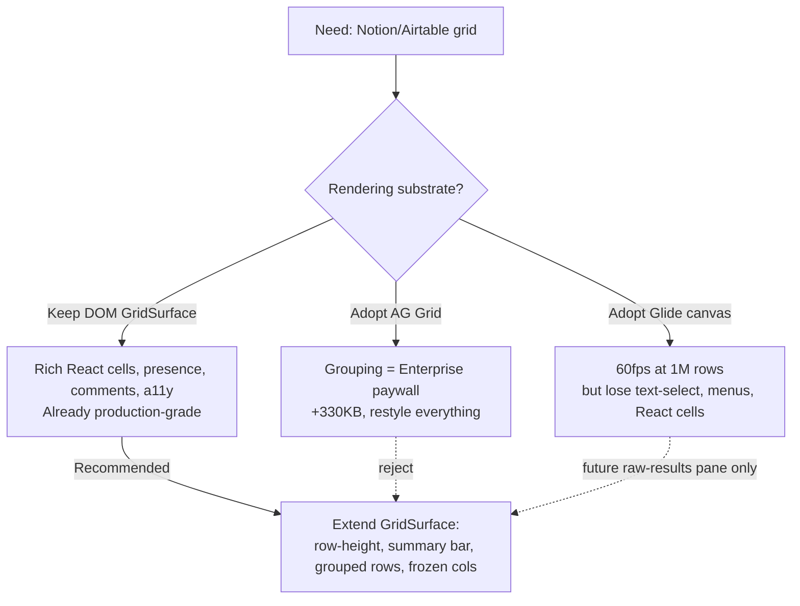
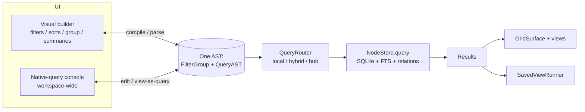

# Notion- And Airtable-Grade Database UI And Native Queries

## Problem Statement

xNet's data layer is already an Airtable-class query engine — but the **UI does
not show it**. We want the database surfaces to look and feel like Notion and
Airtable: the same filtering, sorting, grouping, and joining (relation) power,
plus a "native query" escape hatch that can run arbitrary queries against the
*entire* xNet dataset (not just one database). Today that escape hatch half-exists,
buried in a developer Console tab that only accepts raw QueryAST JSON. The user's
framing is right: the **dev tool and the database implementation should be two
faces of the same engine** — the visual builder and the raw-query console should
compile to and from one query representation, and the dev tool should *expose* the
database's real capabilities rather than reimplementing a weaker subset.

And it all has to be *clean*: tight, consistent spacing; hairline borders; restrained
monochrome chrome with color reserved for data; polished dropdowns, popovers, and
tooltips — the things that make Notion and Airtable feel premium.

## Executive Summary

The headline finding mirrors a recurring xNet pattern (cf. the dormant mobile kit in
[0196](0196_[_]_MOBILE_OPTIMIZATION_ADAPTIVE_SHELL_AND_TOUCH_SURFACES.md)): **the
engine is far ahead of the UI**. The data layer (`packages/data`) already has a
filter→sort→group pipeline (`executeQuery`), a full query AST with relation joins
and aggregates (`QueryAST`), a query router that pushes work to local/hub/hybrid
storage, rollups, materialized views, and FTS. The grid (`packages/views`) already
has a production-grade virtualized `GridSurface` with inline editors for 13 field
types, drag-reorder, presence, and comments, plus board/gallery/calendar/timeline/
list views. What's missing is **surface and polish**, in three buckets:

1. **Visual polish & design-system discipline.** `DatabaseView.tsx` hand-rolls its
   field menus as `fixed inset-0` overlays positioned with `getBoundingClientRect()`,
   uses **native `<select>`** for field types and **`window.confirm()`** for deletes —
   bypassing the Base UI `Popover`/`Menu`/`Select` primitives that already exist in
   `@xnetjs/ui`. There is no row-height/density control and no summary/aggregation
   footer — both signature Airtable affordances. There is no centralized density
   system; paddings are ad hoc.

2. **Feature parity gaps.** The grid's filter builder is **flat** — its toolbar
   adapters (`toSurfaceFilter`/`fromSurfaceFilter`) *silently drop nested groups*,
   and it runs on a second filter dialect (`{type, filters}`) distinct from the data
   layer's recursive `FilterGroup` (`{operator, conditions}`). Multi-level sort,
   nested filter groups, relation/lookup filters, collapsible grouped rows with
   per-group summaries, frozen columns, and a row-height menu are all absent from the
   UI even though the *engine* supports most of them.

3. **The native-query story is fragmented.** The "Console" tab
   (`QueryConsoleTray`) accepts only raw `QueryAST`/`SavedViewDescriptor` JSON and
   renders results via `SavedViewRunner`. The separate `@xnetjs/devtools` provider
   has a 16-panel `NodeExplorer`/`QueryDebugger` that *also* inspects data. Neither is
   connected to the visual builder, and the visual builder cannot round-trip to a
   query. We should make the visual builder and the console two views of **one
   QueryAST**, and promote the console into a first-class, workspace-wide query
   surface.

**Recommendation:** keep the in-house engine and the DOM-based `GridSurface` (do not
adopt AG Grid — grouping is Enterprise-only — or Glide canvas — it would forfeit our
rich React cells, presence rings, and comments). Unify on the data layer's recursive
`FilterGroup`/`QueryAST` (one AST, never a third dialect). Then deliver the work in
phases. **Phase 1 (this PR)** lands the highest-leverage, lowest-risk, most-visible
slice — an **Airtable-style summary bar**, **row-height density**, and
**design-system field pickers** — all additive, with a pure, fully-tested
aggregation engine. Later phases add nested/relation filters, grouped-row rendering,
frozen columns, and the visual-builder ↔ native-query unification.

## Current State In The Repository

### The data engine (already Airtable-class)

| Capability | Where | Notes |
|---|---|---|
| Filter→sort→group pipeline | `packages/data/src/database/query-pipeline.ts` | `executeQuery(rows, columns, {filter, sorts, groupBy, limit, offset})` |
| Recursive filter tree | `packages/data/src/database/view-types.ts` | `FilterGroup {operator:'and'\|'or', conditions:(FilterCondition\|FilterGroup)[]}` + `isFilterGroup()` guard |
| Type-aware operators | `packages/data/src/database/filter-operators.ts` | `OPERATORS_BY_TYPE`, `getOperatorLabel`, `operatorRequiresValue` |
| Multi-column sort | `packages/data/src/database/sort-engine.ts` | `sortRows(rows, columns, SortConfig[])` |
| Grouping + aggregates | `packages/data/src/database/group-engine.ts` | `groupRows` → `RowGroup` with `GroupAggregates` (count, sum/avg/min/max) |
| Rollups | `packages/data/src/database/rollup-engine.ts` | `RollupAggregation` (sum/avg/count/min/max/concat/unique/…) |
| Query AST + joins | `packages/data/src/store/query-ast.ts` | `QueryASTNodeQuery {predicate, orderBy[], page, include, aggregates}`; `QueryASTRelationInclude` = inbound/outbound relation joins; `QueryASTQuerySet` |
| Saved views | `packages/data/src/schema/schemas/saved-view.ts` | `SavedViewSchema` stores a JSON `SavedViewDescriptor {query: QueryAST, presentation}` |
| View node (runtime config) | `packages/data/src/schema/schemas/database-view.ts` | `DatabaseViewSchema`: `filters`, `sorts`, `groupBy`, `collapsedGroups`, `fieldOrder`, `fieldWidths`, `hiddenFields`, … |
| Query routing | `packages/data/src/database/query-router.ts` | local (<10k) / hybrid (<100k) / hub (FTS, complex filters, >100k) |
| Storage queries | `packages/data/src/store/query.ts` | `NodeQueryDescriptor` (where/orderBy/page-cursors/spatial/search/materializedView) + `NodeQueryPlanMetadata` (sql, indexes) |

### The grid UI (`packages/views`, `apps/web`)

- **`GridSurface`** (`packages/views/src/grid/GridSurface.tsx`) — DOM grid, TanStack
  Virtual rows, dnd-kit reorder, pointer resize, presence rings, comment badges,
  keyboard nav, TSV clipboard. Accepts a `rowHeight` prop (`DEFAULT_ROW_HEIGHT = 36`)
  that the app **never sets**. No grouped-row rendering, no summary footer, no frozen
  columns.
- **`GridToolbar`** (`packages/views/src/grid/GridToolbar.tsx`) — view tabs, sort
  chips, filter popover, group dropdown, fields visibility, import/export, search.
  Contains the lossy `toSurfaceFilter`/`fromSurfaceFilter` adapters
  (`'conditions' in condition ? [] : …` drops nested groups).
- **`FilterBuilder`** (`packages/views/src/filter/FilterBuilder.tsx`, ~400 lines) —
  flat AND/OR builder on the `views` dialect; field/operator pickers are **native
  `<select>`**.
- **Property handlers** (`packages/views/src/properties/index.ts`) — 13 inline cell
  editors (text/number/checkbox/date/dateRange/select/multiSelect/url/email/phone/
  file/relation/person).
- **Other views** — `BoardView`, `GalleryView`, `CalendarView`, `TimelineView`,
  `ListView`, legacy `TableView`.
- **`DatabaseView.tsx`** (`apps/web/src/components/DatabaseView.tsx`) — composes the
  above. Hand-rolls the field menu / add-field / comment popovers as
  `fixed inset-0` overlays, uses native `<select>` and `window.confirm`.
- **`SavedViewRunner`** (`packages/react/src/components/SavedViewRunner.tsx`) —
  multi-mode (table/cards/timeline/canvas/graph/feed) read surface for a
  `SavedViewDescriptor`, with facet shelf, date brush, and `onSaveLens`.

### The "dev tool" surfaces

- **Console tab** — `QueryConsoleTray` in `apps/web/src/workbench/views/tray.tsx`
  (registered in `register.ts` alongside shelf/capture/notifications/sync). Parses
  input via `parseConsoleInput` (`console-input.ts`) which accepts a
  `SavedViewDescriptor` **or a bare QueryAST**, then renders results in
  `SavedViewRunner`. The placeholder is literally raw QueryAST JSON.
- **`@xnetjs/devtools`** — `DevToolsProvider.tsx` with a 16-panel registry
  (`panel-registry.ts`): `nodes` (`NodeExplorer`), `queries` (`QueryDebugger`),
  `sync`, `yjs`, `authz`, `schemas`, `sqlite`, etc. Production no-op (tree-shaken),
  dev-only instrumentation.
- **MCP / AI surface** — `packages/plugins/src/services/mcp-server.ts`
  (`xnet_search`, `xnet_database_query`, …), `AiSurfaceService`, `ai-workspace-exporter.ts`.
- **NodeStore API** — `NodeStoreAPI` (`packages/plugins/src/services/local-api.ts`):
  `get/list/query/create/update/delete/subscribe`. Storage is event-sourced
  (`packages/data/src/store/store.ts`) over a SQLite adapter, behind a worker bridge
  (`packages/data-bridge`).

### The design system (`packages/ui`)

- **Base UI** (`@base-ui/react ^1.1.0`) primitives, all already styled with tokens:
  `Popover`, `Menu`/`DropdownMenu`, `Tooltip`, `Modal`/`Dialog`, `Select`, `Command`
  (cmdk), `Checkbox`, `Switch`, `Tabs`, `Sheet`, `Button` (cva), `Input`, `Badge`.
- **Tokens** (`packages/ui/src/theme/tokens.css`): role ramp `--surface-0/1/2`,
  `--ink-1/2/3`, `--hairline`, `--accent-ink`; `--radius-sm/md/lg/xl`; `motion.css`
  durations/easings. `cn()` = clsx + tailwind-merge. Icons: `lucide-react`.
- **Gaps**: no `ContextMenu`, no `Combobox`/searchable-select, **no density system**.
  The grid chrome bypasses these primitives (see above).

### Current-state screenshots (captured live from the worktree)

- **Empty grid** — toolbar reads `Table | ↕ | Filter | Group | Fields | ⋯ | Search`.
  Clean, minimal, monochrome — a good baseline. No row-height control, no summary
  footer.
- **Filter popover** — a single condition row with **native `<select>`** field and
  operator pickers (chunky browser chevrons), `+ Add filter` / `✕ Clear all`. No
  AND/OR group nesting, no field-type icons, no relation traversal.
- **Group popover** — only shows `None` until a select/person/checkbox field exists;
  grouping is type-gated and, even when set, renders no collapsible group headers.

## External Research

### Notion & Airtable interaction patterns (prior art to match)

- **Filter groups.** Airtable supports **up to 3 nesting levels**; each group has a
  single AND/OR conjunction, adjacent groups may differ → `(A and B) or (C and D)`.
  Notion supports **2 levels** and exposes the tree as a JSON `{and/or:[…]}` AST in
  its API — a clean round-trippable shape we should mirror.
- **Sort.** Draggable multi-level sort rows (primary + tiebreakers) with a
  "Keep sorted" toggle.
- **Group-by.** Up to 3 levels, collapsible group headers showing per-group counts,
  and a **per-group summary bar** using the same aggregation functions as the global
  footer.
- **Summary bar.** Bottom-of-grid footer; click any column footer to pick an
  aggregation. Type-specific: all types get Filled/Empty/%Filled/%Empty/Unique;
  numbers add Sum/Average/Min/Max/Range/Median/StdDev; dates add Earliest/Latest/Range.
- **Row heights.** Named tiers **Short / Medium / Tall / Extra Tall** (pixel values
  not officially published; community-observed ≈ 32 / 56 / 88 / 128 px).
- **Frozen columns.** Primary field always frozen; drag a divider to freeze up to 3.
- **Expanded record modal.** Space/expand opens a full record with all fields
  (incl. hidden), attachment previews, linked-record chips, and a comment sidebar —
  xNet's `GridPeek`/`NodeInspector` already approximate this.

### Design specifics that create the "clean" feel

Monochrome chrome with **color reserved for data** (select tags, avatars); hairline
borders (~1px warm gray, e.g. Notion's `#dfdcd9`); generous horizontal but compressed
vertical cell padding; dropdown/popover radius 4–8px with multi-layer elevation
shadow; appear ~100–150ms `ease-out` (scale 0.95→1 + fade), dismiss ~75–100ms.

### Libraries (2025–2026)

| Library | Verdict for xNet |
|---|---|
| **TanStack Table v8** (8.21.x, headless ~15KB) + **TanStack Virtual** | Already a dependency (`apps/web` uses `@tanstack/react-virtual`). Headless grouping/pinning/multi-sort logic we can borrow without adopting a renderer. ✅ |
| **AG Grid** (33.x, ~330KB) | Row grouping is **Enterprise-only**. ❌ |
| **Glide Data Grid** (canvas) | 60fps at millions of rows, but loses native text selection, right-click menus, and our rich React cells/presence/comments. Reserve for a future "raw results" pane only. ⚠️ |
| **react-querybuilder** v8 (MIT) | True round-trip JSON-AST ↔ SQL via `formatQuery`/`parseSQL`, nested groups, dnd. Good *reference*; but adopting it would introduce a **third filter dialect**. Prefer building the nested builder natively on our `FilterGroup`. ⚠️ |

### Visual builder ↔ native query duality

- **Metabase** compiles a visual "notebook" to **MBQL**, convertible **one-way** to
  SQL.
- **Datasette** mirrors every table to a URL with `?_where=` and a "SQL" link;
  queries are shareable/bookmarkable.
- **Supabase** ships a point-and-click Table Editor *and* a SQL Editor, with
  "View SQL definition" bridging them.
- **react-querybuilder** demonstrates true two-way round-trip.

The lesson: aim for the visual builder and the console to be **two views of one
AST**, with a "View as query" affordance on every database view, and (ideally)
round-trip rather than one-way.

## Key Findings

1. **The engine already does what the prompt asks; the UI is the gap.** Filtering,
   sorting, grouping, joins (relation includes), and arbitrary queries
   (`QueryAST` + `QueryRouter` + `NodeStore.query`) all exist in `packages/data`.
2. **Two filter dialects exist and the bridge between them is lossy.** The `views`
   dialect (`{type, filters}`) and the lossy toolbar adapters mean nested filter
   groups are *silently dropped*. This is a latent correctness bug, not just a
   missing feature. Unify on `FilterGroup`.
3. **`GridSurface` already takes `rowHeight`; the app never uses it.** Row-height
   density is mostly a wiring + control task.
4. **The aggregation primitives are half-built.** `GroupAggregates` computes per-group
   sums; there is no per-column **summary** abstraction or footer UI. A small pure
   `summary-engine` completes it and is trivially unit-testable (good for the Fallow
   CRAP gate).
5. **The native-query surface is real but buried and JSON-only.** `QueryConsoleTray`
   already runs `QueryAST`. The opportunity is to make the visual builder *emit* that
   AST and the console *consume/scope* it across the whole workspace.
6. **The design-system primitives exist but the grid chrome ignores them.** Swapping
   hand-rolled overlays / native `<select>` for `@xnetjs/ui` `Popover`/`Menu`/`Select`
   is the cheapest, most visible polish win.

## Options And Tradeoffs

### Grid rendering engine



**Chosen:** extend the in-house DOM `GridSurface`. It already wins on the dimensions
that matter for xNet (rich cells, presence, comments, accessibility), and TanStack
Virtual handles the row counts we realistically hit locally. Canvas (Glide) is parked
for a possible future "raw query results over 100k rows" pane.

### Filter representation

- **A — Build nested groups natively on `FilterGroup`** *(recommended)*: one AST,
  shared by grid, console, and `QueryAST` compilation. Delete the `views` dialect and
  the lossy adapters.
- **B — Adopt `react-querybuilder`**: fast to a nested UI, but adds a third dialect
  and a styling-adapter dependency; round-tripping to our `QueryAST` still needs glue.
- **C — Status quo (flat)**: cheapest, but keeps the latent nested-group data-loss
  bug.

### Native-query ↔ visual-builder unification

- **A — One AST, two views** *(recommended, later phase)*: visual builder compiles
  `view → QueryASTNodeQuery`; the console renders/edits that AST and can target any
  schema workspace-wide; "View as query" on each view. Round-trip where feasible
  (Datasette/Supabase-style), one-way acceptable as a fallback (Metabase precedent).
- **B — Leave the console as a JSON box**: no extra work, but the dev tool keeps
  reimplementing a weaker subset and never "exposes the database."

### This PR's scope (Phase 1)

- **A — Big bang** (all parity + unification): high value, but unmergeable in one
  green CI pass and high regression risk against the complex `GridSurface`.
- **B — Additive "grid chrome" slice** *(chosen)*: summary bar + row-height +
  design-system field pickers. Visible Airtable parity, a pure tested engine, zero
  changes to the virtualized core's keyboard/clipboard/presence machinery.

## Recommendation

Adopt the in-house engine + DOM grid, unify on `FilterGroup`/`QueryAST`, and execute
in phases. Ship **Phase 1 = "Airtable-grade grid chrome"** now:

1. A pure, fully-tested **summary engine** in `packages/data`
   (`computeColumnSummary`, `SUMMARY_FUNCTIONS_BY_TYPE`) plus a `ROW_HEIGHT_PX` map.
2. Two optional, idiomatic props on `DatabaseViewSchema` (`rowHeight`,
   `columnSummaries`) so density and summaries **persist per view**, with matching
   `useGridDatabase` mutations (`setRowHeight`, `setColumnSummary`).
3. A **`GridSummaryBar`** footer (per-column aggregation chosen via a Base UI `Menu`),
   a **row-height `Menu`** in `GridToolbar`, and replacement of `DatabaseView`'s native
   `<select>` field-type pickers with the `@xnetjs/ui` **`Select`** + field-type
   icons.

Then the later-phase architecture is:



## Example Code

Phase-1 summary engine (pure, tested), in `packages/data/src/database/summary-engine.ts`:

```ts
export type SummaryFunction =
  | 'none' | 'filled' | 'empty' | 'percentFilled' | 'percentEmpty' | 'unique'
  | 'sum' | 'average' | 'min' | 'max' | 'range' | 'median'

export const SUMMARY_FUNCTIONS_BY_TYPE: Record<ColumnType, SummaryFunction[]> = {
  number:  ['none', 'sum', 'average', 'min', 'max', 'range', 'median', 'filled', 'empty', 'percentFilled', 'unique'],
  text:    ['none', 'filled', 'empty', 'percentFilled', 'percentEmpty', 'unique'],
  // …per-type
}

export function computeColumnSummary(
  rows: readonly SummaryRow[],
  column: ColumnLike,
  fn: SummaryFunction
): { value: number | null; display: string } { /* pure */ }
```

Row-height tiers shared by the toolbar control and `GridSurface`:

```ts
export type RowHeight = 'short' | 'medium' | 'tall' | 'extraTall'
export const ROW_HEIGHT_PX: Record<RowHeight, number> =
  { short: 32, medium: 48, tall: 80, extraTall: 128 }
```

Persisted on the view (idiomatic, alongside `cardSize`/`collapsedGroups`):

```ts
// packages/data/src/schema/schemas/database-view.ts
rowHeight: text({ maxLength: 12 }),                              // RowHeight
columnSummaries: json<Record<string, SummaryFunction>>({}),     // fieldId -> fn
```

## Risks And Open Questions

- **Schema additions.** New optional props on `DatabaseViewSchema` are low-risk
  (mirrors existing `json`/`text` props) and don't affect authorization-coverage
  parity tests, but watch for any schema-shape snapshot tests and update them.
- **Fallow CRAP gate.** New functions with cyclomatic complexity ≥5 must be executed
  by tests; the summary engine is written test-first to satisfy this.
- **`editor-ux` e2e.** The grid is exercised by Playwright (incl. mobile project);
  additive footer/menu must not break `getByRole`/selectors. Verify locally.
- **Two filter dialects (deferred).** Unifying on `FilterGroup` and deleting the lossy
  adapters is a later phase; until then nested groups remain unsupported in the grid
  (documented, not regressed by Phase 1).
- **Native-query scope (deferred).** Workspace-wide arbitrary query needs careful
  authorization (only return nodes the caller may read) and result-size governance —
  the `QueryRouter` and auth pushdown exist but must be wired deliberately.
- **Persistence vs. LWW.** `columnSummaries`/`rowHeight` are whole-value LWW json/text
  like the other view props — concurrent edits last-writer-wins, which is acceptable
  for view chrome.

## Implementation Checklist

### Phase 1 — Airtable-grade grid chrome (this PR)
- [x] `summary-engine.ts` in `packages/data`: `SummaryFunction`,
  `SUMMARY_FUNCTIONS_BY_TYPE`, `computeColumnSummary`, `summaryFunctionLabel`,
  `isFilledValue`; export from the `database` barrel and the root barrel.
- [x] `RowHeight` type + `ROW_HEIGHT_PX` map (with `resolveRowHeightPx`/`asRowHeight`).
- [x] Exhaustive unit tests for the summary engine and row-height map (26 tests).
- [x] Add `rowHeight` + `columnSummaries` to `DatabaseViewSchema` and the
  `ViewConfig`/view types.
- [x] `useGridDatabase`: surface `activeView.rowHeight`/`columnSummaries`; add
  `setRowHeight` and `setColumnSummary`.
- [x] `GridSummaryBar` component (`packages/views`) — per-column Base UI `Menu` to
  pick the aggregation, shows computed display, hairline footer.
- [x] Row-height `Menu` control in `GridToolbar` (lucide icon, four tiers).
- [x] Replace native `<select>` field-type pickers in `DatabaseView` with the
  `@xnetjs/ui` `Select` + human-readable labels (field-type icons deferred).
- [x] Wire it all into `DatabaseView`: pass resolved `rowHeight` to `GridSurface`,
  mount `GridSummaryBar`, connect the toolbar control.
- [x] Typecheck + lint + targeted tests green; verify live in the preview
  (Storybook Grid V2 story — Points→Sum 29, Shipped→Percent checked 25%,
  Tall row height applied).

### Phase 2 — Filter/sort/group parity (later)
- [ ] Unify on `FilterGroup`; delete the `views` dialect + lossy toolbar adapters.
- [ ] Nested filter groups (AND/OR, up to 3 levels) on `FilterGroup`.
- [ ] Relation/lookup filters via `QueryASTRelationInclude`.
- [ ] Multi-level sort UI (draggable priority).
- [ ] Grouped-row rendering in `GridSurface`: collapsible headers + per-group summary.
- [ ] Frozen/pinned columns (primary + up to N).
- [ ] Polished `Popover`/`ContextMenu` for the remaining hand-rolled grid overlays;
  add a `Combobox` primitive to `@xnetjs/ui`.

### Phase 3 — Native-query unification (later)
- [ ] `compileViewToQueryAST` / `parseQueryASTToView` round-trip in `packages/data`.
- [ ] Promote `QueryConsoleTray` to a first-class, workspace-wide query surface
  (any schema), reusing `QueryRouter` + auth pushdown.
- [ ] "View as query" affordance on each database view (builder ↔ console).
- [ ] Optional friendly textual query (PRQL/SQL-ish) that compiles to `QueryAST`.
- [ ] Bridge the `@xnetjs/devtools` `NodeExplorer`/`QueryDebugger` with the console.

## Validation Checklist

### Phase 1
- [x] `pnpm exec vitest run --project unit packages/data/src/database/summary-engine.test.ts` passes (26 tests).
- [x] `pnpm --filter @xnetjs/data typecheck`, `@xnetjs/views`, `@xnetjs/react`, `xnet-web` typecheck clean.
- [x] `lint` (eslint + prettier) clean on the changed files.
- [x] `GridSurface`/`GridToolbar`/`useGridDatabase` tests still green (32 + 10).
- [x] Live preview (Storybook): a grid shows a **summary footer**; clicking a column
  footer opens a Menu and selecting Sum/Filled/Percent-checked computes the value.
- [x] Live preview (Storybook): the row-height Menu switches Short/Medium/Tall/Extra-Tall
  and the grid re-densifies; the choice persists on the view node.
- [x] The add-field / field-type picker is the styled `Select` (no native `<select>`);
  validated by typecheck (full-app screenshot blocked by the fresh-origin passkey gate).
- [ ] `editor-ux` grid e2e unaffected (harness-based; not touched — confirm in CI).

## References

- Repo: `packages/data/src/database/{query-pipeline,filter-operators,sort-engine,group-engine,rollup-engine,query-router,view-types}.ts`
- Repo: `packages/data/src/store/{query,query-ast,store}.ts`; `packages/data/src/schema/schemas/{database-view,saved-view}.ts`
- Repo: `packages/views/src/grid/{GridSurface,GridToolbar}.tsx`; `packages/views/src/filter/FilterBuilder.tsx`; `packages/views/src/properties/index.ts`
- Repo: `apps/web/src/components/DatabaseView.tsx`; `apps/web/src/workbench/views/{tray.tsx,console-input.ts,register.ts}`
- Repo: `packages/react/src/hooks/useGridDatabase.ts`; `packages/react/src/components/SavedViewRunner.tsx`
- Repo: `packages/devtools/src/provider/DevToolsProvider.tsx`; `packages/ui/src/primitives/*`, `packages/ui/src/theme/tokens.css`
- Related explorations: [0188 Extensible schemas & universal database view](0188_[_]_EXTENSIBLE_SCHEMAS_AND_UNIVERSAL_DATABASE_VIEW.md), [0190 Cohesive domain UIs](0190_[x]_COHESIVE_AND_FEATURE_COMPLETE_DOMAIN_UIS.md), [0196 Mobile adaptive shell](0196_[_]_MOBILE_OPTIMIZATION_ADAPTIVE_SHELL_AND_TOUCH_SURFACES.md)
- Airtable: [filtering](https://support.airtable.com/docs/filtering-records-using-conditions), [grouping](https://support.airtable.com/docs/grouping-records-in-airtable), [summary bar](https://support.airtable.com/docs/using-the-summary-bar-in-airtable-views), [row height](https://support.airtable.com/docs/row-height)
- Notion: [API filter reference](https://developers.notion.com/reference/post-database-query-filter), [views/filters/sorts](https://www.notion.com/help/views-filters-and-sorts)
- Libraries: [TanStack Table](https://tanstack.com/table/v8/docs/overview), [AG Grid community vs enterprise](https://www.ag-grid.com/javascript-data-grid/community-vs-enterprise/), [Glide Data Grid](https://github.com/glideapps/glide-data-grid), [react-querybuilder](https://github.com/react-querybuilder/react-querybuilder)
- Duality prior art: [Metabase query builder](https://www.metabase.com/docs/latest/questions/query-builder/editor), [Datasette SQL queries](https://docs.datasette.io/en/latest/sql_queries.html), [Supabase SQL editor](https://supabase.com/features/sql-editor)
