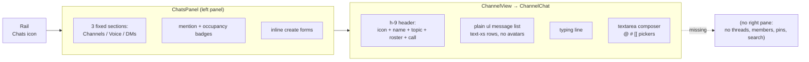
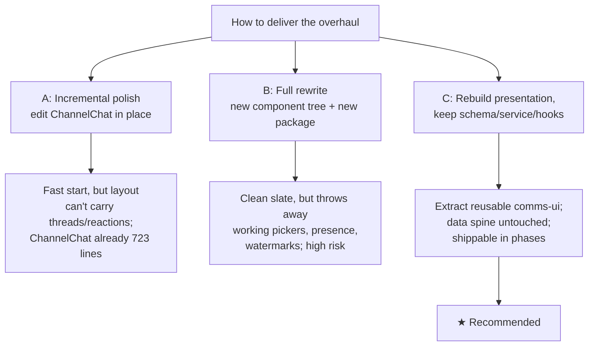
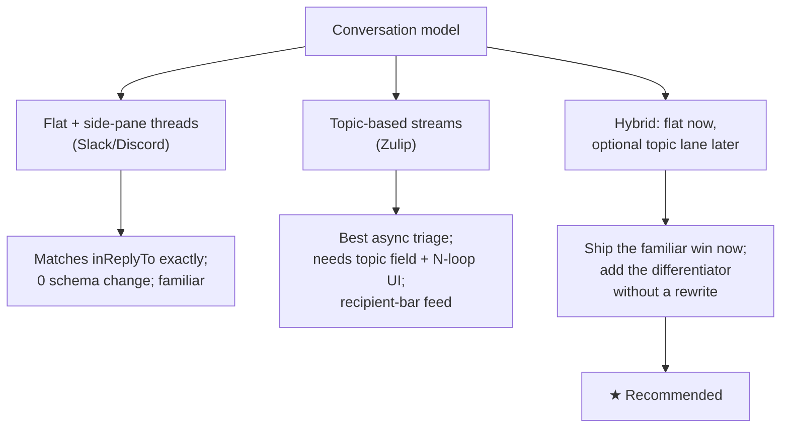
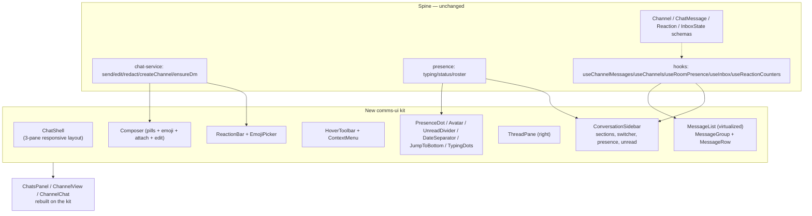
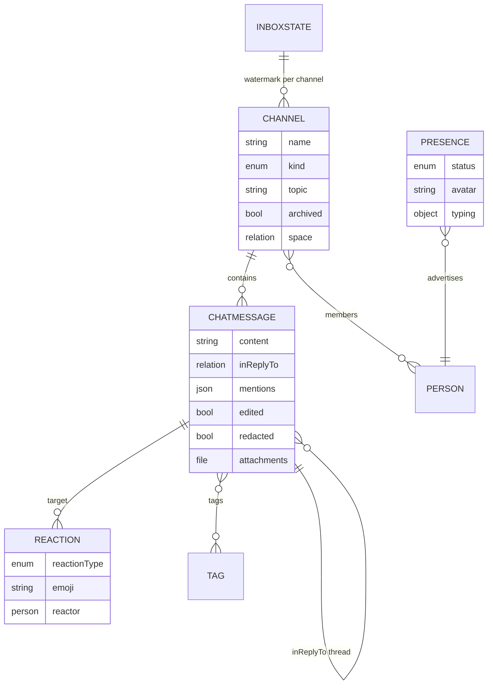
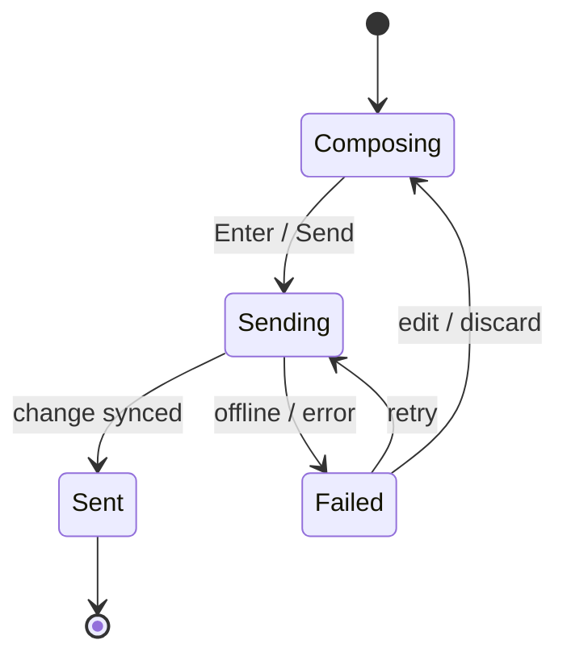

# Polished Chat & Channels UI — A Cleaner, Fancier, More Robust Comms Surface

## Problem Statement

The ask, verbatim:

> Let's make the chat and channels UI way better. So, way cleaner, way fancier, way more robust. We can look at Slack, we can look at Microsoft Teams, we can look at Zulip, we can look at Discord, see how they do things, and then take some screenshots and make the screenshots just look way, way better. So more features, cleaner UI, cleaner UX, cleaner interactions, animations, all that sort of stuff.

xNet already has a real, working comms surface: a `Chats` rail icon, a left-panel channel/DM/voice list (`ChatsPanel`), and a channel tab (`ChannelView` → `ChannelChat`) with a genuinely sophisticated structured composer (`@` mentions, `#` tags, `[[` wiki-links, all keyboard-navigable). It is wired into the workbench and synced through the same `Change<T>` node protocol as everything else.

But visually and interactionally it reads as a developer-grade prototype, not a product people reach for over Slack. Messages are tiny `text-xs` rows with no avatars, no grouping, no hover affordances, no reactions, no threads, and no read/unread structure. The data model is far richer than what the UI shows — reactions, threads, attachments, edit/delete, and presence status are all *modeled* but never *rendered*. The core tension: this is not a greenfield build and it is not a data problem. It is a **presentation and interaction-design gap on top of a solid spine**. The naive "just add features" approach would bolt reactions and threads onto a layout that was never designed to carry them; the work is to rebuild the rendering layer to the standard set by Slack/Discord/Zulip while keeping the schema, service, and hooks intact.

## Executive Summary

**The headline finding: xNet already modeled a modern chat app and then rendered ~30% of it.** Reading the code, the data and service layers are in excellent shape and the missing pieces are almost entirely in the React presentation layer:

- `ChatMessageSchema` already has `inReplyTo` (threads), `attachments` (files), `edited`/`editedAt`, `redacted` (soft delete), structured `mentions`, `tags`, and `links` (`packages/data/src/schema/schemas/chat-message.ts`).
- `ReactionSchema` already supports `emoji` reactions with a reactor, and `useReactionCounters` already loads and toggles them (`packages/react/src/hooks/useReactionCounters.ts`) — but **no message in `ChannelChat` renders a single reaction**.
- Presence already carries `status: 'active' | 'idle' | 'dnd'`, an `avatar`, and typing indicators (`packages/comms/src/presence/types.ts`) — but the roster renders names as plain text and the status dot is never shown.
- `@tanstack/react-virtual` is **already a dependency of `apps/web`** (`apps/web/package.json`) and unused by chat, which today scrolls a plain `<ul>` and will choke on long histories.
- `packages/ui/src/theme/motion.css` already ships the exact keyframes a premium chat needs — `slide-in-bottom`, `scale-in`, `fade-in`, `shimmer`, `pulse-subtle` — so the "fancier animations" ask needs **zero new dependencies**; framer-motion is not in the tree and is not required.

So the recommendation is **Option C: rebuild the presentation layer, keep the spine.** Extract a small set of reusable comms-UI primitives (`MessageList`, `MessageGroup`, `HoverToolbar`, `ReactionBar`, `Composer`, `PresenceDot`, `ThreadPane`), drive them from the existing hooks and service, and bring the surface up to the cross-app grammar that Slack, Discord, Teams, and Zulip all share: grouped avatar rows, hover toolbars, reaction pills, unread dividers, date separators, jump-to-bottom, threads in a right pane, and polished CSS micro-interactions. Keep the structured-pill composer (it is *better* than parsed text for a knowledge graph) and evolve it. Adopt Slack-style flat-with-threads now because it matches `inReplyTo` exactly, and design the header to admit an optional **Zulip-style topic lane** later as the long-term differentiator for async, knowledge-graph-native conversation.

## Current State In The Repository

### The surface as it exists today



**Sidebar** — [`apps/web/src/comms/ChatsPanel.tsx`](apps/web/src/comms/ChatsPanel.tsx) renders three hard-coded sections (`Channels`, `Voice rooms`, `Direct messages`). Rows are 12px text buttons with a Lucide kind-icon, a `◉ N` occupancy badge, and a mention-count pill. There is no workspace switcher, no custom/collapsible sections, no favorites/starred, no search, no presence dot on DMs, no unread bolding, and no last-message preview. Channel creation is an inline `name` input only — no topic, no privacy, no member picker.

**Header** — [`apps/web/src/comms/ChannelView.tsx`](apps/web/src/comms/ChannelView.tsx) is a 36px-tall (`h-9`) bar: kind icon, name, topic, and `here: alice, bob` roster as plain text, plus `CallControls`. No avatar stack, no member count, no pin/search/info actions, no topic editing.

**Message list + composer** — [`apps/web/src/comms/ChannelChat.tsx`](apps/web/src/comms/ChannelChat.tsx) is the heart of the surface and is doing a lot already:

- `MessageRow` (lines 157–200) renders `<li class="group … hover:bg-surface-2/50">` with author name, a monospace `formatTime` timestamp, an `(edited)` tag, and the body via `LinkifiedText`. Mentions/tags/links render as chip rows. Per-message `MessageActions` (report/sensitive) sits in the row, revealed by the `group` hover.
- `MessageList` (lines 204–261) is a plain `<ul class="overflow-y-auto">` — **no virtualization**, **no grouping of consecutive messages**, **no date separators**, **no "new messages" divider**.
- Scroll-to-bottom is a blunt `useEffect` on `messages.length` that always jams to the bottom (lines 524–526) — it will yank the viewport away from a user reading history.
- The composer (lines 667–719) is a 2-row `<textarea>` with the genuinely good `@`/`#`/`[[` picker system (mention/tag/link, mutually exclusive, ARIA combobox, `useListboxNavigation`). Plus a "mark sensitive" shield and a send button. **No emoji picker, no file attach, no formatting, no slash commands, no edit-in-place, no reply affordance.**

**What's modeled but never rendered** (the gap):

| Capability | Modeled where | Rendered in chat UI? |
| --- | --- | --- |
| Emoji reactions | `ReactionSchema` + `useReactionCounters` | ❌ No reaction bar at all |
| Threads / replies | `ChatMessage.inReplyTo` | ❌ No reply button, no thread pane |
| File attachments | `ChatMessage.attachments` | ❌ No attach button, no render |
| Message edit | `editMessage()` in chat-service | ❌ No edit-in-place UI |
| Soft delete | `ChatMessage.redacted` | ✅ "message deleted" placeholder |
| Edited indicator | `ChatMessage.edited` | ✅ `(edited)` tag |
| Presence status dot | `PresenceStatus = active/idle/dnd` | ❌ Names only, no dot |
| Avatars | `UserCard.avatar` | ❌ No avatars anywhere |
| Read watermark | `InboxStateSchema.watermarks` | ⚠️ Advances, but no "new" divider |
| Typing indicator | `typingPeers()` | ✅ "alice is typing…" text line |
| Message grouping | (layout only) | ❌ Every message is a full row |
| Virtualized history | `@tanstack/react-virtual` (dep present) | ❌ Plain `<ul>` |
| Pinned messages | (not modeled) | ❌ |
| Message search | (not modeled in chat) | ❌ |

### The spine that should be kept

- **Schema** — `Channel` (kind: channel/dm/voice, members, topic, archived, folder, sortKey, tags, space, visibility) and `ChatMessage` (content, inReplyTo, attachments, mentions, edited/editedAt, redacted, tags, links). `Reaction`, `InboxState`, and `mentions.ts` round it out.
- **Service** — `packages/comms/src/chat/chat-service.ts`: `sendMessage`, `editMessage`, `redactMessage`, `createChannel`, `ensureDmChannel`, `channelHistoryQuery`. `dm.ts` derives deterministic DM ids.
- **Presence** — `packages/comms/src/presence/{types,helpers,room-manager}.ts`: `typingPeers`, `peersInCall`, `rosterUsers`, `remotePeers`, ephemeral typing/status/call over room awareness.
- **Hooks** — `apps/web/src/comms/hooks.ts`: `useChannelMessages`, `useChannels`, `useRoomPresence`, `useInbox` (watermarks, mention acks, badges, snooze), `useProfiles`.
- **Wiring** — `apps/web/src/workbench/Rail.tsx:39` (chats rail icon), `apps/web/src/workbench/views/register.ts:16` (`ChatsPanel` as left panel), `apps/web/src/workbench/ViewHost.tsx:44` (`channel` node type → `ChannelView`).

### Design-system inventory (what we build with)

- **Primitives** — `packages/ui/src/`: `Button`, `IconButton`, `Popover`, `Menu`/`DropdownMenu`, `Tooltip`, `Sheet`, `Modal`, `Tabs`, `ScrollArea`, `Command` (cmdk), `Badge`, `Skeleton`, `Avatar`(?), `LinkifiedText`, `SensitiveContent`, `useListboxNavigation`. Built on `@base-ui/react ^1.1.0`.
- **Theming** — HSL tokens in `packages/ui/src/theme/tokens.css`: `--surface-0/1/2`, `--ink-1/2/3`, `--accent`, `--accent-ink`, `--hairline`, `--border`, `--border-emphasis`, `--border-muted`. Dark mode via `.dark` class.
- **Motion** — `packages/ui/src/theme/motion.css` already defines `fade-in/out`, `scale-in/out`, `slide-in-{bottom,left,right,top}`, `slide-out-*`, `shimmer`, `pulse-subtle`, `spin`, plus `tailwindcss-animate`. **No framer-motion in the tree.**
- **Icons** — `lucide-react`.
- **Virtualization** — `@tanstack/react-virtual ^3.14.2` already in `apps/web`.

## External Research

How the four reference apps actually do it, and the implementation patterns that make a chat feel fast and premium.

**Slack** — The signature pattern is **message grouping**: consecutive messages from the same author within ~5 minutes collapse into one block; only the first shows avatar + name + timestamp, the rest show a hover-only relative time. A **hover toolbar** anchors to the top-right of each message: quick-reaction emoji, then Reply-in-thread, Save, Share, More. **Threads live in a right "flex pane"**, not inline — Slack explicitly rejected inline expansion because pushing the channel river up/down on open/close was disorienting ([Slack Design: Threads, a long design journey](https://slack.design/articles/threads-in-slack-a-long-design-journey-part-1-of-2/)). The 2024 sidebar redesign added Home/DMs/Activity/Later tabs and user-defined collapsible **custom sections** ([Organize your sidebar with custom sections](https://slack.com/help/articles/360043207674-Organize-your-sidebar-with-custom-sections)). Density is a setting: **Clean vs Compact** ([Change how messages are displayed](https://slack.com/help/articles/213893898-Change-how-messages-are-displayed)).

**Microsoft Teams** — Channels → tabs (Posts/Files/Wiki/apps). Historically **reply-chain-first** (every post is a thread, replies indent inline) vs Slack's flat-first model; the 2024–2025 "new chat and channels experience" merges chats + channels into one list with custom sections and a Threads layout that moves toward Slack ([New chat and channels experience](https://support.microsoft.com/en-us/office/explore-the-new-chat-and-channels-experience-in-microsoft-teams-c6f38016-d59c-4226-b0f3-caef4e60f91e)). The composer shows formatting controls inline by default; slash commands arrived mid-2024.

**Zulip** — The differentiator worth studying hardest. Zulip's model is two levels: every message belongs to a **stream** (≈ channel) and *must* carry a **topic** (a short subject line) ([Introduction to topics](https://zulip.com/help/introduction-to-topics)). The feed is visually segmented by a **recipient bar** (stream + topic header) instead of being one undifferentiated river; unread counts are tracked **per topic**, and the idiomatic reading loop is pressing `N` to jump to the next unread topic ([Reading strategies](https://zulip.com/help/reading-strategies), [Keyboard shortcuts](https://zulip.com/help/keyboard-shortcuts)). Topics can be renamed, moved, merged, and **resolved** (✓). Proponents argue this scales for async teams: a returning teammate triages by named topic instead of scrolling a mixed channel. The cost is a two-field composer (stream + topic) — slightly more friction per message ([Why Zulip](https://zulip.com/why-zulip/)).

**Discord** — Three columns: server rail, channel list under collapsible **Category** headers, message feed, and a **member list** grouped by role with presence dots. Presence is a dot on the avatar — **green online / yellow idle / red DND / grey offline** plus rich presence ("Playing …") ([Discord statuses](https://www.androidpolice.com/discord-statuses-explainer/)). Cozy vs Compact density mirrors Slack. Hover darkens the row and reveals quick reactions + Reply + Edit + More; reaction culture is heavy, with animated super-reactions.

**Cross-cutting grammar all four share** (this is the checklist a "good" chat must hit): grouped avatar rows; an **unread divider** ("New messages" line) injected at the last-read point; **date separators** ("Today"/"Yesterday"); a floating **jump-to-bottom** button with an unread count; animated **typing indicators** that time out; **reaction pills** with count + who-reacted tooltip + toggle; **hover toolbars**; **right-click context menus**; and `Cmd/Ctrl+K` quick switch, `↑` to edit last message, `Esc` to dismiss ([Stream: Chat UX best practices](https://getstream.io/blog/chat-ux/)).

**Implementation patterns** (how to build it well in React):

- **Virtualized, bidirectional message list.** The hard part is variable-height rows + reverse infinite scroll + staying pinned to bottom while preserving scroll when prepending history. `react-virtuoso` is the most adopted OSS answer (`followOutput`, `firstItemIndex` for jump-free prepend, `startReached`, `initialTopMostItemIndex`); `@tanstack/react-virtual` (already our dep) is lower-level but does it via `measureElement` + a stable `getItemKey` + `scrollToIndex`. `react-window` is effectively unsuitable for variable heights ([React Virtuoso](https://virtuoso.dev/), [TanStack Virtual](https://tanstack.com/virtual/v3/docs/api/virtualizer)).
- **Scroll anchoring.** CSS `overflow-anchor: auto` keeps content stable on prepend (not in Safari); the `flex-direction: column-reverse` trick is tempting but breaks selection order, screen-reader order, and tab order — most production apps manage scroll programmatically with a "near bottom?" threshold (~80–150px) and a jump-to-bottom pill instead ([MDN overflow-anchor](https://developer.mozilla.org/en-US/docs/Web/CSS/overflow-anchor)).
- **Composer.** We already use TipTap/ProseMirror in the doc editor; `@tiptap/extension-mention` + `@tiptap/suggestion` are the canonical way to do `@`/`#`/`:emoji:`/slash menus with Floating-UI positioning. Lexical is lighter for greenfield, but migrating offers no practical gain here ([Liveblocks: which rich text editor in 2025](https://liveblocks.io/blog/which-rich-text-editor-framework-should-you-choose-in-2025)).
- **Emoji.** `emoji-mart` v5 decouples its ~700KB dataset from the JS so you lazy-load data on first open; `frimousse` (Liveblocks) is a headless, dependency-free, Radix-style picker you style yourself ([emoji-mart](https://github.com/missive/emoji-mart), [frimousse](https://frimousse.liveblocks.io/)).
- **Reactions & optimistic sends.** React 19's `useOptimistic` auto-reverts on failure; reaction toggle is `{emoji → {count, userIds}}`, pill shows count + who-reacted tooltip, `scale-in` bounce on add ([React useOptimistic](https://react.dev/reference/react/useOptimistic)).
- **Micro-interactions without framer-motion.** Pure-CSS three-dot typing bounce (staggered `animation-delay`), `slide-in-bottom` for new messages, `group-hover:opacity-100` reveal of the toolbar (with `pointer-events-none` when hidden), `shimmer` skeletons. motion.dev (`motion/react`, ~15KB lazy) only earns its place for `AnimatePresence` exit animations, spring physics, and `layout` width animation on reaction pills — a Phase-3 nicety, not a requirement.
- **Accessibility.** The list is `role="log"` `aria-live="polite"` `aria-atomic="false"`; reactions are `aria-pressed` toggle buttons with labels; emoji get `role="img"` + `aria-label`; roving `tabindex` for keyboard message navigation; return focus to the composer after send ([W3C ARIA23 role=log](https://www.w3.org/WAI/WCAG21/Techniques/aria/ARIA23.html)).

## Key Findings

1. **This is a rendering problem, not a data problem.** The schema already encodes threads, reactions, attachments, edit/delete, mentions, and presence status. Most of the work is building React components that *show* what is already stored and synced.
2. **The composer is ahead of the rest of the UI.** The `@`/`#`/`[[` structured-pill picker (mutually exclusive, ARIA combobox, keyboard-navigable) is genuinely good and is *better* than parsed-text mentions for a knowledge graph. It should be evolved, not replaced — add `:emoji:`, slash commands, file attach, and edit-in-place around it.
3. **Virtualization is one import away.** `@tanstack/react-virtual` is already installed; today's plain `<ul>` plus an always-jam-to-bottom effect is the single biggest robustness and UX liability for any channel with real history.
4. **The "fancy animations" ask costs nothing new.** `motion.css` already ships `slide-in-bottom`, `scale-in`, `fade-in`, `shimmer`, `pulse-subtle`. We can deliver premium micro-interactions in pure CSS using the existing token system; framer-motion is optional polish for a later phase.
5. **Presence is half-built.** `active/idle/dnd` status and `avatar` exist on `UserCard` but the UI shows names as text. Discord-style presence dots + an avatar-driven member list are low-effort, high-signal wins.
6. **Read state exists but is invisible.** Watermarks advance, but there is no "New messages" divider, no unread bolding in the sidebar, and no jump-to-unread — the three things that make a chat feel *navigable* rather than *infinite*.
7. **Threading model is the one true fork in the road.** `inReplyTo` makes Slack-style flat-with-threads a drop-in fit. Zulip's topic model is the more differentiated, more knowledge-graph-native long-term play but is a larger data + reading-UI change. These are sequenceable, not mutually exclusive.

## Options And Tradeoffs

### Decision 1 — How much to rebuild



| Dimension | A: In-place polish | B: Full rewrite | C: Rebuild presentation |
| --- | --- | --- | --- |
| Risk to sync/data | Low | High | Low |
| Reuses pickers/presence/watermarks | Partially | No | Yes |
| Can carry threads/reactions/grouping cleanly | No | Yes | Yes |
| Shippable in phases | Hard | No | Yes |
| Testability | Tangled | New surface | Pure UI units |

**Recommendation: C.** Keep the schema, `chat-service`, presence, and hooks exactly as they are. Extract a small reusable UI kit (in `packages/ui` under a `comms/` subtree, or a new `packages/comms-ui` if it needs app-agnostic logic) and rebuild `ChatsPanel`/`ChannelView`/`ChannelChat` on top of it. This isolates risk to the view layer and lets each phase ship independently.

### Decision 2 — Threading & conversation model



**Recommendation: H.** Implement Slack-style flat-with-threads in a right pane now (zero schema change — `inReplyTo` already exists). In parallel, design the channel header and message-list so a future optional `topic` text field on `ChatMessage` can switch the feed into a Zulip-style **recipient-bar** view with per-topic unread counts and an `N`-to-next-unread loop. xNet's local-first, graph-native nature makes topics a natural fit (a topic is just a lightweight grouping key, and resolved topics map to "done" the way tasks do) — but it should be a deliberate Phase-4 bet, not a Phase-1 scramble.

### Decision 3 — Composer

Keep the existing structured-pill `textarea` + picker logic for Phase 1 (it works, it's accessible, and the pill model is correct for the graph). Layer features around it: emoji picker (`:` trigger reusing `useListboxNavigation`, plus a full `emoji-mart`/`frimousse` popover on a button), file attach (drag-drop + button writing to `attachments`), edit-in-place (`↑` on empty composer loads last own message), and a formatting affordance. **Optional Phase 3:** migrate the input to a TipTap instance so pills render inline as you type and markdown shortcuts work live — reusing the doc editor we already ship. Do not adopt Lexical; the migration cost buys nothing here.

### Decision 4 — Animation library

Pure CSS via the existing `motion.css` keyframes for Phases 1–2 (typing dots, message slide-in, reaction pop, skeletons, hover reveal). Re-evaluate adding `motion/react` (~15KB, lazy `domAnimation`) only in Phase 3 and only for the three things CSS can't do well: `AnimatePresence` exit animations, spring physics on reaction bounce, and `layout` animation when reaction-pill widths change.

## Recommendation

Rebuild the comms **presentation** layer to the cross-app grammar, on top of the untouched data spine, shipped in four phases. Target architecture:



The data already in place:



And the message send lifecycle the composer/list should model (optimistic, with failure recovery):



**Phase sequencing (each phase is independently shippable):**

- **Phase 1 — Layout & density.** Avatars, message grouping, date separators, unread divider, polished header + sidebar (presence dots, unread bolding, last-message preview), virtualized list with smart scroll + jump-to-bottom. No new schema, no new deps.
- **Phase 2 — Interactions.** Hover toolbar + right-click context menu, reaction bar + emoji picker, reply affordance + right-pane thread view, edit-in-place, file attach, pinning (new lightweight schema), CSS micro-interactions.
- **Phase 3 — Power & polish.** `Cmd+K` quick switcher, message search, keyboard shortcut layer, optional TipTap composer, optional `motion/react` for spring/exit animations, density setting (Clean/Compact).
- **Phase 4 — Differentiator (optional).** Zulip-style topics: optional `topic` field, recipient-bar feed, per-topic unread, `N`-to-next-unread, resolve-topic.

## Example Code

These are illustrative sketches in the repo's idiom (Tailwind tokens, `cn`, lucide, base-ui), not final code.

**Message grouping — collapse consecutive same-author rows:**

```tsx
// packages/ui/src/comms/group-messages.ts
const GROUP_WINDOW_MS = 5 * 60_000

export interface RenderRow {
  message: ChatMessageRow
  startsGroup: boolean   // show avatar + name + absolute time
  daySeparator?: string  // "Today" / "Yesterday" / "Mon, Jun 9"
  firstUnread?: boolean  // render the "New messages" divider above this row
}

export function groupMessages(
  messages: ChatMessageRow[],
  lastReadAt: number
): RenderRow[] {
  let prev: ChatMessageRow | undefined
  let unreadShown = false
  return messages.map((m) => {
    const newAuthor = m.createdBy !== prev?.createdBy
    const gap = (m.createdAt ?? 0) - (prev?.createdAt ?? 0) > GROUP_WINDOW_MS
    const crossesDay = !sameDay(prev?.createdAt, m.createdAt)
    const firstUnread = !unreadShown && (m.createdAt ?? 0) > lastReadAt
    if (firstUnread) unreadShown = true
    const row: RenderRow = {
      message: m,
      startsGroup: newAuthor || gap || crossesDay,
      daySeparator: crossesDay ? dayLabel(m.createdAt) : undefined,
      firstUnread
    }
    prev = m
    return row
  })
}
```

**Grouped message row with hover toolbar and reactions:**

```tsx
function MessageRow({ row, profiles, me }: { row: RenderRow; profiles: ProfileEntry[]; me: string }) {
  const { message, startsGroup } = row
  const author = profiles.find((p) => p.did === message.createdBy)
  return (
    <li className="group relative flex gap-2 px-4 py-0.5 hover:bg-surface-1">
      {startsGroup ? (
        <Avatar src={author?.avatar} name={author?.label} size={36} className="mt-0.5" />
      ) : (
        <time className="w-9 shrink-0 text-right text-[10px] leading-6 text-ink-3 opacity-0 group-hover:opacity-100">
          {formatTime(message.createdAt)}
        </time>
      )}
      <div className="min-w-0 flex-1">
        {startsGroup && (
          <div className="flex items-baseline gap-2">
            <span className="text-sm font-semibold text-ink-1">{author?.label}</span>
            <time className="text-[11px] text-ink-3">{formatTime(message.createdAt)}</time>
            <EditedTag message={message} />
          </div>
        )}
        <MessageBody message={message} />
        <ReactionBar targetId={message.id} />
      </div>
      <HoverToolbar message={message} isOwn={message.createdBy === me} />
    </li>
  )
}
```

**Hover toolbar — pure-CSS reveal, `pointer-events` gated:**

```tsx
function HoverToolbar({ message, isOwn }: { message: ChatMessageRow; isOwn: boolean }) {
  return (
    <div
      className={cn(
        'absolute -top-3 right-3 z-10 flex items-center gap-0.5 rounded-md border border-hairline',
        'bg-surface-0 p-0.5 shadow-sm opacity-0 pointer-events-none',
        'transition-opacity duration-150 group-hover:opacity-100 group-hover:pointer-events-auto'
      )}
    >
      <QuickReact targetId={message.id} emoji="👍" />
      <QuickReact targetId={message.id} emoji="🎉" />
      <ToolbarButton icon={SmilePlus} label="Add reaction" onClick={openEmojiPicker} />
      <ToolbarButton icon={MessageSquare} label="Reply in thread" onClick={openThread} />
      {isOwn && <ToolbarButton icon={Pencil} label="Edit" onClick={startEdit} />}
      <MoreMenu message={message} isOwn={isOwn} />
    </div>
  )
}
```

**Reaction pill — optimistic toggle on the existing Reaction schema, `scale-in` bounce:**

```tsx
function ReactionBar({ targetId }: { targetId: string }) {
  const { groups, toggle } = useReactionCounters(targetId) // already exists
  if (groups.length === 0) return null
  return (
    <div className="mt-1 flex flex-wrap gap-1">
      {groups.map((g) => (
        <Tooltip key={g.emoji} content={whoReacted(g)}>
          <button
            type="button"
            aria-pressed={g.mine}
            onClick={() => toggle(g.emoji)}
            className={cn(
              'flex items-center gap-1 rounded-full border px-1.5 py-0.5 text-xs animate-scale-in',
              g.mine
                ? 'border-accent bg-accent/10 text-accent-ink'
                : 'border-hairline bg-surface-1 text-ink-2 hover:border-border'
            )}
          >
            <span role="img" aria-label={g.name}>{g.emoji}</span>
            <span className="font-mono text-[10px]">{g.count}</span>
          </button>
        </Tooltip>
      ))}
    </div>
  )
}
```

**Virtualized list with smart scroll anchoring (TanStack Virtual — already a dep):**

```tsx
function VirtualMessageList({ rows }: { rows: RenderRow[] }) {
  const parentRef = useRef<HTMLDivElement>(null)
  const stickToBottom = useRef(true)
  const v = useVirtualizer({
    count: rows.length,
    getScrollElement: () => parentRef.current,
    estimateSize: () => 44,
    getItemKey: (i) => rows[i].message.id, // stable key → prepend without jump
    overscan: 8
  })

  // Only auto-scroll if the user is already near the bottom.
  useEffect(() => {
    const el = parentRef.current
    if (!el) return
    const onScroll = () => {
      stickToBottom.current =
        el.scrollHeight - el.scrollTop - el.clientHeight < 120
    }
    el.addEventListener('scroll', onScroll, { passive: true })
    return () => el.removeEventListener('scroll', onScroll)
  }, [])

  useEffect(() => {
    if (stickToBottom.current) v.scrollToIndex(rows.length - 1, { align: 'end' })
  }, [rows.length, v])

  return (
    <div ref={parentRef} role="log" aria-live="polite" aria-label="Messages"
         className="min-h-0 flex-1 overflow-y-auto [overflow-anchor:auto]">
      <div style={{ height: v.getTotalSize(), position: 'relative' }}>
        {v.getVirtualItems().map((item) => (
          <div key={item.key} ref={v.measureElement} data-index={item.index}
               style={{ position: 'absolute', top: 0, left: 0, width: '100%',
                        transform: `translateY(${item.start}px)` }}>
            <MessageGroupRow row={rows[item.index]} />
          </div>
        ))}
      </div>
    </div>
  )
}
```

**Presence dot + typing dots — pure CSS, reusing tokens:**

```tsx
const STATUS_COLOR = { active: 'bg-emerald-500', idle: 'bg-amber-400', dnd: 'bg-rose-500' }

function PresenceDot({ status }: { status?: PresenceStatus }) {
  return (
    <span className={cn(
      'absolute -bottom-0.5 -right-0.5 h-2.5 w-2.5 rounded-full ring-2 ring-surface-0',
      status ? STATUS_COLOR[status] : 'bg-ink-3'
    )} />
  )
}
```

```css
/* add to motion.css — staggered typing bounce */
@keyframes typing-bounce { 0%,60%,100% { transform: translateY(0) } 30% { transform: translateY(-4px) } }
.typing-dot { animation: typing-bounce 1.2s infinite ease-in-out; }
.typing-dot:nth-child(2) { animation-delay: .15s }
.typing-dot:nth-child(3) { animation-delay: .3s }
```

## Risks And Open Questions

- **Virtualization + variable height + measurement.** Reactions, link unfurls, and image loads change row heights after first paint. Must rely on `measureElement`/`ResizeObserver` with a stable estimate and a stable `getItemKey` (message id, never index), or the list will jump. Decide TanStack (in-tree, more wiring) vs adding `react-virtuoso` (purpose-built `followOutput`/`firstItemIndex`, but a new dep).
- **Scroll-to-bottom regression risk.** Replacing the current always-jam effect must not break the "new message while reading history" case. Needs explicit near-bottom threshold logic and a jump-to-bottom pill with an unread counter.
- **Reaction fan-out.** Each reaction is its own node (`ReactionSchema`). A heavily-reacted message means many nodes; confirm `useReactionCounters` aggregation stays cheap at scale and that toggles are optimistic without flicker.
- **Avatars.** Is there an `Avatar` primitive in `packages/ui`, and where do avatar images live (the `UserCard.avatar` string — URL, blob, or node ref)? If avatars aren't readily resolvable, Phase 1 falls back to initials/identicons.
- **Pinned messages need a schema.** Pinning isn't modeled. Decide between a `pinned: checkbox` on `ChatMessage` vs a separate `Pin` node (cleaner for per-channel ordering and who-pinned provenance).
- **Topic model (Phase 4) is a real fork.** Adding `topic` to `ChatMessage` is additive, but the recipient-bar reading UI, per-topic unread accounting, and the `N`-loop are a substantial build and a different mental model. Validate demand before committing.
- **e2e gating.** Per repo memory, `editor-ux` e2e also runs `--project=mobile-chromium`; a chat rebuild must be verified on a 375px viewport and not regress `getByRole('main')`/log selectors. The mobile shell (0196) routes comms through `MobileShell` sheets — the new kit must drop into both desktop grid and mobile sheet hosts.
- **Read receipts vs watermark.** We track a per-channel watermark, not per-message per-user receipts. Do we want Slack-style (no per-message read receipts) or WhatsApp-style (double-check)? Recommendation: keep watermark + "New messages" divider; skip per-message receipts for now.
- **Performance budget for animations.** Confirm `prefers-reduced-motion` is honored (the repo already has `accessibility.css`); all new keyframes must no-op under reduced motion.

## Implementation Checklist

**Phase 1 — Layout, density, robustness (no new deps, no schema change)**
- [ ] Extract a comms-ui kit (`packages/ui/src/comms/` or `packages/comms-ui`) with `MessageList`, `MessageGroup`, `MessageRow`, `DateSeparator`, `UnreadDivider`, `Avatar`/`PresenceDot`, `JumpToBottom`, `TypingDots`.
- [ ] Implement `groupMessages()` (consecutive same-author within 5 min, day boundaries, first-unread marker) with unit tests.
- [ ] Virtualize the message list with `@tanstack/react-virtual`; stable `getItemKey` = message id; `measureElement` for variable heights.
- [ ] Replace the always-jam scroll effect with near-bottom threshold + jump-to-bottom pill (unread count badge).
- [ ] Render avatars + presence dots in message rows, the header roster (avatar stack + count), and DM/sidebar rows.
- [ ] Rebuild the channel header: avatar stack, member count, editable topic, info/search/pin actions.
- [ ] Rebuild `ChatsPanel`: unread bolding, last-message preview, presence dot on DMs, collapsible/custom sections, optional workspace switcher; keep the 3 default sections.
- [ ] Add `role="log"`/`aria-live` to the list and verify `prefers-reduced-motion` no-ops new animations.

**Phase 2 — Interactions (reactions, threads, edit, attach, pins)**
- [ ] `HoverToolbar` (quick-react, add-reaction, reply, edit-if-own, more) + right-click `ContextMenu` with the full action set.
- [ ] `ReactionBar` on every message using `useReactionCounters`; optimistic toggle; who-reacted tooltip; `scale-in` bounce.
- [ ] Emoji picker: `:` inline trigger (reuse `useListboxNavigation`) + button-launched `frimousse`/`emoji-mart` popover (lazy-loaded).
- [ ] `ThreadPane` in a right pane driven by `inReplyTo`; thread footer on parent (reply count + participant avatars); reply composer.
- [ ] Edit-in-place: `↑` on empty composer loads last own message; inline edit form calls `editMessage`.
- [ ] File attach: drag-drop + button writing to `ChatMessage.attachments`; render image/file cards in the row.
- [ ] Pinning: add schema (decide `pinned` field vs `Pin` node) + pinned-messages popover from the header.
- [ ] Wire all new CSS micro-interactions from `motion.css` (slide-in on send, typing dots, shimmer skeletons for history load).

**Phase 3 — Power & polish**
- [ ] `Cmd+K` quick switcher (cmdk `Command`) across channels/DMs/people.
- [ ] Message search (FTS over `content`) with a results view in the right pane.
- [ ] Keyboard shortcut layer (`↑` edit, `Esc` dismiss, `j/k` or arrows to move selection, `r` reply).
- [ ] Density setting (Clean/Compact) persisted in workbench store.
- [ ] (Optional) Migrate composer input to a TipTap instance with inline pills + markdown shortcuts.
- [ ] (Optional) Add `motion/react` (lazy `domAnimation`) for `AnimatePresence` exits, spring reaction bounce, `layout` pill widths.

**Phase 4 — Zulip-style topics (optional differentiator)**
- [ ] Add optional `topic` text field to `ChatMessage` (additive; default empty = current flat behavior).
- [ ] Recipient-bar feed mode: group messages under stream+topic headers; per-topic unread counts.
- [ ] `N`-to-next-unread reading loop; resolve-topic (✓); rename/move/merge topic affordances.
- [ ] Header toggle between "flat" and "topics" reading modes per channel.

## Validation Checklist

- [ ] A channel with 5,000+ messages scrolls at 60fps; history prepends without the viewport jumping; memory stays bounded (virtualization verified in browser preview).
- [ ] Reading history near the top is **not** interrupted when a new message arrives; the jump-to-bottom pill appears with the correct unread count and scrolls cleanly on click.
- [ ] Consecutive messages from one author within 5 minutes render as a group (one avatar/name); a day boundary inserts a date separator; the "New messages" divider appears exactly at the last-read point.
- [ ] Adding/removing a reaction updates the pill optimistically and reverts on failure; the who-reacted tooltip lists reactors; counts match the underlying `Reaction` nodes.
- [ ] Replying opens the thread pane, the parent shows an accurate reply count + participant avatars, and thread replies sync via `inReplyTo`.
- [ ] Editing an own message updates content in place and shows `(edited)`; deleting shows the soft-delete placeholder and preserves thread shape.
- [ ] Presence dots reflect `active/idle/dnd`; the typing indicator animates and times out; the header roster shows avatars.
- [ ] Full keyboard path works: `Cmd+K` switch, `↑` edit last, `Esc` dismiss popovers, arrow-navigate the mention/emoji pickers; focus returns to the composer after send.
- [ ] Screen reader announces only new messages (`role="log"` polite); reactions are `aria-pressed` toggles; emoji carry `aria-label`.
- [ ] `prefers-reduced-motion` disables all new animations.
- [ ] The surface renders correctly in both the desktop grid and the mobile `Sheet` host at 375×812 without breaking `getByRole('main')`/log selectors; `editor-ux` (incl. `mobile-chromium`) is green.
- [ ] Before/after screenshots captured by the visuals pipeline show the redesigned channel, sidebar, reactions, and thread pane.

## References

### Internal (code)
- Surface: [`apps/web/src/comms/ChannelChat.tsx`](apps/web/src/comms/ChannelChat.tsx), [`apps/web/src/comms/ChannelView.tsx`](apps/web/src/comms/ChannelView.tsx), [`apps/web/src/comms/ChatsPanel.tsx`](apps/web/src/comms/ChatsPanel.tsx), `apps/web/src/comms/{CallDock,InboxTray,RoomSection,StatusItems,CommsContext,hooks}.tsx`
- Composer logic: `apps/web/src/comms/{mention,hashtag,link}-composer.ts`, `comms-utils.ts`
- Schemas: [`packages/data/src/schema/schemas/chat-message.ts`](packages/data/src/schema/schemas/chat-message.ts), [`packages/data/src/schema/schemas/channel.ts`](packages/data/src/schema/schemas/channel.ts), `packages/data/src/schema/schemas/{reaction,mentions,inbox-state}.ts`
- Service & presence: `packages/comms/src/chat/{chat-service,dm}.ts`, `packages/comms/src/presence/{types,helpers,room-manager}.ts`
- Hooks: `apps/web/src/comms/hooks.ts`, [`packages/react/src/hooks/useReactionCounters.ts`](packages/react/src/hooks/useReactionCounters.ts), `packages/react/src/hooks/useMessageRequests.ts`, `apps/web/src/hooks/useDmOpen.ts`
- Design system: `packages/ui/src/theme/{tokens,motion,base-ui-animations,accessibility,responsive}.css`, `packages/ui/package.json` (`@base-ui/react`, `cmdk`, `tailwindcss-animate`), `apps/web/package.json` (`@tanstack/react-virtual`)
- Wiring: `apps/web/src/workbench/Rail.tsx:39`, `apps/web/src/workbench/views/register.ts:16`, `apps/web/src/workbench/ViewHost.tsx:44`
- Prior explorations: 0167 (comms model), 0169/0170/0172 (tags/links/mentions composer), 0176 (moderation labels), 0196 (mobile adaptive shell)

### External (prior art)
- [Threads in Slack: a long design journey — Slack Design](https://slack.design/articles/threads-in-slack-a-long-design-journey-part-1-of-2/)
- [Organize your sidebar with custom sections — Slack Help](https://slack.com/help/articles/360043207674-Organize-your-sidebar-with-custom-sections)
- [Change how messages are displayed (Clean vs Compact) — Slack Help](https://slack.com/help/articles/213893898-Change-how-messages-are-displayed)
- [Explore the new chat and channels experience — Microsoft Teams](https://support.microsoft.com/en-us/office/explore-the-new-chat-and-channels-experience-in-microsoft-teams-c6f38016-d59c-4226-b0f3-caef4e60f91e)
- [Introduction to topics — Zulip](https://zulip.com/help/introduction-to-topics)
- [Reading strategies — Zulip](https://zulip.com/help/reading-strategies)
- [Why Zulip — Zulip](https://zulip.com/why-zulip/)
- [Discord statuses explained — Android Police](https://www.androidpolice.com/discord-statuses-explainer/)
- [Chat UX best practices — GetStream](https://getstream.io/blog/chat-ux/)
- [React Virtuoso](https://virtuoso.dev/) · [TanStack Virtual](https://tanstack.com/virtual/v3/docs/api/virtualizer)
- [CSS overflow-anchor — MDN](https://developer.mozilla.org/en-US/docs/Web/CSS/overflow-anchor)
- [Which rich text editor in 2025 — Liveblocks](https://liveblocks.io/blog/which-rich-text-editor-framework-should-you-choose-in-2025) · [TipTap Mention](https://tiptap.dev/docs/editor/extensions/nodes/mention)
- [emoji-mart](https://github.com/missive/emoji-mart) · [frimousse — Liveblocks](https://frimousse.liveblocks.io/)
- [React useOptimistic](https://react.dev/reference/react/useOptimistic) · [Motion (motion/react)](https://motion.dev/)
- [Using role=log (W3C WCAG ARIA23)](https://www.w3.org/WAI/WCAG21/Techniques/aria/ARIA23.html)
