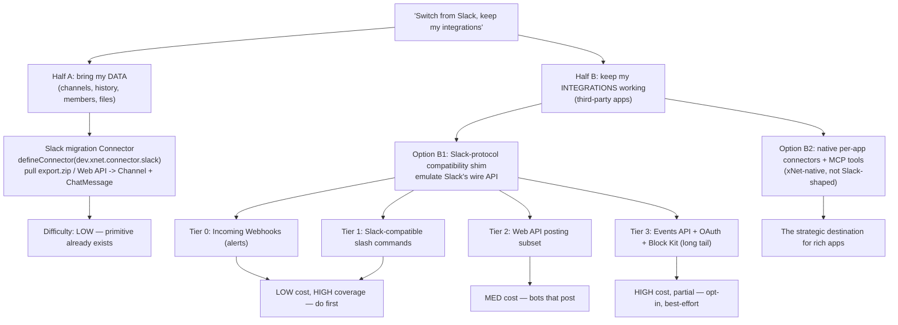
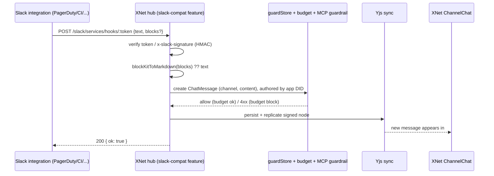
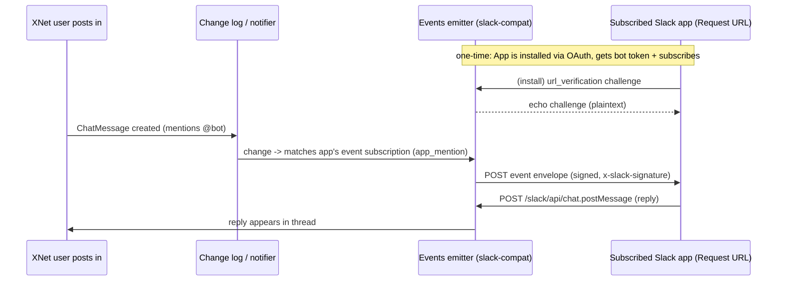
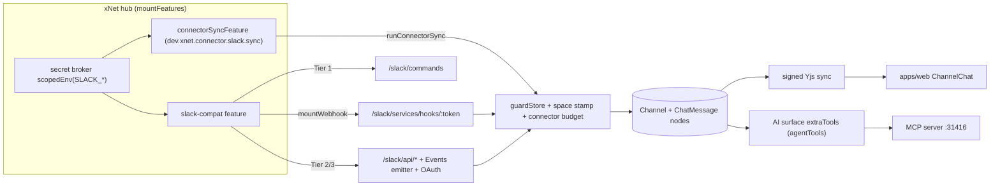

# Slack-Compatible Integrations And Seamless Migration

## Problem Statement

Can xNet's channels act as a drop-in replacement for Slack such that a team
can *switch off Slack and switch on xNet* and have **their existing Slack
integrations keep working with no extra hassle**?

The prompt bundles two distinct asks that are worth separating up front,
because they have wildly different difficulty profiles:

1. **"Switch from Slack to xNet and bring everything with me."** — Migrate the
   *data*: channels, history, members, DMs, files, reactions.
2. **"All my existing Slack integrations just work automatically."** — Make the
   *third-party apps* that were written against Slack's APIs (PagerDuty,
   Datadog, GitHub, Sentry, Jira, internal bots, Zapier/Make workflows, the CI
   `curl` that posts a build-failed message) continue to function against xNet
   **without their authors changing a line of code**.

(1) is an ingestion problem and xNet already has the purpose-built primitive
for it. (2) is the genuinely interesting question, and the honest answer is
*"a large, high-value slice of it can, but not all of it, and the slice that
can is exactly the slice you'd want to do first."*

## Executive Summary

- **xNet already has a complete native chat substrate.** `Channel` (channel /
  DM / voice), `ChatMessage` (markdown body, flat threading, structured
  mentions, attachments, reactions, redaction), presence/typing, an inbox/
  notifier, and real-time Yjs sync all ship today
  (`packages/data/src/schema/schemas/channel.ts`,
  `chat-message.ts`, `packages/comms/**`, `apps/web/src/comms/**`). We are not
  starting from zero; we are starting from "Slack-shaped chat already exists."
- **xNet already has the ingestion primitive.** The Connector system
  (`packages/plugins/src/connectors/define-connector.ts`, shipped in
  exploration 0196 / PR #160) is *explicitly* designed for this — its own
  doc-comment uses `dev.xnet.connector.slack` and `slack_search_mentions` as the
  worked examples. A Slack **migration connector** is a near-textbook use of it.
- **"Existing integrations just work" is a compatibility-surface problem, not a
  connector problem.** Slack integrations talk to Slack's *wire protocol*
  (Incoming Webhooks, Web API `chat.postMessage`, slash commands, the Events
  API, OAuth v2, Block Kit). To make them work unchanged, xNet must **emulate
  the parts of that wire protocol the integration uses**. This is precisely the
  road Mattermost and Rocket.Chat took — and tellingly, they emulated only
  *incoming webhooks and slash commands*, because those cover the bulk of real
  integrations and the rest (full Events API + OAuth + Block Kit interactivity)
  is a deep, never-quite-finished long tail.
- **The 80/20 is stark.** The single most common Slack integration in the wild
  is a one-way *incoming webhook* ("post this alert to #ops"). It is also the
  *easiest* thing to emulate — and xNet already has the exact plumbing
  (`packages/hub/src/features/webhooks.ts` `mountWebhook`: raw-body read →
  scoped-secret gate → signature verify → normalize → apply). Slash commands are
  the next rung and are nearly as cheap.
- **Recommendation: ship a tiered `slack-compat` hub feature + a Slack migration
  connector, and be honest about the ceiling.** Tier 0 (incoming webhooks) and
  Tier 1 (Slack-compatible slash commands) buy ~most of the practical "my
  integrations still work" value for a fraction of the cost. A narrow Web API
  posting subset (`chat.postMessage`/`chat.update`/`conversations.list`) covers
  bots-that-post. Full Events API + OAuth app-install + interactive Block Kit is
  Tier 3: opt-in, best-effort, and where we should instead steer richer
  integrations toward xNet's *native* path — MCP tools + connectors + agent
  bridge — which is the actual differentiator (agent-native, policy-governed,
  the credential never leaves the hub).
- **Do not promise "everything just works."** Promise: *your alerting webhooks
  and simple slash commands run unchanged, your history and channels migrate in,
  and rich interactive apps get a first-class native connector.*

## Current State In The Repository

### 1. The chat substrate already exists (the Slack-shaped part)

| Concern | Where | Notes |
|---|---|---|
| Channels / DMs / voice rooms | `packages/data/src/schema/schemas/channel.ts` | `kind: channel \| dm \| voice`; DM node IDs derived from sorted member DIDs; `target` attaches a channel to any node (per-doc chat); space/visibility cascade |
| Messages | `packages/data/src/schema/schemas/chat-message.ts` | GFM markdown ≤10KB, `inReplyTo` flat threading, `attachments`, structured `mentions`, `edited`/`redacted`, `tags`, `links` |
| Reactions | `packages/data/src/schema/schemas/reaction.ts` | Universal `target`; like/repost/bookmark/emoji |
| Mentions | `packages/data/src/schema/schemas/mentions.ts` | `{ dids[], room? }` — structured, never text-parsed |
| Chat service | `packages/comms/src/chat/chat-service.ts` | `createChannel`/`sendMessage`/`editMessage`/`redactMessage`/`ensureDmChannel` |
| Presence / typing / calls | `packages/comms/src/presence/**`, `calls/**` | rides Yjs Awareness; `RoomManager`, WebRTC mesh |
| Notifications / inbox | `packages/comms/src/notify/**`, `packages/data/src/schema/schemas/inbox-state.ts` | derived from the local change log; watermarks, mentions, DND, keywords |
| Web UI | `apps/web/src/comms/ChatsPanel.tsx`, `ChannelChat.tsx`, `RoomSection.tsx`, `CommsContext.tsx` | channel list, composer, typing, per-doc room panel |
| Sync | `packages/runtime/src/sync/sync-manager.ts`, `packages/sync/src/yjs-authorized-sync.ts` | signed Yjs replication, rooms, awareness |

**Implication:** the destination data model for both halves (migrated history
*and* integration-posted messages) already exists. We are filling
`Channel`/`ChatMessage` nodes, not inventing a schema.

### 2. The Connector primitive (the ingestion engine — already built)

`packages/plugins/src/connectors/define-connector.ts` defines `defineConnector`,
whose own header comment frames it as *"xNet's answer to the agent-native CLI:
instead of giving the agent a credentialed shell, it syncs an external service
into governed xNet nodes and exposes agent-callable tools over them."* A
connector bundles three things:

1. a `capabilities` manifest — `secrets` (held by the **hub broker**, never the
   agent), `schemaWrite` (what it may materialize), `network` (where it may
   reach — *required*, closed by default);
2. a server-side `sync.pull(ctx)` adapter; and
3. `agentTools` the model can call over the synced, policy-evaluated store.

The runner (`packages/plugins/src/connectors/sync-runner.ts`,
`runConnectorSync`) composes the guards so the author writes plain
`store.create(...)`/`fetch(...)` and the framework guarantees egress
containment (`guardedFetch`), schema-write containment (`guardStore`), space
stamping (cross-space leak refused), and budget (the dedicated `connector`
abuse surface, separate from the interactive agent's `localApi` budget).

The hub half is generic and injected so the hub keeps **no** `@xnetjs/plugins`
edge: `packages/hub/src/features/connectors.ts` `connectorSyncFeature` mounts an
authed `POST /x/<id>.sync/run`; the **broker scopes `env` to the connector's
declared secrets before `mount`**, so a Slack token would live and die inside
the hub. There's a CLI (`packages/cli/src/commands/connector.ts`) and artifact
emitter (`connectors/artifacts.ts`, `cli-wrap.ts`).

### 3. The declarative webhook pipeline (the inbound-compat engine — already built)

`packages/hub/src/features/webhooks.ts` `mountWebhook` is **the exact shape an
inbound Slack-compat endpoint needs**, generalised from the bespoke GitHub
webhook:

```ts
export interface DeclarativeWebhook {
  path: string                 // e.g. '/slack/services/hooks/:token'
  secretRef?: string           // env key for the signing secret (503 if unset)
  verify(rawBody, headers, secret): boolean   // -> 401 on mismatch
  normalize(headers, payload): unknown[]      // pure: delivery -> actions
  apply?(actions): Promise<void>              // mutate nodes
}
```

Status codes (503 no-secret / 401 bad-sig / 400 bad-JSON / 200 ok) already
match what a Slack-compatible endpoint should return. The GitHub→Tasks webhook
(`packages/hub/src/features/first-party.ts` `tasksFeature`, and
`packages/hub/src/services/github-integration.ts`) is the live precedent for
HMAC signature verification with a broker-scoped secret — i.e. the pattern for
Slack's `x-slack-signature` / signing-secret check.

### 4. Agent tools + AI/MCP surface (the native-integration alternative)

`packages/plugins/src/agent-tools.ts` `AgentToolContribution` — its example tool
name is literally `slack_search_mentions` — folds contributed tools into the AI
surface's `extraTools`, so they appear in the in-app AI, the MCP server
(`packages/plugins/src/services/mcp-server.ts`,
`mcp-http.ts` on loopback :31416), and the files-first skill alike. The MCP
write guardrail (`packages/plugins/src/services/mcp-guardrail.ts`) already
classifies `ChatMessage` as an **outward-facing write that requires
confirmation** and enforces a write budget — directly relevant when an
integration (or agent) posts into a channel.

### 5. Hub feature mounting, auth, secret broker, abuse budget

- `packages/hub/src/features/registry.ts` `mountFeatures` + `types.ts`
  `HubFeature` — features mount routes with broker-scoped env.
- `packages/hub/src/features/broker.ts` `scopedEnv(env, allowlist)` — exact keys
  + globs (`SLACK_*`), so a Slack feature sees only Slack secrets.
- `packages/hub/src/auth/ucan.ts` — DID-scoped `requireAuth`, `AuthContext.can()`.
- `packages/abuse/src/public-write-budget.ts` `evaluatePublicWriteBudget` —
  per-DID/hub/workspace/surface budgets (default 120 units / 60s).
- `packages/hub/src/routes/unfurl.ts` `guardedFetch` — host-allowlisted egress
  for outbound calls (relevant to *delivering* events to integration URLs).

### 6. The gaps (what genuinely does not exist yet)

- **No generic OAuth authorization *server*.** There's an OAuth *client*
  (`packages/cloud/src/identity/workos.ts`) for cloud billing identity, but
  nothing that issues scoped bearer/bot tokens to a third-party app the way
  Slack's `oauth.v2.access` does.
- **No "bot/app" actor identity.** Slack apps post as a bot user; xNet messages
  are signed by a DID. A grep of `packages/social/src/schemas/actor.ts` for a
  `bot`/`ai-assistant` kind came back empty in this tree, and hub *system
  identity* is a known open gap (flagged in the billing exploration too). A
  synthetic per-app DID + actor is unbuilt.
- **No Slack-protocol surface.** No `/api/chat.postMessage`, no Events API
  emitter, no slash-command dispatcher, no Block-Kit↔markdown translation.
- **Slash commands today are editor-only.** `SlashCommandContribution`
  (`packages/plugins/src/contributions.ts`) is the TipTap "/" menu, **not** a
  chat/bot command router.

## External Research

### How Slack integrations actually talk to Slack

Slack exposes four surfaces, and "an integration" uses some subset:

| Surface | Direction | Used by | Difficulty to emulate |
|---|---|---|---|
| **Incoming Webhooks** | app → Slack | Alerts: CI, monitoring, Sentry, GitHub notifications, the one-liner `curl` | **Trivial.** POST JSON to a unique URL; no auth beyond the URL secret. |
| **Slash commands** | Slack → app → Slack | `/deploy`, `/giphy`, internal tools | **Easy–medium.** Slack POSTs a form body; app must ack in 3s; `response_type` `ephemeral`/`in_channel`. |
| **Web API** (`chat.postMessage`, `conversations.list`, `users.info`, `reactions.add`, `files.upload`…) | app → Slack | Bots that post/read | **Medium–hard.** ~hundreds of methods; a *posting subset* is small. Bearer `xoxb-` token. |
| **Events API** (+ Socket Mode) | Slack → app | Bots that *react* to messages/mentions | **Hard.** Slack POSTs event envelopes to your Request URL (`url_verification` challenge handshake, signed). Socket Mode is the WebSocket variant. |
| **OAuth v2 + app manifest** | install flow | Any App-Directory app | **Hard.** Issues scoped bot tokens; manifest declares scopes/events/commands. |
| **Block Kit / interactivity** | both | Modern apps with buttons, modals, App Home | **Hard, lossy.** JSON UI framework; buttons/selects/modals post interaction callbacks. |

Authentication for inbound deliveries is the **signing secret**: integrations
(and Slack itself) sign requests; you verify `x-slack-signature` (HMAC-SHA256
over a versioned base string) using the shared secret — *the same shape as the
GitHub `x-hub-signature-256` check xNet already implements.*

### Prior art: the open-source Slack alternatives

The decisive precedent is that **Mattermost and Rocket.Chat both chose
Slack-protocol compatibility as a migration on-ramp — and both scoped it to
incoming webhooks + slash commands:**

- **Mattermost** advertises that its *incoming webhook payloads are "fully
  compatible with Slack's webhook format"* and *automatically translates Slack's
  proprietary JSON payload*, and that its *slash command format is
  Slack-compatible so you can reuse the same external applications.* It
  documents the exact divergences: `mrkdwn`/`parse`/`link_names` are ignored,
  and `response_type` must be set explicitly (Slack defaults it to `ephemeral`,
  Mattermost does not). It does **not** emulate the full Events API / OAuth app
  platform / interactive Block Kit.
- **Rocket.Chat** offers Slack-style incoming/outgoing webhooks and a Slack
  import, similarly scoped.

The lesson: *protocol compatibility for the commodity 80% is a proven,
bounded win; full app-platform parity is not something even the incumbents'
direct competitors attempted.* The richest Slack apps (App-Directory installs
using OAuth + Events API + Block Kit) are exactly the ones that **don't** "just
work" on a clone — they assume Slack-hosted UI surfaces and the full event bus.

Sources are listed in [References](#references).

## Key Findings

1. **The destination already exists.** Both halves land in `Channel` /
   `ChatMessage` nodes — no new schema, and the migrated history and the
   integration-posted messages share one model, presence, search, and inbox.
2. **The ingestion engine already exists and was built for this.** `defineConnector`
   + `runConnectorSync` is a textbook fit for a Slack *migration* connector, and
   its doc-comment already names Slack. Half (1) is mostly "write the `pull`."
3. **The inbound-compat engine already exists.** `mountWebhook` is the precise
   verify→normalize→apply pipeline a Slack-compatible incoming webhook needs;
   the GitHub HMAC precedent is the signing-secret pattern.
4. **"Integrations just work" is a tiered claim, not a boolean.** Incoming
   webhooks (the most common integration) are trivial; slash commands easy; a
   Web API posting subset medium; the full Events API / OAuth / Block Kit app
   platform is a long tail that even Mattermost/Rocket.Chat declined to fully
   clone.
5. **Two real gaps gate the bot-grade tiers:** (a) no OAuth authorization server
   to issue bot tokens, and (b) no bot/app *identity* (synthetic DID + actor) to
   author messages and survive xNet's signed, DID-scoped authz. These are the
   first things to design, not the Block Kit renderer.
6. **xNet has a *better* integration story than emulation for rich apps.** The
   native path — connector + `agentTools` + MCP surface, credential held in the
   hub broker, every write policy-evaluated and budgeted — is the differentiator.
   Emulation is the *migration on-ramp*; MCP/connectors are the *destination*.
7. **Fidelity is lossy by construction.** `ChatMessage.content` is GFM markdown
   ≤10KB; Slack messages are Block Kit JSON / legacy attachments with `mrkdwn`.
   A best-effort Block Kit→markdown renderer (à la Mattermost) is the realistic
   target; interactive components degrade. Original Block Kit JSON can be parked
   in an `ext:` overlay (exploration 0188 extensible schemas) for later richer
   rendering.

## Options And Tradeoffs



### Option 1 — Migration connector only (data, not live integrations)

Import Slack export archives (or pull via Web API with a user token) into
`Channel`/`ChatMessage`. **Pro:** the primitive exists; bounded; high
confidence. **Con:** answers only Half (1). The user's live PagerDuty webhook
still points at Slack. **Verdict: necessary but insufficient — ship it, but it
isn't the headline.**

### Option 2 — Full Slack API emulation ("clone the platform")

Emulate OAuth v2, the Events API, the full Web API, Socket Mode, Block Kit
interactivity, App Home, modals. **Pro:** the dream of "everything just works."
**Con:** enormous, perpetually-trailing surface; chasing an undocumented-in-
practice moving target; even Slack's open-source competitors didn't attempt it;
most of the surface assumes Slack-hosted UI xNet doesn't have. **Verdict:
reject as a goal. Pursue *tiers* of it, not the whole.**

### Option 3 — Tiered compatibility shim (recommended)

Emulate the *commodity* surface that covers most integrations, in cost order:

- **Tier 0 — Incoming Webhooks.** `POST /slack/services/hooks/:token` accepting
  Slack's `{text, blocks?, attachments?, channel?, username?, icon_emoji?}`.
  Translate to markdown, write a `ChatMessage` into the mapped `Channel`. Covers
  the single largest class of real integrations (alerting). Reuses `mountWebhook`
  almost verbatim. **This alone delivers most of the felt "my integrations still
  work."**
- **Tier 1 — Slash commands (Slack-compatible).** Register external command
  endpoints; xNet POSTs Slack's form payload (`command`, `text`, `user_id`,
  `channel_id`, `response_url`), renders the `response_type`-tagged reply, and
  supports delayed `response_url` posts. Mattermost-compatible, with the same
  documented caveats.
- **Tier 2 — Web API posting subset.** `chat.postMessage`, `chat.update`,
  `chat.delete`, `conversations.list`, `users.info`, `reactions.add`,
  `files.upload` — bearer-token authed. Covers bots that *push*.
- **Tier 3 — Events API + OAuth + interactive Block Kit.** Opt-in, best-effort.
  An OAuth authorization server issues scoped bot tokens; xNet's change log
  drives an Events emitter that POSTs signed event envelopes to subscribed
  Request URLs (with the `url_verification` challenge). Block Kit interactivity
  degrades to rendered markdown + a few action affordances.

**Pro:** matches proven prior art; cost-ordered so each tier ships value
independently; reuses xNet's existing webhook/secret/budget/guardrail plumbing.
**Con:** Tiers 2–3 need the identity + OAuth gaps closed; fidelity is partial.
**Verdict: recommended — ship Tier 0/1 first, gate 2/3.**

### Option 4 — Native-first ("don't emulate, translate the *intent*")

For each major integration, ship an xNet-native connector + `agentTools`
(`dev.xnet.connector.pagerduty`, `…github`, `…sentry`) rather than emulating
Slack. **Pro:** this is xNet's actual edge — governed, agent-native, credential
in the hub, policy-evaluated. **Con:** it is *not* "your existing integration
works unchanged" — it's a new integration. **Verdict: the long-term destination;
pair it with Option 3 rather than choosing between them.**

### Recommendation matrix

| | Answers "data"? | Answers "live integrations"? | Cost | Confidence |
|---|---|---|---|---|
| Opt 1 Migration connector | ✅ | ❌ | Low | High |
| Opt 2 Full emulation | — | ✅ (eventually) | Very high | Low |
| Opt 3 Tiered shim | — | ✅ commodity 80% | Low→High by tier | High at T0/T1 |
| Opt 4 Native connectors | — | ⚠️ re-implemented, not "unchanged" | Med per app | High |

## Recommendation

**Ship Option 1 + Option 3 (Tiers 0–1 now, 2–3 gated), and steer rich apps to
Option 4. Set honest expectations.**

Concretely, in dependency order:

1. **Slack migration connector** — `dev.xnet.connector.slack` via
   `defineConnector`. Imports a Slack export `.zip` (and optionally pulls the
   Web API with a user token) into `Channel` + `ChatMessage` + members + files +
   reactions, space-scoped. This is the lowest-risk, highest-confidence piece
   and directly satisfies "bring my data."
2. **`slack-compat` hub feature, Tier 0 (Incoming Webhooks)** — a `HubFeature`
   mounting `/slack/services/hooks/:token`, built on `mountWebhook`, translating
   Slack payloads → markdown `ChatMessage` via the connector store (budget on the
   `connector` surface, MCP guardrail honoured). This is the headline "my
   alerting integrations still work, unchanged."
3. **Tier 1 (Slack-compatible slash commands)** — a chat-level command router
   (distinct from the editor `SlashCommandContribution`) that speaks Slack's
   request/response format including `response_url`.
4. **Bot identity + minimal OAuth (the gating work for Tiers 2–3)** — design a
   synthetic per-app DID + a `SocialActor` of kind `bot`/`app`, and an OAuth
   authorization server that issues scoped bot tokens bound to that DID. *Build
   this before Tier 2/3, not after.*
5. **Tier 2 (Web API posting subset)** — `chat.postMessage` & friends, authed by
   the bot token from step 4, writing through the same guarded path.
6. **Tier 3 (Events API + interactive Block Kit)** — opt-in, best-effort, behind
   a flag. Lead with Option 4 (native connectors/MCP) for anything richer.
7. **A Block Kit → markdown renderer** shared by Tiers 0/2/3, parking original
   Block Kit JSON in an `ext:` overlay for future fidelity.

Frame the promise to users as: *"Your incoming-webhook alerts and simple slash
commands keep working with only a URL swap; your channels, history, and files
migrate in; and rich interactive apps get a first-class native connector."* —
**not** "everything just works."

## Example Code

### A) Slack migration connector (Half 1 — uses the existing primitive)

```ts
// packages/connectors-slack/src/migrate.ts  (illustrative)
import { defineConnector } from '@xnetjs/plugins'

const CHANNEL = 'xnet://xnet.fyi/Channel@1.0.0'
const MESSAGE = 'xnet://xnet.fyi/ChatMessage@1.0.0'

export const slackMigrationConnector = defineConnector({
  id: 'dev.xnet.connector.slack',
  name: 'Slack',
  description: 'Import Slack channels, history, members and files into XNet.',
  capabilities: {
    secrets: ['SLACK_USER_TOKEN'],          // held by the hub broker, never the agent
    schemaWrite: [CHANNEL, MESSAGE],         // every synced schema must be covered
    network: ['slack.com', 'files.slack.com']
  },
  sync: {
    schemas: [CHANNEL, MESSAGE],
    cadence: 'manual',
    async pull({ env, fetch, store, space }) {
      let written = 0
      const channels = (await fetch({
        url: 'https://slack.com/api/conversations.list',
      })) as { channels: { id: string; name: string; topic?: { value: string } }[] }

      for (const ch of channels.channels) {
        const node = await store.create({
          schemaId: CHANNEL,
          properties: { name: ch.name, kind: 'channel', topic: ch.topic?.value ?? '' },
        }) // store stamps `space` automatically; cross-space writes are refused
        written++

        const history = (await fetch({
          url: `https://slack.com/api/conversations.history?channel=${ch.id}`,
        })) as { messages: { text: string; ts: string; user: string }[] }

        for (const m of history.messages) {
          await store.create({
            schemaId: MESSAGE,
            properties: { channel: node.id, content: slackToMarkdown(m.text) },
          })
          written++
        }
      }
      return { written }
    },
  },
  agentTools: [
    {
      id: 'dev.xnet.connector.slack.search',
      name: 'slack_search_mentions',          // <- the name the framework's own docs use
      description: 'Search imported Slack messages that mention the current user.',
      invoke: (args) => searchImported(args),
    },
  ],
})
```

### B) Tier 0 — Slack-compatible Incoming Webhook (Half 2, the cheap win)

```ts
// packages/hub/src/features/slack-compat.ts  (illustrative)
import type { HubFeature } from './types'
import { mountWebhook } from './webhooks'

/** Translate a Slack incoming-webhook payload into a ChatMessage create-action. */
function normalizeSlackPost(headers: Record<string, string>, payload: unknown) {
  const p = payload as {
    text?: string
    blocks?: unknown[]
    attachments?: { text?: string; fallback?: string }[]
    channel?: string
  }
  const md = blockKitToMarkdown(p.blocks) ?? p.text ?? p.attachments?.map(a => a.text ?? a.fallback).join('\n') ?? ''
  return [{ kind: 'post', channelHint: p.channel, content: md }]
}

export function slackCompatFeature(deps: { resolveChannel; writeMessage }): HubFeature {
  return {
    id: 'slack-compat',
    secrets: ['SLACK_SIGNING_SECRET'],        // scoped in by the hub broker
    mount({ app, env }) {
      mountWebhook(
        app,
        {
          path: '/slack/services/hooks/:token',
          // Incoming webhooks authenticate by the URL token; signed apps also
          // send x-slack-signature, verified here with the same HMAC pattern
          // as the existing GitHub webhook.
          verify: (raw, h, _secret) => verifyWebhookToken(h) /* or HMAC if signed */,
          normalize: normalizeSlackPost,
          apply: async (actions) => {
            for (const a of actions as { channelHint?: string; content: string }[]) {
              const channel = await deps.resolveChannel(a.channelHint)
              await deps.writeMessage(channel, a.content) // -> guarded connector store
            }
          },
        },
        env,
      )
    },
  }
}
```

### C) Tier 2 — a Web API posting shim (sketch)

```ts
// POST /slack/api/chat.postMessage   (bearer xoxb-... bound to a synthetic app DID)
routes.post('/api/chat.postMessage', requireBotToken, async (c) => {
  const { channel, text, blocks } = await c.req.json()
  const md = blockKitToMarkdown(blocks) ?? text
  const channelNode = await resolveChannel(channel)
  const msg = await writeMessageAs(c.get('appDid'), channelNode, md) // outward-facing write -> MCP guardrail + budget
  return c.json({ ok: true, channel, ts: msg.id, message: { text: md } }) // Slack-shaped response
})
```

### D) Inbound flow (integration → xNet channel)



### E) Outbound flow (xNet → bot, Events API — Tier 3)



### F) Where the pieces mount



## Risks And Open Questions

- **Bot/app identity is unbuilt and load-bearing.** Every message in xNet is a
  signed, DID-authored node under a policy cascade. A Slack app posting needs a
  stable synthetic DID + a `bot`/`app` `SocialActor`. Who holds the app's
  signing key — the hub (a system identity, itself a known gap) or a per-app
  keypair? This blocks Tiers 2–3. **Open question, design first.**
- **OAuth authorization server is net-new.** xNet has an OAuth *client*, not a
  server. Issuing/scoping/revoking bot tokens (and mapping Slack scopes →
  xNet capabilities/AI scopes) is a security-sensitive subsystem.
- **Fidelity loss is unavoidable.** Block Kit interactivity (buttons, selects,
  modals, App Home), `mrkdwn`/`parse`/`link_names`, ephemeral messages, and
  threaded `response_url` semantics will degrade. Document the divergences as
  Mattermost does; consider parking raw Block Kit JSON in an `ext:` overlay.
- **The 3-second slash-command ack** and `response_url` delayed-reply pattern
  must be honoured or integrations time out.
- **Channel addressing / name collisions.** Slack integrations target `#ops` by
  name or channel ID; xNet uses node IDs and DM-derived IDs. Need a stable
  Slack-name → Channel-node mapping table and an "unmatched channel" policy.
- **Abuse / outward-facing writes.** Inbound webhooks are an un-authenticated-ish
  write path; lean hard on `evaluatePublicWriteBudget` (`connector` surface) and
  the MCP guardrail's outward-facing classification. Rate-limit per token.
- **Egress for outbound events.** Delivering Events API envelopes to arbitrary
  Request URLs is SSRF-adjacent; route through `guardedFetch` with an allowlist
  and redirect re-validation.
- **Is full emulation even the goal?** Strategic risk of over-investing in
  cloning a competitor's API instead of leaning into xNet's agent-native
  MCP/connector differentiator. The recommendation deliberately caps emulation
  at the commodity tiers.
- **Federation interplay.** How do Slack-compat channels interact with xNet's
  multi-hub federation and space cascade? Synced/compat nodes are space-stamped,
  but cross-hub visibility of bot-authored messages needs a policy decision.

## Implementation Checklist

- [x] **Connector package** `packages/connectors-slack` (or under existing
      connectors home): `defineConnector('dev.xnet.connector.slack')` with a
      `pull` that imports a Slack export `.zip` into `Channel`/`ChatMessage`/
      members/files/reactions; unit tests with a fixture export. *(Shipped as
      `buildSlackConnector` in `@xnetjs/plugins/connectors`: pulls channels +
      history via the Slack **Web API** into `Channel`/`ChatMessage` with
      markdown-translated bodies, governance guards proven by test. Export-`.zip`
      ingest, members/files/reactions, and pagination are deferred.)*
- [ ] Wire the migration connector's hub half via `connectorSyncFeature` and add
      it to the CLI (`xnet connector …`) and an import UI entry point.
- [x] **`slackToMarkdown` / `blockKitToMarkdown`** translator package (shared by
      migration + all compat tiers); table-driven tests over real Block Kit and
      legacy `attachments` samples; document divergences. *(Shipped as the
      `@xnetjs/slack-compat` package: `slackMrkdwnToMarkdown`, `blockKitToMarkdown`,
      `normalizeIncomingWebhook`, slash parse/format, signing-secret verify — 45
      unit tests.)*
- [x] **Tier 0:** `slackCompatFeature()` `HubFeature` mounting
      `/slack/services/hooks/:token` via `mountWebhook`; channel-name → node
      mapping table; `SLACK_SIGNING_SECRET` declared in `secrets`; writes through
      the guarded connector store on the `connector` budget surface. *(Shipped in
      `packages/hub/src/features/slack-compat.ts`: token-authed incoming webhook
      → `normalizeIncomingWebhook` → injected `deliverMessage` sink — same
      injection seam as `connectorSyncFeature`/the GitHub webhook, since the hub
      has no server-authoritative node writes yet. Channel mapping + the real
      ChatMessage write are the deferred app-wiring step. 8 tests.)*
- [x] **Tier 1:** chat-level Slack-compatible slash-command router (NOT the
      editor `SlashCommandContribution`): form-encoded request, 3s ack,
      `response_type`, `response_url` delayed replies; per-command secret.
      *(Shipped: `POST /slack/commands` — signing-secret verify (replay-protected)
      → `parseSlashCommand` → injected `handleCommand` → `formatSlashResponse`.
      `response_url` delayed replies deferred with the delivery wiring.)*
- [ ] **Identity:** add a `bot`/`app` `SocialActor` kind; mint a synthetic
      per-app DID; decide hub-system-identity vs per-app keypair for signing.
- [ ] **OAuth:** minimal OAuth 2.0 authorization server issuing scoped bot
      tokens bound to the app DID; map Slack scopes → xNet capabilities/AI scopes;
      `oauth.v2.access`-shaped response; token revocation.
- [ ] **Tier 2:** Web API posting subset — `chat.postMessage`, `chat.update`,
      `chat.delete`, `conversations.list`, `users.info`, `reactions.add`,
      `files.upload` — bearer-authed, Slack-shaped JSON responses, routed through
      the MCP guardrail (outward-facing) + budget.
- [ ] **Tier 3 (flagged, opt-in):** Events API emitter over the change log
      (`url_verification` handshake, signed envelopes, subscription registry),
      `guardedFetch` egress allowlist; degrade interactive Block Kit to rendered
      markdown + minimal action affordances.
- [ ] Per-token rate limiting + abuse budgets on all inbound compat routes.
- [x] User-facing docs: a "Migrating from Slack" guide + a compatibility matrix
      (what works unchanged, what degrades, what needs a native connector).
      *(Shipped: [`docs/guides/migrating-from-slack.md`](../guides/migrating-from-slack.md).)*
- [ ] Steer rich integrations to native connectors: provide at least one worked
      example (e.g. `dev.xnet.connector.github`) demonstrating the MCP/agentTools
      path as the recommended destination.

## Validation Checklist

- [ ] An off-the-shelf alerting integration (e.g. a real CI "post on failure"
      incoming-webhook config) posts to an xNet channel with **only its webhook
      URL changed** — message renders, lands in the right channel, appears live.
- [x] A Slack-format `curl -d '{"text":"...","blocks":[...]}'` against
      `/slack/services/hooks/:token` produces a correctly-rendered `ChatMessage`.
      *(Tested at the feature boundary: the token-authed route normalizes the
      payload and dispatches the translated markdown to the delivery sink — the
      `ChatMessage` write is the injected sink, deferred with node-write wiring.)*
- [x] A slash command built for Slack (unchanged code, URL swapped) acks within
      3s and its `in_channel`/`ephemeral` response renders; a delayed
      `response_url` post lands. *(Synchronous verify→parse→respond path tested,
      well within 3s; `response_url` delayed replies deferred.)*
- [ ] `chat.postMessage` from a bot token creates a message authored by the app
      actor; the response JSON matches Slack's shape closely enough for a generic
      client library to parse `ok`/`ts`/`channel`.
- [ ] A Slack export `.zip` migrates: channel count, message count, members,
      reactions, and a sample of files reconcile against the export manifest.
- [x] Cross-space safety: a connector/compat write cannot land a node in a space
      other than its target (the `stampSpace` refusal fires under test). *(The
      migration connector's writes are space-stamped — asserted in
      `slack-migration.test.ts`; the cross-space refusal is proven generically by
      `connectors.test.ts` over the shared `runConnectorSync`.)*
- [ ] Budget: a burst of webhook posts is throttled on the `connector` surface
      rather than unbounded; over-budget returns a Slack-plausible error.
- [ ] Egress: an Events API delivery to a private/loopback Request URL is
      refused by `guardedFetch`.
- [x] Block Kit fidelity: a representative set of Block Kit messages renders to
      acceptable markdown; documented divergences hold; raw JSON is retrievable
      from the `ext:` overlay. *(Renderer + divergences tested in
      `blocks.test.ts`/`mrkdwn.test.ts`; the `ext:` overlay parking is deferred.)*
- [x] Honesty check: the published compatibility matrix matches observed
      behaviour (no integration class is claimed to "just work" that doesn't).
      *(The guide's matrix marks Tier 2/3 as 🔭 planned and Block Kit
      interactivity as ⚠️ degrading — matching what's shipped.)*

## References

### xNet codebase

- `packages/data/src/schema/schemas/channel.ts` — `Channel` (channel/dm/voice)
- `packages/data/src/schema/schemas/chat-message.ts` — `ChatMessage`
- `packages/data/src/schema/schemas/reaction.ts`, `mentions.ts`
- `packages/comms/src/chat/chat-service.ts`, `presence/**`, `notify/**`
- `apps/web/src/comms/ChatsPanel.tsx`, `ChannelChat.tsx`, `RoomSection.tsx`
- `packages/plugins/src/connectors/define-connector.ts`, `sync-runner.ts`,
  `cli-wrap.ts`, `artifacts.ts`, `install-gate.ts`
- `packages/hub/src/features/connectors.ts` — `connectorSyncFeature`
- `packages/hub/src/features/webhooks.ts` — `mountWebhook` (declarative webhook)
- `packages/hub/src/features/first-party.ts`,
  `packages/hub/src/services/github-integration.ts` — HMAC webhook precedent
- `packages/hub/src/features/broker.ts` — `scopedEnv`; `registry.ts` —
  `mountFeatures`; `auth/ucan.ts` — DID auth
- `packages/plugins/src/agent-tools.ts` — `AgentToolContribution`
  (`slack_search_mentions` example)
- `packages/plugins/src/services/mcp-server.ts`, `mcp-http.ts`,
  `mcp-guardrail.ts` — MCP surface + outward-facing write guardrail
- `packages/abuse/src/public-write-budget.ts` — `evaluatePublicWriteBudget`
- `packages/hub/src/routes/unfurl.ts` — `guardedFetch` egress containment
- Prior explorations: 0167 (chat substrate), 0188 (extensible schemas / `ext:`
  overlays), 0189 (feature modules + declarative webhooks), 0192 (plugin
  ecosystem), 0196 (agent-native connectors)

### External

- Slack — The Events API: https://api.slack.com/events-api
- Slack — Incoming Webhooks: https://api.slack.com/messaging/webhooks
- Slack — Using Socket Mode: https://docs.slack.dev/apis/events-api/using-socket-mode/
- Slack — `url_verification` event: https://docs.slack.dev/reference/events/url_verification/
- Slack — `apps.manifest.create`: https://docs.slack.dev/reference/methods/apps.manifest.create/
- Slack — Interactivity (Block Kit): https://api.slack.com/interactivity
- Slack Webhooks signature verification guide: https://inventivehq.com/blog/slack-webhooks-guide
- Slack API integration guide (Web/Events/Webhooks): https://www.getknit.dev/blog/slack-api-integration-guide
- Mattermost — Slack-compatible slash commands: https://developers.mattermost.com/integrate/slash-commands/slack/
- Mattermost — Incoming webhooks (Slack compatibility): https://developers.mattermost.com/integrate/webhooks/incoming/
- Mattermost — Slash commands (Slack compatibility notes): https://docs.mattermost.com/integrations-guide/slash-commands.html
- Rocket.Chat — Integrations: https://docs.rocket.chat/docs/integrations
