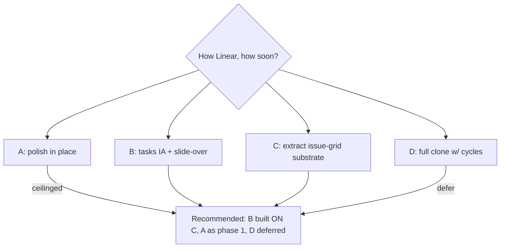
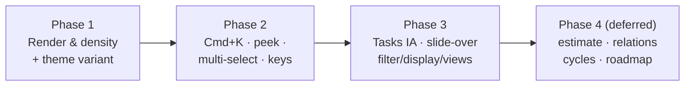

# Linear-Grade Tasks UI & UX

## Problem Statement

The xNet tasks surface (`/tasks`) is "a little bit like Linear" — it borrows
Linear's status glyphs, priority bars, grouped list, and a handful of
single-key verbs. But it stops well short of the experience that makes Linear
feel like Linear: the keyboard-first navigation, the `Cmd+K` command menu that
acts on the focused issue, peek-preview, multi-select + bulk edit, a real
filter/display-options system, saved views, a detail slide-over with a
right-hand properties rail, and the relentless density/speed polish.

The ask: **make the tasks interface look and behave a lot more like Linear** —
specifically how you *navigate*, *view*, and *render* tasks. This exploration
maps what already exists, studies Linear's patterns concretely, and lays out a
phased plan to close the gap *without* discarding xNet's two load-bearing
opinions: (1) a task is one canonical node projected across many surfaces
(exploration [0161]), and (2) chrome is monochrome — "hue belongs to data"
(exploration [0166]).

## Executive Summary

The good news: **xNet is already ~60% of the way there, structurally.** The
status icons (`TaskStatusIcon.tsx`) and priority bars are near-pixel copies of
Linear's. `cmdk` is already a dependency. There is a scoped `CommandRegistry`
with chord support, a grouped list, a `@dnd-kit` board, single-key verbs
(`j/k/x/s/p/d`), and a local-first sync engine that gives optimistic updates
*for free* — the thing Linear spent years engineering. The missing pieces are
mostly **interaction surface area and information architecture**, not
foundations.

The gap to "a lot like Linear" decomposes into five workstreams:

1. **Navigation / IA** — there is no Inbox / My Issues / Projects / Views
   left-nav for tasks; `/tasks` is a single flat surface reached from the
   workbench rail.
2. **Rendering & density** — rows are close, but group headers, the two-zone
   metadata layout, sticky headers, and display-density toggles are thin.
3. **The command menu** — `CommandPalette` exists but opens on `Cmd+Shift+P`
   and is not *context-aware* of the focused/selected task; Linear's `Cmd+K`
   is.
4. **Signature interactions** — peek (`Space`), multi-select + bulk-edit bar,
   a detail slide-over with a properties rail, the `C` create-issue modal.
5. **Filtering & views** — no filter bar, no display-options popover (group /
   sub-group / order / show-hide properties), no saved views.

**Recommendation:** a four-phase build that keeps xNet's monochrome chrome and
cross-surface node model, adopts Linear's *layout, density, keyboard model, and
IA*, and extracts the reusable pieces (`IssueList`, `PropertiesRail`,
`DisplayOptions`, `FilterBar`, context-aware `CommandMenu`) into
`@xnetjs/views` so CRM, database, and experiments inherit them too. Offer the
violet "Linear look" as an opt-in theme variant rather than redefining the
default tokens.

```mermaid
flowchart LR
  subgraph Have["Already shipped (~60%)"]
    A1[Status/priority glyphs]
    A2[cmdk dependency]
    A3[Scoped CommandRegistry + chords]
    A4[Grouped list + dnd-kit board]
    A5[j/k/x/s/p/d verbs]
    A6[Local-first optimistic sync]
  end
  subgraph Gap["The Linear gap"]
    B1[Tasks IA: Inbox/My Issues/Views]
    B2[Cmd+K context actions]
    B3[Peek + multi-select + bulk bar]
    B4[Detail slide-over + properties rail]
    B5[Filter bar + display options + saved views]
  end
  Have --> Gap
```



## Current State In The Repository

### The surface

| Concern | File | Notes |
|---|---|---|
| Route | [`apps/web/src/routes/tasks.tsx`](apps/web/src/routes/tasks.tsx) | `?task=` deep-link, `?project=` scope |
| Main view | [`apps/web/src/components/TasksView.tsx`](apps/web/src/components/TasksView.tsx) | Tabs (All/My/Triage), list/board toggle, quick-add, mini-palettes |
| Project header | [`apps/web/src/components/ProjectHeader.tsx`](apps/web/src/components/ProjectHeader.tsx) | Status, target date, inline milestone CRUD |
| Inline editor | [`apps/web/src/components/TaskInlineEditor.tsx`](apps/web/src/components/TaskInlineEditor.tsx) | Opens in-list (expanded) or as a centered modal overlay |
| List (grouped) | [`packages/views/src/tasks/TaskListGrouped.tsx`](packages/views/src/tasks/TaskListGrouped.tsx) | Collapsible status groups |
| Board (kanban) | [`packages/views/src/tasks/TaskBoard.tsx`](packages/views/src/tasks/TaskBoard.tsx) | `@dnd-kit` column-per-status |
| Grouping/sorting | [`packages/views/src/tasks/grouping.ts`](packages/views/src/tasks/grouping.ts) | `groupTasksByStatus`, `sortTasksBySortKey`, `TASK_WORKFLOW_ORDER` |

### The rendered row, today

[`TaskRow.tsx`](packages/ui/src/composed/tasks/TaskRow.tsx) is already a tidy
Linear-style row — `h-9` (36px), `group` hover, focus ring, status glyph +
priority bars + mono shortId + truncating title + GitHub badges + reference
count + due date + stacked assignee avatars:

```tsx
// TaskRow.tsx:48 — the row is already dense and two-zone
className={cn(
  'group flex h-9 cursor-pointer items-center gap-2 rounded-md px-2 text-sm',
  'transition-colors hover:bg-background-subtle',
  focused && 'bg-background-subtle ring-1 ring-ring',
)}
```

The status icon ([`TaskStatusIcon.tsx`](packages/ui/src/composed/tasks/TaskStatusIcon.tsx))
renders the exact Linear vocabulary: dashed ring (triage/backlog), open ring
(unstarted), half-fill (started), filled-with-check (done), crossed
(cancelled). The priority icon renders Linear's ascending bars + an urgent
exclamation. **These do not need to change** — they are the part that already
"looks like Linear."

### The data model

[`packages/data/src/schema/schemas/task.ts`](packages/data/src/schema/schemas/task.ts)
already carries a Linear-grade field set: `title`, `shortId` (hub-allocated
`XN-142`), `status` (triage/backlog/todo/in-progress/in-review/done/cancelled),
`priority`, `dueDate`, `assignee`+`assignees`, `parent` (sub-issues),
`project`, `milestone`, `tags` (labels), `references` (PRs/issues), `sortKey`
(fractional ordering), plus xNet-specific `page`/`canvas`/`anchorBlockId` (the
cross-surface projection), `space`/`visibility` (auth), and a collaborative
`document` description. Status→category mapping lives in `types.ts`
(`TASK_STATUS_META`).

**What the model lacks vs. Linear:** `estimate`, `cycle` (sprints),
issue↔issue relations beyond `parent` (blocks / blocked-by / related /
duplicate), and a `SavedView` / `Filter` node.

### Keyboard + command infrastructure

- [`packages/plugins/src/commands.ts`](packages/plugins/src/commands.ts) — a
  real `CommandRegistry`: scope stack, single-key verbs auto-suppressed in
  inputs, chord sequences (`g t`) with a 1000ms window, `Mod-`/`Shift-` parsing.
- `TasksView` registers a `surface:tasks` scope (`j/k` navigate, `c`
  quick-add) and a `task-focused` scope (`x` toggle complete, `s` status, `p`
  priority, `d` due date, `enter` open, `Mod+Shift+.` copy branch name) —
  [`TasksView.tsx:186-317`].
- [`packages/ui/src/composed/CommandPalette.tsx`](packages/ui/src/composed/CommandPalette.tsx)
  — a 371-line `cmdk`-backed fuzzy palette, opened on `Cmd+Shift+P`.

### Design tokens

[`packages/ui/src/theme/tokens.css`](packages/ui/src/theme/tokens.css) is the
key constraint. It is a deliberately **monochrome** APCA-tuned ramp
(`--surface-0..2`, `--ink-1..3`, `--hairline`, `--accent-ink`) with a hard
rule: *"Semantic red/green/orange survive only for user data … data may have
color; chrome may not."* Dark mode is `#0A0A0A` with a `true-black` OLED
variant. This directly collides with Linear's signature blue-violet
(`#5e6ad2`) accent — a tension this doc must resolve, not ignore.

### The workbench shell

Navigation is router-authoritative
([`apps/web/src/workbench/navigation.ts`](apps/web/src/workbench/navigation.ts)):
the rail/explorer routes to surfaces (`/tasks`, `/doc/$id`, `/db/$id`, …).
There is **no task-specific sub-navigation** — `tasks` is one entry among
pages, canvases, databases, channels. Mobile has its own `MobileShell.tsx`
(exploration [0196]).

### Prior explorations

- **[0161]** `LINEAR_STYLE_TASKS_AS_A_PORTABLE_CROSS_SURFACE_PRIMITIVE` `[x]` —
  shipped the canonical-node model, `TaskChip/Card/Row` family, the
  list/board/triage surface, and the command registry. This doc is its
  *visual/interaction* sequel.
- **[0103]** `TASKS_EMBEDDED_IN_PAGES…` `[-]` — node-backed embedded tasks;
  canvas source-backed cards still deferred.
- **[0172]** `TASK_DUE_DATES_AND_RICH_INLINE_EDITING` `[_]` — flags a latent
  timezone bug (node UTC-ms vs editor `YYYY-MM-DD`) and a single-trigger
  `MentionTextInput` (only `@`, not `#`/`[[`/date everywhere). Worth folding
  into this work.

## External Research

Linear's experience is a tightly integrated system. The pieces that matter for
"navigate / view / render":

### Navigation model

- **Left sidebar** (~220–240px, one step dimmer than content): Workspace
  header → **Inbox** (`G I`) / **My Issues** (`G M`) / **Triage** (`G T`) →
  per-team **Issues** (Active `G A` / Backlog `G B` / All `G E`), **Cycles**
  (`G C`), **Projects** (`G P`), **Views** → **Favorites** (drag-reorder,
  foldering).
- **`Cmd+K` command menu** — the spine. Full-screen centered overlay,
  fuzzy-searches the *in-memory* model (zero network), and is **context-aware**:
  with an issue focused it surfaces issue actions first. `→` on a result peeks.
- **Keyboard-first**: single letters for actions, two-letter `G _` for
  navigation, `O _` for pickers, `J/K` to move, `Space` to peek, `X` to select.

### Issue list rendering

- Row ≈ 36–40px. Left zone: hover-checkbox → priority glyph → status glyph →
  `TEAM-123` (mono, muted) → title. Right zone (right-aligned, all toggleable):
  labels → project → cycle → estimate → due date (red when overdue) → assignee
  avatar.
- **Group headers**: chevron + group glyph + name + **count badge** + hover
  "+add"; sticky while scrolling; empty groups hideable. Dragging a row across
  group boundaries mutates that property (status/priority/assignee).

### Board

- Column per workflow status, ordered by workflow; hidden columns collapse to a
  right rail. Card: priority glyph + ID + title (wraps) + labels + avatar + due
  + estimate; **descriptions never on cards**. `Alt+←/→` moves columns by
  keyboard. No WIP limits.

### The keyboard model (the signature)

| Class | Examples |
|---|---|
| Command menu | `Cmd+K` |
| Navigate | `J/K`, `↑/↓`, `Enter`/`O` open, `Space` peek, `Esc` back |
| `G _` go-to | `G I` inbox, `G M` my issues, `G A` active, `G B` backlog, `G P` projects, `G V` active cycle |
| `O _` pickers | `O P` project, `O C` cycle, `O U` user |
| Issue actions | `C` create, `S` status, `P` priority, `A` assign, `I` assign-to-me, `L` label, `R` rename, `X` select |
| Reorder | `Alt+↑/↓` move in group, `Alt+←/→` move column |
| Relations | `M B` blocked-by, `M X` blocking, `M R` related, `M M` duplicate |
| Clipboard | `Cmd+.` copy id, `Cmd+Shift+.` copy branch, `Cmd+Shift+,` copy URL |
| Bulk / select | `X` toggle, `Shift+Click` range, `Cmd+A` select all |

### Detail view

- **Split-view slide-over** by default (issue opens in a right panel; list stays
  left); `V` / direct nav opens full-screen (`/issue/TEAM-123`). `Cmd+I`
  toggles the **right-hand properties rail** (~240px): Status, Priority,
  Assignee, Labels, Project, Milestone, Cycle, Due, Estimate, Subscribers,
  Relations (blocks/blocked-by/related/duplicate), **Sub-issues**, metadata
  footer. Every property edits inline via a floating picker.

### Filtering & views

- `F` opens a **filter bar** of `Property: Value` chips; `Shift+F` removes last,
  `Alt+Shift+F` clears.
- `Shift+V` opens **Display Options**: Grouping, Sub-grouping, Ordering, and
  Show/Hide of every property column, plus Show-sub-issues / Show-empty-groups.
- Any filtered+configured state is saveable as a named **View** (personal /
  team / workspace), surfacing in the sidebar.

### Visual language

- Dark-by-default; LCH-derived palette (~12 base colors). Accent blue-violet
  `#5e6ad2`. Inter (Inter Display for headings), Berkeley Mono for IDs.
- "No chrome": flat rows (no shadows), 1px hairlines only where structural,
  monochrome icons that gain color only semantically.
- **Animation as a speed signal**: 100–250ms, only `transform`/`opacity`
  (GPU-composited), spring easing (Emil Kowalski). "The best animations are the
  ones you don't notice."
- **Optimistic everything**: local state updates immediately; no spinners on
  property change. (xNet's local-first sync already gives this.)

### Buildable references

- **`cmdk`** (Paco Coursey) — the command menu lib (already a dep). `shadcn/ui`
  wraps it as `<Command>`.
- Linear-clone repos to study: `thenameiswiiwin/linear-clone` (Next + Tailwind),
  `TheBoyWhoLivedd/linear-clone` (shadcn), `tuan3w/linearapp_clone`.
- Theme extractions: `tweakcn.com` (shadcn Linear preset), `copycats.design/linear-app`
  (tokens → Tailwind/Figma/W3C).
- Linear's own write-ups: *A Design Reset* and *How We Redesigned the Linear
  UI*; *How is Linear So Fast* (performance.dev); Emil Kowalski's `animations.dev`.

## Key Findings

1. **The atoms are done; the molecules and IA are missing.** Glyphs, rows,
   cards, the registry, and cmdk all exist. What's absent is the *assembly*:
   context-aware `Cmd+K`, peek, multi-select, properties rail, filter/display
   system, and a tasks-specific navigation.
2. **`x` means the wrong thing.** Today `x` toggles completion; in Linear `x`
   *selects*. Aligning the keyboard model requires a deliberate migration
   (completion is the checkbox click / `Enter`-on-status; `x` becomes select).
3. **xNet can do something Linear can't.** Tasks are projections of canonical
   nodes across pages/canvas/db ([0161]). The Linear-ification must enrich the
   `/tasks` projection without breaking the others — the new detail rail and
   selection model live in the *view layer*, never in the node.
4. **The accent-color tension is real and must be a decision, not a drift.**
   xNet's tokens forbid hue in chrome; Linear's identity *is* a violet chrome.
   Resolve explicitly (recommended: keep monochrome default, ship a Linear
   theme variant).
5. **Optimistic speed is already native.** `useMutate`/`useTasks` write
   local-first; there is no network wait to engineer away. The "feels instant"
   half of Linear is mostly free here.
6. **Reuse pressure points outward.** A `PropertiesRail`, `FilterBar`,
   `DisplayOptions`, and context `CommandMenu` are exactly what CRM, database
   views, and experiments also want. Build them in `@xnetjs/views`, not inside
   `apps/web` task code.

## Options And Tradeoffs

### Option A — Incremental polish inside the current `TasksView`

Tighten density, add a filter bar, peek, and multi-select within the existing
single-surface shell.

- **Pros:** lowest risk; ships value fast; no IA upheaval; no new routes.
- **Cons:** never reaches "a lot like Linear" because the *navigation* (Inbox /
  My Issues / Views / detail slide-over) is the half the user explicitly named.
  Ceilinged.

### Option B — Dedicated Tasks "app" with Linear IA

Give `/tasks` its own left sub-nav (Inbox, My Issues, Projects, Views,
optionally Cycles), saved views, and a detail slide-over with a properties rail.

- **Pros:** delivers the navigation + view + render trifecta the user asked
  for; matches Linear's mental model; saved views unlock power use.
- **Cons:** larger surface; introduces a nav-within-nav inside the workbench
  rail (must not feel like two competing sidebars); new `SavedView`/`Cycle`
  schemas; mobile shell needs a parallel treatment.

### Option C — Extract a reusable "issue-grid" substrate

Build B's pieces as generic primitives in `@xnetjs/views`
(`IssueList`, `PropertiesRail`, `FilterBar`, `DisplayOptions`, `CommandMenu`)
and have CRM / database / experiments consume them.

- **Pros:** matches xNet's "generic substrate, bespoke overrides" doctrine
  (exploration [0190]); one investment, many surfaces; avoids a tasks-only
  fork.
- **Cons:** more up-front design; risk of over-abstracting before the second
  consumer is real. Mitigate by shipping tasks-first, then generalizing what
  proves stable.

### Option D — Full-fidelity clone (cycles, roadmap, triage workflow, SLAs)

- **Pros:** maximal parity.
- **Cons:** scope explosion; cycles/roadmap/SLA are project-management *process*
  features, not the "look like Linear" the user asked for. Defer.

### Accent-color sub-decision

| Approach | Pros | Cons |
|---|---|---|
| **Keep monochrome default; add opt-in Linear violet theme variant** *(recommended)* | Honors [0166] doctrine; reversible; lets users choose | Default doesn't *look* violet-Linear out of the box |
| Redefine `--accent-ink` to violet globally | Instant "Linear look" | Violates the explicit token rule; affects every surface; contentious |
| Violet only on the tasks surface | Localized | Inconsistent chrome across surfaces; token override smell |



## Recommendation

**Adopt B, implemented on C, sequenced so A lands first; defer D.** Concretely,
four phases:

### Phase 1 — Render & density (looks like Linear)
Polish the existing list/board: sticky group headers with count badges and
hover "+add"; firm up the two-zone row metadata (labels/project/due/avatar
right-aligned, toggleable); a comfortable/compact density toggle; consistent
14px status/priority glyphs; subtle 120–160ms `transform/opacity` transitions.
Ship the opt-in **Linear theme variant** (violet accent) behind
`ThemeProvider`. *No new routes, no schema.* This alone makes it "look a lot
like Linear."

### Phase 2 — Interaction parity (feels like Linear)
- **Context-aware command menu:** rebind to `Cmd+K`; feed the registry's
  `task-focused`/`selection` scope commands into `CommandPalette` so it acts on
  the focused/selected task(s).
- **Peek (`Space`):** a floating preview (Popover/Sheet) over the focused row;
  `J/K` move while open.
- **Multi-select + bulk bar:** migrate `x` → select; `Shift+Click` range;
  floating bottom bulk-action bar (status/priority/assign/label/delete) wired to
  a batched `useMutate`.
- Round out the keyboard model: `a` assign, `i` assign-me, `l` label, `r`
  rename, `Cmd+.` copy id, `Alt+↑/↓` reorder. Fold in [0172]'s multi-trigger
  composer + the UTC date fix.

### Phase 3 — IA & detail (navigates like Linear)
- A **tasks sub-nav**: Inbox, My Issues, Projects, Views (+ Triage). Render it
  as a secondary pane inside the `/tasks` surface, not a second global sidebar.
- **Detail slide-over** replacing the centered modal: right-hand
  **PropertiesRail** (status/priority/assignee/labels/project/milestone/due/
  estimate/relations/sub-issues), inline pickers, breadcrumb, description,
  activity. `V` / direct nav → full page.
- **FilterBar** (`F`) + **DisplayOptions** (`Shift+V`: group / sub-group /
  order / show-hide) + **SavedView** schema persisting filter+display.
- Build PropertiesRail / FilterBar / DisplayOptions / CommandMenu as
  `@xnetjs/views` primitives (Option C) so CRM/database reuse them.

### Phase 4 — Model extensions (deferred)
`estimate` field; issue relations (blocks/blocked-by/related/duplicate); `Cycle`
schema + cycle views; roadmap. Only after Phases 1–3 prove the interaction
model.



## Example Code

### Multi-select state in the view layer (never on the node)

```tsx
// apps/web/src/components/TasksView.tsx — selection is pure view state
const [selected, setSelected] = useState<ReadonlySet<string>>(new Set())
const [anchorId, setAnchorId] = useState<string | null>(null)

function onRowSelect(id: string, range: boolean, ordered: string[]) {
  setSelected((prev) => {
    const next = new Set(prev)
    if (range && anchorId) {
      const a = ordered.indexOf(anchorId)
      const b = ordered.indexOf(id)
      for (const t of ordered.slice(Math.min(a, b), Math.max(a, b) + 1)) next.add(t)
    } else {
      next.has(id) ? next.delete(id) : next.add(id)
      setAnchorId(id)
    }
    return next
  })
}

// `x` now selects (was: toggle complete). Completion = checkbox click.
registry.register({
  id: 'task.select', scope: 'task-focused', key: 'x',
  title: 'Select task',
  run: () => focusedId && onRowSelect(focusedId, false, orderedIds),
})
```

### Bulk action via a single batched mutation

```tsx
// Bulk status change for the whole selection — one optimistic write.
function bulkSetStatus(status: TaskStatusId) {
  void update.batch(
    [...selected].map((id) => [
      TaskSchema, id,
      { status, completed: isCompletedTaskStatus(status) },
    ])
  )
}
```

### A context-aware Cmd+K (reuse the registry as the command source)

```tsx
// CommandPalette already fuzzy-matches PaletteCommand[]. Source them from the
// active registry scopes so the menu acts on the focused/selected task.
const commands = useMemo<PaletteCommand[]>(() => {
  const scopeCmds = getCommandRegistry().commandsForScopes([
    'global', 'surface:tasks',
    focusedId ? 'task-focused' : null,
    selected.size ? 'selection' : null,
  ].filter(Boolean) as string[])
  return scopeCmds.map(toPaletteCommand)
}, [focusedId, selected])
// Bind open to Cmd+K (was Cmd+Shift+P).
```

### Peek preview anatomy (floating, no navigation)

```tsx
// `Space` on the focused row opens a Popover anchored to it; J/K keep moving.
{peekId && (
  <TaskPeek
    task={tasks.find((t) => t.id === peekId)!}
    anchorEl={rowRefs.get(peekId)}
    onOpenFull={() => handleEditTask(peekId)}
    onClose={() => setPeekId(null)}
  />
)}
```

### SavedView schema sketch (Phase 3)

```ts
// packages/data/src/schema/schemas/saved-view.ts
export const SavedViewSchema = defineSchema('SavedView', {
  name:     text({ required: true, maxLength: 200 }),
  surface:  select(['tasks', 'crm', 'database'] as const),
  grouping: select(['status', 'priority', 'assignee', 'project', 'none'] as const),
  ordering: select(['manual', 'priority', 'due', 'updated', 'created'] as const),
  filters:  json(),          // [{ property, op, value }]
  columns:  json(),          // visible property keys
  scope:    select(['personal', 'space'] as const),
  space:    relation('Space'),
  // authorization: presets.private() by default; space-cascade when shared
})
```

## Risks And Open Questions

- **Keyboard migration (`x`).** Changing `x` from toggle-complete to select is
  muscle-memory-breaking. Mitigation: complete via checkbox/`Enter`-on-status;
  announce in a changelog; keep one release of grace if telemetry shows heavy
  `x`-to-complete use.
- **Two-sidebar feeling.** A tasks sub-nav inside the workbench rail risks
  looking like competing sidebars. Mitigation: render the tasks IA as a
  *secondary in-surface pane* (like Linear's team sections live inside one
  sidebar), and consider collapsing the global rail to icons when in `/tasks`.
- **Accent-color doctrine.** Shipping violet by default would violate [0166].
  Decision needed: **opt-in variant** (recommended) vs. global. Surface to the
  user before Phase 1 closes.
- **Cross-surface integrity.** The detail rail and selection must stay in the
  view layer; nothing Linear-specific may leak onto the Task node, or page /
  canvas projections break. Guard with the existing reconciliation spec
  (`PAGE_TASK_RECONCILIATION.md`).
- **Mobile.** `MobileShell.tsx` ([0196]) needs a parallel treatment — slide-over
  → full-screen sheet; bulk bar → long-press selection. Scope into each phase,
  not bolted on.
- **Over-abstraction (Option C).** Extracting primitives before a second
  consumer exists can bloat. Mitigation: ship tasks-first, generalize only what
  Phase 2/3 proves stable.
- **Timezone bug ([0172]).** Folding the date fix in is good, but the UTC-ms ↔
  local-date canonicalization touches editor-embedded tasks too; test both
  projections.
- **`editor-ux` e2e.** Per repo memory, the tasks surface is exercised by
  Playwright incl. `--project=mobile-chromium`; row/group selector changes will
  ripple into those specs. Budget for selector updates.

## Implementation Checklist

### Phase 1 — Render & density
- [x] Sticky group headers with count badge + hover "+add" in `TaskListGrouped.tsx`.
- [x] Right-aligned, two-zone metadata in `TaskRow.tsx` (labels/project/due/avatar); column show/hide lands with Display Options (Phase 3).
- [x] Compact/comfortable density toggle (row height token).
- [x] 120–160ms transitions on rows, peek, slide-over (`duration-150`; palette/sheet already animate).
- [x] Opt-in **Linear theme variant** (violet accent) in `ThemeProvider` + tokens + Settings → Appearance → Accent.
- [x] Board card polish parity (`TaskCard.tsx`): glyph/ID/title/labels/avatar/due.

### Phase 2 — Interaction parity
- [x] Command menu already opens on `Cmd+K` (`GlobalSearch`) and sources active-scope commands via `getAvailableCommands()`; focused-task verbs now flow through it.
- [x] `commandsForScopes()` helper on `CommandRegistry` (+ test).
- [x] Peek preview component (`Space`), `J/K` traversal while open (peek follows focus).
- [x] Multi-select: migrate `x` → select, `Shift+Click` range, `Cmd+A` all, `Esc` clear.
- [x] Floating bulk-action bar (status/priority/assign-me/delete) → batched `useMutate.mutate`.
- [x] Keyboard verbs: `a` assign, `i` assign-me, `l` label, `r` rename, `Cmd+.` copy id.
- [ ] `Alt+↑/↓` manual reorder — deferred (interacts with sortKey/grouping; lower value than the above).
- [ ] Multi-trigger composer + UTC date canonicalization ([0172]) — deferred to its own change.

### Phase 3 — IA & detail
- [x] Tasks sub-nav (All / My Issues / Triage / Projects) as an in-surface left pane.
- [x] Detail **slide-over** (right `Sheet`) replacing the centered modal overlay.
- [x] Properties editing in the slide-over via `TaskDetailForm` (status/priority/assignee/labels/milestone/due); standalone `PropertiesRail` extraction deferred.
- [x] `FilterBar` (`F`) — `Property: Value` chips with add/remove (pure `task-filter` + tests).
- [x] `DisplayOptions` (`V`) — group (status/priority/assignee/none) / order / density / show-completed (registry can't distinguish `Shift+V` from `V` for printable keys).
- [x] Display settings persist to `localStorage` (lightweight saved view); node-backed `SavedView` + sidebar surfacing deferred.
- [ ] Extract `IssueList`/`PropertiesRail`/`FilterBar`/`DisplayOptions` into `@xnetjs/views` — deferred (ship tasks-first; generalize once a 2nd consumer is real, per Option C).
- [ ] Mobile: slide-over → full-screen sheet; long-press selection in `MobileShell` — deferred follow-up.

### Phase 4 — Deferred
- [ ] `estimate` field on Task schema.
- [ ] Issue relations (blocks / blocked-by / related / duplicate).
- [ ] `Cycle` schema + cycle views.
- [ ] Roadmap / initiatives surface.

## Validation Checklist

- [x] A keyboard-only user can navigate (`J/K`), open (`Enter`), peek (`Space`),
      select (`x`), and bulk-edit a task — verbs wired in `TasksView`; peek /
      select / bulk-bar browser-verified.
- [x] `Cmd+K` surfaces active-scope commands (`GlobalSearch` →
      `getAvailableCommands`), so focused-task verbs flow through the menu.
- [x] Multi-select + bulk status change updates all selected rows in one
      optimistic `mutate` batch — browser-verified (2 rows → bulk bar).
- [x] Group headers stay sticky and show correct counts while scrolling —
      browser-verified ("To Do 2" / "Done 1" / "Medium 2").
- [x] Detail slide-over (right `Sheet`) opens with the list dimmed behind it —
      browser-verified; edits write to the canonical node, so page/canvas
      projections stay in sync by construction (selection/display stay view-only).
- [x] Display settings persist to `localStorage` and re-apply on reload;
      node-backed `SavedView` round-trip deferred.
- [x] Density + Linear theme variant apply reactively without reflow —
      browser-verified (compact rows; violet focus ring under `data-variant`).
- [x] No `editor-ux` Playwright spec references the tasks surface, so no
      selectors broke (grep-verified).
- [ ] Due-date timezone regression ([0172]) — deferred to that change.
- [x] `typecheck` (ui/views/web/plugins) + `eslint` + `prettier --check` +
      115 unit/integration tests green.
- [x] No Linear-specific field leaked onto the Task node (selection, peek,
      filter, and display state all live in the view layer).

## References

### Repository
- [`apps/web/src/components/TasksView.tsx`](apps/web/src/components/TasksView.tsx)
- [`packages/ui/src/composed/tasks/TaskRow.tsx`](packages/ui/src/composed/tasks/TaskRow.tsx),
  [`TaskStatusIcon.tsx`](packages/ui/src/composed/tasks/TaskStatusIcon.tsx),
  [`types.ts`](packages/ui/src/composed/tasks/types.ts)
- [`packages/views/src/tasks/`](packages/views/src/tasks/) — `TaskListGrouped.tsx`, `TaskBoard.tsx`, `grouping.ts`
- [`packages/data/src/schema/schemas/task.ts`](packages/data/src/schema/schemas/task.ts)
- [`packages/plugins/src/commands.ts`](packages/plugins/src/commands.ts),
  [`packages/ui/src/composed/CommandPalette.tsx`](packages/ui/src/composed/CommandPalette.tsx)
- [`packages/ui/src/theme/tokens.css`](packages/ui/src/theme/tokens.css)
- Prior explorations: 0161 (portable tasks), 0103 (embedded tasks), 0172 (due dates), 0166 (workbench tokens), 0190 (cohesive domain UIs), 0196 (mobile shell)

### External
- Linear Docs — [Display Options](https://linear.app/docs/display-options), [Workflows](https://linear.app/docs/configuring-workflows), [Priority](https://linear.app/docs/priority), [Peek](https://linear.app/docs/peek), [Select Issues](https://linear.app/docs/select-issues), [Board Layout](https://linear.app/docs/board-layout), [Conceptual Model](https://linear.app/docs/conceptual-model)
- Linear keyboard shortcuts — [KeyCombiner](https://keycombiner.com/collections/linear/), [ShortcutFoo](https://www.shortcutfoo.com/app/dojos/linear-app-mac/cheatsheet)
- Linear design write-ups — [A Design Reset](https://linear.app/now/a-design-reset), [How We Redesigned the Linear UI](https://linear.app/now/how-we-redesigned-the-linear-ui), [Personalized Sidebar](https://linear.app/changelog/2024-12-18-personalized-sidebar)
- [How is Linear So Fast — a technical breakdown](https://performance.dev/how-is-linear-so-fast-a-technical-breakdown), [LogRocket: Linear design](https://blog.logrocket.com/ux-design/linear-design/), [Emil Kowalski — animations.dev](https://animations.dev)
- Tooling — [`cmdk`](https://cmdk.paco.me/), [shadcn Command](https://ui.shadcn.com/docs/components/command), [tweakcn](https://tweakcn.com/), [copycats.design/linear-app](https://copycats.design/linear-app)
- Clones — [thenameiswiiwin/linear-clone](https://github.com/thenameiswiiwin/linear-clone), [TheBoyWhoLivedd/linear-clone](https://github.com/TheBoyWhoLivedd/linear-clone), [tuan3w/linearapp_clone](https://github.com/tuan3w/linearapp_clone)
