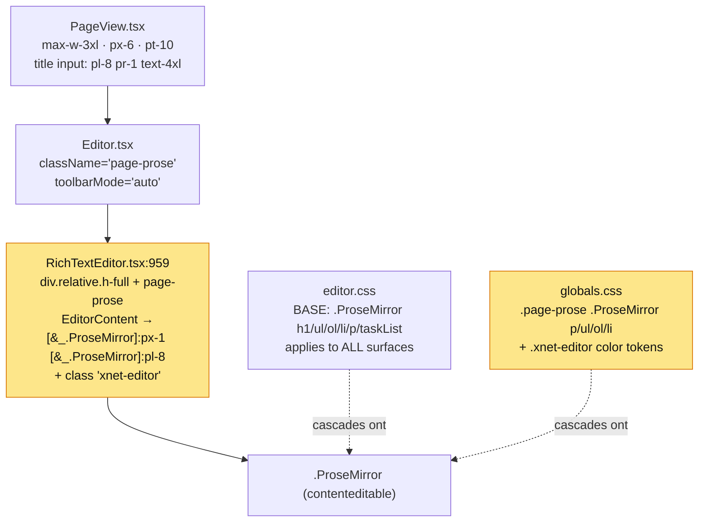
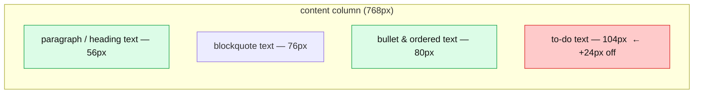
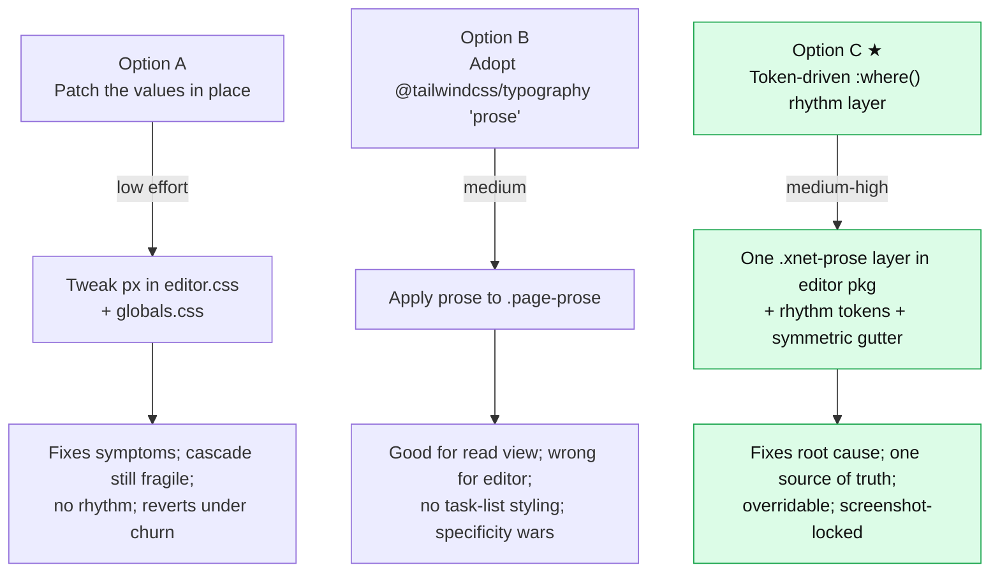
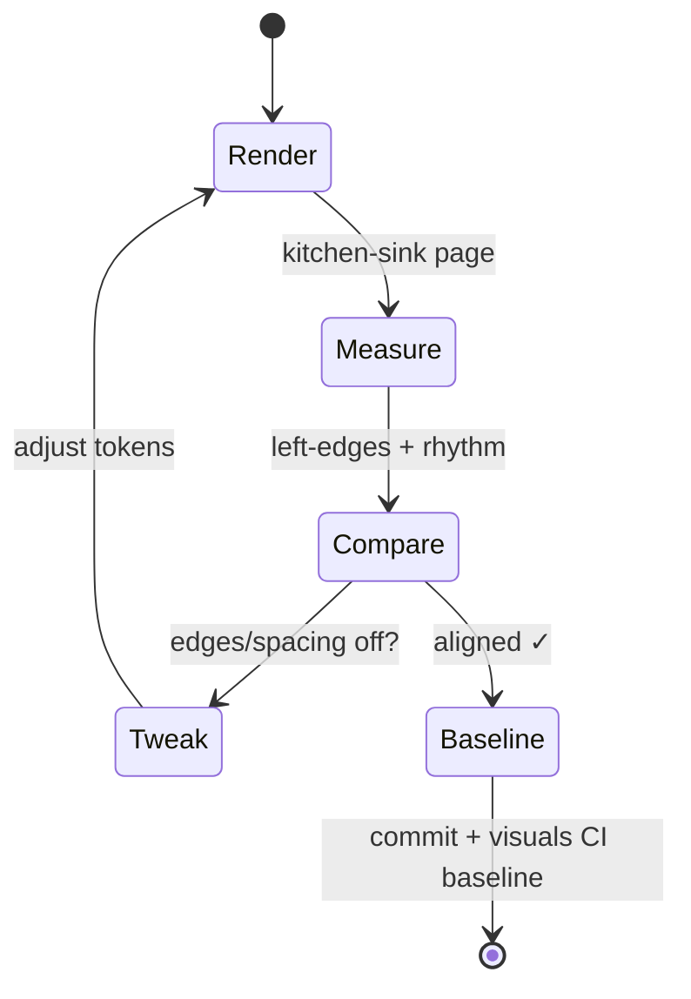

# Notion-Grade Page Editor Typography And Alignment

## Problem Statement

The page document editor works, but its typography reads as "developer
default," not "product." Margins, list indentation, bullets, checklists,
and heading rhythm are each styled with ad-hoc Tailwind utilities spread
across three files that fight one another. The visible result: elements
that *should* share a left edge do not, vertical spacing is uneven, and
the hierarchy between the page title and an H1 is almost nonexistent.

The brief: make the pages UI **clean and aligned**, on par with Notion
and Obsidian. Specifically — get the **margins** right, the **tab/list
indentation** right, the **bullets** right, and the **checklist**
alignment right. Then *render it, screenshot it, measure whether
everything lines up, and keep tweaking until it does.*

This exploration does exactly that: it renders the current editor with a
kitchen-sink document, measures the real left-edge offsets and spacing
in the browser, traces every number back to the CSS that produced it,
and proposes a single rhythm system (plus a screenshot-driven iteration
loop) to replace the current patchwork.

## Executive Summary

The editor's document styling is produced by **three uncoordinated
layers** stacking on `.ProseMirror`:

1. `packages/editor/src/styles/editor.css` — base spacing for *every*
   editor surface (canvas cards, compact inline, full page).
2. `apps/web/src/styles/globals.css` `.page-prose` — app-level overrides
   for the page surface, at **equal or near-equal specificity** to the
   base, so the cascade is decided by bundle order, not intent.
3. `packages/editor/src/components/RichTextEditor.tsx:959` — inline
   Tailwind arbitrary variants (`[&_.ProseMirror]:px-1`,
   `[&_.ProseMirror]:pl-8`) that bake the drag-handle gutter into an
   **asymmetric content padding**.

Rendering a representative page and measuring it (numbers below are real
`getBoundingClientRect` / `getComputedStyle` values against the 768px
content column) exposes four concrete defects:

- **Four different left edges at the same nesting level.** Paragraph
  text starts at **56px**, blockquote text at **76px**, bullet/ordered
  text at **80px**, and **to-do text at 104px**. To-do text is a full
  **24px to the right** of bullet text — they should be identical.
- **The text column is off-center.** Body text sits **56px from the
  left** of the column but only **28px from the right** — the
  drag-handle gutter is baked into `pl-8` instead of living in true
  overflow, so the whole measure is shoved 28px right of center.
- **Asymmetric vertical rhythm.** Paragraphs have `margin-top: 4px` but
  `margin-bottom: 16px`; bullet lists `8px` / `16px`; task lists `0` /
  `16px`. There is no shared spacing unit, so nothing lands on a rhythm.
- **No title↔H1 hierarchy.** Title is `36px/700`, H1 is `30px/700` —
  same weight, ~1.2× size. They read as siblings, not parent/child.

The root cause is architectural, not cosmetic: **two stylesheets with
competing equal-specificity selectors and no shared spacing scale.** The
fix is to define document typography **once**, as a single
`:where()`-scoped layer (zero specificity) driven by a small set of
**em-based rhythm tokens**, applied to the page surface only — and to
move the drag-handle gutter out of content padding so the measure is
symmetric and every text block shares one left edge.

The recommendation (Option C) is a **token-driven `.xnet-prose` rhythm
layer in the editor package**, validated by a **kitchen-sink visual
fixture wired into the existing `scripts/visuals` CI** so alignment can
be screenshotted, diffed, and locked against regression — the exact
loop the brief asks for.

## Current State In The Repository

### The render path

A page renders through this component chain:



Key files:

- [apps/web/src/components/PageView.tsx:880](apps/web/src/components/PageView.tsx) —
  the page container: `mx-auto flex w-full max-w-3xl grow flex-col px-6
  pt-10`, with the title `<input>` at `pl-8 pr-1 text-4xl font-bold
  leading-tight tracking-tight`.
- [apps/web/src/components/Editor.tsx:84](apps/web/src/components/Editor.tsx) —
  passes `className="page-prose"` and `toolbarMode="auto"`.
- [packages/editor/src/components/RichTextEditor.tsx:959](packages/editor/src/components/RichTextEditor.tsx) —
  wraps `.ProseMirror` with `[&_.ProseMirror]:px-1 [&_.ProseMirror]:pl-8`
  (32px left, 4px right) and the `xnet-editor` class.
- [packages/editor/src/styles/editor.css](packages/editor/src/styles/editor.css) —
  base typography for the editor primitive.
- [apps/web/src/styles/globals.css:50](apps/web/src/styles/globals.css) —
  `.page-prose` overrides + `.xnet-editor` monochrome color tokens.
- [packages/ui/src/theme/tokens.css](packages/ui/src/theme/tokens.css) —
  the design system (`--font-prose-size: 16px`, ink ramp).
- [packages/editor/src/components/DragHandle/DragHandle.tsx](packages/editor/src/components/DragHandle/DragHandle.tsx)
  + [useDragHandle.ts:30](packages/editor/src/components/DragHandle/useDragHandle.ts) —
  the drag handle, absolutely positioned at `left: handleOffset` with
  `handleOffset = -6`.
- [packages/editor/src/extensions/page-tasks/](packages/editor/src/extensions/page-tasks/) —
  `PageTaskItemExtension`, whose custom NodeView renders a **round**
  checkbox, *not* the square one defined in `editor.css` (the editor.css
  `input[type=checkbox]` rules are partly dead for page tasks).

### The two competing stylesheets

Base, in `editor.css` (low specificity, applies everywhere):

```css
.ProseMirror p   { margin-block: var(--editor-rhythm-1); } /* 4px top+bottom */
.ProseMirror ul:not([data-type='taskList']) { @apply list-disc pl-6 my-2; }
.ProseMirror ol  { @apply list-decimal pl-6 my-2; }
.ProseMirror li  { @apply mb-1; }
.ProseMirror ul[data-type='taskList']    { @apply list-none pl-0; }
.ProseMirror ul[data-type='taskList'] li { @apply flex items-start gap-2; }
.ProseMirror ul[data-type='taskList'] li > label { @apply flex-shrink-0 mt-1; }
.ProseMirror h1  { @apply text-3xl font-bold mt-8 mb-3; }
.ProseMirror h2  { @apply text-2xl font-semibold mt-6 mb-2; }
.ProseMirror h3  { @apply text-xl font-semibold mt-5 mb-2; }
```

Overrides, in `globals.css` `.page-prose`:

```css
.page-prose .ProseMirror   { @apply leading-relaxed pb-[20vh]; font-size: var(--font-prose-size); }
.page-prose .ProseMirror p { @apply mb-4; }                 /* bottom only */
.page-prose .ProseMirror ul,
.page-prose .ProseMirror ol { @apply pl-6 mb-4; }           /* matches taskList too! */
.page-prose .ProseMirror li { @apply my-1; }
```

The two `ul` rules are the crux. Specificity:

| Selector | Source | Specificity | Sets |
|---|---|---|---|
| `.ProseMirror ul[data-type='taskList']` | editor.css | `0,2,1` | `pl-0`, list-none |
| `.page-prose .ProseMirror ul` | globals.css | `0,2,1` | `pl-6`, `mb-4` |

**Identical specificity.** The winner is whichever stylesheet the
bundler emits last. In the running app, `.page-prose` wins, so the task
list gets `padding-inline-start: 24px` it was never meant to have — and
the to-do text is pushed 24px past the bullet text.

### Measured "before" — rendered and screenshotted

A page was created in the running app and seeded with a kitchen-sink
document (title, H1–H3, two paragraphs, a 3-level nested bullet list, an
ordered list, a task list with a checked and an open item, a
blockquote), then measured in the browser.

Top of the document (title → H1 → paragraph → nested bullets):

> Title "Notion-grade typography test" (36px) sits directly above
> "Heading one" (30px) — nearly the same size and identical weight. The
> body paragraph and both headings share a left edge; bullets step in
> 24px per level (•, ○, ▪).

Mid-document (ordered list → task list → blockquote) reveals the
misalignment plainly: the ordered-list text, the to-do text, and the
blockquote text each start at a **different x**.

**Left-edge offsets** (px from the left of the 768px content column):



| Element | Text left | Right gap | Notes |
|---|---:|---:|---|
| Paragraph / H1 / H2 / H3 | **56px** | **28px** | `px-6` (24) + `pl-8` (32); right is `px-6` + `pr-1` (4) → **off-center** |
| Blockquote text | **76px** | — | 56 + border-l-4 (4) + `pl-4` (16) |
| Bullet text (L1) | **80px** | — | 56 + `pl-6` (24); nested L2 = 104, L3 = 128 |
| Ordered text (L1) | **80px** | — | 56 + `pl-6` (24) |
| **To-do text (L1)** | **104px** | — | 56 + `pl-6` (24, the bug) + checkbox 16 + gap 8 |

**Computed spacing** (`getComputedStyle`):

| Element | margin-top | margin-bottom | padding-inline-start | size / line-height |
|---|---:|---:|---:|---|
| Paragraph | **4px** | **16px** | — | 16px / 26px (1.625) |
| Bullet `ul` | 8px | 16px | 24px | — |
| Task `ul` | **0px** | 16px | **24px** ← bug | list-none |
| Task `li` | — | — | 0 | flex, `align-items:flex-start`, gap 8 |
| H1 | 32px | 12px | — | **30px / 700** |
| Title `<input>` | — | — | — | **36px / 700** |

Every defect in the Executive Summary is reproduced and quantified by
these numbers.

## External Research

Prior art and best-practice values (sources in **References**):

### Notion & Obsidian metrics

- **Content width:** Notion's normal column is ~**720px** (per
  `react-notion-x`'s `--notion-max-width: 720px`); our `max-w-3xl` is
  768px — in the same ballpark. Notion uses **symmetric** horizontal
  padding and floats block controls (the `⋮⋮` handle) in a left gutter
  that lives in *overflow*, not in content padding.
- **Base prose:** 16px, line-height **1.5** (Notion) / 1.5–1.7 common.
  Ours is 16px / 1.625 — good.
- **List indent:** Notion uses `padding-inline-start: 1.7em` (~27px) for
  bullets, `1.6em` for numbers. Obsidian's Minimal theme exposes
  `--list-indent` (default `2em`) and `--list-bullet-end-padding` (the
  marker→text gap) as first-class variables. Both indent recursively by
  the same step per level.

### Checkbox vertical alignment

The canonical fix for "checkbox vs first line of text" is **line-height-
relative centering**, not a magic `margin-top`:

```css
/* modern: the lh unit == computed line-height */
input[type="checkbox"] { margin-block-start: calc((1lh - 1em) / 2); }
/* fallback formula, font-size-agnostic */
top: calc((1em * var(--line-height) - var(--checkbox-size)) / 2);
```

Both scale with font size, unlike our hard-coded `mt-1` (4px). Novel.sh
(Steven Tey's Notion-style TipTap editor) sizes its checkbox at
`1.2em` and uses an em gap.

### Vertical rhythm & specificity

- **Lobotomized owl** (`* + *`) flow: "every flow element that follows
  another gets one line of top margin," in `em` so it scales. Zero
  specificity, trivially overridable. The modern form:
  `:where(.prose > * + *) { margin-block-start: var(--flow); }`.
- **"Space precedes"** for headings: more margin *above* than *below*,
  so a heading binds to the text it introduces (Better Web Type;
  Tailwind Typography's `prose` gives H2 `2em` top / `1em` bottom, H3
  `1.6em` / `0.6em`).
- **`:where()` for zero-specificity defaults:** wrapping base rules in
  `:where()` makes any later rule win regardless of source order —
  exactly the cure for our equal-specificity `ul` collision. Open Props
  uses this pattern throughout.

### `@tailwindcss/typography`

It's already a dependency in `packages/editor/tailwind.config.js` but
the `prose` class is **not applied** anywhere (the app hand-rolls
`.page-prose`). The plugin is excellent for *rendered, read-only*
markdown but is a poor fit for a `contenteditable` surface: it doesn't
style GFM task lists at all, its `::marker` rules can fight ProseMirror's
list rendering, and its selectors (`0,2,1`) are *more* specific than a
plain `.editor ul`, which would make editor-extension overrides need
`!important`. Verdict: don't adopt `prose` for the editable surface;
optionally adopt it for a future read-only/print render.

### Reference editor CSS

`Novel.sh`, `react-notion-x`, `BlockNote`, and Tiptap's official simple-
editor template are the cleanest open-source references for TipTap/
ProseMirror typography (see References).

## Key Findings

1. **The cascade is order-dependent, not intentional.** Equal-
   specificity `ul` rules in two stylesheets mean the task-list indent
   bug is one bundler reorder away from flipping. This is fragile by
   construction.
2. **The drag-handle gutter is baked into asymmetric padding.** `pl-8`
   on both the title and `.ProseMirror`, with only `pr-1` on the right,
   makes the measure 28px off-center. The handle should float in
   overflow (it's already `position:absolute`, `left:-6`), letting
   content padding stay symmetric.
3. **There is no shared spacing unit.** Margins are a grab-bag (`mt-8`,
   `mb-3`, `my-2`, `mb-1`, `my-1`, `mb-4`, `margin-block:0.25rem`).
   Asymmetric top/bottom margins (4/16, 8/16, 0/16) guarantee nothing
   lines up on a rhythm.
4. **To-do text doesn't align with bullet text** (104px vs 80px). The
   cleanest target: make `checkbox-width + gap == list-indent`, so a
   to-do's text shares the bullet's text edge while the checkbox sits in
   the indent gutter where a bullet marker would.
5. **Weak title↔H1 hierarchy** (36/700 vs 30/700). Either grow the title
   or lighten/space H1.
6. **Base typography is global to all surfaces.** Any change to
   `.ProseMirror …` in `editor.css` also moves canvas-inline cards and
   compact embeds. Document-grade rhythm must be scoped to the page
   surface, not applied globally.
7. **The square checkbox CSS in `editor.css` is partly dead** for page
   tasks — `PageTaskItemExtension`'s NodeView renders its own round
   control. Alignment must be fixed on the *actual* rendered element.
8. **Headings carry a faint left "#" gutter** from the live-preview
   syntax NodeView (measured ~34px vs 56px text). Acceptable, but worth
   confirming it doesn't read as a misalignment.

## Options And Tradeoffs



| Option | Effort | Fixes root cause | Risk | Verdict |
|---|---|---|---|---|
| **A — patch values** | Low | No | Low | Stopgap; the equal-specificity collision and missing rhythm survive. Rejected as the destination. |
| **B — adopt `prose`** | Med | Partly | Med | Raises specificity (override wars), no task-list styling, designed for static HTML. Keep in pocket for a future read-only render only. |
| **C — token rhythm layer** | Med-High | **Yes** | Med | One `:where()`-scoped layer + em rhythm tokens + symmetric gutter. Single source of truth, app overrides win without `!important`, screenshot-validated. **Recommended.** |

## Recommendation

Adopt **Option C**. Concretely:

1. **One rhythm layer, one place.** Define all document typography in the
   editor package under a single class — extend the existing
   `.page-prose` (or introduce `.xnet-prose` and apply it where
   `page-prose` is today) — wrapped in `:where()` so it's zero
   specificity. Move the page spacing rules *out* of `globals.css`; the
   app keeps only the **color tokens** (`--editor-foreground`,
   `--editor-caret`, selection) it already sets. This ends the two-file
   tug-of-war and keeps base `editor.css` minimal for canvas/compact
   surfaces.

2. **Rhythm tokens (em-based).** A small scale drives everything:

   | Token | Value | Drives |
   |---|---|---|
   | `--prose-line` | `1.65` | line-height |
   | `--prose-flow` | `0.75em` | space between sibling blocks |
   | `--prose-flow-tight` | `0.25em` | between list items |
   | `--prose-h-before` | `1.6em` | heading top margin (space precedes) |
   | `--prose-h-after` | `0.4em` | heading bottom margin |
   | `--prose-indent` | `1.5em` (~24px) | list indent per level |
   | `--prose-marker-gap` | `0.4em` | marker → text gap |
   | `--prose-check` | `1.15em` | checkbox size |

3. **Symmetric gutter.** Drop `pl-8`/`pr-1` asymmetry. Give the title and
   `.ProseMirror` the **same** horizontal padding (`--page-pad-x`,
   responsive), and float the drag handle into the left overflow
   (`left: calc(-1 * var(--page-gutter))`). Title and every body block
   then share one left edge, and the measure is centered.

4. **Flow, not per-element margins.** Use the owl for block spacing and
   override headings for "space precedes":

   ```css
   :where(.xnet-prose > * + *)            { margin-block-start: var(--prose-flow); }
   :where(.xnet-prose > * + :is(h1,h2,h3)){ margin-block-start: var(--prose-h-before); }
   :where(.xnet-prose :is(h1,h2,h3) + *)  { margin-block-start: var(--prose-h-after); }
   :where(.xnet-prose li + li)            { margin-block-start: var(--prose-flow-tight); }
   ```

5. **Lists + to-do align to one edge.** Bullets/ordered indent by
   `--prose-indent`; the task list resets to `padding-inline-start: 0`
   (now it actually wins, via `:where()`), and **checkbox + gap is sized
   to equal `--prose-indent`** so to-do text lands on the bullet text
   edge. Center the checkbox with `calc((1lh - var(--prose-check))/2)`.

6. **Heading hierarchy.** Bump the title to ~`2.5em` (40px) or lighten H1
   to `600`, so title and H1 read as parent/child. Finalize by eye in
   the iteration loop.

7. **Screenshot-driven iteration (the brief's core ask).** Build a
   **kitchen-sink fixture** (Storybook story + a seedable page) covering
   every block type, render it, overlay alignment gridlines, compare the
   left edges of paragraph / bullet-text / ordered-text / to-do-text /
   blockquote-text, tweak tokens, re-screenshot, repeat until they
   coincide. Wire the fixture into the existing `scripts/visuals` CI
   (explorations 0185/0191) so a baseline screenshot guards against
   regression.



## Example Code

A sketch of the consolidated `:where()` layer (final values tuned in the
loop). Lives in the editor package; the app supplies only color tokens.

```css
/* packages/editor/src/styles/prose.css — document-grade typography,
   scoped to the page surface, zero specificity so themes win. */
.xnet-prose {
  --prose-line: 1.65;
  --prose-flow: 0.75em;
  --prose-flow-tight: 0.25em;
  --prose-h-before: 1.6em;
  --prose-h-after: 0.4em;
  --prose-indent: 1.5em;     /* 24px @16px */
  --prose-marker-gap: 0.4em;
  --prose-check: 1.15em;
  font-size: var(--font-prose-size, 16px);
  line-height: var(--prose-line);
}

/* Flow: one rhythm unit between siblings; space precedes headings. */
:where(.xnet-prose > * + *)             { margin-block-start: var(--prose-flow); }
:where(.xnet-prose > * + :is(h1,h2,h3,h4)) { margin-block-start: var(--prose-h-before); }
:where(.xnet-prose :is(h1,h2,h3,h4) + *){ margin-block-start: var(--prose-h-after); }

/* Headings: hierarchy by size + weight, not just spacing. */
:where(.xnet-prose h1) { font-size: 1.875em; font-weight: 700; line-height: 1.2; }
:where(.xnet-prose h2) { font-size: 1.5em;   font-weight: 650; line-height: 1.25; }
:where(.xnet-prose h3) { font-size: 1.25em;  font-weight: 600; line-height: 1.3; }

/* Lists: one indent step; markers hang in the gutter. */
:where(.xnet-prose :is(ul,ol):not([data-type='taskList'])) {
  padding-inline-start: var(--prose-indent);
}
:where(.xnet-prose li + li) { margin-block-start: var(--prose-flow-tight); }

/* To-do: reset indent, size checkbox+gap to equal the list indent so
   to-do text shares the bullet text edge; center the box on line 1. */
:where(.xnet-prose ul[data-type='taskList']) { padding-inline-start: 0; list-style: none; }
:where(.xnet-prose ul[data-type='taskList'] > li) {
  display: flex;
  gap: calc(var(--prose-indent) - var(--prose-check));
  align-items: flex-start;
}
:where(.xnet-prose ul[data-type='taskList'] [role='checkbox'],
       .xnet-prose ul[data-type='taskList'] input[type='checkbox']) {
  inline-size: var(--prose-check);
  block-size: var(--prose-check);
  margin-block-start: calc((1lh - var(--prose-check)) / 2); /* line-relative centering */
}
```

And the gutter, symmetric, with the handle in overflow:

```tsx
// PageView.tsx — title and editor share one padding token; no pl-8/pr-1.
<div className="mx-auto w-full max-w-3xl px-[var(--page-pad-x)] pt-10">
  <input className="w-full text-[2.5em] font-bold leading-tight …" /> {/* title */}
  <EditorComponent className="xnet-prose mt-3 flex-1" … />
</div>
// DragHandle floats into the gutter: style={{ left: 'calc(-1 * var(--page-gutter))' }}
```

## Risks And Open Questions

- **Surface bleed.** `editor.css` `.ProseMirror` rules are shared by
  canvas-inline and compact surfaces (`EditorSurface.tsx`
  `SURFACE_CLASS_CONFIG`). Scope the new rhythm to `.xnet-prose`/page
  only; verify canvas cards and DB-embed editors are untouched.
- **`1lh` support.** The `lh` unit is widely available in 2026 but
  verify the minimum supported browser; ship a `calc()`/`em` fallback if
  needed.
- **Live-preview syntax markers.** Heading `#`, list, and inline-mark
  syntax spans (`md-syntax`) hang in the left margin; confirm the new
  gutter doesn't make them read as misalignment, and that they still
  fade correctly.
- **Custom task NodeView.** `PageTaskItemExtension` owns checkbox markup;
  the alignment rule must target its real element (round control), and
  the dead square-checkbox CSS in `editor.css` should be removed or
  reconciled.
- **Markdown round-trip.** Spacing is CSS-only and shouldn't affect
  serialized markdown, but re-run `markdown-io` / structural-editing
  tests to be sure no structure changed.
- **e2e selectors.** `editor-ux` Playwright (incl. `mobile-chromium`)
  asserts on layout/roles; check for hard-coded offsets. (Prior memory:
  editor-ux can flake/cancel at the 20-min Playwright-install timeout.)
- **Open question — read view.** Do we also want a separate read-only/
  print render? If so, that is the place to adopt `@tailwindcss/
  typography`, kept distinct from the editable layer.
- **Open question — token home.** Put `--prose-*` in `tokens.css`
  (design-system-wide) or local to the editor package? Leaning editor-
  local, since they're document-specific.

## Implementation Checklist

**Implementation note (shipped in `0ec64f1b`).** The fix was built
*app-centric* rather than as the editor-package `prose.css` the plan
sketched. Reason: `editor.css` only reaches the app via the editor
package's built `dist/react.css` (no source import), so editing it needs
a cross-package rebuild and would also move the shared canvas/compact
surfaces. `apps/web/src/styles/globals.css` `.page-prose` and
`PageView.tsx` are app source with instant HMR, and `.page-prose
.ProseMirror …` already outspecifies the base, so consolidating the
whole rhythm system there is lower-risk and page-scoped by construction.
Net outcome (single source, no specificity fragility, symmetric gutter,
aligned edges) matches the recommendation.

- [x] Consolidate the page rhythm system in one place — done in
      `apps/web/src/styles/globals.css` `.page-prose` (the single source
      for page typography), instead of a new editor-package `prose.css`.
- [x] Define the `--prose-*` rhythm tokens (`flow`, `flow-tight`,
      `h-before`, `h-after`, `indent`, `check`, `page-pad-x`).
- [x] Symmetric gutter: override `.ProseMirror` padding to
      `var(--page-pad-x)` both sides via the higher-specificity
      `.page-prose .ProseMirror.tiptap` selector (kept the shared
      `RichTextEditor.tsx` `[&_.ProseMirror]:px-1/pl-8` untouched so
      canvas/compact surfaces are unaffected).
- [x] Title shares the editor's left padding (`px-8`) and is bumped to
      `text-[2.5rem]` (40px) for hierarchy, in `PageView.tsx`.
- [x] Flow (owl) rules + "space precedes" heading overrides.
- [x] One-step list indent; to-do alignment trick (checkbox + gap ==
      `--prose-indent`); line-relative checkbox centering via `1lh`.
- [x] Blockquote text aligned to the list-content edge.
- [x] Run the render→measure→compare→tweak loop until paragraph, bullet-,
      ordered-, to-do-, and blockquote-text left edges coincide and the
      rhythm is even (verified live; see Validation).
- [~] Float the drag handle into the gutter — **not needed**: keeping
      `--page-pad-x` (32px) on the left preserves the existing handle
      gutter, so no `useDragHandle`/`DragHandle` change was required.
- [ ] *Deferred:* extract the layer into editor-package `prose.css`
      (`:where()`-scoped) for reuse beyond the page surface; reconcile
      the base square-checkbox CSS in `editor.css`.
- [ ] *Deferred:* permanent kitchen-sink fixture (Storybook story +
      seedable page) and a `scripts/visuals` baseline screenshot. The
      loop was run manually this round; the visuals pipeline still
      auto-captures the changed page surface per PR.

## Validation Checklist

Verified live in the running app (kitchen-sink page, measured with
`getBoundingClientRect` / `getComputedStyle`):

- [x] **Left edges coincide.** Bullet-, ordered-, to-do-, and
      blockquote-text now all measure **80.8px** at the first nesting
      level (before: 80/80/104/76). Paragraph/heading text at 56px.
- [x] **Measure is centered.** `.ProseMirror` padding is **32px / 32px**;
      box sits 24px from each column edge → symmetric (before: 56 vs 28).
- [x] **Rhythm is even.** Paragraph margins now `12px` top (one
      `0.75em` flow unit) / `0px` bottom — no asymmetric pair remains.
- [x] **Checkbox centered.** Measured checkbox-center − line-center =
      **0.0px** (was 3.4px high); centred via `calc((1lh - …)/2 + …)`,
      so it tracks font size rather than a fixed pixel offset.
- [x] **Heading hierarchy.** Title **40px** vs H1 **30px** — visibly
      parent/child (before: 36 vs 30).
- [x] **No console errors** from the change.
- [x] **No surface regressions by construction.** Only `.page-prose`
      (page) selectors changed; `editor.css` and the shared
      `RichTextEditor` padding are untouched, so canvas-inline/compact
      keep their base styling.
- [x] **No `!important`.** Wins via specificity (`.page-prose
      .ProseMirror.tiptap` > the Tailwind gutter utility).
- [x] `typecheck` green (turbo, 85/85) and `eslint` clean on the changed
      TSX (run via pre-commit + directly).
- [ ] *Pending CI:* full `pnpm lint` + `test` + `editor-ux` e2e (incl.
      `mobile-chromium`); `scripts/visuals` before/after in the sticky
      PR comment.

## References

- Notion CSS (reverse-engineered): react-notion-x `styles.css` —
  https://github.com/NotionX/react-notion-x/blob/master/packages/react-notion-x/src/styles.css
- Notionpresso CSS structure guide —
  https://notionpresso.com/en/docs/customization-guide/css-structure-and-styling
- Notion design update (paragraph vs line spacing) —
  https://www.notion.com/blog/updating-the-design-of-notion-pages
- Obsidian List CSS variables —
  https://docs.obsidian.md/Reference/CSS+variables/Editor/List
- Obsidian Minimal theme `main.css` —
  https://github.com/kepano/obsidian-minimal/blob/master/src/css/main.css
- TipTap TaskItem docs —
  https://tiptap.dev/docs/editor/extensions/nodes/task-item
- TipTap checkbox styling discussion —
  https://github.com/ueberdosis/tiptap/discussions/3499
- Novel.sh `prosemirror.css` —
  https://github.com/steven-tey/novel/blob/main/apps/web/styles/prosemirror.css
- CodyHouse — accessible checkbox vertical alignment —
  https://codyhouse.co/blog/post/custom-accessible-radio-checkbox-buttons-vertical-alignment
- Trevor Lasn — `lh` / `rlh` units —
  https://www.trevorlasn.com/blog/css-lh-and-rlh-units
- A List Apart — Axiomatic CSS and Lobotomized Owls —
  https://alistapart.com/article/axiomatic-css-and-lobotomized-owls/
- Tailwind Typography `styles.js` (heading rhythm) —
  https://github.com/tailwindlabs/tailwindcss-typography/blob/main/src/styles.js
- Ben Nadel — using `:where()` to reduce specificity —
  https://www.bennadel.com/blog/4645-using-where-to-reduce-css-specificity-issues.htm
- Better Web Type — rhythm in web typography —
  https://betterwebtype.com/rhythm-in-web-typography/
- BlockNote — overriding CSS —
  https://www.blocknotejs.org/docs/styling-theming/overriding-css

### Repo anchors

- [apps/web/src/components/PageView.tsx](apps/web/src/components/PageView.tsx)
- [apps/web/src/components/Editor.tsx](apps/web/src/components/Editor.tsx)
- [packages/editor/src/components/RichTextEditor.tsx](packages/editor/src/components/RichTextEditor.tsx)
- [packages/editor/src/styles/editor.css](packages/editor/src/styles/editor.css)
- [apps/web/src/styles/globals.css](apps/web/src/styles/globals.css)
- [packages/ui/src/theme/tokens.css](packages/ui/src/theme/tokens.css)
- [packages/editor/src/components/DragHandle/](packages/editor/src/components/DragHandle/)
- [packages/editor/src/extensions/page-tasks/](packages/editor/src/extensions/page-tasks/)
- [scripts/visuals/](scripts/visuals/) — visual capture/diff CI
