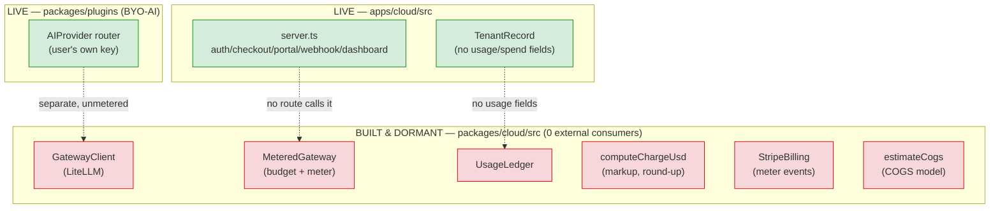
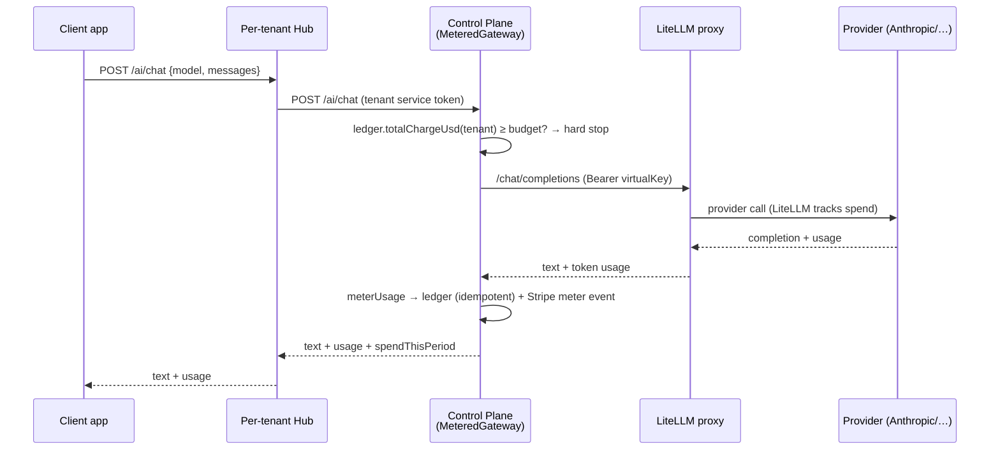
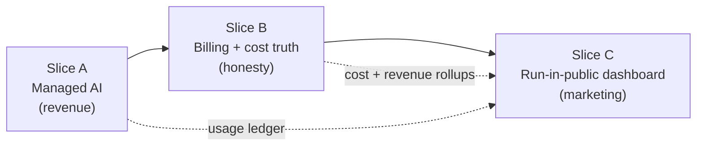
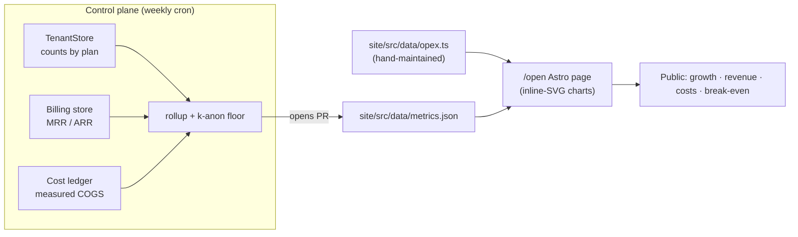
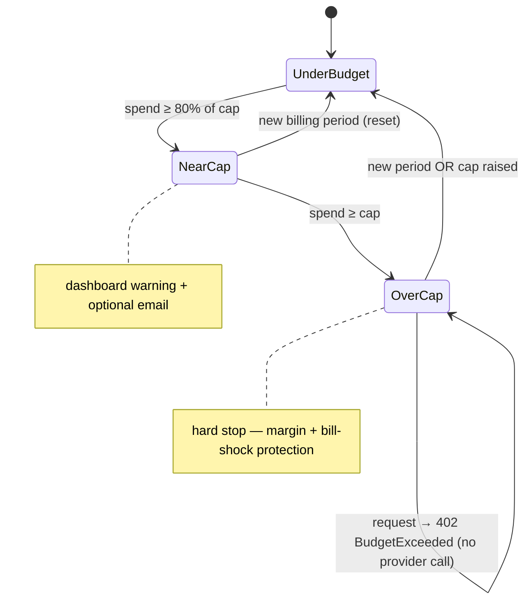

# Cloud Billing, AI Metering & a "Run the Company in Public" Dashboard

## Problem Statement

xNet Cloud (the managed-hub business layered on the local-first OSS platform)
needs two things to feel like a real product you can run as a company:

1. **Billing in a really good place.** A customer should be able to manage their
   account end-to-end — pick a plan, pay, see exactly what they're using, get
   billed fairly for usage (especially **AI**), and never get a surprise bill.
   And on _our_ side, we need to **calculate costs accurately** so we know our
   margin per tenant and in aggregate.

2. **Run the company in public.** A public dashboard on the marketing site that
   shows **customer growth week-over-week**, **revenue growth**, and an honest
   **cost breakdown** — infrastructure/hosting, plus company opex (payroll,
   recurring SaaS) — and how the whole thing trends toward **break-even**.

The headline new capability inside (1) is a **managed AI offering**: we host the
AI gateway, customers use it without bringing their own key, and we meter token
usage and bill it with a transparent markup and a hard budget cap.

## Executive Summary

**The surprising finding: ~80% of the billing/AI/cost engine already exists and
is completely dormant.** Exploration 0148/0175/0176/0178 shipped a full
ports-and-adapters spine in `@xnetjs/cloud` — a LiteLLM gateway client, a
budget-guarded metered gateway, idempotent token pricing, a usage ledger, a
Stripe Billing-Meters adapter, and an executable COGS model — but **nothing
outside `packages/cloud/src/` imports any of it.** It has zero live consumers.
The marketing site already _promises_ the feature ("Managed AI gateway
included… metered transparently and shown on your dashboard. A hard budget stop
prevents surprise bills" — [`site/src/data/pricing.ts:179`](site/src/data/pricing.ts)),
but the promise is unfulfilled.

So this is mostly a **wiring + productization** exploration, not a green-field
build. Recommended path, in three slices:

- **Slice A — Managed AI (fulfill the promise):** deploy a LiteLLM proxy; have
  the control plane provision a per-tenant **virtual key** with a budget at
  hub-provision time; add an `/ai/chat` route on the control plane backed by the
  existing `MeteredGateway`; have the per-tenant hub forward AI requests to it.
  Add `includedAiUsd` + `aiMonthlyBudgetUsd` to entitlements. Surface live spend
  on the dashboard. **OpenRouter** fits as an optional multi-provider _upstream
  behind_ LiteLLM, not as a replacement for it.
- **Slice B — Billing & account management in a good place:** enrich the
  control-plane dashboard with usage meters (storage vs quota, AI spend vs
  included+budget), invoices, and self-serve plan/seat changes; surface a
  read-only "Cloud & Billing" panel in the web app that deep-links to it; and
  introduce a per-tenant **cost ledger** + reconciliation so `estimateCogs`
  becomes _measured_ COGS and we know real per-tenant margin.
- **Slice C — Run-in-public dashboard:** a control-plane **metrics rollup**
  emits a privacy-safe, aggregate-only `metrics.json` (weekly buckets,
  k-anonymity floor); a scheduled job commits it to `site/src/data/` (the git
  history _is_ the transparency log, à la Buffer/Baremetrics); a new Astro
  `/open` page renders growth + cost-breakdown + break-even with dependency-light
  inline-SVG charts. Company opex lives in a hand-maintained `opex.ts`.

This sequencing ships the revenue-generating piece first (AI), makes the money
honest second (cost truth), and turns that truth into marketing third (public
dashboard) — each slice standing on the one before.

## Current State In The Repository

### The dormant engine (`packages/cloud/src/`)

Everything below is **built, tested, exported from the `@xnetjs/cloud` barrel
([`packages/cloud/src/index.ts`](packages/cloud/src/index.ts)) — and imported by
nobody outside the package** (verified: `grep` for `MeteredGateway`,
`meterUsage`, `estimateCogs`, `GatewayClient`, `UsageLedger` finds only the
package's own files and tests).

| Concern | File | What it does |
|---|---|---|
| AI gateway client | [`ai/gateway.ts`](packages/cloud/src/ai/gateway.ts) | `GatewayClient` → LiteLLM proxy, OpenAI-compatible `/chat/completions`, per-tenant `virtualKey` carries the budget; injectable `fetch`; `mockResponse` passthrough for CI |
| Budget + metering | [`ai/metered-gateway.ts`](packages/cloud/src/ai/metered-gateway.ts) | `MeteredGateway` — hard-stops if `ledger.totalChargeUsd(tenantId) >= budget` **before** any provider call, then meters every success |
| Metering bridge | [`ai/metering.ts`](packages/cloud/src/ai/metering.ts) | `meterUsage()` — compute charge → record in ledger (idempotent by key) → emit Stripe meter event on first record |
| Token pricing | [`billing/pricing.ts`](packages/cloud/src/billing/pricing.ts) | `computeChargeUsd()` with `markup ≥ 1`, **always rounds up** (never undercharge) |
| Usage ledger | [`billing/ledger.ts`](packages/cloud/src/billing/ledger.ts) | `UsageLedger` (`record`/`totalChargeUsd`/`entries`), idempotent by key; `MemoryUsageLedger` |
| Stripe meters | [`billing/billing.ts`](packages/cloud/src/billing/billing.ts) | `StripeBilling.recordMeterEvent()`, `FakeStripeBilling`, real `StripeBillingAdapter` over `billing.meterEvents` |
| COGS model | [`cost/pricing.ts`](packages/cloud/src/cost/pricing.ts) | `UNIT_COSTS` (R2/volume/compute/WorkOS/Stripe) + `estimateCogs()` → per-plan COGS + gross margin; `PLAN_PRICING` scenarios |

The COGS model is real and specific — e.g. `r2StoragePerGbMonth: 0.015`,
`warmComputePerMonth: 6`, `activeComputePerHour: 0.00266`, `stripePercent: 0.029`
— but its inputs are _typical-usage assumptions_, not measured per-tenant data.
And **AI is deliberately excluded from base COGS** (it's a metered add-on):
[`cost/pricing.ts:9`](packages/cloud/src/cost/pricing.ts).

### The live control plane (`apps/cloud/src/`)

- HTTP surface ([`server.ts`](apps/cloud/src/server.ts)): auth funnel
  (`/auth/start`, `/auth/callback`), `/checkout`, `/portal` (Stripe Customer
  Portal — already wired), provider webhook `/webhooks/stripe`, server-rendered
  `/dashboard`, `/account/delete-data`, the RFC-8628 "claim your hub" device
  flow, and `/internal/*` admin routes. **There is no `/ai/*` route, and
  `changePlan` is internal-only** (no self-serve plan change).
- Tenant registry ([`registry.ts`](apps/cloud/src/registry.ts)): `TenantRecord`
  has `plan`, `entitlements`, `billingUserId`, `did`, `hubUrl`, `dataTier`,
  `lastActiveMs` — **no usage, spend, cost, or AI-key fields**.
- Real credential wiring just landed (PR #175): `StripeTenantBillingGateway`,
  Firestore `TenantStore`/`BindingStore`, `GoogleCloudRunClient` — all
  env-selected (exploration 0196 runbook).

### Entitlements (`packages/entitlements/src/`)

[`plans.ts`](packages/entitlements/src/plans.ts) defines `PLAN_CATALOG` with
`quotaBytes`, `maxBlobBytes`, `maxConnections`, `seats`, **`aiEnabled: boolean`**,
`residency`, `sla`. The signed `HUB_PLAN` token
([`entitlements.ts`](packages/entitlements/src/entitlements.ts)) is HMAC'd and
verified locally by the hub. **`aiEnabled` is a bare boolean — there is no
AI budget or included-spend field yet.**

### The client-side BYO-AI path (`packages/plugins/src/`)

Today AI is **bring-your-own-key**: `AIProvider` router
([`ai/providers.ts`](packages/plugins/src/ai/providers.ts)) with Anthropic /
OpenAI / Ollama, driven by `AiAgentRuntime`
([`ai/runtime.ts`](packages/plugins/src/ai/runtime.ts)) and the `AiSurfaceService`
tool surface. The user pays their own provider; **xNet is not in the request
path and meters nothing.** This is the contrast case — managed AI is a parallel,
metered path, not a replacement.

### Telemetry & the marketing site

- Hub telemetry (exploration 0187): a separate `telemetry.db` with hourly
  rollups, DID-hashed, DuckDB-joinable
  ([`packages/hub/src/telemetry/`](packages/hub/src/telemetry/store.ts)); an
  admin `/telemetry/summary`; a flag-gated web `/analytics` route that draws
  **pure inline-SVG bars (no charting lib)**
  ([`apps/web/src/routes/analytics.tsx`](apps/web/src/routes/analytics.tsx)).
- The Astro site renders **data-driven pages from plain TS data files**:
  [`site/src/data/roadmap.ts`](site/src/data/roadmap.ts) →
  `Roadmap.astro`, [`site/src/data/compare.ts`](site/src/data/compare.ts),
  [`site/src/data/pricing.ts`](site/src/data/pricing.ts) → `cloud/pricing.astro`.
  **No chart/dashboard component exists; no business metrics anywhere in the
  repo** (no MRR/ARR/break-even). The site never imports `@xnetjs/cloud`
  (source-available) into its static build — data is mirrored as plain TS.



## External Research

- **LiteLLM as the gateway.** The dormant `GatewayClient` already targets a
  LiteLLM proxy. LiteLLM gives **virtual keys** (sk-… in front of provider keys)
  with **per-key budgets, multi-window spend caps (e.g. 24h/$10 + 30d/$100),
  model allow-lists, and automatic spend tracking** across 100+ providers,
  backed by its own Postgres. It adds **no markup** itself — we set our retail
  markup in `TokenPricing`. ([LiteLLM virtual keys](https://docs.litellm.ai/docs/proxy/virtual_keys),
  [budgets/rate-limits](https://docs.litellm.ai/docs/proxy/users),
  [spend tracking](https://docs.litellm.ai/docs/proxy/cost_tracking))
- **OpenRouter** is best understood as a **multi-provider upstream**: point
  LiteLLM at OpenRouter for instant model breadth + failover, _or_ go direct to
  Anthropic/OpenAI/Google for the best margin. It is not a substitute for the
  gateway's keys/budgets/metering layer — LiteLLM still owns those.
- **Reseller markup norms.** Managed gateways take ~**8–20%** over provider cost;
  cloud marketplaces add **10–20%** on the same tokens; some run **zero-markup**
  and monetize routing/volume. A **1.2–1.3× (20–30%)** retail markup is a
  defensible middle that covers gateway infra + payment fees + headroom.
  ([CloudZero LLM pricing](https://www.cloudzero.com/blog/llm-api-pricing-comparison/),
  [Portkey: LLM pricing is hard](https://portkey.ai/blog/llm-pricing-2/))
- **Stripe Billing Meters** is the right rail for usage billing: send
  **meter events** (aggregation `sum`), attach a **metered Price**, and Stripe
  rolls them into the subscription invoice. Best practices: a clear unit
  (we use **USD-of-marked-up-AI**, the simplest billable unit), **idempotent**
  event identifiers (we already key by `tenant:session:request`), **usage
  alerts** to prevent bill shock, and **automated reconciliation** of internal
  logs vs Stripe. Advanced UBB adds **prepaid credits + real-time burndown**.
  ([Stripe usage-based billing](https://stripe.com/billing/usage-based-billing),
  [metered billing](https://stripe.com/resources/more/what-is-metered-billing-heres-how-this-adaptable-billing-model-works))
- **Open-startup transparency.** Buffer and Baremetrics pioneered public,
  live revenue dashboards (MRR, ARR, customers, churn) wired straight from
  Stripe; Ghost publishes financials and narrative. The lesson for us: publish
  **aggregates only**, make the **commit history the audit trail**, and frame
  costs honestly (including payroll) toward break-even.
  ([Baremetrics Open Startups](https://baremetrics.com/open-startups),
  [Buffer revenue dashboard](https://buffer.com/resources/revenue-dashboard/))

## Key Findings

1. **The promise is already public; the engine is already built.** This is a
   wiring job. The biggest risk is _not_ technical complexity — it's leaving a
   marketed feature unfulfilled.
2. **The metered gateway is the correct seam, and it must live server-side.**
   `MeteredGateway` hard-stops over-budget tenants _before_ a provider call and
   meters idempotently after — exactly the right place to enforce margin and
   prevent surprise bills. It cannot run on the untrusted client.
3. **`aiEnabled: boolean` is too coarse.** Managed AI needs an **included
   monthly budget** and a **hard cap** per plan, carried in the entitlement
   token so the hub/control-plane can enforce it without a round-trip.
4. **`TenantRecord` has nowhere to put usage/spend/cost.** Durable per-tenant
   **usage ledger** and **cost ledger** are the missing state.
5. **Cost truth requires _measured_ inputs.** `estimateCogs` is a model with
   assumed inputs; to know real margin we must feed it measured storage bytes,
   active compute hours, AI provider cost, and actual Stripe fees.
6. **The site is ready for data-driven pages but has no charts.** A public
   dashboard is a new `metrics.json` data file + a page + a few inline-SVG chart
   components — no live coupling, no heavy dependency.
7. **Privacy is the hard constraint on Part 2.** We publish company aggregates,
   never per-customer revenue or anything below a cohort floor.

## Options And Tradeoffs

### Decision 1 — Where does the managed AI request flow?



| Option | How | Pros | Cons |
|---|---|---|---|
| **A. Hub → control-plane MeteredGateway** _(recommended)_ | Hub forwards to control-plane `/ai/chat`; `MeteredGateway` checks budget, calls LiteLLM, meters | Centralized metering; idempotent per-request; hard pre-call stop; matches the dormant code exactly; provider/virtual keys never leave the control plane | One extra hop; control plane is on the hot path for AI |
| **B. Hub-direct with injected virtual key** | Control plane injects the LiteLLM virtual key into hub env (like `HUB_PLAN`); hub calls LiteLLM directly; control plane reconciles spend from LiteLLM's spend API on a schedule | Fewer hops; control plane off the hot path; LiteLLM still enforces the per-key budget | Metering becomes pull/reconcile (eventual, not per-request); a leaked hub env exposes the virtual key; diverges from `MeteredGateway` |
| **C. Client-direct** | Client calls LiteLLM/control plane directly | Simplest hops | Client is untrusted; budget/keys can't be enforced there; rejected |

**Recommendation: A**, with B's reconciliation loop as a **defense-in-depth
backstop** (LiteLLM's own per-key budget + a nightly spend reconciliation catch
any drift). A matches the code we already have and keeps margin enforcement
server-side and per-request.

### Decision 2 — AI pricing & packaging

| Model | Mechanics | Pros | Cons |
|---|---|---|---|
| **Included budget + metered overage + hard cap** _(recommended)_ | Each paid plan includes `includedAiUsd`/mo of (marked-up) AI; beyond that, metered via Stripe to a `aiMonthlyBudgetUsd` hard cap; over cap → `BudgetExceededError` | Matches the public FAQ promise; no surprise bills; simple unit (USD); upsell lever | Must show remaining budget clearly; "USD of AI" is abstract to users |
| **Prepaid credits / burndown** | Buy $N of credits, burn down in real time | Cash up front; familiar | More billing surface; refunds/expiry policy; Stripe advanced UBB |
| **Pure pass-through (BYO key)** | Keep today's model only | Zero risk/margin | No managed offering; doesn't fulfill the promise |

**Recommendation:** included-budget + metered-overage + hard cap. Retail markup
**1.25×** in `TokenPricing` (covers LiteLLM infra + Stripe fees + headroom),
revisited against measured provider cost. Surface "**$X of $Y AI budget used
this period**" prominently. (Credits can be added later on the same ledger.)

### Decision 3 — How does the public dashboard get its data?

| Option | How | Pros | Cons |
|---|---|---|---|
| **Committed `metrics.json` via scheduled job** _(recommended)_ | Control plane computes weekly aggregates; a cron/Action commits `site/src/data/metrics.json` + opens a PR | Matches the site's data-file pattern; **git history = transparency log**; static site stays decoupled; survives control-plane downtime; reviewable before publish | Not real-time (weekly); a job to maintain |
| **Live public endpoint** | Site fetches `GET cloud.xnet.fyi/public/metrics.json` at build or runtime | Fresher | Couples static site to control-plane uptime; must rate-limit/cache; privacy mistakes ship instantly |
| **Baremetrics-style 3rd party** | Wire Stripe → Baremetrics public page | Zero build | Off-brand; only revenue (no costs/break-even); another vendor + fee |

**Recommendation:** committed `metrics.json`. The weekly cadence is a feature
(reviewable, auditable), and it fits how every other data-driven page on the
site already works.

## Recommendation

Ship three slices, in order; each is independently valuable and merges on its own.



### Slice A — Managed AI (fulfill the promise)

1. **Entitlements:** add `includedAiUsd` and `aiMonthlyBudgetUsd` to
   `PlanEntitlements`/`PLAN_CATALOG` (MIT package); they ride the signed token.
2. **Durable usage ledger:** implement a Firestore-backed `UsageLedger` (mirror
   the `DocStore` pattern from PR #175) so spend survives restarts; key by
   `tenant:session:request` (already the design).
3. **Provisioning:** when a tenant with `aiEnabled` is provisioned, the control
   plane creates a **LiteLLM virtual key** with the plan budget and stores its
   ref on `TenantRecord` (new `aiKeyRef`/`aiBudgetUsd` fields).
4. **Route:** add `POST /ai/chat` to the control plane, backed by a wired
   `MeteredGateway` (`GatewayClient` → `LITELLM_BASE_URL`, `StripeBilling`,
   durable ledger, `pricingFor(model)` with markup, `budgetUsdFor(tenant)` =
   included + overage cap).
5. **Hub proxy:** a hub route forwards client AI requests to the control plane
   with a tenant service credential; the existing `AIProvider` gains a
   `managed` provider that points at the hub route (BYO stays the default/free
   path).
6. **Infra:** deploy a LiteLLM proxy (its own Cloud Run service + Postgres) per
   environment; configure upstreams (direct providers and/or OpenRouter);
   secrets in Secret Manager (`LITELLM_MASTER_KEY`, provider keys).
7. **UX:** dashboard shows live "AI used / included / cap"; near-cap warning;
   over-cap explains the stop.

### Slice B — Billing & account management in a good place

1. **Self-serve plan/seat change:** expose `changePlan` behind the session
   (not just `/internal`), with the migration-required path surfaced honestly.
2. **Dashboard usage panel:** storage used vs `quotaBytes`, seats used vs
   `seats`, AI spend vs included+cap, recent invoices (from the billing store),
   and the Stripe portal for payment methods.
3. **Web app surface:** a read-only "Cloud & Billing" panel in
   [`apps/web/src/routes/settings.tsx`](apps/web/src/routes/settings.tsx)
   showing plan + usage and deep-linking to the control-plane dashboard/portal
   (keep money UI server-side; no secrets in the client bundle).
4. **Cost ledger + reconciliation:** a per-tenant `CostLedger` fed by a periodic
   **usage collector** (measured storage bytes, active compute hours, AI
   `providerCostUsd`, actual Stripe fees); a reconciliation that compares
   **revenue − measured COGS** per tenant and in aggregate, turning
   `estimateCogs` assumptions into _measured_ margin.

### Slice C — Run-in-public dashboard

1. **Metrics rollup:** a control-plane job aggregates **weekly**: active tenants
   by plan, new/churned, MRR/ARR (from billing), infra COGS (from the cost
   ledger). Enforce a **k-anonymity floor** (suppress any bucket below N).
2. **opex data:** a hand-maintained
   [`site/src/data/opex.ts`](site/src/data/opex.ts) — payroll, recurring SaaS,
   one-offs — version-controlled and transparent.
3. **Publish:** the job writes `site/src/data/metrics.json` and opens a PR
   (review gate before anything goes public).
4. **Page:** a new `/open` (or `/transparency`) Astro page with **inline-SVG**
   chart components (area/bar/line, matching the analytics-route aesthetic):
   customer growth WoW, MRR growth WoW, a **stacked cost breakdown**
   (infra + payroll + SaaS), and a **break-even line** (cumulative revenue vs
   cumulative cost).



## Example Code

### Entitlements: AI budget fields (MIT package)

```ts
// packages/entitlements/src/plans.ts
export interface PlanEntitlements {
  // …existing: quotaBytes, seats, aiEnabled, …
  /** Marked-up AI USD included each month before metered overage. 0 = none. */
  includedAiUsd: number
  /** Hard monthly cap (included + overage). Requests stop at this spend. */
  aiMonthlyBudgetUsd: number
}

// PLAN_CATALOG (illustrative)
//   demo:      { aiEnabled: false, includedAiUsd: 0,  aiMonthlyBudgetUsd: 0 }
//   personal:  { aiEnabled: true,  includedAiUsd: 2,  aiMonthlyBudgetUsd: 25 }
//   family:    { aiEnabled: true,  includedAiUsd: 5,  aiMonthlyBudgetUsd: 60 }
//   team:      { aiEnabled: true,  includedAiUsd: 8,  aiMonthlyBudgetUsd: 200 } // per seat × seats
```

### Wiring the dormant MeteredGateway into a control-plane route

```ts
// apps/cloud/src/ai/route.ts  (new)
import { Hono } from 'hono'
import {
  GatewayClient, MeteredGateway, BudgetExceededError,
  type UsageLedger, type StripeBilling, type TokenPricing,
} from '@xnetjs/cloud'

export function aiRoute(deps: {
  ledger: UsageLedger
  billing: StripeBilling
  baseUrl: string                      // LITELLM_BASE_URL
  pricingFor: (model: string) => TokenPricing   // provider rates × 1.25 markup
  tenantFor: (req: Request) => Promise<{ tenantId: string; virtualKey: string;
    customerId: string; budgetUsd: number } | null>
}) {
  const gateway = new MeteredGateway({
    gateway: new GatewayClient({ baseUrl: deps.baseUrl }),
    ledger: deps.ledger,
    billing: deps.billing,
    pricingFor: deps.pricingFor,
    budgetUsdFor: async (t) => (await deps.tenantFor.byId(t)).budgetUsd,
    customerIdFor: (t) => /* TenantRecord → Stripe customer */ '',
  })

  return new Hono().post('/ai/chat', async (c) => {
    const t = await deps.tenantFor(c.req.raw)
    if (!t) return c.json({ error: 'unauthorized' }, 401)
    const { model, messages, sessionId, requestId } = await c.req.json()
    try {
      const result = await gateway.chat({
        tenantId: t.tenantId,
        key: `${t.tenantId}:${sessionId}:${requestId}`,   // idempotent
        request: { virtualKey: t.virtualKey, model, messages },
      })
      const spent = await deps.ledger.totalChargeUsd(t.tenantId)
      return c.json({ ...result, spendThisPeriodUsd: spent, budgetUsd: t.budgetUsd })
    } catch (err) {
      if (err instanceof BudgetExceededError)
        return c.json({ error: 'ai_budget_exceeded',
          spentUsd: err.spentUsd, budgetUsd: err.budgetUsd }, 402)  // Payment Required
      throw err
    }
  })
}
```

### Public metrics shape (privacy-safe, aggregate-only)

```ts
// site/src/data/metrics.ts — the type; metrics.json is the committed snapshot
export interface CompanyMetrics {
  updated: string                 // ISO date of this snapshot
  cohortFloor: number             // buckets below this are suppressed
  weeks: Array<{
    week: string                  // ISO week start
    customers: number             // total paying tenants (≥ floor)
    newCustomers: number
    churnedCustomers: number
    mrrUsd: number                // aggregate only — never per-customer
    costs: { infraUsd: number; payrollUsd: number; saasUsd: number; otherUsd: number }
  }>
  breakEven: { reached: boolean; targetWeek?: string }
}
```

### AI budget state machine



## Risks And Open Questions

- **Margin risk on AI.** If markup < real gateway+payment overhead, managed AI
  loses money at the per-request level. Mitigation: measure `providerCostUsd` vs
  charged in the ledger continuously; the cost ledger reconciliation surfaces
  negative-margin tenants. Open: starting markup — 1.25× vs 1.3×?
- **Double-counting / drift.** `MeteredGateway` meters per-request while LiteLLM
  also tracks spend; reconciliation must treat one as authoritative (our ledger)
  and LiteLLM as the backstop. Idempotency keys must be truly unique per call.
- **Hard cap vs UX.** A hard stop protects against bill shock but can interrupt
  work mid-session. Open: allow opt-in overage (raise cap) self-serve, with a
  clear confirmation?
- **Privacy on the public dashboard.** A small customer base makes even
  aggregates re-identifiable (e.g. "1 enterprise customer"). The k-anonymity
  floor must suppress thin buckets; **opex/payroll exposure is a real personal
  decision** — start with rolled-up categories, not per-person salaries, and let
  the founder opt in to more granularity.
- **Stripe meter latency & limits.** Meter events are eventually aggregated;
  `timestamp_too_far_in_past` and customer-not-found errors must be handled. The
  ledger remains our source of truth; Stripe is the invoice rail.
- **Cost-measurement fidelity.** Active compute hours and storage bytes must be
  collected from the provisioner/health/storage adapters; until then, COGS stays
  modeled. Open: per-request egress is hard to attribute — approximate or omit?
- **Self-host parity.** Managed AI is a Cloud-only feature; the OSS hub keeps the
  BYO-key path. Ensure the `managed` provider degrades gracefully to BYO when
  there's no control plane (anti-lock-in invariant).

## Implementation Checklist

### Slice A — Managed AI
- [ ] Add `includedAiUsd` + `aiMonthlyBudgetUsd` to `PlanEntitlements` +
      `PLAN_CATALOG`; update the signed-token round-trip + tests.
- [ ] Firestore-backed `UsageLedger` (durable, idempotent by key); wire into
      `buildControlPlane` like the PR #175 stores.
- [ ] LiteLLM virtual-key client: create/update/delete a key with a budget;
      provision one when an `aiEnabled` tenant is created; store `aiKeyRef` +
      `aiBudgetUsd` on `TenantRecord`.
- [ ] `POST /ai/chat` control-plane route backed by a wired `MeteredGateway`
      (`pricingFor` with 1.25× markup, `budgetUsdFor` = included + cap).
- [ ] Hub AI proxy route → control plane (tenant service credential);
      `managed` `AIProvider` in the client that targets it (BYO stays default).
- [ ] Deploy a LiteLLM proxy (Cloud Run + Postgres) per env; configure upstreams
      (providers and/or OpenRouter); secrets in Secret Manager; document in
      `docs/cloud/SETUP.md`.
- [ ] Dashboard: live "AI used / included / cap" with near-cap warning.

### Slice B — Billing & cost truth
- [ ] Session-authed self-serve `changePlan` + seat change (honest migration path).
- [ ] Dashboard usage panel (storage/seats/AI) + invoices + portal link.
- [ ] "Cloud & Billing" read-only panel in `apps/web` settings (deep-links out).
- [ ] Per-tenant `CostLedger` + periodic usage collector (storage bytes, active
      hours, AI `providerCostUsd`, Stripe fees).
- [ ] Margin reconciliation: revenue − measured COGS, per tenant + aggregate;
      flag negative-margin tenants.

### Slice C — Run-in-public dashboard
- [ ] Control-plane weekly metrics rollup with a k-anonymity floor.
- [ ] `site/src/data/opex.ts` (hand-maintained, categorized).
- [ ] Scheduled job writes `site/src/data/metrics.json` and opens a PR.
- [ ] Inline-SVG chart components (area/bar/line) on the site.
- [ ] `/open` Astro page: customer growth, MRR growth, stacked cost breakdown,
      break-even line; linked from the footer + `/cloud`.

## Validation Checklist

- [ ] A managed AI chat round-trips through hub → control plane → LiteLLM with a
      `mockResponse`, and the call is metered exactly once (idempotent on retry).
- [ ] An over-budget tenant gets a `402 ai_budget_exceeded` with **no** provider
      call (verified: no LiteLLM request issued).
- [ ] A metered call emits exactly one Stripe meter event (deduped by identifier)
      and appears on the next invoice in test mode.
- [ ] The ledger's marked-up charge ≥ provider cost for every call (margin never
      negative at the per-call level); reconciliation matches LiteLLM spend
      within tolerance.
- [ ] The dashboard shows correct included/used/cap for a tenant after N calls.
- [ ] Self-serve plan change works for an in-tier flip and correctly reports
      migration-required for a tier crossing.
- [ ] The cost ledger produces a per-tenant margin that matches a hand
      calculation for a known usage profile.
- [ ] `metrics.json` never contains per-customer revenue and suppresses any
      bucket below the cohort floor (test with a fixture of 1 enterprise tenant).
- [ ] `/open` renders growth, cost breakdown, and a break-even line from
      `metrics.json` + `opex.ts` with no runtime dependency on the control plane.
- [ ] The OSS hub with no control plane still offers BYO AI (managed path
      degrades gracefully; anti-lock-in invariant holds).

## References

- Dormant engine: [`packages/cloud/src/ai/`](packages/cloud/src/ai/gateway.ts),
  [`/billing/`](packages/cloud/src/billing/pricing.ts),
  [`/cost/pricing.ts`](packages/cloud/src/cost/pricing.ts)
- Live control plane: [`apps/cloud/src/server.ts`](apps/cloud/src/server.ts),
  [`registry.ts`](apps/cloud/src/registry.ts)
- Entitlements: [`packages/entitlements/src/plans.ts`](packages/entitlements/src/plans.ts)
- BYO-AI today: [`packages/plugins/src/ai/providers.ts`](packages/plugins/src/ai/providers.ts)
- Site data pattern: [`site/src/data/pricing.ts`](site/src/data/pricing.ts),
  [`roadmap.ts`](site/src/data/roadmap.ts);
  analytics aesthetic: [`apps/web/src/routes/analytics.tsx`](apps/web/src/routes/analytics.tsx)
- Prior explorations: 0148/0175/0176/0178 (AI + cost engine), 0187 (telemetry),
  0192 (onboarding), 0193 (ops), 0196 (production runbook + credential wiring)
- External: [LiteLLM virtual keys](https://docs.litellm.ai/docs/proxy/virtual_keys) ·
  [LiteLLM budgets](https://docs.litellm.ai/docs/proxy/users) ·
  [Stripe usage-based billing](https://stripe.com/billing/usage-based-billing) ·
  [Stripe metered billing](https://stripe.com/resources/more/what-is-metered-billing-heres-how-this-adaptable-billing-model-works) ·
  [CloudZero LLM pricing](https://www.cloudzero.com/blog/llm-api-pricing-comparison/) ·
  [Baremetrics Open Startups](https://baremetrics.com/open-startups) ·
  [Buffer revenue dashboard](https://buffer.com/resources/revenue-dashboard/)
