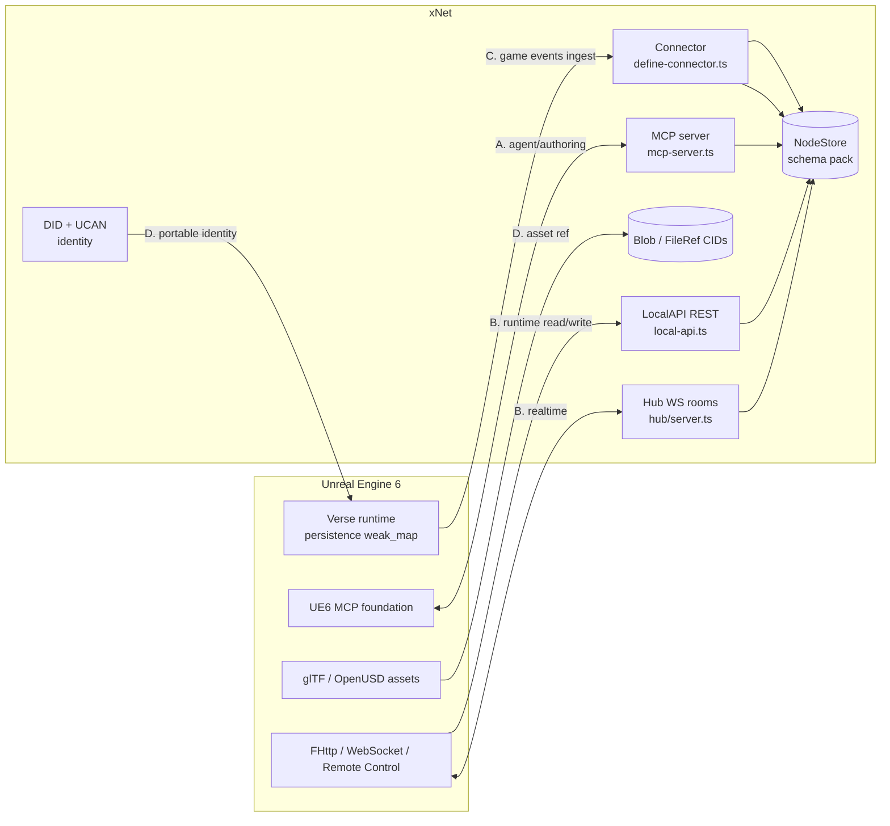
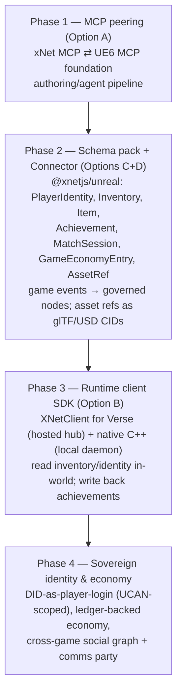
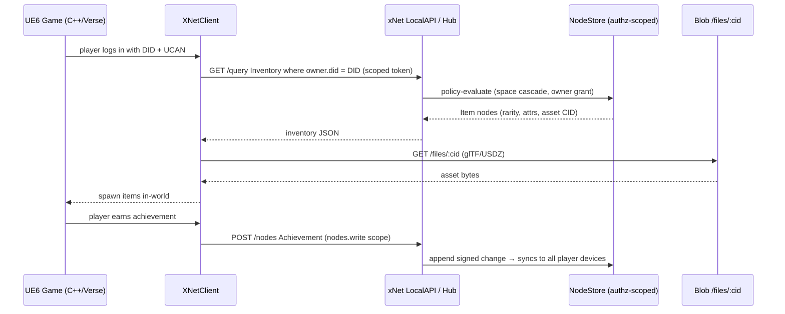
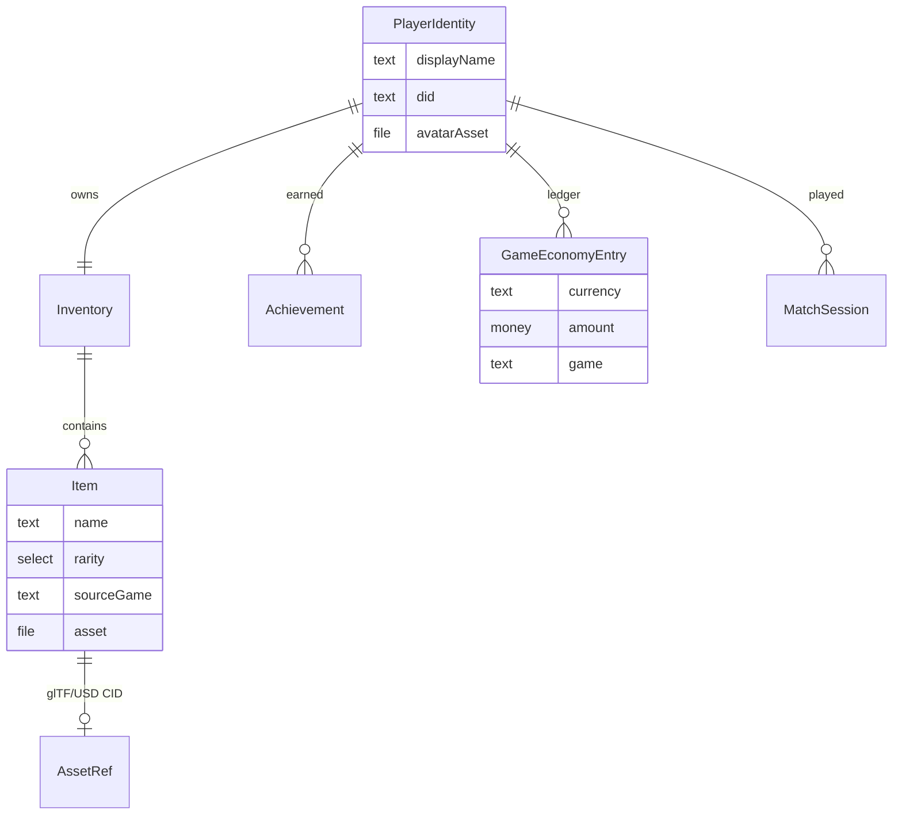

# xNet × Unreal Engine 6: A Sovereign Cross-Game Data & Identity Bridge

## Problem Statement

> "Unreal Engine 6 was just announced and it has kind of deep support for open
> standards. It seems like they're really trying to provide open standards for
> the entire gaming industry. And I'm thinking it'd be really cool if xNet was
> able to integrate directly into the Unreal Engine 6 ecosystem. So… somehow
> making xNet data and applications accessible to Unreal Engine games, and vice
> versa, Unreal Engine games accessible to xNet apps. I don't know what the
> interface might look like or where the different touch points might be, but
> it's worth doing some exploration into Unreal Engine 6 and seeing how it might
> integrate with xNet."

At [State of Unreal 2026](https://www.unrealengine.com/news/state-of-unreal-2026-top-news-from-the-show)
Epic announced Unreal Engine 6 (Early Access **late 2027**) around three pillars:

1. **Verse everywhere** — the gameplay programming model moves to Verse, Epic's
   transactional language for "massive, persistent worlds where global state just
   works." Player persistence becomes "define a global map of player → saved
   state, no databases, never leave Verse" (the forward-compatible evolution of
   UEFN's `weak_map` persistence).
2. **Portability via open standards** — "content, code, and **economies** should
   be portable across games and engines." Where a standard already serves the
   need (**glTF**, **OpenUSD**) Epic makes it a *first-class* engine format; where
   none exists, Epic publishes **its own systems as open specifications** —
   Verse APIs, defined asset conventions, public docs that *any* engine can
   implement. The explicit goal is Metcalfe's-Law network effects: cross-promotion,
   portable player value, connected social graphs.
3. **An open MCP foundation** — Epic is "exposing a broad set of engine
   capabilities through the **MCP protocol**" with Claude, Gemini and Codex as
   first-class model integrations, "so developers can build custom integrations
   of all sorts on an open Unreal Engine 6 MCP foundation."

The strategic observation that makes this worth exploring: **UE6's vision needs a
persistent, user-owned, cross-game data-and-identity layer, and conspicuously does
not provide one in a sovereign way.** Verse persistence is real but lives inside an
Epic-hosted, per-ecosystem runtime. "Portable player value" presumes somewhere
neutral for that value to *live* between games. xNet — a **local-first,
schema-typed, authorization-aware, CRDT-synced data graph with DID identity, an
MCP server, and a capability-scoped connector runtime** — is almost exactly the
shape of the missing piece. And the bridge it would need is already 80% built.

This exploration answers: **what is the concrete interface and set of touch points
by which (a) a UE6 game reads/writes a player's xNet data at authoring- and
run-time, and (b) a UE6 game's state, events and economy flow into xNet as
governed nodes that xNet apps render, automate and share — and which of these
should we build first?**

## Executive Summary

1. **There are two directions, and they map cleanly onto primitives xNet already
   ships.** *xNet → game* (player's sovereign data appears in-world) rides the
   **MCP server** (`packages/plugins/src/services/mcp-server.ts`) and **LocalAPI**
   (`packages/plugins/src/services/local-api.ts`). *Game → xNet* (game state
   becomes governed nodes) rides the **Connector** primitive
   (`packages/plugins/src/connectors/define-connector.ts`). Neither direction
   requires new infrastructure — both are compositions of existing seams.

2. **The single most valuable, most defensible integration is identity +
   persistent player data, not graphics.** xNet has `did:key` + UCAN
   (`packages/identity`), schema-native authorization, spaces cascade, and signed
   CRDT changes. UE6 wants portable player value across engines. **xNet's DID is
   the player's portable identity; their xNet graph is the portable, user-owned
   save state and inventory.** That is a capability UE6 structurally does not have
   and Epic's own persistence cannot offer (it's Epic-hosted, per-ecosystem). This
   is the wedge.

3. **Align at the open-standard layer where it's cheap, bridge at the protocol
   layer where it's rich.** UE6's open specs are glTF/USD (assets) and Verse APIs +
   asset conventions (everything else), over an MCP foundation. xNet should: store
   asset *references* as glTF/USD-shaped `FileRef` CIDs (cheap, standards-aligned),
   and do the real bidirectional work over **MCP** (authoring/agent) and a thin
   **runtime HTTP/WebSocket bridge** (live data). Don't try to be a 3D engine —
   xNet has no native glTF/USD/mesh support and shouldn't grow one.

4. **The new code is small: one schema pack + one Verse/native client SDK + MCP
   cross-wiring.** A `@xnetjs/unreal` package contributing a **game-interop schema
   pack** (`PlayerIdentity`, `Inventory`, `Item`, `Achievement`, `MatchSession`,
   `GameEconomyEntry`, `AssetRef`), a **Connector** for ingesting game events, and
   a published **Verse/C++ client** (`XNetClient`) that speaks to xNet's existing
   MCP/LocalAPI/hub endpoints. Everything underneath already exists.

5. **Respect the impedance mismatch.** A signed, content-addressed, LWW CRDT graph
   is the *wrong* place for frame-rate transforms. Sync **durable, player-facing,
   low-frequency** data (identity, inventory, achievements, economy, social,
   quests/tasks); model high-frequency runtime state as **events** or leave it in
   the engine. Getting this granularity boundary right is the difference between a
   useful bridge and a melted hub.

6. **The runtime bridge needs a native UE plugin, not pure Verse, for *local*
   xNet.** Verse's networking is sandboxed toward Epic-hosted services; reaching a
   user's `127.0.0.1` xNet daemon from inside Fortnite/UEFN will be restricted. So:
   *Verse path* → talks to an Epic-hosted or cloud xNet hub; *native C++ UE plugin
   path* → talks to the local xNet daemon (LocalAPI `:31415` / bridge `:31416`).
   Support both; don't assume Verse can hit localhost.

7. **Recommendation: Option E — "xNet as the player's sovereign cross-game data
   plane," shipped in four phases.** Start MCP-first (authoring, lowest cost,
   rides UE6's own open MCP foundation), add the schema pack + Connector
   (game → xNet), then the runtime client SDK (xNet → game), then standards-layer
   asset/identity exchange. Each phase is independently useful and inherits xNet's
   capability/consent/authorization security from
   [[0196-agent-native-connectors]] and [[0192-schema-authorization-coverage]].

## Current State In The Repository

xNet already exposes every seam an engine integration needs. The work is a schema
pack, a client SDK, and wiring — not greenfield infrastructure. Verified paths:

### The agent/data interface (xNet → game, machine-readable)

- **MCP server.** `packages/plugins/src/services/mcp-server.ts` (+ `mcp-http.ts`,
  `mcp-guardrail.ts`) exposes the workspace as MCP tools (`xnet_search`,
  `xnet_query`/`xnet_database_query`, `xnet_read_page_markdown`, `xnet_create`,
  `xnet_update`, …) over stdio or a hardened loopback HTTP transport (pairing
  token + Origin allowlist). Served via `xnet mcp serve` in
  `packages/cli/src/commands/`. **This is the direct counterpart to UE6's MCP
  foundation** — two MCP-speaking peers.
- **AI surface.** Tools merge `AiSurfaceService` tools (search, resources, plan
  validation) + plugin/connector `agentTools`, so anything a connector contributes
  is automatically MCP-callable.
- **LocalAPI REST.** `packages/plugins/src/services/local-api.ts` — loopback REST
  (`/api/v1/nodes`, `/query`, `/schemas`, `/nodes/:id/events`, `/ai/search`) with
  **scoped tokens** (`nodes.read`/`nodes.write`/`ai.read`/…). This is the natural
  endpoint for a native UE plugin to poll/write at runtime.
- **Agent bridge.** `packages/devkit/src/bridge-server.ts`
  (`DEFAULT_BRIDGE_PORT = 31416`, `createBridgeServer`) — loopback daemon with
  `/health` + OpenAI-compatible SSE + an MCP config, the BYO-agent path from
  [[0194-agent-bridge]]. A UE6 in-editor assistant could drive xNet through it.

### The ingestion interface (game → xNet, governed)

- **Connector primitive.** `packages/plugins/src/connectors/define-connector.ts` —
  `defineConnector({ id, capabilities, sync, agentTools })` produces a
  `FeatureModule` + a server-side `sync` spec (mounted by the hub
  `connectorSyncFeature` under `<id>.sync`) + MCP-callable `agentTools`. Cadence is
  `manual | hourly | daily | { everyMs }` (`sync-runner.ts`). Every synced schema
  must be declared in `capabilities.schemaWrite`, so a game connector can only
  write `game/*` nodes. This is the exact pattern from
  [[0196-agent-native-connectors]] — a UE6 game is "just another external service."
- **Importers contribution point.** `packages/plugins/src/importers.ts` — bulk
  one-shot import (e.g. an exported match-history dump) vs. the Connector's live
  cadence.
- **Secret broker.** Hub `scopedEnv` projects env down to a feature's declared
  keys, so a game connector sees `UNREAL_*`/`EPIC_*` and never the Stripe secret.

### The data model (what game data becomes)

- **Schemas.** `packages/data/src/schema/define.ts` (`defineSchema`) with property
  builders in `packages/data/src/schema/properties/` — `text`, `number`,
  `select`, `relation`, `person`, `date`, `money` (integer minor units), and
  **`file`** (`properties/file.ts`, accepts arbitrary MIME via `accept: [...]`).
- **NodeStore.** `packages/data/src/store/store.ts` — event-sourced, LWW,
  Lamport-clocked, CRDT-synced, FTS-indexed. A node carries `id`, `schemaId`,
  `properties`, `createdBy: DID`, optional `documentContent: Uint8Array` (a Yjs
  doc for collaborative content).
- **Blobs.** `packages/data/src/blob/blob-service.ts` — content-addressed (CID),
  chunked storage returning a `FileRef { cid, name, mimeType, size }`. **A glTF or
  USDZ asset can be stored as a blob today** — xNet just won't *understand* or
  *render* it (see Gaps).

### The transport & realtime layer

- **Hub.** `packages/hub/src/server.ts` — Hono + WebSocket; Yjs rooms, node-change
  relay, `awareness`/presence (`packages/hub/src/services/`), federation, and
  routes incl. `/files/:cid`, `/schemas`, `/public`, `/share-links`. A game can
  subscribe to a room and receive node changes live.
- **Network.** `packages/network/src/` — libp2p node + WebRTC providers
  (`providers/`), the P2P sync substrate.
- **Comms.** `packages/comms/src/{calls,chat,presence,notify}` — WebRTC
  voice/video + chat + presence. Directly relevant to **cross-game voice/party**
  and **in-game chat surfaced into xNet** (and vice versa).

### Adjacent surfaces worth reusing

- **Identity.** `packages/identity` — `did:key`, UCAN tokens, passkey storage. The
  portable-player-identity wedge.
- **Authorization.** Schema-native policy evaluator + spaces cascade +
  `guardStore`/`guardedFetch` ([[0192-schema-authorization-coverage]]) — the
  privacy gate that lets a game see *only* the player's game-scoped space.
- **Ledger.** `packages/ledger` (`money()`, double-entry) — represent in-game
  economy/currency as a real ledger.
- **Canvas / maps.** `packages/canvas` (infinite 2D canvas, WebGL *tile* layers —
  **not** a 3D engine), `packages/maps` (geospatial). Useful for level maps,
  economy dashboards, social graphs — not for rendering the game.
- **Views / dashboard / charts.** `packages/views`, `packages/dashboard`,
  `packages/charts` — the surfaces that turn ingested game data into a guild
  manager, a stats dashboard, a quest board.

### The honest gap inventory

| Gap | Reality | Consequence for UE6 |
|---|---|---|
| **No native 3D** | Zero glTF/USD/mesh/skeleton types; `grep` finds no `gltf`/`openusd`/`babylon` anywhere. Canvas WebGL is 2D tiles. | xNet stores asset *refs* (CIDs, URIs), never renders the scene. Rendering stays in UE. |
| **No frame-rate sync** | NodeStore is signed, content-addressed, LWW. | Don't push transforms/physics. Sync durable player data; model the rest as events. |
| **Verse ↔ localhost** | Verse networking is sandboxed toward Epic services. | Local-xNet runtime bridge needs a native C++ UE plugin; Verse path targets a hosted hub. |
| **Blob streaming** | Content-addressed chunk retrieval, not a stream CDN. | Fine for metadata/small assets; large meshes → external CDN, store CID/URI. |
| **No spatial schema** | No transform/Vec3/scene-graph primitive. | Add light `transform`/`AssetRef` fields in the schema pack; keep them coarse. |

## External Research

### What UE6 actually opens up

- **glTF & OpenUSD become first-class.** Per the
  [road to UE6](https://www.unrealengine.com/news/the-road-to-ue-6) and
  [GamesBeat](https://gamesbeat.com/unreal-engine-6-will-combine-ue5-and-uefn-into-a-unified-engine-state-of-unreal/),
  where glTF/USD suffice they become first-class engine formats; where no standard
  exists, Epic publishes **Verse APIs + asset conventions + docs** as open specs
  any engine can implement. MetaHuman Rigs+SDK and the Lore version-control system
  were open-sourced as part of this.
- **glTF vs USD division of labor.** Per
  [Khronos](https://www.khronos.org/blog/building-bridges-in-3d-aousd-and-khronos-collaborate-on-openusd-and-gltf-interoperability)
  and the [Metaverse Standards Forum](https://metaverse-standards.org/news/blog/3d-asset-interoperability-using-usd-and-gltf-working-group-2023-year-in-review/):
  glTF is the "JPEG of 3D" (compact runtime delivery), USD is the high-fidelity
  authoring/scene format. The AOUSD↔Khronos liaison is actively defining USD↔glTF
  interop. AOUSD members already include Apple, Pixar, Adobe, Autodesk, NVIDIA,
  Meta, **Epic**, Unity, IKEA, Lowes — the format war is cooling into a layered
  standard. **Implication for xNet: treat both as opaque, store the ref, don't
  parse.**
- **Persistent player data.** Per
  [GamingOnLinux](https://www.gamingonlinux.com/2026/06/unreal-engine-6-is-all-about-generative-ai-fortnite-and-the-verse/)
  and the road-to-UE6 post, Verse persistence is "a global map of player → saved
  state, no databases," evolving from UEFN `weak_map`. It is powerful but
  **Epic-runtime-hosted and per-ecosystem** — not user-portable across publishers.
- **MCP foundation.** Per
  [wccftech](https://wccftech.com/epic-games-unreal-engine-6-claude-gemini-developer-control/)
  and [Neowin](https://www.neowin.net/news/epic-games-says-unreal-engine-6-will-help-developers-build-content-faster-using-ai-models/),
  Epic is exposing engine capabilities over MCP with Claude/Gemini/Codex
  first-class. **This is the single biggest gift to xNet: a standard, already-built
  protocol on both sides.** xNet ships an MCP server; UE6 ships an MCP foundation.
- **Timeline.** Early Access **late 2027**, full release 12–18 months after. So
  this is a *forward-looking bet*: build against the open specs as they stabilize,
  prototype now against UE5.x/UEFN + the public MCP/USD tooling that already exists.

### Prior art for "game data in a user-owned graph"

- **OpenUSD as the metaverse substrate** ([The New Stack](https://thenewstack.io/openusd-could-enable-a-real-metaverse/))
  — the industry consensus that scene/asset interop runs through USD; identity,
  economy and social graphs are explicitly *out of scope* for USD. That out-of-scope
  set is precisely xNet's domain.
- **Existing engine ↔ external-data bridges** — Unreal's HTTP/REST (`FHttpModule`),
  WebSocket, and Remote Control API; UEFN's `weak_map` + (announced) general
  persistence. None of these give the *player* ownership of the data; they bind it
  to the game/publisher. xNet inverts that.
- **MCP game servers** — a small but growing set of "expose the engine to an agent
  over MCP" projects already exist for UE5; UE6 makes this first-party. xNet
  joining as a *peer* MCP server (not just a client) is the novel move.

## Key Findings

1. **Both peers already speak MCP — that's the cheapest, highest-leverage bridge.**
   xNet's MCP server and UE6's MCP foundation can be wired as two registered MCP
   servers in the same agent harness *today's-pattern* way. An in-editor agent can
   read a designer's xNet spec docs/tasks and drive the engine; conversely the
   engine's MCP tools can be surfaced into xNet's AI surface. No new protocol.

2. **The defensible product is sovereignty, not rendering.** UE6 gives portability
   *within Epic's ecosystem*; xNet gives portability *the player owns*. Identity
   (DID), inventory, achievements, economy, and social graph living in a
   user-controlled, authorization-scoped graph that *any* engine can read is a
   capability no engine ships. Lead with that, not with "xNet renders your game."

3. **The Connector already models "a game is an external service."** Game →
   xNet ingestion is a `defineConnector` away — same governed, capability-scoped,
   marketplace-distributable shape as Slack/GitHub. The only new artifact is the
   schema pack the connector writes into.

4. **Granularity is the whole ballgame.** The bridge is great for the ~dozens of
   durable, player-facing facts per session and catastrophic for the thousands of
   per-frame ones. Encode that boundary as a rule, not a hope: *if it belongs in a
   save file, it can sync to xNet; if it belongs in a netcode packet, it must not.*

5. **Two runtime paths, by trust boundary.** Verse → hosted xNet hub (sandbox-safe,
   works inside Fortnite islands). Native C++ UE plugin → local xNet daemon
   (`:31415`/`:31416`, full power, desktop/standalone titles). Different titles
   will want different paths; the schema pack and MCP layer are shared.

6. **Standards alignment is mostly free.** Storing an asset as a `FileRef` whose
   `mimeType` is `model/gltf-binary` or `model/vnd.usdz+zip` and whose CID resolves
   via the hub `/files/:cid` route makes xNet a *standards-compliant asset
   reference store* with no parser, no renderer, no new dependency.

## Options And Tradeoffs



### Option A — MCP-only bridge (authoring / agent-time)

Wire xNet's MCP server and UE6's MCP foundation as peer servers in an agent
harness. The agent reads xNet design docs, tasks, lore, asset lists and drives the
engine; engine MCP tools surface into xNet's AI surface.

- **Pros:** Near-zero new code (both sides already speak MCP); rides Epic's own
  open MCP foundation; immediately useful for *making* games from xNet specs;
  inherits `McpWriteGuardrail` safety.
- **Cons:** Request/response, agent-mediated; not a runtime data path; "in-game
  xNet data" only as far as an agent pastes it in.
- **Best for:** Day-1 prototype, design/production pipeline, lowest risk.

### Option B — Runtime data bridge (LocalAPI REST + hub WS ↔ UE networking)

A UE plugin / Verse module reads & writes the player's xNet nodes live: poll
LocalAPI, or subscribe to a hub room for push.

- **Pros:** Genuine "xNet data in the game" and "game state to xNet" in real time;
  player-owned inventory/identity rendered in-world.
- **Cons:** Needs a maintained client SDK on the UE side; Verse can't reach
  localhost (native plugin needed for local xNet); must police granularity.
- **Best for:** The headline experience — sovereign cross-game inventory/identity.

### Option C — Connector ingestion (game → xNet analytics/management plane)

A `defineConnector` pulls game events/economy/match-history into governed nodes;
xNet apps (dashboard, CRM-style guild manager, ledger, task board) render them.

- **Pros:** Pure reuse of [[0196-agent-native-connectors]]; governed,
  marketplace-distributable; async (no frame-rate worries); huge surface of xNet
  apps light up immediately.
- **Cons:** One-directional (doesn't put xNet data *in* the game); needs the game
  to emit events somewhere the connector can fetch.
- **Best for:** "Manage / analyze / socialize my game life from xNet."

### Option D — Open-standard asset & identity exchange (glTF/USD + DID)

Interop purely at the data-format layer: xNet stores glTF/USD asset refs and the
player's DID; the game resolves them via standard formats.

- **Pros:** Maximally durable & standards-aligned; survives protocol churn;
  near-free to store.
- **Cons:** Only as rich as the schema mapping; no live behavior; USD↔glTF interop
  still a moving target.
- **Best for:** The durable substrate *under* the other options.

### Option E — **Layered "sovereign cross-game data plane" (recommended)**

Not a choice between A–D but a **phased stack**: MCP-first (A) for authoring, the
schema pack + Connector (C) for game→xNet, the runtime client SDK (B) for
xNet→game, all sitting on the standards layer (D) for assets/identity. One new
package (`@xnetjs/unreal`), one schema pack, one published UE client.

- **Pros:** Each layer ships independently and is useful alone; matches xNet's
  "thin composition over existing primitives" grain; security inherited from the
  authorization/capability/consent stack.
- **Cons:** Largest total scope; depends on UE6 specs maturing through 2027.
- **Best for:** The actual long-term position — xNet as the neutral, user-owned
  layer UE6's portability vision implies but doesn't supply.

| Option | New code | Bidirectional | Runtime | Standards-aligned | Ship risk |
|---|---|---|---|---|---|
| A MCP-only | ~none | ◑ (agent) | ✗ | ◑ | **Low** |
| B Runtime bridge | UE client SDK | ✓ | ✓ | ◑ | Med-High |
| C Connector | schema pack | ✗ | ✗ (async) | ◑ | Low |
| D Std exchange | schema fields | ◑ | ✗ | ✓ | Low |
| **E Layered** | pkg + pack + SDK | ✓ | ✓ | ✓ | **Phased** |

## Recommendation

**Adopt Option E, sequenced so the cheapest, most certain value lands first.**



Why this order:

- **Phase 1** costs almost nothing (both peers speak MCP) and is useful *now*
  against UE5.x/UEFN tooling — it de-risks everything by proving the protocol seam
  before UE6 ships.
- **Phase 2** is pure reuse of the Connector pattern and immediately lights up the
  entire xNet app surface (dashboards, guild manager, quest board, economy ledger)
  over real game data, with zero runtime/frame-rate exposure.
- **Phase 3** is the headline "sovereign inventory in any game" experience, but
  it's also the highest-maintenance (a published UE SDK tracking moving specs), so
  it goes *after* the value is already flowing.
- **Phase 4** is the moat: the player's DID is their login and their data is their
  own, across publishers — the thing no engine can ship.

Concrete next steps: create `packages/unreal` (`@xnetjs/unreal`) with the schema
pack + a `defineConnector('fyi.xnet.unreal', …)`; register xNet's MCP server in a
UE6 MCP config as a Phase-1 spike; keep the UE-side client out of this repo (a
separate Verse/C++ plugin repo) but define its contract here.

## Example Code

### 1. The game-interop schema pack (`packages/unreal/src/schemas.ts`)

```ts
import { defineSchema, text, number, select, relation, person, money, file }
  from '@xnetjs/data'

const ns = 'xnet://game/'

/** The player's portable identity — keyed to their xNet DID. */
export const PlayerIdentitySchema = defineSchema({
  name: 'PlayerIdentity', namespace: ns, version: '1.0.0',
  properties: {
    displayName: text({ required: true }),
    did: text({ required: true }),          // did:key — the portable login
    avatarAsset: file({ accept: ['model/gltf-binary', 'model/vnd.usdz+zip'] }),
    homeGame: text({}),
  },
  authorization: 'owner',                     // presets.private() — owner-only
})

/** A held item; portable across any game that implements the convention. */
export const ItemSchema = defineSchema({
  name: 'Item', namespace: ns, version: '1.0.0',
  properties: {
    name: text({ required: true }),
    rarity: select({ options: ['common', 'rare', 'epic', 'legendary'] as const }),
    sourceGame: text({}),
    asset: file({ accept: ['model/gltf-binary', 'model/vnd.usdz+zip'] }), // glTF/USD CID
    attributes: text({}),                     // opaque JSON, engine-interpreted
  },
})

export const InventorySchema = defineSchema({
  name: 'Inventory', namespace: ns, version: '1.0.0',
  properties: {
    owner: relation({ to: PlayerIdentitySchema }),
    items: relation({ to: ItemSchema, multiple: true }),
  },
})

export const GameEconomyEntrySchema = defineSchema({
  name: 'GameEconomyEntry', namespace: ns, version: '1.0.0',
  properties: {
    player: relation({ to: PlayerIdentitySchema }),
    currency: text({ required: true }),
    amount: money({ required: true }),        // integer minor units → @xnetjs/ledger
    reason: text({}),
    game: text({}),
  },
})
// + AchievementSchema, MatchSessionSchema, AssetRefSchema …
```

### 2. Game → xNet ingestion (`packages/unreal/src/connector.ts`)

```ts
import { defineConnector } from '@xnetjs/plugins'
import { ItemSchema, AchievementSchema, GameEconomyEntrySchema } from './schemas'

export const unrealConnector = defineConnector({
  id: 'fyi.xnet.unreal',
  name: 'Unreal Engine 6 Game Bridge',
  capabilities: {
    secrets: ['UNREAL_*', 'EPIC_*'],          // broker-scoped; can't see other secrets
    schemaWrite: [                            // can ONLY write game/* nodes
      'xnet://game/Item@1.0.0',
      'xnet://game/Achievement@1.0.0',
      'xnet://game/GameEconomyEntry@1.0.0',
    ],
    network: ['*.epicgames.com', 'api.example-game.com'],
  },
  sync: {
    schemas: [ItemSchema, AchievementSchema, GameEconomyEntrySchema],
    cadence: { everyMs: 60_000 },             // never frame-rate; durable facts only
    async run(ctx) {
      const events = await ctx.fetch('https://api.example-game.com/v1/events')
      for (const ev of (events as GameEvent[])) ctx.store.upsert(mapEventToNode(ev))
      return { upserted: events.length }
    },
  },
  agentTools: [                               // MCP-callable over the synced store
    { name: 'unreal_recent_achievements', /* … */ },
  ],
})
```

### 3. xNet → game at runtime (UE side, illustrative Verse pseudocode)

```verse
# Native C++ plugin path hits the local daemon; Verse path hits a hosted hub.
XNetClient := class:
    Endpoint : string = "https://hub.player.xnet.fyi"   # or 127.0.0.1:31415 (native)
    Token    : string                                   # UCAN, scoped to game/* space

    GetInventory(Player : did)<suspends> : []Item =
        Resp := Http.Get("{Endpoint}/api/v1/query", Json{
            schemaId := "xnet://game/Inventory@1.0.0",
            filters  := map{ "owner.did" => Player }
        }, Token)
        return ParseItems(Resp)               # resolve asset CIDs via /files/:cid
```

### 4. Runtime read sequence (sovereign inventory in-world)



### 5. The interop schema pack (ER view)



## Risks And Open Questions

- **Forward bet on unreleased specs.** UE6 EA is **late 2027**. Verse APIs, the
  asset conventions, the MCP foundation surface, and the general persistence API
  will shift. *Mitigation:* Phase 1 (MCP peering) works against today's UE5.x/UEFN;
  treat Phases 3–4 as tracking targets, gate them behind labs trust tiers, and keep
  the UE-side client in its own repo so its churn doesn't destabilize xNet.
- **Verse can't reach localhost.** Almost certain in Fortnite/UEFN sandboxes.
  *Mitigation:* native C++ plugin for local-xNet titles; Verse path strictly to a
  hosted hub. Decide per-title; don't promise localhost from Verse.
- **Granularity melt-down.** Someone *will* try to sync transforms every frame and
  vaporize the hub. *Mitigation:* document the save-file-vs-netcode-packet rule;
  have the connector/SDK reject high-frequency schemas; expose only durable
  schemas in the pack.
- **Privacy blast radius.** A game reading "the player's xNet graph" is a serious
  risk. *Mitigation:* lean entirely on [[0192-schema-authorization-coverage]] —
  the game gets a UCAN scoped to a single `game/*` space; the policy evaluator +
  spaces cascade guarantee it can never see the player's finance/CRM/notes. This is
  xNet's core differentiator; make it loud.
- **Economy = regulatory minefield.** "Portable economies" + real money + NFTs +
  cross-jurisdiction. *Mitigation:* Phase 2/4 represent economy as a *ledger of
  record* (`@xnetjs/ledger`), explicitly **not** a settlement/payment rail. No
  custody, no transfer of real value, until a deliberate later decision.
- **Asset interop is lossy.** USD↔glTF mapping is an active working group, not a
  solved problem. *Mitigation:* store opaque refs + `mimeType`; never transcode;
  let the engine own fidelity.
- **Is there demand before 2027?** The Connector/dashboard value (Phase 2) is real
  against *today's* games (any game with an events/stats API). That's the hedge:
  Phase 2 pays off even if UE6 slips.
- **Open questions:** Does UE6 let a third-party MCP server register *into* the
  engine's foundation, or only the reverse? What's the auth model on UE6's MCP
  endpoint? Will Epic's persistence expose an export hook xNet could mirror? Does
  Verse get general outbound HTTP or only allowlisted hosts?

## Implementation Checklist

- [ ] **Phase 1 — MCP peering spike.** Stand up `xnet mcp serve --http`, register
      it alongside a UE5.x/UEFN MCP server in one agent harness, and demo an agent
      reading xNet design docs/tasks and issuing an engine action. Document the
      auth/registration contract UE exposes.
- [x] **Phase 2 — schema pack.** Game-interop pack shipped in `@xnetjs/data`
      (`packages/data/src/schema/schemas/game.ts`): `PlayerIdentity`, `Inventory`,
      `GameItem`, `Achievement`, `MatchSession`, `GameEconomyEntry`, `GameAsset`,
      each with `spaceCascadeAuthorization()`; registered through the 3-layer
      barrel; `authorization-coverage.test.ts` + `game.test.ts` green. (Schemas
      live in `@xnetjs/data`, not `packages/unreal`, to stay inside `builtInSchemas`
      and avoid a `data → unreal` cycle; `Item`→`GameItem`, `AssetRef`→`GameAsset`
      to avoid generic-name collisions in the flat namespace.)
- [x] **Phase 2 — connector.** `buildUnrealConnector` in `@xnetjs/unreal`
      (`packages/unreal/src/connector.ts`) produces a real `defineConnector`-valid
      `ConnectorDefinition` (`fyi.xnet.connector.unreal`) — capability-scoped
      `schemaWrite`/`network`/`secrets`, configurable cadence, opt-in `agentTools`,
      a `pull` that maps events → nodes. A test wraps it with the real
      `defineConnector` to prove zero structural drift. (Hub `connectorSyncFeature`
      mount under `.sync` deferred — the connector ships unmounted, exactly like the
      0196 connectors, to be wired when a real title API exists.)
- [ ] **Phase 2 — xNet app surfaces.** A "Games" workbench view + a dashboard/CRM
      "guild manager" + a ledger-backed economy view over the ingested nodes.
      *(Deferred — view-layer follow-on.)*
- [x] **Phase 2 — asset refs.** `GameItem.asset` / `PlayerIdentity.avatarAsset` /
      `GameAsset.file` are `file()` refs restricted to glTF/USD MIME types
      (`GAME_ASSET_MIME_TYPES`); the existing content-addressed blob path +
      `/files/:cid` serve them unchanged (no xNet-side parsing).
- [ ] **Phase 3 — UE client SDK (separate repo).** `XNetClient` for Verse (hosted
      hub) + native C++ (LocalAPI `:31415`); read inventory/identity, write
      achievements; ship a sample "sovereign inventory" map. *(Deferred — separate
      repo.)*
- [ ] **Phase 3 — runtime auth.** Mint UCAN tokens scoped to a single `game/*`
      space; verify the policy evaluator denies cross-space reads. *(Deferred.)*
- [ ] **Phase 4 — DID login.** Prototype "log into a game with your xNet DID";
      cross-game social graph via `packages/social`; party voice via
      `packages/comms`. *(Deferred.)*
- [x] **Pin the granularity rule** in the connector and enforce it: the
      `@xnetjs/unreal` granularity guardrail (`granularity.ts`) rejects any cadence
      below the 1s `MIN_SYNC_INTERVAL_MS` floor and any non-durable schema target,
      at connector build time — "save-file data may sync, netcode-packet state may
      not" is now executable, not advisory.

## Validation Checklist

- [ ] A coding agent, given an xNet workspace + a UE MCP server, completes a task
      that *reads* xNet data and *acts* on the engine (Phase 1 proof).
- [x] The Unreal connector maps sample game events into the durable `game/*`
      schemas via `mapGameEventToNode` + `pull` (unit-proven with a fake store);
      appearing in search/dashboard/ledger follows from the standard node path.
      *(Live re-sync idempotence against a real title API is deferred with the hub
      mount.)*
- [x] `authorization-coverage.test.ts` passes with the seven new schemas and
      `game.test.ts` asserts each declares a non-legacy policy + carries the `space`
      relation the cascade reads. *(The cross-space UCAN negative test ships with
      Phase 3 runtime auth.)*
- [x] A glTF asset round-trips through the schema layer: `GameAsset.create` accepts
      a `FileRef` with `mimeType: model/gltf-binary`; the `file()` accept list locks
      to glTF/USD MIME. *(End-to-end `/files/:cid` serving is the existing,
      unchanged blob path.)*
- [ ] The runtime SDK reads a player's inventory and writes an achievement; the
      change syncs to a second device via the hub. *(Deferred — Phase 3.)*
- [x] A deliberately high-frequency (per-frame) cadence and a non-durable schema
      target are both **rejected** by the granularity guardrail
      (`granularity.test.ts`, `connector.test.ts`).
- [ ] Secret scoping verified end-to-end: the connector declares `UNREAL_*`/`EPIC_*`
      only; the hub `scopedEnv` projection is exercised when the connector is
      mounted. *(Deferred with the hub mount.)*
- [x] No new heavy dependency lands in `apps/web`/`apps/desktop` bundles: the schema
      pack adds none, and `@xnetjs/unreal` is a server-side connector package
      (deps: `@xnetjs/data`; `@xnetjs/plugins` dev-only) — no 3D engine, blob path
      stays content-addressed.

## References

### Unreal Engine 6 / State of Unreal 2026
- [State of Unreal 2026: Top news](https://www.unrealengine.com/news/state-of-unreal-2026-top-news-from-the-show)
- [The road to Unreal Engine 6](https://www.unrealengine.com/news/the-road-to-ue-6)
- [UE6 will combine UE5 and UEFN into a unified engine (GamesBeat)](https://gamesbeat.com/unreal-engine-6-will-combine-ue5-and-uefn-into-a-unified-engine-state-of-unreal/)
- [UE6 merges UE5 and UEFN (Game Developer)](https://www.gamedeveloper.com/programming/unreal-engine-6-will-merge-ue5-and-uefn-into-a-single-unified-engine-)
- [Epic integrates Claude and Gemini into UE6 via MCP (wccftech)](https://wccftech.com/epic-games-unreal-engine-6-claude-gemini-developer-control/)
- [Epic: UE6 helps build content faster using AI (Neowin)](https://www.neowin.net/news/epic-games-says-unreal-engine-6-will-help-developers-build-content-faster-using-ai-models/)
- [UE6 is all about Generative AI, Fortnite and the Verse (GamingOnLinux)](https://www.gamingonlinux.com/2026/06/unreal-engine-6-is-all-about-generative-ai-fortnite-and-the-verse/)
- [UE6 targets late 2027 Early Access (DayOne)](https://playday.one/2026/06/17/unreal-engine-6-targets-a-late-2027-early-access-release/)

### Open standards / interoperability
- [AOUSD & Khronos collaborate on OpenUSD and glTF interoperability](https://www.khronos.org/blog/building-bridges-in-3d-aousd-and-khronos-collaborate-on-openusd-and-gltf-interoperability)
- [3D Asset Interoperability Using USD and glTF Working Group](https://metaverse-standards.org/news/blog/3d-asset-interoperability-using-usd-and-gltf-working-group-2023-year-in-review/)
- [OpenUSD Could Enable a Real Metaverse (The New Stack)](https://thenewstack.io/openusd-could-enable-a-real-metaverse/)
- [Metaverse Standards Forum Launches (The New Stack)](https://thenewstack.io/metaverse-standards-forum/)

### xNet internal (prior explorations)
- [[0196-agent-native-connectors]] — the Connector primitive (game = external service)
- [[0194-agent-bridge]] — local bridge daemon `:31416`, BYO-agent, MCP config
- [[0192-schema-authorization-coverage]] — the policy/space privacy gate the game bridge depends on
- `docs/explorations/0196_[x]_AGENT_NATIVE_CONNECTORS_AND_INTEGRATION_MARKETPLACE.md`
- `docs/explorations/0194_[_]_AGENT_BRIDGE_CLAUDE_CODE_CODEX_AND_ANY_AGENT_IN_XNET.md`

### xNet code touch points
- `packages/plugins/src/services/mcp-server.ts`, `mcp-http.ts`, `mcp-guardrail.ts` — MCP peer
- `packages/plugins/src/services/local-api.ts` — runtime REST
- `packages/plugins/src/connectors/define-connector.ts`, `sync-runner.ts` — ingestion
- `packages/devkit/src/bridge-server.ts` — `:31416` bridge daemon
- `packages/data/src/schema/define.ts`, `properties/file.ts` — schema pack + asset refs
- `packages/data/src/store/store.ts`, `blob/blob-service.ts` — NodeStore + content-addressed assets
- `packages/hub/src/server.ts` — WS rooms, `/files/:cid`, federation
- `packages/identity`, `packages/ledger`, `packages/comms`, `packages/social` — identity, economy, voice, social graph
