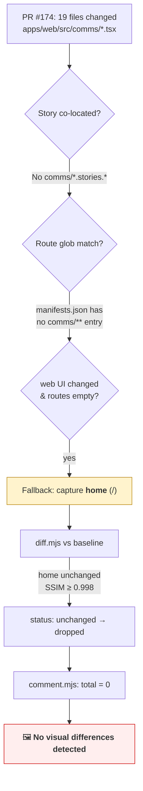
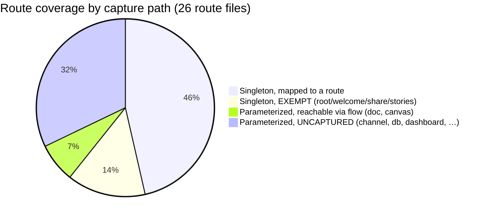
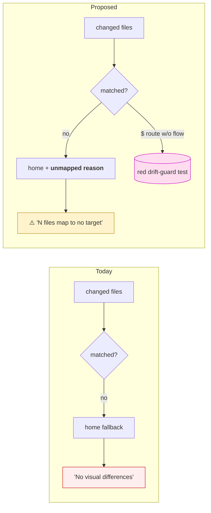

# Visual Capture Silently Misses Parameterized And Interaction‑Gated UI

> **Numbering note:** computed as the next free index in `docs/explorations/`
> (highest committed = 0199). Memory shows a parallel `0200` ("portable
> protocol spec") in flight in another worktree — recompute and renumber at PR
> time if it collides.

## Problem Statement

The repo has an automated **Visual UI Capture** system
([`scripts/visuals/`](../../scripts/visuals/),
[`.github/workflows/visual-capture.yml`](../../.github/workflows/visual-capture.yml),
exploration [0185](0185_[x]_CI_VISUAL_UI_CAPTURE_SCREENSHOTS_GIFS_ON_PRS.md)):
on every UI PR it screenshots the changed surfaces, diffs them against a `main`
baseline, and posts a sticky gallery comment. It is genuinely useful — when it
fires.

But it **misses big chunks of UI**, and worse, it misses them *silently*. The
trigger for this exploration is [PR #174 — "feat(web): polished chat & channels
UI (0198)"](https://github.com/crs48/xNet/pull/174): a **2,364‑line rewrite of
the entire chat presentation layer** (19 files under `apps/web/src/comms/` —
message grouping, avatars, emoji reactions, a thread pane, a hover toolbar, a
density toggle, presence dots). The visual‑capture comment it produced reads, in
full:

> ## 🖼️ UI changes in this PR
> _No visual differences detected in the changed UI._

Not "we couldn't reach this screen" — **"no visual differences."** The system
reported the *absence of change* for one of the largest UI changes in the
project's history. This has happened several times: large UI work lands with no
captures, or with captures that show the shell but none of the actual work.

This document explains the exact mechanism, shows it is a *known* failure mode
that a prior fix (exploration
[0191](0191_[x]_VISUAL_CAPTURE_MISSES_UNMAPPED_AND_INTERACTION_GATED_SURFACES.md))
left a structural hole in, quantifies the blind spot, and recommends a fix that
converts silent misses into loud, actionable signals.

## Executive Summary

- **Root cause:** capture targets are resolved from a **hand‑curated allowlist**
  ([`scripts/visuals/manifests.json`](../../scripts/visuals/manifests.json)) of
  *param‑free, seed‑free* routes plus *co‑located Storybook stories*. The chat
  surface satisfies **none** of the three matching paths:
  1. **No story** — there are zero `*.stories.*` files under
     `apps/web/src/comms/`.
  2. **No route glob** — `manifests.json` has no entry mapping
     `apps/web/src/comms/**` to anything.
  3. **Not a static route** — chat only renders at the **parameterized**
     `/channel/$channelId` route, which needs a channel id and seed messages; the
     route‑capturer only visits param‑free paths.
- **The silent part:** when nothing specific matches, `computeCaptureSet` falls
  back to capturing **`home`** (the `/` shell). The home shot is byte‑identical
  to the baseline (chat changes don't touch the shell), so `diff.mjs` classifies
  it `unchanged` and drops it, and `comment.mjs` prints **"No visual differences
  detected."** A *coverage gap* is rendered indistinguishable from *no UI change*.
- **This is a known hole.** Exploration 0191 added a drift‑guard test
  ([`lib/manifest-coverage.test.mjs`](../../scripts/visuals/lib/manifest-coverage.test.mjs))
  precisely to stop "a new surface ships, nobody maps it, CI reports no
  differences." But the guard **explicitly skips parameterized routes**
  (`.filter((f) => f.endsWith('.tsx') && !f.includes('$'))`, line 35). Chat lives
  behind `$channelId`, so the one guard meant to catch this could never see it.
- **The blind spot is large:** of **26** route files, **11 are parameterized**;
  only **2** of those (`doc.$docId`, `canvas.$canvasId`) are reachable — via the
  `create-page` and `canvas` flows. The other **9** (`channel`, `dashboard`,
  `db`, `lab`, `map`, `person`, `space`, `tag`, `view`) have **no route mapping,
  no flow, and no story** — entirely invisible to capture. Plus there are only
  **3 interaction flows** total, so even mapped routes only ever show their
  first‑paint "top of funnel," missing tab/inspector/modal UI.
- **Recommendation (layered):**
  1. **Make misses loud** — when changed UI files resolve *only* to the `home`
     fallback, the comment must say "⚠️ N changed file(s) map to no capture
     target" instead of "No visual differences." *(Keystone — this is what would
     have flagged PR #174.)*
  2. **Close the guard hole** — extend `manifest-coverage.test.mjs` to require
     every parameterized route to be covered by a flow glob or be explicitly
     `EXEMPT` with a reason.
  3. **Ship a `chat` flow** — seed a channel + messages and record the redesigned
     UI (the immediate fix for the comms surface).
  4. **Lower the authoring bar** — add stories for component‑dense dirs like
     `comms/` so isolated components are captured with zero seed plumbing.

## Current State In The Repository

### The pipeline

```
git diff ─▶ changed-capture-set.mjs ─▶ capture.mjs ─▶ diff.mjs ─▶ comment.mjs
           (which targets changed?)    (screenshot/   (vs main     (sticky PR
              │                          record flow)   baseline)    comment)
        manifests.json + SB index                 gh-pages baseline
```

Driven by
[`.github/workflows/visual-capture.yml`](../../.github/workflows/visual-capture.yml).
It is informational — `continue-on-error` throughout, never a required check
(lines 6–9). It is path‑filtered (lines 14–27); notably the filter **does**
include `apps/web/src/**`, so PR #174 *did* trigger the workflow — the failure is
downstream, in target resolution, not in the trigger.

### Where targets come from — the three matching paths

[`scripts/visuals/lib/capture-set.mjs:55‑109`](../../scripts/visuals/lib/capture-set.mjs)
is the pure core. A changed file becomes a capture target three ways:

1. **Story match** (lines 72‑83): a Storybook entry whose `importPath` changed,
   *or* a story co‑located in a changed directory.
2. **Route match** (lines 85‑88): a changed file matches a `routes[].globs`
   pattern in `manifests.json`.
3. **Home fallback** (lines 90‑96): if a web‑UI file changed
   (`/^(?:apps\/web\/src|packages\/ui\/src)\/.*\.(tsx|css)$/`) but **no route
   matched**, capture `home` so "the reviewer still sees the shell the change
   lives in."

Routes are captured by navigating the live app to `route.path`
([`capture.mjs:144‑169`](../../scripts/visuals/capture.mjs)). The path is used
verbatim (`new URL(route.path, webUrl)`) — there is **no param substitution and
no seed step**. The manifest's own header says routes "must render without URL
params and without bespoke seed data." Interaction‑gated UI is instead handled by
**flows** ([`flows.mjs`](../../scripts/visuals/flows.mjs)) — scripted Playwright
sessions that click/seed their way to the surface and record video.

### Why chat matched nothing

Tracing PR #174's changed set (`apps/web/src/comms/*.tsx` + one doc) through
`computeCaptureSet`:

| Path | Result for `apps/web/src/comms/**` |
| --- | --- |
| **Story** | No `*.stories.*` exists under `apps/web/src/comms/` → no match. |
| **Route glob** | [`manifests.json`](../../scripts/visuals/manifests.json) has 12 route entries; **none** glob `comms/**`. The chat route file `channel.$channelId.tsx` is referenced nowhere. → no match. |
| **Home fallback** | `apps/web/src/comms/ChannelChat.tsx` matches `webUiPattern` and routes is empty → **falls back to `home`**. |

So the capture set was exactly `{ stories: [], routes: [home], flows: [] }`. The
home shot was then diffed against the baseline
([`diff.mjs:54‑64`](../../scripts/visuals/diff.mjs)): identical → `status:
'unchanged'` → dropped. `comment.mjs` saw zero changed/new stills and zero flows
([`comment.mjs:66‑70`](../../scripts/visuals/comment.mjs)) and emitted **"No
visual differences detected in the changed UI."**



### Chat is only reachable behind a parameter

The only chat surface route is
[`apps/web/src/routes/channel.$channelId.tsx`](../../apps/web/src/routes/channel.$channelId.tsx):

```tsx
export const Route = createFileRoute('/channel/$channelId')({ component: ChannelPage })
function ChannelPage() {
  const { channelId } = Route.useParams()
  return <ChannelView channelId={channelId} />
}
```

There is **no** param‑free `/messages`, `/chat`, or `/inbox` route. Channels are
created in‑app (e.g.
[`RoomSection.tsx`](../../apps/web/src/comms/RoomSection.tsx) calls
`createChannel(bridge, { name, target })`). So chat is *structurally* a
flow‑only surface — like the CRM quote builder, which is why `crm-quote` exists
as a flow. Nobody ever wrote the equivalent `chat` flow.

### The drift guard that should have caught this — and its hole

Exploration 0191 anticipated *exactly* this and added
[`lib/manifest-coverage.test.mjs`](../../scripts/visuals/lib/manifest-coverage.test.mjs).
Its own docstring: *"a new workbench surface ships, nobody updates
`manifests.json`, and the visual‑capture job silently renders the wrong page (or
home) and reports 'No visual differences detected.'"* That is verbatim what PR
#174 did. But line 34‑35:

```js
const routeNames = readdirSync(join(repoRoot, 'apps/web/src/routes'))
  .filter((f) => f.endsWith('.tsx') && !f.includes('$')) // skip parameterized routes
```

The guard enumerates **singleton** routes only and **skips every `$` route**.
Chat (`channel.$channelId`), and 10 other parameterized surfaces, are
unreachable by the one test designed to flag unmapped surfaces. The guard is
green while the largest dynamic surfaces in the app are uncaptured.

### Quantifying the blind spot



- **26** route files; **11 parameterized**, **15 singleton**.
- **2/11** parameterized routes are reachable, both via flows (`doc.$docId` ←
  `create-page`, `canvas.$canvasId` ← `canvas`).
- **9/11** parameterized routes are fully uncaptured: `channel`, `dashboard`,
  `db`, `lab`, `map`, `person`, `space`, `tag`, `view`. Several (channels,
  dashboards, databases, spaces, maps) are *major* product surfaces.
- **3** interaction flows total (`create-page`, `canvas`, `crm-quote`), so even
  mapped *singleton* routes (finance, data, tasks, experiments, settings) only
  ever show first paint — their inspectors, dialogs, and forms are uncaptured.
  This is the "screenshots get taken but miss big chunks" half of the complaint.

## External Research

How mature visual‑regression tools handle the coverage question:

- **Chromatic / Storybook test‑runner** — coverage is **every story**. A
  component is covered iff it has a story; the story is an *authored artifact
  next to the code*. Missing coverage is visible as "no story exists," never as a
  false "no change." Cost scales per snapshot, which pushes teams to "meta‑story"
  consolidation — the opposite tension from xNet's (which *under*‑captures).
  ([Chromatic vs Playwright](https://www.chromatic.com/compare/playwright),
  [Netlify on Storybook VRT](https://www.netlify.com/blog/storybook-visual-regression-testing/))
- **Playwright VRT / Argos / Lost Pixel** — coverage is **every authored
  screenshot test**. Same property: a surface is covered iff someone wrote a test
  that drives to it. Argos's guidance for dynamic/seeded screens is **fixed
  datasets + API‑driven seeding**, and **masking** dynamic regions
  (`data-visual-test`) to keep diffs stable.
  ([Argos screenshot stabilization](https://argos-ci.com/blog/screenshot-stabilization),
  [Playwright best practices](https://www.browserstack.com/guide/playwright-best-practices))
- **The structural lesson:** in every mature system, **coverage is a function of
  artifacts that live beside the code (stories/tests) and fail loudly when
  absent.** xNet inverted this: coverage is a function of a *central manifest*
  that silently drifts, with a `home` fallback that *manufactures a green
  result* on a miss. The homegrown approach is cheaper to run (no per‑snapshot
  billing, no service) and the changed‑files heuristic is a nice optimization —
  but the silent fallback is the specific design choice that turns drift into a
  false negative.

## Key Findings

1. **The miss is silent by construction.** The `home` fallback +
   diff‑drop‑unchanged + "No visual differences detected" pipeline renders a
   coverage gap identical to a genuine no‑op. There is no signal anywhere that
   says "these files mapped to nothing specific."
2. **Three independent gaps had to *all* be open for PR #174 to slip:** no story,
   no route glob, no flow — and they were. Closing any one would have helped;
   the system has no mechanism to *notice* all three are open.
3. **The fix that was supposed to prevent this (0191) has a parameterized‑route
   blind spot.** The drift guard skips `$` routes, which is precisely where chat
   (and 8 other major surfaces) live.
4. **Static route shots are "top of funnel" only.** Even with a mapping, PR
   #174's reactions, thread pane, hover toolbar, emoji picker, and density toggle
   are interaction‑gated *within* the channel view — only a flow captures them.
5. **Flow coverage is sparse (3 flows).** The interaction‑gated depth of most
   domains is uncaptured, independent of the routing gap.
6. **The fallback's intent is sound but its failure semantics are wrong.**
   Capturing `home` to show "the shell the change lives in" is reasonable; doing
   so *without telling the reviewer the real surface wasn't matched* is the bug.

## Options And Tradeoffs

### Option A — Patch the manifest: add a `chat` flow + map `comms/**`

Add a `flows[].id = "chat"` entry and a runner that seeds a channel and posts
messages, plus map `apps/web/src/comms/**` → that flow.

- **Pros:** cheap; follows the established pattern; immediately fixes the comms
  surface and captures the *real* redesigned UI (interactions and all).
- **Cons:** treats the symptom. The next unmapped parameterized surface
  (`/space/$spaceId`, `/db/$dbId`, …) repeats the cycle. The manifest stays a
  drift‑prone central allowlist.

### Option B — Close the drift‑guard hole

Extend `manifest-coverage.test.mjs` so every **parameterized** route must be
covered by a `flows[]` glob (or be explicitly `EXEMPT` with a reason), mirroring
the singleton check.

- **Pros:** structural — makes "nobody captured chat" a **red test** at author
  time, not a silent prod miss. Forces honest exemptions.
- **Cons:** initially turns red for all 9 uncovered parameterized routes; you
  must either write flows or exempt them with reasons (which is itself the
  desired forcing function, but it's upfront work).

### Option C — Make the miss *loud* (honest gap signal) — keystone

When the changed set resolves **only** to the `home` fallback (i.e. real UI files
changed but matched no story/route/flow), tag that and surface it. The comment
becomes:

> ⚠️ **3 changed UI file(s) map to no capture target** — showing the home shell
> only. Add a `routes[]`/`flows[]` mapping in `scripts/visuals/manifests.json`.
> Unmapped: `apps/web/src/comms/ChannelChat.tsx`, …

- **Pros:** highest leverage. Converts *every* future silent miss into a visible,
  actionable nudge on the PR — including classes we haven't imagined. Tiny code
  change (a flag through `capture-set` → `diff` → `comment`). Would have caught
  PR #174 on its own.
- **Cons:** informational only — it nudges, it doesn't *force* (pair with B to
  force). Needs care so genuinely‑shell‑only changes don't cry wolf (only fire
  when the fallback was the *sole* reason anything was captured).

### Option D — Lower the authoring bar with component stories

Add stories for component‑dense dirs (`comms/*`, future surfaces). The story path
captures isolated components with mock props — **no app boot, no seed, no param**.

- **Pros:** robust and stable (Argos/Chromatic model); a `MessageRow.stories.tsx`
  diffs cleanly without any seeding; co‑location means the existing
  "sibling‑component changed" rule auto‑captures it.
- **Cons:** authoring overhead; stories show components in isolation, not the
  integrated screen. Best as a *complement* to a flow, not a replacement.

### Option E — Flow‑first / generic param routes (stretch)

Reframe param routes as "zero‑step flows": a thin per‑route seed helper
(API‑driven, per Argos guidance) that creates one instance and visits it, so
`/db/$dbId`, `/space/$spaceId`, etc. get a baseline shot generically.

- **Pros:** closes the parameterized‑route class wholesale.
- **Cons:** most ambitious; each surface needs a seed recipe; higher flake
  surface. A direction, not a v1.

### Comparison

| Option | Fixes PR‑174 class | Prevents recurrence | Effort | Type |
| --- | --- | --- | --- | --- |
| A — chat flow + map | ✅ (chat only) | ❌ | Low | Symptom |
| B — guard parameterized routes | ➖ (forces it) | ✅ | Medium | Structural |
| C — loud gap signal | ✅ (all classes) | ✅ (visibility) | Low | Structural |
| D — component stories | ✅ (per‑component) | ➖ | Medium | Complement |
| E — generic param flows | ✅ (all param routes) | ✅ | High | Stretch |

## Recommendation

Ship **C + B + A together**, with **D** as the durable follow‑through and **E**
noted as a future direction.

1. **C (keystone): honest gap signal.** Thread an `unmapped` reason through the
   pipeline so a fallback‑only capture is reported as a *warning*, not "no
   differences." This is the single change that ends the silent‑miss class.
2. **B: close the guard hole.** Require parameterized routes to be flow‑covered or
   explicitly exempt. This makes the gap a red test at author time.
3. **A: ship the `chat` flow.** Seed a channel + messages and record the actual
   redesigned chat — the immediate fix for the surface that triggered this, and
   the first entry that satisfies the new B guard.
4. **D: stories for `comms/` primitives** (`MessageRow`, `ReactionBar`,
   `PresenceDot`, `EmojiPicker`) — stable, seed‑free coverage of the building
   blocks, captured automatically by the co‑location rule.

Rationale: A alone fixes one surface and we're back here next quarter for
`/space/$spaceId`. C makes the *system* tell us where it's blind, on every PR. B
turns that knowledge into a gate. Together they convert "big UI change, no
screenshots, no warning" into either real captures or a loud, specific TODO.



## Example Code

### 1. Honest gap signal (Option C)

In [`lib/capture-set.mjs`](../../scripts/visuals/lib/capture-set.mjs), record
*why* `home` was added and which files went unmatched:

```js
// inside computeCaptureSet, replace the fallback block
const webUiChanged = changed.some((f) => webUiPattern.test(f))
let fallbackUsed = false
let unmappedFiles = []
if (webUiChanged && routes.length === 0 && stories.length === 0 && flows.length === 0) {
  const home = routeManifest.find((r) => r.id === homeRouteId)
  if (home) {
    routes.push({ kind: 'route', id: home.id, label: home.label, path: home.path })
    fallbackUsed = true
    unmappedFiles = changed.filter((f) => webUiPattern.test(f))
  }
}
return { stories: stories.sort(byId), routes: routes.sort(byId), flows: flows.sort(byId),
         fallbackUsed, unmappedFiles }
```

Carry `fallbackUsed`/`unmappedFiles` into `capture-set.json` and through
`diff-manifest.json`, then in
[`comment.mjs`](../../scripts/visuals/comment.mjs) `buildBody`, before the
`total === 0` short‑circuit:

```js
if (manifest.fallbackUsed && total === 0) {
  out.push(
    `> [!WARNING]`,
    `> **${manifest.unmappedFiles.length} changed UI file(s) map to no capture target** —`,
    `> only the home shell was captured, so the real surface isn't shown.`,
    `> Add a \`routes[]\`/\`flows[]\` mapping in \`scripts/visuals/manifests.json\`.`,
    '',
    '<details><summary>Unmapped files</summary>', '',
    ...manifest.unmappedFiles.map((f) => `- \`${f}\``), '', '</details>'
  )
  if (runUrl) out.push('', `<sub>[CI run](${runUrl})</sub>`)
  return out.join('\n')
}
```

### 2. A `chat` flow (Option A)

`manifests.json` — add the flow and map the comms tree to it:

```json
{
  "id": "chat",
  "label": "Open a channel and post a message",
  "globs": ["apps/web/src/comms/**", "apps/web/src/routes/channel.$channelId.tsx"]
}
```

`flows.mjs` — seed a channel, post, react, open a thread, toggle density
(best‑effort like `crm-quote`, so a missing control never aborts the recording):

```js
chat: {
  label: 'Open a channel and post a message',
  async run(page) {
    const tryClick = async (name) => {
      try { await page.getByRole('button', { name }).first().click({ timeout: 5000 }) } catch {}
    }
    // Seed a channel via the in-app control (RoomSection/ChatsPanel "New channel"),
    // mirroring how crm-quote seeds products/deals.
    await tryClick(/New channel|New message|New chat/i)
    await page.waitForURL(/\/channel\//, { timeout: 30_000 }).catch(() => {})
    const composer = page.locator('[contenteditable="true"], textarea').last()
    await composer.click().catch(() => {})
    await page.keyboard.type('Visual capture demo — first message.', { delay: 30 })
    await page.keyboard.press('Enter')
    await page.keyboard.type('And a second, to show grouping.', { delay: 30 })
    await page.keyboard.press('Enter')
    // Hover a row to reveal the toolbar, react, open the thread pane.
    const row = page.getByRole('listitem').last()
    await row.hover().catch(() => {})
    await tryClick(/add reaction|react/i)
    await tryClick(/^👍/)
    await tryClick(/reply|thread/i)
    await page.waitForTimeout(1000)
  }
}
```

### 3. Extend the drift guard to parameterized routes (Option B)

Add to
[`lib/manifest-coverage.test.mjs`](../../scripts/visuals/lib/manifest-coverage.test.mjs):

```js
// Parameterized surfaces can't be hit as static routes — they must be covered
// by a flow (which seeds + navigates) or be explicitly exempt with a reason.
const FLOW_COVERED = new Set(
  manifests.flows.flatMap((f) => f.globs).filter((g) => g.includes('routes/'))
)
const PARAM_EXEMPT = new Set([
  // 'person.$did' — public profile, needs a real DID + federated fetch; deferred.
])
test('every parameterized route is flow-covered or explicitly exempt — 0200', () => {
  const paramRoutes = readdirSync(join(repoRoot, 'apps/web/src/routes'))
    .filter((f) => f.endsWith('.tsx') && f.includes('$'))
    .map((f) => f.replace(/\.tsx$/, ''))
  const missing = paramRoutes.filter(
    (name) => !PARAM_EXEMPT.has(name) && !FLOW_COVERED.has(`apps/web/src/routes/${name}.tsx`)
  )
  assert.deepEqual(missing, [],
    `Parameterized route(s) with no flow coverage: ${missing.join(', ')}. ` +
    `Add a flows[] entry (+ runner in flows.mjs) whose globs include the route file, ` +
    `or add the name to PARAM_EXEMPT with a reason.`)
})
```

> This test will go red for the 9 currently‑uncaptured parameterized routes —
> that is the point. Land it alongside the `chat` flow (which clears `channel`)
> and exempt the rest with honest reasons, converting an invisible debt into a
> visible, line‑itemized one.

## Risks And Open Questions

- **Flow flakiness.** Seed‑and‑drive flows are the flakiest part of the system
  (`crm-quote` already swallows every step). The `chat` flow must be best‑effort
  and the job stays `continue‑on-error` / non‑required — acceptable since it's
  informational. Per Argos guidance, prefer **API/seed‑driven** setup over UI
  clicking where a hook exists, and mask volatile regions (timestamps, presence).
- **Cry‑wolf on the gap warning.** Option C must fire *only* when the home
  fallback was the sole capture (no story/route/flow matched at all). A change
  that legitimately only touches the shell should still read as "no differences,"
  not a warning. The guard `routes.length === 0 && stories.length === 0 &&
  flows.length === 0` before pushing the fallback handles this.
- **How to seed a channel deterministically?** Open question: does the
  test‑bypass identity (`localStorage 'xnet:test:bypass'`) start with any
  channel, or must the flow create one? `RoomSection` creates a channel on demand
  (`createChannel`), but the *entry point button* label/location needs
  confirming against `ChatsPanel`/`RoomSection` when authoring the flow.
- **Baseline churn for flows.** Flows are videos and are never diffed (they always
  pass through), so a `chat` flow adds a GIF to every comms PR regardless of
  change. That's the intended behavior for interaction demos but worth noting for
  comment noise.
- **Exemption honesty.** Option B's `PARAM_EXEMPT` could become a dumping ground
  (the 0191 singleton `EXEMPT` set guards against this with per‑entry reasons —
  carry that discipline over).
- **Scope of the fix vs. flow sprawl.** Capturing all 9 parameterized surfaces
  means 9 seed recipes. Option E (generic param seeding) is the scalable answer
  but is out of scope for the first pass; B makes the debt explicit so it can be
  paid down deliberately.

## Implementation Checklist

- [ ] **C1** — `computeCaptureSet` returns `fallbackUsed` + `unmappedFiles`; only
      sets them when no story/route/flow matched and the home fallback fired.
- [ ] **C2** — `changed-capture-set.mjs` writes both fields into
      `capture-set.json`; `diff.mjs` passes them through to `diff-manifest.json`.
- [ ] **C3** — `comment.mjs` `buildBody` renders the `> [!WARNING]` gap block
      (with the unmapped file list) instead of "No visual differences detected"
      when `fallbackUsed && total === 0`. Update `comment.test.mjs`.
- [ ] **A1** — add the `chat` flow entry to `manifests.json#flows` mapping
      `apps/web/src/comms/**`.
- [ ] **A2** — add the `chat` runner to `flows.mjs`; confirm the channel‑creation
      entry point against `RoomSection.tsx` / `ChatsPanel.tsx`.
- [ ] **A3** — run `node scripts/visuals/capture.mjs` locally against a dev server
      and confirm the GIF shows post → react → thread.
- [ ] **B1** — extend `manifest-coverage.test.mjs` with the parameterized‑route /
      flow‑coverage test (Option B snippet).
- [ ] **B2** — exempt the remaining 8 uncovered parameterized routes in
      `PARAM_EXEMPT` with a one‑line reason each (or file a follow‑up to cover
      them); keep `channel` *out* of the exempt set (the `chat` flow covers it).
- [ ] **D1** — add `MessageRow.stories.tsx` (+ `ReactionBar`, `PresenceDot`) under
      `apps/web/src/comms/` with mock props; verify the co‑location rule captures
      them.
- [ ] **DOC** — update `scripts/visuals/README.md` Tuning section: parameterized
      surfaces need a flow; the gap warning explains itself in the PR comment.

## Validation Checklist

- [ ] **Reproduce the bug:** run `changed-capture-set.mjs` against PR #174's diff
      (`git diff --name-only <base>...<head>`) and confirm pre‑fix it yields
      `{ routes: [home], fallbackUsed: true }`.
- [ ] **C works:** with the same diff, the rendered comment shows the ⚠️ warning
      and lists the comms files — not "No visual differences detected."
- [ ] **A works:** on a branch touching `apps/web/src/comms/**`, the workflow
      produces a `chat` GIF in the gallery showing the redesigned message feed,
      reactions, and thread pane.
- [ ] **B works:** removing the `chat` flow (or its glob) turns
      `manifest-coverage.test.mjs` **red** with a message naming `channel`;
      restoring it goes green.
- [ ] **No regression:** `pnpm test:visuals` green; the existing 0191 singleton
      and `home`‑shell‑only tests still pass.
- [ ] **No cry‑wolf:** a shell‑only change (e.g. `apps/web/src/workbench/**`) maps
      to a real route and does **not** trigger the gap warning.
- [ ] **D works:** changing only `MessageRow.tsx` captures the `MessageRow` story
      via the sibling‑component rule (no app boot needed).

## References

- Triggering PR: [crs48/xNet#174 — "feat(web): polished chat & channels UI (0198)"](https://github.com/crs48/xNet/pull/174) — comment: *"No visual differences detected in the changed UI."*
- Changelog: <https://xnet.fyi/changelog/#2026-06-18-pr174>
- Prior art (this repo):
  - [0185 — CI Visual UI Capture (the system)](0185_[x]_CI_VISUAL_UI_CAPTURE_SCREENSHOTS_GIFS_ON_PRS.md)
  - [0191 — Visual capture misses unmapped & interaction‑gated surfaces (the partial fix)](0191_[x]_VISUAL_CAPTURE_MISSES_UNMAPPED_AND_INTERACTION_GATED_SURFACES.md)
- Code:
  [`lib/capture-set.mjs`](../../scripts/visuals/lib/capture-set.mjs) ·
  [`manifests.json`](../../scripts/visuals/manifests.json) ·
  [`capture.mjs`](../../scripts/visuals/capture.mjs) ·
  [`diff.mjs`](../../scripts/visuals/diff.mjs) ·
  [`comment.mjs`](../../scripts/visuals/comment.mjs) ·
  [`flows.mjs`](../../scripts/visuals/flows.mjs) ·
  [`lib/manifest-coverage.test.mjs`](../../scripts/visuals/lib/manifest-coverage.test.mjs) ·
  [`visual-capture.yml`](../../.github/workflows/visual-capture.yml) ·
  [`routes/channel.$channelId.tsx`](../../apps/web/src/routes/channel.$channelId.tsx)
- External:
  [Chromatic vs Playwright](https://www.chromatic.com/compare/playwright) ·
  [Netlify: Storybook VRT](https://www.netlify.com/blog/storybook-visual-regression-testing/) ·
  [Argos: screenshot stabilization](https://argos-ci.com/blog/screenshot-stabilization) ·
  [Playwright best practices (BrowserStack)](https://www.browserstack.com/guide/playwright-best-practices) ·
  [Lost Pixel: VRT tools guide](https://www.lost-pixel.com/blog/ultimate-visual-regression-testing-tools-guide)
