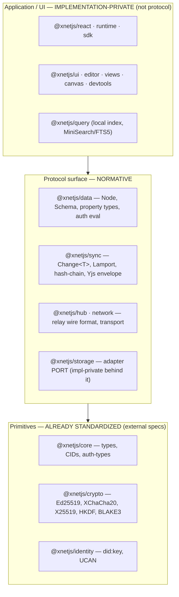
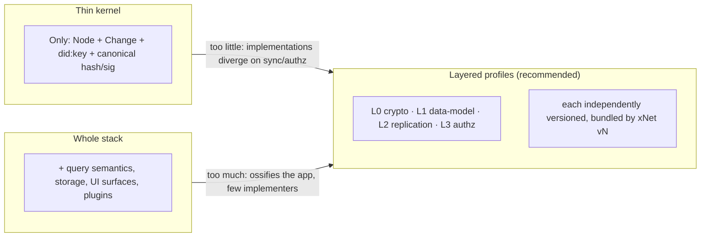
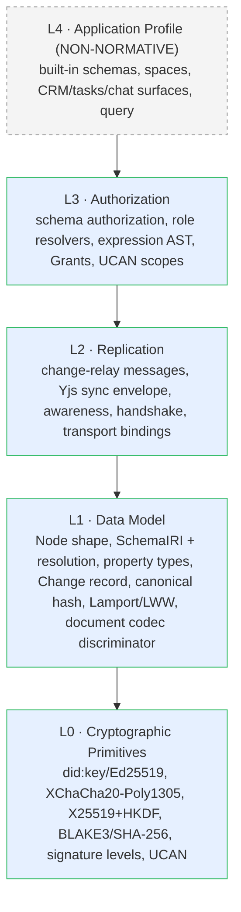

# Portable xNet — Defining The Protocol Boundaries For A Multi‑Implementation Standard

## Problem Statement

Today, "xNet" and "the `xNet` repository" are the same thing. The TypeScript
monorepo *is* the protocol — there is no document that another engineer in
another language, on another database, could pick up and use to build a second
implementation that interoperates with the first. The protocol lives implicitly
in the code: in the shape of a `Node`, in how a `Change` is hashed and signed,
in the bytes the hub relays over a WebSocket, in how a `did:key` is derived from
an Ed25519 public key.

The user's ask: treat xNet as **Lego, not as an app**. If xNet is a protocol,
it needs a *clear, written interface* — an explicit boundary between "this is
the standard, you must agree on it to interoperate" and "this is one
implementation's private business." The intuition is exactly right: *"YJS docs,
the shape of a node, encrypted/ID/creator — a few key details that make xNet
xNet, that make the data model the data model, sync replication."* The goal of
this exploration is to find **where those boundaries actually are in the code as
it exists today**, decide which seams are normative protocol vs. implementation
detail, and propose how to express that as a versioned standard — in the repo
and on the website — that others can implement, critique, and evolve.

This is *not* a request to rewrite anything. It is a request to **draw the lines
that are already there** and write them down.

## Executive Summary

**The good news: the boundaries already exist in the code — they are just
undocumented.** xNet is unusually well‑factored for this. The monorepo is
layered so cleanly (`core` → `crypto`/`identity` → `sync`/`data`/`storage` →
`network`/`hub` → `runtime`/`react`/`ui`) that the protocol surface is almost
exactly the bottom three layers, and the "app" is almost exactly the top two.
There is already a `CURRENT_PROTOCOL_VERSION = 3` constant
([`packages/sync/src/change.ts:24`](packages/sync/src/change.ts)), a frozen
`Node` shape with four universal fields, a content‑addressed + Ed25519‑signed
`Change` record, and a sync envelope with an explicit wire format. The crypto
and identity primitives are *already* cross‑language standards (DID:key, UCAN,
Ed25519, XChaCha20‑Poly1305, X25519, HKDF) implemented on the audited `@noble/*`
libraries.

**The headline finding:** xNet's interop kernel is a **signed, hash‑chained,
LWW change log over schema‑typed nodes** — *not* Yjs. Yjs is used only for the
rich‑text/CRDT *document body* of certain nodes, and it already travels the wire
as **opaque bytes inside an xNet envelope**. That means the hardest portability
problem in local‑first systems (porting a CRDT byte format across languages) is
*not on xNet's critical path*: a second implementation can treat the Yjs blob as
an octet string it forwards and stores, and still fully participate in the node
graph, identity, authorization, and sync. The CRDT is a **pluggable document
codec**, not the protocol.

**The recommendation:** carve a normative **xNet Protocol Specification** out of
the existing code in four layers — (L0) Cryptographic Primitives, (L1) Data
Model, (L2) Replication, (L3) Authorization — plus a non‑normative (L4)
Application Profile. Define a single umbrella **xNet Protocol Version** (an
"xNet 1.0 = data‑model‑1 + change‑3 + envelope‑2 + crypto‑level‑0" bundle, the
way Matrix bundles algorithm changes into *room versions*). Ship it as
`docs/specs/protocol/` (source of truth) rendered to a `/protocol` section of
the Astro site, governed by a lightweight **XPP** (xNet Protocol Proposal)
process modeled on Matrix MSCs. Critically — and this is the lesson every prior
protocol learned the hard way — **publish a language‑agnostic conformance corpus
(golden vectors) at the same time as the spec**, not years later. Prove the
boundary by building a tiny second implementation (a ~500‑line "conformance
kernel" in Python or Rust) that reproduces the golden vectors. Avoid full
JSON‑LD (ActivityPub's cautionary tale); keep the existing IRI/Lexicon‑style
schema model and give it a normative resolution path.

## Current State In The Repository

xNet is already a layered system where the lower layers are the protocol and the
upper layers are the implementation. Here is the actual map.

### The package layering (the boundary is already drawn)



- **The dependency graph is acyclic and shallow at the bottom.**
  `@xnetjs/core` depends only on `@noble/hashes`; `@xnetjs/crypto` adds
  `@noble/curves`/`@noble/ciphers`; `@xnetjs/identity` adds `multiformats`.
  These three are pure logic, zero platform coupling — the portable kernel.
- **`@xnetjs/sdk`** ([`packages/sdk/src/index.ts`](packages/sdk/src/index.ts))
  already re‑exports a "public API": `createClient()` (identity only) and
  `createXNetClient()` (full runtime, at
  [`packages/runtime/src/client.ts:353`](packages/runtime/src/client.ts)). This
  is the closest thing to a declared SDK surface today — but it is a *TypeScript
  API surface*, not a *wire/format surface*. The portability spec is about the
  latter.

### The Node — "what makes a node a node"

[`packages/data/src/schema/node.ts:155`](packages/data/src/schema/node.ts):

```ts
export interface Node {
  id: string            // nanoid (21 chars, URL-safe) — createNodeId() :200
  schemaId: SchemaIRI   // xnet://authority/Name@version  :20
  createdAt: number     // unix ms
  createdBy: DID         // did:key:...  :144  (immutable, set on first Change)
  [key: string]: unknown // everything else is schema-defined
}
```

Four universal fields. Everything else is governed by the node's **schema**,
referenced by IRI — `xnet://xnet.fyi/Page@1.0.0`,
`xnet://acme-corp.com/Project@1.0.0`, even
`xnet://did:key:z6Mk…/Recipe@1.0.0` for personal schemas. `DEFAULT_SCHEMA_VERSION
= '1.0.0'` ([`node.ts:27`](packages/data/src/schema/node.ts)). The property type
system (16 types: `text`, `number`, `relation`, `money`/number, `select`,
`person`, `file`, `formula`, `rollup`, …) is defined in
[`packages/data/src/schema/types.ts`](packages/data/src/schema/types.ts) and the
builders in `packages/data/src/schema/properties/`.

### The Change — the actual interop kernel

A node is **never** mutated in place. Its state is the LWW fold of a signed,
hash‑chained log of `Change` records
([`packages/sync/src/change.ts:39`](packages/sync/src/change.ts)):

```ts
export interface Change<T = unknown> {
  protocolVersion?: number      // CURRENT_PROTOCOL_VERSION = 3  (:24)
  id: string                    // nanoid
  type: string                  // 'node-change'
  payload: T                    // NodePayload: { nodeId, schemaId?, properties, deleted? }
  hash: ContentId               // BLAKE3 over canonical JSON ("cid:blake3:<hex>")
  parentHash: ContentId | null  // hash chain (causal linkage)
  authorDID: DID
  signature: Uint8Array         // Ed25519 over the hash
  wallTime: number
  lamport: LamportTimestamp     // ordering / LWW tiebreaker
  batchId?: string; batchIndex?: number; batchSize?: number  // atomic batches
}
```

Materialized `NodeState`
([`packages/data/src/store/types.ts`](packages/data/src/store/types.ts)) carries
a `PropertyTimestamp { lamport, wallTime }` *per property*; on conflict the
**higher Lamport wins**. The first change for a node id MUST carry `schemaId`;
subsequent changes carry only the changed properties (sparse). This is the heart
of "the data model is the data model" — and it is **independent of Yjs**.

### Yjs is the document body, behind an xNet envelope

Schemas may declare `document: 'yjs'`
([`packages/data/src/schema/types.ts`](packages/data/src/schema/types.ts)). When
they do, the node gains a `documentContent: Uint8Array` (a
`Y.encodeStateAsUpdate` blob) carrying rich text / collaborative structure.
On the wire that blob is wrapped in a **`SignedYjsEnvelopeV2`**
([`packages/sync/src/yjs-envelope.ts:62`](packages/sync/src/yjs-envelope.ts))
with a compact wire form ([`:91`](packages/sync/src/yjs-envelope.ts)):

```ts
interface SignedYjsEnvelopeWire {
  v: 2
  u: string   // base64(Yjs update bytes) — OPAQUE to xNet
  m: { a: DID; c: number; t: number; d: string }  // author, clientId, ts, docId
  s: SignatureWire   // ed25519 (+ optional ML-DSA), level
}
```

The envelope is signed over `BLAKE3(update || JSON(meta))`. **xNet authenticates
and routes the Yjs bytes; it does not need to parse them.** That is the seam
that makes portability tractable.

### Replication — the wire

Two complementary streams, both relayed by the hub
([`packages/hub/src/server.ts`](packages/hub/src/server.ts), pub/sub over
WebSocket; rooms named `xnet-doc-{docId}`):

1. **Structured node sync** — `node-change` / `node-sync-request` /
   `node-sync-response` carrying `SerializedNodeChange`
   ([`packages/hub/src/services/node-relay.ts`](packages/hub/src/services/node-relay.ts),
   [`packages/hub/src/storage/interface.ts`](packages/hub/src/storage/interface.ts)).
2. **Yjs CRDT sync** — `sync-step1` / `sync-step2` / `sync-update` / `awareness`
   ([`packages/hub/src/services/relay.ts`](packages/hub/src/services/relay.ts)),
   which is **y‑protocols sync v1** with the signed envelope wrapped around step2/updates.

The hub persists via a `HubStorage` port
([`storage/interface.ts`](packages/hub/src/storage/interface.ts)) with a SQLite
implementation ([`storage/sqlite.ts`](packages/hub/src/storage/sqlite.ts)) —
note the storage backend is *behind a port*, i.e. already implementation‑private.
Authorization at the sync boundary runs through `authorizeRoomAction` (UCAN
`hub/relay` capability + share grants + space‑containment grants) and a
`YjsAuthGate` ([`packages/sync/src/yjs-authorization.ts`](packages/sync/src/yjs-authorization.ts)).

The P2P path (`@xnetjs/network`) carries the *same* messages as length‑prefixed
msgpack over a libp2p protocol `/xnet/sync/1.0.0`
([`packages/network/src/protocols/sync.ts`](packages/network/src/protocols/sync.ts)) —
evidence the message *semantics* are transport‑independent (good for the spec:
define messages once, bind to multiple transports).

### Identity, crypto, authorization — already standards‑shaped

- **DID:key + Ed25519.** `createDID()` prefixes the 32‑byte public key with
  multicodec `0xed01` and base58btc‑encodes it
  ([`packages/identity/src/did.ts:9`](packages/identity/src/did.ts)). This *is*
  the W3C `did:key` method.
- **Crypto** on `@noble/*`: Ed25519 signing
  ([`packages/crypto/src/signing.ts`](packages/crypto/src/signing.ts)),
  XChaCha20‑Poly1305 symmetric
  ([`symmetric.ts`](packages/crypto/src/symmetric.ts)), X25519 ECDH + HKDF‑SHA256
  ([`asymmetric.ts`](packages/crypto/src/asymmetric.ts)), BLAKE3/SHA‑256
  ([`hashing.ts`](packages/crypto/src/hashing.ts)), per‑recipient key wrapping
  ([`envelope.ts`](packages/crypto/src/envelope.ts)), and an optional
  post‑quantum tier (ML‑DSA‑65 / ML‑KEM‑768) gated by a `securityLevel`
  ([`security-level.ts`](packages/crypto/src/security-level.ts), default level 0).
- **UCAN** capability tokens (JWT/EdDSA with proof chains) in
  [`packages/identity/src/ucan.ts`](packages/identity/src/ucan.ts).
- **Authorization** is schema‑declarative: `AuthorizationDefinition` with role
  resolvers (creator / property / relation / membership‑cascade), an
  allow/deny/and/or/not expression AST, and a `PolicyEvaluator`
  ([`packages/core/src/auth-types.ts`](packages/core/src/auth-types.ts),
  [`packages/data/src/auth/evaluator.ts`](packages/data/src/auth/evaluator.ts)),
  plus delegated `Grant` nodes
  ([`packages/data/src/schema/schemas/grant.ts`](packages/data/src/schema/schemas/grant.ts)).
  Presets like `presets.private()` and `spaceCascadeAuthorization()` live in
  [`packages/data/src/auth/presets.ts`](packages/data/src/auth/presets.ts).

### Where docs would live

- `docs/specs/` exists but holds a single reconciliation note; `docs/sync/`
  holds migration/version‑compat/lens cookbook docs (relevant prior art for the
  schema‑evolution story). `docs/VISION.md` already frames xNet as
  "infrastructure for a new internet… a universal namespace" — the spec is the
  technical cash‑out of that vision.
- The website is an Astro site (`site/`) with a docs content collection at
  `site/src/content/docs/docs/` (`concepts`, `architecture`, `schemas`,
  `core-concepts.mdx`, …) and marketing pages under `site/src/pages/`. A
  `/protocol` section slots in naturally.

## External Research

Six protocols/efforts are directly instructive. (Full URLs in References.)

- **AT Protocol (Bluesky)** — the re‑implementability blueprint. Self‑certifying
  user repos (Merkle Search Tree of DAG‑CBOR blocks, CIDv1/SHA‑256), and
  **Lexicon** schemas keyed by reverse‑DNS NSIDs that resolve via DNS→DID→repo.
  Records are self‑describing via `$type`. Deliberately chose Lexicon over RDF —
  Paul Frazee's "Why not RDF" is required reading. Standardization path:
  authored in‑house → atproto.com → chartered an IETF WG only *after* ecosystem
  adoption. **Takeaway for xNet:** `xnet://authority/Name@version` ≈ NSID; give
  it a normative DNS/DID‑anchored resolution path; constrain content addressing
  (one hash, one codec) rather than negotiating it.

- **Matrix** — how to *govern* an evolving protocol. The **MSC** process
  (GitHub‑PR‑as‑proposal, PR number = permanent ID, FCP, *working implementation
  required before merge*) is the most practical model for a small team. **Room
  versions** bundle breaking algorithm changes so old and new rooms coexist —
  the model for xNet's umbrella version. Conformance via **Complement** +
  **Sytest**. **Cautionary tale:** Matrix state resolution is so hard to
  implement that Dendrite went into maintenance mode. *Keep xNet's relay/merge
  semantics simple enough to implement in a weekend.*

- **ActivityPub** — the JSON‑LD cautionary tale. Full JSON‑LD requires every
  consumer to be a JSON‑LD processor; in practice implementations "speak a
  different JSON‑LD" and diverge silently. And the W3C Rec shipped in 2018 with
  **no conformance suite** for ~5 years (one was eventually funded for €152k).
  **Takeaway:** don't adopt full JSON‑LD; write the test suite *with* the spec.
  FEPs (Fediverse Enhancement Proposals) are a second lightweight governance
  model alongside MSCs.

- **Yjs / Automerge portability** — Yjs has **no standalone format spec**; the
  authoritative artifact is
  [`y-protocols/PROTOCOL.md`](https://github.com/yjs/y-protocols/blob/master/PROTOCOL.md)
  (sync message wire format), and ports (Rust **yrs**/`y-crdt`, `y-octo`,
  pycrdt, yswift, ywasm…) maintain *binary compatibility by reverse‑engineering
  the JS*. Automerge, by contrast, has a **written binary‑format spec** and a
  Rust core exposed via C‑ABI/WASM. **Takeaway:** because xNet already transports
  Yjs as opaque bytes, it can normatively reference `y-protocols` + "yrs‑compatible
  serialization" and tag a `documentCodec`, leaving room to swap codecs later —
  without betting the protocol on Yjs internals.

- **Already‑standard primitives** — `did:key` (W3C CCG, final, many languages),
  UCAN (`ucan-wg/spec` at 1.0‑rc, TS/Rust/Go libs — **pin the version**), IPLD/CID
  + DAG‑CBOR (mature in Go/JS/Rust, Rust‑backed Python). xNet's primitives layer
  is mostly "cite an external spec," with UCAN and Yjs the weakest links on
  cross‑language coverage.

- **Local‑first interop** — **Braid** (HTTP state‑sync, IETF draft, CRDT‑agnostic
  "merge‑type" negotiation), **Cambria** (bidirectional lenses for schema
  evolution — directly relevant to `@v1`↔`@v2` coexistence, and xNet already has
  a "lens cookbook" in `docs/sync/03-lens-cookbook.md`), **Willow** (spec as a
  *meta‑protocol* with pluggable parameters + per‑component conformance matrix),
  **Earthstar** (deliberately constrained scope to make multiple implementations
  feasible), **p2panda** (modular bytes‑level protocol on BLAKE3/Ed25519/CBOR —
  the nearest neighbor to what xNet wants to be).

## Key Findings

1. **The interop kernel is the signed change log, not Yjs.** A conforming
   implementation must agree on: the `Node` shape, the `Change` record, its
   canonical hash, the Ed25519 signature scheme, Lamport/LWW resolution, and the
   `did:key` derivation. With *only* that, it can fully participate in the node
   graph. Yjs is optional and opaque.

2. **The boundary is already physically present** as the package layering and the
   `@xnetjs/sdk` re‑export surface. The spec mostly needs to *describe* and
   *freeze* existing seams (`core`/`crypto`/`identity`/`sync`/`data` formats),
   not invent new ones.

3. **Version numbers are fragmented and need an umbrella.** `change.ts` is at
   `protocolVersion 3`, the Yjs envelope at `v: 2`, schemas default to `1.0.0`,
   the libp2p protocol is `/xnet/sync/1.0.0`, crypto has `securityLevel` 0–2,
   `REMOTE_NODE_QUERY_PROTOCOL_VERSION = 1`. No single "what version of xNet do
   you speak?" handshake bundles these. (The hub handshake *does* carry
   `protocolVersion`/`minProtocolVersion`/`features` —
   [`packages/network/src/types.ts`](packages/network/src/types.ts) — a hook to
   build on.)

4. **Canonicalization is the silent interop risk.** The change `hash` is computed
   over serialized change data and the signature is over the hash. Any second
   implementation must produce **byte‑identical** canonical bytes or every
   signature fails. Today that canonicalization is defined *only* by the JS code
   (e.g. the legacy‑vs‑v1 hashing branch at
   [`change.ts:194`](packages/sync/src/change.ts)). This MUST be specified
   explicitly (field order, number encoding, base64 variant, how `protocolVersion`
   participates) and locked with golden vectors.

5. **Authorization is part of the protocol, not the app.** Because access control
   is data (schema `authorization`, `Grant` nodes, UCANs) and is enforced at the
   sync boundary, two implementations that disagree on policy evaluation will
   make different read/write decisions on the same graph. The role‑resolver and
   expression‑evaluation semantics must be normative (with a decision‑trace test
   corpus), even though caching/indexing strategies stay private.

6. **Storage and query are correctly already private.** `HubStorage` and the
   client storage adapter are ports; `@xnetjs/query` (MiniSearch/FTS5) is a local
   concern. A Postgres‑backed or Rust‑backed implementation changes nothing
   observable on the wire. *This is the proof the architecture can support
   multiple implementations.*

7. **Schema resolution is underspecified.** `xnet://authority/Name@version` is a
   great namespace, but how an authority string resolves to a schema document
   (DNS? DID doc? a well‑known endpoint? bundled built‑ins under `xnet.fyi`?) is
   not defined as a protocol step. AT Proto's NSID→DNS→DID→repo path is the model.

8. **No JSON‑LD trap yet — keep it that way.** xNet schemas are JSON‑Schema‑like,
   not RDF. This is the *right* call (per ActivityPub's experience). Extensibility
   should stay namespaced‑but‑document‑oriented.

## Options And Tradeoffs

### A. Granularity of the standard — how much do we freeze?



- **A1 — Thin kernel (data model + crypto only).** Easiest to write and
  implement; matches Earthstar's "constrain scope" lesson. *But* leaves sync and
  authz unspecified, so independent implementations won't actually interoperate
  on a live hub. Good as a *starting* profile, insufficient as the whole story.
- **A2 — Layered profiles (recommended).** Four normative layers (L0–L3) + a
  non‑normative L4 application profile, each with its own version, bundled by a
  single **xNet Protocol Version**. Mirrors Willow's pluggable‑parameter model
  and Matrix room versions. More to write, but it lets the CRDT codec, transport,
  and crypto level vary while keeping a stable interop core.
- **A3 — Whole stack.** Standardize query AST, storage, plugin runtime, UI. This
  ossifies the *application* and deters implementers (Matrix's complexity trap).
  Reject — keep query/storage/UI explicitly out of scope.

### B. The CRDT/document layer

- **B1 — Yjs as a normative requirement.** Simple to state ("you must speak Yjs"),
  but ties every implementation to reverse‑engineering Yjs internals and to its
  format stability. Fragile.
- **B2 — Opaque document codec (recommended).** Normatively define the *envelope*
  (`SignedYjsEnvelopeV2`) and a `documentCodec` discriminator (`yjs-v1`,
  `automerge-2`, `none`); require implementations to **transport and store**
  document blobs faithfully and to verify the envelope signature, but only
  *optionally* to interpret a given codec. An implementation that doesn't speak
  `yjs-v1` can still sync the node graph and relay documents. Matches how the
  code already treats the blob. Future‑proofs against a native xNet CRDT.
- **B3 — Adopt Automerge's spec'd format.** Cleanest long‑term portability, but a
  large migration and not what's deployed. Park as a future codec option.

### C. Schema definition & resolution

- **C1 — Full JSON‑LD/RDF.** Maximum semantic interop *in theory*; in practice the
  ActivityPub disaster. Reject.
- **C2 — Lexicon/NSID style (recommended).** Keep JSON‑Schema‑shaped schemas;
  define `xnet://authority/Name@version` resolution as: built‑in authorities
  (`xnet.fyi`) ship with implementations; domain authorities resolve via DNS
  TXT → well‑known JSON; DID authorities resolve via the DID document / a synced
  schema node. Self‑describing nodes via `schemaId` (already true). Evolution
  rules: additive‑only within a major; breaking change ⇒ new `@version`; provide
  **Cambria‑style lenses** for cross‑version coexistence (xNet already has the
  lens cookbook).
- **C3 — Schemas only as synced nodes.** Elegant (schemas are just data) and
  already partially true (personal schemas under a DID authority). But bootstrap
  / discovery needs the C2 resolution path anyway. Combine: C2 resolution *to* a
  schema node.

### D. Governance & where the spec lives

- **D1 — Spec in‑repo only (`docs/specs/protocol/`).** Lowest friction, versioned
  with the code, but conflates "the spec" with "this implementation."
- **D2 — Dedicated `xnet-protocol` repo + MSC‑style XPP process (recommended for
  growth).** Separable, credible, attracts external implementers; PR‑as‑proposal
  with "working implementation required before merge." Start *as* `docs/specs/`
  in‑repo (D1) and graduate to a split repo + a W3C Community Group report once a
  second implementation exists. Defer IETF until ≥2 independent implementations.
- **D3 — Straight to a standards body.** Premature; AT Proto waited for adoption
  first.

### E. Conformance strategy

- **E1 — Prose spec, no tests.** The ActivityPub failure mode. Reject.
- **E2 — Golden‑vector corpus + reference test harness (recommended).** A
  language‑neutral `conformance/` corpus: identity vectors (seed→did→signature),
  canonical‑change vectors (change JSON → canonical bytes → hash → signature),
  LWW‑merge scenarios, authz decision traces, and a mock‑peer sync transcript.
  Any implementation passes by reproducing the bytes. Build L1 vectors *first,
  with the first draft*.

## Recommendation

Adopt **A2 + B2 + C2 + D2 + E2**: a **layered xNet Protocol** with an opaque
document codec, Lexicon‑style schemas with a defined resolution path, governed by
an MSC‑style proposal process that starts in‑repo, and shipped *with* a
golden‑vector conformance corpus.

### The four normative layers (and one non‑normative profile)



| Layer | Normative? | Mostly references… | xNet‑specific work to write |
|------|-----------|--------------------|------------------------------|
| **L0 Primitives** | Yes | W3C `did:key`, UCAN, RFC 7748/8439, FIPS 203/204 | The exact algorithm choices + `securityLevel` 0/1/2 bundles; key‑wrap envelope format |
| **L1 Data Model** | Yes | nanoid, semver | `Node`, `SchemaIRI` + **resolution**, property types, `Change` + **canonical serialization & hash**, LWW rules, `documentCodec` |
| **L2 Replication** | Yes | y‑protocols sync v1 | Change‑relay messages, `SignedYjsEnvelopeV2` wire form, awareness, **version handshake**, WebSocket + libp2p bindings, room naming |
| **L3 Authorization** | Yes | UCAN | `AuthorizationDefinition`, role‑resolver + expression semantics, `Grant` schema, evaluation order (deny‑wins), sync‑boundary checks |
| **L4 Application** | No (profile) | — | Built‑in `xnet.fyi` schemas, spaces, query AST — documented for *compatibility*, not required for *conformance* |

### The umbrella version (Matrix‑style bundle)

Define `XNetProtocolVersion` as a named bundle so two peers negotiate one token
in the handshake instead of five:

```
XNet/1.0 = { dataModel: 1, change: 3, syncEnvelope: 2, awareness: 1,
             crypto: level0-default, ucan: 1.0.0 }
```

Wire it into the existing hub handshake
([`packages/network/src/types.ts`](packages/network/src/types.ts)) as a
`xnetProtocol: ["XNet/1.0"]` feature list, with `minXnetProtocol` for graceful
refusal.

### Phasing

1. **Phase 0 — Describe the seam (no code change).** Write
   `docs/specs/protocol/00-overview.md` + L0–L3 docs from the citations above.
   Add a `PROTOCOL_VERSION` umbrella constant and a short ADR.
2. **Phase 1 — Golden vectors.** Generate `conformance/vectors/*` from the *current*
   TS implementation (identity, canonical change, LWW, authz traces). Add a CI job
   that re‑derives them so the spec can't silently drift from the code.
3. **Phase 2 — Prove portability.** Build a ~500‑line **conformance kernel** in a
   second language (Python or Rust) that reproduces L0+L1 vectors. This is the
   user's "proof of concept": it *demonstrates* the boundary is real.
4. **Phase 3 — Express it.** Add a `/protocol` section to the Astro site rendering
   the spec, a one‑page "Implement xNet in your language" guide, and a conformance
   matrix (Willow‑style).
5. **Phase 4 — Govern it.** Stand up the **XPP** process (proposal template,
   editorial board of 2–3, "implementation required before merge"), graduate to a
   split `xnet-protocol` repo + W3C CG when a second implementation lands.

## Example Code

### A golden conformance vector (L1 — canonical change)

`conformance/vectors/change/0001-create-page.json` (illustrative shape):

```jsonc
{
  "description": "First change for a Page node; signed by a fixed seed",
  "input": {
    "authorSeedHex": "00112233...ff",          // 32-byte Ed25519 seed
    "change": {
      "protocolVersion": 3,
      "id": "v1fixedNanoIdAAAAAAAA",
      "type": "node-change",
      "payload": {
        "nodeId": "n1fixedNanoIdAAAAAAAA",
        "schemaId": "xnet://xnet.fyi/Page@1.0.0",
        "properties": { "title": "Welcome" }
      },
      "parentHash": null,
      "wallTime": 1718641200000,
      "lamport": 1
    }
  },
  "expected": {
    "authorDID": "did:key:z6Mk...",            // derived from seed
    "canonicalBytesBase64": "eyJpZCI6...",      // EXACT canonical serialization
    "hashHex": "9f86d081884c7d65...",           // BLAKE3 of canonical JSON
    "signatureBase64": "kQX9c2...=="            // Ed25519 over hashHex bytes
  }
}
```

The spec's L1 section MUST define *exactly* how `canonicalBytesBase64` is
produced (key order, number/timestamp encoding, base64 alphabet, whether
`protocolVersion` is included — cf. the legacy branch at
[`change.ts:194`](packages/sync/src/change.ts)). The corpus is the executable
truth.

### The "conformance kernel" any implementation must satisfy (TypeScript port of the contract)

```ts
// What a second implementation MUST provide to interoperate at L0+L1.
export interface XNetConformanceKernel {
  // L0 — identity
  didFromSeed(seed: Uint8Array): DID                       // did:key, multicodec 0xed01, base58btc
  sign(hash: Uint8Array, seed: Uint8Array): Uint8Array     // Ed25519, 64 bytes
  verify(hash: Uint8Array, sig: Uint8Array, did: DID): boolean

  // L1 — data model
  canonicalize(change: UnsignedChange): Uint8Array         // THE byte-exact contract
  hashChange(change: UnsignedChange): Uint8Array           // BLAKE3(canonicalize)
  applyLWW(state: NodeState | null, change: SignedChange): NodeState  // higher lamport wins

  // L1 — document codec (opaque)
  acceptsCodec(codec: 'yjs-v1' | 'automerge-2' | 'none'): boolean
}
```

### A 30‑line second implementation, sketched (Python, L0+L1 verify path)

```python
import base58, hashlib, json
from nacl.signing import SigningKey, VerifyKey

ED25519_MULTICODEC = b"\xed\x01"

def did_from_seed(seed: bytes) -> str:
    pk = SigningKey(seed).verify_key.encode()
    return "did:key:z" + base58.b58encode(ED25519_MULTICODEC + pk).decode()

def canonical_bytes(change: dict) -> bytes:
    # MUST match the spec's canonicalization exactly (this is the hard part)
    return json.dumps(change, separators=(",", ":"), sort_keys=True).encode()

def verify_change(change: dict, sig_b64: str, did: str) -> bool:
    h = hashlib.sha256(canonical_bytes({k: change[k] for k in change if k != "signature"})).digest()
    pk = base58.b58decode(did.removeprefix("did:key:z"))[2:]   # strip multicodec
    try:
        VerifyKey(pk).verify(h, base64.b64decode(sig_b64)); return True
    except Exception:
        return False
```

If this reproduces the golden vectors, the boundary is real — a Python node can
verify a TypeScript node's authorship without sharing a line of code. *That is
the whole thesis of the exploration, in 30 lines.*

### Spec doc layout (source of truth → website)

```
docs/specs/protocol/
  00-overview.md            # scope, conformance, the umbrella version, RFC-2119 keywords
  01-primitives.md          # L0 — crypto + did:key + UCAN (mostly external refs)
  02-data-model.md          # L1 — Node, SchemaIRI + resolution, properties, Change, canonicalization, LWW, codecs
  03-replication.md         # L2 — messages, envelope, awareness, handshake, transport bindings
  04-authorization.md       # L3 — authz definitions, role resolvers, expression AST, grants, sync-boundary
  05-schema-evolution.md    # versioning + Cambria lenses (links docs/sync/03-lens-cookbook.md)
  90-conformance.md         # how to run the corpus; the conformance matrix
  xpp/                      # xNet Protocol Proposals (MSC-style), 0000-template.md
conformance/
  vectors/{identity,change,lww,authz,sync}/*.json
  README.md
site/src/content/docs/docs/protocol/   # rendered spec (Astro) + "implement it in your language"
```

## Risks And Open Questions

- **Canonicalization lock‑in.** The moment golden vectors ship, the canonical
  byte format is frozen forever (signatures depend on it). We must get field
  ordering / number encoding right *before* publishing v1. **Open:** is the
  current JS serialization deterministic across all inputs (floats, unicode,
  large ints, property insertion order)? Audit before freezing.
- **Yjs format drift.** Even as an opaque codec, two implementations that *do*
  interpret `yjs-v1` depend on yrs/Yjs binary compat. **Open:** pin a specific
  Yjs encoding version (V1 vs V2 updates) and a yrs compatibility baseline; state
  that interpreting the codec is optional.
- **Authorization determinism.** Role resolution walks relations/memberships with
  a depth bound (max 3) and caches with TTL. Two implementations must agree on
  *decisions*, not performance. **Open:** are there evaluation‑order edge cases
  (deny precedence, missing relations, grant expiry boundaries) that need
  decision‑trace vectors to pin?
- **UCAN version churn.** UCAN is at 1.0‑rc; semantics can still move. Pin the
  exact version; isolate UCAN behind L3 so a version bump is a contained XPP.
- **Schema resolution trust.** DNS‑anchored authorities import DNS's trust model;
  DID‑anchored authorities need DID‑doc resolution. **Open:** what's the minimum
  viable resolution path for v1 (maybe: built‑ins + DID‑authority‑as‑synced‑node,
  defer DNS)?
- **Scope creep into L4.** Strong temptation to standardize the query AST and
  built‑in schemas. **Mitigation:** keep L4 explicitly non‑normative; document for
  *compatibility*, gate any promotion to normative behind an XPP.
- **Governance overhead vs. team size.** A heavyweight process with one
  implementer is theater. **Mitigation:** start as plain in‑repo Markdown + a
  proposal template; add ceremony only when a second implementer appears.
- **Spec/code drift.** Prose specs rot. **Mitigation:** the conformance corpus is
  generated from the code and re‑verified in CI — the spec's claims are
  executable, not aspirational.

## Implementation Checklist

> **Status: implemented** (this exploration is checked off). What shipped is
> noted per item; genuinely deferred work (L2/L3 vector suites, hub‑side relay
> refusal, domain‑authority schema resolution) is left unchecked.

- [x] Add an ADR (`docs/specs/protocol/00-overview.md`) defining scope, the L0–L3
      normative layers, L4 as a non‑normative profile, and RFC‑2119 conformance
      language.
- [x] Introduce an umbrella `XNET_PROTOCOL_VERSION` constant bundling
      `{dataModel, change, syncEnvelope, awareness, crypto, ucan}` and document the
      mapping to the existing per‑subsystem versions. — `packages/runtime/src/protocol.ts`,
      re‑exported by `@xnetjs/sdk`; single‑sources `change` from `@xnetjs/sync`.
- [x] Write `01-primitives.md` (L0): did:key derivation, Ed25519/XChaCha20/X25519/
      HKDF/BLAKE3 choices, `securityLevel` bundles, key‑wrap envelope, UCAN version
      pin — mostly external normative references + xNet's exact parameters.
- [x] Write `02-data-model.md` (L1): `Node` shape, `SchemaIRI` grammar + resolution
      path, property type catalog, `Change` record, **canonical serialization +
      hashing algorithm**, Lamport/LWW resolution, `documentCodec` discriminator.
- [x] Audit the current JS change canonicalization for cross‑input determinism;
      document the exact algorithm. — documented byte‑exact in L1 §6 (it is BLAKE3,
      not SHA‑256; the signature covers the UTF‑8 of the hash *string*), locked by
      golden vectors + cross‑checked by the Python kernel. Residual float/unicode
      edge cases remain in Risks (none triggered by the current corpus).
- [x] Write `03-replication.md` (L2): change‑relay messages, `SignedYjsEnvelopeV2`
      wire form, awareness, room naming, the **version handshake**, and the
      WebSocket + libp2p transport bindings (one semantics, two bindings).
- [x] Write `04-authorization.md` (L3): `AuthorizationDefinition`, role‑resolver
      kinds, expression AST + evaluation order (deny‑wins, depth bound), `Grant`
      schema, UCAN capability scopes, sync‑boundary enforcement points.
- [x] Write `05-schema-evolution.md`: additive‑within‑major rule, new `@version`
      for breaking changes, Cambria‑style lenses (link `docs/sync/03-lens-cookbook.md`).
- [x] Build `conformance/vectors/` generator that emits identity, canonical‑change,
      and LWW‑merge vectors from the TS implementation
      (`packages/runtime/src/conformance.test.ts`, `WRITE_VECTORS=1`). Authz‑decision
      vectors are deferred to an XPP (L3 suite).
- [x] Add a CI drift guard that regenerates and diffs the corpus, failing on drift
      between spec claims and code. — the `conformance.test.ts` runs in the standard
      vitest shards; a canonicalization/hash/DID change that isn't reflected in the
      corpus fails CI. (A dedicated workflow was unnecessary.)
- [x] Build the **conformance kernel** in a second language (Python) that reproduces
      L0+L1 vectors — `conformance/reference/python/` (18/18 vectors pass).
- [x] Add a `/protocol` Astro docs section + an "Implement xNet in your language"
      quickstart + a conformance matrix page.
- [x] Add the **XPP** proposal template and process doc (`xpp/0000-template.md`),
      including the "working implementation required before merge" rule.
- [x] Wire `xnetProtocol`/`minXnetProtocol` into the handshake types + a
      `negotiateProtocolVersion` helper. **Deferred:** the hub server actually
      *refusing* incompatible peers (touches `server.ts` + the hub test suite) is a
      follow‑up — the fields and negotiation logic are in place.

## Validation Checklist

- [x] The Python conformance kernel reproduces **100%** of L0+L1 golden vectors
      (byte‑identical canonical bytes, hashes, signatures, DIDs) — 18/18 pass.
- [x] A change signed by one implementation **verifies** in the other, byte‑for‑byte:
      the Python kernel verifies TS‑signed changes *and* re‑signs them identically
      (Ed25519 determinism). **Deferred:** exchanging them live over a shared hub room
      (L2).
- [x] LWW‑merge vectors converge to the same property state regardless of apply
      order — proven by the order‑independence assertion in `conformance.test.ts`.
      **Deferred:** a second‑implementation LWW fold.
- [ ] Authz decision‑trace vectors produce identical allow/deny outcomes in both
      implementations — **deferred** (L3 vector suite, tracked as an XPP).
- [ ] A peer advertising an unsupported `xnetProtocol` is refused cleanly by the
      hub — **deferred** (handshake fields + negotiation helper exist; hub‑side
      enforcement is the follow‑up).
- [x] The opaque‑codec claim is specified (L1 §8): the `documentCodec` discriminator
      and the "transport faithfully, interpret optionally" rule. **Deferred:** a
      dedicated test exercising a non‑Yjs peer.
- [x] The CI drift guard fails when a change to canonicalization/hashing/DID is made
      without updating vectors (the test asserts byte equality — true by construction).
- [x] The `/protocol` site section builds (64 pages) and renders; landing section and
      docs pages verified in a browser; the conformance matrix reflects real state.
- [x] An external reader can, using only the spec + corpus (not the TS source),
      implement DID derivation + change verification — the ~100‑line Python kernel
      *is* that dogfood, and it passes.

## References

### xNet repository (source of truth)
- Node shape / SchemaIRI / DID / `createNodeId` — [`packages/data/src/schema/node.ts`](packages/data/src/schema/node.ts)
- Property type system — [`packages/data/src/schema/types.ts`](packages/data/src/schema/types.ts)
- `Change` record + `CURRENT_PROTOCOL_VERSION` + hashing — [`packages/sync/src/change.ts`](packages/sync/src/change.ts)
- Materialized `NodeState` / `NodePayload` / `NodeContentCipher` — [`packages/data/src/store/types.ts`](packages/data/src/store/types.ts)
- Yjs signed envelope (V2 + wire) — [`packages/sync/src/yjs-envelope.ts`](packages/sync/src/yjs-envelope.ts)
- Yjs auth gate — [`packages/sync/src/yjs-authorization.ts`](packages/sync/src/yjs-authorization.ts)
- did:key derivation — [`packages/identity/src/did.ts`](packages/identity/src/did.ts); UCAN — [`packages/identity/src/ucan.ts`](packages/identity/src/ucan.ts)
- Crypto primitives — [`packages/crypto/src/`](packages/crypto/src/) (`signing.ts`, `symmetric.ts`, `asymmetric.ts`, `hashing.ts`, `envelope.ts`, `hybrid-keygen.ts`, `security-level.ts`)
- Authorization types + evaluator + grants — [`packages/core/src/auth-types.ts`](packages/core/src/auth-types.ts), [`packages/data/src/auth/evaluator.ts`](packages/data/src/auth/evaluator.ts), [`packages/data/src/schema/schemas/grant.ts`](packages/data/src/schema/schemas/grant.ts)
- Hub relay + node relay + storage port — [`packages/hub/src/server.ts`](packages/hub/src/server.ts), [`packages/hub/src/services/relay.ts`](packages/hub/src/services/relay.ts), [`packages/hub/src/services/node-relay.ts`](packages/hub/src/services/node-relay.ts), [`packages/hub/src/storage/interface.ts`](packages/hub/src/storage/interface.ts)
- Transport bindings + handshake — [`packages/network/src/types.ts`](packages/network/src/types.ts), [`packages/network/src/protocols/sync.ts`](packages/network/src/protocols/sync.ts)
- SDK / runtime entry — [`packages/sdk/src/index.ts`](packages/sdk/src/index.ts), [`packages/runtime/src/client.ts`](packages/runtime/src/client.ts)
- Vision + schema‑evolution prior art — [`docs/VISION.md`](docs/VISION.md), [`docs/sync/`](docs/sync/) (migration, version‑compat, lens cookbook)

### Prior art (external)
- AT Protocol — data model: https://atproto.com/specs/data-model · Lexicon: https://atproto.com/specs/lexicon · "Why not RDF": https://www.pfrazee.com/blog/why-not-rdf · 2026 roadmap (IETF): https://atproto.com/blog/2026-spring-roadmap
- Matrix — spec: https://spec.matrix.org/latest/ · MSC process: https://spec.matrix.org/proposals/ · Complement: https://github.com/matrix-org/complement · Sytest: https://github.com/matrix-org/sytest
- ActivityPub — spec: https://www.w3.org/TR/activitypub/ · JSON‑LD subset proposal: https://stephank.nl/p/2018-10-20-a-proposal-for-standardising-a-subset-of-json-ld.html · FEPs: https://codeberg.org/fediverse/fep · test suite funding: https://www.sovereign.tech/tech/activitypub-test-suite
- Yjs / Automerge — y‑protocols PROTOCOL.md: https://github.com/yjs/y-protocols/blob/master/PROTOCOL.md · yrs/y‑crdt: https://github.com/y-crdt/y-crdt · y‑octo: https://github.com/y-crdt/y-octo · ports: https://docs.yjs.dev/ecosystem/ports-to-other-languages · Automerge binary spec: https://automerge.org/automerge-binary-format-spec/
- Primitives — did:key: https://w3c-ccg.github.io/did-key-spec/ · UCAN: https://github.com/ucan-wg/spec · IPLD 2025: https://ipfsfoundation.org/ipld-2025-in-review/
- Local‑first interop — Braid: https://braid.org/ (IETF draft: https://datatracker.ietf.org/doc/draft-toomim-httpbis-braid-http/) · Cambria: https://www.inkandswitch.com/cambria/ · Willow: https://willowprotocol.org/ · Earthstar: https://earthstar-project.org/docs/how-it-works · p2panda: https://p2panda.org/
- Local‑first canon — Kleppmann et al., "Local‑First Software": https://martin.kleppmann.com/papers/local-first.pdf · localfirst.fm: https://www.localfirst.fm/4/transcript
