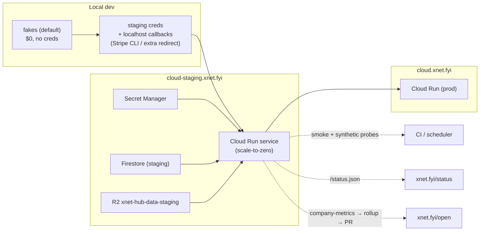
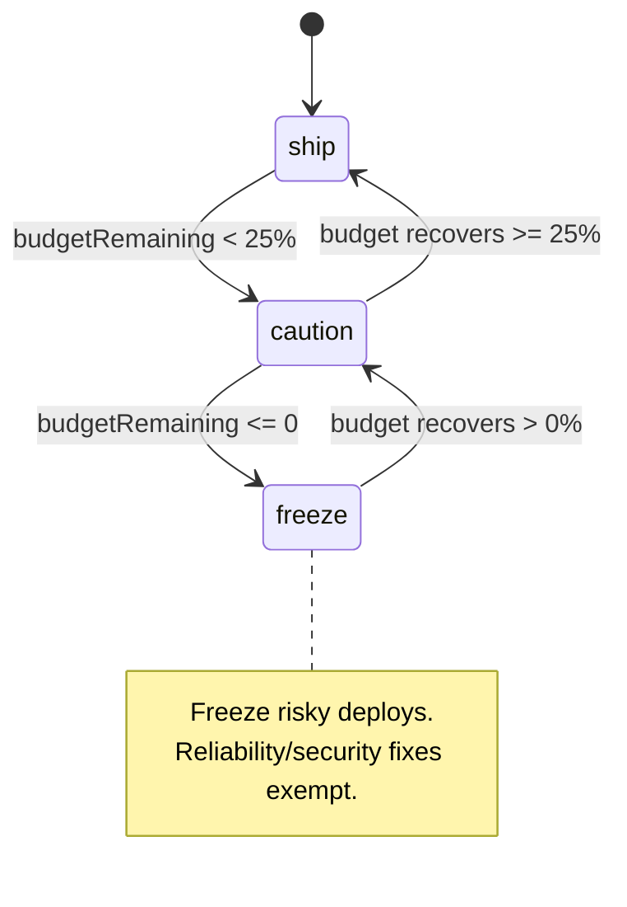

# Cloud Staging, a Status Page, and Testing Against Real APIs

## Problem Statement

The control plane (`apps/cloud`) is fully written against package interfaces and
falls back to in-memory fakes when no credentials are present. We now have a
**complete `apps/cloud/.env.staging`** — Google Cloud, Cloudflare R2, Stripe (test
mode), and WorkOS credentials all filled in. The blockers to actually *using* it
are no longer "what do I paste"; they are **operational wiring**:

1. **Run it for real.** Stand up a `cloud-staging.xnet.fyi` service and a local
   dev loop that can talk to the same live APIs — so we stop testing only against
   fakes and start exercising Stripe/WorkOS/Firestore/Cloud Run/LiteLLM end to end.
2. **The callback-URL problem.** WorkOS sign-in and Stripe webhooks redirect to
   `https://cloud-staging.xnet.fyi/...`. That host doesn't resolve yet, and even
   once it does, a *locally* running control plane can't receive those callbacks.
3. **No status page exists.** The SLI/SLO/error-budget engine is built and unit
   tested, but it is **dormant** — the running server never starts a probe loop,
   never populates the health store, and `/internal/fleet/health` returns `503`.
   Nothing public shows whether xNet Cloud is up.
4. **The `/open` metrics page is sample data.** It renders `metrics.json` with
   `sample: true`; the rollup pipeline is real but is never fed real numbers.

This exploration figures out how to **wire everything together**: dev → staging →
prod, live-API testing, a public status page, and a self-updating run-in-public
dashboard — reusing the substantial machinery that already exists rather than
rebuilding it.

## Executive Summary

The good news: **~80% of this is already built and just unwired.** The env model,
the full HTTP funnel, the observability math, the metrics rollup, and the
publish-gate script all exist. What's missing is the *operational glue*:

- **There is no Dockerfile for `apps/cloud` and no deploy workflow.** The hub has
  both (`packages/hub/Dockerfile`, `hub-image.yml`, Railway); the control plane is
  "deploy by hand" per `docs/cloud/SETUP.md`. → Add a Dockerfile mirroring the
  hub's multi-stage pattern + a `gcloud run deploy` path, then a GitHub Actions
  workflow with **Workload Identity Federation** (no long-lived keys in CI).
- **The observability spine is dormant in the running process.**
  `apps/cloud/src/index.ts` `start()` never constructs a `HealthSampleStore`,
  never passes `health` into `createControlPlaneApp`, and runs no probe interval.
  → Wire a probe loop (or a Cloud Scheduler ping) + expose a **public,
  aggregate-only `/status.json`** that leaks nothing per-tenant.
- **The site cannot import the observability code** — `scripts/check-cloud-boundary.sh`
  forbids anything but `apps/cloud` from depending on `@xnetjs/cloud`. → The status
  page must *consume JSON* (fetch the live endpoint with a committed fallback),
  exactly like `/open` consumes `metrics.json`.
- **Local "test against live APIs" needs a tunnel or an extra redirect URI.**
  WorkOS allows multiple redirect URIs per environment and Stripe ships a CLI
  (`stripe listen --forward-to`) that mints a local `whsec_…`. Document both so a
  developer can run staging credentials against `localhost:4455`.

**Recommended path (4 phases):** (A) Dockerize + manually deploy `cloud-staging`
and prove the env with a smoke script; (B) make local-dev-against-staging a
one-command, documented loop; (C) light up the status page from the existing
observability layer; (D) feed the `/open` rollup from real Stripe + ledger data on
a schedule. Each phase is independently shippable and reuses existing code.

## Current State In The Repository

### The control plane is feature-complete (`apps/cloud/src/`)

`createControlPlaneApp` ([apps/cloud/src/server.ts](apps/cloud/src/server.ts)) is a
Hono app with the full funnel already wired:

| Route | Auth | Purpose |
| --- | --- | --- |
| `GET /health` | none | `{status:'ok', service, substrate}` liveness ([server.ts:84](apps/cloud/src/server.ts#L84)) |
| `POST /ai/chat` | internal secret + `x-tenant-id` | metered AI gateway, mounted only when `deps.ai` set ([server.ts:89](apps/cloud/src/server.ts#L89)) |
| `GET /auth/start` → `GET /auth/callback` | WorkOS | code exchange + sealed session cookie ([server.ts:95–133](apps/cloud/src/server.ts#L95)) |
| `GET /dashboard`, `POST /account/plan`, `POST /account/delete-data` | session | tenant self-serve ([server.ts:142–265](apps/cloud/src/server.ts#L142)) |
| `POST /checkout`, `POST /portal` | session | Stripe hosted checkout/portal ([server.ts:197–223](apps/cloud/src/server.ts#L197)) |
| `POST /webhooks/stripe` (+ `/webhook` alias) | signature | `checkout.completed`→provision, `subscription.canceled`→suspend ([server.ts:231–255](apps/cloud/src/server.ts#L231)) |
| `POST /device/start`, `/device/token`, `GET/POST /claim` | DID / session | "claim your hub" device-grant flow ([server.ts:270–328](apps/cloud/src/server.ts#L270)) |
| `GET /tenants/:id` | none | tenant record ([server.ts:330](apps/cloud/src/server.ts#L330)) |
| `POST /internal/tenants`, `/internal/tenants/:id/plan`, `/internal/account/recover` | internal secret | admin tooling ([server.ts:340–406](apps/cloud/src/server.ts#L340)) |
| `GET /internal/fleet/health` | internal secret | **per-tenant SLIs + aggregate — but 503 unless `deps.health` is set** ([server.ts:381–394](apps/cloud/src/server.ts#L381)) |

The composition root `buildControlPlane()` / `start()`
([apps/cloud/src/index.ts](apps/cloud/src/index.ts)) selects real implementations
from the environment and falls back to fakes:

```text
stores      → firestoreStoresFromEnv(env)            else MemoryTenantStore/MemoryBindingStore
provisioner → cloudRunProvisionerFromEnv(env)        else MemoryProvisioner
aiKeys      → aiKeysFromEnv(env)  (LiteLLM)           else undefined → AI off
payments    → stripeGatewayFromEnv(env)              else FakeTenantBillingGateway
billing id  → WorkOSAuthKitProvider (when WORKOS_*)  else MemoryBillingIdentityProvider
PORT = env.PORT ?? 4455
```

The boot log prints the resolved mode:
`{ auth, payments, provisioner, stores, ai }` ([index.ts:215–222](apps/cloud/src/index.ts#L215)).
**Crucially, `start()` does not construct `health` or a probe loop** — so the
observability route is dead in the deployed process even though all the code ships.

### The observability engine is built but dormant

- [apps/cloud/src/observability/sli.ts](apps/cloud/src/observability/sli.ts) —
  pure SLI math: `availability`, `errorRate`, `latencyPercentile`,
  `errorBudgetRemaining`, `burnRate`, `windowed`, `backupHealthy` (reuses the
  Litestream freshness helper). Content-free: a sample is `{ok, latencyMs, atMs}`.
- [apps/cloud/src/observability/slo.ts](apps/cloud/src/observability/slo.ts) —
  maps a plan's `SlaLevel` → measurable `SloTarget` (99.9% / 99.95% / best-effort /
  none) and the Google-SRE error-budget policy `ship | caution | freeze`.
- [apps/cloud/src/observability/health.ts](apps/cloud/src/observability/health.ts) —
  `HealthProbe` port; `httpHealthProbe` hits `${hubUrl}/health`; `FakeHealthProbe`
  for tests; `HealthSampleStore` (bounded ring); `sampleTenantHealth`, `tenantSli`,
  `fleetSummary`.

The reconciliation decision is a separate pure module
([apps/cloud/src/reconcile/reconcile.ts](apps/cloud/src/reconcile/reconcile.ts)) —
`reconcileTenant` emits `reprovision | restart | demote | none` from desired-vs-
observed state, including a `healthy === false → restart` branch that wants the
same probe signal the status page needs.

### The hub already exposes rich health (`packages/hub/`)

[packages/hub/Dockerfile](packages/hub/Dockerfile) is a multi-stage,
Litestream-aware image (port 4444). The demo hub currently deploys to **Railway**
([railway.toml](railway.toml), `healthcheckPath = "/health"`). The hub serves
`/health` (uptime/rooms/docs/connections/memory/region), `/ready`, `/metrics`
(Prometheus), and `/health/badge` (shields.io). Per-tenant hubs are provisioned to
**Cloud Run** by `GoogleCloudRunClient`
([apps/cloud/src/provisioner/google-cloud-run-client.ts](apps/cloud/src/provisioner/google-cloud-run-client.ts)),
and the SLI probe targets exactly that hub `/health`.

### The env model is the single source of truth (`scripts/`)

[scripts/cloud-env-schema.mjs](scripts/cloud-env-schema.mjs) defines every var with
a per-environment default and a milestone (`now | M1 | M2 | optional`). It already
pre-fills the **staging** answers:

| Var | Staging default |
| --- | --- |
| `XNET_CLOUD_BASE_URL` | `https://cloud-staging.xnet.fyi` |
| `XNET_CLOUD_MARKETING_URL` | `https://xnet.fyi/cloud` |
| `WORKOS_REDIRECT_URI` | `https://cloud-staging.xnet.fyi/auth/callback` |
| `R2_BUCKET` | `xnet-hub-data-staging` |
| `GCP_PROJECT_PREFIX` | `xnet-cloud-staging` |
| `GCP_REGION` | `us-central1` |
| Stripe keys | **test mode** (`sk_test_…`, `whsec_…`) |

Driven by [cloud-init-env.mjs](scripts/cloud-init-env.mjs) (scaffold),
[cloud-env-doctor.mjs](scripts/cloud-env-doctor.mjs) (✓/✗ + M1/M2 verdict, exits
non-zero — *deploy-gateable*), [cloud-gcp-bootstrap.sh](scripts/cloud-gcp-bootstrap.sh)
(provision GCP, idempotent), [cloud-build-hub-image.sh](scripts/cloud-build-hub-image.sh)
(build/push hub image). The whole click-through is [docs/cloud/SETUP.md](docs/cloud/SETUP.md).

### The `/open` metrics page renders committed sample data

- [site/src/pages/open.astro](site/src/pages/open.astro) +
  [site/src/components/sections/OpenMetrics.astro](site/src/components/sections/OpenMetrics.astro)
  render inline-SVG charts (no charting lib) from
  [site/src/data/metrics.json](site/src/data/metrics.json) (currently
  `"sample": true`, `cohortFloor: 5`) and [site/src/data/opex.ts](site/src/data/opex.ts).
- [apps/cloud/src/metrics/rollup.ts](apps/cloud/src/metrics/rollup.ts) —
  `buildCompanyMetrics` (k-anonymity suppression, joins measured COGS with opex) +
  `computeBreakEven`.
- [scripts/cloud-metrics-rollup.mjs](scripts/cloud-metrics-rollup.mjs) — re-applies
  the cohort floor, **bans per-customer fields**, writes `metrics.json`, prompts to
  commit + open a PR (git history = transparency log).
- The site deploys to **GitHub Pages → `xnet.fyi`**
  ([.github/workflows/deploy-site.yml](.github/workflows/deploy-site.yml),
  [site/public/CNAME](site/public/CNAME)). It is a **static** target — it cannot run
  a server and **cannot import `@xnetjs/cloud`** (enforced by
  [scripts/check-cloud-boundary.sh](scripts/check-cloud-boundary.sh)).

### The deploy/CI gaps (the actual work)

```text
✗ No apps/cloud/Dockerfile                  (only packages/hub has one)
✗ No deploy workflow for the control plane  (only deploy-site / hub-image / hub-release)
✗ No public status endpoint or status page  (terms.astro only disclaims uptime)
✗ start() never wires health probing        (/internal/fleet/health → 503 live)
✗ metrics.json is hand-authored sample data (no scheduled rollup from Stripe/ledger)
✗ DNS for cloud[-staging].xnet.fyi unset    (needs Cloud Run domain mapping)
```

## External Research

**Deploying a Node/pnpm-monorepo service to Cloud Run.** Two routes: (1)
`gcloud run deploy --source .` uses Google Cloud Buildpacks (no Dockerfile) — but
buildpacks struggle with pnpm workspaces and `workspace:*` deps, so the monorepo
makes this brittle. (2) A **Dockerfile** built and pushed to Artifact Registry, then
`gcloud run deploy --image`. The hub already proves the monorepo-context Dockerfile
pattern (copy workspace, `pnpm install --frozen-lockfile`, build, prune). Cloud Run
**scales to zero** (idle cost ≈ $0), which is exactly why staging is cheap to keep
always-available.

**Keyless CI deploys — Workload Identity Federation (WIF).** Google's
`google-github-actions/auth` + `deploy-cloudrun` actions support OIDC federation, so
GitHub Actions assumes a deployer SA with **no long-lived JSON key** in secrets.
`cloud-gcp-bootstrap.sh` already supports `MAKE_KEY=0` to skip the key for exactly
this. This is the industry-standard fix for the "service-account key in CI" risk and
sidesteps the lockfile/key handling pain entirely.

**Local testing of OAuth + webhooks.**
- *WorkOS* allows **multiple redirect URIs per environment**. Add
  `http://localhost:4455/auth/callback` to the staging WorkOS app alongside the
  `cloud-staging.xnet.fyi` one, then override `WORKOS_REDIRECT_URI` locally. WorkOS
  validates the redirect against the registered set at the `/authorize` step.
- *Stripe* ships the **Stripe CLI**: `stripe listen --forward-to
  localhost:4455/webhooks/stripe` forwards live test-mode events to localhost and
  prints a session `whsec_…` to use as `STRIPE_WEBHOOK_SECRET`. `stripe trigger
  checkout.session.completed` fires synthetic events. This is the canonical local
  webhook loop and needs no public tunnel.
- *General tunnels:* `cloudflared tunnel` or `ngrok` expose localhost on a public
  HTTPS URL for flows that genuinely need a public callback host.

**Status-page prior art.**
- **Upptime** (github.com/upptime) — fully GitHub-native: a workflow probes your
  URLs on a cron, commits results, and renders a status site on GitHub Pages. Zero
  servers, matches our existing gh-pages deploy exactly. Good fit for *external*
  black-box uptime; weaker for *internal* fleet SLOs.
- **Statuspage (Atlassian) / Better Stack / Instatus / Cachet (OSS)** — hosted or
  self-hosted incident-and-component pages. More features (subscriptions, incident
  timelines) but external dependency and/or a server to run.
- **The "public status JSON" pattern** — many companies publish a small,
  aggregate `status.json` (component up/down + rolling uptime) and render it
  client-side. This matches how `/open` already consumes `metrics.json` and respects
  the cloud-boundary rule (no `@xnetjs/cloud` import on the static site).

**Google SRE error budgets.** The existing `budgetPolicy` (ship/caution/freeze) is
the textbook SRE model: spend the error budget on velocity until it's low, then slow
down, then freeze risky deploys (reliability fixes exempt). Worth surfacing on the
status/operator view, not just gating deploys.

## Key Findings

1. **The hard part is done.** Funnel, observability math, rollup, publish gate, env
   schema, GCP bootstrap — all shipped and unit tested with fakes. The remaining
   work is glue, not green-field.
2. **`/internal/fleet/health` is 503 in production** because `start()` never sets
   `deps.health` and no loop calls `sampleTenantHealth`. Lighting up the status page
   is mostly *wiring an interval + a store*, not writing new SLI code.
3. **The status page must consume JSON, not code.** The cloud-boundary check
   forbids the static site from importing `@xnetjs/cloud`; and GitHub Pages can't run
   a server. So the status page fetches a public endpoint (with a committed
   fallback), mirroring `/open`.
4. **The callback problem has two distinct fixes** for two distinct goals: deploy
   `cloud-staging` + DNS (so the *real* host works), and an extra localhost redirect
   URI + Stripe CLI (so *local* dev against staging creds works). They're
   complementary, not either/or.
5. **A public status/health endpoint must be aggregate-only.** `tenantSli` is
   per-tenant and the `/internal/fleet/health` route is secret-gated for a reason.
   The public surface should expose named *components* (control-plane, hub-fleet,
   AI-gateway, backups) + a k-anon fleet availability — never a tenant list.
6. **The env doctor is already a deploy gate.** `cloud-env-doctor.mjs` exits
   non-zero when a required var is missing; CI can run it against the staging secrets
   before deploying.
7. **`metrics.json` staying `sample:true` is correct for now.** The honest move is
   to keep the sample banner until there's real revenue, then flip the pipeline to
   real Stripe + ledger inputs — not to fabricate live-looking numbers.

## Options And Tradeoffs

### Decision 1 — How does the control plane get deployed?

| Option | Pros | Cons |
| --- | --- | --- |
| **A. `gcloud run deploy --source` (buildpacks)** | no Dockerfile to maintain | brittle with pnpm `workspace:*` monorepo; opaque builds |
| **B. Dockerfile + `gcloud run deploy --image`** (recommended) | reproducible; mirrors the proven hub image; explicit | one more Dockerfile to maintain |
| **C. Reuse Railway** (like the hub demo) | zero new infra | control plane needs Firestore/Secret Manager/SA — GCP-native is cleaner; splits hosting |

**Recommendation: B.** Add `apps/cloud/Dockerfile` modeled on the hub's multi-stage
build, push to the existing Artifact Registry `hub` repo (or a sibling
`control-plane` repo), deploy to Cloud Run. Manual `gcloud run deploy` first, then CI.

### Decision 2 — How does CI authenticate to deploy?

| Option | Pros | Cons |
| --- | --- | --- |
| **A. SA JSON key in GitHub secret** | simplest | long-lived secret; the lockfile/key handling pain we've hit before |
| **B. Workload Identity Federation (OIDC)** (recommended) | no long-lived key; least-privilege; standard | one-time WIF pool + binding setup |

**Recommendation: B.** `cloud-gcp-bootstrap.sh` already has `MAKE_KEY=0`. Bind the
deployer SA to a GitHub OIDC provider, scoped to this repo + the deploy workflow.
Never expose real secrets to PR CI (fork risk) — gate deploys behind a **GitHub
Environment** (`cloud-staging`) with required reviewers.

### Decision 3 — Where does the status page get its data?

| Option | Pros | Cons |
| --- | --- | --- |
| **A. Live public `/status.json` on the control plane + client-side fetch on the site** (recommended core) | real-time; reuses observability layer; respects cloud-boundary | needs the probe loop running + a careful aggregate-only contract |
| **B. Committed `status.json` snapshot, refreshed on a schedule** (recommended fallback) | static; works even if control plane is down; same transparency-log pattern as `/open` | stale between runs |
| **C. Upptime (external black-box prober on gh-pages)** | zero infra; great for "is the public URL up" | separate repo/site; no internal SLO/error-budget view |
| **D. Hosted (Statuspage/Better Stack/Instatus)** | incident timelines, subscribers | external dependency, cost, branding |

**Recommendation: A + B hybrid, with C as a follow-up.** The control plane serves a
public, aggregate-only `GET /status.json` built from `fleetSummary` plus self-probes
of the control plane, the AI gateway, and backup freshness. The site `/status` page
fetches it live and falls back to a committed `status.json` snapshot when the fetch
fails (so the page is never blank, even during an outage). Add Upptime later for
independent, off-our-infra black-box probing of `cloud.xnet.fyi` / the demo hub.

### Decision 4 — How does `/open` get real numbers?

| Option | Pros | Cons |
| --- | --- | --- |
| **A. Keep `sample:true` until launch** (recommended now) | honest; zero risk | not "live" yet |
| **B. Scheduled rollup from Stripe + ledger → PR** (recommended next) | real, reviewed, automated | needs a Stripe-reading job + cron |
| **C. Live fetch of business metrics on the site** | always current | leaks cadence; harder to keep k-anon; the site is static |

**Recommendation: A now, B next.** Build `scripts/cloud-company-metrics.mjs` that
reads subscription count + MRR from Stripe and AI COGS from the `UsageLedger`, emits
`company-metrics.json`, and pipes it through the existing `cloud-metrics-rollup.mjs`
gate. Run it weekly (GitHub Actions cron) to open a PR. Flip `sample:true` off only
when the inputs are real.

## Recommendation

A phased plan. Each phase is shippable on its own and leans on existing code.



**Phase A — Stand up `cloud-staging` (deploy + smoke).**
Dockerfile for `apps/cloud`; push to Artifact Registry; `gcloud run deploy` to the
staging project; map DNS `cloud-staging.xnet.fyi`; store secrets in Secret Manager;
prove it with `scripts/cloud-smoke.mjs https://cloud-staging.xnet.fyi`.

**Phase B — Make local-dev-against-staging a one-command loop.**
Document `node --env-file=apps/cloud/.env.staging dist/index.js` + the WorkOS
localhost redirect + `stripe listen`. Add a `.env.staging.local` override convention
so the redirect/webhook secrets can differ locally without editing the shared file.

**Phase C — Light up the status page.**
Wire `HealthSampleStore` + a probe interval (or Cloud Scheduler → `/internal/probe`)
in `start()`; add public aggregate `GET /status.json`; build the site `/status`
Astro page (fetch-live + committed fallback), reusing the `/open` inline-SVG style.

**Phase D — Feed `/open` from real data on a schedule.**
`scripts/cloud-company-metrics.mjs` (Stripe + ledger → `company-metrics.json`) →
existing `cloud-metrics-rollup.mjs` gate → weekly GitHub Actions cron opens a PR.

### The callback-URL problem, precisely

```mermaid
sequenceDiagram
  participant Dev as Browser (localhost)
  participant CP as Control plane :4455
  participant WO as WorkOS
  Note over Dev,WO: ❌ Naive: staging creds, unchanged redirect
  Dev->>CP: GET /auth/start
  CP->>WO: redirect_uri = https://cloud-staging.xnet.fyi/auth/callback
  WO-->>Dev: 302 to cloud-staging.xnet.fyi/auth/callback?code=...
  Note over Dev: lands on the wrong (or non-resolving) host — local server never sees the code

  Note over Dev,WO: ✅ Fix: register localhost redirect + override env
  Dev->>CP: GET /auth/start
  CP->>WO: redirect_uri = http://localhost:4455/auth/callback
  WO-->>Dev: 302 to localhost:4455/auth/callback?code=...
  Dev->>CP: GET /auth/callback?code=...
  CP->>WO: authenticateWithCode(code)
  CP-->>Dev: Set-Cookie session; 302 /dashboard
```

The session cookie is set `httpOnly; secure; sameSite=Lax`
([server.ts:122–128](apps/cloud/src/server.ts#L122)). `Secure` cookies *are*
accepted on `http://localhost` (treated as a secure context by browsers), so the
only real blocker is the redirect-URI mismatch — fixed by registering the localhost
URI and overriding `WORKOS_REDIRECT_URI`. Stripe webhooks are solved by the Stripe
CLI's local `whsec_…`; no public host is required for either local flow.

## Example Code

### `apps/cloud/Dockerfile` (mirrors the hub's monorepo-context pattern)

```dockerfile
# Build from the repo root: docker build -f apps/cloud/Dockerfile .
FROM node:22-alpine AS builder
WORKDIR /app
RUN corepack enable
COPY pnpm-workspace.yaml pnpm-lock.yaml package.json ./
COPY packages ./packages
COPY apps/cloud ./apps/cloud
RUN pnpm install --frozen-lockfile
RUN pnpm --filter xnet-cloud... build

FROM node:22-alpine AS runtime
WORKDIR /app
RUN corepack enable
ENV NODE_ENV=production
COPY --from=builder /app/node_modules ./node_modules
COPY --from=builder /app/packages ./packages
COPY --from=builder /app/apps/cloud ./apps/cloud
EXPOSE 4455
# PORT is injected by Cloud Run; index.ts reads env.PORT ?? 4455
CMD ["node", "apps/cloud/dist/index.js"]
```

### Manual deploy to staging (Cloud Run reads secrets from Secret Manager)

```bash
# 1. Gate on the env being complete (exits non-zero if not).
node scripts/cloud-env-doctor.mjs apps/cloud/.env.staging   # expect ✓ M1 (and ✓ M2)

# 2. Build + push the control-plane image to Artifact Registry.
IMAGE="us-docker.pkg.dev/xnet-cloud-staging-0/hub/control-plane:$(git rev-parse --short HEAD)"
docker buildx build --platform linux/amd64 -f apps/cloud/Dockerfile -t "$IMAGE" --push .

# 3. Deploy. Non-secret config as env vars; secrets pulled from Secret Manager.
gcloud run deploy xnet-cloud-staging --image "$IMAGE" \
  --project xnet-cloud-staging-0 --region us-central1 --allow-unauthenticated \
  --set-env-vars "NODE_ENV=production,XNET_CLOUD_BASE_URL=https://cloud-staging.xnet.fyi,GCP_PROJECT_PREFIX=xnet-cloud-staging,GCP_REGION=us-central1,R2_BUCKET=xnet-hub-data-staging,AI_MARKUP=1.25" \
  --set-secrets "XNET_PLAN_SECRET=xnet-plan-secret:latest,XNET_CLOUD_SESSION_SECRET=session-secret:latest,XNET_CLOUD_INTERNAL_SECRET=internal-secret:latest,WORKOS_API_KEY=workos-api-key:latest,STRIPE_SECRET_KEY=stripe-secret:latest,STRIPE_WEBHOOK_SECRET=stripe-webhook:latest,R2_ACCESS_KEY_ID=r2-key-id:latest,R2_SECRET_ACCESS_KEY=r2-secret:latest"

# 4. Map the subdomain (one-time; then add the printed CNAME at the DNS provider).
gcloud run domain-mappings create --service xnet-cloud-staging \
  --domain cloud-staging.xnet.fyi --region us-central1 --project xnet-cloud-staging-0
```

### Keyless deploy workflow (`.github/workflows/deploy-cloud.yml`, sketch)

```yaml
name: deploy-cloud
on:
  push: { branches: [main], paths: ['apps/cloud/**', 'packages/**'] }
  workflow_dispatch: {}
permissions: { contents: read, id-token: write }   # id-token → OIDC for WIF
jobs:
  staging:
    runs-on: ubuntu-latest
    environment: cloud-staging          # protection rules + scoped secrets
    steps:
      - uses: actions/checkout@v4
      - uses: google-github-actions/auth@v2
        with:
          workload_identity_provider: ${{ secrets.WIF_PROVIDER }}
          service_account: ${{ secrets.DEPLOYER_SA }}    # xnet-deployer@xnet-cloud-staging-0
      - uses: google-github-actions/setup-gcloud@v2
      - run: |
          IMAGE="us-docker.pkg.dev/xnet-cloud-staging-0/hub/control-plane:${GITHUB_SHA::8}"
          gcloud builds submit --tag "$IMAGE" -f apps/cloud/Dockerfile .
          gcloud run deploy xnet-cloud-staging --image "$IMAGE" \
            --project xnet-cloud-staging-0 --region us-central1 --quiet
      - run: node scripts/cloud-smoke.mjs https://cloud-staging.xnet.fyi   # post-deploy gate
```

### Wiring the dormant probe loop + a public status endpoint

```ts
// apps/cloud/src/index.ts — inside start(), after building controlPlane
import { HealthSampleStore, httpHealthProbe, sampleTenantHealth } from './observability/health'

const health = new HealthSampleStore()
const probe = httpHealthProbe()
const PROBE_MS = 60_000
setInterval(async () => {
  const tenants = await controlPlane.listTenants()
  for (const t of tenants) {
    if (t.dataTier === 'hot' && t.hubUrl) {
      await sampleTenantHealth(probe, health, { tenantId: t.tenantId, hubUrl: t.hubUrl }, Date.now())
    }
  }
}, PROBE_MS).unref()

const app = createControlPlaneApp({ /* …existing… */, health })
```

```ts
// apps/cloud/src/server.ts — a PUBLIC, aggregate-only status surface (no per-tenant data)
app.get('/status.json', async (c) => {
  const tenants = await deps.controlPlane.listTenants()
  const hot = tenants.filter((t) => t.dataTier === 'hot' && t.hubUrl)
  const slis = deps.health
    ? hot.map((t) => tenantSli(deps.health!, { tenantId: t.tenantId, plan: t.plan, hubUrl: t.hubUrl }, now()))
    : []
  const fleet = fleetSummary(slis)
  const KANON = 5 // suppress fleet availability below the cohort floor
  return c.json({
    updatedMs: now(),
    components: [
      { id: 'control-plane', status: 'operational' },                 // self: we answered
      { id: 'hub-fleet', status: fleet.freezing > 0 ? 'degraded' : 'operational',
        availability: slis.length >= KANON
          ? Number((slis.reduce((s, x) => s + x.availability, 0) / slis.length).toFixed(4))
          : null },
      { id: 'ai-gateway', status: deps.ai ? 'operational' : 'not-configured' },
      { id: 'backups', status: 'operational' }                        // wire backupHealthy() here
    ],
    errorBudgetPolicy: fleet.byPolicy   // { ship, caution, freeze } counts
  })
})
```

### Site `/status` page (fetch-live, committed fallback — no `@xnetjs/cloud` import)

```astro
---
// site/src/pages/status.astro — consumes JSON, like /open consumes metrics.json
import Base from '../layouts/Base.astro'
import statusFallback from '../data/status.json'   // committed snapshot, refreshed on a schedule
const STATUS_URL = 'https://cloud.xnet.fyi/status.json'
---
<Base title="xNet Cloud — Status">
  <main class="mx-auto max-w-3xl px-6 py-16" data-status-url={STATUS_URL}>
    <h1 class="text-3xl font-bold">System status</h1>
    <ul id="components"><!-- hydrated client-side; SSR'd from the fallback --></ul>
    <script type="application/json" id="fallback" set:html={JSON.stringify(statusFallback)}></script>
  </main>
  <script>
    const url = document.querySelector('main')!.dataset.statusUrl!
    const fallback = JSON.parse(document.getElementById('fallback')!.textContent!)
    fetch(url).then((r) => r.json()).catch(() => fallback).then(render)
    function render(s) { /* paint operational/degraded chips + uptime */ }
  </script>
</Base>
```

### Error-budget policy (already in `slo.ts`) — the operator/status signal



## Risks And Open Questions

- **Public `/status.json` data leakage.** Must be aggregate-only and k-anon
  (`tenantCount >= floor` before publishing fleet availability). Never expose hub
  URLs, tenant ids, or per-tenant SLIs on the public surface — those stay behind
  `/internal/fleet/health`. *Mitigation:* a serializer test that asserts the public
  payload contains no tenant-identifying field (mirror the `cloud-metrics-rollup`
  banned-keys check).
- **Probe loop on a scale-to-zero service.** A `setInterval` only runs while an
  instance is warm; Cloud Run may scale the control plane to zero. *Mitigation:*
  either keep `min-instances=1` for the control plane (cheap), or drive probing from
  **Cloud Scheduler** hitting an internal `/internal/probe` endpoint on a cron.
- **Probing every hub doesn't scale to thousands of tenants.** Fine at dogfood
  scale; later move to push (hubs report to the control plane) or sampled probing.
- **Secrets in CI.** Real staging secrets must never be readable by fork PRs. Gate
  deploy + live tests behind a protected GitHub Environment; keep unit tests on
  fakes so PR CI needs no credentials (the current pattern).
- **DNS + cert issuance latency.** Cloud Run domain mappings take time to provision
  a managed cert; `cloud-staging.xnet.fyi` may 5xx/TLS-fail for a few minutes after
  the CNAME lands. The committed status fallback covers the gap.
- **Cost of real provisioning from localhost.** Running staging creds locally and
  hitting `/internal/tenants` creates a *real* Cloud Run hub in the staging project.
  Use throwaway tenant ids and clean them up; document this in the dev loop.
- **`/open` going live prematurely.** Keep `sample:true` until the rollup is fed by
  real Stripe + ledger numbers; flipping it early would publish fiction as fact.
- **Where does the control-plane image live?** Reuse the Artifact Registry `hub`
  repo (one repo, two images) vs a dedicated `control-plane` repo. Minor; pick one
  and keep `cloud-build-hub-image.sh` and a new `cloud-build-control-plane.sh`
  symmetric.

## Implementation Checklist

**Phase A — deploy cloud-staging**
- [ ] Add `apps/cloud/Dockerfile` (multi-stage, monorepo context, `CMD node apps/cloud/dist/index.js`).
- [ ] Add `scripts/cloud-build-control-plane.sh` (build/push `linux/amd64` to Artifact Registry), symmetric with `cloud-build-hub-image.sh`.
- [ ] Push the 3 control-plane secrets + WorkOS/Stripe/R2 secrets into **Secret Manager** for `xnet-cloud-staging-0`.
- [ ] `gcloud run deploy xnet-cloud-staging` with `--set-env-vars` (non-secret) + `--set-secrets` (secret).
- [ ] `gcloud run domain-mappings create` for `cloud-staging.xnet.fyi`; add the printed CNAME at the DNS provider.
- [ ] Update WorkOS staging redirect + Stripe test webhook endpoint to the real `cloud-staging.xnet.fyi` URLs.
- [ ] Add `scripts/cloud-smoke.mjs <baseUrl>`: assert `/health` 200, `/auth/start` 302→WorkOS, `/status.json` shape, `/ai/chat` with `mock_response` (if AI), Stripe test checkout creation.
- [ ] Set up **Workload Identity Federation** (bind `xnet-deployer` SA to the repo's OIDC) and add `.github/workflows/deploy-cloud.yml` gated by a protected `cloud-staging` Environment, running the smoke script post-deploy.

**Phase B — local dev against staging creds**
- [ ] Document the one-liner: `node --env-file=apps/cloud/.env.staging apps/cloud/dist/index.js`.
- [ ] Add a `.env.staging.local` override convention (redirect URI → `http://localhost:4455/auth/callback`; webhook secret → Stripe CLI value) and teach `cloud-init-env.mjs`/doctor about it, or document an export-and-run snippet.
- [ ] Register `http://localhost:4455/auth/callback` in the WorkOS **staging** app.
- [ ] Document the Stripe CLI loop: `stripe listen --forward-to localhost:4455/webhooks/stripe` + `stripe trigger checkout.session.completed`.
- [ ] Add a `pnpm --filter xnet-cloud dev:staging` script that loads the env file + overrides.

**Phase C — status page**
- [ ] In `start()`, construct `HealthSampleStore`, pass `health` into `createControlPlaneApp`, and run a probe loop (or add `/internal/probe` + Cloud Scheduler; set Cloud Run `min-instances=1` if using `setInterval`).
- [ ] Add public `GET /status.json` (aggregate-only, k-anon) + a serializer test asserting no tenant-identifying field.
- [ ] Wire `backupHealthy()` into the `backups` component using the Litestream replica freshness signal.
- [ ] Commit an initial `site/src/data/status.json` fallback; add `site/src/pages/status.astro` (fetch-live + fallback) reusing `OpenMetrics`-style inline SVG.
- [ ] Link `/status` from the site footer and the `/open` page.
- [ ] (Follow-up) Add Upptime (or a Cloud Scheduler ping) for independent off-infra black-box probing of `cloud.xnet.fyi` + the demo hub.

**Phase D — real `/open` data**
- [ ] Add `scripts/cloud-company-metrics.mjs`: read subscription count + MRR from Stripe and AI COGS from the `UsageLedger`, join opex, emit `company-metrics.json`.
- [ ] Pipe it through `scripts/cloud-metrics-rollup.mjs` (existing k-anon + banned-keys gate).
- [ ] Add a weekly GitHub Actions cron that runs the rollup and opens a PR (nothing publishes without review).
- [ ] Flip `metrics.json` `sample:true` → off once inputs are real; add an uptime headline stat sourced from `/status.json`.

## Validation Checklist

- [ ] `node scripts/cloud-env-doctor.mjs apps/cloud/.env.staging` prints **✓ M1** and **✓ M2**.
- [ ] `docker build -f apps/cloud/Dockerfile .` succeeds; the image boots and logs `xnet-cloud listening on :4455 — {auth:"workos", payments:"stripe", provisioner:"cloud-run", stores:"firestore", ai:…}`.
- [ ] `curl https://cloud-staging.xnet.fyi/health` → `{"status":"ok",...}` over a valid TLS cert.
- [ ] A WorkOS sign-in completes end to end against `cloud-staging.xnet.fyi` and lands on `/dashboard` with a sealed session cookie.
- [ ] A Stripe **test-mode** checkout completes; the `checkout.completed` webhook provisions a real staging hub; `subscription.canceled` suspends it.
- [ ] Locally, `stripe trigger checkout.session.completed` forwarded to `localhost:4455/webhooks/stripe` provisions/suspends a throwaway tenant.
- [ ] `/ai/chat` with `mock_response` returns canned text, records a ledger entry, and the dashboard shows updated "used / included / cap".
- [ ] `GET /status.json` returns named components + policy counts, and a test proves the payload contains **no** tenant id / hub URL / per-tenant SLI.
- [ ] `xnet.fyi/status` renders live data, and still renders the committed fallback when the control plane is unreachable.
- [ ] `scripts/cloud-smoke.mjs https://cloud-staging.xnet.fyi` passes in CI as a post-deploy gate.
- [ ] The weekly rollup PR regenerates `metrics.json` deterministically and the `/open` page renders it; below-floor weeks are suppressed.
- [ ] `pnpm check:cloud-boundary` still passes (the site never imports `@xnetjs/cloud`).

## References

- Control plane: [apps/cloud/src/index.ts](apps/cloud/src/index.ts), [apps/cloud/src/server.ts](apps/cloud/src/server.ts)
- Observability: [apps/cloud/src/observability/sli.ts](apps/cloud/src/observability/sli.ts), [slo.ts](apps/cloud/src/observability/slo.ts), [health.ts](apps/cloud/src/observability/health.ts)
- AI / billing / stores: [apps/cloud/src/ai/wiring.ts](apps/cloud/src/ai/wiring.ts), [apps/cloud/src/billing/stripe-gateway.ts](apps/cloud/src/billing/stripe-gateway.ts), [apps/cloud/src/stores/firestore.ts](apps/cloud/src/stores/firestore.ts), [apps/cloud/src/provisioner/google-cloud-run-client.ts](apps/cloud/src/provisioner/google-cloud-run-client.ts)
- Reconcile + metrics: [apps/cloud/src/reconcile/reconcile.ts](apps/cloud/src/reconcile/reconcile.ts), [apps/cloud/src/metrics/rollup.ts](apps/cloud/src/metrics/rollup.ts)
- Env tooling: [scripts/cloud-env-schema.mjs](scripts/cloud-env-schema.mjs), [cloud-init-env.mjs](scripts/cloud-init-env.mjs), [cloud-env-doctor.mjs](scripts/cloud-env-doctor.mjs), [cloud-gcp-bootstrap.sh](scripts/cloud-gcp-bootstrap.sh), [cloud-build-hub-image.sh](scripts/cloud-build-hub-image.sh), [cloud-metrics-rollup.mjs](scripts/cloud-metrics-rollup.mjs)
- Site: [site/src/pages/open.astro](site/src/pages/open.astro), [site/src/components/sections/OpenMetrics.astro](site/src/components/sections/OpenMetrics.astro), [site/src/data/metrics.json](site/src/data/metrics.json), [site/src/data/opex.ts](site/src/data/opex.ts), [.github/workflows/deploy-site.yml](.github/workflows/deploy-site.yml)
- Hub hosting: [packages/hub/Dockerfile](packages/hub/Dockerfile), [railway.toml](railway.toml)
- Boundary + docs: [scripts/check-cloud-boundary.sh](scripts/check-cloud-boundary.sh), [docs/cloud/SETUP.md](docs/cloud/SETUP.md)
- Prior explorations: 0196 (`XNET_CLOUD_PATH_TO_PRODUCTION_RUNBOOK`), 0200 (`CLOUD_BILLING_AI_METERING_AND_RUN_IN_PUBLIC_DASHBOARD`), 0180 (`XNET_CLOUD_ARCHITECTURE_AND_COMPLETION_STATUS`)
- External: Google Cloud Run + Workload Identity Federation (`google-github-actions/auth`, `deploy-cloudrun`); Stripe CLI (`stripe listen`/`trigger`); WorkOS AuthKit redirect URIs; Upptime (github.com/upptime); Google SRE error-budget policy
