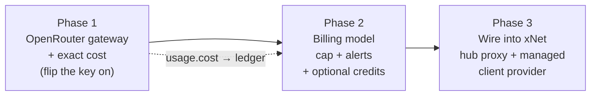
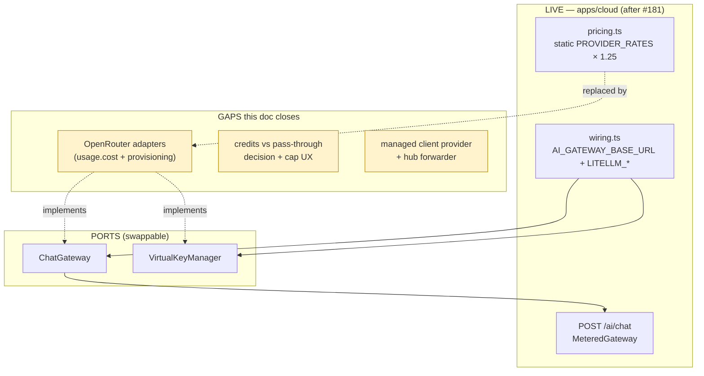
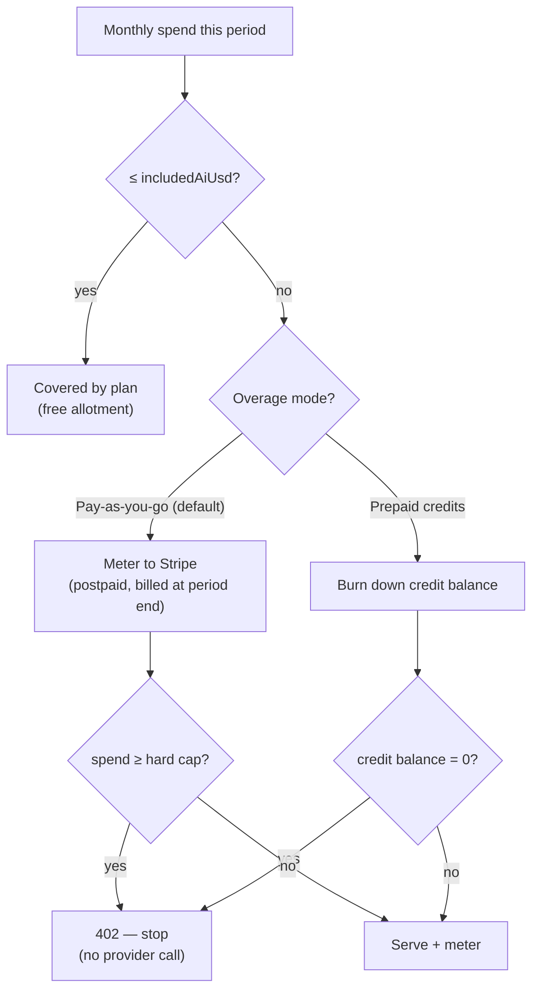
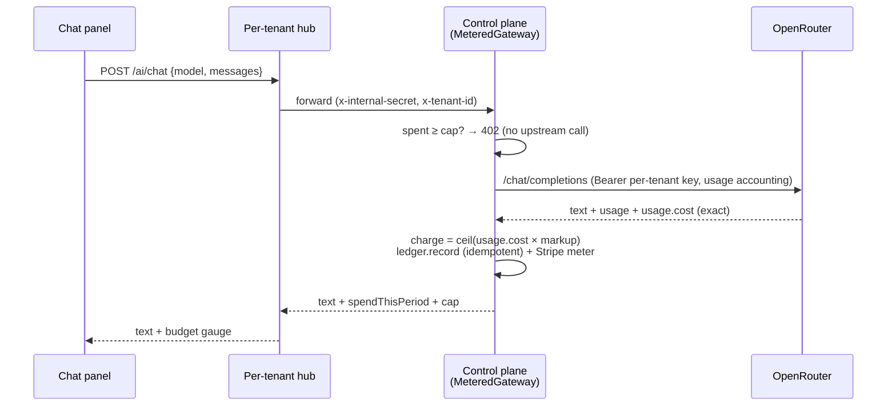
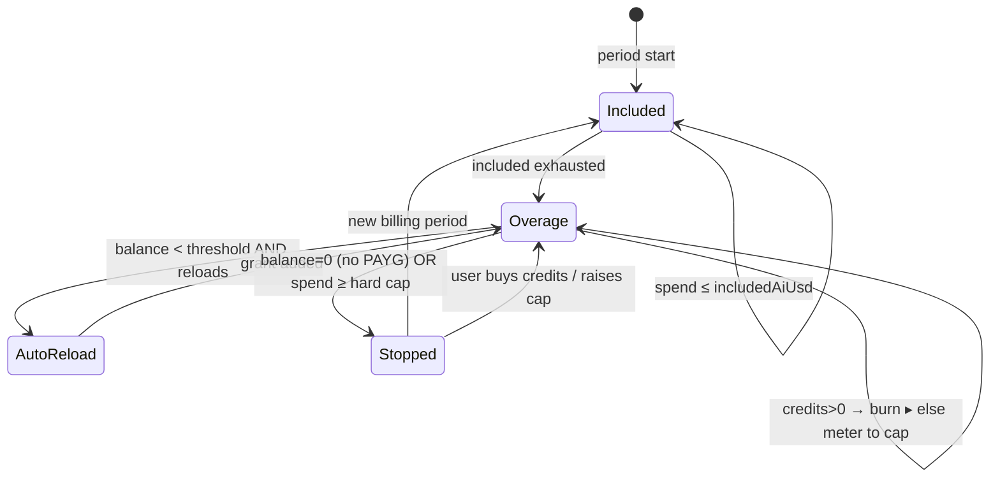
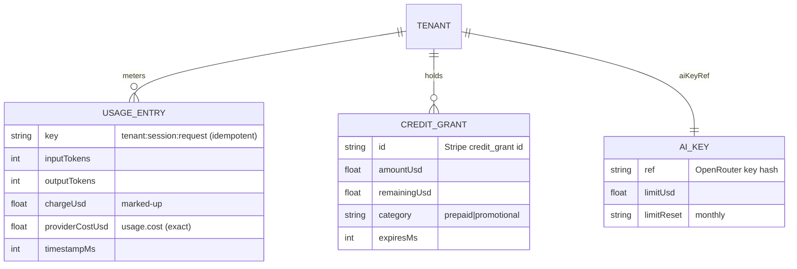

# OpenRouter / LiteLLM Metered AI: Gateway Choice, Exact Cost, and the Credits-vs-Pass-Through Billing Decision

## Problem Statement

We just dropped an **OpenRouter API key** into
`apps/cloud/.env.staging` and want to turn it into a real product: when xNet
runs through the cloud, AI usage should be **metered and billed**. The asks, in
the user's words:

- Integrate **OpenRouter** and possibly **LiteLLM** into the Cloud offering and
  into **xNet in general** (not just a server experiment).
- Give a **small free amount of inference that scales with the subscription**
  (e.g. the Team plan gets a limited allotment), then people pay.
- For everyone else, either a **straightforward pass-through** (billed per token
  on a regular cycle) **or a prepaid-credits** model where you buy credits, burn
  them down, and set a **max limit** so you can't blow past your budget.
- "Think about what most people are doing and do something like that."

So this is two intertwined questions: **(1) which gateway/architecture** carries
the metered traffic now that we have an OpenRouter key, and **(2) which billing
model** — pass-through vs prepaid credits — do we ship, given the surprise-bill
protection the pricing page already promises.

## Executive Summary

**~80% of this already exists and is live.** Exploration
[0200](0200_[_]_CLOUD_BILLING_AI_METERING_AND_RUN_IN_PUBLIC_DASHBOARD.md) (PR
#181) wired the dormant `@xnetjs/cloud` spine into a working metered-AI path:
per-plan **included allotment + hard cap**, an idempotent **usage ledger**, a
**Stripe Billing-Meters** adapter, **per-tenant LiteLLM virtual keys**, the
`POST /ai/chat` route with a **402 budget hard-stop**, a dashboard "used /
included / cap" meter, and **measured margin reconciliation**. The seam is
deliberately **OpenAI-compatible** (`AI_GATEWAY_BASE_URL`), and the doc itself
flagged credits + the client wiring as *deferred*.

The OpenRouter key unlocks the **cleanest version of the three things still
open**, because OpenRouter slots straight into the ports we already have:

1. **Gateway choice.** OpenRouter-direct **removes the self-hosted LiteLLM
   proxy** from the critical path. Its **Provisioning API** mints per-tenant keys
   with a `limit` + monthly `limit_reset` — a drop-in for our existing
   `VirtualKeyManager` port — and every response carries **`usage.cost`**: the
   exact USD OpenRouter billed us, caching/reasoning/image tokens included.
2. **Cost truth.** Today metering *estimates* cost from a static `PROVIDER_RATES`
   table ([`apps/cloud/src/ai/pricing.ts`](apps/cloud/src/ai/pricing.ts)).
   `usage.cost` is **ground truth**, so margin stops being modeled and becomes
   measured per call. (Our existing `GatewayClient` reads the token counts but
   throws `usage.cost` away — a one-line miss.)
3. **Billing model.** The user's two instincts are **the same industry pattern at
   two points on one line**: a plan **includes** an allotment, and **overage** is
   either *postpaid metered* ("pass-through") or *prepaid credits*. The 2026
   norm — Cursor, GitHub Copilot, Replit — is **"your $X plan = $X of included
   AI," then opt-in pay-as-you-go to a hard cap.** We already ship exactly that.
   The new lever is an **optional prepaid credit pack** for users who want
   cash-up-front, zero postpaid exposure.

And **"into xNet in general"** is the 0200-deferred piece: a **hub forwarder** +
a **`managed` client `AIProvider`** so the chat panel and `AiSurfaceService` can
use metered managed AI, not only bring-your-own-key.

Recommended path, three phases that each merge on their own:



## Current State In The Repository

### The metered-AI spine (built in #181, ports-and-adapters)

| Concern | File | Note for OpenRouter |
|---|---|---|
| Gateway client | [`packages/cloud/src/ai/gateway.ts`](packages/cloud/src/ai/gateway.ts) | `ChatGateway` port + `GatewayClient` (OpenAI-compatible `/chat/completions`). **Reads `usage.prompt_tokens/completion_tokens`; ignores `usage.cost`.** |
| Budget + metering | [`packages/cloud/src/ai/metered-gateway.ts`](packages/cloud/src/ai/metered-gateway.ts) | `MeteredGateway` — hard-stops `spent >= budget` **before** the provider call, meters every success. Provider-agnostic. |
| Metering bridge | [`packages/cloud/src/ai/metering.ts`](packages/cloud/src/ai/metering.ts) | `meterUsage()` computes `chargeUsd` **and** `providerCostUsd` from `TokenPricing` → ledger (idempotent) → Stripe meter on first record. |
| Virtual keys | [`packages/cloud/src/ai/keys.ts`](packages/cloud/src/ai/keys.ts) | **`VirtualKeyManager` port** + `LiteLLMKeyManager` (`/key/generate` etc.) + `FakeVirtualKeyManager`. An `OpenRouterKeyManager` is a sibling adapter. |
| Token pricing | [`packages/cloud/src/billing/pricing.ts`](packages/cloud/src/billing/pricing.ts) | `computeChargeUsd` (markup ≥ 1, **rounds up**) + `computeProviderCostUsd`. |
| Usage ledger | [`packages/cloud/src/billing/ledger.ts`](packages/cloud/src/billing/ledger.ts) | `UsageLedger` (`record`/`totalChargeUsd(tenant, sinceMs)`/`entries`), idempotent by `tenant:session:request`. `sinceMs` already gives monthly reset. |
| Stripe meters | [`packages/cloud/src/billing/billing.ts`](packages/cloud/src/billing/billing.ts) | `StripeBilling.recordMeterEvent` (Billing Meters) + `FakeStripeBilling`. **No Credit Grants yet.** |
| Measured COGS | [`packages/cloud/src/cost/reconcile.ts`](packages/cloud/src/cost/reconcile.ts) | `reconcileTenantMargin` counts AI **provider cost** as COGS; marked-up AI is revenue. Needs `providerCostUsd` to be accurate → that's what `usage.cost` gives us. |

### The live wiring (`apps/cloud/src/ai/`)

- [`wiring.ts`](apps/cloud/src/ai/wiring.ts): `aiChatDepsFromEnv` mounts the route
  when **`AI_GATEWAY_BASE_URL`** is set (any OpenAI-compatible proxy — "LiteLLM
  or OpenRouter", per its own comment). `aiKeysFromEnv` builds the
  `VirtualKeyManager` from **`LITELLM_BASE_URL` + `LITELLM_MASTER_KEY`** — the
  one spot that is still LiteLLM-shaped.
- [`route.ts`](apps/cloud/src/ai/route.ts): `POST /ai/chat` → `MeteredGateway`,
  `402 ai_budget_exceeded` on cap, `502` on gateway error. Tenant resolved from
  `x-internal-secret` + `x-tenant-id`.
- [`pricing.ts`](apps/cloud/src/ai/pricing.ts): static `PROVIDER_RATES` (USD/1M
  tokens) × `AI_MARKUP` (default **1.25×**), `DEFAULT_RATE` fallback.

### Entitlements & plans

[`packages/entitlements/src/plans.ts`](packages/entitlements/src/plans.ts) — every
paid plan already carries `aiEnabled`, `includedAiUsd`, `aiMonthlyBudgetUsd`:

| Plan | seats | `includedAiUsd` | `aiMonthlyBudgetUsd` (hard cap) |
|---|---|---|---|
| demo | 1 | 0 | 0 (off) |
| personal | 1 | $2 | $25 |
| family | 5 | $5 | $60 |
| team | 3 | $8 | $200 |
| community | 10 | $10 | $300 |
| company | 10 | $15 | $500 |
| enterprise | 25 | $25 | $2000 |

`withAiBudget()` validates `aiMonthlyBudgetUsd >= includedAiUsd`. **The "free
amount that scales with the plan" already exists** — it's `includedAiUsd`.

### The client today: BYO-key only

[`packages/plugins/src/ai/providers.ts`](packages/plugins/src/ai/providers.ts)
has `OpenAICompatibleProvider` and lists `'openrouter'` as an `AIProviderType`,
so a user can already point the chat panel at OpenRouter **with their own key**.
There is **no `managed` provider** and **no hub forwarder** — `grep managed`
finds nothing in
[`apps/web/src/workbench/views/ai-chat-connector.ts`](apps/web/src/workbench/views/ai-chat-connector.ts).
Managed metered AI exists on the server but nothing in the product calls it. This
is the gap "integrate into xNet in general" names.

### Where the key lives (and where it must end up)

`.env.staging` matches `.env.*` in [`.gitignore`](.gitignore), so the key is
**correctly local-only and will not be committed** — good. But that means it is
*not* how the deployed control plane gets it: production reads provider secrets
from **Secret Manager** (the PR #175 pattern, documented in
[`docs/cloud/SETUP.md`](docs/cloud/SETUP.md) Part 3a). `.env.staging` is for
local/staging smoke tests; the deploy path is a follow-up checklist item, not a
commit.



## External Research

Two research sweeps (industry billing patterns; OpenRouter + LiteLLM
architecture) converge on clear answers. Full source lists in **References**.

### What "most people are doing" (2026)

- **The dominant model is hybrid:** a subscription whose **price equals the
  included AI allotment**, then **opt-in pay-as-you-go overage** behind an
  explicit toggle, with a **hard spend cap** for safety. Cursor Pro = $20/mo with
  ~$20 of included model credits; GitHub Copilot Pro = $10/mo with $10 of AI
  credits at $0.01/credit; Replit Core = $25/mo with $25 of usage credits. **Our
  `includedAiUsd` + `aiMonthlyBudgetUsd` already mirrors this.**
- **Prepaid credits** (OpenAI/Anthropic API, OpenRouter itself): buy a balance,
  burn it down, optional **auto-reload** with a **monthly reload cap**. Pros:
  cash up front, deferred-revenue, natural hard stop, rollover reduces churn.
  Cons: a real-time balance ledger, refund/expiry policy, ASC-606 revenue
  recognition on *consumption*.
- **Postpaid metered overage** ("pass-through"): meter now, invoice at period
  end. Frictionless, but it's the model that produced the 2025 Cursor / 2026
  Anthropic billing backlashes — **surprise bills churn users**. Mitigate with a
  user-set cap + threshold emails at **50 / 80 / 95 / 100%**.
- **Markup norms:** resale gateways run **0–20%** over provider cost; a healthy
  AI-SaaS keeps raw model cost at **20–30% of revenue** (≈ 1.3–1.5× markup). Our
  **1.25×** is at the thin end and **does not yet absorb OpenRouter's buy-in
  fee** (below).
- **Stripe mechanics:** the legacy **usage-records API was removed** in
  `2025-03-31.basil`. The current rails are **Billing Meters** (we use these) +
  **Credit Grants** (prepaid/included balances that auto-apply at invoice
  finalization). Auto-topup is **not native** — you build it on
  `credit_balance_summary` + a one-off invoice.

### OpenRouter vs LiteLLM, for a reseller

| | **OpenRouter (direct)** | **LiteLLM (self-host)** |
|---|---|---|
| Infra to run | **None** (hosted) | Proxy + Postgres + Redis for HA |
| Per-tenant budgets | Provisioning API: key `limit` + `limit_reset` (`daily`/`weekly`/`monthly`) | Virtual key `max_budget` + `budget_duration` |
| **Exact cost** | **`usage.cost` on every response** (caching/reasoning/image baked in); `/api/v1/generation?id=` for native token counts | **Estimated** from a static price map; known cache-discount drift |
| Budget enforcement | Managed-SaaS reliable | Per-key works single-node; **active multi-replica Redis race bugs** (#27381, #27639, #27735) |
| Fee / margin | **5.5% credit-purchase fee** (min $0.80); BYOK 5% after 1M free/mo; **zero per-token markup** | No platform fee; you hold provider keys |
| Model breadth / routing | 300+ models, `:nitro`/`:floor`, fallbacks built-in | You configure upstreams (can target OpenRouter) |
| Who holds keys/data | OpenRouter (privacy/dependency surface) | You |

**Net:** for our scale (pre-six-figure monthly LLM spend, small ops team),
**OpenRouter-direct is the lower-risk, lower-effort choice** *and* gives **better
cost truth** than the LiteLLM proxy we were going to self-host. LiteLLM stays
valuable as a future swap-in (data-plane control, no buy-in fee at high volume)
— and because both are behind the `ChatGateway`/`VirtualKeyManager` ports, that
swap is a wiring change, not a rewrite. **Avoid stacking LiteLLM *in front of*
OpenRouter**: you'd pay the fee, self-host the proxy, *and* get two diverging
cost numbers.

## Key Findings

1. **OpenRouter collapses the architecture.** No proxy to deploy; per-tenant keys
   and budgets are an API call; cost is exact. It implements the two ports we
   already have, so the route, ledger, Stripe meter, dashboard, and
   reconciliation are untouched.
2. **The static price table is now a liability.** `PROVIDER_RATES` drifts every
   time a provider changes prices, adds prompt caching, or bills reasoning/image
   tokens. `usage.cost` is the number we were actually charged — use it for
   `providerCostUsd` and the margin reconciliation becomes *real*.
3. **The hard cap is the load-bearing safety, and both billing models keep it.**
   The `402 BudgetExceededError` path is the surprise-bill guard. Pass-through
   and credits are both *"how overage above the included allotment is paid for,"*
   not whether there's a ceiling.
4. **The user's two ideas are one pattern.** Included allotment → overage. "Pay
   per token, billed regularly" = **postpaid metered**. "Buy credits, set a max"
   = **prepaid**. Ship the metered-overage-to-a-cap default (already built), add
   prepaid credit packs as an opt-in alternative — don't pick one *instead* of
   the other.
5. **1.25× doesn't cover OpenRouter's 5.5% buy-in.** At 1.25× our gross is ~20%;
   the buy-in fee + Stripe's ~2.9%+30¢ erode it further on small balances. Move
   the **default markup to ~1.3×** (overridable via `AI_MARKUP`) and let measured
   reconciliation tune it.
6. **Managed AI isn't in the product yet.** The server path is complete; the hub
   forwarder + `managed` client provider (deferred in 0200) are what make it real
   for users — the "into xNet in general" work.

## Options And Tradeoffs

### Decision 1 — Which gateway carries metered traffic?

| Option | How | Pros | Cons |
|---|---|---|---|
| **A. OpenRouter direct** *(recommended)* | New `OpenRouterGatewayClient` (reads `usage.cost`) + `OpenRouterKeyManager` (Provisioning API). Point `AI_GATEWAY_BASE_URL` at `https://openrouter.ai/api/v1`. | Zero infra; exact cost; managed budgets; 300+ models + routing; key already in hand | 5.5% buy-in fee; OpenRouter holds keys + sees prompts; single upstream dependency |
| **B. Keep LiteLLM proxy** | Deploy LiteLLM + Postgres; current `LiteLLMKeyManager`. | No buy-in fee; we hold provider keys; full data-plane control | Self-host + on-call; **estimated** cost; multi-replica budget race bugs |
| **C. LiteLLM → OpenRouter** | LiteLLM in front, OpenRouter upstream. | One credential at LiteLLM; OR routing | Pay the fee **and** self-host; **two diverging cost numbers**; worst of both |

**Recommendation: A now, B as a documented swap-in.** Ship on the key we have;
keep the ports so a high-volume future can move to direct provider keys behind
LiteLLM without touching the billing spine.

### Decision 2 — Cost truth: static table vs `usage.cost`

| Option | Pros | Cons |
|---|---|---|
| **Static `PROVIDER_RATES` × markup** (today) | Works with any OpenAI-compatible upstream incl. LiteLLM; deterministic in tests | Drifts; wrong under prompt caching / reasoning / image tokens; margin is *modeled* |
| **`usage.cost` ground truth** *(recommended when on OpenRouter)* | Exact provider cost per call → exact margin; auto-correct as provider prices change | Only when the upstream returns it (OpenRouter does; raw OpenAI doesn't) |

**Recommendation:** when `usage.cost` is present, use it as `providerCostUsd` and
charge `ceil(usage.cost × markup)`. Fall back to the static table when it's
absent (BYO-LiteLLM, dev mocks). One small change in the metering bridge; the
`round-up, never undercharge` invariant is preserved.

### Decision 3 — Billing model (the heart of the question)



| Model | Mechanics | Pros | Cons | Fit |
|---|---|---|---|---|
| **Included + PAYG overage + hard cap** *(recommended default)* | Plan `includedAiUsd` free; beyond it, Stripe-metered to `aiMonthlyBudgetUsd`; user can lower the cap | Already built; "your $X = $X of AI"; matches Cursor/Copilot; one billable unit (USD) | Postpaid overage can still surprise without alerts → add 50/80/95/100% emails + a user-set cap | "Pass-through, billed regularly" |
| **Prepaid credit packs** *(recommended add-on)* | Buy $N (Stripe **Credit Grant**), burn down in real time, optional auto-reload **with a monthly reload cap**; at $0 → stop | Cash up front; zero postpaid exposure; natural hard stop = the user's "max limit"; rollover lowers churn | New surface: balance ledger, refund/expiry, revenue-recognition on consumption | "Buy credits, set a max" |
| **Pure BYO-key** (today) | User's own provider key | Zero risk/margin | Not a managed offering | The free/anti-lock-in fallback — keep it |

**Recommendation:** ship **both points on the line**, default to the one we
already have. Concretely:

- **Free allotment scales with the plan** — keep `includedAiUsd` (personal $2 …
  enterprise $25). For **Team and up, express it per seat** so "the team plan
  gets a limited amount of inference" reads naturally (e.g. Team = $8 × seats).
- **Default overage = PAYG metered to a hard cap** the user can *lower* but not
  silently exceed — plus the threshold emails we don't yet send.
- **Offer a prepaid credit pack** at checkout/portal for users who want
  cash-up-front certainty: their **max limit** is literally their balance, and
  auto-reload has its own monthly ceiling. Credits draw down *before* PAYG.
- **BYO-key stays the free path** (anti-lock-in invariant; works with no control
  plane).

### Decision 4 — Per-tenant key isolation

| Option | Pros | Cons |
|---|---|---|
| **Provisioned OpenRouter key per tenant** *(recommended)* | Defense-in-depth budget at the gateway; per-tenant usage visible in OpenRouter; a leaked key is capped + revocable | One Provisioning API call per tenant; key stored server-side on `TenantRecord.aiKeyRef` (already modeled) |
| **One shared key + app-layer metering only** | Simplest | A leak is uncapped; no gateway-side budget; harder per-tenant attribution |

**Recommendation:** provisioned per-tenant keys — it's the exact shape
`aiKeyRef` + `VirtualKeyManager` already assume; OpenRouter's `limit` /
`limit_reset` mirror LiteLLM's `max_budget` / `budget_duration`.

## Recommendation

### Phase 1 — OpenRouter gateway + exact cost (turn the key on)

1. `OpenRouterGatewayClient implements ChatGateway` — same `/chat/completions`
   call, but request `usage` accounting and **read `usage.cost`** into the
   result.
2. `OpenRouterKeyManager implements VirtualKeyManager` over the **Provisioning
   API** (`POST/PATCH/DELETE /api/v1/keys`), mapping `maxBudgetUsd → limit`,
   `budgetDuration → limit_reset:"monthly"`.
3. Teach `wiring.ts` to pick the adapter from env (`AI_GATEWAY_PROVIDER` or
   sniffing an `openrouter.ai` base URL); thread `providerCostUsd` from
   `usage.cost` through `meterUsage`.
4. Bump default `AI_MARKUP` to **1.3**; point `.env.staging` at OpenRouter; live
   smoke `POST /ai/chat`.

### Phase 2 — Make the money honest & safe

5. **User-settable cap** ≤ plan `aiMonthlyBudgetUsd`, persisted on the tenant;
   the metered gateway already enforces whatever cap it's handed.
6. **Threshold notifications** at 50 / 80 / 95 / 100% (email/in-app); the 100%
   event is the existing 402.
7. **Prepaid credit packs**: a `CreditLedger` + Stripe **Credit Grant** issuance;
   draw down before PAYG; auto-reload with a monthly reload cap; expiry/refund
   policy documented.

### Phase 3 — Wire managed AI into xNet

8. **Hub forwarder** `POST /ai/chat` → control plane with the tenant service
   credential (the 0200-deferred forwarder).
9. **`managed` client `AIProvider`** that targets the hub route (no key in the
   client); the chat panel shows a **live budget gauge** ("$X of $Y used") and a
   graceful **degrade to BYO** when there's no control plane.



## Example Code

### OpenRouter gateway adapter — exact cost

```ts
// packages/cloud/src/ai/openrouter-gateway.ts (new)
import type { ChatGateway, ChatRequest, ChatResult } from './gateway'
import { GatewayError } from './gateway'

interface ORResponse {
  choices?: Array<{ message?: { content?: string | null } }>
  model?: string
  usage?: {
    prompt_tokens?: number
    completion_tokens?: number
    total_tokens?: number
    cost?: number // ← USD OpenRouter billed us; caching/reasoning baked in
  }
}

export interface ORChatResult extends ChatResult {
  /** Ground-truth provider cost (USD). Undefined if the upstream omitted it. */
  providerCostUsd?: number
}

export class OpenRouterGatewayClient implements ChatGateway {
  constructor(
    private readonly baseUrl = 'https://openrouter.ai/api/v1',
    private readonly fetchImpl: typeof fetch = fetch
  ) {}

  async chat(req: ChatRequest): Promise<ORChatResult> {
    const res = await this.fetchImpl(`${this.baseUrl}/chat/completions`, {
      method: 'POST',
      headers: {
        'content-type': 'application/json',
        authorization: `Bearer ${req.virtualKey}`,
        'http-referer': 'https://xnet.fyi',
        'x-title': 'xNet Cloud'
      },
      body: JSON.stringify({
        model: req.model,
        messages: req.messages,
        usage: { include: true }, // ask OpenRouter to return usage.cost
        ...(req.maxTokens ? { max_tokens: req.maxTokens } : {})
      })
    })
    if (!res.ok) throw new GatewayError(`openrouter ${res.status}`, res.status)
    const data = (await res.json()) as ORResponse
    const inputTokens = data.usage?.prompt_tokens ?? 0
    const outputTokens = data.usage?.completion_tokens ?? 0
    return {
      text: data.choices?.[0]?.message?.content ?? '',
      model: data.model ?? req.model,
      usage: {
        inputTokens,
        outputTokens,
        totalTokens: data.usage?.total_tokens ?? inputTokens + outputTokens
      },
      ...(typeof data.usage?.cost === 'number' ? { providerCostUsd: data.usage.cost } : {})
    }
  }
}
```

### OpenRouter key manager — drop-in for `VirtualKeyManager`

```ts
// packages/cloud/src/ai/openrouter-keys.ts (new)
import type { CreateVirtualKeyInput, VirtualKey, VirtualKeyManager } from './keys'
import { VirtualKeyError } from './keys'

// Auth uses a *management* key (mint-only; cannot run inference).
export class OpenRouterKeyManager implements VirtualKeyManager {
  constructor(
    private readonly managementKey: string,
    private readonly baseUrl = 'https://openrouter.ai/api/v1',
    private readonly fetchImpl: typeof fetch = fetch
  ) {}

  async create(input: CreateVirtualKeyInput): Promise<VirtualKey> {
    const data = (await this.call('POST', '/keys/', {
      name: input.alias,
      limit: input.maxBudgetUsd // OpenRouter enforces this ceiling
    })) as { key?: string; hash?: string }
    const key = data.key ?? data.hash
    if (!key) throw new VirtualKeyError('openrouter /keys returned no key', 502)
    // monthly reset to mirror LiteLLM's budget_duration:'30d'
    await this.call('PATCH', `/keys/${data.hash}`, { limit_reset: 'monthly' })
    return { key, alias: input.alias, maxBudgetUsd: input.maxBudgetUsd }
  }
  async update(key: string, patch: { maxBudgetUsd?: number }): Promise<void> {
    if (patch.maxBudgetUsd !== undefined)
      await this.call('PATCH', `/keys/${key}`, { limit: patch.maxBudgetUsd })
  }
  async remove(key: string): Promise<void> {
    await this.call('DELETE', `/keys/${key}`, undefined)
  }

  private async call(method: string, path: string, body: unknown): Promise<unknown> {
    const res = await this.fetchImpl(`${this.baseUrl}${path}`, {
      method,
      headers: { 'content-type': 'application/json', authorization: `Bearer ${this.managementKey}` },
      ...(body !== undefined ? { body: JSON.stringify(body) } : {})
    })
    if (!res.ok) throw new VirtualKeyError(`openrouter ${path} → ${res.status}`, res.status)
    return res.json().catch(() => ({}))
  }
}
```

### Metering with ground-truth cost (the one substantive change)

```ts
// in meterUsage(): prefer measured provider cost when present
const providerCostUsd =
  args.providerCostUsd ??
  computeProviderCostUsd(args.usage.inputTokens, args.usage.outputTokens, args.pricing)
// charge is still cost × markup, rounded UP — now off the *real* cost
const chargeUsd = ceil8(providerCostUsd * args.pricing.markup)
```

### Env surface (extends the existing block)

```bash
# apps/cloud/.env.staging  (gitignored; mirror to Secret Manager for deploy)
AI_GATEWAY_PROVIDER=openrouter
AI_GATEWAY_BASE_URL=https://openrouter.ai/api/v1
OPENROUTER_API_KEY=sk-or-...                 # inference (the shared/parent key)
OPENROUTER_MANAGEMENT_KEY=sk-or-mgmt-...      # mint per-tenant keys (Provisioning API)
AI_MARKUP=1.3                                 # absorb the 5.5% buy-in + Stripe fees
AI_ALLOWED_MODELS=anthropic/claude-sonnet-4-6,openai/gpt-4o-mini
```

### Prepaid credit balance state machine



### Ledger + credits data model



## Risks And Open Questions

- **Single-upstream dependency & privacy.** OpenRouter holds the keys and sees
  prompts; an outage stops managed AI. Mitigation: the ports let us fail over to
  LiteLLM/direct providers; BYO-key keeps working regardless. Open: do we need a
  ZDR / `data_collection: deny` provider policy for sensitive tenants?
- **Margin under the 5.5% buy-in.** 1.25× is too thin; 1.3× is a starting guess.
  Measured reconciliation (now fed by exact `usage.cost`) should drive the real
  number. Open: per-model markup vs one global multiplier?
- **Cost truth only on OpenRouter.** LiteLLM/raw-OpenAI fall back to the static
  table; keep `PROVIDER_RATES` current or the fallback path quietly mis-meters.
- **Prepaid credits add real surface.** Revenue recognition on *consumption*,
  refunds, expiry, the 100-grant-per-customer Stripe limit, and auto-reload
  runaway (agentic loops). Ship PAYG-to-a-cap first; credits as a fast-follow.
- **Hard cap vs mid-session interruption.** A 402 mid-conversation is jarring.
  Open: a one-click "raise my cap by $X" with explicit confirmation (still
  surprise-bill-safe because it's user-initiated).
- **Streaming usage.** `usage.cost` arrives in the **final SSE chunk** (empty
  `choices`); the metering path must read the last chunk, not the deltas.
- **Per-tenant key sprawl.** Provisioning a key per tenant scales fine, but needs
  lifecycle hooks (revoke on cancel/delete) — wire into the existing
  provision/teardown.
- **Self-host parity.** Managed AI is Cloud-only; the OSS hub keeps BYO-key.
  Don't let the `managed` provider hard-fail when there's no control plane.

## Implementation Checklist

### Phase 1 — OpenRouter gateway + exact cost
- [ ] `OpenRouterGatewayClient implements ChatGateway`, reads `usage.cost`
      (request `usage: { include: true }`), surfaces `providerCostUsd`.
- [ ] `OpenRouterKeyManager implements VirtualKeyManager` over the Provisioning
      API (`/keys` create/patch/delete; `limit` + `limit_reset:"monthly"`).
- [ ] Thread `providerCostUsd` (when present) through `meterUsage` →
      `ledger.providerCostUsd`; charge = `ceil(providerCostUsd × markup)`; static
      table remains the fallback.
- [ ] `wiring.ts`: select adapter by `AI_GATEWAY_PROVIDER` / base-URL sniff;
      `aiKeysFromEnv` builds `OpenRouterKeyManager` from `OPENROUTER_MANAGEMENT_KEY`.
- [ ] Default `AI_MARKUP` → 1.3; document `OPENROUTER_*` in `docs/cloud/SETUP.md`.
- [ ] Live smoke against staging OpenRouter key; mirror secrets to Secret Manager
      (not the repo).

### Phase 2 — Billing model
- [ ] Per-tenant **user-settable cap** (≤ plan `aiMonthlyBudgetUsd`) on
      `TenantRecord`; thread into `budgetUsdFor`.
- [ ] Threshold notifications at 50 / 80 / 95 / 100%.
- [ ] Express Team+ `includedAiUsd` **per seat** in the catalog + dashboard copy.
- [ ] `CreditLedger` + Stripe **Credit Grant** issuance; burn credits before PAYG;
      auto-reload with a monthly reload cap; expiry/refund policy.
- [ ] Checkout/portal surface for buying credit packs.

### Phase 3 — Wire into xNet
- [ ] Hub `POST /ai/chat` forwarder → control plane (tenant service credential).
- [ ] `managed` `AIProvider` in `packages/plugins`; chat panel budget gauge;
      graceful BYO degrade with no control plane.
- [ ] `AiSurfaceService` / agent runner can target the managed provider.

## Validation Checklist
- [ ] A metered call through `OpenRouterGatewayClient` records `providerCostUsd`
      equal to `usage.cost` (fixtured) and `chargeUsd = ceil(cost × markup)`.
- [ ] Re-delivering the same `(tenant, session, request)` meters **once** (ledger
      idempotency holds across the OpenRouter path).
- [ ] An over-cap tenant gets `402 ai_budget_exceeded` with **no** OpenRouter call
      (counting fake never invoked).
- [ ] Provisioning creates an OpenRouter key with the plan limit + monthly reset;
      a plan change updates it; cancel/delete revokes it.
- [ ] `reconcileTenantMargin` on real `usage.cost` yields exact margin (no static
      table) for a known usage profile.
- [ ] Lowering the user cap below the plan cap is enforced; raising above the plan
      cap is rejected.
- [ ] Prepaid credits draw down before PAYG; at $0 balance with PAYG off →
      stop; auto-reload halts at the monthly reload cap.
- [ ] Streaming: cost is read from the final usage chunk and metered once.
- [ ] OSS hub with no control plane still offers BYO AI; `managed` provider
      degrades gracefully.

## References

### Repo
- AI spine: [`ai/gateway.ts`](packages/cloud/src/ai/gateway.ts),
  [`ai/keys.ts`](packages/cloud/src/ai/keys.ts),
  [`ai/metered-gateway.ts`](packages/cloud/src/ai/metered-gateway.ts),
  [`ai/metering.ts`](packages/cloud/src/ai/metering.ts)
- Live wiring: [`apps/cloud/src/ai/wiring.ts`](apps/cloud/src/ai/wiring.ts),
  [`route.ts`](apps/cloud/src/ai/route.ts),
  [`pricing.ts`](apps/cloud/src/ai/pricing.ts)
- Billing/cost: [`billing/billing.ts`](packages/cloud/src/billing/billing.ts),
  [`billing/pricing.ts`](packages/cloud/src/billing/pricing.ts),
  [`cost/reconcile.ts`](packages/cloud/src/cost/reconcile.ts)
- Plans: [`packages/entitlements/src/plans.ts`](packages/entitlements/src/plans.ts)
- Client AI: [`packages/plugins/src/ai/providers.ts`](packages/plugins/src/ai/providers.ts)
- Setup: [`docs/cloud/SETUP.md`](docs/cloud/SETUP.md) · prior:
  [0200](0200_[_]_CLOUD_BILLING_AI_METERING_AND_RUN_IN_PUBLIC_DASHBOARD.md)
  (0148/0175/0176/0178 lineage)

### External — OpenRouter / LiteLLM
- [OpenRouter Provisioning API](https://openrouter.ai/docs/features/provisioning-api-keys) ·
  [Usage Accounting (`usage.cost`)](https://openrouter.ai/docs/cookbook/administration/usage-accounting) ·
  [Platform fee 5.5%](https://openrouter.ai/blog/announcements/simplifying-our-platform-fee/) ·
  [BYOK](https://openrouter.ai/docs/guides/overview/auth/byok)
- [LiteLLM virtual keys](https://docs.litellm.ai/docs/proxy/virtual_keys) ·
  [spend tracking](https://docs.litellm.ai/docs/proxy/cost_tracking) ·
  [OpenRouter provider](https://docs.litellm.ai/docs/providers/openrouter) ·
  budget race bugs [#27381](https://github.com/BerriAI/litellm/issues/27381),
  [#27639](https://github.com/BerriAI/litellm/issues/27639)

### External — billing patterns
- [Stripe Billing Meters](https://docs.stripe.com/billing/subscriptions/usage-based) ·
  [Billing Credits / Credit Grants](https://docs.stripe.com/billing/subscriptions/usage-based/billing-credits) ·
  [legacy usage-records removed](https://docs.stripe.com/changelog/basil/2025-03-31/deprecate-legacy-usage-based-billing)
- [Cursor pricing](https://cursor.com/docs/account/pricing) ·
  [GitHub Copilot usage-based billing](https://github.blog/news-insights/company-news/github-copilot-is-moving-to-usage-based-billing/) ·
  [Replit AI billing](https://docs.replit.com/billing/ai-billing)
- [Chargebee: prepaid credits guide](https://www.chargebee.com/pricing-labs/prepaid-credit-pricing-guide/) ·
  [Lago: usage-based pricing playbook](https://getlago.com/blog/the-full-playbook-how-to-design-usage-based-pricing-models) ·
  [SaaStr: AI gross margins](https://www.saastr.com/have-ai-gross-margins-really-turned-the-corner-the-real-math-behind-openais-70-compute-margin-and-why-b2b-startups-are-still-running-on-a-treadmill/)
