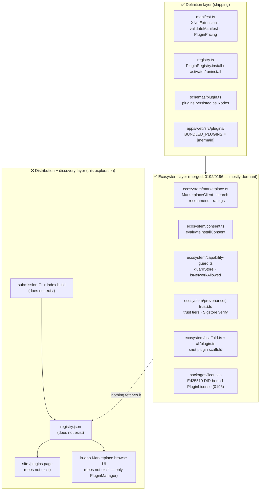
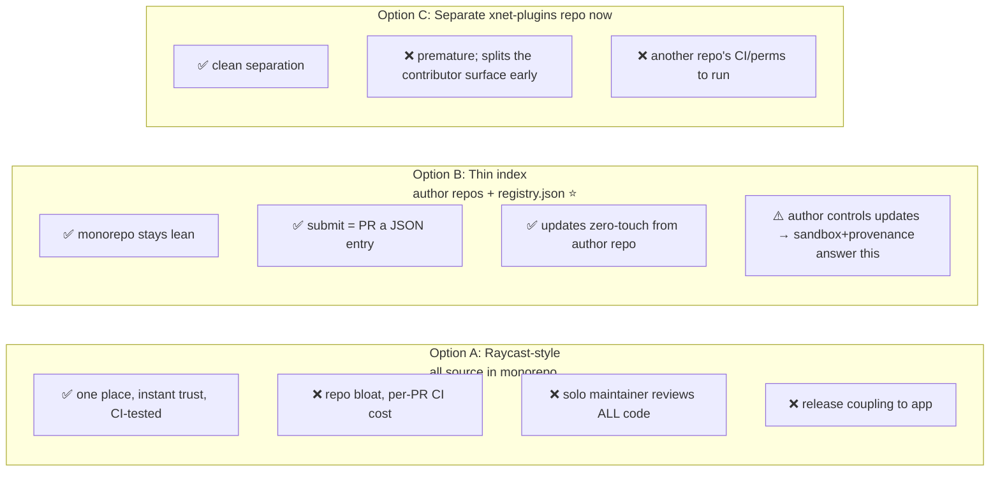
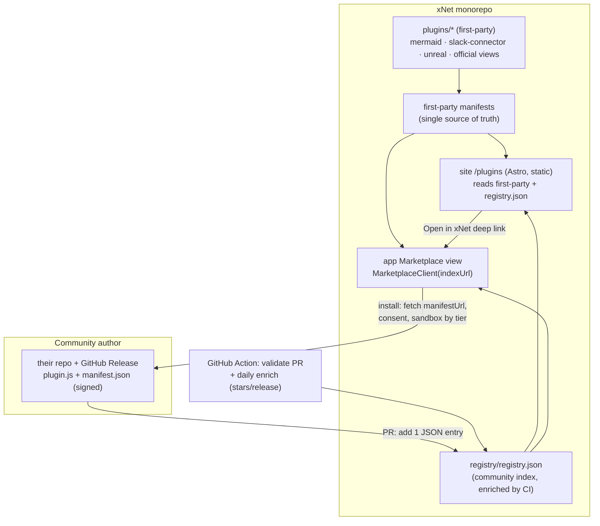

# Exploration 0201: Plugins Marketplace — Distribution Backbone and Marketplace Website

> How to ship a real, live plugins marketplace for xNet: where plugin code
> lives (monorepo vs. separate repo), how the community submits and publishes,
> and a compelling `/plugins` page on xnet.fyi that shows off what xNet does out
> of the box *and* what the community builds.

## Problem Statement

xNet has spent four explorations building the **machinery** of a plugin
ecosystem — manifests, a registry, a marketplace data layer, consent/trust
tiers, a scaffolder, a licensing spine — but has shipped **zero** of the things
a user or developer can actually see:

- There is **no `registry.json`** anywhere in the repo. The `MarketplaceClient`
  ([`packages/plugins/src/ecosystem/marketplace.ts`](../../packages/plugins/src/ecosystem/marketplace.ts))
  has nothing to fetch.
- There is **no in-app marketplace UI**. `grep -ri marketplace apps/web/src`
  returns nothing. The only plugin UI is
  [`apps/web/src/components/PluginManager.tsx`](../../apps/web/src/components/PluginManager.tsx),
  which manages *already-installed* plugins (paste-JSON install, enable/disable).
- There is **one** real bundled plugin —
  [`apps/web/src/plugins/mermaid-plugin.ts`](../../apps/web/src/plugins/mermaid-plugin.ts).
- There is **no `/plugins` page** on the marketing site. A developer cannot
  discover, browse, or be inspired to publish anything.

The user's ask is concrete and twofold:

1. **Decide the distribution model.** Keep plugins in the monorepo (people PR
   their plugin in) for simplicity? Or split to a separate repo? Analyze and
   recommend.
2. **Build the marketplace website.** A "Plugins" link on xnet.fyi that opens a
   compelling, live page showing the plugins xNet ships out of the box, the
   plugins the community has written, and an inviting on-ramp for new authors.

This exploration answers both, grounded in what already exists in the tree and
in how the best plugin ecosystems (Obsidian, Raycast, Zed, WinGet, VS Code)
actually work in 2024–2026.

## Executive Summary

**The distribution decision: a hybrid, and it threads the user's needle exactly.**

| Plugin class | Where the *code* lives | Where it's *listed* | Trust tier |
| --- | --- | --- | --- |
| **First-party** ("batteries included" — mermaid, connectors, official views) | In the monorepo (`plugins/` workspace) | Auto-derived into the registry from their manifests | `bundled` |
| **Community** (anyone) | The **author's own repo**, shipped via GitHub Releases | A single committed `registry.json`; submission = **PR adding a metadata entry**, not source code | `marketplace` |

This is the **WinGet/Obsidian thin-index model fused with the user's "PR into
the monorepo" instinct**: the community *does* submit a PR to the monorepo — but
the PR adds **a few lines of JSON metadata to a registry**, never thousands of
lines of untrusted code. The plugin's source stays in the author's repo and
updates ship from there with zero further PRs (Obsidian's killer property). We
get the monorepo's "everything in one place, one PR" simplicity *without* the
repo bloat, CI cost, and trust blast-radius that sank Zed's in-monorepo model
and that strains Raycast's paid CI team.

Crucially, **the code already models exactly this split**: trust tiers
`bundled` vs `marketplace` exist in
[`provenance-trust.ts`](../../packages/plugins/src/ecosystem/provenance-trust.ts),
and `MarketplaceEntry` already carries `manifestUrl` + `provenance.sourceRepo`
for author-owned plugins. We are not inventing — we are *connecting wires that
already exist*.

**The website:** a static, data-driven `/plugins` page that imports the
committed `registry.json` at build time — the **identical pattern** the
`/open` dashboard already uses for `metrics.json`
([`site/src/data/metrics.ts`](../../site/src/data/metrics.ts) →
[`OpenMetrics.astro`](../../site/src/components/sections/OpenMetrics.astro)). A
featured grid of first-party plugins, a searchable/filterable community grid,
per-plugin detail pages, a "Publish your plugin" on-ramp, and a "Plugins" nav
link. Zero new infrastructure; build-time validation gates bad data.

**The split-later escape hatch is cheap.** `MarketplaceClient` already takes a
configurable `indexUrl`. Starting the index in the monorepo and lifting it into
a dedicated `xnet-plugins` repo later is a `git mv` plus a URL change — so we
take the simple path now and keep the option open.

## Current State In The Repository

### What exists and works today (the machinery)



Concretely, verified in this worktree:

- **Manifest + validation** —
  [`packages/plugins/src/manifest.ts`](../../packages/plugins/src/manifest.ts):
  `XNetExtension`, reverse-domain id validation, `PluginContributions` (views,
  commands, slashCommands, blocks, importers, mentionProviders, agentTools,
  canvas\*…), `PluginPricing` (`free`/`one-time`/`subscription`, `managed`/`byo`
  billing), SPDX `license`, `publisherDid`.
- **Registry / install** —
  [`packages/plugins/src/registry.ts`](../../packages/plugins/src/registry.ts):
  `PluginRegistry.install()` validates → checks platform → stores as a Node →
  activates; `rehydrate()` swaps live function references back in (JSON strips
  functions).
- **Marketplace data layer (merged, unconsumed)** —
  [`marketplace.ts`](../../packages/plugins/src/ecosystem/marketplace.ts):
  `MarketplaceEntry`, `searchMarketplace`, `sortMarketplace`,
  `filterByCategory`, `recommendExtensions` (usage-signal ranking),
  `aggregateRatings`, and `MarketplaceClient { load(); search() }` with an
  injectable `fetchJson` port and configurable `indexUrl`.
- **Trust / consent / guard (merged, unconsumed)** —
  [`ecosystem/index.ts`](../../packages/plugins/src/ecosystem/index.ts)
  re-exports `deriveTrustTier`, `evaluateInstallConsent`, `guardStore`,
  `verifyProvenance`/`failClosedVerifier`, `findMissingDependencies`,
  compatibility checks. Trust tiers: `bundled` · `marketplace` · `lab` ·
  `remote`; `sandboxForTier()` maps tier → sandbox.
- **Authoring** —
  [`packages/cli/src/commands/plugin.ts`](../../packages/cli/src/commands/plugin.ts):
  `xnet plugin scaffold <id> --template client|two-sided|ai-script` writes a
  ready-to-edit project (manifest, install/activate test, package.json, README)
  from the pure `scaffoldPlugin` core.
- **Licensing (0196)** — [`packages/licenses`](../../packages/licenses): Ed25519
  DID-bound `PluginLicense`, asymmetric so the *client* verifies; Stripe Connect
  payout adapter; FSL-1.1 license policy gate.
- **Publishing is wired** — `@xnetjs/plugins` is `publishConfig.access: public`
  with provenance; [`.changeset/config.json`](../../.changeset/config.json) puts
  it in the `fixed` cohort; [`.github/workflows/npm-release.yml`](../../.github/workflows/npm-release.yml)
  runs `changesets/action` on push to main. Nothing has been published yet.

### The precedent for the website (this is the unlock)

The `/open` "run-in-public" dashboard (exploration 0200) is the template for a
data-driven page fed by a committed JSON file:

- [`site/src/data/metrics.json`](../../site/src/data/metrics.json) — committed
  snapshot, the git history *is* the transparency log.
- [`site/src/data/metrics.ts`](../../site/src/data/metrics.ts) — `import raw
  from './metrics.json'` then `raw as CompanyMetrics`; exports derived series.
- [`OpenMetrics.astro`](../../site/src/components/sections/OpenMetrics.astro) —
  renders it with dependency-light inline SVG.
- [`site/src/pages/open.astro`](../../site/src/pages/open.astro) — the page.

Plus the **build-time validation** precedent —
[`site/scripts/validate-compare.ts`](../../site/scripts/validate-compare.ts)
runs in the `build` script and fails CI on bad data — and the **data-as-TS**
precedent in [`site/src/data/compare.ts`](../../site/src/data/compare.ts) /
[`roadmap.ts`](../../site/src/data/roadmap.ts) /
[`pricing.ts`](../../site/src/data/pricing.ts). The site is Astro static
(`site: 'https://xnet.fyi'`), Starlight docs + Tailwind, nav links hard-coded in
[`Nav.astro`](../../site/src/components/sections/Nav.astro), reusable
[`Badge.astro`](../../site/src/components/ui/Badge.astro) /
[`SectionHeader.astro`](../../site/src/components/ui/SectionHeader.astro) /
[`CodeBlock.astro`](../../site/src/components/ui/CodeBlock.astro).

**A `registry.json` → `plugins.ts` → `/plugins.astro` page is the metrics
pattern applied verbatim.**

### Prior explorations this builds on

| Doc | What it gave us | Status |
| --- | --- | --- |
| [0006](./0006_[x]_PLUGIN_ARCHITECTURE.md) | The plugin engine (4 trust layers, contributions) | ✅ shipped |
| [0047](./0047_[_]_PLUGIN_MARKETPLACE.md) | GitHub-registry design, `registry.yaml`→`plugins.json` CI, blocklist/revocation | `[_]` design only |
| [0189](./0189_[_]_EVERYTHING_AS_PLUGINS_FEATURE_MODULE_PLATFORM.md) | `FeatureModule`, two-sided plugins, importers | merged primitives |
| [0192](./0192_[_]_PLUGIN_ECOSYSTEM_MARKETPLACE_DX_AND_TRUST.md) | `guardStore`, marketplace index/search, scaffolder, provenance | merged (#138/#142) |
| [0194](./0194_[_]_EXTENSIBILITY_FABRIC_PLUGINS_LABS_AI_EDITOR.md) | Unify plugins/labs/AI/editor; `@xnetjs/trust` | roadmap |
| [0196 paid](./0196_[_]_PAID_PLUGIN_MARKETPLACE_MONETIZATION_AND_LICENSING.md) | `@xnetjs/licenses`, Stripe Connect, FSL policy | merged (#157) |
| [0196 connectors](./0196_[x]_AGENT_NATIVE_CONNECTORS_AND_INTEGRATION_MARKETPLACE.md) | `defineConnector`, `agentTools`, integration tier | ✅ shipped |

**This exploration is the operationalization of 0047** — it takes that design,
reconciles it with everything built since (trust tiers, licenses, connectors,
the `/open` site pattern), and turns it into something live.

## External Research

A full comparison of how shipping ecosystems handle distribution and the
monorepo question (2024–2026, verified against live repos):

| Ecosystem | Backbone | Code in central repo? | Updates | Scale | CI cost |
| --- | --- | --- | --- | --- | --- |
| **Raycast** | Monorepo (`raycast/extensions`), PR source in | **Yes** (all source) | PR per update | ~1,500 | **High** (macOS runners per PR; ~77k git objects; sparse-checkout needed) |
| **Obsidian** | Thin index (`obsidian-releases/community-plugins.json`) | **No** (author repos + GitHub Releases) | Zero-touch (author tags release) | **4,868** | Near-zero (JSON validate) |
| **Zed** | Index repo + git submodules (`zed-industries/extensions`) | **No** (submodules → WASM in CI → S3) | PR bumps version in `extensions.toml` | 1,293 | Moderate (Linux WASM build per changed ext) |
| **VS Code** | Dedicated server (Azure); Open VSX is the open clone | No (binary `.vsix`) | `vsce publish` | huge | N/A (proprietary) |
| **WinGet** | Manifest repo → Azure rebuilds **SQLite index** → CDN | No (URLs in YAML) | PR bumps manifest | 10k+ | Low |
| **Backstage** | npm packages + curated web directory | No (npm) | npm semver | ~300 | Low |

Decisive findings:

1. **Zed moved *out* of the monorepo** (zed-industries/zed#7096) because bundled
   extensions coupled to the *compile cycle* — "the more languages Zed supports,
   the longer our compile time becomes." xNet plugins are **runtime-loaded JS**
   (like Obsidian), so this exact pain doesn't bite us… but the *other* monorepo
   costs (repo bloat, per-PR CI, trust blast-radius) still do.
2. **Obsidian's thin index scales to ~5,000 plugins at near-zero CI cost** and
   makes updates zero-touch. Its one weakness — "we only reviewed the initial
   submission, the author controls all future releases" — is being addressed in
   2024–25 with continuous malware scanning + capability disclosures, *explicitly
   because AI coding agents made the review queue unsustainable*. xNet's answer
   to that weakness already exists: trust tiers + sandbox + Sigstore provenance.
3. **Raycast's monorepo works only with a paid team** doing manual code review on
   `macos-14` runners for every PR, plus a CODEOWNERS bot so authors can only
   touch their own extension. A solo/small maintainer with already-strained CI
   (per project memory: editor-ux 20-min timeouts, frequent admin-merges) cannot
   sustain reviewing arbitrary third-party *code* PRs.
4. **WinGet's insight** — clients never clone the repo; CI rebuilds a prebuilt
   index that clients download. Maps onto "commit an enriched `registry.json`,
   the site and app fetch it."

Sources: Raycast extensions repo + `developers.raycast.com`; `obsidianmd/obsidian-releases`
+ `obsidian.md/blog/future-of-plugins`; `zed.dev/blog/zed-decoded-extensions` +
zed#7096; `microsoft/winget-pkgs`; Open VSX (eclipse/openvsx); Backstage
community-plugins.

## Key Findings

1. **The hard part is already built.** Manifest, validation, registry, install,
   trust tiers, consent, capability guard, provenance, scaffolder, licenses — all
   merged. What's missing is the *index file*, the *website*, the *in-app browse
   view*, and the *submission pipeline*. This is a "connect the wires" job, not a
   "build the system" job.
2. **First-party and community plugins want opposite trust/distribution models.**
   First-party = trusted, version-locked to the app, in the monorepo, `bundled`
   tier. Community = untrusted, independently versioned, sandboxed, `marketplace`
   tier. The codebase *already encodes this dichotomy* — we just need to honor it
   in where code lives.
3. **"PR into the monorepo" is the right UX — for metadata, not code.** The user
   likes the one-repo simplicity. The thin-index model preserves it (submit a PR
   adding a JSON entry to the monorepo) while keeping untrusted code out.
4. **The website can be 100% static and live this week.** Committed `registry.json`
   + the proven `metrics.json` pattern = no servers, no API, build-time
   validation, instant deploy.
5. **The split-later cost is near-zero.** `indexUrl` is configurable; the index
   is one file + one script + one Action. Don't over-engineer a separate repo
   now.

## Options And Tradeoffs

### Decision 1 — Where does plugin *code* live?



| Dimension | A: monorepo source | **B: thin index ⭐** | C: separate repo now |
| --- | --- | --- | --- |
| Monorepo bloat | Severe (Raycast: 77k objects) | None (JSON only) | None |
| Submission friction | High (code review) | **Low (metadata PR)** | Low |
| Update friction | PR per update | **Zero-touch** | Zero-touch |
| CI cost per PR | High | **Near-zero** | Near-zero (elsewhere) |
| Maintainer burden | Reviews all code | **Reviews ~6 JSON fields** | Reviews metadata |
| Trust/blast-radius | Shared repo risk | Sandbox + tier per plugin | Sandbox + tier |
| Keeps user's "one repo" feel | Yes | **Yes (PR lands in monorepo)** | No |
| Reversible | Hard to un-bloat | **Trivial to split later** | Already split |

**Winner: B (thin index), with first-party as the curated exception in the
monorepo.** A optimizes for trust we don't need to buy with code review (the
sandbox already buys it) at a CI/bloat cost we can't afford. C is B's future
self — adopt it only when scale demands.

### Decision 2 — How is the public store *generated*?

- **Static committed JSON → Astro build** (⭐, matches `metrics.json`). Free,
  fast, offline-friendly, validated at build, no API. Search/filter is
  client-side JS over a small JSON.
- *Live API page* — needs a server; rejected (xNet is static-site + local-first).
- *On-demand GitHub fetch at browse time* (Obsidian-style) — fine for README on a
  detail page, but the listing should read the committed enriched index so the
  page is fast and works without GitHub.

### Decision 3 — How is the artifact delivered to the app on install?

- **First-party**: imported into the app bundle (mermaid pattern). Tier `bundled`,
  no prompt.
- **Community**: `manifestUrl` → author's GitHub Release `manifest.json`; built
  `plugin.js` from the release asset; app fetches + loads in the tier's sandbox
  (`sandboxForTier('marketplace')`); `evaluateInstallConsent` shows
  capabilities/permissions; `verifyProvenance` (Sigstore) gates a "verified"
  badge.
- **npm (secondary, dev)**: authors may `npm publish xnet-plugin-*`; useful for
  `npm install` in dev and for two-sided/hub plugins. Not the primary discovery
  channel (0047's npm-rejection still holds: no stars, squatting, heavy
  downloads).

## Recommendation

**Adopt the hybrid: first-party plugins in the monorepo (`bundled`), community
plugins via a committed thin-index `registry.json` (`marketplace`) submitted by
metadata PR, and a static data-driven `/plugins` website built from that index.**



Why this is the best fit:

- **Honors the user's instinct** — community contributors *do* PR into the
  monorepo; they just PR metadata. First-party plugins genuinely live in the
  monorepo. "Everything in one place for simplicity" is satisfied.
- **Reuses everything already built** — `MarketplaceEntry`/`MarketplaceClient`,
  trust tiers, consent, provenance, scaffolder, licenses. New code is mostly
  glue + UI + one Astro page.
- **Live website this week** — the `metrics.json` pattern means the page can ship
  before the submission pipeline or the in-app view exist. It seeds belief and
  invites authors immediately.
- **Cheap to evolve** — split into `xnet-plugins` later by changing `indexUrl`;
  add a curated `extensions/` opt-in lane for vetted community plugins that want
  first-party trust; add paid plugins via the licenses spine already in place.

### The registry entry as the contract

`registry.json` is an array of (a superset of) `MarketplaceEntry`. First-party
entries are *derived* from the bundled plugins' manifests at build time so the
site never drifts from what ships; community entries come from PRs and are
enriched by CI (stars, latest release, install/download counts).

```jsonc
// registry/registry.json — committed; git history is the audit log
[
  {
    "id": "fyi.xnet.mermaid",
    "name": "Mermaid Diagrams",
    "description": "Render Mermaid diagrams in the editor via /mermaid.",
    "version": "1.0.0",
    "author": "xNet",
    "category": "editor",
    "keywords": ["diagram", "flowchart", "markdown"],
    "tier": "bundled",                 // first-party — ships with the app
    "license": "MIT",
    "platforms": ["web", "electron"],
    "contributes": ["editorExtensions", "slashCommands"]
  },
  {
    "id": "dev.alice.kanban",
    "name": "Kanban Board",
    "description": "Drag-and-drop kanban for any schema with a status field.",
    "version": "1.2.0",
    "author": "Alice",
    "category": "views",
    "keywords": ["kanban", "agile", "board"],
    "tier": "marketplace",             // community — author-hosted
    "manifestUrl": "https://github.com/alice/xnet-plugin-kanban/releases/latest/download/manifest.json",
    "license": "MIT",
    "capabilities": { "schemaRead": ["*"], "schemaWrite": ["xnet://xnet.fyi/Task@*"] },
    "pricing": { "mode": "free" },
    "provenance": { "sourceRepo": "alice/xnet-plugin-kanban", "sigstoreBundleUrl": "..." },
    "stars": 142,
    "installs": 5400
  }
]
```

The submission *source* — what an author actually PRs — is intentionally tiny
(the rest is enriched by CI), exactly like Obsidian's 5-field entry:

```jsonc
// registry/community.json — the human-edited submission list
{ "repo": "alice/xnet-plugin-kanban", "category": "views" }
```

## Example Code

### 1. Site data module (mirrors `metrics.ts`)

```typescript
// site/src/data/plugins.ts
import registry from '../../../registry/registry.json'

export type PluginTier = 'bundled' | 'marketplace'
export interface PluginListing {
  id: string
  name: string
  description: string
  version: string
  author: string
  category: string
  keywords?: string[]
  tier: PluginTier
  license?: string
  platforms?: ('web' | 'electron' | 'mobile')[]
  contributes?: string[]
  manifestUrl?: string
  pricing?: { mode: 'free' | 'one-time' | 'subscription'; amountMinor?: number; currency?: string }
  provenance?: { sourceRepo?: string; sigstoreBundleUrl?: string }
  stars?: number
  installs?: number
}

export const plugins = registry as PluginListing[]
export const firstParty = plugins.filter((p) => p.tier === 'bundled')
export const community = plugins.filter((p) => p.tier === 'marketplace')
export const categories = [...new Set(plugins.map((p) => p.category))].sort()
```

### 2. Build-time validator (mirrors `validate-compare.ts`)

```typescript
// site/scripts/validate-plugins.ts — wired into `build` before astro build
import { plugins } from '../src/data/plugins'

const errors: string[] = []
const ID = /^[a-z][a-z0-9]*(\.[a-z][a-z0-9-]*)+$/i
const seen = new Set<string>()

for (const p of plugins) {
  if (!ID.test(p.id)) errors.push(`${p.id}: id must be reverse-domain`)
  if (seen.has(p.id)) errors.push(`${p.id}: duplicate id`)
  seen.add(p.id)
  if (!p.name || !p.description) errors.push(`${p.id}: name + description required`)
  if (p.tier === 'marketplace' && !p.manifestUrl?.startsWith('https://'))
    errors.push(`${p.id}: marketplace plugin needs an https manifestUrl`)
  if (p.pricing && p.pricing.mode !== 'free' && !p.provenance?.sourceRepo)
    errors.push(`${p.id}: paid plugin must declare a source repo`)
}
if (errors.length) {
  console.error('Plugin registry invalid:\n' + errors.map((e) => '  - ' + e).join('\n'))
  process.exit(1)
}
console.log(`✓ ${plugins.length} plugins valid`)
```

### 3. The page + card (Astro, matches the compare/roadmap pattern)

```astro
---
// site/src/pages/plugins.astro
import Base from '../layouts/Base.astro'
import Nav from '../components/sections/Nav.astro'
import Footer from '../components/sections/Footer.astro'
import SectionHeader from '../components/ui/SectionHeader.astro'
import PluginCard from '../components/plugins/PluginCard.astro'
import { firstParty, community, categories } from '../data/plugins'
---
<Base title="xNet Plugins" description="Everything xNet does out of the box — and everything the community builds.">
  <Nav />
  <main class="mx-auto max-w-6xl px-6 py-24">
    <SectionHeader title="Plugins" subtitle="Extend xNet. Built-in power, community ingenuity." align="center" />

    <h2 class="mt-16 text-2xl font-bold">Built in</h2>
    <div class="mt-6 grid gap-6 sm:grid-cols-2 lg:grid-cols-3">
      {firstParty.map((p) => <PluginCard plugin={p} />)}
    </div>

    <div class="mt-20 flex items-center justify-between">
      <h2 class="text-2xl font-bold">From the community</h2>
      <input id="q" placeholder="Search plugins…" class="rounded-lg border border-border bg-surface px-3 py-2 text-sm" />
    </div>
    <div id="grid" class="mt-6 grid gap-6 sm:grid-cols-2 lg:grid-cols-3"
         data-categories={JSON.stringify(categories)}>
      {community.map((p) => <PluginCard plugin={p} />)}
    </div>

    <div class="mt-24 rounded-2xl border border-indigo-500/20 bg-indigo-500/[0.04] p-10 text-center">
      <h2 class="text-2xl font-bold">Publish your plugin</h2>
      <p class="mt-2 text-gray-500">Scaffold in seconds, ship from your own repo, get listed with one PR.</p>
      <pre class="mt-6 inline-block rounded-lg bg-[var(--lp-code-bg)] px-4 py-2 font-mono text-sm">npx xnet plugin scaffold com.you.cool</pre>
      <div class="mt-6 flex justify-center gap-4">
        <a href="/docs/building-plugins" class="rounded-lg bg-indigo-500 px-5 py-2 text-white">Read the guide</a>
        <a href="https://github.com/.../registry" class="rounded-lg border border-border px-5 py-2">Submit a plugin</a>
      </div>
    </div>
  </main>
  <Footer />
  <script>
    // client-side search/filter over the committed JSON (small, no API)
    const q = document.getElementById('q'), grid = document.getElementById('grid')
    q?.addEventListener('input', () => {
      const t = (q as HTMLInputElement).value.toLowerCase()
      for (const card of grid!.children as HTMLCollectionOf<HTMLElement>)
        card.hidden = !card.dataset.search!.includes(t)
    })
  </script>
</Base>
```

`PluginCard.astro` reuses `Badge.astro` for the tier (`Built-in` / `Community` /
`Verified`), pricing (`Free` / `$5`), and platform chips, with a
`data-search="name description keywords"` attribute for the filter and an
`href="/plugins/{id}"` to the detail page (`[id].astro` via
`getStaticPaths()` over `plugins`).

### 4. Wire the dormant in-app marketplace view

```typescript
// apps/web/src/components/MarketplaceView.tsx (new) — closes the loop
import { MarketplaceClient, evaluateInstallConsent, deriveTrustTier } from '@xnetjs/plugins'

const client = new MarketplaceClient({ indexUrl: REGISTRY_URL }) // configurable → splittable later
const results = await client.search(query, { sort, category })
// on Install:
const decision = evaluateInstallConsent('marketplace', entry.capabilities) // already built
if (decision.needsPrompt) await showConsentDialog(decision)                // PluginManager already has dialogs
const manifest = await fetchJson(entry.manifestUrl)
await registry.install(manifest, { provenance: 'marketplace' })            // sandbox via sandboxForTier(tier)
```

### 5. First-party single source of truth (no drift)

```typescript
// apps/web/src/plugins/index.ts already has BUNDLED_PLUGINS = [mermaidPlugin]
// A small build step emits their manifests into registry.json as tier:'bundled',
// so the website lists exactly what the app ships — generated, never hand-kept.
export const BUNDLED_PLUGINS = [mermaidPlugin /*, kanban, slackConnector, … */]
```

## Risks And Open Questions

- **Remote-code execution on install.** Loading author `plugin.js` is the core
  risk. Mitigations already exist (`sandboxForTier`, `evaluateInstallConsent`,
  `guardStore`, capability allowlists, `verifyProvenance`) but are **not yet
  wired into `PluginRegistry.install`** — confirm and wire the consent/sandbox
  gate before the in-app install ships (Phase 3). The website (Phases 1–2) has
  no such risk.
- **The Obsidian "author controls updates" weakness.** Our answer is the sandbox
  + per-version Sigstore provenance + a revocation list in the index (0047's
  `revoked[]`). Decide: do we pin installed versions and require explicit update,
  or auto-fetch latest? Recommend pin + "Update available" badge (0047).
- **Who can merge a submission PR?** Auto-merge on green CI (Raycast/Obsidian
  scale) vs. solo manual review. Recommend: auto-validate (CI), manual merge
  while small, revisit at ~50 plugins. CODEOWNERS to let authors update only
  their own entry.
- **Install/star counts need a source.** Stars come from the GitHub API in the
  daily enrich job; installs need a telemetry endpoint (defer — use GitHub
  release download counts as a proxy first).
- **First-party scope creep.** What earns `bundled` status? Propose: maintained
  by the core team, no third-party secrets, CI-tested in-repo. Connectors
  (Slack, Unreal) qualify and should be catalogued as first-party plugins.
- **Connectors vs plugins convergence.** `defineConnector` plugins (0196) are a
  *category* in this same registry (`category: "connector"`), not a parallel
  system. The marketplace should present them together (0194 fabric).
- **`registry.json` import path from `site/`.** Importing `../../../registry/...`
  across the workspace must play with Astro/Tailwind config and `format:check`
  (project memory: `format:check` skips docs/site/scripts globs — verify the new
  JSON/TS is covered or intentionally skipped). A `site/scripts` copy step is the
  fallback if the cross-package import is awkward.

## Implementation Checklist

**Phase 1 — Website live from a committed index (highest visible value)**

- [x] Create `registry/registry.json` seeded with first-party entries (mermaid +
      slack + unreal connectors). Community section starts empty with an
      inviting empty-state (honest > fake entries).
- [x] Add `site/src/data/plugins.ts` (import + types, derived `firstParty` /
      `community` / `categories`), mirroring `metrics.ts`.
- [x] Add `site/scripts/validate-plugins.ts`; wire into `site/package.json`
      `build` before `astro build` (mirror `validate:compare`). Also publishes
      `public/registry.json` for the app to fetch.
- [x] Build `site/src/pages/plugins.astro` (built-in + community grids,
      client-side search + category filter) and `PluginCard.astro`.
- [x] Build `site/src/pages/plugins/[id].astro` detail page via
      `getStaticPaths()` (facts grid, capabilities/contributes, trust + pricing
      badges, "Open in xNet" deep link + repo links).
- [x] Add a **Plugins** link to [`Nav.astro`](../../site/src/components/sections/Nav.astro)
      and the Product column in [`Footer.astro`](../../site/src/components/sections/Footer.astro).
- [x] Add a "Publish your plugin" CTA section (scaffolder one-liner + guide +
      submit links). CTA links to the existing `/docs/guides/plugins` guide;
      a "Publishing to the marketplace" section is added there in Phase 2.

**Phase 2 — Community submission pipeline (monorepo PR → enriched index)**

- [x] Add `registry/community.json` (the human-edited `{repo, category}` list),
      `registry/README.md` (submission guide), and a non-default
      `.github/PULL_REQUEST_TEMPLATE/plugin-submission.md`.
- [x] Submission validation: `scripts/build-plugin-index.mjs --validate` (repo
      `owner/name`, category, no dupes, not blocked) run by the
      `plugins-registry` workflow on PRs touching `registry/**`. (Live repo/
      release/manifest existence checks are best-effort in the rebuild step.)
- [x] `build-plugin-index` Action (`plugins-registry.yml`, on merge + daily
      cron): enrich community entries with GitHub stars/latest-release, write
      `registry.json`, commit. Added `registry/**` to `deploy-site.yml` paths so
      it redeploys.
- [x] `registry/blocked.json` (repos/authors/pluginIds) + a `revoked[]` list
      emitted to `site/public/revoked.json` for the app (0047 revocation).
- [x] In-repo `examples/xnet-plugin-template` ("scaffold or copy this") with the
      Release workflow that attaches `plugin.js` + `manifest.json`. (An external
      "Use this template" repo can follow; the scaffolder already generates the
      same project.)

**Phase 3 — In-app marketplace + safe install loop**

- [ ] Build `apps/web/src/components/MarketplaceView.tsx` consuming
      `MarketplaceClient` against the same `REGISTRY_URL`.
- [ ] Wire `evaluateInstallConsent` + `deriveTrustTier`/`sandboxForTier` into the
      install path (and confirm `PluginRegistry.install` enforces the consent/
      capability gate); reuse `PluginManager`'s dialogs.
- [ ] Register an `xnet://install?...` deep-link handler so the website "Open in
      xNet" button works (web + electron).
- [ ] Derive first-party `registry.json` entries from `BUNDLED_PLUGINS` manifests
      at build (single source of truth, no drift).

**Phase 4 — Trust, monetization, scale**

- [ ] Enforce `verifyProvenance` (Sigstore) on install → "Verified" badge.
- [ ] Enable paid plugins via `@xnetjs/licenses` + Stripe Connect (0196); render
      pricing in listing + detail; license-gate install.
- [ ] Publish `@xnetjs/plugins` (+ peer pkgs) to npm via the existing changesets
      flow so authors can `npm install` the SDK.
- [ ] Decide + (if warranted) execute the split into a dedicated `xnet-plugins`
      repo (change `indexUrl`; move `registry/` + Actions).

## Validation Checklist

- [ ] `pnpm --filter site build` runs `validate-plugins` and fails on a bad entry
      (duplicate id, non-https `manifestUrl`, malformed id).
- [ ] `/plugins` renders first-party + community grids; search/filter works with
      JS disabled gracefully (cards visible) and filters with JS on.
- [ ] Every `/plugins/[id]` detail page builds (no broken `getStaticPaths`).
- [ ] "Plugins" appears in nav + footer; Lighthouse/dark-mode parity with
      `/open` and `/compare`.
- [ ] A test submission PR to `registry/community.json` passes/fails CI correctly
      (valid repo passes; missing release / dup id / blocked author fails).
- [ ] `build-plugin-index` produces a valid enriched `registry.json` from the
      community list and the site rebuilds from it.
- [ ] In-app: searching the marketplace returns results; installing a community
      plugin shows the consent dialog, loads it in the tier's sandbox, and it
      appears in `PluginManager`.
- [ ] Revoking a plugin (add to `revoked[]`) deactivates it in-app on next index
      fetch (0047 behavior).
- [ ] `@xnetjs/plugins` publishes cleanly via changesets (dry-run) so authors can
      depend on the SDK.

## References

- Repo: [`packages/plugins/src/ecosystem/marketplace.ts`](../../packages/plugins/src/ecosystem/marketplace.ts),
  [`manifest.ts`](../../packages/plugins/src/manifest.ts),
  [`registry.ts`](../../packages/plugins/src/registry.ts),
  [`ecosystem/index.ts`](../../packages/plugins/src/ecosystem/index.ts),
  [`cli/src/commands/plugin.ts`](../../packages/cli/src/commands/plugin.ts),
  [`packages/licenses`](../../packages/licenses),
  [`apps/web/src/plugins/`](../../apps/web/src/plugins/),
  [`apps/web/src/components/PluginManager.tsx`](../../apps/web/src/components/PluginManager.tsx).
- Site precedent: [`site/src/data/metrics.ts`](../../site/src/data/metrics.ts),
  [`metrics.json`](../../site/src/data/metrics.json),
  [`OpenMetrics.astro`](../../site/src/components/sections/OpenMetrics.astro),
  [`open.astro`](../../site/src/pages/open.astro),
  [`scripts/validate-compare.ts`](../../site/scripts/validate-compare.ts),
  [`Nav.astro`](../../site/src/components/sections/Nav.astro).
- Prior explorations: [0047](./0047_[_]_PLUGIN_MARKETPLACE.md),
  [0006](./0006_[x]_PLUGIN_ARCHITECTURE.md),
  [0189](./0189_[_]_EVERYTHING_AS_PLUGINS_FEATURE_MODULE_PLATFORM.md),
  [0192](./0192_[_]_PLUGIN_ECOSYSTEM_MARKETPLACE_DX_AND_TRUST.md),
  [0194](./0194_[_]_EXTENSIBILITY_FABRIC_PLUGINS_LABS_AI_EDITOR.md),
  [0196 paid](./0196_[_]_PAID_PLUGIN_MARKETPLACE_MONETIZATION_AND_LICENSING.md),
  [0196 connectors](./0196_[x]_AGENT_NATIVE_CONNECTORS_AND_INTEGRATION_MARKETPLACE.md).
- External: Obsidian community plugins (`obsidianmd/obsidian-releases`,
  `obsidian.md/blog/future-of-plugins`); Raycast (`raycast/extensions`,
  `developers.raycast.com`); Zed (`zed.dev/blog/zed-decoded-extensions`,
  zed#7096); WinGet (`microsoft/winget-pkgs`); Open VSX (`eclipse/openvsx`);
  Backstage community-plugins.
