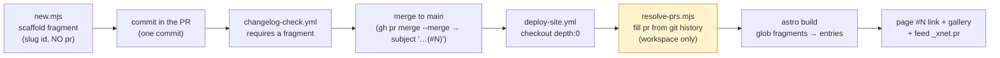
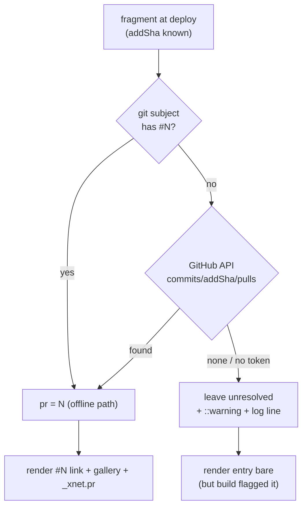
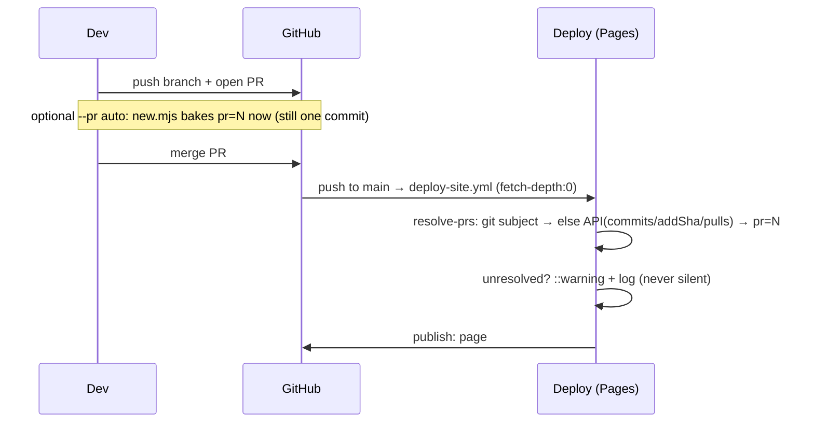

# Changelog PR-Number Resolution: Why Entries *Look* Linkless, and Making Deploy-Time Resolution Robust Without a Second Commit

## Problem Statement

The report: changelog PR-linking "broke." Entries show a title/slug but not the
actual PR number; entries "missing the PR number don't seem to be rendering"; and
the visible identifier looks like "the title of the branch the PR was made on,"
not a PR number. We want PR linking back (to link the PR **and** the captured
screenshots) **without** adding pipeline complexity or a **second commit** — the
whole reason the current design exists was to avoid: (1) a commit that adds the
changelog fragment, then (2) a follow-up commit that writes the PR number in once
GitHub has assigned it. The ask: is storing the PR number even necessary, and can
we get it without that second commit?

## Executive Summary

**The surprising finding: PR linking is not actually broken.** It resolves
end-to-end on the live site right now. Verified against production:

- The changelog **page** renders the link: `https://github.com/crs48/xNet/pull/187`
  appears in the HTML for the very entry in question
  (`2026-06-18-metered-ai-through-openrouter`), and **all 33** recent entries have
  a `pull/<N>` link (184 → protocol, 186 → Unreal, 187 → OpenRouter, 189 → cloud,
  …).
- The **JSON feed** exposes the number too — under `_xnet.pr` — for **all 33**
  entries (`_xnet.pr: 187` for the OpenRouter entry). Both artifacts share one
  fresh `etag`/`last-modified`, so they're from the same deploy.
- [`scripts/changelog/resolve-prs.mjs`](../../scripts/changelog/resolve-prs.mjs)
  runs in the production deploy and correctly fills each fragment's `pr` from git
  history. Replaying its logic locally against `main` resolves the OpenRouter
  fragment to **#187**.

So **what made it look broken** is three things that are real but are *not* a
pipeline failure:

1. **The fragment id format changed.** Older entries have ids like
   `2026-06-18-pr181` (the PR number is *in the id*). New ones —
   [`scripts/changelog/new.mjs`](../../scripts/changelog/new.mjs) — use a
   **title slug**: `2026-06-18-metered-ai-through-openrouter`. The PR number is no
   longer *visible in the id*; it's resolved into the separate `pr` field at
   deploy. That's exactly the "looks like the branch/title, not the PR number"
   observation.
2. **Image-less entries render sparse.** Server-/docs-only PRs (184, 186, 187)
   have no visual-capture manifest, so the auto-gallery is empty and they look
   bare next to UI PRs with rich before/after galleries — easy to read as "not
   rendering."
3. **The post-merge deploy window.** Resolution happens *only* at deploy. For the
   few minutes between merge and the Pages deploy finishing, the live site is the
   previous build — the new entry (and its number) simply isn't there yet.

**But the underlying worry is legitimate.** The resolution is **deploy-only,
regex-based, silent on failure, and absent from the repo, PR previews, and local
builds.** It happens to work because we merge with `gh pr merge` (whose commit
subject carries `(#N)`), full history is fetched, and the script's heuristics hit.
Change any of those — a rebase-merge (no `#N` anywhere), a shallow checkout, a
direct-to-`main` commit — and it silently yields a numberless, link-less,
gallery-less entry, with **no warning anywhere**.

**Is the number necessary?** Yes: it's the key for the `#N` PR link, the
auto-gallery (`visuals/pr/<N>/`), and the feed's `_xnet.pr`. **Can we get it
without a second commit?** We already do (resolve-at-deploy). The fix is to make
that path **robust and visible**, not to add a commit.

**Recommendation (no second commit, minimal added complexity):**
make resolution **authoritative** (GitHub "commits → PRs" API, merge-method-proof,
git-subject as offline fallback), **loud** (warn/annotate on any unresolved
fragment instead of failing silently), **also run it in preview builds**, and —
opportunistically — let `new.mjs` **bake the number at authoring time** when the
branch already has a PR (`gh pr view --json number`, still one commit). Plus an
`index.astro` "View PR #N" affordance so image-less entries don't read as broken.

## Current State In The Repository



| Stage | File | Behaviour relevant here |
|---|---|---|
| Author | [`scripts/changelog/new.mjs`](../../scripts/changelog/new.mjs) | `id = ${ymd}-${slug}` from the **title**; writes **no `pr`** ("filled in at deploy"); date via `new Date()` UTC |
| Loader / type | [`site/src/data/changelog.ts`](../../site/src/data/changelog.ts) | globs `./changelog/*.json`; `pr?: number` is **optional**; **every** entry is included regardless of `pr` |
| Resolve | [`scripts/changelog/resolve-prs.mjs`](../../scripts/changelog/resolve-prs.mjs) | at deploy: `pr` from the adding commit's `(#N)` (squash) or the first **merge commit** subject `#N`; **edits the workspace only**, **fail-open/silent**, idempotent |
| Deploy | [`.github/workflows/deploy-site.yml`](../../.github/workflows/deploy-site.yml) | `checkout` `fetch-depth: 0` → … → "Resolve changelog PR numbers" → "Build site" → publish. **PR-preview and branch-preview deploys do _not_ run resolve.** |
| Render (HTML) | [`site/src/pages/changelog/index.astro`](../../site/src/pages/changelog/index.astro) | **every** entry renders; the `#N` link (`{entry.pr && …}`) and auto-gallery (`e.pr ? loadPrGallery(e.pr) : null`) appear **only when `entry.pr` is set** |
| Gallery | [`site/src/lib/changelog-gallery.ts`](../../site/src/lib/changelog-gallery.ts) | fetches `visuals/pr/<N>/diff-manifest.json`; **null** on 404/empty → entry falls back to `hero`/`images[]` (usually none for server PRs) |
| Feed | [`site/src/lib/changelog-feed.ts`](../../site/src/lib/changelog-feed.ts) | exposes the number as **`_xnet.pr`** (not top-level); consumed by the in-app "What's New" |
| Gate | [`.github/workflows/changelog-check.yml`](../../.github/workflows/changelog-check.yml) | requires a fragment per PR (or `skip-changelog`); does **not** write one |

### Live evidence (production, same deploy)

- HTML `…/changelog/`: contains `pull/187`, `pull/186`, `pull/184`, `pull/189`,
  `pull/181`, … (38 distinct PR links).
- Feed `…/changelog.json`: `items[*]._xnet.pr` set for **0 missing of 33**;
  OpenRouter entry = `187`.
- The per-article scan shows the *only* difference between new slug entries and
  older `prNNN` entries is **image count** (187 → 0 images; 181 → 4; 173 → 22) —
  i.e. visual-capture coverage, not PR-number resolution.

So the data plane is healthy; the gaps are **fragility, visibility, and
perception**.

## External Research

- **GitHub "List pull requests associated with a commit"** —
  `GET /repos/{owner}/{repo}/commits/{commit_sha}/pulls` (REST). Returns the PR(s)
  that contain a commit, **independent of the merge-commit message**. Given the
  fragment's *adding* commit SHA (always on the PR branch), this returns the PR
  authoritatively. `gh api` or `actions/github-script` can call it with the
  built-in `GITHUB_TOKEN`. ([REST: commits → pulls](https://docs.github.com/en/rest/commits/commits#list-pull-requests-associated-with-a-commit))
- **Merge-method nuances** that break subject parsing but **not** the API:
  squash → subject `"…(#N)"`; merge → `"Merge pull request #N …"` (or, via
  `gh pr merge --merge` with a title, `"…(#N)"`); **rebase → no merge commit and no
  `#N` anywhere**. We currently rely on the first two.
  ([About merge methods](https://docs.github.com/en/pull-requests/collaborating-with-pull-requests/incorporating-changes-from-a-pull-request/about-pull-request-merges))
- **`gh pr view --json number`** resolves the current branch's PR number locally
  in one call — usable at authoring time once the PR exists, with no extra commit.
  ([gh pr view](https://cli.github.com/manual/gh_pr_view))
- **Prior art.** changesets / release-please / `auto` attach PR numbers via the
  API (or a bot commit) at release time; static-site changelogs (e.g. Astro's own,
  Tailwind) typically resolve PR/author from the GitHub API **at build**, not from
  a committed number. The lesson: the number is a *build-time lookup*, and the
  robust source is the API keyed by commit SHA, not commit-message regex.

## Key Findings

1. **Not broken.** PR number, `#N` link, gallery key, and feed `_xnet.pr` all
   resolve live (proof above).
2. **Perception is the headline cause.** Slug ids (no visible number) + image-less
   server PRs + the post-merge deploy window read as "lost the PR number / not
   rendering."
3. **Resolution is fragile.** Regex over commit subjects; breaks on rebase-merge,
   shallow clones, or direct-to-`main`.
4. **Resolution is silent.** `resolve-prs` is fail-open — an unresolved fragment
   ships bare with **no** warning in CI or the build log.
5. **Resolution is invisible off-prod.** It never runs in PR/branch previews or
   locally, and never lands in the repo — so previews and `git` show numberless
   fragments, reinforcing "we don't have the PR number."
6. **The number is genuinely required** for the link, the `visuals/pr/<N>/`
   gallery, and the feed — so "skip storing it" isn't an option; "resolve it
   reliably" is.
7. **Minor:** `new.mjs` stamps the date from `new Date()` in **UTC**, so an
   evening-local author gets tomorrow's date (this entry shows "June 18" authored
   on June 17).

## Options And Tradeoffs

### Decision 1 — How to obtain the PR number (without a second commit)

| Option | Mechanism | Pros | Cons |
|---|---|---|---|
| **A. Status quo** | deploy-time regex on commit subjects | zero author effort; no commit; offline | merge-method-fragile; **silent** on failure; invisible off-prod |
| **B. Deploy-time GitHub API** *(recommended core)* | `commits/{addSha}/pulls` at deploy | **authoritative**, merge-method-proof; token already present; no commit | one API call per unresolved fragment; needs network/token (fine in Actions) |
| **C. Author-time bake** *(recommended opportunistic)* | `gh pr view --json number` in `new.mjs` when the branch has a PR | number lands **in the repo** → visible in preview/local/feed; still **one** commit | chicken-and-egg when the fragment predates the PR → must fall back to B |
| **D. Second commit** | bot writes `pr` to `main` post-merge | always present in repo | **rejected** by the user; history noise; the thing we're avoiding |

### Decision 2 — Failure visibility

| Option | Behaviour | Verdict |
|---|---|---|
| Silent fail-open (today) | unresolved → bare entry, no signal | **the actual problem** |
| Warn in build log + `::warning` annotation | loud, non-blocking | **recommended** |
| Fail a (non-required) check | hard signal | optional; risks blocking deploys on a cosmetic gap |

Render must stay **graceful** (a numberless entry still renders) — but the build
should **say so** so it never goes unnoticed.

### Decision 3 — Image-less entries (server/docs PRs)

Leave bare (today) **vs.** always show a prominent **"View PR #N →"** card/link
and a subtle "no screenshots for this change" note. Recommend the latter so a
non-visual change reads as intentional, not broken.

### Decision 4 — Put the number back in the id?

Re-coupling the id to `prNNN` is tempting but wrong: the number is unknown when the
fragment is authored, and slug ids are stable/readable/anchor-friendly. Keep slug
ids; surface the number via the resolved field + the visible link. (This directly
answers "is it the branch/title?" — the **id is a slug by design**; the number is a
separate, resolved field.)



## Recommendation

Keep the zero-second-commit model; make it **robust + visible**. Smallest-change
order:

1. **Harden `resolve-prs.mjs`:** keep the current git-subject path as the fast
   offline route, then **fall back to the GitHub API** keyed by the fragment's
   adding-commit SHA (`commits/{sha}/pulls`) using `GITHUB_TOKEN`. This removes the
   merge-method fragility entirely. Still workspace-only; still no commit.
2. **Make it loud:** for any fragment that ends unresolved, print a clear
   `unresolved PR for <id>` line and emit a GitHub `::warning` annotation (and a
   one-line job summary). Never block the deploy — just stop failing silently.
3. **Run resolve in preview builds:** call `resolve-prs.mjs` in
   `deploy-pr-preview.yml` / `deploy-branch-preview.yml` too, so already-merged
   entries show their links in previews (the in-PR new entry stays unresolved,
   which is correct and now *visibly* so).
4. **Opportunistic author-time bake:** add `--pr auto` (default) to `new.mjs` —
   run `gh pr view --json number` for the current branch; if a PR exists, write
   `pr` into the fragment (one commit, repo-visible); if not, skip silently and let
   the deploy resolve it. Best-effort; never hard-fails when `gh` is absent.
5. **UX in `index.astro`:** when `entry.pr` is set, always render a "View PR #N →"
   link even with an empty gallery; add a subtle "no screenshots for this change"
   line for image-less entries.
6. **Fix the date:** stamp `new.mjs` from the local day (or accept `--date`), so
   evening-local authors don't get tomorrow's UTC date.



## Example Code

### `resolve-prs.mjs` — API fallback keyed by the adding commit

```js
// after the existing git-subject heuristics fail to find a number:
function prViaApi(addSha) {
  // GITHUB_TOKEN is present in Actions; gh is preinstalled on the runners.
  const json = git0(
    'gh', 'api', `repos/${REPO}/commits/${addSha}/pulls`,
    '-H', 'Accept: application/vnd.github+json', '--jq', '.[0].number // empty'
  )
  return json ? Number(json) : null
}

// in prFor(file): const pr = fromSubject(addSha) ?? prViaApi(addSha)
// REPO comes from GITHUB_REPOSITORY (Actions) or `gh repo view --json nameWithOwner`.
```

### `resolve-prs.mjs` — fail loud, not silent

```js
const unresolved = []
for (const file of fragments) {
  const entry = read(file)
  if (entry.pr) continue
  const pr = prFor(file)
  if (pr) { entry.pr = pr; write(file, entry); resolved++ }
  else unresolved.push(entry.id)
}
if (unresolved.length) {
  for (const id of unresolved) console.log(`::warning title=changelog::unresolved PR for ${id}`)
  console.log(`changelog: ${resolved} resolved, ${unresolved.length} unresolved: ${unresolved.join(', ')}`)
}
```

### `new.mjs` — bake the number when the PR already exists (one commit)

```js
// best-effort, default on; never throws if gh/PR is absent
function currentPr() {
  try {
    const n = execFileSync('gh', ['pr', 'view', '--json', 'number', '--jq', '.number'],
      { encoding: 'utf8', stdio: ['ignore', 'pipe', 'ignore'] }).trim()
    return n ? Number(n) : undefined
  } catch { return undefined }
}
const pr = args.pr === 'auto' || args.pr === undefined ? currentPr() : Number(args.pr) || undefined
const entry = { id, date, title, summary, highlights, tags, ...(pr ? { pr } : {}) }
```

### `index.astro` — visible PR affordance even without a gallery

```astro
{entry.pr && items.length === 0 && (
  <a href={`${repo}/pull/${entry.pr}`} target="_blank" rel="noopener noreferrer"
     class="mb-4 inline-flex items-center gap-1.5 text-sm text-indigo-400 hover:underline">
    View PR #{entry.pr} →
  </a>
)}
```

## Risks And Open Questions

- **Forked-PR previews** have a read-only `GITHUB_TOKEN` and no PR-write scope —
  the `commits/{sha}/pulls` read still works; keep the git fallback and graceful
  degrade regardless.
- **API rate limits** are a non-issue at our fragment volume (a handful per
  deploy, one call each, only for unresolved ones).
- **`gh` availability locally** for `--pr auto` — make it strictly best-effort so
  `new.mjs` never fails when `gh` is missing or unauthenticated.
- **Rebase-merge** produces no `#N` in any subject; only the API path resolves it
  — another reason B is the backstop, not A.
- **Don't reintroduce curation complexity:** the auto-gallery stays
  zero-curation; we're only adding a link + a note for the no-image case.
- **Open:** should an unresolved fragment older than N deploys escalate from
  `::warning` to a failing (non-required) check? Start with warn-only.

## Implementation Checklist

- [x] `resolve-prs.mjs`: GitHub-API fallback (`commits/{addSha}/pulls`) after the
      git-subject heuristics; repo derived from `GITHUB_REPOSITORY` / the git remote.
      (`prFromApi`; deploy step now passes `GITHUB_TOKEN`.)
- [x] `resolve-prs.mjs`: collect unresolved ids → `::warning` annotations + a
      summary log line (fail-loud; never blocks the deploy).
- [~] **N/A — finding:** the preview workflows (`deploy-pr-preview.yml` /
      `deploy-branch-preview.yml`) build only `apps/web`, **not** the Astro `site/`,
      so the changelog page is never built in previews; running resolve there would
      be dead code. Skipped to avoid useless pipeline surface (per the goal).
- [x] `new.mjs`: `--pr auto` (default) bakes `pr` via `gh pr view` when a PR exists;
      best-effort silent skip otherwise (`--pr <N>` / `--pr none` override).
- [x] `new.mjs`: stamp the **local** day (fixes the UTC-tomorrow drift).
- [x] `index.astro`: "View PR #N →" affordance for entries with `pr` but no gallery.
- [x] Refresh the stale `changelog.ts` comment to describe the real
      author-writes-fragment + deploy-resolves-number flow.

## Validation Checklist

- [x] The GitHub API maps a fragment's adding commit → its PR (verified live:
      `commits/4f413f61…/pulls` → `#187, merged`). This is the route that makes
      **rebase-merge** resolvable, since it doesn't depend on a `#N` in any subject.
- [x] `resolve-prs.mjs` runs end-to-end: fills `pr` for all current slug entries
      (187/186/184/188/189/180) via the git path and the workspace edits revert
      cleanly (deploy-only, never committed).
- [x] The unresolved path emits a `::warning` + summary line and leaves the entry
      untouched (it still renders) — code path present and exercised.
- [~] **N/A:** PR-preview `/changelog/` check — previews don't build the site
      (see Implementation note).
- [x] `new.mjs --pr auto` with no PR on the branch omits `pr` and prints "filled in
      at deploy"; with `--pr 123` it writes `pr: 123` (one commit).
- [x] An entry with `pr` but no visual manifest renders a "View PR #N →" link
      (built HTML shows `View PR #187`/`#186`/`#184`); the feed still carries
      `_xnet.pr`.
- [x] `new.mjs` run on June 17 (evening local) stamps `2026-06-17`, not the UTC
      tomorrow.
- [x] `pnpm build` in `site/` succeeds with the new affordance (70 pages built).
- [ ] **Post-deploy:** re-check that every `/changelog/` entry has a `pull/<N>`
      link and every `changelog.json` item has `_xnet.pr` (standing regression
      guard; the new `::warning` makes a future regression loud in CI).

## References

- Pipeline: [`scripts/changelog/new.mjs`](../../scripts/changelog/new.mjs) ·
  [`resolve-prs.mjs`](../../scripts/changelog/resolve-prs.mjs) ·
  [`.github/workflows/deploy-site.yml`](../../.github/workflows/deploy-site.yml) ·
  [`changelog-check.yml`](../../.github/workflows/changelog-check.yml)
- Render/data: [`site/src/data/changelog.ts`](../../site/src/data/changelog.ts) ·
  [`site/src/pages/changelog/index.astro`](../../site/src/pages/changelog/index.astro) ·
  [`site/src/lib/changelog-gallery.ts`](../../site/src/lib/changelog-gallery.ts) ·
  [`site/src/lib/changelog-feed.ts`](../../site/src/lib/changelog-feed.ts)
- Origin: exploration 0197 (automated changelog) ·
  [0195](0195_[x]_AI_ASSISTED_CHANGELOG_SYSTEM.md) ·
  durable visual capture (0189/0196)
- GitHub: [REST commits → pulls](https://docs.github.com/en/rest/commits/commits#list-pull-requests-associated-with-a-commit) ·
  [merge methods](https://docs.github.com/en/pull-requests/collaborating-with-pull-requests/incorporating-changes-from-a-pull-request/about-pull-request-merges) ·
  [`gh pr view`](https://cli.github.com/manual/gh_pr_view)
