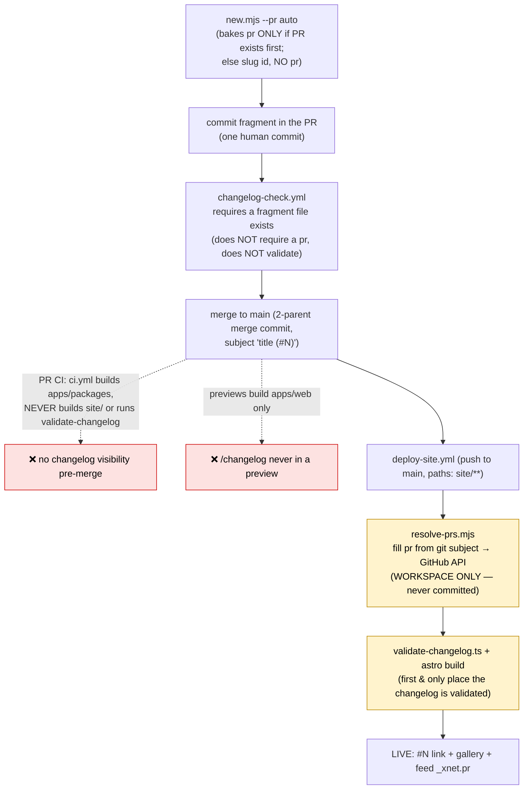
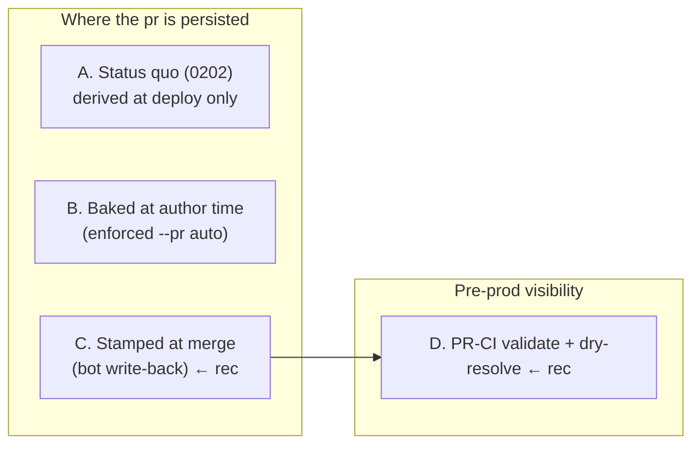
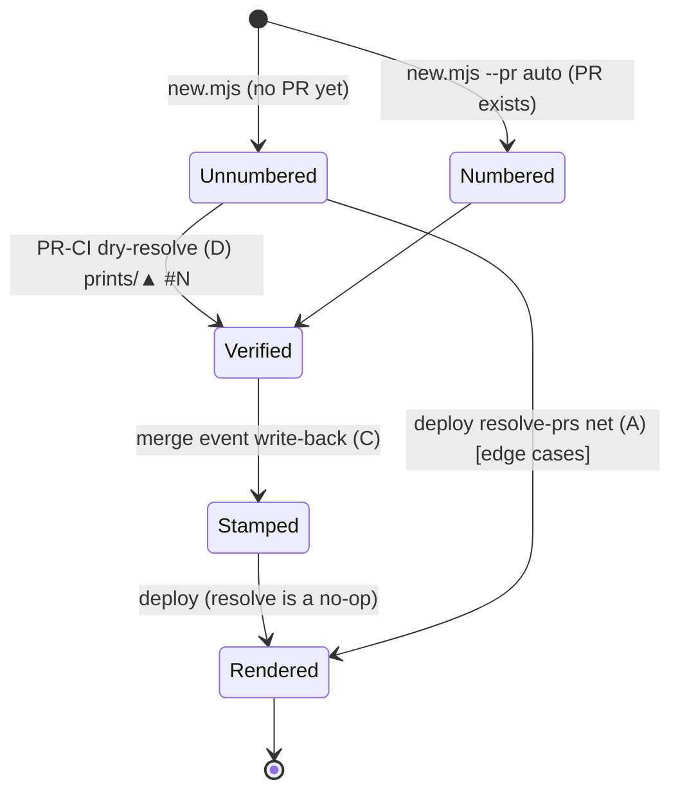

# Changelog PR Numbers as Source of Truth: Stamp at Merge, Verify in CI, Stop *Looking* Broken

## Problem Statement

The recurring report: "the changelog doesn't seem to be working anymore."
Concretely, in the repo you see recent fragment files like
`2026-06-18-plugins-marketplace-live-on-the-web.json` and
`2026-06-17-cloud-staging-and-status-page.json` — kebab-case names that "look
like the branch the PR was made on," with **no PR number inside the file**. The
fear is that these entries don't render, and the wish is twofold:

1. Get the PR number *into the changelog* **without a second commit** (the old,
   hated flow was: commit the fragment, then a follow-up commit once GitHub
   assigns the PR number).
2. If a second commit really is unavoidable, **make it a hard requirement** —
   because "it was really nice when the changelog just worked."

This is the **direct successor to exploration 0202**
([`0202_[_]_CHANGELOG_PR_NUMBER_RESOLUTION_ROBUSTNESS.md`](0202_[_]_CHANGELOG_PR_NUMBER_RESOLUTION_ROBUSTNESS.md)),
which proved the data plane is *not* broken and hardened the deploy-time
resolver. 0203 attacks the part 0202 **deliberately left deferred**: the PR
number never lands in committed source, and nothing validates or resolves the
changelog **before production** — so it keeps *seeming* broken even though it
isn't.

## Executive Summary

**Ground truth, verified live today (2026-06-18):** the changelog works.
`https://xnet.fyi/changelog.json` returns **35 entries and every one has a
resolved PR number**, including the exact slug entries that look numberless in
the repo:

| Fragment id (no `pr` in source) | Live `_xnet.pr` |
|---|---|
| `2026-06-18-plugins-marketplace-live-on-the-web` | **188** |
| `2026-06-18-metered-ai-through-openrouter` | **187** |
| `2026-06-18-bring-unreal-engine-game-data-into-xnet` | **186** |
| `2026-06-17-cloud-staging-and-status-page` | **189** |
| `2026-06-18-quicker-before-after-comparisons` | **180** |
| `2026-06-18-xnet-is-now-an-open-re-implementable-pro` | **184** |

The render path **never drops an entry for a missing `pr`** — every entry is
rendered regardless ([`site/src/pages/changelog/index.astro`](../../site/src/pages/changelog/index.astro)).
A missing `pr` only suppresses the `#N` link and the screenshot gallery. So
"they're not getting rendered" is, against production, **not true** — the entries
are there; the backend/docs ones just render *sparse* (no screenshots), which
reads as broken.

**So why does it keep looking broken?** Because the PR number is a **deploy-time
side-channel**, not a property of the artifact you can see:

- **It's absent from committed source.** Right now **8 of 34** fragments on
  `main` have *no* `pr` field; the number is injected by
  [`scripts/changelog/resolve-prs.mjs`](../../scripts/changelog/resolve-prs.mjs)
  at deploy and **never written back**. Browse the repo and a quarter of recent
  entries look numberless and "branch-named."
- **It's invisible before production.** PR previews build **only `apps/web`, not
  `site/`** ([`deploy-pr-preview.yml`](../../.github/workflows/deploy-pr-preview.yml)),
  and CI ([`ci.yml`](../../.github/workflows/ci.yml)) never builds the site or runs
  the changelog validator. Resolution and validation happen **only** inside
  [`deploy-site.yml`](../../.github/workflows/deploy-site.yml). You cannot see a
  changelog entry render — numbered or not — until it is already live.
- **It self-heals only at deploy, silently on failure.** 0202 made the resolver
  *loud* (a `::warning`) and *authoritative* (GitHub commits→pulls API). But a
  warning on a non-required deploy job is easy to miss, and the failure modes
  (direct-to-`main` commit, shallow clone, API rate-limit with no token) still
  produce a numberless live entry that nobody verified.

**The fix is to make the PR number a first-class, visible, verified property of
the fragment — not to add a human commit.** The cleanest way: stamp it
**automatically at merge** from the GitHub merge event (where the PR number is
literally in the payload — no heuristics), committing it back to `main` with a
bot commit. The human commits once; the *machine* does the "second commit." Pair
that with a **PR-CI dry-run** that validates the fragment and previews its
resolved number, so an entry can never silently look broken again. Keep
`resolve-prs.mjs` as a belt-and-suspenders net for non-PR commits.

If you'd rather no bot ever touches `main`, the alternative — "make it a
requirement" — is to **enforce a baked `pr` at author time** (`new.mjs --pr auto`
already does this when the PR exists first) via the changelog gate. That trades
zero-friction authoring for a source-only source of truth.

## Current State In The Repository



The number lives in the yellow boxes — *deploy only* — and validation lives there
too. Everything left of the deploy is blind to it.

| Stage | File | Behaviour relevant here |
|---|---|---|
| Author | [`scripts/changelog/new.mjs`](../../scripts/changelog/new.mjs) | `id = ${ymd}-${slug}` from the **title**. `--pr auto` (default) bakes `pr` via `gh pr view` **iff a PR already exists on the branch**; otherwise omits it (0202). |
| Loader / type | [`site/src/data/changelog.ts`](../../site/src/data/changelog.ts) | globs `./changelog/*.json`; `pr?: number` is **optional**; sorts newest-first by id; **includes every entry regardless of `pr`**. |
| Resolve | [`scripts/changelog/resolve-prs.mjs`](../../scripts/changelog/resolve-prs.mjs) | At deploy: `pr` from the adding commit `(#N)` → first merge subject `#N` → **GitHub `commits/{sha}/pulls` API** (0202). **Edits the workspace only; never commits back.** Fail-loud (`::warning`) but non-blocking. |
| Validate | [`site/scripts/validate-changelog.ts`](../../site/scripts/validate-changelog.ts) | Runs inside `site`'s `pnpm build` (deploy only). Fails the build on bad id/date/dupe/missing field. **Never runs in PR CI.** Accepts a missing `pr` (it's optional). |
| Deploy | [`.github/workflows/deploy-site.yml`](../../.github/workflows/deploy-site.yml) | `push` to `main` on `site/**` etc., `fetch-depth: 0`, runs resolve → build → publish to `gh-pages`. |
| PR preview | [`.github/workflows/deploy-pr-preview.yml`](../../.github/workflows/deploy-pr-preview.yml) | Builds **`apps/web` only** — the `/changelog` page is never in a PR preview. |
| Gate | [`.github/workflows/changelog-check.yml`](../../.github/workflows/changelog-check.yml) | Required check `changelog-section`: requires a `site/src/data/changelog/*.json` file **exists** in the PR (or `skip-changelog`). Does not validate it or require a `pr`. |
| Render (HTML) | [`site/src/pages/changelog/index.astro`](../../site/src/pages/changelog/index.astro) | Every entry renders. `#N` link + `loadPrGallery(e.pr)` + "View PR #N →" affordance appear **only when `entry.pr` is set**. The gallery fetch (`await Promise.all(...)`) has **no timeout**. |
| Feed | [`site/src/lib/changelog-feed.ts`](../../site/src/lib/changelog-feed.ts) | Exposes the number as **`_xnet.pr`** (nested, not top-level). |
| In-app | [`apps/web/src/whats-new/feed.ts`](../../apps/web/src/whats-new/feed.ts) | Correctly reads `_xnet.pr`; renders **all** items (does not filter on `pr`, and `EntryCard` does not even display the PR link). |

### The two facts that produce the whole illusion

1. **8 of 34 committed fragments have no `pr` in source** — all resolve live:
   `cloud-staging-and-status-page`, `bring-unreal-engine-game-data-into-xnet`,
   `metered-ai-through-openrouter`, `plugins-marketplace-live-on-the-web`,
   `quicker-before-after-comparisons`, `xnet-is-now-an-open-re-implementable-pro`
   (+ older slugged ones). The repo view and the production view disagree.
2. **The id format changed** (0202): old `2026-06-18-pr181` carried the number
   *in the id*; new `2026-06-18-<title-slug>` does not. The number didn't
   disappear — it moved into a field that only deploy fills.

## External Research

- **GitHub merge event is authoritative — no heuristics needed.** A
  `pull_request` workflow with `types: [closed]` and a
  `if: github.event.pull_request.merged == true` guard receives the exact PR
  number at `github.event.pull_request.number`, plus the merge SHA and changed
  files. There is *nothing to resolve* — the number is in the payload. This is
  strictly more reliable than `resolve-prs.mjs`'s commit-subject/API archaeology.
  ([Events that trigger workflows: `pull_request`](https://docs.github.com/en/actions/using-workflows/events-that-trigger-workflows#pull_request))
- **Commits→PRs API** (already used by 0202 as a fallback):
  `GET /repos/{owner}/{repo}/commits/{sha}/pulls` maps a commit to its PR
  regardless of merge method. Useful for the direct-push net and for a PR-CI
  dry-run keyed on the PR head SHA.
  ([REST: list PRs associated with a commit](https://docs.github.com/en/rest/commits/commits#list-pull-requests-associated-with-a-commit))
- **Bot commits back to a protected `main`** are a solved pattern:
  - `stefanzweifel/git-auto-commit-action` and `peter-evans/create-pull-request`
    are the canonical Actions for "modify a file in CI and push."
  - Add `[skip ci]`/`[skip actions]` to the commit subject to avoid re-triggering
    unrelated workflows. ([Skipping workflow runs](https://docs.github.com/en/actions/managing-workflow-runs/skipping-workflow-runs))
  - Pushing to a ruleset-protected branch needs a bypass actor: a GitHub App
    token (`actions/create-github-app-token`) or a PAT listed in the ruleset
    bypass list. The default `GITHUB_TOKEN` is blocked by branch protection
    unless the ruleset grants it bypass. (This repo already relies on admin
    bypass for merges — see the project memory.)
- **Source-of-truth vs derived data** — the relevant design principle. Changesets
  (`@changesets/cli`, already in this repo's lockfile for package CHANGELOGs)
  treats the changeset file as the durable artifact and *materializes* it on
  release. The lesson: derive *display* if you want, but if a value is the key to
  links, galleries, and feeds (the PR number is), it should be **persisted into
  the artifact**, not recomputed by an unobservable step at publish time.
- **SSG build robustness** — Astro/Vite SSG `fetch` at build time has **no
  default timeout** (Node `fetch`/undici). A hung host stalls the page module and
  the whole deploy until the job's wall-clock limit. `AbortSignal.timeout(ms)` is
  the standard guard. Relevant to `loadPrGallery`'s un-timed `Promise.all`.

## Key Findings

1. **It isn't broken; it's invisible.** Production resolves 35/35. The pain is
   that the number is absent from source, absent from PR CI, absent from
   previews, and only appears post-deploy — so every glance at the repo or a
   preview suggests breakage.
2. **0202 hardened the resolver; it did not move the source of truth.** The
   number is still derived at deploy and discarded from the repo. 0202's own
   checklist lists the preview-render check as **N/A** ("previews don't build the
   site") and leaves the post-deploy re-check **unchecked**. Those gaps are 0203.
3. **The merge event makes resolution trivial and exact.** We are doing commit
   archaeology to recover a number GitHub hands us for free in the merge webhook.
4. **The required gate is shallow.** `changelog-section` only checks a file
   *exists*. A malformed fragment (bad id, dup, missing field) sails through PR
   CI and **fails the production deploy** — which freezes the *entire* changelog
   at the last good build. That is a far worse "changelog stopped working" than a
   single bare entry, and it can only happen because validation is deploy-only.
5. **The human already never needs a second commit.** Both the status quo
   (deploy resolve) and the recommended write-back keep authoring to one commit.
   "Without a second commit" is already true; the question is only *where the
   number is persisted* and *whether you can see it before prod*.
6. **A latent deploy-hang exists.** `loadPrGallery` fetches each PR's manifest at
   build with no timeout; a slow/hung `xnet.fyi` would stall the deploy.

## Options And Tradeoffs



| Option | Number persisted where | Human commits | Pre-prod visible? | Reliability | Cost / risk |
|---|---|---|---|---|---|
| **A. Status quo (0202)** | nowhere (deploy-derived) | 1 | No | High in prod, silent on edge-case failure | None (already shipped) |
| **B. Enforce baked `pr` at author time** | committed source | 1 (PR-first order) | **Yes (in the diff)** | High, but author can forget / reorder | Chicken-and-egg: PR must exist before fragment; gate friction |
| **C. Stamp at merge (bot write-back)** | committed source (bot commit) | 1 (bot does #2) | After merge, in source | **Highest** (number from payload) | Bot push to protected `main`; loop/race guards |
| **D. PR-CI validate + dry-resolve** | n/a (visibility only) | — | **Yes (CI annotation)** | Catches malformed/unresolvable pre-merge | Small workflow; one API call |
| **E. Drop the field; encode `pr` in id again** | id (`-prN`) | 1 (PR-first) | Yes | High | Regresses 0196's title-slug ids; same chicken-and-egg as B |

### Reading the options against the ask

- **"Without a second commit"** → A, C, and D all satisfy it (human commits once).
  C additionally makes the number show up in source.
- **"Make it a requirement if needed"** → B (or E) is that path: enforce a `pr`
  in the gate. It's the simplest mental model ("the file always has its number")
  at the cost of author workflow friction and a real chicken-and-egg.
- **Best reliability + visibility with zero added author friction** → **C + D**.

## Recommendation

Adopt **C + D**, keep **A** as a fallback, and do the **small hardening**:

1. **C — Stamp the PR number at merge (primary).** Add a tiny workflow that fires
   on `pull_request: [closed]`, guarded by `merged == true`. It reads
   `pull_request.number`, finds the changelog fragment(s) the PR
   added/modified, writes `"pr": <number>` into any that lack it, and commits the
   result to `main` with a bot identity and `[skip ci]`-style subject. The number
   comes straight from the event payload — **no resolution heuristics, exact every
   time.** The human still writes one fragment commit; the machine performs the
   "second commit." Net effect: **the repo source becomes the source of truth**,
   and the deploy stops depending on an invisible step.

2. **D — Make the changelog visible in PR CI (primary).** Add a fast PR job
   (no full site build) that (a) runs `validate-changelog.ts` against the PR's
   fragments and (b) runs `resolve-prs.mjs --check` (a new dry-run mode) keyed on
   the PR head SHA via the commits→pulls API, printing the number the entry *will*
   get — or annotating if it won't resolve. Now a malformed or unresolvable entry
   **fails the PR, not the production deploy**, and the author sees the resolved
   number before merge.

3. **A — Keep `resolve-prs.mjs` as the net.** Once C exists, most fragments arrive
   at deploy already numbered; `resolve-prs` only has to handle direct-to-`main`
   commits and any fragment the merge step missed. Leave its fail-loud behaviour.

4. **Hardening — bound the build-time gallery fetch.** Give `loadPrGallery` an
   `AbortSignal.timeout(~5s)` so a slow `xnet.fyi` can never hang the deploy.

5. **Optional enforcement (only if you want "it's a requirement").** After C is
   live and proven, tighten `changelog-check` to assert the fragment will be
   numbered (baked, or resolvable via the dry-run). Skip this initially —
   C + D already make numberless entries effectively impossible to ship unnoticed.

Why C over B: B forces a PR-before-fragment ordering that fights the natural "write
the change and its note together" flow, and a forgotten `--pr` becomes a hard CI
failure. C keeps authoring frictionless *and* lands the number in source. Why also
D: even with C, the only place the changelog is currently validated is the
production deploy; D moves that left so a bad fragment can't freeze the live page.

```mermaid
sequenceDiagram
    autonumber
    participant Dev as Author
    participant PR as Pull Request
    participant CI as PR CI (D: validate + dry-resolve)
    participant Merge as Merge to main
    participant Bot as stamp-pr-number.yml (C)
    participant Deploy as deploy-site.yml (A: net)
    participant Live as xnet.fyi/changelog

    Dev->>PR: one commit: fragment (slug id, maybe no pr)
    PR->>CI: validate-changelog + resolve-prs --check (head SHA)
    CI-->>PR: ✓ "will link #N" (or ✗ malformed/unresolvable)
    PR->>Merge: merge (2-parent commit "title (#N)")
    Merge->>Bot: pull_request.closed & merged==true
    Bot->>Bot: write "pr": number into the PR's fragment(s)
    Bot->>Merge: commit to main "[skip ci] changelog: link #N"
    Merge->>Deploy: push (site/**) triggers deploy
    Deploy->>Deploy: resolve-prs (no-op; already numbered) → validate → build
    Deploy->>Live: entry renders with #N link + gallery + feed _xnet.pr
```

A fragment's `pr` over its lifetime:



## Example Code

### C — `stamp-pr-number.yml` (merge-event write-back)

```yaml
name: Stamp Changelog PR Number
on:
  pull_request:
    types: [closed]

permissions:
  contents: write

# Never run two write-backs to main at once.
concurrency:
  group: stamp-pr-${{ github.event.pull_request.number }}
  cancel-in-progress: false

jobs:
  stamp:
    if: github.event.pull_request.merged == true
    runs-on: ubuntu-latest
    steps:
      - uses: actions/checkout@v4
        with:
          ref: main
          fetch-depth: 0
          # A bypass token (GitHub App or PAT) if the ruleset blocks GITHUB_TOKEN.
          token: ${{ secrets.CHANGELOG_BOT_TOKEN || github.token }}

      - name: Write the PR number into this PR's changelog fragment(s)
        uses: actions/github-script@v7
        with:
          script: |
            const fs = require('node:fs')
            const path = require('node:path')
            const pr = context.payload.pull_request.number
            const files = await github.paginate(github.rest.pulls.listFiles, {
              owner: context.repo.owner, repo: context.repo.repo, pull_number: pr
            })
            const frags = files
              .filter(f => /^site\/src\/data\/changelog\/.+\.json$/.test(f.filename) && f.status !== 'removed')
              .map(f => f.filename)
            let changed = 0
            for (const file of frags) {
              if (!fs.existsSync(file)) continue           // file may have been renamed/removed post-merge
              const entry = JSON.parse(fs.readFileSync(file, 'utf8'))
              if (entry.pr) continue                        // already baked (--pr auto) — leave it
              entry.pr = pr
              fs.writeFileSync(file, JSON.stringify(entry, null, 2) + '\n')
              changed++
              core.notice(`Stamped ${path.basename(file)} → PR #${pr}`)
            }
            core.setOutput('changed', String(changed))

      - name: Commit back to main
        if: steps.*.outputs.changed != '0'   # pseudocode: gate on the script's output
        run: |
          git config user.name 'xnet-changelog-bot'
          git config user.email 'bot@xnet.fyi'
          git add site/src/data/changelog
          git commit -m "docs(changelog): link PR #${{ github.event.pull_request.number }} [skip ci]" || exit 0
          git push origin main
```

Notes: the `[skip ci]` keeps unrelated workflows quiet, but the push still
matches `deploy-site.yml`'s `paths: site/**`, so the production deploy runs and
publishes the freshly-numbered entry. `resolve-prs.mjs` then no-ops on it.

### D — PR-CI dry-resolve (add `--check` to `resolve-prs.mjs`)

```js
// resolve-prs.mjs — add a non-writing mode for PR CI.
const CHECK = process.argv.includes('--check')           // dry run: resolve, don't write
// ...inside the loop, when CHECK is set:
//   - resolve via prFromApi(headSha) using GITHUB_TOKEN
//   - print "would link <id> → #N" or emit ::error for an unresolved fragment
//   - in CHECK mode, exit non-zero if any *changed-in-this-PR* fragment is unresolvable
```

```yaml
# ci.yml — fast changelog job (no site build), runs on PRs that touch fragments.
changelog-dry:
  runs-on: ubuntu-latest
  steps:
    - uses: actions/checkout@v4
      with: { fetch-depth: 0 }
    - uses: ./.github/actions/setup
    - run: pnpm --filter ./site exec tsx scripts/validate-changelog.ts
    - run: node scripts/changelog/resolve-prs.mjs --check
      env: { GITHUB_TOKEN: ${{ github.token }} }
```

### Hardening — timeout the gallery fetch

```ts
// site/src/lib/changelog-gallery.ts — bound the build-time fetch.
const res = await fetch(`${base}/diff-manifest.json`, { signal: AbortSignal.timeout(5000) })
```

## Risks And Open Questions

- **Bot push to a protected `main`.** Branch-protection/rulesets may block both
  `GITHUB_TOKEN` and the bot. Resolve by adding a GitHub App (or PAT) to the
  ruleset bypass list, mirroring the existing admin-merge bypass. *Open question:*
  is a dedicated `CHANGELOG_BOT_TOKEN` acceptable, or do we keep relying on
  deploy-time resolution (Option A) and only add D?
- **Deploy retrigger / loop.** The write-back commit triggers `deploy-site`
  (intended). It must **not** re-enter `stamp-pr-number.yml` — it can't, since the
  workflow is `pull_request: closed`, not `push`. `[skip ci]` covers anything
  push-triggered.
- **Race with concurrent merges.** Two PRs merging near-simultaneously each push
  to `main`; the `concurrency` group is per-PR, so they don't collide on the same
  file, but the second push may need a rebase. Use `git pull --rebase` before
  `push`, or accept the occasional retry. *Open question:* is a merge-queue
  already in play that serializes this?
- **Renamed/edited fragment post-merge.** If the fragment path changed during
  review, `listFiles` still reports the final path; the `existsSync` guard skips
  anything that isn't on `main`.
- **Do we even need the bot if D + A suffice?** D makes numberless entries
  visible pre-merge and A fills them at deploy. C's *only* added value is making
  the repo source match production. If "the file in the repo shows its number" is
  not actually a requirement, **D + hardening alone** may be the right, smaller
  scope. This is the main scoping decision.
- **`changelog-section` shallowness.** Even without C, folding
  `validate-changelog` into the required gate (via D) closes the
  "malformed fragment freezes the whole changelog at deploy" hole — arguably the
  highest-severity latent failure here.

## Implementation Checklist

- [ ] Add `--check` (dry-run, non-writing) mode to
      [`scripts/changelog/resolve-prs.mjs`](../../scripts/changelog/resolve-prs.mjs):
      resolve via the head SHA, print the would-be number, exit non-zero on an
      unresolvable *changed* fragment.
- [ ] Add a fast `changelog-dry` PR job to [`ci.yml`](../../.github/workflows/ci.yml)
      (or `changelog-check.yml`) that runs `validate-changelog.ts` + `resolve-prs --check`
      — no full site build. (D)
- [ ] Add [`.github/workflows/stamp-pr-number.yml`](../../.github/workflows/stamp-pr-number.yml):
      on `pull_request: closed` + `merged == true`, write `pr` into the PR's
      fragment(s) and commit to `main` with `[skip ci]`. (C)
- [ ] Provision a bypass token (GitHub App via `actions/create-github-app-token`,
      or PAT) and add it to the `main` ruleset bypass list; wire `CHANGELOG_BOT_TOKEN`.
- [ ] Bound the build-time fetch in
      [`site/src/lib/changelog-gallery.ts`](../../site/src/lib/changelog-gallery.ts)
      with `AbortSignal.timeout(5000)`.
- [ ] Update the header comments in `changelog.ts` / `resolve-prs.mjs` to describe
      the new "stamped at merge, deploy-resolve is the net" flow.
- [ ] (Optional, only if "make it a requirement") tighten `changelog-section` to
      require a baked-or-resolvable `pr`.
- [ ] Add a changelog fragment for this change (dogfood the new flow) and a
      `skip-changelog`-free PR.

## Validation Checklist

- [ ] On a test PR with a numberless fragment, `changelog-dry` prints
      "will link #N" and is green.
- [ ] On a PR with a deliberately malformed fragment (bad id / missing title),
      `changelog-dry` **fails the PR** (no longer only at deploy).
- [ ] After merging that test PR, `stamp-pr-number.yml` commits
      `"pr": <N>` into the fragment on `main` within ~1 min, with a `[skip ci]`
      subject, and does not loop.
- [ ] The write-back commit triggers exactly one `deploy-site` run; the published
      entry shows the `#N` link and the feed exposes `_xnet.pr`.
- [ ] `git show main:site/src/data/changelog/<id>.json` now contains `"pr"` —
      i.e. **source matches production** (the original complaint is gone).
- [ ] `resolve-prs.mjs` at deploy reports the already-stamped entry as a no-op
      (filled 0), and still resolves any direct-push fragment.
- [ ] A simulated slow `diff-manifest.json` fetch aborts at 5s; the deploy
      completes instead of hanging.
- [ ] Concurrent merges of two changelog PRs both land their numbers without a
      lost update.

## References

- Predecessor: [`0202_[_]_CHANGELOG_PR_NUMBER_RESOLUTION_ROBUSTNESS.md`](0202_[_]_CHANGELOG_PR_NUMBER_RESOLUTION_ROBUSTNESS.md)
- Lineage: [`0197_[x]_AUTOMATED_CHANGELOG_ON_MERGE.md`](0197_[x]_AUTOMATED_CHANGELOG_ON_MERGE.md),
  [`0196_[x]_IMAGE_RICH_INTERACTIVE_CHANGELOG_PAGE.md`](0196_[x]_IMAGE_RICH_INTERACTIVE_CHANGELOG_PAGE.md),
  [`0195_[x]_AI_ASSISTED_CHANGELOG_SYSTEM.md`](0195_[x]_AI_ASSISTED_CHANGELOG_SYSTEM.md)
- Code: [`scripts/changelog/resolve-prs.mjs`](../../scripts/changelog/resolve-prs.mjs),
  [`scripts/changelog/new.mjs`](../../scripts/changelog/new.mjs),
  [`site/src/data/changelog.ts`](../../site/src/data/changelog.ts),
  [`site/scripts/validate-changelog.ts`](../../site/scripts/validate-changelog.ts),
  [`site/src/lib/changelog-gallery.ts`](../../site/src/lib/changelog-gallery.ts),
  [`site/src/pages/changelog/index.astro`](../../site/src/pages/changelog/index.astro),
  [`apps/web/src/whats-new/feed.ts`](../../apps/web/src/whats-new/feed.ts)
- Workflows: [`deploy-site.yml`](../../.github/workflows/deploy-site.yml),
  [`deploy-pr-preview.yml`](../../.github/workflows/deploy-pr-preview.yml),
  [`changelog-check.yml`](../../.github/workflows/changelog-check.yml),
  [`ci.yml`](../../.github/workflows/ci.yml)
- GitHub docs: [`pull_request` events](https://docs.github.com/en/actions/using-workflows/events-that-trigger-workflows#pull_request),
  [list PRs associated with a commit](https://docs.github.com/en/rest/commits/commits#list-pull-requests-associated-with-a-commit),
  [skipping workflow runs](https://docs.github.com/en/actions/managing-workflow-runs/skipping-workflow-runs)
- Actions: `stefanzweifel/git-auto-commit-action`, `peter-evans/create-pull-request`,
  `actions/create-github-app-token`
