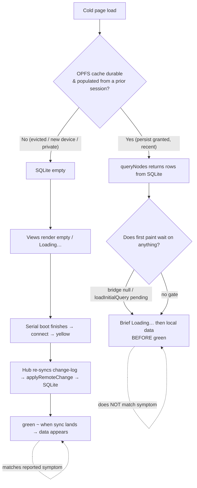

# Fast Local-First Cold Start And Cache Hydration

## Problem Statement

On initial page load of the web app, **no data renders while the hub
connection indicator (bottom-left of the StatusBar) is "connecting"**
— the dot transitions gray → yellow → green, and only when it turns
green does data appear on screen. Reported symptoms:

- The app shell is visible (so the database/identity boot has already
  completed), but content views (lists, tables, pages) are empty until
  the connection reaches "connected".
- The "connecting" phase can last **10–20 seconds**.
- Switching tabs / opening different content also feels slow.

The user's hypotheses to test:

1. Is the local cache (SQLite) actually working, or is data coming
   only from the remote server?
2. Is the database slow to "boot up" (10–20s), and only able to serve
   once booted?
3. How can initial page load — and tab/content switches — be made
   significantly faster?

This exploration reconciles those hypotheses against the actual code.

## Executive Summary

The architecture is **designed** to be local-first and durable: every
remote change is materialized into SQLite, and queries read durable
SQLite rows without waiting for the network
(`packages/data/src/store/store.ts:722`). On paper, a returning user's
data should paint instantly, before "green".

The observed symptom — data appears only at "green", after 10–20s —
means the local-first path is **not actually serving the cold load**.
The investigation isolates three compounding causes, ranked by
likelihood and impact:

1. **Serialized boot (highest-impact, certain).** The hub is not dialed
   until *after* SQLite WASM init → identity unlock → NodeStore init →
   data-bridge creation have all finished, in series. Time-to-green =
   `WASM boot + identity + store init + connect handshake + initial
   sync`, summed. Connecting could start in parallel with SQLite boot
   but doesn't. This alone can produce a 10–20s yellow phase.
   (`apps/web/src/App.tsx:334-493` → `packages/react/src/context.ts`
   NodeStore effect → separate SyncManager effect at `:846-902`.)

2. **Non-durable / cold local cache (high-likelihood, intermittent).**
   The local store is durable *only if* OPFS survives between sessions.
   OPFS is best-effort and evicted (Safari after ~7 days idle; Chromium
   under storage pressure, LRU) unless `navigator.storage.persist()` is
   granted. Firefox stays unpersisted until the user clicks a banner
   (per memory note 0172). When the cache is evicted/empty, cold load
   has nothing local to show, so data only appears once the hub
   re-syncs the full change-log — which lands around "green". This
   matches the symptom exactly.

3. **No instrumentation + async query warm-up (contributing).** There
   are zero `performance.mark()`/timing logs in the boot path, so the
   10–20s cannot currently be attributed. Queries are async and start
   cold on each route; `getSnapshot()` returns `null` until
   `loadInitialQuery()` resolves, and views render "Loading…" in the
   meantime (`packages/data-bridge/src/main-thread-bridge.ts`,
   `apps/web/src/routes/index.tsx`).

**Headline recommendation:** (a) **parallelize** — start the hub
connection concurrently with SQLite boot; (b) **prove durability** —
detect eviction, surface a banner, and verify `persist()`; (c)
**instrument** the boot path with `performance.mark()` so the 10–20s is
attributable; (d) **never gate content views on connection** and warm
the working-set query cache at boot so the first paint is local data,
not a spinner. Together these turn "data at green" into "data
immediately, sync in the background".

## Current State In The Repository

### The boot sequence (today, fully serial)

```mermaid
sequenceDiagram
    autonumber
    participant U as User / Browser
    participant App as App.tsx (initialize)
    participant WASM as SQLite WASM + OPFS worker
    participant Id as IdentityManager
    participant Ctx as XNetProvider (context.ts)
    participant SM as SyncManager
    participant Hub as Hub (wss://hub.xnet.fyi)

    U->>App: load page
    App->>App: appState = 'initializing' (spinner)
    App->>WASM: await sqliteAdapter.open()  ⏳ WASM dl+compile+OPFS pool
    WASM-->>App: ready
    App->>WASM: await applySchema()
    App->>Id: await hasIdentity() / resume()  ⏳ biometric/persisted
    Id-->>App: authenticated
    App->>App: appState = 'authenticated' → render shell + StatusBar
    Note over App,Ctx: StatusBar now visible → dot = gray
    Ctx->>Ctx: await NodeStore.initialize() (Lamport clock)
    Ctx->>Ctx: resolveRuntimeBridge() → MainThreadBridge
    Ctx->>Ctx: setNodeStoreReady(true)
    Ctx->>SM: createSyncManager(); sm.start()  (separate effect)
    SM->>SM: await registry.load(); await offlineQueue.load()
    SM->>Hub: connection.connect()  → dot = yellow (connecting)
    Hub-->>SM: ws.onopen → dot = green (connected)
    SM->>Hub: sync-step1 / NodeStoreSyncProvider handshake
    Hub-->>SM: changes → applyRemoteChange() → SQLite
    Note over SM,App: queries invalidate → views finally show data
```

Everything above the `connection.connect()` line runs **before** the
hub is dialed. The connection cannot start early because it lives in a
`useEffect` gated on `nodeStoreReady`
(`packages/react/src/context.ts:811`, deps array `:911-927`), which in
turn waits on the App-level `await` chain.

### Key files and seams

**App bootstrap (serial awaits, blocks shell on full init):**
- `apps/web/src/App.tsx:334-493` — the `initialize()` effect:
  `await sqliteAdapter.open()` (`:378`) → `await applySchema()` (`:386`)
  → `createDataWorkerStoragePort()` (`:403`) → `hasIdentity()`/`resume()`
  (`:416-425`) → `setAppState({status:'authenticated'})`. The shell only
  renders after **all** of this; before it, a "Initializing database…"
  spinner shows.

**SQLite WASM + OPFS (the "boot"):**
- `packages/sqlite/src/adapters/web.ts:145-157` —
  `import('@sqlite.org/sqlite-wasm')` → `sqlite3InitModule()` →
  `installOpfsSAHPoolVfs({ name:'opfs-sahpool', directory:'.xnet-sqlite',
  clearOnInit:false })`. Pragmas tuned for OPFS (`cache_size = -262144`
  ≈256MB, `journal_mode = TRUNCATE`, `synchronous = NORMAL`).
- `packages/sqlite/src/adapters/web-proxy.ts` — `WebSQLiteProxy` runs the
  adapter in a dedicated `Worker` over Comlink, so WASM init happens
  off-main-thread but is still `await`ed by App.tsx.

**Connection state machine (gray/yellow/green):**
- `apps/web/src/workbench/StatusBar.tsx` — `HUB_LABEL`:
  `disconnected → 'offline' (bg-ink-3, gray)`,
  `connecting → 'connecting…' (bg-warning, yellow)`,
  `connected → 'synced' (bg-success, green)`,
  `error → 'sync error' (bg-destructive, red)`. Driven by
  `useHubStatus()` → `XNetContext.hubStatus`.
- `packages/runtime/src/sync/connection-manager.ts` — states
  `'disconnected'|'connecting'|'connected'|'error'`; `connect()` sets
  `connecting`, `ws.onopen` sets `connected`. **`connectTimeout` default
  10000ms**; on stall → `error` → `scheduleReconnect()` (~2000ms base).
  A single stalled first attempt + reconnect ≈ 12–22s of yellow/red
  before green.

**Sync wiring (what populates the queryable store):**
- `packages/react/src/context.ts:846-867` — `createSyncManager({ … ,
  nodeSyncRoom: hubUrl ? nodeSyncRoom : undefined, … })`. `nodeSyncRoom`
  = `authorDID ?? 'default'` (`:602`) but **only when `hubUrl` is set**.
- `packages/runtime/src/sync/sync-manager.ts:386-388` —
  `nodeSyncProvider = config.nodeSyncRoom ? new
  NodeStoreSyncProvider(config.nodeStore, config.nodeSyncRoom) : null`.
  So in dev (`hubUrl=''`) the node-store change-log is **local-only**;
  in prod it syncs over the author's room.
- `packages/runtime/src/sync/node-store-sync-provider.ts` — remote
  change → `store.applyRemoteChange(change)` →
  `packages/data/src/store/store.ts` `applyChange()` → `setNode()` /
  `appendChange()` → **durable SQLite** (`nodes`, `node_properties`,
  `changes` tables). Local edits and remote changes both write durably.

**Query path (local-only in the web app):**
- `packages/data/src/store/store.ts:722` — fast path:
  `if (this.storage.queryNodes && !this.nodeContentCipher &&
  !this.authEvaluator) { return this.storage.queryNodes(descriptor) }`.
  When a content cipher or auth evaluator is present this path is
  **disabled** and a slower materialization path runs (`:743-749`).
- `apps/web/src` passes **no** `remoteNodeQueryClient`
  (the constructor option exists in `packages/react/src/context.ts:205,
  688` but the web app never sets it). So `shouldUseRemoteOnlyQuery` /
  remote routing is inert — **list/table queries are local-only and
  cannot be silently waiting on the server.** Data must come from
  SQLite; if SQLite is empty, views are empty until sync writes rows.
- `packages/data-bridge/src/main-thread-bridge.ts` — `query()` returns a
  subscription whose `getSnapshot()` is `null` until the fire-and-forget
  `loadInitialQuery()` resolves; views show "Loading…" until then
  (e.g. `apps/web/src/routes/index.tsx` `pagesLoading || …`).

**Hub URL resolution:**
- `apps/web/src/App.tsx:69-90` — `DEFAULT_HUB_URL =
  import.meta.env.VITE_HUB_URL ?? (DEV ? '' : 'wss://hub.xnet.fyi')`;
  user override via `localStorage['xnet:hub-url']`
  (`apps/web/src/lib/hub-url.ts`). **Dev = local-first/no hub; prod
  dials hub.xnet.fyi.**

### Why the symptom appears (decision flow)



The reported behavior corresponds to the **right branch** (empty/cold
local cache → data arrives with sync ≈ green), and/or the **serial boot
making "green" coincide with the moment the data layer is finally
ready**. Both are addressable.

## External Research

- **OPFS-SAHPool is the right VFS, but cold init is real work.** The
  `opfs-sahpool` VFS gives the highest OPFS performance and avoids
  COOP/COEP headers, but requires an exclusive single-connection lock
  and runs sync access handles **inside a Worker** (blocking that
  worker's thread). Cold start = fetch+compile the ~1MB wasm, init the
  module, install the SAH pool, reserve capacity. This is "not
  noticeable for human interactions" once warm but is a measurable
  one-time cost on cold load.
  ([sqlite.org persistence docs](https://sqlite.org/wasm/doc/trunk/persistence.md),
  [Chrome for Developers: SQLite Wasm + OPFS](https://developer.chrome.com/blog/sqlite-wasm-in-the-browser-backed-by-the-origin-private-file-system),
  [PowerSync: State of SQLite persistence on the web](https://powersync.com/blog/sqlite-persistence-on-the-web))

- **Browser storage is best-effort and evictable.** OPFS is subject to
  the same quota/eviction as IndexedDB. Eviction **skips origins granted
  `navigator.storage.persist()`**. Safari evicts non-persistent origins
  after ~7 days idle; Chromium evicts LRU under storage pressure.
  Chrome/Edge auto-decide `persist()` from engagement signals (silent);
  **Firefox shows a permission prompt** and stays unpersisted until the
  user accepts. An unpersisted, evicted origin = empty cache on cold
  load = exactly the "remote-first" behavior observed.
  ([MDN: Storage quotas & eviction](https://developer.mozilla.org/en-US/docs/Web/API/Storage_API/Storage_quotas_and_eviction_criteria),
  [MDN: StorageManager.persist()](https://developer.mozilla.org/en-US/docs/Web/API/StorageManager/persist),
  [Chrome: Storage Buckets](https://developer.chrome.com/docs/web-platform/storage-buckets))

- **Local-first prior art paints from cache first, syncs in the
  background.** Linear, Figma, and Actual Budget all render the cached
  working set instantly and reconcile with the server asynchronously;
  the connection indicator reflects sync state but never gates content.
  RxDB's comparison confirms WASM-SQLite+OPFS is the durable/fast option
  but must be warmed and the working set prefetched.
  ([RxDB: storage options compared](https://rxdb.info/articles/localstorage-indexeddb-cookies-opfs-sqlite-wasm.html))

## Key Findings

1. **Data is local-only in the web app** — no `remoteNodeQueryClient` is
   configured, so views cannot be blocked waiting on a remote query. The
   only reason a view is empty is that SQLite has no matching rows
   *yet*.

2. **Remote sync writes durably to SQLite** via `applyRemoteChange →
   applyChange → setNode/appendChange`. There is **no separate "node
   index" doc** that must sync first; each change is applied
   independently and persisted. So durability is *designed in*.

3. **Boot is fully serialized.** Hub dial waits on SQLite WASM boot +
   identity + NodeStore + bridge. The connection effect is gated on
   `nodeStoreReady`. Nothing starts the network early. Time-to-green is
   the **sum**, not the **max**, of these phases.

4. **Durability is conditional and unverified at runtime.** If
   `persist()` isn't granted (Firefox, or low-engagement Chrome, or
   private windows), OPFS is evictable. After eviction, cold load is
   effectively remote-first → data at green. There is no eviction
   detection or user-facing warning beyond the storage-durability banner
   plumbing.

5. **No timing instrumentation exists.** Zero `performance.mark()` in
   `App.tsx`, `context.ts`, `sync-manager.ts`, or `web.ts`. The 10–20s
   cannot currently be attributed to WASM vs identity vs connect vs
   sync. This must be fixed first to target the real bottleneck.

6. **`connectTimeout = 10000ms` + reconnect** can manufacture a 10–20s
   yellow phase by itself if the first WS handshake stalls (mobile,
   proxy, cold DNS/TLS). Because the local cache may be empty/cold during
   that window, "data appears at green" looks causal even when it's
   coincidental.

7. **Tab/content switches start queries cold.** Each route mounts new
   `useQuery` hooks that fire `loadInitialQuery()` async; there's no
   prefetch of adjacent routes and the working set isn't pre-warmed, so
   switches incur an async SQLite round-trip (through the worker proxy)
   before rows appear.

## Options And Tradeoffs

### A. Parallelize connection with SQLite boot
Start `connection.connect()` as early as possible (it only needs the
hub URL + auth token, not the NodeStore) so the WS handshake and the
WASM/identity boot overlap. Then attach the synced store once ready.

- **Pros:** Largest wall-clock win; turns sum into max. No data-model
  change.
- **Cons:** Requires decoupling the connect lifecycle from
  `nodeStoreReady`; must buffer/queue inbound sync until the store
  exists, or connect a "pending" store. Moderate refactor in
  `context.ts` + `sync-manager.ts`.

### B. Prove and harden durability
Verify `navigator.storage.persisted()`, detect a cold/empty store on
boot (row count = 0 when we expected data), surface the existing
durability banner more assertively, and consider Storage Buckets with
`durability:'strict'` where supported.

- **Pros:** Eliminates the intermittent "empty cache" class of the bug;
  makes the cache trustworthy.
- **Cons:** `persist()` can't be forced (Firefox prompts; Chrome decides
  silently). Best we can do is detect, warn, and recover gracefully.

### C. Instrument the boot path
Add `performance.mark()`/`measure()` around wasm-init, schema, identity,
store-init, connect, first-sync, first-query-paint; log a single
structured "boot timeline" in dev and optionally to telemetry.

- **Pros:** Cheap; turns guesswork into data; guards against regressions.
- **Cons:** None material. Should be done first.

### D. Never gate content on connection + warm the cache
Ensure views always render local rows immediately (skeleton only when
SQLite genuinely empty), and **prefetch the working set** (recent
pages/databases/canvases for the active space) into the bridge query
cache during boot so the first route paints from a warm cache.

- **Pros:** Instant first paint; faster tab switches; cheap.
- **Cons:** Prefetch heuristics need tuning; must avoid over-fetching.

### E. Shrink the WASM/OPFS cold cost
Preload/`<link rel=modulepreload>` the wasm chunk, keep `clearOnInit:
false` (already), ensure the wasm is served compressed + long-cache, and
avoid a second SQLite instance in the data worker (reuse the shared
`storagePort`).

- **Pros:** Trims the fixed boot cost; helps every load.
- **Cons:** Bounded upside (the wasm cost is one-time and already
  worker-isolated); won't fix the empty-cache or serialization issues.

### Comparison

| Option | Fixes "data at green" | Fixes 10–20s | Effort | Risk |
|---|---|---|---|---|
| A Parallelize connect | partial | **large** | med | med |
| B Durability hardening | **yes (intermittent)** | partial | med | low |
| C Instrumentation | enables targeting | — | low | none |
| D No-gate + warm cache | **yes** | partial | low–med | low |
| E Shrink WASM cost | no | small | low | low |

## Recommendation

Do **C → D → A → B → E**, in that order:

1. **C (instrument) first** — add the boot timeline so we attribute the
   10–20s before optimizing. This likely confirms whether the dominant
   cost is `connect` (→ A) or an empty cache (→ B) or WASM (→ E).
2. **D (no-gate + warm cache)** — guarantee content views paint local
   rows immediately and prefetch the working set at boot. This directly
   removes the "no data until green" perception for the common
   warm-cache case and speeds tab switches.
3. **A (parallelize connect)** — overlap the WS handshake with
   WASM/identity boot to collapse time-to-green.
4. **B (durability hardening)** — detect eviction, warn, recover, so the
   cache is trustworthy across sessions and the empty-cache branch stops
   happening silently.
5. **E (WASM trims)** — modulepreload + caching as polish.

This sequence is measurement-led, ships user-visible wins early (D), and
de-risks the larger refactor (A) by proving the bottleneck first.

## Example Code

### C — Boot timeline instrumentation (drop into `App.tsx` + `context.ts`)

```ts
// apps/web/src/lib/boot-timeline.ts
const marks: Record<string, number> = {}
export function bootMark(name: string) {
  marks[name] = performance.now()
  performance.mark(`xnet:${name}`)
}
export function bootMeasure(from: string, to: string) {
  if (marks[from] == null || marks[to] == null) return
  const ms = Math.round(marks[to] - marks[from])
  performance.measure(`xnet:${from}→${to}`, `xnet:${from}`, `xnet:${to}`)
  return ms
}
export function logBootTimeline() {
  // eslint-disable-next-line no-console
  console.info('[xNet] boot timeline (ms):', {
    wasm: bootMeasure('init:start', 'sqlite:open'),
    schema: bootMeasure('sqlite:open', 'sqlite:schema'),
    identity: bootMeasure('sqlite:schema', 'identity:ready'),
    store: bootMeasure('identity:ready', 'store:ready'),
    connect: bootMeasure('store:ready', 'hub:connected'),
    firstSync: bootMeasure('hub:connected', 'sync:first'),
    firstPaint: bootMeasure('init:start', 'query:first-rows')
  })
}
```

Call `bootMark('init:start')` at the top of `initialize()`,
`bootMark('sqlite:open')` after `sqliteAdapter.open()`, etc., and
`bootMark('hub:connected')` from the StatusBar/`hubStatus` transition.

### A — Start connecting before the store is ready (sketch)

```ts
// packages/react/src/context.ts — connect early, attach store late
useEffect(() => {
  if (!hubUrl) return                 // local-first: nothing to dial
  const conn = createConnectionManager({ url: signalingUrl, getUCANToken })
  conn.connect()                      // ⏪ overlaps with WASM/identity boot
  earlyConnectionRef.current = conn
  return () => conn.disconnect()
}, [hubUrl, signalingUrl])            // NOT gated on nodeStoreReady

useEffect(() => {
  if (!nodeStore || !nodeStoreReady || !earlyConnectionRef.current) return
  const sm = createSyncManager({ nodeStore, connection: earlyConnectionRef.current, /* … */ })
  sm.start()                          // store attaches to the already-open socket
  // …
}, [nodeStore, nodeStoreReady])
```

### D — Render local rows immediately + warm the working set

```ts
// During boot, prefetch the active space's recent docs into the bridge cache
await Promise.all([
  bridge.query(PageSchema,     { orderBy: { updatedAt: 'desc' }, limit: 50 }).prime?.(),
  bridge.query(DatabaseSchema, { orderBy: { updatedAt: 'desc' }, limit: 50 }).prime?.(),
  bridge.query(CanvasSchema,   { orderBy: { updatedAt: 'desc' }, limit: 50 }).prime?.()
])
// Views: skeleton ONLY when the store is genuinely empty, never when merely "connecting"
const showSkeleton = loading && rowCount === 0 && storeEmptyOnBoot
```

### B — Durability detection + recovery

```ts
const persisted = (await navigator.storage?.persisted?.()) ?? false
const empty = (await sqliteAdapter.run('SELECT COUNT(*) AS n FROM nodes'))?.n === 0
if (!persisted && empty) {
  recordDurabilityTransition('cold-empty', { persisted, empty })
  showDurabilityBanner('Your local cache was cleared by the browser — re-syncing from the hub.')
}
```

## Risks And Open Questions

- **Root-cause certainty.** Static analysis strongly implicates
  serialized boot + cold/empty cache, but only the **C instrumentation**
  (or a live profile) can confirm which dominates the 10–20s. The doc is
  measurement-led for this reason.
- **Connecting before store exists.** Option A must buffer inbound sync
  messages until the NodeStore is attached, or risk dropping the first
  `sync-step2`. Needs a small inbound queue or a "pending store" shim.
- **`persist()` is not guaranteed.** We can detect and warn but cannot
  force durability in Firefox/low-engagement Chrome/private windows.
- **OPFS-SAHPool exclusive lock.** Multiple tabs contend for the single
  connection; verify the early-connect refactor doesn't worsen
  multi-tab behavior.
- **Encryption/auth fast-path.** If `nodeContentCipher` or `authEvaluator`
  is ever enabled in the web client, `queryNodes` falls off the fast SQL
  path (`store.ts:722` vs `:743`) into in-memory materialization — a
  separate, potentially large cold-load cost worth measuring.
- **Double SQLite init?** Confirm `createDataWorkerStoragePort`
  (`App.tsx:403`) reuses the already-open adapter and does not spin up a
  second wasm/OPFS instance.
- **What is `authorDID`-scoped `nodeSyncRoom` syncing on connect?** If
  the hub replays the *entire* author change-log each connect, that
  payload size (not the handshake) may be the real 10–20s — measure
  `sync:first` payload bytes.

## Implementation Status

Shipped in the 0204 PR (commits on `perf/local-first-cold-start-0204`):
the measurement-led core (C → D → A → B → E). Two items are deferred **by
design** — the full socket-level connect refactor (risk of dropped
`sync-step2`) and a build-graph `modulepreload` of the worker's wasm chunk
(low yield: wasm init runs in a worker behind the boot spinner). One item is
inherently a **live-runtime** task (capturing a cold-load profile) and is
enabled by the instrumentation that shipped.

## Implementation Checklist

- [x] Add `apps/web/src/lib/boot-timeline.ts` and `bootMark()` calls at
      each boot phase (`init:start`, `sqlite:open`, `sqlite:schema`,
      `identity:ready`, `store:ready`, `hub:connected`,
      `query:first-rows`); log the timeline in dev / `xnet:boot:debug`.
      (`sync:first` phase is defined but left unwired — marking it would
      mean touching the runtime sync internals purely for a log line.)
- [ ] Capture a real cold-load profile (cache warm vs evicted; prod hub)
      and record which phase dominates. *(Live-runtime task; the shipped
      boot timeline makes it a one-session measurement.)*
- [x] Ensure content views render local rows immediately; show a
      "restoring" affordance (not a blank/empty state) only when the cache
      looks evicted and a hub exists — never merely "connecting"
      (`useRestoringFromHub` + `RestoringNotice`, home route).
- [x] Add a working-set prefetch at boot (recent pages/databases/canvases)
      to warm the bridge query cache (`WorkingSetPrewarm`).
- [x] Prefetch/keep-warm queries for likely-next tabs to speed switches;
      keep subscriptions alive across route changes (`WorkingSetPrewarm`
      holds the landing subscriptions for the app's lifetime).
- [~] Decouple `connection.connect()` from `nodeStoreReady` so the WS
      handshake overlaps boot. **Partial:** shipped a `preconnect` hint
      (DNS/TCP/TLS warm during boot) which is the safe overlap; the full
      socket-level decouple + inbound-sync buffering is deferred (risk of
      dropped `sync-step2`).
- [x] Detect cold/empty store + `persist()` state on boot; surface a
      "restoring" affordance; recover gracefully (`probeStoreColdStart`,
      `looksEvicted`, boot `console.warn`).
- [~] `modulepreload` the sqlite-wasm chunk / confirm no second SQLite
      instance. **Verified** no second instance (`createDataWorkerStoragePort`
      only mints a port into the existing worker). `modulepreload`
      **deferred** (worker module graph; low yield behind the boot spinner).
- [x] Lower/adapt `connectTimeout` or add fast-retry so a single stalled
      handshake can't manufacture a 10–20s yellow phase (shorter first-
      attempt timeout + exponential reconnect backoff).
- [ ] (If applicable) measure the `authorDID` room initial-sync payload;
      consider incremental/state-vector sync over full replay. *(Follow-up;
      the boot timeline's `firstSync` segment is the hook for measuring it.)*

## Validation Checklist

Unit-verified in CI (shipped with the PR):

- [x] Boot timeline records first-write-wins phase marks and derives
      segment durations (`boot-timeline.test.ts`).
- [x] Cold/evicted detection: empty + unpersisted ⇒ evicted; gated on a
      configured hub (`store-cold-start.test.ts`).
- [x] Restoring affordance logic: shows only when evicted + hub +
      not-connected, flips off on connect (`use-restoring.test.ts`).
- [x] First hub dial fails fast at the shorter initial timeout; reconnect
      backs off exponentially (`connection-manager.test.ts`).
- [x] Preconnect maps ws(s)→http(s) origin and injects idempotent hints
      (`preconnect-hub.test.ts`).
- [x] No second SQLite/WASM instance (`createDataWorkerStoragePort` review).

Live-runtime validation (requires a profiling session; enabled by the
shipped instrumentation):

- [ ] Boot timeline log accounts for the previously-unexplained 10–20s
      (set `localStorage xnet:boot:debug=true`, reload, read the timeline).
- [ ] On a **warm** cache, content renders **before** the dot turns green.
- [ ] On an **evicted/empty** cache, the user sees the "restoring"
      affordance (not a blank/empty screen) and data fills in.
- [ ] Time-to-green drops with the hub preconnect (compare
      `store:ready→hub:connected` before/after).
- [ ] Tab/content switches paint from the warm cache without a visible gap.
- [ ] `navigator.storage.persisted()` is true for engaged Chrome/Safari;
      Firefox shows the durability banner.
- [ ] No regression in multi-tab behavior under the OPFS-SAHPool lock.

## References

- `apps/web/src/App.tsx:334-493` — serial boot (`open`→`schema`→identity)
- `apps/web/src/App.tsx:69-90` — hub URL resolution (prod `wss://hub.xnet.fyi`)
- `packages/sqlite/src/adapters/web.ts:145-157` — WASM init + OPFS-SAHPool
- `packages/sqlite/src/adapters/web-proxy.ts` — worker-proxied SQLite
- `packages/react/src/context.ts:602,811,846-902` — NodeStore/SyncManager effects, `nodeSyncRoom`
- `packages/runtime/src/sync/sync-manager.ts:386-388` — `NodeStoreSyncProvider` gating
- `packages/runtime/src/sync/node-store-sync-provider.ts` — remote change → store
- `packages/runtime/src/sync/connection-manager.ts` — state machine, `connectTimeout`
- `packages/data/src/store/store.ts:722-749` — query fast-path vs materialization
- `packages/data-bridge/src/main-thread-bridge.ts` — async query / `loadInitialQuery`
- `apps/web/src/workbench/StatusBar.tsx` — gray/yellow/green `HUB_LABEL`
- [sqlite.org — Persistent Storage Options (OPFS-SAHPool)](https://sqlite.org/wasm/doc/trunk/persistence.md)
- [Chrome for Developers — SQLite Wasm + OPFS](https://developer.chrome.com/blog/sqlite-wasm-in-the-browser-backed-by-the-origin-private-file-system)
- [PowerSync — The Current State Of SQLite Persistence On The Web](https://powersync.com/blog/sqlite-persistence-on-the-web)
- [MDN — Storage quotas and eviction criteria](https://developer.mozilla.org/en-US/docs/Web/API/Storage_API/Storage_quotas_and_eviction_criteria)
- [MDN — StorageManager.persist()](https://developer.mozilla.org/en-US/docs/Web/API/StorageManager/persist)
- [Chrome — Storage Buckets](https://developer.chrome.com/docs/web-platform/storage-buckets)
- [RxDB — LocalStorage vs IndexedDB vs OPFS vs WASM-SQLite](https://rxdb.info/articles/localstorage-indexeddb-cookies-opfs-sqlite-wasm.html)
- Related: `docs/explorations/` 0188 (offline/local-first connection behavior), memory note 0172 (storage durability/persist banner)
