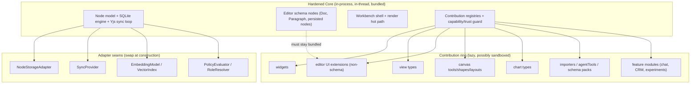
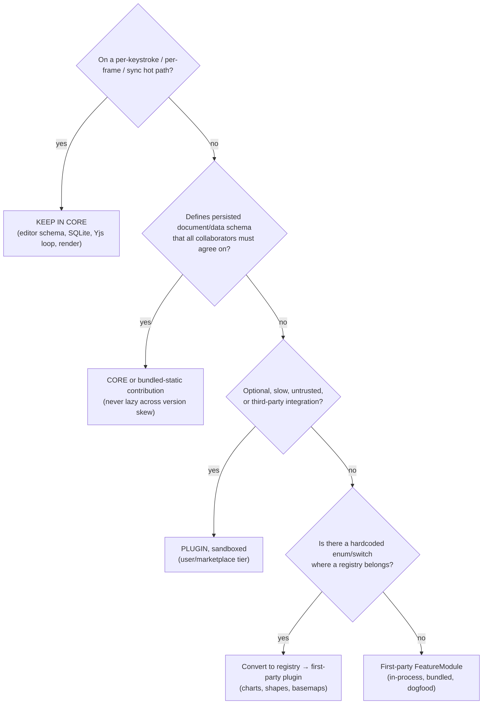

# Decomposing The App Into Plugins: How Far Should "Everything Is A Plugin" Go?

## Problem Statement

We have a real, load-bearing plugin system (`@xnetjs/plugins`) with ~17
contribution points, a capability/trust/consent model, a marketplace, and a
two-sided client+hub "feature module" shape. Today exactly **one** first-party
plugin ships through it (`MermaidPlugin`), while the editor, canvas, charts,
database, tasks, comments, chat, CRM, etc. are all built as ordinary in-tree
code.

The question raised: *what else can be extracted and abstracted from the main
app into a plugin?* Should we pluginize **as much as possible** — for
composability, as living reference for plugin authors, and to make the
ecosystem feel robust? Could the **entire editor** be a set of editor plugins?
Could the **database**, **canvas**, **charts** be composed of plugins? Could the
**whole system**? Are to-dos too low-level? Should **comments** be plugins?

This document grounds those questions in the actual code, pulls in prior art
from every system that tried "almost everything is a plugin," and lands on a
concrete, tiered recommendation.

## Executive Summary

There are **two completely different things** people mean by "make it a plugin,"
and conflating them is the trap:

- **(A) Author features *through* the plugin API** — ship real first-party
  features (chat, tasks, CRM, a chart pack) as `FeatureModule`s registered via
  the same contribution registry community plugins use. The code still lives in
  the repo, still bundles, still runs in-process at the `first-party` trust
  tier. This is **dogfooding + reference + composability** with almost no
  downside.
- **(B) Physically decompose the core into independently-loaded, sandboxed
  units** — the editor model, the SQLite engine, the Yjs sync loop, the render
  hot path each become a separately-shipped, lazily-loaded, possibly-sandboxed
  plugin. This is where the **SQLite4 abandonment** and the **Prime Video
  90%-cost-reversion** cautionary tales live.

**Every system that succeeded at "almost everything is a plugin" — VS Code,
Obsidian, Figma, Logseq, Eclipse — kept rendering, the editor model, and the
data engine in a hardened core, and exposed plugins only a narrow typed/mediated
API.** Nobody hands plugins the DOM or the raw document model. VS Code keeps
Monaco in core *on purpose* "to ensure that extensions cannot interfere with the
stability and performance of VS Code" and so it can keep refactoring internals.

So the recommendation is: **go aggressively after (A), go selectively after (B)
only at seams that are already port/adapter-shaped, and explicitly *not*
pluginize the hot path.** Concretely:

1. **Dogfood the contribution API.** Turn the chart pack, a canvas-tool pack, an
   importer pack, and an experiments widget pack into bundled first-party
   plugins. This is the single highest-leverage move for "make the ecosystem
   feel robust + serve as reference," and it surfaces every rough edge in our
   own API.
2. **Convert hardcoded enums into registries** at the visual seams that *look*
   pluggable but aren't yet: `ChartKind`, canvas `ShapeType`/tools/layouts, map
   basemaps. The `WidgetRegistry` and `ViewRegistry` already prove the pattern.
3. **Keep the editor schema nodes, the SQLite engine, the Yjs sync loop, and
   comments' anchoring in core.** The editor is *already* extension-based and
   that is enough — do not lazy-load schema-defining nodes (silently corrupts
   collaborative documents across version skew).
4. **Add one missing primitive — pluggable top-level routes/workspaces** — so a
   feature module can own a whole surface, not just a left-panel view.

## Current State In The Repository

### The plugin substrate is already substantial

A plugin (`XNetExtension`) is declared via `defineExtension(manifest)` in
[`packages/plugins/src/manifest.ts`](packages/plugins/src/manifest.ts) and
extended to a two-sided `FeatureModule` (client contributions + a `hub.featureId`
pointer + declared `capabilities`) in
[`packages/plugins/src/feature-module.ts`](packages/plugins/src/feature-module.ts).

The contribution surface is wide. From
[`packages/plugins/src/contributions.ts`](packages/plugins/src/contributions.ts)
plus the satellite modules, plugins can contribute:

| Contribution | Where consumed | Status |
|---|---|---|
| `views` | custom node/surface renderers | live |
| `widgets` | dashboard `WidgetRegistry` | live |
| `editor` (TipTap `Extension`/`Node`/`Mark`) | editor `additionalExtensions` | live |
| `slashCommands` | editor `/` menu | live |
| `toolbar` | editor floating toolbar | live |
| `commands` | command palette (+ `aiExposed` opt-in) | live |
| `propertyHandlers` | database field cells/editors | live |
| `blocks` | structured/canvas block renderers | live |
| `sidebar` | workbench Rail item (+ optional panel) | live |
| `statusBar` | workbench status bar | live |
| `settings` | settings panel sections | live |
| `canvas*` (cards, ingestors, tools, layouts, edges, inspectors, templates) | canvas | defined |
| `importers` | data importers | live |
| `mentionProviders` | `[[` / `#` / `@` typeahead | live |
| `agentTools` | AI surface `extraTools` | live |
| `schemas` | `SchemaRegistry` | live |

Plugins are installed/activated by the `PluginRegistry` in
[`packages/plugins/src/registry.ts`](packages/plugins/src/registry.ts):
`install()` runs platform → compatibility (semver) → dependency resolution →
capability consent → paid-license gate → store-as-Node; `activate()` builds a
**guarded** `ExtensionContext` and registers contributions. Capability
enforcement is a single choke point — the plugin's `ctx.store` is a `Proxy`
([`ecosystem/capability-guard.ts`](packages/plugins/src/ecosystem/capability-guard.ts))
that gates `create/update/delete` against declared `schemaWrite`, and
`guardedFetch` gates egress against declared `network`. Trust tier is derived
from provenance in [`packages/trust/src/index.ts`](packages/trust/src/index.ts):
`builtin → first-party` (host realm), `marketplace → marketplace` (iframe),
authored/ai-generated/imported/synced `→ user` (SES worker). Sandbox kind
follows tier.

### …but almost nothing first-party ships through it

[`apps/web/src/plugins/index.ts`](apps/web/src/plugins/index.ts) is the whole
bundled-plugin set:

```ts
export const BUNDLED_PLUGINS: XNetExtension[] = [MermaidPlugin]
```

`MermaidPlugin` ([`apps/web/src/plugins/mermaid-plugin.ts`](apps/web/src/plugins/mermaid-plugin.ts))
contributes one editor extension + one slash command. That's the entire
dogfooding surface. The comment at the top of the file even says these plugins
"serve as examples of how the plugin system works" — but there is exactly one
example, and it's the simplest possible kind (an editor node). The richest
contribution points (canvas tools, widgets, importers, agent tools, property
handlers, schema packs) have **zero** first-party exemplars.

### The editor is already an extension architecture

[`packages/editor`](packages/editor) is TipTap 3 (ProseMirror) + Yjs.
[`packages/editor/src/extensions.ts`](packages/editor/src/extensions.ts) exports
~30 nodes/marks (headings, code, callout, toggle, embeds, database-embed,
hashtag, wikilink, comment mark, mermaid…). The React host
[`RichTextEditor.tsx`](packages/editor/src/components/RichTextEditor.tsx) builds
a hardcoded core array and then spreads `...additionalExtensions` (plugin
contributions), and [`hooks/useEditorExtensions.ts`](packages/editor/src/hooks/useEditorExtensions.ts)
/ [`hooks/useSlashCommands.ts`](packages/editor/src/hooks/useSlashCommands.ts)
merge plugin contributions with the built-ins. Content is a `Y.XmlFragment`
bound through `Collaboration.configure({ fragment })`. **The editor is already
"a set of editor plugins" internally** — the question is only how much of that
set should move out of core and be loaded independently.

### The data layer is port/adapter-shaped

- Node storage: `NodeStorageAdapter` interface in
  [`packages/data/src/store/types.ts`](packages/data/src/store/types.ts) with
  `MemoryNodeStorageAdapter`
  ([memory-adapter.ts](packages/data/src/store/memory-adapter.ts)) and
  `SQLiteNodeStorageAdapter`
  ([sqlite-adapter.ts](packages/data/src/store/sqlite-adapter.ts)).
- Sync: `SyncProvider<T>` in
  [`packages/sync/src/provider.ts`](packages/sync/src/provider.ts), with
  `NodeStoreSyncProvider` / `WebSocketSyncProvider` /
  `AuthorizedYjsSyncProvider`.
- Vectors: `EmbeddingModel` + `VectorIndex` ports in
  [`packages/vectors/src/embedding.ts`](packages/vectors/src/embedding.ts).
- Schemas: `defineSchema` + a runtime `SchemaRegistry.register()` plus a
  `SchemaContribution` plugin point. Schema *packs* (CRM, accounting, game,
  social) already exist as separable groups.
- Auth: `PolicyEvaluator` / `RoleResolver` ports in
  [`packages/core/src/auth-types.ts`](packages/core/src/auth-types.ts).

The client wiring in
[`packages/runtime/src/client.ts`](packages/runtime/src/client.ts)
(`createXNetClient`) takes `nodeStorage`, `dataBridge`, `sync`, `plugins`, `undo`
as injectable options. So the data layer is *already* composed of swappable
adapters — at construction time, not hot-loaded.

### Visual surfaces: two real registries, several hardcoded enums

- **`WidgetRegistry`** ([`packages/dashboard/src/registry.ts`](packages/dashboard/src/registry.ts))
  — a real `Map<string, WidgetDefinition>` with `onChange`, `Disposable`
  unregister, and a plugin bridge `connectWidgetContributions()`
  ([plugins.ts](packages/dashboard/src/plugins.ts)) that mirrors plugin widget
  contributions into the registry at a host-assigned trust tier. **This is the
  reference pattern.**
- **`ViewRegistry`** ([`packages/views/src/registry.ts`](packages/views/src/registry.ts))
  — same pattern for table/board/gallery/timeline/calendar/list, with
  schema/platform filtering, rendered by
  [`ViewRenderer.tsx`](packages/views/src/ViewRenderer.tsx).
- **Charts: hardcoded.** `ChartKind = 'bar' | 'line' | 'area' | 'pie'` is a
  fixed union with a switch in
  [`packages/charts/src/spec.ts`](packages/charts/src/spec.ts). No registry.
- **Canvas: hardcoded.** `CanvasObjectKind` and `ShapeType` are fixed unions in
  [`packages/canvas/src/types.ts`](packages/canvas/src/types.ts), dispatched by
  a switch in
  [`nodes/CanvasNodeComponent.tsx`](packages/canvas/src/nodes/CanvasNodeComponent.tsx).
  A `renderNode` prop callback exists for app-level override, but there's no
  shape/tool *registry* the way the canvas *contribution types* (already defined
  in `contributions.ts`) imply.
- **Maps: hardcoded.** `BASEMAP_PRESETS` is a 3-element array in
  [`packages/maps/src/style.ts`](packages/maps/src/style.ts).

### Features and the app shell

- **Comments** are a single universal schema
  ([`packages/data/src/schema/schemas/comment.ts`](packages/data/src/schema/schemas/comment.ts))
  with a schema-agnostic `target` relation and an `anchorType`
  (text/cell/row/canvas-object/node…). They attach to *everything*.
- **Tasks** are schema
  ([task.ts](packages/data/src/schema/schemas/task.ts)) + view logic
  (`buildTaskGroups` in `packages/views`) + a hardcoded `/tasks` route + a
  registered left-panel view.
- **Chat/comms** ([`packages/comms`](packages/comms)) is a self-contained
  presence/chat/notify/calls stack with a registered `ChatsPanel` left-panel
  view.
- **Hub feature modules**
  ([`packages/hub/src/features/registry.ts`](packages/hub/src/features/registry.ts),
  [first-party.ts](packages/hub/src/features/first-party.ts)) — `billingFeature`,
  `tasksFeature`, `unfurlFeature` — mount routes with broker-scoped secrets; the
  connector pattern (`defineConnector`,
  [connectors/](packages/plugins/src/connectors)) is the same shape with a sync
  loop.
- **App shell** — the workbench has a real panel-view registry
  ([`apps/web/src/workbench/views/register.ts`](apps/web/src/workbench/views/register.ts))
  and bridges plugin `sidebar` contributions into it
  ([contributions.tsx](apps/web/src/workbench/contributions.tsx)). But
  **top-level routes** (`/crm`, `/tasks`, `/canvas`…) are hardcoded TanStack
  file routes — **not pluggable**. A feature plugin can add a left panel or a
  Rail link to an existing route, but it cannot own a whole new top-level
  surface.



## External Research

**The recurring boundary:** core owns (a) the rendering surface/DOM, (b) the
editor model, (c) the data engine; plugins get typed contribution points + a
mediated data API + their own execution context.

- **VS Code** — Monaco is **core, not a plugin**. Extensions run in a separate
  extension-host process and are *deliberately denied DOM access* "to ensure
  that extensions cannot interfere with the stability and performance of VS
  Code" and so the team can keep improving internals without breaking
  extensions. Language features *are* extensions but contribute via typed
  contribution points, not by rendering their own widgets.
  ([Our Approach to Extensibility](https://vscode-docs.readthedocs.io/en/stable/extensions/our-approach/),
  [Extension Host](https://code.visualstudio.com/api/advanced-topics/extension-host))
- **Obsidian** — the closest mainstream "the app itself is plugins": editor,
  Graph view, backlinks, search are **toggleable *core plugins***. But they're
  first-party code shipped in-binary and merely gated by a toggle — not
  independently distributed or sandboxed. Community plugins get broad
  Node/Electron access, mitigated by review, not isolation.
  ([Obsidian settings](https://obsidian.md/help/settings))
- **Figma** — UI in an iframe, plugin logic in **QuickJS-on-WASM**; document
  access is always mediated. They tried an SES/Realms approach first, found it
  insecure, and moved to QuickJS-in-WASM. Cost: plugins "run slower than they
  feel like they should" and errors are "truly impenetrable."
  ([macwright on Figma plugins](https://macwright.com/2024/03/29/figma-plugins),
  [Figma plugin security](https://www.figma.com/blog/an-update-on-plugin-security/))
- **Logseq** — each plugin in its own iframe, data only through `@logseq/libs`;
  the editor/graph/DataScript core is not pluginized.
- **Excalidraw** — a deliberate counterpoint: **no plugin runtime at all**, just
  a React component + imperative API + scene import/export. A focused editor can
  choose stable embedding API over a plugin system.
- **Eclipse / OSGi** — the purest "everything is a plugin" (extension points +
  registry), and the cautionary tale whose heavyweight modularity VS Code
  explicitly reacted against.

**Performance facts that bound the design:**

- **Lazy activation is the biggest win; eager (`*`) activation is the biggest
  tax.** VS Code: "extensions that are not used during a session are not loaded
  and therefore do not consume memory." Use the most specific activation event
  possible.
- **The serialization boundary, not spawn cost, is what kills hot paths.**
  Worker creation is ~sub-1 ms; structured-clone `postMessage` cost scales with
  payload: ~2.5 ms at 10k keys, ~35 ms at 100k, ~550 ms at 1M. Stay under ~50k
  entries to fit a 16 ms frame. Transferables sidestep the clone.
  ([Web Worker performance](https://www.jameslmilner.com/posts/web-worker-performance/),
  [Surma: is postMessage slow?](https://surma.dev/things/is-postmessage-slow/))
- **SES `lockdown()`** (MetaMask/LavaMoat): strong supply-chain defense, mostly a
  one-time startup freeze + some lost JIT optimization on frozen objects; no
  clean public hot-path benchmark.

**Editor decomposition pitfalls (ProseMirror/TipTap):**

- **Ordering is load-bearing.** TipTap orders plugins by `priority`; input/paste
  rules and keymaps resolve by priority, so nondeterministic lazy-load order can
  silently reorder behavior.
- **Schema coordination is the hard part.** Node order affects default nodes and
  paste parsing. Critically, with **Yjs collaboration a per-client schema
  mismatch silently breaks sync / loses content** (content not in the schema is
  "thrown away"; collab divergence is silent). Schema-defining nodes must be
  **statically bundled and identical across collaborators** — only UI/behavior
  extensions are safe to lazy-load. ([Liveblocks TipTap best practices](https://liveblocks.io/docs/guides/tiptap-best-practices-and-tips))

**Pluggable database wisdom:**

- The clean seam is **VFS / KV / FDW level** (SQLite VFS, MySQL pluggable
  storage engine, DuckDB extensions, Postgres FDW) — a narrow byte/file or
  source interface below a stable SQL core.
- **SQLite4 was designed around fully-pluggable KV storage engines and was
  abandoned** — the hoped-for performance "didn't really" materialize and
  reimplementing SQL over a KV store wasn't worth it; the stable SQLite3 core
  won. ([SQLite4 storage](https://sqlite.org/src4/doc/trunk/www/storage.wiki),
  [Work on SQLite4 concluded](https://mjtsai.com/blog/2017/11/10/work-on-sqlite4-has-concluded/))

**Over-modularization wisdom:** Amazon **Prime Video collapsed a
microservice/serverless pipeline back into one process and cut cost ~90%** — the
expensive parts were orchestration and cross-boundary data transfer. A plugin
boundary *is* an in-process distributed boundary (serialization, versioning,
partial failure). Start as a modular monolith with clear domain boundaries;
extract only when metrics prove a bottleneck.
([Return of the Monolith](https://thenewstack.io/return-of-the-monolith-amazon-dumps-microservices-for-video-monitoring/))

## Key Findings

1. **We already have the architecture; we lack the exemplars.** The
   contribution registry, capability guard, trust tiers, marketplace, and
   feature-module shape are built and tested. Only `MermaidPlugin` uses them.
   The fastest path to "the ecosystem feels robust + is good reference" is to
   ship more first-party features *through the existing API* — no new
   architecture required.

2. **"Plugin" means two things; only one is risky.** Authoring features through
   the contribution API at `first-party` trust (in-process, bundled) is almost
   pure upside. Physically decomposing into independently-loaded, sandboxed,
   version-skewed units is where performance and correctness risk lives.

3. **The editor is already pluginized enough.** TipTap *is* the plugin system.
   The valuable move is to split the extension set into **core schema nodes
   (bundled, never lazy)** vs **UI/behavior extensions (lazy-loadable, plugin
   contributable)** — not to "make the editor a plugin." Lazy-loading
   schema-defining nodes would silently corrupt collaborative documents.

4. **The database should not become a plugin; its *adapters* already are.** The
   `NodeStorageAdapter` / `SyncProvider` / `EmbeddingModel` ports are the
   correct seam (the SQLite VFS / MySQL-engine analogy). Making the query/index
   engine itself swappable is the SQLite4 trap. Keep SQLite + the Yjs sync loop
   in core.

5. **Canvas, charts, and maps have a real, cheap registry gap.** `WidgetRegistry`
   and `ViewRegistry` prove the pattern. Converting `ChartKind`, canvas
   `ShapeType`/tools/layouts, and map basemaps from hardcoded unions into the
   same registry shape is mechanical, low-risk, and immediately lets plugins
   add a Gantt chart, a custom shape, or a satellite basemap. The canvas
   contribution *types* already exist in `contributions.ts` — the registries to
   consume them don't.

6. **Comments and to-dos are at opposite ends.** Comments are *cross-cutting*
   (they anchor into every surface) — a bad decomposition candidate; keep the
   anchoring + schema in core, but a comment *panel/inspector* could be a
   contribution. To-dos are *too low-level to be a "plugin"* as a unit, but
   **Tasks as a whole feature module** (schema pack + views + a surface) is a
   reasonable showcase — *once top-level routes are pluggable*.

7. **The one missing primitive is pluggable top-level surfaces.** Today a plugin
   can add a panel or a Rail link but not own a route/workspace. This is the
   gating dependency for "ship CRM/Tasks/Experiments as feature-module
   exemplars."

## Options And Tradeoffs

### The decision rule



### Option A — Dogfood the contribution API (recommended, do first)

Ship real first-party features as bundled plugins at `first-party` trust:
chart-type pack, canvas-tool/shape pack, importer pack, experiments-widget pack,
maybe a CRM schema pack.

- **Pros:** Maximizes "ecosystem feels robust + reference value" immediately;
  forces us to eat our own API and find its rough edges; near-zero perf cost
  (in-process, bundled, tree-shaken); reversible.
- **Cons:** Slightly more indirection than inlined code; need to keep the
  registries warm. Mitigated because the registries already exist.

### Option B — Convert hardcoded visual enums to registries (recommended, do second)

Make `ChartKind`, canvas shapes/tools/layouts, and map basemaps registries
matching `WidgetRegistry`/`ViewRegistry`.

- **Pros:** Mechanical, well-precedented, unlocks genuine third-party
  extensibility for the most "visually pluggable-looking" surfaces; charts/maps
  libs already lazy-load.
- **Cons:** Each registry is a small refactor + migration of the existing switch
  sites; need a render-time fallback for unknown types.

### Option C — Full editor decomposition into lazily-loaded extension plugins

Split *every* node/mark into independently-loaded plugins.

- **Pros:** Smaller initial editor bundle; third parties add block types.
- **Cons:** **High risk.** Schema nodes must be bundled and identical across
  collaborators or Yjs sync silently corrupts. Ordering/keymap conflicts across
  lazy loads. The win (bundle size) is achievable with route-level code-splitting
  without exposing schema to version skew. **Partial only:** lazy-load
  *non-schema* UI/behavior extensions; keep schema nodes core.

### Option D — Pluggable database / sync engine

Make the storage/query/sync engine itself a swappable plugin.

- **Pros:** Theoretical backend flexibility.
- **Cons:** **The SQLite4 trap.** The ports (`NodeStorageAdapter`,
  `SyncProvider`) already give backend flexibility at the right altitude.
  Pluginizing the engine adds ABI/version coupling and hot-path serialization
  for no demonstrated win. **Do not pursue;** instead document the existing
  adapter seam as the supported extension point.

### Option E — Microkernel everything (the maximal interpretation)

Reduce core to a kernel + capability bus; everything else (editor, data, canvas,
shell) is a sandboxed plugin.

- **Pros:** Conceptually pure; ultimate composability.
- **Cons:** This is the Eclipse/OSGi path VS Code deliberately rejected, plus
  the Prime Video reversion in miniature. Cross-boundary serialization on hot
  paths, opaque debugging (Figma's "truly impenetrable" errors), and startup
  cost. **Not recommended** as a target; the tiered model below captures the
  good 80% without the tail risk.

### Comparison

| Option | Effort | Risk | "Robust ecosystem / reference" value | Perf impact | Verdict |
|---|---|---|---|---|---|
| A. Dogfood contribution API | Low–Med | Low | **Very high** | ~0 | **Do first** |
| B. Enum → registry (charts/canvas/maps) | Med | Low | High | ~0 (lazy libs) | **Do second** |
| C. Full editor decomposition | High | **High** (Yjs schema skew) | Med | Mixed | Partial only (non-schema) |
| D. Pluggable DB engine | High | **High** (SQLite4 trap) | Low | Negative | **Skip** (ports already suffice) |
| E. Microkernel everything | Very high | **Very high** | Med | Negative | **Skip** |
| Pluggable top-level routes | Med | Low | High (unlocks A) | ~0 | **Enabler — do early** |

## Recommendation

Pursue a **tiered "as many plugins as is healthy, not as many as possible"**
strategy:

1. **Tier 0 — Core, never pluginized.** SQLite engine, Yjs sync loop, the
   editor's schema-defining nodes, the workbench render hot path, comment
   anchoring, the contribution registries + capability/trust guard themselves.
2. **Tier 1 — Adapter seams (already pluggable; document, don't re-architect).**
   `NodeStorageAdapter`, `SyncProvider`, `EmbeddingModel`/`VectorIndex`,
   `PolicyEvaluator`/`RoleResolver`. Write the "implement a storage backend"
   guide; this *is* our database-as-plugin story.
3. **Tier 2 — Registry seams (build the missing registries).** Convert
   `ChartKind`, canvas shapes/tools/layouts, map basemaps to registries
   mirroring `WidgetRegistry`/`ViewRegistry`; lazy-load non-schema editor
   extensions.
4. **Tier 3 — Feature modules (dogfood through the API).** Ship a chart pack,
   canvas-tool pack, importer pack, experiments widget pack as bundled
   first-party plugins. Add **pluggable top-level routes** so Tasks/CRM can ship
   as feature-module exemplars.
5. **Tier 4 — Sandboxed/untrusted (the marketplace).** Third-party + AI-authored
   plugins at `user`/`marketplace` trust, where the existing iframe/SES-worker
   isolation earns its cost.

Direct answers to the questions raised:

- **Could the entire editor be editor plugins?** It effectively already is —
  keep going, but draw the line at **schema nodes (bundled) vs UI/behavior
  extensions (lazy/plugin)**. Don't lazy-load schema across collaborators.
- **Database as plugins?** No — its **adapters** are the plugin seam, and they
  already exist. Pluginizing the engine is the SQLite4 trap.
- **Canvas / charts as plugins?** Yes, and this is the best *new* opportunity —
  convert the hardcoded enums to registries (the canvas contribution *types*
  already exist).
- **The whole system as plugins (microkernel)?** No — that's the path VS Code
  and Prime Video warn against. Tiered is the sweet spot.
- **To-dos as plugins?** Too low-level as a unit; **Tasks as a feature module**
  is the right grain (needs pluggable routes first).
- **Comments as plugins?** Keep anchoring + schema in core (cross-cutting); a
  comment panel/inspector can be a contribution.

## Example Code

A chart-type registry mirroring `WidgetRegistry`, so charts become plugin-
contributable:

```ts
// packages/charts/src/registry.ts
export interface ChartTypeDefinition {
  kind: string                  // 'bar' | 'gantt' | 'waterfall' | ...
  name: string
  icon?: string
  /** Compile rows + spec → renderer option object (ECharts/uPlot/etc.) */
  buildOption(rows: Row[], spec: ChartSpec, theme: ChartTheme): unknown
  configFields?: ViewConfigField[]
}

export class ChartTypeRegistry {
  private types = new Map<string, ChartTypeDefinition>()
  private listeners = new Set<() => void>()
  register(def: ChartTypeDefinition): Disposable {
    this.types.set(def.kind, def)
    this.notify()
    return { dispose: () => { this.types.delete(def.kind); this.notify() } }
  }
  get(kind: string) { return this.types.get(kind) }
  getAll() { return [...this.types.values()] }
  onChange(fn: () => void) { this.listeners.add(fn); return () => this.listeners.delete(fn) }
  private notify() { this.listeners.forEach((l) => l()) }
}
export const chartTypeRegistry = new ChartTypeRegistry()
```

A first-party feature shipped as a bundled plugin (the dogfooding move):

```ts
// apps/web/src/plugins/charts-plugin.ts
import { defineExtension } from '@xnetjs/plugins'
import { chartTypeRegistry, ganttChart, waterfallChart } from '@xnetjs/charts'

export const ChartsPlugin = defineExtension({
  id: 'fyi.xnet.charts-extra',
  name: 'Extra Charts',
  version: '1.0.0',
  platforms: ['web', 'electron'],
  activate(ctx) {
    // contribute through the SAME registry community plugins use
    ctx.subscriptions.push(
      chartTypeRegistry.register(ganttChart),
      chartTypeRegistry.register(waterfallChart),
    )
  },
})

// apps/web/src/plugins/index.ts
export const BUNDLED_PLUGINS: XNetExtension[] = [MermaidPlugin, ChartsPlugin /* … */]
```

Splitting editor extensions by skew-safety (the partial-decomposition rule):

```ts
// packages/editor/src/extension-tiers.ts
// MUST be bundled + identical across collaborators (defines persisted schema)
export const SCHEMA_EXTENSIONS = [Doc, Paragraph, Heading, CodeBlock, /* … */]

// Safe to lazy-load / plugin-contribute (UI + behavior only, no schema)
export const lazyUiExtensions = () => Promise.all([
  import('./extensions/slash-command'),
  import('./extensions/floating-toolbar'),
  // NOT a new Node/Mark — purely commands/keymaps/decorations
])
```

## Risks And Open Questions

- **Yjs/TipTap schema skew (highest risk).** If any schema node is lazy-loaded
  or plugin-contributed and a collaborator lacks it, content is silently
  dropped. Mitigation: enforce `enableContentCheck` + `onContentError`; keep all
  schema nodes in `SCHEMA_EXTENSIONS`, bundled; gate schema-contributing plugins
  behind a "all peers must have it" check.
- **Registry indirection regressions.** Converting switch sites to registries
  must preserve a render-time fallback for unknown types (the canvas/charts/maps
  switches currently can't render an unknown type). Add fallback components.
- **Trust-tier UX.** First-party bundled plugins must auto-install silently
  (`BundledPluginInstaller` already does); we must not show consent dialogs for
  our own packs while still showing them for marketplace plugins.
- **Pluggable routes scope.** Dynamic TanStack route registration is the
  enabler; open question whether to expose full route trees or a constrained
  "one surface per feature" slot. Recommend the constrained slot first.
- **Where does the line move over time?** As AI-authored plugins grow (the
  `ai-pipeline` path), more *user-tier* code runs — does the SES-worker sandbox
  hold up perf-wise on canvas/editor contributions? Needs a benchmark.
- **Do we want a "core plugins" toggle UI** (Obsidian-style) for first-party
  feature modules, or keep them always-on? Toggling implies they must tolerate
  being absent (cross-feature relations break) — non-trivial for Tasks/CRM.

## Implementation Status

The Tier-2 registry seams, the editor skew-safety tier, the schema-skew guard, a
dogfooded bundled plugin, and author docs landed in the first implementation PR.
The larger architectural items (pluggable top-level routes, re-shipping Tasks as
a feature module, canvas tool/layout registries, comment inspector) remain as
follow-ups — they are genuinely multi-PR and higher risk.

## Implementation Checklist

- [x] Write the `ChartTypeRegistry` and migrate `buildChartOption`'s switch to
      it; add an unknown-type fallback renderer.
- [x] Add `BasemapRegistry` in `packages/maps`; migrate `BASEMAP_PRESETS`.
- [x] Add `ShapeRegistry` in `packages/canvas` (extracted `shape-paths.ts`;
      `resolveShapePath` + registry-driven picker, rectangle fallback).
      `CanvasToolRegistry` + `CanvasLayoutRegistry` deferred (follow-up).
- [x] Split `packages/editor` extensions into schema vs behavior tiers
      (`extension-tiers.ts`: `partitionExtensions`, `schemaSkewRisks`,
      `REQUIRED_SCHEMA_NODES`) and document the skew-safety rule.
- [x] Ship a bundled first-party plugin through `BUNDLED_PLUGINS` (charts pack:
      `ChartsExtraPlugin` → donut + hbar). Canvas-tool / importer / experiments
      packs deferred.
- [ ] Add **pluggable top-level surface** registration (constrained one-route-
      per-feature slot) to the workbench; bridge a `FeatureModule` surface
      contribution into it. *(follow-up — this is the single missing primitive
      that blocks whole features from being plugins; see
      [0206](0206_[_]_WHY_SO_FEW_FIRST_PARTY_PLUGINS.md) for why it matters.)*
- [ ] Re-ship **Tasks** (or **Experiments**) as a first-party `FeatureModule`
      exemplar once routes are pluggable — schema pack + views + surface.
      *(follow-up)*
- [x] Write author docs: "add a chart type / basemap / shape," the editor
      skew rule, and the storage-adapter seam
      ([docs/guides/extend-with-registries.md](../guides/extend-with-registries.md)).
- [ ] Add a comment *inspector/panel* as a `views`/`canvasInspector`
      contribution while keeping anchoring + schema in core. *(follow-up)*
- [x] Add a schema-contributing-plugin guard: warn when a plugin's editor
      contribution adds persisted schema (`editor-schema-safety.ts`, wired into
      `PluginRegistry`). Full all-peers-have-schema gate deferred to sync
      negotiation. *(partial)*

## Validation Checklist

- [x] `MermaidPlugin` is no longer the only bundled plugin (`ChartsExtraPlugin`
      added; catalogued in `registry/first-party.json`, drift-guarded). ≥4
      contribution *kinds* with first-party exemplars: still a follow-up.
- [x] A third party can add a new chart type / canvas shape / basemap via a
      plugin with **no core code change** (proven by registry unit tests +
      the bundled `ChartsExtraPlugin`).
- [x] Editor schema/behavior classifier is drift-proof (reads TipTap
      `extension.type`); behavior extensions are safe to lazy-load. Byte-identical
      collab round-trip test: follow-up.
- [ ] `enableContentCheck`/`onContentError` wired; a deliberately-missing-schema
      peer triggers the error path instead of silent drop. *(follow-up)*
- [ ] Cold-start time and editor keystroke latency do not regress after the
      registry refactors (compare against the boot-timeline instrument from
      exploration 0204). *(follow-up)*
- [ ] First-party bundled plugins install with no consent prompt; a marketplace
      plugin still prompts for capabilities. *(follow-up)*
- [ ] A `FeatureModule` can register a top-level surface and route to it from the
      Rail without editing `apps/web/src/routes`. *(follow-up)*
- [x] Unknown chart/shape/basemap types render a graceful fallback, not a crash
      (covered by registry unit tests).

## References

### Internal

- [`packages/plugins/src/contributions.ts`](packages/plugins/src/contributions.ts) — contribution types + `ContributionRegistry`
- [`packages/plugins/src/registry.ts`](packages/plugins/src/registry.ts) — install/activate lifecycle
- [`packages/plugins/src/feature-module.ts`](packages/plugins/src/feature-module.ts) — two-sided feature shape
- [`packages/plugins/src/ecosystem/capability-guard.ts`](packages/plugins/src/ecosystem/capability-guard.ts) — `guardStore` / `guardedFetch`
- [`packages/trust/src/index.ts`](packages/trust/src/index.ts) — provenance → trust tier → sandbox
- [`apps/web/src/plugins/index.ts`](apps/web/src/plugins/index.ts) — `BUNDLED_PLUGINS`
- [`apps/web/src/plugins/mermaid-plugin.ts`](apps/web/src/plugins/mermaid-plugin.ts) — the lone first-party exemplar
- [`packages/editor/src/extensions.ts`](packages/editor/src/extensions.ts), [`RichTextEditor.tsx`](packages/editor/src/components/RichTextEditor.tsx), [`hooks/useEditorExtensions.ts`](packages/editor/src/hooks/useEditorExtensions.ts)
- [`packages/data/src/store/types.ts`](packages/data/src/store/types.ts) — `NodeStorageAdapter`
- [`packages/sync/src/provider.ts`](packages/sync/src/provider.ts) — `SyncProvider`
- [`packages/vectors/src/embedding.ts`](packages/vectors/src/embedding.ts) — `EmbeddingModel`
- [`packages/dashboard/src/registry.ts`](packages/dashboard/src/registry.ts) + [`plugins.ts`](packages/dashboard/src/plugins.ts) — `WidgetRegistry` (reference pattern)
- [`packages/views/src/registry.ts`](packages/views/src/registry.ts) — `ViewRegistry`
- [`packages/charts/src/spec.ts`](packages/charts/src/spec.ts) — hardcoded `ChartKind`
- [`packages/canvas/src/types.ts`](packages/canvas/src/types.ts) — hardcoded `CanvasObjectKind`/`ShapeType`
- [`packages/maps/src/style.ts`](packages/maps/src/style.ts) — hardcoded `BASEMAP_PRESETS`
- [`packages/data/src/schema/schemas/comment.ts`](packages/data/src/schema/schemas/comment.ts) — universal comment schema
- [`packages/hub/src/features/registry.ts`](packages/hub/src/features/registry.ts), [`first-party.ts`](packages/hub/src/features/first-party.ts) — hub feature modules
- [`apps/web/src/workbench/views/register.ts`](apps/web/src/workbench/views/register.ts), [`contributions.tsx`](apps/web/src/workbench/contributions.tsx) — panel-view registry + plugin bridge
- Prior explorations: 0189 (feature-module foundations), 0192 (plugin ecosystem platform), 0194 (extensibility fabric), 0196 (agent-native connectors / paid marketplace)

### External

- VS Code — [Our Approach to Extensibility](https://vscode-docs.readthedocs.io/en/stable/extensions/our-approach/), [Extension Host](https://code.visualstudio.com/api/advanced-topics/extension-host), [Activation Events](https://code.visualstudio.com/api/references/activation-events), [Source Code Organization](https://github.com/microsoft/vscode/wiki/source-code-organization)
- Obsidian — [Settings / Core plugins](https://obsidian.md/help/settings)
- Figma — [An update on plugin security](https://www.figma.com/blog/an-update-on-plugin-security/), [macwright: Figma plugins](https://macwright.com/2024/03/29/figma-plugins)
- Excalidraw — [Integration & Embedding Guide](https://deepwiki.com/excalidraw/excalidraw/10-integration-and-embedding-guide)
- TipTap/ProseMirror — [TipTap Schema](https://tiptap.dev/docs/editor/core-concepts/schema), [Liveblocks TipTap best practices](https://liveblocks.io/docs/guides/tiptap-best-practices-and-tips), [ProseMirror schema guide](https://prosemirror.net/docs/guide/)
- Web Workers / postMessage — [Web Worker performance](https://www.jameslmilner.com/posts/web-worker-performance/), [Surma: is postMessage slow?](https://surma.dev/things/is-postmessage-slow/)
- Hardened JS / SES — [hardenedjs.org](https://hardenedjs.org/), [Endo SES guide](https://github.com/endojs/endo/blob/master/packages/ses/docs/guide.md)
- Pluggable storage — [SQLite VFS](https://sqlite.org/vfs.html), [MySQL pluggable storage](https://dev.mysql.com/doc/refman/8.0/en/pluggable-storage-overview.html), [DuckDB extensions](https://duckdb.org/docs/current/extensions/overview), [SQLite4 storage (abandoned)](https://sqlite.org/src4/doc/trunk/www/storage.wiki), [Work on SQLite4 concluded](https://mjtsai.com/blog/2017/11/10/work-on-sqlite4-has-concluded/)
- Over-modularization — [Return of the Monolith (Amazon Prime Video)](https://thenewstack.io/return-of-the-monolith-amazon-dumps-microservices-for-video-monitoring/)
