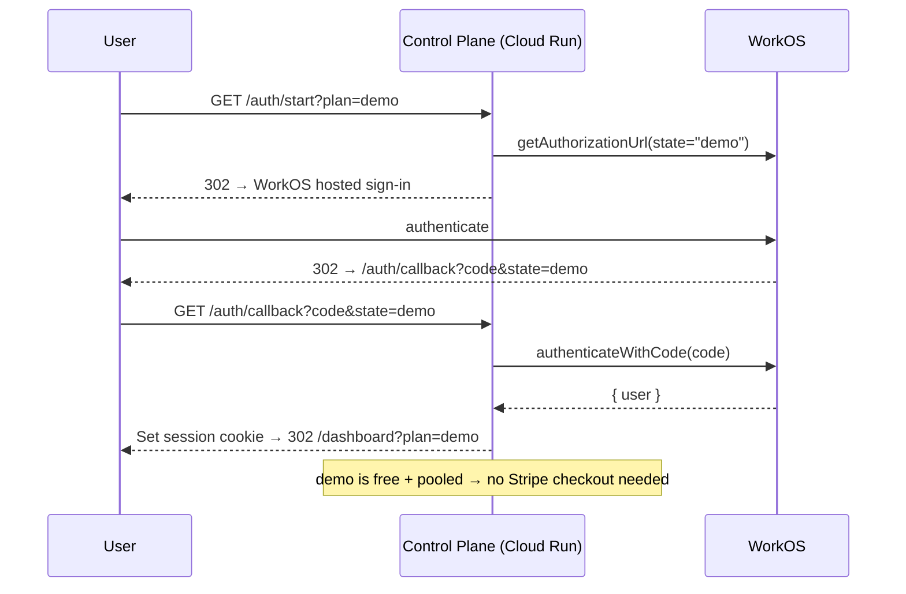

# Deploy the xNet Cloud Staging Control Plane (cloud-staging.xnet.fyi)

## Problem Statement

We've built the entire xNet Cloud control plane — auth funnel, Stripe checkout,
per-tenant hub provisioning, Firestore stores, fleet observability, a public
status page, a Dockerfile, a deploy workflow, and a fully-filled
`apps/cloud/.env.staging` with real WorkOS / Stripe / Google Cloud / Cloudflare R2
credentials. The goal now is concrete: **get
[`https://cloud-staging.xnet.fyi/auth/start?plan=demo`](https://cloud-staging.xnet.fyi/auth/start?plan=demo)
actually serving** — a live, deployed staging control plane that signs a user in
through WorkOS and lands them on the dashboard with the free `demo` plan selected.

The credentials exist. The code exists. What's missing is the *last mile*: turning
those credentials into running cloud infrastructure. This exploration audits the
**live** state of the staging GCP project, identifies exactly what is and isn't
provisioned, and lays out the shortest correct path to a working deploy.

## Executive Summary

The env file is complete (`cloud-env-doctor` reports **✓ M1 and ✓ M2** — every
required credential is filled). A live `gcloud` audit of project
`xnet-cloud-staging-0` shows the **foundation is provisioned** (project, billing,
APIs, Artifact Registry, Firestore, the deployer service account with all five
roles, and the SA key on disk). What remains is the **deploy itself plus a handful
of last-mile steps that no existing script automates**:

| #   | Remaining step                                            | Why it's needed                                                                    | Automated today?         |
| --- | --------------------------------------------------------- | ---------------------------------------------------------------------------------- | ------------------------ |
| 1   | **Push secrets → GCP Secret Manager**                     | The deploy uses `--set-secrets`, referencing ~17 secret resources that don't exist | ❌ no script              |
| 2   | **Build + push the control-plane image**                  | Artifact Registry is empty; Cloud Run needs an image                               | ✅ script (needs Docker)  |
| 3   | **Build + push the hub image** (`xnet-hub@1.0.0`)         | Provisioning a tenant hub pins to this image tag                                   | ✅ script (needs Docker)  |
| 4   | **`gcloud run deploy`** with the right env + runtime SA   | Stand up the service                                                               | ⚠️ workflow, inert       |
| 5   | **Domain mapping + Cloudflare DNS** for the subdomain     | `cloud-staging.xnet.fyi` must route to the service                                 | ❌ manual                 |
| 6   | **Register staging URLs in WorkOS + Stripe dashboards**   | Redirect URI + webhook endpoint must point at the staging origin                   | ❌ manual (external)      |
| 7   | _(optional)_ WIF + repo vars for **CI deploys**           | Only if you want push-to-main deploys instead of laptop deploys                    | ❌ manual                 |

**Recommendation:** do the **first deploy by hand from the laptop** using the SA key
that's already on disk (everything needed is local), building images with **Cloud
Build** (`gcloud builds submit`) since Docker isn't running locally. Add one small
script to push secrets. Then — once the service is proven green — wire WIF + the
repo variable so future merges deploy automatically. This gets to a live
`/auth/start?plan=demo` in roughly an hour of operator time, most of it waiting on
image builds and DNS/cert propagation.

## Current State In The Repository

The control plane is a Hono service composed from the cloud packages, with
real-substrate adapters selected by environment variable and in-memory fakes as the
fallback.

- **Composition root** — [`apps/cloud/src/index.ts`](apps/cloud/src/index.ts):
  `buildControlPlane()` picks Firestore stores when `firestoreStoresFromEnv()`
  resolves, the Cloud Run provisioner when `cloudRunProvisionerFromEnv()` resolves,
  WorkOS when its three vars are set, and Stripe when its keys are set — otherwise
  fakes. `start()` only runs when invoked directly (`import.meta.url ===
  file://${argv[1]}`), reads `PORT ?? 4455`, and logs the resolved `mode`.
- **HTTP surface** — [`apps/cloud/src/server.ts`](apps/cloud/src/server.ts):
  `/health`, public `/status.json` (aggregate-only), the `/auth/start →
  /auth/callback` WorkOS funnel (the `?plan=` query round-trips through `state`),
  `/dashboard`, `/checkout` + `/portal` + `/webhooks/stripe`, the device-grant
  "claim your hub" flow, and `/internal/*` admin routes gated by a shared secret.
- **The `demo` plan** — [`packages/entitlements/src/plans.ts`]: `PlanId` is
  `demo | personal | family | team | community | company | enterprise`. `demo` is a
  free, `pooled`-isolation plan (10 MiB quota, AI disabled, SLA `none`) — it has
  **no Stripe price** ([`apps/cloud/src/billing-gateway.ts`] `PRICE_BY_PLAN` covers
  only personal/family/team), so the `demo` funnel signs in and dashboards **without
  a checkout**. That's exactly the cheap path to prove auth end-to-end.
- **Provisioner** — `CloudRunLitestreamProvisioner`
  (`packages/cloud/src/provisioner/adapters/cloud-run-litestream.ts`): creates a
  per-tenant Cloud Run service from `${imageRepository}:${targetVersion}`, injecting
  `LITESTREAM=1` + the four `R2_*` vars so each hub replicates its SQLite WAL to R2.
  The control plane's `defaultTargetVersion` comes from `HUB_IMAGE_TAG`
  ([`index.ts`](apps/cloud/src/index.ts) — default `xnet-hub@0.0.1`).
- **Real adapters** —
  [`apps/cloud/src/provisioner/google-cloud-run-client.ts`] (`@google-cloud/run`
  v2), [`apps/cloud/src/stores/firestore.ts`] (gated on `GCP_FIRESTORE_DATABASE` +
  `GCP_PROJECT_PREFIX`, persists `tenants` + `bindings`),
  [`apps/cloud/src/billing/stripe-gateway.ts`] (`stripeGatewayFromEnv`).
- **Containerization** — [`apps/cloud/Dockerfile`](apps/cloud/Dockerfile)
  (single-stage, pnpm workspace, no native deps) +
  [`apps/cloud/Dockerfile.dockerignore`](apps/cloud/Dockerfile.dockerignore) (the
  root `.dockerignore` excludes `apps/`).
- **Deploy automation** —
  [`.github/workflows/deploy-cloud.yml`](.github/workflows/deploy-cloud.yml): builds
  + pushes via Workload Identity Federation, `gcloud run deploy` with a long
  `--set-env-vars` / `--set-secrets`, smoke-tests. **Inert** — guarded by
  `if: vars.CLOUD_DEPLOY_ENABLED == 'true'`, so it skips green until an operator opts
  in.
- **Operator tooling** — [`docs/cloud/SETUP.md`](docs/cloud/SETUP.md) (the
  click-through runbook), [`scripts/cloud-gcp-bootstrap.sh`] (provisions GCP),
  [`scripts/cloud-build-control-plane.sh`] + [`scripts/cloud-build-hub-image.sh`]
  (image builds), [`scripts/cloud-env-doctor.mjs`] +
  [`scripts/cloud-env-schema.mjs`] (env validation), [`scripts/cloud-smoke.mjs`]
  (post-deploy contract test).

This is the natural next step after exploration
[`0201`](docs/explorations/0201_[_]_CLOUD_STAGING_STATUS_PAGE_AND_LIVE_TESTING.md)
(which shipped the Dockerfile, deploy workflow, status page, and env tooling) and
the [`0196`](docs/explorations/0196_[_]_XNET_CLOUD_PATH_TO_PRODUCTION_RUNBOOK.md)
production runbook.

## Live Infrastructure Audit

Run against project `xnet-cloud-staging-0` with the user's authenticated `gcloud`
(read-only `describe`/`list` only):

```mermaid
flowchart LR
  subgraph Done["✅ Already provisioned (verified live)"]
    A[GCP project + billing OPEN]
    B[APIs: run, AR, firestore,<br/>secretmanager, iam, iamcredentials]
    C[Artifact Registry repo 'hub']
    D[Firestore '(default)' NATIVE us-central1]
    E[Deployer SA + 5 roles + key on disk]
    F[".env.staging ✓ M1 ✓ M2"]
  end
  subgraph Todo["⬜ Remaining (not yet done)"]
    G[Secret Manager: EMPTY]
    H[Control-plane image: NOT pushed]
    I[Hub image: NOT pushed]
    J[Cloud Run service: NONE]
    K[Domain mapping + DNS: NONE]
    L[WorkOS/Stripe URL registration: verify]
    M[WIF pool/provider: NONE]
  end
  Done --> Todo
```

**Confirmed present:**

- ✅ **Project + billing** — `xnet-cloud-staging-0`, `billingEnabled: True`.
- ✅ **APIs enabled** — `run`, `artifactregistry`, `firestore`, `secretmanager`,
  `iam`, **and `iamcredentials`** (the last is needed for SA impersonation / WIF).
- ✅ **Artifact Registry** — the `hub` Docker repo exists (location `us`).
- ✅ **Firestore** — `(default)`, `FIRESTORE_NATIVE`, `us-central1`.
- ✅ **Deployer SA** — `xnet-deployer@xnet-cloud-staging-0.iam.gserviceaccount.com`
  with `run.admin`, `artifactregistry.writer`, `iam.serviceAccountUser`,
  `secretmanager.secretAccessor`, `datastore.user`. The JSON key is on disk at the
  path in `GOOGLE_APPLICATION_CREDENTIALS` and its `client_email` matches.
- ✅ **Env file** — `cloud-env-doctor` → ✓ M1 + ✓ M2; non-secret config:
  `XNET_CLOUD_BASE_URL=https://cloud-staging.xnet.fyi`,
  `HUB_IMAGE_TAG=xnet-hub@1.0.0`,
  `GCP_ARTIFACT_REGISTRY=us-docker.pkg.dev/xnet-cloud-staging-0/hub`,
  `R2_BUCKET=xnet-hub-data-staging`.

**Confirmed missing:**

- ❌ **Artifact Registry is empty** — `docker images list` on the `hub` repo returns
  nothing. **Neither the control-plane image nor the hub image has been built or
  pushed.** Both are required (control-plane to run; hub to provision tenants).
- ❌ **Secret Manager is empty** — `gcloud secrets list` returns nothing. The deploy
  workflow's `--set-secrets` references `xnet-plan-secret`, `session-secret`,
  `internal-secret`, `workos-client-id`, `workos-api-key`, `workos-redirect-uri`,
  `stripe-secret`, `stripe-webhook`, `stripe-price-{personal,family,team}`,
  `r2-account-id`, `r2-endpoint`, `r2-key-id`, `r2-secret`, `gcp-artifact-registry`
  — **none of which exist yet**, and no script creates them.
- ❌ **No Cloud Run service** — `run services list` is empty; the control plane has
  never been deployed.
- ❌ **No domain mapping** and (separately) no Cloudflare DNS record for
  `cloud-staging.xnet.fyi`.
- ❌ **No WIF pool/provider** — `workload-identity-pools list` is empty. CI deploys
  can't authenticate yet (laptop deploys via the SA key are unaffected).

**Local toolchain:** `gcloud` is installed and authenticated
(`chris.smothers@gmail.com`); **Docker is *not* running** — so the `buildx --push`
build scripts won't work as-is. Use Cloud Build instead (below).

## External Research

- **Cloud Run custom domain mapping is still a Preview feature**, available only in
  a subset of regions — **`us-central1` is supported** — but Google explicitly notes
  latency issues and **does not recommend it for production**; the recommended
  production path is a **global external Application Load Balancer** with a
  serverless NEG (own TLS cert, URL routing, Cloud CDN/Armor). For *staging*, the
  preview mapping in us-central1 is fine and is the lowest-effort option; since we
  already use Cloudflare for DNS/R2, fronting the service with a **Cloudflare
  proxied CNAME** is a clean alternative.
  ([Cloud Run mapping custom domains](https://docs.cloud.google.com/run/docs/mapping-custom-domains),
  [Cloud Run locations](https://docs.cloud.google.com/run/docs/locations))
- **Workload Identity Federation** is the recommended way to let GitHub Actions
  authenticate to GCP without long-lived keys: create a pool + an OIDC provider
  bound to the repo, grant the deployer SA `roles/iam.workloadIdentityUser` for that
  principal, then set `workload_identity_provider` + `service_account` on
  `google-github-actions/auth@v2`. The workflow needs `permissions: id-token:
  write` and `actions/checkout` **before** the auth step — both already correct in
  `deploy-cloud.yml`.
  ([google-github-actions/auth](https://github.com/google-github-actions/auth))
- **No local Docker required:** `gcloud builds submit --tag <image>` runs the build
  in Cloud Build (linux/amd64 by default, exactly what Cloud Run wants), uploading
  the repo as build context. Gate the context with `.gcloudignore` (Cloud Build does
  not read the BuildKit-scoped `Dockerfile.dockerignore`).

## Key Findings

1. **The credentials question is settled.** ✓ M1 + ✓ M2 means we are not blocked on
   accounts or keys. The user's instinct is correct — there's enough to deploy.
2. **The real blocker is automation that doesn't exist yet:** secrets have to be
   *pushed* to Secret Manager, and images have to be *built and pushed*. The repo
   has scripts for the env file and the GCP bootstrap, but **no `secrets-push`
   script** and (because Docker isn't running) no working image build path on this
   laptop.
3. **Two images, not one.** The control-plane image runs the service; the **hub
   image** (`xnet-hub@1.0.0`) is what each provisioned tenant runs. A `demo`
   sign-in *doesn't* need the hub image (pooled, no dedicated hub), so we can deploy
   and prove auth first, then build the hub image before exercising paid
   provisioning.
4. **Runtime service-account gap.** `deploy-cloud.yml` doesn't pass
   `--service-account`, so the service runs as the **default compute SA** (which has
   `roles/editor`). Editor covers Firestore and creating Cloud Run services, but
   `--set-secrets` resolution at boot needs the *runtime* SA to have
   `secretmanager.secretAccessor`, which Editor does **not** reliably grant for
   accessing secret *payloads*. **Fix:** deploy with
   `--service-account=xnet-deployer@…` (it has `secretAccessor`) or, cleaner, mint a
   dedicated runtime SA with exactly `secretAccessor` + `datastore.user` + `run.admin`
   + `iam.serviceAccountUser`.
5. **`HUB_IMAGE_TAG` is absent from the deploy env.** The workflow's
   `--set-env-vars` omits `HUB_IMAGE_TAG`, so a deployed control plane would fall
   back to `defaultTargetVersion = 'xnet-hub@0.0.1'` and try to provision tenants
   from a tag that won't exist. **Add `HUB_IMAGE_TAG=xnet-hub@1.0.0`** to the deploy
   env (and build the hub image at that tag).
6. **Verify the R2 endpoint shape.** `R2_ENDPOINT` is currently
   `https://<acct>.r2.cloudflarestorage.com/xnet-hub-data-staging` — it includes the
   **bucket path**. The S3-style endpoint Litestream/AWS SDKs expect is usually the
   **bare** `https://<acct>.r2.cloudflarestorage.com` with the bucket passed
   separately (`R2_BUCKET`). An endpoint with the bucket baked in can produce a
   doubled `…/bucket/bucket/…` key path. Confirm against how
   `CloudRunLitestreamProvisioner` composes the Litestream config before relying on
   hub backups.
7. **The deploy workflow is production-grade but inert.** Flipping
   `CLOUD_DEPLOY_ENABLED=true` without first creating the secrets + WIF would fail
   the run. Order matters: secrets + images + WIF *first*, the variable *last*.

## Options And Tradeoffs

### A. How to authenticate the deploy

| Option                              | Pros                                                                  | Cons                                                        |
| ----------------------------------- | --------------------------------------------------------------------- | ----------------------------------------------------------- |
| **Laptop + SA key** *(recommended first)* | Everything is already local; zero new infra; fastest to first green | Long-lived key on disk; manual; not repeatable in CI        |
| **CI + Workload Identity Federation** | No long-lived keys; push-to-main deploys; the workflow already exists | Requires creating the pool/provider + repo secrets/variable first |

The two aren't mutually exclusive — do the laptop deploy to prove the path, then
wire WIF so subsequent deploys are automatic.

### B. How to build the images (Docker isn't running)

| Option                                  | Pros                                            | Cons                                          |
| --------------------------------------- | ----------------------------------------------- | --------------------------------------------- |
| **Cloud Build** (`gcloud builds submit`) *(recommended)* | No local Docker; native linux/amd64; uses the SA | Uploads repo context; need `.gcloudignore`    |
| **Start local Docker + the build scripts** | Reuses `cloud-build-*.sh` as written            | Requires Docker Desktop running; qemu amd64 cross-build is slow on Apple Silicon |

### C. How to route the subdomain

| Option                                       | Pros                                            | Cons                                                    |
| -------------------------------------------- | ----------------------------------------------- | ------------------------------------------------------- |
| **Cloud Run domain mapping** (us-central1)   | One `gcloud` command; Google-managed TLS        | Preview; latency caveats; emits a CNAME to add at DNS   |
| **Cloudflare proxied CNAME → run.app URL** *(recommended given we're on Cloudflare)* | DNS + TLS we already control; instant | Must preserve Host / handle Cloud Run's host check; orange-cloud nuances |
| **Global external HTTPS LB + serverless NEG** | Production-grade; CDN/Armor/own cert            | Most setup; overkill for staging                        |

## Recommendation

**Deploy by hand from the laptop now; wire CI/WIF after it's green.** Concretely:

1. **Add a `scripts/cloud-secrets-push.mjs`** that reads `apps/cloud/.env.staging`
   and creates/updates each Secret Manager secret the workflow references (idempotent
   `create || add-version`). This is the one missing piece of automation and it pays
   off for every future deploy. (Sketch below.)
2. **Build + push both images via Cloud Build** (no local Docker):
   control-plane first (needed to run), hub at `xnet-hub@1.0.0` (needed before paid
   provisioning).
3. **`gcloud run deploy` from the laptop** with the full env, **adding
   `HUB_IMAGE_TAG`** and an explicit **`--service-account`** (the deployer SA, or a
   new runtime SA), reading secrets from Secret Manager.
4. **Route `cloud-staging.xnet.fyi`** — simplest is a Cloudflare CNAME (the account
   already owns the zone); domain mapping in us-central1 is the fallback. Wait for
   the managed cert.
5. **Register the staging URLs** in the WorkOS staging app (redirect URI
   `https://cloud-staging.xnet.fyi/auth/callback`) and Stripe (webhook
   `https://cloud-staging.xnet.fyi/webhooks/stripe`, events
   `checkout.session.completed` + `customer.subscription.deleted`).
6. **Smoke-test** `node scripts/cloud-smoke.mjs https://cloud-staging.xnet.fyi`,
   then open `/auth/start?plan=demo` and sign in.
7. **Then** create the WIF pool/provider, add repo secrets `WIF_PROVIDER` +
   `DEPLOYER_SA`, the protected `cloud-staging` environment, and finally set the
   repo variable **`CLOUD_DEPLOY_ENABLED=true`** so merges deploy automatically.



Target runtime topology once deployed:

```mermaid
flowchart TB
  user([browser]) -->|cloud-staging.xnet.fyi| dns{Cloudflare DNS / TLS}
  dns --> cr["Cloud Run: xnet-cloud-staging<br/>(control plane)"]
  cr -->|ADC = runtime SA| fs[(Firestore '(default)')]
  cr -->|--set-secrets at boot| sm[[Secret Manager]]
  cr -->|AuthKit| workos[(WorkOS staging)]
  cr -->|API + webhooks| stripe[(Stripe test mode)]
  cr -->|provision paid tenant| hub["Cloud Run: per-tenant hub<br/>(xnet-hub@1.0.0)"]
  hub -->|Litestream WAL replicate| r2[(Cloudflare R2<br/>xnet-hub-data-staging)]
  cr -. pulls image .-> ar[(Artifact Registry 'hub')]
  hub -. pulls image .-> ar
```

## Example Code

### 1. Push `.env.staging` into Secret Manager (the missing script)

A minimal, idempotent pusher (map env keys → the secret names the workflow expects):

```js
// scripts/cloud-secrets-push.mjs  — usage:
//   node scripts/cloud-secrets-push.mjs apps/cloud/.env.staging xnet-cloud-staging-0
import { execFileSync } from 'node:child_process'
import { readFileSync } from 'node:fs'

const [file, project] = process.argv.slice(2)
const NAME = {                       // ENV_VAR → Secret Manager secret id (matches deploy-cloud.yml)
  XNET_PLAN_SECRET: 'xnet-plan-secret',
  XNET_CLOUD_SESSION_SECRET: 'session-secret',
  XNET_CLOUD_INTERNAL_SECRET: 'internal-secret',
  WORKOS_CLIENT_ID: 'workos-client-id', WORKOS_API_KEY: 'workos-api-key',
  WORKOS_REDIRECT_URI: 'workos-redirect-uri',
  STRIPE_SECRET_KEY: 'stripe-secret', STRIPE_WEBHOOK_SECRET: 'stripe-webhook',
  STRIPE_PRICE_PERSONAL: 'stripe-price-personal',
  STRIPE_PRICE_FAMILY: 'stripe-price-family', STRIPE_PRICE_TEAM: 'stripe-price-team',
  R2_ACCOUNT_ID: 'r2-account-id', R2_ENDPOINT: 'r2-endpoint',
  R2_ACCESS_KEY_ID: 'r2-key-id', R2_SECRET_ACCESS_KEY: 'r2-secret',
  GCP_ARTIFACT_REGISTRY: 'gcp-artifact-registry'
}
const env = Object.fromEntries(
  readFileSync(file, 'utf8').split('\n')
    .map((l) => l.trim()).filter((l) => l && !l.startsWith('#'))
    .map((l) => [l.slice(0, l.indexOf('=')).trim(), l.slice(l.indexOf('=') + 1).trim()])
)
const gcloud = (args, input) =>
  execFileSync('gcloud', [...args, '--project', project], { input, stdio: ['pipe', 'inherit', 'inherit'] })
for (const [k, secret] of Object.entries(NAME)) {
  const val = env[k]
  if (!val || val.startsWith('CHANGEME')) { console.warn(`skip ${secret} (no ${k})`); continue }
  try { gcloud(['secrets', 'describe', secret]) }
  catch { gcloud(['secrets', 'create', secret, '--replication-policy=automatic']) }
  gcloud(['secrets', 'versions', 'add', secret, '--data-file=-'], val)
  console.log(`✓ ${secret}`)
}
```

### 2. Build + push both images without local Docker (Cloud Build)

```bash
P=xnet-cloud-staging-0; REPO=us-docker.pkg.dev/$P/hub; SHA=$(git rev-parse --short HEAD)

# Control-plane image (apps/cloud/Dockerfile builds from repo root)
gcloud builds submit --project "$P" \
  --config=- . <<'YAML'
steps:
  - name: gcr.io/cloud-builders/docker
    args: ['build','-f','apps/cloud/Dockerfile','-t','${_IMAGE}','.']
images: ['${_IMAGE}']
YAML
# (or simply: gcloud builds submit --tag "$REPO/control-plane:$SHA" --project "$P"  if the root Dockerfile were the cloud one)

# Hub image at the tag the env pins to
GCP_ARTIFACT_REGISTRY="$REPO" VERSION=1.0.0 bash scripts/cloud-build-hub-image.sh   # once Docker is up
```

> Add a `.gcloudignore` (mirror `apps/cloud/Dockerfile.dockerignore` + drop
> `node_modules`, `.git`) so Cloud Build doesn't upload the whole tree.

### 3. Deploy to Cloud Run (laptop, SA key already active)

```bash
P=xnet-cloud-staging-0; R=us-central1; SVC=xnet-cloud-staging
IMAGE=us-docker.pkg.dev/$P/hub/control-plane:$(git rev-parse --short HEAD)

gcloud run deploy "$SVC" --project "$P" --region "$R" \
  --image "$IMAGE" --allow-unauthenticated --min-instances=1 \
  --service-account "xnet-deployer@$P.iam.gserviceaccount.com" \
  --set-env-vars "NODE_ENV=production,XNET_CLOUD_BASE_URL=https://cloud-staging.xnet.fyi,XNET_CLOUD_MARKETING_URL=https://xnet.fyi/cloud,GCP_PROJECT_PREFIX=xnet-cloud-staging,GCP_REGION=$R,GCP_FIRESTORE_DATABASE=(default),R2_BUCKET=xnet-hub-data-staging,HUB_IMAGE_TAG=xnet-hub@1.0.0,AI_MARKUP=1.25" \
  --set-secrets "XNET_PLAN_SECRET=xnet-plan-secret:latest,XNET_CLOUD_SESSION_SECRET=session-secret:latest,XNET_CLOUD_INTERNAL_SECRET=internal-secret:latest,WORKOS_CLIENT_ID=workos-client-id:latest,WORKOS_API_KEY=workos-api-key:latest,WORKOS_REDIRECT_URI=workos-redirect-uri:latest,STRIPE_SECRET_KEY=stripe-secret:latest,STRIPE_WEBHOOK_SECRET=stripe-webhook:latest,STRIPE_PRICE_PERSONAL=stripe-price-personal:latest,STRIPE_PRICE_FAMILY=stripe-price-family:latest,STRIPE_PRICE_TEAM=stripe-price-team:latest,R2_ACCOUNT_ID=r2-account-id:latest,R2_ENDPOINT=r2-endpoint:latest,R2_ACCESS_KEY_ID=r2-key-id:latest,R2_SECRET_ACCESS_KEY=r2-secret:latest,GCP_ARTIFACT_REGISTRY=gcp-artifact-registry:latest"
```

> This mirrors `deploy-cloud.yml` but adds `--service-account` and `HUB_IMAGE_TAG`
> (both finding #4/#5). Keep the workflow in sync with whatever proves out here.

### 4. Route the subdomain

```bash
# Option A — Cloud Run domain mapping (us-central1 supports it; preview)
gcloud run domain-mappings create --service xnet-cloud-staging \
  --domain cloud-staging.xnet.fyi --region us-central1 --project xnet-cloud-staging-0
#   → prints a CNAME/records to add in the Cloudflare zone (DNS-only / grey-cloud).

# Option B — Cloudflare CNAME straight to the run.app URL (then verify Host handling).
```

### 5. (Later) Workload Identity Federation for CI

```bash
P=xnet-cloud-staging-0; PNUM=$(gcloud projects describe "$P" --format='value(projectNumber)')
gcloud iam workload-identity-pools create github --project "$P" --location=global --display-name="GitHub"
gcloud iam workload-identity-pools providers create-oidc github --project "$P" --location=global \
  --workload-identity-pool=github --display-name="GitHub OIDC" \
  --attribute-mapping="google.subject=assertion.sub,attribute.repository=assertion.repository" \
  --attribute-condition="assertion.repository=='<owner>/<repo>'" \
  --issuer-uri="https://token.actions.githubusercontent.com"
gcloud iam service-accounts add-iam-policy-binding "xnet-deployer@$P.iam.gserviceaccount.com" \
  --project "$P" --role=roles/iam.workloadIdentityUser \
  --member="principalSet://iam.googleapis.com/projects/$PNUM/locations/global/workloadIdentityPools/github/attribute.repository/<owner>/<repo>"
# Then: repo secrets WIF_PROVIDER + DEPLOYER_SA, protected env 'cloud-staging',
#       and finally repo variable CLOUD_DEPLOY_ENABLED=true.
```

## Risks And Open Questions

- **Runtime SA & secrets (finding #4).** If you deploy without `--service-account`,
  boot may fail to read secrets. Confirm by tailing `gcloud run services logs` right
  after deploy. Cleanest long-term: a dedicated runtime SA (least privilege), not
  the deployer.
- **R2 endpoint shape (finding #6).** Verify whether `R2_ENDPOINT` should be the
  bare account host vs. include the bucket. Wrong shape silently breaks hub backups,
  not the control plane — so it won't show up in the `demo` smoke test.
- **Hub image tag mismatch (finding #5).** Paid provisioning needs
  `xnet-hub@1.0.0` actually built and pushed; until then keep to `demo` for the
  proof. Confirm the provisioner composes the image ref the way the tag is written
  (`repo:xnet-hub@1.0.0` vs `repo@sha` vs `repo:1.0.0`).
- **Cloud Run domain-mapping preview latency.** Acceptable for staging; revisit a
  load balancer or Cloudflare proxy before production.
- **WorkOS redirect mismatch.** Sign-in 1:1 requires the dashboard's redirect URI to
  match `WORKOS_REDIRECT_URI` exactly; a trailing-slash or http/https mismatch
  bounces the callback. (For laptop-against-staging there's the documented
  `.env.staging.local` override.)
- **Secret drift.** Once secrets live in Secret Manager, the `.env.staging` file and
  the secrets can diverge. Treat Secret Manager as the deployed source of truth and
  re-run the push script on rotation.
- **Min-instances cost.** `--min-instances=1` keeps one warm instance (small but
  non-zero idle cost). Drop to `0` for true scale-to-zero staging if the cold-start
  is acceptable.

## Implementation Checklist

- [ ] Add `scripts/cloud-secrets-push.mjs` (idempotent create-or-add-version) and
      run it against `apps/cloud/.env.staging` for project `xnet-cloud-staging-0`.
- [ ] Verify the 16 secrets exist: `gcloud secrets list --project xnet-cloud-staging-0`.
- [ ] Add a `.gcloudignore` so Cloud Build context stays small.
- [ ] Build + push the **control-plane** image (Cloud Build or local Docker).
- [ ] Build + push the **hub** image at `xnet-hub@1.0.0` (needed before paid provisioning).
- [ ] Decide the **runtime SA** (deployer SA now, or mint a least-privilege one) and
      pass `--service-account` on deploy.
- [ ] `gcloud run deploy xnet-cloud-staging` with the env above **including
      `HUB_IMAGE_TAG`**; confirm boot logs show `auth: workos, payments: stripe,
      provisioner: cloud-run, stores: firestore`.
- [ ] Map `cloud-staging.xnet.fyi` (Cloud Run domain mapping **or** Cloudflare CNAME)
      and add the DNS record; wait for the managed certificate.
- [ ] Register `https://cloud-staging.xnet.fyi/auth/callback` in the WorkOS **staging**
      app's redirect URIs.
- [ ] Register the Stripe **test-mode** webhook
      `https://cloud-staging.xnet.fyi/webhooks/stripe`
      (`checkout.session.completed` + `customer.subscription.deleted`); confirm the
      signing secret matches `STRIPE_WEBHOOK_SECRET`.
- [ ] Verify / fix `R2_ENDPOINT` shape against the Litestream config.
- [ ] Update `deploy-cloud.yml` to add `--service-account` + `HUB_IMAGE_TAG` so CI
      matches the proven manual deploy.
- [ ] _(CI path)_ Create the WIF pool/provider, bind the deployer SA, add repo
      secrets `WIF_PROVIDER` + `DEPLOYER_SA`, the protected `cloud-staging`
      environment, and set `CLOUD_DEPLOY_ENABLED=true`.

## Validation Checklist

- [ ] `node scripts/cloud-smoke.mjs https://cloud-staging.xnet.fyi` passes all three
      checks (`/health`, `/status.json` with no leaked fields, `/auth/start` redirect).
- [ ] `GET https://cloud-staging.xnet.fyi/health` → `{"status":"ok","substrate":"ready"}`.
- [ ] `GET https://cloud-staging.xnet.fyi/auth/start?plan=demo` 302-redirects to the
      **WorkOS** host (not a dev provider) with `state=demo`.
- [ ] Completing WorkOS sign-in lands on `/dashboard?plan=demo` with a session
      cookie set (no Stripe checkout for `demo`).
- [ ] Cloud Run logs show the resolved `mode` with `stores: firestore` and
      `provisioner: cloud-run` (proves the real adapters, not fakes, were selected).
- [ ] A throwaway paid checkout (Stripe test card) fires the webhook and provisions a
      tenant hub Cloud Run service that appears under the project; clean it up after.
- [ ] `https://cloud-staging.xnet.fyi/status.json` returns the aggregate shape and
      contains none of `tenantId`/`hubUrl`/`billingUserId`/`email`.
- [ ] _(CI path)_ A manual `workflow_dispatch` of `deploy-cloud` authenticates via
      WIF and redeploys green.

## References

- [`docs/cloud/SETUP.md`](docs/cloud/SETUP.md) — the click-through operator runbook
  (Parts 4 & 5 cover local-against-staging and the deploy).
- [`apps/cloud/src/index.ts`](apps/cloud/src/index.ts) — composition root +
  env-driven adapter selection.
- [`apps/cloud/src/server.ts`](apps/cloud/src/server.ts) — the `/auth/start` funnel
  and routes.
- [`.github/workflows/deploy-cloud.yml`](.github/workflows/deploy-cloud.yml) — the
  inert-by-default deploy workflow this exploration operationalizes.
- [`scripts/cloud-gcp-bootstrap.sh`](scripts/cloud-gcp-bootstrap.sh),
  [`scripts/cloud-build-control-plane.sh`](scripts/cloud-build-control-plane.sh),
  [`scripts/cloud-build-hub-image.sh`](scripts/cloud-build-hub-image.sh),
  [`scripts/cloud-env-doctor.mjs`](scripts/cloud-env-doctor.mjs),
  [`scripts/cloud-smoke.mjs`](scripts/cloud-smoke.mjs).
- Exploration [`0201`](docs/explorations/0201_[_]_CLOUD_STAGING_STATUS_PAGE_AND_LIVE_TESTING.md)
  (status page + containerization + env tooling) and
  [`0196`](docs/explorations/0196_[_]_XNET_CLOUD_PATH_TO_PRODUCTION_RUNBOOK.md)
  (production runbook).
- [Cloud Run — Mapping custom domains](https://docs.cloud.google.com/run/docs/mapping-custom-domains)
  · [Cloud Run locations](https://docs.cloud.google.com/run/docs/locations)
- [google-github-actions/auth (Workload Identity Federation)](https://github.com/google-github-actions/auth)
