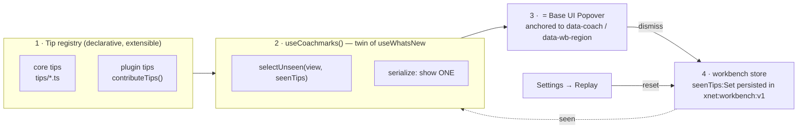
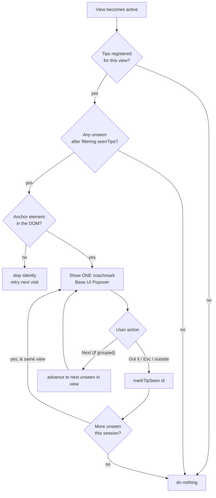
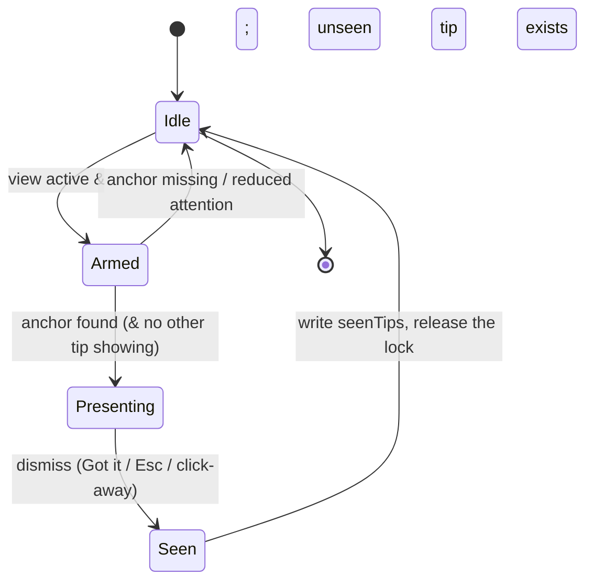

# Light, Extensible Onboarding & First-Run Coachmarks

## Problem Statement

New users land in xNet's full VS Code–style workbench — a left rail, an
Explorer, an editor area with tabs, context panels, a status bar, a command
palette, and a couple dozen view types (Pages, Databases, Canvas, Maps, Tasks,
CRM, Chat, Labs, Marketplace…). There is **first-run account setup**
(`/welcome` — age/content-dial/discovery; `packages/react/src/onboarding/*` —
passkey + hub connect) but there is **no in-app feature education**. Nothing
ever says "this is the command palette," "this rail icon is your CRM," or "drop
a block here." A first-time user has to discover everything by clicking around.

The ask: *something really light and elegant — maybe just a few tooltips that
render the first time you open a view* — and crucially, a design that **grows
with us as features and offerings expand** rather than a one-off tour that rots.

This exploration surveys how the best tools handle this in 2024–2026, grounds
the design in what xNet already ships, and recommends a small, declarative,
**plugin-extensible coachmark system** built on the primitives already in the
tree — no tour library, no new dependency, ~one new store field.

## Executive Summary

- **Don't build a blocking product tour.** The research is lopsided: ~70% of
  users skip linear tours, ~78% abandon by step three, and 7-step tours
  complete only ~16% of the time. The modern, tasteful pattern is **contextual,
  just-in-time coachmarks**: one tip, shown the first time you actually reach a
  surface, dismissible, never blocking. Contextual tips out-engage static tours
  ~2.5× and roughly triple feature adoption in published benchmarks.
- **xNet already has every primitive.** `@base-ui/react` Tooltip + Popover
  (`packages/ui/src/primitives/{Tooltip,Popover}.tsx`), a CSS-first motion
  system with `prefers-reduced-motion` baked in (`packages/ui/src/motion/`,
  `theme/motion.css`), stable region anchors (`data-wb-region` used by F6 focus
  cycling), and — the keystone — a **persisted zustand store that already
  tracks "seen" state** (`lastSeenChangelogId` in `xnet:workbench:v1`, consumed
  by `useWhatsNew`). The coachmark engine is a near-clone of the existing
  What's-New plumbing.
- **Recommendation:** a thin `@xnetjs/react` **coachmark engine** — a
  declarative *tip registry* keyed by view, a `seenTips` set in the workbench
  store, and a `<Coachmark>` component wrapping Base UI Popover. One tip per
  view on first visit, one at a time, Escape-to-dismiss, "Replay onboarding" in
  Settings. **Make the registry plugin-contributable** so that as the app is
  decomposed into plugins (exploration 0205), each feature ships its own tips —
  onboarding grows automatically with the product, no central rewrite.
- Cost: ~200–300 lines + tests, **0 KB** of new runtime deps, no change to the
  shell's behavior (anchors are inert `data-*` attributes).

## Current State In The Repository

### What "onboarding" means today (two unrelated systems, neither teaches features)

1. **Identity / auth onboarding** — `packages/react/src/onboarding/`
   (`OnboardingProvider.tsx`, `OnboardingFlow.tsx`, `machine.ts`, screens:
   `WelcomeScreen`, `HubConnectScreen`, `ImportIdentityScreen`, `ReadyScreen`,
   `SmartWelcome`, `SyncProgressOverlay`). This is a state-machine flow for
   *creating an identity and connecting a hub*. It is about getting an account,
   not learning the app.

2. **Content/safety first-run** — `apps/web/src/routes/welcome.tsx`. Three
   skippable steps (age confirm → content dial → discovery opt-in). It sets a
   single localStorage flag and is consumed as a "finish setup" nudge:

   ```ts
   // apps/web/src/routes/welcome.tsx
   function markOnboarded() { localStorage.setItem('xnet:onboarded', '1') }
   export function hasOnboarded(): boolean {
     return localStorage.getItem('xnet:onboarded') === '1'
   }
   ```

Neither system shows a single tip about what any view *does*. That is the gap.

### The shell & the views a tip would attach to

The workbench (`apps/web/src/workbench/`) is a persisted, resizable shell:

- `Workbench.tsx` — desktop grid; `MobileShell.tsx` — compact sheet layout
  (branched on `useIsCompact()`, per exploration 0196).
- `Rail.tsx` — 44px left icon strip (Search/Cmd+K, Explorer, Chats, Tasks,
  Today, Data, AI, CRM, Discover, Requests, Settings).
- `PanelViewHost.tsx` — left/bottom panel host; `ContextPanel.tsx` — right
  panel; `EditorArea.tsx` — tabbed editor surface; `StatusBar.tsx`.

Views are **TanStack Router file routes** (`apps/web/src/routes/*`) reconciled
into a tab store. The distinct landing surfaces a tip could target: Home `/`,
Page `/doc/$docId`, Database `/db/$dbId`, Canvas `/canvas/$canvasId`, Dashboard,
Map, Saved View, Tasks `/tasks`, Data `/data`, Experiments, CRM `/crm`, Finance,
Channel `/channel/$channelId`, Tag, Person, Lab `/lab/$labId`, Space, Discover,
Settings, Marketplace/Plugins.

**Stable DOM anchors already exist** — `data-wb-region` is set on the real shell
regions and queried by keyboard focus cycling:

```ts
// apps/web/src/workbench/focus.ts
const root = document.querySelector<HTMLElement>(`[data-wb-region="${region}"]`)
```
```tsx
// ContextPanel.tsx:71   <aside data-wb-region="right" …>
// PanelViewHost.tsx:53  <section data-wb-region={slot} …>   // 'left' | 'bottom'
// EditorArea.tsx:276    <div data-wb-region="editor" …>
// MobileShell.tsx:132   data-wb-sheet={side}
```

These are the perfect, already-maintained anchor surface; finer targets (a
specific rail button, the "+ New" affordance) just need a `data-coach` attr.

### The keystone precedent: "seen" tracking already lives in the persisted store

The What's-New feature (exploration 0195) is a working, shipped template for
exactly the "show once, remember you saw it" mechanic — backed by the persisted
workbench store, **not** ad-hoc localStorage:

```ts
// apps/web/src/workbench/state.ts
export const useWorkbench = create<WorkbenchState>()(
  persist((set, get) => ({
    /* … */
    lastSeenChangelogId: null,
    setLastSeenChangelogId: (id) => set({ lastSeenChangelogId: id })
  }), { name: 'xnet:workbench:v1' })
)
```
```ts
// apps/web/src/whats-new/useWhatsNew.ts
const lastSeenId = useWorkbench((s) => s.lastSeenChangelogId)
// closePanel(): if (items[0]) setLastSeen(items[0].id)
// unseen: selectUnseen(items, lastSeenId)
```

A coachmark engine is the same shape: a `seenTips` set in the store, a
`selectUnseenTips(...)` selector, one writer on dismiss.

### The UI primitives are ready

- **Popover** (`packages/ui/src/primitives/Popover.tsx`) — Base UI compound
  component, portalled, positioned, `w-72` card with title/description/close,
  CSS open/close animation via `data-[open]` / `data-[ending-style]`. This is
  the coachmark body, essentially as-is.
- **Tooltip** (`Tooltip.tsx`) — hover/focus hint, for passive affordances.
- **Motion is CSS-first and 0 KB** (exploration 0199). `<Presence>`
  (`packages/ui/src/motion/Presence.tsx`) animates mount/unmount via
  `data-state` + `motion.css` keyframes; `prefers-reduced-motion: reduce`
  collapses every keyframe to ~instant globally (`theme/motion.css:375`).
  *(Note: this app does **not** use Framer Motion — reduced-motion is handled in
  CSS, so a coachmark inherits it for free.)*
- **Base UI version:** `@base-ui/react ^1.1.0` (`packages/ui/package.json`).

### Where a "replay" control belongs

`apps/web/src/routes/settings.tsx` (sections: Profile, Appearance, Content &
Safety, Data, Network, Plugins, Account, About). A "Tips & Tours → Replay
onboarding / Reset tips" row slots in here, mirroring the existing reset
controls.

### The forward pressure: the app is becoming plugins

Exploration 0205 (`0205_[_]_DECOMPOSING_THE_APP_INTO_PLUGINS.md`) and the plugin
ecosystem work (memory: `0192-plugin-ecosystem-platform`, `getCommandRegistry()`
used by Rail search) mean **features increasingly arrive as plugins**. Any
onboarding that hard-codes a central list of tips will be permanently behind. The
registry must accept contributions the same way commands do.

## External Research

(Full sourced survey gathered for this exploration; highlights below.)

### What good tools actually do

| Tool | First-run approach | Takeaway |
|---|---|---|
| **Linear** | *Anti-onboarding.* No tours/coachmarks; sample data + discoverable UI; education deferred to email. | Best case — but requires a UI so clean teaching is unnecessary. |
| **Notion** | Learn-by-doing "Getting Started" page; template routing with demo data; hover tips. | Empty states teach by example; tips arrive at behavioral triggers. |
| **Vercel (Geist)** | Empty state engineered away; four empty-state variants; *"Educational" variants must not auto-launch a tour.* | Reduce the funnel with product intelligence, not tour copy. |
| **Slack** | Guided setup one question at a time; pre-seeded workspace; contextual prompts at hover/nav. | Drop users into value; nudge one decision at a time. |
| **Raycast** | Per-command coachmark the *first time a command is used*; keyboard-first. | Canonical "tip on first encounter," not a front-loaded sequence. |
| **Figma** | *Optional* 3–5 step tour on major redesigns, with GIFs + close at each step. | Tours belong to *change moments*, opt-in, short. |
| **Superhuman / Arc** | High-touch 1:1 onboarding; muscle-memory drills in a sandbox. | Not scalable, but: teach by doing, defer help to the moment of need. |

### The research consensus (numbers)

- **Skip / abandonment:** ~70% skip linear tours; ~78% abandon by step three;
  3-step tours ~72% completion vs 7-step ~16% (Chameleon, from ~58M tour
  interactions). ~76% of static tooltips dismissed within 3s.
- **Contextual beats linear:** contextual tooltips ~58.7% vs ~23.7% static
  engagement (~2.5×); just-in-time onboarding ~2.9× feature adoption vs
  traditional tours; behavior-triggered guidance ~68% higher engagement (NN/g
  2024 benchmark).
- **Progressive disclosure:** working memory ≈ 4 items; front-loaded tours are
  cognitively incompatible; **calendar-based "day 3 tip" is interruption, not
  onboarding** — trigger on *reaching the surface*, not on a timer.
- **Empty states** are "one of the most common silent drop-off points" — never
  show a blank screen; one CTA or seeded sample data.
- **Paradox of the active user** (NN/g): users want to do their task, not learn
  software; anything between them and the goal gets skipped.

### Libraries — and why a library is the wrong call here

| Library | License | ~gzip | Notes |
|---|---|---|---|
| react-joyride v3 | MIT | ~34 KB | Popular; inline styles fight Tailwind; higher CWV cost. |
| Shepherd.js | MIT | ~25 KB | Floating-UI core; React 19 wrapper shaky early 2026. |
| Driver.js | MIT | ~5 KB | Tiny, no official React wrapper; manual DOM bridge. |
| Reactour v2 | MIT | small | Floating-UI; styled-components; low velocity. |
| Tour Kit | MIT core (+$99 Pro) | ~8 KB | 0 axe violations; new/less battle-tested. |
| **Intro.js** | **AGPL-v3** / commercial | ~29 KB | **Avoid** — copyleft contaminates the app. |
| OnboardJS | MIT core | — | *Headless state machine, no positioning* — complements Base UI if flows grow. |

The decisive point: **xNet already ships Base UI Popover/Tooltip + a CSS motion
system + a persisted "seen" store.** A dedicated tour library earns its keep only
for spotlight overlays, multi-step focus-trapping, and async-target sequencing —
none of which the stated goal ("a few tooltips on first view") needs. For
single-step contextual coachmarks, a thin custom layer is *less* code than wiring
a library, has zero bundle impact, and renders natively in the design system.

**Selected sources:** NN/g *Mobile Instructional Overlays* & *Onboarding: Skip
It When Possible*; Laws of UX *Onboarding for Active Users (2024)*; Chameleon
*Product Tour Metrics* & *Benchmark Report*; Appcues *Onboarding UX Patterns* &
*Empty States*; Candu *Linear teardown*; Vercel *Geist Empty State*; Raycast
Manual; Adobe Spectrum *Coach Mark*; Pendo/Userpilot 2024 adoption benchmarks;
Intro.js license; UserTourKit *React tour benchmark 2026*.

## Key Findings

1. **The right pattern is contextual coachmarks, not a tour.** One tip, on first
   visit to a surface, dismissible, non-blocking. This matches both the research
   and the user's instinct ("a few tooltips that render the first time you open a
   view").
2. **xNet can build it with zero new dependencies.** Popover + CSS motion +
   persisted store + `data-wb-region` anchors already exist. The engine is a
   structural twin of `useWhatsNew`.
3. **Extensibility is the actual hard requirement.** "Grow with us" = a
   *declarative registry* that plugins/labs contribute to, not a hand-maintained
   array. Mirror the command-registry pattern.
4. **One tip at a time, ever.** NN/g: simultaneous coachmarks raise cognitive
   load above a blank screen and get dismissed faster. The engine must serialize.
5. **Versioned tip ids** (`crm:overview@1`) let copy rewrites re-surface a tip
   once without polluting the id space — same discipline as `xnet:workbench:v1`.
6. **Reduced motion and a11y are free or cheap.** CSS reduced-motion is global;
   Base UI Popover gives focus management, Escape, and `role`/aria wiring.
7. **Empty states are the other half.** Several views render blank with no data;
   the cheapest "onboarding" is a one-CTA empty state. Track these but they can
   land independently.
8. **Don't re-prompt the auth flow.** This is orthogonal to
   `packages/react/src/onboarding/*`; the coachmark engine starts *after* the app
   is usable.

## Options And Tradeoffs

### A. Blocking multi-step product tour (e.g. react-joyride spotlight)
- **Pros:** guided, linear, "covers everything" in one go.
- **Cons:** the pattern the research most condemns (~70% skip, ~78% drop by step
  3); +34 KB; inline styles fight Tailwind tokens; blocks the UI; rots as
  features change; antithetical to "light and elegant." **Rejected.**

### B. Contextual per-view coachmarks on a custom Base-UI layer — *recommended*
- **Pros:** matches research + the ask; 0 KB; native to design system & motion;
  one tip at a time; trivially extensible via a registry; reuses the proven
  What's-New "seen" plumbing; degrades gracefully (no anchor → no tip).
- **Cons:** we own ~250 lines (well-trodden); no built-in spotlight overlay
  (don't want one); needs anchor attrs added incrementally.

### C. Checklist / "Getting Started" widget
- **Pros:** Zeigarnik completion pull; good for activation milestones (create
  first doc, connect hub, invite).
- **Cons:** heavier UI; premature until there are 5+ worthwhile milestones;
  better as a **phase 2** that *reuses* the same seen-state store. **Defer.**

### D. Empty-state guidance only
- **Pros:** cheapest, most tasteful, zero engine.
- **Cons:** only teaches where there's a blank screen; doesn't explain the rail,
  the command palette, or populated views. **Complement, not replacement.**

### E. Headless library (OnboardJS) + Base UI rendering
- **Pros:** robust state machine if multi-step branching flows ever appear.
- **Cons:** overkill for single-step tips now; adds a dep for logic we can
  express in ~30 lines. **Hold as the upgrade path if B outgrows itself.**

### Decision matrix

| Criterion (weight) | A Tour | **B Coachmarks** | C Checklist | D Empty states |
|---|---|---|---|---|
| Matches "light & lovely" (3) | 1 | **3** | 2 | 3 |
| Research-backed (3) | 1 | **3** | 2 | 3 |
| Grows with features (3) | 1 | **3** | 2 | 1 |
| Bundle / perf cost (2) | 1 | **3** | 2 | 3 |
| Build effort now (2) | 2 | **2** | 1 | 3 |
| Teaches populated views (2) | 3 | **3** | 2 | 1 |
| **Weighted total** | 18 | **41** | 27 | 33 |

B wins, with D as a cheap parallel track and C/E as later phases sharing B's store.

## Recommendation

Build a small **coachmark engine** in `@xnetjs/react` (so web + electron + future
surfaces share it) with four parts:



**First-visit decision flow** (mounted once per active view; no timers):



**Coachmark lifecycle** (one at a time, globally serialized):



### Why this satisfies "grow with us"

A plugin (or lab, or a future feature module) registers tips the same way it
registers commands — `contributeTips([...])`. The engine never changes when a
new feature ships; the feature *brings its own onboarding*. This directly tracks
the 0205 pluginization direction and the existing `getCommandRegistry()` model.

### Guardrails (baked into the engine, not left to authors)

- **One tip at a time**, app-wide (a single "presenting" lock).
- **First *visit*, not first *login*** — fire on view activation.
- **Never block** — Popover with no backdrop; the app stays interactive.
- **Always dismissible** — Escape + visible "Got it"; click-away counts.
- **Persist & version** — `seenTips: Set<string>`, ids like `crm:overview@1`.
- **Cap per session** — at most N (≈2) new tips per session so a long-dormant
  user isn't buried; the rest wait for their next visit.
- **Respect reduced motion** — inherited from `motion.css`.
- **Replayable** — Settings → "Replay onboarding" clears `seenTips`.

## Example Code

> Sketches matching repo conventions (Base UI compound primitives, CSS-first
> motion, zustand persist, `ink`/`surface`/`hairline` tokens). Not final.

### 1 · Declarative tip registry (extensible)

```ts
// packages/react/src/coachmarks/registry.ts
export interface CoachTip {
  /** Stable, versioned. Bump @n to re-surface after a copy change. */
  id: `${string}@${number}`          // e.g. 'crm:overview@1'
  /** Which view this belongs to (route id / tab nodeType / panel id). */
  view: string                       // 'crm' | 'data' | 'tasks' | 'rail' | …
  /** CSS selector for the anchor — prefer data-coach / data-wb-region. */
  anchor: string                     // '[data-coach="rail.search"]'
  title: string
  body: string
  side?: 'top' | 'right' | 'bottom' | 'left'
  /** Optional ordering within a view (lower first). Default 0. */
  order?: number
}

const tips = new Map<string, CoachTip>()

/** Plugins/labs/features call this — onboarding grows without engine edits. */
export function contributeTips(next: CoachTip[]): () => void {
  for (const t of next) tips.set(t.id, t)
  return () => next.forEach((t) => tips.delete(t.id))
}

export function tipsForView(view: string): CoachTip[] {
  return [...tips.values()]
    .filter((t) => t.view === view)
    .sort((a, b) => (a.order ?? 0) - (b.order ?? 0))
}

/** Pure, unit-testable — mirrors whats-new/feed.ts selectUnseen(). */
export function selectUnseenTips(view: string, seen: ReadonlySet<string>): CoachTip[] {
  return tipsForView(view).filter((t) => !seen.has(t.id))
}
```

### 2 · Seen-state on the existing persisted store

```ts
// apps/web/src/workbench/state.ts  (additions — twin of lastSeenChangelogId)
interface WorkbenchState {
  // …
  seenTips: string[]                         // persisted in xnet:workbench:v1
  markTipSeen: (id: string) => void
  resetTips: () => void
}
// in create(persist(...)):
seenTips: [],
markTipSeen: (id) =>
  set((s) => (s.seenTips.includes(id) ? s : { seenTips: [...s.seenTips, id] })),
resetTips: () => set({ seenTips: [] }),
```

### 3 · The engine hook (structural twin of `useWhatsNew`)

```ts
// packages/react/src/coachmarks/useCoachmarks.ts
export function useCoachmarks(activeView: string, max = 2) {
  const seen = useWorkbench((s) => s.seenTips)
  const markSeen = useWorkbench((s) => s.markTipSeen)
  const seenSet = useMemo(() => new Set(seen), [seen])
  const queue = useMemo(
    () => selectUnseenTips(activeView, seenSet).slice(0, max),
    [activeView, seenSet, max]
  )
  const [i, setI] = useState(0)
  useEffect(() => setI(0), [activeView])     // reset cursor on view change
  const current = queue[i]
  const dismiss = useCallback(() => {
    if (current) markSeen(current.id)
    setI((n) => n + 1)
  }, [current, markSeen])
  return { current, dismiss, remaining: Math.max(0, queue.length - i - 1) }
}
```

### 4 · `<Coachmark>` on Base UI Popover (controlled, anchored, motion-aware)

```tsx
// packages/react/src/coachmarks/Coachmark.tsx
import { PopoverRoot, PopoverPositioner, PopoverPopup, PopoverArrow }
  from '@xnetjs/ui'

export function Coachmark({ tip, onDismiss }: { tip: CoachTip; onDismiss: () => void }) {
  const anchor = useAnchorEl(tip.anchor)        // querySelector + MutationObserver
  if (!anchor) return null                       // no anchor → skip silently
  return (
    <PopoverRoot open onOpenChange={(o) => !o && onDismiss()}>
      <PopoverPositioner side={tip.side ?? 'bottom'} anchor={anchor} sideOffset={8}>
        <PopoverPopup
          role="dialog" aria-label={tip.title}
          className="w-72 rounded-md border border-hairline bg-surface-1 p-4
                     text-popover-foreground shadow-md
                     opacity-0 translate-y-1 data-[open]:opacity-100
                     data-[open]:translate-y-0 data-[ending-style]:opacity-0
                     transition-[opacity,transform] duration-fast ease-out"
        >
          <p className="text-sm font-semibold text-ink-1">{tip.title}</p>
          <p className="mt-1 text-xs leading-relaxed text-ink-2">{tip.body}</p>
          <div className="mt-3 flex justify-end">
            <button onClick={onDismiss}
              className="rounded-md px-2 py-1 text-xs font-medium
                         text-ink-2 hover:bg-surface-2">
              Got it
            </button>
          </div>
          <PopoverArrow className="fill-surface-1" />
        </PopoverPopup>
      </PopoverPositioner>
    </PopoverRoot>
  )
}
```

### 5 · Mount point + a couple of seed tips

```tsx
// apps/web/src/workbench/Workbench.tsx  (near GlobalSearch mount)
function CoachmarkLayer() {
  const view = useActiveView()                    // from router/tab store
  const { current, dismiss } = useCoachmarks(view)
  if (!current) return null
  return <Coachmark tip={current} onDismiss={dismiss} />
}
```
```ts
// apps/web/src/workbench/coach-tips.ts  (core seeds; plugins add their own)
contributeTips([
  { id: 'rail:search@1', view: 'home', anchor: '[data-coach="rail.search"]',
    title: 'Find or do anything', body: 'Press ⌘K to jump to any doc, person, or command.' },
  { id: 'crm:overview@1', view: 'crm', anchor: '[data-wb-region="editor"]',
    title: 'Your CRM', body: 'Contacts, deals and orgs live here. Drag a deal between lanes to update its stage.' },
  { id: 'data:overview@1', view: 'data', anchor: '[data-wb-region="editor"]',
    title: 'Data workspace', body: 'Build pipelines and query your nodes. Start from a template or an empty canvas.' },
])
```

Adding `data-coach="rail.search"` to the Rail's search button is the only shell
edit those seeds require — an inert attribute, no behavior change.

## Risks And Open Questions

- **Anchor drift.** Selectors can break if markup changes. Mitigate by
  preferring the already-maintained `data-wb-region` anchors and a small set of
  intentional `data-coach` hooks; the engine **fails silent** (no anchor → no
  tip, retried next visit). A dev-only warning when a registered tip's anchor is
  missing keeps authors honest.
- **Mobile sheets.** Left/right/bottom panels are overlays (`data-wb-sheet`);
  popovers anchored to off-screen elements should resolve to an in-sheet anchor
  or fall back to an inline header tip. Phase 1 can target the editor region
  only on compact widths.
- **First impression vs. noise.** Even one tip on the very first screen can feel
  like much when stacked with the auth flow + `/welcome`. Sequence it: coachmarks
  stay dormant until `hasOnboarded()` is true and the first real view renders.
- **Local-only vs. synced "seen".** `seenTips` is per-device (like
  `lastSeenChangelogId`). Acceptable for v1. If cross-device "don't re-teach me"
  is wanted later, promote to a synced settings node — out of scope now.
- **Plugin trust.** Plugin-contributed tips render copy in our chrome. Treat tip
  text as untrusted (it already is, as plain strings — no HTML), and consider a
  cap on tips-per-plugin so a plugin can't spam the surface.
- **Open: grouped multi-step within one view?** The engine serializes single
  tips; a 2–3 step intra-view sequence (e.g. Canvas) can reuse the same queue
  with `order`. Decide if "Next" affordance ships in v1 or phase 2.
- **Open: do we also want hotspots/beacons** (a pulsing dot that waits for
  curiosity) for *new* features post-launch? Natural phase-2 reuse of the same
  registry + seen store.

## Implementation Checklist

- [ ] Add `seenTips: string[]`, `markTipSeen`, `resetTips` to the workbench
      store (`apps/web/src/workbench/state.ts`), persisted in `xnet:workbench:v1`.
- [ ] Create `packages/react/src/coachmarks/` — `registry.ts`
      (`contributeTips`, `tipsForView`, `selectUnseenTips`), `useCoachmarks.ts`,
      `Coachmark.tsx`, `useAnchorEl.ts` (querySelector + MutationObserver),
      `index.ts`. Export from `@xnetjs/react`.
- [ ] Implement the **one-at-a-time global lock** and **per-session cap** in the
      engine.
- [ ] Add a `useActiveView()` selector that maps the current route/active tab to
      a stable `view` id.
- [ ] Mount `<CoachmarkLayer>` in `Workbench.tsx` (and the mobile shell) gated on
      `hasOnboarded()` + first real view render.
- [ ] Add minimal anchors: `data-coach="rail.search"` on Rail search; reuse
      existing `data-wb-region` for editor/left/right.
- [ ] Seed 4–6 core tips (`apps/web/src/workbench/coach-tips.ts`): command
      palette, CRM, Data, Tasks, Canvas, Settings.
- [ ] Wire **plugin/lab contribution**: have the plugin host call
      `contributeTips()` from manifest/registration so features ship their own
      tips (aligns with 0205 + `getCommandRegistry()`).
- [ ] Settings: add "Tips & Tours → Replay onboarding" row in
      `routes/settings.tsx` calling `resetTips()`.
- [ ] Ensure `prefers-reduced-motion` path (inherited via `motion.css`) — verify,
      don't re-implement.
- [ ] (Parallel track D) Audit views that render blank; add one-CTA empty states
      where missing — independent of the engine.
- [ ] Tests: `selectUnseenTips` purity, store `markTipSeen`/`resetTips`,
      serialization (one tip at a time), versioned-id re-surface, missing-anchor
      no-op. Place under the `dom`/`integration` vitest projects per
      `xnet-test-vitest-projects`.
- [ ] Docs: short `docs/ONBOARDING.md` (how to add a tip; id/versioning rules).

## Validation Checklist

- [ ] First visit to CRM/Data/Tasks shows exactly **one** coachmark, anchored
      correctly, non-blocking (the app stays clickable behind it).
- [ ] Dismiss (Got it / Escape / click-away) hides it and it **never returns**
      after reload (persisted in `xnet:workbench:v1`).
- [ ] At most one coachmark is ever visible at a time, even across rapid view
      switches; per-session cap respected.
- [ ] Bumping a tip id `@1`→`@2` re-surfaces it once for everyone.
- [ ] A registered tip whose anchor is absent produces **no error** and no tip;
      it appears on a later visit once the anchor exists.
- [ ] Settings → "Replay onboarding" clears `seenTips`; tips re-appear on next
      visit.
- [ ] `prefers-reduced-motion: reduce` → coachmark appears with ~no animation;
      no console warnings.
- [ ] Keyboard: tip is reachable/focusable, Escape closes, focus returns sanely
      (Base UI Popover behavior verified, not assumed).
- [ ] A plugin that calls `contributeTips()` shows its tip on first visit to its
      view with **no** change to engine code.
- [ ] Bundle: no new runtime dependency added (verify lockfile + size); engine
      adds < ~3 KB to the web app.
- [ ] Auth/`/welcome` flow is untouched; coachmarks stay dormant until
      `hasOnboarded()` and the first real view.

## References

### Codebase
- `packages/react/src/onboarding/` — existing **identity/auth** onboarding (not feature education).
- `apps/web/src/routes/welcome.tsx` — content/safety first-run; `xnet:onboarded` flag, `hasOnboarded()`.
- `apps/web/src/workbench/state.ts` — persisted zustand store `xnet:workbench:v1`; `lastSeenChangelogId` precedent.
- `apps/web/src/whats-new/{useWhatsNew.ts,feed.ts,WhatsNewButton.tsx}` — the "seen once" template (exploration 0195).
- `packages/ui/src/primitives/{Popover,Tooltip}.tsx` — Base UI compound primitives (the coachmark body).
- `packages/ui/src/motion/Presence.tsx`, `packages/ui/src/theme/motion.css` — CSS-first motion + global reduced-motion (exploration 0199 / `docs/MOTION.md`).
- `apps/web/src/workbench/{Workbench,MobileShell,Rail,PanelViewHost,ContextPanel,EditorArea,StatusBar}.tsx`, `focus.ts` — shell + `data-wb-region` anchors.
- `apps/web/src/routes/settings.tsx` — home for "Replay onboarding".
- `docs/explorations/0205_[_]_DECOMPOSING_THE_APP_INTO_PLUGINS.md` — the pluginization that makes registry extensibility necessary.

### External (selected)
- NN/g — *Mobile Instructional Overlays & Coach Marks*; *Onboarding: Skip It When Possible*. https://www.nngroup.com/articles/mobile-instructional-overlay/
- Laws of UX — *Onboarding for Active Users (2024)*. https://lawsofux.com/articles/2024/onboarding-for-active-users/
- Chameleon — *Effective Product Tour Metrics*; *Benchmark Report*. https://www.chameleon.io/blog/effective-product-tour-metrics
- Appcues — *Onboarding UX Patterns*; *Empty States*. https://www.appcues.com/blog/user-onboarding-ui-ux-patterns
- Candu — *Linear Onboarding Teardown*. https://www.candu.ai/blog/linear-onboarding-teardown
- Vercel — *Geist Empty State*. https://vercel.com/geist/empty-state
- Raycast Manual. https://manual.raycast.com/
- Adobe Spectrum — *Coach Mark*. https://spectrum.adobe.com/page/coach-mark/
- Pendo *Feature Adoption Benchmarking* / Userpilot *Product Metrics Benchmark 2024*. https://www.pendo.io/pendo-blog/feature-adoption-benchmarking/
- Intro.js license (AGPL-v3 — avoid). https://introjs.com/docs/getting-started/license
- UserTourKit — *React Tour Library Benchmark 2026*. https://usertourkit.com/blog/react-tour-library-benchmark-2026
- OnboardJS (headless engine, MIT). https://onboardjs.com/
