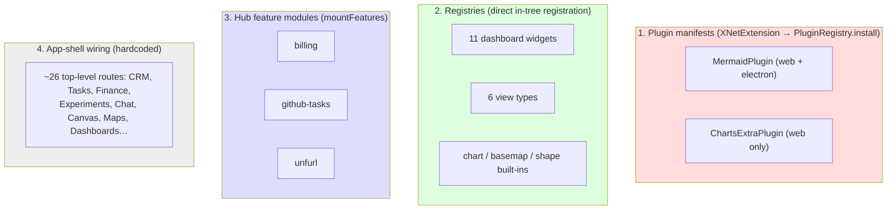
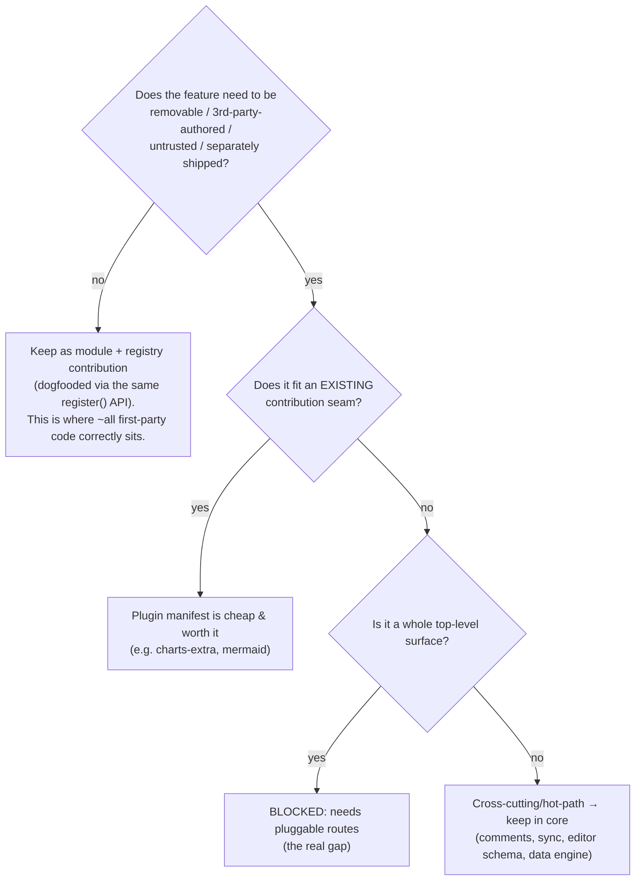

# Why So Few First-Party Plugins?

## Problem Statement

We built a substantial plugin platform (capability/trust/consent model, a
marketplace, a two-sided feature-module shape, ~17 contribution points), and
exploration [0205](0205_[_]_DECOMPOSING_THE_APP_INTO_PLUGINS.md) added three more
extension registries (charts/maps/canvas). Yet the public
[/plugins](https://xnet.fyi/plugins/) page lists only **4** entries, and only
**2** of those actually run as installed plugins in the app.

The question is *diagnostic, not prescriptive*: **why haven't we extracted more
of the app into plugins?** Not "we should" — just *understand the forces*. This
document is a grounded retrospective on what counts as a plugin here, how
first-party functionality is actually delivered, and the structural, economic,
and incentive reasons the plugin-manifest count stays low.

## Executive Summary

"Few first-party plugins" is **mostly a measurement artifact, partly a real
structural gap, and not an architectural failure.** Five reinforcing reasons:

1. **"Plugin manifest" is the wrong unit for most first-party code, and the repo
   already knows it.** First-party extensibility is delivered through *registries*
   (11 dashboard widgets, 6 view types, chart/basemap/shape kinds) and *feature
   modules* (hub billing/tasks/unfurl, connectors) — **~20+ first-party
   contributions** that register through the *same* interfaces a third party
   would use. That is legitimate dogfooding (the GStreamer / VS Code / Grafana
   pattern). Wrapping them as separately-distributed plugin *manifests* adds
   ceremony with zero functional payoff when they ship in the same bundle.

2. **The plugin-manifest path carries a real "extraction tax."** A bundled plugin
   needs a manifest + capability/trust declaration, a `registry/first-party.json`
   entry, a regenerated `registry/registry.json` (whose auto-rebuild bot
   *can't even push to main* — PR #205), a drift test, a changelog gate, and
   (for new deps) a lockfile change. The 0205 `charts-extra` dogfood hit every
   one. For first-party code the payoff is *demonstrative*, not functional.

3. **The biggest features can't be plugins yet — a missing primitive.** The
   top-level surfaces people picture as "plugins" (CRM, Tasks, Finance,
   Experiments, Chat, Canvas, Maps, Dashboards) are **~26 hardcoded TanStack file
   routes**. A plugin can add a panel or a Rail item but cannot own a
   route/workspace (deferred in 0205). The obvious extractions are structurally
   *ineligible* until pluggable top-level routes exist.

4. **The most "extractable-looking" features are deliberately bad candidates.**
   Comments, identity, sync, the editor schema, the data engine are cross-cutting
   and hot-path; 0205 explicitly recommends keeping them in core. Pluginizing
   them adds boundary cost and correctness risk (Yjs schema skew) for no benefit.

5. **There is no forcing function.** Nothing requires new features to be authored
   as plugins; there is no API-dogfooding *mandate* (as VS Code has via its
   proposed-API gate) and not yet enough third-party ecosystem pressure to expose
   API gaps. The path of least resistance — write a module, wire it into the
   shell — wins every time. It is also simply *early* and capacity-bound.

The healthy reframe: stop counting plugin manifests. The right health metric is
the **lift-out test** — *can a first-party feature be shipped as an external
package with zero API changes?* Where yes (charts/maps/canvas/widgets/views/
connectors), the platform is already dogfooded. Where no (whole surfaces; the
editor/data core), that's the real, documented gap — and the lever is the
pluggable-route primitive, not "extract more plugins."

## Current State In The Repository

### How first-party functionality is actually delivered

There are **four** delivery mechanisms, and the plugin-manifest path is the
least-used:



**1. Actual plugin manifests (the only things that `install()`):**
- [`apps/web/src/plugins/index.ts`](apps/web/src/plugins/index.ts) —
  `BUNDLED_PLUGINS = [MermaidPlugin, ChartsExtraPlugin]` (**2**).
- [`apps/electron/src/renderer/plugins/index.ts`](apps/electron/src/renderer/plugins/index.ts) —
  `BUNDLED_PLUGINS = [MermaidPlugin]` (**1** — electron never got `charts-extra`;
  a small drift bug in its own right).
- Installed on first run by
  [`apps/web/src/components/BundledPluginInstaller.tsx`](apps/web/src/components/BundledPluginInstaller.tsx).
- `MermaidPlugin` uses `editorExtensions` + `slashCommands`
  ([mermaid-plugin.ts](apps/web/src/plugins/mermaid-plugin.ts)); `ChartsExtraPlugin`
  registers chart kinds via `activate()`
  ([charts-extra-plugin.ts](apps/web/src/plugins/charts-extra-plugin.ts)).

**2. Catalogued as plugins but not installed:**
`registry/first-party.json` lists `fyi.xnet.slack-connector` and `fyi.xnet.unreal`,
but neither is in any `BUNDLED_PLUGINS`. They are pure builder functions —
`buildSlackConnector()`
([packages/plugins/src/connectors/slack-migration.ts](packages/plugins/src/connectors/slack-migration.ts))
and `buildUnrealConnector()`
([packages/unreal/src/connector.ts](packages/unreal/src/connector.ts)) — referenced
only in tests. They were built to *prove the connector/feature-module shape*, not
to ship as running plugins. So the website's "4 plugins" overstates what runs: **2
in web, 1 in electron.**

**3. Registries — first-party contributions by direct registration, not plugins:**
- `widgetRegistry`: **11** built-ins registered in
  [`packages/dashboard/src/widgets/builtins.ts`](packages/dashboard/src/widgets/builtins.ts)
  (`registry.register(metricWidget)`, …).
- `viewRegistry`: **6** built-ins (table/board/gallery/timeline/calendar/list) in
  [`packages/views/src/builtins.ts`](packages/views/src/builtins.ts).
- `chartTypeRegistry` / `basemapRegistry` / `shapeRegistry`: built-ins registered
  by `ensureBuiltin*()` in their packages (0205). The same `register()` a plugin
  would call — but called by in-tree code.

**4. Hub feature modules — a parallel server-side system, not plugins:**
[`packages/hub/src/server.ts:801`](packages/hub/src/server.ts) mounts exactly **3**:
`mountFeatures([billingFeature(), tasksFeature(...), unfurlFeature(...)])`
([first-party.ts](packages/hub/src/features/first-party.ts)). These implement the
`HubFeature` contract, not `XNetExtension`.

**5. App-shell wiring — the bulk of the product:**
The domain surfaces are **~26 hardcoded routes** in
[`apps/web/src/routes/`](apps/web/src/routes) (`crm.tsx`, `tasks.tsx`,
`finance.tsx`, `experiments.tsx`, `canvas.$canvasId.tsx`, `map.$mapId.tsx`,
`dashboard.$dashboardId.tsx`, …). None are plugin-contributed. The workbench can
register *panel views* and bridge *Rail items*
([apps/web/src/workbench/views/register.ts](apps/web/src/workbench/views/register.ts)),
but **not** top-level routes.

### The tally

| Mechanism | First-party count | Runs as a plugin? | Same API a 3rd party uses? |
|---|---|---|---|
| Plugin manifests (`install()`) | 2 (web) / 1 (electron) | ✅ | ✅ |
| Catalogued connectors (unmounted) | 2 | ❌ (tests only) | ✅ (defineConnector) |
| Dashboard widgets | 11 | ❌ (registry) | ✅ (`widgetRegistry.register`) |
| View types | 6 | ❌ (registry) | ✅ (`viewRegistry.register`) |
| Chart/basemap/shape kinds | built-ins | ❌ (registry) | ✅ (0205 registries) |
| Hub features | 3 | ❌ (mountFeatures) | ✅ (`HubFeature`) |
| Top-level surfaces (CRM/Tasks/…) | ~26 routes | ❌ (hardcoded) | ❌ — **no route API exists** |

The pattern is stark: **dozens of first-party contributions ride the public
extension interfaces; almost none are packaged as plugin manifests; and the one
category that genuinely *can't* be a plugin (top-level surfaces) is the category
people mean when they say "extract more."**

## External Research

- **VS Code is the dogfooding gold standard.** "Many core features of VS Code are
  built as extensions and use the same Extension API"
  ([code.visualstudio.com/api](https://code.visualstudio.com/api)); the repo ships
  **~130 built-in extensions**
  ([extensions/](https://github.com/microsoft/vscode/tree/main/extensions)). The
  *one* privilege: first-party can opt into unstable **proposed APIs** third
  parties can't ship — deliberately, to prove an API in-product before finalizing
  it ([Extension API process](https://github.com/microsoft/vscode/wiki/Extension-API-process)).
  This is the forcing function xNet lacks.
- **Registry-of-builtins is a recognized, legitimate pattern.** GStreamer's single
  `GstRegistry` holds both core and external plugins; with static builds,
  generated code "registers all selected plugins, similar to how dynamic plugins
  would register themselves at runtime" — built-ins are the *same plugins, just
  statically registered*
  ([GStreamer](https://deepwiki.com/GStreamer/gstreamer/1.2-plugin-architecture-and-registry)).
  Grafana's built-in panels/datasources are `ClassCore` going through the *same*
  loader as `ClassExternal` third parties
  ([Grafana](https://deepwiki.com/grafana/grafana/11-plugin-system)). This is
  exactly xNet's widget/view/chart registry model.
- **"Everything is a plugin" has a documented cost.** Backstage chose it for org
  scale (3,000 engineers) but pays "a lot of fiddly wiring" per plugin, coupling
  ("a single plugin update often necessitates rebuilding the entire project"), and
  up to ~$150k/yr maintenance
  ([InfoQ](https://www.infoq.com/presentations/backstage-plugin/),
  [Port](https://www.port.io/blog/top-5-backstage-plugins)). The microkernel
  literature names the tax: cross-boundary indirection, and "the API is hard to
  change once released"
  ([microkernel guide](https://www.numberanalytics.com/blog/ultimate-guide-microkernel-architecture)).
- **Few plugins ≠ bad API.** A Grafana engineer attributes their small
  third-party count to **review/distribution capacity** ("1–2 people… part-time")
  and ecosystem age — *not* API quality
  ([Grafana forum](https://community.grafana.com/t/why-are-there-so-few-3rd-party-plugins-for-grafana/45050)).
  Directly applicable: "few first-party plugins" can be a capacity/measurement
  artifact, not a defect.
- **The dogfooding mandate is what forces extraction.** Amazon's API mandate
  ("all interfaces must be externalizable… or you're fired",
  [Yegge](https://gist.github.com/chitchcock/1281611)) and API-design guidance
  ("being the first consumer of your own API";
  [Zapier](https://zapier.com/engineering/api-dogfooding/)) explain *why* mature
  platforms author first-party on the public API: otherwise the external API
  rots. xNet has the *capability* to dogfood (the registries) but no *policy*
  requiring it.

## Key Findings

1. **The metric is wrong.** "Number of first-party plugin manifests" measures
   *packaging ceremony*, not *platform health*. By the meaningful measure — does
   first-party functionality ride the public extension interfaces — xNet already
   has ~20+ first-party contributions doing exactly that.

2. **Registries absorbed the demand for plugins.** Every place a plugin would
   plausibly extend (widgets, views, chart/shape/basemap kinds) already has a
   first-party-populated registry using the same `register()` a third party
   calls. The marginal value of also shipping those as standalone manifests is
   ~0 for bundled code. This is the GStreamer/Grafana pattern, and it is *good*.

3. **The extraction tax is real and front-loaded.** Manifest + capability/trust +
   `first-party.json` + regenerated `registry.json` (+ the rebuild bot can't push
   to main, PR #205) + drift test + changelog gate + lockfile. None of it adds
   user value for first-party code; all of it is friction.

4. **The route primitive is the true ceiling.** The features that *would* be
   compelling plugins (CRM, Tasks, Finance, Experiments as removable surfaces)
   are blocked by hardcoded routing. This is the single highest-leverage unlock
   if more feature-plugins were ever desired — and it's already a documented 0205
   follow-up.

5. **Some "plugins" are aspirational.** Slack/Unreal connectors are catalogued as
   first-party plugins but ship unmounted (tests only). The catalog slightly
   overstates reality; the in-app count (2/1) is the honest number.

6. **No incentive, early stage, one maintainer.** Absent a dogfooding mandate or
   third-party pressure, modules-wired-into-the-shell is the rational default. The
   platform itself is recent (0192/0196/0201/0205). Grafana's "capacity, not API"
   finding fits.

## Options And Tradeoffs

These are *framings of the situation*, not a call to extract more.



- **A. Treat the status quo as correct (recommended framing).** Registries +
  feature modules *are* the dogfooding surface; the low manifest count is
  cosmetic. Cost: the marketing/"ecosystem feels robust" optics stay modest.
- **B. Lower the extraction tax** (auto-rebuild bot can push, a `xnet plugin
  scaffold` first-party path, fewer gates) so wrapping first-party code as a
  manifest is trivial. Cost: still no functional payoff; risks busywork.
- **C. Build the missing route primitive** so whole surfaces *can* be plugins,
  then extract one (Tasks/Experiments) as a proof. Cost: real, multi-PR,
  higher-risk; only worth it if feature-plugins become a goal.
- **D. Adopt a dogfooding mandate** (new contribution-shaped features must ride
  the public API). Cost: process overhead; premature for a one-maintainer repo.

## Recommendation

**Reframe, don't extract.** The answer to "why so few first-party plugins" is
that *the plugin manifest is the wrong, and most expensive, way to deliver
first-party functionality* — and xNet already delivers extensibility the right
way, through registries and feature modules that use the public interfaces. The
low manifest count is a measurement artifact plus an early-stage/no-incentive
effect, not an architectural failure.

Concretely:

1. **Adopt the lift-out test as the platform-health metric** (replace "count of
   plugins"): *can a first-party feature be shipped as an external package with
   zero API changes?* Track which features pass. This makes the registries count
   as the dogfooding they are, and surfaces the genuine gaps.
2. **Name the real gap precisely:** top-level surfaces fail the lift-out test
   because there is no route/workspace contribution API. That — not "extract more
   plugins" — is the lever, and it's already the 0205 follow-up.
3. **Fix the small honesty bugs** so the catalog stops overstating: add
   `ChartsExtraPlugin` to electron's `BUNDLED_PLUGINS`, and either mount the
   Slack/Unreal connectors or mark them in `first-party.json` as
   "library/uninstalled" rather than implying they run.
4. **Only if feature-plugins become a goal:** build the route primitive (C) and
   lower the extraction tax (B). Until then, more manifests would be ceremony.

## Example Code

The lift-out test, made concrete — a first-party feature passes if its
registration is identical to a third party's:

```ts
// First-party (in-tree), packages/dashboard/src/widgets/builtins.ts
registry.register(metricWidget) // same call …

// Third-party (hypothetical external package)
widgetRegistry.register(myMarketplaceWidget) // … same API, zero diff → PASSES
```

A surface that *fails* the test today (no API exists to do this):

```ts
// What a feature-plugin WOULD need but cannot do yet:
ctx.registerRoute({ path: '/crm', component: CrmView })   // ❌ no such API
// …so CRM must be a hardcoded route in apps/web/src/routes/crm.tsx instead.
```

## Risks And Open Questions

- **Does the marketplace narrative require more *visible* first-party plugins?**
  If the product story is "rich plugin ecosystem," a 2-plugin catalog
  undersells a platform that actually has ~20+ dogfooded contributions. Surfacing
  registry contributions (chart/view/widget kinds) on `/plugins` might tell a
  truer story than manufacturing manifest wrappers.
- **Is the registry path *really* identical to the third-party path?** The
  lift-out test only holds if first-party `register()` entrypoints have no
  privileged side-channel (cf. Obsidian's `internalPlugins`). Worth an audit.
- **Connector drift:** catalogued-but-unmounted connectors could mislead users
  and future maintainers. Decide: mount, or relabel.
- **Will the route primitive's complexity (dynamic TanStack routes, auth, deep
  links) outweigh its benefit?** Open until someone actually needs a feature to be
  removable.
- **Electron lag:** electron bundles fewer plugins than web — a sign extraction
  is manual and easily skipped per-platform.

## Implementation Status

The hygiene/clarity items landed in the implementation PR. The one explicitly
"(if desired)" item — surfacing registry *contributions* on the `/plugins` page —
is deferred as a documented follow-up (it needs a committed contribution-snapshot
pipeline, like `metrics.json`, since the site can't import app packages).

## Implementation Checklist

This exploration is explanatory; these are *optional* hygiene/clarity steps, not a
mandate to pluginize.

- [x] Document the **lift-out test** as the platform-health metric in
      [`docs/guides/extend-with-registries.md`](../guides/extend-with-registries.md).
- [x] Audit that first-party `register()` entrypoints use no privileged
      side-channel third parties lack. Finding: registration is symmetric across
      all registries; the one intentional first-party privilege is widget
      trust-tier self-assignment (a security boundary, à la VS Code proposed
      APIs), not an API gap. Documented in the guide.
- [x] Add `ChartsExtraPlugin` to electron `BUNDLED_PLUGINS` (fix web/electron
      drift) — plus the `@xnetjs/charts` dep and the duplicated plugin file.
- [x] Decide Slack/Unreal connectors: **relabel** as `autoInstalled: false` in
      `registry/first-party.json` (they're first-party connectors you set up, not
      auto-installed) + a "Setup required" chip on the plugin card + a drift test
      enforcing auto-install honesty. (Mounting them was rejected as out of scope.)
- [ ] (If desired) surface registry contributions (chart/view/widget kinds) on
      the `/plugins` page so the count reflects real extensibility. *(follow-up)*
- [x] Cross-link this doc from 0205's "pluggable top-level routes" follow-up as
      the *why-it-matters* rationale.

## Validation Checklist

- [x] A reader can state, in one sentence, why the manifest count is low (it's the
      wrong unit; registries + feature modules carry first-party extensibility).
- [x] The repo's first-party delivery mechanisms are each cited with a real path
      and a current count.
- [x] The "real gap" (no route API) is distinguished from the "non-gap" (registry
      built-ins not packaged as manifests).
- [x] The lift-out test is written down and at least one passing and one failing
      example is verifiable in the code (guide + this doc's Example Code).
- [x] Hygiene items taken: electron lists `charts-extra`; the connector catalog
      no longer implies unmounted code runs (drift test enforces it).

## References

### Internal
- [0205 — Decomposing the app into plugins](0205_[_]_DECOMPOSING_THE_APP_INTO_PLUGINS.md) (registries, the route-primitive follow-up, cross-cutting "keep in core")
- [`apps/web/src/plugins/index.ts`](apps/web/src/plugins/index.ts) / [electron](apps/electron/src/renderer/plugins/index.ts) — `BUNDLED_PLUGINS`
- [`registry/first-party.json`](registry/first-party.json) — the catalog (4 entries; 2 unmounted)
- [`packages/dashboard/src/widgets/builtins.ts`](packages/dashboard/src/widgets/builtins.ts) — 11 widgets by direct registration
- [`packages/views/src/builtins.ts`](packages/views/src/builtins.ts) — 6 views by direct registration
- [`packages/hub/src/server.ts`](packages/hub/src/server.ts) — `mountFeatures([...])` (3 hub features)
- [`apps/web/src/routes/`](apps/web/src/routes) — ~26 hardcoded top-level routes
- [`packages/plugins/src/connectors/slack-migration.ts`](packages/plugins/src/connectors/slack-migration.ts), [`packages/unreal/src/connector.ts`](packages/unreal/src/connector.ts) — catalogued-but-unmounted connectors
- Prior platform explorations: 0189 (feature modules), 0192 (plugin ecosystem), 0196 (connectors / paid marketplace), 0201 (marketplace + thin index)

### External
- VS Code — [Extension API ("core features… use the same Extension API")](https://code.visualstudio.com/api), [~130 built-in extensions](https://github.com/microsoft/vscode/tree/main/extensions), [proposed-API process](https://github.com/microsoft/vscode/wiki/Extension-API-process)
- GStreamer — [registry of core + external plugins](https://deepwiki.com/GStreamer/gstreamer/1.2-plugin-architecture-and-registry)
- Grafana — [core vs external plugin classes](https://deepwiki.com/grafana/grafana/11-plugin-system), [why few third-party plugins (capacity, not API)](https://community.grafana.com/t/why-are-there-so-few-3rd-party-plugins-for-grafana/45050)
- Backstage — [everything-is-a-plugin (InfoQ)](https://www.infoq.com/presentations/backstage-plugin/), [cost](https://www.port.io/blog/top-5-backstage-plugins)
- [Microkernel architecture tradeoffs](https://www.numberanalytics.com/blog/ultimate-guide-microkernel-architecture)
- Dogfooding — [Amazon API mandate (Yegge)](https://gist.github.com/chitchcock/1281611), [API dogfooding (Zapier)](https://zapier.com/engineering/api-dogfooding/)
- Obsidian — [core plugins are in-binary toggles, not the community API](https://help.obsidian.md/plugins)
