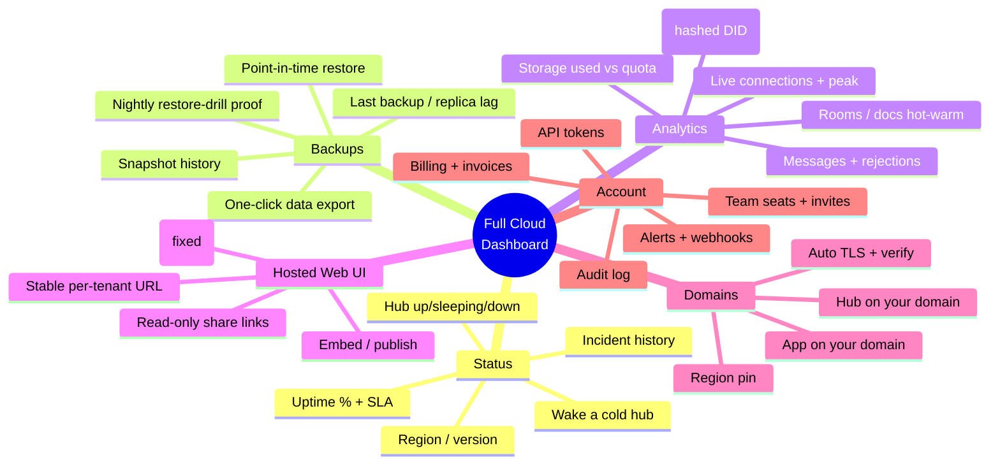
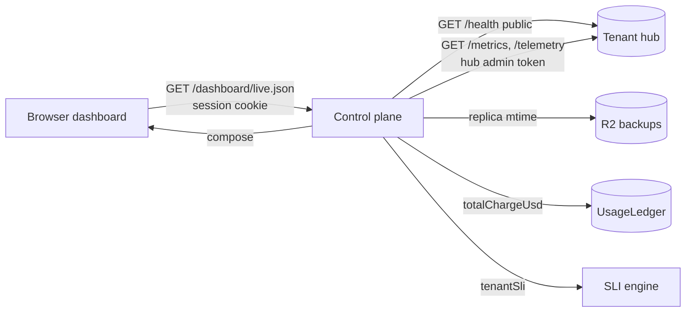

# The Full xNet Cloud Dashboard — Status, Analytics, Hosted Web UI, and Custom Domains

## Problem Statement

The xNet Cloud control plane is now **deployed and working end-to-end** (exploration
[0205](0205_[_]_DEPLOY_XNET_CLOUD_STAGING_CONTROL_PLANE.md)): a paying tenant gets a
provisioned, publicly-reachable hub with durable Litestream→R2 backups, and the
dashboard reflects their plan. But the dashboard itself is intentionally a thin
server-rendered HTML page ([`apps/cloud/src/dashboard.ts`](apps/cloud/src/dashboard.ts))
that shows plan, a static "Backups → object storage" line, billing, and a danger
zone. It does **not** show whether the hub is actually up, when the last backup
landed, how many devices are connected, how much storage is used, or any history.
And "Open the app" links to a `/app` route **that doesn't exist**
([`dashboard.ts:149`](apps/cloud/src/dashboard.ts)).

This exploration plans the **full** cloud dashboard: everything a customer would
want from a managed-hub control panel — live server status, backup visibility,
connection analytics, a real hosted web UI they can open in a browser at a stable
URL, the ability to **bring their own domain**, and the long tail of features
(alerts, API tokens, team seats, audit log, data export, region control) that turn
"a hosted database" into "a product."

## Executive Summary

The good news: **most of the data already exists** — it's just not surfaced. The
hub exposes a rich `/health`, a Prometheus `/metrics`, `/ready`, a Shields badge,
and admin-gated `/telemetry/*`; the control plane has a full SLI/SLO/error-budget
engine and a per-tenant `TenantRecord`; Litestream exposes replica freshness; the
`UsageLedger` tracks AI spend; and `BackupService.getUsage()` tracks storage. The
work is **aggregation + presentation + a few new seams**, not new infrastructure.

The hosted-UI answer is also half-built: the React PWA (`apps/web`) is already
bundled onto GitHub Pages at `xnet.fyi/app` (exploration
[0192](docs/explorations/0192_[_]_XNET_CLOUD_ONBOARDING_AND_UI_HOSTING.md)), is
fully hub-agnostic, and discovers its hub URL from `localStorage` after the claim
flow. The gap is a **stable, per-tenant URL** and **custom domains**.



**Recommendation:** four phases, each independently shippable, ordered by
value-per-effort. **(1)** Enrich the existing dashboard with the data already
available (live hub status, last-backup, storage, connections, uptime) + fix the
`/app` link. **(2)** Give every tenant a **stable hosted-app URL** pre-pointed at
their hub. **(3)** **Custom domains** (BYO) for the app and the hub via Cloudflare
for SaaS. **(4)** The analytics/ops long tail (charts, alerts, webhooks, API
tokens, audit log, team). Keep the dashboard server-rendered and progressively
enhanced with small polled JSON endpoints — don't ship a second React bundle.

## Current State In The Repository

### The dashboard is a thin custodial surface

[`apps/cloud/src/dashboard.ts`](apps/cloud/src/dashboard.ts) renders, from the
`TenantRecord` + AI usage only: a hub card (plan, endpoint, region, storage *quota*
(not used), seats, uptime *label*, a hard-coded `Backups: Continuous → object
storage`, data DID), an AI usage meter, a connect/claim card, plan change, billing
portal, and a danger zone. It's deliberately HTML-string, not React
([`dashboard.ts:1-9`](apps/cloud/src/dashboard.ts)). Everything is static snapshot
data from Firestore — **nothing is fetched live from the hub.**

### The hub already exposes everything an ops dashboard needs

[`packages/hub/src/server.ts`](packages/hub/src/server.ts):
- `GET /health` ([:700](packages/hub/src/server.ts)) — `status`, `uptime`,
  `version`, `platform`, `region`, `machineId`, `rooms`, `docs {hot,warm,total}`,
  `connections {active,max}`, `memory {rss,heapUsed}`. **Public** (we made
  provisioned hubs `allow-unauthenticated` in 0205; the hub self-auths data).
- `GET /metrics` ([:750](packages/hub/src/server.ts)) — Prometheus:
  `hub_ws_connections_active`, `hub_sync_docs_{hot,warm}`,
  `hub_ws_messages_{received,sent,rejected}_total`, `hub_backup_{uploads_total,
  bytes_stored}`, `hub_query_{requests_total,duration_ms}`,
  `hub_rate_limit_rejections_total`.
- `GET /ready` ([:737](packages/hub/src/server.ts)), `GET /health/badge`
  ([:723](packages/hub/src/server.ts)) — Shields.io badge.
- `GET /telemetry/summary` · `/rollups` · `/events` ([~:814](packages/hub/src/server.ts))
  — aggregate analytics over hashed DIDs (separate `telemetry.db`, exploration
  0187), **admin-gated**.
- `BackupService.getUsage(did)` → `{used, limit, count}`
  ([`packages/hub/src/services/backup.ts:86`](packages/hub/src/services/backup.ts))
  and `FileService.getUsage` ([`files.ts:109`](packages/hub/src/services/files.ts))
  — real storage-used numbers.

### The control plane has the SLI/SLO engine + public status

[`apps/cloud/src/observability/`](apps/cloud/src/observability/): `sli.ts`
(availability, error rate, p95 latency, error-budget, burn rate), `slo.ts`
(per-plan targets + freeze/caution/ship policy), `health.ts` (`probeFleet`,
`tenantSli`, `fleetSummary`), `status.ts` (`publicStatus`, k-anon). Exposed at
`GET /internal/fleet/health` ([`server.ts:406`](apps/cloud/src/server.ts)) and the
public `GET /status.json` ([`server.ts:95`](apps/cloud/src/server.ts)). `start()`
already runs a `probeFleet` loop hitting each hot tenant's `/health`
([`index.ts:223`](apps/cloud/src/index.ts)).

### Backups expose freshness; the ledger exposes spend

[`packages/cloud/src/litestream/freshness.ts`](packages/cloud/src/litestream/freshness.ts):
`replicaLagMs`, `isReplicaFresh` (≤ maxLag), `isFullySynced` (safe-to-destroy).
[`apps/cloud/src/backup/restore-drill.ts`](apps/cloud/src/backup/restore-drill.ts):
`verifyRestore()` provisions a throwaway hub, restores from R2, asserts `/ready` —
a nightly "your backup actually restores" proof. `UsageLedger`
([`packages/cloud/src/billing/ledger.ts`](packages/cloud/src/billing/ledger.ts)):
`totalChargeUsd(tenant, sinceMs)`, `entries(...)`.

### The web app is hosted, hub-agnostic, and discoverable

Per [0192](docs/explorations/0192_[_]_XNET_CLOUD_ONBOARDING_AND_UI_HOSTING.md) +
[.github/workflows/deploy-site.yml](.github/workflows/deploy-site.yml): the React
PWA `apps/web/dist` is built with `VITE_BASE_PATH=/app/` + `VITE_USE_HASH_ROUTER=true`
and published to `xnet.fyi/app`. It resolves its hub from a 3-tier system
([`apps/web/src/lib/hub-url.ts`](apps/web/src/lib/hub-url.ts)): build-time
`VITE_HUB_URL` → `localStorage['xnet:hub-url']` (set by the claim flow) →
`?shareSession=` runtime override. Identity is a local passkey/DID; the device-grant
claim flow ([`server.ts:292-353`](apps/cloud/src/server.ts)) binds it and hands back
the hub URL. **So a hosted, hub-agnostic app already exists** — it just lacks a
per-tenant URL and custom-domain story. The `/app` link in the dashboard is a
dangling reference to it.

## External Research

- **Railway / Fly.io / Supabase dashboards** converge on the same spine: a **status
  tile, a metrics tab (Prometheus-backed), and logs**, plus project settings. Fly
  auto-collects per-instance Prometheus (connections, memory, CPU, I/O) and offers a
  managed Grafana; Supabase exposes a Prometheus `/metrics` endpoint per project for
  BYO observability. The lesson: **expose Prometheus, render a few first-class tiles,
  link out for deep dives** — don't rebuild Grafana. ([Fly metrics](https://fly.io/docs/), [Supabase Metrics API](https://supabase.com/docs/guides/telemetry/metrics))
- **Custom domains for SaaS** — the dominant pattern is **Cloudflare for SaaS
  (Custom Hostnames)**: one API call registers a customer hostname; the customer adds
  one CNAME to a fallback origin; Cloudflare handles the **entire TLS lifecycle**
  (DCV, issuance, renewal). Pre-validation (TXT/Delegated DCV) lets the cert go
  active *before* DNS cutover for zero-downtime. Vercel's domains API and
  [Approximated](https://approximated.app/) solve the same problem. ([Cloudflare for SaaS](https://developers.cloudflare.com/cloudflare-for-platforms/cloudflare-for-saas/), [Vercel multi-tenant domains](https://vercel.com/docs/multi-tenant/domain-management))
- **Per-tenant URL conventions:** subdomain-per-tenant (`alice.xnet.app`) vs
  path-per-tenant (`app.xnet.app/alice`) vs query-pointed (`app.xnet.app/?hub=…`).
  Subdomain is cleanest for cookies/CORS isolation and is what most BYO-domain
  systems normalize onto.

## Key Findings

1. **This is a surfacing problem, not a building problem.** ~80% of the "full
   dashboard" data already has a producer (hub `/health` + `/metrics` + `/telemetry`,
   SLI engine, Litestream freshness, UsageLedger, BackupService). The missing piece
   is a **control-plane aggregator** that fans out to the tenant's hub and composes a
   `dashboard.json`.
2. **The hub is now public**, so the control plane (or the browser) can read its
   `/health` directly. Sensitive surfaces (`/metrics`, `/telemetry`) are admin-gated
   — the control plane needs a per-hub admin token to read them (or the hub gains a
   scoped, owner-readable analytics endpoint).
3. **"Last backup" needs one new signal.** Litestream knows the replica TXID, but the
   control plane doesn't track `lastSyncMs`/`lastWriteMs` per tenant. The hub could
   expose replica freshness on `/health` (it already counts `hub_backup_uploads_total`
   + `hub_backup_bytes_stored`), or the control plane reads the R2 object mtime.
4. **The hosted app is one route away.** Fixing `/app` = serve the existing
   `apps/web` bundle (already on Pages) with the tenant's hub URL injected — no new
   build. A stable per-tenant URL is a thin addition; custom domains are the only
   genuinely new infrastructure (Cloudflare for SaaS).
5. **Keep it server-rendered.** The team deliberately avoided a second React bundle
   for the dashboard. Live tiles want *some* dynamism, but that's a polled JSON
   endpoint + a sprinkle of vanilla JS / SVG sparklines — not a SPA.
6. **Custom domains are a natural premium upsell** and align with the
   sovereignty/anti-lock-in story (your data, your hub, your domain).

## Options And Tradeoffs

### A. Dashboard rendering: how dynamic?

| Option | Pros | Cons |
| --- | --- | --- |
| **Server-rendered + polled JSON tiles** *(recommended)* | No new bundle; matches existing pattern; SSR-fast; tiles refresh via `fetch` + inline SVG sparklines | Hand-rolled interactivity; limited rich charting |
| Full React dashboard SPA | Rich charts, real-time, reusable components | A second bundle the team explicitly avoided; CORS/cookie complexity; bigger surface |
| Embed Grafana per tenant | Powerful, free deep-dives | Heavy; another service; overkill for consumer plans |

### B. Where does dashboard data come from?



| Option | Pros | Cons |
| --- | --- | --- |
| **Control-plane aggregator (`/dashboard/live.json`)** *(recommended)* | One authenticated call; control plane already probes hubs; can join SLI + ledger + R2; hides admin tokens | Control plane does fan-out (cache + timeout needed) |
| Browser calls hub `/health` directly | Zero control-plane work; truly live | Only public data; CORS on the hub; no SLI/ledger join |
| Push (hub → control plane → SSE) | Real-time, low poll cost | New transport + state; premature for v1 |

### C. The hosted web UI URL

| Option | Example | Pros | Cons |
| --- | --- | --- | --- |
| Fix `/app` to the existing bundle, hub via deep-link | `xnet.fyi/app/#/?hub=<url>` | Zero new infra; ships now | Shared origin; localStorage-scoped; ugly URL |
| **Per-tenant subdomain** *(recommended target)* | `alice.xnet.app` | Stable, shareable; cookie/CORS isolation; brandable | Needs wildcard DNS + cert + hostname→tenant routing |
| Path-per-tenant | `app.xnet.app/alice` | One cert; simple | Shared origin; weaker isolation |

### D. Custom domains (BYO)

| Option | Pros | Cons |
| --- | --- | --- |
| **Cloudflare for SaaS (Custom Hostnames)** *(recommended)* | One API call; customer adds one CNAME; full managed TLS lifecycle; pre-validation for zero-downtime | Cloudflare dependency + per-hostname cost; a fallback origin worker |
| Cloud Run domain mapping per tenant | Native to our stack (we used it for the control plane) | Preview; us-central1-only; one mapping per domain; no programmatic fleet scale |
| Global external LB + managed certs | Production-grade, our cloud | Heavy per-tenant cert/route management; most ops |

## Recommendation

Ship in four phases; keep the dashboard server-rendered and progressively enhanced.

**Phase 1 — Make the dashboard *true* (surface what we already have).**
Add a control-plane `GET /dashboard/live.json` (session-gated) that fans out to the
tenant's hub `/health`, computes backup freshness (R2 object mtime or a new hub
field), reads `BackupService.getUsage`, joins `tenantSli` + `UsageLedger`, with a
short cache + timeout. Re-render the hub card into live tiles: **status dot +
uptime%, last-backup ("12s ago" + nightly-restore-verified ✓), storage used/quota
bar, live connections + rooms/docs, region/version.** Fix the `/app` link. This is
pure value from existing data.

**Phase 2 — A stable hosted-app URL per tenant.** Serve the existing `apps/web`
bundle so each tenant has `https://<handle>.xnet.app` (or `app.xnet.fyi/<handle>`)
that boots pre-pointed at their hub (inject `VITE_HUB_URL` equivalent via a tiny
per-tenant config the page fetches, keyed by hostname). "Open the app" from the
dashboard becomes a real, shareable link. Wildcard `*.xnet.app` DNS + cert.

**Phase 3 — Custom domains (BYO), the premium feature.** Cloudflare for SaaS custom
hostnames for **both** the app (`notes.alice.com` → hosted bundle pointed at her
hub) and the hub (`hub.alice.com` → her Cloud Run hub). Dashboard UI: add domain →
show the CNAME + verification status → auto-TLS → live. Gate behind team/company
plans.

**Phase 4 — The ops/account long tail.** Connection analytics charts (from
`/metrics` + `/telemetry`), alerts + outbound webhooks (budget near cap, backup
lag, hub down, renewal), API/personal-access tokens (for MCP/the bridge), audit log,
team seats + invites, invoices/usage history, one-click data export, region
selection, incident/status history.

```mermaid
sequenceDiagram
  participant U as User
  participant D as Dashboard (control plane)
  participant CF as Cloudflare for SaaS
  participant CP as Control plane
  U->>D: Add custom domain notes.alice.com
  D->>CF: POST custom_hostname (API)
  CF-->>D: CNAME target + TXT (DCV)
  D-->>U: "Add CNAME notes.alice.com → cname.xnet.app; TXT _acme…"
  U->>U: Add records at their DNS
  CF->>CF: Validate + issue TLS (renew forever)
  CF-->>CP: hostname Active (webhook/poll)
  CP-->>U: ✓ Live — open xNet at notes.alice.com
  Note over CF,CP: Fallback origin maps hostname → tenant → hub URL
```

## Example Code

### Phase 1 — the dashboard aggregator (sketch)

```ts
// apps/cloud/src/server.ts — session-gated live data for the dashboard.
app.get('/dashboard/live.json', async (c) => {
  const s = session(c)
  if (!s) return c.json({ error: 'unauthorized' }, 401)
  const t = await deps.controlPlane.getTenantForBilling(s.billingUserId)
  if (!t?.hubUrl) return c.json({ status: 'no-hub' })

  // Fan out with a tight timeout; never let a slow hub hang the dashboard.
  const health = await fetchJson(`${t.hubUrl}/health`, { timeoutMs: 2500 }).catch(() => null)
  const sli = deps.health
    ? tenantSli(deps.health, { tenantId: t.tenantId, plan: t.plan, hubUrl: t.hubUrl }, now())
    : null
  const aiUsedUsd = t.entitlements.aiEnabled && deps.ai
    ? await deps.ai.ledger.totalChargeUsd(t.tenantId, currentPeriodStartMs(now()))
    : null

  return c.json({
    reachable: Boolean(health),
    uptimePct: sli ? +(sli.availability * 100).toFixed(2) : null,
    region: t.region, version: health?.version ?? t.targetVersion,
    connections: health?.connections ?? null,        // { active, max }
    docs: health?.docs ?? null,                       // { hot, warm, total }
    rooms: health?.rooms ?? null,
    storage: health?.storage ?? null,                 // add to hub /health from getUsage
    backup: health?.backup ?? null,                   // { lastSyncMs, lagMs, fresh } — new hub field
    aiUsedUsd,
  })
})
```

### Surface backup freshness on the hub `/health`

```ts
// packages/hub/src/server.ts — extend /health (already has uptime/docs/connections).
backup: {
  lastSyncMs: litestream.lastSyncMs(),          // from the replica position
  lagMs: Date.now() - litestream.lastSyncMs(),
  fresh: isReplicaFresh(litestream.lagMs(), FIVE_MIN),
  bytesStored: backup.getUsage(ownerDid).then(u => u.used),
}
```

### Per-tenant hosted app: hostname → hub config

```ts
// A tiny config the hosted bundle fetches on boot, keyed by Host header.
// alice.xnet.app or notes.alice.com → { hubUrl } resolved from the tenant registry.
app.get('/_xnet/app-config.json', async (c) => {
  const host = c.req.header('host') ?? ''
  const tenant = await deps.controlPlane.getTenantForHostname(host) // new index
  return c.json({ hubUrl: tenant?.hubUrl ?? null, brand: tenant?.brand ?? 'xNet' })
})
```

## Risks And Open Questions

- **Hub fan-out latency / availability.** The aggregator must cache (e.g. 10s) and
  hard-timeout; a sleeping (scale-to-zero) hub returns nothing — show "Sleeping,
  wake it?" not an error. Cold-start the hub on dashboard open? (cost vs UX.)
- **Admin-gated hub surfaces.** `/metrics` + `/telemetry` need a per-hub token to
  read. Option: the provisioner injects a control-plane-known `HUB_ADMIN_TOKEN`; or
  the hub adds an owner-scoped analytics endpoint. Decide before Phase 4 charts.
- **"Last backup" source of truth.** Hub-reported (`lastSyncMs`) vs R2 object mtime
  vs Litestream's own state. Hub-reported is simplest but trusts the hub; R2 mtime is
  independent. Probably surface both ("replicated 8s ago · verified nightly").
- **Custom-domain cost + abuse.** Cloudflare for SaaS charges per active custom
  hostname; gate to paid tiers, cap count, and verify ownership (DCV) to prevent
  domain-takeover/phishing. A fallback-origin worker maps hostname→tenant→hub.
- **Per-tenant subdomain isolation.** Cookies/storage are per-origin — good for
  isolation, but the passkey/DID is per-origin too, so moving from `xnet.fyi/app` to
  `alice.xnet.app` changes the WebAuthn RP ID (identity re-enrollment). Plan the
  RP-ID/migration story (or keep identity on a shared auth origin).
- **Telemetry privacy.** `/telemetry` hashes DIDs; surfacing "devices/connections"
  must stay aggregate and never de-anonymize. The public `/status.json` k-anon floor
  is the model.
- **Don't rebuild Grafana.** Expose `/metrics` (Prometheus) as a tenant-scrapable URL
  + a token; render only first-class tiles in-dashboard.

## Implementation Checklist

- [ ] **P1:** Add `GET /dashboard/live.json` (session-gated) aggregating hub
      `/health` + `tenantSli` + `UsageLedger`, with cache + timeout.
- [ ] **P1:** Add `storage` + `backup` (lastSyncMs/lagMs/fresh) to hub `/health`
      from `BackupService.getUsage` + Litestream replica position.
- [ ] **P1:** Re-render the hub card as live tiles (status dot, uptime%, last-backup,
      storage bar, connections, rooms/docs, region/version); poll `live.json`.
- [ ] **P1:** Fix the `/app` link → open the hosted app deep-linked to the tenant hub.
- [ ] **P1:** Show nightly restore-drill result ("backup verified ✓ <date>").
- [ ] **P2:** Wildcard `*.xnet.app` DNS + cert; serve the `apps/web` bundle.
- [ ] **P2:** `getTenantForHostname` index + `/_xnet/app-config.json`; boot the app
      pre-pointed at the tenant hub.
- [ ] **P2:** Dashboard "Open the app" → stable `https://<handle>.xnet.app`.
- [ ] **P3:** Cloudflare for SaaS integration (create custom hostname, poll status);
      fallback-origin worker hostname→tenant→hub.
- [ ] **P3:** Dashboard "Custom domains" card: add → CNAME/TXT instructions →
      verification state → live; gate to paid tiers; cap + ownership-verify.
- [ ] **P4:** Connection analytics charts (sparklines from `/metrics`/`/telemetry`
      via an owner-scoped/token'd read path).
- [ ] **P4:** Alerts + outbound webhooks (budget near-cap, backup lag, hub down,
      renewal); notification preferences.
- [ ] **P4:** API / personal-access tokens (MCP, the local bridge), with scopes.
- [ ] **P4:** Audit log (claims, plan changes, domain adds, deletes), team seats +
      invites, invoices/usage history, one-click data export, region selection,
      incident/status history.

## Validation Checklist

- [ ] Dashboard shows the **live** hub status (kill the hub → tile flips to
      down/sleeping within a poll interval).
- [ ] "Last backup" advances after a write (matches the Litestream replica TXID we
      verified in 0205) and shows "verified nightly" from the restore drill.
- [ ] Storage tile matches `BackupService.getUsage().used` and never exceeds quota.
- [ ] Connection tile matches `/health.connections.active` with a device connected.
- [ ] "Open the app" lands in xNet already connected to the tenant's hub (no manual
      hub-URL entry).
- [ ] A per-tenant subdomain (`<handle>.xnet.app`) boots the app pointed at the right
      hub for that hostname.
- [ ] Adding a custom domain yields correct CNAME/TXT, reaches **Active**, serves the
      app/hub over the customer domain with valid auto-renewing TLS, and is gated to
      paid plans.
- [ ] `/dashboard/live.json` degrades gracefully on a sleeping/slow hub (cache +
      timeout; never hangs the page).
- [ ] Analytics/telemetry tiles stay aggregate (no de-anonymized device/DID data).

## References

- [`apps/cloud/src/dashboard.ts`](apps/cloud/src/dashboard.ts) — the current dashboard.
- [`packages/hub/src/server.ts`](packages/hub/src/server.ts) — `/health`, `/metrics`,
  `/ready`, `/health/badge`, `/telemetry/*`.
- [`packages/hub/src/services/backup.ts`](packages/hub/src/services/backup.ts) ·
  [`files.ts`](packages/hub/src/services/files.ts) — `getUsage`.
- [`apps/cloud/src/observability/`](apps/cloud/src/observability/) — SLI/SLO/health/status.
- [`packages/cloud/src/litestream/freshness.ts`](packages/cloud/src/litestream/freshness.ts)
  · [`apps/cloud/src/backup/restore-drill.ts`](apps/cloud/src/backup/restore-drill.ts).
- [`apps/cloud/src/registry.ts`](apps/cloud/src/registry.ts) — `TenantRecord`.
- [`apps/web/src/lib/hub-url.ts`](apps/web/src/lib/hub-url.ts) — hub URL discovery.
- [.github/workflows/deploy-site.yml](.github/workflows/deploy-site.yml) — site + app bundling.
- Explorations [0192](docs/explorations/0192_[_]_XNET_CLOUD_ONBOARDING_AND_UI_HOSTING.md)
  (UI hosting), [0180](docs/explorations/0180_[_]_XNET_CLOUD_ARCHITECTURE_AND_COMPLETION_STATUS.md)
  (architecture), [0205](docs/explorations/0205_[_]_DEPLOY_XNET_CLOUD_STAGING_CONTROL_PLANE.md)
  (deploy + backups).
- [Cloudflare for SaaS](https://developers.cloudflare.com/cloudflare-for-platforms/cloudflare-for-saas/)
  · [Vercel multi-tenant domains](https://vercel.com/docs/multi-tenant/domain-management)
  · [Supabase Metrics API](https://supabase.com/docs/guides/telemetry/metrics)
  · [Fly.io metrics](https://fly.io/docs/).
