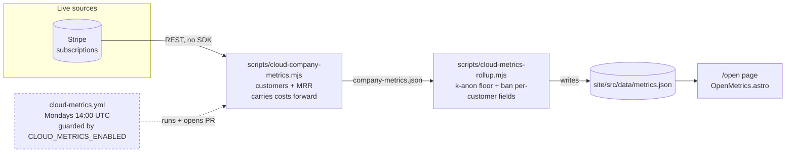
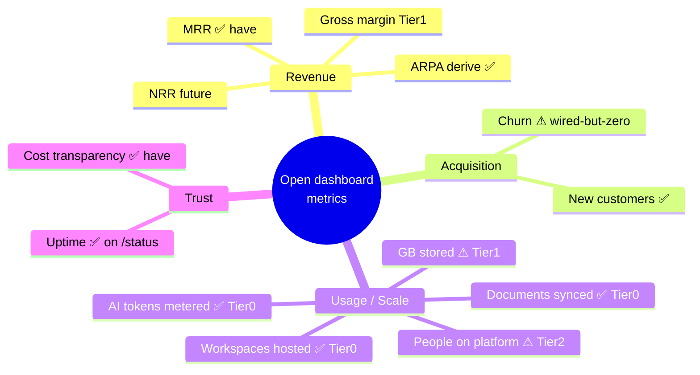
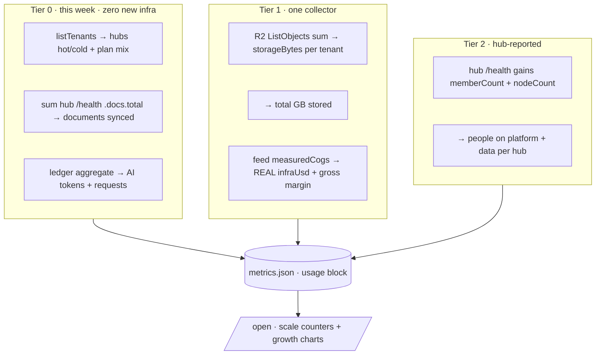
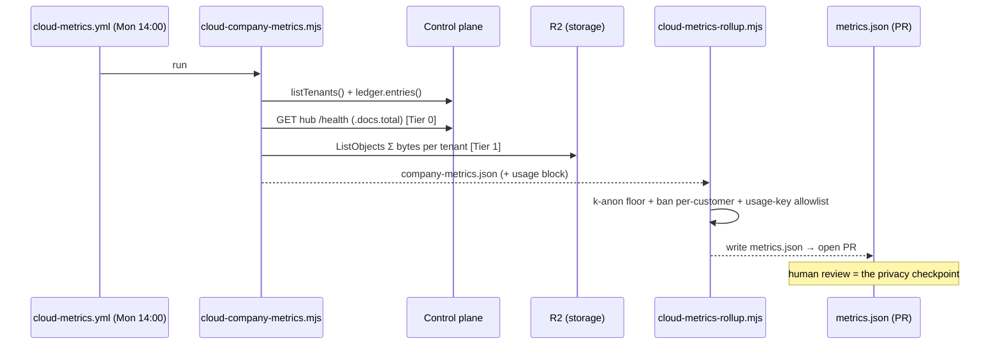

# Open Dashboard Usage & Growth Metrics

## Problem Statement

The public `/open` "run the company in the open" dashboard
([`site/src/pages/open.astro`](../../site/src/pages/open.astro)) today tells a
*financial* story — paying customers, MRR, weekly cost stack, and the road to
break-even. That is the right spine, but it under-sells the product. A
prospective customer or investor looking at the page learns how much money the
company makes, but nothing about **how much product is actually being used**:
how many workspaces are hosted, how much data the platform holds, how many
documents are synced, how much AI is metered through it.

For a local-first sync platform that is simultaneously **SaaS** (subscriptions),
**PaaS** (a managed hub runtime), and a **hosting provider** (durable per-tenant
storage backed up to R2), usage and scale metrics are the most persuasive proof
of traction — and the most defensible, because they are *measured*, not
projected. The ask: make the dashboard "even more robust" by adding usage
statistics — **total users, total gigabytes stored, and the other easily
accountable platform-growth metrics** — surfaced in the same privacy-safe,
committed-to-git way the financial numbers already use.

This exploration inventories exactly which usage numbers we can stand behind
today (and which need a small new collector), maps them to the canonical SaaS /
PaaS growth-metric taxonomy, and recommends a tiered plan that ships visible
value immediately while building toward real "GB stored" measurement.

## Executive Summary

- **The pipeline already exists and is the right shape.** A weekly job
  ([`.github/workflows/cloud-metrics.yml`](../../.github/workflows/cloud-metrics.yml))
  runs [`scripts/cloud-company-metrics.mjs`](../../scripts/cloud-company-metrics.mjs)
  (pulls customers + MRR from Stripe) → [`scripts/cloud-metrics-rollup.mjs`](../../scripts/cloud-metrics-rollup.mjs)
  (re-applies a k-anonymity floor, bans per-customer fields) → writes
  [`site/src/data/metrics.json`](../../site/src/data/metrics.json) → opens a PR.
  The git history *is* the transparency log. Adding usage metrics means
  **extending this pipeline, not building a new one**.
- **Three usage metrics are derivable from data we already collect live**, with
  no new measurement subsystem:
  1. **Workspaces / hubs hosted** — count + hot/cold split from
     `controlPlane.listTenants()` ([`apps/cloud/src/registry.ts`](../../apps/cloud/src/registry.ts)).
  2. **Documents synced** — sum the `docs.total` the hub `/health` endpoint
     ([`packages/hub/src/server.ts`](../../packages/hub/src/server.ts)) already
     returns and the SLI probe loop already fetches.
  3. **AI tokens & requests metered** — aggregate the durable usage ledger
     ([`packages/cloud/src/billing/ledger.ts`](../../packages/cloud/src/billing/ledger.ts)).
- **"Total GB stored" — the headline ask — needs one new collector.** The data
  *shape* already exists (`TenantUsageMeasurement.storageBytes` /
  `hotDbBytes` in [`packages/cloud/src/cost/reconcile.ts`](../../packages/cloud/src/cost/reconcile.ts)),
  but nothing yet sums R2 object sizes or volume sizes. A small R2 `ListObjects`
  loop closes this — and as a bonus turns today's **hand-carried `infraUsd`**
  into a *measured* COGS number via the existing `measuredCogs()` math.
- **"Total users" deserves care.** Paying *customers* (tenants) we already have;
  distinct *people on the platform* (members across hubs) requires the hub to
  report a member count. Recommend leading with **workspaces hosted** today and
  adding a real "people on xNet" number in Tier 2, rather than overclaiming.
- **Recommendation:** a **three-tier rollout** — Tier 0 (this week, zero new
  infra: hubs, documents, AI tokens), Tier 1 (the R2 storage collector → real GB
  stored + real infra margin), Tier 2 (hub-reported members → real "users" +
  per-hub depth). Every tier flows through the same k-anon publish gate.

## Current State In The Repository

### The dashboard and its data contract

The page is a static Astro render with **no charting library** — dependency-light
inline SVG, the same approach as the in-app analytics route.

| Concern | File | Notes |
| --- | --- | --- |
| Page shell | [`site/src/pages/open.astro`](../../site/src/pages/open.astro) | Header + `<OpenMetrics />` + "snapshot updated / see the data on GitHub" footer |
| Charts + cards | [`site/src/components/sections/OpenMetrics.astro`](../../site/src/components/sections/OpenMetrics.astro) | 3 headline stat cards, 2 area charts (customers, MRR), 1 stacked cost bar chart, break-even card. Hand-rolled `series()` SVG path builder |
| Typed data accessor | [`site/src/data/metrics.ts`](../../site/src/data/metrics.ts) | `CompanyMetrics` / `CompanyMetricsWeek` interfaces; derives `customerWoW`, `mrrWoW`, `cumulativeNet`, `latestCostBreakdown` |
| Committed snapshot | [`site/src/data/metrics.json`](../../site/src/data/metrics.json) | 10 weeks of `sample: true` data; `cohortFloor: 5` |
| Hand-kept opex | [`site/src/data/opex.ts`](../../site/src/data/opex.ts) | Line-item monthly costs (payroll / SaaS / infra / overhead) |

The current published shape (every field shown on the page comes from here):

```ts
// site/src/data/metrics.ts
interface CompanyMetricsWeek {
  week: string
  customers: number
  newCustomers: number
  churnedCustomers: number
  mrrUsd: number
  costs: { infraUsd: number; payrollUsd: number; saasUsd: number; otherUsd: number }
}
```

There is **no usage/scale field anywhere in this contract** — that is the gap.

### The collection pipeline (already built, partly inert)



Key facts about the pipeline as it stands:

- [`scripts/cloud-company-metrics.mjs`](../../scripts/cloud-company-metrics.mjs)
  reads `customers` (distinct Stripe `customer` ids on active subs) and `mrrUsd`
  (monthly-normalized sum). **`churnedCustomers` is hard-coded `0`** and `costs`
  are **carried forward** from the prior week — comments flag both as follow-ups.
- [`scripts/cloud-metrics-rollup.mjs`](../../scripts/cloud-metrics-rollup.mjs) is
  the **publish gate**: re-applies the `cohortFloor` (defense in depth) and
  refuses any `BANNED` per-customer key (`customerId`, `did`, `email`, `name`,
  `revenuePerCustomer`). Any new usage field must pass through here.
- [`apps/cloud/src/metrics/rollup.ts`](../../apps/cloud/src/metrics/rollup.ts)
  (`buildCompanyMetrics`) is the pure, typed authority for the shape; the `.mjs`
  scripts mirror it in plain JS (the site never imports `@xnetjs/cloud`).
- The workflow is **inert by default** (`vars.CLOUD_METRICS_ENABLED`), so it
  never reddens `main` and opens a PR only once billing is live.

### What usage data the control plane can already see

The agent inventory (and direct reads) found these seams. Status legend:
**(a)** measured live, **(b)** derivable but not yet collected, **(c)** not
available at all.

| Usage metric | Source | Shape | Status |
| --- | --- | --- | --- |
| **Hubs / workspaces hosted** (hot vs cold) | `controlPlane.listTenants()` — [`apps/cloud/src/registry.ts`](../../apps/cloud/src/registry.ts) | `TenantRecord { plan, dataTier: 'hot'\|'cold', createdAt, lastActiveMs, ... }` | **(a)** ✅ |
| **Plan mix** (personal/family/team/enterprise) | same `TenantRecord.plan` | enum `PlanId` | **(a)** ✅ |
| **Documents synced** | hub `/health` → `docs` — [`packages/hub/src/server.ts`](../../packages/hub/src/server.ts), [`packages/hub/src/pool/node-pool.ts`](../../packages/hub/src/pool/node-pool.ts) | `getStats(): { hot; warm; total }` | **(a)** ✅ (already fetched by probe loop) |
| **AI tokens & requests metered** | usage ledger — [`packages/cloud/src/billing/ledger.ts`](../../packages/cloud/src/billing/ledger.ts), [`apps/cloud/src/stores/usage-ledger.ts`](../../apps/cloud/src/stores/usage-ledger.ts) | `UsageEntry { inputTokens, outputTokens, model, chargeUsd, providerCostUsd, timestampMs }` | **(a)** ✅ |
| **Fleet uptime / availability** | `fleetSummary()` + `publicStatus()` — [`apps/cloud/src/observability/health.ts`](../../apps/cloud/src/observability/health.ts), [`apps/cloud/src/observability/status.ts`](../../apps/cloud/src/observability/status.ts) | `FleetSummary { tenantCount, byPolicy }`; per-tenant `availability`, `p95LatencyMs` | **(a)** ✅ (in-memory; already on `/status`) |
| **GB stored (R2 + volume)** | `TenantUsageMeasurement.storageBytes` / `hotDbBytes` — [`packages/cloud/src/cost/reconcile.ts`](../../packages/cloud/src/cost/reconcile.ts) | structure exists; nothing populates it | **(b)** ⚠️ needs R2 `ListObjects` sum |
| **Infra COGS (`infraUsd`)** | `measuredCogs(m)` — [`packages/cloud/src/cost/reconcile.ts`](../../packages/cloud/src/cost/reconcile.ts) | math + `UNIT_COSTS` exist; fed nothing | **(b)** ⚠️ hand-carried today |
| **Total people / members** | per-hub member count | not exposed by `/health`; canvas `nodeCount()`, vectors `documentCount()` exist internally | **(c)/(b)** ⚠️ needs a hub-reported count |
| **Bandwidth / events replicated** | sync change-log volume | per-hub byte/change counters not aggregated | **(c)** ❌ defer |

The hub `/health` payload is the richest under-used source — the SLI probe loop
already calls it every ~60s but **only records `ok` + `latencyMs`**, discarding
`docs`, `rooms`, and `connections`:

```jsonc
// GET {hubUrl}/health  — packages/hub/src/server.ts
{
  "status": "ok",
  "uptime": 51234,
  "rooms": 12,                       // active peer-discovery rooms
  "docs": { "hot": 8, "warm": 40, "total": 48 },   // ← documents in the pool
  "connections": { "active": 23, "max": 256 },
  "memory": { "rss": 0, "heapUsed": 0 },
  "platform": "fly", "region": "iad", "version": "0.0.1"
}
```

## External Research

### The canonical SaaS / PaaS growth-metric taxonomy

Industry guidance (Baremetrics, Plausible's own "open stats", the standard
AARRR "pirate metrics" funnel) converges on a small set that matter:

- **Revenue:** MRR / ARR, ARPA/ARPU (revenue ÷ accounts), gross margin. For
  early-stage SaaS, **10–20% MoM MRR growth** is the benchmark; **>100% NRR**
  correlates with 1.5–3× faster growth.
- **Retention quality:** churn (logo + revenue; target <2–3% SMB monthly, <1%
  enterprise), **Net Revenue Retention** — flagged repeatedly as "matters more
  than MRR."
- **Acquisition / activation:** new customers, signups, activation rate, lead
  velocity.
- **Engagement / usage:** active users (DAU/WAU/MAU + stickiness ratio), and —
  for PaaS/hosting specifically — **the scale numbers**: total users, **data
  stored**, requests served, bandwidth, apps/workspaces deployed, uptime.

### Prior art for "open" dashboards

- **Baremetrics Open Startups / Open Benchmarks** — companies wire Stripe and
  publish a *live* MRR/ARR/churn/LTV/**customer-count** page. xNet's model is
  the committed-snapshot variant (a PR per refresh) — slower but auditable.
- **Plausible "open stats"** — privacy-first analytics that publishes its *own*
  product-usage dashboard publicly; their framing ("private by default, choose
  to make public") matches xNet's k-anon-by-construction posture.
- **Hosting/PaaS scale counters** — providers love big cumulative "proof of
  scale" numbers ("N documents synced", "X TB under management", "Y requests
  served"). They are compelling precisely because they only ever go up and are
  trivially auditable against measured infrastructure.

The takeaway: xNet already publishes the *revenue* half well; the gap versus
best-in-class open dashboards is the **usage/scale half** — exactly the ask.

### A metric taxonomy mapped to what xNet can measure



## Key Findings

1. **The dashboard is financial-only; the product's scale is invisible.** The
   single most valuable, lowest-risk improvement is to add a "scale" tier of
   counters fed by the same pipeline.
2. **Most of the ask is already measured — it is just thrown away.** Hub count,
   document count (from `/health.docs`), and AI tokens (from the ledger) need
   *aggregation and publishing*, not new measurement. This is a Tier 0 win.
3. **"GB stored" is the one genuinely new measurement** — but its data shape
   (`TenantUsageMeasurement.storageBytes`) and its consumer (`measuredCogs()`)
   already exist. An R2 `ListObjects` collector is the whole job, and it
   simultaneously fixes the hand-carried `infraUsd`.
4. **"Users" is ambiguous and must not be overclaimed.** Customers ≠ people.
   Distinct members across hubs require a hub-reported count; leading with
   **"workspaces hosted"** is honest and available now.
5. **Privacy is already solved structurally.** Fleet-wide *totals* are inherently
   aggregate; the existing `cohortFloor` / `STATUS_K_ANON_FLOOR = 5` and the
   per-customer-field ban in the publish gate extend cleanly to usage rows —
   suppress usage until ≥5 hubs exist so a single tenant's footprint can't be
   inferred.
6. **Time-series vs. counters.** Business metrics are weekly series (for charts).
   Usage splits naturally into **live totals** (headline counters — "right now")
   and **weekly series** (growth charts, accumulated going forward; no historical
   backfill exists for storage/docs, and that's fine).

## Options And Tradeoffs

### Option A — Headline counters only (totals, no new series)

Add a row of "live scale" stat cards (hubs, documents, AI tokens, GB stored) to
`OpenMetrics.astro`, sourced from a flat `usage` block in `metrics.json`.

- **Pros:** smallest change; reads great ("12,480 documents synced across 152
  workspaces"); no chart work; counters are the most shareable artifact.
- **Cons:** no growth-over-time story for usage; a snapshot can look static.

### Option B — Full weekly usage series + growth charts

Extend `CompanyMetricsWeek` with a `usage` sub-object and add new area charts
(documents over time, GB stored over time) beside the customer/MRR charts.

- **Pros:** shows *growth*, which is the whole point of the page; reuses the
  existing `series()` + `wow()` machinery verbatim.
- **Cons:** no historical backfill for storage/docs → series starts shallow and
  grows weekly; slightly more page real estate.

### Option C — Live-fetched usage (skip the committed snapshot)

Have `/open` fetch a `/usage.json` from the control plane at render/runtime, like
`/status` already hydrates from `STATUS_URL`.

- **Pros:** always current; no weekly PR.
- **Cons:** breaks the "git history is the transparency log" property that makes
  the page *trustworthy*; couples the marketing site to control-plane uptime;
  loses the human review step that guards against accidental disclosure. The
  status page can do this because it's ephemeral health; business/usage numbers
  should stay auditable.

### Option D — Vanity cumulative counters (all-time, monotonic)

Publish only ever-increasing all-time totals ("4.2M tokens processed to date").

- **Pros:** maximally impressive; never goes down.
- **Cons:** hides churn/contraction; the page's entire credibility rests on *not*
  cherry-picking. Use cumulative counters **alongside** honest current totals,
  never instead of them.

### Comparison

| | A: counters | B: series | C: live-fetch | D: cumulative |
| --- | --- | --- | --- | --- |
| Shows growth | ◐ | ✅ | ✅ | ◐ |
| Effort | Low | Low–Med | Med | Low |
| Keeps git-as-log | ✅ | ✅ | ❌ | ✅ |
| Privacy-review step | ✅ | ✅ | ⚠️ weakened | ✅ |
| Credibility | ✅ | ✅ | ✅ | ⚠️ |

**Chosen: A + B together** (counters for "now" + weekly series for "growth"),
keeping the committed-snapshot model. Reject C (erodes trust property) and D as a
standalone (use cumulative only as a secondary flourish).

## Recommendation

Ship a **three-tier rollout**, each tier independently valuable and each flowing
through the existing k-anon publish gate. Add a single `usage` block to the
snapshot contract so the page can render whatever tiers are populated.



### The extended data contract

Add an optional `usage` block — optional so the page renders gracefully while
only some tiers are populated, and so it survives the per-customer-field ban
(every field is a fleet-wide aggregate):

```ts
interface UsageSnapshot {
  // Tier 0 — derivable from live data today
  hubsHosted: number          // total tenants (hot + cold)
  hubsHot: number             // live/warm right now
  documentsSynced: number     // Σ hub /health .docs.total
  aiTokensTotal: number       // Σ ledger inputTokens + outputTokens (period or all-time)
  aiRequestsTotal: number     // Σ ledger entries
  // Tier 1 — the R2 storage collector
  storageGb?: number          // Σ storageBytes / 1e9, rounded
  // Tier 2 — hub-reported membership
  peopleOnPlatform?: number   // Σ distinct member identities across hubs
}
```

Two placements:

1. **Live totals** → a `usage` object on the top-level snapshot (current
   reading), rendered as a new headline-counter row.
2. **Weekly series** → `usage` fields folded into each `CompanyMetricsWeek` so
   `series()`/`wow()` produce growth charts for free (populated forward from the
   first run; no backfill).

### Why this order

Tier 0 is **pure publishing of data already in memory** — it can ship before any
new measurement exists and immediately makes the page feel like a real platform.
Tier 1 delivers the explicit "**GB stored**" ask *and* retires the dishonest
hand-carried `infraUsd` (the cost stack becomes measured, strengthening the
break-even narrative). Tier 2 earns the right to say "**users**" by counting real
people, not Stripe customers.

## Example Code

### 1. Extend the typed rollup (`apps/cloud/src/metrics/rollup.ts`)

```ts
export interface UsageSnapshot {
  hubsHosted: number
  hubsHot: number
  documentsSynced: number
  aiTokensTotal: number
  aiRequestsTotal: number
  storageGb?: number
  peopleOnPlatform?: number
}

export interface CompanyMetrics {
  updated: string
  cohortFloor: number
  weeks: CompanyMetricsWeek[]
  breakEven: { reached: boolean; targetWeek?: string }
  usage?: UsageSnapshot            // ← live fleet totals (aggregate-only)
}

/** Suppress usage entirely below the cohort floor — a tiny fleet is re-identifiable. */
export function gateUsage(u: UsageSnapshot, cohortFloor: number): UsageSnapshot | undefined {
  return u.hubsHosted >= cohortFloor ? u : undefined
}
```

### 2. Tier 0 collector — aggregate live data (sketch)

```ts
// apps/cloud/src/metrics/usage.ts  (new)
import type { UsageSnapshot } from './rollup'

export async function collectUsage(deps: {
  listTenants: () => Promise<TenantRecord[]>
  probeDocs: (hubUrl: string) => Promise<number>      // GET /health → .docs.total
  ledger: UsageLedger
  sinceMs?: number
}): Promise<UsageSnapshot> {
  const tenants = await deps.listTenants()
  const hot = tenants.filter((t) => t.dataTier === 'hot')

  // Documents: reuse the hub /health the SLI loop already fetches.
  const docCounts = await Promise.allSettled(hot.map((t) => deps.probeDocs(t.hubUrl)))
  const documentsSynced = docCounts.reduce(
    (n, r) => n + (r.status === 'fulfilled' ? r.value : 0), 0
  )

  // AI: aggregate the durable ledger (no tenantId → fleet-wide).
  const entries = await deps.ledger.entries(undefined, deps.sinceMs)
  const aiTokensTotal = entries.reduce((n, e) => n + e.inputTokens + e.outputTokens, 0)

  return {
    hubsHosted: tenants.length,
    hubsHot: hot.length,
    documentsSynced,
    aiTokensTotal,
    aiRequestsTotal: entries.length
  }
}
```

### 3. Tier 1 — R2 storage + real COGS (the "GB stored" collector)

```ts
// Sum every tenant's R2 prefix (t/{tenantId}/...) → bytes, then GB + measured COGS.
async function tenantStorageBytes(r2: S3Client, bucket: string, tenantId: string) {
  let bytes = 0, token: string | undefined
  do {
    const page = await r2.send(new ListObjectsV2Command({
      Bucket: bucket, Prefix: `t/${tenantId}/`, ContinuationToken: token
    }))
    for (const o of page.Contents ?? []) bytes += o.Size ?? 0
    token = page.IsTruncated ? page.NextContinuationToken : undefined
  } while (token)
  return bytes
}

// Feed measuredCogs() (packages/cloud/src/cost/reconcile.ts) → infraUsd is now MEASURED,
// not carried forward, and `gross margin %` becomes publishable.
```

### 4. New headline-counter row (`OpenMetrics.astro`)

```astro
---
import { metrics } from '../../data/metrics'
const u = metrics.usage
const fmt = (n: number) => n.toLocaleString('en-US')
const gb = (n?: number) => (n == null ? '—' : `${n.toLocaleString('en-US')} GB`)
---
{u && (
  <div class="mb-10 grid grid-cols-2 gap-4 sm:grid-cols-4">
    <Counter label="Workspaces hosted" value={fmt(u.hubsHosted)} sub={`${u.hubsHot} live now`} />
    <Counter label="Documents synced" value={fmt(u.documentsSynced)} />
    <Counter label="Data under management" value={gb(u.storageGb)} />
    <Counter label="AI tokens metered" value={fmt(u.aiTokensTotal)} />
  </div>
)}
```

### 5. Publish-gate hardening (`scripts/cloud-metrics-rollup.mjs`)

```js
// Allow only known aggregate usage keys; usage is dropped below the cohort floor.
const USAGE_KEYS = new Set([
  'hubsHosted','hubsHot','documentsSynced','aiTokensTotal','aiRequestsTotal',
  'storageGb','peopleOnPlatform'
])
if (input.usage) {
  for (const k of Object.keys(input.usage))
    if (!USAGE_KEYS.has(k)) { console.error(`Refusing unknown usage key "${k}".`); process.exit(1) }
  if (Number(input.usage.hubsHosted) < input.cohortFloor) delete input.usage  // k-anon
}
```

### How a weekly run flows end to end



## Risks And Open Questions

- **Defining "users."** Customers (paying tenants) ≠ people (hub members). Until
  Tier 2 reports real membership, the page should say **"workspaces hosted"** and
  **"paying customers"**, not "users." Open question: is "people on the platform"
  the count of *distinct identities ever seen* or *active members*? Recommend
  active members in a trailing window to avoid inflated vanity numbers.
- **k-anon for small totals.** With <5 hubs, "total GB stored" can reveal one
  customer's footprint. Mitigation: suppress the entire `usage` block below
  `cohortFloor` (already specced); revisit per-metric floors if some metrics are
  safer than others.
- **Cumulative vs. point-in-time AI tokens.** Decide once: all-time cumulative
  (impressive, monotonic) or trailing-30-day (honest about current activity).
  Recommend showing **both** ("X this month · Y all-time") to avoid Option-D
  vanity framing.
- **Health-store durability.** Fleet availability + the `/health.docs` counts
  live in an in-memory `HealthSampleStore` — fine for a *current* snapshot, but a
  control-plane restart loses the window. The weekly point-in-time read is
  resilient (it re-probes), but don't try to derive weekly *averages* from it
  without a durable store.
- **Probe cost / fan-out.** Summing `/health` across many hot hubs is already
  done by the SLI loop; the collector should **reuse the last probe sample**, not
  add a second fan-out, to avoid waking cold hubs (which would distort the
  hot/cold split and incur compute cost).
- **R2 `ListObjects` at scale.** Linear in object count; fine at launch scale,
  but cache per-tenant byte totals (or use R2 bucket metrics/analytics) before
  the fleet grows large — same caveat the usage-ledger header already notes.
- **Sample-data honesty.** While `sample: true`, any usage numbers must carry the
  same "illustrative figures" banner; never let a sample GB number read as real.

## Implementation Checklist

### Tier 0 — publish what we already measure (no new infra)
- [ ] Add `UsageSnapshot` + optional `usage` to `CompanyMetrics` in [`apps/cloud/src/metrics/rollup.ts`](../../apps/cloud/src/metrics/rollup.ts) and mirror the interface in [`site/src/data/metrics.ts`](../../site/src/data/metrics.ts).
- [ ] Add `apps/cloud/src/metrics/usage.ts` `collectUsage()` aggregating `listTenants()`, the ledger, and the hub `/health.docs.total` (reuse the SLI loop's last sample, not a new probe).
- [ ] Surface `collectUsage` output through the existing `/internal/metrics/*` admin surface (gated by `internalSecret`).
- [ ] Extend [`scripts/cloud-company-metrics.mjs`](../../scripts/cloud-company-metrics.mjs) to fetch the usage block (control-plane admin endpoint, or compute hubs/AI directly) and attach it to the snapshot.
- [ ] Harden [`scripts/cloud-metrics-rollup.mjs`](../../scripts/cloud-metrics-rollup.mjs): usage-key allowlist + suppress `usage` below `cohortFloor`.
- [ ] Add a headline-counter row + (optional) weekly usage growth chart to [`site/src/components/sections/OpenMetrics.astro`](../../site/src/components/sections/OpenMetrics.astro); keep the inline-SVG, no-library approach.
- [ ] Seed `usage` (with `sample: true`) into [`site/src/data/metrics.json`](../../site/src/data/metrics.json) so the page renders before billing is live.
- [ ] Unit tests for `collectUsage` and `gateUsage` (k-anon suppression, empty fleet, partial-probe-failure tolerance) — mirror [`apps/cloud/src/metrics/rollup.test.ts`](../../apps/cloud/src/metrics/rollup.test.ts).

### Tier 1 — measured GB stored + real infra margin
- [ ] Add an R2 `ListObjects` collector summing `t/{tenantId}/` bytes per tenant → `storageBytes`.
- [ ] Feed `storageBytes` (+ `hotDbBytes`, `activeHours`) into `measuredCogs()` ([`packages/cloud/src/cost/reconcile.ts`](../../packages/cloud/src/cost/reconcile.ts)) so weekly `infraUsd` is **measured**, replacing the carried-forward value in the collector.
- [ ] Publish `usage.storageGb` and add a "Data under management" counter + growth chart.
- [ ] Add a **gross-margin %** line to the break-even card now that COGS is real.

### Tier 2 — real "people on xNet"
- [ ] Extend hub `/health` (or a new `internalSecret`-gated `/admin/usage`) to report `memberCount` + `nodeCount` (wire `nodeCount()` from [`packages/canvas/src/store.ts`](../../packages/canvas/src/store.ts)).
- [ ] Aggregate distinct active members across hot hubs → `usage.peopleOnPlatform`; add the counter and a "data per workspace" derived stat.

## Validation Checklist
- [ ] With `sample: true`, the page shows usage counters under the existing "illustrative figures" banner and never implies they are real.
- [ ] With a synthetic fleet of <5 hubs, the publish gate **drops the entire `usage` block** (k-anon) and the page degrades gracefully (no broken cards).
- [ ] `cloud-metrics-rollup.mjs` rejects an unknown usage key and any per-customer field; CI/unit test covers both.
- [ ] A dry-run weekly job produces a `metrics.json` diff containing only aggregate usage fields — verified by reviewing the opened PR (the transparency log holds).
- [ ] Tier 1: published `storageGb` reconciles (±tolerance) against an independent R2 bucket-size readout; `infraUsd` is no longer identical week-over-week (proof it's measured, not carried).
- [ ] Collector tolerates partial hub-probe failures (one hub down ⇒ its docs omitted, not a crashed rollup).
- [ ] No new fan-out probe wakes cold hubs (verified: hot/cold split unchanged after a collection run).
- [ ] `pnpm exec vitest run --project unit apps/cloud/src/metrics` green; site builds; `/open` renders in the preview with the new row.

## References

### Internal (repository)
- Dashboard: [`site/src/pages/open.astro`](../../site/src/pages/open.astro), [`site/src/components/sections/OpenMetrics.astro`](../../site/src/components/sections/OpenMetrics.astro)
- Data contract: [`site/src/data/metrics.ts`](../../site/src/data/metrics.ts), [`site/src/data/metrics.json`](../../site/src/data/metrics.json), [`site/src/data/opex.ts`](../../site/src/data/opex.ts)
- Rollup authority: [`apps/cloud/src/metrics/rollup.ts`](../../apps/cloud/src/metrics/rollup.ts) (+ `rollup.test.ts`)
- Pipeline: [`scripts/cloud-company-metrics.mjs`](../../scripts/cloud-company-metrics.mjs), [`scripts/cloud-metrics-rollup.mjs`](../../scripts/cloud-metrics-rollup.mjs), [`.github/workflows/cloud-metrics.yml`](../../.github/workflows/cloud-metrics.yml)
- Usage sources: [`apps/cloud/src/registry.ts`](../../apps/cloud/src/registry.ts), [`packages/cloud/src/billing/ledger.ts`](../../packages/cloud/src/billing/ledger.ts), [`apps/cloud/src/stores/usage-ledger.ts`](../../apps/cloud/src/stores/usage-ledger.ts), [`packages/cloud/src/cost/reconcile.ts`](../../packages/cloud/src/cost/reconcile.ts), [`apps/cloud/src/observability/health.ts`](../../apps/cloud/src/observability/health.ts), [`apps/cloud/src/observability/status.ts`](../../apps/cloud/src/observability/status.ts), [`packages/hub/src/server.ts`](../../packages/hub/src/server.ts), [`packages/hub/src/pool/node-pool.ts`](../../packages/hub/src/pool/node-pool.ts)
- Prior explorations: `0200_*_CLOUD_BILLING_AI_METERING_AND_RUN_IN_PUBLIC_DASHBOARD.md`, `0201_*_CLOUD_STAGING_STATUS_PAGE_AND_LIVE_TESTING.md`, `0201_*_OPENROUTER_LITELLM_METERED_AI_AND_CREDITS_BILLING.md`

### External
- [Baremetrics — Open Startups](https://baremetrics.com/open-startups) and [Open Benchmarks](https://baremetrics.com/open-benchmarks)
- [Baremetrics — SaaS metrics checklist (KPIs founders should track)](https://baremetrics.com/blog/saas-metrics-checklist-kpis-founders-should-track)
- [Plausible — how we use analytics to measure progress](https://plausible.io/blog/analytics-metrics-definitions) · [metrics definitions](https://plausible.io/docs/metrics-definitions)
- [Averi — SaaS metrics that matter more than MRR (NRR, CAC payback, gross margin)](https://www.averi.ai/blog/15-essential-saas-metrics-every-founder-must-track-in-2026-(with-benchmarks))
- [ZoomCharts — Top SaaS business metrics to track](https://zoomcharts.com/en/microsoft-power-bi-custom-visuals/blog/top-12-key-saas-business-metrics-you-must-track-in-2025)
- [Spacelift — Cloud computing statistics 2026](https://spacelift.io/blog/cloud-computing-statistics) (PaaS growth + data-stored benchmarks)
