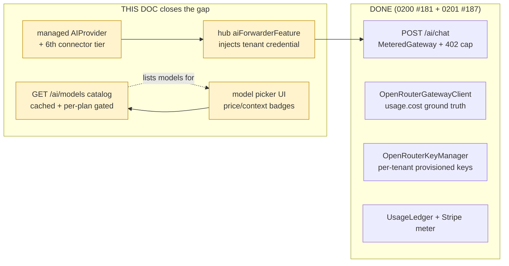
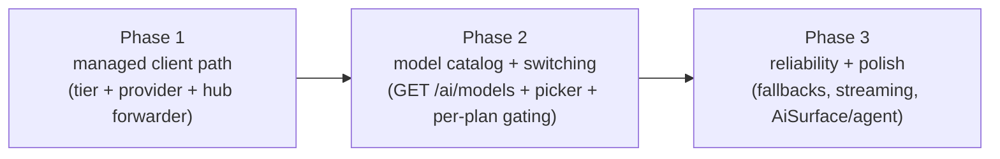
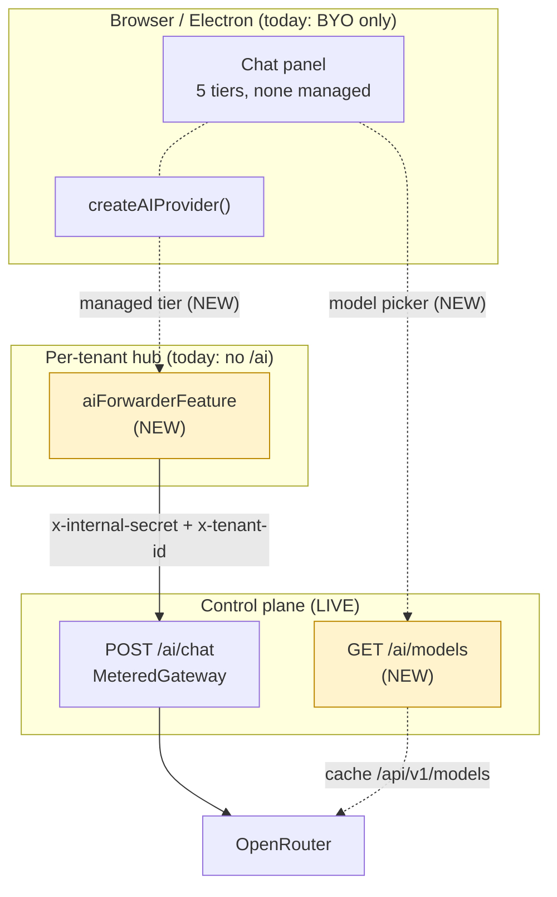
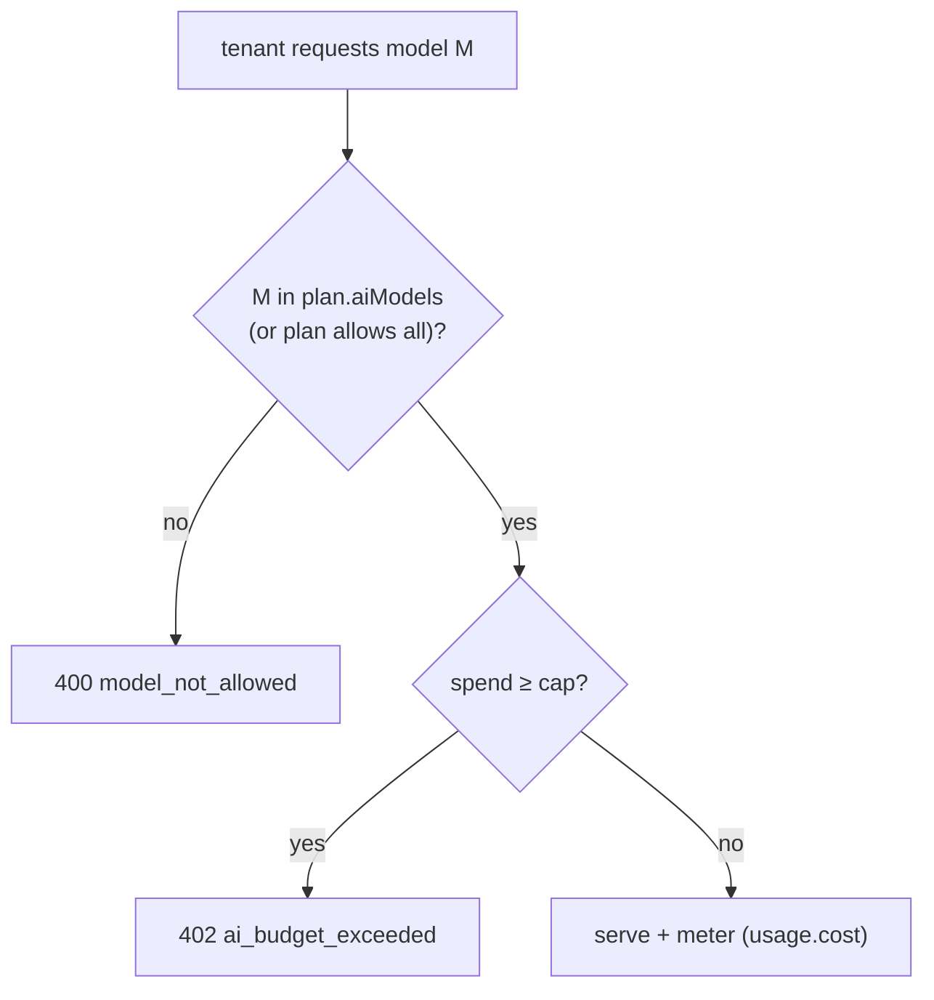
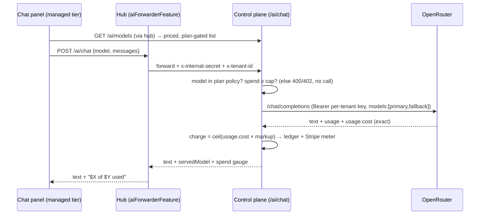
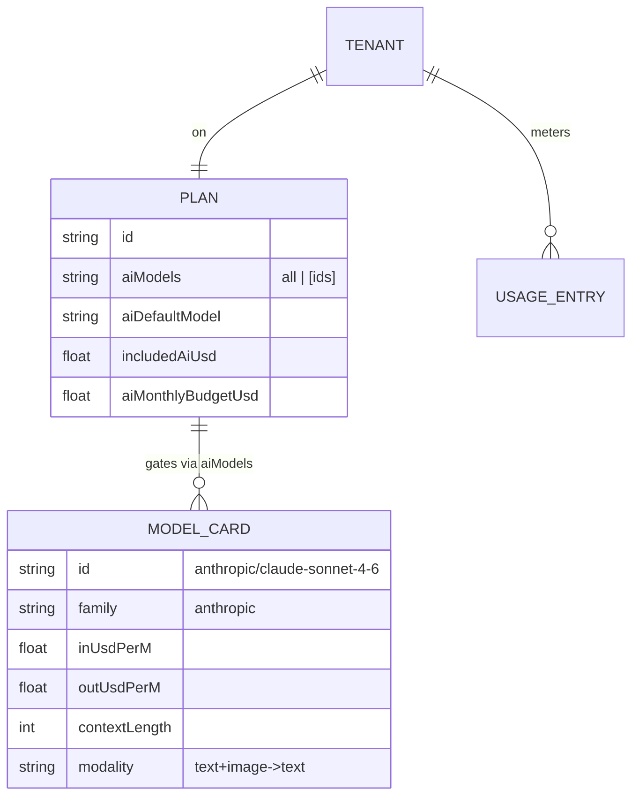

# Managed OpenRouter AI in the Product: Model Switching and Wiring the Existing Client AI Web APIs

## Problem Statement

The ask, in the user's words:

> Integrate **OpenRouter** into the xNet cloud offering so we can have **metered
> billing of AI** and the **ability to switch between models**. Wire it up so it
> works with the **existing web APIs for AI through xNet Cloud**.

There are three intertwined goals: (1) metered billing of AI, (2) model
switching, and (3) make it work through the AI web APIs xNet already has.

The honest starting point is that **the metered-billing half is already built and
merged**. Exploration
[0200](0200_[_]_CLOUD_BILLING_AI_METERING_AND_RUN_IN_PUBLIC_DASHBOARD.md) (PR
#181) stood up the cloud AI/billing spine, and exploration
[0201](0201_[_]_OPENROUTER_LITELLM_METERED_AI_AND_CREDITS_BILLING.md) (PR #187)
turned the OpenRouter key into a working metered gateway with exact `usage.cost`,
per-tenant provisioned keys, and a hard budget cap. Both docs explicitly **deferred
the same thing**: wiring managed AI into the *product* (the "into xNet in general"
Phase 3), and they only ever treated model selection as a static env allowlist.

So the real, still-open question this exploration answers is: **how does a user
actually pick a model and run metered managed AI from the app?** Today they
cannot — the server route exists but nothing the user touches calls it, and the
"choice of model" is a comma-separated environment variable. This doc is about
closing that last gap and making **model switching** a first-class capability,
not server plumbing.

## Executive Summary

**The server is ~80% done; the product surface is ~0% done.** The
`POST /ai/chat` route ([`apps/cloud/src/ai/route.ts`](../../apps/cloud/src/ai/route.ts))
already runs OpenRouter through the budget-guarded
[`MeteredGateway`](../../packages/cloud/src/ai/metered-gateway.ts), records exact
`usage.cost`, hard-stops at the cap with a `402`, and *already accepts a `model`
in the request body* — so **model switching at the API layer technically already
works**. What's missing is everything a human or a client needs to use it:

1. **A `managed` path from the client to the cloud.** The chat panel has five
   connector tiers (`webllm`, `local-server`, `prompt-api`, `cloud-key`,
   `bridge` — [`connectors/types.ts`](../../packages/plugins/src/ai/connectors/types.ts))
   and **none of them is `managed`**. The route is server-to-server (hub → control
   plane with `x-internal-secret`); no client code calls it. We need a sixth tier
   + a `managed` `AIProvider` + a **hub forwarder feature** that injects the
   tenant credential — the exact shape the `connectorSyncFeature` / `slackCompatFeature`
   already use.
2. **A real model catalog instead of an env allowlist.** Model choice today is
   `AI_ALLOWED_MODELS` (env, comma-separated) checked in
   [`route.ts:79`](../../apps/cloud/src/ai/route.ts). OpenRouter exposes a live
   `GET /api/v1/models` catalog (hundreds of models, each with per-token pricing,
   context length, and modality). We should proxy + cache it behind a new
   `GET /ai/models`, gate it per plan, and drive a **model picker** with price/context
   badges.
3. **Model switching as a product feature, not a config.** Switching means: a
   picker in the chat panel, a default model per plan, per-plan model **gating**
   (cheap models on small plans, frontier models on bigger ones), optional
   **model fallbacks** (`models: [...]`) for reliability, and the runtime passing
   `model` per request.



Recommended path, three phases that each ship on their own:



## Current State In The Repository

### What is already live (do not rebuild it)

| Concern | File | State |
|---|---|---|
| Metered chat route | [`apps/cloud/src/ai/route.ts`](../../apps/cloud/src/ai/route.ts) | `POST /ai/chat`: validates `model` against `allowedModels`, runs `MeteredGateway`, returns `text/usage/spendThisPeriodUsd/includedUsd/budgetUsd/budgetState`, `402` on cap. **Already takes `model` per request.** |
| OpenRouter chat client | [`packages/cloud/src/ai/openrouter-gateway.ts`](../../packages/cloud/src/ai/openrouter-gateway.ts) | `OpenRouterGatewayClient` reads `usage.cost` → `providerCostUsd`. |
| Per-tenant keys | [`packages/cloud/src/ai/openrouter-keys.ts`](../../packages/cloud/src/ai/openrouter-keys.ts) | `OpenRouterKeyManager` over the Provisioning API; USD `limit` + monthly `limit_reset`. |
| Budget + metering | [`metered-gateway.ts`](../../packages/cloud/src/ai/metered-gateway.ts) · [`metering.ts`](../../packages/cloud/src/ai/metering.ts) | Hard-stop before the call; meter every success; idempotent ledger. |
| Env wiring | [`apps/cloud/src/ai/wiring.ts`](../../apps/cloud/src/ai/wiring.ts) | `aiGatewayProvider()` (openrouter\|litellm), `aiKeysFromEnv`, `tenantResolver` (`x-internal-secret` + `x-tenant-id`), `AI_ALLOWED_MODELS`. |
| Static pricing fallback | [`apps/cloud/src/ai/pricing.ts`](../../apps/cloud/src/ai/pricing.ts) | `PROVIDER_RATES` × `AI_MARKUP` (1.3); used only when the gateway omits `usage.cost`. |
| Plans / AI entitlements | [`packages/entitlements/src/plans.ts`](../../packages/entitlements/src/plans.ts) | Per plan: `aiEnabled`, `includedAiUsd`, `aiMonthlyBudgetUsd`. **No per-plan model gating field yet.** |

### The client AI surface — the part with no managed path

- **Provider abstraction** —
  [`packages/plugins/src/ai/providers.ts`](../../packages/plugins/src/ai/providers.ts):
  `AIProvider` interface (`generate` / `generateWithTools` / `stream`),
  `AIProviderType` union (line 187) **already includes `'openrouter'`** but **not
  `'managed'`**, `AIProviderConfig` (line 202), the `createAIProvider` factory
  (line 1043), and `OpenAICompatibleProvider` which is what a `'managed'` provider
  would resemble — except its endpoint is the **hub**, and it carries **no API key**.
- **Runtime** —
  [`packages/plugins/src/ai/runtime.ts`](../../packages/plugins/src/ai/runtime.ts):
  `AiAgentRuntimeConfig` takes a single fully-formed `provider` plus `systemPrompt`
  / `contextProvider`. Model is per request via `AIProviderOptions.model`. Switching
  models = pass a different `model` (or rebuild the provider).
- **Chat panel connector** —
  [`apps/web/src/workbench/views/ai-chat-connector.ts`](../../apps/web/src/workbench/views/ai-chat-connector.ts):
  `providerConfigForConnector()` maps a detected tier to an `AIProviderConfig`.
  `CloudProvider = 'anthropic' | 'openai' | 'openrouter'` (line 12). Model is a
  free-text `AiChatSettings.model` persisted in `localStorage` (`xnet:ai-model`).
  **There is no managed tier and no model dropdown** — the "model" is whatever
  string the user typed.
- **Connector tiers** —
  [`packages/plugins/src/ai/connectors/types.ts`](../../packages/plugins/src/ai/connectors/types.ts):
  `ConnectorTier = 'webllm' | 'local-server' | 'prompt-api' | 'cloud-key' | 'bridge'`.
  This is where the **6th tier, `'managed'`**, belongs.
- **AI surface service** —
  [`packages/plugins/src/ai-surface/service.ts`](../../packages/plugins/src/ai-surface/service.ts):
  `AiSurfaceService` exposes workspace tools/resources and an `extraTools` seam.
  It consumes whatever `AIProvider` the surface hands it, so once `managed` exists
  it is reachable by the editor `/ai`, agent runner, and MCP for free.

### The hub — the missing forwarder

- The hub mounts first-party features through one uniform path:
  [`packages/hub/src/server.ts:806`](../../packages/hub/src/server.ts) →
  `mountFeatures([billingFeature(), tasksFeature(...), unfurlFeature(...)], ...)`.
- `HubFeature` contract:
  [`packages/hub/src/features/types.ts`](../../packages/hub/src/features/types.ts)
  (`id`, `secrets`, `mount(deps)`), with broker-scoped env.
- **There is no `/ai` route on the hub.** A new `aiForwarderFeature()` mirroring
  [`connectors.ts`](../../packages/hub/src/features/connectors.ts) /
  [`slack-compat.ts`](../../packages/hub/src/features/slack-compat.ts) (generic
  over an injected upstream, no hub → cloud package edge) is the clean way to
  forward `POST /ai/chat` to the control plane while injecting the tenant's
  `x-internal-secret` + `x-tenant-id` — the client never sees a key.



## External Research

### OpenRouter model catalog (`GET /api/v1/models`)

The catalog is a public GET; each entry carries everything a picker needs:

```jsonc
{
  "id": "anthropic/claude-sonnet-4-6",
  "name": "Anthropic: Claude Sonnet 4.6",
  "context_length": 200000,
  "pricing": {                 // USD per *token*, as decimal strings
    "prompt": "0.000003",
    "completion": "0.000015",
    "request": "0",
    "image": "0",
    "input_cache_read": "0.0000003",
    "input_cache_write": "0.00000375"
  },
  "architecture": {
    "modality": "text+image->text",
    "input_modalities": ["text", "image"],
    "output_modalities": ["text"],
    "tokenizer": "Claude"
  },
  "top_provider": { "context_length": 200000, "max_completion_tokens": 64000, "is_moderated": true },
  "supported_parameters": ["tools", "temperature", "reasoning", "..."]
}
```

- Model ids are **`provider/model`** (e.g. `anthropic/claude-sonnet-4-6`,
  `openai/gpt-4o-mini`). **Note the impedance mismatch:** our static
  `PROVIDER_RATES` table uses *bare* ids (`claude-sonnet-4-6`). The managed/OpenRouter
  path must use the prefixed ids — another reason to drive selection from the live
  catalog, not the static table.
- Pricing is **USD per token** (decimal strings) — multiply by 1e6 for the per-million
  figures our pricing table uses, or just display `× 1e6` for a "$/M tokens" badge.
- There is a special **`openrouter/auto`** model (NotDiamond-style auto-routing)
  and `:nitro` / `:floor` suffixes (throughput vs price) we can offer as
  "Auto (best value)".

### Usage accounting — one cleanup we should make

OpenRouter now **always returns `usage.cost`** (and `usage.cost_details` with
`upstream_inference_cost` + `cache_discount`); the `usage: { include: true }` /
`stream_options.include_usage` flags are **deprecated and have no effect**. Our
[`OpenRouterGatewayClient`](../../packages/cloud/src/ai/openrouter-gateway.ts)
still sends `usage: { include: true }` — harmless, but worth dropping, and we
could record `cost_details` for finer COGS. For **streaming**, the cost arrives in
the **final SSE chunk** (empty `choices`), so a streaming managed path must read
the last chunk to meter.

### Model routing / fallbacks

OpenRouter accepts a **`models: [primary, fallback, …]`** array (model-layer
fallback on context-length error, moderation, rate-limit, downtime) and a
`provider` block (`only`, `order`, `allow_fallbacks`, `sort`, `data_collection`,
`zdr`). This is the cheapest possible reliability win for "switch between models":
the client picks a primary, we append a sane same-tier fallback, and a single
provider outage doesn't 502 the user.

### What "most people" ship for model switching (2026)

- A **dropdown grouped by family** (Claude / GPT / Gemini / open) with a **price
  badge** ($/M in, $/M out) and a **context badge** — Cursor, Continue, LibreChat,
  OpenWebUI all converge here.
- A **default model per plan** and **gating** (cheaper models on free/low plans,
  frontier models behind higher tiers) so a $2-included plan can't one-shot $15/M
  Opus calls into its cap.
- **Surprise-bill safety stays the headline**: the model picker shows the live
  "$X of $Y used" gauge next to the model so switching to a pricier model is an
  informed choice. This reinforces the existing `402` hard cap rather than
  replacing it.

## Key Findings

1. **Model switching at the API already exists** — `POST /ai/chat` takes `model`
   and validates it. The work is *exposing* it: a catalog endpoint, a picker, and
   per-plan gating. We are not building model switching; we are surfacing it.
2. **The one architectural gap is the `managed` client path.** No connector tier,
   no `AIProvider`, no hub forwarder. Everything else (budget, metering, keys,
   exact cost) is downstream of that one missing hop and already works.
3. **The env allowlist is the wrong long-term model source.** `AI_ALLOWED_MODELS`
   is a deploy-time string; OpenRouter's catalog is live, priced, and hundreds
   deep. Proxy + cache it, gate per plan, and the picker is data-driven.
4. **Per-plan model gating belongs in entitlements, enforced at the route.**
   `PlanEntitlements` has no `aiModels`. OpenRouter provisioned keys don't reliably
   enforce a per-key model allowlist, so gating must be **route-side** (the same
   `allowedModels` check, but resolved from the plan, not a global env). The
   `VirtualKeyManager.create({ models })` field stays a defense-in-depth nicety.
5. **`managed` carries no key in the client** — the privacy/security win. The hub
   injects `x-internal-secret`; the per-tenant OpenRouter key never leaves the
   server. This is strictly better than the existing BYO `cloud-key` tier.
6. **Streaming is the one real engineering choice.** The chat panel is built around
   streaming deltas (`model.delta` in `ai-chat-connector.ts`), but `/ai/chat` is
   request/response. Ship managed **non-streaming first** (simplest correct
   metering), then add SSE passthrough where the last chunk carries `usage.cost`.
7. **Self-host must degrade gracefully.** Managed AI is Cloud-only; the OSS hub has
   no control plane. The `managed` tier must hide/disable itself (not hard-fail)
   when there's no forwarder, exactly as `bridge` hides when `:31416` is down.

## Options And Tradeoffs

### Decision 1 — How the client reaches managed AI

| Option | How | Pros | Cons |
|---|---|---|---|
| **A. `managed` tier → hub forwarder → control plane** *(recommended)* | New `'managed'` `ConnectorTier` + `ManagedProvider` posts to the hub's `/ai/chat`; `aiForwarderFeature` injects `x-internal-secret`+`x-tenant-id` and proxies to the control plane | No key in client; reuses the live metered route untouched; mirrors `connectorSyncFeature`; one new feature + one provider | Two network hops (client→hub→cloud); needs the hub feature |
| **B. Client → control plane directly** | Browser posts straight to `/ai/chat` | One hop | Client needs a tenant credential (defeats the "no key in client" goal); CORS + per-tenant auth on the public control plane; breaks the hub-as-front-door model |
| **C. Hub holds an OpenRouter key, calls OpenRouter itself** | Hub bypasses the control plane | Simplest hub code | Re-implements metering/budget/Stripe in the hub; **abandons the whole 0200/0201 spine** |

**Recommendation: A.** It reuses everything already built and keeps the
"client never holds a credential" invariant. The forwarder is ~40 lines and
generic over the injected upstream, like the existing connector/slack features.

### Decision 2 — Where the model list comes from

| Option | Pros | Cons |
|---|---|---|
| **Static `AI_ALLOWED_MODELS` env (today)** | Trivial; deterministic | Deploy to change; no prices/context; bare ids that don't match OpenRouter |
| **Live OpenRouter `/models`, proxied + cached behind `GET /ai/models`** *(recommended)* | Hundreds of models with real pricing/context/modality; new models appear without a deploy; one cache, all tenants | A fetch + TTL cache; must intersect with the plan gate |
| **Hand-curated catalog file in repo** | Editorial control; no upstream dependency at request time | Drifts from OpenRouter prices; manual upkeep |

**Recommendation:** proxy + cache the live catalog (5–15 min TTL, like the
`hub-status` 8s cache pattern in [`apps/cloud/src/hub-status.ts`]), and **intersect
it with a per-plan allow policy** so the picker only shows what the tenant may use.
Keep a tiny curated "featured" subset for the default ordering.

### Decision 3 — Per-plan model gating



| Option | Pros | Cons |
|---|---|---|
| **Flat global allowlist (today)** | One knob | Every plan gets frontier models; a $2 plan can burn its cap in one Opus call |
| **Per-plan `aiModels` policy** *(recommended)* | Cheap models on small plans, frontier behind higher tiers; aligns cost to price | New entitlements field + catalog tags (tier per model) |
| **Per-key model lock at OpenRouter** | Defense in depth | Provisioning API doesn't reliably enforce per-key model sets; brittle as sole gate |

**Recommendation:** add `aiModels?: 'all' | string[]` (or a `aiModelTier` ceiling)
to `PlanEntitlements`; enforce at the route by resolving the plan policy instead of
the env allowlist. Keep `VirtualKeyManager.create({ models })` as belt-and-suspenders.

### Decision 4 — Reliability: model fallbacks

Offer an optional **same-tier fallback**: when the user picks `anthropic/claude-sonnet-4-6`,
the gateway sends `models: ['anthropic/claude-sonnet-4-6', 'openai/gpt-4o']` so a
single provider outage degrades instead of 502-ing. Metering is unaffected — we
charge off whatever `usage.cost` comes back, and the response's `model` tells the
client which one actually served. Low effort, high resilience; default on, opt-out
per request.

### Decision 5 — Where the picker lives + streaming

- **Picker:** a dropdown in the chat panel header, grouped by family, each row
  showing **$/M in · $/M out · context**, with the live budget gauge beside it.
  Default = the plan's default model. Persist the last choice in `localStorage`
  (`xnet:ai-model`, already a key) **scoped to the managed tier**.
- **Streaming:** non-streaming managed first (correct metering, simplest), then an
  SSE variant of `/ai/chat` that forwards deltas and reads `usage.cost` from the
  final chunk. The panel already reduces `model.delta` events, so the client side
  is ready.

## Recommendation

Ship **Decision A + live catalog + per-plan gating**, in three phases.

### Phase 1 — The managed client path (make it usable at all)
1. Add `'managed'` to `ConnectorTier` and a `ManagedProvider` (an `OpenAICompatibleProvider`
   variant that targets the hub `/ai/chat`, sends **no** API key, and surfaces
   `spendThisPeriodUsd / includedUsd / budgetUsd / budgetState` to the panel).
2. Add `aiForwarderFeature()` to the hub — generic over an injected upstream URL +
   secret, mounts `POST /ai/chat`, injects `x-internal-secret` + `x-tenant-id`,
   streams the JSON back. Mirror `connectorSyncFeature`'s structure; **don't** add
   a hub → `@xnetjs/cloud` edge.
3. Detect the tier: `managed` is "available" when the hub advertises the forwarder
   (a `/ai/health` probe) **and** the tenant is `aiEnabled`; otherwise it hides
   (graceful self-host degrade). Make it the **preferred** tier when available.
4. Panel shows the budget gauge; a `402` renders "AI budget reached — raise cap"
   instead of a dead error.

### Phase 2 — Model switching (the headline ask)
5. `GET /ai/models` on the control plane: cached `/api/v1/models` ∩ plan policy,
   normalized to `{ id, name, family, inUsdPerM, outUsdPerM, contextLength, modality }`.
6. `aiModels` policy on `PlanEntitlements` + resolve it in `tenantResolver` /
   route so `allowedModels` comes from the plan, not just env.
7. Model picker UI (grouped, priced, context badge) wired to `GET /ai/models`;
   default model per plan; persist per-tenant choice.
8. Runtime/connector pass `model` per request (already supported by the body).

### Phase 3 — Reliability + reach
9. Optional `models: [primary, fallback]` for same-tier failover; record the
   served `model` from the response.
10. Streaming `/ai/chat` (SSE; meter off the final chunk's `usage.cost`).
11. Point `AiSurfaceService` / the editor `/ai` / agent runner at the managed
    provider so metered AI is available everywhere, not just the chat panel.
12. Drop the deprecated `usage: { include: true }`; optionally record `usage.cost_details`.



## Example Code

### A `managed` provider (client) — no key, talks to the hub

```ts
// packages/plugins/src/ai/providers.ts — new AIProviderType member + provider
export type AIProviderType =
  | 'anthropic' | 'openai' | 'ollama' | 'openai-compatible'
  | 'openrouter' | 'ollama-openai' | 'lmstudio' | 'vllm' | 'litellm'
  | 'managed' // ← XNet Cloud metered AI, routed through the hub; no API key
  | 'custom'

export interface ManagedProviderOptions {
  /** Hub base, e.g. same-origin '' or 'https://<handle>.xnet.app'. */
  baseUrl: string
  /** Default model id (OpenRouter-style 'provider/model'); overridable per request. */
  model?: string
  fetchImpl?: typeof fetch
}

export class ManagedProvider implements AIProvider {
  readonly name = 'managed'
  constructor(private readonly opts: ManagedProviderOptions) {}

  async generate(prompt: string): Promise<string> {
    const r = await this.chat([{ role: 'user', content: prompt }])
    return r.text
  }

  /** Returns the answer *and* the live budget gauge, so the panel can render it. */
  async chat(messages: ChatMessage[], model?: string): Promise<ManagedChatResult> {
    const fetchImpl = this.opts.fetchImpl ?? fetch
    const res = await fetchImpl(`${this.opts.baseUrl}/ai/chat`, {
      method: 'POST',
      headers: { 'content-type': 'application/json' },
      credentials: 'include', // hub session cookie; the hub injects the tenant secret
      body: JSON.stringify({ model: model ?? this.opts.model ?? 'openrouter/auto', messages })
    })
    if (res.status === 402) {
      const b = await res.json().catch(() => ({}))
      throw new AiBudgetError(b.spentUsd, b.budgetUsd) // panel → "raise cap" affordance
    }
    if (!res.ok) throw new AIGenerationError(`managed ${res.status}`, 'managed')
    return (await res.json()) as ManagedChatResult // { text, model, usage, spendThisPeriodUsd, includedUsd, budgetUsd, budgetState }
  }
}
```

### Connector mapping — the 6th tier

```ts
// apps/web/src/workbench/views/ai-chat-connector.ts
export type CloudProvider = 'anthropic' | 'openai' | 'openrouter'
// ConnectorTier gains 'managed' in packages/plugins/src/ai/connectors/types.ts

case 'managed': {
  // No key, no base-url typing: the hub is the origin. Model comes from the picker.
  return {
    type: 'managed',
    options: { baseUrl: settings.hubBaseUrl ?? '', ...(settings.model ? { model: settings.model } : {}) }
  }
}
```

### Hub forwarder feature — generic over the injected upstream

```ts
// packages/hub/src/features/ai-forwarder.ts (new) — mirrors connectorSyncFeature
import { Hono } from 'hono'
import type { HubFeature } from './types'

export function aiForwarderFeature(): HubFeature {
  return {
    id: 'fyi.xnet.ai',
    secrets: ['XNET_CLOUD_URL', 'XNET_CLOUD_INTERNAL_SECRET', 'XNET_TENANT_ID'],
    mount({ app, env, requireAuth }) {
      const upstream = env.XNET_CLOUD_URL
      const secret = env.XNET_CLOUD_INTERNAL_SECRET
      const tenantId = env.XNET_TENANT_ID
      if (!upstream || !secret || !tenantId) return // managed AI not configured → tier hides

      const ai = new Hono()
      ai.get('/health', (c) => c.json({ ok: true, managed: true }))
      ai.all('/chat', requireAuth, async (c) => {
        const res = await fetch(`${upstream}/ai/chat`, {
          method: 'POST',
          headers: {
            'content-type': 'application/json',
            'x-internal-secret': secret, // injected server-side; never reaches the client
            'x-tenant-id': tenantId
          },
          body: await c.req.text()
        })
        return new Response(res.body, { status: res.status, headers: res.headers })
      })
      app.route('/ai', ai)
    }
  }
}
```

### Catalog endpoint — live, cached, plan-gated

```ts
// apps/cloud/src/ai/models.ts (new)
export interface ModelCard {
  id: string; name: string; family: string
  inUsdPerM: number; outUsdPerM: number
  contextLength: number; modality: string
}

// 5–15 min TTL cache over GET https://openrouter.ai/api/v1/models
export async function fetchModelCatalog(fetchImpl = fetch): Promise<ModelCard[]> {
  const res = await fetchImpl('https://openrouter.ai/api/v1/models')
  const { data } = (await res.json()) as { data: OpenRouterModel[] }
  return data.map((m) => ({
    id: m.id,
    name: m.name,
    family: m.id.split('/')[0],
    inUsdPerM: Number(m.pricing.prompt) * 1e6,
    outUsdPerM: Number(m.pricing.completion) * 1e6,
    contextLength: m.context_length,
    modality: m.architecture.modality
  }))
}

// GET /ai/models → cards ∩ plan policy (resolved from the tenant's entitlements)
app.get('/ai/models', async (c) => {
  const t = await deps.resolveTenant(c)
  if (!t) return c.json({ error: 'unauthorized' }, 401)
  const cards = await getCachedCatalog()
  const policy = t.aiModels // 'all' | string[]
  const allowed = policy === 'all' ? cards : cards.filter((m) => policy.includes(m.id))
  return c.json({ models: allowed, defaultModel: t.defaultModel })
})
```

### Per-plan gating — entitlements

```ts
// packages/entitlements/src/plans.ts — extend PlanEntitlements
export interface PlanEntitlements {
  // …existing fields…
  aiEnabled: boolean
  includedAiUsd: number
  aiMonthlyBudgetUsd: number
  /** Which OpenRouter models this plan may pick. 'all' = whole gated catalog. */
  aiModels?: 'all' | string[]
  /** The model preselected for this plan's picker. */
  aiDefaultModel?: string
}
// e.g. personal: aiModels: ['anthropic/claude-haiku-4-5','openai/gpt-4o-mini'], default haiku
//      company:  aiModels: 'all', default 'anthropic/claude-sonnet-4-6'
```

### Model fallback (server) — one-line resilience

```ts
// in OpenRouterGatewayClient.chat — accept an optional fallback list
body: JSON.stringify({
  model: req.model,
  ...(req.fallbackModels?.length ? { models: [req.model, ...req.fallbackModels] } : {}),
  messages: req.messages,
  ...(req.maxTokens ? { max_tokens: req.maxTokens } : {})
  // usage.cost is always returned now — the deprecated `usage:{include:true}` can go
})
```

### Picker data model



## Risks And Open Questions

- **Streaming vs metering.** Non-streaming first is correct but feels less live
  than BYO. SSE passthrough must meter off the **final** chunk's `usage.cost`, not
  the deltas — easy to get wrong. Open: ship streaming in Phase 1 or defer to 3?
- **Catalog ↔ pricing-table id mismatch.** The static `PROVIDER_RATES` uses bare
  ids; OpenRouter uses `provider/model`. The `usage.cost` path sidesteps this, but
  the **fallback** static-pricing path will silently mis-meter a prefixed id (→
  `DEFAULT_RATE`). Either map ids or treat managed/OpenRouter as cost-truth-only.
- **Per-plan gating UX.** A user on a small plan sees a frontier model in the
  marketing copy but not the picker. Need clear "upgrade to use Opus" affordance,
  not a silent omission.
- **Two-hop latency + failure modes.** client → hub → cloud → OpenRouter. Each hop
  needs a sane timeout and a legible error (a hub-down vs cloud-down vs
  OpenRouter-down distinction the panel can act on).
- **`openrouter/auto` cost predictability.** Auto-routing is great UX but the user
  can't see the price badge for a model chosen at request time. Show the *served*
  model + its realized cost after the fact.
- **Self-host parity.** The `managed` tier must vanish cleanly with no control
  plane; BYO `cloud-key` (incl. OpenRouter-with-your-own-key) stays the OSS path.
- **Catalog freshness vs stampede.** A 5–15 min TTL with a single in-flight refresh
  (no thundering herd) per the existing cache patterns; stale-while-revalidate so a
  catalog blip never blocks chat.
- **Moderation / ZDR.** Some tenants will want `provider.data_collection: 'deny'` /
  `zdr: true`. Plumb a per-plan or per-tenant routing-preference passthrough.

## Implementation Checklist

### Phase 1 — Managed client path
- [x] Add `'managed'` to `AIProviderType`
      ([`providers.ts`](../../packages/plugins/src/ai/providers.ts)) + a
      `ManagedProvider` that posts to the hub `/ai/chat` with **no** API key,
      surfaces the budget (`onBudget`), and maps `402` → `AiBudgetError`.
- [x] Add `'managed'` to `ConnectorTier`
      ([`connectors/types.ts`](../../packages/plugins/src/ai/connectors/types.ts))
      and a `case 'managed'` in `providerConfigForConnector`
      ([`ai-chat-connector.ts`](../../apps/web/src/workbench/views/ai-chat-connector.ts)).
- [x] `aiForwarderFeature()` in
      [`packages/hub/src/features/ai-forwarder.ts`](../../packages/hub/src/features/ai-forwarder.ts)
      (generic over injected fetch + env config), registered in
      [`server.ts`](../../packages/hub/src/server.ts) `mountFeatures([...])`.
- [x] Tier detection (`probeManaged` → `/ai/health` `{ ok, managed }`); `managed`
      is preferred when available and hides off-cloud (graceful self-host degrade).
- [x] Panel renders the `spendThisPeriodUsd / includedUsd / budgetUsd` gauge; the
      typed `AiBudgetError` carries the surface for a raise-cap affordance.

### Phase 2 — Model switching
- [x] `fetchModelCatalog` + `createModelCatalog` TTL cache (single-flight +
      stale-while-revalidate) over `GET /api/v1/models`
      ([`apps/cloud/src/ai/models.ts`](../../apps/cloud/src/ai/models.ts)).
- [x] `GET /ai/models` route: cached catalog ∩ plan policy → priced `ModelCard[]` +
      `defaultModel`; forwarded by the hub (`aiForwarderFeature`).
- [x] `aiModels` / `aiDefaultModel` on `PlanEntitlements` + `withAiModels` /
      `aiModelAllowed` ([`plans.ts`](../../packages/entitlements/src/plans.ts));
      per-plan values set (cheap subset on small plans, `'all'` on bigger ones).
- [x] Resolve `aiModels` + default from the **plan** in
      [`wiring.ts`](../../apps/cloud/src/ai/wiring.ts) `tenantResolver`; `/ai/chat`
      enforces the policy + falls back to the plan default; env stays a global cap.
- [x] Model picker UI in the chat panel (grouped by family; $in/$out + context
      badges); persists choice; budget gauge beside it.
- [x] Runtime/connector pass `model` per request (provider rebuilds on change).

### Phase 3 — Reliability + reach
- [x] Optional `fallbackModels` → `models: [primary, …]` in
      [`OpenRouterGatewayClient`](../../packages/cloud/src/ai/openrouter-gateway.ts);
      `ChatResult.model` records the served model; `/ai/chat` forwards only
      plan-permitted fallbacks.
- [ ] **Deferred:** streaming `/ai/chat` (SSE) metering off the final chunk's
      `usage.cost` (managed ships non-streaming first — correct metering).
- [x] `managed` is first-class in `createAIProvider`, so `AiSurfaceService` / editor
      `/ai` / agent runner can target it by config; the chat panel is the first
      consumer. **Deferred:** deeper editor `/ai` + agent-runner wiring.
- [x] Drop deprecated `usage: { include: true }`. **Deferred:** record
      `usage.cost_details` (needs a ledger field).
- [x] Docs: managed-AI env (`XNET_CLOUD_URL` / `XNET_CLOUD_INTERNAL_SECRET` /
      `XNET_TENANT_ID`) in [`docs/cloud/SETUP.md`](../cloud/SETUP.md).

## Validation Checklist
- [x] No API key is ever present in the client for managed AI — `ManagedProvider`
      sends no `authorization`; the hub injects `x-internal-secret` (unit:
      `managed-provider.test.ts`, `ai-forwarder.test.ts`).
- [x] An over-cap tenant gets a `402` with **no** provider call (counting fake
      never invoked); `ManagedProvider` maps it to `AiBudgetError`
      (`route.test.ts`, `managed-provider.test.ts`).
- [x] `GET /ai/models` returns only models the plan allows; a gated model is absent
      for a small plan and present for a higher one (`route.test.ts`,
      `plans.test.ts`).
- [x] The chat request carries the selected `model`; the response's served `model`
      is reported back (or a fallback when triggered) (`route.test.ts`,
      `openrouter-gateway.test.ts`).
- [x] Picker price/context badges come from the catalog (`pricing.prompt × 1e6`)
      (`models.test.ts`, `ai-chat-connector.test.ts`).
- [x] A metered managed call records `providerCostUsd == usage.cost` and
      `chargeUsd == ceil(usage.cost × markup)`, idempotent on retry
      (`metered-gateway.test.ts`, `route.test.ts`).
- [x] With **no** control plane, the `managed` tier reports unavailable and hides;
      BYO tiers still work (`detect.test.ts`, `ai-forwarder.test.ts`).
- [x] Fallback: a `models: [primary, fallback]` array is sent and the served model
      is metered off its `usage.cost` (`openrouter-gateway.test.ts`).
- [ ] **Operator (live):** end-to-end smoke in a deployed staging hub — the panel
      auto-selects `managed`, the gauge populates from a real metered call, and the
      picker lists the live OpenRouter catalog.

## References

### Repo — already built (0200 #181 / 0201 #187)
- Route + wiring: [`apps/cloud/src/ai/route.ts`](../../apps/cloud/src/ai/route.ts),
  [`wiring.ts`](../../apps/cloud/src/ai/wiring.ts),
  [`pricing.ts`](../../apps/cloud/src/ai/pricing.ts)
- Gateway + keys: [`openrouter-gateway.ts`](../../packages/cloud/src/ai/openrouter-gateway.ts),
  [`openrouter-keys.ts`](../../packages/cloud/src/ai/openrouter-keys.ts),
  [`keys.ts`](../../packages/cloud/src/ai/keys.ts),
  [`metered-gateway.ts`](../../packages/cloud/src/ai/metered-gateway.ts),
  [`metering.ts`](../../packages/cloud/src/ai/metering.ts)
- Plans: [`packages/entitlements/src/plans.ts`](../../packages/entitlements/src/plans.ts)

### Repo — the client/hub seams this doc fills
- Providers/runtime: [`packages/plugins/src/ai/providers.ts`](../../packages/plugins/src/ai/providers.ts),
  [`runtime.ts`](../../packages/plugins/src/ai/runtime.ts),
  [`ai-surface/service.ts`](../../packages/plugins/src/ai-surface/service.ts)
- Chat panel: [`apps/web/src/workbench/views/ai-chat-connector.ts`](../../apps/web/src/workbench/views/ai-chat-connector.ts),
  [`connectors/types.ts`](../../packages/plugins/src/ai/connectors/types.ts)
- Hub features: [`packages/hub/src/features/types.ts`](../../packages/hub/src/features/types.ts),
  [`first-party.ts`](../../packages/hub/src/features/first-party.ts),
  [`connectors.ts`](../../packages/hub/src/features/connectors.ts),
  [`server.ts`](../../packages/hub/src/server.ts)
- Prior explorations: [0201](0201_[_]_OPENROUTER_LITELLM_METERED_AI_AND_CREDITS_BILLING.md),
  [0200](0200_[_]_CLOUD_BILLING_AI_METERING_AND_RUN_IN_PUBLIC_DASHBOARD.md)

### External — OpenRouter
- [List models (`GET /api/v1/models`)](https://openrouter.ai/docs/api-reference/list-available-models) ·
  [Models overview](https://openrouter.ai/docs/features/models) ·
  [Usage accounting (`usage.cost`)](https://openrouter.ai/docs/cookbook/administration/usage-accounting)
- [Model fallbacks (`models: [...]`)](https://openrouter.ai/docs/guides/routing/model-fallbacks) ·
  [Provider routing (`only`/`order`/`allow_fallbacks`/`sort`/`data_collection`)](https://openrouter.ai/docs/guides/routing/provider-selection) ·
  [Model routing & Auto Router](https://openrouter.ai/blog/insights/model-routing/)
- [Provisioning API (per-tenant keys)](https://openrouter.ai/docs/features/provisioning-api-keys)

### External — model-switching & billing UX
- [Continue model config](https://docs.continue.dev/customize/model-providers/openrouter) ·
  [LibreChat model picker](https://www.librechat.ai/docs) ·
  [Metered billing for AI agents (2026)](https://www.buildmvpfast.com/blog/metered-billing-ai-agents-usage-based-pricing-agent-workload-2026) ·
  [Credits vs quotas vs windows (2026)](https://usagebox.com/articles/ai-coding-tool-billing-models-2026)
