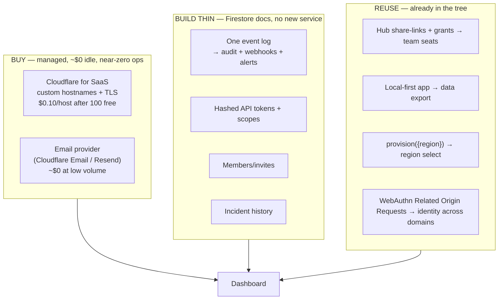
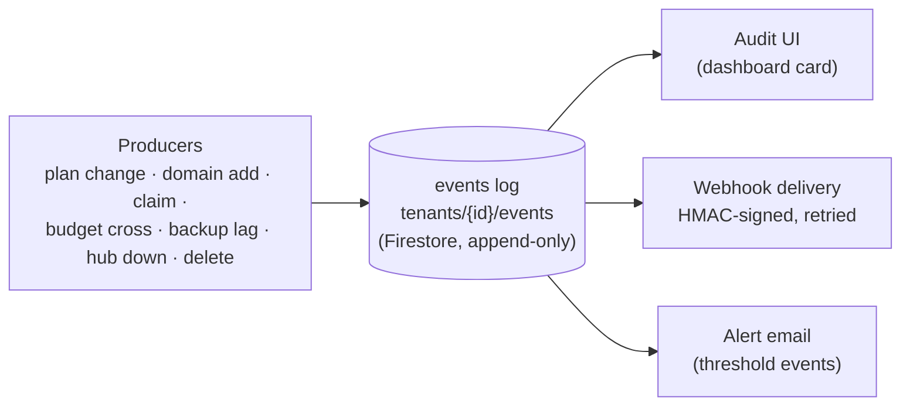
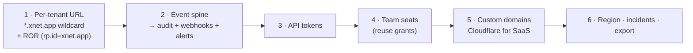

# Enabling the Rest of the Cloud Dashboard — Domains, Identity, and the Ops Spine

## Problem Statement

Exploration [0207](0207_[_]_FULL_CLOUD_DASHBOARD_HOSTED_APP_AND_CUSTOM_DOMAINS.md)
shipped Phase 1 — the dashboard now shows live hub status, connection analytics,
storage, and last-backup. It deliberately deferred everything that needs **external
infrastructure or a new subsystem**:

- **P2 — a stable per-tenant hosted-app URL** (`alice.xnet.app`)
- **P3 — bring-your-own custom domains** (`notes.alice.com` for the app and/or hub)
- **P4 — the ops long tail**: alerts, outbound webhooks, API/personal-access tokens,
  audit log, team seats + invites, data export, region selection, incident history

This exploration answers *what it would actually take* to build all of them, with
**multiple solutions per capability scored on cost, complexity, and maintenance** —
because the failure mode here is accidentally signing up to run a fleet of new
services (a Caddy tier, a message queue, a cert manager) when the existing managed
stack (Cloudflare, Firestore, Stripe, WorkOS, Cloud Run) can carry it.

The thesis: **buy the hard infrastructure (domains, email), build thin on Firestore
for the data features, and reuse what already exists (share/grants for teams,
local-first for export, the SLI engine for incidents).** That keeps the
always-running surface area — the thing that actually costs money and attention —
almost flat.

## Executive Summary



**The single biggest decision is the routing/identity layer for P2+P3.** Recommend
**Cloudflare for SaaS** (we're already on Cloudflare for DNS + R2; it manages the
entire TLS lifecycle with one API call and a per-host price that's free up to 100
hostnames) plus **WebAuthn Related Origin Requests (ROR)** anchored on a single
`rp.id` so one passkey works across `xnet.fyi/app`, `*.xnet.app`, and a bounded set
of custom domains. Everything in P4 collapses onto **one append-only event log** in
Firestore that fans out to the audit UI, webhook delivery, and alert emails — three
features, one producer.

**Phasing (cheapest-first):** P2 (wildcard subdomain, no per-host cost) → the event
spine (unlocks alerts + webhooks + audit at once) → API tokens → team seats (reuse
grants) → P3 custom domains (the one with a real external dependency) → region +
incidents + export (mostly UI over existing plumbing).

## Current State In The Repository

- **Identity / passkey RP-ID** — [`packages/identity/src/passkey/fallback.ts:28`](packages/identity/src/passkey/fallback.ts):
  `const resolvedRpId = rpId ?? window.location.hostname`. Today the RP-ID is the
  serving hostname, so a passkey made on `xnet.fyi/app` is **not** usable on
  `alice.xnet.app` or `notes.alice.com`. This is *the* constraint for P2/P3.
- **Hosted app** — already bundled to `xnet.fyi/app` (0192;
  [.github/workflows/deploy-site.yml](.github/workflows/deploy-site.yml)), hub-agnostic,
  resolves its hub from `localStorage`/`?shareSession`
  ([`apps/web/src/lib/hub-url.ts`](apps/web/src/lib/hub-url.ts)).
- **Region** — already threaded end-to-end:
  [`apps/cloud/src/control-plane.ts:66,168,223`](apps/cloud/src/control-plane.ts)
  (`provisionTenant({ region })` → provisioner). Region *selection* is UI + the
  cross-tier migration story, not new plumbing.
- **Team primitives exist** — the hub has durable **share-links + grants**
  ([`packages/hub/src/routes/share-links.ts`](packages/hub/src/routes/share-links.ts):
  `/links`, `/links/:id/claim`, `/grants`) and a `ShareAccessService`. A "team" is
  N data-DIDs holding grants on one hub. Entitlements already bill **seats**
  ([`packages/entitlements/src/plans.ts:57`](packages/entitlements/src/plans.ts),
  Stripe `SubscriptionItem.quantity`).
- **Backup / export** — [`packages/hub/src/routes/backup.ts`](packages/hub/src/routes/backup.ts)
  (`POST /:did`) + `BackupService`; the app is local-first (it *already* holds all
  the user's data), so export is closer than it looks.
- **No event/audit/notification spine yet** — the only "webhook" in the tree is the
  inbound Stripe one ([`apps/cloud/src/billing/stripe-gateway.ts`](apps/cloud/src/billing/stripe-gateway.ts)).
  Audit, outbound webhooks, and alerts are greenfield — which is the opportunity to
  build them as *one* thing.
- **State store** — Firestore (`apps/cloud/src/stores/firestore.ts`) already backs
  `tenants` + `bindings`; new collections (`events`, `tokens`, `members`,
  `domains`, `incidents`) are the same cheap pattern, no new service.
- **The dashboard** is server-rendered + polled JSON (0207), so each new feature is
  a card + a route, not a SPA.

## External Research

- **Cloudflare for SaaS (custom hostnames):** first **100 hostnames free**, then
  **$0.10/host/month**; Pay-as-you-go now supports up to **50,000** hostnames
  (raised from 5,000 in May 2025). One API call registers a hostname; the customer
  adds **one CNAME**; Cloudflare runs the **entire TLS lifecycle** (DCV, issue,
  renew). Pre-validation (TXT/Delegated DCV) lets the cert go active before DNS
  cutover. ([Cloudflare for SaaS](https://developers.cloudflare.com/cloudflare-for-platforms/cloudflare-for-saas/),
  [PAYG limits 2025](https://developers.cloudflare.com/changelog/post/2025-05-19-paygo-updates/))
- **Caddy on-demand TLS:** free Let's Encrypt certs, **no per-domain cost**, issues
  certs on first request against an `ask` endpoint — but you **run and scale Caddy**,
  persist the cert store, and own rate-limit/abuse handling. Best when domain counts
  are huge and you want zero per-host fees. ([Caddy on-demand TLS](https://caddyserver.com/docs/automatic-https#on-demand-tls))
- **WebAuthn Related Origin Requests (ROR):** the modern fix for one passkey across
  domains — pick **one common `rp.id`**, serve an allowlist at
  `https://{rp.id}/.well-known/webauthn`, and all origins set `rp.id` to it.
  Chrome/Edge 128+ and Safari 18 (2024); Firefox 152 (May 2026). **Caveat:** browsers
  only process a **bounded number (~5 eTLD+1 labels)** from the allowlist, so ROR
  scales to a handful of *first-party* domains, **not** thousands of BYO custom
  domains — those need a different identity path. ([web.dev ROR](https://web.dev/articles/webauthn-related-origin-requests),
  [passkeys.dev](https://passkeys.dev/docs/advanced/related-origins/))
- **Dashboards converge** (Railway/Fly/Supabase, per 0207) on *expose Prometheus +
  a few tiles + logs*, and on **buying** domains/email rather than running them.

## Key Findings

1. **Two capabilities are nearly free plumbing** (region, data export) because the
   seams already exist. Build these first for quick wins.
2. **Three P4 features are secretly one feature.** Audit log, outbound webhooks, and
   alerts are all "something happened → record/deliver/notify." Build a single
   append-only **event log** and they fall out together. Building them separately is
   the classic 3× cost mistake.
3. **Team seats don't need a new data model** — the hub's share/grant system already
   lets multiple DIDs share a hub; "team" is an invite flow + grant issuance + the
   `seats` entitlement (already billed).
4. **Identity across domains is the hard part, and it bifurcates:** ROR cleanly
   covers first-party domains (`xnet.fyi`, `*.xnet.app`) but **not** unbounded BYO
   domains. Accept that split: ROR for the hosted URL; for BYO custom domains, do
   **central-origin auth** (redirect/iframe to `auth.xnet.fyi`) or per-domain
   enrollment. Don't try to make ROR scale to customer domains.
5. **Cloudflare for SaaS is the cost/maintenance winner for domains** precisely
   because we're *already* a Cloudflare customer (DNS + R2). It adds **zero new
   running services**; Caddy adds a fleet to operate.
6. **Everything else is a Firestore collection + a dashboard card.** No queue, no new
   datastore. Webhook retries can be a small Cloud Run job or inline-with-backoff.

## Options And Tradeoffs

Scores: ★ = best (low cost / low complexity / low maintenance), ▲ = middle, ✖ = worst.

### A. Per-tenant hosted-app URL (`alice.xnet.app`) — P2

| Option | Cost | Complexity | Maintenance | Notes |
| --- | --- | --- | --- | --- |
| **Wildcard `*.xnet.app` on Cloudflare → app bundle + `/_xnet/app-config.json` keyed by Host** ★ | ★ free (1 wildcard cert) | ★ | ★ | Hostname→tenant lookup; app boots pre-pointed at the hub |
| Path-per-tenant `app.xnet.fyi/<handle>` ▲ | ★ | ★ | ★ | One origin, but weaker isolation; ugly URLs; RP-ID is the parent anyway |
| Cloud Run domain mapping per subdomain ✖ | ▲ | ✖ | ✖ | One mapping per host; preview; doesn't fleet-scale |

### B. Custom domains BYO (`notes.alice.com`) — P3

| Option | Cost | Complexity | Maintenance | Notes |
| --- | --- | --- | --- | --- |
| **Cloudflare for SaaS custom hostnames** ★ | ▲ $0.10/host (100 free) | ★ one API call | ★ managed TLS forever | We're already on Cloudflare; gate to paid plans |
| Caddy on-demand TLS (self-hosted) ▲ | ★ no per-host fee | ✖ run/scale Caddy + cert store + `ask` | ✖ you own renewals/abuse | Wins only at very high host counts |
| GCP external LB + managed certs ✖ | ✖ per-cert + LB hours | ✖ | ▲ | Heavy; cert quotas; most ops |

### C. Alerts + webhooks + audit — one event spine — P4



| Option | Cost | Complexity | Maintenance | Notes |
| --- | --- | --- | --- | --- |
| **One Firestore event log → 3 consumers** ★ | ★ writes only | ▲ build the producer + delivery | ★ no new infra | Audit/webhooks/alerts share it |
| Per-feature stores (separate audit, hook, alert systems) ✖ | ▲ | ✖ 3× | ✖ 3× | The cost trap |
| Buy (e.g. Hookdeck/Svix for webhooks, Logflare for audit) ▲ | ✖ per-event SaaS fees | ★ | ★ | Fast but recurring cost + lock-in |
| Email transport: **Cloudflare Email / Resend / SES** ★ | ★ ~free at low vol | ★ | ★ | Pick one; all are cheap |

### D. API / personal-access tokens — P4

| Option | Cost | Complexity | Maintenance | Notes |
| --- | --- | --- | --- | --- |
| **Hashed tokens + scopes in Firestore, verified by middleware** ★ | ★ | ★ | ★ | `xnet_pat_…`; store SHA-256 only; powers MCP/the bridge |
| Reuse WorkOS / OAuth client-credentials ▲ | ★ | ▲ | ★ | Heavier than needed for PATs |

### E. Team seats + invites — P4

| Option | Cost | Complexity | Maintenance | Notes |
| --- | --- | --- | --- | --- |
| **Reuse hub share-links/grants + an invite (device-grant-shaped) flow** ★ | ★ | ▲ wire invite→grant | ★ | `seats` already billed; members are DIDs with grants |
| New membership service + ACL ✖ | ▲ | ✖ | ✖ | Reinvents share-access |

### F. Data export · G. Region · H. Incident history — P4

| Capability | Best option | Cost / Complexity / Maintenance |
| --- | --- | --- |
| **Data export** | Local-first "Export" in the app (data is already on-device) + optional hub dump via `BackupService` | ★ / ★ / ★ |
| **Region select** | UI over `provision({region})`; cross-region change = migration (like a plan-tier crossing) | ★ / ▲ / ★ |
| **Incident history** | Persist `/status.json` transitions to a Firestore `incidents` collection; render a timeline | ★ / ★ / ★ |

## Recommendation

Build in this order — each step is independently shippable and the early ones cost
nothing new to run:



1. **Per-tenant URL (P2)** — register `*.xnet.app` (or a path on `xnet.fyi`) on
   Cloudflare (free wildcard cert). Serve the existing `apps/web` bundle; add
   `GET /_xnet/app-config.json` that maps `Host` → tenant → hub URL via a new
   `getTenantForHostname` index. **Identity:** adopt **ROR** with `rp.id` set to a
   single anchor (e.g. `xnet.app`), serve `/.well-known/webauthn`, and thread an
   explicit `rpId` into [`createFallbackIdentity`](packages/identity/src/passkey/fallback.ts)
   instead of `window.location.hostname`. One passkey now works across the hosted
   origins.
2. **Event spine (P4 core)** — an append-only `tenants/{id}/events` Firestore
   collection written at every meaningful action; three thin consumers (audit card,
   HMAC-signed webhook delivery with backoff, alert email via Cloudflare Email/Resend
   on threshold events). This is the highest-leverage build — three roadmap items
   from one subsystem.
3. **API tokens (P4)** — `xnet_pat_…`, store only the SHA-256 + scopes; a Hono
   middleware gates a new `/api/*`. Immediately useful for MCP/the local bridge
   (0194).
4. **Team seats (P4)** — an invite flow (device-grant-shaped) that issues a hub
   **grant** to the invitee's DID; bill via the existing `seats` quantity. No new
   data model.
5. **Custom domains (P3)** — **Cloudflare for SaaS** custom hostnames, gated to
   paid plans, capped + DCV-verified. For BYO-domain identity, route auth through a
   **central origin** (`auth.xnet.fyi`) rather than stretching ROR. A `domains`
   collection + the add→verify→active state machine on the dashboard.
6. **Region · incidents · export** — mostly UI over existing plumbing; ship last.

**Why this is the cost/complexity/maintenance optimum:** the only *new always-on
spend* is Cloudflare custom-hostname fees (paid-plan-gated, so revenue-aligned) and
trivial email volume. No queue, no Caddy fleet, no second datastore. Every data
feature is a Firestore collection + a server-rendered card, and the two hardest
problems (domains, cross-domain identity) are solved by a service we already pay for
(Cloudflare) and a browser standard (ROR) rather than bespoke infra.

## Example Code

### Anchor the passkey RP-ID (enables ROR across hosted origins)

```ts
// packages/identity/src/passkey/fallback.ts — take an explicit rp.id, not the host.
// XNET_RP_ID = 'xnet.app' (or a dedicated auth origin). Serve the allowlist at
// https://xnet.app/.well-known/webauthn so *.xnet.app + xnet.fyi reuse one passkey.
const resolvedRpId = rpId ?? readConfig().rpId ?? window.location.hostname
//                          ^^^^^^^^^^^^^^^^^^^^ new: a build/runtime-configured anchor
```

```json
// https://xnet.app/.well-known/webauthn  (Related Origin Requests allowlist)
{ "origins": ["https://xnet.fyi", "https://app.xnet.fyi", "https://xnet.app"] }
```

### One event → audit + webhook + alert

```ts
// apps/cloud/src/events.ts — the spine. Producers call emit(); consumers fan out.
export interface TenantEvent {
  id: string; tenantId: string; type: string; atMs: number
  data: Record<string, unknown>; severity?: 'info' | 'warn' | 'critical'
}
export async function emit(deps: EventDeps, e: Omit<TenantEvent, 'id' | 'atMs'>) {
  const event = { ...e, id: deps.id(), atMs: deps.now() }
  await deps.events.append(event.tenantId, event)        // audit log (durable)
  await deps.webhooks.deliver(event)                     // HMAC-signed, retried
  if (event.severity && event.severity !== 'info') await deps.alerts.email(event)
}
```

### Custom hostname via Cloudflare for SaaS

```ts
// Register a customer domain; Cloudflare manages TLS. Persist to `domains/{id}`.
const r = await fetch(
  `https://api.cloudflare.com/client/v4/zones/${ZONE}/custom_hostnames`,
  { method: 'POST', headers: { Authorization: `Bearer ${CF_TOKEN}` },
    body: JSON.stringify({ hostname: 'notes.alice.com', ssl: { method: 'txt', type: 'dv' } }) }
)
// → dashboard shows the CNAME + TXT to add; poll status until "active".
```

### Hashed API token

```ts
const secret = `xnet_pat_${base62(random(24))}`              // shown once
await tokens.put({ tenantId, hash: sha256(secret), scopes, createdMs: now() })
// verify: middleware hashes the bearer, looks up the doc, checks scope + expiry.
```

## Risks And Open Questions

- **ROR does not scale to BYO domains.** Browsers cap the allowlist (~5 eTLD+1
  labels). Decide the BYO-domain identity path up front: central-origin redirect/iframe
  auth vs per-domain passkey enrollment. (First-party `*.xnet.app` is fine via ROR.)
- **RP-ID migration.** Moving identity off `xnet.fyi`'s host RP-ID to an anchor means
  existing passkeys (made at `window.location.hostname`) won't match the new `rp.id`.
  Need a re-enrollment / dual-RP transition plan, or pick the anchor before users
  enroll widely. (Note: the app is local-first; the DID, not the passkey, is the
  durable identity — re-enrolling a passkey to the same DID is the real task.)
- **Custom-domain abuse / phishing.** Gate to paid plans, require DCV ownership, cap
  count, and monitor for lookalike domains.
- **Webhook delivery reliability.** Inline-with-backoff is simplest but ties up the
  request; a tiny Cloud Run job/cron for retries is the next step. Don't reach for a
  full queue until volume demands it.
- **Alert fatigue / cost.** Debounce threshold events (budget near-cap, backup lag);
  per-tenant notification prefs; cap emails/day.
- **Cloudflare lock-in.** Custom-hostname + DNS + R2 concentrate on one vendor;
  acceptable for the cost/maintenance win, but keep the domain layer behind an
  interface so Caddy/LB stays a fallback.
- **Team billing edges.** Seat add/remove ↔ Stripe quantity proration ↔ grant
  revocation must stay consistent (the plan-change reconciliation pattern applies).

## Implementation Checklist

- [ ] **P2:** Register `*.xnet.app` (Cloudflare, wildcard cert); serve the `apps/web`
      bundle; add `getTenantForHostname` + `GET /_xnet/app-config.json` (Host→hub).
- [ ] **P2/identity:** Thread an explicit `rpId` anchor into `createFallbackIdentity`;
      serve `/.well-known/webauthn`; verify ROR across `xnet.fyi` + `*.xnet.app`.
- [ ] **Event spine:** `tenants/{id}/events` (Firestore) + `emit()`; instrument the
      producers (claim, plan change, domain add, budget cross, backup lag, hub down,
      delete).
- [ ] **Audit:** dashboard card listing recent events (paged).
- [ ] **Webhooks:** `webhooks/{id}` (url + secret + events); HMAC-signed delivery with
      retry/backoff; a "test event" button; signature docs.
- [ ] **Alerts:** pick an email provider (Cloudflare Email / Resend); per-tenant prefs;
      debounce; send on `warn`/`critical` events.
- [ ] **API tokens:** `tokens/{id}` (SHA-256 + scopes + expiry); verify middleware;
      `/api/*`; create/list/revoke UI (secret shown once).
- [ ] **Team seats:** invite flow → hub grant for the invitee DID; Stripe seat
      quantity ↔ grant lifecycle; members card.
- [ ] **P3 custom domains:** Cloudflare for SaaS integration; `domains/{id}` state
      machine (pending→active); add→CNAME/TXT→verify UI; paid-plan gate + cap;
      central-origin auth for BYO-domain identity.
- [ ] **Region:** selector over `provision({region})`; cross-region = migration notice.
- [ ] **Incidents:** persist `/status.json` transitions to `incidents/{id}`; timeline.
- [ ] **Export:** in-app local-first export + optional hub `BackupService` dump.

## Validation Checklist

- [ ] A passkey created at `xnet.fyi/app` authenticates unchanged at
      `alice.xnet.app` (ROR working; `/.well-known/webauthn` served + allowlisted).
- [ ] `alice.xnet.app` boots the app pre-pointed at alice's hub (no manual hub entry).
- [ ] One emitted event appears in the audit card, is delivered to a registered
      webhook with a valid HMAC, and (if `critical`) sends one alert email.
- [ ] Webhook delivery retries on a 5xx and stops after the cap; bad signature
      rejected by the receiver test.
- [ ] An API token authenticates `/api/*` within scope and is rejected out-of-scope /
      after revoke; the secret is unreadable after creation.
- [ ] An invited member claims with their own passkey, receives a hub grant, can open
      the shared workspace, and counts against `seats` (Stripe quantity updated).
- [ ] Adding `notes.alice.com` yields correct CNAME/TXT, reaches **active** with
      auto-renewing TLS, serves the app/hub, and is blocked on free plans.
- [ ] Changing region triggers the migration path (not a silent in-place move).
- [ ] A simulated hub-down flips `/status.json` and writes an incident that shows on
      the history timeline.
- [ ] **Cost check:** idle spend unchanged except paid-plan-gated custom-hostname fees
      + trivial email; no new always-on service introduced.

## References

- Exploration [0207](docs/explorations/0207_[_]_FULL_CLOUD_DASHBOARD_HOSTED_APP_AND_CUSTOM_DOMAINS.md)
  (the dashboard + deferred roadmap) · [0192](docs/explorations/0192_[_]_XNET_CLOUD_ONBOARDING_AND_UI_HOSTING.md)
  (UI hosting) · [0205](docs/explorations/0205_[_]_DEPLOY_XNET_CLOUD_STAGING_CONTROL_PLANE.md) (deploy).
- [`packages/identity/src/passkey/fallback.ts`](packages/identity/src/passkey/fallback.ts) — RP-ID source.
- [`packages/hub/src/routes/share-links.ts`](packages/hub/src/routes/share-links.ts) ·
  [`share-interstitial.ts`](packages/hub/src/routes/share-interstitial.ts) ·
  [`backup.ts`](packages/hub/src/routes/backup.ts) — grants, share, export primitives.
- [`apps/cloud/src/control-plane.ts`](apps/cloud/src/control-plane.ts) (region) ·
  [`apps/cloud/src/registry.ts`](apps/cloud/src/registry.ts) (`TenantRecord`) ·
  [`stores/firestore.ts`](apps/cloud/src/stores/firestore.ts) (the cheap collection pattern).
- [`packages/entitlements/src/plans.ts`](packages/entitlements/src/plans.ts) — `seats`.
- [Cloudflare for SaaS](https://developers.cloudflare.com/cloudflare-for-platforms/cloudflare-for-saas/)
  · [PAYG limits 2025](https://developers.cloudflare.com/changelog/post/2025-05-19-paygo-updates/)
  · [Caddy on-demand TLS](https://caddyserver.com/docs/automatic-https#on-demand-tls)
  · [WebAuthn Related Origin Requests (web.dev)](https://web.dev/articles/webauthn-related-origin-requests)
  · [passkeys.dev ROR](https://passkeys.dev/docs/advanced/related-origins/).
