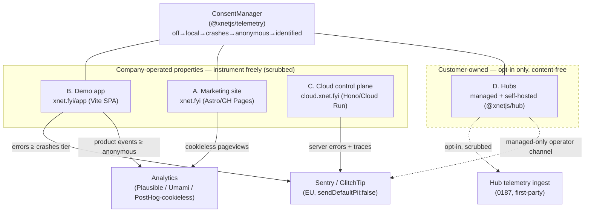
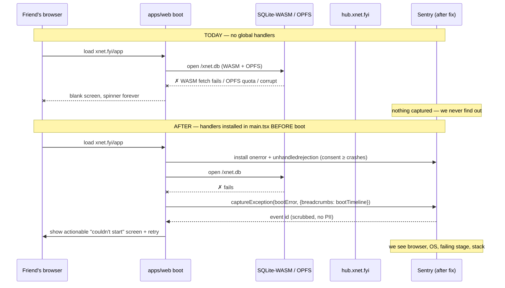
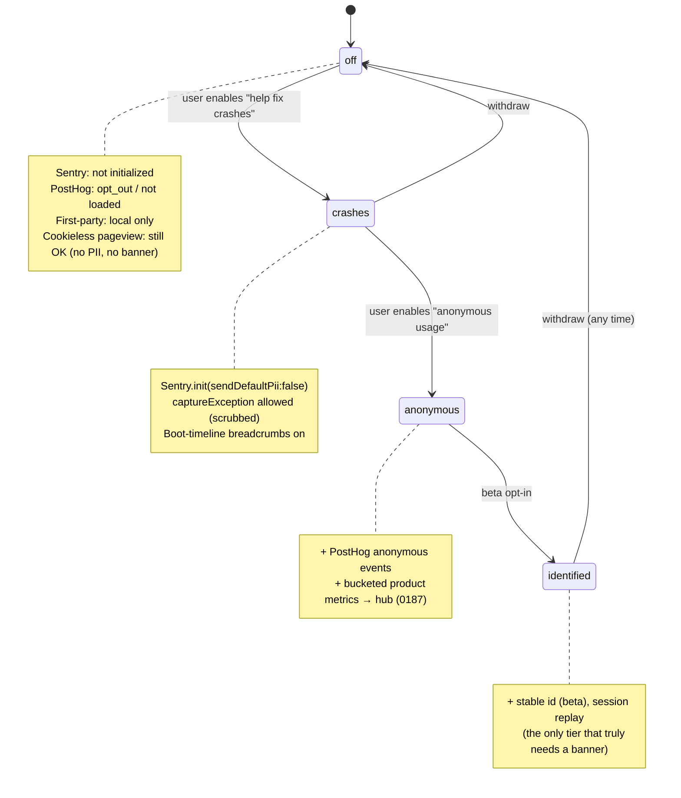

# Error Monitoring, Privacy-Preserving Analytics, and Consent Across Every Surface

> Status: exploration / not yet implemented
> Date: 2026-06-21
> Related: the existing `@xnetjs/telemetry` package,
> [[0187_HUB_HOSTED_TELEMETRY_STORE_AND_ANALYTICS_DASHBOARD]] (implemented),
> [[0190_DEEP_PERFORMANCE_TELEMETRY_AND_STACK_TRACING]],
> [[0128_COULD_XNET_EVER_BE_MADE_SOC_2_OR_GDPR_OR_ANY_OTHER_KIND_OF_COMPLIANT]],
> [[0207_OPEN_DASHBOARD_USAGE_AND_GROWTH_METRICS]] ("run in public"),
> [[0204_FAST_LOCAL_FIRST_COLD_START_AND_CACHE_HYDRATION]] (boot timeline).

## Problem Statement

A friend tried to open the hosted xNet app. It didn't load. We have **zero data
on why** — no error, no stack trace, no breadcrumb, nothing. That is the whole
problem in one sentence: the surfaces the company actually operates (the
marketing site, the demo app, the cloud control plane, the managed hubs) are
**flying blind**. We can't see who's visiting, we can't see what breaks, and
when something breaks for a real user we find out only if they happen to tell us.

The ask, distilled:

1. **Error / crash monitoring (Sentry-class)** so a blank-screen "didn't load"
   produces an actual stack trace we can debug — across the static website, the
   demo app, **and** the cloud server.
2. **Minimal, privacy-preserving web analytics (PostHog/Plausible-class)** so we
   can see traffic and usage — explicitly *not* Google Analytics.
3. **Instrumented through everything** — site, app, cloud control plane.
4. **A nuanced answer for customer hubs.** We'd like to help customers debug
   their hubs, but we do **not** want to surveil their workspaces. This needs a
   graceful, opt-in posture, not blanket tracking.
5. **GDPR/ePrivacy done right** — proper cookie/consent banners where they're
   actually required, on all the web properties.

The twist that makes this non-trivial: **xNet's entire brand is "your data is
yours, we can't read it, no tracking."** The live privacy policy literally says
*"We don't track you across the web — No third-party trackers"*
([site/src/pages/privacy.astro:100](site/src/pages/privacy.astro)). Bolting on a
US-hosted, cookie-dropping analytics SaaS would be brand suicide. The *choice of
tooling is itself a privacy statement*, and the implementation has to be as
local-first and consent-respecting as the product it measures.

The good news, discovered while researching this: **most of the privacy spine
already exists** and is unused for this purpose, and the single highest-value fix
(global error handlers in the demo app) is also the cheapest.

## Executive Summary

- **There are four surfaces, not one, and they have different owners.** Three are
  *the company's own properties* (marketing site, demo app, cloud control plane)
  where instrumentation is unambiguously the founder observing the founder's own
  service. The fourth — **customer hubs** — belongs to the customer, and the
  right default there is *no phoning home at all* unless the customer opts in.
  Conflating these is the main trap.

| Surface | Path | Stack | Errors today | Analytics today |
|---|---|---|---|---|
| **A. Marketing site** | `xnet.fyi` | Astro + Starlight → GitHub Pages | none | **none** (policy promises some!) |
| **B. Demo / hosted app** | `xnet.fyi/app` | Vite + React SPA | **no global handlers** | local-only opt-in trace |
| **C. Cloud control plane** | `cloud.xnet.fyi` | Hono on Cloud Run | one `console.log` | SLI/usage (internal) |
| **D. Cloud + self-hosted hubs** | `hub.xnet.fyi`, `<tenant>.xnet.app`, self-host | `@xnetjs/hub` (Hono) | first-party only | first-party telemetry (0187) |

- **The "didn't load" bug is a known, specific blind spot.** `apps/web` installs
  **no `window.onerror` and no `unhandledrejection` handler** anywhere. A failure
  in the SQLite-WASM/OPFS boot or a hung hub WebSocket produces a blank screen
  with no signal leaving the device ([apps/web/src/App.tsx:796](apps/web/src/App.tsx)
  is the only error boundary, and it only catches React render errors *after*
  mount — the boot failures happen before/around it). This is the #1 fix and it's
  ~30 lines.

- **Cookieless analytics dissolves most of the GDPR/cookie-banner problem.**
  Plausible/Fathom/Umami — and PostHog in cookieless mode — collect no personal
  data and set no cookies, so under GDPR/ePrivacy **they require no consent
  banner at all**. The banner requirement is *created by* tracking cookies and
  PII; remove those and the legal basis for the banner goes away. So the cleanest
  path is: pick cookieless analytics → the marketing site needs *no* banner. The
  banner only bites where we capture PII: error reports with user context,
  session replay, and identified product analytics.

- **xNet already has a consent spine — reuse it as the one source of truth.**
  `@xnetjs/telemetry` ships a 5-tier progressive consent model
  (`off → local → crashes → anonymous → identified`, default `off`), PII
  scrubbing, k-anonymity bucketing, and a `TelemetryErrorBoundary`
  ([packages/telemetry/src/consent/types.ts](packages/telemetry/src/consent/types.ts)).
  The recommendation is **not** "three separate consent systems." It's: one
  `ConsentManager` gates *everything* — the first-party pipeline, the Sentry SDK,
  and PostHog — and the cookie banner is just a UI that writes into it.

- **Use the right tool for the right job, don't reinvent.** Sentry (or
  self-hosted GlitchTip) is purpose-built for stack-trace symbolication, source
  maps, release health, and alerting — things the first-party 0187 pipeline does
  *not* do and shouldn't. First-party telemetry (0187) is right for product
  analytics and the **customer-hub** path where data sovereignty matters. They're
  complementary, not competing.

- **Recommended starting stack (solo-founder economics, on-brand):**
  - **Errors:** Sentry SDK on A/B/C, `sendDefaultPii: false`, EU data region,
    aggressive scrubbing, **env-gated to official prod builds only** (never fires
    on customer/self-hosted hubs or PR previews). Self-hosted GlitchTip is the
    drop-in escape hatch if Sentry's per-event pricing or US-hosting bothers us.
  - **Analytics:** one cookieless analytics tool for traffic (Plausible cloud, or
    self-hosted Umami), routed through a **first-party reverse proxy** so ad
    blockers and the brand both stay happy.
  - **Hubs:** default silent; **opt-in "share diagnostics with xNet"** that
    forwards *scrubbed, content-free* crash reports via the existing telemetry
    ingest, governed by the existing abuse-budget surface.
  - **Consent:** a lightweight first-party banner/panel over the existing
    `ConsentManager`, not a heavyweight third-party CMP (which is itself a
    tracker).

- **A single-vendor alternative is worth a serious look:** PostHog now does
  product analytics **+** error tracking **+** session replay **+** feature flags
  in one generous free tier (100k errors/mo, 1M events/mo), with cookieless mode,
  EU cloud, and a managed reverse proxy. For a solo founder it could collapse the
  whole stack into one bill — at the cost of weaker stack-trace symbolication than
  Sentry and a heavier client. See Options.



## Current State In The Repository

### Surface A — Marketing site (`site/`, Astro + Starlight, GitHub Pages)

- Astro v5 + Starlight, Tailwind, deployed to GitHub Pages at `https://xnet.fyi`
  via [.github/workflows/deploy-site.yml](.github/workflows/deploy-site.yml). The
  same workflow copies `apps/web/dist/` into `/app/`, so the demo app ships under
  the same origin.
- **Global shell:** [site/src/layouts/Base.astro](site/src/layouts/Base.astro)
  wraps every landing/legal page's `<head>`/`<body>`; docs pages additionally use
  [site/src/components/docs/Head.astro](site/src/components/docs/Head.astro)
  (which already injects Mermaid from a CDN — precedent for a global script tag).
- **No analytics, no Sentry, no consent banner exist.** A grep for
  `gtag|plausible|posthog|fathom|umami|sentry|cookie|consent` finds only prose.
- **The privacy policy already over-promises.**
  [site/src/pages/privacy.astro:75-86](site/src/pages/privacy.astro) says we use
  *"privacy-respecting analytics … Page views and referrers (no cookies, no
  personal data) … We don't use tracking cookies, fingerprinting, or any
  cross-site tracking."* **Nothing implements this today.** Whatever we ship must
  match this paragraph (which, conveniently, is an exact description of Plausible/
  Umami/cookieless mode).
- Build-time public config flows through Astro/Vite env (`VITE_*` is already used
  for the embedded app build). No public DSN/analytics keys are wired yet.

### Surface B — Demo / hosted app (`apps/web/`, Vite + React)

- Vite + React 18, TanStack Router, SQLite-WASM + OPFS, `vite-plugin-pwa`. Entry
  `index.html` → [apps/web/src/main.tsx](apps/web/src/main.tsx) →
  [apps/web/src/App.tsx](apps/web/src/App.tsx). Deployed under `xnet.fyi/app`
  (hash router) by the same site workflow.
- **The blind spot, precisely:** there is **no `window.onerror` and no
  `unhandledrejection` listener anywhere in `apps/web`**. The only error boundary
  is `<ErrorBoundary>` from `@xnetjs/react` at
  [apps/web/src/App.tsx:796](apps/web/src/App.tsx) — a React render boundary that
  only catches errors *inside* the component tree *after* React mounts. The boot
  state machine (`checkBrowserSupport` → SQLite open → schema → identity →
  hub connect) runs before and around it. A WASM load failure, OPFS quota denial,
  schema corruption, or a hung hub WebSocket yields a blank screen and **emits no
  signal off-device.** That is exactly the "friend's app didn't load" scenario.
- **Boot is already instrumented locally** — just not exported.
  [apps/web/src/lib/boot-timeline.ts](apps/web/src/lib/boot-timeline.ts) marks
  `init:start → sqlite:open → sqlite:schema → identity:ready → store:ready →
  hub:connected → sync:first` and logs to console on `xnet:boot:debug`. These are
  *perfect* Sentry breadcrumbs / PostHog events; today they die in the console.
- **An opt-in trace collector exists** behind `localStorage['xnet:trace']`
  ([apps/web/src/lib/tracing.ts](apps/web/src/lib/tracing.ts)) using
  `@xnetjs/telemetry`'s `TraceCollector`. Cold-start eviction is detected by
  [apps/web/src/lib/store-cold-start.ts](apps/web/src/lib/store-cold-start.ts).
- **Settings already has a "Data" panel** with a `DataSettings()` component
  ([apps/web/src/routes/settings.tsx:279](apps/web/src/routes/settings.tsx)) and
  reusable `SettingsPanel`/`SettingRow`/`Switch` primitives — the natural home for
  a "Privacy & Diagnostics" consent toggle.
- **Vite env injection** (`VITE_*`, `import.meta.env`) is the build-time config
  channel for a DSN/analytics key.

### Surface C — Cloud control plane (`apps/cloud/`, Hono on Cloud Run)

- Hono + `@hono/node-server` on Node 22, containerized to Cloud Run, port 4455.
  Entry [apps/cloud/src/index.ts](apps/cloud/src/index.ts) `start()` builds the
  control plane, starts a 60s fleet health probe loop, and serves
  `createControlPlaneApp()` from [apps/cloud/src/server.ts](apps/cloud/src/server.ts).
- **Observability today is essentially one line:** `console.log("xnet-cloud
  listening …")`. **No structured logger, no request logging, and no global Hono
  `app.onError()`** — an unhandled exception in a route just crashes. Error
  handling is ad-hoc per-route `try/catch` returning JSON.
- **But rich operational metrics already exist** (from 0201/0207): a fleet SLI
  engine ([apps/cloud/src/observability/](apps/cloud/src/observability/)),
  `HealthSampleStore`, `composeDashboardLive()`
  ([apps/cloud/src/hub-status.ts](apps/cloud/src/hub-status.ts)), and k-anon usage
  rollups ([apps/cloud/src/metrics/usage.ts](apps/cloud/src/metrics/usage.ts))
  feeding `/status.json` and the public `/open` dashboard. This is *operational*
  telemetry; it is **not** error/exception tracking. Sentry fills that gap.
- **Secrets pipeline is ready:** [scripts/cloud-secrets-push.mjs](scripts/cloud-secrets-push.mjs)
  pushes named env vars to GCP Secret Manager;
  [.github/workflows/deploy-cloud.yml](.github/workflows/deploy-cloud.yml) wires
  them as `--set-secrets`. Adding `SENTRY_DSN` is a one-line addition there.

### Surface D — Hubs (`packages/hub/`) and the privacy spine

- The hub is the **customer-run** Hono server (managed at `<tenant>.xnet.app`, or
  fully self-hosted). It already has `/health`, `/ready`, `/health/badge`
  ([packages/hub/src/server.ts](packages/hub/src/server.ts)), an
  **extensible "feature" plugin pattern** with per-feature env scoping
  ([packages/hub/src/features/](packages/hub/src/features/) —
  `connectorSyncFeature`, `slackCompatFeature`, `aiForwarderFeature`), and an
  **existing first-party telemetry ingest** route
  ([packages/hub/src/routes/telemetry.ts](packages/hub/src/routes/telemetry.ts)):
  `POST /telemetry/ingest` accepts consent-gated, pre-scrubbed batches and hashes
  the client DID with a hub-local salt before storage.
- **0187 already shipped the hub-hosted telemetry store** (`telemetry.db`,
  separate from `hub.db`, DuckDB joins, dashboard) — `[x]` checked off. So the
  customer-sovereign path for "what errored last night on *this* hub" largely
  **exists**; the owner of that hub sees it on their own dashboard.
- `@xnetjs/abuse` provides per-surface budgets
  ([packages/abuse/src/types.ts](packages/abuse/src/types.ts)) — `AbuseSurface`
  already includes a `'telemetry'`-shaped notion via the ingest path, so we can
  rate-limit diagnostics without starving real sync work.

### The privacy spine, in one place — `@xnetjs/telemetry`

This package is the keystone and is **already built**
([packages/telemetry/src/](packages/telemetry/src/)):

- **Consent:** `ConsentManager` with tiers `off → local → crashes → anonymous →
  identified`, default `{ tier: 'off', autoScrub: true, reviewBeforeSend: true }`
  ([consent/types.ts](packages/telemetry/src/consent/types.ts)), pluggable storage
  (`LocalStorageConsentStorage`, key `xnet:telemetry:consent`), event emitter on
  tier change.
- **Scrubbing** redacts paths/emails/IPs/URL-params/tokens/UUIDs/DIDs.
- **Bucketing** does P3A-style k-anonymity (count/latency/size buckets).
- **`TelemetryErrorBoundary`** auto-reports crashes through the collector
  ([packages/telemetry/src/hooks/TelemetryErrorBoundary.tsx](packages/telemetry/src/hooks/TelemetryErrorBoundary.tsx))
  — currently unused by `apps/web`.

The strategic point: **we already invented the consent + scrubbing primitives.**
The work is to (a) close the few remaining gaps in the first-party pipeline and
(b) make the *SaaS* SDKs (Sentry/PostHog) obey the *same* `ConsentManager` rather
than installing their own parallel consent logic.

## External Research

### Cookieless analytics removes the cookie-banner requirement

Plausible, Fathom, Umami (and PostHog/Matomo in cookieless mode) collect no
personal data and set no persistent identifiers, so under GDPR/ePrivacy they
**require no consent banner**. The banner exists *because* PII/cookies are
processed; remove them and the legal basis for the banner disappears. Plausible
generates a rotating daily hash (`hash(daily_salt + domain + ip + ua)`) and
deletes the salt every 24h, so no raw IP/UA is ever stored. This is the cheapest
way to be compliant: don't collect the thing that triggers the obligation.
([plausible.io/legal-assessment-gdpr-eprivacy](https://plausible.io/blog/legal-assessment-gdpr-eprivacy),
[plausible.io/cookieless-web-analytics](https://plausible.io/cookieless-web-analytics))

### The analytics field (2026)

- **Plausible** — cookieless, open-source, EU-hosted, ~$9/mo cloud or self-host.
  Pure web analytics (pageviews/referrers/countries/devices), single clean
  dashboard. Maps 1:1 to what privacy.astro already promises. No banner.
- **Umami** — open-source, MIT, trivially self-hostable, free, cookieless. Same
  shape as Plausible; best if we want to own the data on our own infra (Cloud
  Run/R2 already in our toolkit).
- **Fathom** — cookieless, closed-source, cloud-only, premium ($15/mo+), SOC 2 /
  HIPAA. Pay-for-simplicity; less aligned with our open-source ethos.
- **PostHog** — full product-analytics suite (events, funnels, session replay,
  feature flags, **error tracking**), generous free tier (1M events + 100k errors
  + session replay), EU cloud, cookieless mode, managed reverse proxy. Heavier
  client; by default collects PII unless configured (`person_profiles:
  'identified_only'`, IP capture off on EU projects). Can be *one vendor for
  everything*.
([posthog.com/blog/best-gdpr-compliant-analytics-tools](https://posthog.com/blog/best-gdpr-compliant-analytics-tools),
[vemetric.com/blog/best-cookieless-tracking-solutions](https://vemetric.com/blog/best-cookieless-tracking-solutions))

### Error tracking: Sentry, GlitchTip, PostHog

- **Sentry** — best-in-class stack traces, source maps, release health, alerting.
  Free tier = 5k errors/mo, 1 user, **no session replay**. Paid from $26/mo;
  session replay add-on pushes past ~$200/mo. **EU data region** (Frankfurt/
  Amsterdam) available; `send_default_pii: false` + server-side data scrubbing +
  the `tunnel` option (ad-blocker bypass via your own origin). Under ePrivacy/
  CNIL, **error tracking with user context and session replay needs consent**;
  scrubbed, no-PII crash capture is defensible under legitimate interest but
  consent is the safe posture.
  ([sentry.io/pricing](https://sentry.io/pricing/),
  [sentry.io/trust/privacy/gdpr-best-practices](https://sentry.io/trust/privacy/gdpr-best-practices/),
  [docs.sentry.io/.../sensitive-data](https://docs.sentry.io/platforms/python/data-management/sensitive-data/))
- **GlitchTip** — open-source, Sentry-SDK-compatible (zero client migration),
  ~4 containers vs Sentry's 40+, ~€70/mo self-hosted flat vs $400–600 on Sentry
  Business with overages. Crash reports + releases + basic alerting; no session
  replay/deep APM. **Our brand-aligned self-host escape hatch** — same SDK code,
  flip the DSN.
  ([danubedata.ro/.../self-host-sentry-glitchtip-2026](https://danubedata.ro/blog/self-host-sentry-glitchtip-error-tracking-2026))
- **PostHog error tracking** — free tier covers 100k errors/mo and bundles with
  analytics; less mature symbolication than Sentry but "one vendor" is real.

### Reverse proxy / ad-blocker + brand alignment

Routing analytics/errors through a **first-party subdomain** (e.g.
`https://i.xnet.fyi` via Cloudflare Worker or the existing infra) bypasses ad
blockers (+10–30% capture) *and* means we're not loading a visibly third-party
tracker — which matters for a privacy brand. PostHog and Sentry (`tunnel`) both
support this; for self-hosted Umami/GlitchTip it's inherent.

## Key Findings

1. **The single highest-value, lowest-cost fix is global error handlers in
   `apps/web`, installed *before* the SQLite boot.** This is what would have
   caught the friend's failure. Everything else is incremental on top.
2. **We already own the hard part** — consent tiers, PII scrubbing, k-anon
   bucketing, an error boundary, and (per 0187) a hub-side ingest + store. The
   SaaS tools should *plug into* this, not duplicate it.
3. **Cookieless analytics is the GDPR cheat code.** Choosing it for traffic
   means the marketing site needs **no banner**, and it exactly matches the
   privacy policy we already published.
4. **The four surfaces have genuinely different consent postures** — company
   property vs. customer property is the axis that resolves the "should we track
   cloud hubs?" debate. Company surfaces: instrument (scrubbed). Customer hubs:
   silent by default, opt-in to share.
5. **Banners are only needed where we capture PII** — error context, session
   replay, identified analytics. So scope the banner narrowly (app + cloud
   dashboard), keep it lightweight and first-party, and skip it on the cookieless
   marketing site.
6. **Env-gating is non-negotiable.** Sentry/analytics must fire only on official
   prod builds — never on a customer's self-hosted hub, never on PR/branch
   previews ([deploy-pr-preview.yml](.github/workflows/deploy-pr-preview.yml),
   [deploy-branch-preview.yml](.github/workflows/deploy-branch-preview.yml)).

## The "Didn't Load" Failure, Visualized



## Consent As The One Spine

Reuse the existing tiers to gate *all three* sinks. One decision, three obeying
systems — no parallel consent logic.



## Options And Tradeoffs

### Decision 1 — Analytics tool

| Option | Banner? | Brand fit | Cost | Effort | Notes |
|---|---|---|---|---|---|
| **Plausible cloud** | No | High | ~$9/mo | Low | Matches privacy.astro verbatim; EU-hosted |
| **Umami self-host** | No | Highest | infra-only | Med | We own the data; fits Cloud Run/R2 |
| **PostHog (cookieless)** | No (until replay/identified) | Med | Free→ | Med | One vendor for analytics+errors+flags |
| **Fathom** | No | Med | $15/mo+ | Low | Closed-source; pay-for-simplicity |
| Google Analytics | Yes | **None** | "free" | — | Off the table; violates the brand |

### Decision 2 — Error tracking tool

| Option | Stack traces | Session replay | Hosting | Cost | Notes |
|---|---|---|---|---|---|
| **Sentry (EU)** | Best | Yes (add-on) | SaaS, EU region | Free 5k→$26+ | Source maps, release health, alerting |
| **GlitchTip self-host** | Good | No | Self | ~€70/mo flat | **Sentry-SDK compatible** — same client code |
| **PostHog errors** | OK | Yes (bundled) | SaaS/EU/self | Free 100k | One vendor; weaker symbolication |

### Decision 3 — How the app reports errors

- **(a) Sentry SDK directly** — richest debugging, fastest to value, but a
  third-party script in a privacy app; mitigate with `tunnel`, EU region,
  scrubbing, env-gating, consent-gating.
- **(b) First-party only (extend 0187)** — purest brand fit, full data
  sovereignty, but we'd be rebuilding symbolication/alerting/grouping that Sentry
  gives for free. Slow.
- **(c) Hybrid (recommended)** — Sentry for *first-party surfaces'* crash
  debugging; first-party pipeline for product analytics and the *customer-hub*
  path. Wire `TelemetryErrorBoundary` and the global handlers to fan out to
  *both* the local collector and (consent permitting) Sentry.

### Decision 4 — Customer hubs (the crux)

```mermaid
flowchart TD
  E["Hub throws / 500"] --> Own["Owner's own telemetry.db<br/>(0187, always-on, local to hub)"]
  E --> Q{Diagnostics<br/>sharing enabled?}
  Q -->|No (default)| Stop["Nothing leaves the hub.<br/>Owner debugs on their dashboard."]
  Q -->|"Yes — opt-in toggle"| Scrub["Scrub content + hash DIDs<br/>+ abuse-budget rate-limit"]
  Scrub --> Fwd["POST scrubbed crash → cloud ingest<br/>→ founder's Sentry (operator)"]
  Q -->|"Managed hub + DPA"| Op["Operator channel:<br/>operational errors only, content-free,<br/>disclosed in DPA"]
```

- **Default: silent.** A self-hosted hub phones *nothing* home. The owner already
  gets their own errors via 0187 on their own dashboard.
- **Opt-in: "Share diagnostics with xNet to help debug."** A hub config flag
  (modeled as a hub *feature* with scoped env, like `aiForwarderFeature`) forwards
  **scrubbed, content-free** crash reports through the cloud ingest to the
  founder's Sentry. Governed by the `@xnetjs/abuse` telemetry budget so it can't
  flood.
- **Managed hubs (`<tenant>.xnet.app`)** the founder operates: there's a
  legitimate operator relationship, but still **content-free** (operational
  errors, never document data), disclosed in the DPA. This is the
  [[0128_COULD_XNET_EVER_BE_MADE_SOC_2_OR_GDPR]] surface.

## Recommendation

Ship in four phases, cheapest-highest-value first.

**Phase 0 — Stop the bleeding (the friend's bug).** Global `window.onerror` +
`unhandledrejection` handlers in [apps/web/src/main.tsx](apps/web/src/main.tsx)
*before* the boot sequence, plus a hard timeout on the SQLite/hub boot that
renders an actionable "couldn't start" screen instead of a blank one. Wire boot
timeline marks as breadcrumbs. Behind a build flag so it only runs in the hosted
demo. This alone closes the reported gap and needs no vendor decision yet.

**Phase 1 — Errors on company surfaces (Sentry, env-gated, scrubbed).**
Sentry browser SDK in `apps/web` and Sentry Node SDK + a Hono `app.onError()` +
`pino` structured logging in `apps/cloud`. `sendDefaultPii: false`, EU region,
`tunnel` through a first-party subdomain, **gated on consent ≥ `crashes`** in the
app and env-gated to prod. GlitchTip kept as the documented self-host fallback
(same SDK). Add `SENTRY_DSN` to the secrets push + deploy-cloud workflow.

**Phase 2 — Cookieless analytics on the site + app.** Add **Plausible** (or
self-hosted Umami) via the global `Base.astro` head and the app shell. No cookie
banner needed. Route product events (boot success, onboarding complete, first
sync) through the existing first-party pipeline at `anonymous` tier. Update
[privacy.astro](site/src/pages/privacy.astro) to name the actual tool (it already
describes it).

**Phase 3 — One consent spine + a narrow banner.** A lightweight first-party
consent component (not a third-party CMP) reading/writing the existing
`ConsentManager`, surfaced as a "Privacy & Diagnostics" panel in
[settings.tsx](apps/web/src/routes/settings.tsx) and a one-time banner **only on
the app + cloud dashboard** (where PII-bearing error context applies). Sentry and
PostHog both subscribe to `ConsentManager` tier changes. Marketing site stays
banner-free because its analytics is cookieless.

**Phase 4 — Hub opt-in diagnostics.** A `diagnosticsSharingFeature` hub feature
(scoped env, abuse-budgeted) that, when the hub owner opts in, forwards scrubbed
crash reports to the cloud ingest → founder's Sentry. Default off. Documented in
the hub setup guide and the DPA for managed hubs.

## Example Code

### Phase 0 — global handlers before boot (`apps/web/src/main.tsx`)

```ts
// Install BEFORE storage-scope / SQLite boot so pre-mount failures are captured.
import { bootTimeline } from './lib/boot-timeline'

const IS_HOSTED_DEMO = import.meta.env.VITE_XNET_TELEMETRY === 'on'

function reportFatal(kind: string, err: unknown) {
  const detail = {
    kind,
    stage: bootTimeline.lastMark(),        // e.g. 'sqlite:open'
    message: err instanceof Error ? err.message : String(err),
    ua: navigator.userAgent,               // scrubbed downstream
  }
  // Always: keep locally for the user-facing "couldn't start" screen.
  ;(window as any).__xnetBootError = detail
  // Conditionally: only the hosted demo, only with consent ≥ crashes.
  if (IS_HOSTED_DEMO && consent.tierAtLeast('crashes')) {
    void import('./lib/sentry').then((m) => m.captureFatal(detail, err))
  }
}

window.addEventListener('error', (e) => reportFatal('window.onerror', e.error ?? e.message))
window.addEventListener('unhandledrejection', (e) => reportFatal('unhandledrejection', e.reason))
```

### Phase 1 — consent-gated Sentry init (`apps/web/src/lib/sentry.ts`)

```ts
import * as Sentry from '@sentry/react'
import { consent } from './consent' // wraps @xnetjs/telemetry ConsentManager

export function initSentry() {
  if (import.meta.env.VITE_XNET_TELEMETRY !== 'on') return // never on self-host/previews
  if (!consent.tierAtLeast('crashes')) return              // opt-in spine
  Sentry.init({
    dsn: import.meta.env.VITE_SENTRY_DSN,
    environment: import.meta.env.MODE,
    release: import.meta.env.VITE_APP_VERSION,
    sendDefaultPii: false,
    tunnel: 'https://i.xnet.fyi/e',        // first-party proxy, ad-blocker safe
    replaysSessionSampleRate: 0,           // replay only at 'identified' + banner
    beforeSend: (event) => scrub(event),   // reuse @xnetjs/telemetry scrubbing
  })
}
consent.on('tier-changed', (t) => (t === 'off' ? Sentry.close() : initSentry()))
```

### Phase 1 — cloud error middleware (`apps/cloud/src/server.ts`)

```ts
import * as Sentry from '@sentry/node'
if (process.env.SENTRY_DSN) Sentry.init({ dsn: process.env.SENTRY_DSN, sendDefaultPii: false })

app.onError((err, c) => {
  log.error({ err, path: c.req.path, tenant: scrubTenant(c) }, 'unhandled')
  if (process.env.SENTRY_DSN) Sentry.captureException(err)
  return c.json({ error: 'internal_error' }, 500)
})
```

### Phase 2 — cookieless analytics in the global head (`site/src/layouts/Base.astro`)

```astro
---
const ANALYTICS = import.meta.env.PUBLIC_ANALYTICS_DOMAIN // unset on previews → no-op
---
{ANALYTICS && (
  <script defer data-domain={ANALYTICS}
          src="https://i.xnet.fyi/js/script.js"></script>  <!-- proxied Plausible/Umami -->
)}
```

## Risks And Open Questions

- **Brand risk.** Any visible third-party tracker undercuts the pitch. Mitigated
  by cookieless tools, first-party proxy, EU hosting, scrubbing, and consent —
  but worth a deliberate "is this on-brand?" review before each vendor lands.
- **Consent vs. legitimate interest for crash capture.** Scrubbed, no-PII crash
  reports are defensible under legitimate interest, but ePrivacy/CNIL guidance is
  conservative. Defaulting Sentry to `consent ≥ crashes` is the safe call; legal
  review before relaxing it.
- **Source maps.** Useful Sentry traces need source-map upload at build; that
  exposes some source structure to Sentry. Acceptable for an open-source repo;
  confirm we don't upload anything secret.
- **Env-gating discipline.** A leaked DSN in a self-hosted hub build would phone
  customer errors home — exactly what we promised not to do. Needs a test that
  asserts no telemetry init path runs when `VITE_XNET_TELEMETRY !== 'on'`.
- **Managed-hub operator boundary.** Where's the line between "helping debug" and
  "surveilling the customer"? Needs an explicit, content-free policy in the DPA.
- **Cost runaway.** Sentry's per-event pricing means one noisy loop can burn the
  quota; set client-side rate limiting + `ignoreErrors` + spike protection. The
  GlitchTip flat-cost fallback de-risks this.
- **PostHog single-vendor temptation.** Collapsing to one bill is attractive but
  couples analytics + errors + a heavier client + (default) PII collection.
  Decide deliberately rather than by drift.
- **Do we even need Sentry on the static marketing site?** Errors there are rare;
  analytics is the priority. Probably skip Sentry on Surface A and only add the
  cookieless pageview script.

## Implementation Checklist

- [ ] **P0:** Add `window.onerror` + `unhandledrejection` handlers in
  [apps/web/src/main.tsx](apps/web/src/main.tsx) before storage/SQLite boot.
- [ ] **P0:** Add a boot timeout → actionable "couldn't start" screen (read
  `__xnetBootError`) instead of an indefinite spinner.
- [ ] **P0:** Expose `bootTimeline.lastMark()` /
  [boot-timeline.ts](apps/web/src/lib/boot-timeline.ts) marks as breadcrumbs.
- [ ] **P1:** Pick errors vendor (Sentry EU vs. self-host GlitchTip) and create
  the project; mint DSN.
- [ ] **P1:** `@sentry/react` in `apps/web` behind `VITE_XNET_TELEMETRY` + consent
  ≥ `crashes`, `sendDefaultPii:false`, `tunnel`, `beforeSend` scrub.
- [ ] **P1:** `@sentry/node` + `app.onError()` + `pino` in `apps/cloud`; add
  `SENTRY_DSN` to [cloud-secrets-push.mjs](scripts/cloud-secrets-push.mjs) +
  [deploy-cloud.yml](.github/workflows/deploy-cloud.yml).
- [ ] **P1:** First-party tunnel subdomain (`i.xnet.fyi`) via Cloudflare Worker.
- [ ] **P1:** Ensure Sentry is disabled on PR/branch previews and self-host.
- [ ] **P2:** Choose analytics (Plausible cloud or self-host Umami); proxy it.
- [ ] **P2:** Inject the cookieless script in
  [Base.astro](site/src/layouts/Base.astro) + the app shell, env-gated.
- [ ] **P2:** Route product events (boot-ok, onboarding-done, first-sync) through
  `@xnetjs/telemetry` at `anonymous` tier.
- [ ] **P3:** Close the first-party pipeline gaps from 0187 (persist collector,
  real HTTP transport) so the app + hub share one ingest.
- [ ] **P3:** Build the "Privacy & Diagnostics" panel in
  [settings.tsx](apps/web/src/routes/settings.tsx) over `ConsentManager`.
- [ ] **P3:** Lightweight first-party consent banner on app + cloud dashboard
  only; Sentry/PostHog subscribe to tier changes.
- [ ] **P3:** Update [privacy.astro](site/src/pages/privacy.astro) and
  [terms.astro](site/src/pages/terms.astro) to name the actual tools + retention.
- [ ] **P4:** `diagnosticsSharingFeature` hub feature (scoped env, abuse-budgeted)
  forwarding scrubbed crashes; default off.
- [ ] **P4:** Document the opt-in in the hub setup guide + managed-hub DPA.

## Validation Checklist

- [ ] Forcing a SQLite/WASM boot failure in the hosted demo produces a Sentry
  event with the failing **stage**, browser, and OS (the friend's bug is now
  visible).
- [ ] A self-hosted hub build and a PR-preview build emit **zero** telemetry /
  Sentry network calls (asserted by test + manual network inspection).
- [ ] With consent `off`, no Sentry/PostHog script loads and no error is sent;
  flipping to `crashes` initializes Sentry; flipping back calls `Sentry.close()`.
- [ ] Marketing site sets **no cookies** and shows **no banner**; pageviews
  appear in the analytics dashboard (DevTools → Application → Cookies empty).
- [ ] Captured errors contain **no PII** — paths/emails/IPs/DIDs scrubbed
  (verified against a deliberately PII-laden test error).
- [ ] Cloud `app.onError()` returns a clean 500 and the exception lands in Sentry
  with tenant identifiers scrubbed; structured logs present.
- [ ] Hub diagnostics sharing: with the toggle **off**, an induced hub error
  stays on the hub's own `telemetry.db` and nothing reaches the founder; with it
  **on**, a scrubbed, content-free report arrives.
- [ ] `/open` "run in public" dashboard can optionally surface the same
  high-level traffic numbers (consistency with the existing ethos).
- [ ] Privacy policy text matches the deployed reality (tool names, retention,
  EU region).

## References

- [site/src/pages/privacy.astro](site/src/pages/privacy.astro) — already promises
  cookieless analytics (must be made true).
- [apps/web/src/App.tsx:796](apps/web/src/App.tsx),
  [apps/web/src/main.tsx](apps/web/src/main.tsx) — the missing global handlers.
- [apps/web/src/lib/boot-timeline.ts](apps/web/src/lib/boot-timeline.ts) —
  breadcrumb source.
- [apps/cloud/src/index.ts](apps/cloud/src/index.ts),
  [apps/cloud/src/server.ts](apps/cloud/src/server.ts) — server entry / no error
  middleware today.
- [packages/telemetry/src/consent/types.ts](packages/telemetry/src/consent/types.ts),
  [packages/telemetry/src/hooks/TelemetryErrorBoundary.tsx](packages/telemetry/src/hooks/TelemetryErrorBoundary.tsx)
  — the consent spine + ready-made error boundary.
- [packages/hub/src/routes/telemetry.ts](packages/hub/src/routes/telemetry.ts),
  [packages/hub/src/features/](packages/hub/src/features/) — hub ingest + feature
  pattern for opt-in diagnostics.
- [packages/abuse/src/types.ts](packages/abuse/src/types.ts) — budgets to
  rate-limit diagnostics.
- [docs/explorations/0187_[x]_HUB_HOSTED_TELEMETRY_STORE_AND_ANALYTICS_DASHBOARD.md](docs/explorations/0187_%5Bx%5D_HUB_HOSTED_TELEMETRY_STORE_AND_ANALYTICS_DASHBOARD.md)
  — the first-party pipeline (implemented).
- [docs/explorations/0128_[_]_COULD_XNET_EVER_BE_MADE_SOC_2_OR_GDPR_OR_ANY_OTHER_KIND_OF_COMPLIANT_AND_ENTERPRISE_FRIENDLY.md](docs/explorations) — GDPR/DPA context.
- Sentry: [pricing](https://sentry.io/pricing/),
  [GDPR best practices](https://sentry.io/trust/privacy/gdpr-best-practices/),
  [sensitive-data scrubbing](https://docs.sentry.io/platforms/python/data-management/sensitive-data/).
- GlitchTip self-host:
  [danubedata.ro 2026](https://danubedata.ro/blog/self-host-sentry-glitchtip-error-tracking-2026).
- Plausible:
  [cookieless GDPR legal assessment](https://plausible.io/blog/legal-assessment-gdpr-eprivacy),
  [cookieless web analytics](https://plausible.io/cookieless-web-analytics).
- PostHog:
  [best GDPR-compliant analytics](https://posthog.com/blog/best-gdpr-compliant-analytics-tools),
  [reverse proxy](https://posthog.com/docs/advanced/proxy),
  [GDPR compliance](https://posthog.com/docs/privacy/gdpr-compliance).
- Cookieless tracking roundup:
  [vemetric.com 2026](https://vemetric.com/blog/best-cookieless-tracking-solutions).
