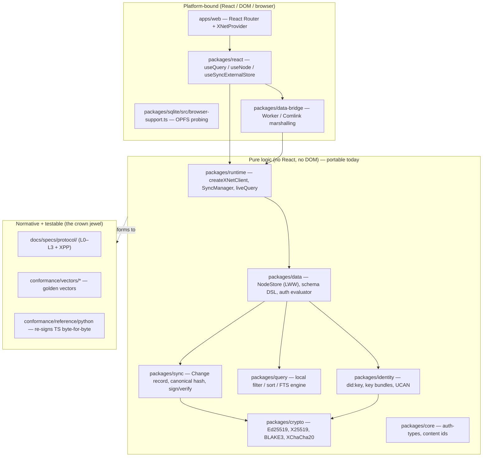
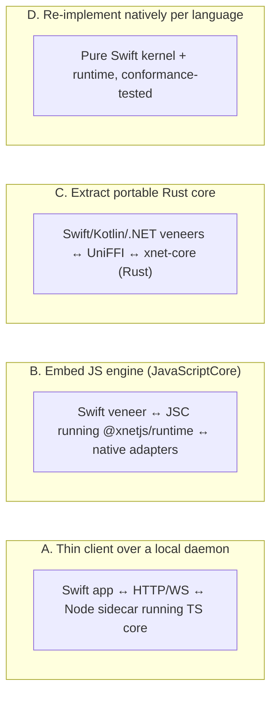
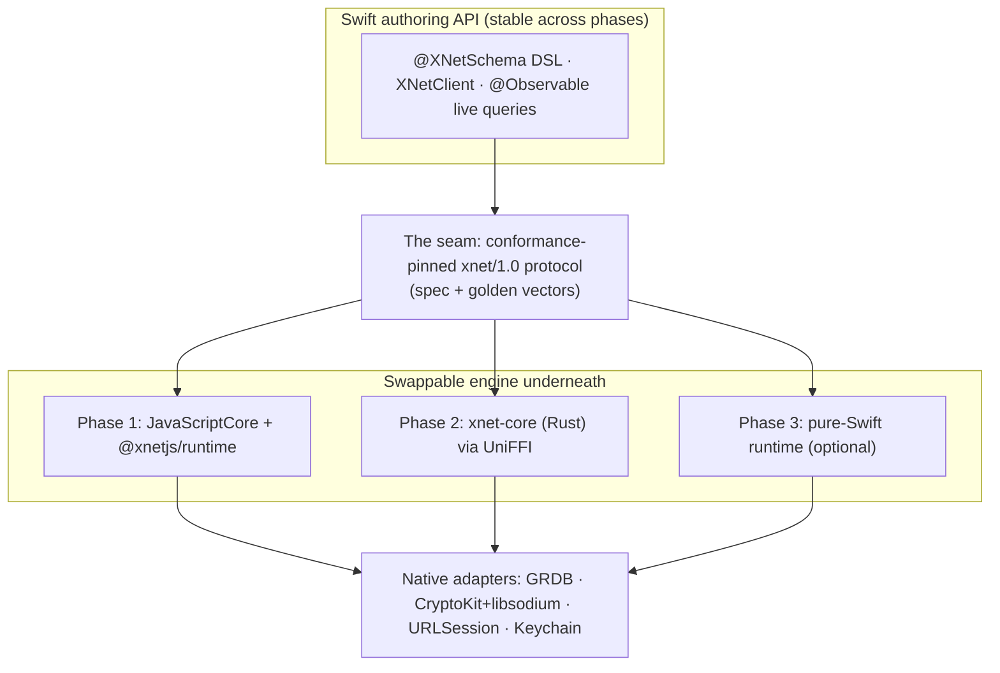
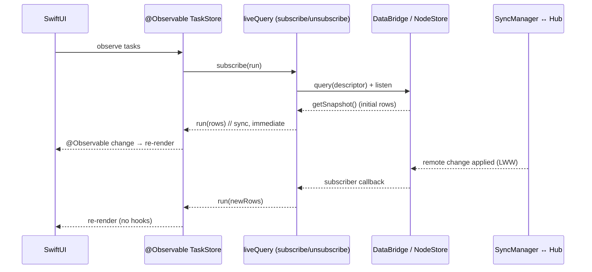

# Native Swift SDK And A Portable Multi‑Language Core

## Problem Statement

xNet's database, schemas, sync, encryption, and authorization are written in
TypeScript and today only run where JavaScript runs: the web app
(`apps/web`), Electron (`apps/electron`), and React Native via Expo
(`apps/expo`). We want xNet to be a **first‑class citizen of native Apple
development** — a real xNet database, with xNet primitives, schemas, queries,
and live sync, embedded directly in a native macOS / iOS / iPadOS / visionOS /
watchOS app. And we want the *authoring* experience to feel native: you define
schemas in Swift, query the database in Swift, and bind results into a
SwiftUI re‑rendering loop — not write React hooks behind a foreign‑function
wall.

Longer term, the same question applies to **Kotlin (Android)**, **.NET
(Windows / MAUI / Unity)**, **C++ (Unreal — already partially bridged)**, and
anywhere else. So the real question is not "how do we wrap the JS bundle for
Swift" but **what is xNet's integration surface, and which parts of the
core become composable, portable libraries that any language can pull in?**

This exploration maps the existing seams, surveys how comparable local‑first
systems solved the same problem, and recommends a concrete, phased path that
ships a beautiful Swift SDK quickly *and* lays down a genuinely portable core.

## Executive Summary

- **xNet is unusually well‑positioned for native ports.** Exploration
  [0200](0200_[x]_PORTABLE_XNET_PROTOCOL_BOUNDARIES_AND_STANDARD.md) already
  did the hard conceptual work: the interop kernel is a **signed,
  hash‑chained, last‑writer‑wins (LWW) change log over schema‑typed nodes —
  not Yjs.** It has a normative spec (`docs/specs/protocol/`), golden
  conformance vectors (`conformance/`), and a **Python kernel that reproduces
  the TypeScript byte‑for‑byte.** That is the single most valuable asset for
  this effort: a re‑implementation is *sanctioned and testable*, not a
  reverse‑engineering project.
- There is a **clean architectural fault line** between a small, security‑
  critical, byte‑exact **kernel** (identity, canonical change, hash,
  sign/verify, LWW merge, authorization evaluation, UCAN) and a larger,
  app‑shaped **runtime** (storage adapter, query engine, sync transport,
  schema registry, reactive bridge). They demand different porting
  strategies.
- The "write Swift, not React hooks" desire is an **API‑veneer** problem,
  solvable on top of *any* core. xNet already exposes a framework‑agnostic
  `liveQuery()` (`packages/runtime/src/live-query.ts`) with a tiny
  `subscribe(run) => unsubscribe` contract — a perfect adapter target for
  Swift's **Observation framework** (`@Observable`) and `AsyncSequence`.
- **Recommended path (phased, dual‑track):**
  1. **Phase 0 — Pin the seam.** Extend the conformance corpus to L2
     (replication) and L3 (auth decisions) and write a Swift conformance
     harness. Cheap, and it de‑risks everything downstream.
  2. **Phase 1 — Ship Swift fast via an embedded engine.** An `XNetKit`
     Swift package runs the existing `@xnetjs/runtime` bundle inside
     **JavaScriptCore** (a system framework on every Apple platform), wired to
     **native adapters** (GRDB/SQLite storage, CryptoKit + libsodium crypto,
     `URLSessionWebSocketTask` transport, Keychain/Secure Enclave keys), behind
     a **Swift‑native API**: a `@XNetSchema` result‑builder/macro DSL,
     `XNetClient`, and `@Observable` live queries that drop straight into
     SwiftUI. Full feature parity immediately; users write only Swift.
  3. **Phase 2 — Extract the portable kernel in Rust.** Build `xnet-core`
     (the byte‑exact kernel) and bind it to Swift/Kotlin/.NET via **UniFFI**
     (the proven Automerge / Ditto / PowerSync model). Strangler‑fig the
     kernel out of JS into Rust; this unlocks JS‑free native builds for
     App‑Store‑pure iOS, visionOS performance, and the Android/.NET languages.
  4. **Phase 3 — Fan out.** Idiomatic Kotlin and .NET veneers over the same
     `xnet-core`; optionally a fully native Swift runtime where no JS is
     acceptable.
- **Answering the user's core question** — *"are we still writing JavaScript,
  or do we bring the API to Swift?"*: **Users write Swift.** Schemas, queries,
  identity, and the UI loop are all native Swift. The *shared engine* underneath
  is JS at first (Phase 1) and a Rust kernel later (Phase 2). The seam is the
  conformance‑pinned protocol, so the engine can be swapped without changing a
  line of app code.

## Current State In The Repository

### The layer cake: what's portable vs. what's platform‑bound



### The kernel ↔ runtime fault line

The repository already splits cleanly into two kinds of code:

**Kernel (must be byte‑exact across implementations):**

- **Node** — four universal fields plus schema properties
  (`packages/data/src/schema/node.ts:110`). `id` (nanoid‑21), `schemaId`
  (`xnet://authority/Name@version`), `createdAt`, `createdBy` (a `did:key`).
- **Change record** and **canonicalization** —
  `packages/sync/src/change.ts:24` (`CURRENT_PROTOCOL_VERSION = 3`) and
  `:193` (`computeChangeHash`). The byte contract: take the unsigned change,
  **sort all object keys lexicographically and recursively** (JS
  `String.prototype.sort`, UTF‑16 code units), serialize with **no
  whitespace**, **omit `undefined`**, UTF‑8 encode, then
  `hash = "cid:blake3:" + lowercaseHex(BLAKE3(bytes))`, and finally
  `signature = Ed25519.sign(UTF8(hashString))`. **The signature covers the
  UTF‑8 bytes of the `cid:blake3:<hex>` *string*, not the raw digest.**
- **LWW merge** — per‑property timestamps; higher Lamport wins, tie → higher
  `wallTime`, tie → higher `authorDID` lexicographically. Pinned by
  `conformance/vectors/lww/*`.
- **Crypto primitives** — `packages/crypto/src`: Ed25519
  (`signing.ts`), X25519 + HKDF‑SHA256 (`asymmetric.ts`), BLAKE3
  (`hashing.ts`), **XChaCha20‑Poly1305 with a 24‑byte nonce**
  (`symmetric.ts:7` — `NONCE_SIZE = 24`), and `did:key` multicodec/base58btc
  (`key-resolution.ts`). All backed by `@noble/*`.
- **Identity** — `packages/identity/src/did.ts` (`createDID`/`parseDID`,
  multicodec prefix `[0xed, 0x01]`), key bundles, and **UCAN** capability
  tokens (`ucan.ts`).
- **Authorization** — pure boolean evaluation over a role/expression AST
  (`packages/core/src/auth-types.ts`, `packages/data/src/auth/evaluator.ts`),
  with space‑cascade presets
  (`packages/data/src/schema/schemas/space-authorization.ts`) and
  schema→hub projection (`packages/data/src/auth/hub-policy.ts`).
- **E2E envelope** — per‑recipient key‑wrapping via ephemeral X25519 + ECDH,
  content encrypted with XChaCha20‑Poly1305
  (`packages/crypto/src/envelope.ts`). "The ability to decrypt *is* access
  control."

**Runtime (must be correct, not byte‑exact):**

- **NodeStore** — event‑sourced store with LWW
  (`packages/data/src/store/store.ts:134`), change listeners, optional
  encryption + auth.
- **Storage adapter** — `SQLiteAdapter` interface
  (`packages/sqlite/src/adapter.ts:22`) with `getStorageMode(): 'opfs' |
  'memory'` (`:197`); tables `nodes`, `node_properties`,
  `node_property_scalars`, `nodes_fts` (FTS5) in
  `packages/sqlite/src/schema.ts`. Expo already swaps in `expo-sqlite`
  (native) — proof the seam works off the web.
- **Query** — `QueryOptions` / `QueryDescriptor`
  (`packages/data-bridge/src/types.ts:103`); a pure local engine
  (`packages/query/src/local/engine.ts:18`); operators `eq/ne/gt/.../contains`.
- **Sync** — `createXNetClient` (`packages/runtime/src/client.ts`) composes
  `NodeStore → DataBridge → SyncManager`. The hub
  (`packages/hub/src/server.ts`) is a **relay + authorization checkpoint +
  storage server** speaking JSON over WebSocket (and msgpack over libp2p).
- **Reactive seam** — `liveQuery()` (`packages/runtime/src/live-query.ts`)
  adapts `client.query()`'s `{ getSnapshot, subscribe }` external‑store
  contract into a dependency‑free `subscribe(run) => unsubscribe` store.
  `packages/react`'s `useQuery`/`useNode` are a thin
  `useSyncExternalStore` wrapper over exactly this.

### Existing cross‑process and cross‑language footholds

- **Local bridge daemon** on `:31416` (`packages/devkit/src/bridge-server.ts`)
  — loopback HTTP, `/health` + OpenAI‑compatible SSE. A Swift app *could* call
  it, but it requires a running Node process (fine on macOS, impossible on a
  sandboxed iOS app). Not the native answer; useful for a macOS prototype.
- **Expo / React Native** (`apps/expo`) — already reuses `@xnetjs/core`,
  `data`, `data-bridge`, `sqlite`, `react`, `sdk` with `expo-sqlite` +
  `expo-secure-store` through a `NativeBridge`
  (`packages/data-bridge/src/native-bridge.ts`). This is the *JavaScript*
  native path; it proves the adapters are swappable but still ships a JS
  engine and React.
- **Python conformance kernel** (`conformance/reference/python`) — ~85 lines,
  no xNet deps, reproduces L0 (identity) and L1 (change sign/verify) vectors.
  **This is the template for a Swift kernel.**
- **`XNET_PROTOCOL_VERSION`** umbrella bundle
  (`packages/runtime/src/protocol.ts:62`, `id: 'xnet/1.0'`) — the handshake
  token any implementation advertises.
- **Unreal/C++** (`packages/unreal`, exploration
  [0200](0200_[x]_UNREAL_ENGINE_6_INTEROP_BRIDGE.md)) — a server‑side
  connector, not an embedded core, but evidence the team already wants
  non‑JS reach.

## External Research

> Note: live web search was unavailable during this exploration; the prior‑art
> summary below is drawn from established, stable knowledge of these systems and
> should be re‑verified against current docs during Phase 0 (see the validation
> checklist). The architectural conclusions do not hinge on any single project's
> current release state.

The local‑first ecosystem has effectively standardized on **one of three
shapes** for going multi‑language. xNet can borrow from each.

| System | Core language | Multi‑language strategy | Lesson for xNet |
| --- | --- | --- | --- |
| **Automerge** | Rust (`automerge-rs`) | `automerge-swift`, Kotlin, JS/WASM via **UniFFI** + C FFI; one core, many thin veneers | The canonical "extract core to Rust, bind everywhere" model. Proves a CRDT core + UniFFI Swift package is production‑viable. |
| **Yjs / y‑crdt** | TS (`yjs`) + Rust port (`yrs`) | `yffi` (C ABI), `ywasm`, `y‑py`; bindings consume `yrs` | Two implementations of the *same* format coexist; a Rust port can back native while TS stays canonical — exactly xNet's "Yjs body is opaque" situation. |
| **Ditto** | Rust | First‑party SDKs for Swift, Kotlin, JS, C#, C++, Flutter over one Rust core | Commercial proof that a single Rust core can serve every platform with idiomatic SDKs and peer‑to‑peer mesh sync. |
| **PowerSync** | Rust (`powersync-sqlite-core`, a SQLite extension) | Swift, Kotlin, Dart, JS, .NET SDKs; sync logic in the Rust SQLite extension, queries stay in native SQLite | "Ship the engine as a SQLite extension, let each platform use its own SQLite + reactive layer." Maps well to xNet's `SQLiteAdapter` seam. |
| **cr‑sqlite (Vlcn)** | Rust (loadable SQLite ext) | Runs anywhere SQLite loads extensions | CRDTs delivered as a SQLite extension; minimal per‑language surface. |
| **Realm / Atlas Device Sync** | C++ (Realm Core) | Swift/Kotlin/JS/.NET language bindings over C++ | The original "native core, many bindings" — but heavy, and now deprecated; a caution about over‑coupling SDKs to a monolith core. |
| **InstantDB / Zero (Rocicorp)** | TS/Clojure; server‑centric | JS/React‑first; native talks via REST/WebSocket to a sync service | The "thin client over a sync service" path — fast but not embedded/offline‑native; what xNet's `:31416` bridge resembles. |

**Binding technology landscape:**

- **UniFFI** (Mozilla) — generates Swift, Kotlin, Python, Ruby bindings from a
  Rust crate. Modern proc‑macro mode removes the old `.udl` file. Battle‑tested
  in Firefox and Automerge. Async support, custom types, error mapping. **Best
  fit for Swift + Kotlin from one Rust core.**
- **swift‑bridge** — Rust↔Swift specifically; finer control, more manual.
- **Diplomat** (used by ICU4X) — one Rust API → C, C++, JS/WASM, and more;
  good if the matrix grows beyond UniFFI's targets.
- **C FFI + hand‑written headers** — lowest common denominator; what `.NET`
  P/Invoke and C++ consume; `uniffi-bindgen-cs` covers .NET from UniFFI.
- **WASM everywhere** — compile the core to WASM and run it via Wasmtime /
  wasm3 in each host. Avoids per‑language codegen but adds a runtime and a
  marshalling boundary; weaker than native FFI on Apple platforms.

**Apple‑native building blocks we can lean on:**

- **CryptoKit** covers Ed25519, Curve25519 (X25519), SHA‑2, HKDF, and
  **IETF** ChaCha20‑Poly1305 (12‑byte nonce). It does **not** provide
  **XChaCha20‑Poly1305** (24‑byte nonce) or **BLAKE3** — both are required by
  xNet's wire format, so those need **libsodium** (`swift-sodium`) and a BLAKE3
  binding (the official `blake3` C lib or a Swift wrapper). `did:key` base58btc
  needs `swift-multiformats` or ~30 lines of hand‑rolled multibase.
- **Observation framework** (`@Observable`, iOS 17 / macOS 14+) and
  `AsyncSequence` are the idiomatic re‑render loop — the direct analog of
  React's `useSyncExternalStore`.
- **GRDB.swift** / **SQLite.swift** / **SQLCipher** for the local store;
  **Keychain** + **Secure Enclave** for key custody.
- **JavaScriptCore** is a system framework on all Apple OSes — but note the
  **iOS JIT restriction** (see Risks): third‑party apps get the interpreter
  only.

## Key Findings

1. **The protocol is already a product.** Because
   [0200](0200_[x]_PORTABLE_XNET_PROTOCOL_BOUNDARIES_AND_STANDARD.md) shipped a
   normative spec + golden vectors + a second (Python) implementation, a Swift
   port is a *conformance* exercise, not archaeology. This is rare and it
   changes the cost equation dramatically.
2. **Yjs is the only genuinely non‑portable piece — and it's already
   quarantined.** Yjs update bytes travel inside a *signed envelope*
   (`SignedYjsEnvelopeV2`, `packages/sync/src/yjs-envelope.ts`) as an opaque
   `documentCodec` payload. A Swift client can **relay, persist, and
   signature‑verify** rich‑text documents *without a Yjs library*. It only
   needs Yjs to *merge/render* collaborative rich text — which can be deferred,
   delegated to `yrs` via FFI, or run in JSC.
3. **The reactive question is already answered abstractly.** `liveQuery`'s
   `subscribe(run) => unsubscribe` contract is exactly what an `@Observable`
   Swift store or an `AsyncStream` wants. No React, no hooks — just a
   subscription. The "Swift re‑rendering loop" is a ~100‑line adapter.
4. **Crypto is the highest‑risk surface, not the data model.** The byte‑exact
   landmines are concentrated in canonical JSON ordering, the
   sign‑over‑hash‑*string* detail, XChaCha20's 24‑byte nonce, and BLAKE3 — all
   in the kernel. Get these wrong and signatures silently fail to verify across
   implementations. The conformance vectors exist precisely to catch this.
5. **The storage and query layers are already abstracted behind interfaces**
   (`SQLiteAdapter`, `QueryDescriptor`), and Expo already proves a native
   SQLite swap. The runtime is `createXNetClient(...)` with injectable
   `nodeStorage`, `changeSigner`, `authEvaluator`, and `dataBridge`. This is a
   well‑factored embedding surface.
6. **"Native API" and "shared engine" are orthogonal.** You can have a 100%
   Swift authoring API over a JS engine (Phase 1) *or* over a Rust kernel
   (Phase 2). Choosing the engine is independent of choosing the API, as long
   as the seam is the conformance‑pinned protocol.

## Options And Tradeoffs



### Option A — Thin client over the local bridge/hub

The Swift app holds no core; it talks HTTP/WebSocket to a Node process (the
existing `:31416` bridge, or a bundled hub) that runs the real TS core.

- **Pros:** Zero core re‑implementation. Fastest possible macOS prototype.
  Reuses 100% of TS including Yjs.
- **Cons:** Ships and supervises a Node process — heavy, and **impossible on a
  sandboxed iOS/visionOS/watchOS app**. Not offline‑embedded; not "native."
  Two processes to crash and to keep alive.
- **Verdict:** Good for a throwaway macOS spike or a desktop "pro" build;
  **disqualified as the strategic answer** because it can't reach the mobile/
  spatial platforms that motivated the request.

### Option B — Embed JavaScriptCore + native adapters + Swift veneer

Run the existing `@xnetjs/runtime` (bundled to one JS file) inside
**JavaScriptCore**, with native Swift adapters for storage (GRDB), crypto
(CryptoKit + libsodium), and transport (URLSession), behind a fully Swift
authoring API.

- **Pros:** **Immediate feature parity** — schema registry, query engine, sync,
  even plugins come for free. JSC is a *system framework* (no binary bloat, no
  WASM runtime, App‑Store‑approved). Team velocity stays in TS; Swift is a
  veneer. Yjs rich‑text "just works" inside JSC. The native adapters are the
  same seams Expo already uses.
- **Cons:** A JS↔Swift bridge to design (threading, value marshalling,
  back‑pressure). **iOS runs JSC without JIT** for third‑party apps
  (interpreter‑only) — fine for data logic, a tax on hot paths. Bundle size +
  cold‑start of the JS engine. Debugging spans two languages.
- **Verdict:** **Best Phase‑1 vehicle.** Directly delivers "native Swift
  schemas/queries/re‑render loop" with the proven engine underneath, on every
  Apple platform, in weeks not quarters.

### Option C — Extract a portable Rust core, bind via UniFFI

Port the **kernel** (and as much runtime as is worthwhile) to a Rust crate
`xnet-core`; generate Swift + Kotlin bindings with UniFFI and a C ABI for .NET.

- **Pros:** **One fast, memory‑safe core for every future language.** Truly
  native binaries (no JS engine) — ideal for App‑Store‑pure iOS, visionOS
  performance, watch, embedded. Reuses `yrs` for Yjs bodies if/when needed.
  This is the **Automerge / Ditto / PowerSync** proven shape.
- **Cons:** Large up‑front cost; you maintain **two implementations** (TS +
  Rust) during the transition. The higher runtime (query planner, plugins,
  app glue) is genuinely app‑shaped and arguably *should* stay in TS, not be
  re‑ported to Rust. Risk of drift — mitigated only by the conformance corpus.
- **Verdict:** **Best long‑term substrate, but scoped to the kernel.** Don't
  re‑port the whole runtime to Rust; port the byte‑exact kernel and let each
  platform own its runtime. Sequence it *after* Phase 1 proves demand.

### Option D — Re‑implement everything natively per language

A pure‑Swift kernel *and* runtime, tested against the vectors; repeat for
Kotlin, .NET.

- **Pros:** Most idiomatic, zero foreign runtime, best debugging, smallest
  binaries. The Python kernel proves the kernel half is small (~100 lines).
- **Cons:** **N× the maintenance** for the *runtime* half (storage, query,
  sync, schema registry) — every feature shipped N times. Highest drift risk.
- **Verdict:** Justified only for the **kernel** (small, stable, security‑
  critical) where you may prefer native crypto over an FFI dependency, or where
  an FFI binary is unwelcome. Not justified for the runtime.

### How the options compose (they're phases, not rivals)

The real recommendation is **B now, C for the kernel next, D selectively** —
unified by one seam.



## Recommendation

Adopt a **phased, dual‑track** plan. Ship Swift on an **embedded engine**
first; extract a **Rust kernel** second; keep a stable **Swift‑native API** and
a **conformance‑pinned seam** across both so the engine is swappable.

### Phase 0 — Pin the seam (1–2 weeks, mostly TS)

The protocol is the contract; harden it before anyone writes Swift.

- Extend `conformance/vectors/` to cover **L2 replication** (handshake,
  `node-change`, `node-sync-request/response`) and **L3 authorization
  decisions** (subject + action + node graph → allow/deny trace). Today only
  L0/L1/LWW are covered.
- Publish a tiny **Swift conformance harness** that loads the JSON vectors and
  asserts byte‑identical DID derivation, canonical JSON, hash, signature, and
  LWW convergence — the Swift sibling of `conformance/reference/python`.
- Freeze the canonicalization rules in prose *and* test (the JS key‑sort order
  is the subtle one).

### Phase 1 — `XNetKit` for Swift via JavaScriptCore (the shippable product)

A Swift Package, `XNetKit`, with three layers:

1. **Engine host** — bundle `@xnetjs/runtime` (via `createXNetClient`,
   `sync: false`‑capable) to one JS file; run it in a dedicated
   `JSContext`/`JSVirtualMachine` on a serial actor. Marshal calls and an
   event stream across the bridge.
2. **Native adapters** injected into the JS client:
   - **Storage** → a Swift `SQLiteAdapter` backed by GRDB, implementing the
     same `nodes`/`node_properties`/`nodes_fts` schema as
     `packages/sqlite/src/schema.ts` (FTS5 is built into Apple's SQLite).
   - **Crypto** → CryptoKit for Ed25519/X25519/HKDF/SHA; **libsodium** for
     XChaCha20‑Poly1305; a BLAKE3 binding; keys in **Keychain/Secure Enclave**.
     (Or, in Phase 1, let the JS `@noble/*` crypto run inside JSC and only move
     crypto native in Phase 2 — measure first.)
   - **Transport** → `URLSessionWebSocketTask` to the hub, speaking the same
     JSON frames as `packages/hub`.
3. **Swift‑native API veneer** (this is the part users touch):
   - **Schemas in Swift** via a `@XNetSchema` macro / result builder that emits
     the same `SchemaIRI` + property definitions the TS `defineSchema`
     produces.
   - **Queries in Swift** via a typed query builder mapping to
     `QueryDescriptor`.
   - **Reactive loop** via `@Observable` stores and `AsyncSequence`, adapting
     `liveQuery`'s `subscribe(run) => unsubscribe` contract — SwiftUI
     re‑renders with zero hook ceremony.

This delivers the user's vision *now*: native Swift schemas, native queries, a
native re‑render loop — on macOS/iOS/iPadOS/visionOS/watchOS — with full
parity, because the engine is the same code the web app runs.

### Phase 2 — `xnet-core` in Rust, bound by UniFFI (the durable substrate)

Port **only the kernel** to a `xnet-core` Rust crate: identity/`did:key`,
canonical change + hash + sign/verify, LWW merge, the auth evaluator + UCAN,
and the E2E envelope. Use `ed25519-dalek`, `x25519-dalek`, `blake3`, and a
XChaCha20 AEAD crate — all of which already match xNet's `@noble/*` choices.
Generate **Swift + Kotlin** via UniFFI and a **C ABI** for .NET. In `XNetKit`,
strangler‑fig the JSC kernel calls over to `xnet-core` (the conformance harness
guarantees equivalence). For Yjs document bodies, link `yrs`.

Now the kernel is shared and native; the runtime can stay in JSC where parity
matters, or be reimplemented natively where JS is unacceptable.

### Phase 3 — Kotlin, .NET, and JS‑free native where needed

The same `xnet-core` powers Android (Kotlin/UniFFI), .NET (C ABI / `uniffi-
bindgen-cs`), and C++/Unreal (already partially bridged). On iOS/visionOS where
shipping any JS is undesirable, reimplement the (small, well‑specified) runtime
natively in Swift on top of `xnet-core`.

### Why this order

- It **respects the crown jewel** (the protocol spec) and turns it into the
  unifying seam.
- It **ships value fastest** (Phase 1 is weeks; a Rust‑first plan is quarters
  before a single Swift app runs).
- It **avoids the maintain‑two‑runtimes trap** — only the *kernel* is dual‑
  implemented, and the conformance vectors keep the two honest.
- It keeps the **authoring API stable** while the engine evolves underneath.

## Example Code

### 1. Schemas in Swift (the authoring API, Phase 1+)

```swift
import XNetKit

// A macro/result-builder DSL that emits the same SchemaIRI + property
// definitions as TS `defineSchema({ name: "Task", namespace: "xnet://xnet.fyi/", ... })`.
@XNetSchema(namespace: "xnet://xnet.fyi/", version: "1.0.0")
struct Task {
    @Text(required: true, maxLength: 200) var title: String
    @Select(options: ["todo", "doing", "done"], default: "todo") var status: String
    @Relation(target: Space.self) var space: NodeID?
    @Money(currency: "USD") var bounty: MoneyValue?

    // Space-cascade authorization — same preset as
    // packages/data/src/schema/schemas/space-authorization.ts
    static let authorization: Authorization = .spaceCascade(relation: "space")
}
```

### 2. Identity and client bootstrap (native crypto + storage)

```swift
// Keys live in the Keychain / Secure Enclave; did:key derived per
// packages/identity/src/did.ts (multicodec 0xed01 + base58btc).
let identity = try XNetIdentity.loadOrCreate(service: "app.xnet.notes")

let client = try await XNetClient(
    identity: identity,
    storage: .grdb(path: appSupportURL.appending(path: "xnet.sqlite")), // SQLiteAdapter
    hub: .init(url: URL(string: "wss://hub.xnet.app")!)                  // URLSession WS
)

let task = try await client.create(Task.self) {
    $0.title = "Ship the Swift SDK"
    $0.status = "doing"
}
```

### 3. The reactive loop — `liveQuery` → `@Observable` → SwiftUI



```swift
// Adapter: the framework-agnostic liveQuery contract → Observation.
@Observable
final class Query<S: XNetSchema> {
    private(set) var rows: [S] = []
    private var cancel: (() -> Void)?

    init(_ client: XNetClient, _ schema: S.Type, where filter: Filter<S>? = nil) {
        // liveQuery.subscribe(run) calls `run` immediately and on every change,
        // returning an unsubscribe fn — packages/runtime/src/live-query.ts.
        cancel = client.liveQuery(schema, where: filter) { [weak self] rows in
            self?.rows = rows            // mutation triggers SwiftUI re-render
        }
    }
    deinit { cancel?() }
}

struct TaskListView: View {
    @State private var query: Query<Task>
    var body: some View {
        List(query.rows) { task in Text(task.title) }   // re-renders on sync
    }
}
```

### 4. The byte‑exact landmine (kernel conformance)

```swift
// MUST reproduce packages/sync/src/change.ts:193 byte-for-byte.
func computeChangeHash(_ unsigned: UnsignedChange) -> String {
    // 1. Recursively sort object keys by JS String order (UTF-16 code units).
    // 2. JSON, no whitespace, omit nil/undefined.
    let canonical = canonicalJSON(unsigned)            // UTF-8 bytes
    let digest = BLAKE3.hash(canonical)                // NOT in CryptoKit → binding
    return "cid:blake3:" + digest.hexEncodedString()   // lowercase hex
}

func sign(_ unsigned: UnsignedChange, _ key: Curve25519.Signing.PrivateKey) -> Data {
    let hash = computeChangeHash(unsigned)
    // The signature covers the UTF-8 bytes of the hash STRING, not the digest.
    return try! key.signature(for: Data(hash.utf8))
}
```

## Risks And Open Questions

- **Canonical JSON drift.** Swift's `JSONEncoder` does not match JS key
  ordering or `undefined` omission. A hand‑rolled canonical serializer is
  mandatory and must be vector‑tested. This is the #1 interop risk.
- **Crypto gaps on Apple.** CryptoKit lacks **XChaCha20‑Poly1305** (24‑byte
  nonce) and **BLAKE3**; both are on the wire. Pulling in **libsodium** + a
  BLAKE3 binding adds native dependencies and an XCFramework to ship. ML‑DSA /
  ML‑KEM (security levels 1–2) need liboqs — defer; xNet defaults to
  `cryptoLevel: 0` anyway (`packages/runtime/src/protocol.ts:69`).
- **iOS JavaScriptCore has no JIT for third‑party apps.** The Phase‑1 engine
  runs interpreted on iOS (macOS is unrestricted). Likely fine for data logic;
  measure cold‑start and query latency early. This is the strongest argument
  for moving the hot kernel paths to Rust in Phase 2.
- **Yjs rich‑text.** Phase 1 in JSC handles it natively. A JS‑free native build
  (Phase 3) needs `yrs` via FFI, or must restrict to node‑property data
  (no collaborative rich‑text bodies) until then. Decide per product surface.
- **Two implementations drift.** TS and Rust kernels can diverge; the
  conformance corpus is the only thing keeping them honest. CI must run the
  Swift/Rust harness against the *same* vectors the TS suite uses, and fail on
  drift (mirror the existing `packages/runtime/src/conformance.test.ts` guard).
- **API parity across languages.** A Swift schema DSL, a Kotlin one, and a .NET
  one will diverge in ergonomics. Define the *generated artifact* (the
  `SchemaIRI` + property JSON) as the contract, not the DSL syntax, so all
  languages converge on identical schemas.
- **Background sync + lifecycle.** iOS aggressively suspends apps; the
  `SyncManager` reconnect/backoff and offline queue must cooperate with
  `BGTaskScheduler` and `URLSession` background sessions. Out of scope for a
  v1 spike but a real productization cost.
- **Binary size & App Store review.** JSC is free (system), but libsodium +
  BLAKE3 + (Phase 2) the Rust `xnet-core` XCFramework add weight and supply‑
  chain surface. Budget for notarization and SBOM.
- **Open question: how much runtime to port to Rust?** Recommendation is
  "kernel only," but the query engine is a borderline case (hot, somewhat
  app‑shaped). Revisit after Phase 1 profiling.
- **Open question: package boundaries.** Does `xnet-core` (Rust) live in this
  monorepo (cargo workspace alongside `packages/`) or a sibling repo published
  as an artifact? Monorepo keeps the conformance loop tight.

## Implementation Checklist

**Phase 0 — Pin the seam** ✅ *landed 2026‑06‑20 (this PR)*
- [x] Add L2 golden vectors to `conformance/vectors/replication/` — version‑
      handshake negotiation, the umbrella version bundle, node‑sync catch‑up
      filtering, and the byte‑exact signed Yjs envelope.
- [x] Add L3 golden vectors to `conformance/vectors/authz/` — authorization
      expression‑AST evaluation (the deny‑wins boolean core). *(Full end‑to‑end
      decision traces with role resolution over a node graph deferred to a
      follow‑up XPP.)*
- [x] Write `conformance/reference/swift` — a Swift kernel passing the L0/L1
      vectors (sibling of `reference/python`); 18/18 checks green on Swift 6.3.
      *(L0+L1 like the Python kernel; LWW not included. Surfaced that CryptoKit
      Ed25519 is randomized → verifies but cannot re‑sign byte‑for‑byte.)*
- [x] Document the canonical‑JSON key‑sort rule normatively — already pinned in
      [L1 §6](../specs/protocol/02-data-model.md); reinforced with the L2 §4
      rule that the Yjs envelope `meta` is serialized in *declaration* order
      (NOT sorted), the cross‑language landmine the new vector pins.
- [x] Wire the new vectors into CI — the existing TS drift guard
      (`packages/runtime/src/conformance.test.ts`) now generates and verifies
      all 24 vectors (L0–L3) and fails on drift. *(The Swift harness stays
      local reference material, not a CI job — consistent with the Python
      kernel; a macOS Swift CI job is a deferred infra decision.)*

**Phase 1 — `XNetKit` (Swift)** — *native authoring slice landed (`swift/XNetKit/`); the JSC engine + live sync remain*

A runnable native Swift package (`swift/XNetKit/`) now realizes the user‑facing
vision — define schemas in Swift, write/query the database in Swift, observe a
SwiftUI re‑render loop — built on the conformance kernel + a native in‑memory
`NodeStore` (signed changes + per‑property LWW). `swift run xnet-demo` runs it
end‑to‑end; 11 tests pass incl. the shared golden vectors. NOTE: this took the
*native‑runtime* route (closer to the doc's Phase‑3 "JS‑free" option) rather
than the recommended JSC‑embedded engine, which trades 100% TS parity + live
sync for a pure‑Swift, dependency‑light core. The engine choice for full parity
is still open.

- [x] Build the schema result‑builder DSL → `SchemaIRI` + property set
      (`Schema { … }`, `swift/XNetKit/Sources/XNetKit/Schema.swift`).
- [x] Build the Swift typed query builder (`Query` + `Sendable` `Predicate`,
      `Query.swift`).
- [x] Build the `@Observable`/`AsyncSequence` adapter over `liveQuery`
      (`LiveQuery` + `LiveQueryModel`, `LiveQuery.swift`).
- [x] Native in‑memory `NodeStore` (sign writes, LWW materialize, query,
      subscribe) verified against `conformance/vectors/` (`NodeStore.swift`).
- [~] Native crypto: CryptoKit Ed25519 + BLAKE3 done; libsodium **XChaCha20** +
      X25519 key‑wrap (E2E) not yet (no encrypted content in this slice).
- [ ] Wire Keychain/Secure Enclave identity storage (`did:key`) — identity is
      seed/random today; Keychain custody is a follow‑up.
- [x] Persistent storage: `SQLiteChangeLog` (system SQLite, no extra dep) — a
      durable change log the `NodeStore` replays on open, so state survives
      restarts (`swift/XNetKit/Sources/XNetKit/Persistence.swift`; verified by
      `PersistenceTests` survive‑reopen + LWW‑preserved). *(A materialized/FTS5
      table matching `packages/sqlite/src/schema.ts` is a further optimization.)*
- [x] Live sync: `URLSessionWebSocketTask` transport to the hub
      (`HubConnection` + `WireCodec`, `swift/XNetKit/Sources/XNetKit/HubConnection.swift`)
      — **proven end‑to‑end against the reference TS hub** (`xnet-sync-demo`),
      both **catch‑up** (`node-sync-request`) and **real‑time streaming**
      (`subscribe` + `startStreaming` → a second Swift client receives a relayed
      update the moment the writer publishes it). *(Required the integer‑lamport
      fix, PR #229. Still pending: awareness/presence, the Yjs document codec, and
      a SwiftUI sample app.)*
- [ ] *(Alternative engine path)* JSC‑embedded `@xnetjs/runtime` for 100% TS
      parity (bundle + `JSContext` host + native adapters) — deferred; weigh
      against the native runtime once live sync lands.

**Phase 2 — `xnet-core` (Rust) + UniFFI** — *core landed (`rust/xnet-core/`); bindings scaffolded + documented*
- [x] Create the `xnet-core` crate: identity (`did:key`), canonical change +
      BLAKE3 hash, Ed25519 sign/verify (deterministic RFC‑8032 on
      `curve25519-dalek` + `sha2`; base58 + canonical JSON inline), LWW,
      version negotiation, and authorization expression eval. *(UCAN + the E2E
      envelope are the remaining kernel pieces — not yet ported.)*
- [x] Pass the conformance corpus from Rust — `cargo test` reproduces
      identity, change (incl. **byte‑for‑byte re‑sign**, which Swift/CryptoKit
      can't), lww, replication (negotiate + catch‑up), and authz.
- [~] Bindings: the FFI‑friendly surface (`String`/`Vec<u8>`/`bool`) is built and
      tested in `src/ffi.rs`; the **UniFFI codegen itself is deferred** — the
      `uniffi` toolchain was unavailable in the offline build (crates.io
      unreachable). The README documents the exact wiring (annotate → generate
      Swift/Kotlin → C ABI for .NET).
- [ ] Strangler‑fig `XNetKit`'s native kernel calls over to `xnet-core` via the
      generated bindings (gated on the codegen above; vectors keep both honest —
      they already pass the *same* corpus independently).
- [ ] Link `yrs` for Yjs document bodies (optional, behind a flag).

**Phase 3 — Fan out**
- [ ] `XNetKotlin` over `xnet-core` (Android).
- [ ] `XNet.NET` over the C ABI (Windows / MAUI / Unity).
- [ ] Optional: pure‑Swift JS‑free runtime for App‑Store‑pure iOS / visionOS.

## Validation Checklist

*Phase 0 items checked below; Phase 1+ items remain open.*

- [x] Swift kernel reproduces the **DID, canonical JSON, and BLAKE3 hash**
      byte‑for‑byte and **verifies** TypeScript‑signed changes (18/18 L0+L1
      checks). *(Signature byte‑for‑byte re‑sign and LWW convergence excluded:
      CryptoKit Ed25519 is randomized, and the Swift kernel is L0+L1 like the
      Python one.)*
- [x] A change **signed in TypeScript** verifies in Swift, **and a Swift‑signed
      change is verified (hash + Ed25519) and stored by the TypeScript hub** —
      bidirectional interop, proven live via `xnet-sync-demo` against the
      reference hub. (CryptoKit's randomized signature still verifies; only
      byte‑for‑byte *re‑sign* is impossible.)
- [x] Two Swift clients **converge through the real TS hub**: one publishes a
      signed change, a second (different identity) catches it up via
      `node-sync-request` and materializes the node (`xnet-sync-demo`). *(The web
      app on the same hub + concurrent‑edit LWW across clients is the next step.)*
- [ ] A signed Yjs envelope produced by the web app is **relayed and signature‑
      verified by the Swift client without a Yjs library** (opaque‑body proof).
      *(Envelope sign/verify byte contract pinned by a vector; live relay is Phase 1.)*
- [x] Authorization expression‑AST evaluation is pinned as L3 vectors and
      verified against the reference semantics in CI. *(Full decision traces with
      space‑cascade role resolution deferred to a follow‑up XPP.)*
- [x] The reactive loop is implemented and tested: `LiveQuery` fires
      immediately and on every store change, with last‑subscriber teardown
      (`swift/XNetKit` `LiveQueryTests`); `@Observable LiveQueryModel` drives
      SwiftUI. *(End‑to‑end latency in a real SwiftUI app + remote change is
      pending live sync.)*
- [ ] Cold‑start + query‑latency benchmarks on a real iOS device (JSC
      interpreter) are within target; if not, kernel hot paths are flagged for
      Phase 2.
- [ ] Encryption round‑trip: an E2E envelope encrypted for a recipient in Swift
      decrypts in TS and vice versa (XChaCha20 + X25519 key‑wrap parity). *(Phase 1.)*
- [x] CI fails on any conformance drift in the **TypeScript** reference across
      L0–L3 (`conformance.test.ts`, 24 vectors). *(Python/Swift kernels are
      hand‑kept reference material, not CI‑gated — by design.)*
- [ ] Re‑verify the External Research prior‑art table against current upstream
      docs (web search was unavailable when this doc was written).

## References

**In‑repo**
- `docs/explorations/0200_[x]_PORTABLE_XNET_PROTOCOL_BOUNDARIES_AND_STANDARD.md`
  — the normative protocol + conformance work this plan builds on.
- `docs/specs/protocol/00-overview.md` … `05-schema-evolution.md` — L0–L3 spec.
- `conformance/` — golden vectors + Python reference kernel.
- `packages/sync/src/change.ts` — change record, canonical hash, sign/verify.
- `packages/crypto/src/{signing,asymmetric,symmetric,hashing,envelope}.ts` —
  crypto primitives (note XChaCha20 `symmetric.ts:7`).
- `packages/identity/src/{did,ucan,key-bundle}.ts` — identity + UCAN.
- `packages/data/src/schema/{define,node,registry}.ts` — schema DSL + registry.
- `packages/data/src/auth/{evaluator,hub-policy,presets}.ts` — authorization.
- `packages/runtime/src/{client,live-query,protocol}.ts` — runtime, reactive
  seam, `XNET_PROTOCOL_VERSION`.
- `packages/sqlite/src/{adapter,schema,fts}.ts` — storage seam + FTS5.
- `packages/data-bridge/src/{types,native-bridge}.ts` — query types + the RN/
  native bridge precedent.
- `packages/devkit/src/bridge-server.ts` — the `:31416` local daemon.
- `apps/expo/` — the existing JS‑native (React Native) path.

**External prior art (re‑verify in Phase 0)**
- Automerge (`automerge-rs`, `automerge-swift`) — Rust core + UniFFI Swift.
- Yjs / y‑crdt (`yrs`, `yffi`, `ywasm`) — TS + Rust port of one format.
- Ditto — single Rust core, first‑party Swift/Kotlin/JS/C#/C++ SDKs.
- PowerSync (`powersync-sqlite-core`) — Rust SQLite extension + native SDKs.
- cr‑sqlite (Vlcn) — CRDTs as a loadable SQLite extension.
- Realm / Atlas Device Sync — C++ core + language bindings (cautionary).
- Mozilla **UniFFI** — Rust→Swift/Kotlin/Python binding generator.
- **swift‑bridge**, **Diplomat**, `uniffi-bindgen-cs` — alternative/companion
  binding generators.
- Apple **CryptoKit** (Ed25519/Curve25519/HKDF/ChaCha20‑IETF), **swift‑
  sodium** (XChaCha20), **GRDB.swift**, **Observation** framework.
