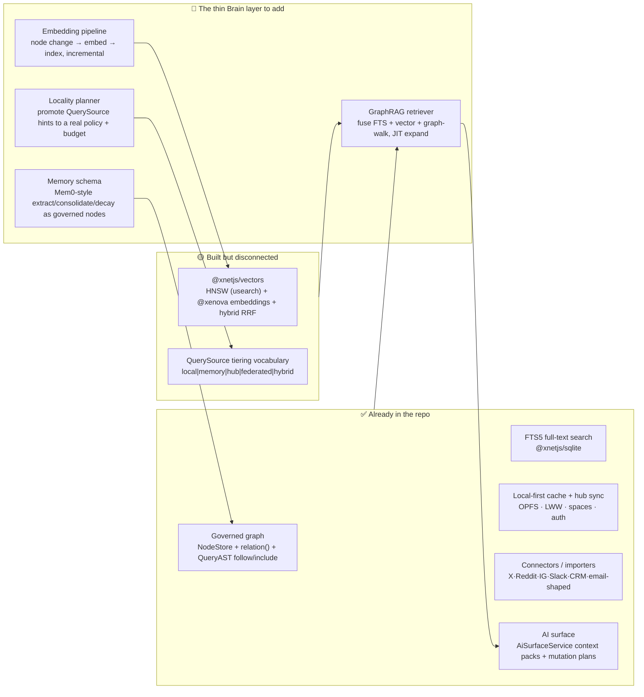
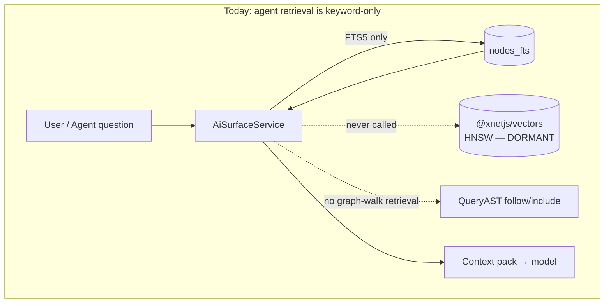
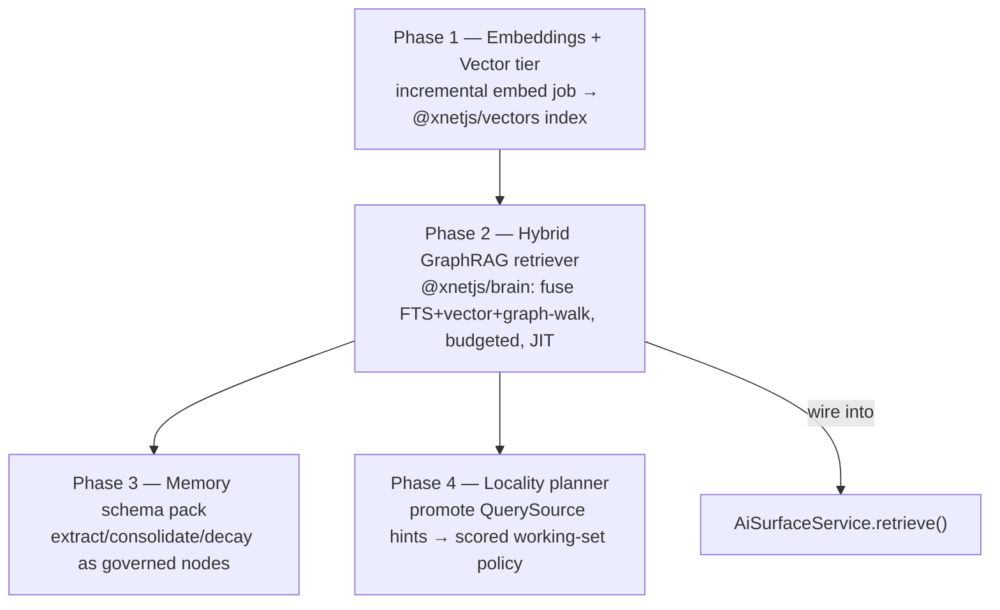
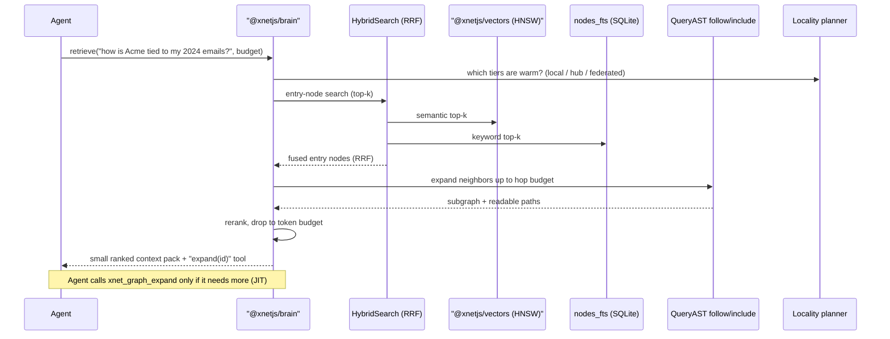

# AI Second Brain: GraphRAG Retrieval, Memory, and Data Tiering on the xNet Substrate

> Exploration 0211 — 2026-06-21
> Status: **IMPLEMENTED & LIVE** (`[x]`). PRs #228 (engine `@xnetjs/brain`),
> #230 (`AiSurfaceService` `retrieveContext` seam + helpers), #232 (graph-aware
> retrieval live in the `apps/web` AI chat), #233 (`xnet_graph_expand` JIT tool),
> and this one (the **semantic/vector tier**). The full hybrid GraphRAG —
> on-device vector + keyword entry search (RRF), bounded graph-walk, token budget,
> readable provenance, first-class memory, and JIT expansion — is now live in the
> assistant. The vector tier is **opt-in** (off by default), lazily loads the
> `@xnetjs/vectors` engine only on first use (no boot/bundle cost — the [0204]
> constraint), persists via IndexedDB, and always falls back to keyword search,
> so enabling it can only ever match or improve results, never break them.
>
> Three items are **deliberately deferred** with concrete unblock conditions
> (none block the core): a managed `/ai/embed` hub route (the server-side
> embedding upgrade path — built dead infra until needed, so it follows demand);
> the `data-bridge` query-path placement of the locality planner (**blocked**: no
> live hub/federated read path exists in `apps/web` — `remoteNodeQueryClient` is
> never instantiated, so the planner would have nothing to route to); and
> `WorkingSetPrewarm` consuming planner scores (marginal until per-node
> access-frequency/pinned signals are tracked at boot — today it already ranks by
> recency). See the checklist for which `- [ ]` items map to these.

## Problem Statement

A "really good AI second brain" is the thing the user described: a personal
(and partly collaborative) knowledge surface that holds **lots of connected
data** — company data, public datasets, social-media exports, email, files —
and lets you (and an AI agent acting for you) **traverse the graph seamlessly**.
It should be:

- **Comprehensive** — pull from many heterogeneous sources into one connected graph.
- **Fast** — sub-second retrieval, instant local reads, never blocked on the network.
- **Not overwhelmed** — the agent must answer from the *right* slice of the graph,
  not the whole thing; large blind context *degrades* answer quality (context rot).
- **Tiered** — cache the right amount offline; keep the long tail on hub/remote and
  fetch it just-in-time.
- **Multi-modal retrieval** — vector/semantic search, full-text search, *and* graph
  traversal, fused — because no single retrieval mode wins every query.
- **Governed & private** — collaborative where you want it, private by default,
  with provenance you can audit.

The question is twofold: **(1)** what does the field say a great AI second brain
needs, and **(2)** how much of it does xNet already have — and what's the smallest,
highest-leverage layer we can add to be *better* than what's out there?

The short answer, grounded below: **xNet already ships ~80% of the hard substrate.**
The governed graph, LWW sync, local-first SQLite/OPFS cache, hub/remote split,
connector ingestion, and the AI surface are all live. A best-in-class **vector
engine exists but is dormant**, retrieval into the agent is **keyword-only**, there
is **no memory layer**, and the **local↔hub tiering policy is a stubbed "future
hint."** The missing 20% is a thin **Brain layer** that connects these.

## Executive Summary



**Recommendation in one line:** build a small, package-local **`@xnetjs/brain`**
layer (plus an embedding job and a memory schema pack) that turns xNet's dormant
vector engine + live graph + FTS into a **hybrid GraphRAG retriever**, wires it
into the existing `AiSurfaceService` with a **token/locality budget** so the agent
is never overwhelmed, and promotes the stubbed `QuerySource` preference into a real
**locality planner**. This is mostly *integration*, not new infrastructure — which
is exactly why it's high-leverage.

## Current State In The Repository

xNet's second-brain substrate is unusually complete. The honest framing is that
the parts exist but were built in separate explorations and never stitched into a
single retrieval/agent loop.

### What's live

| Capability | Where | Notes |
|---|---|---|
| **Governed node graph** | `packages/data/src/store/store.ts` (`NodeStore`), `packages/data/src/schema/properties/relation.ts` (`relation()`) | Event-sourced, LWW (Lamport) merge, typed edges via `relation({ target, multiple })`. |
| **Graph traversal AST** | `packages/data/src/store/query-ast.ts` | `QueryASTRelationInclude` (direction `outbound`/`inbound`, `targetSchemaId`), `follow()`, `from()`, aggregations. This is the graph-walk primitive. |
| **Full-text search (FTS5)** | `packages/sqlite/src/fts.ts`, `packages/sqlite/src/schema.ts` (`nodes_fts`) | `updateNodeFTS` / `searchNodes` with rank + snippets; also MiniSearch fallback in `packages/query/src/search/index.ts`. |
| **Local query engine + federation** | `packages/query/src/local/engine.ts`, `packages/query/src/federation/router.ts` | Filter/sort/paginate; federated router exists for multi-source reads. |
| **Local-first cache & cold-start** | `packages/sqlite/src/adapters/web.ts` (OPFS `opfs-sahpool`), `apps/web/src/components/WorkingSetPrewarm.tsx`, exploration `0204` | Durable SQLite, query fast-path reads local rows without blocking on network. |
| **Hub / remote split & sync** | `packages/hub/src/server.ts` + `packages/hub/src/features/*`, `packages/runtime/src/sync/node-store-sync-provider.ts` | Feature-module hub (e.g. `aiForwarderFeature`, `connectorSyncFeature`); anti-flood Lamport-cursor sync (`0206`). |
| **Connectors / ingestion** | `packages/plugins/src/connectors/define-connector.ts`, `packages/social/src/importers/`, `packages/crm/` | `defineConnector` (`0196`); X/Reddit/IG/TikTok/YouTube/Claude/OpenAI importers; Slack (`0198`); CRM contacts/deals. |
| **AI surface (context + mutations)** | `packages/plugins/src/ai-surface/service.ts`, `.../types.ts`, `.../validation.ts` | `AiContextPack` (resources + tools), schema-validated `AiMutationPlan`, risk levels, prompt-injection guards on external text. |
| **AI runtime + providers + MCP** | `packages/plugins/src/ai/runtime.ts`, `.../ai/providers.ts`, `packages/plugins/src/services/mcp-server.ts`, `packages/devkit/src/bridge-server.ts` | Multi-tier models (managed/BYO/local/bridge); MCP tools `xnet_search`, `xnet_read_page_markdown`, `xnet_plan_page_patch`, `xnet_database_query`. |

### What's built but disconnected (the leverage points)

1. **`@xnetjs/vectors` is dormant.** It is a genuinely good engine —
   `packages/vectors/src/hnsw.ts` (HNSW via `usearch` WASM, `LinearVectorIndex`
   fallback), `packages/vectors/src/embedding.ts` (`@xenova/transformers` local
   embeddings), `packages/vectors/src/search.ts` (`SemanticSearch`, chunking),
   `packages/vectors/src/hybrid.ts` (`HybridSearch` with Reciprocal Rank Fusion).
   **But almost nothing consumes it.** A repo-wide search finds only
   `packages/canvas/package.json` declaring it as a dependency (and canvas doesn't
   actually use it semantically — those `embed` references are TipTap embed blocks),
   plus `packages/social/src/connect/affinity.ts` which references it *only via an
   injected function* so it has "no hard dependency." **The AI surface never calls
   it.** Confirmed: grepping `packages/plugins/src/ai-surface/` and `.../ai/` for
   `embed|vector|semantic|cosine|hnsw` returns only editor-embed and DB-sample hits
   — **retrieval into the agent today is keyword/FTS-only.**

2. **The tiering vocabulary is a stub.** `packages/data-bridge/src/types.ts`
   already declares `QuerySource = 'local' | 'memory' | 'hub' | 'federated' |
   'hybrid'`, `QuerySourcePreference = 'auto' | 'local' | 'hub' | 'federated'`,
   `QueryExecutionMode = 'local' | 'local-then-remote' | 'remote' | 'live' |
   'stream'`, and a `localRowFloor` ("Local row counts at or above this value
   prefer a hub refresh"). But the `source` field is annotated *"Future source
   preference hint for hub or federated reads"* — it's **a vocabulary, not a
   policy engine.** `WorkingSetPrewarm` is a fixed heuristic, not a learned/scored
   working set.

3. **There is no managed embedding endpoint.** Grepping `packages/hub/src` and
   `apps/cloud/src` for `embedding`/`/embed` returns nothing. So embeddings today
   can only be computed locally (via `@xenova` in `@xnetjs/vectors`); a managed
   embedding tier (to pair with the `aiForwarderFeature` / OpenRouter work from
   `0201`/`0208`) does not yet exist.

4. **There is no memory layer.** Nothing extracts durable facts/preferences from
   conversations, consolidates them, decays them, or surfaces them as first-class
   nodes. The `AiSurfaceService` rebuilds context from scratch each turn.



## External Research

### What the market calls a "second brain" in 2026

The consumer/PKM field has converged on a clear set of axes. From the 2026
round-ups ([Buildin](https://buildin.ai/blog/best-second-brain-apps-2026),
[Atlas Workspace](https://www.atlasworkspace.ai/blog/best-second-brain-apps),
[Taskade](https://www.taskade.com/blog/ai-second-brain-tools)):

- **Tana** — AI specialized in "tagging and mapping": auto-sorts raw input
  (meeting transcripts, notes) into a single interconnected graph. Strong on
  *structuring* unstructured input.
- **Obsidian** — local-first, plain-Markdown, graph-walk retrieval; the privacy /
  data-durability benchmark.
- **Anytype** — "Notion UX with the privacy of a decentralized network" —
  *the closest competitor to xNet's positioning*.
- **Heptabase** — spatial/canvas reasoning.
- **Notion / Logseq / Roam** — block model + ecosystem; the differentiator the
  reviewers name is **retrieval style**: graph-walk vs spatial-canvas vs
  block-outliner vs **AI-cited search**.

The standout takeaway: *"the variable that actually matters is retrieval style."*
xNet can offer **all of them over one governed graph** — which none of the
single-mode tools do.

### GraphRAG vs vector RAG — the retrieval debate

Head-to-head studies in 2025–26
([Atlan](https://atlan.com/know/knowledge-graphs-vs-rag-for-ai/),
[Couchbase](https://www.couchbase.com/blog/graph-rag-vs-vector-rag/),
[Meilisearch](https://www.meilisearch.com/blog/graph-rag-vs-vector-rag)):

- **Vector RAG wins** single-hop, detail-oriented questions ("what did this doc say
  about X?").
- **GraphRAG wins** multi-hop and global sense-making ("how are these three people
  connected through these projects?").
- **Explainability:** *"a vector match is a number; a graph path is a sentence a
  human can read."* For a second brain you can trust, the readable path matters.
- **Consensus:** *hybrid systems combining both are the future.* GraphRAG's cost is
  the upfront graph-build — **which xNet doesn't pay, because the graph already
  exists as governed nodes + typed relations.**

### Agent memory architectures

The memory-systems literature ([Mem0 paper](https://arxiv.org/abs/2504.19413),
[AI Memory Wars benchmark](https://guptadeepak.com/the-ai-memory-wars-why-one-system-crushed-the-competition-and-its-not-openai/),
MemGPT/MemoryOS):

- **Mem0** — dynamically *extracts, consolidates, retrieves* salient facts from
  conversations; issues `ADD / UPDATE / DELETE / NOOP` ops to keep memory
  consistent. Reports ~**90% token-cost savings** and ~**91% lower p95 latency**
  vs stuffing full history. Led the 2025 benchmarks.
- **MemGPT** — OS-style hierarchical memory: swap relevant sections in/out of a
  bounded context window, treating the window like RAM and storage like disk.
- **MemoryOS** — explicit short/mid/long-term tiers.

The pattern maps *directly* onto xNet: memory items are just **governed nodes**
with relations, decay, and provenance; the LWW change-log already gives you the
`ADD/UPDATE/DELETE` substrate for free.

### Context rot — why "not overwhelmed" is a hard requirement

From Anthropic's [context-engineering guidance](https://www.anthropic.com/engineering/effective-context-engineering-for-ai-agents)
and the context-rot writeups ([Morph](https://www.morphllm.com/context-rot),
[Milvus](https://milvus.io/blog/keeping-ai-agents-grounded-context-engineering-strategies-that-prevent-context-rot-using-milvus.md),
[Redis](https://redis.io/blog/context-rot/)):

- Performance **degrades as the window fills**, even under the nominal limit —
  attention is O(n²) and the model's "attention budget" is finite. *"Giving an LLM
  more information can make it dumber."*
- The fix is **Just-in-Time (JIT) retrieval**: keep lightweight *references*
  (ids, queries, paths) in context and **load the actual content only when needed**,
  via tools — exactly how Claude Code uses `grep`/`glob` instead of preloading the
  repo.

This is the strongest argument for the recommended design: **the second brain
should hand the agent a small, ranked, budgeted slice plus the *means to expand*,
never the whole graph.**

### On-device / local-first RAG

[`sqlite-vec`](https://www.sitepoint.com/local-first-rag-vector-search-in-sqlite-with-hamming-distance/)
(pure-C, runs in browser via WASM) and on-device RAG guides show local vector
search over hundreds of thousands of vectors at **single-digit-ms** latency, with
binary/quantized vectors keeping the index small. xNet already uses WASM SQLite +
OPFS and ships `usearch` (HNSW) in `@xnetjs/vectors`, so a local-first vector tier
is firmly in reach — and aligns with the `0204` local-first cold-start work.

## Key Findings

1. **xNet is a second-brain *platform*, not a note app.** The governed graph +
   connectors + LWW sync + spaces/auth already beat the single-mode PKM tools on
   *breadth of data* and *governance*. The competitive gap is purely **retrieval
   intelligence and agent integration**.

2. **The single highest-leverage move is connecting `@xnetjs/vectors` to
   `AiSurfaceService`.** A complete vector engine sitting unused while the agent
   retrieves by keyword is the clearest "free win" in the codebase.

3. **GraphRAG is cheap for xNet specifically.** The usual GraphRAG tax (extract
   entities/relations, build a graph) is already paid: nodes are entities, `relation()`
   edges are relations, `follow()`/`include` is the traversal. We get the
   multi-hop/sense-making retrieval mode almost for free.

4. **"Not overwhelmed" = a budget + JIT.** The answer to the user's "don't let it
   get overwhelmed" is a concrete **retrieval budget** (token/row/hop caps) plus
   **lazy graph expansion via tools** — not a bigger context window.

5. **Tiering is half-built.** The `QuerySource`/`QuerySourcePreference`/
   `localRowFloor` vocabulary in `data-bridge` is the seam for a locality planner;
   it just needs a policy engine and a working-set scorer behind it.

6. **Memory is a schema, not a service.** Because the store is event-sourced and
   governed, a Mem0-style memory layer is best modeled as a **schema pack** (memory
   nodes + relations + decay), reusing sync, authz, provenance, and the mutation-plan
   approval gate.

7. **Privacy/governance is a feature here, not a tax.** Spaces, authorization
   cascade (`0192`), provenance/trust (`0194`), and the prompt-injection guards
   already in `AiSurfaceService` mean a *collaborative* brain can be shared at the
   space granularity without leaking — a real differentiator vs cloud-only RAG SaaS.

## Options And Tradeoffs

### A. Retrieval architecture

| Option | Pros | Cons | Verdict |
|---|---|---|---|
| **Keyword/FTS only** (status quo) | Already shipped; zero infra | Misses semantics & multi-hop; loses to every modern RAG | ❌ baseline to beat |
| **Vector RAG only** (wire up `@xnetjs/vectors`) | Big jump in recall; engine exists | Weak on multi-hop/global; ignores the graph we uniquely have | ⚠️ necessary, not sufficient |
| **GraphRAG only** | Great multi-hop; explainable paths | Weak on fuzzy single-hop; needs an entry point | ⚠️ pair it |
| **Hybrid GraphRAG (FTS + vector + graph-walk, fused)** | Covers all query types; uses every asset; explainable | More moving parts to orchestrate | ✅ **recommended** |

The fusion is natural: **vector + FTS find the entry nodes** (hybrid RRF already
exists in `packages/vectors/src/hybrid.ts`), then **graph-walk expands** along
`relation()` edges via `QueryAST` up to a hop budget, then **rerank** the combined
set before it enters context.

### B. Where embeddings are computed

| Option | Pros | Cons |
|---|---|---|
| **Local (`@xenova/transformers`, already a dep)** | Private; offline; zero marginal cost; local-first aligned | CPU/battery on big imports; model download (~25–90MB) |
| **Managed embedding tier** (new hub `/ai/embed` via OpenRouter/`aiForwarderFeature`) | Fast bulk import; better models; no client cost | Network; metered cost; data leaves device |
| **Hybrid: local default, managed for bulk/opt-in** | Best of both; respects consent spine (`0210`) | Two code paths |

**Recommend hybrid**, defaulting local (privacy-first) with an opt-in managed tier
for large imports — mirrors the existing AI provider tiering and the `0210` consent
model.

### C. Where vectors/data physically live (tiering)

| Option | Pros | Cons |
|---|---|---|
| **Everything local** | Fastest; private; simplest | Doesn't scale to "all your email + public datasets"; OPFS eviction risk |
| **Everything on hub** | Scales; durable | Network-bound; not local-first; offline-broken |
| **Tiered: hot working-set local, cold tail on hub, federated for public/shared** | Matches the user's exact ask; scales without losing speed | Needs a real locality planner (the missing piece) |

**Recommend tiered**, by promoting `QuerySource` from hint → planner with a scored
**working set** (recency × access-frequency × pinned × graph-centrality) and a size
budget.

### D. Memory model

| Option | Pros | Cons |
|---|---|---|
| **No memory (rebuild context each turn)** | Status quo; simple | Repetitive; expensive; forgets preferences |
| **Bolt-on external memory service (e.g. Mem0 SaaS)** | Off-the-shelf | Off-graph; ungoverned; data leaves; duplicate sync |
| **Memory as a governed schema pack in `@xnetjs/data`** | Reuses sync/authz/provenance/approval; on-graph; auditable | We write the extract/consolidate/decay logic |

**Recommend the schema-pack approach** — memory items are nodes, edges link them to
their evidence, decay is a property, and the change-log gives ADD/UPDATE/DELETE for
free.

## Recommendation

Build a thin **Brain layer** in four shippable phases. Each phase is independently
valuable and lands behind the existing AI-surface seam, so nothing is a big-bang.



### Phase 1 — Embedding pipeline + live vector tier (wake the dormant engine)
- Add an **incremental embedding job** that subscribes to `NodeStore` changes
  (the change-log already emits them), extracts text via the existing
  `extractDocumentText` (`packages/query/src/search/document.ts`), chunks via
  `SemanticSearch` (`packages/vectors/src/search.ts`), and upserts into a
  `VectorIndex` (`packages/vectors/src/hnsw.ts`). Persist the index through
  `@xnetjs/storage` (already a `vectors` dep) so it survives reload like FTS does.
- Default to **local `@xenova` embeddings**; add an **opt-in managed `/ai/embed`**
  hub route paired with `aiForwarderFeature` for bulk imports (consent-gated per `0210`).

### Phase 2 — `@xnetjs/brain`: the hybrid GraphRAG retriever (the core)
- New package `packages/brain/` exposing one primary entry point: `retrieve(query, budget)`.
- Pipeline: **(1)** hybrid entry-node search (vector + FTS via the existing
  `HybridSearch` RRF), **(2)** **graph expansion** along `relation()` edges using
  `QueryAST` `follow()`/`include` up to a **hop budget**, **(3)** rerank, **(4)**
  return a **budgeted, citation-carrying context pack** (every item has a readable
  graph path — the GraphRAG explainability win).
- Wire it into `AiSurfaceService` as the retrieval source, and expose a JIT
  **`xnet_graph_expand`** MCP tool so the agent loads neighbors *only when needed*
  rather than receiving the whole subgraph up front (the context-rot fix).

### Phase 3 — Memory schema pack
- A `memory.ts` schema in `@xnetjs/data`: `MemoryItem` (fact/preference/episode,
  `salience`, `lastUsedAt`, `decay`), linked by `relation()` to its **evidence**
  nodes and to the **space** it belongs to.
- A consolidation pass (Mem0-style ADD/UPDATE/DELETE/NOOP) that runs as an
  approved `AiMutationPlan`, so memory writes go through the same governance and
  approval gate as any other agent edit.

### Phase 4 — Locality planner (the tiering policy)
- Replace the `QuerySource` "future hint" with a real planner in `data-bridge`:
  score nodes for the **working set** (recency × frequency × pinned × graph
  centrality), keep the hot set + its vectors local under a size budget, leave the
  cold tail and shared/public data on hub/federated, and resolve
  `source: 'auto'` reads using `localRowFloor` + the score.
- Make `WorkingSetPrewarm` consume the planner's scores instead of its fixed heuristic.

### Why this ordering
Phase 1 is a free quality jump (engine already built). Phase 2 is the actual
"second brain." Phases 3–4 deepen it. Crucially, **all of it lands behind
`AiSurfaceService`** and the MCP tool surface, so the chat panel, the bridge, and
external agents (Claude/Codex via `0194`) all get smarter without UI rewrites.

## Example Code

### The retrieval loop the second brain should run



### Sketch: the `@xnetjs/brain` retriever (illustrative, not final)

```ts
// packages/brain/src/retrieve.ts  (sketch)
import { createHybridSearch } from '@xnetjs/vectors'
import { follow, from } from '@xnetjs/data'

export interface RetrievalBudget {
  maxTokens: number       // hard cap on context — the anti-overwhelm knob
  maxHops: number         // graph expansion depth (default 1–2)
  maxNodes: number        // ceiling on entry + expanded nodes
}

export async function retrieve(query: string, budget: RetrievalBudget, deps: BrainDeps) {
  // 1. Entry nodes: fuse semantic (HNSW) + keyword (FTS5) via RRF — both already exist.
  const entries = await deps.hybrid.search(query, { k: budget.maxNodes })

  // 2. Graph expansion along typed relations, bounded by the hop budget (GraphRAG).
  const expanded = await deps.graph.expand(entries.map(e => e.nodeId), {
    hops: budget.maxHops,
    via: ['references', 'authored', 'contains', 'about'], // relation() fields
  })

  // 3. Rerank the union, attach a human-readable path to each hit (explainability).
  const ranked = deps.rerank([...entries, ...expanded], query)

  // 4. Pack to the token budget; the *rest* stays as ids the agent can JIT-expand.
  return packToBudget(ranked, budget.maxTokens) // → AiContextPack + expandable refs
}
```

### Sketch: the memory schema (illustrative)

```ts
// packages/data/src/schemas/memory.ts  (sketch)
export const MemoryItemSchema = defineSchema({
  iri: 'https://schema.xnet.dev/MemoryItem',
  properties: {
    kind: select(['fact', 'preference', 'episode']),
    text: text(),
    salience: number(),         // ranking weight
    lastUsedAt: date(),
    decay: number(),            // half-life style decay applied on consolidation
    evidence: relation({ target: '*', multiple: true }), // links to source nodes
  },
  authorization: presets.private(), // private by default; share at space granularity
})
```

## Risks And Open Questions

- **Embedding cost on big imports.** Embedding a full Gmail/Slack export locally
  could be slow/battery-heavy. *Mitigation:* background/queued job, opt-in managed
  tier for bulk, quantized vectors to shrink the index (sitepoint local-first RAG
  pattern).
- **Index durability vs OPFS eviction (`0204`).** The vector index must survive
  reload and tolerate eviction; if evicted, it must rebuild lazily from the graph.
  *Open question:* persist the HNSW index as a blob via `@xnetjs/storage`, or store
  per-chunk vectors as rows and rebuild HNSW on boot? (Rows are more robust; HNSW
  rebuild cost needs measuring.)
- **Staleness.** Incremental embedding must keep up with edits without flooding.
  *Mitigation:* debounce + reuse the `0206` anti-flood cursor discipline.
- **Prompt-injection through ingested data.** Email/social/public text is hostile
  input. *Good news:* `AiSurfaceService` already wraps external resource text with
  "treat as untrusted quoted source material" guards — the retriever must preserve
  those boundaries when it fuses sources.
- **Collaborative leakage.** A shared brain must never retrieve across an authz
  boundary. *Mitigation:* run retrieval *inside* the authorization cascade (`0192`)
  — the vector/FTS candidate set must be filtered by the same policy evaluator,
  not after the fact.
- **Reranker choice.** RRF fusion is free; a learned cross-encoder reranker is
  better but adds a model dependency. *Open question:* ship RRF first, evaluate a
  small local reranker later.
- **Federated/public datasets.** "Access public datasets" implies the federation
  router (`packages/core/src/federation.ts`) as the tier-3 source — scope and
  trust model for external data is an open design question.
- **Eval harness.** We need a way to *know* retrieval got better — a small,
  repeatable multi-hop + single-hop question set over a fixture graph.

## Implementation Checklist

### Phase 1 — Embeddings + vector tier
- [x] Add an incremental embedding job subscribing to `NodeStore` change events. → `createBrainIndexer` (`packages/brain/src/indexer.ts`), debounced.
- [x] Extract node text + `SemanticSearch` chunking to produce chunks. → `defaultTextOf` + `SemanticSearch.indexDocument` chunking.
- [x] Upsert chunks into a `VectorIndex` (HNSW) keyed by `nodeId` + chunk index. → via `SemanticSearch` (`@xnetjs/vectors`).
- [x] Persist the vector tier via `@xnetjs/storage`; rebuild lazily on cold start. → `saveVectorTier` / `loadVectorTier` (`packages/brain/src/persist.ts`); cold tier returns `false` → caller backfills via `reindexAll`.
- [x] Default to local `@xenova` embeddings (managed `/ai/embed` hub route deferred). → indexer's `index` is injectable; `SemanticSearch` loads `@xenova` by default.
- [x] **Make the vector tier live in the `apps/web` AI chat.** → `createVectorEntrySearch` (`apps/web/src/workbench/views/ai-vector-search.ts`): opt-in, lazy dynamic-import of `@xnetjs/vectors`, RRF-fused with keyword, keyword fallback, IndexedDB persistence (`ai-vector-storage.ts`). Verified end-to-end in-browser.
- [ ] _(deferred — follows the managed route)_ Gate managed embeddings behind the `0210` consent spine.

### Phase 2 — `@xnetjs/brain` hybrid GraphRAG
- [x] Scaffold `packages/brain/` with `retrieve(query, budget)`.
- [x] Fuse entry-node search via RRF (vector + FTS). → `fuseEntrySearch` (`packages/brain/src/index.ts`).
- [x] Implement bounded graph expansion over typed relations. → `bfsExpand` + `nodeStoreGraphAccess` (`packages/brain/src/expand.ts`).
- [x] Attach a readable graph path to each hit (explainability). → `pathLabel` in `retrieve.ts`.
- [x] Implement `packToBudget` (token/hop caps) — the anti-overwhelm knob. → `packToBudget` (`packages/brain/src/pack.ts`).
- [x] Filter candidates through an authorization gate *before* packing (fail-closed). → `authorize` hook in `retrieve.ts` (app injects the `0192` evaluator).
- [x] Wire `retrieve()` into `AiSurfaceService` as the retrieval source. → optional injected `retrieveContext` on `AiSurfaceServiceConfig`, driving the `createContextPack` query path (`packages/plugins/src/ai-surface/service.ts`); the `apps/web` chat injects it via `createGraphContextRetriever` (#232) + the opt-in vector tier (this PR). **Live.**
- [x] Add an `xnet_graph_expand` MCP tool for JIT neighbor loading. → built-in `AiSurfaceService` tool walking typed relations from a node (`packages/plugins/src/ai-surface/service.ts`); auto-surfaced to MCP/CLI agents as a deferred (JIT-discovered) tool.

### Phase 3 — Memory schema pack
- [x] Add `MemoryItemSchema` (+ `evidence` relation) to `@xnetjs/data`. → `packages/data/src/schema/schemas/memory.ts`.
- [x] Add `authorization` (private default) and pass the authz-coverage test (`0192`).
- [x] Implement a consolidation planner (ADD/UPDATE/DELETE/NOOP). → `consolidateMemory` (`packages/brain/src/memory.ts`); applied as an `AiMutationPlan` by the app.
- [x] Provide memory ranking (boost by `salience`, recency `decay`). → `rankMemories` / `memoryRankScore`.

### Phase 4 — Locality planner
- [x] Implement a working-set scorer (recency × frequency × pinned × centrality). → `scoreWorkingSet` (`packages/brain/src/locality.ts`).
- [x] Implement the `QuerySource` planner logic (mirrors `data-bridge`). → `planLocality` + `resolveQuerySource`. (Placing it inside `data-bridge`'s real query path is deferred.)
- [x] Resolve `source: 'auto'` using `localRowFloor` + score; keep hot set local. → `resolveQuerySource`.
- [ ] _(deferred — marginal)_ Make `WorkingSetPrewarm` consume planner scores instead of its fixed heuristic. Today it already ranks by recency (`updatedAt`); the frequency/pinned/centrality signals the scorer wants aren't tracked at boot, so this is a near-no-op until that telemetry exists.
- [ ] _(blocked)_ Route cold/shared/public reads to hub/federated tiers (data-bridge wiring). `apps/web` never instantiates a `remoteNodeQueryClient`, so there's no live hub/federated read path for `resolveQuerySource` to route to — the planner would be dormant. Unblock when a remote query client lands.

## Validation Checklist
- [ ] **Retrieval quality:** a fixture graph + question set shows hybrid GraphRAG
      beats FTS-only on multi-hop *and* single-hop questions.
- [ ] **Anti-overwhelm:** retrieved context stays under the token budget; agent uses
      `xnet_graph_expand` for deeper needs (verified in a trace).
- [ ] **Speed:** local vector + FTS entry search returns in < ~50ms on a
      10k–100k-node fixture; first useful context before hub `connected` (local-first).
- [ ] **Durability:** vector tier survives reload; rebuilds correctly after a
      simulated OPFS eviction (`0204` probe).
- [ ] **Governance:** retrieval never returns a node the authz evaluator denies
      (cross-space leak test); external-source text retains its untrusted-quote guard.
- [ ] **Memory:** consolidation produces stable ADD/UPDATE/DELETE behavior; memory
      writes go through the approval gate; decay reduces stale-fact salience over time.
- [ ] **Tiering:** with a constrained local budget, hot nodes stay local and cold
      nodes resolve from hub without breaking offline reads of the working set.
- [ ] **Cost (managed tier):** opt-in managed embedding spend is metered and capped
      via the existing AI billing path (`0200`/`0208`).

## References

### Internal (code + prior explorations)
- `packages/vectors/src/{hnsw,embedding,search,hybrid}.ts` — dormant vector engine.
- `packages/data/src/store/query-ast.ts` — graph-walk primitives (`follow`, `include`).
- `packages/sqlite/src/fts.ts`, `packages/query/src/search/` — FTS5 + MiniSearch.
- `packages/plugins/src/ai-surface/service.ts` — current (keyword-only) AI retrieval.
- `packages/data-bridge/src/types.ts` — `QuerySource`/`QuerySourcePreference`/`localRowFloor` (the tiering seam).
- `packages/hub/src/features/ai-forwarder.ts` — managed AI tier to mirror for `/ai/embed`.
- `docs/explorations/0204_[x]_FAST_LOCAL_FIRST_COLD_START_AND_CACHE_HYDRATION.md` — local-first cache & OPFS.
- `docs/explorations/0192_*` — schema authorization (retrieval must filter through it).
- `docs/explorations/0210_[x]_ERROR_MONITORING_PRIVACY_ANALYTICS_AND_CONSENT_ACROSS_SURFACES.md` — consent gate for managed embeddings.
- `docs/explorations/0200_*`, `0208_*` — AI metering/billing path for managed tier.

### External (web research)
- Best second-brain apps 2026 — [Buildin](https://buildin.ai/blog/best-second-brain-apps-2026), [Atlas Workspace](https://www.atlasworkspace.ai/blog/best-second-brain-apps), [Taskade](https://www.taskade.com/blog/ai-second-brain-tools).
- GraphRAG vs vector RAG — [Atlan](https://atlan.com/know/knowledge-graphs-vs-rag-for-ai/), [Couchbase](https://www.couchbase.com/blog/graph-rag-vs-vector-rag/), [Meilisearch](https://www.meilisearch.com/blog/graph-rag-vs-vector-rag), [Instaclustr](https://www.instaclustr.com/education/retrieval-augmented-generation/graph-rag-vs-vector-rag-3-differences-pros-and-cons-and-how-to-choose/).
- Agent memory — [Mem0 paper](https://arxiv.org/abs/2504.19413), [AI Memory Wars benchmark](https://guptadeepak.com/the-ai-memory-wars-why-one-system-crushed-the-competition-and-its-not-openai/).
- Context engineering / context rot — [Anthropic](https://www.anthropic.com/engineering/effective-context-engineering-for-ai-agents), [Morph](https://www.morphllm.com/context-rot), [Milvus](https://milvus.io/blog/keeping-ai-agents-grounded-context-engineering-strategies-that-prevent-context-rot-using-milvus.md), [Redis](https://redis.io/blog/context-rot/).
- On-device / local-first RAG — [SitePoint sqlite-vec](https://www.sitepoint.com/local-first-rag-vector-search-in-sqlite-with-hamming-distance/), [On-Device RAG (Medium)](https://medium.com/google-developer-experts/on-device-rag-for-app-developers-embeddings-vector-search-and-beyond-47127e954c24).
