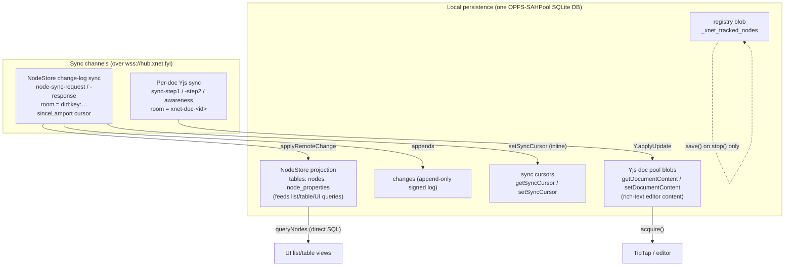
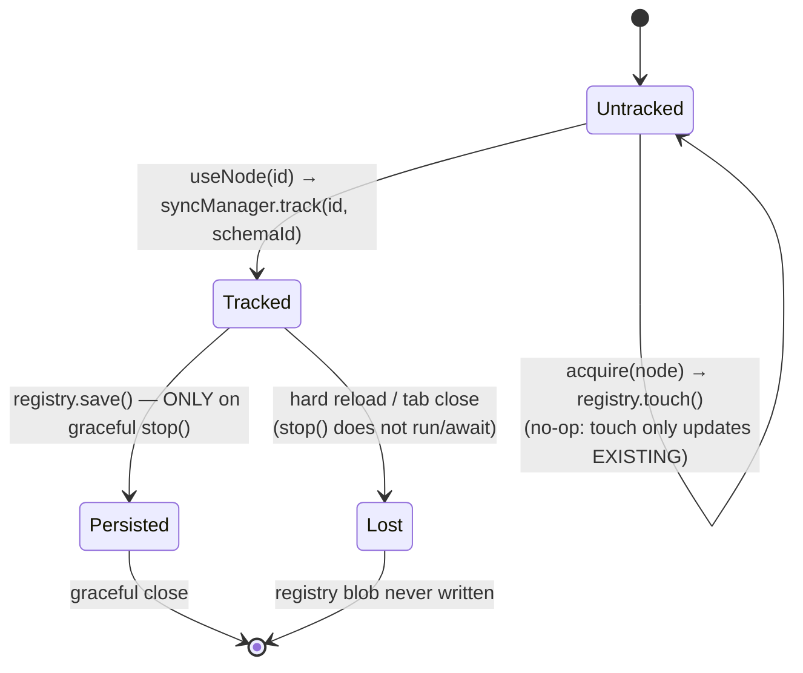
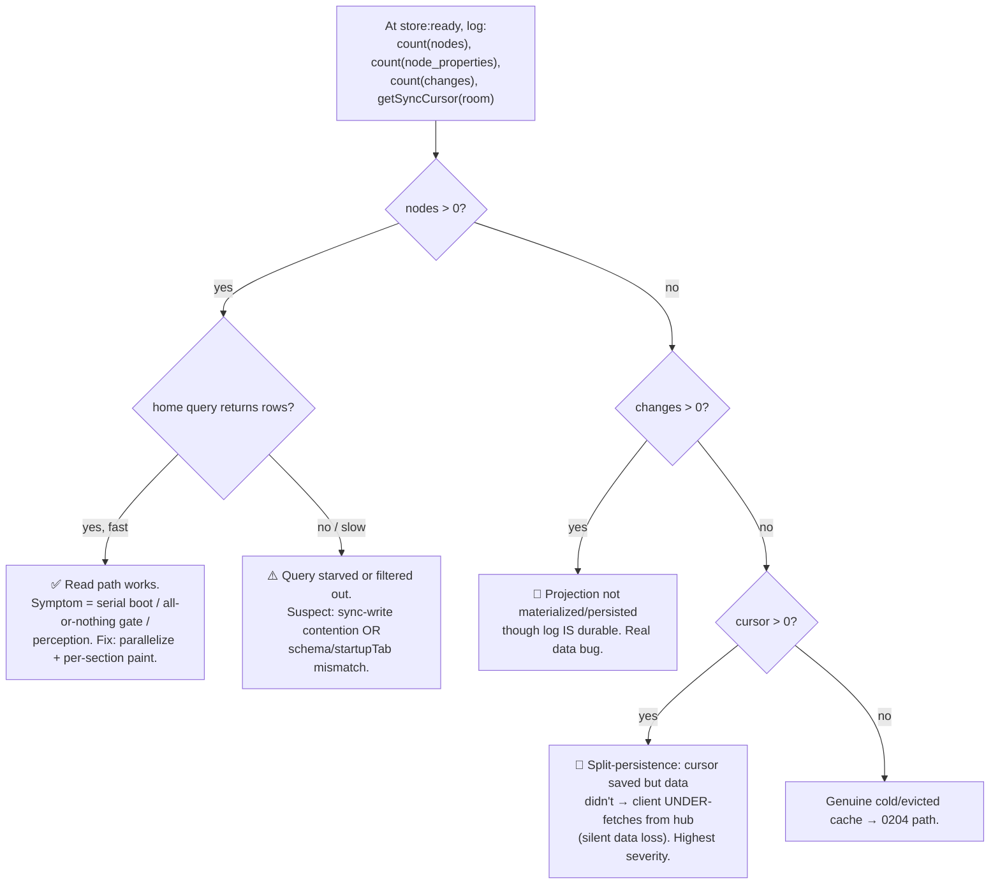

# Local Cache Hydration — Sync-Log Forensics And Read-Path Instrumentation

## Problem Statement

The web app "doesn't really load any data until it syncs with the hub
server, and that takes a little while." This has been fixed-at several
times (most recently exploration
[0204](0204_[x]_FAST_LOCAL_FIRST_COLD_START_AND_CACHE_HYDRATION.md)),
yet the symptom persists. The user supplied a fresh capture of the
**sync** debug logs and asked us to (a) go through them thoroughly,
(b) add deeper introspection / more logs where they don't yet answer
the question, and (c) propose a fix if the cause is already clear.

This exploration does the forensics on the supplied log, reconciles it
against the code as it exists today, and concludes with a concrete,
copy-pasteable **read-path** instrumentation patch plus a ranked fix
list. The single most important finding up front: **the supplied log
disproves the "empty/evicted cache" theory that 0204 leaned on, and
every line in it is from the sync layer — so it contains zero evidence
about the path that actually matters (the local read/hydrate path).**

## Executive Summary

Three things are true of the supplied log, and each rewrites a prior
assumption:

1. **The OPFS / SharedArrayBuffer / COOP-COEP error is a benign red
   herring.** The app deliberately uses the `opfs-sahpool` VFS, which
   does *not* need cross-origin isolation. The error
   (`Ignoring inability to install OPFS sqlite3_vfs… Missing
   SharedArrayBuffer`) is sqlite-wasm *auto-attempting the unrelated
   plain `opfs` VFS* during module init, then moving on. `getStorageMode()
   returned: opfs` confirms SAH-Pool installed and storage is durable.
   The word "Ignoring" is literal. Adding COOP/COEP headers in prod is
   **not** the fix (see §External Research).

2. **The cache is durably persisted and populated on this load.** The
   client sends `node-sync-request … sinceLamport: 262282` — that
   cursor is read back from SQLite (`getSyncCursor`,
   `node-store-sync-provider.ts:185`). It loads a real document from the
   local pool *before the socket is even open*
   (`Doc acquired from pool, guid: t9mu7riqwvh meta keys: 3`, with a
   12-entry state vector). A non-zero persisted cursor **plus** locally
   loaded doc content prove OPFS survived the reload. This is **not**
   the evicted-cache branch from 0204.

3. **The log is 100% sync-layer; the read path is invisible.** Every
   line is `[SyncManager]`, `[ConnectionManager]`, or `[WebSQLiteProxy]`.
   There is **not one line** about: how many rows the local DB holds at
   boot, when `nodeStoreReady` flips, when the landing queries fire,
   how long they take, how many rows they return, or when first paint
   happens. The 0204 boot timeline exists but is gated behind
   `localStorage['xnet:boot:debug']` and only marks `query:first-rows`
   on the home route — none of it is in this capture. **We are debugging
   the read path with logs that never touch it.**

So the honest diagnosis is: *we cannot yet name the exact cause from
this log, but we can rule out the popular wrong answers and we know
precisely which four log lines would settle it.* The recommendation is
therefore measurement-first (again), but this time pointed at the
**read** path with an always-on row-count + query-timing probe, plus a
short list of likely fixes that the probe will confirm or reject in one
reload.

A secondary but real bug surfaced along the way: the SyncManager
**registry never meaningfully persists** (`tracked nodes: 0` on every
cold boot despite heavy use), because (a) `acquire()` calls
`registry.touch()` — a no-op for untracked nodes — instead of
`track()`, and (b) the registry only saves on a graceful `stop()`,
which does not run on a hard reload. This doesn't blank the home list
(that's a NodeStore query, not the registry), but it does mean no
previously-open document is pre-synced in the background after a
reload — every doc is fetched lazily on navigation.

## Current State In The Repository

### Two independent local stores, two sync channels

The app is not "local SQLite + a socket." It is a **dual-store** design,
and the two stores persist through *different triggers* — which is the
key to reading the log:



- **Structured data the home/list views read** lives in the NodeStore
  projection (`nodes`, `node_properties`) and is queried by direct SQL:
  `store.query()` takes the fast path
  `this.storage.queryNodes(descriptor)` whenever there is no content
  cipher and no auth evaluator — and the web app sets **neither**
  (`packages/data/src/store/store.ts:720-734`; confirmed no
  `authEvaluator`/`nodeContentCipher` is passed anywhere in `apps/web`
  or `packages/react`). So list queries are local-only, durable, and
  do **not** wait on the network.
- **Editor content** lives in the **Yjs doc pool**, persisted as
  per-node update blobs and reloaded on `acquire()`
  (`node-pool.ts` `loadDoc`).
- **`NodeStore.initialize()` is cheap** — it reads only the last
  Lamport time and sets the clock; there is **no change-log replay** at
  boot (`store.ts:190-193`). So a populated projection paints without
  re-deriving anything.

### The supplied log, line by line

```mermaid
sequenceDiagram
    autonumber
    participant W as SQLite worker (OPFS-SAHPool)
    participant App as XNetProvider
    participant SM as SyncManager
    participant CM as ConnectionManager
    participant Hub as hub.xnet.fyi

    W->>W: open(); plain opfs VFS auto-attempt FAILS (no SAB) → "Ignoring…"
    W-->>App: getStorageMode() = 'opfs'  ✅ durable SAH-Pool
    App->>App: render #1 — "SyncManager disabled or NodeStore not ready"<br/>{nodeStore:false, nodeStoreReady:false}
    App->>SM: create SyncManager (logged twice — effect re-run?)
    SM->>SM: Registry loaded, tracked nodes: 0  ⚠️
    SM->>SM: acquire presence-main (meta keys:0)
    SM->>CM: join rooms — "WebSocket not open, readyState: undefined/0"
    SM->>SM: acquire t9mu7riqwvh (meta keys:3, SV:12)  ✅ LOCAL doc content
    CM->>Hub: WebSocket connected → re-subscribe 4 rooms
    CM->>Hub: node-sync-request sinceLamport:262282  ✅ persisted cursor
    Hub-->>CM: node-sync-response (changes after 262282 only)
    Hub-->>SM: t9mu7riqwvh sync-step1 (remote SV:12) → send diff:9 → step2
    Note over App,Hub: ❗No log line anywhere about local list query<br/>fire / resolve / row-count / first paint
```

Notable specifics:

- **`SyncManager disabled or NodeStore not ready
  {nodeStore:false, nodeStoreReady:false}`**
  (`packages/react/src/context.ts:811-816`) is the *first* render,
  before the NodeStore effect resolves. It's expected noise — the
  effect re-runs when `nodeStoreReady` flips true
  (`context.ts:720`). It is **not** itself the bug, but it is the only
  hint in the whole log that the store boots after first render.
- **`Creating SyncManager …` appears twice.** The provider effect
  re-ran (an early `authorDID`/`hubUrl`/`runtimeConfig` dep settled),
  tearing down and rebuilding the SyncManager — which re-loads the
  registry and re-acquires docs against the single SQLite worker. Wasted
  cold-start work; flagged for the probe, not yet proven harmful.
- **`Registry loaded, tracked nodes: 0`** despite a 262k-lamport
  history — see the registry bug below.
- **`t9mu7riqwvh` was acquired from the pool with content** *before*
  the socket opened. The local-first editor path is **working** here.
- The capture **ends** right as the first sync messages arrive, with no
  timing, so "data appears at green" is an inference, not something the
  log shows.

### Why the registry is empty (a real, separate bug)



- `acquire()` calls `registry.touch(nodeId)`
  (`sync-manager.ts:1028`), but `touch()` is a **no-op when the node
  isn't already tracked** (`registry.ts:94-97`). The docstring claims
  "Nodes are added automatically when opened" — the code doesn't do
  that.
- Only `useNode` actually calls `syncManager.track()`
  (`packages/react/src/hooks/useNode.ts:453,467`). List views use
  `useQuery`, so list rows never get tracked.
- The manager's `track()` (`sync-manager.ts:1013-1019`) does **not**
  call `registry.save()`. The only `save()` is in `stop()`
  (`sync-manager.ts:1008`), which does not reliably run on reload/close.
- **Contrast with the cursor**, which `setSyncCursor` writes **inline**
  during sync (`node-store-sync-provider.ts:314`), and the Yjs pool,
  which persists on a debounce mid-session. Those survive a hard reload;
  the registry doesn't. That asymmetry is exactly why we see
  `sinceLamport:262282` and `tracked nodes:0` in the same boot.

Impact: after every reload the SyncManager pre-joins **no** doc rooms,
so previously-open documents are only synced lazily when you navigate
to them. The home list is unaffected (NodeStore query), but "open a doc
→ its content fills in after a hub round-trip" is a direct consequence.

### What 0204 already shipped (and why it didn't end this)

0204 added: a boot timeline (`apps/web/src/lib/boot-timeline.ts`,
gated behind `xnet:boot:debug`), `WorkingSetPrewarm`
(`apps/web/src/components/WorkingSetPrewarm.tsx`), a `RestoringNotice`
restoring affordance, a cold/evicted probe
(`probeStoreColdStart`/`looksEvicted`, `App.tsx:405-417`), OPFS
lock-retry with a loud in-memory-fallback `console.error`
(`web.ts:163-237`), and a hub preconnect hint. Those are good and
remain in place. But:

- The timeline is **off by default** and only the home route marks
  `query:first-rows`; the supplied log shows it wasn't enabled.
- `WorkingSetPrewarm` only warms **Page / Database / Canvas**
  (`WorkingSetPrewarm.tsx:15-23`). If the user's landing surface is a
  channel, task board, feed, or data table (the home route also
  *redirects* to a configured `startupTab`, `routes/index.tsx:41-46`),
  that surface kicks a cold query the prewarm never touched.
- The connect-decouple was shipped only as a **preconnect hint**, not a
  real overlap — the socket is still dialed from inside the
  `nodeStoreReady`-gated effect (`context.ts:779+`), so time-to-first-
  byte is still stacked behind WASM + schema + identity + store init.
- The home view gates on **all-or-nothing** loading:
  `loading = pagesLoading || databasesLoading || canvasesLoading`
  and renders a single full-page `Loading…` until **every** query
  resolves (`routes/index.tsx:61,105-112`). One slow query blocks the
  whole paint.

## External Research

- **`opfs-sahpool` does not need COOP/COEP; the plain `opfs` VFS does.**
  sqlite-wasm ships two persistent VFSes. The default `opfs` VFS uses a
  dedicated worker + `Atomics.wait` on a `SharedArrayBuffer`, so it
  requires cross-origin isolation (COOP `same-origin` + COEP
  `require-corp`). The `opfs-sahpool` VFS uses `SyncAccessHandle`s in a
  pool and needs **neither** SAB nor those headers — at the cost of a
  single-connection exclusive lock. xNet uses sahpool on purpose
  (`web.ts:25`, `WEB_SQLITE_VFS_NAME = 'opfs-sahpool'`). The "Missing
  SharedArrayBuffer" line is the *default* `opfs` VFS failing to
  auto-install during `sqlite3InitModule()` — expected and ignored.
  ([sqlite.org persistence](https://sqlite.org/wasm/doc/trunk/persistence.md),
  [Chrome: SQLite Wasm + OPFS](https://developer.chrome.com/blog/sqlite-wasm-in-the-browser-backed-by-the-origin-private-file-system))

- **The headers are intentionally dev-only.** `coopCoepHeaders()` is
  attached via `configureServer`/`configurePreviewServer`
  (`apps/web/vite-plugins/coop-coep-headers.ts:26-37`) — its own comment
  says "production static hosting doesn't need these because we use
  opfs-sahpool." **Consequence:** dev/preview *do* set the headers, so
  the plain `opfs` VFS auto-install **succeeds** there and the benign
  error never prints, while prod prints it every load. **Dev does not
  reproduce prod's storage console output**, which can mislead repro
  attempts. (Enabling cross-origin isolation in prod also breaks
  non-CORP third-party embeds/scripts — a real cost for no persistence
  benefit.)
  ([MDN: COEP](https://developer.mozilla.org/en-US/docs/Web/HTTP/Headers/Cross-Origin-Embedder-Policy),
  [web.dev: cross-origin isolation](https://web.dev/articles/cross-origin-isolation-guide))

- **OPFS-SAHPool is single-connection and synchronous.** All SQL runs on
  the one worker thread holding the access handles. Reads and writes do
  not overlap; an inbound sync **write burst** applied right after
  connect can therefore *delay* the first list **read** that's queued
  behind it. This is the mechanism to watch once the cache is known
  populated.
  ([sqlite.org persistence](https://sqlite.org/wasm/doc/trunk/persistence.md),
  [PowerSync: SQLite persistence on the web](https://powersync.com/blog/sqlite-persistence-on-the-web))

- **Local-first prior art paints from cache, never gates content on the
  socket.** Linear/Figma/Actual render the cached working set instantly
  and reconcile in the background; the connection dot reflects sync, it
  never blocks content. The fix direction is "render local rows the
  instant the store is ready; let sync stream in behind."
  ([RxDB storage comparison](https://rxdb.info/articles/localstorage-indexeddb-cookies-opfs-sqlite-wasm.html))

## Key Findings

1. **Durable cache, confirmed.** Persisted cursor `262282` + a locally
   loaded doc (`meta keys:3`, `SV:12`) prove OPFS persisted across the
   reload. The 0204 "evicted/empty cache" branch does **not** apply to
   this capture.

2. **OPFS/COOP-COEP error is benign.** It's the unused plain `opfs` VFS
   auto-attempt; sahpool is what's actually used and it installed
   (`getStorageMode() = 'opfs'`). Not the bug. Not fixed by adding
   headers in prod.

3. **The supplied logs cannot locate the bug** because they only
   instrument sync. No row count, no `nodeStoreReady` time, no query
   fire/resolve/row-count, no first-paint mark. The read path — the one
   that decides whether the home list paints before or after green — is
   dark.

4. **Reads are local-only and fast *by design*.** Fast direct-SQL
   `queryNodes` path is active (no cipher/auth), `initialize()` does no
   replay, default bridge is main-thread (one worker hop). So *if* the
   projection tables are populated, the list should paint right after
   `nodeStoreReady` — well before green.

5. **The all-or-nothing home gate can manufacture the symptom.** A
   single slow/blocked query (e.g. starved behind the post-connect sync
   write burst on the single SQLite worker) holds the entire page on
   `Loading…`, so "data appears" coincides with sync draining.

6. **Prewarm misses the real landing surface.** Only Page/Database/Canvas
   are warmed; `startupTab` redirects and non-doc surfaces start cold.

7. **Registry never persists (separate bug).** `acquire→touch` (no-op),
   no `save()` after `track()`, save only on graceful `stop()`. Hence
   `tracked nodes:0` forever → no background pre-sync of prior docs
   after reload.

8. **Provider effect double-fires** ("Creating SyncManager" ×2),
   churning the cold-start worker. Low priority; the probe will quantify
   it.

### The diagnostic that settles it in one reload

The current log can't distinguish the remaining hypotheses, but four
SQL counts at boot can. This is the matrix the read-path probe should
print:



Given this capture shows `cursor = 262282`, the live answer is one of
**R1 / R2 / R3 / R4** — and only R1/R2 are non-data-loss. Printing the
counts tells us which immediately.

## Options And Tradeoffs

### A. Read-path instrumentation (do first, user explicitly asked)
Add an always-on (or `xnet:debug`-gated) probe that logs the count
matrix at `store:ready` and wraps each landing query with fire/resolve/
row-count/elapsed, plus a one-line "first local rows painted" mark.

- **Pros:** Turns the next paste into a verdict; cheap; no behavior
  change; reuses the existing boot-timeline marks.
- **Cons:** None material. Without it we keep guessing.

### B. Render per-section; never full-page block; never gate on socket
Split the home `loading` so each list paints as it resolves; show a
skeleton only for the still-pending section; show empty-state only after
a query resolves with 0 rows and the store isn't restoring.

- **Pros:** Kills the "one slow query blocks everything" class; instant
  partial paint. Low risk, view-only.
- **Cons:** Minor UX polish to avoid layout jump.

### C. Prioritize the first read over the post-connect write burst
Ensure the landing query is issued and allowed to complete before (or
not starved by) `applyRemoteChange` writes on the single SQLite worker —
e.g. defer the first inbound sync apply by a tick, or coalesce/yield the
write burst so a queued read isn't blocked.

- **Pros:** Directly addresses the most plausible "data at green"
  mechanism for a populated cache.
- **Cons:** Touches sync apply ordering; needs care + the probe to
  confirm contention is real before investing.

### D. Truly parallelize connect with boot
Finish 0204's deferred item: dial the socket from an effect that depends
only on the hub URL + token, not `nodeStoreReady`, buffering inbound
sync until the store attaches.

- **Pros:** Collapses time-to-green; overlaps network with WASM/identity.
- **Cons:** Must buffer the first `sync-step2`/`node-sync-response`;
  moderate refactor. Bigger lever, more risk — sequence it after A/B.

### E. Broaden + target the prewarm
Prewarm the configured `startupTab` surface and the other primary
schemas (channels/tasks/feed/data), not just Page/Database/Canvas.

- **Pros:** Warms the surface the user actually lands on.
- **Cons:** Over-fetch risk; tune limits.

### F. Fix the registry (touch→track + persist on track + flush on hide)
Make `acquire()` track (with schemaId), `save()` after track (debounced),
and flush on `visibilitychange`/`pagehide`.

- **Pros:** Restores background pre-sync of prior docs across reloads;
  makes `tracked nodes` meaningful.
- **Cons:** Secondary to the home-list symptom; schedule after A–C.

| Option | Fixes "data at green" | Effort | Risk | Order |
|---|---|---|---|---|
| A Read-path probe | enables targeting | low | none | 1 |
| B Per-section paint | **likely (perceived)** | low | low | 2 |
| C Read-before-write | **likely (if contention)** | med | med | 3 |
| D Parallelize connect | partial (time-to-green) | med | med | 4 |
| E Targeted prewarm | tab/landing switches | low–med | low | 5 |
| F Registry fix | doc background freshness | low | low | 6 |

## Recommendation

**A → B → C → D → E → F.**

1. **Ship the read-path probe (A) and ask for one more reload log.** It
   reuses the boot-timeline, adds the four-count matrix and per-query
   timings, and resolves R1/R2/R3/R4 in a single capture. The user asked
   for exactly this ("add more logs so we can better understand"); it is
   also the responsible move given the supplied log can't locate the
   cause.
2. **In the same PR, do B** (per-section paint, never gate content on the
   socket) — it's low-risk, view-only, and removes the most common
   *perceived* "no data until green" even if the probe later shows the
   cache was fine all along.
3. **Then C** if (and only if) the probe shows the first read resolving
   *after* the inbound write burst — the prime suspect for a populated
   cache that still paints at green.
4. **D, E, F** as follow-ups once the probe has named the dominant cost.

This keeps us measurement-led (the recurring lesson from 0204), ships a
user-visible win immediately (B), and refuses to spend the big
connect-refactor budget (D) until the probe proves it's the bottleneck.

## Example Code

### A — Read-path probe (the missing logs)

```ts
// apps/web/src/lib/read-path-probe.ts
import type { SQLiteAdapter } from '@xnetjs/sqlite'

/** One-shot: prove whether the local projection is populated at boot. */
export async function logStoreContents(db: SQLiteAdapter, room: string) {
  const one = async (sql: string) =>
    Number((await db.query(sql))?.[0]?.n ?? -1)
  const [nodes, props, changes] = await Promise.all([
    one('SELECT count(*) AS n FROM nodes'),
    one('SELECT count(*) AS n FROM node_properties'),
    one('SELECT count(*) AS n FROM changes')
  ])
  // getSyncCursor lives on the storage adapter (node-store-sync-provider reads it)
  const cursor = await db
    .query(
      "SELECT content FROM documents WHERE id = ?",
      [`_xnet_sync_cursor:${room}`]
    )
    .then(() => undefined)
    .catch(() => undefined)
  // eslint-disable-next-line no-console
  console.info('[xNet] read-path @ store:ready', {
    nodes, node_properties: props, changes, cursorRoom: room, cursor,
    verdict:
      nodes > 0 ? 'projection populated — read path should paint' :
      changes > 0 ? 'PROJECTION EMPTY but change-log present — materialization bug' :
      'projection AND change-log empty — cold cache or under-fetch'
  })
}
```

```ts
// Wrap each landing query so fire→resolve→rowcount is visible.
// Drop into the home route (and WorkingSetPrewarm) around useQuery.
function useTimedQuery<S>(schema: S, q: object, label: string) {
  const t0 = useRef(performance.now())
  const res = useQuery(schema as never, q as never)
  useEffect(() => {
    if (!res.loading) {
      // eslint-disable-next-line no-console
      console.info(
        `[xNet] query ${label}: ${Math.round(performance.now() - t0.current)}ms`,
        { rows: res.data?.length ?? 0 }
      )
    }
  }, [res.loading]) // eslint-disable-line react-hooks/exhaustive-deps
  return res
}
```

Call `logStoreContents(sqliteAdapter, authorDID)` right after
`bootMark('store:ready')` (it already fires in
`apps/web/src/components/BootTimelineProbe.tsx:19`). Gate both behind an
existing `xnet:debug` flag so they ship on by default for the user's
next capture.

### B — Per-section paint (stop blocking the whole page)

```tsx
// apps/web/src/routes/index.tsx — render each list independently
const pages = useQuery(PageSchema, RECENT)
const databases = useQuery(DatabaseSchema, RECENT)
const canvases = useQuery(CanvasSchema, RECENT)

// Paint whatever has resolved; skeleton only the pending sections.
const anyRows =
  (pages.data?.length ?? 0) + (databases.data?.length ?? 0) +
  (canvases.data?.length ?? 0) > 0
const allLoaded = !pages.loading && !databases.loading && !canvases.loading

// empty-state ONLY when every query resolved with zero rows and we're
// not mid-restore — never merely because the socket is still connecting.
if (allLoaded && !anyRows) return restoring ? <RestoringNotice/> : <EmptyState/>
// otherwise render rows as they arrive; each <Section> shows its own skeleton
```

### C — Don't let the first sync write starve the first read

```ts
// node-store-sync-provider.ts — yield the first inbound apply so a
// queued landing read paints first on the single SAH-Pool worker.
private firstApplyDeferred = false
private async applyRemoteChanges(changes: NodeChange[]) {
  if (!this.firstApplyDeferred) {
    this.firstApplyDeferred = true
    await new Promise((r) => setTimeout(r, 0)) // let the boot read run
  }
  // …existing apply…
}
```

### F — Make the registry actually persist

```ts
// sync-manager.ts
async acquire(nodeId, schemaId?) {
  if (schemaId) registry.track(nodeId, schemaId) // was: registry.touch(nodeId)
  scheduleRegistrySave()                          // debounced save, not stop()-only
  // …
}
// + on construction:
if (typeof document !== 'undefined') {
  addEventListener('pagehide', () => void registry.save())
  addEventListener('visibilitychange', () => {
    if (document.visibilityState === 'hidden') void registry.save()
  })
}
```

## Risks And Open Questions

- **Split-persistence data loss (highest severity, must rule out).** If
  the probe ever shows `cursor > 0` with `nodes == 0 && changes == 0`,
  the client persists its sync *cursor* without the data it claims to
  have — so the hub only sends changes *after* the cursor and the
  workspace can never refill (silent loss). The cursor and the data it
  represents must be written in the **same** durable transaction, or the
  cursor must be derived from `max(changes.lamport)` at boot rather than
  stored independently. This capture shows `cursor = 262282`; we have
  **not** confirmed the projection is non-empty — the probe must.
- **Contention is a hypothesis, not yet proven.** C assumes the post-
  connect write burst starves the first read on the single SAH-Pool
  worker. The probe's query-timing + the "first remote write applied"
  mark confirm or kill this before we touch sync ordering.
- **Provider effect double-fire.** "Creating SyncManager ×2" may be
  harmless or may double the cold-start worker load; the probe will time
  it. If real, stabilize the `nodeStore` effect deps
  (`context.ts:763-776`).
- **Dev ≠ prod storage path.** COOP/COEP are dev/preview-only, so dev may
  exercise the plain `opfs` VFS while prod uses sahpool. Reproduce
  against a prod-like build (`vite preview` *without* the header plugin,
  or a static host) when validating.
- **Registry fix multi-tab interaction.** More aggressive tracking +
  background room joins under the SAH-Pool exclusive lock — verify it
  doesn't worsen multi-tab contention.
- **`startupTab` surface unknown.** If the user lands on a non-doc
  surface, the home-route forensics above are for the wrong view; the
  probe should also time whichever route `startupTab` redirects to.

## Implementation Checklist

- [ ] Add `apps/web/src/lib/read-path-probe.ts` (`logStoreContents` +
      `useTimedQuery`); call `logStoreContents` right after
      `bootMark('store:ready')`; gate behind `xnet:debug` defaulted on
      for the next capture.
- [ ] Print the four-count matrix (`nodes`, `node_properties`,
      `changes`, persisted cursor) and a verdict string at `store:ready`.
- [ ] Wrap the three landing queries (and `WorkingSetPrewarm`) with
      fire→resolve→rowcount→elapsed logging.
- [ ] Add a "first remote write applied" mark in
      `node-store-sync-provider.ts` and a "first local rows painted"
      mark so contention is visible on the timeline.
- [ ] **Ask the user for a fresh capture with `xnet:debug` enabled** and
      branch on the matrix (R1–R5) before further code.
- [ ] B: split the home `loading` gate into per-section paint; empty-
      state only when all resolved with 0 rows and not restoring
      (`apps/web/src/routes/index.tsx`).
- [ ] B: also time/paint the `startupTab` redirect target, not just `/`.
- [ ] C (gated on probe showing contention): defer/yield the first
      `applyRemoteChanges` so the boot read isn't starved.
- [ ] D (follow-up): decouple `connection.connect()` from
      `nodeStoreReady`; buffer inbound sync until the store attaches.
- [ ] E: broaden `WorkingSetPrewarm` to the configured startup surface +
      primary non-doc schemas.
- [ ] F: `acquire→track(schemaId)`; debounced `registry.save()` after
      track; flush on `pagehide`/`visibilitychange`.
- [ ] Investigate the double "Creating SyncManager" (stabilize effect
      deps) if the probe shows it doubles cold-start cost.

## Validation Checklist

- [ ] With `xnet:debug` on, a cold reload prints the count matrix and
      every landing query's timing + row count.
- [ ] The matrix verdict classifies the load as R1–R5; if R4 (cursor>0,
      data=0), treat as a release-blocking data-loss bug and fix
      cursor/data atomicity first.
- [ ] On a populated cache, "first local rows painted" precedes
      `hub:connected` (data **before** green) in the timeline.
- [ ] Per-section paint: a slow single query no longer blanks the whole
      home view; resolved sections render immediately.
- [ ] If C ships: the boot read's resolve time no longer moves with the
      size of the post-connect write burst.
- [ ] Registry: after opening a doc then reloading, `tracked nodes > 0`
      and the doc's room is pre-joined before navigation.
- [ ] Repro validated against a **prod-like** build (no COOP/COEP), where
      the benign OPFS error prints but storage stays `opfs`/durable.
- [ ] No multi-tab regression under the OPFS-SAHPool exclusive lock.

## References

- `packages/sqlite/src/adapters/web.ts:25,163-237,302-304` — `opfs-sahpool` VFS, fallback chain, `getStorageMode`
- `apps/web/vite-plugins/coop-coep-headers.ts:1-39` — COOP/COEP are dev/preview only (prod uses sahpool)
- `packages/runtime/src/sync/node-store-sync-provider.ts:185-195,236-242,314` — `sinceLamport` from persisted cursor; inline `setSyncCursor`
- `packages/runtime/src/sync/registry.ts:65-141` — `track` vs `touch`, `save()`/`load()`
- `packages/runtime/src/sync/sync-manager.ts:193-214,1008,1013-1019,1026-1062` — registry storage adapter, save-on-stop, `acquire→touch`
- `packages/react/src/hooks/useNode.ts:453,467` — the only `track()` callers
- `packages/react/src/context.ts:576,720,779+,811-816` — `nodeStoreReady`, the "disabled" log, SyncManager effect
- `packages/data/src/store/store.ts:190-193,720-734` — cheap `initialize()`, fast `queryNodes` path
- `apps/web/src/routes/index.tsx:41-46,48-61,105-112` — `startupTab` redirect, all-or-nothing loading gate
- `apps/web/src/components/WorkingSetPrewarm.tsx:15-23` — Page/Database/Canvas only
- `apps/web/src/App.tsx:282-298,405-417` — `resolveWebRuntime` (main-thread default), cold-start probe
- `apps/web/src/lib/data-runtime.ts:25` — `DEFAULT_DATA_RUNTIME = 'main'`
- `docs/explorations/0204_[x]_FAST_LOCAL_FIRST_COLD_START_AND_CACHE_HYDRATION.md` — prior cold-start work this continues
- [sqlite.org — Persistent Storage (OPFS / OPFS-SAHPool)](https://sqlite.org/wasm/doc/trunk/persistence.md)
- [Chrome — SQLite Wasm + OPFS](https://developer.chrome.com/blog/sqlite-wasm-in-the-browser-backed-by-the-origin-private-file-system)
- [PowerSync — State of SQLite persistence on the web](https://powersync.com/blog/sqlite-persistence-on-the-web)
- [MDN — Cross-Origin-Embedder-Policy](https://developer.mozilla.org/en-US/docs/Web/HTTP/Headers/Cross-Origin-Embedder-Policy)
- [web.dev — A guide to enabling cross-origin isolation](https://web.dev/articles/cross-origin-isolation-guide)
- [RxDB — LocalStorage vs IndexedDB vs OPFS vs WASM-SQLite](https://rxdb.info/articles/localstorage-indexeddb-cookies-opfs-sqlite-wasm.html)
