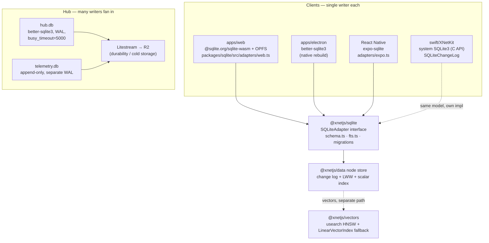
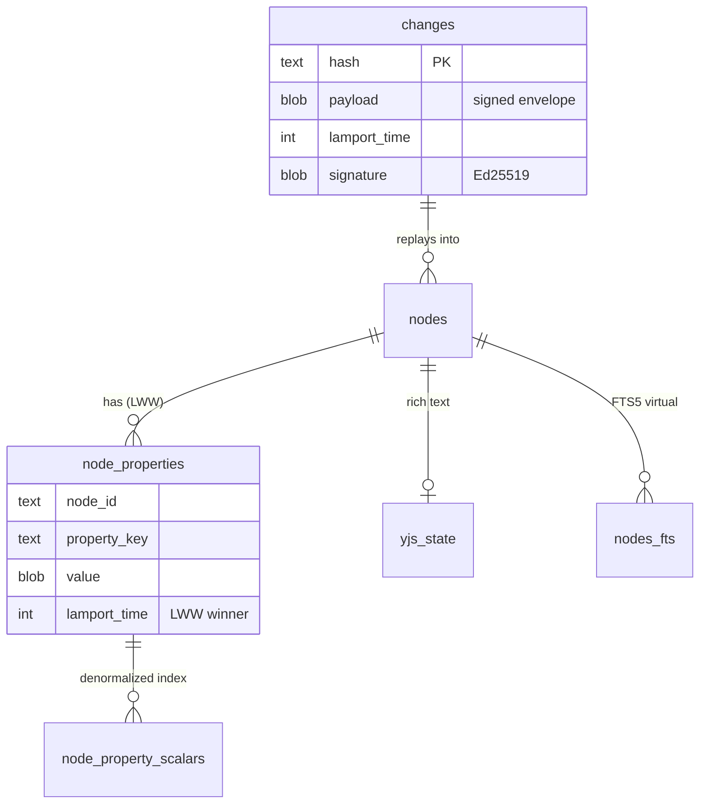
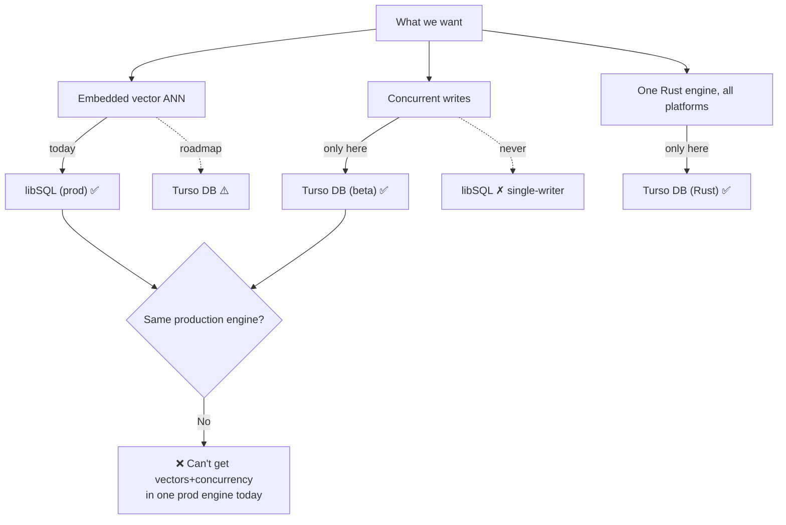
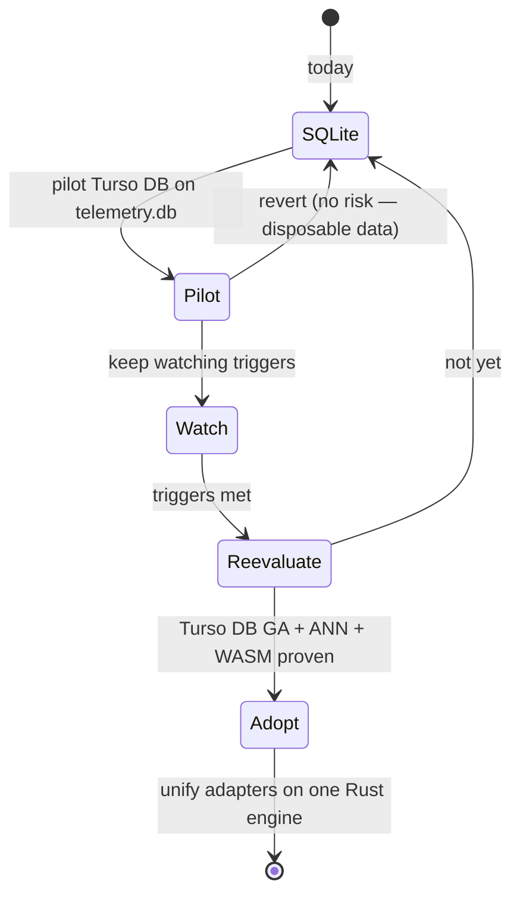

# Turso vs SQLite — On Its Own Merits

> **Status:** Exploration
> **Date:** 2026-06-23
> **Author:** Claude
> **Tags:** sqlite, turso, libsql, limbo, better-sqlite3, wa-sqlite, opfs, vectors, fts5,
> mvcc, concurrent-writes, change-log, crdt, storage-engine, portable-core, decision

## Problem Statement

We store everything on **SQLite** — across five runtimes, behind one adapter layer
([`@xnetjs/sqlite`](../../packages/sqlite)). [Turso](https://turso.tech) keeps coming up as the
"next SQLite," and it now ships three things SQLite proper doesn't: an **embedded vector database**,
**concurrent writes** (true multi-writer MVCC), and a **pure-Rust engine** that targets native +
WASM + mobile from one codebase.

We looked at Turso once before — [exploration 0178](./0178_[_]_COST_EFFICIENT_SQLITE_HOSTING_NO_LIBSQL_MIGRATION.md)
— but that was a **hosting-economics** decision (scale-to-zero per-tenant hubs), and it concluded
"stay on `better-sqlite3` + Litestream, no libSQL." That verdict was correct *for that question* and
says nothing about Turso's engine-level merits.

This exploration re-opens the question **purely on technical merits**: does Turso's feature set
(vectors, write concurrency, Rust portability, a new FTS engine) justify switching the storage
substrate of a local-first, CRDT-log application — and what would we lose (FTS5, R-Tree/GIS, a
battle-tested ecosystem)?

## Executive Summary

**Recommendation: Do not migrate the durable storage engine now. Keep SQLite. But run one bounded,
throwaway pilot of Turso Database on the hub's `telemetry.db`, and set explicit re-evaluation
triggers.** This is a "not yet, and here's exactly what would change our mind" — not a flat no.

Five findings drive this:

1. **"Turso" is two products, and the two features you want live in different ones.**
   - **libSQL** (a C fork of SQLite; *production-ready*) has the **embedded vector ANN index**
     (`F32_BLOB` + `vector_top_k`, DiskANN-based) and keeps **FTS5**. It does **not** have concurrent
     writes — it's still single-writer SQLite.
   - **Turso Database** (formerly *Limbo*; a from-scratch **Rust rewrite**; *beta*) has **concurrent
     writes** (MVCC, `PRAGMA journal_mode='mvcc'`) and a first-class **WASM** target — but its vector
     support is **exact/brute-force only; the ANN index is still on the roadmap**, and it **replaces
     FTS5 with a Tantivy engine** (different syntax). It ships with a "use caution with production
     data" beta banner.

   You cannot get *embedded vector ANN* **and** *concurrent writes* in **one production-ready engine
   today**. ([Turso roadmap post](https://turso.tech/blog/upcoming-changes-to-the-turso-platform-and-roadmap))

2. **xNet barely uses SQLite as a relational database.** Our schema is an append-only, signed,
   hash-chained **change log** with per-property **LWW** convergence and a *denormalized* scalar index
   for queries ([`packages/sqlite/src/schema.ts`](../../packages/sqlite/src/schema.ts)). The graph
   walks, ranking, and CRDT merge happen in **TypeScript/Rust**, not in SQL. The engine is essentially
   a durable B-tree + an index we rebuild. That makes most of Turso's relational/query advances
   (window functions, query planner, concurrent *relational* writes) low-leverage for us — and makes
   the migration cost (five platform adapters, FTS rewrite) high relative to the payoff.

3. **Concurrency only bites at the hub, and we already mitigate it.** Every *client* is a single
   writer (one human). Only the **hub** fans in writes from many peers, and it already runs WAL +
   `busy_timeout=5000` and splits hot append traffic into a second database
   ([`packages/hub/src/storage/sqlite.ts:751`](../../packages/hub/src/storage/sqlite.ts),
   [`packages/hub/src/telemetry/store.ts`](../../packages/hub/src/telemetry/store.ts)). MVCC would help
   *there* — which is exactly why the telemetry DB is the right pilot — but it's not a client win.

4. **The real, recurring pain is vectors-in-WASM, not the SQL engine.** `usearch` (native HNSW) breaks
   the Vite web build, so the web path falls back to `LinearVectorIndex`
   ([`packages/vectors/src/hnsw.ts`](../../packages/vectors/src/hnsw.ts), gotcha from
   [0211](./0211_[x]_AI_SECOND_BRAIN_GRAPHRAG_MEMORY_AND_TIERING.md)). An in-engine vector index that
   also compiles to WASM would be elegant — but **Turso Database's ANN index isn't shipped**, and
   libSQL's vector index doesn't run in the browser. So Turso doesn't actually solve our specific pain
   *today*. The opt-in `@xnetjs/vectors` design already neutralizes it.

5. **What we'd lose is real but mostly unused.** **FTS5** → Turso DB's Tantivy FTS is a *rewrite* of
   [`packages/sqlite/src/fts.ts`](../../packages/sqlite/src/fts.ts) and the `nodes_fts` virtual table
   ([`schema.ts:279`](../../packages/sqlite/src/schema.ts)), not a drop-in (different DDL, `fts_match()`
   instead of `MATCH`). **R-Tree / GIS**: SQLite ships `rtree`; Turso DB doesn't — but we use **no**
   spatial features today, so it's a future-option loss, not a present one. The bigger loss is the
   **mature ecosystem**: `better-sqlite3`, `sql.js`, `expo-sqlite`, and Apple's system SQLite are all
   boringly reliable; Turso DB is one beta engine replacing four hardened ones.

The strategically interesting story is **#2 inverted**: Turso Database is **pure Rust**, and we are
already building a pure-Rust portable kernel (`rust/xnet-core`, UniFFI ambitions in
[0210](./0210_[_]_NATIVE_SWIFT_SDK_AND_PORTABLE_MULTI_LANGUAGE_CORE.md)). A single Rust storage engine
that compiles to native + WASM + iOS + Android could one day collapse our **five** storage adapters
into **one**. That is a genuine long-term prize — but it is a bet on beta software for *durable user
data*, which is the one place we should be most conservative. Hence: track it, pilot it where data is
disposable, don't migrate the substrate.

## Current State In The Repository

xNet uses SQLite the same way everywhere — as the on-disk home for an **immutable change log** plus a
**materialized index** — but reaches it through a different binding per runtime, all funneled through
the [`@xnetjs/sqlite`](../../packages/sqlite) adapter interface.



### The data model is a change log, not relational tables

[`packages/sqlite/src/schema.ts`](../../packages/sqlite/src/schema.ts) (schema v6) defines:

- **`changes`** — append-only, signed (`Ed25519`), hash-chained envelopes with a Lamport clock. The
  source of truth.
- **`nodes`** / **`node_properties`** — materialized node identity and **per-property LWW** values
  (the property with the highest `lamport_time` wins).
- **`node_property_scalars`** — a *denormalized* index (`value_text` / `value_number` / `value_boolean`)
  rebuilt for query acceleration. Not the source of truth.
- **`yjs_state` / `yjs_updates` / `yjs_snapshots`** — binary Y.Doc state for rich-text nodes.
- **`query_descriptor_stats` / `query_index_candidates` / `node_query_materializations`** — adaptive,
  self-built indexes for hot queries.



The Swift SDK mirrors the exact model with its own C-API implementation
([`swift/XNetKit/Sources/XNetKit/Persistence.swift`](../../swift/XNetKit/Sources/XNetKit/Persistence.swift):
`SQLiteChangeLog`, `changes(hash, node_id, lamport, data)`), and the Rust kernel
([`rust/xnet-core`](../../rust/xnet-core)) does the convergence math with **no** persistence at all.
**Takeaway:** SQL features (joins, window functions, the planner, relational concurrency) are not where
our value is; durability, a fast index, and FTS are.

### Full-text search (FTS5)

[`packages/sqlite/src/schema.ts:279`](../../packages/sqlite/src/schema.ts) creates a
`nodes_fts USING fts5(node_id, title, content, tokenize='porter unicode61')` virtual table;
[`packages/sqlite/src/fts.ts`](../../packages/sqlite/src/fts.ts) wraps `MATCH`, snippets, `optimize`,
and rebuilds, and **degrades to a no-op on `sql.js`** (which lacks FTS5). This is the search spine
behind the AI surface and `searchNodes`.

### Vectors (the actual sore spot)

[`packages/vectors/src/hnsw.ts`](../../packages/vectors/src/hnsw.ts) dynamically imports `usearch`
(native HNSW) and **falls back to a hand-rolled `LinearVectorIndex`** when the native binding is
absent — which on the web build it always is, because `usearch`'s `node:fs` import breaks the Vite
browser bundle (the [0211](./0211_[x]_AI_SECOND_BRAIN_GRAPHRAG_MEMORY_AND_TIERING.md) gotcha).
Embeddings are stored as **blobs**, *not* in a SQLite vector table — there is no `sqlite-vec` today.

### Concurrency posture

Clients are single-writer. The hub uses WAL + `busy_timeout=5000`
([`packages/hub/src/storage/sqlite.ts:751`](../../packages/hub/src/storage/sqlite.ts)), hands WAL
checkpointing to Litestream under replication, and isolates high-volume append traffic in a **second**
database ([`telemetry.db`](../../packages/hub/src/telemetry/store.ts)) precisely to keep it off the
single app writer. Cloud replication lives in
[`packages/cloud/src/provisioner/adapters/cloud-run-litestream.ts`](../../packages/cloud/src/provisioner/adapters/cloud-run-litestream.ts).

### Spatial / GIS

**None.** No `spatialite`, no `rtree`, no lat/lng columns anywhere. Confirmed by search.

## External Research

### Turso is two products — this is the whole ballgame

The Turso team is explicit ([roadmap post](https://turso.tech/blog/upcoming-changes-to-the-turso-platform-and-roadmap),
[penberg on X](https://x.com/penberg/status/2032373944007688226)):

- **libSQL** — an **open-contribution fork of SQLite** (still C). *Production-ready.* Adds server mode,
  embedded replicas, encryption at rest, and **native vector search**. Keeps everything SQLite has,
  including **FTS5** and **R-Tree**. **Single-writer** (inherits SQLite's write model).
- **Turso Database** (formerly **Limbo**) — a **from-scratch rewrite in Rust**. *Beta* (v0.6.1, May
  2026). Adds **MVCC concurrent writes**, async I/O (io_uring on Linux), a first-class **WASM/browser**
  target, and a **Tantivy-based FTS**. "Rewriting SQLite in Rust … **replaces libSQL as our intended
  direction**." New features land in Turso Database; libSQL is maintained but in care-and-maintenance
  mode.

Their own guidance: *"If you're starting a new project, we recommend Turso Database. For
mission-critical workloads that need a battle-tested foundation today, libSQL is the right choice."*

### The features, mapped to the right product

| Capability | SQLite (today) | **libSQL** (prod) | **Turso DB / Limbo** (beta) |
|---|---|---|---|
| Embedded **vector ANN** index | ✗ (we use `usearch`) | ✅ `F32_BLOB` + `vector_top_k` (DiskANN) | ⚠️ **exact/brute-force only; ANN index is roadmap** |
| **Concurrent writes** (multi-writer) | ✗ single-writer | ✗ single-writer | ✅ MVCC, `journal_mode='mvcc'` (beta) |
| **Full-text search** | ✅ FTS5 | ✅ FTS5 | ⚠️ **Tantivy, not FTS5** — `USING fts`, `fts_match()`/`fts_score()` (BM25, arguably better, but a rewrite) |
| **R-Tree / GIS** | ✅ `rtree` (+ SpatiaLite ext) | ✅ `rtree` | ✗ not supported |
| **WASM / browser** | ✅ official `sqlite-wasm` (we use it) | ⚠️ weak browser story | ✅ first-class WASM target |
| **Pure Rust** (one engine, all platforms) | ✗ | ✗ (C) | ✅ native + WASM + iOS/Android |
| **Encryption at rest** | ext only | ✅ | ⚠️ experimental |
| `WITH RECURSIVE`, full window fns, partial indexes | ✅ | ✅ | ⚠️ partial / not yet (`COMPAT.md`) |
| Production maturity | ✅✅✅ decades | ✅ prod | ⚠️ **beta — "use caution with production data"** |
| Official **mobile** SDKs | DIY (we use system SQLite) | ✅ `libsql-swift`, `libsql-android` (FFI over Rust core) | (via libSQL SDKs today) |

Sources: [Turso vector](https://turso.tech/vector) ·
[Beyond FTS5 (Tantivy)](https://turso.tech/blog/beyond-fts5) ·
[Concurrent writes](https://turso.tech/blog/beyond-the-single-writer-limitation-with-tursos-concurrent-writes) ·
[Single-writer explainer](https://betterstack.com/community/guides/databases/turso-explained/) ·
[Turso in the Browser](https://turso.tech/blog/introducing-turso-in-the-browser) ·
[Mobile SDKs](https://turso.tech/blog/turso-goes-mobile-with-official-ios-and-android-sdks) ·
[Turso DB GitHub](https://github.com/tursodatabase/turso) (MIT, `@tursodatabase/database`).

### The decision trap, visualized



### The genuinely attractive long-term angle

Turso Database is **MIT-licensed pure Rust**, installs as `@tursodatabase/database` in Node, and has a
real WASM/browser build. xNet already has a Rust kernel (`rust/xnet-core`) and a stated goal of a
portable multi-language core ([0210](./0210_[_]_NATIVE_SWIFT_SDK_AND_PORTABLE_MULTI_LANGUAGE_CORE.md))
with UniFFI bindings to Swift/Kotlin/.NET. A single Rust storage engine, exposed the same way, is the
*only* path that could unify `better-sqlite3` + `sqlite-wasm/OPFS` + `expo-sqlite` + Apple's system
SQLite into one implementation. That is strategically aligned — it just isn't ready.

## Key Findings

1. **The headline features are split across two products; one of them (Turso DB) is beta.** Adopting
   "Turso" is not one decision — it's "libSQL *or* Turso Database," and they buy different things.
2. **Embedded vector ANN — the thing that sounds most compelling — is not shipped in the Rust engine**
   (exact search only; ANN index is roadmap). The production ANN index is a **libSQL** feature, and
   libSQL doesn't run well in the browser, where our actual vector pain lives.
3. **Concurrent writes are real but localized.** Only the hub is multi-writer, and it's already
   mitigated. MVCC is a hub optimization, not a product-wide unlock.
4. **We don't lean on SQL.** A CRDT change log + denormalized index doesn't cash in window functions,
   the planner, or relational concurrency. Migration cost is high; relational payoff is low.
5. **FTS5 is a migration cost, not a feature win.** Turso DB's Tantivy FTS is arguably *better* (BM25,
   in-file index) but requires rewriting [`fts.ts`](../../packages/sqlite/src/fts.ts) and the FTS DDL,
   and forks behavior from the libSQL/SQLite path we'd keep on other surfaces.
6. **GIS loss is theoretical.** We use zero spatial features; losing `rtree` costs nothing today but
   closes a door (e.g., a future map/geo lens) that plain SQLite/libSQL keeps open.
7. **The strongest case is portability, and it's a future bet.** One Rust engine across all runtimes is
   the prize — but cashing it in means trusting beta software with durable user data.

## Options And Tradeoffs

### Option A — Stay on SQLite (status quo, hardened) — **recommended baseline**
Keep the five adapters, FTS5, Litestream. Solve vector-in-WASM inside `@xnetjs/vectors` (already
opt-in). **Pros:** zero risk, zero migration, no data-loss exposure. **Cons:** no concurrent writes; no
in-engine vectors; the five-adapter sprawl persists.

### Option B — Full migration to **Turso Database** (Rust) everywhere
Replace all adapters with `@tursodatabase/database` (+ WASM build). **Pros:** one Rust engine; MVCC;
WASM-native; aligns with `xnet-core`. **Cons:** **beta engine for durable user data**; FTS5 rewrite;
no ANN index yet; `rtree`/`WITH RECURSIVE`/some window fns/partial indexes missing; abandons four
hardened bindings at once. **Verdict: premature and high-risk.**

### Option C — Adopt **libSQL** (at the hub, or as the embedded vector store)
Use libSQL for `vector_top_k` and embedded replicas. **Pros:** production-ready vectors + FTS5 kept;
official mobile SDKs. **Cons:** **no concurrent writes** (the headline want is absent); vector index
doesn't help the browser; [0178](./0178_[_]_COST_EFFICIENT_SQLITE_HOSTING_NO_LIBSQL_MIGRATION.md)
already showed libSQL's hosting premium and that Litestream covers replication. **Verdict: marginal —
it buys an in-DB vector path we don't need and forks the storage layer.**

### Option D — **Stay on SQLite + one disposable Turso DB pilot + re-eval triggers** — **recommended**
Keep durable storage on SQLite (Option A). Pilot **Turso Database** on the hub's **`telemetry.db`** —
append-only, write-heavy, *disposable* (exactly where MVCC shines and where beta risk is acceptable
because it isn't user data). Measure concurrent-write throughput and operational behavior. Track Turso
DB's ANN index + WASM maturity against named triggers (below). **Pros:** real signal, zero durable-data
risk, keeps the strategic door open. **Cons:** a little throwaway integration work. **Verdict: best
risk-adjusted path.**



## Recommendation

**Adopt Option D.** Concretely:

1. **Do not touch the durable storage engine.** SQLite stays for `@xnetjs/data`, all client adapters,
   the Swift SDK, and `hub.db`. Keep FTS5 and Litestream.
2. **Run one bounded pilot:** swap **`telemetry.db`** (and only that) to `@tursodatabase/database`
   behind a `HUB_TELEMETRY_ENGINE=turso` flag. Benchmark concurrent-write throughput vs the current
   single-writer path under realistic fan-in. It's append-only and disposable, so a bug costs nothing.
3. **Solve the real pain where it lives:** keep improving the **`@xnetjs/vectors`** WASM story
   (the `usearch` fallback) — that's a vector-tier problem, not a reason to swap the SQL engine.
4. **Set re-evaluation triggers** (revisit when **any two** hold):
   - Turso Database ships a **vector ANN index** (not just exact search) **and** exits beta (GA).
   - The Turso DB **WASM/OPFS** build is proven viable as a drop-in for our web adapter.
   - We hit a **measured** hub write-concurrency ceiling that WAL + `busy_timeout` + split DBs can't
     absorb.
   - The **`xnet-core` portability** effort reaches the point where collapsing five storage adapters
     into one Rust engine is worth a coordinated migration.
5. **Record the decision** so the next person doesn't re-litigate it cold (this doc + a short note in
   the `@xnetjs/sqlite` README pointing at it).

This keeps us boring where it matters (durable user data) and lets us learn where it's cheap (throwaway
telemetry), without betting the substrate on beta software.

## Example Code

A flag-gated, disposable telemetry pilot — the only place we'd let a beta engine near a write path:

```ts
// packages/hub/src/telemetry/engine.ts  (illustrative)
import { type SqliteLike } from '../storage/sqlite-like'

export async function openTelemetryEngine(path: string): Promise<SqliteLike> {
  if (process.env.HUB_TELEMETRY_ENGINE === 'turso') {
    // Beta engine — telemetry.db is append-only and disposable, so this is safe to trial.
    const { connect } = await import('@tursodatabase/database')
    const db = await connect(path)
    db.exec(`PRAGMA journal_mode = 'mvcc'`) // true concurrent writes (Turso DB beta)
    return adaptTurso(db)
  }
  // Default: the hardened path stays exactly as is.
  const Database = (await import('better-sqlite3')).default
  const db = new Database(path)
  db.pragma('journal_mode = WAL')
  db.pragma('busy_timeout = 5000')
  return adaptBetterSqlite3(db)
}
```

```ts
// Bench harness sketch: many writers fan in (the hub's real shape).
await Promise.all(
  Array.from({ length: 8 }, (_, w) =>
    burstAppend(engine, { writer: w, rows: 25_000 }),
  ),
) // compare rows/sec + lock errors: WAL single-writer vs MVCC concurrent.
```

If we ever *did* want in-engine vectors, that path is **libSQL**, and it looks like this (for contrast —
note it doesn't help the browser, where our pain is):

```sql
-- libSQL native vector ANN (production), NOT Turso DB:
CREATE TABLE memory (id TEXT PRIMARY KEY, embedding F32_BLOB(384));
CREATE INDEX memory_idx ON memory (libsql_vector_idx(embedding));
SELECT id FROM vector_top_k('memory_idx', vector32(?), 10);
```

## Risks And Open Questions

- **Beta durability risk.** Turso DB's own banner says "use caution with production data." Restricting
  the pilot to disposable telemetry contains this; never let it touch `changes`/`nodes` until GA.
- **FTS divergence.** If we ever adopt Turso DB more broadly, `fts.ts` forks (`MATCH` → `fts_match()`);
  do we maintain two FTS code paths during any transition? (Pilot avoids this entirely.)
- **WASM reality check.** Turso-in-the-browser is announced; is it production-grade with OPFS
  persistence and our bundle size budget? Unproven for us — a trigger, not an assumption.
- **ANN timeline.** Turso DB's vector ANN index is roadmap with no committed date. The whole "embedded
  vector DB" appeal is gated on it.
- **Mixed-engine byte compatibility.** Turso DB claims SQLite *file-format* compatibility, but we rely
  on FTS5 shadow tables and specific pragmas; a "compatible" file isn't a "behaves identically" file.
- **Two-engine maintenance.** Even a small pilot adds a dependency surface (`@tursodatabase/database`)
  and a second mental model for on-call. Keep it flag-gated and reversible.
- **Open question:** is the hub write path *actually* contended at our current and projected scale, or
  is MVCC solving a problem we don't have yet? The pilot's benchmark should answer this before any
  broader move.

## Implementation Checklist

- [ ] Add this doc's decision to [`packages/sqlite`](../../packages/sqlite) README ("why we're on
      SQLite, when we'd revisit Turso") so it isn't re-litigated cold.
- [ ] Define a minimal `SqliteLike` seam in the hub telemetry layer so the engine is swappable
      ([`packages/hub/src/telemetry/store.ts`](../../packages/hub/src/telemetry/store.ts)).
- [ ] Add `@tursodatabase/database` as an **optional/dev** dependency (dynamic import; never required
      for the default build).
- [ ] Implement `HUB_TELEMETRY_ENGINE=turso` flag + `adaptTurso()` adapter for `telemetry.db` only.
- [ ] Write a fan-in write benchmark (N concurrent writers) comparing WAL single-writer vs
      `journal_mode='mvcc'`; capture rows/sec, p99 latency, lock/`SQLITE_BUSY` counts.
- [ ] Verify Litestream (or a Turso-native equivalent) can still back up the telemetry DB, or document
      that telemetry is acceptably non-durable.
- [ ] Keep durable storage (`@xnetjs/data`, `hub.db`, client adapters, Swift) untouched.
- [ ] Continue the `@xnetjs/vectors` WASM-fallback work as the real fix for vector-in-browser.
- [ ] File the four re-evaluation triggers somewhere durable (this doc + a tracking issue) with owners.

## Validation Checklist

- [ ] **No durable-data exposure:** grep confirms Turso DB is reachable *only* from the telemetry path;
      `changes`/`nodes`/`node_properties` never touch it.
- [ ] **Reversible:** flipping `HUB_TELEMETRY_ENGINE` back to default restores identical behavior;
      pilot leaves no schema residue in the durable DBs.
- [ ] **Benchmark is decisive:** the fan-in benchmark shows a *measured* throughput delta (or shows
      there's no contention to solve) — a number, not a vibe.
- [ ] **Default build unaffected:** web/electron/CI bundles don't pull `@tursodatabase/database`;
      bundle size and typecheck (`xnet-web#build`) unchanged.
- [ ] **FTS untouched:** FTS5 (`nodes_fts`) and `searchNodes` behavior unchanged; no FTS regressions.
- [ ] **Triggers documented:** the conditions under which we'd revisit are written down with owners, so
      the re-evaluation is event-driven, not forgotten.

## References

### Internal
- [`packages/sqlite/src/schema.ts`](../../packages/sqlite/src/schema.ts) — change-log + LWW schema, FTS5 DDL (`nodes_fts`, line 279)
- [`packages/sqlite/src/fts.ts`](../../packages/sqlite/src/fts.ts) — FTS5 wrapper (`MATCH`, snippets), `sql.js` no-op fallback
- [`packages/sqlite/src/adapters/web.ts`](../../packages/sqlite/src/adapters/web.ts) — `sqlite-wasm` + OPFS web adapter
- [`packages/vectors/src/hnsw.ts`](../../packages/vectors/src/hnsw.ts) — `usearch` HNSW + `LinearVectorIndex` fallback
- [`packages/data/src/store/sqlite-adapter.ts`](../../packages/data/src/store/sqlite-adapter.ts) — node store over SQLite
- [`packages/hub/src/storage/sqlite.ts`](../../packages/hub/src/storage/sqlite.ts) — `better-sqlite3`, WAL, `busy_timeout=5000` (line 751), WAL recovery
- [`packages/hub/src/telemetry/store.ts`](../../packages/hub/src/telemetry/store.ts) — separate `telemetry.db` (the pilot target)
- [`packages/cloud/src/provisioner/adapters/cloud-run-litestream.ts`](../../packages/cloud/src/provisioner/adapters/cloud-run-litestream.ts) — Litestream → R2 replication
- [`swift/XNetKit/Sources/XNetKit/Persistence.swift`](../../swift/XNetKit/Sources/XNetKit/Persistence.swift) — `SQLiteChangeLog` over system SQLite3
- [`rust/xnet-core`](../../rust/xnet-core) — pure-Rust kernel (no persistence) — portability anchor
- [Exploration 0178 — Cost-Efficient SQLite Hosting (No libSQL Migration)](./0178_[_]_COST_EFFICIENT_SQLITE_HOSTING_NO_LIBSQL_MIGRATION.md) — prior, hosting-economics decision
- [Exploration 0210 — Native Swift SDK & Portable Multi-Language Core](./0210_[_]_NATIVE_SWIFT_SDK_AND_PORTABLE_MULTI_LANGUAGE_CORE.md) — the Rust-core vision Turso DB would align with
- [Exploration 0211 — AI Second Brain GraphRAG, Memory & Tiering](./0211_[x]_AI_SECOND_BRAIN_GRAPHRAG_MEMORY_AND_TIERING.md) — the `usearch`/WASM vector gotcha

### External
- [Turso roadmap: "Upcoming changes to the Turso Platform and Roadmap"](https://turso.tech/blog/upcoming-changes-to-the-turso-platform-and-roadmap) — libSQL vs Turso DB direction
- [Turso Database (Limbo) on GitHub](https://github.com/tursodatabase/turso) — MIT, `@tursodatabase/database`, beta banner, `COMPAT.md`
- [Pekka Enberg: what are Turso / Turso Cloud / libSQL](https://x.com/penberg/status/2032373944007688226)
- [Introducing Limbo: A complete rewrite of SQLite in Rust](https://turso.tech/blog/introducing-limbo-a-complete-rewrite-of-sqlite-in-rust)
- [Beyond the Single-Writer Limitation with Turso's Concurrent Writes (MVCC)](https://turso.tech/blog/beyond-the-single-writer-limitation-with-tursos-concurrent-writes)
- [How Turso Eliminates SQLite's Single-Writer Bottleneck](https://betterstack.com/community/guides/databases/turso-explained/)
- [Beyond FTS5: Tantivy-based full-text search in Turso DB](https://turso.tech/blog/beyond-fts5)
- [Native Vector Search for SQLite (libSQL `F32_BLOB` / `vector_top_k`)](https://turso.tech/vector) · [docs: AI & Embeddings](https://docs.turso.tech/features/ai-and-embeddings)
- [Introducing Turso in the Browser (WASM)](https://turso.tech/blog/introducing-turso-in-the-browser)
- [Turso goes mobile: official iOS & Android SDKs (libSQL-based)](https://turso.tech/blog/turso-goes-mobile-with-official-ios-and-android-sdks)
- [libSQL on GitHub](https://github.com/tursodatabase/libsql)
