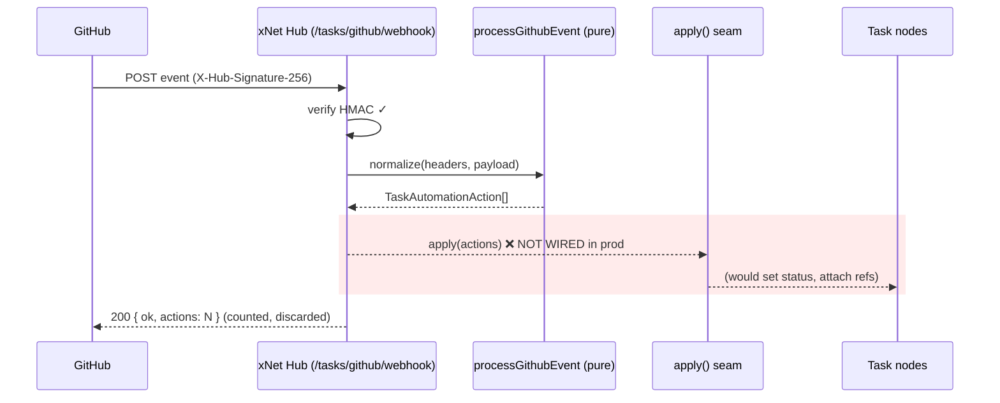
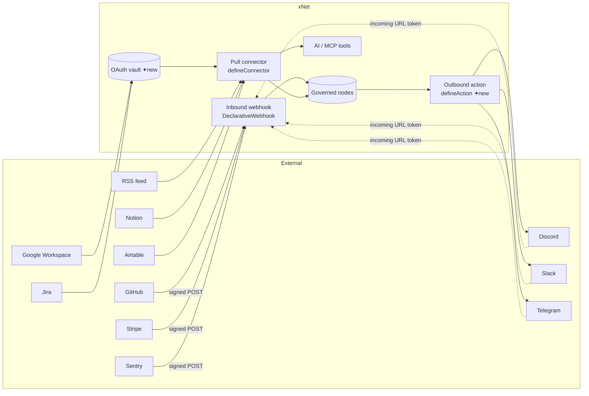
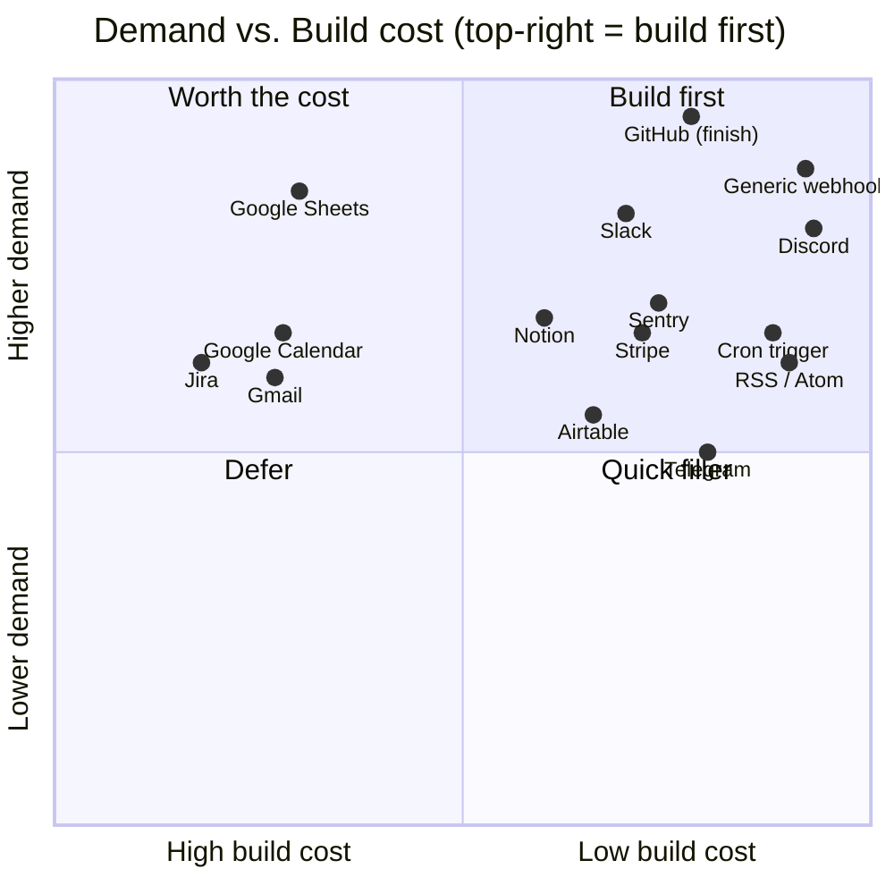
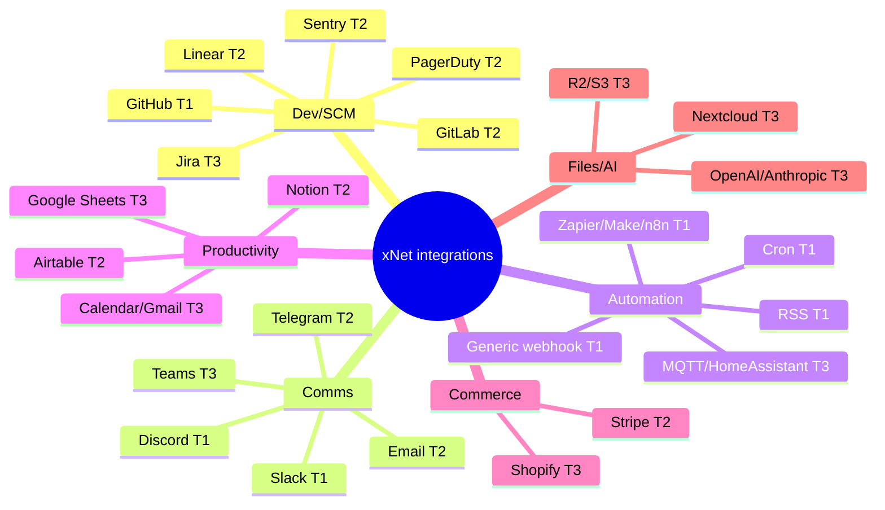
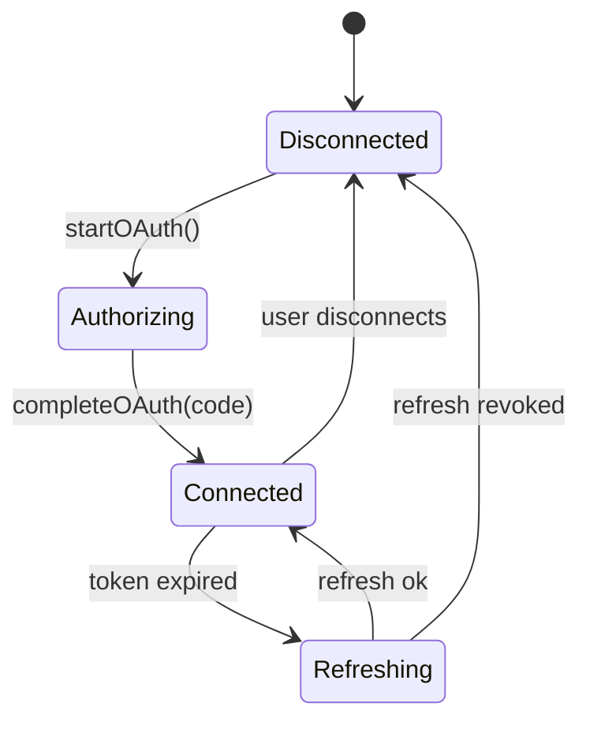

# Integration Plugin Catalog: Webhooks, Connectors, and the Top‑50 Services Worth Building

> Exploration 0213 — what plugins should xNet build next? A prioritized catalog of
> webhook receivers, pull connectors, and outbound actions, grounded in the
> primitives that already exist in the repo and ranked for our earliest users:
> tinkerers, developers, and hobbyists.

## Problem Statement

xNet ships four bundled plugins today — Mermaid, Extra Charts, the Slack
connector, and the Unreal connector (`registry/first-party.json`). That is a
thin catalog for a platform whose pitch to early adopters is "governed,
local‑first, schema‑native, AI‑legible workspace." Our projected first users are
**tinkerers, developers, and hobbyists** — exactly the audience that judges a tool
by its integrations directory. The first question a developer asks is "does it
talk to GitHub?"; the first thing a hobbyist asks is "can I wire it to my own
webhook / Discord / Zapier?"

The request behind this exploration:

1. **Webhooks as a first‑class input** — anyone should be able to POST a webhook
   into xNet and have it *do something* (create a message, a task, a node).
2. **Named service integrations** — GitHub, Stripe, Linear, Google, Discord,
   Sentry, and the long tail of services developers actually use.
3. **A prioritized list** — top 5, top 10, top ~50 — ranked by usefulness to our
   tinkerer/developer/hobbyist audience, *not* a flat alphabetized directory.

This is a **prioritization and roadmap** exploration, not a detailed design of any
one integration. The good news, established below, is that most of the plumbing
already exists — we are mostly choosing what to point it at, and closing one
load‑bearing gap.

## Executive Summary

- **The inbound‑webhook spine already exists.** `DeclarativeWebhook`
  (`packages/hub/src/features/webhooks.ts`) is a clean `verify → normalize →
  apply` shape with correct status codes (503/401/400/200). A GitHub webhook is
  *already wired* through it (`tasksFeature` in
  `packages/hub/src/features/first-party.ts`) and verifies `X‑Hub‑Signature‑256`,
  then normalizes deliveries into `TaskAutomationAction[]`.
- **One load‑bearing gap blocks the whole category.** That GitHub webhook is
  mounted **without an `apply` callback** (`server.ts:828`) — "the normalized
  actions are reported and discarded" because the hub has no
  server‑authoritative node‑write path. **Closing this one seam unlocks every
  inbound webhook integration at once.** It is the single highest‑leverage thing
  in this document.
- **The pull‑connector framework also exists.** `defineConnector`
  (`packages/plugins/src/connectors/define-connector.ts`) +
  `runConnectorSync` give capability‑guarded, space‑stamped, budget‑limited
  pulls. Two consumers ship today (`buildSlackConnector`, `buildUnrealConnector`).
- **One primitive is missing: outbound actions.** xNet can *receive* (webhooks)
  and *pull* (connectors), but there is no first‑class "when X happens in xNet,
  POST to Discord / send an email / hit a webhook" dispatcher. This is the other
  half of the Zapier/Make/n8n story and is cheap to add.
- **OAuth2 is the real cost wall.** Inbound webhooks and API‑key services are
  days of work each (reuse `DeclarativeWebhook` / `defineConnector`). OAuth2
  services (Google Workspace, Jira, Notion‑user‑auth) need a credential‑vault +
  token‑refresh broker that **does not exist yet** — only WorkOS billing identity
  does (`packages/cloud/src/identity/workos.ts`). Defer OAuth until the cheap
  wins are shipped.
- **Recommended first wave (Top 5):** finish **GitHub**, add a **Generic
  Webhook In/Out** ("escape hatch" for Zapier/Make/n8n/IFTTT), **Discord**
  outbound, **Slack** in/out (extend the existing `slack-compat`), and **RSS/Atom**
  pull — plus the enabling **Cron/Scheduled trigger** primitive. All reuse
  existing spines; none needs OAuth.

## Current State In The Repository

xNet already has **three** of the four integration shapes a platform needs. The
fourth (outbound actions) is the main net‑new primitive.

### Shape 1 — Inbound webhooks (`DeclarativeWebhook`)

`packages/hub/src/features/webhooks.ts` defines the canonical receive path:

```ts
export interface DeclarativeWebhook {
  path: string                 // e.g. '/tasks/github/webhook'
  secretRef?: string           // env key with the signing secret; 503 when unset
  verify(rawBody, headers, secret): boolean        // false → 401
  normalize(headers, payload): unknown[]           // pure: delivery → actions
  apply?(actions): Promise<void>                   // optional: mutate nodes
}
```

`mountWebhook` reads the raw body, gates on the broker‑scoped secret, verifies,
parses, normalizes → actions, and optionally applies — with status codes that
match the original hand‑written GitHub route exactly. Features are mounted
through `mountFeatures` (`packages/hub/src/features/registry.ts`), which
**broker‑scopes** each feature's env to its declared `secrets` via `scopedEnv`
(`features/broker.ts`) so a feature can read only its own keys.

**A GitHub webhook is already wired through this** in `tasksFeature`
(`packages/hub/src/features/first-party.ts`):

```ts
webhooks: [{
  path: '/tasks/github/webhook',
  secretRef: 'HUB_GITHUB_WEBHOOK_SECRET',
  verify: (rawBody, headers, secret) =>
    verifyWebhookSignature(secret, rawBody, headers['x-hub-signature-256']),
  normalize: (headers, payload) =>
    processGithubEvent(headers['x-github-event'] ?? '', payload),
  // apply: only present when applyAutomationActions is injected
}]
```

`processGithubEvent` / `verifyWebhookSignature` live in
`packages/hub/src/services/github-integration.ts` (HMAC‑SHA256 via `node:crypto`,
`timingSafeEqual`). The service is **pure** — payloads in, `TaskAutomationAction[]`
out — and already handles PR opened/merged/closed, push, review, and check‑suite
events, parsing magic words (`Fixes XN‑142`) into status transitions.

#### The gap

`server.ts:828` mounts `tasksFeature(taskIdentifiers)` **without** the
`applyAutomationActions` callback. The code comment is explicit:

> the webhook verifies + normalizes deliveries into `TaskAutomationAction[]`, but
> applying them to Task nodes needs server‑authoritative node writes the hub does
> not yet have, so the normalized actions are reported and discarded.



This is the linchpin. The `verify`/`normalize` halves are done and tested; only
the server‑authoritative write path is missing. Every other inbound webhook we
add (Stripe, Sentry, Linear, generic) lands on the same unwired seam — so we
build the seam **once**, then declaring a new webhook is ~30 lines.

### Shape 2 — Token/URL incoming webhooks (`slackCompatFeature`)

`packages/hub/src/features/slack-compat.ts` shows the *un‑signed, URL‑token*
variant — the Slack/Discord "incoming webhook URL" pattern:

- **Tier 0** `POST /slack/services/hooks/:token` — the URL token *is* the
  credential; `resolveHookToken(token)` validates and routes, `deliverMessage`
  materializes a `ChatMessage`.
- **Tier 1** `POST /slack/commands` — verifies `x-slack-signature`
  (`verifySlackSignature`, `packages/slack-compat/src/signature.ts`, **Web
  Crypto** so it is isomorphic), parses the slash command, returns a Slack‑shaped
  response.

The feature is **generic over injected sinks** (`resolveHookToken` /
`deliverMessage` / `handleCommand`) so the hub package has no edge to app logic.
This is the template for "anyone can POST a message in."

### Shape 3 — Pull connectors (`defineConnector`)

`packages/plugins/src/connectors/define-connector.ts` is the *xNet‑pulls‑you*
shape — best for services with a REST API and no useful webhook (RSS, Notion,
Airtable, Google Sheets):

```ts
defineConnector({
  id, name,
  capabilities: { schemaWrite: [...], network: [...], secrets?: [...] },
  sync: { schemas, spaceProperty?, cadence?, pull(ctx) { /* fetch → store */ } },
  agentTools?: [...]
})
```

`runConnectorSync` (`connectors/sync-runner.ts`) composes the guards: `guardedFetch`
(egress limited to declared `network`), `guardStore` (writes limited to
`schemaWrite`, every node force‑stamped to the target `space`), and a
`connector`‑surface write budget (`createConnectorWriteGuardrail`) so a bulk
backfill can't starve the interactive agent. It is mounted via
`connectorSyncFeature` → `POST /x/<id>.sync/run`
(`packages/hub/src/features/connectors.ts`). Helpers exist to turn one definition
into many surfaces: `emitConnectorArtifacts` (marketplace + MCP + SKILL.md),
`connectorAsImporter`, `wrapCliConnector`, and `evaluateConnectorInstall` (an
ai‑generated connector **cannot auto‑hold a secret** — a hard trust gate).

### Shape 4 — Outbound actions (MISSING)

There is **no first‑class primitive** for "xNet event → external HTTP". Connectors
are pull‑only; `agentTools` are model‑facing, not event‑triggered. To deliver the
Zapier/IFTTT half of the story ("when a task closes, POST to Discord / send an
email"), we need a small `defineAction` + dispatcher. This is the main net‑new
abstraction this exploration recommends.

### Connectors → agents, schemas, marketplace

- **Agent tools.** A connector's `agentTools` flow through
  `agentToolsAsExtraTools` into `AiSurfaceService.extraTools`
  (`packages/plugins/src/ai-surface/service.ts`), surfacing for free in in‑app AI,
  the MCP server, and the files‑first skill. So "GitHub connector" also means the
  agent can `github_search_issues` over governed nodes — credential never leaves
  the hub.
- **Schemas.** New node types use `defineSchema` (`packages/data/src/schema/`)
  with property builders (`text/number/money/file/relation/...`) and **must**
  declare `authorization` (usually `spaceCascadeAuthorization()`) or be on
  `AUTH_EXEMPT_SCHEMA_IRIS` — enforced by `authorization-coverage.test.ts`. The
  existing `comms` (`Channel`/`ChatMessage`) and `game.ts` packs are the models
  to copy.
- **Marketplace.** Plugins ship via a thin index: `registry/first-party.json`
  (bundled) + `registry/community.json` (one‑line PR), merged by
  `scripts/build-plugin-index.mjs` into `registry.json`, rendered by
  `MarketplaceView`. A manifest carries `pricing` / `license` / `publisherDid`
  (so integrations can be paid).

### The OAuth gap

There is **no generic third‑party OAuth/credential vault.** WorkOS handles
*billing* identity only (`packages/cloud/src/identity/workos.ts`); connector
secrets are static env keys broker‑scoped by the hub. Any integration needing
**OAuth2 with token refresh** (Google Workspace, Jira, Notion user‑auth, Figma)
requires net‑new infrastructure. This is the dividing line in our prioritization.



## External Research

(Full source list in **References**; synthesized from Standard Webhooks, the 2024
Self‑Hosted Survey n=2,168, Linear/Sentry/n8n/Zapier/Slack directories, Hookdeck's
130‑platform guide, and Nango's OAuth analysis.)

### What developers & hobbyists actually integrate

A handful of services appear in **every** major integration directory (Hookdeck,
n8n, Sentry, Linear, Slack App Directory, Zapier): **GitHub, Slack, Google
(Sheets/Drive/Calendar/Gmail), Discord, Stripe, Jira, Notion.** Ranked signals:

- **Zapier top apps:** Gmail, Slack, Google Sheets, Google Calendar, HubSpot,
  Webhooks by Zapier, Typeform, RSS by Zapier. *Google Sheets connects to ~9,000
  other apps* — the single most cross‑wired integration on the platform.
- **n8n top nodes:** **HTTP Request (the generic connector — its #1 node)**,
  Slack, Google Sheets, Gmail, GitHub, Discord, Notion, Airtable, Webhook
  trigger, OpenAI.
- **Linear's own crafted integrations** (a developer‑PM tool's priorities):
  GitHub, GitLab, Slack, Sentry first; then Figma, Teams, Discord, Notion; then
  Sheets, Zapier, VS Code.
- **Hobbyist/self‑hosted tell:** the 2024 Self‑Hosted Survey puts Home
  Assistant, Sonarr, Jellyfin, Uptime Kuma, Nextcloud on top — and crucially the
  notification sinks are **Discord and Telegram, not Slack.** Hobbyists want
  **generic webhooks, RSS, cron/scheduled triggers, and MQTT.**

The audience split matters for *our* users: **Discord ≫ Slack** for hobbyists and
indie devs; Slack remains mandatory for professional teams. We should not pick one.

### Webhook standards (modern best practice)

The **Standard Webhooks** spec (Apache‑2.0, driven by Svix; adopters include
OpenAI, Anthropic, Twilio, Zapier, PagerDuty, Resend, Render, Clerk) defines a
unified shape: `webhook-id` / `webhook-timestamp` / `webhook-signature` headers,
HMAC‑SHA256 (or Ed25519) over `{id}.{timestamp}.{body}`, a ±5‑minute replay
window, constant‑time comparison, and idempotency by `webhook-id`. Per‑service
conventions all converge on HMAC‑SHA256:

| Service | Header | Signed content |
|---|---|---|
| GitHub | `X-Hub-Signature-256` | raw body |
| Stripe | `Stripe-Signature` | timestamp + raw body |
| Slack | `X-Slack-Signature` | `v0:ts:body` |
| Shopify | `X-Shopify-Hmac-Sha256` | raw body |
| Standard Webhooks | `webhook-signature` | `id.ts.body` |

**Implication:** xNet's `verify(rawBody, headers, secret)` shape is exactly right.
We should ship a small library of `verify` strategies — `githubHmac`,
`stripeHmac`, `standardWebhooks`, `slackV0` (already exists), `urlToken` — and
most new receivers become a one‑line `verify:` choice.

### Auth model → build‑cost tiers

| Auth | Cost | Examples | xNet shape |
|---|---|---|---|
| Incoming webhook URL (you receive) | **Lowest** | Slack/Discord incoming, generic POST | `urlToken` webhook |
| HMAC signed webhook (you verify) | **Low** | GitHub, Stripe, Shopify, Sentry | `DeclarativeWebhook` |
| API key (static) | **Low** | Notion, Airtable, Linear, Sentry, Telegram | `defineConnector` secret |
| OAuth2 (public app) | **High** | Google, Jira, Notion‑user, Figma | **vault — net new** |
| OAuth2 + app‑store review | **Very high** | Slack app, Jira marketplace, Shopify app | defer |

Nango's data: OAuth spans 17 RFCs, every major provider adds nonstandard quirks,
and a 2024 audit found 68% of OAuth implementations had ≥1 vulnerability. This is
why **OAuth is the wall**, and why the first two waves below deliberately avoid it.

## Key Findings

1. **We are ~80% built for inbound webhooks** and discarding the output. Closing
   the `apply` seam is the highest‑ROI move in the whole catalog.
2. **Three reusable shapes already ship**; a fourth (outbound actions) is small.
   Most "integrations" are now *configuration + a mapper*, not new architecture.
3. **The generic webhook is the single most valuable integration** — it is n8n's
   #1 node, it bridges Zapier/Make/IFTTT in one stroke, and it is the cheapest
   thing to build. It should be in the first five.
4. **Build cost is dominated by auth shape, not by the service.** Sorting the
   catalog by `(demand × audience‑fit) ÷ auth‑cost` produces a very different —
   and much cheaper — order than a popularity list. Webhook/API‑key services
   dominate the early waves; OAuth services cluster late.
5. **Our audience skews the list.** Discord, RSS, cron, generic webhooks, and
   self‑hosted sinks (Telegram, Matrix, MQTT, Home Assistant) rank *higher* for
   tinkerers than they would on an enterprise list; HubSpot/Salesforce rank lower.
6. **Connectors double as agent tools and importers for free** — so each
   integration is also an AI capability and a migration path, multiplying value
   per unit of work.

## Options And Tradeoffs

### A. How aggressively to invest in the inbound `apply` seam

| Option | Pros | Cons |
|---|---|---|
| **A1. Minimal hub‑authoritative writer** (recommended) — a narrow server‑side node‑mutation path the webhook `apply` can call, scoped to the synced schemas | Unlocks *all* inbound webhooks; reuses connector guard/budget machinery | Needs a hub identity to author changes; must respect LWW + authorization |
| A2. Forward actions to a connected client to apply | No hub write authority needed | Fragile (requires an online client); not truly server‑side; bad for cron/quiet workspaces |
| A3. Leave discarded, build only pull connectors | Zero new risk | Abandons the cheapest, most‑wanted category (GitHub/Stripe/Sentry inbound) |

A1 is the unlock. The connector path already performs guarded, space‑stamped,
budgeted server‑side writes (`runConnectorSync`); the webhook `apply` should reuse
that same writer rather than inventing a second one.

### B. Outbound actions: new primitive vs. lean on agent tools

A `defineAction({ id, trigger, capabilities:{network}, dispatch(event, ctx) })`
with a guarded `fetch` (reuse `guardedFetch`) and an event source (node‑change
subscription or schedule) cleanly expresses "POST to Discord on task close." The
alternative — making the *agent* call an outbound tool — is non‑deterministic and
costs tokens. Recommendation: **add the small `defineAction` primitive**; it
mirrors the connector shape and reuses the same capability guards.

### C. The prioritization model

Score each candidate:

```
priority = demand(1–5) + audienceFit(1–5) − authCost(1–5)
           (authCost: urlToken=1, hmac=2, apiKey=2, oauth=4, oauth+review=5)
```

This rewards high‑demand, hobbyist‑fit, cheap‑auth services and penalizes the
OAuth wall — matching "ship value to tinkerers fast."



### D. Distribution: first‑party bundled vs. community index

Integrations that hold secrets / write nodes should ship **first‑party bundled**
(`registry/first-party.json`, `evaluateConnectorInstall` forbids ai‑generated
secret‑holders). Pure outbound‑URL actions and mappers are safe to invite as
**community** plugins (one‑line PR to `registry/community.json`). Recommendation:
ship Tiers 1–2 first‑party; open a documented "integration starter" so the
community can add the long tail.

## Recommendation

Ship integrations in **demand‑per‑cost order**, gated on two small enabling
primitives. Build the enabler, then the wave is cheap.

### Phase 0 — Enablers (build once, unlock the rest)

1. **Inbound `apply` writer** — wire `applyAutomationActions` (and a generic
   node‑write equivalent) so `DeclarativeWebhook.apply` can persist. Reuse the
   connector guard/budget/space‑stamp path.
2. **`verify` strategy library** — `githubHmac` (exists), `stripeHmac`,
   `standardWebhooks`, `slackV0` (exists), `urlToken`.
3. **`defineAction` + dispatcher** — outbound HTTP on node‑change/schedule,
   guarded by `network` capability.
4. **Cron/Scheduled trigger** — internal time source feeding both pull connectors
   and actions (also a top‑requested hobbyist feature on its own).

### The Top 5 (first wave — all reuse existing spines, zero OAuth)

| # | Integration | Shape | Auth | Why first |
|---|---|---|---|---|
| 1 | **GitHub** (finish) | inbound webhook + API‑key connector | HMAC | Already 80% built; #1 developer ask; PR/issue → task is the canonical demo |
| 2 | **Generic Webhook In/Out** | inbound `urlToken` + outbound action | url token | The escape hatch — bridges Zapier/Make/n8n/IFTTT; n8n's #1 node |
| 3 | **Discord** | outbound action (+ inbound bot later) | url token | Hobbyist/indie default notification sink; trivial to send |
| 4 | **Slack** | inbound URL + outbound (extend `slack-compat`) | url token / HMAC | Mandatory for pro devs; spine already exists |
| 5 | **RSS / Atom** | pull connector (cron) | none | Zero‑auth, hobbyist‑loved, showcases the connector+cron path |

### The Top 10 (second wave)

| # | Integration | Shape | Auth | Note |
|---|---|---|---|---|
| 6 | **Sentry** | inbound webhook | HMAC/API key | Error → task; pairs with GitHub; universal dev need |
| 7 | **Stripe** | inbound webhook | HMAC | Gold‑standard signature; for builders taking payments |
| 8 | **Notion** | pull connector | API key | Second‑brain rival/complement; no OAuth needed for integration token |
| 9 | **Telegram** | outbound action | bot token | Self‑hoster notification sink (Discord's global twin) |
| 10 | **PagerDuty / Linear** | inbound webhook | API key | On‑call alerts → tasks; Linear cross‑sync for dual users |

### The Top ~50 (full catalog, grouped by category)

Each row is shape / auth‑cost / priority‑tier (T1=wave1, T2=wave2, T3=later,
T4=community/defer). "WH"=inbound webhook, "PULL"=connector, "ACT"=outbound action.

**Dev & Source Control**
- GitHub — WH+PULL / HMAC / **T1**
- GitLab — WH+PULL / HMAC / T2
- Gitea / Forgejo (self‑hosted) — WH / HMAC / T3
- Bitbucket — WH / HMAC / T3
- Sentry — WH / HMAC / **T2**
- Linear — WH+PULL / API key / **T2**
- Jira — PULL / OAuth / T3
- PagerDuty — WH / API key / **T2**
- Datadog / Grafana / Prometheus Alertmanager — WH / API key / T3
- Statuspage / Better Uptime / Uptime Kuma — WH / url token / T3
- Vercel / Netlify / Cloudflare Pages — WH (deploy status) + ACT (deploy hook) / url token / T2
- CircleCI / GitHub Actions / Jenkins — WH / HMAC / T3 (mostly covered by generic)
- npm / Docker Hub / container registries — WH / url token / T4

**Comms & Notifications**
- Discord — ACT (+bot) / url token / **T1**
- Slack — WH+ACT / url token+HMAC / **T1**
- Telegram — ACT / bot token / **T2**
- Microsoft Teams — ACT / url token / T3
- Matrix — ACT / API key / T3 (hobbyist)
- Mattermost / Rocket.Chat — WH+ACT / url token / T3 (self‑hosted)
- Email out (Resend / SendGrid / SMTP) — ACT / API key / **T2**
- Twilio (SMS) — WH+ACT / HMAC / T3

**Automation Bridges (the hobbyist core)**
- Generic Webhook In — WH / url token / **T1**
- Generic Webhook Out — ACT / url token / **T1**
- Cron / Scheduled trigger — internal / none / **T1 (enabler)**
- RSS / Atom — PULL / none / **T1**
- Zapier / Make / n8n / IFTTT — covered by generic WH/ACT / — / **T1** (document recipes)
- MQTT — PULL/ACT / API key / T3 (IoT/home automation)
- Home Assistant — WH+ACT / API key / T3 (self‑hosted flagship)

**Productivity & Docs**
- Notion — PULL / API key / **T2**
- Airtable — PULL / API key / **T2**
- Google Sheets — PULL / OAuth / T3 (highest demand behind the OAuth wall)
- Google Calendar — PULL / OAuth / T3
- Gmail — PULL / OAuth / T3
- Google Drive — PULL / OAuth / T3
- Todoist — PULL / API key / T3
- Trello / Asana — WH+PULL / API key / T4 (Linear/GitHub cover dev PM)
- Confluence — PULL / OAuth / T4
- Obsidian (via Git) — covered by GitHub / — / T3

**Commerce & Payments**
- Stripe — WH / HMAC / **T2**
- Shopify — WH / HMAC / T3 (e‑commerce builders)
- Lemon Squeezy / Paddle / PayPal — WH / HMAC / T4

**Forms, Marketing & CRM**
- Typeform / Google Forms — WH / url token / T3
- Calendly — WH / HMAC / T3
- Mailchimp — WH+PULL / API key / T4
- HubSpot / Salesforce — PULL / OAuth / T4 (enterprise; low tinkerer fit)

**Files, Storage & AI**
- Dropbox — PULL / OAuth / T4
- S3 / Cloudflare R2 — PULL/ACT / API key / T3
- Nextcloud — PULL / API key / T3 (self‑hosted)
- OpenAI / Anthropic webhooks — WH / Standard Webhooks / T3 (batch/async events)
- Hugging Face — WH / HMAC / T4

That is ~55 named services across 7 categories — but note how many collapse onto
**three** receivers (generic WH, `githubHmac`, `standardWebhooks`) and **two**
senders (generic ACT, email). The catalog is large; the *code* is not.



## Example Code

Illustrative only — names and seams chosen to match existing repo conventions.

### 1. Close the inbound `apply` seam (the unlock)

`server.ts` would inject an applier that reuses the guarded, hub‑authoritative
node writer (the same machinery `runConnectorSync` uses):

```ts
// server.ts — wire the previously-discarded actions
mountFeatures([
  billingFeature(),
  tasksFeature(taskIdentifiers, async (actions) => {
    await applyTaskAutomation(actions, {
      store: hubAuthoritativeStore,      // server-side writer
      guardrail: createConnectorWriteGuardrail(),
      resolveShortId: taskIdentifiers.resolve
    })
  }),
  // ...
])
```

### 2. A new declarative webhook is now ~30 lines (Stripe)

```ts
// packages/hub/src/features/stripe.ts
export function stripeFeature(deliver: (e: StripeAction[]) => Promise<void>): HubFeature {
  return {
    id: 'fyi.xnet.stripe',
    secrets: ['STRIPE_WEBHOOK_SECRET'],
    webhooks: [{
      path: '/integrations/stripe/webhook',
      secretRef: 'STRIPE_WEBHOOK_SECRET',
      verify: (raw, h, secret) => verifyStripeSignature(secret, raw, h['stripe-signature']),
      normalize: (_h, payload) => mapStripeEvent(payload),   // pure → StripeAction[]
      apply: deliver
    }]
  }
}
```

### 3. A generic inbound webhook ("anyone can POST")

```ts
// Tier-0 url-token receiver, modeled on slackCompatFeature
export function webhookInboxFeature(ports: {
  resolveToken(token: string): Promise<{ space: string; schema: string } | null>
  deliver(d: { space: string; schema: string; payload: unknown }): Promise<void>
}): HubFeature {
  return {
    id: 'fyi.xnet.webhook-inbox',
    mount({ app }) {
      app.post('/hooks/:token', async (c) => {
        const ctx = await ports.resolveToken(c.req.param('token'))
        if (!ctx) return c.json({ error: 'unknown hook' }, 404)
        await ports.deliver({ ...ctx, payload: await c.req.json() })
        return c.json({ ok: true })
      })
    }
  }
}
```

### 4. A pull connector with zero auth (RSS) — and a free agent tool

```ts
export const rssConnector = defineConnector({
  id: 'fyi.xnet.connector.rss',
  name: 'RSS / Atom',
  capabilities: { schemaWrite: [FEED_ITEM_SCHEMA], network: ['*'] }, // host per feed
  sync: {
    schemas: [FEED_ITEM_SCHEMA],
    cadence: { everyMs: 15 * 60_000 },
    async pull({ fetch, store, space }) {
      const xml = await (await fetch(feedUrl)).text()
      for (const item of parseFeed(xml)) {
        await store.create(FEED_ITEM_SCHEMA, { space, title: item.title, link: item.link })
      }
      return { created: /* ... */ 0 }
    }
  },
  agentTools: [{ id: 'rss.search', name: 'rss_search_items', description: '…', invoke }]
})
```

### 5. The missing outbound‑action primitive (sketch)

```ts
// packages/plugins/src/actions/define-action.ts  (NEW)
export interface ActionDefinition {
  id: string
  trigger: { onSchemaChange?: string[]; onSchedule?: ConnectorCadence }
  capabilities: { network: string[]; secrets?: string[] }
  dispatch(event: NodeChangeEvent, ctx: { fetch: ConnectorFetch; env: Env }): Promise<void>
}

export const discordNotify = defineAction({
  id: 'fyi.xnet.action.discord',
  trigger: { onSchemaChange: [TASK_SCHEMA] },
  capabilities: { network: ['discord.com'], secrets: ['DISCORD_WEBHOOK_URL'] },
  async dispatch(event, { fetch, env }) {
    if (event.kind !== 'status:done') return
    await fetch(env.DISCORD_WEBHOOK_URL!, {
      method: 'POST',
      body: JSON.stringify({ content: `✅ ${event.node.title} done` })
    })
  }
})
```

### 6. OAuth vault interface (the later wall — sketch only)

```ts
// packages/cloud/src/credentials/vault.ts  (NEW, for T3 Google/Jira)
export interface CredentialVault {
  startOAuth(tenant: string, provider: 'google' | 'jira', scopes: string[]): Promise<{ url: string }>
  completeOAuth(tenant: string, provider: string, code: string): Promise<void>
  getAccessToken(tenant: string, provider: string): Promise<string>  // refreshes if expired
}
```



## Risks And Open Questions

- **Hub write authority.** The `apply` seam needs an authenticated hub identity
  that authors changes respecting LWW + schema `authorization`. What DID signs
  hub‑originated changes? (Likely a per‑workspace system identity.) This is the
  one genuinely hard design question; everything else is configuration.
- **Idempotency & retries.** Webhooks redeliver. We need `webhook-id`/event‑id
  dedup before `apply` mutates nodes, or GitHub re‑deliveries double‑apply.
- **Egress on generic outbound actions.** `network: ['*']` for user‑defined
  outbound webhooks is an SSRF surface. Need an allowlist/denylist (block
  internal IPs, metadata endpoints) in `guardedFetch`.
- **Abuse on the inbound inbox.** A public `/hooks/:token` URL invites floods.
  Reuse the `connector`/abuse‑surface budget; rate‑limit per token; make tokens
  revocable.
- **Secrets at rest.** Today connector secrets are env keys. Per‑tenant
  integrations need encrypted per‑tenant credential storage (Firestore vault),
  which doesn't exist yet — couples to the OAuth‑vault work.
- **OAuth maintenance load.** Per Nango, OAuth is an ongoing cost (provider
  quirks, refresh, app review). Budget it as a *project*, not a *plugin*.
- **Scope creep of the catalog.** 55 services is a backlog, not a sprint. The
  risk is building breadth before the `apply` seam + generic webhook prove the
  pattern. Sequence discipline matters more than the list.
- **Open question — connector vs. action overlap.** Some services (GitLab,
  Mattermost, Vercel) want *both* directions. Do we ship paired modules, or one
  bidirectional module? Recommend paired (one `Feature`, two declarations).

## Implementation Checklist

**Phase 0 — enablers**
- [ ] Design + implement the hub‑authoritative node writer (DID/identity, LWW,
      authorization‑respecting) reusing `runConnectorSync` guards.
- [ ] Wire `tasksFeature(..., applyAutomationActions)` in `server.ts` so GitHub
      automation actually mutates Task nodes (close the documented gap).
- [ ] Add a `verify` strategy library: `stripeHmac`, `standardWebhooks`,
      `urlToken` (reuse existing `githubHmac`, `slackV0`).
- [ ] Add idempotency: event‑id dedup table before `apply`.
- [ ] Implement `webhookInboxFeature` (`/hooks/:token`) with revocable tokens +
      per‑token budget.
- [ ] Implement `defineAction` + dispatcher (node‑change subscription) with
      `guardedFetch` and an SSRF denylist.
- [ ] Implement a Cron/Scheduled trigger source feeding connectors + actions.

**Phase 1 — Top 5**
- [ ] GitHub: confirm `processGithubEvent` coverage; add API‑key pull connector +
      `github_*` agent tools; first‑party registry entry.
- [ ] Generic Webhook In (inbox) + Out (action) with a recipe doc for
      Zapier/Make/n8n/IFTTT.
- [ ] Discord outbound action (`DISCORD_WEBHOOK_URL`).
- [ ] Slack in/out: extend `slack-compat` with an outbound action; document
      incoming‑webhook + slash‑command setup.
- [ ] RSS/Atom pull connector (cron cadence) + `FeedItem` schema with
      `spaceCascadeAuthorization()` + authorization‑coverage test.
- [ ] `registry/first-party.json` entries + `MarketplaceView` categories
      ("Integrations").

**Phase 2 — Top 10**
- [ ] Sentry inbound webhook → task.
- [ ] Stripe inbound webhook (`stripeFeature`).
- [ ] Notion pull connector (integration‑token API key).
- [ ] Telegram outbound action (bot token).
- [ ] PagerDuty inbound + Linear cross‑sync.
- [ ] Email outbound action (Resend/SendGrid/SMTP).

**Phase 3 — OAuth wall (separate project)**
- [ ] Build `CredentialVault` (per‑tenant encrypted storage + refresh).
- [ ] Google OAuth foundation → Sheets, Calendar, Gmail, Drive connectors.
- [ ] Jira connector.

**Distribution**
- [ ] Publish an "Integration starter" template + docs so the community can add
      long‑tail services via one‑line `registry/community.json` PRs.
- [ ] Document the trust gate (`evaluateConnectorInstall`): secret‑holders ship
      first‑party; URL‑token actions/mappers can be community.

## Validation Checklist

- [ ] A real GitHub PR titled `Fixes XN‑142` against a connected repo flips the
      Task to `done` (end‑to‑end through the new `apply` seam).
- [ ] Re‑delivering the same GitHub webhook does **not** double‑apply (idempotency
      proven).
- [ ] A `curl` POST to `/hooks/<token>` creates a node in the right space; a
      revoked token returns 404; a flood is rate‑limited.
- [ ] Closing a task fires the Discord action and a message appears in the channel.
- [ ] A generic outbound webhook to an internal IP / metadata endpoint is blocked
      (SSRF denylist).
- [ ] An RSS connector run creates `FeedItem` nodes, respects the
      `connector` write budget, and stamps the correct `space`.
- [ ] `authorization-coverage.test.ts` passes with every new schema declared.
- [ ] Each new connector's `agentTools` appear in the MCP `tools/list` and in
      in‑app AI (proves the free agent‑surface wiring).
- [ ] Stripe/Sentry signed webhooks reject tampered bodies (401) and accept valid
      ones (200) — verified with captured real payloads.
- [ ] New integrations render under an "Integrations" category in
      `MarketplaceView` and install through the consent gate.

## References

**xNet code**
- `packages/hub/src/features/webhooks.ts` — `DeclarativeWebhook` + `mountWebhook`
- `packages/hub/src/features/first-party.ts` — `tasksFeature` (GitHub webhook, **apply unwired**), `billingFeature`, `unfurlFeature`
- `packages/hub/src/services/github-integration.ts` — `processGithubEvent`, `verifyWebhookSignature`, `TaskAutomationAction`
- `packages/hub/src/features/slack-compat.ts` — Tier‑0 URL‑token + Tier‑1 signed slash commands
- `packages/slack-compat/src/signature.ts` — `verifySlackSignature` (Web Crypto, isomorphic)
- `packages/hub/src/features/registry.ts` / `broker.ts` — `mountFeatures`, `scopedEnv`
- `packages/plugins/src/connectors/define-connector.ts` — `defineConnector`
- `packages/plugins/src/connectors/sync-runner.ts` — `runConnectorSync` (guarded/budgeted/space‑stamped)
- `packages/plugins/src/connectors/{slack-migration,artifacts,cli-wrap,install-gate}.ts` — connector helpers
- `packages/unreal/src/connector.ts` — second `defineConnector` consumer
- `packages/plugins/src/agent-tools.ts`, `ai-surface/service.ts` — agent‑tool merge into AI/MCP
- `packages/data/src/schema/` — `defineSchema`, property builders, `spaceCascadeAuthorization`, `authorization-coverage.test.ts`
- `registry/{first-party,community,blocked}.json`, `scripts/build-plugin-index.mjs`, `apps/web/src/components/MarketplaceView.tsx`
- `packages/cloud/src/identity/workos.ts` — only existing OAuth (billing identity, not third‑party)
- Prior explorations: 0196 (agent‑native connectors), 0198 (Slack‑compat), 0200 (Unreal interop), 0201 (plugins marketplace)

**External**
- Standard Webhooks spec — https://github.com/standard-webhooks/standard-webhooks/blob/main/spec/standard-webhooks.md · https://www.standardwebhooks.com/
- Svix verifying payloads — https://docs.svix.com/receiving/verifying-payloads/how-manual
- Hookdeck platform guides (130+ services) — https://hookdeck.com/webhooks/platforms
- GitHub webhooks — https://docs.github.com/en/webhooks/about-webhooks
- Stripe signatures — https://stripe.com/docs/webhooks/signatures
- webhooks.fyi HMAC — https://webhooks.fyi/security/hmac
- Nango "Why OAuth is still hard" — https://nango.dev/blog/why-is-oauth-still-hard/
- Linear crafted integrations — https://linear.app/integrations/linear-crafted
- Sentry integrations — https://sentry.io/integrations/
- n8n 2024 in review — https://blog.n8n.io/2024-in-review/
- Zapier apps directory — https://zapier.com/apps
- ClickUp top Slack apps — https://clickup.com/blog/slack-app-directory/
- Self‑Hosted Survey 2024 — https://selfhosted-survey-2024.deployn.de/
- awesome‑webhooks — https://github.com/realadeel/awesome-webhooks
- PagerDuty integrations — https://www.pagerduty.com/integrations/
- IFTTT RSS + Webhooks — https://ifttt.com/connect/feed/maker_webhooks
- FeedCord (RSS→Discord) — https://github.com/Qolors/FeedCord
