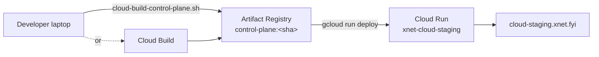
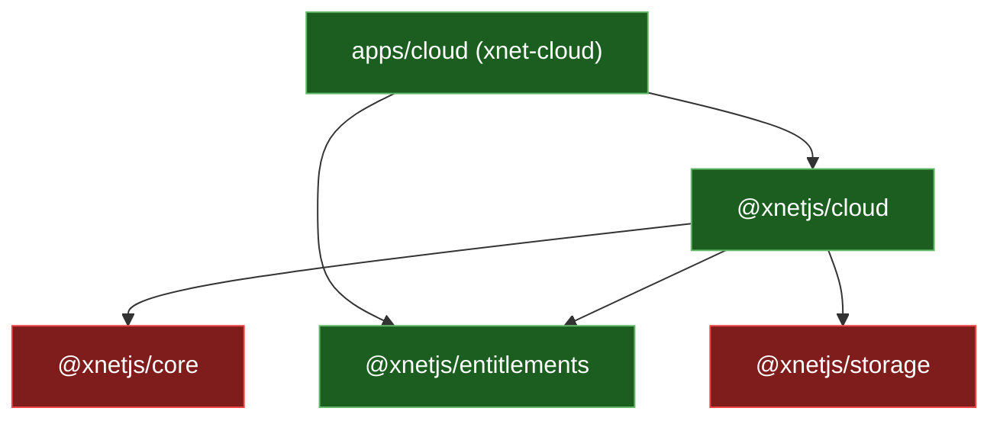
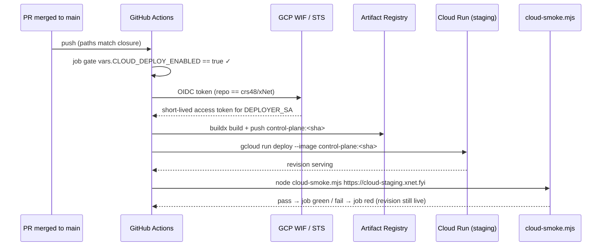

# Continuous Deployment For The Cloud Staging Control Plane

## Problem Statement

Is the xNet Cloud **staging control plane** part of continuous deployment? When a
change lands on `main`, does the staging service at `cloud-staging.xnet.fyi`
redeploy automatically the way the marketing site and web app do — or does it
require a human to run `gcloud` by hand?

The desired end state: **a merge to `main` that touches the control plane (or its
dependencies) redeploys staging automatically**, gated by the existing post-deploy
smoke test, with no manual `gcloud run deploy`.

## Executive Summary

**No — the cloud staging server is _not_ currently part of continuous deployment.**
It is one repo variable and two secrets away from being so.

The wiring already exists. [`.github/workflows/deploy-cloud.yml`](../../.github/workflows/deploy-cloud.yml)
is configured to trigger on `push` to `main` (with path filters), build the
control-plane image, deploy it to Cloud Run, and smoke-test the result. But the
single job is guarded by:

```yaml
if: ${{ vars.CLOUD_DEPLOY_ENABLED == 'true' }}
```

That variable is **not set** on the repo. Nor are the keyless-auth secrets
(`WIF_PROVIDER`, `DEPLOYER_SA`) the job needs. So the workflow fires on every
qualifying merge and the job **skips** — and a skipped job is green, so nobody
notices. The run history is unambiguous: the last ten `deploy-cloud` runs are all
`completed / skipped`.

Today, staging is deployed **manually** — build the image with
[`scripts/cloud-build-control-plane.sh`](../../scripts/cloud-build-control-plane.sh)
(or Cloud Build), then `gcloud run deploy`. The deployed service is live and serving;
it just doesn't refresh itself when code merges.

Turning on CD is a deliberately-staged, ~10-minute operation already scripted by
[`scripts/cloud-staging-enable-ci.sh`](../../scripts/cloud-staging-enable-ci.sh) and
documented in [`docs/cloud/STAGING_GO_LIVE.md`](../../docs/cloud/STAGING_GO_LIVE.md)
("Optional — turn on push-to-deploy"). The recommendation below is to do exactly
that, **plus widen the path filter** so the redeploy actually triggers on changes to
the control plane's full dependency closure (today it would miss edits to
`@xnetjs/core` and `@xnetjs/storage`).

## Current State In The Repository

### The deploy workflow exists and is push-triggered — but inert

[`.github/workflows/deploy-cloud.yml`](../../.github/workflows/deploy-cloud.yml)
already has everything a CD pipeline needs:

```yaml
on:
  workflow_dispatch: { ... }            # manual trigger (works today)
  push:
    branches: [main]
    paths:
      - 'apps/cloud/**'
      - 'packages/cloud/**'
      - 'packages/entitlements/**'
      - '.github/workflows/deploy-cloud.yml'

jobs:
  staging:
    if: ${{ vars.CLOUD_DEPLOY_ENABLED == 'true' }}   # ← the gate that's off
    environment: cloud-staging
    steps:
      - uses: actions/checkout@v4
      - id: auth
        uses: google-github-actions/auth@v2           # Workload Identity Federation
        with:
          workload_identity_provider: ${{ secrets.WIF_PROVIDER }}
          service_account: ${{ secrets.DEPLOYER_SA }}
      - uses: google-github-actions/setup-gcloud@v2
      - run: docker buildx build --platform linux/amd64 -f apps/cloud/Dockerfile -t "$IMAGE" --push .
      - run: gcloud run deploy "$SERVICE" --image "$IMAGE" --allow-unauthenticated --min-instances=1 ...
      - run: node scripts/cloud-smoke.mjs "$BASE_URL"  # post-deploy gate
```

The image is built **in CI** (`docker buildx … --push`), so the pipeline does not
depend on a developer's local Docker. Secrets are resolved at boot by Cloud Run from
GCP Secret Manager (`--set-secrets`), never injected from CI. The deploy is gated by
[`scripts/cloud-smoke.mjs`](../../scripts/cloud-smoke.mjs), which asserts the public
contract (`/health`, `/status.json` with no leaked tenant fields, `/auth/start`
redirects) and exits non-zero on failure. Concurrency is `deploy-cloud-${{ github.ref }}`
with `cancel-in-progress: false`, so deploys won't cancel each other mid-flight.

### The gate is off — proof

The repo has **no** `CLOUD_DEPLOY_ENABLED` variable and **none** of the WIF secrets:

```text
$ gh variable list
CHANGELOG_APP_ID    4087734    ...        # only this one

$ gh secret list
CHANGELOG_APP_PRIVATE_KEY    ...          # only this one
```

`WIF_PROVIDER`, `DEPLOYER_SA`, `CLOUD_DEPLOY_ENABLED` are all absent. And the run
history shows every merge skipping the job:

```text
$ gh run list --workflow=deploy-cloud.yml
completed  skipped  feat(cloud): open the web app from the cloud dashboard (#242)  push  ...
completed  skipped  Error monitoring, privacy-preserving analytics ...             push  ...
completed  skipped  feat(cloud): managed-AI setup ...                              push  ...
completed  skipped  ... (all 10 most recent: skipped)
```

The `cloud-staging` GitHub **deployment environment** referenced by the job does not
exist yet either (it would be auto-created on the first non-skipped run).

The metrics sibling [`cloud-metrics.yml`](../../.github/workflows/cloud-metrics.yml)
is gated identically by `vars.CLOUD_METRICS_ENABLED` and is likewise dormant — the
same "inert until an operator opts in, so merging the workflow never reds `main`"
pattern (exploration
[0201](0201_%5B_%5D_CLOUD_STAGING_STATUS_PAGE_AND_LIVE_TESTING.md)).

### What CD looks like when it _is_ on — the site

By contrast, the marketing site + web app **are** continuously deployed.
[`.github/workflows/deploy-site.yml`](../../.github/workflows/deploy-site.yml) runs on
every push to `main` touching `site/**`, `apps/web/**`, `packages/**`, builds, and
publishes to GitHub Pages — no gate, no secrets beyond `github.token`. That is the
template the cloud deploy is meant to match; the only reason it isn't symmetric is
that deploying to Cloud Run needs cloud credentials, and the keyless WIF path that
provides them hasn't been wired.

### How staging is deployed today (manual)



- [`scripts/cloud-build-control-plane.sh`](../../scripts/cloud-build-control-plane.sh)
  builds `linux/amd64` from the repo root and pushes to Artifact Registry.
- The operator then runs `gcloud run deploy xnet-cloud-staging --image …`.
- [`docs/cloud/STAGING_GO_LIVE.md`](../../docs/cloud/STAGING_GO_LIVE.md) §"Optional —
  turn on push-to-deploy" documents the enablement, and
  [`scripts/cloud-staging-enable-ci.sh`](../../scripts/cloud-staging-enable-ci.sh)
  automates the GCP side (WIF pool + provider + SA impersonation binding).

### The build closure vs. the trigger paths — a real gap

The control-plane image bundles the whole dependency closure. The Dockerfile
([`apps/cloud/Dockerfile`](../../apps/cloud/Dockerfile)) does `COPY packages/ packages/`
and builds with `--filter xnet-cloud...` (the `...` = "this package and everything in
its closure"). The actual closure is:



The `push.paths` filter only watches `apps/cloud/**`, `packages/cloud/**`,
`packages/entitlements/**`. **A change to `packages/core/**` or `packages/storage/**`
— both compiled into the running image — would not trigger a redeploy.** So even once
the gate is flipped, "deploys whenever it's on main" would silently miss part of the
control plane's own code.

## External Research

- **Keyless GCP auth from GitHub Actions (Workload Identity Federation).** Google's
  `google-github-actions/auth` recommends WIF over long-lived JSON service-account
  keys: GitHub mints a short-lived OIDC token, GCP exchanges it for a scoped access
  token, nothing durable is stored in the repo. This is exactly what `deploy-cloud.yml`
  and `cloud-staging-enable-ci.sh` implement (pool + OIDC provider + an
  `attribute.repository=='crs48/xNet'` condition that pins impersonation to this one
  repo). Industry guidance (Google, GitHub Security Lab) is unanimous that this is the
  preferred pattern for cloud CD.
- **GitHub deployment environments as a deploy gate.** GitHub "Environments" support
  required reviewers, wait timers, and **deployment branch rules** (e.g. only `main`
  may deploy to `cloud-staging`). For fork-PR safety, environment protection plus the
  WIF repository condition means a fork can neither read the secrets nor impersonate
  the SA. The design choice is whether to add a *required reviewer* (turns CD into
  "deploy on approval") or leave it unattended for true hands-off CD.
- **Cloud Run progressive delivery / rollback.** Cloud Run keeps every deployed
  revision; `gcloud run deploy` shifts 100% traffic to the new revision by default but
  supports `--no-traffic` + `--tag` (deploy dark, then split traffic) and instant
  rollback via `gcloud run services update-traffic --to-revisions=<old>=100`. The
  current workflow does a straight 100% cutover with a post-deploy smoke test but
  **no automatic rollback** on smoke failure — the bad revision stays live; the job
  just turns red.
- **Alternative trigger: GCP-side Cloud Build triggers.** Cloud Build can watch a
  GitHub repo and build/deploy on push entirely within GCP (no GitHub Actions, no WIF
  for the deploy step). This trades one moving part (Actions) for another (a Cloud
  Build trigger + `cloudbuild.yaml`) and splits CI across two systems. Given the repo
  already runs all other CD in Actions, staying in Actions is the lower-surprise path.
- **Prior art in-repo.** The site CD (`deploy-site.yml`) and the hub image build
  (`hub-image.yml`) show the repo's established Actions-first deployment convention;
  the cloud deploy was authored to match it and only needs the credentials wired.

## Key Findings

1. **CD is built but disabled.** `deploy-cloud.yml` already has the push trigger,
   image build, deploy, and smoke gate. The only thing standing between "merged" and
   "deployed" is the `CLOUD_DEPLOY_ENABLED` gate and the missing WIF secrets.
2. **Every recent merge skips silently.** The job's `if:` resolves false, the job is
   skipped, and skipped == green — so the absence of CD is invisible in PR checks.
3. **Enablement is scripted and documented.** `cloud-staging-enable-ci.sh` +
   `STAGING_GO_LIVE.md` cover the GCP and GitHub steps. This is a config task, not a
   coding task.
4. **There is a secret-ordering footgun.** Setting `CLOUD_DEPLOY_ENABLED=true` before
   the `WIF_PROVIDER`/`DEPLOYER_SA` secrets exist makes the next qualifying push fail
   the auth step and **red `main`**. Order matters: secrets first, variable last.
5. **The trigger paths are narrower than the build closure.** `packages/core/**` and
   `packages/storage/**` are compiled into the image but not in `push.paths`, so some
   control-plane changes wouldn't auto-deploy even after the gate is on.
6. **No automatic rollback.** A smoke-test failure reds the run but leaves the new
   (possibly broken) revision serving 100% of traffic.
7. **Staging only.** This is single-environment by design (no prod control plane
   exists yet); CD here is low-risk and a good place to prove the pipeline.

## Options And Tradeoffs

### Decision 1 — How to deploy on merge

| Option | What | Pros | Cons |
| ------ | ---- | ---- | ---- |
| **A. Flip the existing WIF gate** (recommended) | Run `cloud-staging-enable-ci.sh`, set 2 secrets + 1 variable, create the `cloud-staging` environment | Zero new code; matches site CD; keyless; smoke-gated; fork-safe | One-time GCP/admin setup; footgun if ordered wrong |
| **B. GCP Cloud Build trigger** | A Cloud Build trigger on push → build + `gcloud run deploy` inside GCP | No WIF needed for deploy; build close to the registry | Splits CI across Actions + Cloud Build; new `cloudbuild.yaml`; smoke gate must be re-homed |
| **C. Stay manual** | Keep `gcloud run deploy` by hand | Full human control; nothing to set up | The status quo the user wants to fix; staging drifts behind `main` |

### Decision 2 — How wide should the trigger be

| Option | `push.paths` | Behavior |
| ------ | ------------ | -------- |
| **Status quo** | `apps/cloud`, `packages/cloud`, `packages/entitlements` | Misses `core`/`storage` edits — incomplete |
| **Precise closure** (recommended) | add `packages/core/**`, `packages/storage/**` | Deploys on any change that actually rebuilds the image; minimal waste |
| **No filter** | drop `paths` entirely | "Deploys on every main push," dead simple, but rebuilds/redeploys on totally unrelated changes (editor, maps, …) — wasteful CI minutes |

The precise-closure option best matches the user's intent ("deployed with the rest of
the code whenever it's on main") without redeploying for unrelated work. Its only cost
is that the path list must be revisited if `@xnetjs/cloud`'s dependencies change — a
cheap, occasional chore. If even that is unwanted, drop the filter entirely and accept
extra builds (the smoke test still gates correctness).

### Decision 3 — Gated or hands-off

| Option | Mechanism | Result |
| ------ | --------- | ------ |
| **Hands-off CD** (recommended for staging) | `cloud-staging` environment with a **deployment branch rule = `main`**, no required reviewer | True continuous deployment; merge → live, smoke-gated |
| **Deploy-on-approval** | Same environment **with a required reviewer** | Each deploy waits for a click — safer, but not the "automatic" the user asked for |

For staging, hands-off with the smoke gate is the right default; reserve required
reviewers for a future production environment.

### Desired pipeline



## Recommendation

**Adopt Option A + precise-closure paths + hands-off environment.** Concretely:

1. **Wire keyless auth** with `REPO=crs48/xNet bash scripts/cloud-staging-enable-ci.sh`.
2. **Set the secrets first, the variable last** (the footgun): `WIF_PROVIDER` and
   `DEPLOYER_SA`, then create the `cloud-staging` environment (branch rule = `main`,
   no required reviewer), then `CLOUD_DEPLOY_ENABLED=true`.
3. **Widen `push.paths`** in `deploy-cloud.yml` to include `packages/core/**` and
   `packages/storage/**` so the full image closure triggers a redeploy.
4. **Prove it** by merging a trivial control-plane change and watching the run go
   green through build → deploy → smoke, then confirming the new revision serves.
5. **Follow-up (not blocking):** add smoke-fail auto-rollback (`update-traffic
   --to-revisions=<previous>=100`) or deploy dark with `--no-traffic --tag` + promote
   after smoke, so a bad deploy can't sit live. Track separately.

This keeps the pipeline in GitHub Actions (consistent with site + hub CD), uses
keyless WIF (no stored keys), and is fork-safe (repo-scoped impersonation +
environment protection). It is a configuration change with a one-line workflow edit —
no application code.

## Example Code

### Enable WIF + set the GitHub side (order matters)

```bash
# 1. GCP side — creates the WIF pool/provider + SA impersonation binding (idempotent).
REPO=crs48/xNet bash scripts/cloud-staging-enable-ci.sh
# It prints the exact values for the next two commands.

# 2. Secrets FIRST (so the deploy can authenticate the moment the gate flips).
gh secret set WIF_PROVIDER --repo crs48/xNet \
  --body 'projects/<PNUM>/locations/global/workloadIdentityPools/github/providers/github'
gh secret set DEPLOYER_SA  --repo crs48/xNet \
  --body 'xnet-deployer@xnet-cloud-staging-0.iam.gserviceaccount.com'

# 3. Create the protected environment (GitHub UI → Settings → Environments →
#    "cloud-staging" → Deployment branch rule: main; no required reviewer for hands-off CD).

# 4. Variable LAST — this is what un-skips the job. Do not set it before step 2.
gh variable set CLOUD_DEPLOY_ENABLED --repo crs48/xNet --body 'true'
```

### Widen the trigger to the full image closure

```diff
   push:
     branches: [main]
     paths:
       - 'apps/cloud/**'
       - 'packages/cloud/**'
       - 'packages/entitlements/**'
+      - 'packages/core/**'
+      - 'packages/storage/**'
       - '.github/workflows/deploy-cloud.yml'
```

### Optional — make the smoke gate able to roll back

```yaml
      - name: Smoke test the deploy
        id: smoke
        run: node scripts/cloud-smoke.mjs "$BASE_URL"

      - name: Roll back on smoke failure
        if: failure() && steps.smoke.outcome == 'failure'
        run: |
          PREV=$(gcloud run revisions list --service "$SERVICE" \
            --project "$PROJECT" --region "$REGION" \
            --format='value(metadata.name)' --sort-by='~metadata.creationTimestamp' \
            | sed -n 2p)
          gcloud run services update-traffic "$SERVICE" \
            --project "$PROJECT" --region "$REGION" --to-revisions "$PREV=100"
```

## Risks And Open Questions

- **Red-`main` footgun.** Flipping `CLOUD_DEPLOY_ENABLED=true` before the WIF secrets
  exist fails the next deploy and reds `main`. Strict ordering (secrets → environment
  → variable) mitigates; the enable script's output warns about this.
- **No automatic rollback (today).** A failed smoke test leaves the new revision
  serving 100%. The optional rollback step above closes this; until then, a human must
  `update-traffic` back. Worth deciding whether to ship rollback in the same change.
- **100% cutover, no canary.** Staging traffic is low, so a straight cutover is
  acceptable; for a future prod control plane, prefer `--no-traffic --tag` + promote.
- **Build time / CI minutes.** Each deploy does a full `buildx` image build with no
  remote layer cache (~minutes). Acceptable for staging cadence; a Turbo/registry
  cache is a later optimization.
- **Path-filter drift.** If `@xnetjs/cloud`'s dependency closure grows, the
  `push.paths` list must be updated or some changes won't auto-deploy. Alternative:
  drop the filter (deploy on every main push) and trade CI minutes for correctness.
- **Per-tenant hub image is a separate track.** Paid provisioning needs a hub image
  that isn't pushed yet (`STAGING_GO_LIVE.md` "Optional — the per-tenant hub image");
  control-plane CD does **not** depend on it (the pooled `demo` plan doesn't need it).
- **Single environment.** This is staging only. When a prod control plane appears,
  decide whether prod gets its own gated environment (required reviewer) downstream of
  staging.
- **Open question:** does the team want the deploy fully unattended, or a one-click
  approval per deploy? The recommendation assumes unattended for staging.

## Implementation Checklist

- [ ] Run `REPO=crs48/xNet bash scripts/cloud-staging-enable-ci.sh` and capture the
      printed `WIF_PROVIDER` value.
- [ ] `gh secret set WIF_PROVIDER` and `gh secret set DEPLOYER_SA` (secrets first).
- [ ] Create the `cloud-staging` GitHub environment; set deployment branch rule to
      `main`; decide on required reviewer (recommend none for staging).
- [ ] `gh variable set CLOUD_DEPLOY_ENABLED --body true` (variable last).
- [ ] Widen `deploy-cloud.yml` `push.paths` to add `packages/core/**` and
      `packages/storage/**` (PR; the workflow-file path already self-triggers).
- [ ] (Optional) Add the smoke-failure rollback step to `deploy-cloud.yml`.
- [ ] Trigger once via `workflow_dispatch` to confirm auth + build + deploy + smoke
      before relying on push.
- [ ] Document the now-active CD in `STAGING_GO_LIVE.md` (flip "Optional" framing).

## Validation Checklist

- [ ] `gh variable list` shows `CLOUD_DEPLOY_ENABLED=true`; `gh secret list` shows
      `WIF_PROVIDER` and `DEPLOYER_SA`.
- [ ] A manual `workflow_dispatch` of `deploy-cloud` completes green (not skipped),
      including the smoke step.
- [ ] A merge to `main` touching `apps/cloud/**` produces a **non-skipped** green
      `deploy-cloud` run (`gh run list --workflow=deploy-cloud.yml` no longer shows
      `skipped`).
- [ ] A merge touching only `packages/core/**` or `packages/storage/**` also triggers
      a deploy (proves the widened filter).
- [ ] `gcloud run services describe xnet-cloud-staging --format='value(status.url)'`
      shows a revision whose image tag matches the merged commit's short SHA.
- [ ] `node scripts/cloud-smoke.mjs https://cloud-staging.xnet.fyi` passes against the
      freshly deployed revision.
- [ ] A fork PR cannot read the secrets or deploy (environment protection + WIF
      repository condition hold).
- [ ] (If rollback added) an intentionally-broken deploy rolls traffic back to the
      previous revision and reds the run.

## References

- [`.github/workflows/deploy-cloud.yml`](../../.github/workflows/deploy-cloud.yml) — the inert (gated) cloud deploy pipeline.
- [`.github/workflows/deploy-site.yml`](../../.github/workflows/deploy-site.yml) — the working site CD it should mirror.
- [`.github/workflows/cloud-metrics.yml`](../../.github/workflows/cloud-metrics.yml) — the sibling `*_ENABLED`-gated dormant workflow.
- [`scripts/cloud-staging-enable-ci.sh`](../../scripts/cloud-staging-enable-ci.sh) — automates the GCP WIF side of enablement.
- [`scripts/cloud-build-control-plane.sh`](../../scripts/cloud-build-control-plane.sh) — the current manual image build.
- [`scripts/cloud-smoke.mjs`](../../scripts/cloud-smoke.mjs) — the post-deploy contract gate.
- [`apps/cloud/Dockerfile`](../../apps/cloud/Dockerfile) — shows the full `--filter xnet-cloud...` build closure.
- [`docs/cloud/STAGING_GO_LIVE.md`](../../docs/cloud/STAGING_GO_LIVE.md) — go-live runbook incl. "Optional — turn on push-to-deploy".
- [exploration 0205 — Deploy xNet Cloud staging control plane](0205_%5B_%5D_DEPLOY_XNET_CLOUD_STAGING_CONTROL_PLANE.md)
- [exploration 0201 — Cloud staging status page & live testing](0201_%5B_%5D_CLOUD_STAGING_STATUS_PAGE_AND_LIVE_TESTING.md)
- Google — [Authenticate to Google Cloud from GitHub Actions with Workload Identity Federation](https://github.com/google-github-actions/auth).
- GitHub — [Using environments for deployment](https://docs.github.com/en/actions/deployment/targeting-different-environments/using-environments-for-deployment) (required reviewers, branch rules).
- Google Cloud — [Cloud Run rollbacks and traffic migration](https://cloud.google.com/run/docs/rollouts-rollbacks-traffic-migration).
