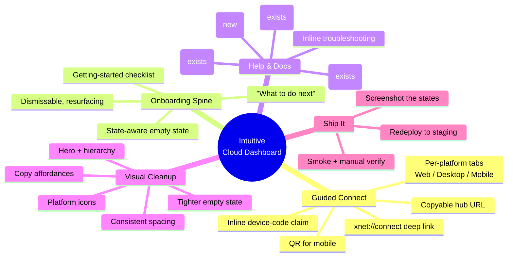
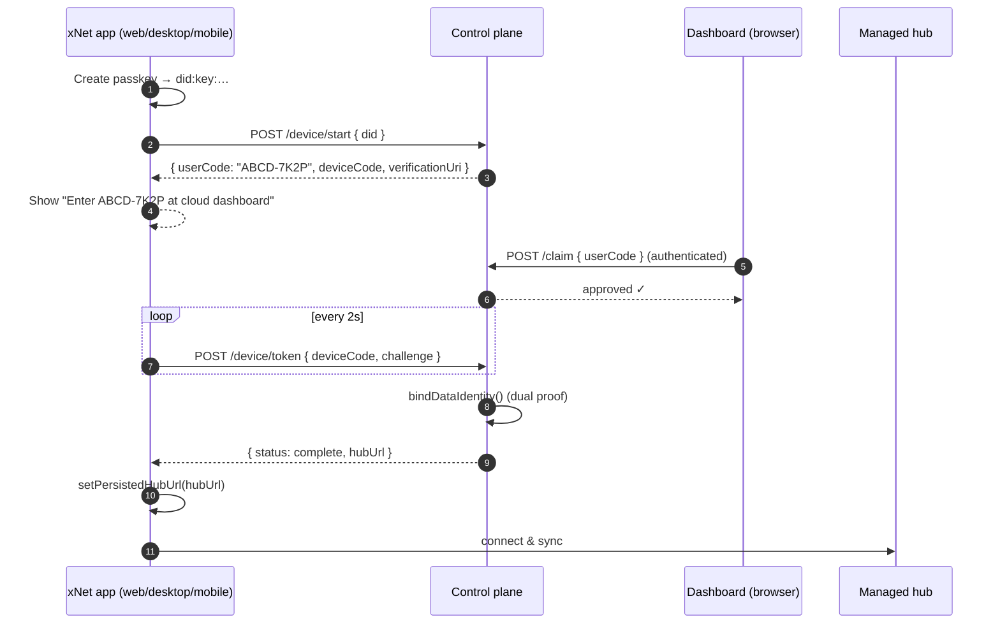
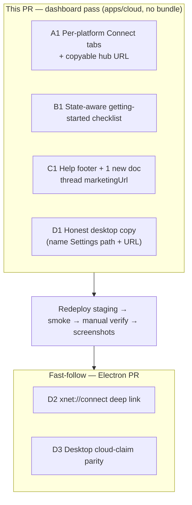

# The Intuitive Cloud Dashboard — Guided Connect, Per-Platform Onboarding, and a Clean Redeploy

## Problem Statement

A new xNet Cloud customer subscribes, lands on the dashboard
([`apps/cloud/src/dashboard.ts`](apps/cloud/src/dashboard.ts)), and then… has to
figure out the hard part alone: *how do I actually get my apps talking to this hub
I'm now paying for?* The dashboard tells them almost nothing useful here. The entire
"connect" experience is a three-line ordered list and one button:

```
1. Open xNet on web, desktop, or mobile.
2. Create your passkey (this is your data identity — it never leaves your device).
3. Choose "Connect xNet Cloud hub" and approve the code here.
   [ Approve a device ]
```

That copy is accurate but assumes the reader already knows what "Connect xNet Cloud
hub" means and where to find it. Three concrete gaps make it worse:

- **The desktop (Electron) app has no cloud-connect UI at all.** A user following
  step 3 in the desktop app will not find a "Connect xNet Cloud hub" button — there
  isn't one. They have to know to open **Settings → Network → Signaling server** and
  paste a URL ([`apps/electron/src/renderer/components/SettingsView.tsx:220`](apps/electron/src/renderer/components/SettingsView.tsx)).
  But the dashboard never shows them the hub URL to paste in a copyable way, nor
  tells them where to paste it.
- **There are zero links to documentation or FAQs** anywhere on the dashboard. If a
  user is confused there is no "Learn more", no "How do I connect?", no "FAQ", no
  "Troubleshooting" — just a dead end.
- **The dashboard's information hierarchy doesn't match the user's journey.** A
  brand-new, never-connected tenant sees the same flat stack of cards
  (hub status → AI → connect → plan → billing → danger zone) as a power user who's
  been running for a year. There's no "here's what to do next" for the person who
  just paid and has connected nothing.

This exploration is specifically about the **instructional and presentational layer**
— making the dashboard *teach* a user how to connect each kind of app, surface the
hub URL the right way, link to help, and look clean doing it — then **redeploying the
result to staging** so it can be seen and dialed in.

It deliberately does **not** re-plan the data-richness work (live status, backups,
analytics) — that's [0207](0207_[_]_FULL_CLOUD_DASHBOARD_HOSTED_APP_AND_CUSTOM_DOMAINS.md),
already shipped as Phase 1 — nor the heavy infrastructure (per-tenant subdomains,
custom domains, the ops event spine) — that's
[0209](0209_[_]_ENABLING_THE_FULL_DASHBOARD_DOMAINS_IDENTITY_AND_OPS.md). It slots
between them: the **"guided connect + clean up + ship to staging"** layer.

## Executive Summary

**The connect machinery is already complete and correct — it's the *teaching* of it
that's missing.** The cloud side has a full OAuth-style device-authorization flow
(`/device/start` → user approves a short code at `/claim` → `/device/token` polls to
completion and returns the `hubUrl`), the web app drives it end-to-end
([`apps/web/src/lib/cloud-claim.ts`](apps/web/src/lib/cloud-claim.ts)), and the
tenant's `hubUrl` is sitting right there in `TenantRecord`. What's missing is a
dashboard that turns that machinery into an obvious, per-platform, copy-paste-ready
set of instructions — plus the one genuinely-absent piece of product (a desktop
connect affordance) and a few help links.



**Recommendation — four small, independently-shippable slices, all server-rendered
HTML+vanilla-JS (no new bundle), reusing data the dashboard already has:**

1. **Guided "Connect your apps" card** with **per-platform tabs** (Web / Desktop /
   Mobile), each with tailored steps, a **copyable hub URL**, and the device-code
   claim inline. This is the heart of the user's ask.
2. **A state-aware getting-started checklist** at the top of the dashboard for tenants
   who haven't finished connecting — Vercel/Supabase-style activation, dismissable.
3. **A help/docs footer + contextual "Learn more" links** — wire `marketingUrl`
   through and point at the existing `/cloud/pricing#faq`, `/docs/guides/hub`,
   `/status`, plus **one new doc page** `/docs/guides/cloud-connect`.
4. **A desktop connect affordance** — the only real product gap. Minimum: dashboard
   instructions that name the exact Settings path and show the URL to paste. Better:
   an `xnet://connect?hub=…` deep link that pre-fills the Electron app (extends the
   existing `xnet://` protocol handler, which today only knows `xnet://share`).

Then **redeploy to staging** (`cloud-staging.xnet.fyi`) via the existing
`deploy-cloud.yml` pipeline and verify the new states live.

The whole thing is **presentation + copy + ~one deep-link handler**, not new
infrastructure. The dashboard already receives `appUrl` and `tenant.hubUrl`; we add
`marketingUrl` to the view (one line of plumbing) and we're done.

## Current State In The Repository

### The dashboard today

[`apps/cloud/src/dashboard.ts`](apps/cloud/src/dashboard.ts) is a deliberately-small
server-rendered HTML string (no React bundle), styled by one inline `STYLE` constant,
hydrated by one vanilla-JS `liveScript()` for the live tiles. `renderDashboard()`
composes a flat stack:

```
hubCard → aiUsageCard → connectCard → planChangeCard → billingCard → dangerZone → liveScript
```

The header now carries a persistent **"Open web app ↗"** button (added in PR #242),
so *accessing* the web UI is solved. The **`connectCard()`**
([`dashboard.ts:269`](apps/cloud/src/dashboard.ts)) is the gap:

- **Connected** (`tenant.did` set): a "Connected" card with an "Open the app" link.
- **Not connected**: the 3-step `<ol>` + "Approve a device" button quoted above.

`DashboardView` ([`dashboard.ts:15`](apps/cloud/src/dashboard.ts)) currently exposes
`billingUserId`, `email?`, `tenant`, `checkoutPlans`, `billingEnabled`, `appUrl?`,
`aiUsage?`. Notably **`marketingUrl` is not threaded into the view** even though the
server reads `XNET_CLOUD_MARKETING_URL`
([`server.ts`](apps/cloud/src/server.ts)) — so the dashboard can't link to docs/cloud
pages without one line of new plumbing.

### The connect flow is already end-to-end

The device-authorization grant is fully built and is a textbook RFC 8628 flow:

| Step | Code | What happens |
|---|---|---|
| Model | [`apps/cloud/src/device-grant.ts:16`](apps/cloud/src/device-grant.ts) | `DeviceGrant { deviceCode, userCode, did, status }`; codes use a Crockford alphabet; 10-min TTL |
| App starts | [`server.ts` `POST /device/start`](apps/cloud/src/server.ts) | App sends its locally-created `{ did }`; gets `{ deviceCode, userCode, verificationUri, intervalSec, expiresInSec }` |
| User approves | [`server.ts` `POST /claim`](apps/cloud/src/server.ts) + [`dashboard.ts:437` `renderClaimForm`](apps/cloud/src/dashboard.ts) | Authenticated user types the short `userCode`; `devices.approve(userCode, billingUserId)` |
| App completes | [`server.ts` `POST /device/token`](apps/cloud/src/server.ts) | App polls with `{ deviceCode, challenge }`; on approve → `bindDataIdentity()` → returns `{ status:'complete', hubUrl }` |
| Bind | [`packages/cloud/src/identity/binding.ts:74`](packages/cloud/src/identity/binding.ts) | Dual proof: session (billing) **and** signed DID challenge (data) |



### The web app drives it; the desktop app does not

- **Web** ([`apps/web/src/lib/cloud-claim.ts:35`](apps/web/src/lib/cloud-claim.ts)):
  `startDeviceClaim()` + `pollDeviceClaim()`, wired into the onboarding state machine
  ([`packages/react/src/onboarding/machine.ts`](packages/react/src/onboarding/machine.ts),
  `connecting-hub` state). Hub URL persists to `localStorage['xnet:hub-url']`
  ([`apps/web/src/lib/hub-url.ts:10`](apps/web/src/lib/hub-url.ts)). Settings →
  Network even has a **"Connect a cloud hub"** row that deep-links to the dashboard
  ([`apps/web/src/routes/settings.tsx:619`](apps/web/src/routes/settings.tsx)).
- **Desktop/Electron**: **no cloud-claim UI**. `SettingsView` Network panel is a raw
  "Signaling server" text input defaulting to `ws://localhost:4444`
  ([`apps/electron/src/renderer/components/SettingsView.tsx:234`](apps/electron/src/renderer/components/SettingsView.tsx)).
  There is an `xnet://` protocol handler in the main process but it only knows
  `xnet://share?link=…&hub=…#s=…` ([`apps/electron/src/main/index.ts:39`](apps/electron/src/main/index.ts))
  — there is **no `xnet://connect`**. So "Connect xNet Cloud hub" as described in the
  dashboard copy literally does not exist on desktop.
- **Mobile/Expo**: shares the `@xnetjs/react` onboarding; no dedicated cloud-claim UI
  surfaced yet.

### Help content that already exists (and what's missing)

The Astro site (`site/`) already has good destinations to link to:

| Purpose | URL | File | Notes |
|---|---|---|---|
| Cloud landing | `/cloud` | [`site/src/pages/cloud/index.astro`](site/src/pages/cloud/index.astro) | Pitch + `ONBOARDING_STEPS` |
| Pricing **+ FAQ** | `/cloud/pricing` | [`site/src/pages/cloud/pricing.astro`](site/src/pages/cloud/pricing.astro) | 4 FAQs (self-host, privacy, cancel, AI billing) — driven by [`site/src/data/pricing.ts`](site/src/data/pricing.ts) |
| Self-host hub guide | `/docs/guides/hub` | `site/src/content/docs/docs/guides/hub.mdx` | Deploy + connect (self-host framed) |
| Status | `/status` | [`site/src/pages/status.astro`](site/src/pages/status.astro) | Public fleet health |
| Docs index | `/docs` | `site/src/content/docs/docs/index.mdx` | All guides |

**Missing:** a user-facing **"Connect your app to your xNet Cloud hub"** guide. The
hub guide is self-host-framed; the pricing FAQ is high-level. Nothing walks a Cloud
customer through web/desktop/mobile connect. That's the one doc page worth creating.

### The onboarding-tips pattern (reference, not reuse)

The app has a versioned coachmark registry
([`apps/web/src/coachmarks/registry.ts`](apps/web/src/coachmarks/registry.ts),
exploration [0206](0206_[x]_LIGHT_EXTENSIBLE_ONBOARDING_AND_FIRST_RUN_COACHMARKS.md)):
declarative tips keyed by view, ordered, dismissal tracked, resurface by version bump.
The dashboard is server-rendered HTML so it can't import the React component, but the
**pattern** — a small ordered set of "do this next" steps with per-user dismissal —
maps cleanly onto the dashboard's existing vanilla-JS + a tiny bit of persisted state.

### How it ships to staging

Redeploy is a solved, scripted path
([0205](0205_[_]_DEPLOY_XNET_CLOUD_STAGING_CONTROL_PLANE.md)):

- **Pipeline:** [`.github/workflows/deploy-cloud.yml`](.github/workflows/deploy-cloud.yml)
  deploys `xnet-cloud-staging` on push to `main` touching `apps/cloud/**` (or manual
  `workflow_dispatch`), guarded by `vars.CLOUD_DEPLOY_ENABLED == 'true'` and the
  `cloud-staging` protected environment (keyless WIF/OIDC).
- **Image:** `docker buildx build -f apps/cloud/Dockerfile --push .` from repo root
  (BuildKit + [`apps/cloud/Dockerfile.dockerignore`](apps/cloud/Dockerfile.dockerignore);
  `--config.confirm-modules-purge=false` for the non-TTY prod install).
- **Run:** `gcloud run deploy xnet-cloud-staging` (project `xnet-cloud-staging-0`,
  region `us-central1`), env inline + secrets from Secret Manager, then
  `node scripts/cloud-smoke.mjs https://cloud-staging.xnet.fyi`.
- **Config that matters here:** `XNET_CLOUD_APP_URL` (the "Open web app" target) and
  `XNET_CLOUD_MARKETING_URL` (`https://xnet.fyi/cloud`) — the latter is the value we
  need to thread into `DashboardView` for doc links.

## External Research

- **OAuth 2.0 Device Authorization Grant (RFC 8628).** xNet's claim flow is exactly
  this pattern — short `user_code`, a `verification_uri`, and a polling `device_code`
  — the same UX users already know from **GitHub CLI** (`gh auth login` →
  "enter ABCD-1234 at github.com/login/device"), **Apple TV**, and streaming-stick
  sign-ins. The lesson from those: the polling device should display the code
  **prominently** and a **QR/short link** to the verification URI so the user doesn't
  hand-type the URL. Our dashboard is the *verification* side; making it a calm,
  obviously-correct "enter your code" screen with a big input is table stakes.
- **The "Connect" modal with copyable strings + framework tabs.** **Neon** and
  **Supabase** both centre onboarding on a **Connect** action that opens a modal with
  the connection string behind a **copy button**, often split into **framework/driver
  tabs** (psql, Next.js, Prisma, …). The dominant, learned pattern for "connect your
  thing to our backend" is: *pick your environment → copy the one value you need →
  paste it where we tell you.* Our analogue: pick Web/Desktop/Mobile → copy the hub
  URL → we tell you exactly where it goes. ([Cloudflare DB integrations writeup](https://blog.cloudflare.com/announcing-database-integrations/),
  [Neon connect docs](https://neon.com/docs/connect/connect-from-any-app))
- **Vercel-style activation, not a wall of features.** Vercel's onboarding is praised
  for **sequencing the next action** and **not upselling on day one** — a small
  checklist that advances as you complete steps, surfaced *after* the first
  meaningful action. ([Perspective AI on Vercel onboarding](https://getperspective.ai/blog/vercel-ai-native-customer-onboarding-developer-teams))
  The takeaway for us: a brand-new tenant should see a 3–4 item checklist
  ("Create your passkey → Connect a device → Open the web app"), not the full
  six-card management console.
- **Deep links for desktop pairing.** Native apps routinely register a custom URL
  scheme so a web page can hand off to the installed app (Slack `slack://`, Zoom,
  VS Code `vscode://`). We already own `xnet://` in Electron; extending it with
  `xnet://connect?hub=…&code=…` is the standard "open in app" handoff and removes the
  copy-paste-into-settings step entirely.

## Key Findings

1. **The product is built; the teaching is not.** Every byte of the connect flow
   works. The dashboard just doesn't explain it per-platform or surface the hub URL
   usefully. This is a copy/markup problem, not an engineering one — except the
   desktop gap.
2. **The desktop connect gap is real and is the sharpest edge.** The dashboard's
   step 3 ("Choose 'Connect xNet Cloud hub'") is *false on desktop*. Fixing the words
   (name the Settings path, show the URL) is the floor; an `xnet://connect` deep link
   is the ceiling.
3. **The hub URL is the one value the user needs, and it's never copyable.** It's
   rendered as `<code>` in the hub card with no copy affordance and no "paste this
   into your desktop app" context.
4. **Zero help links is an easy, high-value fix.** The destinations exist
   (`/cloud/pricing#faq`, `/docs/guides/hub`, `/status`); they just need a footer and
   contextual links, plus `marketingUrl` threaded into the view.
5. **The empty (just-subscribed) state is the highest-leverage screen** and currently
   the least designed. A getting-started checklist there converts "I paid, now what?"
   into "do these three things."
6. **Everything fits the existing constraints.** Server-rendered HTML + one vanilla-JS
   block + inline CSS already powers the live tiles; tabs, copy buttons, a checklist,
   and a QR can all be done the same way with no bundle and no new dependency (QR via
   a tiny inline generator or a `` to a QR data endpoint).

## Options And Tradeoffs

### A. The guided "Connect your apps" card

| Option | What | Pros | Cons |
|---|---|---|---|
| **A0** Keep the 3-step `<ol>` | status quo | zero work | doesn't teach; desktop copy is wrong |
| **A1 (rec)** Per-platform tabs | Web / Desktop / Mobile tabs, each with tailored steps + copyable hub URL + inline code-claim | matches learned "Connect modal" pattern; fixes desktop; no bundle | more markup + a little JS for tabs |
| **A2** One long unified list | every platform's steps stacked | simple | long, noisy, the desktop user reads web steps they don't need |
| **A3** Link out to a doc only | dashboard just links to `/docs/guides/cloud-connect` | least dashboard code | punts the teaching off-product; more clicks |

**Pick A1**, and *also* write the doc from A3 (they reinforce each other — the tabs
are the quick path, the doc is the deep path).

### B. The onboarding spine (empty-state)

| Option | What | Pros | Cons |
|---|---|---|---|
| **B1 (rec)** State-aware checklist | top-of-dashboard checklist that advances with tenant state (`tenant?`, `did`, dataTier) and is dismissable | Vercel-style activation; uses data we already have; no per-user storage needed if derived from state | needs a small "dismissed" flag to hide after success |
| **B2** Full coachmark port | replicate the 0206 registry in HTML/JS | reusable tip system | over-engineered for ~4 steps |
| **B3** Nothing | rely on the connect card alone | least work | no "what next" framing for the just-paid user |

**Pick B1.** Most checklist items are **derivable from state** (plan chosen ✓ once
`tenant` exists; device connected ✓ once `did` set), so it self-completes; only the
"dismiss for good" needs a flag (a signed cookie or a `dismissedTips` field on the
tenant, mirroring `seenTips`).

### C. Help & docs

| Option | What | Pros | Cons |
|---|---|---|---|
| **C1 (rec)** Footer + contextual links + 1 new doc | dashboard footer (FAQ, Docs, Status, Self-host) + a "Need help connecting?" link by the connect card + new `/docs/guides/cloud-connect` | cheap, high value, real destinations | one new doc page to write; thread `marketingUrl` |
| **C2** Footer only | just link existing pages | cheapest | no Cloud-specific connect guide |
| **C3** Inline FAQ accordion | embed FAQ in dashboard | self-contained | duplicates `site/src/data/pricing.ts` FAQ content |

**Pick C1.** Reuse the existing FAQ at `/cloud/pricing#faq`; add the one missing
Cloud-connect guide; don't duplicate content into the dashboard.

### D. Desktop connect affordance

| Option | What | Pros | Cons |
|---|---|---|---|
| **D1** Better copy only | dashboard names "Settings → Network → Signaling server" and shows a copyable hub URL | trivial; immediately unblocks desktop users | still manual paste + restart |
| **D2 (rec, phased)** `xnet://connect` deep link | dashboard offers "Open in desktop app" → `xnet://connect?hub=…` → Electron pre-fills + connects | one-click; uses the scheme we own; great demo | needs an Electron handler + a desktop-side claim/confirm UI |
| **D3** Full desktop onboarding parity | port the web `cloud-claim` flow into Electron renderer | best UX; desktop reaches web parity | most work; touches the desktop onboarding |

**Do D1 now (in this dashboard pass), spec D2 next.** D1 makes the dashboard honest
and unblocks desktop today; D2 is the satisfying finish and is mostly an Electron-side
change tracked as a follow-up.

### E. Visual cleanup

Tighten within the existing dark theme (no redesign): a real **empty-state hero** for
just-subscribed tenants; **copy buttons** with a "Copied ✓" micro-confirm; small
**platform icons** on the tabs; consistent card spacing and a max-width that doesn't
let the `dl` rows stretch; the danger zone visually de-emphasised until expanded.
Keep it 0-dependency and inline, matching `liveScript()`.

## Recommendation

Ship **A1 + B1 + C1 + D1** as one focused dashboard PR (all server-rendered, no
bundle), thread `marketingUrl` into `DashboardView`, write the one new doc page, then
**redeploy to staging and verify the states live**. Track **D2 (`xnet://connect`)**
and **D3 (desktop onboarding parity)** as a fast-follow Electron PR.



Why this ordering: the dashboard pass is pure presentation over data we already have,
so it's low-risk, fully unit-testable (the render functions are pure, like the PR #242
`dashboard.test.ts`), and immediately visible on staging. The deep link is the only
piece needing native handling, so it earns its own PR.

## Example Code

### 1. Thread `marketingUrl` into the view (one-line plumbing)

```ts
// apps/cloud/src/dashboard.ts
export interface DashboardView {
  // …existing…
  appUrl?: string
  /** Marketing/docs base ("https://xnet.fyi/cloud") for help links. */
  marketingUrl?: string
}
```

```ts
// apps/cloud/src/server.ts  (in the /dashboard handler)
renderDashboard({
  // …existing…
  appUrl: deps.appUrl ?? 'https://xnet.fyi/app',
  marketingUrl: deps.marketingUrl ?? 'https://xnet.fyi/cloud',
})
```

### 2. Per-platform Connect card (A1) — shape of the markup

```ts
function connectCard(tenant: TenantRecord, appUrl: string): string {
  const hub = tenant.hubUrl
  // Connected → confirmation + open app (unchanged intent, cleaner copy)
  if (tenant.did) {
    return card('Connected', `
      <p class="muted">This hub is connected. Open xNet on any device and sign in with your passkey.</p>
      <a class="btn" href="${esc(appUrl)}" target="_blank" rel="noopener">Open the web app ↗</a>`)
  }
  // Not connected → tabbed, per-platform guidance
  return card('Connect your apps', `
    <div class="tabs" data-tabs="connect">
      <button class="tab" data-tab="web" aria-selected="true">🌐 Web</button>
      <button class="tab" data-tab="desktop">🖥️ Desktop</button>
      <button class="tab" data-tab="mobile">📱 Mobile</button>
    </div>

    <section data-panel="web">
      <ol>
        <li><a class="btn btn-sm" href="${esc(appUrl)}" target="_blank" rel="noopener">Open the web app ↗</a></li>
        <li>Create your passkey when prompted (your data identity — it never leaves your device).</li>
        <li>Choose <strong>Connect xNet Cloud hub</strong>; it shows a short code.</li>
        <li><a class="btn btn-sm" href="/claim">Enter that code here →</a></li>
      </ol>
    </section>

    <section data-panel="desktop" hidden>
      <ol>
        <li>Open the xNet desktop app.</li>
        <li>Go to <strong>Settings → Network</strong>.</li>
        <li>Paste your hub URL into <strong>Signaling server</strong>:
          ${copyField('hub-url', hub || 'provisioning…')}
        </li>
        <li>Restart the app to connect. <span class="muted">(One-click connect is coming via a desktop link.)</span></li>
      </ol>
    </section>

    <section data-panel="mobile" hidden>
      <ol>
        <li>Install xNet on your phone and open it.</li>
        <li>Create your passkey, then choose <strong>Connect xNet Cloud hub</strong>.</li>
        <li>Approve the code it shows: <a class="btn btn-sm" href="/claim">Enter a code →</a></li>
        <li>Or scan to open the approval page: ${qr('/claim')}</li>
      </ol>
    </section>

    <p class="muted help-row">
      Stuck? <a href="${esc(marketingUrl)}/pricing#faq">FAQ</a> ·
      <a href="${esc(marketingUrl)}/../docs/guides/cloud-connect">How to connect</a>
    </p>`)
}
```

### 3. Copyable hub URL field (reused for desktop + hub card)

```ts
function copyField(id: string, value: string): string {
  return `
    <span class="copy" data-copy>
      <code id="${id}">${esc(value)}</code>
      <button type="button" class="ghost btn-sm" data-copy-btn="${id}">Copy</button>
    </span>`
}
```

```js
// add to liveScript() — delegated, no per-element wiring
document.addEventListener('click', function (e) {
  var b = e.target.closest('[data-copy-btn]')
  if (!b) return
  var el = document.getElementById(b.getAttribute('data-copy-btn'))
  navigator.clipboard.writeText(el.textContent.trim()).then(function () {
    var t = b.textContent; b.textContent = 'Copied ✓'
    setTimeout(function () { b.textContent = t }, 1200)
  })
})
// tabs: toggle [data-panel] visibility on [data-tab] click (a dozen lines)
```

### 4. Getting-started checklist (B1) — derived from tenant state

```ts
function gettingStarted(view: DashboardView): string {
  const t = view.tenant
  const steps = [
    { done: !!t,            label: 'Choose a plan',          hint: 'Your hub is provisioned.' },
    { done: !!t?.hubUrl,    label: 'Hub is running',          hint: 'A reachable endpoint exists.' },
    { done: !!t?.did,       label: 'Connect a device',        hint: 'Approve your app with a code.' },
  ]
  if (steps.every((s) => s.done)) return '' // self-completing → disappears
  const items = steps.map((s) =>
    `<li class="${s.done ? 'done' : ''}"><span class="check">${s.done ? '✓' : ''}</span>
       <strong>${s.label}</strong><span class="muted">${s.hint}</span></li>`).join('')
  return card('Get started', `<ol class="checklist">${items}</ol>`)
}
```

### 5. Desktop deep link (D2, fast-follow) — extend the Electron handler

```ts
// apps/electron/src/main/index.ts — alongside the existing xnet://share branch
if (url.hostname === 'connect') {
  const hub = params.get('hub')                 // wss://…  (validate scheme + allowlist)
  const code = params.get('code') ?? undefined  // optional pre-fill for the claim UI
  if (hub && isAllowedHubUrl(hub)) sendToRenderer('cloud:connect', { hub, code })
}
```

```ts
// dashboard offers it when on desktop is plausible (always safe to show as a link)
`<a class="btn" href="xnet://connect?hub=${encodeURIComponent(hub)}">Open in desktop app</a>`
```

## Risks And Open Questions

- **Tabs/JS with no bundle.** Keep the tab logic tiny and delegated (like
  `liveScript()`); ensure a **no-JS fallback** — render all panels visible if JS is
  off (progressive enhancement), so the page never hides instructions behind a dead
  tab.
- **`xnet://connect` is an open redirect into a native app — validate hard.** Reuse
  the existing share-link hub validation
  ([`apps/electron/src/main/index.ts`](apps/electron/src/main/index.ts)); allowlist
  hub hosts, require `wss://`, never auto-connect without a desktop-side confirm.
  A malicious `xnet://connect?hub=evil` must not silently repoint a user's app.
- **QR generation with zero deps.** Either a minuscule inline QR encoder or an
  `` endpoint server-side. Prefer the server endpoint
  (smaller client, cacheable) — but it's net-new; acceptable to ship mobile tab
  without QR first and add it later.
- **Checklist "dismiss" persistence.** Most steps self-complete from state, but a
  user who *chooses* to hide it needs a flag. Smallest: a signed cookie; cleaner: a
  `dismissedHints` field on `TenantRecord` (mirrors `seenTips`). Decide before B1.
- **The new doc page must not drift.** `/docs/guides/cloud-connect` duplicates the
  in-dashboard steps; keep it the *authoritative deep version* and have the dashboard
  link to it rather than restating everything.
- **Mobile app connect parity.** The dashboard will *tell* mobile users to "Connect
  xNet Cloud hub", but if Expo doesn't surface that affordance yet, the copy is
  aspirational. Confirm the mobile onboarding exposes it, or soften the copy.
- **Staging config.** Verify `XNET_CLOUD_MARKETING_URL` is set in staging secrets/env
  so doc links resolve (it should be `https://xnet.fyi/cloud`); otherwise links 404.

## Implementation Checklist

- [x] Thread `marketingUrl` through `DashboardView` and the `/dashboard` handler
      ([`dashboard.ts:15`](apps/cloud/src/dashboard.ts), [`server.ts`](apps/cloud/src/server.ts)).
- [x] Rewrite `connectCard()` as **per-platform tabs** (Web / Desktop / Mobile) with
      tailored steps (A1); keep the connected-state confirmation.
- [x] Add `copyField()` + delegated copy-to-clipboard JS in `dashScript()` (a new
      always-run script, since `liveScript()` early-returns without live tiles); use it
      for the desktop hub URL **and** the hub card's `Endpoint` row.
- [x] Add **Desktop** tab copy that names `Settings → Network → Signaling server` and
      shows the copyable hub URL (D1).
- [x] Add `gettingStarted(view)` checklist, derived from `tenant`/`hubUrl`/`did`;
      render at the top, self-completing (B1).
- [x] Decide checklist dismissal — a client-set `xnet_gs_hidden` cookie read by the
      server (no schema change); the checklist also self-completes from state.
- [x] Add a dashboard **help footer** (FAQ, Docs, Status, Self-host) + a contextual
      "Need help connecting?" link near the connect card (C1).
- [x] Tab logic: tiny delegated JS **with no-JS fallback** (tab bar `hidden` until JS,
      all panels visible + headed when JS off).
- [x] Visual cleanup (E): getting-started hero card, copy micro-confirm, platform
      icons on tabs, spacing, help footer — all inline, 0-dep.
- [x] Write `/docs/guides/cloud-connect` (`site/src/content/docs/docs/guides/…`):
      web/desktop/mobile connect (Tabs + Steps), the device-code flow (mermaid),
      two-identity model, and troubleshooting; linked from the docs index card and the
      dashboard help footer.
- [x] Unit tests in `apps/cloud/src/dashboard.test.ts`: tabs render for all platforms;
      copyable hub URL present; checklist shows when unconnected and vanishes when
      `did` set; help links present; URLs escaped (extend the PR #242 test file).
      **18 tests total.**
- [x] (Fast-follow PR) `xnet://connect` handler in Electron main + a desktop-side
      confirm UI; dashboard "Open in desktop app" link (D2). Pure
      [`apps/electron/src/main/deep-link.ts`](apps/electron/src/main/deep-link.ts)
      (`parseConnectDeepLink` + `isAllowedHubUrl`: wss-only, xNet-host allowlist,
      reject credentials, length-bounded) → `xnet:cloud-connect` IPC →
      `ConnectHubDialog` confirm (never auto-connect) → persist via the new
      [`apps/electron/src/renderer/lib/hub-url.ts`](apps/electron/src/renderer/lib/hub-url.ts)
      (mirrors the web `setPersistedHubUrl`, also read on boot + in Settings →
      Network) + `configureShareSession`. Dashboard emits the link only for an
      allowlisted hub (https→wss normalized). Unit-tested: `deep-link.test.ts`
      (11), `hub-url.test.ts` (4), `dashboard.test.ts` (+3).
- [ ] (Fast-follow) Desktop renderer cloud-claim parity (D3) — full in-app
      device-code claim UI (the confirm + persist + reconnect lands now; the
      dual-proof binding still finishes in the dashboard).
- [x] Add a changelog fragment (`scripts/changelog/new.mjs --tags platform`).
- [x] Register the new guide in `site/src/sidebar.mjs` + regenerate
      `site/public/llms-full.txt` (the site build enforces both — caught locally
      since PR CI does not build the site).

## Validation Checklist

- [x] `vitest run apps/cloud/src/dashboard.test.ts` green (23 tests); lint + prettier
      clean; type-clean (only worktree env module-resolution cascades).
- [x] Rendered the states to HTML and screenshotted via the preview flow (as in
      PR #242): no tenant / welcome, provisioned-but-not-connected, connected. Canceled
      is covered by a unit test (connect card suppressed + "Canceled — suspended").
- [x] No-JS check: tab bar `hidden` (verified `[hidden]{display:none}` computes), all
      panels visible + headed, copy fields still show the URL. Also verified the
      `[hidden]` override fix in-browser.
- [x] Copy button wired (clipboard API → execCommand → select fallback). The visual
      "Copied ✓" confirm needs real user-activation (headless preview blocks
      clipboard + execCommand), so confirmed the markup/wiring rather than the toast.
- [x] Help links resolve (`/cloud/pricing#faq` now has an `id="faq"` target,
      `/docs/guides/hub`, `/docs/guides/cloud-connect`, `/status`); asserted in tests.
- [ ] **Redeploy to staging**: merge to `main` (touches `apps/cloud/**` → triggers
      [`deploy-cloud.yml`](.github/workflows/deploy-cloud.yml)) or
      `gh workflow run deploy-cloud.yml -f environment=staging`.
- [ ] `node scripts/cloud-smoke.mjs https://cloud-staging.xnet.fyi` passes;
      `curl https://cloud-staging.xnet.fyi/health` → ok.
- [ ] Manually sign into `cloud-staging.xnet.fyi`, walk the empty-state checklist, copy
      the hub URL, follow the desktop steps, and confirm the doc links work — i.e.
      actually dial it in on staging.
- [x] (D2) `xnet://connect?hub=…` validation + confirm path proven by unit tests:
      `parseConnectDeepLink`/`isAllowedHubUrl` reject a non-wss or non-allowlisted
      hub and credentials-in-URL (`deep-link.test.ts`); the renderer shows a
      `ConnectHubDialog` and only persists/reconnects on confirm (never
      auto-connect). Remaining manual check: launch a packaged desktop build and
      click the dashboard "Open in desktop app" button end-to-end.

## References

- xNet — dashboard render: [`apps/cloud/src/dashboard.ts`](apps/cloud/src/dashboard.ts)
- xNet — device grant + claim: [`apps/cloud/src/device-grant.ts`](apps/cloud/src/device-grant.ts), [`apps/cloud/src/server.ts`](apps/cloud/src/server.ts)
- xNet — web claim flow: [`apps/web/src/lib/cloud-claim.ts`](apps/web/src/lib/cloud-claim.ts), [`apps/web/src/lib/hub-url.ts`](apps/web/src/lib/hub-url.ts)
- xNet — dual-proof binding: [`packages/cloud/src/identity/binding.ts`](packages/cloud/src/identity/binding.ts)
- xNet — Electron settings + `xnet://`: [`apps/electron/src/renderer/components/SettingsView.tsx`](apps/electron/src/renderer/components/SettingsView.tsx), [`apps/electron/src/main/index.ts`](apps/electron/src/main/index.ts)
- xNet — coachmark pattern: [`apps/web/src/coachmarks/registry.ts`](apps/web/src/coachmarks/registry.ts), [0206](0206_[x]_LIGHT_EXTENSIBLE_ONBOARDING_AND_FIRST_RUN_COACHMARKS.md)
- xNet — site help destinations: [`site/src/pages/cloud/pricing.astro`](site/src/pages/cloud/pricing.astro), [`site/src/data/pricing.ts`](site/src/data/pricing.ts), `site/src/content/docs/docs/guides/hub.mdx`
- xNet — staging deploy: [`.github/workflows/deploy-cloud.yml`](.github/workflows/deploy-cloud.yml), [`apps/cloud/Dockerfile`](apps/cloud/Dockerfile), [`scripts/cloud-smoke.mjs`](scripts/cloud-smoke.mjs)
- Prior explorations: [0207 Full Cloud Dashboard](0207_[_]_FULL_CLOUD_DASHBOARD_HOSTED_APP_AND_CUSTOM_DOMAINS.md), [0209 Enabling the Full Dashboard](0209_[_]_ENABLING_THE_FULL_DASHBOARD_DOMAINS_IDENTITY_AND_OPS.md)
- OAuth 2.0 Device Authorization Grant — [RFC 8628](https://datatracker.ietf.org/doc/html/rfc8628)
- Neon — connect-from-any-app modal / copyable strings — [neon.com/docs/connect](https://neon.com/docs/connect/connect-from-any-app)
- Cloudflare — one-click DB integrations (Neon/PlanetScale/Supabase) — [blog.cloudflare.com](https://blog.cloudflare.com/announcing-database-integrations/)
- Vercel onboarding / activation analysis — [getperspective.ai](https://getperspective.ai/blog/vercel-ai-native-customer-onboarding-developer-teams)
