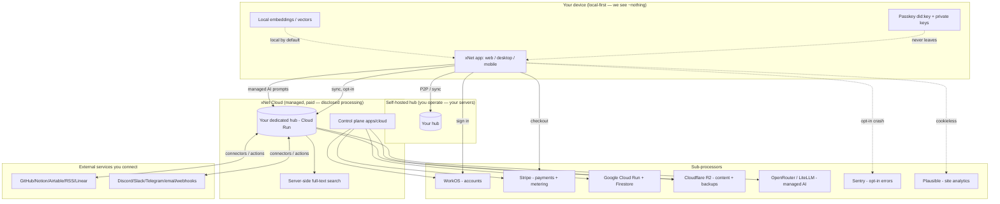
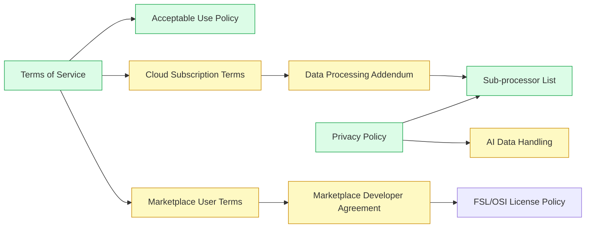
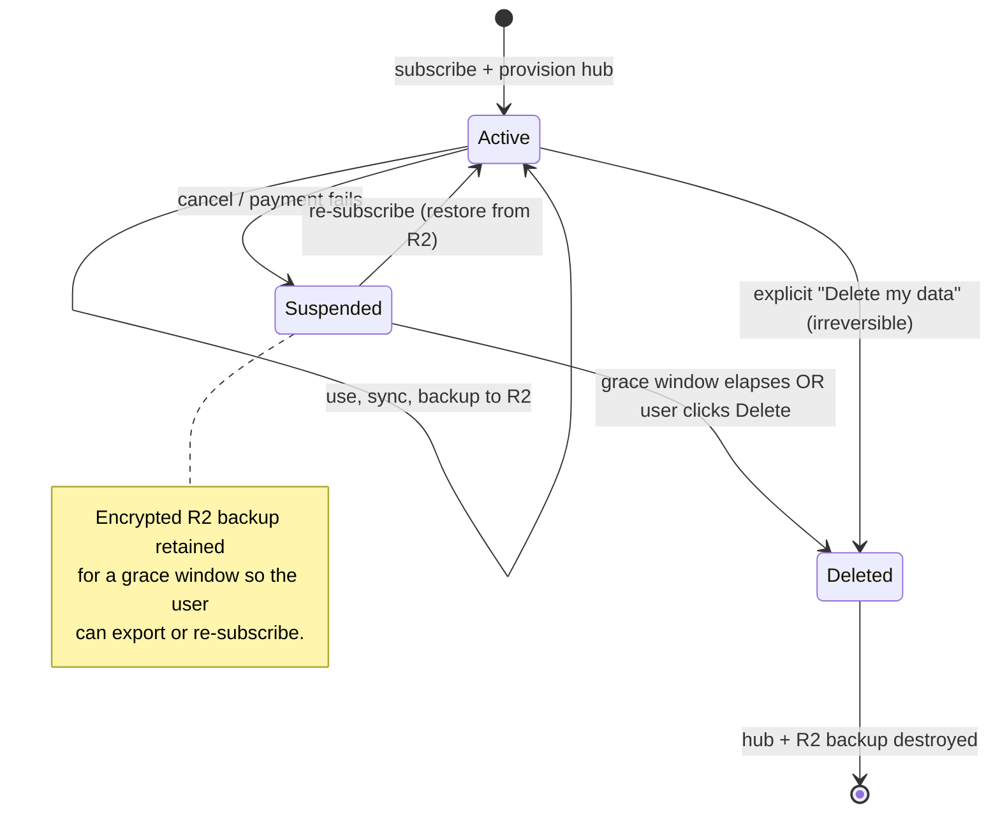
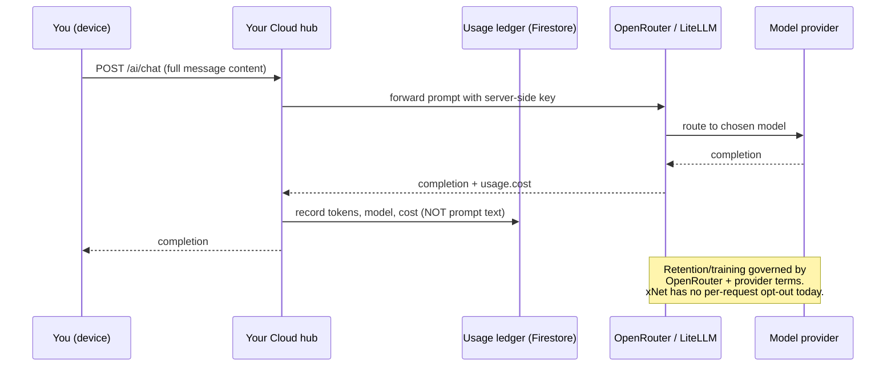

# Terms of Service & Privacy Policy Refresh for Cloud, AI, and the Marketplace

## Problem Statement

xNet's public legal documents — [`site/src/pages/terms.astro`](../../site/src/pages/terms.astro)
and [`site/src/pages/privacy.astro`](../../site/src/pages/privacy.astro) — were
**last updated February 6, 2026** and describe a product that no longer fully
exists. They were written for a purely local-first, no-account, no-payment app
whose only server was a thin, content-blind sync relay:

> "Your data lives on your devices, not our servers."
> "No account required — You can use xNet without creating an account or giving us your email."
> "encrypted data passes through but we can't read it."
> "We don't share your data with AI training."

Since then the repository has shipped, or is about to ship:

- **xNet Cloud** — a managed control plane (`apps/cloud/`) with **WorkOS
  accounts**, **Stripe billing**, paid subscription plans, and per-tenant
  **dedicated hosted hubs** whose content and database backups live in
  **Cloudflare R2** and **Google Cloud**.
- **Managed AI** — a keyless tier that forwards user prompts to **OpenRouter /
  LiteLLM** and on to third-party model providers, with usage metered for
  billing.
- **A plugin marketplace** — third-party, potentially **paid** plugins that run
  partially-trusted code with declared capabilities, distributed via a community
  registry.
- **Integrations & connectors** — inbound webhooks and pull connectors
  (GitHub/Notion/Airtable/RSS/Linear) and outbound actions
  (Discord/Slack/Telegram/email/webhook-out) that move user content to and from
  external services.
- **Telemetry, analytics, and consent** — already partly documented (Plausible +
  opt-in Sentry, the consent spine), but the legal docs reference only a slice.

The current documents are now **inaccurate in ways that create real legal and
trust risk**: they promise things the managed offering cannot keep ("we can't
read it," "no account"), and they omit the disclosures that paid hosting, payment
processing, AI sub-processing, and a third-party marketplace legally require
(sub-processors, retention, DSAR for server-side data, a DPA for business
customers, AI data-handling, marketplace developer terms).

The goal: **bring the legal documents into honest, specific alignment with what
the code actually does today**, before Cloud goes live, without abandoning the
local-first promise that remains true for the self-hosted/offline path.

> ⚠️ This exploration is engineering/product analysis to scope the work and draft
> starting language. It is **not legal advice**. The final text — especially the
> DPA, marketplace developer agreement, liability/indemnity, and governing-law
> clauses — should be reviewed by a qualified attorney before publishing.

## Executive Summary

The legacy docs are built on a single premise — *"we never see your data"* — that
is **still true for the local-first / self-hosted path but false for several new
managed features**. The fix is not to abandon the local-first framing; it is to
adopt the **two-context model** that mature local-first vendors use (Obsidian is
the canonical example): clearly separate **"the app on your device / your own
hub" (we collect ~nothing)** from **"xNet Cloud, the managed paid service" (here
is exactly what we collect, store, share, and for how long)**.

Recommended outcome — a small **document set**, not a single rewritten page:

| Document | Audience | Status today | Priority |
|---|---|---|---|
| **Privacy Policy** (rewrite) | Everyone | Stale | **P0 — before launch** |
| **Terms of Service** (rewrite) | Everyone | Stale | **P0 — before launch** |
| **Sub-processor list** (new) | Cloud users, DPOs | Missing | **P0 — before launch** |
| **Acceptable Use Policy** (new/extract) | Cloud + hub users | Buried in ToS | **P0 — before launch** |
| **Cloud Subscription Terms** (new section/page) | Paying customers | Missing | **P1** |
| **Data Processing Addendum (DPA)** | Team/Enterprise (B2B) | Missing | **P1 — needed to close deals** |
| **Marketplace: Developer Agreement + User Terms** | Plugin authors & installers | Missing | **P1 — before paid plugins** |
| **AI data-handling disclosure** | Managed-AI users | Missing | **P1** (can live inside Privacy Policy) |

The single most important correction: **stop saying "we can't read your data" as
a blanket claim.** It must be scoped. The hub offers **server-side full-text
search** and **managed AI**, both of which require the hub to process content in
the clear; tenant content and DB snapshots are stored in R2. The honest framing
is *"local-first and end-to-end where we can be; explicitly not, and disclosed,
where a feature you opt into requires us to process content."*

## Current State In The Repository

### The legacy legal documents

- [`site/src/pages/terms.astro`](../../site/src/pages/terms.astro) — "Last
  updated: February 6, 2026." Defines "Services" as desktop app, web app at
  `xnet.fyi/app`, the hosted Hub at `hub.xnet.fyi`, docs and website. No mention
  of accounts, payment, Cloud, hosting, AI, or the marketplace. Adapted from
  Basecamp's open policies (CC BY 4.0).
- [`site/src/pages/privacy.astro`](../../site/src/pages/privacy.astro) — same
  date. Asserts no-account use, peer-to-peer/WebRTC sync, "optional Hub relay …
  we can't read it," Plausible analytics, opt-in crash reporting. The analytics +
  crash-reporting paragraphs were modernized in exploration
  [`0210`](0210_[x]_ERROR_MONITORING_PRIVACY_ANALYTICS_AND_CONSENT_ACROSS_SURFACES.md);
  the rest predates Cloud.
- Footer ([`site/src/components/sections/Footer.astro`](../../site/src/components/sections/Footer.astro))
  already links **xNet Cloud**, **Pricing**, **Status**, **Open metrics** — the
  product surface the legal docs have not caught up to. `legalLinks` is just
  `MIT License`, `Privacy`, `Terms`.

### What the code now actually does (the gap)

The following was confirmed by reading source. Citations are file paths; line
numbers are approximate and may drift.

#### 1. Accounts, identity & billing (was: "no account required")

- **WorkOS AuthKit** is the custodial billing identity.
  [`packages/cloud/src/identity/workos.ts`](../../packages/cloud/src/identity/workos.ts)
  collects **email** (mandatory) and **optional first/last name**, plus the WorkOS
  user id. The deliberate split between a **custodial billing identity** (email,
  WorkOS) and a **non-custodial data identity** (passkey `did:key`, never sent to
  us) is documented in
  [`packages/cloud/src/identity/binding.ts`](../../packages/cloud/src/identity/binding.ts).
- **Sessions** are a signed (HMAC-SHA256, httpOnly) cookie carrying
  `billingUserId` + `email`, 7-day TTL
  ([`apps/cloud/src/session.ts`](../../apps/cloud/src/session.ts)).
- **Stripe** processes plan subscriptions and metered AI overage
  ([`apps/cloud/src/billing/stripe-gateway.ts`](../../apps/cloud/src/billing/stripe-gateway.ts),
  [`packages/cloud/src/billing/billing.ts`](../../packages/cloud/src/billing/billing.ts)).
  Email + `customerRef` (WorkOS id) + plan flow to Stripe at checkout.
- **Plans**: `demo` (free), `personal` ($5/mo), `family` ($15/mo), `team`
  ($12/seat/mo), `enterprise` (custom) —
  [`site/src/data/pricing.ts`](../../site/src/data/pricing.ts),
  [`apps/cloud/src/billing-gateway.ts`](../../apps/cloud/src/billing-gateway.ts).
- **Usage ledger** records per-tenant `inputTokens`, `outputTokens`, `model`,
  `chargeUsd`, `providerCostUsd`, timestamp — but **not prompt content**
  ([`packages/cloud/src/billing/ledger.ts`](../../packages/cloud/src/billing/ledger.ts),
  [`apps/cloud/src/stores/usage-ledger.ts`](../../apps/cloud/src/stores/usage-ledger.ts),
  Firestore `usage` collection).

#### 2. Managed hosting & where content now lives (was: "not our servers")

- Cloud **provisions an isolated hub per tenant** on **Google Cloud Run**
  ([`apps/cloud/src/provisioner/google-cloud-run-client.ts`](../../apps/cloud/src/provisioner/google-cloud-run-client.ts)),
  pinned to a specific immutable hub image.
- **Tenant content** (encrypted blobs, ContentID/BLAKE3-keyed) and the **hub's
  SQLite database** are stored/backed up in **Cloudflare R2** under a per-tenant
  `t/<tenantId>/` prefix
  ([`packages/cloud/src/storage/s3-adapter.ts`](../../packages/cloud/src/storage/s3-adapter.ts),
  snapshot key `t/<tenantId>/db` in
  [`apps/cloud/src/control-plane.ts`](../../apps/cloud/src/control-plane.ts)).
  Continuous backup via Litestream; nightly restore-verification drill
  ([`apps/cloud/src/backup/restore-drill.ts`](../../apps/cloud/src/backup/restore-drill.ts)).
- **Control-plane state** (tenants, bindings, usage) is in **Google Firestore**
  ([`apps/cloud/src/stores/firestore.ts`](../../apps/cloud/src/stores/firestore.ts)).
- **Retention/lifecycle**: canceled subscription → live hub destroyed, **R2
  backup retained for a grace window** so the user can re-subscribe or export;
  explicit, irreversible "delete my data" destroys hub + backup
  ([`apps/cloud/src/dashboard.ts`](../../apps/cloud/src/dashboard.ts),
  `/account/delete-data` in [`apps/cloud/src/server.ts`](../../apps/cloud/src/server.ts)).

#### 3. Managed AI (was: "we don't share your data with AI training")

- The web `ManagedProvider` POSTs the **full message history** to the hub's
  `POST /ai/chat` ([`packages/plugins/src/ai/providers.ts`](../../packages/plugins/src/ai/providers.ts),
  [`apps/web/src/workbench/views/ai-chat-connector.ts`](../../apps/web/src/workbench/views/ai-chat-connector.ts)).
- The hub forwards prompts to **OpenRouter** (`/chat/completions`) or a **LiteLLM**
  proxy, which routes to the underlying model provider (Anthropic/OpenAI/Google/…)
  ([`packages/cloud/src/ai/openrouter-gateway.ts`](../../packages/cloud/src/ai/openrouter-gateway.ts),
  [`packages/cloud/src/ai/gateway.ts`](../../packages/cloud/src/ai/gateway.ts),
  [`apps/cloud/src/ai/route.ts`](../../apps/cloud/src/ai/route.ts),
  [`apps/cloud/src/ai/wiring.ts`](../../apps/cloud/src/ai/wiring.ts)). Provider keys
  are server-side secrets and never reach the client.
- **Gap**: there is **no xNet-side training-opt-out toggle** in the AI code; the
  training/retention stance is whatever OpenRouter and the chosen model provider
  enforce. The docs must say so plainly and not over-promise.
- The **"second brain" / GraphRAG / vectors** path
  ([`packages/brain/`](../../packages/brain/), [`packages/vectors/`](../../packages/vectors/))
  embeds **locally** with an in-process model (no network) by default — a point
  worth keeping in the policy as a positive.

#### 4. Integrations & connectors (data in and out)

- Inbound **pull connectors** (GitHub/Notion/Airtable/RSS/Linear) run hub-side
  with broker-scoped secrets and host-allowlisted `guardedFetch`, materializing
  `ExternalItem` nodes
  ([`packages/plugins/src/connectors/`](../../packages/plugins/src/connectors/)).
- Outbound **actions** (`defineAction`) push node properties to
  Discord/Slack/Telegram/email/generic webhooks, SSRF-guarded
  ([`packages/plugins/src/actions/define-action.ts`](../../packages/plugins/src/actions/define-action.ts)).
- **Webhook inbox** `POST /hooks/:token` accepts arbitrary external payloads;
  signed Stripe/Sentry/PagerDuty webhooks verified hub-side
  ([`packages/hub/src/features/webhook-inbox.ts`](../../packages/hub/src/features/webhook-inbox.ts),
  [`webhook-integrations.ts`](../../packages/hub/src/features/webhook-integrations.ts)).
- Third-party API tokens live in the **hub broker**, never on the client.

#### 5. Plugin marketplace (untrusted third-party code + payments)

- Browse/install in-app
  ([`apps/web/src/components/MarketplaceView.tsx`](../../apps/web/src/components/MarketplaceView.tsx))
  and on the site ([`site/src/pages/plugins.astro`](../../site/src/pages/plugins.astro)),
  backed by a committed registry (`registry/`,
  [`packages/plugins/src/ecosystem/marketplace.ts`](../../packages/plugins/src/ecosystem/marketplace.ts)).
- Community plugins are **third-party code**, installed with a **capability
  consent dialog** and run in a **trust-tiered sandbox** (iframe for marketplace,
  SES/QuickJS for user-tier)
  ([`packages/plugins/src/ecosystem/consent.ts`](../../packages/plugins/src/ecosystem/consent.ts),
  [`capability-guard.ts`](../../packages/plugins/src/ecosystem/capability-guard.ts),
  [`runtime.ts`](../../packages/plugins/src/ecosystem/runtime.ts)).
- **Paid plugins** are modeled: manifest `pricing` (`free`/`one-time`/
  `subscription`), `managed` (Stripe Connect, 10% fee) vs `byo` billing,
  `publisherDid`, FSL/OSI license allowlist
  ([`packages/plugins/src/manifest.ts`](../../packages/plugins/src/manifest.ts),
  [`license-policy.ts`](../../packages/plugins/src/ecosystem/license-policy.ts)).
- **Gap**: **no developer agreement, no marketplace user terms, no content/refund
  policy** exist today. A `registry/blocked.json` revocation mechanism exists but
  is empty.

#### 6. Telemetry / analytics / abuse (partly documented)

- Consent spine ([`apps/web/src/lib/consent.ts`](../../apps/web/src/lib/consent.ts),
  `@xnetjs/telemetry`), default **off**; Plausible (cookieless), opt-in Sentry,
  hub `diagnosticsSharingFeature` off by default and scrubbed. Already partly in
  the privacy policy — keep and extend.
- Abuse/enforcement primitives ([`packages/abuse/`](../../packages/abuse/)):
  signed policy block lists (reject/hide/quarantine/block-peer), optional cloud
  classifier with privacy modes (`metadata-only`/`redacted`/`raw`), hub policy
  offers with appeal channels. This informs an honest **Acceptable Use** +
  **enforcement/appeals** section.

### The data-flow picture today



## External Research

**Closest analog — Obsidian** (local-first app, optional paid Sync/Publish). Its
[privacy policy](https://obsidian.md/privacy) is organized by **usage context**,
not by data type: separate summaries for *"apps on your device"* ("all data is
saved locally … never sent to our servers"), *"Sync and Publish"* (server-side,
E2EE, retention windows), and *"account"* (email for purchases, payment
processors disclosed). Retention is concrete: on expiry, Sync data is **kept ~1
month then deleted; deleted immediately if you cancel.** This two-context split is
exactly the structure xNet needs. Note one difference: Obsidian Sync is
**end-to-end encrypted**, so they *can* keep the "we can't read it" promise for
Sync; xNet's managed FTS and AI mean xNet **cannot** make that blanket claim and
must scope it per-feature.

**Marketplace terms — Figma** ([Developer Terms](https://www.figma.com/legal/developer-terms/),
[Creator Agreement](https://www.figma.com/legal/creator-agreement/)) establish the
template every plugin marketplace converges on: third-party resources are **"as
is," no warranty, no platform liability**; developers must **maintain their own
privacy policy** if they process user data and **indemnify** the platform; a
**flat revenue-share fee** (Figma 15%; xNet's manifest models 10% managed). xNet
needs the equivalent: a Developer Agreement (author-facing) and short Marketplace
Terms (installer-facing) that disclaim liability for third-party code and put data
responsibility on the author.

**AI sub-processing & DPAs.** Industry practice for SaaS that sends customer data
to an LLM API: (1) **list the AI provider as a sub-processor**; (2) state the
**training stance** explicitly (most enterprise LLM APIs — OpenAI API, Anthropic,
Google Cloud — pledge *not to train on submitted data by default*); (3) provide a
**GDPR Art. 28 DPA** with **general authorization + advance notice of
sub-processor changes (commonly 30 days) + a right to object** for business
customers; (4) honor **CCPA/CPRA** "service provider" flow-down (no selling, use
limited to the service). Because xNet relays through **OpenRouter**, the policy
must be careful: OpenRouter's and the downstream provider's terms govern
retention/training, and xNet currently has **no toggle** to enforce a stricter
stance — so the docs should disclose the chain rather than promise more than the
code delivers.

Sources:
- [Obsidian Privacy Policy](https://obsidian.md/privacy) · [Security & privacy](https://obsidian.md/help/Security+and+privacy)
- [Figma Developer Terms](https://www.figma.com/legal/developer-terms/) · [Creator Agreement](https://www.figma.com/legal/creator-agreement/) · [Plugin review guidelines](https://help.figma.com/hc/en-us/articles/360039958914-Plugin-and-widget-review-guidelines)
- [OpenAI DPA](https://openai.com/policies/data-processing-addendum/) · [The SaaS DPA Guide (Secure Privacy)](https://secureprivacy.ai/blog/data-processing-agreements-dpas-for-saas) · [Asana sub-processors (format example)](https://asana.com/terms/subprocessors)

## Key Findings

1. **The core promise changed for paid features, not for the base product.** The
   local-first / self-hosted / offline path is still "we see ~nothing." Cloud is a
   *different deal*. The docs must present both honestly, context-first
   (Obsidian's model), rather than retrofitting cloud caveats into a "we never
   see your data" frame.

2. **"We can't read your data" is now partly false and is the highest-risk
   sentence in the docs.** Managed AI sends cleartext to OpenRouter; server-side
   FTS and R2-stored content/backups mean the hub processes content in the clear
   for opt-in features. The pricing FAQ already says *"We hold encrypted bytes we
   cannot read"* ([`site/src/data/pricing.ts`](../../site/src/data/pricing.ts)) —
   **this marketing claim is in tension with the same features and must be
   reconciled** (scope it: identity keys and at-rest blobs are encrypted/keyed to
   you; specific features you enable require processing).

3. **Six material disclosure categories are entirely missing**: (a) account/PII
   via WorkOS, (b) payment data via Stripe, (c) hosting/storage location (GCP +
   R2) and international transfer, (d) AI sub-processing chain, (e) a
   sub-processor list, (f) a DPA for business (Team/Enterprise) customers.

4. **The marketplace has no legal scaffolding at all.** Paid third-party code is
   modeled in the manifest but there is no developer agreement, no installer-facing
   marketplace terms, no liability disclaimer for third-party plugins, no
   content/refund/takedown policy. Shipping paid plugins without these is the
   riskiest single gap.

5. **A lot of good privacy engineering already exists and should be *claimed* in
   the docs**: the billing/data identity split, server-side-only secrets for
   connectors/AI (keys never reach the client), local-by-default embeddings,
   consent-default-off telemetry, scrubbing, the explicit irreversible-delete
   flow, and the grace-window retention model. The rewrite is as much about
   *accurately taking credit* as about adding caveats.

6. **Children's age threshold should rise.** Current copy says "under 13"
   (COPPA). With EU users and accounts/payments, the common safe floor is **16**
   (GDPR Art. 8 default), or 13 with parental-consent caveats per jurisdiction.

7. **Governing law and entity are unspecified.** The docs say "the jurisdiction
   where the maintainers are located." Paid contracts, a DPA, and Stripe/WorkOS
   relationships need a **named legal entity and jurisdiction**. This is a
   business decision, flagged as an open question.

## Options And Tradeoffs

### Option A — Minimal patch: edit the two existing pages in place

Add a "Cloud" subsection to each of `terms.astro` and `privacy.astro`; fix the
worst sentences.

- ✅ Smallest effort; one PR; nothing new to maintain.
- ❌ Produces a Frankenstein doc that still *leads* with "we never see your
  data," then contradicts itself. No sub-processor list (a near-mandatory artifact
  once you have a DPA). No marketplace terms. Doesn't actually de-risk launch.

### Option B — Restructure the two pages by context + add a sub-processor page (recommended core)

Rewrite both pages around **"local/self-hosted" vs "xNet Cloud"** (Obsidian
model). Add a committed, versioned **`/subprocessors`** page. Extract an
**Acceptable Use Policy**. This is the **P0 launch-blocking** set.

- ✅ Honest, well-structured, matches industry norm, directly de-risks the Cloud
  launch. Sub-processor list is reusable by the DPA.
- ✅ Fits existing site patterns (a new `.astro` page; `/subprocessors` can mirror
  the committed-data pattern used by `metrics.json` / `pricing.ts`).
- ❌ More writing; needs a maintenance habit (update sub-processors when infra
  changes).

### Option C — Full document set: B + DPA + Marketplace Developer Agreement + Cloud Subscription Terms

Everything in B, plus the **B2B/marketplace contracts**.

- ✅ Complete; required before **selling to businesses** (DPA) and **shipping paid
  plugins** (developer agreement). This is where you must end up.
- ❌ Largest scope; DPA and developer agreement genuinely need legal review;
  best done as a fast-follow (P1), not a launch blocker for the consumer plans.

### Option D — Adopt a generated framework (e.g. a policy generator / iubenda)

- ✅ Fast, keeps current with law changes.
- ❌ Generic, off-brand, often inaccurate for an unusual local-first +
  E2EE-partial + marketplace architecture; would still need heavy hand-editing to
  be truthful about xNet's specific data flows. The repo's voice ("simple terms
  for a simple promise") is a differentiator worth keeping.

### Comparison

| | A Patch | B Restructure + subproc | C Full set | D Generator |
|---|---|---|---|---|
| Honest about Cloud | ⚠️ partial | ✅ | ✅ | ⚠️ |
| Sub-processor disclosure | ❌ | ✅ | ✅ | ✅ |
| Unblocks consumer launch | ❌ | ✅ | ✅ | ⚠️ |
| Unblocks B2B (DPA) | ❌ | ❌ | ✅ | ⚠️ |
| Unblocks paid plugins | ❌ | ❌ | ✅ | ❌ |
| On-brand voice | ✅ | ✅ | ✅ | ❌ |
| Effort | XS | M | L | S+edits |

## Recommendation

**Do B now (P0, launch-blocking), then C as a fast-follow (P1).** Concretely:

**Phase 1 — before xNet Cloud is publicly live (P0):**

1. **Rewrite the Privacy Policy** around the two-context model: *(a) The app &
   your own hub* → minimal/nothing; *(b) xNet Cloud* → a precise, per-feature
   account of accounts, payments, hosting/storage, managed AI, connectors,
   retention, your rights/DSAR. Scope every "we can't read it" claim.
2. **Rewrite the Terms of Service**: add Accounts & Billing, the Cloud
   subscription/cancellation/grace-window/refund basics, managed-AI terms, a
   pointer to the Marketplace terms and AUP, and a named entity + governing law.
3. **Add `/subprocessors`** — a committed, dated table (the table below), linked
   from the footer `legalLinks` and from both policies.
4. **Extract an Acceptable Use Policy** (`/acceptable-use`) from the ToS, expanded
   with the enforcement/appeals reality from `packages/abuse/`.
5. **Reconcile the marketing copy** — make `pricing.ts`'s "we cannot read" FAQ
   answer consistent with the scoped policy language.

**Phase 2 — before selling to businesses and before paid plugins (P1):**

6. **Data Processing Addendum** for Team/Enterprise (GDPR Art. 28; general
   sub-processor authorization + 30-day change notice; CCPA service-provider
   terms). Reuses the sub-processor list.
7. **Marketplace Developer Agreement** (author-facing: "as is," indemnity, own
   privacy policy if processing user data, license/FSL compliance, revenue share,
   takedown/revocation) **+ short Marketplace Terms** (installer-facing: plugins
   are third-party, capability consent, no platform warranty).
8. **AI data-handling note** consolidated (can live inside the Privacy Policy):
   the OpenRouter chain, the no-on-device-training default, and the honest "we
   don't currently offer a per-request training opt-out beyond the provider's
   default."

**Phase 3 — polish (P2):** region/residency language for Enterprise, security
page / responsible-disclosure, a "legal changelog," and machine-readability
(`/subprocessors.json`) if a notify-on-change flow is wanted.

### Proposed sub-processor table (P0 artifact)

| Sub-processor | Purpose | Data shared | Where | Proof in repo |
|---|---|---|---|---|
| **WorkOS** | Accounts / auth / SSO | Email, name, user id | US | [`packages/cloud/src/identity/workos.ts`](../../packages/cloud/src/identity/workos.ts) |
| **Stripe** | Payments + AI metering | Email, customer ref, plan, charge amounts | US | [`apps/cloud/src/billing/stripe-gateway.ts`](../../apps/cloud/src/billing/stripe-gateway.ts) |
| **Google Cloud (Run + Firestore)** | Hub compute + control-plane state | Tenant metadata, usage ledger, running hub | Region per plan | [`apps/cloud/src/provisioner/google-cloud-run-client.ts`](../../apps/cloud/src/provisioner/google-cloud-run-client.ts), [`stores/firestore.ts`](../../apps/cloud/src/stores/firestore.ts) |
| **Cloudflare R2** | Content blobs + DB backups | Encrypted tenant content, SQLite snapshots | Cloudflare | [`packages/cloud/src/storage/s3-adapter.ts`](../../packages/cloud/src/storage/s3-adapter.ts) |
| **OpenRouter / LiteLLM** | Managed AI gateway | Prompt + message content (opt-in feature) | US / provider | [`packages/cloud/src/ai/openrouter-gateway.ts`](../../packages/cloud/src/ai/openrouter-gateway.ts) |
| **Sentry** | Error monitoring (opt-in) | Scrubbed crash reports | US | [`apps/cloud/src/sentry.ts`](../../apps/cloud/src/sentry.ts), [`apps/web/src/lib/sentry.ts`](../../apps/web/src/lib/sentry.ts) |
| **Plausible** | Cookieless site analytics | Page views, country, UA (no PII) | EU | [`apps/web/src/lib/analytics.ts`](../../apps/web/src/lib/analytics.ts) |

> Connectors (GitHub/Notion/Slack/etc.) are **user-initiated integrations**, not
> xNet sub-processors — disclose them as "services you choose to connect," whose
> own terms govern.

### Document relationships



### Tenant data lifecycle (retention language must match this)



### Managed-AI data flow (the disclosure the Privacy Policy must make)



## Example Code

### Draft: Privacy Policy "two-context" opening (replaces "The Short Version" + "How xNet is Different")

```html
<section class="mb-12">
  <h2>Two ways to use xNet — two very different privacy stories</h2>
  <p>
    xNet works the same on the surface whether you run it yourself or let us host
    it, but who can see your data is completely different. Read the part that
    applies to you.
  </p>

  <h3>1. The app, on your device, with your own hub (local-first)</h3>
  <p>
    When you use xNet offline, sync peer-to-peer, or connect to a hub you operate,
    <strong>your data stays with you and we collect essentially nothing.</strong>
    Your cryptographic identity is generated on your device and never leaves it.
    No account is required for this path.
  </p>

  <h3>2. xNet Cloud (our managed, paid hosting)</h3>
  <p>
    If you sign up for xNet Cloud, you create an account and we run a dedicated
    hub for you. To do that, we and our service providers necessarily process some
    of your information. <strong>For features you turn on — server-side search and
    managed AI — your content is processed in readable form;</strong> we are
    specific about this below rather than claiming we can never see anything.
    Everything else is encrypted and keyed to an identity only you hold.
  </p>
</section>
```

### Draft: the scoped "what we can and can't see" replacement (this is the critical correction)

```html
<section class="mb-12">
  <h2>What we can and can't see on xNet Cloud</h2>
  <ul>
    <li>
      <strong>Your private keys / data identity:</strong> never sent to us. We
      cannot impersonate you or decrypt anything keyed solely to you. This is why
      "delete my data" is irreversible even for us.
    </li>
    <li>
      <strong>Content at rest in backups:</strong> stored as encrypted blobs in
      object storage.
    </li>
    <li>
      <strong>Server-side full-text search:</strong> to make your data searchable
      on the hub, the hub processes your content and builds a search index.
    </li>
    <li>
      <strong>Managed AI:</strong> when you use it, the messages you send are
      transmitted in readable form to our AI gateway (OpenRouter) and the model
      provider you select. See "Managed AI" below.
    </li>
  </ul>
  <p>
    We do not sell your data, show ads, or use your content to train our own
    models. We log AI <em>usage</em> (token counts and cost) for billing, never
    your prompt text.
  </p>
</section>
```

### Draft: Managed AI disclosure

```html
<section class="mb-12">
  <h2>Managed AI</h2>
  <p>
    Paid plans include a managed AI gateway. When you send a message to the AI:
  </p>
  <ul>
    <li>Your message content is sent to our gateway provider,
      <a href="https://openrouter.ai">OpenRouter</a>, which routes it to the model
      provider you choose (e.g. Anthropic, OpenAI, Google).</li>
    <li>We record only token counts, the model used, and cost for billing — not
      your prompt or the response text.</li>
    <li>Retention and whether your inputs are used to improve a model are governed
      by OpenRouter's and the model provider's terms. Most providers do not train
      on API inputs by default; xNet does not currently offer a per-request
      training opt-out beyond that default, and we will not enable managed AI for
      you without your action.</li>
  </ul>
  <p>
    xNet's on-device "second brain" embeddings are computed locally and do not
    leave your device.
  </p>
</section>
```

### Draft: new `/subprocessors` page (committed-data pattern)

```astro
---
import Base from '../layouts/Base.astro'
import Nav from '../components/sections/Nav.astro'
import Footer from '../components/sections/Footer.astro'

// Single source of truth; update when infrastructure changes.
const updated = 'June 2026'
const subprocessors = [
  { name: 'WorkOS', purpose: 'Accounts, authentication, SSO', data: 'Email, name, account id', region: 'United States' },
  { name: 'Stripe', purpose: 'Payments and AI usage metering', data: 'Email, plan, charges', region: 'United States' },
  { name: 'Google Cloud (Run, Firestore)', purpose: 'Hub compute and control-plane state', data: 'Tenant metadata, usage records, running hub', region: 'Per plan / region-pinned for Enterprise' },
  { name: 'Cloudflare R2', purpose: 'Encrypted content blobs and database backups', data: 'Encrypted tenant content, DB snapshots', region: 'Cloudflare network' },
  { name: 'OpenRouter', purpose: 'Managed AI gateway (opt-in feature)', data: 'Prompt and message content', region: 'United States / provider' },
  { name: 'Sentry', purpose: 'Error monitoring (opt-in)', data: 'Scrubbed crash reports', region: 'United States' },
  { name: 'Plausible', purpose: 'Cookieless website analytics', data: 'Page views, country, device (no PII)', region: 'European Union' },
]
---
<Base title="Sub-processors - xNet" description="Third parties that process data for xNet Cloud.">
  <Nav />
  <main class="min-h-screen bg-white dark:bg-gray-900">
    <div class="mx-auto max-w-3xl px-6 py-16">
      <h1 class="text-4xl font-bold mb-2">Sub-processors</h1>
      <p class="text-sm text-gray-500">Last updated: {updated}</p>
      <p class="my-6">These third parties process data on our behalf to run xNet
        Cloud. The local-first app and self-hosted hubs use none of them.</p>
      <table class="w-full text-sm">
        <thead><tr><th>Provider</th><th>Purpose</th><th>Data</th><th>Region</th></tr></thead>
        <tbody>
          {subprocessors.map((s) => (
            <tr><td>{s.name}</td><td>{s.purpose}</td><td>{s.data}</td><td>{s.region}</td></tr>
          ))}
        </tbody>
      </table>
    </div>
  </main>
  <Footer />
</Base>
```

### Draft: footer wiring

```astro
// site/src/components/sections/Footer.astro — extend legalLinks
const legalLinks = [
  { label: 'MIT License', href: 'https://github.com/crs48/xNet/blob/main/LICENSE' },
  { label: 'Privacy', href: '/privacy' },
  { label: 'Terms', href: '/terms' },
  { label: 'Acceptable Use', href: '/acceptable-use' },   // new
  { label: 'Sub-processors', href: '/subprocessors' },    // new
]
```

## Risks And Open Questions

- **Named legal entity & governing law (blocking for the DPA and any contract).**
  Who is the contracting party (a company? the maintainers?) and in what
  jurisdiction? Stripe, WorkOS, and B2B customers all need this. **Owner: business.**
- **"We can't read your data" vs. server-side FTS + managed AI.** Confirm whether
  FTS indexes plaintext on the hub (the research indicates yes via the AI surface /
  search). If any plan is genuinely zero-knowledge, say so per-plan; otherwise
  scope the claim. **Do not ship the old blanket sentence.**
- **OpenRouter retention/training chain.** xNet has no per-request opt-out. Decide
  whether to (a) disclose the chain as-is, (b) negotiate/enable a stricter
  provider mode, or (c) add a no-managed-AI/local-only stance for privacy-sensitive
  plans. The docs must not promise more than the gateway enforces.
- **Marketplace liability.** Until the Developer Agreement + Marketplace Terms
  exist, **do not enable paid third-party plugins**. Free third-party plugins
  still need an installer-facing "this is third-party code" disclaimer.
- **International data transfer.** GCP/R2 regions and cross-border transfer
  (SCCs/DPF) language is needed for EU users, especially before "data residency"
  is advertised on the Enterprise tier.
- **Children's age threshold.** Move from 13 to a defensible floor (16 in the EU)
  given accounts/payments; confirm with counsel.
- **Refunds & SLA wording.** Pricing advertises "99.9% best-effort availability"
  and annual billing for Personal; the ToS must state the actual refund and
  uptime commitments (or explicitly that best-effort = no SLA credits except
  Enterprise).
- **Versioning / notice of change.** With paying customers, "we'll update the
  date" is thin. Consider a legal changelog and (for material changes) email
  notice via WorkOS contact.

## Implementation Checklist

Implemented in PR (branch `claude/legal-docs-cloud-refresh`). Items left unchecked
are genuinely external (a business decision or a lawyer's sign-off) and cannot be
completed in-repo.

- [ ] **Confirm legal entity, jurisdiction, and governing law** (business decision; unblocks DPA/ToS). *Interim: docs say "the xNet project and its maintainers" with a source-level `NOTE FOR MAINTAINERS` placeholder; governing-law clause unchanged pending a named entity.*
- [x] **Rewrite `site/src/pages/privacy.astro`** around the two-context model with the scoped "what we can/can't see," Accounts (WorkOS), Payments (Stripe), Hosting/Storage (GCP + R2), Managed AI, Connectors, Retention/lifecycle, DSAR for server-side data, updated children's-age threshold.
- [x] **Rewrite `site/src/pages/terms.astro`**: expand "Services" to include Cloud/dashboard/managed hubs/marketplace/AI; add Accounts & Billing, Cloud subscription/cancellation/grace-window/refunds, managed-AI terms, pointers to AUP + Marketplace terms. *(Named entity + governing law deferred to the item above.)*
- [x] **Add `site/src/pages/subprocessors.astro`** (committed table above); link from both policies.
- [x] **Add `site/src/pages/acceptable-use.astro`** (extract + expand from ToS; reflect `packages/abuse/` enforcement + appeals reality).
- [x] **Update `Footer.astro` `legalLinks`** to add Acceptable Use + Sub-processors.
- [x] **Reconcile `site/src/data/pricing.ts` FAQ** "we cannot read" answer with the scoped policy language.
- [x] **Bump "Last updated" date** on both policies (2026-06-24).
- [x] **(P1) Draft the Data Processing Addendum** (Team/Enterprise) reusing the sub-processor list — published as `/dpa` with a visible *draft / not-yet-in-effect* banner; legal review still required.
- [x] **(P1) Draft Marketplace Developer Agreement + Marketplace User Terms** — published as `/marketplace-terms`; developer half marked draft, paid-plugin enablement gated on finalization.
- [x] **(P1) Consolidate AI data-handling disclosure** into the Privacy Policy's "Managed AI" section. *Decision on the OpenRouter retention/training stance remains open (see Risks).*
- [~] **(P2)** International-transfer language **added** to the Privacy Policy; security-contact (`security@xnet.fyi`) **added** to the AUP. Dedicated security/responsible-disclosure page, legal changelog, and `/subprocessors.json` **deferred**.
- [ ] **Legal review of the full set before publishing.** *External — requires counsel.*

## Validation Checklist

- [x] No remaining **blanket** "we can't read your data" / "your data never leaves your device" / "no account required" claims that contradict the Cloud path; every such claim is scoped to local/self-hosted or per-feature.
- [x] Every sub-processor in the table has a **proof file path** in the repo (cited in this exploration and reachable from the running Cloud code).
- [x] The Privacy Policy's managed-AI section matches the real flow in [`apps/cloud/src/ai/route.ts`](../../apps/cloud/src/ai/route.ts) (content to OpenRouter; only usage logged).
- [x] Retention language matches the **state machine** in [`apps/cloud/src/dashboard.ts`](../../apps/cloud/src/dashboard.ts) / `/account/delete-data` (grace window on cancel; irreversible delete).
- [x] `/subprocessors`, `/acceptable-use`, `/dpa`, `/marketplace-terms`, `/privacy`, `/terms` all build (`astro build` → 88 pages, all 6 emitted) with no console errors; verified in a local preview.
- [x] Footer links resolve; both policies cross-link to sub-processors + AUP (verified in built HTML and preview).
- [x] Children's-age threshold updated (16) and consistent.
- [x] Pricing FAQ and policy language are mutually consistent (no "we cannot read" vs. "FTS/AI process content" contradiction).
- [ ] A lawyer has reviewed the ToS, Privacy Policy, DPA, and Marketplace agreements before they go live. *External — pending; DPA + developer agreement carry visible draft banners until then.*
- [ ] Paid third-party plugins remain disabled until the Developer Agreement + Marketplace Terms are finalized. *Operational gate — to enforce at enablement time.*

> Note (pre-existing, out of scope): the site has no `@tailwindcss/typography`
> plugin (`plugins: []`), so the `prose` classes on these legal pages are no-ops —
> headings/lists render flat, exactly as the original `terms`/`privacy` pages did
> on `main`. Structure still reads via section spacing + `<strong>`. Flagged for a
> separate polish task; not a regression introduced here.

## References

### In-repo
- [`site/src/pages/terms.astro`](../../site/src/pages/terms.astro), [`site/src/pages/privacy.astro`](../../site/src/pages/privacy.astro) — current docs
- [`site/src/data/pricing.ts`](../../site/src/data/pricing.ts), [`site/src/pages/cloud/`](../../site/src/pages/cloud/) — plans & marketing claims
- [`packages/cloud/src/identity/`](../../packages/cloud/src/identity/), [`apps/cloud/src/session.ts`](../../apps/cloud/src/session.ts) — accounts (WorkOS)
- [`apps/cloud/src/billing/`](../../apps/cloud/src/billing/), [`packages/cloud/src/billing/`](../../packages/cloud/src/billing/) — payments (Stripe) & metering
- [`apps/cloud/src/provisioner/`](../../apps/cloud/src/provisioner/), [`packages/cloud/src/storage/s3-adapter.ts`](../../packages/cloud/src/storage/s3-adapter.ts), [`apps/cloud/src/backup/`](../../apps/cloud/src/backup/) — hosting, storage, backups
- [`packages/cloud/src/ai/`](../../packages/cloud/src/ai/), [`apps/cloud/src/ai/`](../../apps/cloud/src/ai/), [`packages/plugins/src/ai/providers.ts`](../../packages/plugins/src/ai/providers.ts) — managed AI
- [`packages/plugins/src/connectors/`](../../packages/plugins/src/connectors/), [`packages/plugins/src/actions/`](../../packages/plugins/src/actions/), [`packages/hub/src/features/webhook-inbox.ts`](../../packages/hub/src/features/webhook-inbox.ts) — integrations
- [`packages/plugins/src/ecosystem/`](../../packages/plugins/src/ecosystem/), [`packages/plugins/src/manifest.ts`](../../packages/plugins/src/manifest.ts), [`apps/web/src/components/MarketplaceView.tsx`](../../apps/web/src/components/MarketplaceView.tsx) — marketplace
- [`apps/web/src/lib/consent.ts`](../../apps/web/src/lib/consent.ts), [`packages/telemetry/`](../../packages/telemetry/), [`packages/abuse/`](../../packages/abuse/) — telemetry, consent, abuse/enforcement
- Related explorations: [`0210` observability/consent](0210_[x]_ERROR_MONITORING_PRIVACY_ANALYTICS_AND_CONSENT_ACROSS_SURFACES.md), [`0213` integrations](0213_[x]_INTEGRATION_PLUGIN_CATALOG_WEBHOOKS_AND_CONNECTORS.md), [`0174` managed hosting / open core](0174_[_]_MANAGED_HOSTING_AS_OPEN_CORE_IN_THE_PUBLIC_MONOREPO.md), [`0193` cloud operations](0193_[_]_XNET_CLOUD_OPERATIONS_UPTIME_BACKUPS_AND_TELEMETRY.md)

### External
- [Obsidian Privacy Policy](https://obsidian.md/privacy) · [Obsidian Security & privacy](https://obsidian.md/help/Security+and+privacy) — local-first + opt-in cloud, two-context structure, retention windows
- [Figma Developer Terms](https://www.figma.com/legal/developer-terms/) · [Creator Agreement](https://www.figma.com/legal/creator-agreement/) · [Plugin/widget review guidelines](https://help.figma.com/hc/en-us/articles/360039958914-Plugin-and-widget-review-guidelines) — marketplace developer agreement & revenue share template
- [OpenAI Data Processing Addendum](https://openai.com/policies/data-processing-addendum/) — AI sub-processor / training-stance pattern
- [The SaaS DPA Guide (Secure Privacy)](https://secureprivacy.ai/blog/data-processing-agreements-dpas-for-saas) — GDPR Art. 28, CCPA flow-down
- [Asana Sub-processors](https://asana.com/terms/subprocessors) — sub-processor page format
