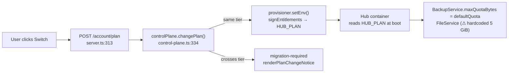
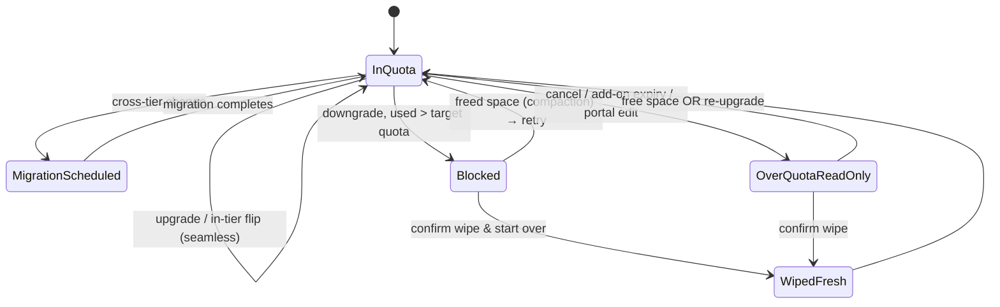
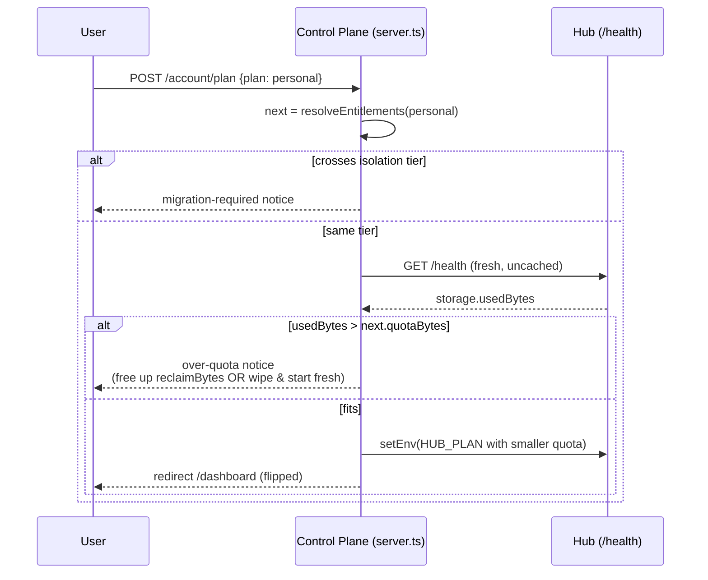

# Seamless Cloud Plan Upgrade / Downgrade and Over‑Quota Guardrails

## Problem Statement

When an xNet Cloud tenant changes plans, the two directions should feel very different:

- **Upgrading** should be _perfectly seamless_ — you click "Family", and your data
  simply has more room. No migration prompt for "just give me more space", no
  downtime, no surprises.
- **Downgrading** is intrinsically trickier: if you already store **more data than
  the lower tier allows**, we cannot silently shrink your quota out from under you.
  We have to tell you, clearly and ahead of time: _"Your data is larger than the
  Personal plan's 25 GiB. To downgrade you'll need to free up space first — or, if
  you'd rather, wipe your hub and start fresh."_

Today the control plane treats a downgrade exactly like an upgrade: it flips the
entitlement quota in place with **no check** of how much data the tenant is
actually storing. A tenant on Family (250 GiB) holding 200 GiB who switches to
Personal (25 GiB) gets their quota silently set to 25 GiB. Nothing warns them;
their hub just starts refusing new writes the next time they try to save. This
exploration designs the clean, explicit upgrade/downgrade path the prompt asks
for, grounded in the code that already exists.

## Executive Summary

- **Upgrades are already seamless within an isolation tier.** `changePlan` performs a
  live "entitlement flip" — re-signs a `HUB_PLAN` token with the bigger `quotaBytes`
  and pushes it via `provisioner.setEnv`, no data movement
  ([`control-plane.ts:334`](../../apps/cloud/src/control-plane.ts)). The only thing
  missing on the upgrade side is making cross‑tier _upgrades_ (e.g. Personal→Team)
  feel like "growth, not surgery" in copy and timing.
- **Downgrades have a real, shipped footgun.** `changePlan` never compares the
  tenant's **current usage** against the **target plan's `quotaBytes`**. The data
  needed to do so already exists — the hub reports `storage.usedBytes` on
  `GET /health` ([`data-usage.ts`](../../packages/hub/src/data-usage.ts)), and the
  control plane already fetches it for the dashboard
  ([`hub-status.ts`](../../apps/cloud/src/hub-status.ts)). We just don't gate on it.
- **The recommendation is a two‑layer guardrail:**
  1. **Pre‑flight downgrade check** in `changePlan` — block an over‑quota downgrade
     before it happens, returning a new `PlanChangeResult` kind
     (`'over-quota'`) with `usedBytes`, `targetQuotaBytes`, and `reclaimBytes`,
     surfaced as a clear dashboard notice with two honest exits: **free up space**
     or **wipe & start fresh**.
  2. **Graceful over‑quota state** for when a tenant ends up over quota anyway
     (subscription cancel → demo tier, an expired storage add‑on, a Stripe‑portal
     downgrade we didn't gate): the hub goes **read‑only for new writes** (it
     already 507s) — never auto‑deletes — and the dashboard shows an actionable
     banner with a grace window. This is the Google One model, explicitly **not**
     the Dropbox "we delete your oldest files" model.
- **Two correctness gaps to fix along the way:** (a) `FileService` is constructed
  _without_ the plan quota, so uploaded files are checked against a hard‑coded 5 GiB
  instead of the plan's `quotaBytes` ([`server.ts:540`](../../packages/hub/src/server.ts));
  (b) "delete data to get under quota" is subtle because the on‑disk footprint is
  dominated by the append‑only SQLite/CRDT change log — deleting content doesn't
  immediately shrink bytes without compaction. Both are addressed below.

## Current State In The Repository

### The plan catalog and the "flip vs. migrate" model

Plans live in [`packages/entitlements/src/plans.ts`](../../packages/entitlements/src/plans.ts).
Each plan carries a storage quota (`quotaBytes`) and an **isolation tier**. The key
design invariant is encoded right in the types: changing anything _below_ the
isolation boundary (storage, seats, concurrency, AI budget) is an **in‑place
entitlement flip**; crossing an isolation boundary (or changing pinned region) is
the only thing that triggers a **data migration**.

| Plan | Isolation tier | `quotaBytes` | Self‑serve? |
|------|----------------|--------------|-------------|
| `demo` | `pooled` | 10 MiB | (free / fallback) |
| `personal` | `dedicated-sleep` | 25 GiB | ✅ |
| `family` | `dedicated-sleep` | 250 GiB | ✅ |
| `team` | `dedicated-warm` | 100 GiB | ✅ |
| `community` | `dedicated-project` | 500 GiB | — |
| `company` | `dedicated-project` | 1024 GiB | — |
| `enterprise` | `region-pinned` | 5 TiB | — |

Self‑serve plans are gated by `CHECKOUT_PLANS` (`personal`, `family`, `team`) in
[`apps/cloud/src/server.ts`](../../apps/cloud/src/server.ts).

Note the **non‑monotonic quota across tiers**: `family` (250 GiB) is in the same
`dedicated-sleep` tier as `personal` (25 GiB), while `team` (100 GiB) sits in a
_higher_ tier (`dedicated-warm`) but with a _smaller_ quota. So:

- `personal → family` — in‑tier, **quota up** → live flip (the seamless upgrade ✅).
- `family → personal` — in‑tier, **quota down 10×** → **live flip today, no usage
  check** → the silent footgun. ⚠️
- `family → team` — crosses tier _and_ shrinks quota → `migration-required` today
  (caught by the migration path, but the migration path also doesn't check usage).

The decision logic, verbatim ([`control-plane.ts:334`](../../apps/cloud/src/control-plane.ts)):

```ts
async changePlan(tenantId, plan, overrides = {}): Promise<PlanChangeResult> {
  const record = await this.deps.tenants.get(tenantId)
  if (!record) throw new Error(`Unknown tenant: ${tenantId}`)

  const next = resolveEntitlements(plan, overrides)
  if (requiresMigration(record.entitlements, next)) {
    return { kind: 'migration-required', from: record.entitlements, to: next }
  }
  // ⚠️ No usage-vs-quota check here — a downgrade flips quota down unconditionally.
  const handle = await this.deps.provisioner.setEnv(
    record.substrateRef,
    this.hubEnv(record.tenantId, next)
  )
  // ...persist updated record...
  return { kind: 'flipped', tenant: updated }
}
```

`PlanChangeResult` today has only two shapes
([`control-plane.ts:78`](../../apps/cloud/src/control-plane.ts)):

```ts
export type PlanChangeResult =
  | { kind: 'flipped'; tenant: TenantRecord }
  | { kind: 'migration-required'; from: PlanEntitlements; to: PlanEntitlements }
```

`requiresMigration` only looks at isolation tier + residency
([`plans.ts:311`](../../packages/entitlements/src/plans.ts)) — it intentionally
says nothing about quota:

```ts
export function requiresMigration(from, to): boolean {
  if (from.isolation !== to.isolation) return true
  return (from.residency ?? null) !== (to.residency ?? null)
}
```

The in‑place levers (`withStorage`, `withSeats`, `withConcurrency`, `withAiBudget`)
are all documented as "no migration" flips — exactly the seamless‑upgrade machinery
we want to keep.

### How an entitlement flip reaches the hub



- The control plane signs the resolved entitlements into a compact `HUB_PLAN` token
  and injects it as an env var ([`entitlements.ts:27`](../../packages/entitlements/src/entitlements.ts)).
- The hub reads `HUB_PLAN` **at startup only** and maps it into config
  ([`config.ts` `resolvePlanLimits`](../../packages/hub/src/config.ts)):
  `defaultQuota = quotaBytes`, `maxBlobSize = maxBlobBytes`,
  `maxConnections = maxConnections`. There is **no live reload** — on Cloud Run,
  `setEnv` deploys a new revision (a restart), which is how the new quota actually
  takes effect; the in‑memory provisioner's `setEnv` is a no‑op
  ([`provisioner/memory.ts:60`](../../packages/cloud/src/provisioner/memory.ts)).

### How the hub enforces and reports storage

- **Enforcement (writes):** `BackupService.put` rejects a write that would exceed
  `maxQuotaBytes` with `BackupError('QUOTA_EXCEEDED')` → HTTP **507**
  ([`services/backup.ts:43`](../../packages/hub/src/services/backup.ts)). It is wired
  with the plan quota: `new BackupService(storage, { maxQuotaBytes: config.defaultQuota, ... })`
  ([`server.ts:536`](../../packages/hub/src/server.ts)).
- **⚠️ Gap — files bypass the plan quota:** `FileService` is constructed as
  `new FileService(storage)` with **no config**
  ([`server.ts:540`](../../packages/hub/src/server.ts)), so it falls back to its
  hard‑coded `maxStoragePerUser: 5 GiB` default
  ([`services/files.ts:13`](../../packages/hub/src/services/files.ts)) instead of the
  plan's `quotaBytes`. File uploads are neither counted toward the plan quota nor
  bounded by it consistently.
- **Reporting (usage):** `measureDataUsage` walks the data dir and returns
  `{ usedBytes, lastWriteMs }` ([`data-usage.ts`](../../packages/hub/src/data-usage.ts)),
  exposed on `GET /health` (`storage.usedBytes`), cached ~30s
  ([`server.ts` `dataUsage()`](../../packages/hub/src/server.ts)). `usedBytes` is the
  **total on‑disk footprint** (SQLite db + blobs + files), not a sum of "user content".
- **Control‑plane read:** `fetchHubHealth(hubUrl)` pulls `/health` (2.5s timeout,
  never throws), and `composeDashboardLive` joins it with the plan to compute
  `storageUsedBytes`, `storageQuotaBytes`, and `storagePct`
  ([`hub-status.ts`](../../apps/cloud/src/hub-status.ts)). **All the data for a
  downgrade pre‑flight check already flows through here** — it's just used for a
  read‑only meter today.

### The current UI surfaces

- **Plan switch card** (`planChangeCard`) — one POST‑form button per other plan,
  with the copy _"Switching within the same tier applies instantly; a bigger change
  may move your data."_ ([`dashboard.ts:114`](../../apps/cloud/src/dashboard.ts)).
  No mention of data‑over‑quota.
- **Migration notice** (`renderPlanChangeNotice`) — a clean, reassuring page for
  tier crossings: _"…we move your data to new infrastructure rather than flipping it
  live. We'll email you to schedule it with zero data loss."_
  ([`dashboard.ts:679`](../../apps/cloud/src/dashboard.ts)). This is the exact tone
  and pattern to clone for an over‑quota notice.
- **Live storage meter** — client‑side tile colored at 70% (yellow) / 90% (red)
  thresholds, fed by `/dashboard/live.json` ([`dashboard.ts` `liveScript`](../../apps/cloud/src/dashboard.ts)).
- **In‑app banner** — `StorageWarningBanner` in the web app already renders
  `tone`/`title`/`message`/`usageBytes`/`quotaBytes`
  ([`apps/web/src/components/StorageWarningBanner.tsx`](../../apps/web/src/components/StorageWarningBanner.tsx)),
  used for local‑storage warnings. A proven component to reuse for "your cloud hub
  is over its plan".
- **Pricing page** — storage amounts per tier in
  [`site/src/data/pricing.ts`](../../site/src/data/pricing.ts).

## External Research

How established products handle "downgrade with too much data" splits cleanly into
**preserve‑and‑lock** (good) vs. **delete‑oldest** (hostile):

- **Google One / Google Workspace** — the model to emulate. Over‑quota content is
  **never deleted**; the account becomes **read‑only**: you can't upload, create new
  docs, or receive new mail until you free space or re‑upgrade. Workspace gives an
  explicit **grace period** before read‑only kicks in. ([Google One downgrade](https://www.pocket-lint.com/downgrade-google-one-plan/),
  [Workspace pooled‑storage‑exceeded](https://masterconcept.ai/learning-articles/googleworkspace/google-workspace-pooled-storage-limit-exceeded-what-should-i-do/),
  [Cancel Google One](https://www.androidauthority.com/what-happens-if-i-cancel-my-google-one-subscription-3547669/))
- **Dropbox Basic** — the model to **avoid**: after notification emails, Dropbox
  begins **deleting least‑recently‑modified files** to force the account under quota.
  For a local‑first, user‑owns‑their‑data product like xNet, auto‑deletion is a
  non‑starter. ([Dropbox over‑quota](https://help.dropbox.com/storage-space/over-quota))
- **Stripe billing mechanics** — two standard downgrade timings: **(a) immediate
  with proration credit** (Slack/Notion), or **(b) scheduled for end of period** via
  **subscription schedules** with `proration_behavior: none` (GitHub/Zoom). For a
  capacity downgrade, end‑of‑period is friendlier: the user keeps the larger quota
  they already paid for until the cycle ends, which also buys them time to free
  space. ([Stripe prorations](https://docs.stripe.com/billing/subscriptions/prorations),
  [Subscription schedules](https://docs.stripe.com/billing/subscriptions/subscription-schedules),
  [Stigg upgrade/downgrade guide](https://www.stigg.io/blog-posts/the-only-guide-youll-ever-need-to-implement-upgrade-downgrade-flows-part-2))

**Takeaways for xNet:**
1. Preserve data; go read‑only; never auto‑delete. (Google One, not Dropbox.)
2. Block the obviously‑broken downgrade _at request time_ with a clear explanation
   and a path forward.
3. Prefer **end‑of‑period** effective dates for downgrades so the bigger quota (and
   the cleanup runway) lasts as long as it's paid for.

## Key Findings

1. **Upgrades are already seamless** for the common case (in‑tier quota increase).
   The flip machinery (`withStorage`/`setEnv`/`HUB_PLAN`) is exactly right; we mostly
   need to (a) make sure cross‑tier _upgrades_ read as "more space, scheduled
   migration, zero loss" and (b) make the immediate‑flip path instant in copy too.
2. **The downgrade footgun is real and silent.** `changePlan` flips quota down with
   no usage gate; the hub then 507s the next write. The fix is small because the
   inputs already exist.
3. **We have usage data without new plumbing.** `GET /health.storage.usedBytes` +
   `target.quotaBytes` is everything a pre‑flight check needs.
4. **"usedBytes" ≠ "deletable user content."** The footprint is dominated by the
   append‑only SQLite change log; deleting nodes won't shrink bytes until a
   compaction/VACUUM runs. A naive "delete data to get under quota" instruction will
   frustrate users whose deletions don't move the meter. We need a **reclaimable‑bytes
   estimate** and a **compaction step**.
5. **File uploads aren't quota‑bound to the plan** (`FileService` gap) — must be
   fixed or the meter and the enforcement disagree.
6. **Cancellation is the harshest downgrade.** Canceling drops the tenant to the
   `demo` fallback (10 MiB) — almost everyone is instantly over quota. This path must
   land in the graceful read‑only state, not data loss, and is the strongest argument
   for layer 2 (graceful over‑quota), not just layer 1 (block at request time).

## Options And Tradeoffs

### Decision A — What to do when a downgrade would put the tenant over quota

| Option | Behavior | Pros | Cons |
|--------|----------|------|------|
| **A0. Status quo** | Flip quota down silently | none | Silent breakage; support tickets; data feels unsafe |
| **A1. Hard block (recommended)** | Refuse the downgrade; explain; require freeing space or an explicit wipe | Honest, safe, simple; no partial states | User must act before downgrading (acceptable & expected) |
| **A2. Allow + read‑only grace** | Apply downgrade; hub goes read‑only; grace window to fix | Matches Google One; lets billing change immediately | Tenant can be "stuck" over quota; needs grace‑expiry policy |
| **A3. Allow + auto‑delete** | Delete data to fit (Dropbox) | "Just works" billing | Hostile; unthinkable for a user‑owns‑data product. ❌ |

**Recommendation: A1 as the front door, A2 as the safety net.** Self‑serve
downgrades that would exceed the new quota are **blocked** with a clear notice
(A1). But downgrades that arrive _around_ the gate — subscription **cancellation**,
Stripe‑portal edits, an expiring storage add‑on — land in a **graceful read‑only
state** (A2). Never A3.

### Decision B — Downgrade timing

| Option | When new quota applies | Notes |
|--------|------------------------|-------|
| **B1. Immediate** | On click | Simplest; but shrinks quota the instant you're billed less |
| **B2. End of period (recommended)** | Next renewal | Stripe subscription schedule, `proration_behavior: none`; user keeps paid‑for quota + gets cleanup runway |

**Recommendation: B2** for downgrades (keep B1‑style instant for upgrades — more
space now is a feature). End‑of‑period means the pre‑flight check can _warn now_
("after <date> you'll need to be under 25 GiB") while still letting the switch be
scheduled, with a reminder as the date approaches.

### Decision C — Where the usage check runs

| Option | Pros | Cons |
|--------|------|------|
| **C1. Control plane reads `/health` at request time (recommended)** | Reuses `fetchHubHealth`; no hub change; authoritative enough | 30s cache staleness; cold hub returns null |
| **C2. Hub exposes a dedicated `POST /admin/can-fit?bytes=` precheck** | Live, exact | New endpoint + auth; more code |
| **C3. Trust the dashboard's cached number** | Zero work | Stale; not a real gate |

**Recommendation: C1**, with a **fresh (uncached) `/health` read** for the gate
and a conservative fallback: if usage is unknown (cold/sleeping hub or timeout),
treat a quota‑reducing change as "needs confirmation" rather than auto‑allowing it.

### Decision D — "Free up space" mechanics (the reclaimable‑bytes problem)

Because `usedBytes` includes the append‑only change log, deleting content doesn't
immediately reduce the footprint. Options:

- **D1. Show reclaimable estimate + run compaction on demand.** Compute "live bytes"
  vs "log/garbage bytes", offer a "Compact now" action that VACUUMs/snapshots the
  SQLite db, then re‑measure. Honest and effective. _(Requires a compaction path —
  scope it as its own task.)_
- **D2. Wipe & start fresh.** A clearly destructive, double‑confirmed
  `destroy`+re‑provision at the lower tier — the prompt's "delete your entire
  database and start from scratch" escape hatch. Cheap to build (provisioner already
  has `destroy`/`provision`), unambiguous, and the only guaranteed way to get a huge
  account under a tiny quota (e.g. cancel → 10 MiB).

**Recommendation: ship D2 first** (it's the guaranteed exit and reuses existing
primitives), **then D1** (the graceful "tidy up" path) as a fast follow.

## Recommendation

Build a **two‑layer guardrail** plus the two correctness fixes:

**Layer 1 — Pre‑flight downgrade gate (block, don't surprise).**
Add a usage check to `changePlan`. When the target `quotaBytes` is _lower_ than the
current usage, return a new `PlanChangeResult` kind instead of flipping:

```ts
export type PlanChangeResult =
  | { kind: 'flipped'; tenant: TenantRecord }
  | { kind: 'migration-required'; from: PlanEntitlements; to: PlanEntitlements }
  | {
      kind: 'over-quota'
      from: PlanEntitlements
      to: PlanEntitlements
      usedBytes: number
      targetQuotaBytes: number
      reclaimBytes: number // usedBytes - targetQuotaBytes
    }
```

The route renders an over‑quota notice (clone of `renderPlanChangeNotice`) with two
honest exits: **Free up space** (with the current usage, the target, and how much to
remove) and **Wipe & start fresh** (double‑confirmed). A confirmed downgrade can be
**scheduled to end‑of‑period** (Decision B2) so the bigger quota lasts as long as
it's paid for.

**Layer 2 — Graceful over‑quota state (for downgrades that arrive around the gate).**
When a tenant ends up over quota (cancellation → demo, expired add‑on, portal edit):
the hub stays **read‑only for new writes** (it already 507s; make `FileService`
respect the plan quota too), the dashboard shows an **actionable banner** with a
**grace window** and a clear remedy, and **no data is ever auto‑deleted**.

**Fixes:**
- Pass the plan quota to `FileService`:
  `new FileService(storage, { maxStoragePerUser: config.defaultQuota })`.
- Add a **reclaimable‑bytes / compaction** capability (Decision D1) so "free up
  space" actually moves the meter; until it lands, lean on **Wipe & start fresh**
  (D2) as the guaranteed exit.

### Proposed state model



### Proposed pre‑flight sequence



## Example Code

A focused patch to `changePlan` (illustrative — types abbreviated). It only gates
when the quota actually shrinks, so upgrades stay a pure flip:

```ts
// apps/cloud/src/control-plane.ts
async changePlan(tenantId, plan, overrides = {}): Promise<PlanChangeResult> {
  const record = await this.deps.tenants.get(tenantId)
  if (!record) throw new Error(`Unknown tenant: ${tenantId}`)

  const next = resolveEntitlements(plan, overrides)
  if (requiresMigration(record.entitlements, next)) {
    return { kind: 'migration-required', from: record.entitlements, to: next }
  }

  // NEW: gate a capacity REDUCTION on current usage. Upgrades skip this entirely.
  const shrinking = next.quotaBytes < record.entitlements.quotaBytes
  if (shrinking) {
    const usedBytes = await this.currentUsageBytes(record) // fresh /health read
    if (usedBytes != null && usedBytes > next.quotaBytes) {
      return {
        kind: 'over-quota',
        from: record.entitlements,
        to: next,
        usedBytes,
        targetQuotaBytes: next.quotaBytes,
        reclaimBytes: usedBytes - next.quotaBytes
      }
    }
    // usedBytes == null (cold/unknown): fall through to a confirm-required notice
    // rather than silently shrinking.
  }

  const handle = await this.deps.provisioner.setEnv(
    record.substrateRef,
    this.hubEnv(record.tenantId, next)
  )
  const aiPatch = await this.reconcileAiKey(record, next)
  const updated: TenantRecord = {
    ...record, plan, entitlements: next,
    hubUrl: handle.hubUrl, region: handle.region,
    targetVersion: handle.targetVersion, ...(aiPatch ?? {})
  }
  await this.deps.tenants.put(updated)
  return { kind: 'flipped', tenant: updated }
}

// Fresh, uncached usage read; null when the hub is cold/sleeping/unreachable.
private async currentUsageBytes(record: TenantRecord): Promise<number | null> {
  const health = await fetchHubHealth(record.hubUrl) // hub-status.ts
  return health?.storage ? Number(health.storage.usedBytes) : null
}
```

Route handling of the new kind ([`server.ts:313`](../../apps/cloud/src/server.ts)):

```ts
const result = await deps.controlPlane.changePlan(tenant.tenantId, plan as PlanId)
if (result.kind === 'migration-required') {
  return c.html(renderPlanChangeNotice({ who, from: result.from.plan, to: result.to.plan }))
}
if (result.kind === 'over-quota') {
  return c.html(renderOverQuotaNotice({
    who, from: result.from.plan, to: result.to.plan,
    usedBytes: result.usedBytes,
    targetQuotaBytes: result.targetQuotaBytes,
    reclaimBytes: result.reclaimBytes
  }))
}
return c.redirect('/dashboard')
```

And the FileService quota fix ([`packages/hub/src/server.ts:540`](../../packages/hub/src/server.ts)):

```ts
// before: const files = new FileService(storage)
const files = new FileService(storage, { maxStoragePerUser: config.defaultQuota })
```

## Risks And Open Questions

- **Reclaimable bytes vs. log growth.** The biggest UX risk: a user deletes content,
  the meter doesn't move (append‑only log), and they conclude xNet is broken. We need
  a credible "X GiB reclaimable" estimate and a compaction action before promising
  "free up space" as a first‑class path. Until then, "Wipe & start fresh" is the only
  _guaranteed_ exit and should be presented honestly.
- **Cold/sleeping hubs return no usage.** `dedicated-sleep` tenants (personal/family)
  scale to zero; `/health` may be null. The gate must wake or conservatively
  "confirm‑require" rather than assume it fits. Waking a hub to measure has a cost.
- **Stripe ordering.** If we schedule downgrades end‑of‑period via subscription
  schedules, the entitlement flip must be driven by the **webhook at period end**, not
  at click time — otherwise billing and quota disagree. Need to confirm the webhook
  path calls `changePlan` (today the portal/webhook wiring is abstracted behind
  `TenantBillingGateway`).
- **Cancellation → demo (10 MiB).** Nearly always over quota. This _must_ route to
  the graceful read‑only state with a generous grace window and export/wipe options,
  not an error. What's the grace policy (e.g. 30 days read‑only, then sleep, never
  delete)?
- **Add‑on storage packs.** `withStorage` overrides can raise quota above the base
  plan; removing an add‑on is a downgrade too and must hit the same gate.
- **What counts toward quota?** `usedBytes` is total on‑disk (db + blobs + files).
  Confirm the meter shown to users and the bytes enforced are the same number after
  the `FileService` fix, or the "you're at 96%" message won't match the 507.
- **Migration path also lacks a usage check.** `family → team` shrinks quota _and_
  crosses tiers; the migration engine should refuse to migrate into a smaller box for
  the same reason. Out of scope here but worth a tracking note.

## Implementation Checklist

- [ ] Add `over-quota` variant to `PlanChangeResult` ([`control-plane.ts:78`](../../apps/cloud/src/control-plane.ts)).
- [ ] Add `currentUsageBytes(record)` helper using `fetchHubHealth` (fresh read) in the control plane.
- [ ] Gate quota **reductions** in `changePlan`; leave upgrades as a pure flip ([`control-plane.ts:334`](../../apps/cloud/src/control-plane.ts)).
- [ ] Conservative fallback when usage is `null` (cold hub): require explicit confirmation, never silently shrink.
- [ ] Handle `over-quota` in `POST /account/plan`; add `renderOverQuotaNotice` (clone `renderPlanChangeNotice`) ([`dashboard.ts:679`](../../apps/cloud/src/dashboard.ts)).
- [ ] Over‑quota notice copy: current usage, target quota, "remove ≥ N", **Free up space** and **Wipe & start fresh** (double‑confirm) actions.
- [ ] Fix `FileService` to use the plan quota ([`server.ts:540`](../../packages/hub/src/server.ts)).
- [ ] Implement **Wipe & start fresh** (D2): double‑confirmed `destroy` + re‑provision at the lower tier; export reminder first.
- [ ] Graceful over‑quota state (Layer 2): dashboard banner (reuse `StorageWarningBanner` pattern) + grace‑window policy; ensure cancellation lands here, not in an error.
- [ ] Schedule downgrades end‑of‑period via Stripe subscription schedule (`proration_behavior: none`); drive the entitlement flip from the period‑end webhook.
- [ ] Upgrade‑side polish: confirm in‑tier upgrades flip instantly and copy reads as "more space, now"; cross‑tier upgrades read as scheduled, zero‑loss growth.
- [ ] _(Fast follow)_ Reclaimable‑bytes estimate + on‑demand SQLite compaction (D1).
- [ ] _(Tracking)_ Apply the same usage guard to the cross‑tier migration path.

## Validation Checklist

- [ ] `family → personal` with usage > 25 GiB returns `over-quota`; quota is **not** flipped; tenant record unchanged.
- [ ] `family → personal` with usage < 25 GiB flips live and redirects to dashboard.
- [ ] `personal → family` (upgrade) still flips instantly with **no** usage read on the happy path.
- [ ] Cold/sleeping hub (usage `null`) on a downgrade → confirm‑required, never a silent shrink.
- [ ] `FileService` rejects an upload that would exceed `config.defaultQuota` (not the old 5 GiB) with 507.
- [ ] Over‑quota notice shows accurate `usedBytes`, `targetQuotaBytes`, and `reclaimBytes`.
- [ ] **Wipe & start fresh** requires an explicit confirm and results in an empty hub at the lower tier; no data deleted without confirmation.
- [ ] Cancellation → demo tier lands in graceful read‑only (reads work, writes 507), banner shown, no auto‑deletion.
- [ ] Scheduled end‑of‑period downgrade: quota stays at the higher tier until the period‑end webhook, then flips.
- [ ] The dashboard meter percentage and the enforced 507 threshold reference the same byte count.
- [ ] Existing `control-plane.test.ts` flip/migration cases still pass; new tests cover `over-quota`.

## References

- Plan catalog, isolation tiers, `requiresMigration`, in‑place flip helpers — [`packages/entitlements/src/plans.ts`](../../packages/entitlements/src/plans.ts)
- Signed `HUB_PLAN` token — [`packages/entitlements/src/entitlements.ts`](../../packages/entitlements/src/entitlements.ts)
- `changePlan` and `PlanChangeResult` — [`apps/cloud/src/control-plane.ts`](../../apps/cloud/src/control-plane.ts)
- Plan‑change route + `CHECKOUT_PLANS` — [`apps/cloud/src/server.ts`](../../apps/cloud/src/server.ts)
- Plan‑change UI + migration notice — [`apps/cloud/src/dashboard.ts`](../../apps/cloud/src/dashboard.ts)
- Hub usage measurement + `/health` — [`packages/hub/src/data-usage.ts`](../../packages/hub/src/data-usage.ts), [`packages/hub/src/server.ts`](../../packages/hub/src/server.ts)
- Quota enforcement — [`packages/hub/src/services/backup.ts`](../../packages/hub/src/services/backup.ts), [`packages/hub/src/services/files.ts`](../../packages/hub/src/services/files.ts)
- Hub config / `HUB_PLAN` resolution — [`packages/hub/src/config.ts`](../../packages/hub/src/config.ts)
- Usage join for dashboard — [`apps/cloud/src/hub-status.ts`](../../apps/cloud/src/hub-status.ts)
- Provisioner `setEnv` contract — [`packages/cloud/src/provisioner/types.ts`](../../packages/cloud/src/provisioner/types.ts)
- In‑app storage banner — [`apps/web/src/components/StorageWarningBanner.tsx`](../../apps/web/src/components/StorageWarningBanner.tsx)
- Pricing tiers — [`site/src/data/pricing.ts`](../../site/src/data/pricing.ts)
- Prior explorations: 0174 (open‑core hosting), 0175 (fleet + AI gateway), 0178 (Litestream Model B), 0200 (billing + metering), 0207 (live dashboard), 0214 (guided connect)
- Google One downgrade — https://www.pocket-lint.com/downgrade-google-one-plan/
- Google Workspace pooled storage exceeded — https://masterconcept.ai/learning-articles/googleworkspace/google-workspace-pooled-storage-limit-exceeded-what-should-i-do/
- Cancel Google One (revert to 15 GB, read‑only) — https://www.androidauthority.com/what-happens-if-i-cancel-my-google-one-subscription-3547669/
- Dropbox over‑quota (auto‑delete model to avoid) — https://help.dropbox.com/storage-space/over-quota
- Stripe prorations — https://docs.stripe.com/billing/subscriptions/prorations
- Stripe subscription schedules — https://docs.stripe.com/billing/subscriptions/subscription-schedules
- Stigg upgrade/downgrade flows — https://www.stigg.io/blog-posts/the-only-guide-youll-ever-need-to-implement-upgrade-downgrade-flows-part-2
