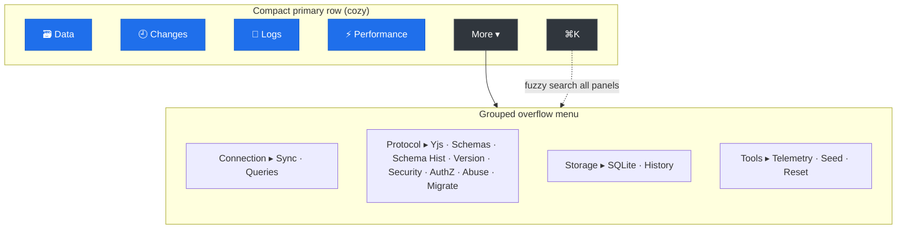
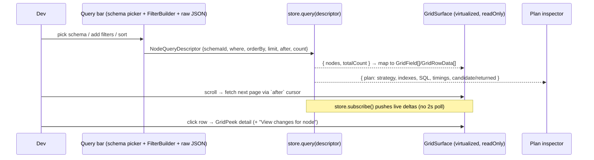
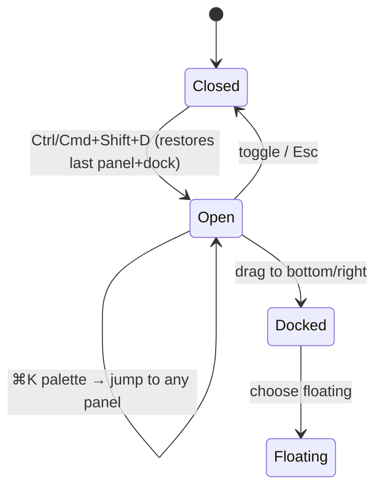

# DevTools Overhaul — Hero Panels, a Real Data Browser, and Profiling

## Problem Statement

The in-app developer tool (`@xnetjs/devtools`, docked at the bottom of the
web app) has grown to **18 flat tabs** crammed into a single
horizontally-scrolling strip across the bottom of the screen. The result:

- The tab bar is a wall of 18 same-weight text labels in
  `overflow-x-auto` — you scroll sideways to find anything, nothing is
  grouped, nothing has visual hierarchy, and the strip eats the full
  width of the viewport.
- The genuinely high-value panels for everyday debugging — **see my
  data**, **see my changes**, **read debug logs**, **understand
  performance** — are buried among niche, rarely-touched panels (Yjs,
  AuthZ, Abuse, Schema History, Version, Migrate, Security).
- The panels that *should* be excellent are individually under-built.
  The "Nodes" panel polls `store.list()` every 2 seconds, re-pulls the
  entire node set on every store event, and synthesizes a fake
  text-only schema instead of using the real query engine or the
  Airtable-grade grid the app already ships.
- There is **no Logs panel at all** — debug logging is scattered across
  five `localStorage` flags (`xnet:sync:debug`, `xnet:sqlite:debug`,
  `xnet:query:debug`, `xnet:boot:debug`, `xnet:trace`) that only write
  to the browser console.
- **Performance is fragmented** across four places (boot timeline,
  Traces waterfalls, Queries render-time, Telemetry buckets) with no
  unified view.

The ask: dramatically simplify and reorganize the dev tool into a
**cozy** experience with **a few really high-performing panels** — a
robust queryable data browser (reusing the existing database grid + query
APIs), a real logs panel with runtime toggles, a changes feed, and a
proper performance/profiling panel — while condensing or demoting the
low-value tabs that currently waste space.

## Executive Summary

The infrastructure to make the dev tool excellent **already exists** —
it is simply not wired together and not surfaced well:

- A production-grade, virtualized, Airtable-grade grid
  (`GridSurface` + `GridToolbar` + `FilterBuilder` + `GridSummaryBar` +
  `GridPeek` in `packages/views/`) is used by the app's `DatabaseView`
  but the dev tool's Nodes panel uses a lighter `TableView` with a faked
  schema.
- A real query engine with storage pushdown, cursor pagination,
  full-text/spatial search, and **query-plan metadata** lives in
  `store.query(descriptor)` (`packages/data/src/store/query.ts`) — the
  Nodes panel doesn't use it.
- A schema registry that can enumerate every schema and its typed
  properties (`SchemaRegistry.getAllIRIs()` /
  `schema.properties`) — the Nodes panel synthesizes columns from raw
  data instead.
- Five debug-log channels and a full boot-timeline / tracing /
  telemetry stack — none surfaced in a single Logs or Performance panel.

**Recommendation:** Restructure the dev tool around **4 hero panels**
— **Data**, **Changes**, **Logs**, **Performance** — promoted to a
compact primary tab row, with the remaining ~14 panels demoted into a
grouped **"More ▾"** overflow menu and reachable instantly via an
in-devtools **command palette** (`cmdk`, already a dependency). Convert
the flat `DEVTOOLS_PANELS` array into a richer **panel registry**
(`{ id, label, icon, group, tier, keywords }`) with a plugin
contribution point, and persist panel/dock/flag state to `localStorage`
(today nothing is persisted). Rebuild the Data panel on `GridSurface` +
`store.query()`, build the missing Logs and Performance panels from
existing instrumentation, and keep the whole thing dev-only and
zero-cost in production (the package already tree-shakes to a no-op).

This is a **mostly-assembly** project: ~70% wiring existing parts
together, ~30% net-new (Logs capture, Performance composition, registry +
command palette).

## Current State In The Repository

### How the dev tool is structured today

The dev tool is a standalone package, `@xnetjs/devtools`, mounted once in
the app shell:

- Entry points: `packages/devtools/src/index.ts` (production **no-op**,
  renders children unchanged, tree-shakes to zero) and
  `packages/devtools/src/index.dev.ts` (full implementation, selected by
  the bundler's `development` export condition). See
  `packages/devtools/package.json` `exports`.
- Mounted in [apps/web/src/App.tsx:896](apps/web/src/App.tsx) as
  `<XNetDevToolsProvider position="bottom" defaultOpen={false} … />`,
  wrapping the router.
- Provider: `packages/devtools/src/provider/DevToolsProvider.tsx` (~595
  lines) sets up the event bus, instrumentation, keyboard shortcut
  (`Ctrl/Cmd+Shift+D`), a 4-finger-tap mobile toggle, and a
  `window`-event toggle for Electron IPC.
- Shell: `packages/devtools/src/panels/Shell.tsx` (~353 lines) renders
  the tab bar, a resize handle, the active-panel switch, and a status
  bar.
- Tab definitions: `packages/devtools/src/panels/panel-registry.ts` — a
  flat array of `{ id, label }`.
- Tab dispatch: an 18-case `switch` in `Shell.tsx`
  (`ActivePanelContent`, lines 134–172).

The tab bar markup is the crux of the problem
([Shell.tsx:51](packages/devtools/src/panels/Shell.tsx)):

```tsx
<div className="flex items-center border-b border-hairline shrink-0 overflow-x-auto">
  <span className="… ml-2 mr-3 …">xNet</span>
  <div className="flex items-center shrink-0">
    {DEVTOOLS_PANELS.map((panel) => (
      <button … className="px-3 py-1.5 text-xs … whitespace-nowrap …">
        {panel.label}
      </button>
    ))}
  </div>
  …
</div>
```

18 equal-weight buttons, `whitespace-nowrap`, in an `overflow-x-auto`
row. No icons, no groups, no overflow menu, no persistence of the active
panel.

### The 18 panels today (and a value judgment)

| # | Panel | File (`packages/devtools/src/panels/…`) | ~Lines | Everyday value |
|---|-------|------------------------------------------|--------|----------------|
| 1 | Nodes | `NodeExplorer/NodeExplorer.tsx` | 280 | **High** — but under-built (polls, fake schema) |
| 2 | Changes | `ChangeTimeline/ChangeTimeline.tsx` | 175 | **High** |
| 3 | Sync | `SyncMonitor/SyncMonitor.tsx` | 187 | **High** (p2p/local-first) |
| 4 | Yjs | `YjsInspector/YjsInspector.tsx` | 366 | Low / niche |
| 5 | AuthZ | `AuthZPanel/AuthZPanel.tsx` | 622 | Niche |
| 6 | Abuse | `AbusePanel/AbusePanel.tsx` | 625 | Niche |
| 7 | Queries | `QueryDebugger/QueryDebugger.tsx` | 269 | **High** (perf) |
| 8 | Traces | `TracesPanel/TracesPanel.tsx` | 75 | **High** (perf) |
| 9 | Telemetry | `TelemetryPanel/TelemetryPanel.tsx` | 662 | Medium |
| 10 | Schemas | `SchemaRegistry/SchemaRegistry.tsx` | 246 | Medium |
| 11 | Schema Hist | `SchemaHistoryPanel/SchemaHistoryPanel.tsx` | 371 | Low |
| 12 | Security | `SecurityPanel/SecurityPanel.tsx` | 239 | Low |
| 13 | SQLite | `SQLitePanel/SQLitePanel.tsx` | 201 | Medium (perf/storage) |
| 14 | Version | `VersionPanel/VersionPanel.tsx` | 318 | Low |
| 15 | Migrate | `MigrationWizard/MigrationWizard.tsx` | 683 | Niche |
| 16 | Seed | `Seed/Seed.tsx` | 1389 | Medium (QA) |
| 17 | History | `HistoryPanel/HistoryPanel.tsx` | 884 | Medium |
| 18 | Reset | `Reset/Reset.tsx` | 140 | Medium |

The four "High everyday value" themes — **data, changes, sync/queries,
perf** — are diluted across the strip and interleaved with eight
low-frequency panels.

### The Nodes panel is under-built (the key opportunity)

`NodeExplorer` ([NodeExplorer.tsx](packages/devtools/src/panels/NodeExplorer/NodeExplorer.tsx))
and its hook
([useNodeExplorer.ts](packages/devtools/src/panels/NodeExplorer/useNodeExplorer.ts)):

- Loads **every** node via `store.list()` (no schema filter pushdown, no
  pagination), then **polls every 2000ms** *and* re-pulls the full list
  on every store event:
  ```ts
  loadNodes()
  const interval = setInterval(loadNodes, 2000)   // useNodeExplorer.ts:63
  ```
- **Synthesizes a fake schema** from raw node keys, every column typed
  `'text'` (`synthesizeSchema`, NodeExplorer.tsx:140), instead of reading
  real typed properties.
- Filters/search are all **client-side** over the full in-memory array.
- Renders with the lighter `TableView` from `@xnetjs/views`, not the
  Airtable-grade `GridSurface` the app uses for real databases.

### The query engine and grid we should be reusing

**Query engine** — `store.query(descriptor)`
([packages/data/src/store/query.ts](packages/data/src/store/query.ts),
`store.ts:720`):

```ts
interface NodeQueryDescriptor {
  schemaId: SchemaIRI
  nodeId?: string
  where?: Record<string, unknown>
  includeDeleted: boolean
  orderBy?: Record<string, SortDirection>
  limit?: number; offset?: number; after?: string   // cursor pagination
  count?: 'exact' | 'estimate' | 'none'
  spatial?: NodeQuerySpatialFilter
  search?: NodeQuerySearchFilter                     // full-text
  materializedView?: NodeQueryMaterializedViewOptions
}
interface NodeQueryResult {
  nodes: NodeState[]
  totalCount: number
  plan: NodeQueryPlanMetadata   // strategy, indexes used, SQL, params, timings
}
```

The **`plan` metadata** (strategy `storage-query` | `list-fallback` |
`auth-pushdown-candidates`, candidate/hydrated/returned counts, duration,
SQL, params, index names, materialized-view cache hits) is exactly the
kind of thing a dev tool should surface — and nothing does today.

Live updates are available without polling:
`store.subscribe(listener)` (all changes) and
`store.subscribeToNode(nodeId, listener)`
([store.ts:2030](packages/data/src/store/store.ts)).

**Schema registry** —
([packages/data/src/schema/registry.ts](packages/data/src/schema/registry.ts)):
`getAllIRIs()`, `getSync(iri)`, `getAllVersions(baseIRI)`; each schema
exposes typed `properties: PropertyDefinition[]` with
`type: 'text' | 'number' | 'select' | 'relation' | 'date' | …`.

**Grid** —
([packages/views/src/grid/GridSurface.tsx](packages/views/src/grid/GridSurface.tsx)):
virtualized via `@tanstack/react-virtual`, accepts arbitrary
`fields: GridField[]` + `rows: GridRowData[]`, supports `sorts`,
`readOnly`, custom cell renderers for 13 property types, plus siblings
`GridToolbar` (view/sort/filter/group chips), `GridSummaryBar`
(per-column aggregation), `GridPeek` (row detail side-panel), and a
visual `FilterBuilder`
([packages/views/src/filter/FilterBuilder.tsx](packages/views/src/filter/FilterBuilder.tsx))
that takes `PropertyDefinition[]` and emits a `FilterGroup`. Prior
exploration
[0199](docs/explorations/0199_[_]_NOTION_AND_AIRTABLE_GRADE_DATABASE_UI_AND_NATIVE_QUERIES.md)
concluded "the engine is far ahead of the UI" and that `GridSurface` is
store-agnostic and reusable.

A raw query escape hatch already exists too: `QueryConsoleTray`
([apps/web/src/workbench/views/tray.tsx](apps/web/src/workbench/views/tray.tsx))
accepts raw `QueryAST` / `SavedViewDescriptor` JSON.

### The change log we should be feeding "Changes" from

`Change`
([packages/sync/src/change.ts](packages/sync/src/change.ts)) carries
`lamport`, `wallTime`, `authorDID`, `type`, `hash`/`parentHash`,
`batchId`/`batchIndex`/`batchSize`, and a `NodePayload`. The store /
storage adapter expose `getAllChanges()`, `getChangesSince(lamport)`, and
`getChanges(nodeId)`
([packages/data/src/store/types.ts:142](packages/data/src/store/types.ts)),
and live `store:remote-change` / `store:conflict` events flow through the
devtools event bus already.

### The debug-log flags that need a home (the missing Logs panel)

These exist and gate `console.*` output at runtime, but there is **no UI
to toggle them** except a couple buried in the Sync/SQLite panels, and
**no capture** — output only goes to the browser console:

| Flag (`localStorage`) | Gates |
|-----------------------|-------|
| `xnet:boot:debug=true` | boot timeline + read-path probe |
| `xnet:sync:debug=true` | sync/connection/ws logging |
| `xnet:sqlite:debug=true` | SQLite adapter logging |
| `xnet:query:debug=true` | query execution logging |
| `xnet:trace=1` | `TraceCollector` (op waterfalls) |

### The performance signals scattered across four panels

- **Boot timeline** — `apps/web/src/lib/boot-timeline.ts`:
  `getBootTimeline()` returns segment durations (`wasm`, `schema`,
  `identity`, `store`, `connect`, `firstSync`, `firstPaint`); auto-emits
  `performance.mark('xnet:<phase>')`.
- **Read-path probe** — `apps/web/src/lib/read-path-probe.ts`:
  `probeStoreContents(adapter)` (node/property/change counts, lamport,
  cursors).
- **Traces** — `@xnetjs/telemetry` `TraceCollector` (opt-in
  `xnet:trace`), surfaced as waterfalls in `TracesPanel` +
  `Waterfall.tsx`.
- **Queries** — `QueryTracker`
  (`packages/devtools/src/instrumentation/query.ts`): per-hook update
  count, render time, plan, materialization.
- **Telemetry** — `TelemetryCollector.reportPerformance()` bucketed
  latencies (`packages/telemetry/src/collection/collector.ts`).
- **Canvas frame harness** — `__xnetCanvasTestHarness` in
  `apps/web/src/main.tsx` (`measureCanvasFrameBudget`).

Plus storage/quota in the SQLite panel and `StorageDurabilityInfo` on the
devtools context. A unified **Performance** panel just needs to compose
these.

```mermaid
flowchart LR
  subgraph Today["Today: 18 flat tabs, overflow-x scroll"]
    direction LR
    T1[Nodes]---T2[Changes]---T3[Sync]---T4[Yjs]---T5[AuthZ]---T6[Abuse]---T7[Queries]---T8[Traces]---T9[Telemetry]
    T9---T10[Schemas]---T11[SchemaHist]---T12[Security]---T13[SQLite]---T14[Version]---T15[Migrate]---T16[Seed]---T17[History]---T18[Reset]
  end
  Today -.->|"horizontal scroll, no grouping,<br/>hero panels diluted"| Pain[(Hard to scan)]
```



## External Research

- **TanStack Devtools** (2025) converged on exactly the pattern proposed
  here: *one shared shell* with a **`plugins` array** rather than
  "inventing floating panels per library"; a **floating toggle whose
  open/closed state is remembered in `localStorage`**; and panels that
  "keep their own internal state model." This validates (a) a registry/
  contribution model over a hardcoded switch, and (b) persisting dock
  state. ([TanStack Devtools](https://tanstack.com/devtools/latest),
  [TanStack/devtools](https://github.com/TanStack/devtools))
- **React Query Devtools** popularized the bottom-docked, resizable,
  toggle-in-corner panel — the form factor xNet already uses — but with
  a *single* focused surface, not 18 tabs.
  ([TanStack Query Devtools](https://tanstack.com/query/latest/docs/framework/react/devtools))
- **Chrome DevTools** solves the "too many panels" problem with a
  **primary tab row + a `»` overflow ("More tabs") menu** and a separate
  **drawer** for secondary tools — i.e. tiering, not a flat strip. This
  is the direct analog for promoting 4 hero panels and demoting the rest.
- **Local-first data browsers** — Convex's dashboard data browser, RxDB's
  dev-mode inspector, and Electric/PGlite tooling all center a
  **queryable table view of your actual data** as the primary developer
  surface. ([RxDB](https://rxdb.info/),
  [Electric](https://electric-sql.com/docs/reference/local-first)) This
  is precisely the "robust nodes view" being asked for.
- **Command-palette navigation** (`cmdk`) is the standard escape hatch
  for "many destinations, little chrome" — and `cmdk` is already a
  dependency of `@xnetjs/ui`.

Takeaway: the strongest dev tools use a *small* set of primary surfaces,
a data browser as the centerpiece, tiering/overflow for the long tail, a
command palette for instant reach, and persisted state. xNet has all the
raw materials.

## Key Findings

1. **The fix is mostly assembly, not invention.** The grid, query engine
   with plan metadata, schema registry, change log, boot timeline, tracer,
   and query tracker all exist. The gaps are: a registry/IA layer, a Logs
   capture+toggle panel, and a Performance composition panel.
2. **The flat 18-tab strip is the visible problem; the diluted hero
   panels are the real one.** Condensing tabs without upgrading Data /
   Logs / Performance would be lipstick.
3. **The Nodes panel actively fights performance** (2s poll + full reload
   per event + client-side filter) — the opposite of "high-performing."
   `store.query()` + `subscribe()` + `GridSurface` virtualization fixes
   all three at once.
4. **Nothing is persisted.** Active panel, dock position, height,
   open/closed, and the five debug flags all reset every reload.
5. **Zero production risk.** Everything ships behind the no-op prod entry
   ([index.ts](packages/devtools/src/index.ts)); "go all out" costs 0
   bytes to end users.
6. **A registry unlocks the app's own plugin system.** xNet already has a
   plugin contribution model (explorations 0192/0201); a panel registry
   lets first-party *and* plugin panels register declaratively with a
   `tier` (hero/secondary) and `group`.

## Options And Tradeoffs

### Information architecture (how to condense the tabs)

| Option | What it is | Pros | Cons |
|--------|-----------|------|------|
| **A. Left icon rail + groups** (VS Code/Chrome drawer) | Vertical icon rail of groups; clicking a group reveals its panels as sub-nav | Scales to N panels; frees the full bottom width; clear grouping | Bigger rewrite of `Shell.tsx`; vertical rail competes with content in a short bottom dock |
| **B. Hero tab row + grouped "More ▾" + command palette** | 4 hero tabs always visible; everything else in a categorized overflow menu; `Cmd+K` to jump anywhere | Smallest change; keeps the cozy bottom dock; directly kills the wide strip; palette reaches all 18 in 2 keys | Secondary panels are one click less discoverable (mitigated by palette + groups) |
| **C. Full re-skin to a left-rail "mini-IDE"** | Rail + sub-nav + breadcrumbs + persisted layout | Most polished long-term | Largest effort; risk of over-building a dev-only tool |

**Recommendation: B** (hybrid) for the primary milestone, with the panel
registry designed so that **A** is a later, cheap re-skin if desired
(the registry already carries `group`/`tier`, so swapping the chrome is a
view change, not a data change).

### Data panel: which grid?

| Option | Pros | Cons |
|--------|------|------|
| Keep `TableView` (current) | Already wired | Light; no filter builder / summary / peek; the user explicitly wants "the existing database table UI" |
| **Reuse `GridSurface` in `readOnly` mode + `GridToolbar` + `FilterBuilder` + `GridSummaryBar` + `GridPeek`** | Airtable-grade, virtualized, the *actual* DB UI, type-aware columns | Need a node→`GridField[]`/`GridRowData[]` adapter (well understood, see 0199) |

**Recommendation:** `GridSurface` stack, read-only by default with an
opt-in "edit cell" affordance later. Drive rows from `store.query()` with
the visual `FilterBuilder` compiling to a `NodeQueryDescriptor`, plus a
raw-descriptor escape hatch (the `QueryConsoleTray` pattern) and a
**query-plan inspector** showing `result.plan`.

### Logs panel: capture strategy

| Option | Pros | Cons |
|--------|------|------|
| Toggles only (flip the 5 flags), output to console | Trivial | Doesn't satisfy "see the logs" in-app |
| **Toggle flags + capture into a ring buffer** (patch `console.*` in dev; tag by channel) | One place to enable + read logs; filter/search/level/pause/copy | Must patch console carefully (dev-only, restore on unmount), avoid feedback loops |
| Structured logger refactor across packages | Cleanest | Large cross-package change; out of scope |

**Recommendation:** middle option — a dev-only console tap into a capped
ring buffer (reuse the event-bus ring-buffer pattern), tagged by the
existing debug channels, with checkboxes that flip the `localStorage`
flags live.

## Recommendation

Adopt **Option B** with four hero panels and a registry-driven shell:



Always-visible **status bar** keeps the highest-frequency signals
glanceable without a panel switch: connection status, store node count,
events buffered, and a perf "budget" dot (frame time / last query
latency).

### Hero panel 1 — Data (the robust queryable browser)



- Schema picker populated from `SchemaRegistry.getAllIRIs()`; columns
  built from `schema.properties` with real types.
- Visual `FilterBuilder` → `NodeQueryDescriptor.where`; multi-column
  sort → `orderBy`; cursor pagination via `after`.
- **Query-plan inspector** surfacing `result.plan` (strategy, indexes,
  SQL, params, durations, materialized-view hits).
- Live via `store.subscribe` / `subscribeToNode` — delete the polling.
- Row → `GridPeek`, with a cross-link to the **Changes** panel filtered
  to that node.

### Hero panel 2 — Changes (CRDT log feed)

Feed from `getAllChanges()` / `getChangesSince()` + live
`store:remote-change`. Columns: `lamport`, `wallTime`, author (DID),
`type`, `nodeId`, schema, batch. Filter by node/author/type; row →
before/after property diff; conflict rows highlighted from
`store:conflict`.

### Hero panel 3 — Logs (NEW)

- A **toggles** strip: one checkbox per debug channel
  (`boot`/`sync`/`sqlite`/`query`/`trace`) that flips the matching
  `localStorage` flag live.
- A **captured stream**: dev-only console tap → capped ring buffer,
  tagged by channel, with level filter, text search, pause/resume,
  clear, and copy. Subsumes the existing buried toggles in the Sync and
  SQLite panels.

### Hero panel 4 — Performance (NEW, composition)

- **Boot timeline** waterfall from `getBootTimeline()` segments.
- **Live op traces** (reuse `TracesPanel`/`Waterfall`), surfacing slow
  (≥200ms) queries/mutations.
- **Query leaderboard** from `QueryTracker` (update count, render time,
  plan), sortable by frequency/latency.
- **Frame budget + JS heap**: a `requestAnimationFrame` FPS sampler and
  `performance.memory` sparkline (where available), plus the existing
  canvas frame-budget harness hook.
- **Storage**: OPFS usage/quota + node/change counts from the SQLite
  panel + `read-path-probe`.

### The registry + persistence (enabler for all of the above)

Replace the flat array with a typed registry and persist UI state:

```mermaid
classDef note fill:#161b22,color:#c9d1d9,stroke:#30363d;
classDiagram
  class DevtoolsPanel {
    +id: PanelId
    +label: string
    +icon: ReactNode
    +group: 'data'|'connection'|'protocol'|'storage'|'tools'
    +tier: 'hero'|'secondary'
    +keywords: string[]
    +render(): ReactNode
  }
  class PanelRegistry {
    +register(panel): void
    +heroes(): DevtoolsPanel[]
    +byGroup(): Map<group, DevtoolsPanel[]>
    +search(q): DevtoolsPanel[]
  }
  class PersistedUiState {
    +activePanel: PanelId
    +position: 'bottom'|'right'|'floating'
    +height: number
    +isOpen: boolean
    +debugFlags: Record<channel, boolean>
  }
  PanelRegistry "1" o-- "many" DevtoolsPanel
```

Persist `PersistedUiState` to `localStorage` (mirrors TanStack). Expose a
`registerDevtoolsPanel()` contribution point so plugins (and first-party
code) add panels declaratively with a `tier`/`group` — the shell no
longer hardcodes a switch.



## Example Code

### A richer panel registry (replacing the flat array)

```ts
// packages/devtools/src/panels/panel-registry.ts
export type PanelGroup = 'data' | 'connection' | 'protocol' | 'storage' | 'tools'
export type PanelTier = 'hero' | 'secondary'

export interface DevtoolsPanelDef {
  id: PanelId
  label: string
  icon: ReactNode
  group: PanelGroup
  tier: PanelTier
  keywords: string[]        // for the ⌘K palette
  render: () => ReactNode
}

export const DEVTOOLS_PANELS: DevtoolsPanelDef[] = [
  { id: 'data',        label: 'Data',        group: 'data',       tier: 'hero',
    icon: <Database/>,  keywords: ['nodes', 'query', 'table', 'rows'],     render: () => <DataPanel/> },
  { id: 'changes',     label: 'Changes',     group: 'data',       tier: 'hero',
    icon: <History/>,   keywords: ['crdt', 'log', 'lamport', 'diff'],      render: () => <ChangeTimeline/> },
  { id: 'logs',        label: 'Logs',        group: 'connection', tier: 'hero',
    icon: <Terminal/>,  keywords: ['debug', 'console', 'sync', 'sqlite'],  render: () => <LogsPanel/> },
  { id: 'performance', label: 'Performance', group: 'connection', tier: 'hero',
    icon: <Gauge/>,     keywords: ['perf', 'trace', 'boot', 'fps', 'memory'], render: () => <PerformancePanel/> },
  // …secondary panels: yjs, authz, abuse, schemas, schema-history,
  //   security, sqlite, version, migration, seed, history, reset, telemetry, sync, queries
]

export const heroPanels = () => DEVTOOLS_PANELS.filter((p) => p.tier === 'hero')
export const panelsByGroup = () =>
  Map.groupBy(DEVTOOLS_PANELS.filter((p) => p.tier === 'secondary'), (p) => p.group)
```

### Data panel: query + plan + live, no polling

```ts
// useDataPanel.ts (sketch)
const [descriptor, setDescriptor] = useState<NodeQueryDescriptor>({
  schemaId, includeDeleted: false, limit: 100, count: 'estimate',
})

useEffect(() => {
  let alive = true
  store.query(descriptor).then((res) => {
    if (!alive) return
    setRows(res.nodes); setTotal(res.totalCount); setPlan(res.plan) // ← plan!
  })
  const unsub = store.subscribe(() => store.query(descriptor).then((r) => {
    if (alive) { setRows(r.nodes); setTotal(r.totalCount) }
  }))
  return () => { alive = false; unsub() }
}, [store, descriptor])   // no setInterval(…, 2000)

// columns from the *real* schema, not synthesized:
const fields: GridField[] = registry.getSync(schemaId)!.schema.properties.map((p) => ({
  id: p.name, name: p.name, type: p.type, config: p.config ?? {},
  width: 180, options: p.config?.options,
}))
```

### Logs panel: flag toggles + console capture

```ts
const CHANNELS = {
  boot: 'xnet:boot:debug', sync: 'xnet:sync:debug',
  sqlite: 'xnet:sqlite:debug', query: 'xnet:query:debug', trace: 'xnet:trace',
} as const

function setFlag(key: string, on: boolean) {
  if (on) localStorage.setItem(key, key === 'xnet:trace' ? '1' : 'true')
  else localStorage.removeItem(key)
}

// dev-only console tap into a capped ring buffer (restore on unmount)
useEffect(() => {
  const ring = logRingRef.current
  const orig = { ...console }
  for (const level of ['debug','info','warn','error'] as const) {
    console[level] = (...args) => { ring.push({ level, args, at: performance.now() }); orig[level](...args) }
  }
  return () => Object.assign(console, orig)
}, [])
```

## Risks And Open Questions

- **Console patching feedback loops.** The Logs tap must avoid
  re-entrancy and stay strictly dev-only; restore `console` on unmount.
  Consider a dedicated logger channel instead of a global patch if noise
  is high.
- **Filter dialect mismatch.** `@xnetjs/views` `FilterBuilder` emits the
  flat surface filter, while `store.query` wants `where`/`FilterGroup`;
  0199 notes the bridge drops nested groups. For the dev Data panel,
  target `NodeQueryDescriptor` directly and treat nested groups as a
  later enhancement.
- **`GridSurface` coupling.** It's largely store-agnostic (0199), but
  some affordances assume a database doc (comments, presence, file
  upload). Use `readOnly` and stub the non-applicable callbacks.
- **Discoverability of demoted panels.** Mitigated by the grouped "More"
  menu + `⌘K` palette; validate nobody loses a workflow (Seed, Migrate
  are used in QA).
- **Bundle / dead weight.** All dev-only, so no production cost — but
  keep the dev bundle reasonable; lazy-`import()` the heavy secondary
  panels (Migrate 683 / Seed 1389 / History 884) so they don't load
  until opened.
- **`performance.memory`** is Chromium-only; gate the heap sparkline.
- **Open question:** keep Sync/Queries as standalone secondary panels or
  fold their essentials into the hero Performance/Logs panels and retire
  the standalones? (Leaning: fold the live signals into heroes, keep
  deep panels as secondary.)
- **Open question:** is the dev tool desired beyond dev (e.g. a gated
  "diagnostics" mode in staging)? Affects whether Logs capture should be
  consent-aware.

## Implementation Checklist

- [ ] Convert `panel-registry.ts` to a typed registry
      (`{ id, label, icon, group, tier, keywords, render }`) and replace
      the `ActivePanelContent` switch in `Shell.tsx` with registry lookup.
- [ ] Add `registerDevtoolsPanel()` contribution point; migrate the 18
      panels into registry entries (4 hero, ~14 secondary).
- [ ] Rebuild the tab bar: compact hero row + grouped **"More ▾"**
      overflow menu + group separators + icons.
- [ ] Add an in-devtools **command palette** (`cmdk`) bound to `⌘K`,
      searching `label`+`keywords`.
- [ ] Persist `{ activePanel, position, height, isOpen, debugFlags }` to
      `localStorage`; restore on mount.
- [ ] **Data panel:** new `DataPanel` on `GridSurface` (readOnly) +
      `GridToolbar` + `FilterBuilder` + `GridSummaryBar` + `GridPeek`.
- [ ] Drive Data from `store.query(descriptor)` with schema picker
      (`getAllIRIs`), typed columns from `schema.properties`, cursor
      pagination (`after`), and `store.subscribe` live updates; **remove
      the 2s poll** in `useNodeExplorer`.
- [ ] Add a **query-plan inspector** rendering `result.plan`; add a raw
      `NodeQueryDescriptor` JSON escape hatch (QueryConsoleTray pattern).
- [ ] **Changes panel:** polish columns (lamport/wallTime/author/type/
      node/batch), property diff on row click, conflict highlighting,
      cross-link from Data rows.
- [ ] **Logs panel (new):** channel toggles that flip the five
      `localStorage` flags live + dev-only console ring-buffer capture
      with level filter/search/pause/clear/copy.
- [ ] **Performance panel (new):** boot-timeline waterfall + live traces
      (reuse `Waterfall`) + query leaderboard (`QueryTracker`) + FPS/heap
      sampler + OPFS/quota + node/change counts.
- [ ] Always-visible status-bar signals: connection, node count, events,
      perf budget dot.
- [ ] Lazy-`import()` heavy secondary panels (Migrate/Seed/History).
- [ ] Tighten density/spacing tokens for a "cozy" feel; ensure
      light/dark via existing surface/ink/hairline tokens.

## Validation Checklist

- [ ] Default-open dev tool shows only 4 hero tabs + "More" + `⌘K`; no
      horizontal scroll at typical viewport widths.
- [ ] All 18 original panels remain reachable (via group menu and
      palette); none orphaned.
- [ ] Reload restores last active panel, dock position, height, and
      debug-flag toggles.
- [ ] Data panel: pick a schema → typed columns appear; add a filter →
      `store.query` runs with pushdown; scrolling fetches next page; plan
      inspector shows strategy/indexes/timings; edits to data appear live
      with **no** 2s poll (verify in Performance/Logs).
- [ ] Data panel renders 10k+ nodes without jank (virtualized) where the
      old poll-and-reload panel stuttered.
- [ ] Changes panel streams live remote changes and shows a correct
      before/after diff; conflicts highlighted.
- [ ] Logs panel: toggling a channel flips the `localStorage` flag and
      the captured stream shows tagged entries; toggling off stops them;
      console behavior restored when the panel unmounts.
- [ ] Performance panel: boot waterfall matches `getBootTimeline()`; a
      slow seeded query appears in traces + leaderboard; FPS/heap update
      live.
- [ ] Production build: `@xnetjs/devtools` still tree-shakes to the no-op
      (no panel code in the prod bundle).
- [ ] `pnpm --filter @xnetjs/devtools typecheck && test` green; web
      typecheck/build green.
- [ ] Verified in-browser (preview): toggle, palette, each hero panel,
      light/dark.

## References

- Current tab bar / switch: [packages/devtools/src/panels/Shell.tsx](packages/devtools/src/panels/Shell.tsx)
- Flat tab list: [packages/devtools/src/panels/panel-registry.ts](packages/devtools/src/panels/panel-registry.ts)
- Context / PanelId union: [packages/devtools/src/provider/DevToolsContext.ts](packages/devtools/src/provider/DevToolsContext.ts)
- Provider / mount / shortcuts: [packages/devtools/src/provider/DevToolsProvider.tsx](packages/devtools/src/provider/DevToolsProvider.tsx)
- Prod no-op entry: [packages/devtools/src/index.ts](packages/devtools/src/index.ts) · dev entry: [packages/devtools/src/index.dev.ts](packages/devtools/src/index.dev.ts)
- App mount: [apps/web/src/App.tsx:896](apps/web/src/App.tsx)
- Nodes panel (to replace): [NodeExplorer.tsx](packages/devtools/src/panels/NodeExplorer/NodeExplorer.tsx) · [useNodeExplorer.ts](packages/devtools/src/panels/NodeExplorer/useNodeExplorer.ts)
- Query engine + plan: [packages/data/src/store/query.ts](packages/data/src/store/query.ts) · [store.ts](packages/data/src/store/store.ts)
- Schema registry: [packages/data/src/schema/registry.ts](packages/data/src/schema/registry.ts)
- Grid stack: [GridSurface.tsx](packages/views/src/grid/GridSurface.tsx) · [FilterBuilder.tsx](packages/views/src/filter/FilterBuilder.tsx) · [GridSummaryBar.tsx](packages/views/src/grid/GridSummaryBar.tsx) · [GridPeek.tsx](packages/views/src/grid/GridPeek.tsx)
- App DB UI to mirror: [DatabaseView.tsx](apps/web/src/components/DatabaseView.tsx) · [DataWorkspaceView.tsx](apps/web/src/components/DataWorkspaceView.tsx)
- Change log: [packages/sync/src/change.ts](packages/sync/src/change.ts) · adapter [packages/data/src/store/types.ts](packages/data/src/store/types.ts)
- Boot/perf: [apps/web/src/lib/boot-timeline.ts](apps/web/src/lib/boot-timeline.ts) · [read-path-probe.ts](apps/web/src/lib/read-path-probe.ts)
- Tracing/telemetry: [packages/telemetry/src/collection/collector.ts](packages/telemetry/src/collection/collector.ts) · [TracesPanel](packages/devtools/src/panels/TracesPanel/TracesPanel.tsx)
- Prior exploration (grid + native queries): [0199](docs/explorations/0199_[_]_NOTION_AND_AIRTABLE_GRADE_DATABASE_UI_AND_NATIVE_QUERIES.md)
- TanStack Devtools (shared shell + plugins + persisted toggle): https://tanstack.com/devtools/latest · https://github.com/TanStack/devtools
- React Query Devtools (dock/resizable form factor): https://tanstack.com/query/latest/docs/framework/react/devtools
- Local-first data browsers: https://rxdb.info/ · https://electric-sql.com/docs/reference/local-first
