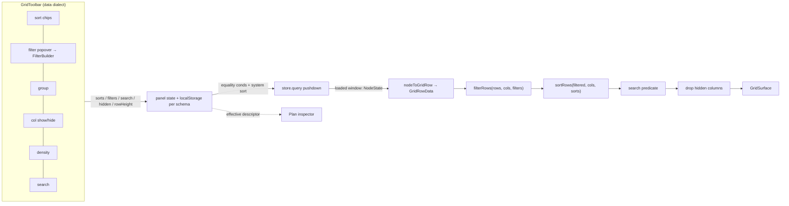
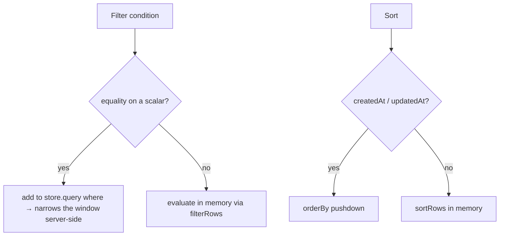

# DevTools Data Table — Rich Sorting, Filtering, and Queries

## Problem Statement

The dev tool's new Data panel (exploration
[0217](0217_[x]_DEVTOOLS_OVERHAUL_HERO_PANELS_DATA_BROWSER_AND_PROFILING.md),
merged) renders node data in the real database grid (`GridSurface`) and
can even edit cells — but its toolbar is a hand-rolled one-liner: a
client-side text search, a schema picker, an "include deleted" checkbox,
and an edit toggle. There is **no way to sort by a column, no filter
builder, no grouping, no column show/hide, no density control** — none of
the rich interactions the main database UI already ships.

The ask: bring the database UI's filtering/sorting/query affordances into
the dev Data table — click a column to sort, build AND/OR filter
conditions with real operators (contains, >, between, …), and generally
have a richer UI for slicing through the data.

## Executive Summary

The pieces already exist and are battle-tested in the app — this is
**wiring, not building**:

- `GridToolbar` (`packages/views/src/grid/GridToolbar.tsx`) is a complete,
  self-contained toolbar: sort chips, a filter popover that embeds
  `FilterBuilder`, a group-by dropdown, column show/hide, row-height
  (density), search, and import/export. Every section is gated by whether
  its callback prop is supplied, so you light up exactly the features you
  want. The dev panel simply doesn't render it today.
- The **filter/sort engines are client-side and already reusable**:
  `filterRows()` and `sortRows()` from
  `packages/data/src/database/filter-engine.ts` (+ `sort`) evaluate the
  full `FilterGroup`/`SortConfig` (15+ operators, nested AND/OR) over rows
  shaped exactly like the grid's `{ id, cells }`.
- **Crucial finding:** the main database UI itself filters and sorts
  **client-side over a loaded window** — `store.query`'s `where` is
  equality-only on scalars and `orderBy` only pushes down for
  `createdAt`/`updatedAt`; everything richer (operators, property sorts,
  AND/OR) runs in memory via `filterRows`/`sortRows`. So the dev table
  doing the same is *consistent with the product*, not a compromise.

**Recommendation:** replace the custom toolbar with `GridToolbar`, hold
filter/sort/group/density/hidden-columns/search in panel state (persisted
to `localStorage` per schema, matching the devtools persistence pattern),
and apply `filterRows` + `sortRows` + a search predicate to the loaded
window before handing rows to `GridSurface`. Keep cheap **equality +
system-sort pushdown** to `store.query` so the loaded window is as
relevant as possible, surface the effective query in the existing plan
inspector (the "run queries" story), and show an honest "filtering N
loaded of M" indicator when the window is truncated. All client-side
filtering stays in the **`@xnetjs/data` (data) filter dialect** that both
`GridToolbar` and `filterRows` already speak — no new dialect, no bridging
in our layer.

## Current State In The Repository

### The dev Data panel today

- Panel: `packages/devtools/src/panels/DataExplorer/DataExplorer.tsx` —
  the toolbar (lines ~66–126) is a flex row of: a "Search loaded rows…"
  input, a schema `<select>`, an `includeDeleted` checkbox, a row counter,
  an `edit` toggle, a refresh `↻`, and a copy button. It does **not**
  import `GridToolbar`.
- Hook: `packages/devtools/src/panels/DataExplorer/useDataExplorer.ts` —
  `runQuery()` calls
  `store.query({ schemaId, includeDeleted, limit: 200, orderBy: { updatedAt: 'desc' }, count: 'exact' })`
  for a specific schema, or `store.list(...)` for "All schemas". Live via
  `store.subscribe` (250 ms debounce). Search is a client-side
  `state.nodes.filter(...)` over `id`/`schemaId`/`JSON.stringify(properties)`.
- Adapter: `packages/devtools/src/panels/DataExplorer/grid-adapter.ts` —
  `buildGridFields(schema, observedKeys, showSchemaColumn, editable)`
  returns typed `GridField[]`; `nodeToGridRow(node, fieldTypeById)` returns
  `{ id, cells }`; `coerceCellValueForType`, `buildSchemaOptions`,
  `formatPlanRows`.

### The toolbar we're not using

`packages/views/src/grid/GridToolbar.tsx` — `GridToolbarProps` (only
`views` and `fields` are required; every feature section is gated on its
callback):

```ts
interface GridToolbarProps {
  views: GridViewTab[]; activeViewId?; onSelectView?; onAddView?
  fields: GridField[]
  hiddenFieldIds?: string[]; onToggleFieldVisible?: (fieldId, hidden) => void
  sorts?: SortConfig[]; onToggleSort?: (fieldId) => void; onClearSorts?: () => void
  filters?: FilterGroup | null; onChangeFilters?: (filters: FilterGroup | null) => void
  groupBy?: string | null; onChangeGroupBy?: (fieldId: string | null) => void
  rowHeight?: RowHeight; onChangeRowHeight?: (h: RowHeight) => void
  search?: string; onSearchChange?: (s: string) => void
  onExportCsv?; onExportJson?; onImportCsv?; rowCount?: number; className?
}
```

It renders sort chips, a filter button → popover embedding
`FilterBuilder` (it converts data↔views dialects internally via
`toSurfaceFilter`/`fromSurfaceFilter`), a group dropdown (select/person/
checkbox fields only), a column-visibility popover, a density dropdown
(`ROW_HEIGHTS`), a search box, and an import/export menu.

### The reference wiring (DatabaseView)

`apps/web/src/components/DatabaseView.tsx` passes `GridToolbar` callbacks
into `useGridDatabase` (`packages/react/src/hooks/useGridDatabase.ts`),
which **applies filters/sorts client-side** in its `rows` memo:

```ts
// useGridDatabase rows memo (paraphrased):
const columns = fieldsToColumnDefinitions(fields)
const filtered = filterRows(base, columns, activeView.filters) // @xnetjs/data
return sortRows(filtered, columns, activeView.sorts)            // @xnetjs/data
```

Search is the one thing it pushes to the store
(`useQuery(DatabaseRowSchema, { …, search })`), and it stores the
sorts/filters on a `DatabaseView` node. The filtering itself is in-memory.

### The query ceiling (why client-side is the right call)

`packages/data/src/store/query.ts` + `store/sqlite-adapter.ts`:

| Capability | Pushdown to SQLite | Notes |
|---|---|---|
| `where: Record<string, unknown>` | **equality on scalars only** | non-scalars / operators fall back to in-memory `matchesNodeQueryDescriptor` (strict `!==`) |
| `orderBy` | **`createdAt`/`updatedAt` only** | any property sort disables SQL pagination; multi-column sort is in-memory |
| `search` | client-side token-prefix over `title`/`content`/`description`/`body` | not the broad JSON search the dev panel wants |
| operators (`gt`/`contains`/`between`/AND/OR) | **none** | `QueryAST` (`query-ast.ts` `matchesQueryASTLoadedRow`) and the DB `filter-engine.ts` evaluate these **in memory** |

So there is no SQL compilation for rich predicates over arbitrary nodes —
the product filters in memory and so should we.

### The two filter dialects (already reconciled)

- **Data dialect** (`packages/data/src/database/view-types.ts`):
  `FilterGroup { operator: 'and'|'or'; conditions: Array<FilterCondition|FilterGroup> }`,
  `FilterCondition { columnId, operator, value }`, `SortConfig { columnId, direction }`.
  This is what `GridToolbar.filters`, `filterRows`, and `sortRows` all use.
- **Views dialect** (`packages/views/src/types.ts`): flat
  `FilterGroup { type; filters: Filter[] }` with `propertyId` — used only
  inside `FilterBuilder`. `GridToolbar` already bridges to/from it.

**We stay entirely in the data dialect** — `GridToolbar` in, `filterRows`/
`sortRows` out. No bridging in the dev panel.

## External Research

- **Notion / Airtable / Linear** all expose the same vocabulary the dev
  table is missing: click-header sort with multi-sort, a filter builder
  with typed operators and AND/OR groups, group-by, column show/hide, row
  density. The repo's `GridToolbar` is explicitly modeled on this, so
  matching it is about reuse, not invention.
- **TanStack Table** (which `@xnetjs/views` builds on under the hood) treats
  filtering/sorting as client-side row-model transforms by default, with
  manual server-side as an opt-in — exactly the "filter the loaded window
  in memory, optionally narrow it server-side" split recommended here.
- **Datasette / Postgres admin / Convex dashboard** data browsers lean on
  the database for filtering at scale, but all cap the result window and
  filter/sort within it for interactivity. A dev inspector is firmly in
  the "bounded window, rich in-memory slicing" regime.
- Prior exploration
  [0199](0199_[_]_NOTION_AND_AIRTABLE_GRADE_DATABASE_UI_AND_NATIVE_QUERIES.md)
  already concluded "the engine is far ahead of the UI" and that
  `GridSurface`/`GridToolbar` are store-agnostic and reusable, and flagged
  the lossy nested-group bridge — context we inherit directly.

## Key Findings

1. **It's wiring.** `GridToolbar` + `filterRows`/`sortRows` +
   `fieldsToColumnDefinitions` are the exact components the app uses; the
   dev panel just needs to render the toolbar and run the engines over its
   loaded rows.
2. **Client-side is correct, not a shortcut.** The main DB UI filters/sorts
   in memory over a loaded window; rich predicates have no SQL path for
   arbitrary nodes. Matching that behavior is faithful to the product.
3. **One dialect end-to-end.** Keeping everything in the data-dialect
   `FilterGroup`/`SortConfig` avoids the lossy views↔data bridge in our
   code (`GridToolbar` owns that conversion for `FilterBuilder`).
4. **Cheap pushdown still helps.** Pushing equality conditions and
   system-field sorts into `store.query` narrows the loaded window so the
   in-memory pass is over the most relevant rows — a nice-to-have, not a
   requirement.
5. **Honesty about scope.** Filtering/sorting acts on the loaded window
   (e.g. 200–1000 rows), not necessarily the whole table. We must show
   when the window is truncated, or the dev will mistrust the data.
6. **Persistence should be light.** Unlike the app's `DatabaseView` nodes,
   the dev tool should persist filter/sort/density/hidden-columns to
   `localStorage` (per schema), matching the existing devtools persistence
   (panel/position/height) — never write view nodes into the user's data.

## Options And Tradeoffs

### How filtering/sorting executes

| Option | What | Pros | Cons |
|---|---|---|---|
| **A. Client-side over loaded window** (recommended core) | Load a window via `store.query`, apply `filterRows`/`sortRows`/search in memory | Reuses the exact app engines; full operator set + AND/OR; mirrors DB UI; trivial to wire | Only sees the loaded window (mitigated by a larger limit + truncation indicator + equality pushdown) |
| **B. Hybrid pushdown** (recommended add-on) | Push equality conditions + `createdAt/updatedAt` sorts into `store.query`; everything else client-side | Loaded window is the most relevant rows; cheap; better at scale | A little mapping logic (which conditions are equality-on-scalar) |
| **C. Full QueryAST → SQL for nodes** | Compile rich predicates to SQL for arbitrary nodes | Would filter the whole table server-side | Doesn't exist; large engine work; out of scope for a dev inspector |

### Toolbar surface

| Option | Pros | Cons |
|---|---|---|
| **Full `GridToolbar`** (recommended) | Sort + filter + group + density + column-visibility + search in one component, consistent with the app | Pulls in view-tab/import-export props we must stub/omit |
| Hand-extend the current custom toolbar | Minimal surface | Reinvents the filter popover/sort chips/density that already exist; diverges from the app |

### "Run queries"

| Option | Pros | Cons |
|---|---|---|
| **Visual builder is the query UI** (recommended) | The filter builder + sort + the plan inspector showing the effective `NodeQueryDescriptor` is the "query" surface; no parsing/escape hatches to maintain | Power users might want raw input |
| **+ Advanced raw `where`/`orderBy` JSON** (optional) | Lets devs type a precise descriptor; reflected in the plan inspector | Extra surface; needs safe parse + validation |

### Persistence

| Option | Pros | Cons |
|---|---|---|
| **`localStorage` per schema** (recommended) | Survives reloads; never touches user data; matches devtools pattern | Per-device only |
| In-memory only | Simplest | Resets every panel switch — annoying |
| View nodes (like the app) | Reuses `DatabaseView` model | Writes dev state into the user's synced data — wrong for an inspector |

## Recommendation

Adopt **A + B** (client-side rich filtering over a loaded window, with
cheap equality/system-sort pushdown), drive it with the full
**`GridToolbar`**, persist to **`localStorage` per schema**, and treat the
builder + plan inspector as the "query" surface (with an optional advanced
raw-`where` JSON box as a follow-up).





Concretely:

1. **Toolbar.** Render `GridToolbar` with `fields` (the built grid fields),
   `views: []` (no view tabs in the dev tool), and wire `sorts`/
   `onToggleSort`/`onClearSorts`, `filters`/`onChangeFilters`, `groupBy`/
   `onChangeGroupBy`, `rowHeight`/`onChangeRowHeight`, `hiddenFieldIds`/
   `onToggleFieldVisible`, `search`/`onSearchChange`, and `rowCount`. Keep
   the schema picker + include-deleted + edit toggle + plan inspector
   (move them into a thin row above/below the toolbar, or pass schema as a
   left-side control).
2. **State.** Hold `{ sorts, filters, groupBy, rowHeight, hiddenFieldIds, search }`
   per selected schema in the hook, hydrated from / written to
   `localStorage` keyed by schema IRI (`xnet:devtools:data:<iri>`).
3. **Apply.** In the component's `rows` memo:
   `fieldsToColumnDefinitions(fields)` → `filterRows(rows, cols, filters)`
   → `sortRows(filtered, cols, sorts)` → apply the broad search predicate →
   render. Pass `ROW_HEIGHT_PX[rowHeight]` to `GridSurface` and the
   visible-only `fields` (minus `hiddenFieldIds`).
4. **Pushdown (B).** Translate equality-on-scalar conditions into
   `store.query` `where`, and a single `createdAt`/`updatedAt` sort into
   `orderBy`; raise the window `limit` (e.g. 500) when any filter/sort is
   active so the in-memory pass is meaningful.
5. **Honesty.** When `totalCount > loaded`, show "filtering N of M loaded"
   in the toolbar/status, with a "load more" affordance (bump limit) — the
   dev must know the window is bounded.
6. **Query surface.** Keep the plan inspector; add the effective
   `where`/`orderBy` (and which conditions ran client-side) so the builder
   doubles as a query console. Defer a raw-JSON `where` editor.

Group-by and grouped-row rendering depend on `GridSurface` group support —
verify during implementation; if absent, ship sort+filter+search+density+
column-visibility first (the core ask) and treat grouping as a follow-up.

## Example Code

### Apply the data-dialect engines over the loaded window

```ts
import { filterRows, sortRows, fieldsToColumnDefinitions } from '@xnetjs/data'
import { ROW_HEIGHT_PX, type RowHeight } from '@xnetjs/data'
import type { FilterGroup, SortConfig } from '@xnetjs/data'

// fields: GridField[]; rows: GridRowData[] ({id, cells}); both already built.
const columns = useMemo(() => fieldsToColumnDefinitions(fields), [fields])

const visibleFields = useMemo(
  () => fields.filter((f) => !hiddenFieldIds.includes(f.id)),
  [fields, hiddenFieldIds]
)

const displayRows = useMemo(() => {
  const filtered = filterRows(rows, columns, filters)        // 15+ operators, AND/OR
  const sorted = sortRows(filtered, columns, sorts)          // multi-column
  if (!search.trim()) return sorted
  const q = search.toLowerCase()
  return sorted.filter((r) => JSON.stringify(r.cells).toLowerCase().includes(q))
}, [rows, columns, filters, sorts, search])
```

### Wire GridToolbar (data dialect throughout)

```tsx
<GridToolbar
  views={[]}
  fields={fields}
  sorts={sorts}
  onToggleSort={(fieldId) => setSorts((s) => cycleSort(s, fieldId))}
  onClearSorts={() => setSorts([])}
  filters={filters}
  onChangeFilters={setFilters}
  groupBy={groupBy}
  onChangeGroupBy={setGroupBy}
  rowHeight={rowHeight}
  onChangeRowHeight={setRowHeight}
  hiddenFieldIds={hiddenFieldIds}
  onToggleFieldVisible={(id, hidden) =>
    setHiddenFieldIds((h) => (hidden ? [...h, id] : h.filter((x) => x !== id)))
  }
  search={search}
  onSearchChange={setSearch}
  rowCount={displayRows.length}
/>

<GridSurface
  fields={visibleFields}
  rows={displayRows}
  readOnly={!editable}
  rowHeight={ROW_HEIGHT_PX[rowHeight]}
  onUpdateCell={editable ? onUpdateCell : undefined}
  onOpenRow={setSelectedNodeId}
/>
```

### `cycleSort` (none → asc → desc → none), data dialect

```ts
function cycleSort(sorts: SortConfig[], columnId: string): SortConfig[] {
  const current = sorts.find((s) => s.columnId === columnId)
  if (!current) return [{ columnId, direction: 'asc' }]
  if (current.direction === 'asc') return [{ columnId, direction: 'desc' }]
  return sorts.filter((s) => s.columnId !== columnId)
}
```

## Risks And Open Questions

- **Window-bounded results.** Filtering/sorting only sees the loaded
  window. Mitigate with a larger limit when filters are active, equality
  pushdown, and a visible "N of M loaded" indicator + load-more. Open
  question: default window size (200 today; 500–1000 when filtering?).
- **`GridSurface` group rendering.** Unconfirmed whether `GridSurface`
  renders grouped rows; if not, defer group-by. Verify early.
- **System vs property columns in filters.** The system columns are
  synthetic (`@@id`, `@@schema`, `@@updatedAt`, `@@author`) and pre-
  formatted strings; ensure `fieldsToColumnDefinitions` + `filterRows`
  treat them sanely (e.g. don't offer numeric operators on the formatted
  date string — prefer filtering real properties; consider excluding
  system columns from the filter property list or mapping them to raw
  values).
- **Cell value shapes.** `filterRows` compares `row.cells[columnId]`
  against the column type; the 0217 `coerceCellValueForType` already shapes
  cells per `FieldType`, but date cells are epoch numbers while the app's
  DB rows store ISO strings — confirm date/dateRange operators
  (before/after/between) behave on our coerced values, or filter on a raw
  shadow value.
- **"All schemas" mode.** Columns are synthesized text there; filtering is
  best-effort (string ops). Keep filtering enabled but typed operators only
  light up with a concrete schema (same gate as editing in 0217).
- **Search semantics.** Two searches exist (broad client-side JSON vs the
  store's `title`/`content` FTS). Keep the broad client-side one as the
  toolbar search (most useful for a dev); optionally expose store FTS
  later.
- **Pushdown correctness.** Only push conditions that are provably
  equality-on-scalar; never silently drop a non-pushable condition from the
  client-side pass (double-apply is fine; dropping is a bug).

## Implementation Checklist

- [ ] Replace the custom toolbar in `DataExplorer.tsx` with `GridToolbar`,
      keeping the schema picker, include-deleted, edit toggle, refresh,
      copy, and plan inspector around it.
- [ ] Add `{ sorts, filters, groupBy, rowHeight, hiddenFieldIds }` to
      `useDataExplorer` state (data dialect), defaulting to the current
      `updatedAt desc` sort.
- [ ] Persist that state to `localStorage` per schema IRI
      (`xnet:devtools:data:<iri>`); hydrate on schema change; reset cleanly
      for "All schemas".
- [ ] Build the `rows` memo: `fieldsToColumnDefinitions(fields)` →
      `filterRows` → `sortRows` → search predicate; pass to `GridSurface`.
- [ ] Pass `visibleFields` (minus `hiddenFieldIds`) and
      `ROW_HEIGHT_PX[rowHeight]` to `GridSurface`.
- [ ] Wire `onToggleSort`/`onClearSorts` (cycle none→asc→desc→none),
      `onChangeFilters`, `onChangeGroupBy`, `onChangeRowHeight`,
      `onToggleFieldVisible`, `onSearchChange`.
- [ ] Hybrid pushdown: map equality-on-scalar conditions → `store.query`
      `where`; a single system-field sort → `orderBy`; raise `limit` when
      filtering/sorting is active.
- [ ] Truncation indicator: "filtering N of M loaded" + load-more (bump
      limit) when `totalCount > loaded`.
- [ ] Extend the plan inspector to show the effective `where`/`orderBy` and
      mark which conditions ran client-side.
- [ ] Verify `GridSurface` grouped-row rendering; wire group-by if
      supported, else defer with a note.
- [ ] Exclude or carefully map system columns (`@@…`) in the filter
      property list so operators match real values.
- [ ] Unit tests: `cycleSort`; pushdown classifier (which conditions are
      equality-on-scalar); the `rows` memo (filter+sort+search) over sample
      nodes; localStorage hydrate/persist round-trip.

## Validation Checklist

- [ ] Clicking a column header sorts asc → desc → clears; multi-column sort
      chips render and reorder rows.
- [ ] The filter popover builds AND/OR conditions with typed operators
      (contains, >, between, isEmpty, hasAny…) and the grid updates live.
- [ ] Column show/hide and density (short/medium/tall/extraTall) change the
      grid; row-height matches `ROW_HEIGHT_PX`.
- [ ] Filter/sort/density/hidden-columns survive a panel switch and a page
      reload (per schema), and don't leak across schemas.
- [ ] Equality filters + system-field sorts visibly narrow the loaded
      window (plan inspector shows them in `where`/`orderBy`); rich
      operators still filter correctly in memory.
- [ ] Truncation indicator appears when `totalCount > loaded`; load-more
      grows the window.
- [ ] Editing (0217) still works with filters/sorts active; edited rows
      re-filter/re-sort live via `store.subscribe`.
- [ ] No write of dev view state into user data (localStorage only).
- [ ] `pnpm --filter @xnetjs/devtools typecheck && test` green; views
      grid tests green; verified live in the browser preview (sort, filter,
      group/density, hide columns) with no console errors.

## References

- Dev Data panel: [DataExplorer.tsx](packages/devtools/src/panels/DataExplorer/DataExplorer.tsx) · [useDataExplorer.ts](packages/devtools/src/panels/DataExplorer/useDataExplorer.ts) · [grid-adapter.ts](packages/devtools/src/panels/DataExplorer/grid-adapter.ts)
- Toolbar + filter UI: [GridToolbar.tsx](packages/views/src/grid/GridToolbar.tsx) · [FilterBuilder.tsx](packages/views/src/filter/FilterBuilder.tsx) · [GridSummaryBar.tsx](packages/views/src/grid/GridSummaryBar.tsx)
- Filter/sort engines (data dialect): [filter-engine.ts](packages/data/src/database/filter-engine.ts) · view types [view-types.ts](packages/data/src/database/view-types.ts) · [row-height.ts](packages/data/src/database/row-height.ts)
- Reference wiring: [DatabaseView.tsx](apps/web/src/components/DatabaseView.tsx) · [useGridDatabase.ts](packages/react/src/hooks/useGridDatabase.ts)
- Query ceiling: [query.ts](packages/data/src/store/query.ts) · [query-ast.ts](packages/data/src/store/query-ast.ts) · [sqlite-adapter.ts](packages/data/src/store/sqlite-adapter.ts)
- Prior explorations: [0217 DevTools overhaul](0217_[x]_DEVTOOLS_OVERHAUL_HERO_PANELS_DATA_BROWSER_AND_PROFILING.md) · [0199 Notion/Airtable-grade DB UI + native queries](0199_[_]_NOTION_AND_AIRTABLE_GRADE_DATABASE_UI_AND_NATIVE_QUERIES.md)
- Prior art: Notion/Airtable/Linear table toolbars; TanStack Table client vs manual filtering; Datasette / Convex data browsers.
