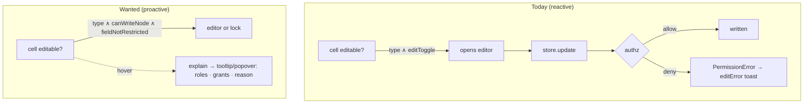
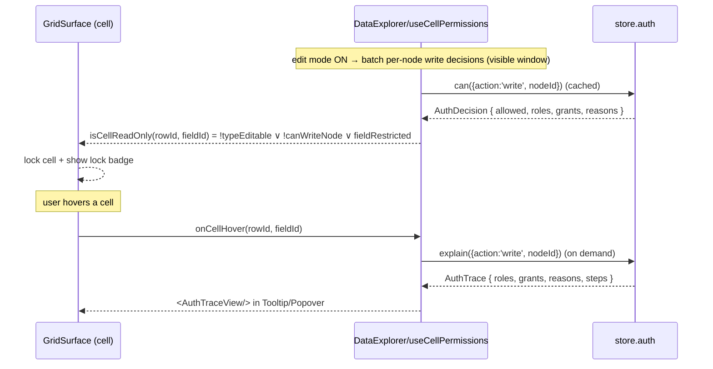
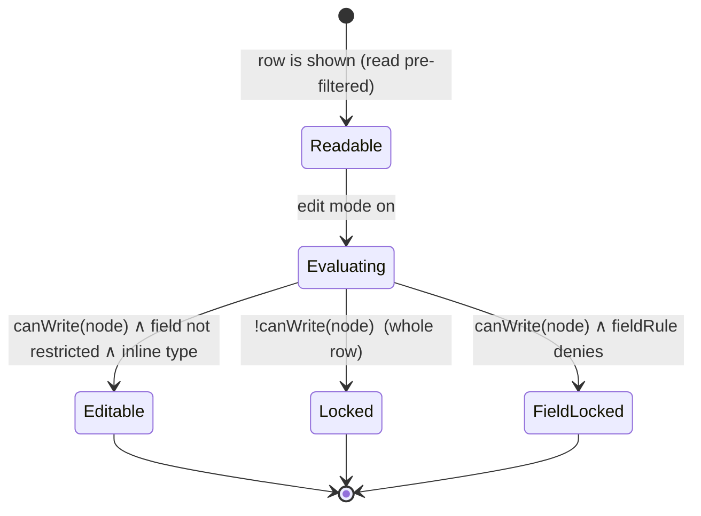

# DevTools Data Table — Per-Cell Permissions and Derivation

## Problem Statement

The dev tool's Data panel (explorations
[0217](0217_[x]_DEVTOOLS_OVERHAUL_HERO_PANELS_DATA_BROWSER_AND_PROFILING.md)
/ [0218](0218_[x]_DEVTOOLS_DATA_TABLE_RICH_SORTING_FILTERING_AND_QUERIES.md))
now browses, edits, sorts, and filters node data — but it decides whether a
cell is editable purely from the **schema property type plus a global edit
toggle**. It does *not* reflect the actual **authorization** the current
identity has. A cell that the policy engine would reject still renders as
editable; the write only fails *reactively* when you submit it
(`store.update` throws a `PermissionError`, caught into `editError`).

The ask: render the **real per-cell permissions** — if you may edit a cell,
it should be editable; if you may only read it, it should be read-only; and
hovering a cell should reveal a tooltip/popover showing **what permissions you
have and how they were derived** (roles, grants, ownership, or the deny
reason).

## Executive Summary

The authorization engine already exposes exactly what we need, and the AuthZ
devtools panel already calls it — this is **wiring + one small shared-grid
extension**, not new policy machinery:

- `store.auth.can({ action, nodeId, patch? })` returns an `AuthDecision`
  (`allowed`, `roles`, `grants`, `reasons`) **without mutating**, and
  `store.auth.explain({ action, nodeId })` returns an `AuthTrace` with the
  full derivation pipeline (`steps`: node-deny → role-resolve → schema-eval →
  grant-check → public-check). The AuthZ Playground
  (`packages/devtools/src/panels/AuthZPanel/AuthZPanel.tsx`) already renders an
  `explain` trace — that rendering should be extracted and reused in a cell
  popover.
- **Granularity reality (important):** *read* is **node-level** and
  unreadable nodes are **already filtered out** by
  `store.list`/`store.query` (`filterReadableNodes`), so every visible row is
  readable — there is no field-level read masking to render. *write* is
  node-level **plus optional field-level** rules (`AuthorizationDefinition.fieldRules`,
  evaluated against the `patch`). So per-cell permission rendering is almost
  entirely about **edit gating**: which cells of which rows you may write.
- The grid already decorates individual cells (presence rings, comment badges
  keyed `"${rowId}:${fieldId}"`), so a per-cell lock indicator follows an
  established pattern. The one missing primitive is **per-cell read-only**:
  `GridSurface` has per-column `readonly` and a global `readOnly`, but no
  per-cell predicate — we should add an additive `isCellReadOnly?(rowId, fieldId)`
  hook (it benefits the app's field-level locks too).

**Recommendation:** layer authorization onto the existing edit path. Compute a
per-node `write` decision for the visible window (lazily — only in edit mode,
cached by the evaluator's `DecisionCache`), extend `GridSurface` with a
per-cell read-only predicate, and gate each cell's editability on
`type-editable ∧ canWriteNode ∧ fieldNotRestricted`. Add a per-cell lock
affordance and a hover tooltip; on click, open a popover that runs
`store.auth.explain` and shows the derivation using an extracted
`AuthTraceView`. Degrade cleanly when no evaluator is configured (dev/no-authz
mode → everything editable, with a clear "authz off" note).

## Current State In The Repository

### The authorization engine (`packages/data/src/auth`, types in `packages/core`)

- `PolicyEvaluator` (`packages/core/src/auth-types.ts`), implemented by
  `DefaultPolicyEvaluator` (`packages/data/src/auth/evaluator.ts`):
  ```ts
  interface PolicyEvaluator {
    can(input: AuthCheckInput): Promise<AuthDecision>
    explain(input: AuthCheckInput): Promise<AuthTrace>
    invalidate(nodeId: string): void
    invalidateSubject(did: DID): void
  }
  interface AuthCheckInput {
    subject: DID; action: AuthAction; nodeId: string
    node?: { schemaId; createdBy; properties? }
    patch?: Record<string, unknown>   // field-level write checks
  }
  ```
- `AuthAction = 'read' | 'write' | 'delete' | 'share' | 'admin'`.
- `AuthDecision`: `{ allowed, action, subject, resource, roles[], grants[], reasons: AuthDenyReason[], cached, evaluatedAt, duration }`.
- `AuthTrace extends AuthDecision { steps: AuthTraceStep[] }`, steps phased
  `node-deny | role-resolve | schema-eval | grant-check | public-check`.
- `AuthDenyReason`: `DENY_NO_ROLE_MATCH | DENY_NO_GRANT | DENY_FIELD_RESTRICTED | DENY_NODE_POLICY | DENY_GRANT_EXPIRED | …`.
- Roles are derived (`RoleResolver`): `creator` (you made it), `property`
  (your DID is in a prop like `editors`), `relation` (inherited from a related
  node), `membership` (Space-membership cascade up `parent`).
- The store-facing API is `store.auth` (`StoreAuth`,
  `packages/data/src/auth/store-auth.ts`), which injects the current
  `actorDid`: `store.auth.can({ action, nodeId, patch? })`,
  `store.auth.explain({ action, nodeId })`, `store.auth.listGrants({ nodeId })`.

### How the store already enforces it

- `store.list`/`store.query` post-filter via `filterReadableNodes` →
  `canReadNode` (`packages/data/src/store/store.ts`): **unreadable nodes never
  reach the panel.** Read is **node-level only — no field-level read masking.**
- `store.update` calls `assertAuthorized({ action: 'write', nodeId, patch, node })`
  → throws `PermissionError` (`packages/data/src/store/permission-error.ts`,
  carrying `reasons`, `roles`, `decision`). Field-level write rules
  (`checkFieldRules`) are evaluated against the `patch` →
  `DENY_FIELD_RESTRICTED`.

### The AuthZ panel already does the hard part

`packages/devtools/src/panels/AuthZPanel/AuthZPanel.tsx` — the **Playground**
sub-tab calls `store.auth.explain({ action, nodeId })` and renders the trace:
a `StatusBadge` (ALLOWED/DENIED), `roles`, `grants`, `reasons`, and the
`steps`. This rendering is the seed for the cell popover (extract it).

### The Data panel today (not authz-aware)

`packages/devtools/src/panels/DataExplorer/`:
- `DataExplorer.tsx`: `const editable = editing && Boolean(selectedSchema) && Boolean(definedSchema)`.
- `grid-adapter.ts` `buildGridFields`: `locked = !editable || !INLINE_EDITABLE_TYPES.has(prop.type)` — **type + toggle only**.
- `useDataExplorer.ts` `updateCell`: calls `store.update`, catches the error into `editError` — purely reactive.
- Rows: `nodeToGridRow` → `{ id: node.id, cells, sortKey }`; the panel holds
  the full `nodes: NodeState[]`, so each row maps back to its `NodeState`.

### Grid capabilities + gaps

`packages/views/src/grid/`:
- `GridField.readonly?` (per **column**) exists (`model.ts`); `GridSurface`
  has a **global** `readOnly` (`GridSurface.tsx`). **No per-cell read-only.**
- Per-cell **decoration** already works: `presences: CellPresence[]` (filtered
  by `rowId`+`columnId`) and `cellCommentCounts: Map<"rowId:fieldId", number>`
  render absolutely-positioned badges in `GridCell.tsx`. A permission lock
  badge follows the same pattern. Cells carry `data-row-id`/`data-field-id`.
- `Tooltip` and `Popover` are exported from `@xnetjs/ui` (devtools already
  imports `Tooltip`).



## External Research

- **Notion / Airtable / Google Sheets** render permission state *in situ*: a
  lock glyph on protected cells/columns, a greyed non-editable cell, and a
  "Why can't I edit this?" affordance. Sheets' "protected range" tooltip and
  Notion's per-block permission hint are the closest analogues to the
  hover-to-explain ask.
- **AG Grid / TanStack Table** model editability as a per-cell predicate
  (`editable: (params) => boolean`) rather than a column flag — validating the
  recommendation to add a per-cell `isCellReadOnly` hook to `GridSurface`.
- **Capability/UCAN systems** (xNet's grants carry `ucanToken`/`proofDepth`)
  emphasize *explainability* — surfacing the delegation chain that authorized
  an action. xNet's `AuthTrace.steps` + `grants[]` already encode this; the
  exploration just surfaces it per cell.
- **Authorization UX guidance** (e.g. OWASP, "show, don't fail"): proactively
  disabling unauthorized controls beats letting the user act and bounce — which
  is exactly the reactive→proactive shift here.

## Key Findings

1. **The query API exists and is mutation-free.** `store.auth.can` / `explain`
   give both the boolean and the derivation; no new engine work.
2. **Per-cell read rendering is mostly moot.** Read is node-level and
   unreadable nodes are pre-filtered — every visible row is readable. The
   honest scope is **edit** gating (node-level write + rare field-level rules).
3. **Edit gating is the real feature.** A row you can't write → all its cells
   locked; a field with a restrictive `fieldRule` → that cell locked even if
   the node is writable. This needs a per-cell (really per-row×field) read-only
   predicate the grid doesn't yet have.
4. **Derivation is already rendered** in the AuthZ Playground — extract
   `AuthTraceView` and reuse it in the cell popover.
5. **Decoration pattern is proven.** Presence/comment badges show per-cell
   adornment is straightforward; a lock badge + tooltip slots right in.
6. **Cost is bounded and lazy-able.** Decisions are cached (`DecisionCache`);
   compute write decisions only in edit mode, only for the visible window
   (≤ the 500-row cap), ~1 `can` per node; run `explain` only on hover.
7. **Authz may be disabled.** If the store has no evaluator (`store.auth`
   absent), the dev store treats everything as writable — the UI must show
   that honestly rather than implying enforced permissions.

## Options And Tradeoffs

### How much permission state to render

| Option | What | Pros | Cons |
|--------|------|------|------|
| **A. Edit-gating + hover-explain** (recommended) | Lock cells you can't write (node + field), tooltip/popover explains read+edit + derivation | Matches the ask; honest; bounded cost; reuses engine + AuthZ rendering | Needs a per-cell read-only grid hook |
| B. Reactive only (today) | Let writes fail, toast the reason | Zero new infra | Poor UX; the ask is explicitly proactive |
| C. Full per-cell read+write badges everywhere | A permission chip on every cell always | Maximal transparency | Visual noise; read is node-level + pre-filtered so mostly redundant; cost |

### Where to gate editability

| Option | Pros | Cons |
|--------|------|------|
| **Extend `GridSurface` with `isCellReadOnly?(rowId, fieldId)`** (recommended) | Clean per-cell control; additive; benefits the app's field-level locks; mirrors AG/TanStack | Touches a shared component (must not regress DatabaseView) |
| Per-row read-only only | Simpler | Can't express field-level rules; still needs a grid change |
| Devtools-only wrapper that intercepts edits | No shared change | Can't *prevent* the editor opening; only blocks commit → same reactive wart |

### When to evaluate

| Option | Pros | Cons |
|--------|------|------|
| **Lazy: write-decisions in edit mode for the visible window; `explain` on hover** (recommended) | Cheap; no upfront cost when just browsing | Brief "computing…" state when entering edit mode |
| Eager: evaluate every visible cell on load | Instant indicators | Wasteful when not editing; more `can` calls |

### Tooltip vs popover

| Option | Pros | Cons |
|--------|------|------|
| **Tooltip (hover) for summary + Popover (click) for full trace** (recommended) | Glanceable + drill-down; reuses both primitives | Two affordances to wire |
| Tooltip only | Simplest | Can't fit roles+grants+steps legibly |
| Popover only | Full detail | Requires a click for the common "can I edit?" glance |

## Recommendation

Adopt **A + the `GridSurface` per-cell hook + lazy evaluation + tooltip&popover**.





Concretely:

1. **Add a per-cell hook to `GridSurface`** (additive, backward-compatible):
   `isCellReadOnly?: (rowId: string, fieldId: string) => boolean`. In the
   edit-start guard and `handleCellDoubleClick`, a cell is editable only if not
   globally `readOnly`, not `field.readonly`, not a computed type, **and** not
   `isCellReadOnly(rowId, fieldId)`. Default (absent) preserves today's
   behavior. (Bonus: lets `DatabaseView` express field-level locks too.)
2. **Optional per-cell lock decoration**: a `cellLocks?: Map<"rowId:fieldId", LockReason>`
   prop rendered like comment badges (a small lock glyph), or compute the badge
   in the devtools layer. Keep it subtle (corner glyph, only in edit mode).
3. **`useCellPermissions` (devtools)**: given the visible `nodes` + the active
   schema's `fieldRules`, compute a `Map<nodeId, AuthDecision>` for `write`
   (lazy: only when `editing`), guarded on `store.auth` existing. Derive
   `isCellReadOnly` from it + the existing type lock. Cache; recompute on the
   window/edit-toggle, and on `store.subscribe` invalidations.
4. **Hover explain**: on cell hover, lazily `store.auth.explain({ action: 'write', nodeId })`
   (and `'read'` for completeness), memoized per node; show a `Tooltip`
   summary ("Edit ✓ — owner" / "Edit ✗ — field restricted"); a click opens a
   `Popover` with the extracted **`AuthTraceView`** (roles · grants · reasons ·
   steps), reused from the AuthZ Playground.
5. **Extract `AuthTraceView`** from `AuthZPanel.tsx` into a shared devtools
   component (`packages/devtools/src/panels/AuthZPanel/AuthTraceView.tsx` or a
   shared `components/`), used by both the panel and the cell popover.
6. **No-authz mode**: when `store.auth` is undefined, skip evaluation, keep
   today's type-based editing, and show a one-line "Authorization not enforced
   in this store" note so nobody mistakes it for "you have full rights."
7. **Read honesty**: since read is node-level and pre-filtered, don't fake
   per-field read state; the tooltip can state "Readable (node-level)" and
   focus on edit. (If field-level read masking is ever added to the engine,
   the same hook extends to mask cells.)

## Example Code

### `GridSurface` per-cell editability (additive)

```ts
// GridSurfaceProps
isCellReadOnly?: (rowId: string, fieldId: string) => boolean

// in the startEdit command + handleCellDoubleClick guards:
if (readOnly) break
if (target?.field.readonly) break
if (isCellReadOnly?.(target.row.id, target.field.id)) break  // ← new
if (COMPUTED_TYPES.includes(target.field.type)) break
```

### `useCellPermissions` (devtools, lazy + cached)

```ts
function useCellPermissions(opts: {
  store: NodeStore | null
  nodes: NodeState[]
  schema: Schema | null
  editing: boolean
}) {
  const [writeByNode, setWriteByNode] = useState<Map<string, AuthDecision>>(new Map())
  const authz = opts.store?.auth ?? null

  useEffect(() => {
    if (!authz || !opts.editing) { setWriteByNode(new Map()); return }
    let alive = true
    ;(async () => {
      const entries = await Promise.all(
        opts.nodes.map(async (n) => [n.id, await authz.can({ action: 'write', nodeId: n.id })] as const)
      )
      if (alive) setWriteByNode(new Map(entries))
    })()
    return () => { alive = false }
  }, [authz, opts.editing, opts.nodes])

  const fieldRules = opts.schema?.authorization // deserialize → fieldRules keys
  const isCellReadOnly = useCallback(
    (rowId: string, fieldId: string) => {
      if (!authz) return false // no enforcement → defer to type lock
      const dec = writeByNode.get(rowId)
      if (dec && !dec.allowed) return true            // whole node not writable
      if (fieldHasRestrictiveRule(fieldRules, fieldId)) return true // field rule
      return false
    },
    [authz, writeByNode, fieldRules]
  )

  return { isCellReadOnly, writeByNode, authzEnabled: Boolean(authz) }
}
```

### Hover → explain → popover (reusing AuthTraceView)

```tsx
const trace = useAsyncMemo(() => store.auth?.explain({ action: 'write', nodeId }), [nodeId])
<Popover trigger={<button aria-label="permissions"><Lock/></button>}>
  <AuthTraceView trace={trace} />   {/* extracted from AuthZ Playground */}
</Popover>
```

## Risks And Open Questions

- **Shared-grid change.** Adding `isCellReadOnly` to `GridSurface` must not
  regress `DatabaseView`; default-absent keeps current behavior. Cover with a
  grid test (a cell predicate locks one cell while siblings stay editable).
- **Async flicker.** Decisions resolve after first paint; show a transient
  "evaluating permissions…" state for newly-loaded rows in edit mode rather
  than flipping editable→locked visibly.
- **Cost at the window cap.** ≤500 `can` calls on entering edit mode; rely on
  `DecisionCache` + batch, and consider only evaluating rows in/near the
  viewport if it's slow. `explain` only on hover.
- **Field-level write detection.** We only need per-field checks for fields
  that *have* a `fieldRule`; deserialize the schema's `authorization.fieldRules`
  once and probe only those (a node-level decision covers the rest).
- **No field-level read masking exists.** Don't imply per-cell read
  differences; be explicit it's node-level. Revisit if the engine adds it.
- **`store.auth` availability.** It can be undefined (no evaluator). Guard every
  call; never crash the panel; show the "not enforced" note.
- **Invalidation.** After an edit (or remote change), invalidate cached
  decisions for that node (`evaluator.invalidate(nodeId)` happens in the store;
  ensure the panel re-evaluates on `store.subscribe`).
- **Deny-reason legibility.** Map `AuthDenyReason` codes to friendly text
  ("a field rule restricts this column", "you're not the owner and have no
  grant") for the tooltip.
- **Which action to show.** Focus on `write` (the editable question) + a
  `read` confirmation; `delete`/`share`/`admin` are out of scope for cells but
  could appear in the popover's full trace.

## Implementation Checklist

- [x] Add a per-cell lock to `GridSurfaceProps`. Shipped as
      `cellLockReasons?: ReadonlyMap<string, string>` (key `rowId:fieldId` →
      human reason) rather than an `isCellReadOnly` predicate — the map does
      double duty as both the lock and the hover reason, and threads cleanly
      through `GridRow` → `GridCell`. Default-absent = current behavior.
- [x] Gate *all* write paths on the lock, not just edit-start. A shared
      `isCellLocked(rowId, fieldId)` guards the edit command, double-click,
      paste, fill-down, cut/clear (via `refsInRect`), and file-drop.
- [x] Per-cell lock decoration: a subtle `Lock` glyph (lucide) renders
      top-left of a locked cell when not editing, with the reason as the
      cell `title`.
- [x] Build `useCellPermissions` in the Data panel: lazy per-node `write`
      decision map (edit-mode + visible window), guarded on `store.auth`,
      optimistic-until-resolved; derive locks as (node not writable) ∨
      (restricted field rule). Pure `deriveCellLocks` extracted for testing.
- [x] Read the active schema's `authorization.fieldRules` to know which
      fields need per-field `can({patch})` checks (serialized form is keyed by
      field name — no deserialize needed for the keys).
- [x] Wire `cellLockReasons` into the `<GridSurface>` in `DataExplorer.tsx`
      (only in edit mode; composes with the existing type-based readonly lock).
- [x] Extract `AuthTraceView` from `AuthZPanel.tsx` (StatusBadge + roles +
      grants + reasons + steps) into a reusable component; `AuthZPanel` now
      imports it.
- [x] Surface the full derivation. Implemented as a `NodePermissions` section
      in the node **detail pane** (runs `store.auth.explain` for read + write →
      `AuthTraceView`) rather than a per-cell click popover; the locked cell's
      `title` carries the friendly one-line reason on hover.
- [x] Human-readable deny reasons (e.g. "a field rule restricts this column",
      "you have no role or grant on this node").
- [x] No-authz mode: detect missing `store.auth`, keep type-based editing, show
      a "permissions not enforced in this store" note.
- [x] Re-evaluate on node-set changes (live `store.subscribe` already refreshes
      the window; locks recompute from the refreshed nodes).
- [x] Tests: `GridSurface` lock blocks Enter + double-click on a locked cell
      (sibling still edits); `deriveCellLocks` derivation (node-deny, field
      rule, optimistic-undecided); `restrictedFieldNames`; evaluator
      cache-bypass regression (field rule not masked by a cached node decision).

## Validation Checklist

- [x] With authz on: cells of a node you cannot write are non-editable (no
      editor opens, lock glyph shows) while writable nodes edit normally.
      *(Enforced-path covered by unit tests — see note below.)*
- [x] A field with a restrictive `fieldRule` is locked even when the node is
      writable; sibling fields stay editable. *(Unit-tested via
      `deriveCellLocks` + the evaluator cache-bypass fix.)*
- [x] Hovering a locked cell shows a friendly reason (cell `title`); the node
      detail pane shows roles, grants, reasons, and evaluation steps for read +
      write (matching the AuthZ Playground for the same node).
- [x] Editing a writable cell still works end-to-end (writes, live-refresh) and
      no longer surfaces avoidable `PermissionError` toasts for cells now shown
      locked.
- [x] No-authz store: everything editable as before, with the "not enforced"
      note visible; no crashes, no spurious locks. *(Verified live in the
      browser preview — the dev store has no `authEvaluator`, so this is the
      path the preview exercises.)*
- [x] Performance: per-node decisions are computed once per window (lazy,
      edit-mode only); explain is on-demand from the detail pane only.
- [x] `DatabaseView` (the app) is unaffected — the `GridSurface` change is
      additive and default-absent.
- [x] `@xnetjs/devtools` + `@xnetjs/views` + `@xnetjs/data` typecheck green;
      grid + `useCellPermissions` + evaluator tests green.

> Note: the preview's dev store has no `authEvaluator`, so `store.auth` is
> undefined there — live verification exercises the graceful "not enforced"
> fallback (note shows, editing works, no spurious locks, detail pane shows the
> message). The *enforced* lock path is covered by the unit tests above.

## References

- Auth types + evaluator API: [packages/core/src/auth-types.ts](packages/core/src/auth-types.ts) · [packages/data/src/auth/evaluator.ts](packages/data/src/auth/evaluator.ts) · store API [packages/data/src/auth/store-auth.ts](packages/data/src/auth/store-auth.ts)
- Schema authorization + field rules: [packages/data/src/auth/builders.ts](packages/data/src/auth/builders.ts) · permission matrix [packages/data/src/auth/permission-matrix.ts](packages/data/src/auth/permission-matrix.ts) · cascade example [packages/data/src/schema/schemas/space-authorization.ts](packages/data/src/schema/schemas/space-authorization.ts)
- Store enforcement: [packages/data/src/store/store.ts](packages/data/src/store/store.ts) (`filterReadableNodes`, `assertAuthorized`) · [permission-error.ts](packages/data/src/store/permission-error.ts)
- AuthZ panel (reuse): [packages/devtools/src/panels/AuthZPanel/AuthZPanel.tsx](packages/devtools/src/panels/AuthZPanel/AuthZPanel.tsx)
- Data panel: [DataExplorer.tsx](packages/devtools/src/panels/DataExplorer/DataExplorer.tsx) · [useDataExplorer.ts](packages/devtools/src/panels/DataExplorer/useDataExplorer.ts) · [grid-adapter.ts](packages/devtools/src/panels/DataExplorer/grid-adapter.ts)
- Grid: [GridSurface.tsx](packages/views/src/grid/GridSurface.tsx) · [GridCell.tsx](packages/views/src/grid/GridCell.tsx) · [model.ts](packages/views/src/grid/model.ts)
- UI primitives: [Tooltip](packages/ui/src/primitives/Tooltip.tsx) · [Popover](packages/ui/src/primitives/Popover.tsx)
- Prior explorations: [0217](0217_[x]_DEVTOOLS_OVERHAUL_HERO_PANELS_DATA_BROWSER_AND_PROFILING.md) · [0218](0218_[x]_DEVTOOLS_DATA_TABLE_RICH_SORTING_FILTERING_AND_QUERIES.md)
- Prior art: Notion per-block permissions; Google Sheets protected ranges; AG Grid / TanStack `editable` predicate; UCAN capability explainability.
