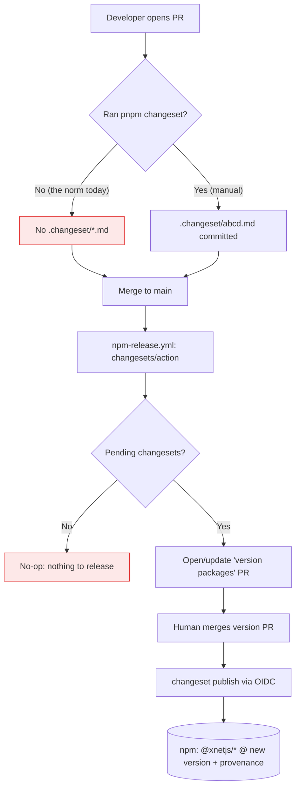
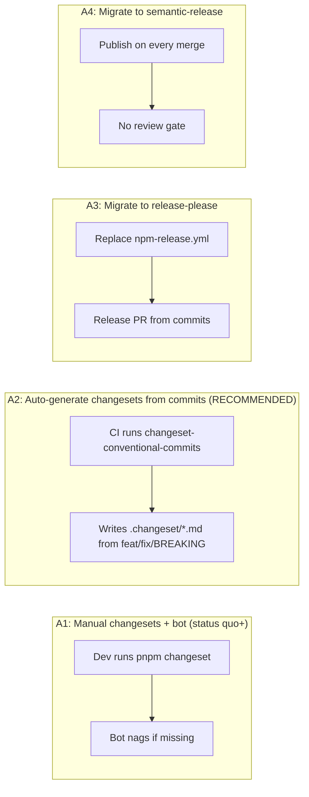
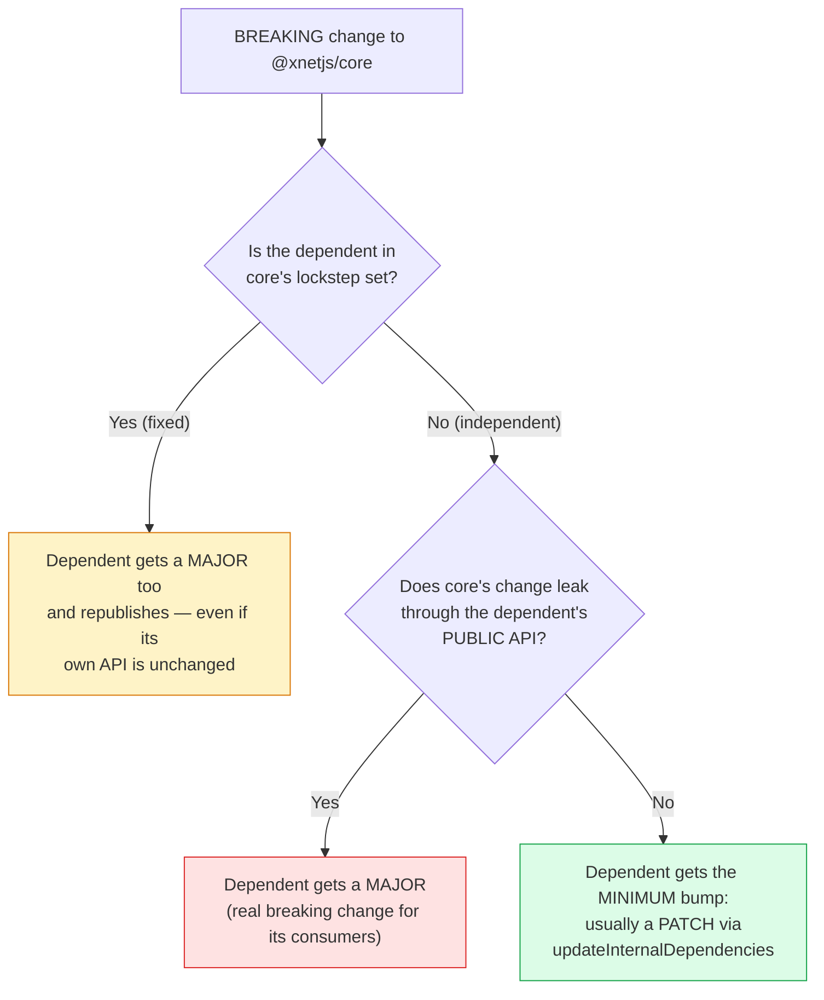
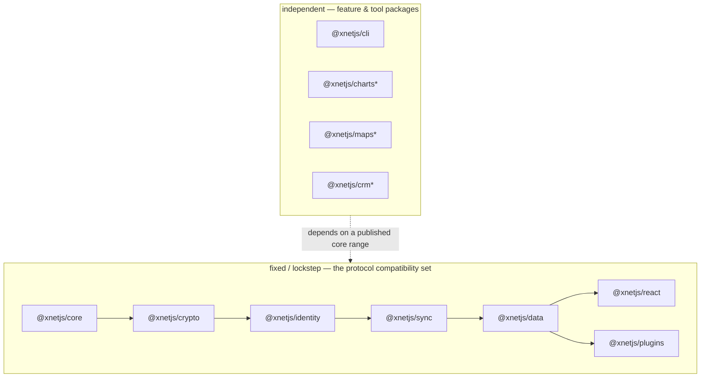
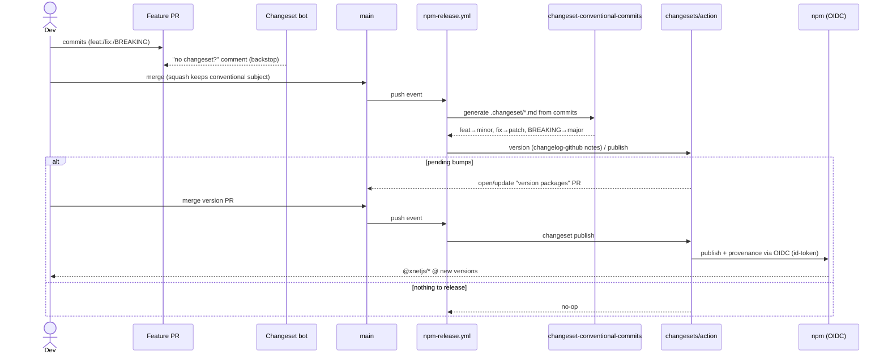
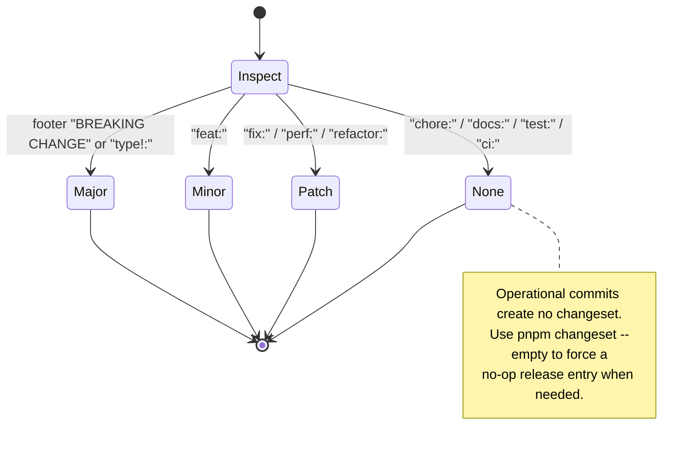

# Automated npm Package Publishing & Conventional-Commit Versioning

## Problem Statement

We want every `@xnetjs/*` package to publish to npm automatically when a change
merges to `main` — not just `@xnetjs/react`, but the whole core chain
(`@xnetjs/data`, `@xnetjs/crypto`, `@xnetjs/core`, …). Version bumps should be
driven by our existing **Conventional Commits** convention so that `feat:` →
minor, `fix:` → patch, and a breaking change → major are computed mechanically,
and each release should ship **good release notes**. The ask, as phrased, is:
"set up automated npm publication in CI/CD," "add the automatic versioning stuff
to the GitHub workflow," and "integrate this with our conventional commit
syntax."

## Executive Summary

**The headline finding: most of this already exists and is live.** Contrary to
the framing ("right now we already have `@xnetjs/react` publishing"), the repo
already has a complete, OIDC-secured, multi-package release pipeline built on
[Changesets](https://github.com/changesets/changesets):

- [`.github/workflows/npm-release.yml`](.github/workflows/npm-release.yml) runs
  `changesets/action@v1` on every push to `main`.
- [`.changeset/config.json`](.changeset/config.json) defines a **`fixed`
  (lockstep) group of 12 packages** — `react`, `history`, `plugins`,
  `data-bridge`, `data`, `storage`, `sqlite`, `sync`, `abuse`, `identity`,
  `crypto`, `core` — all marked `"private": false` with
  `publishConfig.provenance: true`.
- **12 packages have already shipped `@0.0.2`** to npm (git tags
  `@xnetjs/core@0.0.2` … `@xnetjs/react@0.0.2`, `@xnetjs/cli@0.0.2`), and each
  has a generated `CHANGELOG.md`.
- Publishing already uses **npm Trusted Publishing (OIDC)** — the most recent
  release commit is literally `2f4da8fc ci(release): remove npm token env for
  oidc publish`. No `NPM_TOKEN` lives in the repo.
- Conventional Commits are already **enforced** via commitlint
  ([`commitlint.config.cjs`](commitlint.config.cjs) +
  [`.husky/commit-msg`](.husky/commit-msg)).
- Operator docs already exist:
  [`docs/npm-release-quickstart.md`](docs/npm-release-quickstart.md) and
  [`docs/npm-release-runbook.md`](docs/npm-release-runbook.md).

So this exploration is **not** a greenfield build. It is: (1) correcting the
mental model of what's already shipping, and (2) closing the **four real gaps**
that remain.

**The four real gaps:**

1. **Conventional commits do _not_ drive version bumps yet.** Changesets is
   _decoupled_ from commit messages by design — it needs a hand-written
   `.changeset/*.md` file per change. There are currently **zero** changeset
   files in the repo. So today, a `feat:` merged to `main` bumps **nothing**
   unless a human ran `pnpm changeset`. This is the actual integration the
   request is about.
2. **Release notes are thin.** The config uses the default
   `@changesets/cli/changelog` generator, which emits only the changeset
   summary and a dependency list — no PR links, no author credit, no commit
   links.
3. **The `fixed` lockstep group is a strong, unrevisited default.** Every one
   of the 12 packages bumps to the _same_ version on every release, even when
   untouched — so a breaking change to `core` majors all of them. For xNet's
   tightly-coupled _protocol core_ that is actually the right call (it's the
   Angular/Babel pattern), but it should **not** be applied blanket-wide to
   loosely-coupled feature packages. See
   [Decision C](#decision-c--versioning-topology-for-interdependent-packages)
   for the full best-practice treatment and a two-tier model.
4. **Config/reality drift bugs.** `@xnetjs/abuse` is in the `fixed` group but
   is stuck at `0.0.1` with no tag (never published); `@xnetjs/cli` _is_
   published but is **not** in the `fixed` group. The next release will try to
   force-bump and first-publish `abuse`, which needs an OIDC trusted publisher
   configured or it will fail mid-release.

**Recommendation (preview):** _Keep Changesets + OIDC — do not rip out a working
system._ Add a **conventional-commit → changeset generator** step so commits
drive bumps, upgrade to **`@changesets/changelog-github`** for rich notes,
install the **Changeset bot** as a PR guard, fix the `abuse`/`cli` drift, and
make a deliberate decision on `fixed` (lockstep) vs independent versioning. A
migration to release-please or semantic-release is possible but throws away
working infrastructure for marginal benefit.

## Current State In The Repository

### The release workflow (already exists)

[`.github/workflows/npm-release.yml`](.github/workflows/npm-release.yml):

```yaml
on:
  push:
    branches: [main]
permissions:
  contents: write
  pull-requests: write
  id-token: write          # ← OIDC: the key to token-less publishing
jobs:
  release:
    steps:
      - uses: actions/checkout@v4
        with: { fetch-depth: 0 }
      - uses: ./.github/actions/setup       # pnpm 10.30.3 + Node, frozen install
      - uses: actions/setup-node@v4
        with:
          node-version: '24'
          registry-url: 'https://registry.npmjs.org'   # writes .npmrc for auth context
      - uses: changesets/action@v1
        with:
          commitMode: github-api
          version: pnpm version-packages    # = changeset version
          publish: pnpm release             # = pnpm build && changeset publish
          title: 'chore(release): version packages'
          commit: 'chore(release): version packages'
        env:
          GITHUB_TOKEN: ${{ secrets.RELEASE_GITHUB_TOKEN || secrets.GITHUB_TOKEN }}
```

Notably there is **no `NODE_AUTH_TOKEN` / `NPM_TOKEN`** anywhere — the
`id-token: write` permission + `provenance: true` in each package means
`npm publish` (invoked by `changeset publish`) authenticates via OIDC trusted
publishing. The git history confirms the deliberate migration:

```
2f4da8fc ci(release): remove npm token env for oidc publish
1db75b95 ci(release): use npm token for node auth
feb4fd35 ci(release): pass npm token to changesets publish
5caa4fd9 fix(ci): use github-api mode for changesets commits
```

Root scripts in [`package.json`](package.json):

```jsonc
"changeset":         "changeset",
"version-packages":  "changeset version",
"release":           "pnpm build && changeset publish"
```

### The changesets config (already exists)

[`.changeset/config.json`](.changeset/config.json):

```jsonc
{
  "changelog": "@changesets/cli/changelog",   // ← thin default (gap #2)
  "commit": false,
  "fixed": [[                                  // ← lockstep group (gap #3)
    "@xnetjs/react", "@xnetjs/history", "@xnetjs/plugins", "@xnetjs/data-bridge",
    "@xnetjs/data", "@xnetjs/storage", "@xnetjs/sqlite", "@xnetjs/sync",
    "@xnetjs/abuse", "@xnetjs/identity", "@xnetjs/crypto", "@xnetjs/core"
  ]],
  "access": "public",
  "baseBranch": "main",
  "updateInternalDependencies": "patch",
  "ignore": [
    "@xnetjs/canvas", "@xnetjs/devtools", "@xnetjs/editor", "@xnetjs/formula",
    "@xnetjs/hub", "@xnetjs/network", "@xnetjs/query", "@xnetjs/sdk",
    "@xnetjs/telemetry", "@xnetjs/ui", "@xnetjs/vectors", "@xnetjs/views",
    "@xnetjs/e2e-tests", "@xnetjs/integration-tests",
    "site", "xnet-desktop", "xnet-mobile", "xnet-web"
  ]
}
```

### What's actually published vs. what's configured

| Package | In `fixed`? | `private` | `version` | npm tag exists? | Notes |
|---|---|---|---|---|---|
| `@xnetjs/core` | ✅ | false | 0.0.2 | ✅ | clean |
| `@xnetjs/crypto` | ✅ | false | 0.0.2 | ✅ | clean |
| `@xnetjs/identity` | ✅ | false | 0.0.2 | ✅ | clean |
| `@xnetjs/sync` | ✅ | false | 0.0.2 | ✅ | clean |
| `@xnetjs/storage` | ✅ | false | 0.0.2 | ✅ | clean |
| `@xnetjs/sqlite` | ✅ | false | 0.0.2 | ✅ | clean |
| `@xnetjs/data` | ✅ | false | 0.0.2 | ✅ | clean |
| `@xnetjs/data-bridge` | ✅ | false | 0.0.2 | ✅ | clean |
| `@xnetjs/history` | ✅ | false | 0.0.2 | ✅ | clean |
| `@xnetjs/plugins` | ✅ | false | 0.0.2 | ✅ | clean |
| `@xnetjs/react` | ✅ | false | 0.0.2 | ✅ | clean |
| `@xnetjs/abuse` | ✅ | false | **0.0.1** | ❌ | **drift: in group, never published** |
| `@xnetjs/cli` | ❌ | false | 0.0.2 | ✅ | **published, but not in `fixed`** |

So **12 packages already auto-publish**. The request's premise (only `react`
publishes; let's add `data` and `crypto`) is already satisfied — `data` and
`crypto` ship today. The two anomalies (`abuse`, `cli`) are gap #4.

A reassuring check: **no published package depends on an `ignore`d package**.
The 12-package closure is dependency-complete (e.g. `@xnetjs/data` → `core`,
`crypto`, `identity`, `sqlite`, `storage`, `sync` — all published), so npm
installs won't break on a missing `workspace:*` dependency. `pnpm publish`
rewrites `workspace:*` to the concrete version at pack time.

### Conventional Commits are enforced but unused for versioning

[`commitlint.config.cjs`](commitlint.config.cjs) is
`{ extends: ['@commitlint/config-conventional'] }`, wired through
[`.husky/commit-msg`](.husky/commit-msg) (`pnpm commitlint --edit`). So commit
_format_ is validated — but nothing reads those commits to compute a semver
bump. That bridge is the missing piece.

### Two different "changelogs" — don't conflate them

This repo has **two** changelog systems, and the request's "good release notes"
could mean either:

1. **Product changelog** — user-facing, lives in
   `site/src/data/changelog/*.json`, gated by the required
   [`changelog-check.yml`](.github/workflows/changelog-check.yml)
   `changelog-section` check (exploration 0197), with PR-number stamping
   (explorations 0202/0203). This is "what shipped in the app."
2. **Per-package `CHANGELOG.md`** — consumer-facing, generated by Changesets
   in each `packages/*/CHANGELOG.md`. This is "what changed in this npm
   release." Example today
   ([`packages/react/CHANGELOG.md`](packages/react/CHANGELOG.md)):

   ```markdown
   ## 0.0.2
   ### Patch Changes
   - cd2a564: Set up automated npm publishing via Changesets…
   - Updated dependencies [cd2a564]
     - @xnetjs/data-bridge@0.0.2
     - …
   ```

Gap #2 is specifically about making system #2 richer. The two systems should
stay separate; this exploration only touches #2.

### Current end-to-end flow



The red path is the trap: because changesets are manual and rarely created, the
common outcome of a merge is **"nothing to release."** Conventional-commit
integration converts the red path into the green one automatically.

## External Research

### npm Trusted Publishing (OIDC) — GA, and we're already on it

npm Trusted Publishing with OIDC went **generally available on 2025-07-31**
([GitHub Changelog](https://github.blog/changelog/2025-07-31-npm-trusted-publishing-with-oidc-is-generally-available/)).
Key facts relevant to us:

- **No tokens.** Publish authenticates by exchanging a GitHub OIDC token; no
  `NPM_TOKEN` to store, rotate, or leak.
- **Requires npm CLI ≥ 11.5.1.** Our workflow pins Node 24, which ships a new
  enough npm, but pinning `npm install -g npm@latest` in the release job is a
  cheap insurance policy
  ([npm docs](https://docs.npmjs.com/trusted-publishers/)).
- **Provenance is automatic** under trusted publishing; `publishConfig.provenance: true`
  (already set on all 12 packages) makes the green "provenance" badge appear.
- **Configured per package, in the npm UI**, under each package's
  Settings → Trusted Publisher: org/user, repo, **workflow filename**, optional
  **environment**
  ([philna.sh](https://philna.sh/blog/2026/01/28/trusted-publishing-npm/)).
- **Bootstrapping caveat:** OIDC config can only be added to a package that
  **already exists on npm**. The 12 shipped packages are bootstrapped; any
  brand-new package needs a first publish (token or one-off manual) _or_ relies
  on the first OIDC publish creating the record — our quickstart claims the
  latter works, which matches npm's "first publish creates the package"
  behavior for scoped public packages from a configured trusted publisher.

### Release-automation tools compared

The three contenders for "commits → versions → npm," per
[Oleksii Popov's guide](https://oleksiipopov.com/blog/npm-release-automation/)
and [Brian Schiller](https://brianschiller.com/blog/2023/09/18/changesets-vs-semantic-release/):

| Dimension | **Changesets** (current) | **release-please** (Google) | **semantic-release** |
|---|---|---|---|
| Bump source | Hand-written changeset files | Conventional Commits | Conventional Commits |
| Monorepo | First-class (built for it) | Good (`linked-versions`, manifest mode) | Weak; needs plugins/`semantic-release-monorepo` |
| Release gate | Version PR (review before publish) | Release PR (review before publish) | None — publishes on every qualifying merge |
| Notes | Per-package `CHANGELOG.md` | `CHANGELOG.md` from commits | `CHANGELOG.md` from commits |
| Intent capture | Explicit ("what does the consumer need to know?") | Inferred from commit subjects | Inferred from commit subjects |
| Migration cost from us | **None** | High (replace workflow + config + state) | High |

**Bridges that make Changesets commit-driven** (so we keep Changesets _and_ get
conventional-commit bumps):

- [`changeset-conventional-commits`](https://github.com/iamchathu/changeset-conventional-commits)
  — `pnpm dlx changeset-conventional-commits` reads commits since the last
  release and writes one `.changeset/*.md` per commit, mapping
  `feat:`→minor, `fix:`→patch, `BREAKING CHANGE`→major. Self-described stopgap
  until Changesets ships native support.
- [`@bob-obringer/conventional-changesets`](https://www.npmjs.com/package/@bob-obringer/conventional-changesets)
  — same idea, actively maintained alternative.
- [Changeset bot](https://github.com/changesets/bot) — comments on every PR
  "no changeset found," nudging contributors. Pairs well with either bridge as
  a safety net.
- [`@changesets/changelog-github`](https://github.com/changesets/changesets/tree/main/packages/changelog-github)
  — drop-in replacement for the `changelog` generator that adds PR links, commit
  links, and author credit to `CHANGELOG.md`.

The official changesets docs explicitly bless this composition in
[automating-changesets.md](https://github.com/changesets/changesets/blob/main/docs/automating-changesets.md).

## Key Findings

1. **The pipeline is built and proven** — 12 packages at `0.0.2`, OIDC,
   provenance, generated changelogs, operator docs. We are improving, not
   bootstrapping.
2. **The one true gap vs. the request is commit→bump automation.** Changesets
   is intentionally decoupled from commits; without a bridge, conventional
   commits never move versions. Today the steady-state result of a merge is
   "nothing to release."
3. **Release notes are functional but plain.** `@changesets/changelog-github`
   is a one-line config + token change that directly satisfies "good release
   notes with each release."
4. **Versioning topology should be two-tier, and is the most consequential
   decision.** Best practice for interdependent packages is _not_ "sync all
   versions" nor "everything independent" — it's **lockstep for the genuinely
   coupled compatibility set, independent for the loosely-coupled periphery**
   (Angular/Babel lockstep their cores; Nx/Lerna keep libraries independent).
   For xNet that means: keep the protocol core (`core`→`react` chain) in the
   `fixed` group (a `core` breaking change majoring them all is correct there),
   but version `cli` and future feature packages (`charts`, `maps`, `crm`, …)
   independently so they don't inherit unrelated majors. The current config is
   accidentally close to this; make it principled. Full analysis in
   [Decision C](#decision-c--versioning-topology-for-interdependent-packages).
5. **Two drift bugs will bite the next release.** `@xnetjs/abuse` (in `fixed`,
   at `0.0.1`, never published) will be force-bumped to the group version and a
   **first-ever publish** attempted — which fails unless an OIDC trusted
   publisher is configured for it. `@xnetjs/cli` publishes outside the group;
   harmless but should be made intentional (independent versioning) and
   documented.
6. **Auth has no token fallback.** OIDC is great, but if OIDC ever fails (npm
   incident, CLI version regression), the release job has no `NPM_TOKEN`
   fallback. That's an acceptable, even preferable, posture — but it should be a
   conscious choice with a documented manual-publish escape hatch.

## Options And Tradeoffs

### Decision A — How do conventional commits drive bumps?



- **A1 — Keep manual changesets, add the bot.** Lowest effort. Preserves the
  "explicit consumer intent" virtue (a `feat:` subject is for _us_; a changeset
  summary is for _consumers_). But it does **not** satisfy the request —
  versioning still isn't commit-driven, and humans keep forgetting.
- **A2 — Auto-generate changesets from conventional commits (recommended).**
  Add a CI step (or local script) running `changeset-conventional-commits`
  before `changeset version`. Commits now drive bumps; we keep Changesets'
  monorepo handling, the version-PR review gate, OIDC, and the existing docs.
  Risk: the generator is a community stopgap — pin the version and keep manual
  `pnpm changeset` available as an override for nuanced notes.
- **A3 — release-please.** Natively commit-driven with a clean Release PR and
  good monorepo support. But it _replaces_ a working system: new workflow, new
  manifest/config, new release-state file, and we'd re-learn its quirks. High
  cost for parity-plus.
- **A4 — semantic-release.** Fully hands-off, but **no review gate** (publishes
  on every qualifying merge) and weak monorepo story. Poor fit for a 12-package
  lockstep repo that currently values a human merge of the version PR.

### Decision B — Release-note generator

- **B1 — Keep `@changesets/cli/changelog`.** Zero work; notes stay plain.
- **B2 — `@changesets/changelog-github` (recommended).** PR/commit/author
  links. Needs a GitHub token at `version` time (we already pass
  `RELEASE_GITHUB_TOKEN`/`GITHUB_TOKEN`). One-line config swap.
- **B3 — Custom generator.** Could fold per-package notes into the product
  changelog. Overkill; keep the two changelog systems separate.

### Decision C — Versioning topology for interdependent packages

This is the most consequential decision, and the one worth getting right
deliberately: **when packages depend on each other, do you keep all their
version numbers in sync, or let each move on its own?** The instinct "we
changed `core`, so bump everything" is intuitive but is, by itself, an
anti-pattern (version inflation). The nuanced best practice is below.

#### The precise mechanics (Changesets terms)

There are three distinct topologies, and the difference between the first two
is subtle but decides everything:

| Topology | When a member changes | Untouched members | Version numbers |
|---|---|---|---|
| **`fixed`** (current) | All members bump **and republish** | **Republished too** (no-op diffs) | Always **identical** across the set |
| **`linked`** | Only changed members + their dependents bump | **Left alone** (not republished) | Snap to the **highest** in the set _when they do move_ — so they can **drift apart** over time |
| **independent** | Only the changed package + dependents bump | Left alone | Each is **its own** number; unrelated |

The trap people fall into: assuming `linked` means "always the same number." It
doesn't. `linked` only aligns the packages that happen to release together;
untouched ones stay behind, so a `linked` set ends up with _mixed_ numbers
(`core@3.2.1`, `data@3.2.1`, `charts@3.0.0`). If your goal is the strong "every
package in this set carries the identical version → guaranteed compatible"
guarantee, only **`fixed`** delivers it.
([fixed-packages.md](https://github.com/changesets/changesets/blob/main/docs/fixed-packages.md),
[linked-packages.md](https://github.com/changesets/changesets/blob/main/docs/linked-packages.md))

#### Does a breaking change to one package bump them all? — the direct answer



- **Under `fixed` (lockstep):** **Yes — every package majors and republishes**,
  including ones whose own code and API never changed. That's the deal you're
  buying: a uniform version line in exchange for honest per-package semver.
- **Under independent:** **No.** Changesets cascades the _minimum_ bump each
  dependent actually needs. A dependent that merely re-points its `workspace:*`
  range at the new `core` gets a **patch** (governed by
  `updateInternalDependencies`, currently `"patch"`). It only majors if the
  breaking change genuinely surfaces in _its own_ public API. This is "honest
  semver": a version bump on `@xnetjs/charts` means _charts_ changed.

#### Prior art — who does what, and why

| Project | Strategy | Why it fits them |
|---|---|---|
| **Angular** (`@angular/*`) | Lockstep `fixed` | One framework split into packages; "use the v18 line together." Compatibility legibility > per-package precision. |
| **Babel** (`@babel/*`) | Lockstep `fixed` | ~150 tightly-coupled plugins/helpers around one compiler core; always released together. |
| **Jest**, **Apollo**, **Storybook (core)** | Lockstep `fixed` | Coordinated release trains; a "Jest 30" is a set. |
| **React** (`react` + `react-dom`) | Lockstep for the _pair_ | Reconciler and renderer must match exactly. |
| **Nx libraries**, most Lerna-independent repos, smaller monorepos | **Independent** | Loosely-coupled libraries on different cadences; lockstep would inflate versions for no reason. Nx explicitly calls "lockstep is mandatory in a monorepo" a [myth](https://nx.dev/blog/monorepo-myths-debunked). |

The pattern: **lockstep is right for a genuinely coupled _compatibility set_;
independent is right for loosely-coupled libraries on their own cadence.** The
mistake is applying _either_ blanket-wide.

#### The best practice for xNet: a two-tier model

xNet is not one homogeneous set — it has a **tightly-coupled protocol core** and
a **loosely-coupled periphery**, so the right answer is _both_, partitioned:



- **Tier 1 — the core/runtime chain → keep `fixed` (lockstep).** `core`,
  `crypto`, `identity`, `sync`, `sqlite`, `storage`, `data`, `data-bridge`,
  `history`, `plugins`, `react` implement **one wire protocol** (signed,
  hash-chained, LWW change log over schema nodes) and share schemas. They
  genuinely co-evolve — the repo's own history shows breaking protocol changes
  rippling across them in lockstep (e.g. the lamport-integer refactor touched
  56 files across packages). For a set like this, the "all the same number =
  trivially compatible" guarantee is worth more than per-package semver
  precision, and the churn cost is low because they almost always release
  together anyway. This is the Angular/Babel situation, and `fixed` is the
  correct tool — **not** `linked` (which would let the core's numbers drift and
  defeat the compatibility guarantee).
- **Tier 2 — leaf/feature/tool packages → independent.** `@xnetjs/cli` (already
  outside the group) and future feature packages (`charts`, `maps`, `crm`,
  `social`, `comms`, …) should **not** inherit the core's majors. They depend on
  a _published range_ of the core (e.g. `"@xnetjs/core": "^3"`) and version on
  their own cadence. A `core` major shouldn't drag `@xnetjs/charts` to a new
  major when charts' own API is unchanged.

So the answer to "should we keep _all_ our version numbers in sync?" is:
**only the ones that are actually coupled.** Sync the protocol core; let the
periphery float. The current config is _accidentally_ close to this (cli is
already independent) — the work is to make it **principled and explicit**, and
to stop pulling loosely-coupled packages into the lockstep group as the
catalog grows.

#### Escape valve: a compatibility-anchor meta-package

If Tier 1 ever moves to independent (e.g. post-1.0), the standard way to keep
consumers sane is an **umbrella meta-package** that pins a tested set of exact
versions — and `@xnetjs/sdk` already exists (currently `private`/ignored) and is
the natural home. `npm i @xnetjs/sdk@3.4.0` would transitively pin a known-good
core combination, giving you independent per-package semver _and_ a one-install
compatibility guarantee. This is how you get "the best of both" without
lockstep churn. Worth keeping in the back pocket; not needed pre-1.0.

#### When to revisit

Pre-1.0 (today), lockstep churn is cheap and the core's APIs co-move, so Tier 1
`fixed` is clearly right. The trigger to reconsider is **1.0 + diverging
cadence**: once individual core packages stabilize and start changing at very
different rates, re-evaluate Tier 1 → independent-plus-`@xnetjs/sdk`-anchor.
Record the trigger; don't pre-optimize for it now.

**Recommendation: `fixed` for the coupled core, independent for the periphery;
fix the membership (`abuse` in or out; `cli` explicitly independent); revisit
Tier 1 at 1.0.**

### Decision D — Auth posture

- **D1 — OIDC only (current, recommended).** No secrets; provenance for free.
  Add a **documented manual escape hatch** for OIDC outages.
- **D2 — OIDC + `NPM_TOKEN` fallback.** Re-introduces a long-lived secret —
  the exact thing we just removed. Only if release reliability becomes critical
  and OIDC proves flaky.

## Recommendation

**Keep the existing Changesets + OIDC pipeline. Make it commit-driven, richer,
and correct.** Concretely:

1. **A2 + Changeset bot** — auto-generate changesets from conventional commits,
   with the bot as a backstop and manual `pnpm changeset` retained for nuanced
   release notes.
2. **B2** — switch the changelog generator to `@changesets/changelog-github`.
3. **C — two-tier versioning**: keep the protocol core in the `fixed` lockstep
   group (a `core` breaking change correctly majors the whole compatibility
   set), and version the periphery independently (`cli` today; `charts`,
   `maps`, `crm`, … as they're added — they depend on a published _range_ of the
   core, not a lockstep version). **Fix the drift**: get `@xnetjs/abuse` either
   correctly bootstrapped + OIDC-configured _or_ removed from `fixed`; declare
   `@xnetjs/cli` intentionally independent and document it. Keep `@xnetjs/sdk`
   in mind as a future compatibility-anchor meta-package. Revisit Tier 1
   (lockstep core) at 1.0 if cadences diverge.
4. **D1** — OIDC only, plus a documented manual-publish runbook entry for
   outages, and pin `npm@latest` in the release job.
5. **Harden** with an optional protected GitHub **Environment** on the publish
   job so a human (or required reviewer) gates the actual `npm publish`, and so
   the trusted-publisher config can bind to that environment name.

This satisfies the request — automatic publishing for all core packages
(already true), commit-driven semver (new), and good release notes (new) —
while preserving a system that already works and is already documented.

### Proposed flow



### Bump-computation semantics



## Example Code

### 1. Richer release notes — `.changeset/config.json`

```jsonc
{
  // was: "@changesets/cli/changelog"
  "changelog": [
    "@changesets/changelog-github",
    { "repo": "crs48/xNet" }
  ],
  "commit": false,
  "fixed": [[ /* …unchanged for now… */ ]],
  "access": "public",
  "baseBranch": "main",
  "updateInternalDependencies": "patch",
  "ignore": [ /* …unchanged… */ ]
}
```

```bash
pnpm add -Dw @changesets/changelog-github
```

`@changesets/changelog-github` resolves PR/author from the commit at
`version` time using `GITHUB_TOKEN` — already present in the workflow env.

### 2. Conventional-commit → changeset generation in CI

Add a generation step **before** `changeset version`. Two wiring options:

**Option A — inside the workflow, before `changesets/action`:**

```yaml
# .github/workflows/npm-release.yml (excerpt)
      - uses: ./.github/actions/setup
        with: { node-version: '24' }

      - name: Ensure npm supports trusted publishing
        run: npm install -g npm@latest

      - name: Generate changesets from conventional commits
        run: pnpm dlx changeset-conventional-commits

      - name: Commit generated changesets
        run: |
          if [ -n "$(git status --porcelain .changeset)" ]; then
            git config user.name  "github-actions[bot]"
            git config user.email "github-actions[bot]@users.noreply.github.com"
            git add .changeset
            git commit -m "chore(release): generate changesets from commits"
          fi

      - uses: changesets/action@v1
        with:
          commitMode: github-api
          version: pnpm version-packages
          publish: pnpm release
          title: 'chore(release): version packages'
          commit: 'chore(release): version packages'
        env:
          GITHUB_TOKEN: ${{ secrets.RELEASE_GITHUB_TOKEN || secrets.GITHUB_TOKEN }}
```

**Option B — a root script (keeps logic in repo, testable locally):**

```jsonc
// package.json
"scripts": {
  "changeset:from-commits": "changeset-conventional-commits",
  "version-packages": "changeset version"
}
```

Then call `pnpm changeset:from-commits` in the workflow step. Pin the tool to
an exact version in `devDependencies` rather than `dlx` once validated.

### 3. Changeset bot (PR backstop)

Install the [Changeset bot GitHub App](https://github.com/apps/changeset-bot)
on `crs48/xNet`. No code; it comments on PRs lacking a changeset. With Option A
active, most PRs won't need a manual changeset — the bot is the safety net for
the cases where a human wants to write richer consumer notes than the commit
subject.

### 4. Adding a new package to the release set

Per [`docs/npm-release-runbook.md`](docs/npm-release-runbook.md), a package
joins the set when it:

```jsonc
// packages/<new>/package.json
{
  "private": false,
  "main": "./dist/index.js",
  "types": "./dist/index.d.ts",
  "files": ["dist", "README.md", "LICENSE"],
  "license": "MIT",
  "publishConfig": { "access": "public", "provenance": true },
  "repository": { "type": "git", "url": "git+https://github.com/crs48/xNet.git" }
}
```

…is removed from `ignore`, has an OIDC trusted publisher configured on npm, and
passes `pnpm publish --dry-run`. **Then decide its tier** (next example): add it
to `fixed` _only_ if it's part of the protocol compatibility set; otherwise
leave it out and let it version independently.

### 5. Two-tier versioning config — `.changeset/config.json`

The key principle: `fixed` lists **only** the coupled protocol core. Everything
else publishable is simply _not_ in `fixed` (and not in `ignore`) → it versions
independently and bumps only when it (or a dependency) actually changes.

```jsonc
{
  "changelog": ["@changesets/changelog-github", { "repo": "crs48/xNet" }],
  "commit": false,

  // TIER 1 — coupled protocol core: always share one identical version.
  // A breaking change to any member majors and republishes the whole set.
  "fixed": [[
    "@xnetjs/core", "@xnetjs/crypto", "@xnetjs/identity",
    "@xnetjs/sync", "@xnetjs/sqlite", "@xnetjs/storage",
    "@xnetjs/data", "@xnetjs/data-bridge", "@xnetjs/history",
    "@xnetjs/plugins", "@xnetjs/react"
    // NOTE: @xnetjs/abuse intentionally NOT here until bootstrapped (see #6)
  ]],

  // TIER 2 — independent: publishable, but NOT in `fixed`. Versions on its own
  // cadence; a core major does NOT drag it along. (@xnetjs/cli today; future
  // feature pkgs like charts/maps/crm go here, not in `fixed`.)
  // → nothing to configure: just keep them out of both `fixed` and `ignore`.

  "linked": [],
  "access": "public",
  "baseBranch": "main",
  "updateInternalDependencies": "patch",  // Tier-2 deps on core → patch cascade
  "ignore": [ /* unpublished pkgs only: canvas, devtools, editor, … */ ]
}
```

The single most important rule for the catalog going forward: **as you add
feature packages, default them to Tier 2 (independent).** Only add a package to
`fixed` if it is genuinely part of the protocol compatibility set and will
always release with the core.

### 6. Fixing the `abuse` drift

```bash
# Verify what npm thinks exists
npm view @xnetjs/abuse version    # → 404 today (never published)

# Decide: include abuse in the lockstep group?
#  YES → configure its OIDC trusted publisher BEFORE the next release,
#        so the force-bump-to-group-version first publish succeeds.
#  NO  → remove "@xnetjs/abuse" from `fixed` and add it to `ignore`
#        until its packaging contract is ready.
```

## Risks And Open Questions

- **`changeset-conventional-commits` is a community stopgap.** Pin an exact
  version; smoke-test that squash-merge commit subjects (the conventional line)
  are what it reads. If a squash drops the conventional prefix, bumps silently
  vanish. Mitigation: enforce conventional **PR titles** too, and/or keep the
  bot backstop.
- **Squash vs. merge commits.** Our bump accuracy depends on the conventional
  subject surviving to `main`. The repo squash-merges in places and
  merge-commits in others (memory notes squash is disabled on some PRs). The
  generator must read whatever lands on `main`. Validate against our actual
  merge strategy before trusting it.
- **`abuse` first-publish in a `fixed` group.** A `fixed` member at a lower
  version is a known Changesets footgun — `version` will pull it up to the
  group version and publish it. Without OIDC pre-configured, the whole release
  job fails after some packages have already published (partial release).
  **Configure or remove `abuse` before the next release.**
- **OIDC has no fallback.** A npm/OIDC incident blocks all releases. Acceptable,
  but document a manual `npm publish --provenance` escape hatch (requires a
  short-lived granular token, used only in emergencies).
- **Provenance + `id-token`.** Provenance only attaches when the job has
  `id-token: write` (it does) and runs from the configured workflow file name.
  Renaming `npm-release.yml` silently breaks trusted publishing until the npm
  UI config is updated.
- **Double-versioning risk.** If both the auto-generator _and_ a human create a
  changeset for the same change, the bump is the max of the two — usually fine,
  but worth a note in the runbook.
- **Open question:** Should per-package `CHANGELOG.md` entries feed the product
  changelog (`site/src/data/changelog/*.json`), or stay fully separate? Default:
  separate. The product changelog is for app users; package changelogs are for
  npm consumers.
- **Open question:** 0.x semver. Pre-1.0, a "breaking" change is technically a
  minor under semver's 0.x rule. Decide whether `BREAKING CHANGE` should bump
  minor (spec-correct for 0.x) or major (clearer signal) while we're pre-1.0.
  Note this interacts with lockstep: in the `fixed` core, whichever rule you
  pick applies to **all** core packages at once.
- **Open question:** lockstep churn vs. legibility. `fixed` republishes
  untouched core packages on every release (lots of "Updated dependencies"
  no-op changelog entries). Accepted pre-1.0 for the compatibility guarantee —
  but if the noise becomes a problem, the path is independent + an
  `@xnetjs/sdk` compatibility-anchor meta-package, **not** `linked` (which would
  let core versions silently drift apart and defeat the guarantee).
- **Open question:** Tier-1 revisit trigger at 1.0. Decide now what signal
  flips the core from lockstep to independent (e.g. "two consecutive releases
  where ≥half the core had no real change"), so the decision isn't perpetually
  deferred.

## Implementation Checklist

- [ ] Install `@changesets/changelog-github` and switch the `changelog` field
      in [`.changeset/config.json`](.changeset/config.json) to it with
      `{ "repo": "crs48/xNet" }`.
- [ ] Add `changeset-conventional-commits` (pinned) and a
      `changeset:from-commits` root script.
- [ ] Add the generation + auto-commit step to
      [`npm-release.yml`](.github/workflows/npm-release.yml) **before**
      `changesets/action`.
- [ ] Pin `npm install -g npm@latest` in the release job (OIDC ≥ 11.5.1).
- [ ] Install the [Changeset bot](https://github.com/apps/changeset-bot) on
      `crs48/xNet`.
- [ ] **Adopt the two-tier topology explicitly**: confirm `fixed` lists _only_
      the coupled protocol core; ensure feature/tool packages stay out of both
      `fixed` and `ignore` (independent). Document the rule "new feature
      packages default to independent" in the runbook.
- [ ] Resolve `@xnetjs/abuse`: either configure its npm OIDC trusted publisher
      and let it first-publish into the core group, or remove it from `fixed`
      (and from `ignore`) so it versions independently / stays unpublished.
- [ ] Declare `@xnetjs/cli` topology explicitly (independent) and note it in
      [`docs/npm-release-runbook.md`](docs/npm-release-runbook.md).
- [ ] Record the Tier-1-revisit-at-1.0 trigger and the `@xnetjs/sdk`
      compatibility-anchor escape valve in the runbook.
- [ ] (Optional) Add a protected GitHub Environment to the publish job and bind
      trusted-publisher configs to that environment name.
- [ ] Update [`docs/npm-release-runbook.md`](docs/npm-release-runbook.md) and
      [`docs/npm-release-quickstart.md`](docs/npm-release-quickstart.md) for the
      new commit-driven flow and the manual-publish escape hatch.
- [ ] Decide the pre-1.0 `BREAKING CHANGE` → minor-vs-major policy and encode it
      (config or runbook).

## Validation Checklist

- [ ] On a test branch, land a `fix:` commit and confirm CI generates a
      `patch` changeset; a `feat:` generates `minor`; a `feat!:` /
      `BREAKING CHANGE` generates `major`.
- [ ] `pnpm changeset status` lists the expected bumps locally.
- [ ] **Topology check:** a changeset touching only `@xnetjs/core` bumps the
      _entire fixed core_ (lockstep working) but does **not** bump `@xnetjs/cli`
      to a new major (independent tier working — cli gets at most a patch
      dependency bump if it consumes core).
- [ ] `pnpm -r --filter "@xnetjs/*" publish --dry-run --access public
      --report-summary --no-git-checks` packs all 12 packages with correct
      `dist/` contents and no `workspace:*` leakage.
- [ ] The generated "version packages" PR shows `@changesets/changelog-github`
      notes with PR links and author credit.
- [ ] After merging the version PR, the `npm Release` workflow is green and npm
      shows new versions **with the provenance badge**.
- [ ] `npm view @xnetjs/abuse version` returns a real version (drift resolved).
- [ ] A clean-project smoke test installs and imports a published package:
      `npm i @xnetjs/data@latest && node -e "require('@xnetjs/data')"`.
- [ ] Force an OIDC-fail dry run (e.g. wrong workflow name in a throwaway test)
      and confirm the documented manual escape hatch works.

## References

- [`.github/workflows/npm-release.yml`](.github/workflows/npm-release.yml) — current release workflow
- [`.changeset/config.json`](.changeset/config.json) — changesets config (`fixed`, `ignore`, changelog)
- [`docs/npm-release-quickstart.md`](docs/npm-release-quickstart.md) / [`docs/npm-release-runbook.md`](docs/npm-release-runbook.md) — existing operator docs
- [`commitlint.config.cjs`](commitlint.config.cjs) + [`.husky/commit-msg`](.husky/commit-msg) — conventional-commit enforcement
- [`.github/workflows/changelog-check.yml`](.github/workflows/changelog-check.yml) — product changelog gate (distinct system)
- [npm Trusted Publishing GA announcement](https://github.blog/changelog/2025-07-31-npm-trusted-publishing-with-oidc-is-generally-available/)
- [npm Trusted Publishers docs](https://docs.npmjs.com/trusted-publishers/) / [provenance docs](https://docs.npmjs.com/generating-provenance-statements/)
- [Things you need to do for npm trusted publishing](https://philna.sh/blog/2026/01/28/trusted-publishing-npm/)
- [changesets/changesets](https://github.com/changesets/changesets) · [automating-changesets.md](https://github.com/changesets/changesets/blob/main/docs/automating-changesets.md) · [changesets/action](https://github.com/changesets/action) · [changesets/bot](https://github.com/changesets/bot)
- [changeset-conventional-commits](https://github.com/iamchathu/changeset-conventional-commits) · [@bob-obringer/conventional-changesets](https://www.npmjs.com/package/@bob-obringer/conventional-changesets)
- [The Ultimate Guide to NPM Release Automation (Changesets vs release-please vs semantic-release)](https://oleksiipopov.com/blog/npm-release-automation/)
- Versioning topology: [changesets fixed-packages](https://github.com/changesets/changesets/blob/main/docs/fixed-packages.md) · [changesets linked-packages](https://github.com/changesets/changesets/blob/main/docs/linked-packages.md) · [Nx — "10 Monorepo Myths Debunked" (lockstep is a choice)](https://nx.dev/blog/monorepo-myths-debunked) · [Microsoft ISE — monorepo with independent release cycles](https://devblogs.microsoft.com/ise/streamlining-development-through-monorepo-with-independent-release-cycles/)
- [Changesets vs Semantic Release — Brian Schiller](https://brianschiller.com/blog/2023/09/18/changesets-vs-semantic-release/)
- [Automated Releases with Conventional Commits and release-please](https://devopsil.com/articles/2026-03-21-semantic-versioning-automated-releases)
