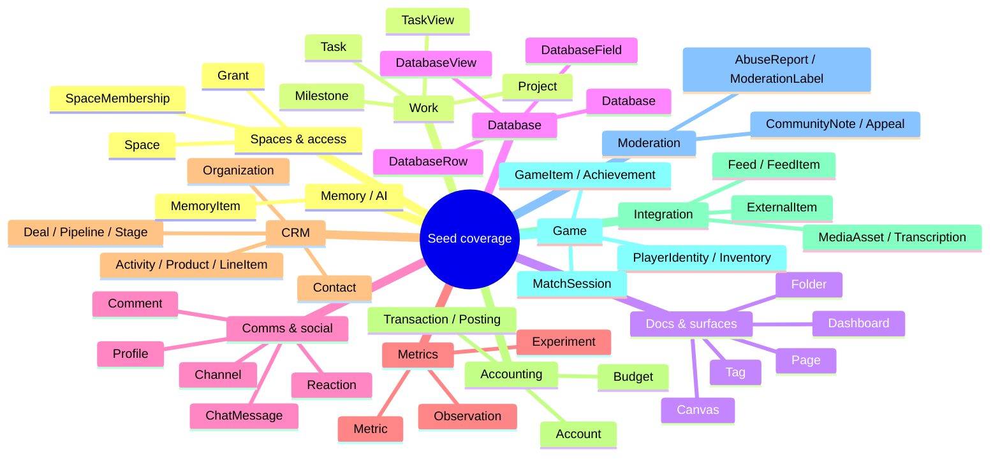
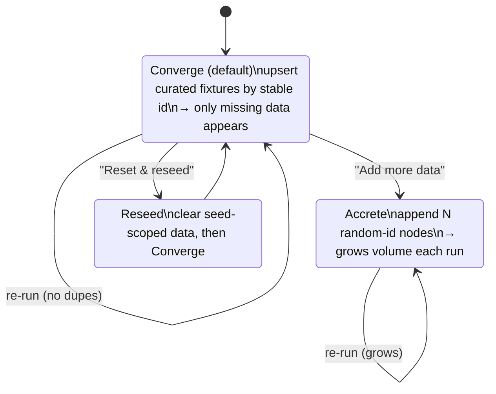
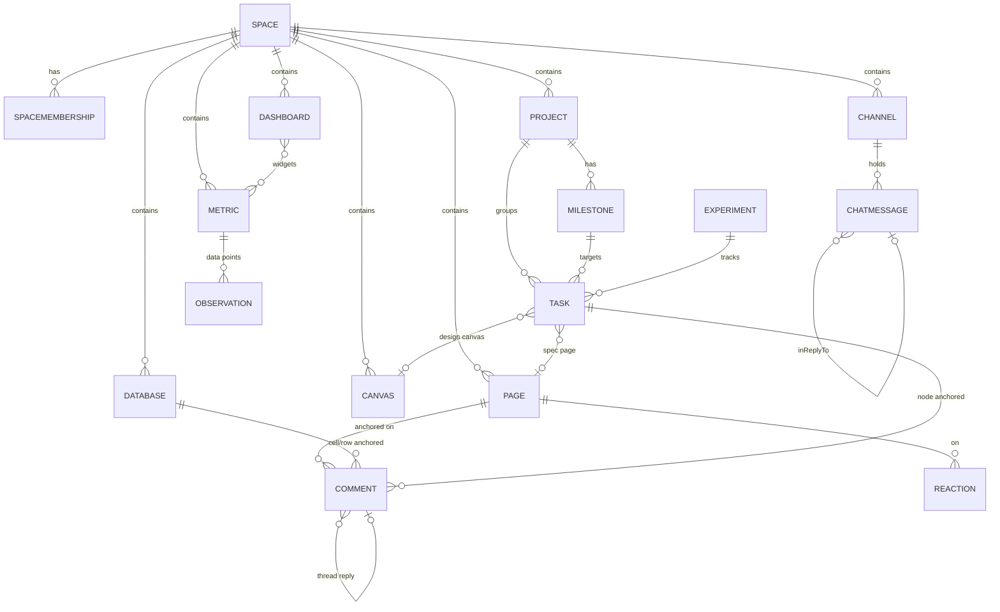
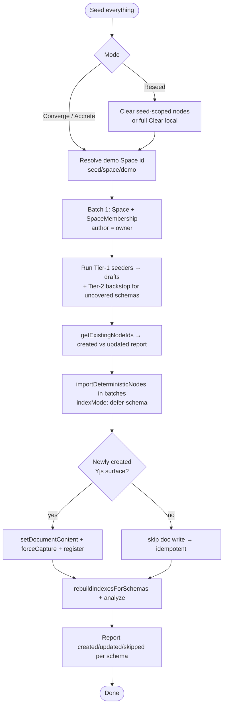
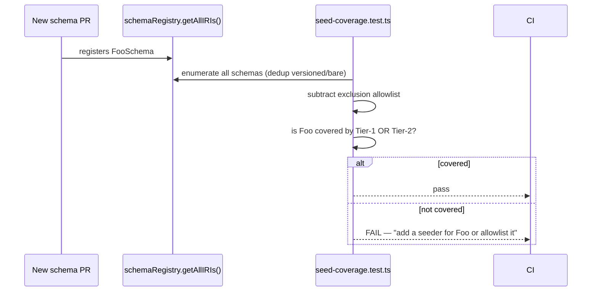

# DevTools Thorough, Idempotent Database Seed

## Problem Statement

The dev tools already have a **Seed** panel and a **Reset** panel, but the
seed is shallow and the seed is not idempotent:

- The Seed panel
  ([`packages/devtools/src/panels/Seed/Seed.tsx`](../../packages/devtools/src/panels/Seed/Seed.tsx))
  offers exactly three buttons — *Create Sample Page*, *Create Sample
  Database*, *Create Projects + Tasks* — covering **4 of ~50** registered
  schemas (Page, Database, Project, Task, plus a few Comments). Channels,
  messages, canvases, dashboards, metrics, spaces, CRM, accounting, feeds,
  games, moderation, memory — none of it is seeded.
- Every run uses `Math.random()`-based IDs
  ([`Seed.tsx:19`](../../packages/devtools/src/panels/Seed/Seed.tsx)), so
  re-running **duplicates everything**. There is no "fill in what's missing"
  mode.
- There is no mechanism that forces seed coverage to grow as new content
  types are added. A new schema ships with no sample data, silently.

We want:

1. A **really big, richly-linked seed** that populates *every* consumer-facing
   content type — projects, tasks, workspaces (spaces), pages, canvases,
   dashboards, channels, comments, reactions, metrics, CRM, etc. — **and the
   relationships between them**, so you can immediately see how everything
   connects and exercise every surface.
2. A **"Seed database" button** living next to the existing **"Clear
   database"** action, as a first-class dev-tools primitive.
3. **Idempotency**: re-running the seed by default only adds what's missing
   (converge to the target state), never duplicates. An optional "accrete"
   mode can pile on extra volume; a "reseed" path can dump-and-rebuild.
4. A **coverage guarantee** — like tests — so that when a new schema/feature
   lands, it must have seed data (CI fails otherwise), keeping the seed a
   living, complete fixture of the whole app.

## Executive Summary

The good news: the runtime already has the exact primitive we need.
[`NodeStore.importDeterministicNodes(drafts, options)`](../../packages/data/src/store/store.ts)
takes **caller-supplied stable node IDs**, merges properties with LWW
semantics, and emits one signed change per draft in a single batch. Combined
with `getExistingNodeIds()` / `getBatchPreflight()` for pre-flight existence
checks and `store.query({ schemaId, count: 'exact' })` for counts, this is a
ready-made idempotent upsert engine. Idempotency is **a deterministic-ID
problem, not a new-infrastructure problem.**

The recommendation is a **two-tier seed**:

- **Tier 1 — curated demo graph.** A set of small, pure, testable *domain
  seeders* (one per domain: spaces, work, docs, comms, viz, metrics, crm, …)
  that each return `DeterministicNodeImportDraft[]` (plus optional Yjs
  document builders) under a stable `seed/<domain>/<slug>` ID namespace. A
  `SeedRunner` resolves a demo Space, runs the seeders, dedups, batch-imports,
  applies Yjs docs only for newly-created nodes, rebuilds indexes, and reports
  progress. This is the "really big, richly-linked" workspace.
- **Tier 2 — auto-coverage backstop.** For any registered schema *not* covered
  by Tier 1, synthesize one deterministic representative node directly from its
  field definitions (`schema._properties` → a value per `FieldType`). New
  schemas automatically get sample data the moment they're registered.

A **conformance test** (mirroring the existing schema-registration guards)
walks `schemaRegistry.getAllIRIs()` and asserts every consumer-facing schema is
either covered by a Tier-1 seeder or handled by the Tier-2 generator — this is
the "make sure there's seed data for any new content" guarantee.

Pull the seed logic *out* of the 1,389-line `Seed.tsx` React component into a
framework-free module so it is unit-testable and reusable by tests, stories,
and a future CLI/E2E harness.

## Current State In The Repository

### The dev-tools panel system

The dev tools live in the `@xnetjs/devtools` package and tree-shake to zero in
production
([`index.ts`](../../packages/devtools/src/index.ts) is a no-op
`XNetDevToolsProvider`;
[`index.dev.ts`](../../packages/devtools/src/index.dev.ts) wires the real one).
They are mounted in
[`apps/web/src/App.tsx`](../../apps/web/src/App.tsx) (~line 896) with
`onResetLocalData={requestXNetBrowserStorageReset}`.

Panels are declared as metadata in
[`panel-registry.ts`](../../packages/devtools/src/panels/panel-registry.ts):
4 hero panels (Data / Changes / Logs / Performance) plus 16 secondary panels
grouped into a *More* menu and a ⌘⇧P command palette. Relevant here:

| Panel | id | File | What it does today |
|---|---|---|---|
| **Seed** | `seed` (line 224) | [`Seed/Seed.tsx`](../../packages/devtools/src/panels/Seed/Seed.tsx) | 3 buttons: sample page, sample database, projects+tasks |
| **Reset** | `reset` (line 251) | [`Reset/Reset.tsx`](../../packages/devtools/src/panels/Reset/Reset.tsx) | Clear hub / Clear local / Clear everything (2-step confirm) |
| **Data** | `data` | [`DataExplorer/DataExplorer.tsx`](../../packages/devtools/src/panels/DataExplorer/DataExplorer.tsx) | `GridSurface` over `store.query`, inline edit via `store.update` |

The Reset panel is exactly the "clear database button" the prompt refers to —
it is a clean, unit-tested state machine
([`reset-actions.ts`](../../packages/devtools/src/panels/Reset/reset-actions.ts),
with [`reset-actions.test.ts`](../../packages/devtools/src/panels/Reset/reset-actions.test.ts))
with `idle → armed → running → done/error` transitions and a 4s auto-disarm.
This is the model to copy for a "Seed" action.

### The current Seed panel (what's wrong with it)

[`Seed.tsx`](../../packages/devtools/src/panels/Seed/Seed.tsx) is a single
1,389-line React component. Three async handlers — `createSamplePage()`,
`createSampleDatabase()`, `createRelatedDatabases()` — build nodes inline and
write them with `store.create(...)`, Yjs docs via
`store.setDocumentContent(...)`, history via `documentHistory.forceCapture(...)`,
and devtools registration via `yDocRegistry.register(...)`.

Problems for our goals:

- **Random IDs** (`generateId()` at line 19) → not idempotent, every click
  duplicates.
- **All logic trapped in a React component** → not unit-testable, not reusable
  by tests/stories/CLI.
- **Narrow coverage** → 4 schemas of ~50.
- **Fragile comment anchors** — `createTextAnchor()` (line 41) walks the Yjs
  tree by text search to build `RelativePosition`s. Re-runs with new doc bytes
  break the anchors.

### The store write API (the idempotency engine already exists)

From [`store.ts`](../../packages/data/src/store/store.ts) and
[`types.ts`](../../packages/data/src/store/types.ts):

```ts
// Single-node CRUD
store.create({ id?, schemaId, properties }): Promise<NodeState>   // id auto = nanoid(21) if omitted
store.update(id, { properties }): Promise<NodeState>              // sparse, LWW
store.delete(id) / store.restore(id)

// Idempotent batch import — THIS is the seed engine
store.importDeterministicNodes(
  drafts: readonly DeterministicNodeImportDraft[],   // { id, schemaId, properties }
  options?: { indexMode?: 'eager'|'touched'|'defer-schema'; deferIndexes?: boolean }
): Promise<ImportDeterministicNodesResult>           // { created, updated, nodes, changes, affectedSchemaIds, timings, ... }

// Existence pre-flight
store.getExistingNodeIds(ids): Promise<NodeId[]>     // which of these already exist
store.getBatchPreflight(ids)                          // nodes + last changes, used internally

// Counting / querying
store.query({ schemaId, where?, count?: 'exact'|'estimate'|'none', limit?, ... })

// Index maintenance after a deferred bulk import
store.rebuildIndexesForSchemas(schemaIds) / store.analyze()
```

[`DeterministicNodeImportDraft`](../../packages/data/src/store/types.ts) (line
593) is documented verbatim as: *"Intended for importers that already know
stable node IDs and want one signed change per draft while avoiding per-node
storage transactions. … Properties to merge with LWW semantics."* The `id` is
*"used when the node does not already exist"* and properties merge LWW — i.e.
**create-or-converge**, which is precisely idempotent upsert.

Node IDs are random `nanoid(21)` by default
([`createNodeId`](../../packages/data/src/schema/node.ts)) but **caller-supplied
IDs are first-class** in the deterministic import path. Idempotency therefore
reduces to: *adopt a stable ID scheme.*

### Schemas to cover (the surface area of "everything")

`@xnetjs/data` registers ~50 unique schemas (each appears twice in the
registry: versioned `@1.0.0` + bare alias — a known dedupe gotcha). The
registry is the singleton
[`schemaRegistry`](../../packages/data/src/schema/registry.ts) with
`getAllIRIs()`, `get(iri)`, `getSync(iri)`, `has(iri)`, `getAllVersions(base)`.
Built-ins are enumerated in
[`schemas/index.ts`](../../packages/data/src/schema/schemas/index.ts).

Grouped by domain (the seed's coverage target):



Key modelling facts that shape the seed:

- **Space is the security boundary.** Content schemas (Task, Page, Channel,
  Dashboard, …) carry a `space: relation({ target: Space })`. Roles live on
  separate `SpaceMembership` edge nodes `{ space, member, role }` and cascade
  down `Space.parent`
  ([`space.ts`](../../packages/data/src/schema/schemas/space.ts),
  [`space-authorization.ts`](../../packages/data/src/schema/schemas/space-authorization.ts)).
  So the seed must **create the Space + a membership for the seeding author
  first**, then scope all content into it, or cascade authz will reject the
  writes.
- **Relations store node IDs** (single → string, `multiple: true` → string
  array). **`person()` stores DIDs**, not node IDs. Deterministic content IDs
  make the cross-links trivial: `Task.project = 'seed/project/website-redesign'`.
- **Field-type gotchas** (from
  [`properties/index.ts`](../../packages/data/src/schema/properties/index.ts)):
  `date()` is **epoch ms**; `money()` is `{ amount: integer-minor-units,
  currency: 'USD' }` (3-letter ISO, required); `select()` stores option **ids**
  (`{id,name,color?}`); `number()` has no default; `file()` is a `FileRef`
  `{ cid, name, mimeType, size }` (no bytes).
- **Yjs surfaces** (Page, Canvas, Database) need document content written via
  `store.setDocumentContent(nodeId, Y.encodeStateAsUpdate(doc))`, with history
  via `documentHistory.forceCapture(...)` and inspector registration via
  `yDocRegistry.register(...)`.

### Authorization on writes

All write paths run through the authz evaluator; there's no bypass. The seed
runs as the current author DID. Because the seed *creates the demo Space and
makes the author its owner first*, the cascade grants write access to all
content it then creates. (This must be ordered: Space + SpaceMembership in
batch 1, content in later batches.)

### Existing factory/fixture prior art in-repo

- Test stores: `createTestStore()` in
  [`store.test.ts`](../../packages/data/src/store/store.test.ts);
  `createTestPluginHarness()` in
  [`plugins/src/ecosystem/testing.ts`](../../packages/plugins/src/ecosystem/testing.ts).
- Real bulk-import call sites:
  [`scripts/benchmark-social-batch-writes.ts`](../../scripts/benchmark-social-batch-writes.ts)
  and
  [`scripts/collect-core-platform-baselines.ts`](../../scripts/collect-core-platform-baselines.ts)
  both `new NodeStore(...)` and write at volume — useful patterns for a
  headless seed and for scale tuning (ties to the cold-start / large-DB work in
  explorations 0184 and 0204).

## External Research

Idempotent seeding is a well-trodden path; the consensus maps cleanly onto our
primitives:

- **Idempotency = upsert + deterministic IDs.** A seed should "produce the same
  end state no matter how many times it runs — the first run inserts; the
  second is a no-op instead of a duplicate-key error." Prisma's recommended
  pattern is `upsert()`; Drizzle uses `.onConflictDoNothing()` /
  `.onConflictDoUpdate()`. The advice to *"assign IDs beforehand instead of
  relying on the database to generate them, making inserts idempotent"* is
  exactly our `importDeterministicNodes(... id ...)` story. ([Seedfast: Database
  Seeding in 2026](https://seedfa.st/blog/database-seeding),
  [Prisma seeding docs](https://www.prisma.io/docs/orm/prisma-migrate/workflows/seeding),
  [Drizzle upsert](https://orm.drizzle.team/docs/guides/upsert))
- **Deterministic fake data via a seeded PRNG.** `drizzle-seed` "generates
  deterministic yet realistic fake data by leveraging a seedable pseudorandom
  number generator, ensuring consistent and reproducible data across runs."
  Faker/Bogus/FactoryBot all support a fixed seed (`Randomizer.Seed`,
  `Faker::Config.random`) for reproducible datasets. The lesson: drive *all*
  randomness in our generators from a **fixed seed** so the same logical entity
  always yields the same content — which keeps both IDs and property values
  stable across re-runs. ([Drizzle Seed](https://orm.drizzle.team/docs/seed-overview),
  [Deterministic test data with Faker/FactoryBot](https://island94.org/2019/11/deterministic-test-data-with-faker-factorybot-and-rspec))
- **Seeds vs migrations.** Seeds should be idempotent and runnable any time
  after migrations; keep them separate and versioned. For us the analogue is:
  the seed is a *dev-tools* concern, decoupled from schema definitions, but
  *guarded* by a coverage test so it can't silently rot.
- **Bulk-insert performance.** Batch writes and defer index maintenance for
  large imports, then rebuild — directly supported by our `indexMode:
  'defer-schema'` + `rebuildIndexesForSchemas()`. ([Bulk inserts in
  Prisma](https://ivanspoljaric22.medium.com/mastering-bulk-inserts-in-prisma-best-practices-for-performance-integrity-2ba531f86f74))

We don't need to add Faker/drizzle-seed as dependencies — a tiny seeded PRNG
(mulberry32-style) plus curated word/name pools is enough and keeps the
dev-only bundle lean (consistent with the repo's "0KB where possible" ethos,
cf. the motion system in exploration 0199).

## Key Findings

1. **The idempotent upsert engine already ships** — `importDeterministicNodes`
   + `getExistingNodeIds` + LWW merge. No runtime changes are required for
   idempotency; we only need a stable ID scheme and a runner.
2. **Idempotency is hard only for the Yjs surfaces and comment anchors**, not
   for plain nodes. Re-applying an *identical* Yjs update is a CRDT no-op, but
   regenerating a *fresh* `Y.Doc` each run yields different bytes/state vectors
   that merge into duplicate blocks. Fix: build Yjs docs deterministically
   (fixed `clientID`, fixed insertion order) **and only write document content +
   `forceCapture` for newly-created nodes** (or when a content hash differs).
3. **Space-first ordering is mandatory** — create the demo Space and the
   author's owner membership before content, or cascade authz rejects writes.
4. **Coverage can be made a test, not a hope** — `schemaRegistry.getAllIRIs()`
   enumerates everything; a conformance test can require every consumer-facing
   schema to have a seeder (Tier 1) or be auto-generated (Tier 2).
5. **Two complementary tiers** beat either alone: curated seeders give a
   coherent, realistically-linked demo; an auto-generator from field types
   guarantees *new* schemas are never silently missed.
6. **The Seed/Reset UX is already a solved pattern** — copy the
   `reset-actions.ts` two-step-confirm state machine for a "Seed" / "Reseed"
   action and place it adjacent to Clear.

## Options And Tradeoffs

### A. Idempotency strategy

| Option | How | Pros | Cons |
|---|---|---|---|
| **A1. Deterministic IDs + LWW upsert** (recommend) | `seed/<domain>/<slug>` IDs → `importDeterministicNodes` | Native to the store; re-run converges; new fixtures appear, existing untouched | Need a disciplined ID scheme; Yjs/anchor special-casing |
| A2. Pre-flight existence check then `create` | `getExistingNodeIds` → only create missing | Simple mental model | Two round trips; no convergence of changed fixtures; racy |
| A3. Marker-based ("did we seed already?") | One sentinel node; skip if present | Trivial | All-or-nothing; can't add *new* content types incrementally — the explicit anti-goal |
| A4. Static JSON snapshot import | Ship a `seed.json`, import verbatim | Exactly reproducible; trivial diffing | Brittle to schema change; can't express Yjs docs; no generated volume |

A1 is the only option that satisfies "re-run adds only what's missing" *and*
"new content types get picked up." A4 is attractive as a *secondary* export
format (snapshot the curated graph for fast deterministic E2E fixtures) but not
as the authoring model.

### B. Where the seed logic lives

| Option | Pros | Cons |
|---|---|---|
| **B1. Framework-free `seed/` module in `@xnetjs/devtools`** (recommend) | Unit-testable, reusable by tests/stories/CLI; keeps dev-only | Some refactor of `Seed.tsx` |
| B2. Keep building in `Seed.tsx` | No moving parts | Untestable; can't reuse; already 1,389 lines |
| B3. New `@xnetjs/seed` package | Reusable across apps/cloud/E2E | Heavier; publish/coverage overhead; most value is dev-only |

B1 keeps it dev-only (no prod bytes) while making the seeders pure and testable.
If a headless E2E/CLI seed is later needed, the pure module lifts cleanly into
B3 without rewrite.

### C. Coverage model (how "everything" stays covered)

| Option | Pros | Cons |
|---|---|---|
| **C1. Curated seeders + auto-generator backstop + CI guard** (recommend) | Rich, linked demo *and* guaranteed coverage of new schemas | Most build effort |
| C2. Curated only | Highest-quality demo data | New schemas silently missed — the stated problem |
| C3. Auto-generated only (from field types) | Total coverage, low effort, always complete | No relationships/realism; useless for "see how things relate" |

C1 is the synthesis the prompt is asking for: a big realistic graph *plus* a
"like tests, make sure new content has seed data" guarantee.

### D. Re-run modes (the "accrete vs converge" question from the prompt)



- **Converge** (default): the idempotent path the prompt wants — re-running
  fills gaps only.
- **Accrete**: deliberately non-idempotent volume generator (random IDs, seeded
  PRNG content) for scale/perf testing — the prompt's "accrete more data"
  thought.
- **Reseed**: clear seed-scoped nodes (or full `Clear local`) then converge —
  the prompt's "dump the database and reseed" escape hatch.

## Recommendation

Build a **two-tier, deterministic, dev-only seed** with a small runner and a
coverage guard, surfaced as first-class Seed/Reseed actions next to Clear.

1. **Extract pure seeders** into
   `packages/devtools/src/seed/` (framework-free):
   - `seed-ids.ts` — `seedId(domain, ...parts)` → `seed/<domain>/<slug>`, plus a
     mulberry32 seeded PRNG and small name/word pools for deterministic content.
   - `seeders/*.ts` — one module per domain (`spaces`, `work`, `docs`, `comms`,
     `viz`, `metrics`, `crm`, `accounting`, `integration`, `game`, `moderation`,
     `memory`). Each exports a `Seeder` returning
     `{ drafts: DeterministicNodeImportDraft[], docs?: SeedDoc[] }` for a given
     `SeedContext` (the resolved demo space id, author DID, scale knob, PRNG).
   - `auto-generator.ts` — Tier-2: given a `DefinedSchema`, synthesize one
     deterministic node from `schema._properties` by `FieldType`.
   - `seed-runner.ts` — orchestrates: resolve/space-first → collect drafts →
     dedupe via `getExistingNodeIds` (for reporting) → `importDeterministicNodes`
     in batches with `indexMode: 'defer-schema'` → apply Yjs docs **only for
     newly-created nodes** → `rebuildIndexesForSchemas` + `analyze` →
     progress/result.
   - `seed-manifest.ts` — the ordered registry of Tier-1 seeders + the
     allowlist of schemas intentionally excluded from seeding (system/meta:
     `SchemaDefinition`, `SchemaExtension`, `SyncPolicy`, `Grant`, …).

2. **Rewrite the Seed panel** to drive the runner: a primary **"Seed
   everything"** button, a **scale** selector (S / M / L), per-domain
   checkboxes, a **mode** selector (Converge / Accrete / Reseed), and a live
   progress + result summary (created / updated / skipped per schema, using the
   runner's `ImportDeterministicNodesResult` timings). Keep the existing three
   buttons as quick presets.

3. **Add a "Seed" affordance next to "Clear."** Put a compact **Seed everything
   / Reseed** action in the Reset panel's action list (reusing the
   `reset-actions.ts` two-step-confirm state machine) so the user's mental model
   — *clear button at the bottom, seed button at the bottom* — is satisfied,
   while the full controls live in the Seed panel.

4. **Add the coverage guard** — a vitest in
   `packages/devtools/src/seed/seed-coverage.test.ts` that walks
   `schemaRegistry.getAllIRIs()` (dedup versioned/bare), subtracts the
   exclusion allowlist, and asserts each remaining schema is reachable by a
   Tier-1 seeder *or* handled by the Tier-2 generator. A new schema with no
   seed data fails CI — "like testing," seed data becomes mandatory for new
   content.

5. **Idempotency rules** baked into the runner:
   - Plain nodes: deterministic IDs + LWW upsert (free convergence).
   - Yjs surfaces: deterministic doc construction (fixed `clientID`, fixed
     order); write content + `forceCapture` only when the node was *created*
     this run (the runner knows from `result.created` vs `result.updated`).
   - Comments/reactions: deterministic IDs; anchors recomputed from the
     deterministic doc so they reattach on every run.

### Target shape of the seeded demo graph (Tier 1)



A medium-scale run might produce: 1 demo Space (+ 3 memberships), 5 Projects,
~50 Tasks across 3 Milestones, ~12 Pages (rich Yjs blocks), 3 Canvases, 2
Dashboards, 6 Channels with ~200 threaded ChatMessages, 2 relational Databases
(Notion-style) with views and rows, ~40 Comments across pages/db cells/tasks,
reactions, 4 Metrics with ~90 Observations, plus one representative node for
every other registered schema via Tier 2. The **scale knob** multiplies the
volume-bearing collections (tasks, messages, rows, observations) without
changing the relational backbone.

### Run pipeline



### How the coverage guard fits CI



## Example Code

> Illustrative; signatures match the verified store/schema APIs. Dev-only — the
> `seed/` module is imported only by the dev `Seed.tsx`, so it tree-shakes out
> of production.

### Deterministic IDs + seeded PRNG

```ts
// packages/devtools/src/seed/seed-ids.ts
const SEED_NS = 'seed' as const

/** Stable id, e.g. seedId('task','website-redesign','wireframes') → 'seed/task/website-redesign/wireframes' */
export function seedId(domain: string, ...parts: string[]): string {
  const slug = parts.map((p) => p.toLowerCase().replace(/[^a-z0-9]+/g, '-')).join('/')
  return `${SEED_NS}/${domain}/${slug}`
}

/** mulberry32 — tiny deterministic PRNG so re-runs produce identical content. */
export function makeRng(seed: number): () => number {
  let a = seed >>> 0
  return () => {
    a |= 0; a = (a + 0x6d2b79f5) | 0
    let t = Math.imul(a ^ (a >>> 15), 1 | a)
    t = (t + Math.imul(t ^ (t >>> 7), 61 | t)) ^ t
    return ((t ^ (t >>> 14)) >>> 0) / 4294967296
  }
}

export const pick = <T,>(rng: () => number, xs: readonly T[]): T => xs[Math.floor(rng() * xs.length)]!
```

### A domain seeder (pure, testable)

```ts
// packages/devtools/src/seed/seeders/work.ts
import { ProjectSchema, TaskSchema, MilestoneSchema } from '@xnetjs/data'
import type { Seeder, SeedContext } from '../types'
import { seedId, pick } from '../seed-ids'

export const workSeeder: Seeder = ({ space, scale, rng }: SeedContext) => {
  const drafts = []
  const projects = ['Website Redesign', 'API Migration', 'Mobile App v2', 'Billing', 'Search'].slice(0, scale.projects)

  for (const name of projects) {
    const projectId = seedId('project', name)
    drafts.push({
      id: projectId,
      schemaId: ProjectSchema._schemaId,
      properties: {
        name,
        icon: pick(rng, ['🚀', '🛠️', '📱', '💳', '🔎']),
        status: pick(rng, ['planned', 'in-progress', 'paused', 'completed']),
        space, // scope into the demo Space → cascade authz grants write
      },
    })

    for (let i = 0; i < scale.tasksPerProject; i++) {
      drafts.push({
        id: seedId('task', name, String(i)),
        schemaId: TaskSchema._schemaId,
        properties: {
          title: `${name} — ${pick(rng, ['Wireframes', 'Spec', 'Implementation', 'QA', 'Launch'])} ${i + 1}`,
          status: pick(rng, ['triage', 'todo', 'in-progress', 'in-review', 'done']),
          priority: pick(rng, ['low', 'medium', 'high', 'urgent']),
          dueDate: 1750000000000 + i * 86_400_000, // epoch ms — date() gotcha
          project: projectId,                       // relation → node id
          space,
        },
      })
    }
  }
  return { drafts }
}
```

### Tier-2 auto-coverage backstop

```ts
// packages/devtools/src/seed/auto-generator.ts
import type { DefinedSchema } from '@xnetjs/data'
import { seedId } from './seed-ids'

/** One deterministic representative node synthesized from a schema's field types. */
export function autoNode(schema: DefinedSchema, space: string) {
  const properties: Record<string, unknown> = {}
  for (const def of schema.properties) {
    switch (def.type) {
      case 'text': case 'url': case 'email': case 'phone':
        properties[def.name] = `Sample ${def.name}`; break
      case 'number': properties[def.name] = 42; break
      case 'checkbox': properties[def.name] = false; break
      case 'date': properties[def.name] = 1750000000000; break // epoch ms
      case 'select': properties[def.name] = def.config?.options?.[0]?.id; break
      case 'multiSelect': properties[def.name] = def.config?.options?.[0]?.id ? [def.config.options[0].id] : []; break
      case 'json':
        properties[def.name] = def.config?.format === 'money' ? { amount: 1000, currency: 'USD' } : {}
        break
      // person / relation / file left undefined unless the schema requires them
    }
    if (def.name === 'space') properties.space = space
  }
  return { id: seedId('auto', schema.name), schemaId: schema._schemaId, properties }
}
```

### The runner (idempotent, space-first, Yjs-aware)

```ts
// packages/devtools/src/seed/seed-runner.ts (sketch)
export async function runSeed(ctx: RunnerCtx): Promise<SeedReport> {
  const { store } = ctx
  const space = seedId('space', 'demo')

  // 1. Space-first so cascade authz grants writes to all later content.
  await store.importDeterministicNodes([
    { id: space, schemaId: SpaceSchema._schemaId, properties: { name: 'Demo Workspace', kind: 'workspace', owners: [ctx.authorDID] } },
    { id: seedId('membership', 'demo', ctx.authorDID), schemaId: SpaceMembershipSchema._schemaId,
      properties: { space, member: ctx.authorDID, role: 'owner' } },
  ])

  // 2. Collect Tier-1 drafts + Tier-2 backstop for uncovered schemas.
  const drafts = collectDrafts(ctx, space)

  // 3. Idempotent upsert in batches; defer indexes for the bulk path.
  const created = new Set<string>()
  for (const batch of chunk(drafts, 250)) {
    const res = await store.importDeterministicNodes(batch, { indexMode: 'defer-schema' })
    res.nodes.forEach((n, i) => { if (i < res.created) created.add(batch[i]!.id) })
  }

  // 4. Yjs docs ONLY for newly-created surfaces → re-runs don't duplicate blocks.
  for (const doc of buildDocs(ctx, space)) {
    if (!created.has(doc.nodeId)) continue
    const ydoc = doc.build()                      // deterministic clientID + insertion order
    await store.setDocumentContent(doc.nodeId, Y.encodeStateAsUpdate(ydoc))
    ctx.documentHistory?.forceCapture(doc.nodeId, ydoc)
    ctx.yDocRegistry?.register(doc.nodeId, ydoc)
  }

  // 5. Rebuild deferred indexes for fast reads afterwards.
  await store.rebuildIndexesForSchemas(unique(drafts.map((d) => d.schemaId)))
  await store.analyze()

  return summarize(drafts, created)
}
```

### Coverage guard

```ts
// packages/devtools/src/seed/seed-coverage.test.ts
import { describe, it, expect } from 'vitest'
import { schemaRegistry } from '@xnetjs/data'
import { TIER1_SCHEMA_IDS, SEED_EXCLUDED_SCHEMA_IDS } from './seed-manifest'
import { TIER2_GENERATABLE } from './auto-generator'

describe('seed coverage', () => {
  it('every consumer-facing schema has seed data', () => {
    const all = dedupVersioned(schemaRegistry.getAllIRIs())       // collapse @1.0.0 + bare
    const need = all.filter((iri) => !SEED_EXCLUDED_SCHEMA_IDS.has(baseOf(iri)))
    const missing = need.filter(
      (iri) => !TIER1_SCHEMA_IDS.has(baseOf(iri)) && !TIER2_GENERATABLE(iri)
    )
    expect(missing, `Add a seeder (or allowlist) for: ${missing.join(', ')}`).toEqual([])
  })
})
```

## Risks And Open Questions

- **Yjs idempotency edge.** Building a fresh `Y.Doc` each run produces
  different state vectors; merging them duplicates blocks. Mitigation: only
  write document content for *created* nodes, and build docs deterministically.
  Open question: do we ever want to *update* an existing seeded doc on re-run
  (e.g. when a fixture's content changes)? A content-hash compare (`property
  seedContentHash`) could gate a controlled doc rewrite, but rewriting CRDT
  content non-destructively is fiddly — defer unless needed.
- **`documentHistory.forceCapture` on re-run** would grow history; the
  created-only guard prevents it. Confirm history isn't double-captured by the
  normal write path during the import.
- **Comment anchor stability.** Anchors are `RelativePosition`s into the doc.
  They're stable iff the doc is built deterministically *and* the doc isn't
  rewritten on re-run — both hold under the recommendation. Still, prefer
  cell/row/node anchors over text anchors where possible (less fragile).
- **Authz ordering.** If a content batch is imported before the Space +
  membership, cascade authz rejects it. The runner must guarantee Space-first
  ordering; the coverage test should also assert seeders declare their space
  dependency.
- **Scale vs cold-start.** A large seed interacts with the cold-start / large-DB
  work (explorations 0184, 0204). Use `indexMode: 'defer-schema'` +
  `rebuildIndexesForSchemas`, and keep the default scale modest (M); reserve L
  for explicit perf testing.
- **`person()` DIDs.** `person` fields need valid `did:...` values. The seed
  should mint a few stable demo DIDs (deterministic key pairs) so assignees /
  members / reactors resolve, rather than inventing malformed DIDs.
- **Required relations.** Some schemas have required relations (e.g.
  `Milestone.project`, `Posting.transaction`, `Observation.metric`). The
  Tier-2 auto-generator can't satisfy these from field types alone — those
  schemas must be Tier-1 (curated) or explicitly allowlisted. The coverage test
  should treat "has a required relation" schemas as Tier-1-mandatory.
- **DM channels are deterministic by design.** `Channel` DM nodes derive IDs
  from member sets; reuse that scheme rather than `seed/...` for DMs to avoid
  collisions with the app's own DM creation.
- **Dev-only boundary.** Keep the `seed/` module imported solely by the dev
  entry so it can't bloat the production bundle (verify with a bundle check, as
  done for devtools generally).

## Implementation Checklist

- [x] Create `packages/devtools/src/seed/` with `seed-ids.ts` (id scheme +
      mulberry32 PRNG + content pools) and `types.ts` (`Seeder`, `SeedContext`,
      `SeedDoc`, `SeedReport`).
- [x] Implement `seed-runner.ts`: space-first ordering, batched
      `importDeterministicNodes` (`indexMode: 'defer-schema'`),
      created-vs-updated tracking, created-only Yjs doc writes,
      `rebuildIndexesForSchemas` + `analyze`, structured `SeedReport`.
- [x] Mint stable demo DIDs (deterministic key pairs) for people/members/
      assignees/reactors.
- [x] Write Tier-1 domain seeders: `spaces`, `work`, `docs` (incl. rich Yjs
      pages), `database` (Notion-style: fields/views/rows), `comms`
      (channels + threaded messages), `viz` (canvases + dashboards), `metrics`
      (metrics + observations + experiment), `crm`, `accounting`,
      `integration`, `game`, `moderation`, `memory`.
- [x] Port the existing `createSamplePage` / `createSampleDatabase` /
      `createRelatedDatabases` content into the `docs`/`database`/`work`
      seeders (deterministic IDs, deterministic Yjs builders, recomputed
      comment anchors).
- [x] Implement Tier-2 `auto-generator.ts` (one node per uncovered schema from
      field types) + `TIER2_GENERATABLE`.
- [x] Write `seed-manifest.ts`: ordered Tier-1 seeder list, `TIER1_SCHEMA_IDS`,
      `SEED_EXCLUDED_SCHEMA_IDS` (system/meta), required-relation handling.
- [x] Add modes: Converge (default), Accrete (random-id volume via seeded
      PRNG), Reseed (clear seed-scoped nodes → converge).
- [x] Rewrite `Seed.tsx` to drive the runner: "Seed everything" + scale (S/M/L)
      + per-domain toggles + mode selector + live progress/result summary;
      retain the 3 legacy quick-presets.
- [x] Add a compact **Seed everything / Reseed** action to the Reset panel
      (reuse `reset-actions.ts` two-step-confirm state machine) so it sits next
      to **Clear**.
- [x] Add `seed-coverage.test.ts` (walks `getAllIRIs()`, dedup, subtract
      allowlist, require Tier-1 or Tier-2) and wire into the package's vitest
      project.
- [x] Add unit tests for each seeder (pure functions → assert draft shapes,
      stable IDs) and a runner test on a `MemoryNodeStorageAdapter` proving
      **two runs = same node count** (idempotency) and **Accrete grows**.
- [x] Document the seed in package README / `docs/` and note the "new schema ⇒
      add a seeder" rule in `CLAUDE.md` conventions.
- [x] (Optional) Add a `seed --snapshot` export to emit a `seed.json`
      golden for fast deterministic E2E fixtures.
- [x] Changeset: `@xnetjs/devtools` is dev tooling — confirm publishable status
      via `node scripts/changeset/publishable-pathspec.mjs`; add a changeset (or
      `--empty`) accordingly.

## Validation Checklist

- [ ] **Idempotency:** run "Seed everything" twice; the Data panel shows the
      *same* per-schema counts after the second run (created=0, updated≥0,
      no duplicates). Verified both via the runner's report and `store.query({
      schemaId, count: 'exact' })`.
- [ ] **Convergence of new fixtures:** add a new fixture to a seeder, re-run;
      only the new node appears; existing nodes untouched.
- [ ] **Coverage:** `seed-coverage.test.ts` is green; temporarily register a
      throwaway schema with no seeder and confirm the test **fails** with a
      helpful message, then remove it.
- [ ] **Relationships resolve:** in the app, open the demo Space; a Project
      shows its Tasks; a Task links to its spec Page/Canvas; a Channel shows
      threaded messages; Comments appear anchored on pages/db cells/tasks;
      Dashboard widgets reference Metrics with Observations.
- [ ] **Yjs surfaces render** (pages with all block types, canvases,
      databases with views/rows) and re-seeding does **not** duplicate blocks
      or history entries.
- [ ] **Authz:** all writes succeed as the seeding author (owner of the demo
      Space); no `PermissionError` in the console.
- [ ] **Accrete mode** grows volume on each run; **Reseed mode** clears and
      rebuilds to a clean converged state.
- [ ] **Scale:** L-scale seed completes within an acceptable time using
      `defer-schema` + rebuild; cold reload of the seeded DB stays within the
      boot watchdog budget (cf. 0184/0204).
- [ ] **Prod bundle:** the `seed/` module does not appear in the production
      web bundle (devtools no-op).
- [ ] **Lint/format/typecheck/tests** green; `prettier --check` passes for new
      TSX; generated JSON (if any snapshot) is `.prettierignore`d.

## References

### In-repo

- Seed panel — [`packages/devtools/src/panels/Seed/Seed.tsx`](../../packages/devtools/src/panels/Seed/Seed.tsx)
- Reset panel + state machine — [`Reset.tsx`](../../packages/devtools/src/panels/Reset/Reset.tsx), [`reset-actions.ts`](../../packages/devtools/src/panels/Reset/reset-actions.ts), [`reset-actions.test.ts`](../../packages/devtools/src/panels/Reset/reset-actions.test.ts)
- Panel registry — [`panel-registry.ts`](../../packages/devtools/src/panels/panel-registry.ts)
- Data panel — [`DataExplorer/DataExplorer.tsx`](../../packages/devtools/src/panels/DataExplorer/DataExplorer.tsx)
- DevTools mount + reset wiring — [`apps/web/src/App.tsx`](../../apps/web/src/App.tsx), [`apps/web/src/lib/browser-storage-reset.ts`](../../apps/web/src/lib/browser-storage-reset.ts)
- Store write/import API — [`packages/data/src/store/store.ts`](../../packages/data/src/store/store.ts), [`packages/data/src/store/types.ts`](../../packages/data/src/store/types.ts)
- Schema registry + field helpers — [`registry.ts`](../../packages/data/src/schema/registry.ts), [`define.ts`](../../packages/data/src/schema/define.ts), [`properties/index.ts`](../../packages/data/src/schema/properties/index.ts), [`schemas/index.ts`](../../packages/data/src/schema/schemas/index.ts)
- Space / authz model — [`schemas/space.ts`](../../packages/data/src/schema/schemas/space.ts), [`schemas/space-authorization.ts`](../../packages/data/src/schema/schemas/space-authorization.ts)
- Bulk-write prior art — [`scripts/benchmark-social-batch-writes.ts`](../../scripts/benchmark-social-batch-writes.ts), [`scripts/collect-core-platform-baselines.ts`](../../scripts/collect-core-platform-baselines.ts)
- Related explorations — [`0217_[x]_DEVTOOLS_OVERHAUL...`](0217_[x]_DEVTOOLS_OVERHAUL_HERO_PANELS_DATA_BROWSER_AND_PROFILING.md), [`0218_[x]_DEVTOOLS_DATA_TABLE...`](0218_[x]_DEVTOOLS_DATA_TABLE_RICH_SORTING_FILTERING_AND_QUERIES.md), [`0184_[x]_INITIAL_LOAD_PERFORMANCE...`](0184_[x]_INITIAL_LOAD_PERFORMANCE_AT_LARGE_DATABASE_SCALE.md)

### External

- [Database Seeding in 2026 — Seedfast](https://seedfa.st/blog/database-seeding)
- [Prisma — Seeding](https://www.prisma.io/docs/orm/prisma-migrate/workflows/seeding)
- [Drizzle Seed (deterministic PRNG)](https://orm.drizzle.team/docs/seed-overview)
- [Drizzle — Upsert / onConflict](https://orm.drizzle.team/docs/guides/upsert)
- [Mastering Bulk Inserts in Prisma](https://ivanspoljaric22.medium.com/mastering-bulk-inserts-in-prisma-best-practices-for-performance-integrity-2ba531f86f74)
- [Deterministic test data with Faker, FactoryBot, RSpec](https://island94.org/2019/11/deterministic-test-data-with-faker-factorybot-and-rspec)
