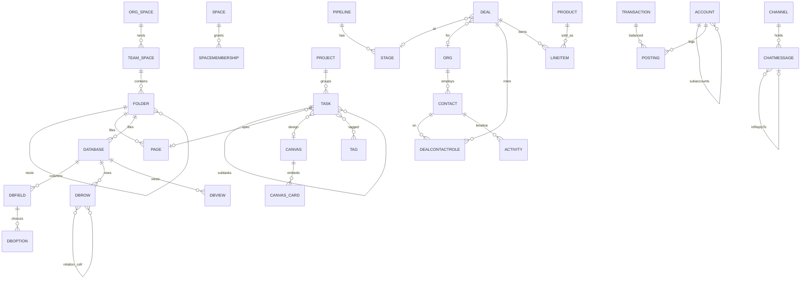
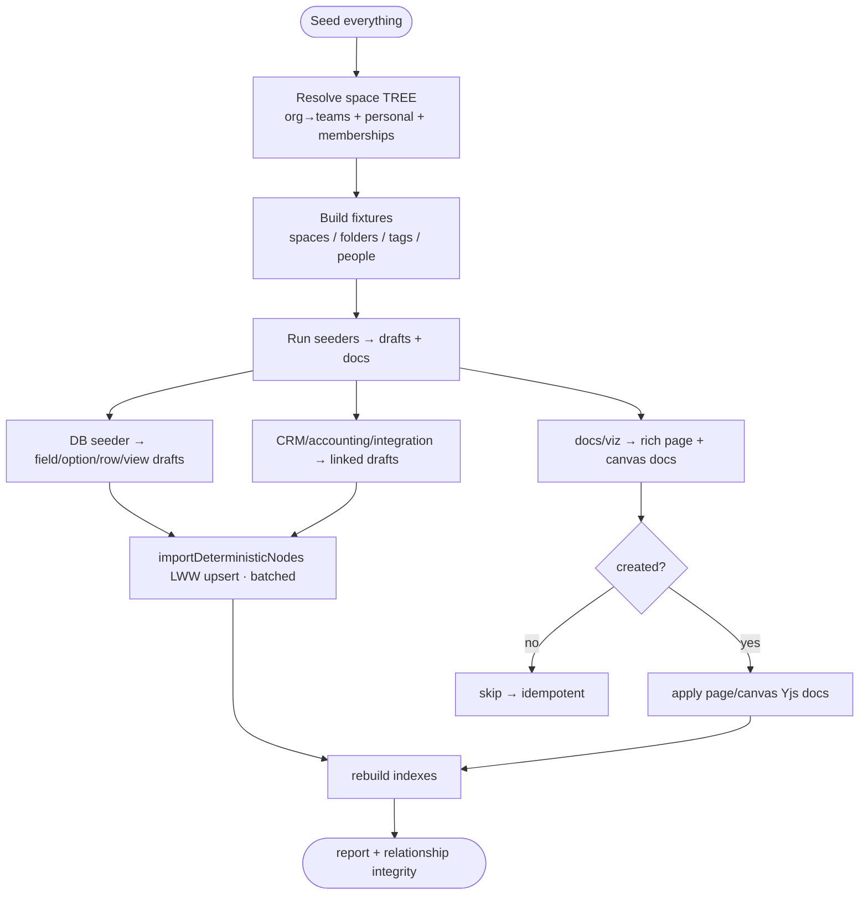

# Deeply Relational Dev-Tools Seed

## Problem Statement

The dev-tools seed shipped in [0221](0221_[x]_DEVTOOLS_THOROUGH_IDEMPOTENT_DATABASE_SEED.md)
/ PR #264 is broad but **shallow**. It creates one node of (almost) every
schema and links the hero domains, but:

- **Databases are empty shells.** The `database` seeder creates `Database`
  *nodes* with a title and icon — but **no columns, no rows, no views**. Opening
  a seeded database shows an empty grid. The user explicitly wants databases
  "filled out with all the fields."
- **Only one rich document.** There's a single flagship "all block types" page;
  the per-project "spec" pages are title-only stubs with no body. The user wants
  *multiple* rich documents.
- **Canvases are empty.** `Canvas` nodes are created with no scene — no shapes,
  notes, connectors, or embedded cards.
- **Flat structure.** Folders are two flat top-level entries; there is a single
  `Space`. No nested folders, no nested/team workspaces.
- **Long-tail domains are auto-stubs.** CRM, accounting, and integration are
  covered only by the Tier-2 auto-generator: one orphan node per schema with
  placeholder values and **no relationships**. The user explicitly calls out CRM
  (and tasks, channels) as wanting the same relational depth as the hero
  domains.
- **Thin cross-linking.** Tasks have no subtasks, single assignee, no
  dependencies; tags are applied sparingly; comments/threads are minimal.

The ask: make the seed **deeply relational and high-depth** — multiple
documents/canvases/databases filled with real content and every field, nested
into folders, nested folders, and workspaces, tagged, and the same for CRM,
tasks, and channels — so the seed becomes a **test bed for every relationship
type** in the app.

## Executive Summary

The 0221 engine (deterministic IDs → `importDeterministicNodes` LWW upsert,
two-tier seeders + auto-generator, space-first runner, coverage guard) is the
right foundation and needs **no architectural rewrite**. This is a *depth*
project: enrich the seeders and add a few new ones.

The single biggest discovery from research: **Database v2 stores columns,
options, rows, and views as first-class NodeStore nodes — not inside the Yjs
doc.** Fields are `DatabaseField` nodes, select choices are
`DatabaseSelectOption` nodes, rows are `DatabaseRow` nodes whose cells live in
`cell_<fieldId>` dynamic properties, and views are `DatabaseView` nodes
([`packages/data/src/database/`](../../packages/data/src/database/)). That means
a fully-populated database is just **more deterministic drafts** — fully
idempotent, and (unlike Yjs docs) it *converges and updates on re-run*.

Recommended work, in priority order:

1. **Rich databases** — emit `DatabaseField` (all ~13 cell types) +
   `DatabaseSelectOption` + `DatabaseRow` (with real `cell_*` values, including
   cross-row `relation` cells) + `DatabaseView` (table/board/calendar) drafts.
2. **Promote CRM, accounting, integration to rich Tier-1 seeders** with full
   relationship graphs (Org→Contact→Deal→Pipeline/Stage→LineItem→Product→
   Activity; balanced double-entry Account→Transaction→Posting).
3. **Nested folders + multiple/nested Spaces** — a real folder tree (depth ≥3)
   and an org workspace with team sub-spaces, content filed and scoped into
   them.
4. **Multiple rich pages + non-empty canvases** — several distinct rich
   documents that embed/mention each other and tasks/databases; canvas scenes
   with shapes, notes, connectors, and embedded node cards.
5. **Deep tasks + dense tagging + threaded comms** — subtasks, multi-assignee,
   dependencies, a shared tag palette applied everywhere, reply threads, DMs.

Extend `SeedContext` with a small **fixture registry** (deterministic id
builders + the resolved spaces/folders/tags) so seeders cross-link cleanly, and
add **relationship-integrity tests** (postings balance, no dangling relations,
folder depth ≥3, ≥3 spaces, every DB row cell resolves).

## Current State In The Repository

The seed module ([`packages/devtools/src/seed/`](../../packages/devtools/src/seed/)):

- [`seed-ids.ts`](../../packages/devtools/src/seed/seed-ids.ts) — `seedId(domain, ...parts)`, mulberry32 PRNG, `DEMO_PEOPLE`, small content pools.
- [`types.ts`](../../packages/devtools/src/seed/types.ts) — `SeedContext` (`space`, `authorDID`, `people`, `scale`, `rng`), `SeederModule`, `SeedScaleConfig`, `SeedReport`.
- [`seed-runner.ts`](../../packages/devtools/src/seed/seed-runner.ts) — `SCALES` (S/M/L), space-first resolution (reads author DID from the first created node's `createdBy`), batched `importDeterministicNodes({ indexMode: 'defer-schema' })`, **docs applied created-only**, reseed/accrete modes.
- [`seed-manifest.ts`](../../packages/devtools/src/seed/seed-manifest.ts) — ordered `SEEDERS`, `TIER1_SCHEMA_IDS`, `SEED_EXCLUDED_SCHEMA_IDS`, `getAutoSchemas()`.
- [`auto-generator.ts`](../../packages/devtools/src/seed/auto-generator.ts) — Tier-2 one-node-per-schema backstop.
- [`seeders/`](../../packages/devtools/src/seed/seeders/) — `spaces`, `work`, `docs`, `database`, `viz`, `comms`, `metrics`.

The gaps, concretely:

- [`seeders/database.ts`](../../packages/devtools/src/seed/seeders/database.ts) creates only `Database` nodes — `DatabaseField`/`DatabaseSelectOption`/`DatabaseRow`/`DatabaseView` are left to the Tier-2 auto-generator (orphan stubs).
- [`seeders/docs.ts`](../../packages/devtools/src/seed/seeders/docs.ts) builds one rich Yjs page; spec pages are title-only.
- [`seeders/viz.ts`](../../packages/devtools/src/seed/seeders/viz.ts) creates `Canvas`/`Dashboard` nodes with empty docs/widgets.
- [`seeders/spaces.ts`](../../packages/devtools/src/seed/seeders/spaces.ts) creates one Space + two flat folders.
- No CRM / accounting / integration seeders — covered only by Tier-2.

### The Database v2 node model (the key seam)

From [`packages/data/src/database/`](../../packages/data/src/database/):

| Concept | Schema / node | Key properties |
|---|---|---|
| Database | `Database@2.0.0` | `title`, `icon`, `defaultView`, `space`, `folder`, `tags` |
| Column | `DatabaseField` | `database`, `name`, `type`, `config`, `sortKey`, `width`, `isTitle`, `hidden` |
| Choice | `DatabaseSelectOption` | `field`, `database`, `name`, `color`, `sortKey` |
| Row | `DatabaseRow` | `database`, `sortKey`, **`cell_<fieldId>`** per cell |
| View | `DatabaseView` | `database`, `name`, `type`, `filters`, `sorts`, `groupBy`, `fieldOrder`, `fieldWidths`, `hiddenFields`, `sortKey` |

Field `type` ∈ `text, number, checkbox, date, dateRange, select, multiSelect,
person, url, email, phone, file, relation, created, createdBy, updated,
updatedBy, rollup, formula, richText`
([`field-types.ts`](../../packages/data/src/database/field-types.ts)).

Cell value shapes ([`cell-types.ts`](../../packages/data/src/database/cell-types.ts)) —
note these differ from schema-level field formats:

| Field type | Cell value |
|---|---|
| `text`/`url`/`email`/`phone` | `string` |
| `number` | `number` |
| `checkbox` | `boolean` |
| `date` | **ISO string** (`'2024-06-15'`) — *not* epoch ms |
| `dateRange` | `{ start: ISO, end: ISO }` |
| `select` | **option node id** (`DatabaseSelectOption.id`) |
| `multiSelect` | option node id `string[]` |
| `person` | DID string |
| `relation` | **related row node id `string[]`** |
| `file` | `{ cid, name, mimeType, size }` |

There are imperative helpers (`createField`, `createRow`, `createView`,
`setupDatabase` in [`database/`](../../packages/data/src/database/)) but they
mutate the store with **random** ids — not idempotent. The seed should instead
emit deterministic `DeterministicNodeImportDraft`s directly (cells written as
`cell_<fieldId>` properties, ordering via fractional `sortKey`).

### Canvas, folders, spaces, tasks (confirmed)

- **Canvas** scene is a Yjs doc with `objects`/`connectors`/`metadata` Y.Maps ([`packages/canvas/src/scene/doc-layout.ts`](../../packages/canvas/src/scene/doc-layout.ts)); helpers `createCanvasDoc`/`createNode`/`createEdge` ([`packages/canvas/src/store.ts`](../../packages/canvas/src/store.ts)). A node can embed an xNet node via `sourceNodeId` + `sourceSchemaId`.
- **Folder** has `parent` (self-ref) + `buildFolderTree`/`folderAncestorIds` ([`folder.ts`](../../packages/data/src/schema/schemas/folder.ts)); content references it via a single `folder` relation.
- **Space** has `parent` (self-ref) + `SpaceMembership` edges `{space, member, role}`, deterministic id via `spaceMembershipId()` ([`space-membership.ts`](../../packages/data/src/schema/schemas/space-membership.ts)).
- **Task** relations: `parent` (subtasks, self-ref), `project`, `milestone`, `page`, `canvas`, `assignees` (multiple), `tags`, `references`, `metric`, `experiment`, `folder`, `space` ([`task.ts`](../../packages/data/src/schema/schemas/task.ts)).
- **Taggable** schemas (have `tags` multiple→Tag): Task, Page, Canvas, Database, Project, Channel, Dashboard, Map, Metric, Experiment, Transcription, Contact, Organization, Deal.
- **Editor** block/embed types for rich pages ([`packages/editor/src/extensions.ts`](../../packages/editor/src/extensions.ts)): headings, lists, task lists, quote, code, callout, toggle, mermaid, table, image/file/embed, plus `pageEmbed`, `databaseEmbed`, `smartReference`, `wikilink`, `hashtag`, `taskMention` for cross-node links.

## External Research

Established practice for relational seeds maps cleanly onto our primitives:

- **Generate IDs before insert so foreign keys are known on both sides.** The
  canonical way to keep a relational seed referentially intact is to assign
  primary keys up front (UUIDs) rather than relying on DB-generated ids — then
  parent/child links resolve without ordering gymnastics. Our deterministic
  `seed/<domain>/<slug>` ids already do this; combined with a single LWW-upsert
  batch we sidestep topological ordering entirely (relations are just id
  strings; the target may be imported in the same batch or a later one).
  ([Seedfast: Database Seeding](https://seedfa.st/blog/database-seeding),
  [Seedfast: Referential Integrity](https://seedfa.st/blog/referential-integrity))
- **Most seeders ignore foreign keys → orphaned rows that make the app behave
  unpredictably.** A relationship-focused seed must guarantee every relation
  resolves to a real node — worth enforcing with a test
  ([Seedfast: Data Seeding Tools](https://seedfa.st/blog/data-seeding-tools)).
- **Realistic skewed distributions beat uniform random** — a few orgs own most
  deals, amounts cluster around price points, activity clusters in time. Use the
  seeded PRNG to create a handful of "hub" entities with many links and a long
  tail with few, so relationship UIs (backlinks, rollups, group-by) look real.
- **Fractional/lexicographic ordering keys** let siblings be inserted in any
  order and still sort deterministically — exactly what `DatabaseField.sortKey`,
  `DatabaseRow.sortKey`, `Folder.sortKey`, `Space.sortKey` want. A simple
  zero-padded counter (`a0000003`) is deterministic and sufficient for a seed;
  no need for a full fractional-index lib.

## Key Findings

1. **Filling databases is "just more drafts."** Because columns/options/rows/
   views are nodes, a fully-populated database is deterministic and idempotent,
   and — crucially — **converges on re-run** (add a column later → it appears on
   the next seed, no reseed needed). This is the highest-value, lowest-risk win.
2. **Cell formats differ from schema field formats.** DB `date` cells are ISO
   strings; `select` cells are *option node ids*; `relation` cells are *row node
   ids*. The seeder must use the DB cell conventions, not the schema-level ones.
3. **No architecture change needed.** Depth is added by enriching seeders +
   extending `SeedContext` with a fixture registry; the runner, modes, coverage
   guard, and idempotency rules are unchanged.
4. **Docs are created-only; nodes converge.** Page/canvas Yjs content is written
   once (re-run won't rebuild it), but database fields/rows, CRM, folders, tasks
   etc. are nodes and update on every converge. So put *relational depth* in
   nodes (cheap to evolve) and *rich text* in docs (stable).
5. **Multi-space needs the runner to resolve N spaces first.** Cascade authz
   requires each Space + the author's owner membership to exist before content
   scoped into it — the runner's space-first step must create the whole space
   tree up front.
6. **Referential integrity should be tested.** With dense cross-links, a typo'd
   id silently orphans a node. A "no dangling relations" test over the seeded
   graph is cheap insurance.
7. **Canvas docs can reuse `@xnetjs/canvas`** (add as devDependency) to build
   scenes in the real format; since canvas docs are applied created-only, the
   helpers' internal random ids are fine.

## Options And Tradeoffs

### A. How to fill databases

| Option | How | Pros | Cons |
|---|---|---|---|
| **A1. Deterministic field/option/row/view drafts** (recommend) | Emit `DatabaseField`/`DatabaseSelectOption`/`DatabaseRow`/`DatabaseView` drafts with `seed/...` ids + `cell_*` props | Idempotent; converges on re-run; no store mutation outside the runner | Must hand-encode cell shapes + sortKeys |
| A2. Call imperative helpers (`createField`/`createRow`/…) | Use [`database/`](../../packages/data/src/database/) helpers inside a seeder | Reuses canonical logic | **Random ids → not idempotent**; mutates store outside the runner; breaks the pure-seeder model |
| A3. Legacy Yjs `data` map | Recreate the old `getMap('data')` doc shape | One doc per DB | Deprecated v1 model; won't render in v2 grid |

A1 is the only idempotent option that renders in the v2 grid. Encapsulate the
cell/sortKey encoding in one small `database-drafts.ts` builder so seeders stay
readable.

### B. Canvas scene construction

| Option | Pros | Cons |
|---|---|---|
| **B1. Reuse `@xnetjs/canvas` `createCanvasDoc`/`createNode`/`createEdge`** (recommend) | Always-correct format; future-proof | Adds a devDependency; random internal ids (fine for created-only docs) |
| B2. Hand-build `objects`/`connectors` Y.Maps | No new dep | Brittle to canvas shape changes; duplicates logic |

### C. Workspace shape

| Option | Pros | Cons |
|---|---|---|
| **C1. One org Space + nested team sub-spaces + a personal Space** (recommend) | Exercises space nesting, membership cascade, cross-space scoping | More setup; runner must resolve a space tree |
| C2. Keep single demo Space, add nested folders only | Simpler | Doesn't test multi-workspace / cascade |

### D. Depth vs. node-count / time

| Option | Pros | Cons |
|---|---|---|
| **D1. Depth in the relational backbone; volume on the scale knob** (recommend) | Rich relationships at modest default size; L for stress | Need to budget counts so medium stays ~1–2s |
| D2. Crank every collection large by default | Maximal data | Slow seed; heavy cold-load (cf. 0184/0204) |

Keep the relational *backbone* fixed and scale only the volume-bearing
collections (DB rows, messages, observations, CRM contacts/activities,
postings).

## Recommendation

Deepen the existing two-tier seed in five workstreams, all idempotent via
deterministic ids, behind the unchanged runner.

### 1. Extend `SeedContext` with a fixture registry

Add resolved, deterministic handles so seeders cross-link without re-deriving
ids:

```ts
export interface SeedFixtures {
  spaces: { org: NodeId; engineering: NodeId; design: NodeId; sales: NodeId; personal: NodeId }
  folder: (path: string) => NodeId       // 'work/engineering' → nested folder id
  tag: (slug: string) => NodeId
  person: (i: number) => string          // demo DID
}
export interface SeedContext {
  fixtures: SeedFixtures
  authorDID: string
  people: ReadonlyArray<{ did: string; name: string; emoji: string }>
  scale: SeedScaleConfig
  rng: () => number
}
```

The runner resolves the **space tree** (org → teams, + personal) and their
memberships first (author = owner of each), then builds `fixtures`.

### 2. Rich databases (highest value)

A `database-drafts.ts` builder turns a compact spec into field/option/row/view
drafts. Seed two real databases — a **Tasks tracker** (all field types) and a
**CRM accounts** database — plus a cross-database `relation` cell so a row in one
references a row in another.

### 3. Promote CRM / accounting / integration to Tier-1

- **CRM**: Pipelines→Stages; Organizations (hub + tail) → Contacts → Deals
  (→ Stage, → primary Contact, → Org) → LineItems (→ Product) ; DealContactRole
  junction (Deal↔Contact); Activities (→ Contact, → about Deal); Relationships
  (Contact↔Contact). Tag + file into folders + scope into the Sales space.
- **Accounting**: a chart-of-accounts tree (Account.parent), Transactions each
  with **balanced Postings** (sum to zero per currency), Budgets, an
  ImportBatch. Link some Transactions to Deals (quote-to-cash).
- **Integration**: Feeds → FeedItems; a few ExternalItems; MediaAssets.

### 4. Multiple rich pages + non-empty canvases

- 4–6 distinct rich pages (meeting notes, a spec, an RFC, a wiki home) each
  exercising different block types and **embedding/mentioning** other nodes
  (`pageEmbed`, `databaseEmbed`, `wikilink`, `taskMention`, `hashtag`).
- 2–3 canvases with shapes, sticky notes, connectors (typed relationships), and
  embedded task/page/database cards (`sourceNodeId`), so the canvas visually
  shows the graph.

### 5. Deep tasks, dense tagging, threaded comms

- Tasks with **subtasks** (`parent`), **multiple assignees**, **dependencies**
  (a "blocks" relationship via `references`/links), links to spec pages and
  canvases, and tags.
- A shared **tag palette** applied across every taggable schema so tag pages
  show rich backlinks.
- Channels with real **reply threads** (`inReplyTo` chains), **DMs** between
  demo people, reactions, and node-anchored comments.

### Target seeded graph



### Relationship-coverage matrix (the point of this seed)

| Relationship kind | Exercised by | Verify |
|---|---|---|
| 1→N | Project→Task, Pipeline→Stage, Org→Contact, Transaction→Posting | counts per parent |
| N→1 | Task→Project, Deal→Stage, Posting→Account | each child's ref resolves |
| Self-ref tree | Folder.parent, Space.parent, Account.parent, Task.parent, Org.parent | depth ≥3 |
| N↔M junction | DealContactRole (Deal↔Contact) | both endpoints resolve |
| Cross-database relation | DBRow `cell_*` relation → DBRow | cell ids resolve to rows |
| Person/DID | assignees, members, reactor, owner | DIDs match demo people |
| Tag many-to-many | tags on every taggable schema | tag backlink count |
| Untyped relation | Activity.about, Transaction.counterparty | target exists |
| Node→doc anchor | Comment→page text anchor, Task.page+anchorBlockId | anchor present |
| Doc embed/mention | pageEmbed/wikilink/taskMention in pages | attrs reference real ids |
| File ref | DBRow file cell, MediaAsset.file | FileRef shape valid |

### Pipeline (unchanged runner, richer inputs)



## Example Code

> Illustrative; shapes match the verified DB-v2 node model and schema fields.

### Deterministic database builder

```ts
// seeders/database-drafts.ts
interface FieldSpec {
  key: string                 // stable local key → field id
  name: string
  type: string                // 'text' | 'select' | 'relation' | ...
  isTitle?: boolean
  options?: Array<{ key: string; name: string; color: string }>
  config?: Record<string, unknown>
}
const sortKey = (i: number) => `a${String(i).padStart(7, '0')}`

export function databaseDrafts(
  dbSlug: string,
  db: { title: string; icon: string; space: string; folder?: string; tags?: string[] },
  fields: FieldSpec[],
  rows: Array<Record<string, unknown>>,   // keyed by FieldSpec.key
  views: Array<{ slug: string; name: string; type: string; groupBy?: string }>
): DeterministicNodeImportDraft[] {
  const dbId = seedId('database', dbSlug)
  const fieldId = (k: string) => seedId('dbfield', dbSlug, k)
  const optionId = (fk: string, ok: string) => seedId('dboption', dbSlug, fk, ok)
  const drafts: DeterministicNodeImportDraft[] = [
    { id: dbId, schemaId: DatabaseSchema._schemaId, properties: { title: db.title, icon: db.icon, defaultView: 'table', space: db.space, folder: db.folder, tags: db.tags } }
  ]
  fields.forEach((f, i) => {
    drafts.push({ id: fieldId(f.key), schemaId: DatabaseFieldSchema._schemaId, properties: {
      database: dbId, name: f.name, type: f.type, config: f.config ?? {}, sortKey: sortKey(i),
      isTitle: f.isTitle ?? false, width: 200 } })
    f.options?.forEach((o, j) => drafts.push({ id: optionId(f.key, o.key), schemaId: DatabaseSelectOptionSchema._schemaId,
      properties: { field: fieldId(f.key), database: dbId, name: o.name, color: o.color, sortKey: sortKey(j) } }))
  })
  rows.forEach((row, i) => {
    const properties: Record<string, unknown> = { database: dbId, sortKey: sortKey(i) }
    for (const f of fields) {
      if (!(f.key in row)) continue
      const raw = row[f.key]
      // select → option node id; multiSelect → option id[]; relation → row id[]; else literal
      properties[`cell_${fieldId(f.key)}`] =
        f.type === 'select' ? optionId(f.key, raw as string)
        : f.type === 'multiSelect' ? (raw as string[]).map((ok) => optionId(f.key, ok))
        : raw
    }
    drafts.push({ id: seedId('dbrow', dbSlug, i), schemaId: DatabaseRowSchema._schemaId, properties })
  })
  views.forEach((v, i) => drafts.push({ id: seedId('dbview', dbSlug, v.slug), schemaId: DatabaseViewSchema._schemaId,
    properties: { database: dbId, name: v.name, type: v.type, groupBy: v.groupBy ? fieldId(v.groupBy) : undefined, sortKey: sortKey(i) } }))
  return drafts
}
```

### Balanced double-entry postings

```ts
// every transaction nets to zero per currency (positive = debit, negative = credit)
function transactionWithPostings(slug: string, date: string, payee: string, legs: Array<{ account: string; cents: number }>, space: string) {
  const txId = seedId('txn', slug)
  const sum = legs.reduce((s, l) => s + l.cents, 0)
  if (sum !== 0) throw new Error(`unbalanced seed transaction ${slug}: ${sum}`)
  return [
    { id: txId, schemaId: TransactionSchema._schemaId, properties: { date, payee, status: 'cleared', space } },
    ...legs.map((l, i) => ({ id: seedId('posting', slug, i), schemaId: PostingSchema._schemaId,
      properties: { transaction: txId, account: l.account, amount: { amount: l.cents, currency: 'USD' }, space } }))
  ]
}
```

### Nested folders + space tree (runner)

```ts
// runner resolves the space tree first so cascade authz grants writes
const org = seedId('space', 'acme')
const teams = ['engineering', 'design', 'sales'].map((t) => ({ t, id: seedId('space', 'acme', t) }))
const spaceDrafts = [
  { id: org, schemaId: SpaceSchema._schemaId, properties: { name: 'Acme Inc', kind: 'organization', owners: [authorDID] } },
  ...teams.map(({ t, id }) => ({ id, schemaId: SpaceSchema._schemaId,
    properties: { name: t[0].toUpperCase() + t.slice(1), kind: 'team', parent: org, owners: [authorDID] } })),
  // owner membership per space → author can write everywhere
  ...[org, ...teams.map((x) => x.id)].map((sid) => ({ id: seedId('membership', sid, authorDID),
    schemaId: SpaceMembershipSchema._schemaId, properties: { space: sid, member: authorDID, role: 'owner' } }))
]
// nested folder: folder('work/engineering') → parent chain of Folder nodes
```

## Risks And Open Questions

- **Cell `select`/`relation` ids must point to real option/row nodes.** A typo
  orphans the cell and the grid shows blank. Mitigation: derive option/row ids
  from the same builders; add a "no dangling cell references" test.
- **DB `date` cells are ISO strings, not epoch** — easy to get wrong because
  schema `date()` fields are epoch ms. Encapsulate in the builder.
- **Node-count growth.** Rich DBs (fields × options × rows × views) + CRM
  (orgs × contacts × deals × line items × activities) can balloon. Budget medium
  to ~1.5–2k nodes (≤~2s); reserve large for stress. `log()` the totals.
- **Posting balance.** Generated transactions must net to zero per currency; the
  builder throws on imbalance so a bad fixture fails fast (and in a test).
- **Created-only docs don't refresh.** Adding content to a page/canvas doc in a
  later seed version won't appear on converge (only on first create / after
  reseed). Document it; keep evolving *relational* data in nodes, not docs.
- **Multi-space authz.** Every space in the tree needs the author's owner
  membership before its content imports, or cascade authz rejects writes. The
  runner must resolve the whole tree up front.
- **`@xnetjs/canvas` devDependency.** Adds a dev-only dep to `@xnetjs/devtools`;
  acceptable (devtools is private, dev-only) and avoids canvas-format drift. If
  undesirable, hand-build the `objects`/`connectors` maps instead.
- **Coverage attribution.** Once the DB seeder emits `DatabaseField`/`Option`/
  `Row`/`View`, list those schema ids in its `schemaIds` so the coverage guard
  counts them as Tier-1 (not Tier-2 stubs).

## Implementation Checklist

- [x] Extend `SeedContext` with a `SeedFixtures` registry (spaces map, `folder(path)`, `tag(slug)`, `person(i)`); update `types.ts` and all seeders.
- [x] Runner: resolve the **space tree** (org + team sub-spaces + personal) and owner memberships before content; build `fixtures`; keep author-DID read-back.
- [x] Add `seeders/database-drafts.ts` builder (field/option/row/view drafts; `cell_<fieldId>` encoding; ISO date cells; `sortKey`).
- [x] Rewrite `seeders/database.ts` to emit two fully-populated databases (Tasks tracker with all field types; CRM accounts) incl. a cross-database `relation` cell; register `DatabaseField`/`DatabaseSelectOption`/`DatabaseRow`/`DatabaseView` in its `schemaIds`.
- [x] Add `seeders/crm.ts`: Pipelines→Stages, Orgs (hub+tail)→Contacts→Deals→LineItems→Products, DealContactRole junction, Activities, Relationships; tagged + filed + scoped to the Sales space.
- [x] Add `seeders/accounting.ts`: chart-of-accounts tree, balanced Transactions+Postings, Budgets, ImportBatch; link some Transactions to Deals.
- [x] Add `seeders/integration.ts`: Feeds→FeedItems, ExternalItems, MediaAssets.
- [x] Enrich `seeders/spaces.ts`: nested folder tree (depth ≥3), full tag palette, profiles per demo person.
- [ ] Enrich `seeders/work.ts`: subtasks (`parent`), multiple assignees, task dependencies, links to spec pages + canvases, tags.
- [ ] Enrich `seeders/docs.ts`: 4–6 distinct rich pages with varied blocks + `pageEmbed`/`wikilink`/`taskMention`/`hashtag` cross-links; file into nested folders.
- [ ] Enrich `seeders/viz.ts`: build canvas scenes (shapes, notes, connectors, embedded node cards via `@xnetjs/canvas`); dashboards with metric-referencing widgets.
- [ ] Enrich `seeders/comms.ts`: reply threads (`inReplyTo`), DMs between people, reactions, threaded comments.
- [ ] Add `@xnetjs/canvas` (and any needed schema exports) to `@xnetjs/devtools` devDependencies; update vitest aliases if required.
- [x] Update `SCALES` with new dials (dbRows, contacts, deals, activities, postings, pages, canvasObjects) keeping medium ≤ ~2s.
- [x] Update `seed-manifest.ts` (register new seeders; move DB child schemas to Tier-1; prune Tier-2 reach).
- [ ] Update the Seed panel domain toggles + README + `CLAUDE.md` seed section.

## Validation Checklist

- [ ] **Databases render filled**: open a seeded database in the app — columns of every type, many rows with real cell values, multiple views (table/board/calendar), and a relation column resolving to rows in another database.
- [ ] **Idempotency holds**: run twice → second run `0 created` (all `updated`); node counts unchanged; new fields added to a spec appear on re-run (converge), no duplicates.
- [ ] **No dangling relations**: a test walks every seeded node's relation/`cell_*`/person fields and asserts each target id exists (or is a demo DID).
- [ ] **Double-entry balances**: a test asserts every seeded Transaction's Postings net to zero per currency.
- [ ] **Hierarchy depth**: folder tree depth ≥3; ≥3 nested Spaces with memberships; tasks with subtasks; account tree with sub-accounts.
- [ ] **CRM graph resolves in-app**: an Organization shows its Contacts; a Deal shows Stage + primary Contact + LineItems + contact roles + activities.
- [ ] **Canvases non-empty**: a seeded canvas shows shapes, notes, connectors, and embedded task/page cards.
- [ ] **Tagging is dense**: a tag page shows backlinks across multiple schemas (tasks, pages, deals, …).
- [ ] **Pages cross-link**: rich pages embed/mention other pages, tasks, and databases that navigate correctly.
- [ ] **Coverage guard green**: every non-excluded schema still gets ≥1 node; DB child schemas attributed to Tier-1.
- [ ] **Scale/perf**: medium completes ≤ ~2s and renders; large stays within the cold-load budget (cf. 0184/0204). `log()` total node count.
- [ ] **Lint/format/typecheck/tests** green; live-verify in the app via the Seed panel.

## References

### In-repo

- Seed module — [`packages/devtools/src/seed/`](../../packages/devtools/src/seed/) (0221 / PR #264)
- Database v2 node model — [`packages/data/src/database/`](../../packages/data/src/database/) (`field-types.ts`, `cell-types.ts`, `field-operations.ts`, `row-operations.ts`, `view-node-operations.ts`, `database-setup.ts`)
- DB child schemas — [`database-field.ts`](../../packages/data/src/schema/schemas/database-field.ts), [`database-select-option.ts`](../../packages/data/src/schema/schemas/database-select-option.ts), [`database-row.ts`](../../packages/data/src/schema/schemas/database-row.ts), [`database-view.ts`](../../packages/data/src/schema/schemas/database-view.ts)
- CRM — [`crm.ts`](../../packages/data/src/schema/schemas/crm.ts); Accounting — [`account.ts`](../../packages/data/src/schema/schemas/account.ts), [`transaction.ts`](../../packages/data/src/schema/schemas/transaction.ts), [`posting.ts`](../../packages/data/src/schema/schemas/posting.ts)
- Canvas scene — [`packages/canvas/src/scene/doc-layout.ts`](../../packages/canvas/src/scene/doc-layout.ts), [`packages/canvas/src/store.ts`](../../packages/canvas/src/store.ts), [`packages/canvas/src/types.ts`](../../packages/canvas/src/types.ts)
- Folder/Space/Task/Tag — [`folder.ts`](../../packages/data/src/schema/schemas/folder.ts), [`space.ts`](../../packages/data/src/schema/schemas/space.ts), [`space-membership.ts`](../../packages/data/src/schema/schemas/space-membership.ts), [`task.ts`](../../packages/data/src/schema/schemas/task.ts), [`tag.ts`](../../packages/data/src/schema/schemas/tag.ts)
- Editor blocks/embeds — [`packages/editor/src/extensions.ts`](../../packages/editor/src/extensions.ts)
- Prior exploration — [`0221_[x]_DEVTOOLS_THOROUGH_IDEMPOTENT_DATABASE_SEED.md`](0221_[x]_DEVTOOLS_THOROUGH_IDEMPOTENT_DATABASE_SEED.md)

### External

- [Database Seeding in 2026 — Seedfast](https://seedfa.st/blog/database-seeding)
- [Referential Integrity — Seedfast](https://seedfa.st/blog/referential-integrity)
- [Data Seeding Tools for Regulated Teams — Seedfast](https://seedfa.st/blog/data-seeding-tools)
- [Referential Integrity — Tonic.ai](https://www.tonic.ai/glossary/referential-integrity)
