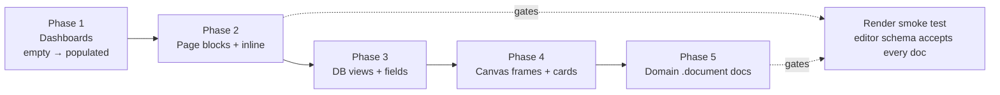
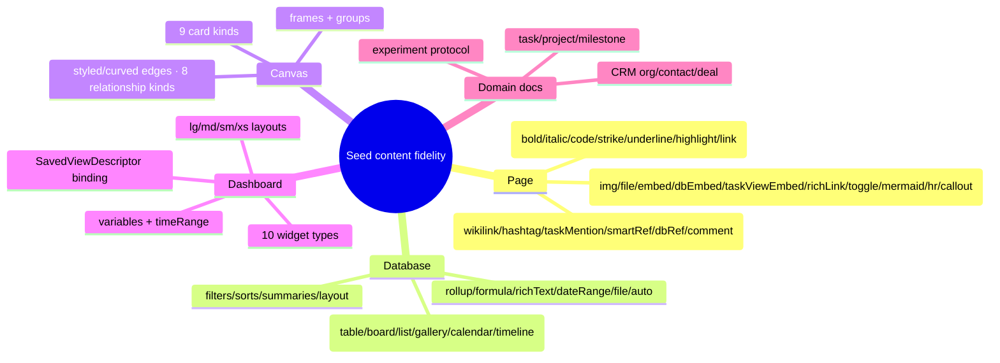

# High-Fidelity Seeded Content For Every Node Type

## Problem Statement

The dev-tools seed ([0221](0221_[x]_DEVTOOLS_THOROUGH_IDEMPOTENT_DATABASE_SEED.md),
[0222](0222_[x]_DEEPLY_RELATIONAL_DEVTOOLS_SEED.md)) now creates a deeply
*relational* graph, but most individual nodes are **shallow shells**: the
relationships are rich, the *contents* are thin. Concretely:

- **Dashboards are 100% empty** — every seeded `Dashboard` is
  `{ variables: {}, widgets: [], layouts: {} }`. Opening one shows nothing.
- **Pages use only 8 block kinds.** `rich-pages.ts`'s `RichBlock` union is
  `h | p | quote | callout | code | bullets | tasks | pageEmbed`. Tables (n/a),
  images, files, embeds, **databaseEmbed**, **taskViewEmbed**, richLink, toggle,
  mermaid, hr, and **every inline mark and inline pill** (bold/italic/link,
  wikilink, hashtag, taskMention, smartReference, databaseReference, comment) are
  never produced.
- **Databases render only 3 of 6 view types** (table/board/calendar) with no
  filters, sorts, column summaries, or per-view layout, and never exercise
  `rollup` / `formula` / `richText` / `dateRange` / `file` / auto fields.
- **Canvases show 4 of ~9 card kinds** (page/task/shape/note) with 2 plain
  connectors — no database/dashboard/media/external-reference cards, no
  **frames**, no **groups**, no styled/curved edges.
- **Rich `.document` fields are blank** on Task, Project, Milestone, CRM
  Organization/Contact/Deal, and Experiment — all of which use the *same* Yjs
  Page content model and currently get nothing.

The ask: **bake real, contextually-relevant content into every node type**, each
piece exercising the full set of UI patterns its surface supports. As the user
put it: "this means writing Yjs XML fragments."

## Executive Summary

This is a **content-fidelity** project layered on the existing seed engine — no
runtime changes, no new idempotency model. The seed already hand-builds
deterministic `Y.Doc`s (`buildRichPageDoc`/`buildSamplePageDoc`/`buildCanvasDoc`)
and node-backed databases; we extend that vocabulary and fill the blanks.

A multi-agent map of every seedable surface produced exact content structures
(Yjs element names + attrs, view configs, widget/descriptor shapes). The
recommended approach (validated against the editor schema):

1. **Keep hand-built `Y.XmlElement` construction** — *not* a
   `prosemirrorJSONToYDoc` path. Hand-building keeps `@xnetjs/devtools` free of
   the editor schema, stays deterministic (stable `guid`, `gc:false`, single
   `transact`), and avoids a schema-mismatch crash on import. We **extend the
   `RichBlock` union** rather than swap engines.
2. **Add per-family content builders** under `seed/`: a richer page block/inline
   vocabulary (the keystone), a `dashboard-builder.ts`, a `canvas-builder.ts`,
   and a `DatabaseSpec` extension for views/fields/summaries.
3. **Gate on a render smoke test** — load every seeded doc through the editor's
   ProseMirror schema (and decode every canvas/dashboard) so a malformed
   fragment fails CI instead of rendering blank.

Phased by user-visible impact: **Dashboards → Page blocks/inline → Database
views/fields → Canvas frames/cards → Domain `.document` narratives.**

## Current State In The Repository

Seed module ([`packages/devtools/src/seed/`](../../packages/devtools/src/seed/)):

- [`docs/rich-pages.ts`](../../packages/devtools/src/seed/docs/rich-pages.ts) — `buildRichPageDoc(nodeId, schemaId, title, icon, blocks)`; `RichBlock` = 8 kinds.
- [`docs/sample-page.ts`](../../packages/devtools/src/seed/docs/sample-page.ts) — the flagship "all block types" page (has toggle/mermaid/hr/callouts but as a one-off, not reusable vocabulary).
- [`seeders/database-drafts.ts`](../../packages/devtools/src/seed/seeders/database-drafts.ts) — `DatabaseSpec` → Field/Option/Row/View drafts; views carry only `type` + `groupBy` + `dateField`.
- [`seeders/viz.ts`](../../packages/devtools/src/seed/seeders/viz.ts) — `buildCanvasDoc` (page/task/shape/note + 2 edges); dashboards seeded **empty**.
- [`seeders/work.ts`](../../packages/devtools/src/seed/seeders/work.ts), [`crm.ts`](../../packages/devtools/src/seed/seeders/crm.ts), [`metrics.ts`](../../packages/devtools/src/seed/seeders/metrics.ts) — create nodes with **no `SeedDoc`s**.

Source-of-truth for content structures:

- **Editor** ([`packages/editor/src/extensions.ts`](../../packages/editor/src/extensions.ts) + `extensions/*`): node/mark names + attrs. Confirmed: there is **no table or columns** extension (drop tables from scope). Inline pills are atom `Y.XmlElement`s; marks apply via `Y.XmlText.format(offset, length, {...})`.
- **Database** ([`packages/data/src/database/`](../../packages/data/src/database/)): `view-types.ts` (FilterGroup/SortConfig/columnSummaries/coverField/dateField), `column-types.ts` (rollup/formula config), `cell-types.ts` (cell value shapes).
- **Dashboard** ([`packages/dashboard/src/types.ts`](../../packages/dashboard/src/types.ts), `registry.ts`, `DashboardSurface.stories.tsx`): `DashboardWidgetInstance`, `SavedViewDescriptor` (query AST executed by `useSavedView`), `DashboardLayouts`, `DashboardVariablesState`.
- **Canvas** ([`packages/canvas/src/types.ts`](../../packages/canvas/src/types.ts), `scene/doc-layout.ts`, `store.ts`): all `CanvasSceneNodeKind`s, frame variants, group `memberIds`, `CanvasEdge` styles + 8 relationship kinds.
- **Map** ([`packages/data/src/schema/schemas/map.ts`](../../packages/data/src/schema/schemas/map.ts)) — a real `Map` node type exists (lower priority; assess its content model).

### Exact structures (from the surface map)

**Page blocks** (`Y.XmlElement` name → attrs):

| Block | Element | Key attrs |
|---|---|---|
| image | `image` | `src, alt, title, width, height, alignment(left/center/right/full), cid` |
| file | `file` | `cid, name, mimeType, size` |
| embed | `embed` | `url, provider(youtube/spotify/vimeo…), embedId, embedUrl, title, width, alignment` |
| databaseEmbed | `databaseEmbed` | `databaseId, viewType, viewConfig, showTitle, maxHeight` |
| taskViewEmbed | `taskViewEmbed` | `viewType('list'), viewConfig(TaskViewConfig), showTitle, maxHeight` |
| richLink | `richLink` | `url, provider('generic'), title, subtitle, icon` |
| toggle | `toggle` | `summary, open` (block children) |
| mermaid | `mermaid` | `code, theme` |
| callout | `callout` | `type(info/tip/warning/caution/note), title?, collapsed?` |

**Inline**: marks via `format(offset,len,{ bold|italic|code|strike|underline|highlight:true | link:{href,target} })`; inline atoms `Y.XmlElement('hashtag'|'taskMention'|'smartReference'|'databaseReference'|'wikilink')` interleaved with `Y.XmlText`.

**Dashboard widget types** (`type` → binding): `metric.count`, `chart.bar`,
`chart.line`, `chart.area`, `chart.pie`, `list.tasks`, `view.saved`,
`links.pages`, `recent.items`, `heatmap.streak`. Each carries a
`SavedViewDescriptor` `{ version:1, title, query: QueryAST }` (e.g. metric →
`aggregates:[{kind:'aggregate', alias:'value', function:'count'}]`). `layouts =
{ lg|md|sm|xs: [{ i, x, y, w, h }] }`. `variables = { timeRange:{preset}, … }`;
`widget.timeField` opt-in time binding.

**Database views**: required-field invariants — board `groupBy` must be a
select; calendar `dateField` a *date*; timeline `endDateField` a date; `select`
filters compare against **option node ids**. Field config: rollup
`{relationColumn, targetColumn, aggregation}`, formula `{expression, resultType}`.

**Canvas**: node kinds `page|database|dashboard|external-reference|media|shape|note|task|group|widget`; `group` carries `memberIds`; frames have variants
(standard/presentation/query/swimlane/kanban/timeline); `CanvasEdge.style`
`{stroke, strokeWidth, strokeDasharray, markerStart, markerEnd, curved}`;
relationship kinds `relates-to|parent-child|depends-on|blocks|references|duplicates|contains|custom`.

## External Research

Programmatic rich-document construction, prior art (full bibliography in the
workflow report):

- **y-prosemirror** offers `prosemirrorJSONToYDoc` / `prosemirrorToYDoc` to
  convert ProseMirror JSON ↔ Yjs, the "canonical" editor-faithful path. But it
  **requires the full editor schema** at construction and validates against it —
  a mismatch throws, and it complicates determinism (clientID/GC). ([y-prosemirror](https://github.com/yjs/y-prosemirror), [Yjs ProseMirror binding](https://docs.yjs.dev/ecosystem/editor-bindings/prosemirror))
- **Tiptap content-injection** (set JSON content on a headless editor, read back
  the Y update) is ergonomic but pulls the editor runtime into the seed. ([Tiptap content injection](https://tiptap.dev/docs/collaboration/documents/content-injection))
- **Excalidraw/tldraw** ship demo scenes as **plain JSON scene objects** — the
  canvas analogue of our `createNode`/`createEdge` (already what we do). ([Excalidraw JSON schema](https://docs.excalidraw.com/docs/codebase/json-schema))
- **BlockSuite** builds docs imperatively via `addBlock` against a block schema —
  the hand-built analogue. ([BlockSuite block schema](https://blocksuite.io/guide/block-schema.html))
- Recommendation across sources: **JSON-spec for static demo fixtures, imperative
  for runtime**; keep fixtures in version control and **snapshot-test** them
  against the schema. For us that means: a thin local block-spec compiled by hand
  to `Y.XmlElement`s (no editor-schema dependency), guarded by a render test.

## Key Findings

1. **Hand-built XmlElements win for a seed.** The editor-faithful
   `prosemirrorJSONToYDoc` path would couple `@xnetjs/devtools` to the editor
   schema and risk import-time crashes; our existing deterministic hand-build is
   the right base. Extend the `RichBlock` union.
2. **Dashboards are the highest-impact gap** — fully empty, and *low risk*
   (JSON props, no editor-schema fidelity concern). Do them first.
3. **Yjs schema fidelity is the #1 risk.** A doc the editor's schema rejects
   renders blank or throws on open. Mitigation: a **render smoke test** loading
   every seeded doc through the editor schema, plus encapsulating mark-offset
   math in the `paragraph(runs)` builder.
4. **Inline content needs a richer paragraph model.** Today `p.text` is a plain
   string; marks/pills need `paragraph(runs: Array<TextRun | InlineNode>)`.
5. **View/widget data-binding is silent-fail-prone.** A board `groupBy` on a
   non-select field, a calendar on a `dateRange`, a select filter against a
   *label* not an option id, or a `SavedViewDescriptor` over an unseeded schema
   all yield empty-but-"seeded"-looking surfaces. Bind only to seeded ids; assert
   descriptors parse.
6. **Breadth once, not volume.** Exercising every pattern means *one* flagship
   instance per surface (one kitchen-sink page, one Products DB, one big canvas,
   two dashboards) — not enriching every node. Keeps the node-count/perf budget
   flat (cf. 0184/0204).
7. **Created-only docs persist.** Re-seeding won't refresh existing docs;
   visual checks of new content need a fresh seed (Clear local) — already a known
   gotcha.

## Options And Tradeoffs

### A. How to build rich Yjs page content

| Option | Pros | Cons |
|---|---|---|
| **A1. Extend hand-built `RichBlock` + inline runs** (recommend) | Deterministic; no editor-schema dep; no crash risk; matches existing code | Must mirror exact attr names; offset math for marks |
| A2. `prosemirrorJSONToYDoc` (y-prosemirror) | Editor-faithful; readable JSON | Imports full editor schema into devtools; throws on mismatch; clientID/GC determinism work |
| A3. Headless Tiptap content-injection | Most faithful | Pulls editor runtime + DOM into the seed; heavy; non-deterministic |

### B. Dashboard widget data source

| Option | Pros | Cons |
|---|---|---|
| **B1. `SavedViewDescriptor` query over seeded schemas** (recommend) | Real reactive data; exercises the actual runtime | Must craft valid QueryAST per widget |
| B2. Inline static data on the widget | Simple | Doesn't exercise the query/binding path; least realistic |

### C. Scope of "exercise everything"

| Option | Pros | Cons |
|---|---|---|
| **C1. One flagship instance per surface** (recommend) | Full pattern coverage; flat node count | A couple of large fixtures to maintain |
| C2. Enrich every seeded node | Maximal realism | Node-count blow-up; slow seed/cold-load |

## Recommendation

Add reusable content builders and fill every blank surface, hand-built and
deterministic, gated by a render smoke test. Structure:

```
seed/
  docs/
    rich-pages.ts        ← EXPAND RichBlock + inline runs (keystone)
    sample-page.ts       ← keep as the reference doc
    page-builders.ts     ← NEW domain narratives (task/project/CRM/experiment)
  builders/
    dashboard-builder.ts ← NEW typed widget/layout/variable factory
    canvas-builder.ts     ← NEW scene factory (all kinds, frames, styled edges)
  seeders/database-drafts.ts ← EXTEND DatabaseSpec (views/fields/summaries/filters)
```

### Phased plan (impact-ordered)



### Coverage target



## Example Code

> Illustrative; exact attr names verified against the editor/dashboard/canvas
> sources during implementation.

### Expanded page vocabulary (inline-aware)

```ts
// docs/rich-pages.ts — inline model
export type TextRun = { text: string; marks?: Array<'bold'|'italic'|'code'|'strike'|'underline'|'highlight'>; link?: string }
export type InlinePill =
  | { pill: 'hashtag'; tag: string }
  | { pill: 'taskMention'; taskId: string; label: string }
  | { pill: 'wikilink'; href: string; label: string }
  | { pill: 'databaseReference'; databaseId: string; label: string }
export type Inline = TextRun | InlinePill

function paragraph(content: string | Inline[]): Y.XmlElement {
  const p = new Y.XmlElement('paragraph')
  if (typeof content === 'string') { p.insert(0, [new Y.XmlText(content)]); return p }
  let offset = 0
  for (const part of content) {
    if ('pill' in part) {
      const el = new Y.XmlElement(part.pill)
      // setAttribute per pill (tag / taskId+label / href+label / databaseId)
      p.insert(p.length, [el]); offset += 1
    } else {
      const t = new Y.XmlText(); t.insert(0, part.text)
      if (part.marks) for (const m of part.marks) t.format(0, part.text.length, { [m]: true })
      if (part.link) t.format(0, part.text.length, { link: { href: part.link } })
      p.insert(p.length, [t]); offset += part.text.length
    }
  }
  return p
}

// new RichBlock kinds: image|file|embed|databaseEmbed|taskViewEmbed|richLink|toggle|mermaid|hr
//   each → new Y.XmlElement(name) + setAttribute(...) per the table above
```

### Dashboard builder

```ts
// builders/dashboard-builder.ts
const descriptor = (title: string, query: object) => ({ version: 1, title, query })

export function metricCount(schemaId: string, label: string): DashboardWidgetInstance {
  return { id: seedId('widget', label), widgetType: 'metric.count', title: label,
    query: descriptor(label, { schemaId, aggregates: [{ kind: 'aggregate', alias: 'value', function: 'count' }] }) }
}
export function chartBar(schemaId: string, x: string, label: string): DashboardWidgetInstance { /* group-by x, count */ }
export function savedView(schemaId: string, label: string): DashboardWidgetInstance { /* type 'view.saved' */ }

export function dashboard(widgets: DashboardWidgetInstance[]) {
  return { widgets, variables: { timeRange: { preset: '30d' } }, layouts: placeGrid(widgets) }
}
// placeGrid → first-fit {i,x,y,w,h} for lg, cascaded to md/sm/xs
```

### Database view + field extension

```ts
// seeders/database-drafts.ts — extend the spec
interface ViewSpec {
  slug; name; type: 'table'|'board'|'list'|'gallery'|'calendar'|'timeline'
  groupByKey?; dateKey?; endDateKey?; coverKey?
  filters?: FilterGroup           // { operator:'and', conditions:[{ columnId, operator:'equals', value }] }
  sorts?: Array<{ key: string; direction: 'asc'|'desc' }>
  columnSummaries?: Record<string, string>   // fieldId → 'sum'|'avg'|'count'|...
}
interface FieldSpec { /* + */ kind adds: 'dateRange'|'file'|'rollup'|'formula'|'richText'
  rollup?: { relationKey; targetKey; aggregation }
  formula?: { expression; resultType } }
```

## Risks And Open Questions

- **Editor-schema fidelity (highest).** New blocks/inline must match exact attr
  names/types (`taskItem.checked` is string `'true'`; `image.width` number|null;
  pills are atom elements not marks). The render smoke test is the gate.
- **Mark offset math.** Encapsulate in `paragraph(runs)`; never hand-write
  offsets.
- **View-config invariants.** Board groupBy = select; calendar dateField = date;
  select filters use option node ids. A wrong ref → empty-looking view.
- **Dashboard binding.** Bind only to seeded schemas; assert each
  `SavedViewDescriptor` parses; malformed aggregates → blank widget.
- **Determinism / created-only.** Stable `guid`, `gc:false`, one `transact`, no
  `Date.now()`/random in content; re-seed won't refresh — Clear local to re-view.
- **Perf budget.** One flagship instance per surface; keep volume flat.
- **Open:** Does the `Map` node type carry meaningful seedable content (geo
  features/layers)? Assess `map.ts`; seed minimally or defer if its content model
  is heavy. Does `databaseEmbed.viewConfig` need a full view object or just a
  view id? Confirm before wiring.

## Implementation Checklist

### Phase 1 — Dashboards (empty → populated)
- [x] Read `packages/dashboard/src/{types.ts,registry.ts,variables.ts}` + `DashboardSurface.stories.tsx`; capture exact `DashboardWidgetInstance` / `SavedViewDescriptor` (QueryAST) / `DashboardLayouts` / `DashboardVariablesState` shapes.
- [x] Add `builders/dashboard-builder.ts` with typed per-widget factories (`metric.count`, `chart.bar/line/area/pie`, `list.tasks`, `view.saved`, `links.pages`, `heatmap.streak`) + a `placeGrid()` layout helper (lg/md/sm/xs) + variables.
- [x] Rewrite `viz.ts` dashboards: seed `analytics` (Metrics + timeRange) and `team-hub` (Tasks/Pages/Databases) bound to already-seeded node ids.

### Phase 2 — Page blocks + inline (keystone)
- [x] Extend `RichBlock` with `image|file|embed|databaseEmbed|taskViewEmbed|richLink|toggle|mermaid|hr` (+ `callout caution`), building each `Y.XmlElement` with exact attrs.
- [x] Add the inline model (`TextRun`/`InlinePill`) + a `paragraph(runs)` builder applying marks via `Y.XmlText.format` and inserting inline atom elements.
- [x] Enrich the seeded pages (`docs.ts`) to use the full vocabulary; wire `databaseEmbed`/`taskViewEmbed` to seeded DB/task ids and inline pills to seeded nodes.

### Phase 3 — Database views & advanced fields
- [x] Extend `DatabaseSpec`/`ViewSpec`/`FieldSpec` in `database-drafts.ts`: `list/gallery/timeline` views; `filters`/`sorts`/`columnSummaries`/`fieldOrder`/`fieldWidths`/`hiddenFields`/`rowHeight`/`coverField`; `dateRange`/`file`/`rollup`/`formula`/`created*` field types.
- [x] Add one flagship database (e.g. Products+Suppliers or extend Tasks Tracker) exercising every view type + every field type + filters/sorts/summaries.

### Phase 4 — Canvas frames, groups & card kinds
- [ ] Add `builders/canvas-builder.ts`: constructors for `database`/`dashboard`/`external-reference`/`media`/`widget` cards, a `frame(variant, memberIds)` helper, a `group(memberIds)` helper, and a `styledEdge(relationshipKind, style)` helper (all 8 kinds, curved/dashed/markers).
- [ ] Rebuild the flagship canvas scene to embed seeded DB/dashboard/media nodes, ≥1 frame + group, and styled connectors.

### Phase 5 — Domain `.document` narratives
- [ ] Add `docs/page-builders.ts` (task description, project brief, milestone notes, CRM org/contact/deal notes, experiment protocol) on the Phase-2 vocabulary.
- [ ] Wire into `work.ts`/`crm.ts`/`metrics.ts` so first task/project/milestone/org/contact/deal/experiment carries a `SeedDoc`.
- [ ] Assess `Map` (`map.ts`) content model; seed minimal real content or record a deferral rationale.

### Cross-cutting
- [x] Add `seed-render.test.ts`: load every seeded `SeedDoc` through the editor's ProseMirror schema (and decode each canvas/dashboard) — fail on any rejected/blank doc.
- [ ] Keep `seed-coverage.test.ts` + `seed-integrity.test.ts` green; update the Seed panel/README/CLAUDE.md if surfaces change.
- [ ] `@xnetjs/devtools` is private → no changeset; add a `changelog-section` fragment.

## Validation Checklist

- [ ] **Dashboards render** — open `analytics` and `team-hub`: metric counters show numbers, charts show axes/series, the saved-view widget shows rows, layouts adapt across breakpoints; changing the time-range re-renders.
- [ ] **Pages render every block** — a flagship page shows image/file/embed cards, a live `databaseEmbed` and `taskViewEmbed` bound to seeded data, toggle/mermaid/hr/callouts, and inline bold/italic/link + hashtag/taskMention/wikilink pills that navigate.
- [ ] **Databases exercise all views** — table/board/list/gallery/calendar/timeline all render with data; a view shows an active filter, a multi-column sort, and a column-summary footer; rollup/formula cells compute.
- [ ] **Canvas exercises all kinds** — the flagship canvas shows page/database/dashboard/media/external-reference cards, a frame containing grouped nodes, and curved/dashed styled connectors.
- [ ] **Domain docs render** — opening a Task/Project/CRM Deal/Experiment shows a formatted `.document` (not blank).
- [ ] **Render smoke test green** — `seed-render.test.ts` confirms the editor schema accepts every seeded doc.
- [ ] **No blank nodes** — sweep the seeded workspace; every node type shows real content.
- [ ] **Idempotency/coverage/integrity** suites green; medium seed completes within budget; lint/format/typecheck/tests green; live-verified via the Seed panel (fresh seed).

## References

### In-repo
- Seed module — [`packages/devtools/src/seed/`](../../packages/devtools/src/seed/) (0221 #264, 0222 #266)
- Editor extensions — [`packages/editor/src/extensions.ts`](../../packages/editor/src/extensions.ts) + `extensions/*`
- Dashboard — [`packages/dashboard/src/types.ts`](../../packages/dashboard/src/types.ts), `registry.ts`, `variables.ts`, `DashboardSurface.stories.tsx`; schema [`dashboard.ts`](../../packages/data/src/schema/schemas/dashboard.ts)
- Database — [`packages/data/src/database/`](../../packages/data/src/database/) (`view-types.ts`, `column-types.ts`, `cell-types.ts`)
- Canvas — [`packages/canvas/src/types.ts`](../../packages/canvas/src/types.ts), `scene/doc-layout.ts`, `store.ts`
- Map schema — [`packages/data/src/schema/schemas/map.ts`](../../packages/data/src/schema/schemas/map.ts)
- Prior explorations — [`0222`](0222_[x]_DEEPLY_RELATIONAL_DEVTOOLS_SEED.md), [`0221`](0221_[x]_DEVTOOLS_THOROUGH_IDEMPOTENT_DATABASE_SEED.md)

### External
- [y-prosemirror](https://github.com/yjs/y-prosemirror) · [Yjs ProseMirror binding](https://docs.yjs.dev/ecosystem/editor-bindings/prosemirror)
- [Tiptap content injection](https://tiptap.dev/docs/collaboration/documents/content-injection)
- [BlockSuite block schema](https://blocksuite.io/guide/block-schema.html) · [Excalidraw JSON schema](https://docs.excalidraw.com/docs/codebase/json-schema)
