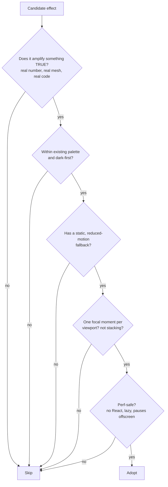
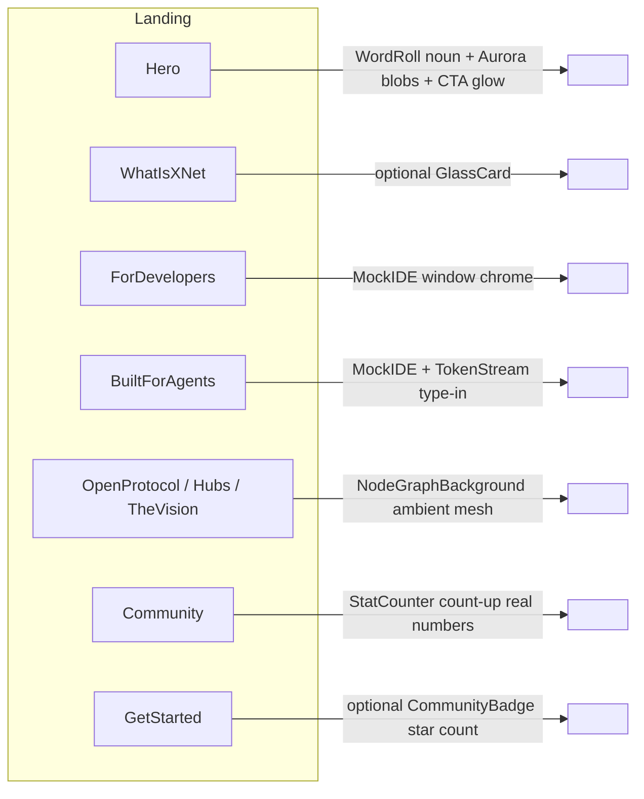

# Tasteful Performative UI On The Marketing Site

> Status: exploration. Goal: bring a curated, on‑brand subset of
> [`performative-ui`](https://vorpus.github.io/performativeUI/) motion/visual
> tropes into the static site — primarily the landing page — to make it pop,
> feel interactive, and direct attention, **without** drifting into generic
> AI‑startup slop.

## Problem Statement

The xNet marketing site (`site/`, Astro + Starlight + Tailwind) is clean and
competent but mostly static. Sections are well‑structured cards and copy with a
few existing flourishes (gradient hero text, a pulsing badge, scroll‑reveal
fades). It does not yet *grab* the eye, reward scrolling, or steer attention to
the moments that matter (the real numbers, the P2P mesh, the agent/SDK code).

[`performative-ui`](https://github.com/vorpus/performativeUI) is a 33‑component
React library that catalogues exactly the landing‑page motion language we're
missing — count‑up stats, aurora backgrounds, animated node graphs, token
streams, before/after sliders, glowing pricing. **The catch:** it is *satire*.
Its tagline is "components that signal how oversubscribed your funding round
is," and several components are deliberately cynical (a text input that
"replaces the value prop," a waitlist that is "demand we manufactured
ourselves," a popover "built for conversion, not consent").

So the task is not "install performative‑ui." It is: **mine the genuinely
delightful, well‑crafted effects from a satire library and apply them only where
xNet has real substance to amplify** — tastefully, performance‑safely, and
on‑brand for a project whose entire pitch is *substance over hype* ("Your data.
Your devices. Your rules.").

## Executive Summary

- **The library is satire, but the craft is real and MIT‑licensed.** Treat it as
  a *reference/lookbook*, not a dependency. The visual techniques (count‑up,
  aurora, node‑graph, token‑stream, before/after, glass) are simple enough to
  reimplement in pure CSS + a few KB of vanilla JS — which matches how `site/`
  already does motion (IntersectionObserver scroll‑reveal, copy buttons, inline
  SVG charts).
- **Do not add React.** The site has **no** `@astrojs/react` integration and is
  static‑first. Importing a 30 KB React component lib + hydration islands onto a
  marketing page is the wrong trade. Reimplement the ~9 chosen effects in
  Astro/CSS/vanilla; cite performative‑ui as the design source (MIT).
- **The brand‑fit filter is the whole game.** Map all 33 components into
  **Adopt / Adapt / Skip**. xNet's edge is honesty; so every animation must
  *mean something* — count up **real** test/package numbers, draw a node graph
  because xNet **is** a mesh, show a before/after because local‑first genuinely
  beats cloud lock‑in. The cynical conversion‑manipulation components are hard
  **Skip**s precisely because they'd undercut the pitch.
- **Recommended curated set (~9):** `StatCounter`, `NodeGraphBackground`,
  `WordRoll`/`Rotator`, `Aurora`, `MockIDE`, `TokenStream`, `BeforeAfter`,
  `PricingCard` (glow), `StatusDot` (real) — plus light atom accents
  (`Sparkle`, extended `GradientText`, a subtle `Button` glow) and a reframed
  `LogoRow` ("Built on open standards"). Everything gated behind
  `prefers-reduced-motion`, lazy‑initialised, and capped to one "hero moment"
  per section.
- **Highest ROI, lowest risk first:** `StatCounter` on the Community
  "what's working now" block and on `/open`, and `NodeGraphBackground` behind the
  protocol/vision sections. Both amplify things that are *true*, which is the
  definition of tasteful here.

## Current State In The Repository

### Stack

- `site/astro.config.mjs` — Astro 5 + `@astrojs/starlight` + `@astrojs/tailwind`
  (`applyBaseStyles: false`). **No React/Vue/Svelte integration.**
- `site/tailwind.config.mjs` — `darkMode: 'class'`, JetBrains Mono, CSS‑var
  driven `surface`/`border`/`code-bg`. Palette in use: indigo / purple / emerald
  / amber / pink on near‑black (`#0a0a0f`).
- `site/src/layouts/Base.astro` — dark‑by‑default with `localStorage` theme
  flip; **already ships the motion runtime**: a global `IntersectionObserver`
  driving `.animate-on-scroll` reveals (with staggered child delays) and the
  copy‑button handler. This is exactly the seam new scroll‑triggered effects
  should hook into.

### The landing page and its sections

`site/src/pages/index.astro` composes, in order:

```
Nav → Hero → WhatIsXNet → TheApp → ForDevelopers → BuiltForAgents →
UnderTheHood → OpenProtocol → Hubs → TheVision → Landscape → Roadmap →
Community → GetStarted → Footer
```

All live under `site/src/components/sections/`. Shared UI atoms are in
`site/src/components/ui/` (`Badge.astro`, `SectionHeader.astro`,
`CodeBlock.astro`, `ThemeToggle.astro`).

### Performative tropes the site *already* uses (tastefully)

The site is not starting from zero — it already cherry‑picks several
performative‑ui patterns by hand, which validates the approach:

| Existing element | File | performative‑ui analogue |
| --- | --- | --- |
| Gradient clipped hero headline | `sections/Hero.astro:24` | `GradientText` |
| Pulsing "Pre‑release" status dot in a pill | `sections/Hero.astro:15`, `ui/Badge.astro` | `StatusDot` + `EyebrowPill` |
| Grid background + radial glow behind hero | `sections/Hero.astro:7‑9` | (poor‑man's) `Aurora` |
| Scroll‑reveal fade/stagger | `layouts/Base.astro:78‑94,118‑131` | the motion substrate |
| Pulsing "in‑progress" timeline dot | `sections/Roadmap.astro:14` (`animate-pulse`) | `StatusDot` |
| Inline‑SVG growth charts | `sections/OpenMetrics.astro` | (numeric storytelling) |
| Terminal `CodeBlock` for SDK/agent code | `BuiltForAgents.astro`, `GetStarted.astro` | `MockIDE` |

So the gap is not "no motion" — it's "the motion stops at the hero and never
returns to reward the scroll or dramatise the real numbers."

### Other pages that are strong targets

- `site/src/pages/open.astro` → `sections/OpenMetrics.astro` — **real** counters
  (paying customers, MRR, workspaces hosted, documents synced, AI tokens
  metered). Prime `StatCounter` territory.
- `site/src/pages/compare.astro` (+ `components/compare/*`) — a layered
  comparison table. Prime `BeforeAfter` territory.
- `site/src/pages/cloud/pricing.astro` (+ `data/pricing.ts`) — tiers. Prime
  `PricingCard` (glow the recommended tier) territory.
- `site/src/pages/status.astro` (+ `data/status.json`) — a **real** status feed.
  Prime honest `StatusDot` territory.
- `site/src/pages/changelog/` (+ `components/changelog/Gallery.astro`) — already
  interactive; light `Sparkle`/`GradientText` accenting only.

## External Research

### What `performative-ui` actually is

- **Thesis:** a "library of jokes" satirising the homogenised visual language of
  AI‑startup landing pages — glowing buttons, gradient text, prompt inputs,
  fake stats, manufactured demand. 33 components, ~30 KB, React 19 + TypeScript,
  MIT. 766★. Show HN + Gigazine coverage; Svelte community ports exist.
- **The full catalogue (verbatim, by the docs' own grouping):**
  - **Heroes:** `AsciiHero`, `Goldeneye`, `Rotator`, `WordRoll`, `PromptHero`
  - **Menus:** `Temperature`
  - **Social proof:** `LogoMarquee`, `LogoRow`, `SlippyWords`, `StatCounter`,
    `CommunityBadge`
  - **Atoms:** `Sparkle`, `GradientText`, `StatusDot`, `QuestText`
  - **Primitives:** `Button`, `EyebrowPill`, `Prompt`
  - **Banners:** `StickyBanner`
  - **Backgrounds:** `Aurora`, `NodeGraphBackground`, `FloatingSparkles`
  - **Surfaces:** `GlassCard`, `MockIDE`
  - **Conversation:** `ChatBubble`, `TokenStream`, `WibblingSpinner`, `ChatFAB`
  - **Pricing & conversion:** `PricingCard`, `BeforeAfter`, `WaitlistForm`,
    `Popover`
  - **Footers:** `BigBack`

The cynicism is load‑bearing for several: `PromptHero` ("we replaced the value
prop with a text input"), `WaitlistForm` ("demand we manufactured ourselves"),
`Popover` ("built for conversion, not consent"), `ChatFAB` ("there's no escape
now"), `StatusDot` ("always green, even when it's not"), `BigBack` (you forget
the company name scrolling to it). Reading the joke tells you exactly which ones
to refuse and which to redeem with honesty.

### Prior art on *tasteful* landing motion

- **`prefers-reduced-motion`** is a hard requirement, not a nicety — ~30% of
  users in some studies enable reduce‑motion; vestibular disorders make
  parallax/zoom genuinely harmful. The pattern: ship the static layout, *add*
  motion only inside `@media (prefers-reduced-motion: no-preference)`.
- **IntersectionObserver‑gated, run‑once** is the consensus technique for
  count‑ups and reveals (already in `Base.astro`). Avoids jank and offscreen
  work.
- **Count‑up:** trivial to hand‑roll with `requestAnimationFrame` + an easing
  function; libraries (CountUp.js ~ few KB) exist but a 20‑line vanilla version
  is enough and dependency‑free.
- **Canvas particle/node fields** must cap DPR, cap node count, and
  `cancelAnimationFrame` when offscreen (or use CSS‑only where possible) to stay
  within a marketing‑page perf budget. Respect reduced‑motion by rendering a
  single static frame.
- **Design‑craft consensus** (Stripe/Linear/Vercel‑style): motion should
  *explain* (state change, spatial relationship, data magnitude), be fast
  (150–400 ms for UI; slow + subtle for ambient backgrounds), and never compete
  with itself. One focal animation per viewport.

## Key Findings

1. **Satire ≠ unusable.** The components encode real, well‑built techniques. The
   joke is about *where AI startups put them* (everywhere, dishonestly), not
   that the techniques are bad. Used where xNet has substance, they read as
   polish, not parody.
2. **xNet's brand inverts the satire.** performative‑ui mocks fake stats; xNet
   has *real* ones (6,000+ tests, 30 packages, 18 published npm packages, live
   `/open` usage). Counting up a true number is the opposite of the joke — it's
   receipts. This is the single best alignment.
3. **Some components are literally the architecture.** `NodeGraphBackground` is
   a decoration for everyone else and a *diagram* for xNet (P2P mesh,
   "every app makes the network stronger"). That's the most defensible motion on
   the whole page.
4. **No‑React is a feature, not a constraint.** Reimplementing in CSS/vanilla
   keeps the static site fast and matches existing patterns; it also lets us
   take *only* the tasteful 20% and leave the cynical 80% on the shelf.
5. **The hard Skips protect the brand.** `PromptHero`, `Prompt`, `WaitlistForm`,
   `Popover`, `ChatFAB`, `Temperature`, `QuestText`, `WibblingSpinner`, `BigBack`
   are off‑brand (manipulative, irrelevant, or gag‑only). Refusing them *is* the
   taste.

## Options And Tradeoffs

### A. How to consume the library

| Option | What | Pros | Cons | Verdict |
| --- | --- | --- | --- | --- |
| **A1. Add React, use lib as islands** | `@astrojs/react` + `performative-ui` deps; drop `<StatCounter client:visible/>` | Fastest to wire; upstream upgrades | +React runtime + hydration on a static page; pulls in components we'd never use; satirical defaults need re‑skinning anyway; new dep surface | ❌ |
| **A2. Reimplement chosen effects in Astro/CSS/vanilla** | Hand‑build ~9 effects; use lib source as MIT reference | Zero new deps; perfect palette/brand fit; matches `Base.astro` patterns; ship only the tasteful subset | More authoring; we own the code | ✅ **Recommended** |
| **A3. Hybrid** | CSS for ambient/background; tiny React island only for the 1–2 most interactive (e.g. `BeforeAfter`) | Pragmatic | Still drags in React for one widget; vanilla `BeforeAfter` is ~30 lines anyway | ◻︎ fallback only |

### B. How much to integrate (the taste dial)

| Dial | Description | Risk |
| --- | --- | --- |
| **Minimal** | Just `StatCounter` + `NodeGraphBackground` + extend existing gradient/aurora | Under‑delivers on "make it pop" |
| **Curated (recommended)** | ~9 effects, one focal moment per section, all reduced‑motion gated | Balanced; the brief's "tasteful, not over the top" |
| **Maximal** | Most of the 33, multiple effects per section | Becomes the slop the library satirises; off‑brand |

**Recommendation: A2 + Curated.**

### Brand‑fit matrix (all 33)

Verdict legend: **Adopt** = ship it, **Adapt** = ship a re‑skinned/honest
version, **Skip** = off‑brand/gag‑only.

| Component | Verdict | Where / how on the xNet site |
| --- | --- | --- |
| `StatCounter` | **Adopt** | Community "what's working now" + `/open` — count up real test/package/usage numbers on scroll |
| `NodeGraphBackground` | **Adopt** | Ambient canvas behind `OpenProtocol` / `Hubs` / `TheVision` — it *is* the P2P mesh |
| `WordRoll` | **Adopt** | Hero subhead — roll the noun: "work offline / sync peer‑to‑peer / stay yours" |
| `Rotator` | **Adapt** | Alternative to `WordRoll` if a typewriter feel is preferred (slower; pick one) |
| `Aurora` | **Adapt** | Upgrade the hero's radial glow to 2–3 very‑low‑opacity drifting blobs; reuse behind `TheVision` |
| `MockIDE` | **Adopt** | Window chrome around the SDK example (`ForDevelopers`) and agent CLI (`BuiltForAgents`) |
| `TokenStream` | **Adapt** | The agent CLI output / SDK snippet "types in" once on scroll (tie to the real agent story only) |
| `BeforeAfter` | **Adopt** | `/compare` page — "Cloud SaaS lock‑in ⟷ Local‑first" draggable slider |
| `PricingCard` | **Adapt** | `/cloud/pricing` — glow/elevate the recommended tier only |
| `StatusDot` | **Adapt** | **Honest** version fed by `data/status.json` — green when green, degraded when not |
| `GradientText` | **Adopt** | Already used; extend to one or two section eyebrows, not everywhere |
| `Sparkle` | **Adopt (sparingly)** | A single ✦ shimmer on a key word (e.g. the AI/agent eyebrow) |
| `EyebrowPill` | **Adopt** | Already exists as `Badge`; formalise the pattern across sections |
| `Button` | **Adapt** | Subtle glow/shimmer on the *primary* hero CTA only |
| `LogoRow` | **Adapt** | "Built on open standards" — Yjs, SQLite, libsodium, ML‑DSA, TypeScript, React |
| `LogoMarquee` | **Adapt (maybe)** | Same content as `LogoRow` but scrolling; only if we have ≥8 marks |
| `CommunityBadge` | **Adapt (maybe)** | Live GitHub star count in Community/GetStarted (honest: it's open source) |
| `GlassCard` | **Adapt (maybe)** | Subtle backdrop‑blur on the three‑layer / pricing cards (watch perf) |
| `AsciiHero` | **Consider** | A small ASCII mesh/network motif could fit the hacker/protocol ethos; risk of gimmick |
| `Goldeneye` | **Consider** | A subtle cursor‑spotlight on the hero; easy to overdo |
| `SlippyWords` | **Skip‑ish** | Scroll‑parallax buzzwords read as gimmick; low substance |
| `FloatingSparkles` | **Skip‑ish** | Ambient particles read as AI slop unless extremely subtle |
| `StickyBanner` | **Skip‑ish** | Only for a genuine, dismissible release note; annoyance risk |
| `PromptHero` | **Skip** | "Replaces the value prop with a text input" — xNet is not a prompt product |
| `Prompt` | **Skip** | Same reason; no fake chat front door |
| `ChatBubble` | **Skip (mostly)** | Generic‑AI look; only if tightly bound to the real agent demo |
| `WibblingSpinner` | **Skip** | No loading states on a static page |
| `ChatFAB` | **Skip** | "There's no escape now" — off‑brand intrusion |
| `WaitlistForm` | **Skip** | xNet ships now; manufactured demand is the opposite of the brand |
| `Popover` | **Skip** | "Built for conversion, not consent" — hard no |
| `Temperature` | **Skip** | Gag slider; no use |
| `QuestText` | **Skip** | RPG flavor text; off‑brand |
| `BigBack` | **Skip** | Giant footer wordmark gag; low value |

## Recommendation

Adopt **Option A2 (reimplement in Astro/CSS/vanilla) at the Curated dial**, in
three waves ordered by ROI‑over‑risk. Treat performative‑ui as the MIT reference
lookbook and credit it in a code comment.

### The "tasteful gate" (apply to every candidate)

A candidate effect ships **only if it passes all five**:



### Placement plan (landing page)



### Wave 1 — earn trust with true numbers and the mesh (highest ROI)

1. **`StatCounter`** on `Community.astro` (wrap the "what's working now" facts
   that are countable — *6,000+ tests*, *30 packages*, *15 property types*,
   *10 devtools panels*) and on `OpenMetrics.astro` (the headline + usage
   cards). Count up once when scrolled into view; static value under
   reduced‑motion.
2. **`NodeGraphBackground`** as a low‑opacity ambient canvas behind
   `OpenProtocol`/`Hubs`/`TheVision`. It literally depicts the decentralized
   data layer. Static single frame under reduced‑motion.

### Wave 2 — dramatise the hero and the code

3. **`WordRoll`** in the hero subhead (one rolling noun) + **`Aurora`** upgrade
   of the existing radial glow + a subtle **`Button`** glow on the primary CTA.
4. **`MockIDE`** window chrome around the existing terminal `CodeBlock`s in
   `ForDevelopers` and `BuiltForAgents`, with **`TokenStream`** typing the agent
   CLI output in once on scroll.

### Wave 3 — secondary pages

5. **`BeforeAfter`** slider on `/compare`. 6. **`PricingCard`** glow on
   `/cloud/pricing`. 7. **Honest `StatusDot`** wired to `data/status.json` in the
   nav/status page. 8. **`LogoRow`** "Built on open standards" band.

## Example Code

All examples are pure Astro/CSS/vanilla — no new dependencies — and degrade to a
static layout under `prefers-reduced-motion`. Source technique credit:
performative‑ui (MIT).

### 1. `StatCounter` — count up a real number on scroll

```astro
---
// site/src/components/ui/StatCounter.astro
interface Props { value: number; suffix?: string; label: string; prefix?: string }
const { value, suffix = '', prefix = '', label } = Astro.props
---
<div class="rounded-xl border border-border bg-surface p-5 text-center">
  <div
    class="stat-counter text-3xl font-semibold tabular-nums"
    data-target={value} data-prefix={prefix} data-suffix={suffix}
  >{prefix}0{suffix}</div>
  <div class="mt-1 text-sm text-gray-500">{label}</div>
</div>

<script>
  const els = document.querySelectorAll<HTMLElement>('.stat-counter')
  const reduce = window.matchMedia('(prefers-reduced-motion: reduce)').matches
  const ease = (t: number) => 1 - Math.pow(1 - t, 3) // easeOutCubic
  const run = (el: HTMLElement) => {
    const target = Number(el.dataset.target || 0)
    const pre = el.dataset.prefix || '', suf = el.dataset.suffix || ''
    if (reduce) { el.textContent = `${pre}${target.toLocaleString()}${suf}`; return }
    const dur = 1200, t0 = performance.now()
    const tick = (now: number) => {
      const p = Math.min(1, (now - t0) / dur)
      el.textContent = `${pre}${Math.round(ease(p) * target).toLocaleString()}${suf}`
      if (p < 1) requestAnimationFrame(tick)
    }
    requestAnimationFrame(tick)
  }
  const io = new IntersectionObserver((entries) => {
    for (const e of entries) if (e.isIntersecting) { run(e.target as HTMLElement); io.unobserve(e.target) }
  }, { threshold: 0.4 })
  els.forEach((el) => io.observe(el))
</script>
```

### 2. `NodeGraphBackground` — ambient P2P mesh (canvas, pauses offscreen)

```astro
---
// site/src/components/ui/NodeGraphBackground.astro — drop as first child of a `relative` section
---
<canvas class="node-graph pointer-events-none absolute inset-0 -z-10 h-full w-full opacity-[0.18]"></canvas>
<script>
  const canvas = document.querySelector<HTMLCanvasElement>('.node-graph')
  if (canvas) {
    const reduce = window.matchMedia('(prefers-reduced-motion: reduce)').matches
    const ctx = canvas.getContext('2d')!
    const DPR = Math.min(2, window.devicePixelRatio || 1)
    let raf = 0, nodes: { x: number; y: number; vx: number; vy: number }[] = []
    const N = 28, LINK = 150
    const size = () => {
      const r = canvas.getBoundingClientRect()
      canvas.width = r.width * DPR; canvas.height = r.height * DPR
      ctx.setTransform(DPR, 0, 0, DPR, 0, 0)
      if (!nodes.length)
        nodes = Array.from({ length: N }, () => ({
          x: Math.random() * r.width, y: Math.random() * r.height,
          vx: (Math.random() - 0.5) * 0.25, vy: (Math.random() - 0.5) * 0.25,
        }))
    }
    const draw = () => {
      const r = canvas.getBoundingClientRect()
      ctx.clearRect(0, 0, r.width, r.height)
      for (const n of nodes) {
        if (!reduce) { n.x += n.vx; n.y += n.vy
          if (n.x < 0 || n.x > r.width) n.vx *= -1
          if (n.y < 0 || n.y > r.height) n.vy *= -1 }
      }
      for (let i = 0; i < N; i++) for (let j = i + 1; j < N; j++) {
        const d = Math.hypot(nodes[i].x - nodes[j].x, nodes[i].y - nodes[j].y)
        if (d < LINK) { ctx.strokeStyle = `rgba(99,102,241,${(1 - d / LINK) * 0.5})`
          ctx.beginPath(); ctx.moveTo(nodes[i].x, nodes[i].y); ctx.lineTo(nodes[j].x, nodes[j].y); ctx.stroke() }
      }
      ctx.fillStyle = 'rgba(129,140,248,0.9)'
      for (const n of nodes) { ctx.beginPath(); ctx.arc(n.x, n.y, 1.6, 0, Math.PI * 2); ctx.fill() }
      if (!reduce) raf = requestAnimationFrame(draw)
    }
    size(); window.addEventListener('resize', size)
    // pause when the section scrolls out of view
    const io = new IntersectionObserver(([e]) => {
      if (e.isIntersecting) { if (!raf) draw() } else { cancelAnimationFrame(raf); raf = 0 }
    })
    io.observe(canvas)
  }
</script>
```

### 3. `WordRoll` — rolling noun in the hero (CSS only)

```astro
<span class="word-roll inline-grid">
  <span>work offline.</span>
  <span>sync peer‑to‑peer.</span>
  <span>stay yours.</span>
</span>
<style>
  .word-roll { overflow: hidden; height: 1.1em; }
  .word-roll > span { grid-area: 1 / 1; animation: roll 6s infinite; }
  .word-roll > span:nth-child(2) { animation-delay: 2s; }
  .word-roll > span:nth-child(3) { animation-delay: 4s; }
  @keyframes roll {
    0%, 26% { transform: translateY(0); opacity: 1; }
    33%, 100% { transform: translateY(-1.1em); opacity: 0; }
  }
  @media (prefers-reduced-motion: reduce) {
    .word-roll { height: auto; }
    .word-roll > span { animation: none; }
    .word-roll > span:not(:first-child) { display: none; }
  }
</style>
```

### 4. `BeforeAfter` — local‑first vs cloud lock‑in (range input, keyboard‑operable)

```astro
<div class="ba relative overflow-hidden rounded-xl border border-border">
  <div class="ba-after p-8">…Local‑first: data on device, P2P sync, you hold the keys…</div>
  <div class="ba-before absolute inset-0 p-8 bg-surface" style="clip-path: inset(0 50% 0 0)">
    …Cloud SaaS: vendor holds your data, lock‑in, outages…
  </div>
  <input class="ba-range absolute inset-0 w-full opacity-0 cursor-ew-resize"
         type="range" min="0" max="100" value="50" aria-label="Compare cloud vs local-first" />
</div>
<script>
  document.querySelectorAll<HTMLElement>('.ba').forEach((ba) => {
    const range = ba.querySelector<HTMLInputElement>('.ba-range')!
    const before = ba.querySelector<HTMLElement>('.ba-before')!
    range.addEventListener('input', () => {
      before.style.clipPath = `inset(0 ${100 - Number(range.value)}% 0 0)`
    })
  })
</script>
```

### 5. `MockIDE` — window chrome wrapper (Astro slot around existing `CodeBlock`)

```astro
---
// site/src/components/ui/MockIDE.astro
const { filename = 'terminal' } = Astro.props
---
<div class="overflow-hidden rounded-xl border border-border bg-[var(--lp-code-bg)] shadow-2xl shadow-indigo-500/10">
  <div class="flex items-center gap-2 border-b border-border px-4 py-2.5">
    <span class="h-3 w-3 rounded-full bg-red-400/80"></span>
    <span class="h-3 w-3 rounded-full bg-amber-400/80"></span>
    <span class="h-3 w-3 rounded-full bg-emerald-400/80"></span>
    <span class="ml-2 font-mono text-xs text-gray-500">{filename}</span>
  </div>
  <div class="p-4"><slot /></div>
</div>
```

## Risks And Open Questions

- **Brand dilution (the core risk).** Over‑applying these tropes turns xNet into
  the slop the library satirises. Mitigation: the five‑gate test, one focal
  moment per section, and the long Skip list are non‑negotiable. *When in doubt,
  cut the effect.*
- **Performance.** Canvas + multiple observers on a marketing page can regret.
  Mitigation: no React; cap node count/DPR; `cancelAnimationFrame` offscreen;
  prefer CSS over JS where possible; lazy‑init via IntersectionObserver.
- **Reduced‑motion / a11y.** Every effect needs a static fallback and proper
  labels (count‑ups expose the final number; `BeforeAfter` is a labelled range
  input). Background canvas must be `aria-hidden`/decorative.
- **Honesty of `StatusDot` and `StatCounter`.** The satire mocks fake green and
  fake stats. We must only show numbers/states that are *real and current*
  (`status.json`, `metrics.json`, build‑time package counts). A stale or
  hardcoded "always green" dot would be self‑own.
- **Theme + palette.** Effects must work in both light and dark and stay within
  indigo/purple/emerald/amber/pink. Aurora/glow opacity needs tuning per theme.
- **Build/format gates.** `site/**` is skipped by `format:check` but new
  components still need to pass `astro build`; the `lint` job runs `prettier`/
  eslint on `apps`/`packages` (not `site`), so the risk is build‑time, not lint.
  Verify with a local `pnpm --filter site build` (per prior site‑change
  learnings, PR CI does not always build the site).
- **Open question — `WordRoll` vs `Rotator`:** pick exactly one for the hero
  (recommend `WordRoll`: no typing wait, less attention‑hogging).
- **Open question — `CommunityBadge` star count:** live fetch vs build‑time
  snapshot (lean build‑time to avoid runtime calls + keep it static/offline).
- **Open question — `GlassCard`:** `backdrop-filter` cost on low‑end devices;
  may prefer a flat translucent card. Defer unless it clearly elevates.
- **Licensing/attribution:** performative‑ui is MIT — adapting CSS/technique is
  fine; add a one‑line credit comment in any closely‑derived component.

## Implementation Checklist

- [x] Add a shared reduced‑motion helper + decision note (a short
      `site/src/components/ui/README.md` documenting the five‑gate test) so the
      taste rules are enforced, not vibes.
- [x] **Wave 1a:** Build `ui/StatCounter.astro` (IntersectionObserver count‑up,
      reduced‑motion static fallback, `tabular-nums`).
- [x] Wire `StatCounter` into `sections/Community.astro` for the countable
      "what's working now" facts (tests, packages, property types, panels).
- [x] Wire `StatCounter` into `sections/OpenMetrics.astro` headline + usage
      cards (only the real values from `metrics.json`).
- [x] **Wave 1b:** Build `ui/NodeGraphBackground.astro` (canvas, capped
      nodes/DPR, pause offscreen, static frame under reduced‑motion,
      `aria-hidden`).
- [x] Mount `NodeGraphBackground` behind `OpenProtocol`/`Hubs`/`TheVision`
      (make those sections `relative`; place canvas at `-z-10`, low opacity).
- [x] **Wave 2a:** Add `WordRoll` to `sections/Hero.astro` subhead (one noun);
      upgrade the radial glow to a 2–3 blob `Aurora`; add a subtle glow to the
      primary CTA only.
- [x] **Wave 2b:** Build `ui/MockIDE.astro` window chrome; wrap the terminal
      `CodeBlock` in `ForDevelopers` and `BuiltForAgents`.
- [x] Add `TokenStream` "type‑in once on scroll" to the agent CLI block (tie to
      the real agent narrative only; reduced‑motion shows full text).
- [ ] **Wave 3:** Build `ui/BeforeAfter.astro` (range input + clip‑path) and
      place on `/compare` ("Cloud lock‑in ⟷ Local‑first").
- [ ] Add recommended‑tier glow to `/cloud/pricing` (`PricingCard` treatment).
- [ ] Wire an honest `StatusDot` to `data/status.json` in the nav/status page.
- [ ] Add a "Built on open standards" `LogoRow` (Yjs, SQLite, libsodium,
      ML‑DSA, TypeScript, React).
- [ ] Light atom pass: one `Sparkle` accent + one or two extra `GradientText`
      eyebrows (resist the urge to do more).
- [ ] Add MIT attribution comment to any component closely derived from
      performative‑ui.

## Validation Checklist

- [ ] `pnpm --filter site build` passes locally (PR CI may not build the site).
- [ ] Toggle OS "Reduce motion": every effect renders a sensible static state
      (counters show final number, node graph shows one frame, word‑roll shows
      the first noun, no autoplay).
- [ ] Light **and** dark themes both look intentional (opacities tuned per
      theme; palette stays indigo/purple/emerald/amber/pink).
- [ ] Lighthouse/perf: no measurable regression in LCP/CLS on the landing page;
      canvas section CPU drops to ~0 when scrolled offscreen (verify
      `cancelAnimationFrame`).
- [ ] Keyboard + screen reader: `BeforeAfter` range is operable and labelled;
      decorative canvases are `aria-hidden`; counters expose the real final
      value in the DOM.
- [ ] Numbers shown are **true and current** (cross‑check against `metrics.json`,
      `status.json`, and the actual package/test counts).
- [ ] Mobile (~380px) and desktop: no overflow from node graph/aurora; hero
      word‑roll doesn't reflow layout (fixed line height).
- [ ] "Squint test": no section stacks more than one focal animation; the page
      reads as *polished*, not as an AI‑startup parody.
- [ ] Visual capture / screenshots attached to the PR for the hero, the
      protocol mesh, and the count‑up moment.

## References

- performative‑ui (live docs): https://vorpus.github.io/performativeUI/
- performative‑ui (source, MIT): https://github.com/vorpus/performativeUI
- Component source dir (catalogue): `src/components/*.tsx` in that repo
- Show HN discussion: https://news.ycombinator.com/item?id=48445554
- Gigazine coverage: https://gigazine.net/gsc_news/en/20260609-performative-ui/
- MDN — `prefers-reduced-motion`:
  https://developer.mozilla.org/en-US/docs/Web/CSS/@media/prefers-reduced-motion
- Repo touchpoints: `site/src/pages/index.astro`,
  `site/src/components/sections/*.astro`, `site/src/components/ui/*.astro`,
  `site/src/layouts/Base.astro`, `site/src/pages/{open,compare,status}.astro`,
  `site/src/pages/cloud/pricing.astro`, `site/src/data/{metrics,status,pricing}.*`
- Related explorations: changelog/site work in `0202`/`0203`, cloud dashboard in
  `0207`/`0214` (site‑build + reduced‑motion + `[hidden]` CSS learnings).
