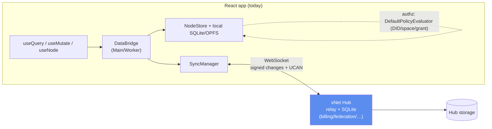
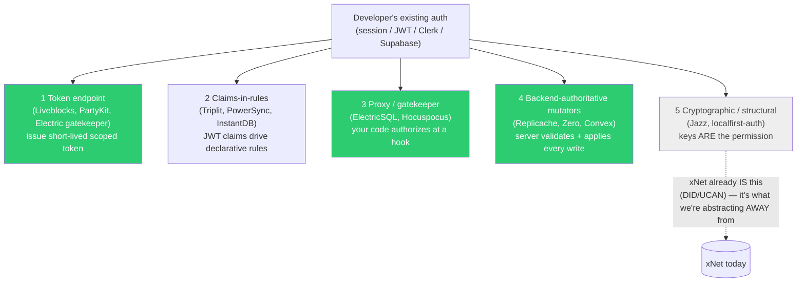
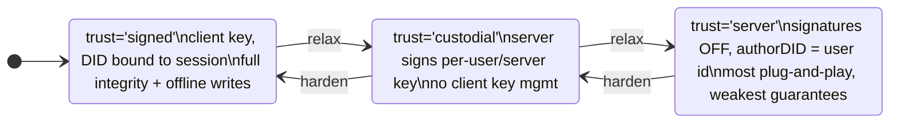
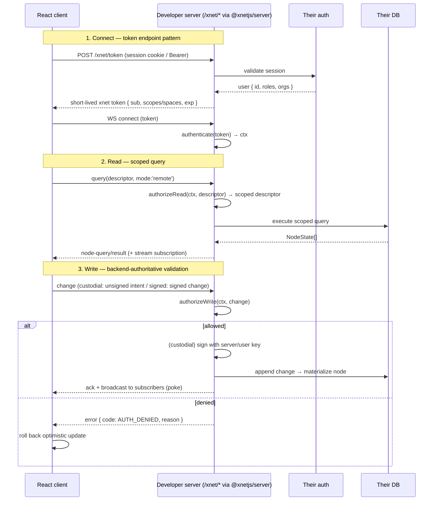

# xNet React With Your Own Server (Bring-Your-Own Backend & Auth)

> Status: exploration / proposal. Filename starts `[_]`; flip to `[x]` once the
> `@xnetjs/server` kit + server transport land and a sample app runs against a
> developer-owned backend with developer-owned auth.

## Problem Statement

Today, adopting xNet means adopting **all** of xNet: the decentralized hub, the
`did:key` identity model, Ed25519-signed changes, UCAN capabilities, and the
space/role/grant authorization graph. That is the right default for a
local-first, user-owned network — but it is a large pill to swallow for a
mainstream React team that just wants the *developer experience*:

- typed schemas,
- live `useQuery` / `useMutate` / `useNode` hooks,
- offline-capable local cache,
- real-time subscriptions,

…served from **their own centralized server**, gated by **their own auth**
(session cookies, JWTs, Clerk/Auth0/WorkOS, Supabase Auth, whatever they
already run), and stored in **their own database**.

The user's framing, distilled:

> "Can we extract and abstract the data layer? Store stuff in the database, get
> the nice React hooks, subscriptions, query a remote database — but
> plug‑and‑play for your own infrastructure. You bring your own permissioning,
> identity, and (maybe) authorization. The tricky part is mapping xNet's
> authorization/identity primitives onto *other people's* primitives."

So the core question is **two coupled questions**:

1. **Backend shape** — Is this a new npm package the developer runs on their
   server? A REST contract they implement? Do we manage their DB? (Answer
   below: a thin embeddable server kit *and* an open HTTP contract — both, in
   layers.)
2. **Identity & authorization mapping** — xNet assumes every write is signed by
   a keypair and tagged with an `authorDID`, and authorization is keyed on DIDs.
   How do we let a developer's `req.user.id` drive the system instead?

## Executive Summary

**The good news: the client is already abstracted enough.** xNet's React hooks
do not talk to the hub or the store directly. They depend on three clean,
already-shipping seams:

| Seam | Where | What it abstracts |
| --- | --- | --- |
| `DataBridge` | [packages/data-bridge/src/types.ts](packages/data-bridge/src/types.ts) | All reads/writes/subscriptions the hooks use |
| `RemoteNodeQueryClient` | [packages/data-bridge/src/remote-query-protocol.ts](packages/data-bridge/src/remote-query-protocol.ts) | Querying a *remote* database (carries `auth.bearerToken`) |
| `PolicyEvaluator` + `ChangeSigner` | [packages/core/src/auth-types.ts](packages/core/src/auth-types.ts), [packages/sync/src/change.ts](packages/sync/src/change.ts) | Authorization and signing — **both optional on `NodeStore`** |

`NodeStore` skips authorization entirely when no `authEvaluator` is supplied
([packages/data/src/store/store.ts:2474](packages/data/src/store/store.ts)),
and `createXNetClient` already runs headless in Node with `sync: false`
([packages/runtime/src/client.ts:101](packages/runtime/src/client.ts)). The
server-side NodeStore-in-Node path is exercised today by benchmark scripts
([scripts/benchmark-social-batch-writes.ts](scripts/benchmark-social-batch-writes.ts)).

**The gap is on the server.** There is no embeddable "run this in your Node
backend" package that (a) speaks the sync protocol, (b) implements the
structured `RemoteNodeQueryClient` query protocol (the hub only does full-text
search today — [packages/hub/src/services/query.ts](packages/hub/src/services/query.ts)),
and (c) lets a developer plug in *their own* auth at well-defined hook points
instead of UCAN/DID.

**Recommendation (two layers, one client contract):**

1. **`@xnetjs/server`** — a small, embeddable server kit (mount into Express /
   Hono / Fastify / Next route handlers) derived from the hub's relay + storage,
   exposing three developer hooks — `authenticate(req)`, `authorizeRead(ctx,
   query)`, `authorizeWrite(ctx, change)` — that replace UCAN/DID with the
   developer's own auth. Storage is pluggable (SQLite default, Postgres
   adapter). This is the **recommended default** — lowest developer effort.
2. **An open HTTP/WS contract** (`createHttpBridge` on the client) for teams who
   want to implement the backend themselves in any language — the Replicache-style
   "implement these endpoints" escape hatch.

Both ride the **same client seams**, so the React hooks (`useQuery`,
`useMutate`, `useNode`, …) are **unchanged**.

For identity, offer a **trust spectrum** so the developer chooses how much of
xNet's crypto to keep:

- **`trust: 'signed'`** — client holds/derives an Ed25519 key; full signed-change
  integrity and offline writes (DID bound to session at the token endpoint).
- **`trust: 'custodial'`** — server signs on the user's behalf after validating
  the developer's auth (no client key management).
- **`trust: 'server'`** — relaxed protocol: signatures off, `authorDID` is just
  the developer's user id; pure centralized app, weakest guarantees, most
  plug-and-play.

Authorization is **bring-your-own by default** (enforced in `authorizeWrite` /
`authorizeRead` using the developer's primitives), with xNet's space/role/grant
model available opt-in for teams that want it.

## Current State In The Repository

### The React hooks depend only on abstractions

`XNetProvider` constructs the runtime and injects a `DataBridge` through React
context; every hook reads it via `useDataBridge()`:

- Provider + config: [packages/react/src/context.ts](packages/react/src/context.ts)
  — `XNetProvider`, `XNetConfig`, `XNetContextValue`, `DataBridgeContext`,
  `useDataBridge()`.
- `useQuery` → `bridge.query(schema, filter)` returning a
  `useSyncExternalStore`-compatible subscription
  ([packages/react/src/hooks/useQuery.ts](packages/react/src/hooks/useQuery.ts)).
- `useMutate` → `bridge.create / update / delete / transaction`
  ([packages/react/src/hooks/useMutate.ts](packages/react/src/hooks/useMutate.ts)).
- `useNode` → `bridge.acquireDoc` for Y.Doc-backed documents
  ([packages/react/src/hooks/useNode.ts](packages/react/src/hooks/useNode.ts)).

The `DataBridge` interface is the contract the hooks actually require
([packages/data-bridge/src/types.ts](packages/data-bridge/src/types.ts)):

```ts
export interface DataBridge {
  query<P>(schema, options?): QuerySubscription<P>     // { getSnapshot, subscribe }
  create<P>(schema, data, id?): Promise<NodeState>
  update(nodeId, changes): Promise<NodeState>
  delete(nodeId): Promise<void>
  transaction?(operations): Promise<BridgeTransactionResult>
  acquireDoc?(nodeId): Promise<AcquiredDoc>
  readonly status: SyncStatus
  on(event: 'status', handler): () => void
  destroy(): void
  // …
}
```

Shipping implementations: `MainThreadBridge`, `WorkerBridge`, `NativeBridge`
([packages/data-bridge/src/](packages/data-bridge/src/)). **Any object that
satisfies this interface works behind the hooks** — this is the primary
extension point. `XNetConfig` already accepts a custom `dataBridge` and a
`remoteNodeQueryClient`.

### The remote-query seam already carries a bearer token

[packages/data-bridge/src/remote-query-protocol.ts](packages/data-bridge/src/remote-query-protocol.ts)
defines a versioned request/response protocol for reading a *remote* database,
and the request already has an auth slot:

```ts
export type RemoteNodeQueryAuth = {
  bearerToken?: string
  ucan?: string
  capabilities?: string[]
}

export type RemoteNodeQueryRequest = {
  protocol: 'xnet.node-query'
  version: 1
  requestId: string
  descriptor: QueryDescriptor      // filter AST, sort, pagination, schema
  mode: 'local-then-remote' | 'remote' | 'live' | 'stream'
  source: 'hub' | 'federated'
  auth?: RemoteNodeQueryAuth       // ← developer token rides here today
  client?: { localSnapshotAt?: number; knownNodeIds?: string[] }
}

export type RemoteNodeQueryClient = {
  query(req): Promise<RemoteNodeQueryResponse>
  stream?(req, observer): …        // live updates
  subscribeInvalidations?(observer): …  // "poke" to re-pull
}
```

**Crucial gap:** nothing implements the *server* side of this structured
protocol. The hub's `QueryService`
([packages/hub/src/services/query.ts](packages/hub/src/services/query.ts)) only
does full-text search by `schemaIri` / `ownerDid` — it does not execute a
`QueryDescriptor` AST. So "query a remote database" is a defined client contract
with no server implementation yet.

### The runtime is framework-agnostic and headless-capable

`createXNetClient` ([packages/runtime/src/client.ts](packages/runtime/src/client.ts))
wires `NodeStore → DataBridge → optional SyncManager` with **no React import**.
Its options expose every seam we care about:

```ts
export interface CreateXNetClientOptions {
  nodeStorage?: NodeStorageAdapter     // memory | SQLite | …
  authorDID: DID
  signingKey: Uint8Array
  changeSigner?: ChangeSigner          // ← plug custom/remote signing
  authEvaluator?: PolicyEvaluator      // ← plug custom authz, OR omit
  dataBridge?: DataBridge              // ← custom bridge
  sync?: XNetClientSyncOptions | false // ← `false` = local-only / server-side
  // …
}
```

`@xnetjs/sdk` re-exports `createXNetClient` plus identity helpers and schema
discovery for app/server developers
([packages/sdk/src/index.ts](packages/sdk/src/index.ts)).

### Authorization and signing are *optional*, and both DID-keyed

This is the linchpin finding. `NodeStore.assertAuthorized` is a no-op when no
evaluator is configured:

```ts
// packages/data/src/store/store.ts (~2474)
if (!this.authEvaluator) {
  return                       // no authz configured → allow
}
const decision = await this.authEvaluator.can(input)
if (!decision.allowed) throw new PermissionError(decision)
```

So a centralized deployment can legitimately run the client store as a *cache*
with **no client-side authorization** and enforce everything on the server.

When authz *is* on, it is keyed on `DID`
([packages/core/src/auth-types.ts](packages/core/src/auth-types.ts)):

```ts
export interface AuthCheckInput {
  subject: DID            // ← always did:key:*
  action: AuthAction      // 'read' | 'write' | 'delete' | 'share' | 'admin'
  nodeId: string
  node?: { schemaId; createdBy: DID; properties? }
  patch?: Record<string, unknown>
}
export interface PolicyEvaluator {
  can(input): Promise<AuthDecision>
  explain(input): Promise<AuthTrace>
  invalidate(nodeId): void
  invalidateSubject(did): void
}
```

Roles resolve from the graph (creator, `owners` property, `SpaceMembership`
edges) — see `DefaultPolicyEvaluator`
([packages/data/src/auth/evaluator.ts](packages/data/src/auth/evaluator.ts)) and
the space model ([packages/data/src/schema/schemas/space-authorization.ts](packages/data/src/schema/schemas/space-authorization.ts)).
Identity itself is `did:key` over an Ed25519 public key
([packages/identity/src/did.ts](packages/identity/src/did.ts)).

Every change records `authorDID` and is signed; the store stamps `createdBy`,
`updatedBy`, and per-property `author`
([packages/data/src/store/types.ts](packages/data/src/store/types.ts),
[packages/sync/src/change.ts](packages/sync/src/change.ts)). The signer is also
pluggable (`changeSigner`, `store.ts:2137`).

### The hub: a relay you can almost embed, but monolithic

`createHub(config)` returns a `HubInstance` and is a *library*, not just a binary
([packages/hub/src/index.ts](packages/hub/src/index.ts),
[packages/hub/src/types.ts](packages/hub/src/types.ts)). It's a Hono
HTTP+WebSocket server. Its relay verifies hash + Ed25519 signature, then appends
and broadcasts — it does **not originate** changes
([packages/hub/src/services/node-relay.ts](packages/hub/src/services/node-relay.ts)):

```ts
if (!auth.can('hub/relay', msg.room)) throw new NodeRelayError('UNAUTHORIZED', …)
if (!verifyChangeHash(change))        throw new NodeRelayError('INVALID_HASH', …)
if (!verifyChange(change, parseDID(change.authorDID)))
                                      throw new NodeRelayError('INVALID_SIGNATURE', …)
await this.storage.appendNodeChange(msg.room, change)
```

Storage is already an interface with SQLite / memory / Litestream backends
([packages/hub/src/storage/interface.ts](packages/hub/src/storage/interface.ts)),
auth is UCAN with a pluggable `verifyV2Envelope` hook, and `HubConfig.auth:
false` drops to an anonymous wildcard session
([packages/hub/src/auth/ucan.ts](packages/hub/src/auth/ucan.ts)). But the hub
bundles billing, federation, sharding, crawl, discovery, and demo logic
([packages/hub/src/server.ts](packages/hub/src/server.ts)) — too much surface to
ask a developer to `createHub()` inside their app. We want the *relay + storage +
query* core with developer auth hooks, not the whole cloud control plane.

### How `apps/web` wires it today (the thing we're generalizing)

[apps/web/src/App.tsx](apps/web/src/App.tsx) constructs identity + SQLite (OPFS)
storage and passes `nodeStorage`, `authorDID`, `signingKey`, `hubUrl`, and
`hubOptions.authToken` into `XNetProvider`. Our job is to make the *server* on
the other end of `hubUrl` be the developer's, and to make identity + authz come
from the developer's system.



## External Research

I surveyed the BYO-backend / local-first landscape (full notes + URLs in
**References**). The frameworks cluster around a handful of repeating patterns
for exactly the problem we have: *map a developer's existing auth onto a sync
engine.*

| Framework | Backend model | Auth → sync mapping | Authz granularity | Conflict model |
| --- | --- | --- | --- | --- |
| **Replicache** | BYO server; you implement `/push` + `/pull` | Opaque `Authorization` token your endpoints validate | Code in your mutators/pull SQL (row/field) | Server-authoritative mutators (you own merge) |
| **Zero** (Rocicorp) | BYO Postgres + `zero-cache` | Was JWT rules → now **custom mutators + synced queries**: any token your server validates | Code in server query/mutator | Server LWW (silent reject) |
| **ElectricSQL** | BYO Postgres + Electric sidecar; **read-path only** | **Proxy / gatekeeper**: your server authorizes Shape requests, issues scoped token | Row via WHERE clause | N/A (writes are your own API) |
| **PowerSync** | BYO Postgres/Mongo + PowerSync service | **JWT** claims → Sync Rules (YAML buckets) | Row via bucket params | Client SQLite + server LWW |
| **InstantDB** | Hosted only | Built-in auth; external JWT via `signInWithToken` | **CEL rules** incl. field-level + graph refs | Server-authoritative |
| **Triplit** | Self-hostable server (is the DB) | **JWT claims → `$token` in schema permission filters** | Row/collection | Per-attribute LWW (HLC) |
| **Convex** | Hosted only | OIDC/JWT (Clerk/Auth0); checks in functions | Code (RLS helper) | Serializable txns, server wins |
| **Jazz** | Cloud relay or self-host; CoValue CRDTs | Cryptographic groups/accounts; server workers bridge external auth | CoValue-level | CRDT (per-field LWW) |
| **Liveblocks / Hocuspocus / PartyKit** | Hosted / self-host Yjs | **Token endpoint** (`identifyUser`) / `onAuthenticate` / `onBeforeConnect` | Room/document-level | Yjs CRDT |
| **Automerge-repo** | BYO sync server (relay) | None built-in; `@localfirst/auth` is its own crypto world | Document-level | Automerge CRDT |
| **RxDB** | BYO via replication handlers | Token injected in your pull/push handlers | Code | Configurable (server master default) |

### The five recurring patterns (and which fit xNet)



Lessons that shaped the recommendation:

1. **Token endpoint is the right WebSocket-auth primitive.** Long-lived
   connections shouldn't re-validate on every message; exchange the developer's
   session for a short-lived scoped token once, at connect.
2. **Don't mandate JWT.** Zero's evolution from "must be JWT rules" to "opaque
   token your server validates" is the clearest signal: if our server just calls
   the developer's `authenticate(req)` and gets back a context object, their
   existing cookie/session/bearer auth needs *zero* modification.
3. **Mutation-validation *hook*, not a rule DSL.** A declarative permission
   language (Triplit/Instant) is elegant but couples developers to *our* rule
   syntax. A `authorizeWrite(ctx, change) => ok | reason` hook in the developer's
   own language/stack is more composable. (Triplit's `$token`-in-filters is still
   worth offering as sugar later.)
4. **Separate read auth from write auth** (ElectricSQL): "what data does this
   user receive" and "can this user apply this change" are different questions
   and want different hooks.
5. **Client params are a footgun.** PowerSync's explicit warning: anything used
   for authorization must come from the server-validated token, never from
   client-supplied query params.

## Key Findings

1. **The client is ~80% ready.** Hooks → `DataBridge`; remote reads →
   `RemoteNodeQueryClient` (with a `bearerToken` slot); authz + signing are
   optional and injectable. The React surface needs **no changes**.
2. **The missing piece is a server.** Specifically: (a) an embeddable relay +
   storage + **structured query** server, and (b) developer auth hooks replacing
   UCAN/DID. The structured-query endpoint does not exist even in the hub today.
3. **Identity is the genuinely hard coupling.** `authorDID`, the signature, and
   `PropertyTimestamp.author` are baked into the change/LWW model and the authz
   subject. We don't have to *remove* it — we can *bridge* it via a trust
   spectrum, and only the strictest mode needs real keys.
4. **Authorization can be fully delegated.** Because `authEvaluator` is optional,
   a centralized app can treat the local store purely as a cache and enforce all
   permissions server-side in the developer's own terms — exactly the Replicache/
   ElectricSQL posture.
5. **Reuse, don't fork.** The hub's `HubStorage`, `verifyChangeHash`,
   `recomputeChangeHash`, relay loop, and high-water-mark catch-up are the right
   bones for `@xnetjs/server`; we extract the relay+storage+query core and drop
   the cloud control plane.

## Options And Tradeoffs

### Option A — Custom `DataBridge` against a developer REST API (client-only)

Ship `createHttpBridge({ baseUrl, getToken })` implementing `DataBridge`; the
developer implements `POST /xnet/query`, `POST /xnet/mutate`,
`GET /xnet/changes?since=`, and a poke channel (SSE/WS) — Replicache's
`push`/`pull` shape.

- ➕ Truly backend/language-agnostic; we ship only client code; trivial to host.
- ➕ Maps perfectly onto the existing `RemoteNodeQueryClient` (reads) + a small
  mutation/changes contract (writes).
- ➖ Pushes real work onto the developer: translating the `QueryDescriptor` AST,
  idempotency, conflict handling, poke fan-out.
- ➖ No offline write story unless they reimplement the change log.

### Option B — Embeddable `@xnetjs/server` kit (recommended core)

A small Node package the developer mounts in Express/Hono/Fastify/Next. It
embeds a server-side `NodeStore` (or the hub relay/storage), implements the
structured query protocol, runs the WebSocket relay + catch-up, and calls three
developer hooks. Storage pluggable (SQLite default; Postgres adapter).

- ➕ Lowest developer effort: "give me your auth, I'll handle sync/query/storage."
- ➕ Reuses hub internals; we control the hard parts (descriptor execution,
  catch-up, poke).
- ➕ Offline + real-time come for free via the existing change/relay machinery.
- ➖ Node-only (it's our JS running in their process).
- ➖ We own more surface area / support burden.

### Option C — Slim the hub into a self-hostable relay (`createHub({ auth: hook })`)

Keep the hub but extract a "relay-only" profile and replace UCAN with a
developer `authenticate`/`authorize` callback; developer runs it as a sidecar.

- ➕ Maximal reuse; fastest to a demo.
- ➖ Sidecar process (not embedded in their app); still DID-signature-centric on
  the wire; awkward for teams that want centralized + their-own-auth.
- ➖ Doesn't by itself solve structured remote queries or identity bridging.

### Option D — Generalize authz: non-DID `subject`

Refactor `AuthCheckInput.subject` from `DID` to an opaque principal so xNet authz
can run directly on `req.user.id`.

- ➕ Cleanest conceptual fit for "use xNet authz with my users."
- ➖ Invasive: touches `Change`, `NodeState`, `Grant`, every role resolver, the
  evaluator, and the wire format. High blast radius for uncertain demand.
- ➖ Not needed for the centralized default (Option B + BYO authz hook covers it).

### Identity bridging — the trust spectrum (orthogonal to A–D)



| Mode | Who signs | `authorDID` is | Offline writes | Integrity | Best for |
| --- | --- | --- | --- | --- | --- |
| `signed` | client | `did:key` bound to user at token endpoint | ✅ | strong (verifiable) | apps that want user-owned, tamper-evident data |
| `custodial` | server | server-controlled per-user DID | ⚠️ queued, applied on reconnect | medium (server-trusted) | mainstream apps, no key UX |
| `server` | nobody | the developer's user id string | ⚠️ | low (transport-trusted) | purely centralized apps, fastest onboarding |

Note: `server` mode needs a small protocol relaxation — `protocolVersion` /
feature flag that disables `verifyChange` on the relay and loosens the
`authorDID` shape. Keep hash + lamport for ordering/integrity-of-transport.

## Recommendation

Ship **Option B (`@xnetjs/server`) as the headline**, with **Option A's HTTP
contract documented and exported (`createHttpBridge`)** as the
any-language escape hatch. Both terminate at the **same client seams**, so React
is untouched. Default new deployments to **`trust: 'custodial'` + BYO
authorization**, and let teams dial up to `signed` (keep xNet crypto) or down to
`server` (max simplicity), and opt *into* xNet's space/role/grant authz if they
want it.

### Target architecture

```mermaid
flowchart TB
  subgraph Browser["React app (UNCHANGED hooks)"]
    H["useQuery / useMutate / useNode"]
    H --> B["DataBridge"]
    B --> NS["NodeStore (local cache)<br/>authEvaluator: none in centralized mode"]
    B --> RT["Server transport<br/>(WS + RemoteNodeQueryClient)<br/>carries developer token"]
  end

  RT <-->|"connect: token from /xnet/token"| KIT
  subgraph DevServer["Developer's Node server"]
    KIT["@xnetjs/server<br/>relay + catch-up + structured query"]
    KIT --> HK{{"Developer hooks"}}
    HK --> AUTH["authenticate(req) → ctx"]
    HK --> AR["authorizeRead(ctx, query) → scoped query"]
    HK --> AW["authorizeWrite(ctx, change) → ok | reason"]
    KIT --> STORE["StorageAdapter<br/>(SQLite default | Postgres)"]
  end
  STORE --> DB[("Developer's DB")]
  AUTH -. "uses" .-> IDP["Their IdP<br/>(Clerk/Auth0/Supabase/session)"]

  style KIT fill:#2ecc71,color:#fff
  style HK fill:#f39c12,color:#fff
```



### Auth + write flow (token endpoint + mutation validation)



### Why this is the right call

- **Minimal blast radius on a maturing codebase.** It composes existing seams
  (`DataBridge`, `RemoteNodeQueryClient`, optional `authEvaluator`/`changeSigner`,
  `HubStorage`) rather than refactoring the change/identity model.
- **It matches where the market converged.** Token endpoint + backend-authoritative
  validation + BYO storage is the Replicache/Zero/Electric consensus; declarative
  claims-in-rules can come later as sugar.
- **It preserves the optional magic.** Teams who *do* want user-owned, signed,
  offline-first data flip `trust: 'signed'` and keep xNet authz — same package,
  same hooks.

### Concrete next steps

1. Extract a `relay + storage + catch-up` core from `packages/hub` into a shared
   internal module both `@xnetjs/hub` and `@xnetjs/server` consume.
2. Build the **structured query executor** for `RemoteNodeQueryRequest.descriptor`
   over a server-side `NodeStore` (the long-pole missing piece).
3. Define `@xnetjs/server`'s `createXNetServer({ storage, authenticate,
   authorizeRead, authorizeWrite, trust })` and an adapter for Express/Hono/Next.
4. Add `createHttpBridge` (client) implementing `DataBridge` over the documented
   HTTP/WS contract, with a `RemoteNodeQueryClient` carrying the token.
5. Implement the `trust` spectrum: `custodial` server signer, `server`
   no-signature protocol flag, and `signed` DID-bound-at-token-endpoint.
6. Ship a runnable sample (`examples/byo-server`) — Next.js + Postgres + Clerk/
   Lucia — proving the hooks work unchanged.

## Example Code

### Developer's server (Express + their own auth)

```ts
import express from 'express'
import { createXNetServer, sqliteStorage } from '@xnetjs/server'
import { getSession } from './auth' // their existing auth

const app = express()

const xnet = createXNetServer({
  storage: sqliteStorage({ path: './data/xnet.db' }), // or postgresStorage(pool)
  trust: 'custodial',                                   // server signs on behalf of users

  // 1) Map THEIR auth → an xNet context. No UCAN, no DID required from the user.
  async authenticate(req) {
    const session = await getSession(req)
    if (!session) return null // rejects the connection
    return {
      subject: session.userId,          // opaque principal in custodial/server mode
      roles: session.roles,
      orgs: session.orgIds,
    }
  },

  // 2) Scope reads in THEIR terms (row-level security).
  async authorizeRead(ctx, query) {
    // Only ever return rows in the user's orgs.
    return query.and({ field: 'orgId', op: 'in', value: ctx.orgs })
  },

  // 3) Validate writes in THEIR terms (backend-authoritative).
  async authorizeWrite(ctx, change) {
    const orgId = change.payload.properties.orgId
    if (!ctx.orgs.includes(orgId)) return { ok: false, reason: 'wrong org' }
    if (change.payload.deleted && !ctx.roles.includes('admin'))
      return { ok: false, reason: 'only admins delete' }
    return { ok: true }
  },
})

// Short-lived token exchange (token-endpoint pattern)
app.post('/xnet/token', xnet.tokenHandler)
// Mount WS relay + structured query + change feed
app.use('/xnet', xnet.httpHandler)
xnet.attachWebSocket(server)
```

### The React app — unchanged hooks, new transport

```tsx
import { XNetProvider } from '@xnetjs/react'
import { createServerBackedClient } from '@xnetjs/server-client'

const bridge = createServerBackedClient({
  serverUrl: 'https://app.example.com/xnet',
  getToken: async () => (await fetch('/xnet/token', { method: 'POST' })).text(),
  trust: 'custodial', // client sends unsigned intents; server signs
})

export function App() {
  return (
    <XNetProvider config={{ dataBridge: bridge }}>
      <Todos />
    </XNetProvider>
  )
}

function Todos() {
  // EXACTLY the same hooks as a full-xNet app:
  const { data: todos } = useQuery(TodoSchema, { where: { done: false } })
  const { create, update } = useMutate()
  // …
}
```

### Strict mode: keep xNet crypto + authz, bridge identity at the token endpoint

```ts
const xnet = createXNetServer({
  storage: sqliteStorage({ path: './data/xnet.db' }),
  trust: 'signed',                 // client signs; we verify signatures
  authorization: 'xnet',           // use xNet space/role/grant evaluator
  async authenticate(req) {
    const session = await getSession(req)
    if (!session) return null
    // Bind the developer user to a stable DID (client proves possession of the key).
    return { subject: didForUser(session.userId), roles: session.roles }
  },
})
```

## Risks And Open Questions

- **Identity binding integrity (`signed` mode).** How does the server trust that
  a connecting client's `authorDID` belongs to the authenticated user? Likely a
  challenge/response at the token endpoint (client signs a server nonce; server
  records `userId ↔ DID`). Needs a concrete design.
- **Protocol relaxation for `server` mode.** Disabling `verifyChange` on the
  relay must be a *deliberate, server-scoped* flag — never reachable on the
  public xNet hub. Versioning + a hard config gate required.
- **Structured query executor scope.** `QueryDescriptor` supports filter ASTs,
  ordering, pagination, spatial, FTS. Server-side execution over a NodeStore (or
  translated to SQL) is real work; v1 may support a subset and report
  `completeness`/`QUERY_UNSUPPORTED` honestly.
- **Conflict semantics under custodial/server trust.** Centralized apps may
  expect server-authoritative LWW or rejection, not CRDT merge. Define the merge
  contract per trust mode (and surface rejects — Zero's silent-revert is a known
  DX wart to avoid).
- **Y.Doc documents (`useNode`).** Rich-text/Yjs sync assumes signed envelopes
  and the doc pool. Decide whether v1 supports collaborative docs against BYO
  servers or scopes to structured nodes first.
- **Postgres mapping.** SQLite default is easy; a Postgres `HubStorage`/NodeStore
  adapter (and whether nodes map to JSONB rows vs. an append-only change log) is
  a design choice with migration implications.
- **Authorization granularity.** Hooks give row-level for free; field-level
  (à la `fieldRules`) needs to be exposed in `authorizeWrite` with the `patch`.
- **Demand for Option D.** Is "non-DID subject in xNet authz" worth the invasive
  refactor, or does the BYO authz hook satisfy the real need? Defer until asked.
- **Versioning/packaging.** New publishable packages (`@xnetjs/server`,
  `@xnetjs/server-client`) need changesets and fit into the two-tier topology.

## Implementation Checklist

- [ ] Extract a hub-independent `relay + storage + catch-up` core module reused
      by `@xnetjs/hub` and `@xnetjs/server`.
- [x] Implement a server-side **structured query executor** for
      `RemoteNodeQueryRequest.descriptor` over a Node `NodeStore` (subset v1 with
      honest `completeness`).
- [ ] Implement the *server side* of `RemoteNodeQueryClient` (query + `stream` +
      `subscribeInvalidations`/poke).
- [x] Create `@xnetjs/server` with `createXNetServer({ storage, authenticate,
      authorizeRead, authorizeWrite, trust, authorization })`.
- [ ] Adapters: Express, Hono, Fastify, Next.js route handler; `attachWebSocket`.
- [ ] Storage adapters: `sqliteStorage` (default) + `postgresStorage`.
- [ ] Client `createServerBackedClient` / `createHttpBridge` implementing
      `DataBridge` + a token-carrying `RemoteNodeQueryClient`.
- [ ] Token endpoint + handshake: exchange developer session → short-lived scoped
      token; `authenticate` maps it to a context.
- [x] Trust spectrum: `custodial` server signer (`ChangeSigner`), `server`
      no-signature protocol flag (gated), `signed` DID-bound challenge/response.
- [ ] BYO authorization path (`authorizeRead`/`authorizeWrite`) **and** opt-in
      `authorization: 'xnet'` reusing `DefaultPolicyEvaluator`.
- [ ] Mutation-reject surfacing on the client (no silent optimistic revert).
- [ ] `examples/byo-server`: Next.js + Postgres + an off-the-shelf IdP, hooks
      unchanged.
- [ ] Docs guide: "Use xNet React with your own server" + the open HTTP/WS
      contract spec; add to site sidebar + `llms-full.txt`.
- [ ] Changesets for new publishable packages; slot into release topology.

## Validation Checklist

- [ ] A React app using only `useQuery`/`useMutate`/`useNode` runs unchanged
      against `@xnetjs/server` with a developer IdP (no DID/UCAN in app code).
- [x] `authorizeRead` provably scopes results: user A cannot read user B's org
      rows (integration test).
- [x] `authorizeWrite` provably blocks unauthorized writes; client receives a
      typed rejection and rolls back the optimistic update.
- [ ] Live updates: a write by one client pokes and refreshes another client's
      `useQuery` subscription.
- [ ] Catch-up: a client reconnecting after offline receives missed changes via
      high-water-mark sync.
- [ ] `trust: 'custodial'` round-trips (server signs, materializes, broadcasts)
      with no client key.
- [x] `trust: 'signed'` verifies client signatures and rejects a forged
      `authorDID` not bound to the session.
- [ ] `trust: 'server'` (signatures off) is unreachable against the public xNet
      hub (config-gate test).
- [ ] Structured query executor passes a conformance suite over the
      `QueryDescriptor` subset; unsupported features report `QUERY_UNSUPPORTED`.
- [ ] Postgres storage adapter passes the same `HubStorage`/store contract tests
      as SQLite.
- [ ] `examples/byo-server` builds, runs, and is documented end-to-end.

## References

### Internal (code)

- React provider + hooks: [packages/react/src/context.ts](packages/react/src/context.ts),
  [useQuery.ts](packages/react/src/hooks/useQuery.ts),
  [useMutate.ts](packages/react/src/hooks/useMutate.ts),
  [useNode.ts](packages/react/src/hooks/useNode.ts)
- DataBridge contract: [packages/data-bridge/src/types.ts](packages/data-bridge/src/types.ts),
  [main-thread-bridge.ts](packages/data-bridge/src/main-thread-bridge.ts)
- Remote query protocol: [packages/data-bridge/src/remote-query-protocol.ts](packages/data-bridge/src/remote-query-protocol.ts)
- Framework-agnostic runtime: [packages/runtime/src/client.ts](packages/runtime/src/client.ts);
  SDK exports: [packages/sdk/src/index.ts](packages/sdk/src/index.ts)
- Store, optional authz/signing: [packages/data/src/store/store.ts](packages/data/src/store/store.ts),
  [types.ts](packages/data/src/store/types.ts), [auth/evaluator.ts](packages/data/src/auth/evaluator.ts)
- Authz types: [packages/core/src/auth-types.ts](packages/core/src/auth-types.ts);
  space authz: [packages/data/src/schema/schemas/space-authorization.ts](packages/data/src/schema/schemas/space-authorization.ts)
- Change/sign/verify: [packages/sync/src/change.ts](packages/sync/src/change.ts);
  identity: [packages/identity/src/did.ts](packages/identity/src/did.ts)
- Hub: [packages/hub/src/index.ts](packages/hub/src/index.ts),
  [server.ts](packages/hub/src/server.ts),
  [services/node-relay.ts](packages/hub/src/services/node-relay.ts),
  [services/query.ts](packages/hub/src/services/query.ts),
  [storage/interface.ts](packages/hub/src/storage/interface.ts),
  [auth/ucan.ts](packages/hub/src/auth/ucan.ts)
- Current wiring: [apps/web/src/App.tsx](apps/web/src/App.tsx);
  server-side NodeStore precedent: [scripts/benchmark-social-batch-writes.ts](scripts/benchmark-social-batch-writes.ts)
- Related explorations: [0200 Portable xNet protocol boundaries](docs/explorations/0200_[x]_PORTABLE_XNET_PROTOCOL_BOUNDARIES_AND_STANDARD.md),
  [0210 Native Swift SDK & portable core](docs/explorations/0210_[_]_NATIVE_SWIFT_SDK_AND_PORTABLE_MULTI_LANGUAGE_CORE.md)

### External (prior art)

- Replicache: how it works — https://doc.replicache.dev/concepts/how-it-works ;
  push — https://doc.replicache.dev/reference/server-push ;
  pull — https://doc.replicache.dev/reference/server-pull
- Zero: permissions — https://zero.rocicorp.dev/docs/permissions ;
  auth — https://zero.rocicorp.dev/docs/auth ;
  custom mutators — https://zero.rocicorp.dev/docs/custom-mutators ;
  synced queries — https://zero.rocicorp.dev/docs/synced-queries ;
  review — https://marmelab.com/blog/2025/02/28/zero-sync-engine.html
- ElectricSQL: auth — https://electric.ax/docs/guides/auth ;
  local-first with existing API — https://electric.ax/blog/2024/11/21/local-first-with-your-existing-api ;
  gatekeeper example — https://github.com/electric-sql/electric/tree/main/examples/gatekeeper-auth
- PowerSync: custom auth — https://docs.powersync.com/configuration/auth/custom ;
  sync rules — https://docs.powersync.com/usage/sync-rules ;
  client params — https://docs.powersync.com/sync/rules/client-parameters
- InstantDB: permissions — https://www.instantdb.com/docs/permissions ;
  auth — https://www.instantdb.com/docs/auth ;
  architecture — https://www.instantdb.com/essays/architecture
- Triplit: auth — https://www.triplit.dev/docs/auth ;
  simpler auth 2025 — https://www.triplit.dev/blog/release-notes-2025-04-11 ;
  self-hosting — https://www.triplit.dev/docs/self-hosting
- Convex: auth — https://docs.convex.dev/auth ; RLS — https://stack.convex.dev/row-level-security
- Jazz: permissions — https://jazz.tools/docs/react/permissions-and-sharing/overview ;
  server-side — https://jazz.tools/docs/react/server-side/setup
- Liveblocks auth — https://liveblocks.io/docs/authentication ;
  Hocuspocus hooks — https://tiptap.dev/docs/hocuspocus/server/hooks ;
  PartyKit auth — https://docs.partykit.io/guides/authentication/
- Automerge-repo — https://automerge.org/blog/automerge-repo/ ;
  RxDB replication — https://rxdb.info/replication.html ;
  TinyBase sync — https://tinybase.org/guides/synchronization/
