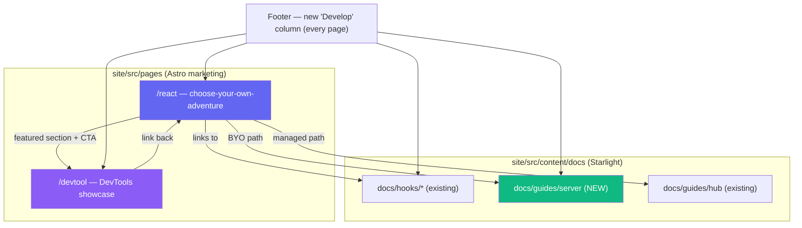
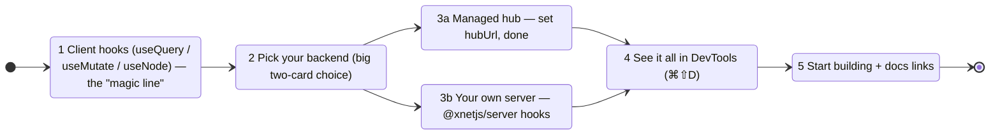
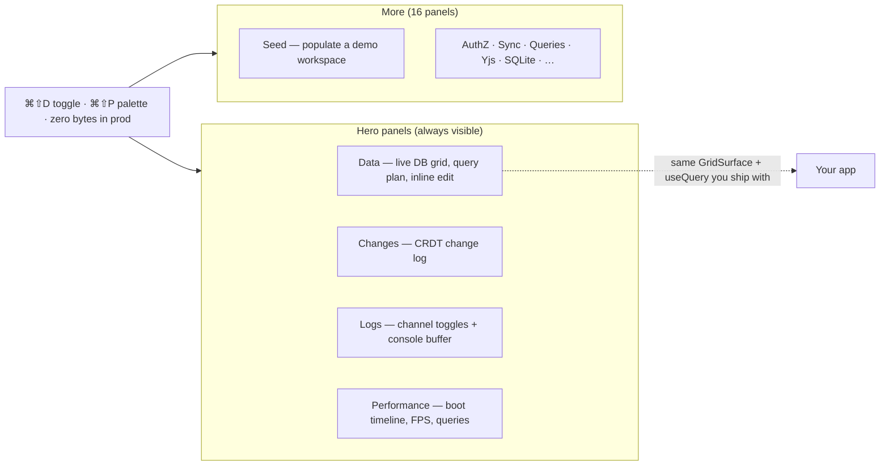

# React Landing Page, DevTools Showcase, and Server Docs

> Status: exploration / proposal. Flip `[_]`→`[x]` once `/react`, `/devtool`,
> the `@xnetjs/server` docs page, and the footer links ship and the site builds.

## Problem Statement

xNet now has a genuinely compelling story for React developers — typed schemas,
live `useQuery`/`useMutate`/`useNode` hooks, an offline-first local cache, a
20‑panel in‑app **DevTools** suite, and (new, exploration
[0223](docs/explorations/0223_[_]_XNET_REACT_WITH_YOUR_OWN_SERVER_AND_AUTH.md))
a `@xnetjs/server` kit that lets a team run the data layer on **their own
backend with their own auth**. But none of that is *discoverable* from the
marketing site. There is no page that says "here is everything a React developer
gets, and here are your two paths to a backend."

The ask, distilled:

1. A **`/react` landing page** — a single, self-contained "choose-your-own-adventure"
   that walks a React dev through the **client hooks** first, then **forks**:
   - **Managed hub** → works out of the box, zero server, and
   - **Bring your own server** → `@xnetjs/server`, with example code and links.
   You should be able to read *just this page* and understand how to get the most
   out of xNet React, with links to deeper docs throughout.
2. A **`/devtool` landing page** — feature-showcase for the in-app DevTools,
   with annotated screenshots of the database browser and other panels (also
   featured as a section on `/react`).
3. **Docs for `@xnetjs/server`** (the package shipped in 0223 has only a README).
4. **Footer links** to all of the above on every page.

## Executive Summary

Everything needed to build these pages already exists in the repo — this is a
**content + light-component** effort, not new infrastructure:

- The Astro site has a clean `Base` layout + reusable `Hero`, `SectionHeader`,
  `CodeBlock`, `Badge`, `Footer`, `Nav` components and a Tailwind dark-first
  design system ([site/src/components/](site/src/components/)).
- The DevTools feature set is real and large (20 panels, ⌘⇧D toggle, command
  palette, Seed) — `packages/devtools/src/panels/panel-registry.ts` is the
  single source of truth for the feature list.
- The hooks and the `@xnetjs/server` kit are shipped and documented enough to
  excerpt.

**Three gaps** to fill: (a) there is **no tab/fork component** on the site yet
(the choose-your-own-adventure needs one — a small Astro+vanilla-JS control,
modeled on the existing `plugins.astro` client-JS pattern); (b) there are **no
DevTools screenshots** anywhere in the repo — they must be captured; (c) the
Starlight docs sidebar (`site/src/sidebar.mjs`) and `llms-full.txt` generation
gate the build, so a new server docs page must be wired there.

**Recommendation:** Build two `.astro` marketing pages (`/react`, `/devtool`)
that reuse the existing component kit, add a tiny reusable **`Tabs`/`Fork`**
component, add a Starlight docs page for `@xnetjs/server` under a new "Your own
server" guide, capture a handful of DevTools screenshots via the existing
preview tooling, and add a **"Develop"** footer column linking `/react`,
`/devtool`, the React hooks docs, and the server guide. Keep marketing copy
code-first and free of adjectives ("no salesy BS" — the strongest finding from
the prior-art research).



## Current State In The Repository

### The site is Astro + Tailwind with a reusable component kit

- **Layout**: [site/src/layouts/Base.astro](site/src/layouts/Base.astro) sets
  `<head>`/SEO from `title`/`description` props and injects the dark-mode CSS
  variables (`--lp-surface`, `--lp-code-bg`, `--lp-code-keyword`, …) and
  copy-button/scroll-animation behavior. It does **not** include Nav/Footer —
  each page imports them.
- **Page pattern** (from [site/src/pages/index.astro](site/src/pages/index.astro)):
  `<Base><Nav /><main>…sections…</main><Footer /></Base>`.
- **Reusable UI** ([site/src/components/ui/](site/src/components/ui/)):
  `CodeBlock.astro` (syntax-highlighted, filename header, macOS chrome, copy
  button), `SectionHeader.astro` (gradient title + subtitle + align),
  `Badge.astro`, `ThemeToggle.astro`. Sections in
  [site/src/components/sections/](site/src/components/sections/) (`Hero`, `Nav`,
  `Footer`, `ForDevelopers`, `Roadmap`, …). Rich page exemplars to mirror:
  [compare.astro](site/src/pages/compare.astro),
  [plugins.astro](site/src/pages/plugins.astro),
  [cloud/index.astro](site/src/pages/cloud/index.astro).
- **No tabs/toggle component exists.** The choose-your-own-adventure fork and
  npm/pnpm/yarn code tabs need a small new component; the client-side filter JS
  in [plugins.astro](site/src/pages/plugins.astro) is the precedent for
  vanilla-JS interactivity.
- **Design tokens**: [site/tailwind.config.mjs](site/tailwind.config.mjs) — dark
  default; accent palette uses indigo (primary), emerald, purple card styles
  (`border-indigo-500/20 bg-indigo-500/[0.03] …`). Mono font JetBrains Mono.

### Footer is shared and link-array driven

[site/src/components/sections/Footer.astro](site/src/components/sections/Footer.astro)
is a 6-column grid (brand + Product / Cloud / Resources / Community) plus a legal
bottom bar, driven by small link arrays at the top of the file. Adding a
**"Develop"** column (or appending to Resources) is a few lines; the footer is
imported on every marketing page.

### Docs are Astro Starlight, gated by the sidebar + llms-full

- Content collection: `site/src/content/docs/docs/*.mdx`
  ([site/src/content.config.ts](site/src/content.config.ts)). Routes at
  `/docs/<slug>/`.
- Nav is **single-sourced** in [site/src/sidebar.mjs](site/src/sidebar.mjs),
  which already has a **"React Hooks"** group (`docs/hooks/overview`,
  `usequery`, `usemutate`, `usenode`, `useidentity`, `patterns`) and a "Guides"
  group (`docs/guides/hub`, `docs/guides/cloud-connect`, `docs/guides/plugins`).
- **Build gotcha** (confirmed in [scripts/build-llms-full.ts](scripts/build-llms-full.ts)):
  every `.mdx` must be listed in `sidebar.mjs` (or explicitly excluded) or the
  build **throws**. `site/package.json` `build` runs
  `validate:* && build:llms && astro build`. `format:check` skips `site/**`.
  The site builds separately from package CI — validate locally with
  `pnpm --filter site build`.

### Images live in `site/public/images` — and there are none of DevTools

Only [site/public/images/workbench-dark.png](site/public/images/workbench-dark.png)
and `workbench-light.png` exist; marketing pages use plain ``
(no `astro:assets`). **No DevTools screenshots or GIFs exist anywhere in the
repo** — they must be captured (the in-app DevTools opens with ⌘⇧D; the Seed
panel can populate a rich demo workspace first).

### DevTools: 20 real panels on the same primitives app devs use

[packages/devtools/src/panels/panel-registry.ts](packages/devtools/src/panels/panel-registry.ts)
is the authoritative feature list. Toggle: **⌘⇧D** (`packages/devtools/src/core/constants.ts`),
command palette **⌘⇧P** ([DevToolsPalette.tsx](packages/devtools/src/panels/CommandPalette/DevToolsPalette.tsx)),
draggable FAB. **Hero panels** (always visible):

- **Data** — live database grid on the real `GridSurface` + `store.query`, query-plan
  inspector, inline editing via `store.update`, sort/filter/density/column-hide,
  schema picker with entity counts, per-cell permissions (lock glyph + auth
  trace). [DataExplorer/](packages/devtools/src/panels/DataExplorer/).
- **Changes** — live CRDT change-log timeline.
  [ChangeTimeline/](packages/devtools/src/panels/ChangeTimeline/).
- **Logs** — channel toggles + captured console ring buffer.
  [LogsPanel/](packages/devtools/src/panels/LogsPanel/).
- **Performance** — boot-timeline waterfall, FPS/heap, storage, active queries.
  [PerformancePanel/](packages/devtools/src/panels/PerformancePanel/).

Plus ~16 secondary panels grouped under "More" (Schemas, Sync, Queries, Traces,
Telemetry, Yjs, AuthZ, Abuse, Security, Version, Migrate, **Seed**, History,
SQLite, Reset). The **Seed** panel
([Seed/](packages/devtools/src/panels/Seed/), [seed/](packages/devtools/src/seed/))
populates a realistic demo workspace (idempotent, two-tier, volume-scalable) —
the perfect "see value in 10 seconds" hook for the landing page. DevTools
**tree-shakes to zero in production** and is built on the **same
`@xnetjs/react` hooks + `GridSurface`** an app dev uses — a strong landing-page
message. Brand name: **"DevTools"**.

### The React hooks + the two backend paths (what `/react` teaches)

- Hooks: [packages/react/src/hooks/](packages/react/src/hooks/) — `useQuery`,
  `useMutate`, `useNode`, `useInfiniteQuery`, `useComments`, `useHistory`,
  `useUndo`, … injected through `XNetProvider`
  ([context.ts](packages/react/src/context.ts)).
- **Managed hub path**: set `hubUrl` on `XNetProvider` (as
  [apps/web/src/App.tsx](apps/web/src/App.tsx) does) → works out of the box.
- **Bring-your-own-server path**: `@xnetjs/server`
  ([packages/server/](packages/server/), README present, no site docs) —
  `createXNetServer({ trust, authenticate, authorizeRead, authorizeWrite })` +
  `createRemoteQueryClient()` dropped into `XNetProvider`'s
  `remoteNodeQueryClient`. This is the page's "fork."

## External Research

A study of ~100 dev-tool landing pages and the leaders in this exact category
(Convex, InstantDB, Zero, tRPC, Supabase, Drizzle, Astro, Liveblocks, Clerk,
Triplit) yields a consistent playbook (full notes + URLs in **References**):

**Section backbone that works:** Nav → Hero (headline + code/visual + dual CTA)
→ trust block → problem→solution → feature grid → "how it works" 3-step →
differentiator → social proof → ecosystem → final CTA. Centered, max-width,
dark-first.

**Patterns most relevant here:**

- **Code above the fold.** Developers bail if they don't see a syntax-highlighted
  snippet within ~1000px. Lead `/react` with the `useQuery` "magic line."
- **Three-pane code** (schema + hook + result) — InstantDB/tRPC — conveys the
  whole model in one visual unit.
- **The fork as a big visual choice, not a tab strip.** Two peer cards ("Managed
  hub — works out of the box" vs "Bring your own server — full control"), both
  visible without scrolling, *after* shared value is established. Then use
  **fine-grained tabs** (npm/pnpm/yarn) within each path. (Clerk/Tailwind do
  per-framework pages; Vite/Docusaurus do in-page tabs — combine: one big fork +
  small code tabs.)
- **Showcasing a devtool:** annotated dark-mode screenshot → short autoplay-muted
  loop video → **tabbed screenshot switcher** (one tab per panel). Liveblocks
  DevTools and TanStack Query Devtools are the reference treatments; a
  before/after ("console.log hell" vs "structured DevTools view") is underused
  and persuasive.
- **"No salesy BS."** The single most consistent finding: drop "powerful",
  "scalable", "supercharge". Every claim is a metric, a code sample, or a named
  outcome.



## Key Findings

1. **It's a content build, not an infra build.** The layout, components, design
   tokens, docs system, and feature substance all exist. The only new *code* is
   a small reusable `Tabs`/`Fork` component and two `.astro` pages.
2. **The fork maps perfectly onto reality.** "Managed hub" = set `hubUrl`; "your
   own server" = `@xnetjs/server`. The page's central UX mirrors the actual
   architecture decision (exploration 0223).
3. **DevTools is undersold and unscreenshotted.** A 20-panel suite built on the
   same hooks, with a one-click Seed demo, that tree-shakes to zero — and zero
   marketing surface. Screenshots are the long pole.
4. **Docs gating is the build risk.** A new server docs page must be added to
   `sidebar.mjs` and pass `build:llms`, validated via `pnpm --filter site build`
   (PR CI may not build the site).
5. **One page must stand alone.** Per the brief, `/react` should teach the whole
   path inline (code samples, both backends, DevTools) and *link* to docs, not
   require reading them.

## Options And Tradeoffs

### A. Where the content lives

| Option | Pros | Cons |
| --- | --- | --- |
| **Marketing `.astro` pages** (`/react`, `/devtool`) | Full design control, code-first hero, screenshots, the fork UX; matches `compare`/`plugins` | Content duplicated from docs (must stay in sync) |
| Pure Starlight docs pages | Single source, sidebar nav, MDX components | Not a "landing page"; weak hero/visual control; doesn't satisfy the brief |
| Hybrid (recommended) | Marketing pages that **link into** docs; docs hold the canonical deep reference | Two surfaces to maintain — mitigated by keeping marketing copy thin + linking |

**Recommendation: Hybrid.** `/react` and `/devtool` are marketing pages; the
canonical depth lives in Starlight (`docs/hooks/*`, new `docs/guides/server`).

### B. Choose-your-own-adventure implementation

| Option | Pros | Cons |
| --- | --- | --- |
| **One big two-card fork + small code tabs** (recommended) | Clear single decision; not overwhelming; proven (Clerk + Vite combined) | Need a tiny JS tabs component |
| Separate `/react/hub` + `/react/byo` pages | SEO per path, no conditional JS | Navigation friction; no in-page comparison; brief wants one page |
| Everything in tabs | Compact | Too many axes (path × package manager) clutters |

### C. DevTools screenshots

| Option | Pros | Cons |
| --- | --- | --- |
| **Capture via existing preview tooling** after Seed (recommended) | Real, current UI; dark-mode; repeatable | Manual capture step; must re-shoot on UI changes |
| Hand-drawn/mocked UI | No app run | Misleading; goes stale; not credible |
| Live embedded DevTools | Highest impact | Heavy; DevTools is dev-only/in-app, not embeddable standalone |

Capture 4–6 PNGs (Data grid, query-plan inspector, Changes timeline,
Performance boot timeline, Seed panel) into `site/public/images/devtools-*.png`;
optionally one short muted loop `.mp4`.

### D. Footer placement

Add a **"Develop"** column (React, DevTools, Hooks docs, Your own server) rather
than overloading "Resources" — it reads as a coherent developer destination and
leaves room to grow (CLI, SDK, plugins-dev).

## Recommendation

Ship, in one PR (or a small sequence):

1. A reusable **`Tabs.astro`** (and a `Fork.astro` two-card block) using the
   `plugins.astro` vanilla-JS pattern + `localStorage` for package-manager tabs.
2. **`/react`** — `site/src/pages/react.astro`: hero with the `useQuery` magic
   line → three-pane code (schema + hook + live result) → "how it works" 3-step
   → **the fork** (Managed hub | Your own server) with per-path code + doc links
   → **DevTools** featured section (screenshots) → feature grid → final CTA.
   Links throughout to `docs/hooks/*`, `docs/guides/hub`, `docs/guides/server`.
3. **`/devtool`** — `site/src/pages/devtool.astro`: hero screenshot →
   tabbed-screenshot panel switcher (Data / Changes / Logs / Performance / Seed)
   → "built on the same hooks, zero bytes in prod" → 3-step enable → before/after
   → CTA back to `/react`.
4. **`docs/guides/server.mdx`** — canonical `@xnetjs/server` reference (trust
   spectrum, the three hooks, `createRemoteQueryClient`, examples), added to
   `sidebar.mjs` "Guides", regenerate `llms-full.txt`.
5. **Footer "Develop" column** on every page.
6. **DevTools screenshots** captured and committed under `site/public/images/`.

Keep copy code-first and adjective-free; render dark by default.

## Example Code

### Footer — new "Develop" column (Footer.astro link arrays)

```astro
---
const developLinks = [
  { label: 'xNet for React', href: '/react' },
  { label: 'DevTools', href: '/devtool' },
  { label: 'React Hooks', href: '/docs/hooks/overview/' },
  { label: 'Your own server', href: '/docs/guides/server/' }
]
---
<div>
  <h4 class="mb-4 text-sm font-semibold">Develop</h4>
  <ul class="space-y-3">
    {developLinks.map((l) => (
      <li><a href={l.href} class="text-sm text-gray-500 hover:text-indigo-500">{l.label}</a></li>
    ))}
  </ul>
</div>
```

### The fork (two peer cards) on `/react`

```astro
<section class="mx-auto grid max-w-4xl gap-6 sm:grid-cols-2">
  <a href="#managed" class="rounded-2xl border border-emerald-500/20 bg-emerald-500/[0.03] p-6">
    <h3 class="text-lg font-semibold">Managed hub</h3>
    <p class="mt-2 text-sm text-gray-500">Set one <code>hubUrl</code>. Sync, presence,
      and storage just work — no server to run.</p>
    <span class="mt-4 inline-block text-sm text-emerald-500">Quickstart →</span>
  </a>
  <a href="#byo" class="rounded-2xl border border-indigo-500/20 bg-indigo-500/[0.03] p-6">
    <h3 class="text-lg font-semibold">Bring your own server</h3>
    <p class="mt-2 text-sm text-gray-500">Run <code>@xnetjs/server</code> in your
      Node backend with your own auth and database.</p>
    <span class="mt-4 inline-block text-sm text-indigo-500">See the setup →</span>
  </a>
</section>
```

### Your-own-server path snippet (mirrors `@xnetjs/server` README / 0223)

```ts
// server: your Node backend
const xnet = await createXNetServer({
  trust: 'custodial',
  authenticate: (token) => verifyMySession(token),       // your auth, no DID
  authorizeRead: (ctx, q) => q.and({ tenant: ctx.tenant }),
  authorizeWrite: (ctx, w) => {
    const tenant = w.op === 'create' ? w.payload.properties.tenant : w.existing?.properties.tenant
    return tenant === ctx.tenant ? { ok: true } : { ok: false, reason: 'wrong tenant' }
  }
})

// client: same React hooks, pointed at your server
<XNetProvider config={{ remoteNodeQueryClient: xnet.createRemoteQueryClient(getToken) }}>
  <App />
</XNetProvider>
```

### DevTools panel map (for the `/devtool` switcher copy)



## Risks And Open Questions

- **Screenshot freshness.** DevTools UI evolves; screenshots go stale. Mitigate:
  store a short capture runbook in the PR and prefer a small set of stable views.
  Could a future visual-capture job auto-refresh them?
- **Docs/marketing drift.** Code samples on `/react` duplicate the README/docs.
  Keep marketing snippets minimal and link to the canonical docs page.
- **Build gating.** Forgetting `sidebar.mjs` / `build:llms` breaks the site build
  (not caught by package CI). Always validate `pnpm --filter site build`.
- **Tabs component scope.** Keep it tiny (vanilla JS + `localStorage`); don't pull
  in a framework. Ensure it degrades without JS (show the default tab).
- **"One page stands alone" vs length.** Risk of an overlong page. Use
  progressive disclosure: magic line → 3-step → fork → DevTools → CTA; push
  exhaustive detail to docs.
- **Naming.** Page is `/devtool` (singular, per the brief) though the product is
  "DevTools" — keep the URL `/devtool` but title it "DevTools".
- **Mobile.** The two-card fork must stack; tabbed screenshots must scroll.

## Implementation Checklist

- [x] Add `site/src/components/ui/Tabs.astro` (package-manager + generic tabs;
      `localStorage`-persisted; no-JS fallback to first tab).
- [x] Add a `Fork`/two-card block (inline in `react.astro` or a small component).
- [x] Build `site/src/pages/react.astro` — hero magic line, three-pane code,
      3-step "how it works", the fork (Managed hub | Your own server) with
      per-path code, DevTools featured section, feature grid, final CTA; link to
      `docs/hooks/*`, `docs/guides/hub`, `docs/guides/server` throughout.
- [x] Build `site/src/pages/devtool.astro` — hero screenshot, tabbed panel
      switcher (Data/Changes/Logs/Performance/Seed), "same hooks / zero prod
      bytes", 3-step enable, before/after, CTA to `/react`.
- [ ] Capture DevTools screenshots (run app → Seed → ⌘⇧D) into
      `site/public/images/devtools-*.png` (Data grid, query plan, Changes,
      Performance, Seed); optional muted loop video.
- [x] Write `site/src/content/docs/docs/guides/server.mdx` (`@xnetjs/server`:
      trust spectrum, authenticate/authorizeRead/authorizeWrite,
      `createRemoteQueryClient`, examples) and add it to `site/src/sidebar.mjs`
      "Guides"; regenerate `llms-full.txt` (`pnpm --filter site build:llms`).
- [x] Cross-link: add a "Your own server" link from `docs/guides/hub` and the
      hooks overview; ensure `docs/hooks/*` exist (or create stubs) for the
      `/react` deep links.
- [x] Add a **"Develop"** column to
      [Footer.astro](site/src/components/sections/Footer.astro) linking `/react`,
      `/devtool`, hooks docs, server guide.
- [x] Add `/react` and `/devtool` to `Nav.astro` (or a "Developers" dropdown) if
      appropriate.

## Validation Checklist

- [x] `pnpm --filter site build` succeeds (sidebar + `build:llms` + `astro
      build`) with the new pages and docs.
- [x] `/react` shows a syntax-highlighted hook snippet above the fold; the fork's
      two cards are both visible without scrolling on desktop and stack on mobile.
- [x] Package-manager tabs switch all snippets and persist across reload.
- [x] Both backend paths render correct, copy-pasteable code; "managed" links to
      `docs/guides/hub`, "BYO" links to `docs/guides/server`.
- [x] `/devtool` panel switcher shows each screenshot; images load (`/images/…`),
      lazy-loaded below the fold; dark mode looks correct.
- [x] Footer "Develop" links resolve on every page; no broken internal links.
- [x] `docs/guides/server` renders at `/docs/guides/server/` and appears in the
      sidebar; `llms-full.txt` includes it.
- [ ] Lighthouse/CWV sane (no heavy client JS; screenshots optimized).
- [x] Copy contains no marketing adjectives; every claim is code, a metric, or a
      named capability.

## References

### Internal (code)

- Site: [Base.astro](site/src/layouts/Base.astro),
  [index.astro](site/src/pages/index.astro),
  [compare.astro](site/src/pages/compare.astro),
  [plugins.astro](site/src/pages/plugins.astro),
  [cloud/index.astro](site/src/pages/cloud/index.astro)
- Components: [ui/CodeBlock.astro](site/src/components/ui/CodeBlock.astro),
  [ui/SectionHeader.astro](site/src/components/ui/SectionHeader.astro),
  [sections/Hero.astro](site/src/components/sections/Hero.astro),
  [sections/Footer.astro](site/src/components/sections/Footer.astro),
  [tailwind.config.mjs](site/tailwind.config.mjs)
- Docs: [sidebar.mjs](site/src/sidebar.mjs),
  [content.config.ts](site/src/content.config.ts),
  [scripts/build-llms-full.ts](scripts/build-llms-full.ts)
- DevTools: [panel-registry.ts](packages/devtools/src/panels/panel-registry.ts),
  [DataExplorer/](packages/devtools/src/panels/DataExplorer/),
  [Seed/](packages/devtools/src/panels/Seed/),
  [provider/DevToolsProvider.tsx](packages/devtools/src/provider/DevToolsProvider.tsx),
  [core/constants.ts](packages/devtools/src/core/constants.ts)
- React + server: [react/src/hooks/](packages/react/src/hooks/),
  [react/src/context.ts](packages/react/src/context.ts),
  [packages/server/](packages/server/),
  [0223 exploration](docs/explorations/0223_[_]_XNET_REACT_WITH_YOUR_OWN_SERVER_AND_AUTH.md)

### External (landing-page prior art)

- Evil Martians — 100 dev-tool landing pages (2025): https://evilmartians.com/chronicles/we-studied-100-devtool-landing-pages-here-is-what-actually-works-in-2025
- daily.dev — developer-first landing pages: https://business.daily.dev/resources/create-developer-first-landing-pages-convert/
- Convex: https://convex.dev/ · InstantDB: https://www.instantdb.com/ · Zero: https://zero.rocicorp.dev/ · tRPC: https://trpc.io/
- Supabase: https://supabase.com/ · Astro: https://astro.build/ · Drizzle: https://orm.drizzle.team/ · Prisma: https://prisma.io/
- Liveblocks DevTools: https://liveblocks.io/devtools · Clerk framework guides: https://clerk.com/docs · Vite guide: https://vite.dev/guide/
- Docusaurus npm2yarn: https://www.npmjs.com/package/@docusaurus/remark-plugin-npm2yarn
