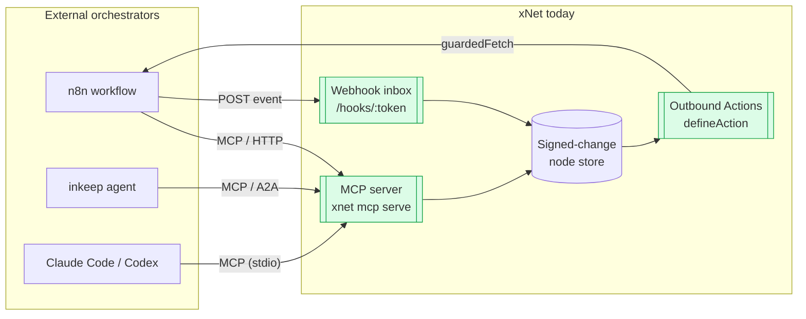
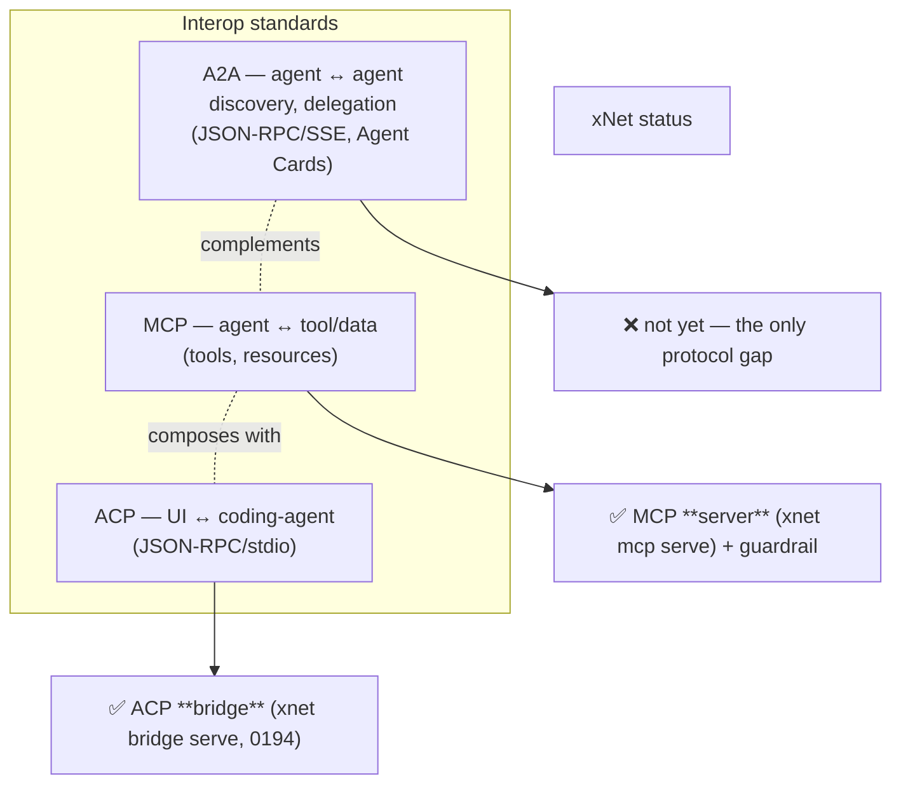
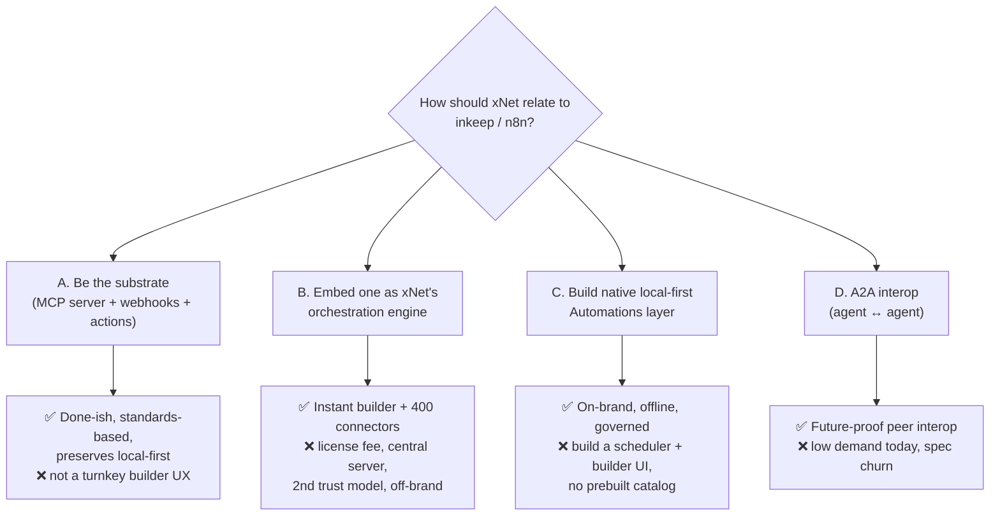
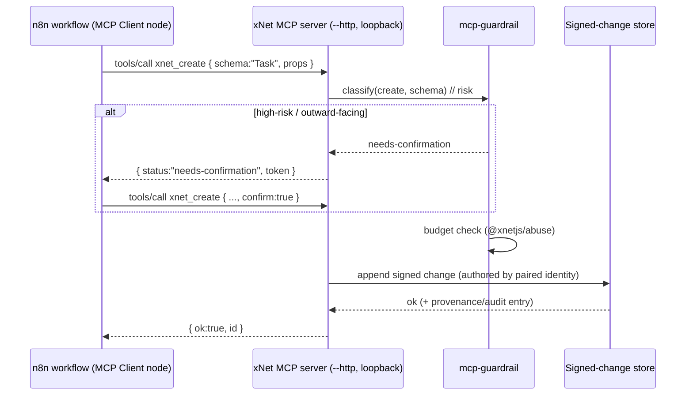

# Integrating With Agent & Workflow Platforms (Inkeep Agents, n8n)

> Status: exploration / recommendation. Should xNet integrate with an
> external agent-orchestration or workflow-automation platform such as
> [`inkeep/agents`](https://github.com/inkeep/agents) or
> [`n8n`](https://github.com/n8n-io/n8n)?

## Problem Statement

Two well-known open-source projects keep coming up as "things xNet could plug
into":

- **`inkeep/agents`** — a TypeScript framework for building **multi-agent AI
  systems** (chat assistants + workflow automation) with a visual builder that
  2-way-syncs to code, MCP tools, and the A2A (agent-to-agent) protocol.
- **`n8n`** — a **workflow-automation / iPaaS** platform: 400+ integration
  "nodes", visual flow builder, triggers/executions, REST API, webhooks, custom
  nodes, and native AI/LangChain nodes.

Both are tempting because xNet has spent the last several explorations building
exactly the primitives these platforms orchestrate — inbound webhooks, outbound
actions, pull connectors, agent tools, and an MCP server. The real question is
**what kind of integration**, if any, actually advances xNet, given that:

1. xNet is **local-first / signed-change / capability-governed**, while both
   platforms are **centralized server orchestrators**; and
2. both ship under **fair-code / source-available licenses** that restrict
   embedding them inside a commercial product (xNet Cloud, the marketplace).

This doc maps the seams that already exist, surveys the two platforms and the
2025 agent-protocol landscape (MCP / A2A / ACP), lays out the options, and
recommends a path.

## Executive Summary

**Recommendation: don't embed n8n or inkeep. Lean into the substrate role you
already occupy, and grow one thin native layer.** Concretely:

- **Primary (mostly done — finish & document it): be the governed
  tool/data substrate any orchestrator drives.** xNet already exposes its
  workspace as an **MCP server** (`xnet mcp serve`,
  [`packages/cli/src/commands/mcp.ts`](packages/cli/src/commands/mcp.ts);
  `createMCPServer` / `createMcpHttpServer`) with a write **guardrail**
  ([`packages/plugins/src/services/mcp-guardrail.ts`](packages/plugins/src/services/mcp-guardrail.ts)),
  plus inbound **webhooks** and outbound **Actions**. An inkeep agent or an n8n
  workflow can reach into an xNet workspace **today** over MCP/HTTP — no new
  dependency, preserves local-first and the trust model. This is the highest-ROI
  "integration."
- **Secondary (build, medium effort): a thin, native, local-first
  "Automations" layer.** A first-party `Automation`/`Workflow` schema + a
  Canvas-based visual builder that *composes the primitives xNet already has*
  (triggers = schema-change / schedule / webhook; steps = Actions / Connectors /
  AgentTools / MCP calls). This delivers the n8n-shaped *experience* while
  staying signed-change, capability-scoped, and offline-capable. The one real
  missing primitive is a **scheduler / job-runner** that actually fires
  `schedule` triggers and due connectors.
- **Tertiary (cheap, optional): ship reference adapters as distribution.** A
  published **n8n community node** ("xNet") and a copy-paste **inkeep MCP tool
  config**, so users of those platforms can wire xNet in one step. Stub **A2A**
  for future agent-to-agent interop.
- **Explicitly avoid: embedding n8n or inkeep as xNet's orchestration engine.**
  It pulls in a centralized server, an enterprise license fee, and a second,
  competing capability/trust model — for an experience you can deliver natively.



## Current State In The Repository

xNet has, over explorations 0061 / 0175 / 0194 / 0196 / 0213, already built most
of the surface area an "integration with n8n/inkeep" would target. The relevant
seams:

### 1. xNet is already an MCP **server** (the agent↔tool layer)

This is the single most important fact for this question.

- [`packages/cli/src/commands/mcp.ts`](packages/cli/src/commands/mcp.ts) —
  `xnet mcp serve` exposes the workspace to **any MCP client** (Claude Code,
  Codex, OpenClaw, Cline, Goose, …) over two transports: **stdio** (default,
  process-isolated) and **`--http`** (hardened loopback: pairing token + Origin
  allowlist). Builds `createMCPServer` / `createMcpHttpServer` (exported from
  `@xnetjs/plugins/node`). Writes route through the same local API
  (`createRemoteAgentBackend`, `http://127.0.0.1:31415`) and AI surface as the
  in-app assistant.
- [`packages/plugins/src/services/mcp-guardrail.ts`](packages/plugins/src/services/mcp-guardrail.ts)
  (exploration 0175, "boundary hardening") — the **write guardrail** that makes
  an autonomous agent safe to point at a workspace: **risk classification**
  (deletes / outward-facing creates = `high`), **confirmation gates**
  (`needs-confirmation` until `confirm: true`), **cost budgets** (`@xnetjs/abuse`
  per-surface), and **provenance + audit** of applied writes. This runs at the
  boundary, *independent of the client's own (often weak) safety model*.
- 20+ `xnet_*` tools (`xnet_query`, `xnet_get`, `xnet_create`, `xnet_update`,
  `xnet_delete`, page/database/canvas tools) defined via the AI surface
  ([`packages/plugins/src/ai-surface/service.ts`](packages/plugins/src/ai-surface/service.ts)).

**Implication:** "integrate with inkeep/n8n" partly already *is true* — those
platforms are MCP clients, and xNet is an MCP server with a governance layer
neither of them has.

### 2. The agent bridge (the UI↔agent layer, ACP)

- [`packages/cli/src/commands/bridge.ts`](packages/cli/src/commands/bridge.ts) +
  `@xnetjs/devkit` — `xnet bridge serve` (exploration
  [0194](<docs/explorations/0194_[_]_AGENT_BRIDGE_CLAUDE_CODE_CODEX_AND_ANY_AGENT_IN_XNET.md>))
  drives the user's **own** installed coding-agent CLI (`claude`, `codex`,
  OpenCode, …) as the model, via **ACP (Agent Client Protocol)**, handing that
  agent xNet's MCP tool server. xNet's chat panel probes `:31416/health` to
  light up the `bridge` tier. This is precisely the "orchestrate an agent that
  edits the workspace" pattern — already designed, ToS-safe (spawn the CLI, never
  reuse the OAuth token).

### 3. Inbound: webhooks (external event → node)

- [`packages/hub/src/features/webhook-inbox.ts`](packages/hub/src/features/webhook-inbox.ts)
  — generic `POST /hooks/:token` inbox; token is a revocable credential routing
  to a `{ space, schema?, label }`.
- [`packages/hub/src/features/webhook-integrations.ts`](packages/hub/src/features/webhook-integrations.ts)
  + [`webhook-verify.ts`](packages/hub/src/features/webhook-verify.ts) +
  [`idempotency.ts`](packages/hub/src/features/idempotency.ts) — signed Stripe /
  Sentry / PagerDuty / GitHub webhooks with signature verification and LRU
  dedup, mounted declaratively
  ([`webhooks.ts`](packages/hub/src/features/webhooks.ts),
  [`registry.ts`](packages/hub/src/features/registry.ts)).
- **Architectural constraint:** the hub **RELAYS** changes; it does not
  **ORIGINATE** them. Webhooks normalize payloads (pure function) into
  `ExternalItem` actions; an `apply?()` seam exists but the hub is not an
  authoritative writer. Anything writing into xNet must go through a signing
  identity (the app, the `@xnetjs/server` BYO kit, or the MCP server's local API).

### 4. Outbound: Actions (node change / schedule → external call)

- [`packages/plugins/src/actions/define-action.ts`](packages/plugins/src/actions/define-action.ts)
  — `defineAction` with `trigger: { kind: 'schema-change' | 'schedule' | 'manual' }`,
  a capability-declared `network` allowlist, and `dispatch(event, ctx)` where
  `ctx.fetch` is **SSRF-guarded**
  ([`actions/ssrf.ts`](packages/plugins/src/actions/ssrf.ts)). Built-ins
  (Discord/Slack/Telegram/email/webhook-out) in
  [`builtins.ts`](packages/plugins/src/actions/builtins.ts);
  `shouldDispatch()` in
  [`runner.ts`](packages/plugins/src/actions/runner.ts).

### 5. Pull connectors (external source → governed nodes)

- [`packages/plugins/src/connectors/define-connector.ts`](packages/plugins/src/connectors/define-connector.ts)
  + [`api-connectors.ts`](packages/plugins/src/connectors/api-connectors.ts) +
  [`rss.ts`](packages/plugins/src/connectors/rss.ts) — RSS / GitHub / Notion /
  Airtable / Linear pull connectors with `cadence: 'manual' | 'hourly' | 'daily'
  | { everyMs }`, a guarded `store` (writes limited to declared `schemaWrite`
  IRIs), and SSRF-guarded `fetch`. Schemas: `Feed`, `FeedItem`, `ExternalItem`.

### 6. The gap: **no scheduler / workflow state machine**

`cadence` and `{ kind: 'schedule' }` are *declared*, but a grep finds **no
cron/job-runner** that actually fires due connectors or schedule-triggered
actions (the `setInterval`s in the hub are for telemetry, sessions, awareness,
and index shards — not automation). There is **no** workflow node type, **no**
declarative rule engine, **no** multi-step state machine, and **no** run/audit
ledger for "this automation fired, here's the outcome." This is the concrete hole
a native Automations layer (Option C) would fill.

### 7. Other relevant pieces

- **Agent tools as the universal step interface**:
  [`packages/plugins/src/agent-tools.ts`](packages/plugins/src/agent-tools.ts)
  (`AgentToolContribution`: `name` / `description` / `inputSchema` / `invoke`) —
  MCP-shaped; a plugin's commands become both AI tools and potential workflow
  steps.
- **Capability + consent governance**:
  [`ecosystem/consent.ts`](packages/plugins/src/ecosystem/consent.ts),
  `network`/`schemaWrite` capabilities, AI scopes (`workspace.read`,
  `database.write.rows`, `network.fetch`, …).
- **BYO-backend server kit**:
  [`packages/server/src/server.ts`](packages/server/src/server.ts)
  (`createXNetServer`, trust spectrum `custodial`/`server`/`signed`) — the
  sanctioned authoritative-write path for a centralized integration.
- **GraphRAG brain**:
  [`packages/brain/src/index.ts`](packages/brain/src/index.ts) — retrieval an
  agent step could call.
- **Canvas** ([`@xnetjs/canvas`](packages/canvas)) — a node-and-edge visual
  surface that **already exists** and is the obvious substrate for a native flow
  builder.

## External Research

### inkeep/agents

| Aspect | Detail |
| --- | --- |
| What | TS framework to build **multi-agent** systems: real-time chat assistants **and** workflow automation. |
| Build modes | **Visual builder ↔ TypeScript SDK**, 2-way synced (single source of truth). |
| Components | `agents-api` (Run + Manage API), `agents-manage-ui` (visual builder), `agents-sdk`, `agents-cli` (`inkeep push`/`pull`), `agents-ui` (embeddable React chat). |
| Concepts | Agents, **sub-agents** (composable), Tools via **MCP** with credential management, **graphs**. |
| Standards | **MCP** (tools) + **A2A** (agent-to-agent) + Vercel AI SDK; OpenTelemetry traces. |
| License | **Elastic License 2.0 (ELv2)** + supplemental terms — source-available "fair-code", restricts offering it as a competing managed service. |
| Deploy | Self-host (Docker / Vercel) with your own LLM provider. |

inkeep is an **agent framework**, not an iPaaS — its center of gravity is "an
LLM that reasons and calls tools", with MCP/A2A as the wire. It overlaps xNet's
*AiSurfaceService + agent bridge*, not its data layer.

### n8n

| Aspect | Detail |
| --- | --- |
| What | **Workflow automation / iPaaS**: visual node graph, triggers→executions, 400+ integrations. |
| Stack | Node.js/TS + Vue; node-based; REST API, webhooks, **custom nodes** (npm), self-host (Docker/npx). |
| AI | Native **AI / LangChain** nodes; "AI Agent" node. |
| License | **Sustainable Use License** (fair-code): self-host & view source OK; **white-label / embed in a commercial product is NOT permitted**. |
| Embed | Commercial embedding requires the paid **n8n Embed / Enterprise license** — `license@n8n.io`, "contact us", widely reported around **~$50k/yr** (varies by volume). |

n8n is a **general automation** engine. It overlaps xNet's *Actions / Connectors
/ Webhooks*, plus a visual flow builder and a huge prebuilt connector catalog xNet
doesn't have.

### The 2025 agent-protocol landscape

Three complementary standards, and xNet already implements two:



- **MCP** (Model Context Protocol): agent → tools/data. **xNet = server, done.**
- **A2A** (Agent-to-Agent, Google, Apr 2025): agents discover & delegate to each
  other (HTTP/SSE/JSON-RPC, "Agent Cards"). Complements MCP. **xNet gap** — this
  is what inkeep uses to compose agents.
- **ACP** (Agent Client Protocol): editor/UI → coding agent. **xNet = bridge,
  designed (0194).**

The strategic read: the industry standardized the *wires*, and xNet already
speaks the two that matter for "be reachable by an orchestrator." That makes
**deep, product-level coupling to any single orchestrator unnecessary** — you
integrate with the protocol, not the product.

## Key Findings

1. **xNet is already integrated with this category — via standards.** Any MCP
   client (inkeep, increasingly n8n, Claude Code) can drive an xNet workspace
   *today* through `xnet mcp serve`, with a governance layer (risk/confirm/budget/
   audit) that the orchestrators themselves lack. "Should we integrate?" is
   largely "should we *deepen and document* what's already there?" — yes.

2. **The licenses make embedding the wrong move.** n8n's Sustainable Use License
   forbids white-labeling/embedding in a commercial product without the paid
   Embed license (~$50k/yr reported). inkeep's ELv2 restricts competing managed
   services. xNet *is* building a commercial product (Cloud, marketplace), so
   embedding either creates licensing exposure for a feature xNet can build
   natively.

3. **Architectural impedance mismatch.** Both platforms assume a **central server
   that owns state and originates writes**. xNet is **local-first, signed-change,
   capability-governed**, and its **hub relays but does not originate** changes.
   Bolting a central orchestrator on as the brain inverts xNet's whole model;
   reaching *into* xNet over MCP/webhooks does not.

4. **The category's hard 80% is the catalog, not the engine.** n8n's moat is
   400+ maintained connectors. A workflow *engine* over xNet's existing Action/
   Connector/AgentTool/MCP primitives is a few weeks of work; matching n8n's
   catalog is years. So if xNet wants the *experience*, build the engine natively
   and let the **MCP bridge** borrow n8n's/inkeep's catalogs when a user already
   has them.

5. **One genuine primitive is missing: a scheduler.** `schedule`/`cadence` are
   declared but nothing fires them. This is the smallest, highest-leverage thing
   to build — it unlocks both native automations *and* honest "n8n-like" demos.

6. **A2A is the only protocol gap**, and it's optional/forward-looking — it would
   let an xNet agent delegate to an inkeep agent (and vice versa) as peers.

## Options And Tradeoffs



### Option A — Be the governed substrate (deepen what exists)

Make "drive xNet from your orchestrator" a first-class, documented capability:
publish the MCP server config, harden the `--http` transport, and ship reference
recipes for inkeep and n8n.

- **Pros:** ~80% already built; standards-based (no product lock-in); keeps
  xNet's governance/trust as the differentiator; zero new runtime deps; preserves
  local-first.
- **Cons:** doesn't give *xNet users* an in-app visual automation experience —
  it serves users who *already* run an orchestrator.
- **Effort:** Low (mostly docs + a hardening pass + adapters).

### Option B — Embed n8n or inkeep as xNet's engine

Bundle n8n (or inkeep) so users get a visual builder + connector catalog inside
xNet.

- **Pros:** instant mature builder UX; n8n's 400+ connectors; inkeep's
  multi-agent graphs.
- **Cons:** **license cost/exposure** (n8n Embed ~$50k/yr; ELv2 restrictions); a
  **centralized server** dependency that contradicts local-first; a **second
  capability/permission model** to reconcile with xNet's consent/trust system; an
  ops + security surface (it runs arbitrary nodes/credentials); brand dissonance
  ("your data, local-first" + "now run this central automation server").
- **Effort:** High (embed license negotiation, deploy, SSO, reconcile trust),
  and it *fights* the architecture.
- **Verdict:** **Not recommended.**

### Option C — Native, local-first "Automations" layer

A first-party `Automation` schema (+ optional `AutomationRun` ledger) and a
**Canvas-based** visual builder, composing existing primitives:

- **Triggers:** `schema-change` (existing), `webhook` (existing inbox),
  `schedule` (needs the new scheduler), `manual`.
- **Steps:** existing **Actions** (outbound), **Connectors** (pull),
  **AgentTools / MCP calls** (incl. external MCP servers), **brain.retrieve**,
  and store reads/writes through the guardrail.
- **Engine:** a small interpreter that walks the step graph, persists run state
  as signed changes, and honors capability/consent + the mcp-guardrail.

- **Pros:** on-brand (signed-change, offline-capable, capability-scoped, audited
  by construction); reuses Canvas, Actions, Connectors, AgentTools, the
  guardrail, and `@xnetjs/server`; no license/runtime baggage; differentiated
  ("automations your data owns, not a SaaS owns").
- **Cons:** must build a **scheduler/job-runner**, a **step interpreter + run
  ledger**, and **builder UI**; starts with xNet's small connector set (mitigated
  by the MCP step type, which can call *any* MCP server — including n8n/inkeep).
- **Effort:** Medium. The scheduler + interpreter is the bulk; the UI can ride on
  Canvas.

### Option D — A2A interop

Expose an A2A "Agent Card" for xNet's assistant and let it delegate to / be
called by external agents (inkeep, others).

- **Pros:** future-proof peer interoperability; complements MCP; positions xNet
  in the multi-agent ecosystem.
- **Cons:** demand is still nascent in mid-2026; spec/security still maturing;
  lower near-term user value than A or C.
- **Effort:** Low-Medium for a stub; defer the deep version.

### Side-by-side

| Dimension | A. Substrate | B. Embed n8n/inkeep | C. Native layer | D. A2A |
| --- | --- | --- | --- | --- |
| Fits local-first / trust model | ✅ strong | ❌ inverts it | ✅ strong | ✅ good |
| License exposure | ✅ none | ❌ paid embed / ELv2 | ✅ none | ✅ none |
| In-app builder UX for xNet users | ❌ no | ✅ yes | ✅ yes | ➖ n/a |
| Prebuilt connector catalog | ➖ via client | ✅ 400+ | ➖ small + MCP bridge | ➖ n/a |
| Net-new build effort | Low | High | Medium | Low |
| Already mostly built | ✅ yes | ❌ no | ➖ primitives yes | ❌ no |

## Recommendation

**Pursue A + C, ship D as a stub, and decline B.**

1. **A (now, low cost): formalize the substrate.** Treat "any orchestrator can
   drive xNet over MCP" as a shipped, documented feature. Harden the `--http`
   transport, write `docs/guides/` for "Use xNet from n8n" and "Use xNet from an
   inkeep agent", and publish two reference adapters (a community n8n node and an
   inkeep MCP tool config). This converts an *implementation detail* into a
   *distribution channel* and costs almost nothing.

2. **C (next, medium cost): build the native Automations MVP.** The unlock is the
   **scheduler**. Sequence:
   (a) a hub/runtime **job-runner** that fires due connectors and
   `schedule`-triggered actions; (b) an `Automation` schema + a minimal step
   interpreter (trigger → steps, each step an Action/Connector/AgentTool/MCP
   call) writing run state as signed changes through the guardrail; (c) a
   Canvas-based builder. Ship "when a row changes / on a schedule / on a webhook →
   call an action / agent tool" first; grow step types over time. **Crucially,
   include an MCP-call step type** so an xNet automation can invoke n8n, inkeep,
   or any MCP server — you get the catalog without the embed.

3. **D (later, cheap stub): expose an A2A Agent Card** for xNet's assistant so it
   can be discovered/delegated-to. Defer the full implementation until demand is
   real.

4. **B: do not embed.** Revisit only if a specific enterprise customer
   contractually needs n8n parity *and* funds the Embed license — and even then,
   prefer wiring their n8n to xNet over MCP (Option A) over bundling it.

The throughline: **integrate with the protocols (MCP, later A2A), not the
products.** xNet's edge is governed, local-first, signed-change automation — a
property neither n8n nor inkeep can offer. Borrow their *reach* over MCP; don't
inherit their *architecture*.

## Example Code

### How an n8n workflow writes into xNet *today* (Option A, via the MCP server)



### Sketch of a native `Automation` node (Option C)

```ts
// packages/data/src/schema/schemas/automation.ts  (new)
export const Automation = defineSchema({
  '@id': 'xnet://xnet.fyi/Automation@1.0.0',
  properties: {
    name: { type: 'string' },
    enabled: { type: 'boolean', default: true },
    trigger: {
      type: 'object', // discriminated union
      // { kind:'schema-change', schemas:[...] }
      // | { kind:'schedule', cadence:'hourly'|'daily'|{everyMs} }
      // | { kind:'webhook', token } | { kind:'manual' }
    },
    steps: {
      type: 'array', // ordered; each step references a capability
      // { id, use:'action'|'connector'|'agentTool'|'mcp'|'retrieve',
      //   ref, input, // ref = action/tool id or MCP {server,tool}
      //   onError:'stop'|'continue' }
    },
  },
})

// A step that calls ANY external MCP server — borrow n8n/inkeep's catalog
// without embedding them:
type McpStep = {
  use: 'mcp'
  ref: { server: string; tool: string } // e.g. n8n's MCP trigger, an inkeep tool
  input: Record<string, unknown>
}
```

```ts
// packages/automations/src/scheduler.ts  (new — the missing primitive)
// Fires due connectors + schedule-triggered actions/automations.
export function startScheduler(deps: SchedulerDeps): Disposable {
  const timer = setInterval(async () => {
    const due = await deps.listDue(deps.now()) // automations + connectors past next-run
    for (const job of due) {
      await deps.run(job) // walks steps via the interpreter, through mcp-guardrail
      await deps.recordRun(job) // signed AutomationRun change → audit/ledger
    }
  }, deps.tickMs)
  return { dispose: () => clearInterval(timer) }
}
```

## Risks And Open Questions

- **Where does the scheduler run?** The hub is the natural home, but the hub
  *relays, doesn't originate* changes — a scheduler that writes must hold a
  signing identity (a service DID) or drive the `@xnetjs/server` write path.
  Alternatively the scheduler runs in the local app (offline-friendly, but only
  while a client is open). **Open question:** hub-side service identity vs
  client-side runner vs both (tiered like connectors today).
- **Loop / runaway safety.** Automations that trigger on `schema-change` and also
  *write* can loop. Need cycle detection, per-automation budgets (`@xnetjs/abuse`
  already exists), and a kill switch.
- **MCP step trust.** An `mcp` step can call arbitrary external servers — must go
  through `network` capability + consent, and surface which server/tool an
  automation touches (consent UI already exists for connectors/actions).
- **Catalog gap.** Even with the MCP bridge, xNet's native connector count is
  small. Is "call your existing n8n over MCP" an acceptable bridge, or will users
  expect a built-in catalog? (Lean on the marketplace + community connectors.)
- **A2A maturity/security.** The spec and its threat model are still settling in
  2026; don't over-invest before it stabilizes.
- **Scope creep into iPaaS.** A native automation layer can balloon. Keep MVP
  ruthlessly narrow (one trigger family + a handful of step types) and let MCP
  cover the long tail.
- **Does this even need a separate engine, given the agent bridge?** For many
  "automations," an LLM agent (0194 bridge) calling tools may suffice. Open
  question: deterministic workflow engine vs. agentic loop — likely both, for
  different reliability/cost profiles.

## Implementation Checklist

**Option A — substrate (do first):**

- [ ] Harden + document the MCP `--http` transport for non-loopback orchestrator
      use (auth, Origin allowlist, rate limits) in
      [`packages/cli/src/commands/mcp.ts`](packages/cli/src/commands/mcp.ts).
- [ ] Write `docs/guides/automate-with-mcp.mdx`: "Drive xNet from n8n" and "Use
      xNet as a tool in an inkeep agent" (config snippets, auth, guardrail
      behavior). Add to `site` sidebar + regen `build:llms`.
- [ ] Publish a reference **n8n community node** (`n8n-nodes-xnet`) wrapping the
      MCP/HTTP surface (separate repo or `examples/`).
- [ ] Publish a reference **inkeep MCP tool config** for the xNet MCP server.
- [ ] Add a webhook recipe: n8n/inkeep → `POST /hooks/:token` →
      `ExternalItem`.

**Option C — native Automations MVP:**

- [ ] Add `Automation` (+ `AutomationRun`) schema; register in the 3 places +
      barrel; add a Tier-1 dev-tools seeder.
- [ ] Build the **scheduler / job-runner** (`packages/automations` or hub
      feature) that fires due connectors + `schedule` triggers; decide identity
      model (service DID vs client runner).
- [ ] Build the **step interpreter**: trigger → steps over Action / Connector /
      AgentTool / **MCP** / `brain.retrieve`, each gated by capability + consent +
      `mcp-guardrail`, writing run state as signed changes.
- [ ] Add cycle detection + per-automation budget + enable/disable kill switch.
- [ ] Build the **Canvas-based builder** UI (reuse `@xnetjs/canvas`); list/runs
      view in the app.
- [ ] Changeset(s) for any publishable package touched; changelog fragment.

**Option D — A2A stub (later):**

- [ ] Expose an A2A Agent Card for xNet's assistant (discovery only).
- [ ] Prototype delegating one task to an external A2A agent and back.

## Validation Checklist

- [ ] An n8n workflow (self-hosted) creates and updates an xNet node via the MCP
      server, and the guardrail's confirm/budget/audit path is exercised
      (high-risk write returns `needs-confirmation`, audit entry recorded).
- [ ] An inkeep agent lists and calls xNet `xnet_*` tools using only the published
      config.
- [ ] A native `Automation` with a `schema-change` trigger fires and runs its
      steps; the run is recorded as a signed `AutomationRun` (visible in
      dev-tools Data panel).
- [ ] A `schedule` trigger fires on cadence via the new scheduler (verified with a
      short `everyMs` in a test), and is idempotent / doesn't double-fire.
- [ ] An `mcp`-step automation successfully calls an external MCP server (e.g. a
      local n8n MCP endpoint) under a `network` capability + consent prompt.
- [ ] Loop guard: an automation that writes the schema it triggers on is stopped
      by cycle detection / budget, not left running unbounded.
- [ ] `seed-coverage` / `seed-render` tests pass with the new schema; typecheck +
      lint + format green; no centralized-server runtime dependency introduced.

## References

**Repo (current seams):**

- MCP server: [`packages/cli/src/commands/mcp.ts`](packages/cli/src/commands/mcp.ts)
- MCP guardrail: [`packages/plugins/src/services/mcp-guardrail.ts`](packages/plugins/src/services/mcp-guardrail.ts)
- Agent bridge (ACP): [`packages/cli/src/commands/bridge.ts`](packages/cli/src/commands/bridge.ts), `@xnetjs/devkit`
- Outbound Actions: [`packages/plugins/src/actions/define-action.ts`](packages/plugins/src/actions/define-action.ts)
- Pull connectors: [`packages/plugins/src/connectors/define-connector.ts`](packages/plugins/src/connectors/define-connector.ts)
- Webhook inbox: [`packages/hub/src/features/webhook-inbox.ts`](packages/hub/src/features/webhook-inbox.ts)
- Webhook integrations/verify/idempotency: [`packages/hub/src/features/webhook-integrations.ts`](packages/hub/src/features/webhook-integrations.ts)
- Agent tools: [`packages/plugins/src/agent-tools.ts`](packages/plugins/src/agent-tools.ts)
- AI surface: [`packages/plugins/src/ai-surface/service.ts`](packages/plugins/src/ai-surface/service.ts)
- BYO server kit: [`packages/server/src/server.ts`](packages/server/src/server.ts)
- GraphRAG brain: [`packages/brain/src/index.ts`](packages/brain/src/index.ts)
- Canvas: [`packages/canvas`](packages/canvas)

**Repo (prior explorations):**

- 0061 — AI Agent Integration
- 0175 — xNet As A Substrate For OpenClaw (MCP server + guardrail)
- 0194 — Agent Bridge: Claude Code, Codex, And Any Agent In xNet (ACP)
- 0196 — Agent-Native Connectors And Integration Marketplace
- 0213 — Integration Plugin Catalog, Webhooks, And Connectors
- 0223 — xNet React With Your Own Server And Auth

**External:**

- inkeep/agents — <https://github.com/inkeep/agents> (Elastic License 2.0)
- n8n — <https://github.com/n8n-io/n8n> ; Sustainable Use License
  <https://docs.n8n.io/sustainable-use-license/> ; Embed
  <https://docs.n8n.io/embed/>
- Model Context Protocol — <https://modelcontextprotocol.io>
- A2A (Agent-to-Agent) — <https://a2aproject.github.io/A2A/> ;
  IBM overview <https://www.ibm.com/think/topics/agent2agent-protocol>
- Agent Client Protocol (ACP) — <https://agentclientprotocol.com>
- Survey of agent interoperability protocols (MCP/ACP/A2A/ANP) —
  <https://arxiv.org/html/2505.02279v1>
