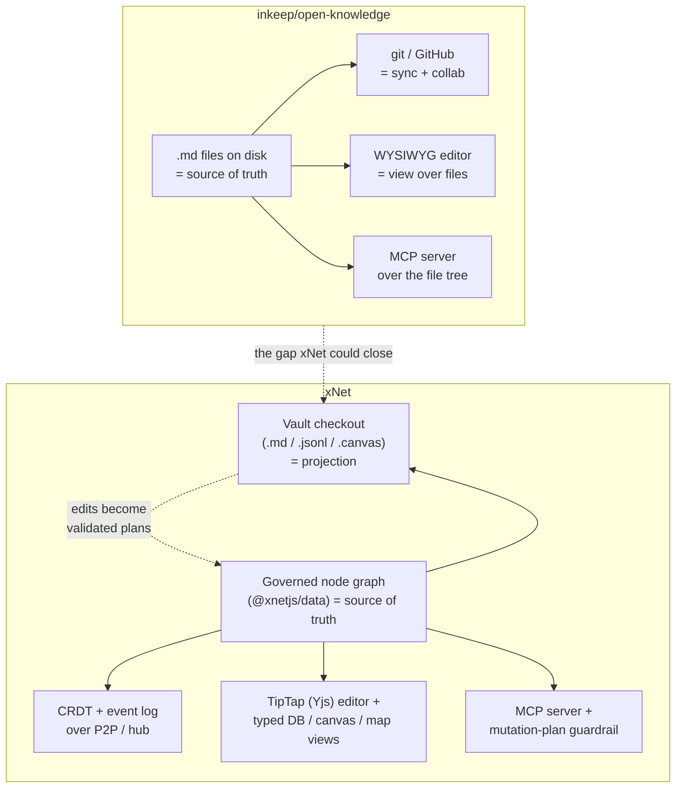
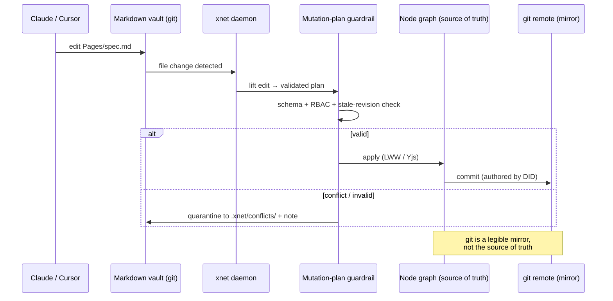

# xNet vs. inkeep/open-knowledge — Graph Substrate vs. Files-and-Git

## Problem Statement

[inkeep/open-knowledge](https://github.com/inkeep/open-knowledge) is a newly
popular open-source project ("Beautiful, AI-native markdown editor and LLM
Wiki") that shares a striking amount of vocabulary with xNet: **local-first**,
**AI-native**, **MCP server out of the box**, **agentic search**, **second
brain**, **wikilinks**, **WYSIWYG markdown editing**, and **Claude / Codex /
Cursor integration**. On the surface it looks like a direct competitor.

This exploration answers three questions:

1. **What is open-knowledge actually**, architecturally, and how is it the same
   or different from xNet?
2. **Where does xNet already win, and where does open-knowledge have a genuinely
   better idea** that xNet should consider adopting?
3. **What, if anything, should we build** in response?

The headline tension is a single architectural bet: open-knowledge stores
knowledge as **plain `.md` files on disk synced with git**, while xNet stores it
as a **governed, typed node graph (CRDT + event-sourced log) synced over a P2P /
hub fabric**. Almost every downstream difference flows from that one choice.

## Executive Summary

- **They are not the same product.** open-knowledge is a focused, single-player
  (git-collaborative) **markdown editor + LLM wiki**. xNet is a broad
  **decentralized data platform** — documents *and* typed databases, canvas,
  maps, ERP, permissions, a re-implementable protocol, and a sync hub — that
  *contains* an editor as one surface among many.
- **The deepest difference is the substrate.** open-knowledge's source of truth
  is a folder of `.md` files; git is the sync layer and the interop layer. xNet's
  source of truth is a governed node graph (`@xnetjs/data`); files are at most a
  *projection*. This single decision cascades into sync, permissions, structured
  data, real-time collaboration, and how agents touch the data.
- **xNet already has open-knowledge's killer feature in a more powerful form.**
  open-knowledge's whole pitch is "agents can just edit markdown files." xNet
  shipped the *files-first agent interface* in exploration 0161: the **vault
  checkout** (`xnet checkout`) materializes pages as Markdown-with-frontmatter,
  databases as JSONL/TSV, and canvases as JSON Canvas — and file edits flow back
  through a **validated mutation-plan guardrail** instead of blindly overwriting
  (`packages/cli/src/commands/agent.ts`, `packages/plugins/src/ai-surface/skill.ts`).
  xNet keeps the database as source of truth; the files are a working tree.
- **open-knowledge's genuine advantages are friction and ubiquity**: zero
  backend, `git push` is the entire sync story, `.md`-on-disk is readable by
  *every* tool ever made, and `ok init` wires up Claude/Cursor/Codex in one
  command. xNet's vault is more correct but is a *checkout of a running system*,
  not a self-contained git repo.
- **Recommendation: don't chase it as a competitor — close the one real gap.**
  Promote the vault checkout from an ephemeral, daemon-watched working tree into
  an optional **persistent, git-backed, bidirectional workspace mirror** ("xNet
  as a git remote of Markdown"). That gives xNet open-knowledge's frictionless
  files-and-git interop *without* giving up the typed graph, permissions, CRDT
  multiplayer, or protocol. Pair it with sharper positioning ("not a notes app —
  the data layer your notes app should have been built on").

## Current State In The Repository

xNet already implements every capability open-knowledge advertises — usually in a
more general form. The map below cites the real seams.

### The agent / files interface (the direct overlap)

| open-knowledge | xNet equivalent | Files |
| --- | --- | --- |
| `.md` files on disk = source of truth | **Vault checkout** = projection; graph is source of truth | `packages/cli/src/commands/agent.ts` (`runCheckout`), `packages/plugins/src/ai-surface/skill.ts` (`XNET_AGENT_SKILL_MD`) |
| Agents edit files directly | File edits → **validated mutation plans** with conflict quarantine | `agent.ts` (`commit`, `status`, `daemon`), `.xnet/conflicts/` flow |
| MCP server out of the box | **MCP server**, stdio + hardened loopback HTTP | `packages/cli/src/commands/mcp.ts`, `packages/plugins/src/services/mcp-server.ts`, `mcp-http.ts` |
| Skills for Claude/Codex/Cursor | One cross-harness **`SKILL.md`** (~1k token budget) | `packages/plugins/src/ai-surface/skill.ts` |
| Agentic search | `xnet search` (ranked TSV) + GraphRAG retrieval | `packages/brain/src/retrieve.ts`, `packages/query` |

The vault layout is essentially open-knowledge's filesystem, but as a checkout:
`Pages/<slug>.md` (YAML frontmatter with `xnet.id` / `xnet.revision`),
`Databases/<slug>.schema.json` + `<slug>.rows.jsonl` (+ read-only `.tsv`
sidecars), `Canvases/<slug>.canvas` (JSON Canvas), with live `[[wikilinks]]` and
`{{xnet-ref}}` directives preserved.

### MCP tooling (broader than open-knowledge's)

xNet's MCP server exposes **30+ tools** (`grep xnet_ packages/plugins/src`),
spanning pages (`xnet_read_page_markdown`, `xnet_plan_page_patch`,
`xnet_apply_page_markdown`, `xnet_rollback_page_markdown`), databases
(`xnet_database_query`, `xnet_database_plan_mutation`, `xnet_database_explain_query`),
canvas (`xnet_canvas_export_json_canvas`, `xnet_canvas_plan_json_canvas_import`),
graph (`xnet_graph_expand` — the JIT GraphRAG expansion from exploration 0211),
and CRUD (`xnet_create/get/update/delete/query/search`). Writes route through a
mutation-plan guardrail (`xnet_validate_mutation_plan`, `xnet_get_write_audit`).

### Editor (TipTap, markdown-capable)

`@xnetjs/editor` is a TipTap-based collaborative editor with bidirectional
Markdown import/export (`packages/editor/src/extensions/markdown-io.test.ts`,
`markdown-xnet.ts`, `markdown-token-contract.ts`), wikilinks, slash commands,
AI commands (`extensions/ai/ai-commands.ts`), hashtags, and mermaid. It is
**Yjs-backed for real-time multiplayer** — not a plain-text file buffer.

### Data model, sync, identity (where xNet far exceeds the scope)

- **Typed node graph**: `@xnetjs/data` — `defineSchema`, 15+ property types,
  relations, `authorization` blocks (RBAC). open-knowledge has no schema system;
  a `.md` file is a `.md` file.
- **Hybrid sync**: Yjs CRDT for rich text + event-sourced `Change<T>` with
  Lamport clocks / hash chains for structured data
  (`packages/sync/src/change.ts`, `chain.ts`, `yjs-envelope.ts`), over libp2p /
  WebRTC / hub (`packages/network`, `packages/hub`). open-knowledge sync = git.
- **Cryptographic identity & permissions**: DID:key, UCAN delegation, passkeys,
  post-quantum attestation (`packages/identity/src/{did,ucan,passkey,pq-attestation}.ts`),
  RBAC in `packages/core/src/permissions.ts`. open-knowledge permissions = your
  GitHub repo's permissions.
- **Protocol**: xNet is a **re-implementable spec** with golden vectors and a
  second-language kernel (`docs/specs/protocol/`, `conformance/`), plus a native
  Swift core (exploration 0210). open-knowledge is one TypeScript implementation.

### Connectors & GitHub (xNet treats GitHub as a *source*, not a *backend*)

xNet pulls from GitHub via webhook magic-words and an API connector
(`packages/hub/src/services/github-integration.ts`,
`packages/plugins/src/connectors/api-connectors.ts`, exploration 0213) —
materializing repos/issues/PRs as governed `ExternalItem` nodes. It does **not**
use git as a sync transport, and there is **no "your workspace is a git repo of
Markdown" mode** today. That absence is the one real gap (see Recommendation).

## External Research

What open-knowledge is, from its README and repo:

- **Tagline**: "A beautiful, local-first markdown editor and LLM wiki with
  integrations for Claude, Codex, and other harnesses."
- **Four pillars**: (1) full WYSIWYG markdown editing ("feels like a Google Doc
  or Notion page"); (2) collaborative AI-editing with Claude/Codex/Cursor desktop
  apps, usable with any harness via MCP/CLI; (3) out-of-the-box MCP, skills, and
  agentic search for "LLM Wikis, agent second brains, and spec-driven
  development"; (4) **no-code team sharing and auto-sync powered by git/GitHub
  under the hood**.
- **Distribution**: macOS DMG, or `npm install -g @inkeep/open-knowledge` then
  `ok init` (scaffold + wire up agents) and `ok start --open` (launch the web
  editor). Node.js 24+. Bun + Turbo monorepo, TypeScript (~98%). Windows not yet
  supported.
- **Substrate**: knowledge is stored as **plain Markdown files on disk**; git +
  GitHub provide version control, collaboration, and sync. The editor is a view
  over those files.
- **Vendor / license**: built by **Inkeep** (a company whose main product is
  AI agents for support/docs; see the sibling [inkeep/agents](https://github.com/inkeep/agents)
  repo). Licensed **GPL-3.0-or-later**. ~238 stars at time of writing.

This places open-knowledge squarely in the 2026 "Markdown as the agent-native
substrate" trend — alongside tools like `library-mcp`, the proposed *Open
Knowledge Format (OKF)*, and Obsidian-plus-MCP setups — whose shared thesis is:
*keep knowledge as `.md` on disk so any agent can safely read/edit it and git
handles sync.* The bet is **interop and zero-backend simplicity over
structure**.

xNet sits on the opposite bet: **structure, real-time, permissions, and protocol
over raw file portability** — and then re-earns file portability via the vault
checkout.

## Key Findings

1. **Same words, opposite substrates.** The overlap is real at the *vocabulary*
   layer (local-first, AI-native, MCP, wiki, wikilinks, second brain) and
   genuine at the *agent-interface* layer (both let an agent read/edit Markdown
   via files + MCP). It diverges completely at the *storage* layer.
2. **open-knowledge is the inverse of xNet's vault checkout.** In
   open-knowledge, files are the source of truth and the database (if any) is
   derived. In xNet, the graph is the source of truth and files are derived. Both
   end up with "a folder of Markdown an agent can edit"; they disagree on which
   side is authoritative.
3. **xNet's guardrail is a feature, not overhead.** Because xNet round-trips file
   edits through validated mutation plans with conflict quarantine
   (`.xnet/conflicts/`), stale or malformed agent edits never silently corrupt
   data. open-knowledge's "agent edits the file directly" is simpler but offers
   no validation, no typed schema enforcement, and resolves conflicts only as
   well as git's three-way merge of prose.
4. **The gap is friction, not capability.** Everything open-knowledge does, xNet
   does — but xNet's vault is a *checkout of a running local API* (the daemon /
   `xnet commit` loop, a `127.0.0.1` backend), whereas open-knowledge's repo is
   *self-contained and pushable*. For a solo user who just wants "my notes as
   Markdown in a GitHub repo my agent edits," open-knowledge is one command;
   xNet is a running app.
5. **Scope mismatch makes "competitor" the wrong frame.** open-knowledge can't do
   typed databases, board/calendar/timeline views, canvas, fine-grained
   cryptographic permissions, real-time multiplayer cursors, or cross-language
   protocol interop. xNet can't (today) be a zero-backend "just a git repo of
   Markdown." They overlap on one surface and diverge on the other twenty.
6. **License divergence matters for adoption.** xNet is MIT (permissive, embeddable
   as a library — see `@xnetjs/react`, the BYO-server kit). open-knowledge is
   GPL-3.0 (copyleft). xNet's licensing is friendlier to the "data layer other
   apps build on" positioning; open-knowledge's is fine for an end-user app.

## Options And Tradeoffs

Five axes where the two projects make different bets, and what (if anything) xNet
should do about each.



### 1. Substrate: files vs. graph

- **open-knowledge (files)** — maximal interop (every tool reads `.md`), zero
  schema friction, trivially diffable, agent-trivial. Loses: typed structure,
  relations, queries, computed fields, fine-grained permissions.
- **xNet (graph)** — typed databases, relations, RBAC, real-time, protocol. Costs:
  the substrate is opaque to external tools unless they go through MCP / SDK / the
  vault checkout.
- **Verdict**: keep the graph. It is xNet's whole reason to exist. *But* make the
  projection (vault) a first-class, persistable artifact (Recommendation).

### 2. Sync: git vs. CRDT/hub

- **git** — universally understood, free hosting (GitHub), great for
  prose-history and human review; merges code/prose well; **single-writer-ish**
  and conflict-prone for concurrent structured edits; no real-time.
- **CRDT/hub** — real-time multiplayer, field-level LWW, offline-P2P, no merge
  conflicts on structured data; costs an always-on hub for reliable cross-device
  sync and is less legible than `git log`.
- **Verdict**: keep CRDT/hub as the *live* sync. Offer git as an *export/mirror*
  channel for users who want it (history legibility, GitHub backup, agent-repo
  workflows) — not as the primary transport.

### 3. Agent interface: direct file edits vs. guarded plans

- **open-knowledge** — agent writes the file, git commits it. Simple; no
  validation, no typed enforcement, no audit beyond `git blame`.
- **xNet** — agent writes the file, the daemon/commit lifts it into a validated
  mutation plan with conflict quarantine and a write-audit log. Safer; one more
  moving part (the local API + daemon).
- **Verdict**: xNet's model is strictly better for correctness. The cost is the
  running backend — which the git-mirror recommendation reduces (the repo
  becomes self-contained between syncs).

### 4. Scope: focused editor vs. data platform

- **open-knowledge** — does one thing (markdown wiki) cleanly; easy to grok and
  adopt; nothing to learn beyond "it's Markdown + git + AI."
- **xNet** — does many things (docs, DBs, canvas, maps, ERP, plugins, protocol);
  more powerful, steeper concept count.
- **Verdict**: no change — but the *marketing* should lead with one surface
  (docs/wiki or databases) rather than the full platform, then reveal depth.
  open-knowledge's clarity is a positioning lesson, not an architecture one.

### 5. Distribution & license: `ok init` / GPL vs. hub-deploy / MIT

- **open-knowledge** — `npm i -g`, `ok init`, GPL-3.0 end-user app, DMG.
- **xNet** — PWA demo (no signup), Electron app, Railway hub template, MIT
  embeddable packages, BYO-server kit.
- **Verdict**: xNet's distribution is broader and its license friendlier for
  embedding. Borrow open-knowledge's **one-command agent wiring** ergonomics for
  the CLI (`xnet init` that scaffolds a checkout + writes the harness configs),
  which is the single nicest bit of their onboarding.

## Recommendation

**Do not reposition xNet as an open-knowledge competitor.** They overlap on one
surface and diverge on twenty; treating it as a head-to-head would mean throwing
away the graph, which is the point of the project. Instead, take the *one good
idea* open-knowledge proves users want — **"my knowledge is a folder of Markdown
in a git repo my agent can edit"** — and deliver it on top of xNet's superior
substrate.

Concretely, ship a **persistent, git-backed, bidirectional workspace mirror** as
an evolution of the existing vault checkout:

1. **`xnet init` (onboarding parity).** One command that creates a checkout
   directory, writes the cross-harness `SKILL.md` and per-harness config
   (Claude Code / Codex / Cursor MCP entries), and optionally `git init`s the
   folder. This matches `ok init` ergonomics using machinery xNet already has
   (`XNET_AGENT_SKILL_MD`, `runCheckout`, `mcp serve`).
2. **Git-mirror mode for the vault.** Extend `AiWorkspaceExporter` /
   `AiWorkspaceWatcher` so a checkout can be a long-lived git working tree:
   `git commit` on every applied mutation-plan batch (authored by the editing
   DID), and `git pull`-style reconciliation that feeds external commits back
   through the *same* mutation-plan guardrail (not a blind overwrite). The graph
   stays source of truth; git becomes a legible history + backup + interop
   channel.
3. **Round-trip safety = the differentiator.** Lean into what open-knowledge
   *can't* do: external git edits are validated against schemas, gated by RBAC,
   and conflicts are quarantined — so "let an agent rewrite my repo" can't
   silently corrupt typed data. Make this the headline of the feature.
4. **Positioning, not just code.** Add a docs page / landing section: *"Already
   love Markdown-in-git for your notes? xNet gives you that — plus typed
   databases, real permissions, and real-time — and keeps your data a folder of
   `.md` you can `git push` anywhere."* Frame xNet as the **data layer** under
   tools like open-knowledge, not a replacement for them.

This is a small, high-leverage build: it reuses the 0161 files-first interface,
the MCP server (0175), and the SKILL.md, and turns xNet's biggest *perceived*
gap versus open-knowledge into a demonstrated *superset*.



## Example Code

A sketch of the `xnet init` onboarding and git-mirror toggle (illustrative,
building on `packages/cli/src/commands/agent.ts`):

```ts
// xnet init — open-knowledge-style one-command agent wiring on xNet's graph.
program
  .command('init [dir]')
  .description('Scaffold a Markdown vault checkout and wire up AI harnesses')
  .option('--git', 'initialize the checkout as a git working tree (mirror mode)')
  .option('--harness <name...>', 'claude | codex | cursor', ['claude'])
  .action(async (dir = '.xnet-workspace', opts) => {
    const services = await defaultServicesFactory({})
    // 1. Materialize a scoped checkout (reuses runCheckout / AiWorkspaceExporter)
    await runCheckout(services, { dir, limit: 200 })
    // 2. Drop the cross-harness skill the agent reads first
    await writeFile(join(dir, 'SKILL.md'), XNET_AGENT_SKILL_MD)
    // 3. Wire each harness to the MCP server (stdio) + the vault
    for (const h of opts.harness) await writeHarnessConfig(h, dir) // .mcp.json etc.
    // 4. Optional: make the vault a self-contained, pushable git repo
    if (opts.git) {
      await initGitMirror(dir) // git init + .gitignore(.xnet/) + initial commit
      await services.watcher.enableGitMirror(dir) // commit on each applied plan
    }
    console.log(`Vault ready at ${dir}. Run "xnet daemon ${dir}" and point your agent here.`)
  })
```

Mirror reconciliation keeps the guardrail in the loop — external commits are
*proposed*, never blindly applied:

```ts
// On `git pull` bringing in external edits, re-validate instead of overwriting.
async function reconcileFromGit(services: AgentCliServices, dir: string) {
  const changed = await gitDiffNames(dir, 'HEAD@{1}', 'HEAD') // files touched upstream
  for (const path of changed) {
    const plan = await services.exporter.liftFileToPlan(dir, path) // same path as `xnet commit`
    const result = await services.aiSurface.applyMutationPlan(plan) // schema + RBAC + stale check
    if (!result.ok) await quarantine(dir, path, result.reason) // → .xnet/conflicts/
  }
}
```

## Risks And Open Questions

- **Two histories.** A git mirror plus the event-sourced log means two sources of
  history that can drift. The graph must stay authoritative; the mirror is
  derived. Need a clear "git is a projection" contract and a reconverge command.
- **Binary / structured data in git.** Pages are clean Markdown, but databases
  (JSONL) and canvases (JSON Canvas) produce noisy diffs and merge poorly. Decide
  what belongs in the mirror vs. stays graph-only (maybe pages mirror by default;
  DBs opt-in).
- **Identity mapping.** git commits are authored by `user.email`; xNet edits are
  authored by DID. The mirror must map DID → a stable git identity without
  leaking keys.
- **Scope creep.** This is deliberately a *narrow* feature (vault → git), not "xNet
  becomes git-based." Resist letting it pull the sync model toward git.
- **Is the demand real for xNet's audience?** open-knowledge's traction suggests
  yes for the notes/wiki crowd, but xNet's pitch is broader. Validate with the
  agent-developer persona (spec-driven dev) before investing heavily.
- **Marketing confusion.** Leading with "Markdown + git" risks under-selling the
  graph. The positioning must frame git-mirror as *one export channel*, not the
  identity of the product.

## Implementation Checklist

- [ ] Add `xnet init [dir]` to the CLI: checkout + `SKILL.md` + per-harness MCP
      config (`--harness claude|codex|cursor`), matching `ok init` ergonomics.
- [ ] Add `writeHarnessConfig` helpers that emit valid `.mcp.json` /
      `~/.codex` / Cursor MCP entries pointing at `xnet mcp serve`.
- [ ] Extend `AiWorkspaceExporter` with a stable, idempotent full-vault export
      suitable for a long-lived working tree (deterministic file names / order).
- [ ] Add git-mirror mode to `AiWorkspaceWatcher`: commit on each applied
      mutation-plan batch, authored by the editing DID (mapped to a git identity).
- [ ] Implement `reconcileFromGit`: external commits → `liftFileToPlan` →
      `applyMutationPlan`, with conflict quarantine to `.xnet/conflicts/`.
- [ ] Decide + document the mirror policy (pages by default; databases/canvas
      opt-in) and `.gitignore` the `.xnet/` control dir.
- [ ] Add a DID ↔ git-identity mapping that never writes private key material.
- [ ] Docs: a "Markdown + git workspace" guide and a landing section positioning
      xNet as the data layer *under* file-and-git wikis (cite open-knowledge as
      the pattern, not a rival).
- [ ] Changeset for any touched publishable package (`@xnetjs/cli`,
      `@xnetjs/plugins`); changelog fragment for the feature.

## Validation Checklist

- [ ] `xnet init --git ./demo --harness claude` produces a folder a fresh Claude
      Code session can read (`SKILL.md` discovered) and edit, with edits landing
      in the graph.
- [ ] An agent editing `Pages/*.md` in the mirror produces a valid mutation plan
      and a git commit authored by the right DID-mapped identity.
- [ ] A deliberately stale / schema-violating external git edit is **quarantined**
      to `.xnet/conflicts/`, not applied — proving the round-trip-safety claim.
- [ ] `git log` of the mirror is human-legible (one commit per applied batch,
      meaningful messages), and `reconcileFromGit` re-applies external commits
      idempotently.
- [ ] Round-trip fidelity: export → external edit → reconcile → re-export yields
      no spurious diffs (deterministic projection).
- [ ] Token budget for `SKILL.md` stays within the existing
      `agent-token-budget` guard.
- [ ] Positioning copy reviewed: no claim that xNet "replaces" open-knowledge;
      git-mirror framed as an export channel, graph framed as source of truth.

## References

- inkeep/open-knowledge — <https://github.com/inkeep/open-knowledge> (AI-native
  Markdown editor + LLM wiki; `.md`-on-disk + git sync; MCP/skills; GPL-3.0)
- inkeep/agents — <https://github.com/inkeep/agents> (sibling project; the
  vendor's core AI-agent platform)
- `packages/cli/src/commands/agent.ts` — the files-first agent interface
  (`checkout`, `commit`, `status`, `daemon`, `run`) — exploration 0161
- `packages/cli/src/commands/mcp.ts` — `xnet mcp serve` (stdio + HTTP) —
  exploration 0175
- `packages/plugins/src/ai-surface/skill.ts` — `XNET_AGENT_SKILL_MD`, the
  cross-harness vault contract
- `packages/plugins/src/services/mcp-server.ts`, `mcp-http.ts` — MCP server +
  transports; 30+ `xnet_*` tools with mutation-plan guardrail
- `packages/brain/src/retrieve.ts` — hybrid GraphRAG retrieval — exploration 0211
- `packages/editor/src/extensions/markdown-{io.test,xnet,token-contract}.ts` —
  Markdown import/export, wikilinks, slash commands
- `packages/data` — typed node/schema model; `packages/sync`, `packages/hub`,
  `packages/network` — CRDT + event-sourced sync fabric
- `packages/identity`, `packages/core/src/permissions.ts` — DID / UCAN / passkey
  / RBAC
- `docs/specs/protocol/`, `conformance/` — the re-implementable protocol & golden
  vectors (xNet is a spec, not just an implementation)
- `docs/explorations/0213_[x]_INTEGRATION_PLUGIN_CATALOG_WEBHOOKS_AND_CONNECTORS.md`
  — GitHub-as-a-source connector & webhooks
- Prior art / trend: `library-mcp` (<https://lethain.com/library-mcp/>), the
  Open Knowledge Format proposal — "Markdown as the agent-native substrate"
