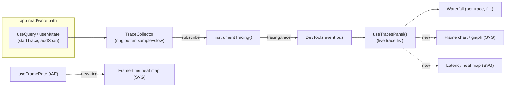
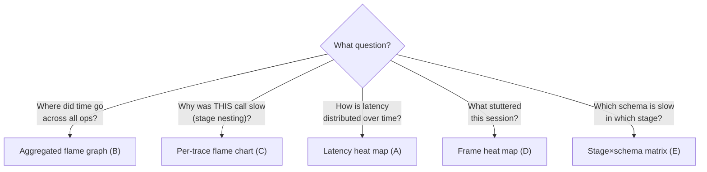

# Flame Graphs & Heat Maps in the DevTools Performance Panel

> Can we add a flame graph or a heat map to the dev-tools Performance panel, and
> what — given the data we actually collect — would make sense to render as a
> flame graph versus a heat map?

## Problem Statement

The dev-tools Performance panel
([packages/devtools/src/panels/PerformancePanel/PerformancePanel.tsx](../../packages/devtools/src/panels/PerformancePanel/PerformancePanel.tsx))
already unifies five perf signals: a **boot waterfall**, **live FPS / frame time**,
**storage stats**, **active queries**, and a **recent-slow-traces list** with a
per-trace expandable waterfall. Every one of these answers a *scalar* or *list*
question well, but three blind spots remain:

1. **FPS is a single instantaneous number.** `useFrameRate`
   ([usePerformancePanel.ts:17-44](../../packages/devtools/src/panels/PerformancePanel/usePerformancePanel.ts))
   reports one rolling FPS / frame-ms value every 500 ms. You can see *that* the
   app is at 48 fps right now; you cannot see the **jank over a session** — the
   one 180 ms frame during a paste that dropped six frames is invisible the moment
   it scrolls past.
2. **"Recent traces" is a list, not a distribution.** The panel shows the 8 slowest
   traces by `totalMs`. A list cannot show **bimodality** (cache-hit vs cache-miss
   clusters), **drift** (queries getting slower as the DB grows), or **outliers in
   context** — exactly what latency analysis needs.
3. **The per-trace `Waterfall` is flat.** Spans already carry `parentSpanId`
   ([packages/telemetry/src/tracing/types.ts:35-45](../../packages/telemetry/src/tracing/types.ts)),
   but `Waterfall` renders them as `i`-th rows by array index
   ([Waterfall.tsx:56-82](../../packages/devtools/src/panels/TracesPanel/Waterfall.tsx)) —
   it throws away the call tree, so you can't see **self-time vs total-time** or
   which stage *nested inside* which. And there is **no "where did all the time go
   across everything"** view at all.

The question is not merely "can we add a chart" — it is **which visualization fits
which data**. A flame graph and a heat map answer different questions; picking the
wrong one for a given signal produces a pretty but useless widget.

## Executive Summary

**Yes — and they are complementary, not alternatives.** The repo already has the
exact data shapes both want, and an established **hand-rolled, dependency-free,
jsdom-testable SVG** house style for charts in dev-tools
([Waterfall.tsx](../../packages/devtools/src/panels/TracesPanel/Waterfall.tsx),
[HabitHeatmap.tsx](../../packages/dashboard/src/components/HabitHeatmap.tsx)).

The mapping that makes sense:

| Signal we have | Best visualization | Why |
| --- | --- | --- |
| One trace's span **tree** (`parentSpanId`) | **Flame chart** (per-trace, time-ordered) | Spans nest; self-time matters. Upgrade of today's flat `Waterfall`. |
| The **whole trace ring** merged by stage | **Aggregated (left-heavy) flame graph** | Answers "across all recent ops, where did total time go?" Works *today* even with shallow spans. |
| Trace `totalMs` over `startedAt` | **Latency heat map** (time × latency bucket, color = count) | Canonical Gregg latency map — reveals modes, drift, outliers a list hides. |
| Per-frame durations over wall-clock | **Frame-time / jank heat map** (or strip) | Surfaces dropped frames during a session; the missing dimension behind the single FPS number. |
| Stage × schema mean/p95 | **Hot-spot matrix heat map** | "Which schema is slow in which stage." Highest value, but needs deep stage instrumentation (0190 Phase 2). |

**Recommendation:** ship a **latency heat map** as the headline *heat map* and an
**aggregated left-heavy flame graph** as the headline *flame graph* (both work with
the data we collect *today*), then **upgrade the existing `Waterfall` into a true
nested flame chart** as the per-trace drill-down. Defer the stage×schema matrix and
the frame heat map to fast-follows. All hand-rolled SVG — **do not** pull in
`d3-flame-graph` / `speedscope` / `react-flame-graph` (canvas + `react-window`,
breaks the jsdom test precedent, bloats the bundle).

## Current State In The Repository

### The data model is already trace-shaped

[`packages/telemetry/src/tracing/types.ts`](../../packages/telemetry/src/tracing/types.ts)
defines exactly what a flame graph needs — a tree of timed stages:

```ts
export interface Span {
  spanId: string
  parentSpanId?: string         // ← the call tree a flame graph draws
  name: string                  // static stage name, e.g. data.sqlite.exec
  startOffsetMs: number         // ← x-position
  durationMs: number            // ← width
  attributes?: SpanAttributes   // candidateRows, returnedRows, fullTableScan, usedIndex, bytes, thread
}
export interface Trace {
  traceId: string
  rootKind: 'query' | 'mutate' | 'sync' | 'other'
  rootName: string              // e.g. query:Task.list
  startedAt: number             // ← heat-map x (wall clock)
  totalMs: number               // ← heat-map y (latency)
  spans: Span[]
}
```

The `TraceCollector` is a bounded ring buffer (default capacity 200) with head
sampling + keep-if-slow, and a `subscribe()` that fires on every change
([trace-collector.ts](../../packages/telemetry/src/tracing/trace-collector.ts)).
The dev-tools mirror this as `DevToolsTrace` / `DevToolsTraceSpan`
([core/types.ts:309-331](../../packages/devtools/src/core/types.ts)) and forward
each completed trace onto the event bus as a `tracing:trace` event
([instrumentation/tracing.ts](../../packages/devtools/src/instrumentation/tracing.ts)).
`useTracesPanel` already rebuilds a live, newest-first list of up to 100 traces
([useTracesPanel.ts](../../packages/devtools/src/panels/TracesPanel/useTracesPanel.ts)) —
**that hook is the ready-made feed for both a flame graph and a heat map.**

### What is actually emitted today (be honest about depth)

The stage catalog is small and the per-trace tree is currently **shallow**.
`TRACE_STAGES` ([packages/react/src/context/tracing-context.ts:19-25](../../packages/react/src/context/tracing-context.ts))
defines only:

```
data.query.descriptor · data.query.bridge · data.query.flatten ·
data.query.commit · data.mutate.bridge
```

and `useQuery` closes each trace by adding a **single** `data.query.commit` span at
offset 0 with the first-load latency
([useQuery.ts:674-686](../../packages/react/src/hooks/useQuery.ts)). The deeper
read/write spans (worker hop → SQLite → decrypt → auth → flatten) are designed in
[0190_DEEP_PERFORMANCE_TELEMETRY](../explorations/0190_[_]_DEEP_PERFORMANCE_TELEMETRY_AND_STACK_TRACING.md)
to "attach by traceId in a later phase" but are **not yet wired**. Consequence:

- A **per-trace** flame chart is real but *thin* (often one bar) until 0190's
  worker-span propagation lands.
- An **aggregated** flame graph and a **latency heat map** work *fully today*,
  because they only need `totalMs` + `rootKind` + whatever spans exist.

### Existing chart precedents to mirror

- [`Waterfall.tsx`](../../packages/devtools/src/panels/TracesPanel/Waterfall.tsx) —
  hand-rolled SVG, `<rect>` per span, `colourForStage()` by name prefix,
  `<title>` tooltips, `data-testid` hooks. The comment is explicit: *"Hand-rolled
  SVG (the HabitHeatmap precedent) keeps this dependency-free and jsdom-testable —
  the charts package is canvas/ECharts and cannot render in headless tests."*
- [`HabitHeatmap.tsx`](../../packages/dashboard/src/components/HabitHeatmap.tsx) —
  a GitHub-style contribution **heat map**: a grid of `<rect>` with color/opacity
  by value and `<title>` per cell. **This is already a working heat-map primitive
  in the repo** — the latency heat map is the same grid with different axes.
- [`packages/charts`](../../packages/charts/src/XChart.tsx) — the ECharts wrapper.
  It renders a text fallback under jsdom (`canvasAvailable()` is false) and is
  **canvas-only**, so it is the wrong tool for a panel the tests must assert on.

### Where it slots in

`PerformancePanel` composes independent `<Section>`s
([PerformancePanel.tsx:27-37](../../packages/devtools/src/panels/PerformancePanel/PerformancePanel.tsx)).
Adding a section is a one-line edit; no registry change is needed (the panel is
already registered as the `performance` hero panel with keywords including
`profile`, `latency`, `trace`
([panel-registry.ts:98-106](../../packages/devtools/src/panels/panel-registry.ts))).



## External Research

**Flame graphs** (Brendan Gregg) visualize sampled stack traces: width ∝ time,
y ∝ stack depth, color is categorical (not a value). A **flame chart** is the
time-ordered variant (x = wall-clock, used by Chrome DevTools); a **flame graph**
proper is the merged/aggregated form (x = alphabetical/merged, "left-heavy"
collapses identical stacks so the widest tower is the costliest path). A single
glance reveals the hottest path. ([brendangregg.com/flamegraphs.html](https://www.brendangregg.com/flamegraphs.html))

**Heat maps** (Gregg, *Visualizing System Latency*, ACM Queue 2010) are a 3-D
view: x and y are two dimensions (classically **time** and **latency bucket**),
color intensity is the **count** in that cell. Unlike a scatter plot, points are
quantized into buckets → **fixed storage cost**, so millions of samples render
cheaply, and the visualization exposes **distribution modes, outliers, and drift**
that percentiles and lists hide.
([brendangregg.com/heatmaps.html](https://www.brendangregg.com/heatmaps.html),
[HeatMaps/latency.html](https://www.brendangregg.com/HeatMaps/latency.html))

The two are **complementary**: flame graphs answer *"in what code/stage is time
spent?"*; latency heat maps answer *"how is latency distributed and how does it
change over time?"* Picking per-signal (above) follows directly.

**Web libraries surveyed** (and why we should *not* adopt one here):

| Library | Renderer | Notes |
| --- | --- | --- |
| [`d3-flame-graph`](https://github.com/spiermar/d3-flame-graph) | SVG via D3 | Mature, interactive, icicle/inverted. But pulls D3 + its own data shape; heavier than our needs. |
| [`speedscope`](https://github.com/jlfwong/speedscope) | Canvas/WebGL | 60 fps for huge profiles; time-order / **left-heavy** / sandwich modes — great *ideas* to copy, wrong as a dependency (whole-app viewer). |
| [`react-flame-graph`](https://github.com/bvaughn/react-flame-graph) | Canvas + `react-window` | React-native API but canvas → breaks the jsdom test contract dev-tools rely on. |
| `@xnetjs/charts` (ECharts) | Canvas | In-repo, but text-fallback under jsdom; can do treemap/sunburst/heatmap but not testable in headless. |

The repo's own precedent (hand-rolled SVG `Waterfall` + `HabitHeatmap`) beats all
of them for this use case: **zero deps, jsdom-assertable, themable via the same
tokens, < 150 LOC each.** Speedscope's "left-heavy" merge and Gregg's bucketed
latency map are the *concepts* worth importing — not the packages.

## Key Findings

1. **The data is ready; the depth is not (yet).** `parentSpanId` + `startOffsetMs`
   + `durationMs` is a textbook flame-graph input, but until 0190 Phase-2 worker
   spans land, per-trace trees are mostly one bar. → favor visualizations that
   aggregate or use `totalMs` first.
2. **A heat map fills the single biggest gap.** "Recent traces" as a *list* and FPS
   as a *scalar* both hide distribution. The latency heat map and frame heat map are
   pure wins on data we already collect.
3. **The aggregated flame graph beats the per-trace one for value-today.** Merging
   the ring buffer by stage name sums `data.query.commit` (and any other spans)
   across ~100 traces → a real "where does time go" tower even when each trace is
   shallow.
4. **House style mandates hand-rolled SVG.** Canvas libraries forfeit the jsdom
   render tests every dev-tools chart has. Reuse `colourForStage`,
   `formatDuration`/`formatBytes` ([utils/formatters.ts](../../packages/devtools/src/utils/formatters.ts)),
   and the `text-ink-*` / `bg-surface-2` / `divide-hairline` tokens.
5. **No registry or wiring work.** Both are new `<Section>`s in an
   already-registered panel reading an existing hook. Dev-tools is dev-only and
   tree-shaken from prod, and is `private` → **no changeset**, but a changelog
   fragment is expected (see CLAUDE.md).

## Options And Tradeoffs

### A. Latency heat map (recommended heat map)

x = time bucket (last *N* seconds of the ring), y = latency bucket (log-scaled:
`<5`, `5–20`, `20–50`, `50–100`, `100–250`, `250–500`, `500+` ms), color intensity
= count of traces, optionally split/iconned by `rootKind`. Reveals cache-hit vs
miss clusters, slow-query drift, and outliers a top-8 list can't.

- **Pros:** canonical; works today on `totalMs`; bounded storage; same SVG grid as
  `HabitHeatmap`; teaches more than the slow-trace list.
- **Cons:** needs enough traces to look populated; bucket choice matters; small
  panel width limits time columns (mitigate: ~30 columns, scroll/aggregate).

### B. Aggregated left-heavy flame graph (recommended flame graph)

Merge all ring traces into one tree keyed by stage name; width ∝ summed
`durationMs`; sort children widest-left. One tower = total cost of each stage class
across the session.

- **Pros:** high value *today*; the "where did time go" view we lack; dependency-free
  SVG; degrades gracefully (flat bar list when spans are shallow).
- **Cons:** loses per-call timing (that's the per-trace chart's job); merge logic is
  the only non-trivial code (~40 LOC).

### C. Per-trace flame chart (upgrade existing Waterfall)

Replace flat index-rows with depth-from-`parentSpanId`; keep x = `startOffsetMs`,
width = `durationMs`; surface self-time. Roots that have no parent stack at depth 0.

- **Pros:** small delta over `Waterfall`; correct call-nesting + self-time;
  reuses tooltip/color/test scaffolding.
- **Cons:** thin until 0190 worker spans land; must handle missing parents and
  clock skew between worker/main offsets.

### D. Frame-time / jank heat map (fast-follow)

Capture each `requestAnimationFrame` delta into a small ring; render x = time,
y = frame-duration bucket (`<17`, `17–33`, `33–50`, `50–100`, `100+` ms), color =
count. Or a simpler 1-row "jank strip."

- **Pros:** turns the single FPS number into session jank history; cheap; great for
  "what stuttered during that paste."
- **Cons:** rAF only runs while the panel/tab is foregrounded; needs its own ring
  (the current hook keeps no history).

### E. Stage × schema hot-spot matrix (deferred)

Rows = query schema, cols = stage, color = mean/p95 ms. The most *actionable* heat
map ("Task.list is slow specifically in auth-filter").

- **Pros:** pinpoints the fix.
- **Cons:** requires deep per-stage spans **and** schema dimension on every span —
  blocked on 0190 Phase 2. Build last.

### F. Adopt a library (rejected)

`d3-flame-graph` / `speedscope` / `react-flame-graph`. **Rejected:** canvas or D3
dependency, breaks jsdom render tests, bundle weight, data-shape impedance. Borrow
their *modes* (left-heavy, sandwich), not their code.



## Recommendation

Ship in three increments, ordered by value-per-risk on **today's** data:

1. **Phase 1 — Latency heat map (Option A) + Aggregated flame graph (Option B).**
   Two new `<Section>`s in `PerformancePanel`, both reading `useTracesPanel()`,
   both hand-rolled SVG. These are the headline answers to *"add a heat map"* and
   *"add a flame graph,"* and both work with the spans we emit now. Add a small
   `aggregate.ts` (pure, unit-tested: ring → buckets, ring → merged tree) and SVG
   components with `data-testid` + `<title>` like `Waterfall`.

2. **Phase 2 — Per-trace flame chart (Option C).** Refactor `Waterfall` (or add a
   sibling `FlameChart`) to lay spans out by depth via `parentSpanId`, showing
   self-time. Land it now so it's ready the moment 0190 Phase-2 deepens the trees;
   it already improves the boot/commit spans we have.

3. **Phase 3 (fast-follow) — Frame-time heat map (Option D)**, then **defer the
   stage×schema matrix (Option E)** behind 0190's worker-span propagation.

Concrete next steps: add `aggregate.ts` (buckets + merge), `LatencyHeatmap.tsx`,
`FlameGraph.tsx` under `panels/PerformancePanel/`; wire two `<Section>`s; add a
`flame`/`heatmap` view toggle on the per-trace expansion in `TracesPanel`; unit-test
the pure functions and snapshot/assert the SVG under jsdom; add a changelog fragment.

## Example Code

Pure aggregation helpers (unit-testable, no React):

```ts
// panels/PerformancePanel/aggregate.ts
import type { DevToolsTrace, DevToolsTraceSpan } from '../../core/types'

export const LATENCY_BUCKETS_MS = [5, 20, 50, 100, 250, 500, Infinity] as const

/** Bucket traces into a time(x) × latency(y) grid of counts. */
export function latencyHeatmap(
  traces: DevToolsTrace[],
  { columns = 30, now = Date.now(), windowMs = 60_000 }: { columns?: number; now?: number; windowMs?: number } = {}
): { grid: number[][]; max: number } {
  const colMs = windowMs / columns
  const grid = LATENCY_BUCKETS_MS.map(() => new Array<number>(columns).fill(0))
  let max = 0
  for (const t of traces) {
    const age = now - t.startedAt
    if (age < 0 || age >= windowMs) continue
    const col = Math.min(columns - 1, Math.floor((windowMs - age) / colMs))
    const row = LATENCY_BUCKETS_MS.findIndex((b) => t.totalMs < b)
    const v = ++grid[row][col]
    if (v > max) max = v
  }
  return { grid, max }
}

export interface FlameNode { name: string; selfMs: number; totalMs: number; children: FlameNode[] }

/** Merge every span across the ring into one stage-keyed tree (left-heavy). */
export function aggregateFlame(traces: DevToolsTrace[]): FlameNode {
  const root: FlameNode = { name: 'all operations', selfMs: 0, totalMs: 0, children: [] }
  const find = (parent: FlameNode, name: string): FlameNode => {
    let n = parent.children.find((c) => c.name === name)
    if (!n) parent.children.push((n = { name, selfMs: 0, totalMs: 0, children: [] }))
    return n
  }
  for (const t of traces) {
    root.totalMs += t.totalMs
    const byId = new Map<string, DevToolsTraceSpan>(t.spans.map((s) => [s.spanId, s]))
    for (const span of t.spans) {
      // Walk parent chain to a stage path; merge by name at each level.
      const path: string[] = []
      let cur: DevToolsTraceSpan | undefined = span
      const guard = new Set<string>()
      while (cur && !guard.has(cur.spanId)) { guard.add(cur.spanId); path.unshift(cur.name); cur = cur.parentSpanId ? byId.get(cur.parentSpanId) : undefined }
      let node = root
      for (const name of path) { node = find(node, name); node.totalMs += span.durationMs }
      node.selfMs += span.durationMs
    }
  }
  const sort = (n: FlameNode) => { n.children.sort((a, b) => b.totalMs - a.totalMs); n.children.forEach(sort) }
  sort(root)
  return root
}
```

Latency heat map (SVG grid — same primitive as `HabitHeatmap`):

```tsx
// panels/PerformancePanel/LatencyHeatmap.tsx
import { LATENCY_BUCKETS_MS, latencyHeatmap } from './aggregate'
import type { DevToolsTrace } from '../../core/types'

const ROWS = LATENCY_BUCKETS_MS.length, CELL = 10, GAP = 1
const ROW_LABEL = ['<5', '<20', '<50', '<100', '<250', '<500', '500+']

export function LatencyHeatmap({ traces }: { traces: DevToolsTrace[] }) {
  const cols = 30
  const { grid, max } = latencyHeatmap(traces, { columns: cols })
  const w = cols * (CELL + GAP), h = ROWS * (CELL + GAP)
  return (
    <svg width={w + 28} height={h} role="img" aria-label="Trace latency over time" data-testid="latency-heatmap">
      {grid.map((row, r) =>
        row.map((count, c) => (
          <rect key={`${r}-${c}`} x={28 + c * (CELL + GAP)} y={r * (CELL + GAP)} width={CELL} height={CELL} rx={1}
            fill="var(--accent-ink, #e8590c)" opacity={count === 0 ? 0.06 : 0.25 + 0.75 * (count / max)}>
            <title>{`${ROW_LABEL[r]} ms · ${count} trace${count === 1 ? '' : 's'}`}</title>
          </rect>
        ))
      )}
      {ROW_LABEL.map((lbl, r) => (
        <text key={lbl} x={0} y={r * (CELL + GAP) + CELL} fontSize={8} fill="#868e96">{lbl}</text>
      ))}
    </svg>
  )
}
```

A flame node renders with the same `<rect>` + `colourForStage` recipe as
`Waterfall`, laid out by cumulative child offset and `node.totalMs` width.

## Risks And Open Questions

- **Shallow trees today.** Per-trace flame charts are thin until 0190 Phase-2
  worker spans land. *Mitigation:* lead with the aggregated flame graph + latency
  heat map (both fine on `totalMs`); ship the per-trace chart ready-to-fill.
- **Sparse panels.** With few traces a heat map looks empty. *Mitigation:* empty
  state copy ("run queries to populate"), and a min opacity floor so the grid reads
  as a grid.
- **Bucket/window tuning.** Log latency buckets and a 60 s window are guesses.
  *Open:* make window selectable (10 s / 1 min / 5 min)? Auto-scale to ring span?
- **Worker/main clock skew.** Worker `startOffsetMs` is relative to the trace start
  but measured on a different clock; nested layout may show negative/overlapping
  offsets. *Open:* clamp at 0 (Waterfall already does) and document the caveat.
- **Color + a11y.** Intensity-only encoding fails for color-blind users and the
  theme's dark/light split. *Mitigation:* opacity ramp on a single token + `<title>`
  per cell (counts are always readable on hover).
- **rAF history cost.** The frame heat map needs a ring the current hook lacks, and
  rAF stalls when backgrounded → gaps. Acceptable for a dev tool; note it.
- **Scope creep vs `@xnetjs/charts`.** Tempting to "just use ECharts." *Decision:*
  no — jsdom-testability and zero-dep are the panel's contract.

## Implementation Checklist

- [x] Add `panels/PerformancePanel/aggregate.ts` with `latencyHeatmap()` and
      `aggregateFlame()` as pure functions.
- [x] Unit-test `aggregate.ts`: bucket boundaries, empty ring, single trace, cyclic
      `parentSpanId` guard, left-heavy sort order.
- [ ] Add `LatencyHeatmap.tsx` (SVG grid, `data-testid`, `<title>` per cell, theme
      tokens) + a `<LatencyHeatmapSection>` reading `useTracesPanel()`.
- [ ] Add `FlameGraph.tsx` (aggregated left-heavy tree from `aggregateFlame`,
      reuse `colourForStage`) + an `<AggregateFlameSection>`.
- [ ] Wire both sections into `PerformancePanel.tsx` between live metrics and
      recent traces.
- [ ] Phase 2: refactor `Waterfall` → depth layout by `parentSpanId` (or sibling
      `FlameChart`) with self-time; add a flame/waterfall toggle in `TracesPanel`.
- [ ] Phase 3: `useFrameRing()` hook + `FrameHeatmap.tsx`; defer stage×schema matrix
      behind 0190 Phase-2 instrumentation.
- [ ] Add a changelog fragment (dev-tools is `private` → no changeset, per CLAUDE.md).

## Validation Checklist

- [ ] `pnpm --filter @xnetjs/devtools test` green, including new jsdom SVG
      assertions (cells/rects present, counts in `<title>`).
- [ ] Latency heat map renders with seeded traces (use the dev-tools Seed panel +
      run several queries) and shows distinct rows for cache-hit vs slow traces.
- [ ] Aggregated flame graph widths sum to the ring's total time and sort
      widest-left; degrades to a flat bar list when spans are shallow.
- [ ] Per-trace flame chart shows correct nesting on a synthetic multi-span trace
      and matches `Waterfall` totals.
- [ ] Empty states render (no traces / no canvas) without throwing under jsdom.
- [ ] Theme check: legible in both dark and light dev-tools themes; tooltips expose
      raw counts/ms.
- [ ] No prod bundle impact (dev-tools tree-shaken); no new runtime dependency added.

## References

- [Brendan Gregg — Flame Graphs](https://www.brendangregg.com/flamegraphs.html)
- [Brendan Gregg — Heat Maps](https://www.brendangregg.com/heatmaps.html) ·
  [Latency Heat Maps](https://www.brendangregg.com/HeatMaps/latency.html)
- [Visualizing System Latency — ACM Queue (2010)](https://cacm.acm.org/practice/visualizing-system-latency/)
- [speedscope (left-heavy / sandwich modes)](https://github.com/jlfwong/speedscope) ·
  [d3-flame-graph](https://github.com/spiermar/d3-flame-graph) ·
  [react-flame-graph](https://github.com/bvaughn/react-flame-graph)
- In-repo: [0190 Deep Performance Telemetry & Full-Stack Tracing](../explorations/0190_[_]_DEEP_PERFORMANCE_TELEMETRY_AND_STACK_TRACING.md) ·
  [0204 Fast Local-First Cold Start](../explorations/0204_[x]_FAST_LOCAL_FIRST_COLD_START_AND_CACHE_HYDRATION.md)
- In-repo code: [PerformancePanel.tsx](../../packages/devtools/src/panels/PerformancePanel/PerformancePanel.tsx) ·
  [Waterfall.tsx](../../packages/devtools/src/panels/TracesPanel/Waterfall.tsx) ·
  [HabitHeatmap.tsx](../../packages/dashboard/src/components/HabitHeatmap.tsx) ·
  [trace-collector.ts](../../packages/telemetry/src/tracing/trace-collector.ts) ·
  [tracing/types.ts](../../packages/telemetry/src/tracing/types.ts)
