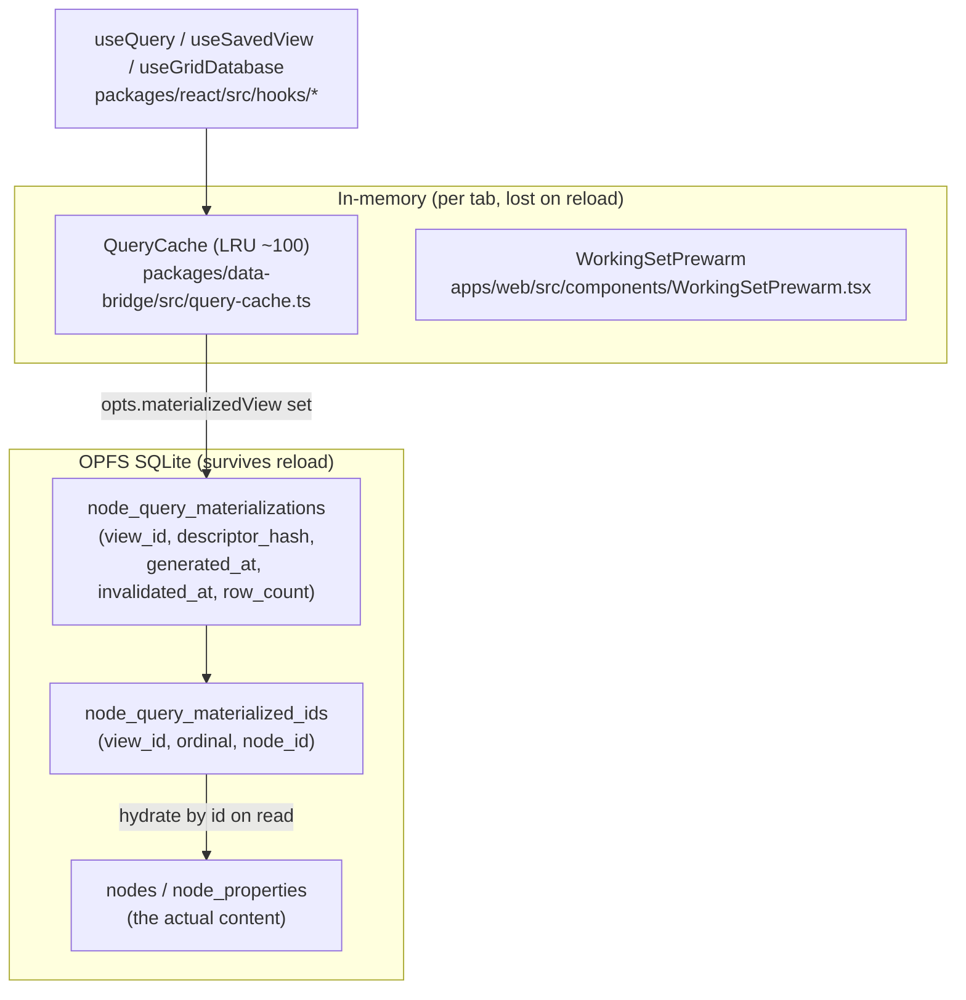
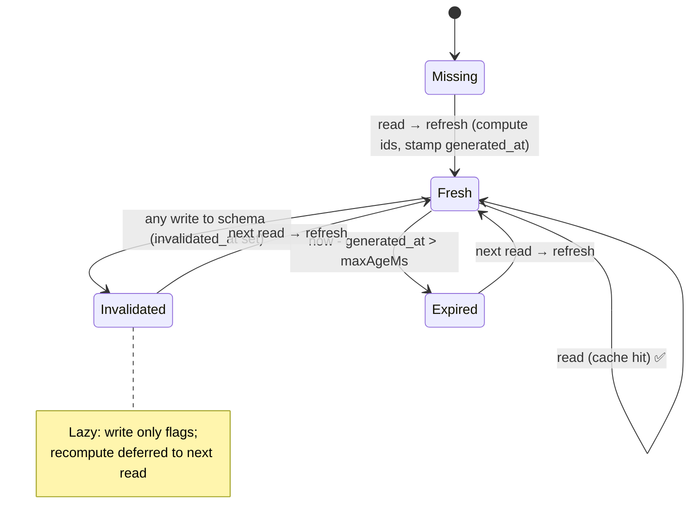
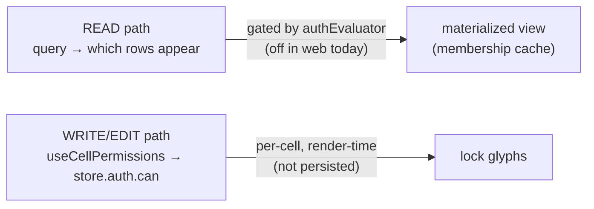
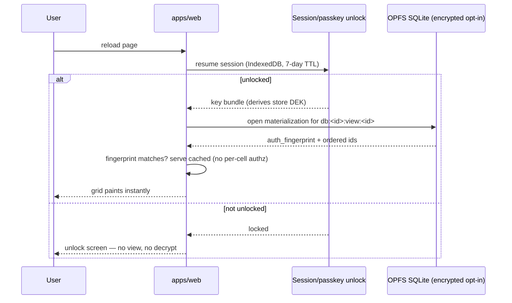

# Persistent And Secure Materialized Views

## Problem Statement

> Do materialized views persist between page reloads, or are they
> regenerated every time you reload the page? From a security standpoint
> it might be nice to keep them only at render time, but from a
> performance standpoint it would be really nice to cache them and reuse
> them on re-render. Can we get the best of both worlds? Maybe a "global"
> authorization — if you're logged in you get *all* the materialized
> views; if you're not, you get none — because if you could decrypt it
> once, it makes sense you can decrypt it again, and we shouldn't have to
> validate every cell. Maybe encrypt the whole table / whole view.

This exploration answers the literal question (**do they persist? — yes,
partly, and the design is more subtle than it looks**), maps the user's
intuitions onto code that already exists, and recommends how to make
materialized views *both* durable across reloads *and* safe under xNet's
local-first, end-to-end-encrypted threat model.

## Executive Summary

- **There are two distinct caches, and they behave differently across a
  reload.**
  1. An **in-memory** query cache in the data bridge
     (`packages/data-bridge/src/query-cache.ts`, LRU, ~100 entries) —
     this is **lost on every reload** and rebuilt lazily.
  2. A **persistent** materialized-query cache in OPFS-backed SQLite
     (`node_query_materializations` + `node_query_materialized_ids`) —
     this **survives reloads**. The grid already opts into it with
     `materializedView: db:<databaseId>:view:<viewId>`
     ([useGridDatabase.ts:257](packages/react/src/hooks/useGridDatabase.ts)).

- **The persistent materialized view caches *membership and order*, not
  decrypted content.** It stores an ordered list of **node IDs**; on read
  it re-hydrates the live node rows by ID
  ([sqlite-adapter.ts:2190](packages/data/src/store/sqlite-adapter.ts)).
  So it is no more sensitive at rest than the `nodes` table it points
  into — a key fact for the security discussion.

- **The codebase already encodes the user's security instinct, defensively.**
  Materialized views are **silently bypassed whenever a read-authorization
  evaluator or a content cipher is active**
  ([store.ts:724-750](packages/data/src/store/store.ts)). A cached ID list
  must never serve a row the current viewer can no longer read, so today
  the cache is simply *turned off* when per-row read-authz is in play.
  That's safe but it throws away the performance win exactly when authz
  exists. **The opportunity is to make materialized views *coexist* with
  authz instead of being disabled by it.**

- **"Decrypt once → decrypt again" is correct for the single-user device
  model and unsafe for the shared-workspace model.** Authorization inputs
  (a revoked share, a newly-added field rule, a removed room key) can
  change *between* materializations. Industry RLS-over-materialized-view
  systems hit this exact bug: when row-level security is added after a
  materialized view exists, the view does not reflect it
  ([Kusto RLS policy docs](https://learn.microsoft.com/en-us/kusto/management/alter-materialized-view-row-level-security-policy-command),
  [pgsql-ivm#71](https://github.com/sraoss/pgsql-ivm/issues/71)). The fix
  is **authorize once *per materialization*, not once *per cell* and not
  once *per login*** — and re-authorize when the authz inputs change.

- **Recommended path:** keep the membership-not-content design; add an
  **auth-fingerprint** column to the materialization so it can run safely
  *with* an authz evaluator (authorize once per view, re-materialize when
  the fingerprint changes); and offer **at-rest encryption of the whole
  local store** (the materialization tables included) behind the existing
  optional `nodeContentCipher` seam, keyed off the passkey/session unlock.
  That delivers the user's "logged-in ⇒ all views, logged-out ⇒ none"
  model cryptographically, without per-cell checks, and without the
  stale-authz footgun.

## Current State In The Repository

### Two caches, two lifetimes



- **In-memory** — `QueryCache` deduplicates identical live queries and
  notifies subscribers; it is a runtime structure and **does not persist**.
  `WorkingSetPrewarm` holds subscriptions warm so the landing surfaces
  render instantly *within* a session, but a reload starts cold.
- **Persistent** — the materialized-query tables in
  [packages/sqlite/src/schema.ts:97-115](packages/sqlite/src/schema.ts):

  ```sql
  CREATE TABLE IF NOT EXISTS node_query_materializations (
      view_id        TEXT PRIMARY KEY,
      descriptor_hash TEXT NOT NULL,
      schema_id      TEXT NOT NULL,
      descriptor_json TEXT NOT NULL,
      generated_at   INTEGER NOT NULL,
      invalidated_at INTEGER,
      row_count      INTEGER NOT NULL
  );
  CREATE TABLE IF NOT EXISTS node_query_materialized_ids (
      view_id TEXT NOT NULL,
      ordinal INTEGER NOT NULL,
      node_id TEXT NOT NULL,
      PRIMARY KEY (view_id, ordinal),
      UNIQUE (view_id, node_id),
      FOREIGN KEY (view_id) REFERENCES node_query_materializations(view_id) ON DELETE CASCADE,
      FOREIGN KEY (node_id) REFERENCES nodes(id) ON DELETE CASCADE
  );
  ```

  Because OPFS-backed SQLite is durable
  ([packages/sqlite/src/adapters/web.ts](packages/sqlite/src/adapters/web.ts),
  VFS `opfs-sahpool`, dir `.xnet-sqlite`), **these rows are still there
  after a reload.** The cache is keyed by a *stable view id*, not by a
  per-session handle — e.g. `db:<databaseId>:view:<viewId>`.

### The public surface of the feature

`packages/data/src/store/query.ts` defines the opt-in
([query.ts:56](packages/data/src/store/query.ts)):

```ts
export type NodeQueryMaterializedViewOptions = {
  viewId: string
  maxAgeMs?: number      // TTL; cache older than this is "expired"
  forceRefresh?: boolean // recompute now, ignore the cache
}
// NodeQueryOptions.materializedView?: string | NodeQueryMaterializedViewOptions
```

Plan metadata returned to callers makes the cache observable
([query.ts:135-145](packages/data/src/store/query.ts)):
`materializedCacheHit`, `materializedGeneratedAt`, `materializedRowCount`,
and `materializedRefreshReason: 'missing' | 'descriptor-changed' |
'invalidated' | 'expired' | 'force-refresh'`.

The only production caller today is the database grid
([useGridDatabase.ts:253-259](packages/react/src/hooks/useGridDatabase.ts)),
plus the AI surface service
([packages/plugins/src/ai-surface/service.ts](packages/plugins/src/ai-surface/service.ts)).

### How a read resolves (the heart of it)

[sqlite-adapter.ts:2049-2100](packages/data/src/store/sqlite-adapter.ts):

```ts
private async queryMaterializedView(descriptor, start) {
  const base = withoutNodeQueryMaterializedView(withoutNodeQueryPagination(descriptor))
  const descriptorHash = this.hashScalarValue(this.stringifyStable(base))
  const cached = await this.getMaterializedView(materializedView.viewId)
  const cacheExpired = maxAgeMs != null && cached && (Date.now() - cached.generated_at > maxAgeMs)

  const canUseCache =
    cached !== null &&
    cached.descriptor_hash === descriptorHash &&   // query shape unchanged
    cached.invalidated_at === null &&              // no write since
    !cacheExpired &&                               // within TTL
    !materializedView.forceRefresh

  const readPlan = canUseCache
    ? /* serve cached ordered ids */
    : await this.refreshMaterializedView({ ... }) // recompute, persist ids

  // hydrate ids -> live node rows, then page
  return this.readMaterializedViewPage(descriptor, readPlan, start)
}
```

Refresh recomputes the base query, **wipes and rewrites the ordered ID
list** in a transaction, and stamps `generated_at`
([sqlite-adapter.ts:2118-2188](packages/data/src/store/sqlite-adapter.ts)).
Read hydrates by ID — note there is **no per-row authorization on the
hydrate path**
([sqlite-adapter.ts:2190-2235](packages/data/src/store/sqlite-adapter.ts)):

```ts
const idRows = await this.db.query(`SELECT node_id FROM node_query_materialized_ids
  WHERE view_id = ? ORDER BY ordinal ASC LIMIT ? OFFSET ?`, [...])
const hydrated = await this.hydrateNodesByIds(idRows.map(r => r.node_id))
```

That missing re-authorization is *why* the layer above refuses to use
materialized views when authz is active (next section).

### Invalidation: lazy, coarse, per-schema

Any write to a schema flags every materialized view over that schema as
stale — it does **not** recompute eagerly; the next read does
([sqlite-adapter.ts:2237-2244](packages/data/src/store/sqlite-adapter.ts)):

```ts
private async invalidateMaterializedViewsForSchema(schemaId) {
  await this.db.run(
    `UPDATE node_query_materializations
       SET invalidated_at = ? WHERE schema_id = ? AND invalidated_at IS NULL`,
    [Date.now(), schemaId])
}
```



### The authorization gate that already exists

[store.ts:720-768](packages/data/src/store/store.ts) is the decisive code.
The materialized path runs **only** through `storage.queryNodes`, and that
fast path requires **no cipher and no read-auth evaluator**:

```ts
async query(descriptor) {
  // (1) Fast path — includes materialized views.
  if (this.storage.queryNodes && !this.nodeContentCipher && !this.authEvaluator) {
    return this.storage.queryNodes(descriptor)   // may serve a materialized view
  }

  // (2) Authz present → authorize-then-paginate; materialized view DISABLED.
  if (this.storage.queryNodes && !this.nodeContentCipher && this.authEvaluator
      && !descriptor.nodeId && descriptor.materializedView === undefined) {
    const candidates = await this.storage.queryNodes(withoutNodeQueryPagination(descriptor))
    const readable   = await this.filterReadableNodes(candidates.nodes)  // per-row authz
    return applyNodeQueryDescriptor(readable, descriptor)
  }

  // (3) Cipher present (or other) → decrypt, authorize, filter in JS (slowest).
  ...
}
```

So the two seams that matter:

| Seam | Type | Set in `apps/web`? | Effect on materialized views |
|---|---|---|---|
| `authEvaluator` | `PolicyEvaluator` — gates **read** | **No** | When set, materialized views are bypassed (path 2/3) |
| `nodeContentCipher` | `NodeContentCipher` — encrypts node content at rest | **No** | When set, materialized views are bypassed (path 3) |

`grep` confirms neither is wired into the web store today, so **in the
shipping web app the grid's materialized views are fully active and
persist across reloads.** The per-cell permission UI users actually see is
a *different* mechanism.

### The per-cell permissions the user is thinking of

[packages/devtools/src/panels/DataExplorer/useCellPermissions.ts](packages/devtools/src/panels/DataExplorer/useCellPermissions.ts)
computes a `cellLockReasons` map by calling `store.auth.can(...)` **per
node / per field, at render time, only while editing**:

```ts
const authz = store?.auth ?? null
// per node:
const d = await authz.can({ action: 'write', nodeId: node.id })
// per field:
const d = await authz.can({ action: 'write', nodeId, patch: { [field]: value } })
```

This is a **write-gating overlay** (lock glyphs on editable cells) and is
recomputed every mount; it is *not* what controls whether a row is *read*
into the view. Conflating the two is the root of the question — they are
orthogonal:



## External Research

- **IndexedDB / OPFS are not encrypted at rest by default.** Any local
  user, or a malicious extension with disk access, can read the underlying
  files
  ([w3c/IndexedDB#191](https://github.com/w3c/IndexedDB/issues/191),
  [LogRocket: offline-first 2025](https://blog.logrocket.com/offline-first-frontend-apps-2025-indexeddb-sqlite/)).
  So xNet's materialization tables — and the `nodes` table they reference —
  are plaintext on disk unless the app opts into encryption. This sets the
  real threat model: the materialized view is not the weak link; the whole
  local store is.
- **Local-first encryption is schema/storage-level, not query-level.**
  RxDB encrypts fields transparently across IndexedDB/OPFS/SQLite, with the
  crucial caveat that **encrypted fields can't be queried by value**
  ([RxDB encryption](https://rxdb.info/encryption.html),
  [RxDB zero-latency local-first](https://rxdb.info/articles/zero-latency-local-first.html)).
  This is why xNet stores a *membership* cache (IDs computed against a
  plaintext index) rather than a content snapshot, and why turning on a
  content cipher forces the slow decrypt-then-filter path.
- **"Authorize once, serve cached" leaks rows when authz changes after
  materialization.** Microsoft Kusto explicitly warns that RLS set on a
  source table *after* an incremental materialized view is created is not
  reflected in results
  ([Kusto materialized-view RLS](https://learn.microsoft.com/en-us/kusto/management/alter-materialized-view-row-level-security-policy-command)),
  and PostgreSQL IVM has the same open issue
  ([pgsql-ivm#71](https://github.com/sraoss/pgsql-ivm/issues/71)). The
  industry resolution is to bind the cache to the security context and
  invalidate on context change — i.e. authorize per *materialization
  epoch*, not per *cell* and not per *login*.
- **Materialized views *are* a recognized row/column security tool** — they
  can deliberately expose a safe projection — but only when the
  materialization is itself produced under the right authority and
  refreshed when that authority changes
  ([Snowflake MVs](https://docs.snowflake.com/en/user-guide/views-materialized),
  [PostgreSQL MVs: when caching makes sense](https://stormatics.tech/blogs/postgresql-materialized-views-when-caching-your-query-results-makes-sense)).

## Key Findings

1. **Yes, they persist** — the SQLite materialization survives reloads; the
   in-memory query cache does not. A reloaded grid serves the cached ID
   ordering immediately (if not invalidated/expired) and re-hydrates content.
2. **They cache membership, not plaintext** — IDs + order, hydrated on read.
   At rest they leak only "which nodes matched this query," which the
   plaintext `nodes` table already reveals.
3. **They are already disabled under read-authz / encryption** — the safe
   default exists, but it costs the performance win precisely when authz is
   present. Today that's invisible because the web app sets no read
   evaluator; it will bite the moment server/custodial trust modes or
   shared workspaces turn one on.
4. **The user's "decrypt once ⇒ decrypt again" is the single-user device
   model.** Valid there. Invalid the instant authorization inputs can
   change underneath a persisted cache (revoked share, new field rule,
   rotated room key) — confirmed by Kusto/pgsql prior art.
5. **The real lever is *granularity of the authorization check*, not
   *whether to cache*.** Per-cell-per-render (today's edit overlay) is the
   expensive extreme; per-login-forever (the user's proposal) is the unsafe
   extreme. **Per-materialization, keyed to an authz fingerprint** is the
   sweet spot.
6. **"Encrypt the whole view/table" is a device-at-rest control, not an
   authz control.** It defends a stolen laptop, not a revoked collaborator.
   It's worth doing — but as store-wide encryption behind the unlock, not
   as a bespoke per-view scheme.

## Options And Tradeoffs

### Axis 1 — What to persist

| Option | Persists | Re-hydrate cost | At-rest exposure | Verdict |
|---|---|---|---|---|
| **A. Membership cache (today)** | ordered IDs | one indexed `IN (...)` hydrate | = `nodes` table | **Keep** |
| **B. Full content snapshot** | denormalized cells | none (fastest read) | duplicates plaintext content | Reject unless encrypted |
| **C. No persistence (render-time only)** | nothing | full query each reload | none beyond `nodes` | Rejects the perf goal |

### Axis 2 — When to authorize

| Option | Check frequency | Safe under changing authz? | Perf |
|---|---|---|---|
| **Per-cell, per-render (edit overlay today)** | very high | yes | poor at scale |
| **Per-login "global" (user's proposal)** | once | **no** (stale grants leak) | best |
| **Per-materialization, authz-fingerprinted (recommended)** | once per view per authz-change | **yes** | near-best |
| **Disable cache when authz present (today's read path)** | n/a (no cache) | yes | poor when authz on |

### Axis 3 — At-rest protection

| Option | Threat covered | Cost | Notes |
|---|---|---|---|
| **None (today, web)** | — | 0 | OPFS plaintext; fine if device trust is assumed |
| **Encrypt materialization only** | partial | low | pointless — `nodes` still plaintext |
| **Encrypt whole local store via `nodeContentCipher`, key behind unlock (recommended opt-in)** | stolen/shared device | medium; disables value-indexed query → slow path | This *is* the user's "encrypt the whole table," done store-wide and correctly |

## Recommendation

Adopt a **three-part** plan; ship part 1 first.

**1. Make materialized views coexist with read-authz via an auth
fingerprint (the "best of both worlds").** Today a read evaluator disables
the cache. Instead, stamp each materialization with a cheap
`auth_fingerprint` derived from the viewer's effective authorization inputs
(subject DID + sorted grant/role IDs + room-key set version, hashed). Then:

- Authorize **once**, when the view is materialized (the existing
  `filterReadableNodes` runs during refresh, so the persisted ID list
  already excludes unreadable rows).
- On read, compare `current_auth_fingerprint` to the stored one. Match →
  serve cached with **no per-row re-check** (the user's performance win).
  Mismatch → treat as a new `materializedRefreshReason: 'authz-changed'`
  and recompute.
- Invalidate the fingerprint when grants/keys change (the store already has
  `authEvaluator.invalidate(nodeId)` hooks on every mutation — extend them
  to bump a monotonic authz epoch).

This authorizes **once per view per authz-change**, never per cell, and is
provably safe against the Kusto/pgsql stale-RLS bug.

**2. Keep the membership-not-content design (Option A).** Continue storing
IDs + order, not decrypted cells. It bounds at-rest exposure to what the
`nodes` table already exposes and keeps refresh cheap.

**3. Offer store-wide at-rest encryption as an opt-in, gated by the
unlock (the user's "encrypt the whole table," done right).** Wire the
existing `nodeContentCipher` seam in `apps/web`, deriving its key from the
passkey/session unlock
([packages/identity/src/passkey/session.ts](packages/identity/src/passkey/session.ts)).
Result: **logged in ⇒ the device can decrypt everything (one unlock, no
per-cell work); not logged in ⇒ the bytes are unreadable.** Encrypt the
materialization tables under the same key. Accept the tradeoff that
encrypted-value queries fall back to the decrypt-then-filter path (prior
art confirms this is unavoidable), and *therefore* lean on part 1's
membership cache to keep the warm path fast.



**Net:** the user keeps their two instincts — *cache across reloads* and
*authorize globally rather than per-cell* — but the "global" check becomes
"once per materialization, re-checked when authz changes" (safe) plus
"one decrypt at unlock" (device-at-rest), instead of "once per login,
forever" (unsafe).

## Example Code

Adding the fingerprint so materialized views survive *with* an evaluator:

```ts
// packages/data/src/store/store.ts — query(), path (2)
if (this.storage.queryNodes && !this.nodeContentCipher && this.authEvaluator
    && !descriptor.nodeId && descriptor.materializedView) {
  const fp = await this.authFingerprint()            // subject + grants + keyset, hashed
  return this.storage.queryNodes({ ...descriptor, authFingerprint: fp })
}
```

```ts
// sqlite-adapter.ts — extend the refresh predicate & schema
// ALTER TABLE node_query_materializations ADD COLUMN auth_fingerprint TEXT;
const canUseCache =
  cached !== null &&
  cached.descriptor_hash === descriptorHash &&
  cached.auth_fingerprint === input.authFingerprint &&   // NEW
  cached.invalidated_at === null &&
  !cacheExpired &&
  !materializedView.forceRefresh
// refresh already runs filterReadableNodes via queryNodes(base) when authz is on,
// so the persisted ids are exactly the rows this fingerprint may read.
```

```ts
// authz epoch bump — reuse existing invalidate hooks
this.authEvaluator?.invalidate(node.id)
this.bumpAuthEpoch()   // NEW: monotonic; folded into authFingerprint()
```

## Risks And Open Questions

- **Fingerprint completeness.** It must capture *every* input that can
  change a read decision (roles, grants, group membership, room-key
  version, public/visibility flips). Miss one and you reintroduce the
  stale-RLS leak. Mitigation: derive it from the same `PolicyEvaluator`
  state the read path consults, and fail closed (treat "can't compute" as
  a forced refresh).
- **Per-cell field rules vs membership cache.** Membership caching answers
  "which rows," not "which *cells within a row* are visible." If field-level
  *read* redaction is ever added (today field rules gate *write*), the
  hydrate step must still redact per field — the cache can't shortcut that.
- **Invalidation granularity.** Per-schema invalidation is coarse: one
  write to any node of a schema marks all its views stale. Fine for now
  (lazy refresh), but a busy schema could thrash. A later refinement:
  predicate-aware invalidation (only invalidate views whose `where`/`order`
  could be affected).
- **Encryption ⇒ slow queries.** Turning on `nodeContentCipher` disables
  value-indexed pushdown for encrypted fields (decrypt-then-filter). This
  is inherent to local-first E2E (RxDB has the same limit). The membership
  cache offsets the warm path; cold queries get slower. Make encryption an
  explicit, informed opt-in, not a silent default.
- **Cross-device cache coherence.** Materializations are per-device; a write
  on device B invalidates B's cache but A only learns on sync. Acceptable
  (A re-materializes on next read after applying the change), but worth
  stating: the materialization is a *local* derived artifact, never synced.
- **Threat model must be named.** "Best of both worlds" depends on *whose*
  threat. Single-user device: caching freely is fine. Shared/managed
  device, or compliance requiring crypto-erase on logout: parts 1 + 3 are
  required. Decide which xNet trust modes (local / server / custodial /
  signed) demand which.

## Implementation Checklist

- [x] Add `auth_fingerprint TEXT` to `node_query_materializations`
      (migrate `packages/sqlite/src/schema.ts`, bump schema version).
- [x] Implement `NodeStore.authFingerprint()` from the `PolicyEvaluator`
      state + a monotonic authz epoch bumped in the existing
      `authEvaluator?.invalidate(...)` hooks.
- [x] Thread `authFingerprint` through `queryNodes` / `NodeQueryDescriptor`
      and into `queryMaterializedView`'s `canUseCache` predicate; add
      `materializedRefreshReason: 'authz-changed'`.
- [x] Allow path (2) in `store.ts` to use materialized views *with* an
      evaluator (refresh authorizes once; reads compare fingerprint).
- [x] Surface `materializedCacheHit` / refresh reason in the devtools
      Data panel plan inspector for observability.
- [ ] Wire optional `nodeContentCipher` in `apps/web`, key derived from the
      passkey/session unlock; ensure materialization tables are covered.
- [ ] Add a Settings toggle: "Encrypt local data at rest" with a clear
      perf/UX note (slower cold queries; crypto-erase on logout).
- [x] Document the local-derived, never-synced nature of materializations.

## Validation Checklist

- [ ] Reload test: with the grid open, reload → first paint serves a
      `materializedCacheHit: true` plan (no full recompute).
- [ ] Invalidation test: write a row → next read shows
      `materializedRefreshReason: 'invalidated'` then a fresh hit.
- [ ] **Authz-revocation test (the critical one):** materialize a view as a
      viewer who can read row X; revoke the grant; reload → row X must
      **not** appear, and the plan shows `'authz-changed'`. Proves no stale
      leak.
- [ ] Fingerprint coverage test: each authz input (grant, group, room-key
      version, visibility) independently flips the fingerprint and forces a
      refresh.
- [ ] At-rest test: with encryption on, inspect OPFS bytes for the
      materialization + `nodes` tables → no plaintext titles/cells.
- [ ] Logout test: lock the session → cached views are not decryptable;
      unlock → views return without per-cell authz calls.
- [ ] Perf test: warm reload of a 10k-row database with authz on stays
      within budget vs the disabled-cache baseline.

## References

- Materialized view types & options — [packages/data/src/store/query.ts](packages/data/src/store/query.ts)
- Read/refresh/invalidate impl — [packages/data/src/store/sqlite-adapter.ts](packages/data/src/store/sqlite-adapter.ts)
- Query authz gate (the bypass) — [packages/data/src/store/store.ts:720](packages/data/src/store/store.ts)
- Persistent tables DDL — [packages/sqlite/src/schema.ts:97](packages/sqlite/src/schema.ts)
- OPFS SQLite adapter — [packages/sqlite/src/adapters/web.ts](packages/sqlite/src/adapters/web.ts)
- In-memory query cache — [packages/data-bridge/src/query-cache.ts](packages/data-bridge/src/query-cache.ts)
- Grid consumer — [packages/react/src/hooks/useGridDatabase.ts:257](packages/react/src/hooks/useGridDatabase.ts)
- Per-cell write overlay — [packages/devtools/src/panels/DataExplorer/useCellPermissions.ts](packages/devtools/src/panels/DataExplorer/useCellPermissions.ts)
- Content cipher seam — [packages/data/src/store/store.ts:2589](packages/data/src/store/store.ts), [packages/data/src/store/types.ts:551](packages/data/src/store/types.ts)
- Session unlock / key derivation — [packages/identity/src/passkey/session.ts](packages/identity/src/passkey/session.ts), [packages/identity/src/passkey/derive.ts](packages/identity/src/passkey/derive.ts)
- RxDB encryption (storage-level, can't query encrypted fields) — https://rxdb.info/encryption.html
- IndexedDB/OPFS not encrypted at rest — https://github.com/w3c/IndexedDB/issues/191
- Stale RLS over materialized views — https://learn.microsoft.com/en-us/kusto/management/alter-materialized-view-row-level-security-policy-command , https://github.com/sraoss/pgsql-ivm/issues/71
- When MV caching makes sense — https://stormatics.tech/blogs/postgresql-materialized-views-when-caching-your-query-results-makes-sense
