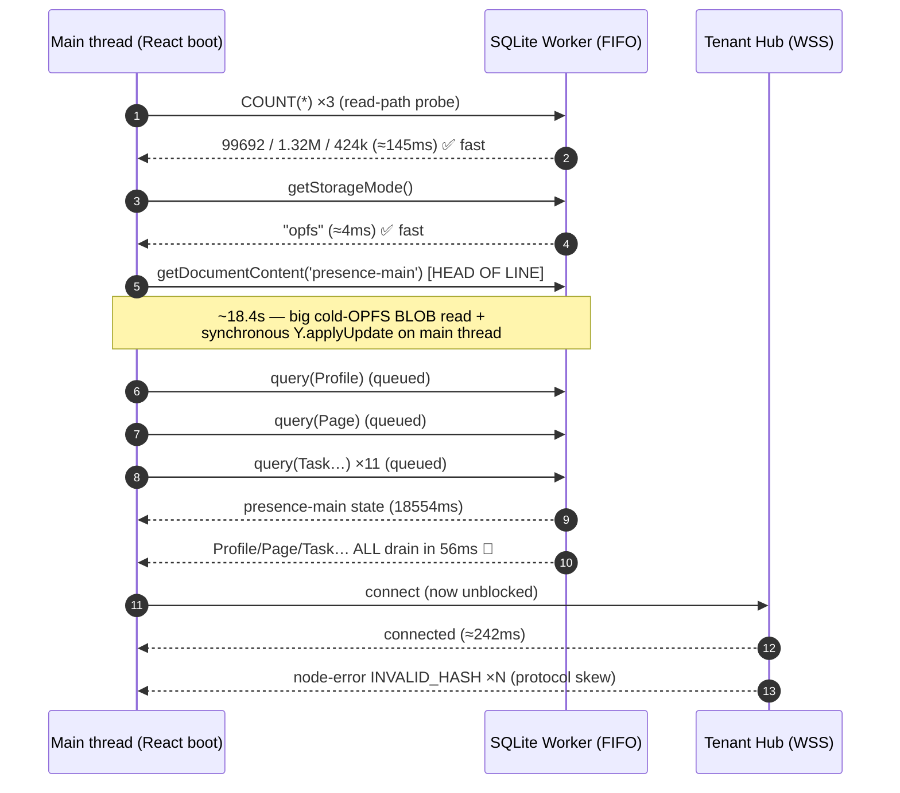
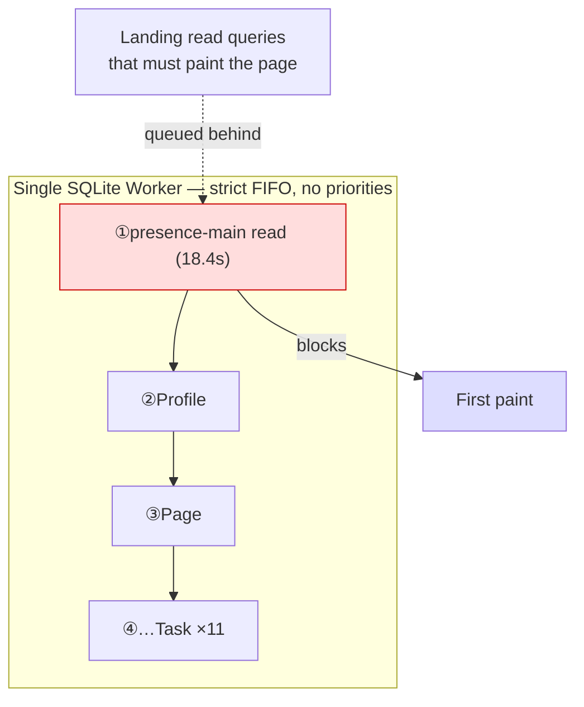
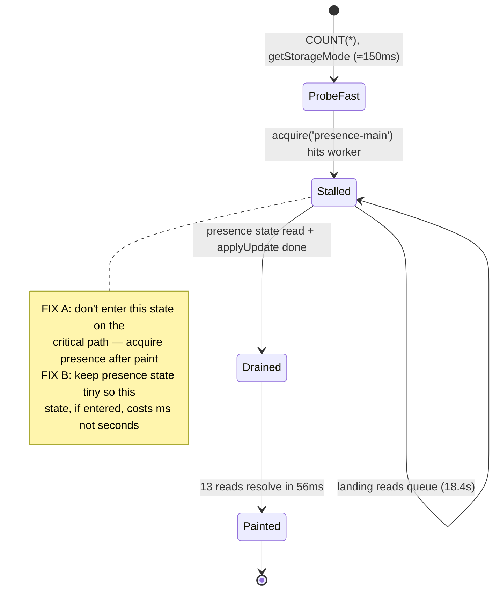

# The 18-Second Blank-Page Boot Stall: Single-Worker Head-of-Line Blocking

## Problem Statement

A returning user with a populated local cache sees a **blank page for ~18–20
seconds** after page load. Then, all at once, the landing queries populate and
the hub connects. The captured logs also show two distinct error floods:

- `[Registry] Failed to persist: SQLITE_CONSTRAINT_FOREIGNKEY … result code 787`
- A burst of `[NodeStoreSync] hub rejected a node change: INVALID_HASH` ending
  in the circuit breaker `Pausing outbound sync after 5 consecutive
  "INVALID_HASH" rejections`.

The user's mental model — *"queries return blank, then the hub connects, then
the queries return something ~20s later"* — is **almost right but causally
inverted**: the hub connection is not what unblocks the queries; both the queries
*and* the connection are gated behind the same 18-second stall. This document
proves the mechanism from the timestamps, locates it in the code, and lays out a
fix.

## Executive Summary

**Root cause (primary): head-of-line blocking on the single SQLite Web Worker.**
The web app routes *every* storage operation — landing read queries *and* Yjs
document I/O — through one Comlink-wrapped SQLite worker
([`packages/sqlite/src/adapters/web-proxy.ts`](../../packages/sqlite/src/adapters/web-proxy.ts)).
That worker is strictly FIFO. At boot, `SyncManager.start()` immediately calls
`acquire('presence-main')`
([`packages/runtime/src/sync/sync-manager.ts:1108`](../../packages/runtime/src/sync/sync-manager.ts)),
which loads the presence Yjs doc via
`NodePool.loadDoc → storage.getDocumentContent()`
([`packages/runtime/src/sync/node-pool.ts:67`](../../packages/runtime/src/sync/node-pool.ts)).
That one operation took **~18.4 s** and **all ~13 landing-query prewarms queued
behind it**. The proof is in the timing (below): every landing query reports
`candidateQueryDurationMs ≈ 18403–18404`, yet they all *resolve within a 56 ms
burst* once the stall clears. If the SQL were genuinely slow they would be
staggered by 18 s each; instead they were *waiting concurrently* on one blocker.
The reported `durationMs` is **queue-wait, not SQL execution** — the SQL is
trivially indexed and fast.

**Why that one op was slow (needs one more measurement to confirm):** the
presence doc is created with `gc: false`
([`node-pool.ts:68`](../../packages/runtime/src/sync/node-pool.ts)) and persisted
on every update, so its `yjs_state` blob accumulates tombstones unboundedly. The
18.4 s is most likely **(a)** a large cold-OPFS BLOB read of that row plus
**(b)** a synchronous `Y.applyUpdate()` of the decoded state on the main thread.
Either sub-cause produces the same symptom; the recommended fix neutralises both
by getting presence/document I/O *off the first-paint critical path*.

**Secondary issue #1 — `INVALID_HASH` flood (cosmetic-but-real):** the deployed
per-tenant hub (`wss://t-user-…run.app`) is on an **incompatible `@xnetjs/sync`
build** (protocol/hash skew — the exact failure mode catalogued in exploration
0224 / PR #253). The client's circuit breaker
([`node-store-sync-provider.ts:96`](../../packages/runtime/src/sync/node-store-sync-provider.ts))
behaves *correctly* — it halts outbound sync after 5 rejects — but **outbound
sync is broken for this tenant until the hub is redeployed**. This does *not*
cause the 18 s delay.

**Secondary issue #2 — Registry FK persist failure:** `registry.save()` throws
`SQLITE_CONSTRAINT_FOREIGNKEY`
([`registry.ts:134`](../../packages/runtime/src/sync/registry.ts)). The tracked-node
row references a `node_id` that violates a foreign key. Low severity (caught and
logged), but it is a real latent bug worth fixing.

**Bonus instrumentation bug:** the boot timeline buckets the entire stall into
the `connect` phase (`{… "connect":18655}`), because `connect` is measured
`store:ready → hub:connected`
([`boot-timeline.ts:121`](../../apps/web/src/lib/boot-timeline.ts)). The actual
WebSocket handshake took ~240 ms; the other ~18.4 s is storage/main-thread
contention mislabelled as network time.

## Current State In The Repository

### The boot sequence that stalls

```
XNetProvider (apps/web)
  └─ SyncManager.start()                         packages/runtime/src/sync/sync-manager.ts
        └─ acquire('presence-main')              sync-manager.ts:1108
              └─ NodePool.acquire()              node-pool.ts:145
                    └─ loadDoc()                 node-pool.ts:67
                          ├─ storage.getDocumentContent('presence-main')   ← SQLite worker round-trip
                          │     SELECT state FROM yjs_state WHERE node_id=? data/.../sqlite-adapter.ts:1077
                          └─ Y.applyUpdate(doc, content)                   ← main-thread, synchronous
```

- **One worker, FIFO.** `WebSQLiteProxy` wraps a single `Worker` with Comlink;
  every `query`/`queryOne`/`run`/`getDocumentContent` is an independent
  `postMessage` round-trip serviced in arrival order. There is **no priority
  queue and no second worker for reads**
  ([`web-proxy.ts`](../../packages/sqlite/src/adapters/web-proxy.ts)). The data
  worker is even handed a `MessagePort` to the *same* worker via
  `createMessagePort()` ([`web-proxy.ts:337`](../../packages/sqlite/src/adapters/web-proxy.ts)),
  so the data bridge and the React store contend on one thread.
- **`gc: false` everywhere.** `loadDoc` creates
  `new Y.Doc({ guid: nodeId, gc: false })`
  ([`node-pool.ts:68`](../../packages/runtime/src/sync/node-pool.ts)); persisted
  state is the full `Y.encodeStateAsUpdate` including tombstones
  ([`node-pool.ts:89`, `:123`](../../packages/runtime/src/sync/node-pool.ts)).
- **The probe already told us the cache is healthy.** The read-path probe
  ([`apps/web/src/lib/read-path-probe.ts`](../../apps/web/src/lib/read-path-probe.ts))
  printed `nodes: 99692, … verdict: "projection populated — local read path
  should paint before sync"`. The data is *there*; this is a timing problem, not
  an empty cache (which is exactly the R1-vs-R2 distinction that probe was built
  to surface, in exploration 0212).
- **A prior author already suspected this.** The comment at
  [`node-store-sync-provider.ts:105-110`](../../packages/runtime/src/sync/node-store-sync-provider.ts)
  explicitly calls out *"contention with reads on the single SQLite worker"* and
  marks it on the boot timeline — but the contention source there is the inbound
  write burst, whereas here it is the **presence-doc acquire on the way up**.

### Where the durations are measured (why they read as "18 s")

`useQueryTimer` ([`read-path-probe.ts:153`](../../apps/web/src/lib/read-path-probe.ts))
captures `t0` on first render and logs `now() - t0` when the query resolves —
i.e. **fire→resolve wall-clock**, which includes any time the request spent
queued. Inside the adapter, `candidateQueryDurationMs` is
`Date.now() - start` wrapped around the worker round-trip
([`sqlite-adapter.ts:919, :1000`](../../packages/data/src/store/sqlite-adapter.ts)),
so it *also* includes queue wait. Neither number is pure SQL CPU time.

## The Timing Proof

Normalising the millisecond timestamps (`t0 = 1782434065384`):

| t+ms | Event | Interpretation |
|---:|---|---|
| 0 | first boot log | — |
| 145 | `read-path probe`: 99 692 nodes / 1.32 M props / 424 018 changes | **worker is fast** (3× `COUNT(*)` returned) |
| 151 | `Acquiring doc for node: presence-main` | head-of-line op dispatched |
| 152 | `getStorageMode() returned: opfs` | **worker still fast** (4 ms round-trip) |
| 152 | `Registry loaded, tracked nodes: 0` | — |
| **18 554** | `Doc acquired from pool, guid: presence-main meta keys: 0` | **stall ends (~18.4 s gap)** |
| 18 611 | `landing query prewarm:pages: 18624ms {rows:16}` | query drains |
| 18 613–18 667 | all other landing queries resolve | **all 13 within a 56 ms burst** |
| 18 555 | `Connecting to signaling server…` | connect only *starts* after the stall |
| 18 797 | `WebSocket connected` | actual WS handshake ≈ **242 ms** |
| 18 803 | `boot timeline … "connect":18655` | the stall is mislabelled as "connect" |
| 19 139 | `INVALID_HASH` flood begins | hub protocol skew (separate issue) |
| 19 141 | circuit breaker trips after 5 rejects | client behaves correctly |

Two facts make the diagnosis airtight:

1. **The worker was demonstrably fast at t+145 and t+152** (three counts on a
   1.3 M-row table, plus `getStorageMode`, all sub-150 ms). So this is **not**
   generic "wasm SQLite is slow on a big DB." Something specific to the *next*
   operation stalled it.
2. **All landing queries finish within 56 ms of each other**, each claiming
   ~18.4 s. Serial 18 s SQL would total ~240 s and stagger the completions.
   Concurrent waiting on one blocker, then a fast drain, is the *only*
   explanation consistent with the data.





## External Research

- **Yjs `gc: false` grows state unboundedly.** With garbage collection disabled,
  deleted content is retained as tombstones; `encodeStateAsUpdate` serialises the
  whole history. The Yjs docs and community guidance recommend periodic
  *snapshot/compaction* (re-encode a fresh doc from `encodeStateAsUpdate`) for
  long-lived documents, precisely because cold-load decoding cost scales with
  accumulated structs, not with live content. A doc with `meta.size === 0` can
  still carry a large encoded state purely from tombstones — consistent with our
  presence doc.
- **OPFS SQLite (`opfs-sahpool` VFS) and large BLOBs.** The wasm SQLite OPFS
  backends read pages through a SyncAccessHandle; a single large BLOB row spans
  many pages and, when cold, pays real I/O latency. Reading + structured-clone /
  transfer of a multi-MB `Uint8Array` across the Comlink boundary is worker CPU
  time that blocks every queued request. This is the canonical reason "one big
  row" can stall an otherwise-fast worker that just answered small `COUNT`s.
- **Comlink / single Web Worker = a serial channel.** Comlink does not
  parallelise; calls are dispatched and resolved in order on one thread. This is
  textbook **head-of-line blocking** — the same pathology HTTP/2 multiplexing and
  priority hints exist to avoid. Mitigations in the wild: a dedicated read
  worker, request prioritisation, or yielding long tasks.
- **Main-thread starvation looks identical to worker starvation.** If the 18.4 s
  is spent in a synchronous `Y.applyUpdate` on the main thread, the worker may
  have *already* answered the landing queries, but their promise callbacks cannot
  run until the main thread frees — producing the same "everything resolves in a
  burst" signature. This is why the fix must address *both* the worker queue and
  the main-thread decode.

## Key Findings

1. **The blank page is gated by `presence-main` document acquisition, not by the
   hub.** First paint cannot happen until the landing reads resolve, and they sit
   behind the presence-doc read on the one worker.
2. **The SQL is innocent.** Every landing query used a covering index
   (`idx_nodes_all_schema_updated`, `idx_prop_scalars_text`) with
   `fullTableScan: false` and tiny result sets (4–39 rows). The 18 s is queue
   wait.
3. **The presence doc is ephemeral but persisted and never GC'd.** It is acquired
   *first* on sync start, with `gc: false`, and written back on every update —
   the worst possible thing to put at the head of the boot critical path.
4. **`INVALID_HASH` is a deployment skew, independent of the stall.** Client-side
   handling is already correct (PR #253). The fix is to redeploy the hub on a
   matching `@xnetjs/sync`.
5. **The Registry FK failure is benign-but-real** and recurs; it should be fixed
   so the warning channel isn't noisy and persistence isn't silently dropped.
6. **Boot instrumentation misattributes the stall to `connect`.** The phase
   accounting needs a storage/contention bucket so the next regression is
   diagnosed in seconds, not by hand.

## Options And Tradeoffs

### A. Take presence/sync-doc acquisition off the first-paint critical path *(primary)*

Defer `acquire('presence-main')` (and any sync-doc warming) until **after** the
landing reads have fired — e.g. `requestIdleCallback`, a `setTimeout(0)` after
first paint, or explicitly ordering `SyncManager.start()` to not touch storage
before the read prewarm. Presence is non-essential for first paint; nothing the
user sees depends on it.

- ✅ Directly removes the head-of-line op; works regardless of *why* it was slow.
- ✅ Small, local change in `XNetProvider` / `SyncManager.start`.
- ⚠️ Presence/awareness appears a beat later (imperceptible; it already updates on
  a 15 s cadence in the logs).

### B. Don't persist (or don't `gc:false`) the ephemeral presence doc *(primary, complementary)*

Presence is transient. Either skip `yjs_state` persistence for presence docs
entirely, or create them with `gc: true`, or compact on load. This bounds the
BLOB so even if it *is* acquired early it can't cost 18 s.

- ✅ Removes the unbounded-growth root cause; benefits every doc, not just boot.
- ⚠️ Need to confirm nothing relies on presence surviving reloads (it shouldn't).
- ⚠️ `gc: true` changes merge semantics for docs with offline edits — safe for
  presence, **not** a blanket change for content docs.

### C. Split the read path onto its own worker / add request priority *(structural)*

Give landing reads a dedicated SQLite connection/worker, or a priority lane, so a
slow document/sync op can never block user-facing reads. (OPFS allows multiple
read connections; writes still serialise.)

- ✅ Systemically immunises first paint from *any* slow background op.
- ⚠️ Larger change; OPFS multi-connection + WAL coordination; more memory.
- ⚠️ Doesn't help if the 18 s is main-thread `applyUpdate` rather than worker SQL.

### D. Chunk / offload the `Y.applyUpdate` and guard blob size *(defensive)*

Decode large doc state off the main thread or in chunks, and log a warning when a
`yjs_state` row exceeds a threshold.

- ✅ Kills the main-thread-starvation sub-cause; adds a regression tripwire.
- ⚠️ Yjs decode isn't trivially chunkable; mostly a guardrail + observability win.

### E. Disambiguating instrumentation *(do first, cheap)*

Before committing to a sub-cause, add three numbers behind the existing
`xnet:boot:debug` flag: time of `getDocumentContent('presence-main')` alone, the
returned **blob byte length**, and the `Y.applyUpdate` duration. One capture
tells us whether it's OPFS read vs main-thread decode — and proves the fix.

| Option | Effort | Removes 18 s | Fixes root cause | Risk |
|---|---|---|---|---|
| A. Defer presence acquire | **S** | ✅ | partial | low |
| B. Bound presence doc (`gc`/no-persist) | **S–M** | ✅ | ✅ | low–med |
| C. Dedicated read worker / priority | **L** | ✅ | structural | med |
| D. Chunk/guard applyUpdate | **M** | maybe | guardrail | low |
| E. Instrument first | **XS** | n/a | diagnostic | none |
| Hub redeploy (INVALID_HASH) | **S** | n/a (separate) | ✅ | low |
| Registry FK fix | **S** | n/a | ✅ | low |

## Recommendation

Ship a layered fix, smallest-blast-radius first:

1. **E (instrument) → A (defer) → B (bound)** for the stall. E is one capture and
   proves the mechanism; A removes the head-of-line op immediately; B removes the
   unbounded-growth root cause so it can't regress. Treat **C** as a follow-up
   exploration if we want first paint structurally immune to background I/O.
2. **Redeploy the tenant hub** on a matching `@xnetjs/sync` build to clear the
   `INVALID_HASH` flood (the client already handles it correctly — this is an
   ops/version action, the exact pattern from exploration 0224 / PR #253).
3. **Fix the Registry FK persist** so `registry.save()` stops throwing 787.
4. **Add a `storage`/contention phase** to the boot timeline so the stall is
   never again hidden inside `connect`.



## Example Code

**E — disambiguating instrumentation** (in `NodePool.loadDoc`,
[`node-pool.ts:67`](../../packages/runtime/src/sync/node-pool.ts)):

```ts
async function loadDoc(nodeId: string): Promise<Y.Doc> {
  const doc = new Y.Doc({ guid: nodeId, gc: false })
  const t0 = performance.now()
  const content = await config.storage.getDocumentContent(nodeId)
  const tRead = performance.now()
  if (content && content.length > 0) {
    Y.applyUpdate(doc, content)
    if (isBootDebugEnabled()) {
      console.info('[xNet] loadDoc', nodeId, {
        bytes: content.length,
        readMs: Math.round(tRead - t0),
        applyMs: Math.round(performance.now() - tRead),
      })
    }
  }
  return doc
}
```

**A — defer presence acquisition off first paint** (in `SyncManager.start()` /
`XNetProvider`):

```ts
// Was: acquire('presence-main') runs synchronously inside start()
// Now: let landing reads fire first, then warm presence when idle.
const warmPresence = () => void this.acquire('presence-main').catch(logErr)
if (typeof requestIdleCallback === 'function') {
  requestIdleCallback(warmPresence, { timeout: 2000 })
} else {
  setTimeout(warmPresence, 0)
}
```

**B — don't persist ephemeral presence state** (in `NodePool`, gate persistence
by a per-doc policy passed from the registry/schema):

```ts
// presence-main is ephemeral: keep it in memory, never write yjs_state.
function isEphemeral(nodeId: string): boolean {
  return nodeId === 'presence-main' || nodeId.startsWith('presence-')
}
function schedulePersist(nodeId: string): void {
  if (isEphemeral(nodeId)) return // ← bounds the BLOB; nothing to cold-load
  /* …existing debounce… */
}
```

## Risks And Open Questions

- **Which sub-cause?** OPFS BLOB read vs main-thread `applyUpdate` — Option E's
  one capture decides it. The recommendation (A+B) fixes both regardless, so this
  doesn't block shipping.
- **Does anything depend on presence surviving reload?** Expected *no* (it's
  republished on a 15 s cadence), but confirm before B.
- **`gc: true` for presence only** — safe because presence has no offline-merge
  semantics; do **not** generalise to content docs.
- **Are other early `acquire()` calls on the critical path?** Audit `useNode`,
  `useDatabaseRow`, `useDatabaseSchema`
  ([`packages/react/src/hooks`](../../packages/react/src/hooks)) for sync-doc
  reads that fire during boot and could re-introduce head-of-line blocking.
- **Hub redeploy ownership** — the `INVALID_HASH` tenant hub is a per-user Cloud
  Run instance; confirm the redeploy path and that it picks up the current
  `@xnetjs/sync` protocol version.
- **Registry FK root cause** — is the FK `tracked_nodes.node_id → nodes.id`?
  Tracking a node before its projection row exists would violate it; the fix may
  be to drop the FK, defer the write, or upsert the node first.

## Implementation Checklist

- [x] **E:** add `[xNet] loadDoc` timing+byte-length log behind `xnet:boot:debug`
      in [`node-pool.ts`](../../packages/runtime/src/sync/node-pool.ts); capture
      one boot to record `readMs` / `applyMs` / `bytes` for `presence-main`.
- [x] **A:** defer `acquire('presence-main')` (and other sync-doc warming) until
      after first paint via `requestIdleCallback`/`setTimeout(0)` in
      `SyncManager.start()` / `XNetProvider`; ensure landing-query prewarm fires
      first.
- [x] **B:** stop persisting (or `gc`-compact) ephemeral presence docs in
      `NodePool` so the `yjs_state` BLOB stays bounded.
- [ ] **Boot timeline:** add a `storage`/`docwarm` phase between `store:ready`
      and `hub:connected` so the stall is attributed correctly
      ([`boot-timeline.ts`](../../apps/web/src/lib/boot-timeline.ts)).
- [ ] **Hub:** redeploy the tenant hub on the current `@xnetjs/sync` to clear the
      `INVALID_HASH` protocol skew (ops action; see exploration 0224 / PR #253).
- [ ] **Registry FK:** fix `registry.save()` 787 — determine the offending FK and
      defer/upsert/drop as appropriate
      ([`registry.ts:134`](../../packages/runtime/src/sync/registry.ts)).
- [ ] *(Follow-up exploration)* **C:** evaluate a dedicated read worker / priority
      lane so background doc I/O can never block user-facing reads.
- [x] Add a guardrail log when any `yjs_state` row exceeds, say, 5 MB.

## Validation Checklist

- [ ] Returning-user cold boot paints landing data in **< 1 s** (was ~18 s);
      `landing query prewarm:*` all report sub-second `…ms`.
- [ ] Boot timeline shows `connect` ≈ a few hundred ms (matching the real WS
      handshake), with the residual time, if any, in the new `storage` phase.
- [ ] `[xNet] loadDoc presence-main` reports a small `bytes` and single-digit
      `readMs`/`applyMs` after fix B.
- [ ] Landing queries no longer share an identical inflated
      `candidateQueryDurationMs`; values reflect true per-query SQL time.
- [ ] No `INVALID_HASH` / circuit-breaker logs after the hub redeploy; an
      outbound local edit lands on the hub and echoes back.
- [ ] No `[Registry] Failed to persist … FOREIGN KEY` warnings across a full boot
      + track cycle.
- [ ] Presence/awareness still works (avatars update) despite deferred/ephemeral
      handling.
- [ ] Repeat on a throttled CPU / loaded machine (the 15 s `open` watchdog in
      [`web-proxy.ts:119`](../../packages/sqlite/src/adapters/web-proxy.ts) must
      not trip).

## References

- Boot path: [`sync-manager.ts:1108`](../../packages/runtime/src/sync/sync-manager.ts) ·
  [`node-pool.ts:67`](../../packages/runtime/src/sync/node-pool.ts) ·
  [`sqlite-adapter.ts:1077`](../../packages/data/src/store/sqlite-adapter.ts)
- Single worker / FIFO: [`web-proxy.ts`](../../packages/sqlite/src/adapters/web-proxy.ts)
  (`createMessagePort` shares one worker with the data bridge; 15 s `open`
  watchdog at `:119`)
- Instrumentation: [`read-path-probe.ts`](../../apps/web/src/lib/read-path-probe.ts) ·
  [`boot-timeline.ts`](../../apps/web/src/lib/boot-timeline.ts) ·
  [`node-store-sync-provider.ts:105`](../../packages/runtime/src/sync/node-store-sync-provider.ts)
- Circuit breaker / hash skew: [`node-store-sync-provider.ts:96`](../../packages/runtime/src/sync/node-store-sync-provider.ts) ·
  exploration `0224` / PR #253 (`INVALID_HASH` = hub/client protocol skew)
- Registry: [`registry.ts:134`](../../packages/runtime/src/sync/registry.ts)
- Prior art in-repo: exploration `0204` (cold-start perf; serial boot) ·
  `0212` (read-path probe & R1–R5 boot matrix) · `0188` (local-first doc load)
- External: Yjs garbage collection & document compaction (`encodeStateAsUpdate`
  snapshotting for `gc:false` docs); wasm SQLite OPFS `opfs-sahpool` VFS I/O
  characteristics; Comlink single-thread call serialisation; head-of-line
  blocking and request prioritisation.
