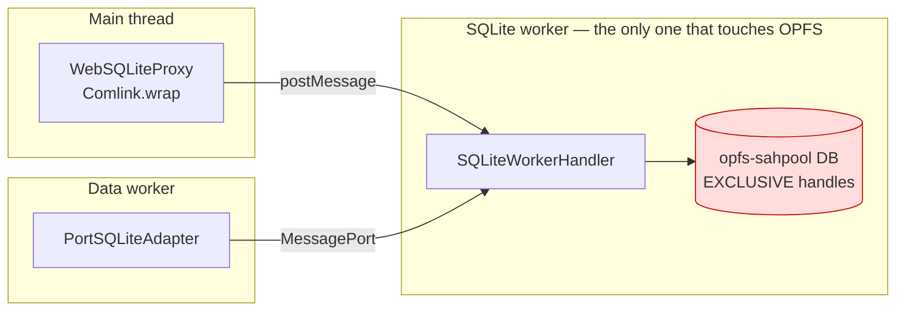
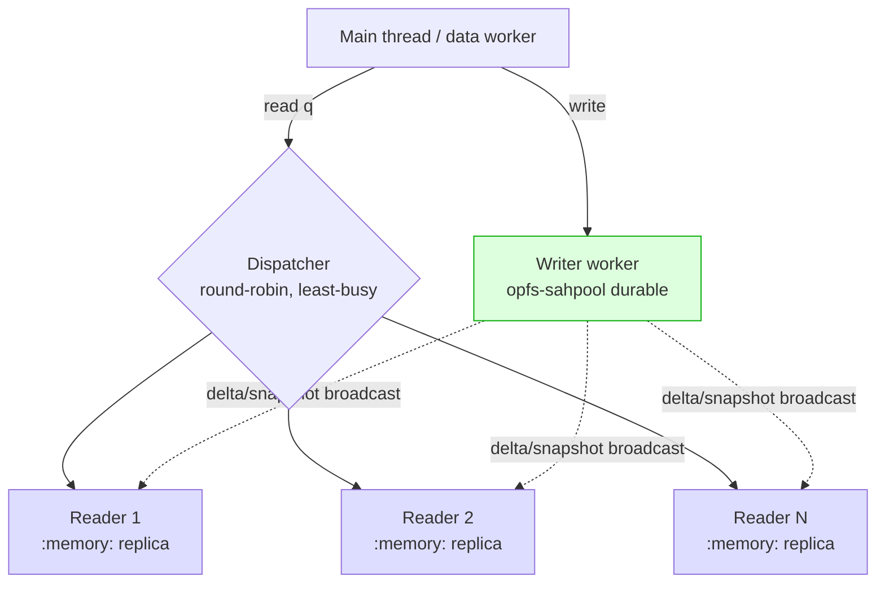
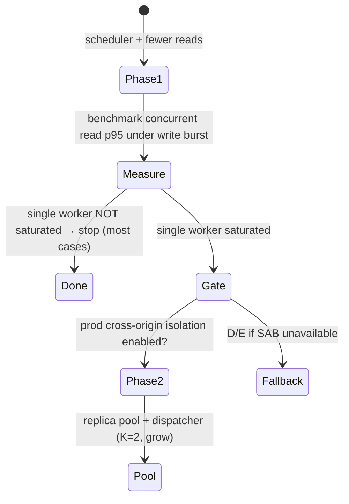

# Parallelizing SQLite Reads: A Worker Pool, A Dispatcher, And The OPFS Exclusivity Wall

## Problem Statement

Exploration [0227](0227_[_]_BOOT_STALL_SQLITE_WORKER_HEAD_OF_LINE_BLOCKING.md)
showed that every storage operation in the web app funnels through **one**
Comlink-wrapped SQLite worker, and that one slow operation head-of-line blocked
every landing read for 18 seconds. The natural follow-up:

> *Can we have multiple workers / parallel workers, or generally parallelize
> reads? Reads especially should be parallelizable — ideally a pool of
> database-reader workers with an intelligent dispatcher that routes each
> Comlink request to whichever worker is free.*

The instinct is sound — SQLite reads are independent and a multi-core machine is
sitting idle. This document checks whether the browser substrate actually allows
it, what a dispatcher would and wouldn't buy us, and what the pragmatic path is.

## Executive Summary

**The idea is right in spirit but blocked by one hard browser constraint:**
the web SQLite adapter uses the **`opfs-sahpool`** VFS
([`packages/sqlite/src/adapters/web.ts:25`](../../packages/sqlite/src/adapters/web.ts)),
which **acquires an _exclusive_ SyncAccessHandle per database file at install
time**. The repo already knows this the hard way: when a second tab or worker
grabs those handles, the new one can't open the file and **falls back to an
in-memory database** ([`web.ts:154-230`](../../packages/sqlite/src/adapters/web.ts),
[`opfs-retry.ts`](../../packages/sqlite/src/adapters/opfs-retry.ts)). So you
**cannot point N workers at the same OPFS `.db` file** — the second worker is
locked out, not parallelised.

Therefore a dispatcher that "routes Comlink reads to whichever worker is free"
only helps if **each worker can independently serve reads**, which requires one
of:

1. **Read replicas** — each reader worker owns its *own* copy of the data (an
   in-memory mirror, or a separate OPFS file), kept in sync by the writer. This
   is the only path to *true* parallel reads, but it costs memory × N,
   replication lag, and cross-replica invalidation.
2. **A different VFS** (the plain `opfs` VFS instead of `opfs-sahpool`) that
   allows multiple connections — but it **still serialises at the storage-lock
   layer** (no true parallelism), drops Safari 16.4 support, and needs
   cross-origin isolation, which **production does not currently have** (COOP/COEP
   is set *only* in the dev server "for Playwright tests",
   [`apps/web/vite-plugins/coop-coep-headers.ts`](../../apps/web/vite-plugins/coop-coep-headers.ts)).

**And the cost/benefit is lopsided.** WASM SQLite reads are single-threaded but
*fast* — the 0227 stall was **one pathological 18 s operation**, not aggregate
read load. The landing queries themselves were 3–5 ms each. Before paying for a
replica fleet, a **read/write-aware priority scheduler on the existing single
worker** — an interactive lane that can't be starved by a background write burst
— captures the lion's share of the *felt* latency win at a fraction of the cost
and risk.

**Recommendation:** Phase 1 — ship a **scheduler** (priority lanes + write
batching + cooperative yielding) on the one worker. Phase 2 — *only if*
profiling proves the single worker is CPU-saturated by concurrent reads — add a
**read-replica worker pool behind a round-robin Comlink dispatcher**, gated on
turning on production cross-origin isolation. Reject the "N workers, one OPFS
file" design outright; it cannot work.

## Current State In The Repository

### One worker, strictly FIFO



- **The single worker.** [`web-worker.ts`](../../packages/sqlite/src/adapters/web-worker.ts)
  exposes a `SQLiteWorkerHandler` via `Comlink.expose`. Every `query` /
  `queryOne` / `run` is a `postMessage` round-trip serviced in arrival order on
  that one thread.
- **Two clients already share it.** The main thread (`WebSQLiteProxy`) *and* the
  data worker both talk to the **same** SQLite worker: `createMessagePort()`
  transfers a second `MessagePort` to it
  ([`web-proxy.ts:337`](../../packages/sqlite/src/adapters/web-proxy.ts),
  `connectPort` at [`web-worker.ts:133`](../../packages/sqlite/src/adapters/web-worker.ts)).
  So we already have *multiple workers in the app* (main, data-bridge worker,
  sqlite worker) — but storage is a single thread, and adding more clients to it
  changes nothing about throughput.
- **Writes are serialised; reads are not — but it doesn't matter.** The data
  layer funnels every mutation through a `writeQueue`
  ([`sqlite-adapter.ts:392,461`](../../packages/data/src/store/sqlite-adapter.ts));
  reads call `this.db.query(...)` directly
  ([`sqlite-adapter.ts:~918`](../../packages/data/src/store/sqlite-adapter.ts)).
  But concurrent reads still serialise at the *worker thread*, so the
  application-level read concurrency is already effectively 1.

### The exclusivity wall (the crux)

[`web.ts`](../../packages/sqlite/src/adapters/web.ts) opens via
`installOpfsSAHPoolVfs({ name: 'opfs-sahpool', directory: '.xnet-sqlite' })` and
`new poolUtil.OpfsSAHPoolDb(dbPath, 'c')`. Its own comments spell out the
constraint:

> *"This is the recommended VFS for **single-connection** apps. The pool acquires
> an **exclusive** sync access handle per file at install time. On a RELOAD the
> new worker can start before the previous worker releases its handles, so the
> install throws `NoModificationAllowedError`."*

And the in-memory fallback warning is explicit that the *cause* is concurrency:

> *"another xNet tab/worker is holding the local database"* →
> falls back to a non-durable `:memory:` DB.

This is a property of **OPFS itself**: `createSyncAccessHandle()` takes an
exclusive lock on a file. `opfs-sahpool` pre-acquires handles for its whole pool
directory. Two workers cannot both hold them.

### Cross-origin isolation is dev-only

`SharedArrayBuffer` (needed for any SAB-backed replica or the SAB build of the
`opfs` VFS) requires the page to be **cross-origin isolated** (COOP `same-origin`
+ COEP `require-corp`). Those headers are injected **only by the dev-server Vite
plugin** ([`coop-coep-headers.ts`](../../apps/web/vite-plugins/coop-coep-headers.ts),
wired at [`vite.config.ts:53`](../../apps/web/vite.config.ts)) "to enable
SharedArrayBuffer and full OPFS support in Playwright tests." No `_headers` /
host config sets them in production. **Any SAB-based parallelism is gated on an
infra change first.**

### For contrast: native adapters already get concurrency for free

[`electron.ts:59`](../../packages/sqlite/src/adapters/electron.ts) runs
`PRAGMA journal_mode = WAL` on `better-sqlite3` — native WAL gives
readers-don't-block-the-writer and multiple OS-level connections. The web has no
equivalent: `web.ts` sets `foreign_keys`, `busy_timeout=5000`, `page_size=8192`,
but **no WAL**, because sahpool is single-connection and the OPFS VFS doesn't
deliver multi-connection WAL in the browser.

## External Research

- **OPFS SyncAccessHandle is exclusive.** The WHATWG/W3C File System Access spec
  and the SQLite-WASM docs both state a sync access handle holds an exclusive
  lock; `opfs-sahpool` is documented as a **single-connection** VFS optimised for
  one app instance. (This is the substrate-level reason the dispatcher-over-one-
  file idea fails.)
- **The plain `opfs` VFS** (`sqlite3.oo1.OpfsDb`) supports *multiple connections*
  from *multiple dedicated workers* to the same file, but: it requires the
  `SharedArrayBuffer`/`Atomics` build (→ COOP/COEP), needs Safari **17+** (vs
  16.4 for sahpool), and **serialises** concurrent access through Web Locks +
  per-op handle acquire/release — so it trades sahpool's raw speed for
  *correctness under concurrency*, not for parallel throughput. SQLite's own
  concurrency model is **single-writer**; readers can proceed concurrently only
  under WAL, which the OPFS VFS does not provide cross-connection.
- **`absurd-sql` / `wa-sqlite`** pioneered IndexedDB/OPFS-backed SQLite with a
  SharedArrayBuffer + Atomics "block device." Same lesson: one writer owns the
  backing store; concurrency is coordinated, not parallel.
- **Read-replica pattern.** The established way to get *parallel* reads in the
  browser is to **replicate**: a writer worker owns the durable store and ships
  either a full snapshot or a delta stream to N reader workers that each query a
  private (in-memory or SAB-backed) copy. This is how high-end local-first apps
  scale read-heavy analytics off the write path. It is real parallelism but buys
  it with memory and a consistency protocol.
- **Web Locks API + Comlink pools.** Comlink can wrap a *pool* of workers and
  round-robin calls; libraries like `workerpool`/`threads.js` do this generically.
  Useful *only* when each worker has an independent backend — i.e., replicas.
- **The cheap alternative everyone reaches for first: a scheduler.** Browser
  storage libraries (and SQLite-WASM wrappers) commonly add a priority queue so
  interactive reads jump ahead of bulk writes/imports, plus chunked/yielding bulk
  ops, rather than going multi-connection. It removes the *latency* pain (which is
  what users feel) without the *throughput* machinery.

## Key Findings

1. **"N workers on one OPFS file" is impossible** with `opfs-sahpool` —
   exclusive handles, in-memory fallback. Confirmed in our own code + comments.
2. **A dispatcher needs independent read backends.** Routing Comlink reads to a
   pool only parallelises if each worker has its own copy (replica) or its own
   file (shard). Otherwise they all queue at the one storage thread.
3. **The felt problem is latency/fairness, not throughput.** 0227 was one slow
   op; landing reads are millisecond-scale. A single-worker **scheduler** with an
   interactive priority lane solves the *experienced* problem cheaply.
4. **SAB-based designs are blocked in production today** (no COOP/COEP) and would
   also constrain embedding (COEP breaks non-CORP third-party resources).
5. **Materialized views (0226) attack the same problem from the other side** —
   fewer/cheaper reads reduce the need to parallelise at all.
6. **We already run multiple workers**; the bottleneck is specifically the OPFS
   storage thread, so "more workers" must mean "more *backends*," not more proxies.

## Options And Tradeoffs

### A. Priority scheduler on the single worker *(recommended Phase 1)*

Add a small scheduler in front of the worker (or inside it) that classifies each
op as **interactive-read**, **bulk-read**, or **write**, runs an interactive lane
ahead of bulk/write lanes, batches/yields long write bursts, and (optionally)
de-duplicates identical in-flight reads. No new workers, no OPFS changes.

- ✅ Kills head-of-line *latency* (the 0227 class) and keeps interactive reads
  snappy under a write burst.
- ✅ Tiny blast radius; works on every browser; no infra change.
- ✅ Composes with materialized views (0226) and the existing `writeQueue`.
- ⚠️ Not true parallelism — total read *throughput* is still one core.

### B. Read-replica worker pool + dispatcher *(recommended Phase 2, conditional)*

A single **writer** worker owns the durable `opfs-sahpool` DB. K **reader**
workers each hold a private replica (a `:memory:` DB, or a SAB-backed image).
The writer broadcasts committed deltas (or periodic snapshots); a **dispatcher**
round-robins read queries across idle readers via Comlink.



- ✅ **Real parallel reads** across cores — the thing actually asked for.
- ✅ Readers can't block the writer and vice-versa.
- ⚠️ Memory cost ≈ replica size × K (our DB is ~99k nodes / 1.3M props).
- ⚠️ **Consistency**: replicas lag the writer → read-your-writes needs care
  (route a session's reads-after-write to the writer, or block on delta ack).
- ⚠️ **Gated on production cross-origin isolation** for SAB; without it, replicas
  must be hydrated by structured-clone snapshots (heavier, lagier).
- ⚠️ Real engineering: delta protocol, invalidation, dispatcher health/backpressure.

### C. Drop `opfs-sahpool` for the multi-connection `opfs` VFS

Open the same file from a writer + reader workers using `oo1.OpfsDb`.

- ✅ No replication; one source of truth.
- ❌ **Not parallel** — serialises through Web Locks / handle hand-off.
- ❌ Loses Safari 16.4; needs COOP/COEP (prod lacks it); slower per-op than sahpool.
- ❌ High risk for ~no throughput gain. **Reject.**

### D. Shard into multiple DB files *(niche)*

Split storage into a **hot-read** DB (the projection: `nodes`,
`node_property_scalars`, FTS) and a **write-heavy** DB (change log), each its own
file in its own VFS directory → its own SAH → no exclusivity conflict, so a reader
worker can own the hot-read DB while the writer owns the log.

- ✅ Removes write-vs-read contention without full replicas; one extra worker.
- ⚠️ Cross-DB joins/consistency between projection and log; a sync seam.
- ⚠️ Still only *one* reader per shard (one core per shard), not a fan-out.

### E. Snapshot-to-replica on idle *(middle ground)*

A degenerate B: refresh read replicas from a periodic `VACUUM INTO` / serialized
snapshot during idle, accept staleness for analytics-style reads, keep interactive
reads on the writer.

- ✅ Simple; no live delta protocol.
- ⚠️ Stale reads; snapshot cost; not for read-your-writes paths.

### F. Reduce read demand instead *(do this regardless)*

Lean on materialized views (0226), narrower/prepared queries, and result caching
so fewer reads hit storage at all.

| Option | True parallel reads | Effort | Browser support | Infra change | Risk |
|---|---|---|---|---|---|
| A. Single-worker scheduler | ❌ (latency only) | **S** | all | none | low |
| B. Replica pool + dispatcher | ✅ | **L** | needs COOP/COEP | yes | med-high |
| C. Multi-conn `opfs` VFS | ❌ | M | Safari 17+, COOP/COEP | yes | high |
| D. DB sharding | partial | M | all | none | med |
| E. Idle snapshot replicas | ✅ (stale) | M | (SAB optional) | maybe | med |
| F. Cut read demand | n/a | S-M | all | none | low |

## Recommendation

1. **Phase 1 — scheduler (A) + keep cutting read demand (F).** Ship a
   read/write-aware priority scheduler on the single worker: an interactive lane
   that bulk imports and background writes can't starve, request de-duplication,
   and cooperative yielding for long ops. This directly generalises the 0227 fix
   (any slow op stops being able to monopolise interactive reads) and needs no
   new workers, no VFS change, and no headers. Land it with a benchmark.
2. **Phase 2 — replica pool + dispatcher (B), _conditional_.** Only if Phase 1
   benchmarks still show the single worker **CPU-saturated** by genuinely
   concurrent reads (e.g. heavy multi-pane dashboards, search-as-you-type over
   large sets). Prerequisites: (a) turn on **production cross-origin isolation**
   so `SharedArrayBuffer` is available, (b) a delta/snapshot replication protocol
   from the writer, (c) a Comlink **least-busy dispatcher** with read-your-writes
   routing. Start with **K=2** readers and a SAB-backed `:memory:` mirror.
3. **Reject C** (no throughput win, high cost) and treat **D/E** as fallbacks if
   cross-origin isolation can't be enabled in production.



## Example Code

**Phase 1 — a priority scheduler wrapping the worker proxy** (sketch; lives
beside `WebSQLiteProxy` or inside the worker so classification survives the
boundary):

```ts
type Lane = 'interactive' | 'bulkRead' | 'write'

class SqliteScheduler {
  private queues: Record<Lane, Array<() => void>> = {
    interactive: [],
    bulkRead: [],
    write: []
  }
  private running = false
  // interactive drains fully before bulkRead, which drains before write;
  // a write in flight still completes before the next dequeue (no preemption).
  constructor(private proxy: RemoteHandler) {}

  query<T>(sql: string, params?: SQLValue[], lane: Lane = 'interactive'): Promise<T[]> {
    return this.enqueue(lane, () => this.proxy.query<T>(sql, params))
  }
  run(sql: string, params?: SQLValue[]): Promise<RunResult> {
    return this.enqueue('write', () => this.proxy.run(sql, params))
  }

  private enqueue<T>(lane: Lane, op: () => Promise<T>): Promise<T> {
    return new Promise<T>((resolve, reject) => {
      this.queues[lane].push(() => op().then(resolve, reject))
      this.pump()
    })
  }
  private async pump() {
    if (this.running) return
    this.running = true
    try {
      for (;;) {
        const job =
          this.queues.interactive.shift() ??
          this.queues.bulkRead.shift() ??
          this.queues.write.shift()
        if (!job) break
        await job() // one op at a time on the single worker; interactive first
      }
    } finally {
      this.running = false
    }
  }
}
```

**Phase 2 — a least-busy dispatcher over a reader pool** (only meaningful with
*replica* backends; each `reader` is an independent worker, not a proxy to the
one storage thread):

```ts
class ReaderDispatcher {
  private inFlight = new Map<RemoteHandler, number>()
  constructor(private readers: RemoteHandler[]) {
    readers.forEach((r) => this.inFlight.set(r, 0))
  }
  async query<T>(sql: string, params?: SQLValue[]): Promise<T[]> {
    // least-busy pick; ties broken by round-robin
    const reader = [...this.inFlight].sort((a, b) => a[1] - b[1])[0][0]
    this.inFlight.set(reader, this.inFlight.get(reader)! + 1)
    try {
      return await reader.query<T>(sql, params)
    } finally {
      this.inFlight.set(reader, this.inFlight.get(reader)! - 1)
    }
  }
  // Reads-after-write for a session must route to the writer (or await the
  // reader's delta ack ≥ the write's lamport) to preserve read-your-writes.
}
```

## Risks And Open Questions

- **Read-your-writes consistency** across replicas — the hardest part of B. Need a
  per-session "min lamport" the chosen reader must have applied, or route
  post-write reads to the writer for a window.
- **Memory** — K replicas of a 99k-node / 1.3M-property DB. SAB-backed shared image
  vs per-worker copy materially changes the budget.
- **Production cross-origin isolation** — enabling COOP/COEP can break embedding
  of non-CORP third-party assets (analytics, fonts, plugin iframes); audit before
  flipping it. `credentialless` COEP may soften this.
- **Does the scheduler alone suffice?** Likely yes for the vast majority of
  sessions — Phase 2 must be justified by a real saturation benchmark, not a hunch.
- **Invalidation/subscription fan-out** — the data-worker’s live query
  subscriptions ([`data-worker-host.ts`](../../packages/data-bridge/src/worker/data-worker-host.ts))
  would need to consume the same delta stream the replicas do, or re-run against a
  replica, to stay correct.
- **Maintenance** — a replica fleet + delta protocol is a standing complexity cost;
  weigh against simply reducing read volume (0226 materialized views).
- **Safari/iOS** — sahpool is the only broadly-supported fast path; any VFS change
  risks the largest-constraint platform.

## Implementation Checklist

**Phase 1 — scheduler (do now)**

- [ ] Add a benchmark harness: fire N concurrent reads while a write/import burst
      runs; record interactive-read p50/p95 (extend the 0227 boot probe).
- [ ] Implement the lane scheduler (interactive / bulkRead / write) around the
      worker proxy (or inside `SQLiteWorkerHandler`), preserving the existing
      `writeQueue` semantics.
- [ ] Tag callers: landing/interactive reads → `interactive`; seed/import/sync
      apply → `write`/`bulkRead`. Default unknown reads to `interactive`.
- [ ] Add in-flight **read de-duplication** (collapse identical concurrent
      `descriptorHash` reads to one worker round-trip).
- [ ] Cooperatively **yield** inside long bulk ops (chunk `applyNodeBatch`/import)
      so an interactive read can interleave.
- [ ] Surface scheduler depth/lane latencies in the devtools Performance panel.

**Phase 2 — replica pool (conditional; gated on a saturation benchmark)**

- [ ] Enable and verify **production cross-origin isolation** (COOP/COEP), audit
      embedding/CORP fallout; confirm `crossOriginIsolated === true` in prod.
- [ ] Build a writer→reader **delta protocol** (or `VACUUM INTO`/serialized
      snapshot) with per-delta lamport.
- [ ] Stand up a **reader worker** that hydrates a `:memory:` (or SAB-backed)
      replica and applies deltas.
- [ ] Add a **least-busy Comlink dispatcher** with health checks and backpressure.
- [ ] Implement **read-your-writes** routing (min-lamport per session / route to
      writer post-write).
- [ ] Route live-query subscription re-runs through replicas; keep invalidation
      correct.
- [ ] Start at **K=2**; make K adaptive to `navigator.hardwareConcurrency`.

## Validation Checklist

- [ ] **Phase 1:** under a sustained write/import burst, interactive-read p95
      stays < ~16 ms (one frame); no read is starved > N ms.
- [ ] **Phase 1:** the 0227-style scenario (one slow op) no longer delays
      interactive reads — they jump the queue.
- [ ] **Phase 1:** de-duplication measurably cuts worker round-trips on a
      multi-pane / search-as-you-type screen.
- [ ] **Phase 2 (if built):** aggregate read throughput scales ~linearly with K
      readers on a multi-core machine for an embarrassingly-parallel read load.
- [ ] **Phase 2:** read-your-writes holds — a write immediately followed by a read
      never returns stale data.
- [ ] **Phase 2:** memory stays within budget at the chosen K; no replica drifts
      from the writer (checksum/lamport parity check).
- [ ] **Cross-platform:** Safari/iOS still open durable OPFS storage (no silent
      in-memory fallback) with whatever VFS Phase 2 uses.

## References

- VFS + exclusivity: [`web.ts`](../../packages/sqlite/src/adapters/web.ts)
  (`opfs-sahpool`, exclusive handles, in-memory fallback) ·
  [`opfs-retry.ts`](../../packages/sqlite/src/adapters/opfs-retry.ts)
- One worker / two clients: [`web-worker.ts`](../../packages/sqlite/src/adapters/web-worker.ts)
  (`connectPort`) · [`web-proxy.ts:337`](../../packages/sqlite/src/adapters/web-proxy.ts)
  (`createMessagePort`)
- Write serialization / read path: [`sqlite-adapter.ts:392,461`](../../packages/data/src/store/sqlite-adapter.ts)
- Cross-origin isolation (dev-only): [`coop-coep-headers.ts`](../../apps/web/vite-plugins/coop-coep-headers.ts) ·
  [`vite.config.ts`](../../apps/web/vite.config.ts)
- Native WAL contrast: [`electron.ts:59`](../../packages/sqlite/src/adapters/electron.ts)
- Live query subscriptions: [`data-worker-host.ts`](../../packages/data-bridge/src/worker/data-worker-host.ts)
- Related explorations: `0227` (boot stall / head-of-line) · `0226` (materialized
  views — cut read demand) · `0204` (cold-start perf) · `0212` (read-path probe)
- External: `@sqlite.org/sqlite-wasm` OPFS docs (sahpool = single-connection;
  `opfs` VFS multi-connection + COOP/COEP) · OPFS `createSyncAccessHandle`
  exclusive-lock semantics · `absurd-sql` / `wa-sqlite` SAB block-device prior art ·
  Web Locks API · SQLite single-writer/WAL concurrency model.
